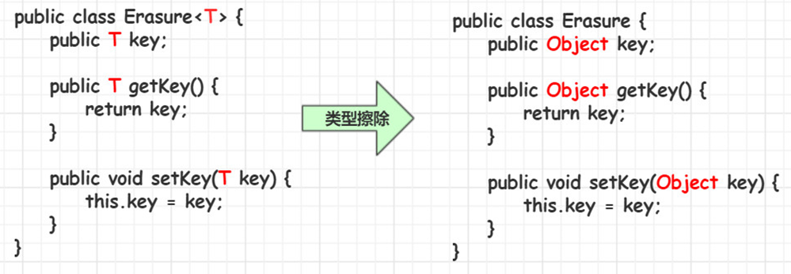
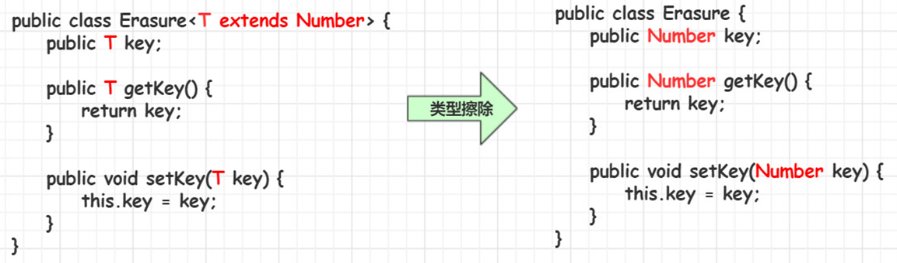
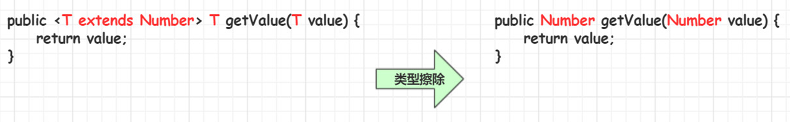
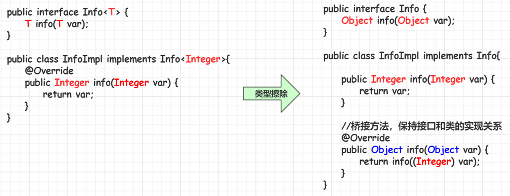

## 1. 泛型(generics)概述

Java 泛型（generics）是 JDK 1.5 中引入的一个新特性，提供了编译时类型安全检测机制，该机制允许程序员在定义类和接口的时候使用类型参数，从而在编译时可检测到非法的类型。声明的类型参数在使用时会用具体的类型来替换。<font color=red>**泛型的本质是参数化类型，也就是说所操作的数据类型被指定为一个参数**</font>。

比如要写一个排序方法，能够对整型数组、字符串数组甚至其他任何类型的数组进行排序，就可以使用 Java 泛型。

### 1.1. 泛型的应用场景

在定义类（方法、接口）的时候不确定类型，在使用类（方法、接口）的时候才确定类型。

### 1.2. 泛型定义的位置

1. 类
2. 方法
3. 接口
4. 参数

### 1.3. 泛型的特点

- 泛型只在<font color=red>**编译阶段**</font>有效。
- <font color=red>**泛型类型必须是引用类型**</font>。

## 2. 泛型变量（标识）

泛型变量可以理解为数据类型的占位符，也可以理解为某种数据类型的变量。

泛型变量的命名规则：只要是合法的标识符即可，一般使用一个大写字母。常用的泛型标识：T、E、K、V

| 泛型标识 | 代表的元素名称 |                    说明                     |
| :-----: | :----------: | ------------------------------------------ |
|    E    |   Element    | 通常用在定义集合的泛型标识，表示在集合中存放的元素 |
|    T    |     Type     | 表示Java类，包括基本的类和自定义的类            |
|    K    |     Key      | 表示键，比如Map集合中的key                    |
|    V    |    Value     | 表示值                                      |
|    N    |    Number    | 表示数值类型                                 |
|    ?    |      \       | 表示不确定的Java类型                          |

## 3. 泛型类

### 3.1. 泛型类的概念

泛型类的声明和非泛型类的声明类似，除了在类名后面添加了类型参数声明部分。泛型类的类型参数声明部分也包含一个或多个类型参数，参数间用英文逗号（`,`）隔开。一个泛型参数，也被称为一个类型变量，是用于指定一个泛型类型名称的标识符。因为他们接受一个或多个参数，这些类被称为参数化的类或参数化的类型。

泛型类的特点：

- 在类定义上使用了泛型变量的类就是泛型类。
- **当创建该类的对象的时候，传入类型，此时类上的泛型被确定。**

### 3.2. 泛型类定义语法

```java
public class 类名<泛型标识1, 泛型标识2, ...> {
    // ...
}
```

语法说明：

1. 泛型标识：可以定义任意的标识号，用于标识指定的泛型的类型
2. 在 `<>` 中的定义的泛型类型数量不限
3. 在 `<>` 中的定义泛型标识，如；`E, T, ...` 能够做为类型在该类内部被使用

### 3.3. 泛型类使用语法

创建泛型类对象时指定泛型变量的具体数据类型

```java
泛型类<具体的数据类型> 对象名 = new 泛型类<具体的数据类型>();
```

在 java 1.7 以后，后面的`<>`中的具体的数据类型可以省略不写

```java
泛型类<具体的数据类型> 对象名 = new 泛型类<>();
```

### 3.4. 使用示例

- 定义泛型类

```java
package com.moon.basic;

/**
 * 泛型类的定义
 *
 * @param <T> 此处 T 可以随便写为任意标识，常见的如 T、E、K、V 等形式的参数常用于表示泛型
 *            在实例化泛型类时，必须指定T的具体类型
 */
public class Generic<T> {

    // 此成员变量的类型为T，T 的类型在创建实例时指定
    private T key;

    // 泛型构造方法形参的类型也为T，T 的类型在创建实例时指定
    public Generic(T key) {
        this.key = key;
    }

    // 泛型方法的返回值类型为 T，T 的类型在创建实例时指定
    public T getKey() {
        return key;
    }

    // 泛型方法的形参类型也为T，T 的类型在创建实例时指定
    public void setKey(T key) {
        this.key = key;
    }
}
```

- 使用泛型类

```java
// 在使用泛型类的时候去确定泛型类形参的数据类型<数据类型>，Java 1.7以后，右边<>的数据类型可以省略
Generic<String> strGen = new Generic<>("abc");
String str = strGen.getKey();
System.out.println(str);

// 泛型的类型参数只能是类类型（包括自定义类），不能是基本数据类型
Generic<Integer> intGen = new Generic<Integer>(123);
int num = intGen.getKey();
System.out.println(num);

// 泛型类如果没有指定数据类型，那么会按 Object 类型来处理
Generic generic = new Generic("abc");
Object key = generic.getKey();
System.out.println(key);
```

### 3.5. 泛型类的注意事项

- <font color=red>**泛型的类型参数只能是引用类型**</font>，不能是基本数据类型
- 泛型类的泛型变量的具体数据类型是在创建对象时确定。
- 如果在创建泛型类对象时没有指定泛型变量的具体数据时，默认是 Object 类型。**(不推荐)**
- 静态方法中不能使用类定义的泛型变量，如果静态中要使用到泛型变量，则需要将该方法定义成泛型方法。不要使用类上使用的泛型变量。(因为静态方法不需要对象就可以调用。)

## 4. 泛型类派生子类

### 4.1. 语法定义

如果定义的类，继承了一个泛型父类，则出现以下几种情况：

1. 子类也是泛型类，则子类和父类的泛型类型要一致

```java
class 子类<T> extends 父类<T>
```

2. 子类不是泛型类，则父类要明确泛型的数据类型

```java
class 子类 extends 父类<数据类型>
```

> Notes: 子类重写父类的方法，需要和父类类型保持一致

### 4.2. 使用示例

- 泛型父类

```java
public class Parent<E> {

    private E value;

    public E getValue() {
        return value;
    }

    public void setValue(E value) {
        this.value = value;
    }
}
```

- 泛型类派生子类情况一：子类也是泛型类，那么子类的泛型标识要和父类一致。

```java
public class ChildFirst<T> extends Parent<T> {
    @Override
    public T getValue() {
        return super.getValue();
    }
}
```

- 泛型类派生子类情况二：如果子类不是泛型类，那么父类要明确数据类型

```java
public class ChildSecond extends Parent<Integer> {
    @Override
    public Integer getValue() {
        return super.getValue();
    }

    @Override
    public void setValue(Integer value) {
        super.setValue(value);
    }
}
```

- 测试

```java
// 子类是泛型类，则需要与父类类型保持一致
ChildFirst<String> childFirst = new ChildFirst<>();
childFirst.setValue("abc");
String value = childFirst.getValue();
System.out.println(value);
System.out.println("---------------------------------");

// 子类非泛型类，将泛型父类需要指定类型
ChildSecond childSecond = new ChildSecond();
childSecond.setValue(100);
Integer value1 = childSecond.getValue();
System.out.println(value1);
```

## 5. 泛型接口

### 5.1. 泛型接口概念

在接口定义上使用了泛型变量的接口

### 5.2. 泛型接口语法

```java
public interface 接口名 <泛型变量> {
    // 接口方法
}
```

### 5.3. 泛型接口实现

1. 实现类不是泛型类，则泛型接口要明确泛型变量的具体数据类型。

```java
public class BaseDao implements Dao<Student>{
}
```

2. 实现类也是泛型类，则实现类和接口的泛型类型要一致。泛型变量具体数据类型在创建该类的对象时指定。**(推荐)**

```java
public class BaseDao<T> implements Dao<T>{
}
```

> Tips: **指定泛型变量时只写接口`<>`处，不指定泛型变量需要类名和接口名两边都写`<>`**

### 5.4. 使用示例

- 泛型接口

```java
public interface GenericInterface<T> {
    T getKey();
}
```

- 实现泛型接口的类情况一：不是泛型类，需要明确实现泛型接口的数据类型。

```java
public class GenericInterfaceImplFirst implements GenericInterface<String> {
    @Override
    public String getKey() {
        return "Hello GenericInterface implement";
    }
}
```

- 实现泛型接口的实现类情况二：是一个泛型类，那么要保证实现接口的泛型类泛型标识包含泛型接口的泛型标识

```java
public class GenericInterfaceImplSecond<T, E> implements GenericInterface<T> {

    private T key;
    private E value;

    public GenericInterfaceImplSecond(T key, E value) {
        this.key = key;
        this.value = value;
    }

    @Override
    public T getKey() {
        return key;
    }

    public E getValue() {
        return value;
    }
}
```

- 测试

```java
// 实现类非泛型类，需要明确实现泛型接口的数据类型。
GenericInterfaceImplFirst genericImpl1 = new GenericInterfaceImplFirst();
System.out.println(genericImpl1.getKey());

System.out.println("---------------------------------");
// 实现类是泛型类，则要保证实现接口的泛型类泛型标识包含泛型接口的泛型标识
GenericInterfaceImplSecond<String, Integer> genericImpl2 = new GenericInterfaceImplSecond<>("count", 100);
System.out.println(genericImpl2.getKey() + "=" + genericImpl2.getValue());
```

## 6. 泛型方法

### 6.1. 泛型方法的概念

泛型方法，是在调用方法的时候指明泛型的具体类型。<font color=red>**在方法的修改符与返回值之间是否存在 `<>` 标识，是判断泛型方法的唯一依据。**</font>

### 6.2. 泛型方法定义

#### 6.2.1. 语法格式

```java
修饰符 <泛型变量> 返回值类型 方法名(参数列表) {
    // 方法上的泛型定义在返回值的前面
}
```

- 修饰符与返回值中间的泛型标识`<泛型变量>`非常重要，可以理解成以此为标识，声明此方法为泛型方法。
- 只有声明了的方法才是泛型方法，泛型类中的**使用了泛型的成员方法并不是泛型方法**。
- `<泛型变量>` 表明该方法将使用泛型类型，此时才可以在方法中使用泛型类型。
- 与泛型类的定义一样，此处`<泛型变量>`可以定义任意标识，常见的如 T、E、K、V 等形式的参数常用于表示泛型。

#### 6.2.2. 定义示例

```java
public <T> T 方法名(T 参数变量名) {
    // 方法上的泛型定义在返回值的前面
}

public <T> void 方法名(T 参数变量名) {
    // 返回值也可以是void
}

public static <T,E,K> void printType(T t, E e, K k) {
    // 静态的泛型方法，采用多个泛型类型
}
```

### 6.3. 泛型使用格式

**调用方法时，由参数类型确定泛型的类型**

```java
// 例1：API中的ArrayList集合中的方法：
public <T> T[] toArray(T[] a){  }
// 该方法，用来把集合元素存储到指定数据类型的数组中，返回已存储集合元素的数组

// 例2：
ArrayList<String> list = new ArrayList<String>();
String[] arr = new String[100];
String[] result = list.toArray(arr);
// 此时，变量T的值就是String类型。变量T，可以与定义集合的泛型不同
public <String> String[] toArray(String[] a){  }

// 例3：
ArrayList<String> list = new ArrayList<String>();
Integer[] arr = new Integer[100];
Integer[] result = list.toArray(arr);
// 此时，变量T的值就是Integer类型。变量T，可以与定义集合的泛型不同
public <Integer> Integer[] toArray(Integer[] a){  }
```

### 6.4. 泛型方法须知

- 泛型方法上泛型变量的具体数据类型是什么，取决于方法调用时传入的参数。
- 泛型变量具体数据类型**不能是基本数据类型**，如果要使用基本数据类型，要**使用对应的包装类类型**

```java
import java.util.Arrays;

public class Test2_04 {
    public static void main(String[] args) {
        // 定义一个数组
        String[] arr = { "a", "b", "c", "d", "e", "A", "B", "C", "D", "E" };
        // 泛型方法必须放基本数据类型对应的包装类型，否则报错。
        Integer[] arrInt = { 1, 2, 3, 4, 5, 6, 7, 8, 9, 0, 11, 12 };
        // 调用方法测试String数组
        swap(arr, 0, 9);
        // 调用方法测试Integer数组
        swap(arrInt, 0, 9);
        // 如果传入错误的索引就输出错误信息
        swap(arr, 0, 19);
    }
    public static <E> void swap(E[] arr, int i, int j) {
        if ((i >= 0 && i < arr.length) && (j >= 0 && j < arr.length)) {
            E temp = arr[i];
            arr[i] = arr[j];
            arr[j] = temp;
            System.out.println(Arrays.toString(arr));
        } else {
            System.out.println("你输入的索引错误！");
        }
    }
}
```

### 6.5. 泛型方法与泛型类的成员方法

泛型类中可以定义泛型方法

```java
public class GenericMethod<T> {

    private T key;

    // 此方法非泛型方法，这是一个普通方法，它的数据类型遵从泛型类的类型
    public T getKey() {
        return key;
    }

    // 此方法是泛型方法，不会依赖父类的泛型类型，即使以 <T> 作为泛型变量，也与泛型类无关
    public <E> void show(E[] e) {
        for (int i = 0; i < e.length; i++) {
            System.out.println(e[i]);
        }
    }
}
```

在泛型类中，`public T getKey()` 是采用泛型类类型的普通方法，不是泛型方法，并且不支持 static；`public <E> void show(E[] e)` 是泛型方法，也可以定义为静态的

### 6.6. 泛型方法与可变参数

在泛型方法中，可以使用泛型的可变参数。

```java
public <E> void print(E... e) {
    for (E e1 : e) {
        System.out.println(e);
    }
}
```

## 7. 泛型通配符 ?

### 7.1. 概述

**泛型通配符**：代表可以匹配任意类型，一般用来表示泛型的上下限。具有以下特点：

- 可以直接使用，不用定义。
- 不能使用泛型类、泛型方法和泛型接口定义上。
- 一般不会单独使用，一般会结合泛型上下限使用。

> Notes: 类型通配符一般是使用 `?` 代替具体的类型实参。所以类型通配符 `?` 是类型实参，而不是类型形参。

- **定义方式**：参考 ArrayList 类的构造方法，无法在类中使用
- **使用方式**：调用方法时可以给予任意类型。参照 Arraylist 的构造方法

### 7.2. 泛型的上限

语法：

```java
类/接口<? extends 形参类型>
```

如 `<? extends E>`，代表传递 E 类型或 E 的子类，即该通配符所代表的类型是 E 类型的子类。**还有一种特殊的形式，可以指定其不仅要是指定类型的子类，而且还要实现某些接口**。

例如：`List<? extends A>` 表明这是 A 某个具体子类的 List，保存的对象必须是 A 或 A 的子类。对于 `List<? extends A>` 列表，由于只知道父类但无法得知使用哪个子类，因此不能添加 A 或 A 的子类对象，只能获取 A 的对象。

示例代码：

```java
public class GenericityUpTest {

    // 泛型类基础使用测试
    @Test
    public void test01() {
        List<Animal> animals = new ArrayList<>();
        List<Cat> cats = new ArrayList<>();
        List<MiniCat> miniCats = new ArrayList<>();

        cats.addAll(cats);
        cats.addAll(miniCats);
        // showAnimal(animals); // 报错
        showAnimal(cats);
        showAnimal(miniCats);
    }

    /**
     * 泛型上限通配符，调用该方法时，传递的集合类型只能是Cat或Cat的子类类型。
     */
    public void showAnimal(List<? extends Cat> list) {
        // 这里泛型形参集合不能添加元素。
        // 因为 <? extends Cat> 表示未知的子类，程序无法确定这个类型是什么，所以无法将任何对象添加到集合中
        // list.add(new Animal()); // 报错
        // list.add(new Cat()); // 报错
        // list.add(new MiniCat()); // 报错
        // 因此，这种指定通配符上限的集合，只能从集合中读取元素（取出的元素总是上限类型），不能向集合中添加元素。
        for (int i = 0; i < list.size(); i++) {
            Cat cat = list.get(i);
            System.out.println(cat);
        }
    }
}
```

### 7.3. 泛型的下限

语法：

```java
类/接口<? super 形参类型>
```

如 `<? super E>`，可以传递 E 类型或 E 的父类，即该通配符所代表的类型是 E 类型的父类。

例如：`List<? super A>` 表明这是 A 某个具体父类的 List，保存的对象必须是 A 或 A 的超类。对于 `List<? super A>` 列表，由于编译器已知集合元素是下限类型，因此能够添加 A 或 A 的子类对象；而具体是那种父类型不能确定，所以获取内容时只能通过 Object 类型来接收。

示例代码：

```java
public class GenericityDownTest {

    // 泛型类基础使用测试
    @Test
    public void test01() {
        List<Animal> animals = new ArrayList<>();
        List<Cat> cats = new ArrayList<>();
        List<MiniCat> miniCats = new ArrayList<>();

        showAnimal(animals);
        showAnimal(cats);
        // showAnimal(miniCats); // 报错
    }

    /**
     * 泛型下限通配符，调用该方法时，要求集合只能是Cat或Cat的父类类型
     */
    public void showAnimal(List<? super Cat> list) {
        // 对于指定下限的泛型集合来说，编译器只知道集合元素是下限的父类型，但具体是那种父类型不确定。因此，这种泛型集合能向其中添加元素
        list.add(new Cat("小白", 3));
        list.add(new MiniCat("小黑", 2, 1));
        // 而指定泛型下限的集合元素，循环读取的内容只能通过 Object 类型来接收
        for (Object o : list) {
            System.out.println(o);
        }
    }
}
```

### 7.4. PECS（Producer Extends Consumer Super）原则

- 作为生产者提供数据（往外读取）时，适合用上界通配符（extends）
- 作为消费者消费数据（往里写入）时，适合用下界通配符（super）

> Notes: 在日常编码中，比较常用的是上界通配符（extends），用于限定泛型类型的父类。

## 8. 类型擦除

### 8.1. 概念

**Java 中的泛型基本上都是在编译器这个层次来实现的。在生成的 Java 字节代码中是不包含泛型中的类型信息的**。使用泛型的时候加上的类型参数，会被编译器在编译的时候去掉。这个过程就称为**类型擦除**。

如在代码中定义的 `List<Object>` 和 `List<String>` 等类型，在编译之后都会变成 List。JVM 看到的只是 List，而由泛型附加的类型信息对 JVM 来说是不可见的。类型擦除的基本过程也比较简单，首先是找到用来替换类型参数的具体类，这个具体类一般是 Object，如果指定了类型参数的上界的话，则使用这个上界的类型，最后把代码中的类型参数都替换成具体的类。

### 8.2. 无限制类型擦除



### 8.3. 有限制类型擦除



### 8.4. 擦除方法中类型定义的参数



### 8.5. 桥接方法



## 9. 集合中使用泛型-常用案例

### 9.1. 集合中泛型的使用

在创建集合的同时指定集合要存储的对象的数据类型。`集合类<数据类型> 对象名 = new 集合类<数据类型>();`

### 9.2. 集合使用泛型的好处

- 强制只能存储一种数据类型对象，提高程序的安全性
- 将运行时错误转换为编译时错误。(及早发现错误)
- 省去类型强制转换的麻烦。

### 9.3. 集合使用泛型的注意事项

- 在指定泛型变量时，要么指定左边，要么两边都指定，但两边指定的类型一定要一致。
- 泛型中没有多态的概念，要么两边一致，要么指定左边(JDK1.7后可以不指定右边)
- 强烈推荐两边都指定，并且数据类型要一致。

## 10. 泛型的总结

1. 泛型用来灵活地将数据类型应用到不同的类、方法、接口当中。将数据类型作为参数传递。
2. 泛型是数据类型的一部分，将类名与泛型合并一起看做数据类型

```java
ArrayList<String> array = new ArrayList<String>();
// ArrayList<String> 看作数据类型
```

3. 泛型的定义：定义泛型可以在类中预支地使用未知的类型。
4. 泛型的使用：一般在创建对象时，将未知的类型确定具体的类型。当没有指定泛型时，默认类型为 Object 类型。

```java
ArrayList array = new ArrayList();
array.add("abc");
array.add(1);
// 由于在定义集合时没有指定泛型，add()方法的形参为 Object 类型，所以可以往集合中添加任意任意类型的数据(多态特点)。
```

5. 可以声明带泛型的数组，但不能直接创建带泛型的数组，必须强制转型

```java
ArrayList[] list = new ArrayList[5];
// 可以声明带泛型的数组，但能直接创建其对象
// ArrayList<String>[] listArr = new ArrayList<String>[5]; // 报错
// 但可以创建数组，强制类型
ArrayList<String>[] listArr = new ArrayList[5];
```

6. 可以通过 `java.lang.reflect.Array` 的静态方法 `newInstance(Class<T>，int)` 创建 T 类型的数组，但需要强制转型

```java
public class Fruit<T> {
    private T[] array;

    public Fruit(Class<T> clz, int length){
        // 通过Array.newInstance创建泛型数组
        array = (T[])Array.newInstance(clz, length);
    }

    /**
     * 填充数组
     */
    public void put(int index, T item) {
        array[index] = item;
    }

    /**
     * 获取数组元素
     */
    public T get(int index) {
        return array[index];
    }

    public T[] getArray() {
        return array;
    }
}
```
