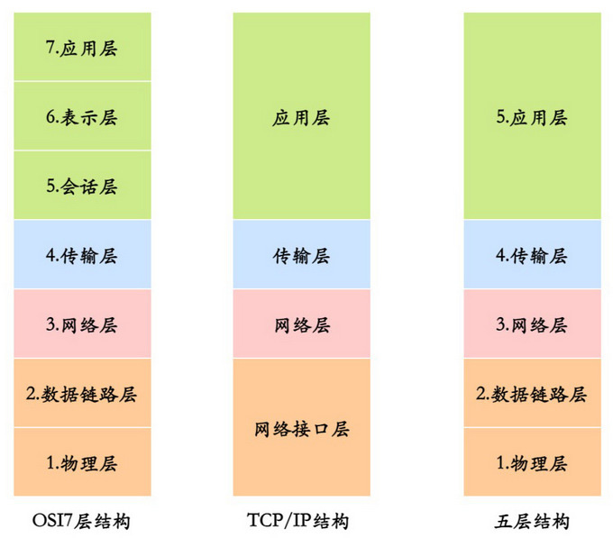
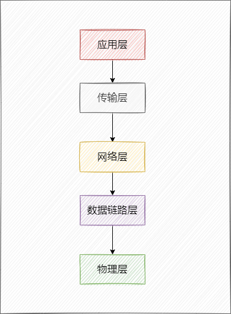
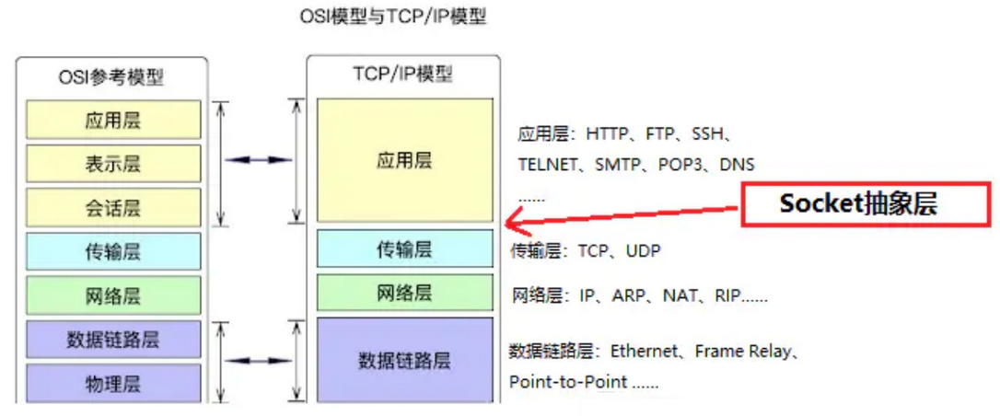
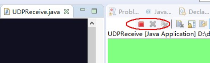
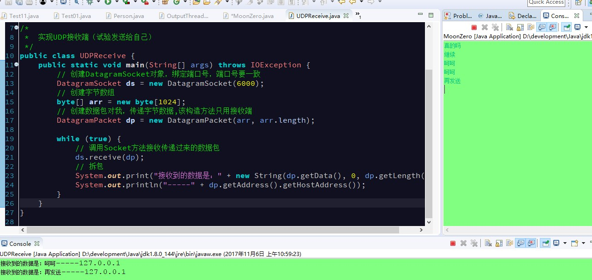

## 1. 网络编程概述

在计算机领域中，网络是信息传输、接收、共享的虚拟平台，将各个点、面、体的信息联系到一起，从而实现这些资源的共享。网络编程的作用：解决计算机与计算机数据传输的问题。

网络体系大致分为三种：**OSI七层模型**、**TCP/IP四层模型**和**五层模型**。

> Tips: 一般面试的时候考察比较多的是五层模型。

### 1.1. 网络通讯三要素

网络通讯三要素：IP、端口、协议。

<font color=red>**网络通讯三要素小结：通过IP找主机，通过端口找程序，通过协议确定如何传输数据。**</font>

### 1.2. IP 协议

#### 1.2.1. 概述

IP 协议（Internet Protocol）又被称为互联网协议，是支持网间互联的数据包协议，工作在**网际层**，主要目的就是为了提高网络的可扩展性。

通过**网际协议 IP**，可以把参与互联的，性能各异的网络**看作一个统一的网络**。


#### 1.2.2. IP 协议的作用

- **寻址和路由**：在 IP 数据报中携带源 IP 地址和目的 IP 地址来表示该数据包的源主机和目标主机。IP 数据报在传输过程中，每个中间节点（IP 网关、路由器）只根据网络地址来进行转发，如果中间节点是路由器，则路由器会根据路由表选择合适的路径。IP 协议根据路由选择协议提供的路由信息对 IP 数据报进行转发，直至目标主机。
- **分段和重组**：IP 数据报在传输过程中可能会经过不同的网络，在不同的网络中数据报的最大长度限制是不同的，IP 协议通过给每个 IP 数据报分配一个标识符以及分段与组装的相关信息，使得数据报在不同的网络中能够被传输，被分段后的 IP 数据报可以独立地在网络中进行转发，在达到目标主机后由目标主机完成重组工作，恢复出原来的 IP 数据报。

#### 1.2.3. IP 地址定义

IP 是每台电脑在互联网上的**唯一标识符**。一般可以理解为，`IP 地址 = {<网络号>，<主机号>}`。

- **网络号**：标志主机所连接的网络地址表示属于互联网的哪一个网络。
- **主机号**：标志主机地址表示其属于该网络中的哪一台主机。

IP 地址分为 A，B，C，D，E 五大类：

- A 类地址 (1~126)：以 0 开头，网络号占前 8 位，主机号占后面 24 位。
- B 类地址 (128~191)：以 10 开头，网络号占前 16 位，主机号占后面 16 位。
- C 类地址 (192~223)：以 110 开头，网络号占前 24 位，主机号占后面 8 位。
- D 类地址 (224~239)：以 1110 开头，保留为多播地址。
- E 类地址 (240~255)：以 1111 开头，保留位为将来使用


> Notes: 
>
> - **`127.0.0.1` 为本地主机地址(本地回环地址)**，与 localhost 类似，均代表本机地址
> - `xxx.xxx.xxx.255` 广播地址，即该网段下所有用户均可以被通知到

#### 1.2.4. 域名和 IP 的关系

- IP 地址在同一个网络中是惟一的，用来标识每一个网络上的设备。
- 域名在同一个网络中也是惟一的。

一个域名可以对应多个 IP，但这种情况 DNS 做负载均衡的，在用户访问过程中，一个域名只能对应一个 IP。而一个 IP 却可以对应多个域名，是一对多的关系。

#### 1.2.5. IPV4 与 IPv6 地址

IPV4 的地址是由四段 0—255 的数字组成：`192.168.0.100`，每一段的取值范围由8位二进制数据组成。IP 能标记 2<sup>32</sup> 个地址，但是全球的网络设备数量已经远远超过这个数字，所以要通过以下方案来解决 IPV4 地址不够用的问题：

- DHCP：动态主机配置协议，动态分配 IP 地址，只给接入网络的设备分配 IP 地址，因此同一个 MAC 地址的设备，每次接入互联网时，得到的 IP 地址不一定是相同的，该协议使得空闲的 IP 地址可以得到充分利用。
- CIDR：无类别域间路由。CIDR 消除了传统的 A 类、B 类、C 类地址以及划分子网的概念，因而更加有效地分配 IPv4 的地址空间，但无法从根本上解决地址耗尽的问题。
- NAT：网络地址转换协议，我们知道属于不同局域网的主机可以使用相同的 IP 地址，从而一定程度上缓解了 IP 资源枯竭的问题，然而主机在局域网中使用的 IP 地址是不能在公网中使用的，当局域网主机想要与公网主机进行通信时，NAT 方法可以将该主机 IP 地址转换为全球 IP 地址。该协议能够有效解决 IP 地址不足的问题。
- IPv6：作为接替 IPv4 的下一代互联网协议，其使用 16 个字节表示 IP 地址，它所拥有的地址容量约是 IPv4 的 8×10<sup>28</sup>倍，即达到 2<sup>128</sup>。而这个数量级，即使给地球上每一粒沙子都分配一个 IP 地址也够用，该协议能够从根本上解决 IPv4 地址不够用的问题。

#### 1.2.6. 操作系统中 IP 相关的命令

例如在 windows 系统中，可以通过以下命令来获取 ip 与网络相关内容：

```bash
ipconfig
```

- 用于DOS获取计算机IP设置

```bash
ping ip地址
```

- 用于判断两台计算机连接是否通畅

### 1.3. 端口号

**端口号**是一个十进制整数，是**进程的唯一标识**。在计算机中，不同的应用程序是通过端口号区分的。通过IP地址可以连接到指定计算机，但如果想访问目标计算机中的某个应用程序，还需要指定端口号。

端口号是用两个字节（16位的二进制数）表示的，它的取值范围是**0~65535**。其中，**0~1023之间的端口号是系统保留使用的**，开发人员需要使用 1024 以上的端口号，从而避免端口号被另外一个应用或服务所占用。

### 1.4. 通讯协议

**通讯协议的作用**：确定数据如何传输。TCP/IP 协议中的四层分别是应用层、传输层、网络层和链路层，每层分别负责不同的通信功能：

- **链路层**：链路层是用于定义物理传输通道，通常是对某些网络连接设备的驱动协议，例如针对光纤、网线提供的驱动。
- **网络层**：网络层是整个 TCP/IP 协议的核心，它主要用于将传输的数据进行分组，将分组数据发送到目标计算机或者网络。
- **传输层**：主要使网络程序进行通信，在进行网络通信时，可以采用 TCP 协议，也可以采用 UDP 协议。
- **应用层**：主要负责应用程序的协议，例如 HTTP 协议、FTP 协议等。

### 1.5. 计算机网络体系结构

计算机网络体系结构，一般有三种：OSI 七层模型、TCP/IP 四层模型、五层结构。



OSI 是一个理论上的网络通信模型，TCP/IP 是实际上的网络通信模型，五层结构就是为了介绍网络原理而折中的网络通信模型。

#### 1.5.1. OSI 七层网络模型

OSI（Open System Interconnect），即开放式系统互联。一般都叫 OSI 参考模型，是 ISO（国际标准化组织）组织制定的一个用于计算机或通信系统间互联的标准体系。ISO 为了更好的使网络应用更为普及，推出了 OSI 参考模型，这样所有的公司都按照统一的标准来指定自己的网络，就可以互通互联了。


网络的七层模型**从上到下**主要包括：

1. **应用层**：主要是一些基于网络构建的终端应用，通过应用进程之间的交互来完成特定网络应用，应用层协议定义的是应用进程间通信和交互的规则。例如：FTP（各种文件上传下载服务）、WEB（网页浏览）、Telnet 服务、HTTP 服务、DNS 服务、SNMP 邮件服务、QQ、DNS 等等。*可以理解成电脑系统中需要网络的软件都是终端应用*。
2. **表示层**：主要是进行对接收的数据进行解释、加密与解密、压缩与解压缩等，也就是把计算机能够识别的内容转换成人能够能识别的内容（如图片、声音等）。确保一个系统的应用层所发送的信息可以被另一个系统的应用层读取。
3. **会话层**：通过传输层（端口号：传输端口与接收端口）建立数据传输的连接和管理会话，主要是在系统之间发起会话或者接受会话请求，具体包括登录验证、断点续传、数据粘包与分包等。设备之间需要互相识别，依据的可以是 IP、MAC 或者主机名。
4. **传输层**：定义了一些传输数据的协议和端口号（WWW 端口 80 等），主要是将从下层接收的数据进行**分段**、**传输**，到达目的地址后再进行**重组**。常把这一层数据叫做**段**。在这一层工作的协议有 TCP 和 UDP：
    - TCP（传输控制协议）：传输效率低，可靠性强，用于传输可靠性要求高，数据量大的数据。比如支付宝转账使用的就是 TCP。
    - UDP（用户数据报协议）：与 TCP 特性恰恰相反，用于传输可靠性要求不高，数据量小的数据，如 QQ 聊天数据、抖音等视频服务就使用了 UDP。
5. **网络层**：主要将从下层接收到的数据进行 IP 地址（例 192.168.0.1)的封装与解析。常把这一层的数据叫做**数据包**，在这一层工作的设备是路由器、交换机、防火墙等。
6. **数据链路层**：主要将从物理层接收的数据进行 MAC 地址（网卡的地址）的封装与解析，在物理层提供比特流服务的基础上，建立相邻结点之间的数据链路。常把这一层的数据叫做**帧**。在这一层工作的设备是网卡、网桥、交换机，数据通过交换机来传输。
7. **物理层**：主要定义物理设备标准，如网线的接口类型、光纤的接口类型、各种传输介质的传输速率等。它的主要作用是**传输比特流**（就是由 1、0 转化为电流强弱来进行传输，到达目的地后在转化为1、0，也就是常说的模数转换与数模转换）。这一层的数据叫做**比特**。

#### 1.5.2. TCP/IP 四层网络模型

TCP/IP 是指因特网的整个 TCP/IP 协议簇。从协议分层模型方面来讲，TCP/IP 由 4 个层次组成：


TCP/IP 中网络接口层、网络层、传输层和应用层的具体工作职责：

- 网络接口层（Network Access Layer）：定义了主机间网络连通的协议，具体包括 Echernet、FDDI、ATM 等通信协议。（对应 OSI 参考模型的数据链路层、物理层）
- 网络层（Internet Layer）：主要用于数据的传输、路由及地址的解析，以保障主机可以把数据发送给任何网络上的目标。数据经过网络传输，发送的顺序和到达的顺序可能发生变化。在网络层使用 IP（Internet Protocol）和地址解析协议（ARP）。（对应 OSI 参考模型的网络层）
- 传输层（Transport Layer）：使源端和目的端机器上的对等实体可以基于会话相互通信，保证数据包的顺序传送及数据的完整性。在这一层定义了两个端到端的协议 TCP 和 UDP。（对应 OSI 参考模型的传输层）
    - TCP 是面向连接的协议，提供可靠的报文传输和对上层应用的连接服务，除了基本的数据传输，它还有可靠性保证、流量控制、多路复用、优先权和安全性控制等功能。
    - UDP 是面向无连接的不可靠传输的协议，主要用于不需要 TCP 的排序和流量控制等功能的应用程序。
- 应用层（Application Layer）：负责具体应用层协议的定义（对应 OSI 参考模型的应用层、表示层、会话层）。包括以下协议：
    - Telnet（TELecommunications NETwork，虚拟终端协议）
    - FTP（File Transfer Protocol，文件传输协议）
    - SMTP（Simple Mail Transfer Protocol，电子邮件传输协议）
    - DNS（Domain Name Service，域名服务）
    - NNTP（Net News Transfer Protocol，网上新闻传输协议）
    - HTTP（HyperText Transfer Protocol，超文本传输协议）

#### 1.5.3. 五层模型

五层模型结构



- **应用层**：为应用程序提供交互服务。在互联网中的应用层协议很多，如域名系统 DNS、HTTP 协议、SMTP 协议等。（对应于 OSI 参考模型的应用层、表示层、会话层）
- **传输层**：负责向两台主机进程之间的通信提供数据传输服务。传输层的协议主要有传输控制协议 TCP 和用户数据协议 UDP。（对应 OSI 参考模型的的传输层）
- **网络层**：选择合适的路由和交换结点，确保数据及时传送。主要包括 IP 协议。（对应 OSI 参考模型的的网络层）
- **数据链路层**：在两个相邻节点之间传送数据时，数据链路层将网络层交下来的 IP 数据报组装成帧，在两个相邻节点间的链路上传送帧。（对应 OSI 参考模型的的数据链路层）
- **物理层**：实现相邻节点间比特流的透明传输，尽可能屏蔽传输介质和物理设备的差异。（对应 OSI 参考模型的的物理层）

#### 1.5.4. 模型每个分层对应的网络协议

总结常见网络协议：


### 1.6. 各层之间的数据传输

对于发送方而言，从上层到下层层层包装，对于接收方而言，从下层到上层，层层解开包装。


- 发送方的应用进程向接收方的应用进程传送数据。
- AP 先将数据交给本主机的应用层，应用层加上本层的控制信息 H5 就变成了下一层的数据单元。
- 传输层收到这个数据单元后，加上本层的控制信息 H4，再交给网络层，成为网络层的数据单元。
- 到了数据链路层，控制信息被分成两部分，分别加到本层数据单元的首部（H2）和尾部（T2）。
- 最后的物理层，进行比特流的传输。

## 2. Socket

### 2.1. Socket 简介

网络上的两个程序通过一个双向的通讯连接实现数据的交换，这个双向链路的一端称为一个 Socket。Socket 通常用来实现客户方和服务方的连接。Socket 连接就是所谓的长连接，客户端和服务器需要互相连接，理论上客户端和服务器端一旦建立起连接将不会主动断掉的，但是有时候网络波动还是有可能的。

Socket 是 TCP/IP 协议的一个十分流行的编程界面，一个 Socket 由一个 IP 地址和一个端口号唯一确定。

但是，Socket 所支持的协议种类也不光 TCP/IP、UDP，因此两者之间是没有必然联系的。在 Java 环境下，Socket 编程主要是指基于 TCP/IP 协议的网络编程。Socket 偏向于底层。一般很少直接使用 Socket 来编程，框架底层使用 Socket 比较多。

### 2.2. Socket 所属网络模型的层级



Socket 是应用层与 TCP/IP 协议族通信的中间软件抽象层，它是一组接口。在设计模式中，Socket 就是一个外观模式，它把复杂的 TCP/IP 协议族隐藏在 Socket 接口后面，对用户来说，一组简单的接口就是全部，让 Socket 去组织数据，以符合指定的协议。

### 2.3. Socket 通讯的过程

- **基于 TCP**：服务器端先初始化 Socket，然后与端口绑定(bind)，对端口进行监听(listen)，调用 accept 阻塞，等待客户端连接。在这时如果有个客户端初始化一个 Socket，然后连接服务器(connect)，如果连接成功，这时客户端与服务器端的连接就建立了。客户端发送数据请求，服务器端接收请求并处理请求，然后把回应数据发送给客户端，客户端读取数据，最后关闭连接，一次交互结束。
- **基于 UDP**：UDP 协议是用户数据报协议的简称，也用于网络数据的传输。虽然 UDP 协议是一种不太可靠的协议，但有时在需要较快地接收数据并且可以忍受较小错误的情况下，UDP 就会表现出更大的优势。客户端只需要发送，不管服务端是否接收成功。

### 2.4. Socket 与 WebSocket 的区别

- Socket 是一套标准，它完成了对 TCP/IP 的高度封装，屏蔽网络细节，以方便开发者更好地进行网络编程。本质等于 IP 地址 + 端口 + 协议；WebSocket 是一个持久化的协议，它是伴随 H5 而出的协议，用来解决 http 不支持持久化连接的问题。
- Socket 一个是**网编编程的标准接口**；而 WebSocket 则是**应用层通信协议**。

## 3. UDP 通信

### 3.1. UDP 协议概述

UDP 是 User Datagram Protocol 的简称，称为用户数据报协议。传输层的两个重要的高级协议之一。是一个**面向无连接的协议**，它提供<u>不可靠</u>的数据传输。

在 UDP 通信中，发送端在发送数据之前不确定接收端是否存在，也不需要与对方建立连接，数据被封装成数据包，直接发送给接收方。UDP 不提供数据校验、确认机制和拥塞控制，因此传输速度较快，但容易发生数据丢失。

在 UDP 协议中，有一个IP地址称为**广播地址**，只要给广播地址发送消息，那么同一个网段的所有用户都可以接收到消息。IP 地址格式：`网络号(前3段)+主机号(最后1段)`。如，`192.168.113.68`
  
> Tips: **如果主机号是255，则该 IP 地址就是广播地址**

#### 3.1.1. UDP 协议的特点

- UDP 的面向无连接的协议，不能保证数据的完整性，但效率高。是不可靠的协议。即在数据传输时，数据的发送端和接收端不建立逻辑连接。不管对方是否能收到数据。对方收到数据之后也不会给一个反馈给发送端。
- 不保证消息交付：不确认，不重传，无超时。
- 不保证交付顺序：不设置包序号，不重排，不会发生队首阻塞。
- 不跟踪连接状态：不必建立连接或重启状态机。
- 不进行拥塞控制：不内置客户端或网络反馈机制。
- 基于数据包来传输：将数据以及源和目的地封装到一个数据包中。
- 发送的数据限制在 64k 以内。

#### 3.1.2. UDP 协议使用场景

UDP 协议适用于实时传输要求较高的应用。

- 即时通讯
- 在线视频
- 网络语音电话

### 3.2. DatagramPacket 类（数据报对象）

#### 3.2.1. 作用

用于在 UDP 通信中封装发送端的数据或接收端的数据。

#### 3.2.2. 构造方法

```java
public DatagramPacket(byte[] buf, int length)
```

- 创建 `DatagramPacket` 对象时，指定了封装数据的字节数组和数据的大小，没有指定 IP 地址和端口号。**<u>只能用于接收端，不能用于发送端</u>**。因为发送端一定要明确指出数据的目的地(ip 地址和端口号)，而接收端不需要明确知道数据的来源，只需要接收到数据即可
    - 参数`buf`：要接收的数据数组
    - 参数`length`：发送数据的长度，单位：字节

```java
public DatagramPacket(byte[] buf, int length, InetAddress address, int port)
```

- 使用该构造方法在创建 `DatagramPacket` 对象时，不仅指定了封装数据的字节数组和数据的大小，还指定了数据包的目标 IP 地址（addr）和端口号（port）。**<u>该对象通常用于发送端</u>**，因为在**发送数据时必须指定接收端的IP地址和端口号**。
    - 参数`buf`：要发送的数据数组
    - 参数`length`：发送数据的长度，单位：字节
    - 参数`address`：接收端的IP地址对象
    - 参数`port`：接收端的端口号

#### 3.2.3. 常用方法

```java
public InetAddress getAddress()
```

- 返回某台机器的 IP 地址

```java
public int getPort()
```

- 返回某台远程主机的端口号

```java
public byte[] getData()
```

- 返回数据缓冲区。

```java
public int getLength()
```

- 返回将要发送或接收到的数据的长度。

### 3.3. DatagramSocket 类（数据发送对象）

#### 3.3.1. 作用

用来负责发送和接收数据包对象。

#### 3.3.2. 构造方法

- `public DatagramSocket() throws SocketException`
    - 该构造方法用于**创建发送端的DatagramSocket对象**，在创建DatagramSocket对象时，**并没有指定端口号**，此时，**系统会分配一个没有被其它网络程序所使用的端口号**。
    - API:构造数据报套接字并将其绑定到本地主机上任何可用的端口。套接字将被绑定到通配符地址，IP 地址由内核来选择。
- `public DatagramSocket(int port) throws SocketException`
    - 该构造方法既可用于**创建接收端的DatagramSocket对象**，又**可以创建发送端的DatagramSocket对象**，在**创建接收端的DatagramSocket对象时，必须要指定一个端口号**，这样就可以监听指定的端口。

#### 3.3.3. 常用方法

```java
public void send(DatagramPacket p) throws IOException
// 从此套接字发送数据报包。

public void receive(DatagramPacket p) throws IOException
// 从此套接字接收数据报包。具有线程阻塞效果，运行后等待接收

public void close()
// 关闭此数据报套接字。
```

### 3.4. UDP 网络程序实现步骤

#### 3.4.1. UDP 发送端的实现步骤

1. 创建DatagramPacket对象，并封装数据

```java
// 指定端口port
public DatagramPacket(byte[] buf, int length, InetAddress address, int port)
```

2. 创建DatagramSocket对象，使用无参构造即可
3. 发送数据，调用send方法发送数据包
4. 释放流资源（关闭DatagramSocket对象）。*注：如果是抛异常只需抛 IOException 即可*

#### 3.4.2. UDP 接收端的实现步骤

1. 创建 `DatagramPacket` 对象。接收数据存储到 `DatagramPacket` 对象中，创建字节数组，接收发来的数据。

```java
public DatagramPacket(byte[] buf, int length)
```

2. 创建 `DatagramSocket` 对象，**绑定端口号，要和发送端端口号一致。**s

```java
public DatagramSocket(int port)
```

3. 调用 `DatagramSocket` 对象 `receive` 方法，接收数据，数据放到数据包中

```java
receive(DatagramPacket dp);
```

4. 拆包，获取 `DatagramPacket` 对象的内容
	- 发送的 IP 地址对象
	- 接收到字节数组内容
	- 接收到的字节个数
	- 发送方的端口号(**不重要，由系统分配的。**)
5. 释放流资源（关闭 `DatagramSocket` 对象）

#### 3.4.3. UDP 发送端与接收端的基础示例

##### 3.4.3.1. UDP 发送端

```java
import java.io.IOException;
import java.net.DatagramPacket;
import java.net.DatagramSocket;
import java.net.InetAddress;

/*
 * 	实现UDP发送端（试验发送给自己）
 */
public class MoonZero {
    public static void main(String[] args) throws IOException {
        // 创建字节数组
        byte[] arr = "试试UDP".getBytes();

        // 获取自己的IP地址对象，封装自己的IP地址（使用本地回环地址，目的方便日后修改成其他主机IP）
        InetAddress inet = InetAddress.getByName("127.0.0.1");
        // 创建数据包对象，封装要发送的数据，接收端IP，端口
        // public DatagramPacket(byte[] buf, int length, InetAddress address, int port)
        DatagramPacket dp = new DatagramPacket(arr, arr.length, inet, 6000);

        // 创建DatagramSocket对象，用来发送数据包,只用发送，无参构造即可
        DatagramSocket ds = new DatagramSocket();

        // 调用发送的方法,
        ds.send(dp);

        // 关闭流资源
        ds.close();
    }
}
```

##### 3.4.3.2. UDP 接收端

```java
import java.io.IOException;
import java.net.DatagramPacket;
import java.net.DatagramSocket;

/*
 * 	实现UDP接收端（试验发送给自己）
 */
public class UDPReceive {
    public static void main(String[] args) throws IOException {
        // 创建DatagramSocket对象，绑定端口号，端口号要一致
        DatagramSocket ds = new DatagramSocket(6000);
        // 创建字节数组
        byte[] arr = new byte[1024];
        // 创建数据包对我，传递字节数据,该构造方法只用接收端
        DatagramPacket dp = new DatagramPacket(arr, arr.length);
        // 调用Socket方法接收传递过来的数据包
        ds.receive(dp);

        // 拆包
        System.out.println("接收到的数据是：" + new String(dp.getData(),0,dp.getLength()));
        System.out.println("接收到的数据长度是：" + dp.getLength());
        System.out.println("发送端的IP地址是：" + dp.getAddress().getHostAddress());
        System.out.println("发送端的名称是：" + dp.getAddress().getHostName());
        System.out.println("发送端的端口号是：" + dp.getPort());

        // 关闭流资源
        ds.close();
    }
}
```

##### 3.4.3.3. 测试效果

先运行接收端：具有线程阻塞效果，会等待发送端的数据




再运行发送端：（注：发送端与接收对象定义的端口不是一样的）


### 3.5. UDP 键盘录入发送和接收示例

```java
import java.io.IOException;
import java.net.DatagramPacket;
import java.net.DatagramSocket;
import java.net.InetAddress;
import java.util.Scanner;

/*
 * 	实现UDP发送端（试验发送给自己）
 */
public class MoonZero {
    public static void main(String[] args) throws IOException {
        Scanner input = new Scanner(System.in);
        // 获取自己的IP地址对象，封装自己的IP地址（使用本地回环地址，目的方便日后修改成其他主机IP）
        InetAddress inet = InetAddress.getByName("127.0.0.1");
        // 创建DatagramSocket对象，用来发送数据包,只用发送，无参构造即可
        DatagramSocket ds = new DatagramSocket();

        while(true) {
            String s = input.nextLine();
            // 创建字节数组
            byte[] arr = s.getBytes();

            // 创建数据包对象，封装要发送的数据，接收端IP，端口
            DatagramPacket dp = new DatagramPacket(arr, arr.length, inet, 6000);

            // 调用发送的方法,
            ds.send(dp);
        }
    }
}


import java.io.IOException;
import java.net.DatagramPacket;
import java.net.DatagramSocket;

/*
 * 	实现UDP接收端（试验发送给自己）
 */
public class UDPReceive {
    public static void main(String[] args) throws IOException {
        // 创建DatagramSocket对象，绑定端口号，端口号要一致
        DatagramSocket ds = new DatagramSocket(6000);
        // 创建字节数组
        byte[] arr = new byte[1024];
        // 创建数据包对象，传递字节数据,该构造方法只用接收端
        DatagramPacket dp = new DatagramPacket(arr, arr.length);

        while (true) {
            // 调用Socket方法接收传递过来的数据包
            ds.receive(dp);
            // 拆包
            System.out.print("接收到的数据是：" + new String(dp.getData(), 0, dp.getLength()));
            System.out.println("-----" + dp.getAddress().getHostAddress());
        }
    }
}
```

运行结果



## 4. TCP 通信

### 4.1. TCP 协议

#### 4.1.1. 概述

TCP 是 Transmission Control Protocol 的简称，称为传输控制协议。传输层的两个重要的高级协议之一。TCP 协议是面向连接的通信协议，即在传输数据前先在发送端和接收端建立逻辑连接，然后再传输数据，它提供了两台计算机之间可靠无差错的数据传输，保证传输数据的安全性。

在 TCP 通信中，数据被分成多个小片段，每个片段都会被编号和校验，确保数据完整性。TCP 使用确认机制，确保数据的可靠性，如果发送方没有收到确认信息，会重新发送数据。TCP 还处理拥塞控制，根据网络条件动态调整数据传输的速率。

#### 4.1.2. 特点

- **面向连接的运输层协议**，因为面向连接，效率低，可靠的协议。
- **点对点**，每一条 TCP 连接只能有两个端点
- 通过 3 次握手建立连接，形成数据传输通道，开始传输。
- 通过 4 次挥手断开连接。
- 发送的数据没有大小限制
- 基于 IO 流进行数据传输
- TCP 提供**全双工通信**
- 面向字节流

#### 4.1.3. TCP 协议使用场景

TCP 适用于需要保证数据完整性和可靠性的应用。例如：

- 文件上传和下载
- 发送电子邮件
- 远程登陆

#### 4.1.4. TCP 和 UDP 协议的区别

- **连接机制不同**：TCP 是面向连接，发送数据前客户端和服务器之间需要建立连接，然后再进行数据传输；而 UDP 是无连接的，发送数据之前不需要建立连接，数据包可以直接发送给目标主机。
- **数据传输方式不同**：TCP 采用可靠的数据传输方式，即在传输过程中使用序号、确认号和重传机制等控制手段来保证数据的可靠传输；而 UDP 采用不可靠的数据传输方式，数据包可能会丢失或重复，不提供数据可靠性保障。
- **数据传输效率不同**：由于 TCP 需要进行连接、序号确认等额外的数据包传输，因此在数据传输效率方面相对于 UDP 要低一些。
- **数据大小限制不同**：TCP 对数据包的大小有限制，最大只能传输 64KB 的数据，而 UDP 的数据包大小没有限制。
- **应用场景不同**：TCP 适用于要求数据传输可靠性高的场景，如网页浏览、文件下载、电子邮件等；而 UDP 适用于实时性要求较高的场景，如视频会议、在线游戏等。
- TCP 面向字节流，把数据看成一连串无结构的字节流；而 UDP 是面向报文的。
- TCP 有拥塞控制；而 UDP 没有拥塞控制，因此网络出现拥塞不会使源主机的发送速率降低（对实时应用很有用，如实时视频会议等）。
- TCP 每一条连接只能是点到点的；而 UDP 支持一对一、一对多、多对一、多对多等通信方式。
- TCP 首部开销 20-60 字节；UDP 的首部开销小，只有 8 个字节。
- TCP 协议是没有发送端和接收端的概念，分为客户端和服务器端；而 UDP 协议是区分发送端和接收端。
- TCP 协议通讯必须由客户端主动发消息给服务器端。

总结：TCP 是可靠的、有序的、面向连接的传输协议；而 UDP 是简单的、不可靠的、无连接的传输协议。选择 TCP 还是 UDP 要根据具体的应用需求来确定。

### 4.2. TCP 三次握手/四次挥手

TCP 在传输之前建立连接会进行 3 次沟通，一般称为“三次握手”，在数据传输完成断开连接的时候要进行 4 次沟通，一般称为“四次挥手”。

#### 4.2.1. TCP 数据包结构

TCP 包的数据结构如下：

1. 源端口号（ 16 位）：它（连同源主机 IP 地址）标识源主机的一个应用进程。
2. 目的端口号（ 16 位）：它（连同目的主机 IP 地址）标识目的主机的一个应用进程。这两个值加上 IP 报头中的源主机 IP 地址和目的主机 IP 地址唯一确定一个 TCP 连接。
3. 序列号 seq（ 32 位）：用来标识从 TCP 源端向 TCP 目的端发送的数据字节流，它表示在这个报文段中的第一个数据字节的序列号。如果将字节流看作在两个应用程序间的单向流动，则 TCP 用序列号对每个字节进行计数。序号是 32bit 的无符号数，序号到达 2<sup>32</sup> － 1 后又从 0 开始。当建立一个新的连接时，SYN 标志变 1 ，序列号字段包含由这个主机选择的该连接的初始序列号 ISN （Initial Sequence Number）。
4. 确认号 ack（ 32 位）：包含发送确认的一端所期望收到的下一个顺序号。因此，确认序号应当是上次已成功收到数据字节顺序号加 1。只有 ACK 标志为 1 时确认序号字段才有效。TCP 为应用层提供全双工服务，这意味数据能在两个方向上独立地进行传输。因此，连接的每一端必须保持每个方向上的传输数据顺序号。
5. TCP 报头长度（ 4 位）：给出报头中 32bit 字的数目，它实际上指明数据从哪里开始。需要这个值是因为任选字段的长度是可变的。这个字段占 4bit ，因此 TCP 最多有 60 字节的首部。然而，没有任选字段，正常的长度是 20 字节。
6. 保留位（ 6 位）：保留给将来使用，目前必须置为 0 。
7. 控制位（ control flags ，6 位）：在 TCP 报头中有 6 个标志比特，它们中的多个可同时被设置为 1 。依次为：
    - URG ：为 1 表示紧急指针有效，为 0 则忽略紧急指针值。
    - ACK ：为 1 表示确认号有效，为 0 表示报文中不包含确认信息，忽略确认号字段。
    - PSH ：为 1 表示是带有 PUSH 标志的数据，指示接收方应该尽快将这个报文段交给应用层而不用等待缓冲区装满。
    - RST ：用于复位由于主机崩溃或其他原因而出现错误的连接。它还可以用于拒绝非法的报文段和拒绝连接请求。一般情况下，如果收到一个 RST 为 1 的报文，那么一定发生了某些问题。
    - SYN ：同步序号，为 1 表示连接请求，用于建立连接和使顺序号同步（synchronize）。
    - FIN ：用于释放连接，为 1 表示发送方已经没有数据发送了，即关闭本方数据流。
8. 窗口大小（ 16 位）：数据字节数，表示从确认号开始，本报文的源方可以接收的字节数，即源方接收窗口大小。窗口大小是一个 16bit 字段，因而窗口大小最大为 65535 字节。
9. 校验和（ 16 位）：此校验和是对整个的 TCP 报文段，包括 TCP 头部和 TCP 数据，以 16 位字进行计算所得。这是一个强制性的字段，一定是由发送端计算和存储，并由接收端进行验证。
10. 紧急指针（ 16 位）：只有当 URG 标志置 1 时紧急指针才有效。TCP 的紧急方式是发送端向另一端发送紧急数据的一种方式。
11. 选项：最常见的可选字段是最长报文大小，又称为 MSS(Maximum Segment Size) 。每个连接方通常都在通信的第一个报文段（为建立连接而设置 SYN 标志的那个段）中指明这个选项，它指明本端所能接收的最大长度的报文段。选项长度不一定是 32 位字的整数倍，所以要加填充位，使得报头长度成为整字数。
12. 数据：TCP 报文段中的数据部分是可选的。在一个连接建立和一个连接终止时，双方交换的报文段仅有 TCP 首部。如果一方没有数据要发送，也使用没有任何数据的首部来确认收到的数据。在处理超时的许多情况中，也会发送不带任何数据的报文段。


#### 4.2.2. 三次握手

##### 4.2.2.1. 流程概述

TCP 是因特网的传输层协议，使用三次握手协议建立连接。在客户端主动发出 SYN 连接请求后，等待服务端回答 SYN+ACK，并最终对服务端的 SYN 执行 ACK 确认。这种建立连接的方式可以防止产生错误的连接，TCP 使用的流量控制协议是可变大小的滑动窗口协议。

TCP 三次握手的过程如下：

1. 第一次握手：当客户端向服务端发起建立连接请求，客户端A会随机生成一个起始序列号x，然后客户端A会发送包含标志位 `SYN＝1`，序列号 `seq = x`(随机产生) 的数据包到服务端B，此时客户端A并进入 `SYN-SEND` 状态（第一次握手前客户端A的状态为`CLOSE`），服务端B的状态为 `LISTEN`。
2. 第二次握手： 服务端B 收到客户端A请求报文后要确认联机信息，服务端B 由 `SYN=1` 可知，客户端A 要求建立联机。服务端B 会随机生成一个服务端的起始序列号`y`，向客户端A发送报文，其中包括标识位 `SYN=1`, `ACK=1`, 序列号 `seq=y`(随机产生), 确认号 `ack=(客户端A的seq+1)` 的数据包（*注：其中 `SYN=1` 表示要和客户端建立一个连接，`ACK=1` 表示确认序号有效*），此时服务端B进入 `SYN-RCVD` 状态（第二次握手前服务端B 的状态为 `LISTEN`，客户端A 的状态为 `SYN-SENT`）。
3. 第三次握手：客户端A 收到服务端B 发来的报文后，会检查 ack 是否正确（即第一次发送的`seq+1`），以及标识位 ACK 是否为 1。若正确，客户端A 会再向服务端B 发送报文，其中包含 `ACK=1`, 序列号 `seq=x+1`, 确认号 `ack=(服务端B的seq+1)`，第三次握手后客户端和服务端的状态都进入 `ESTABLISHED` 状态（第三次握手前客户端A 的状态为 `SYN-SENT`）。在服务端B 收到后确认 seq 值与 ack=1 则连接建立成功。

在三次握手完成后，TCP 客户端和服务器端成功建立连接，可以进行数据传输。具体流程图：

> TODO: 待使用 draw.io 重新画图


##### 4.2.2.2. 为什么不能两次握手就可以建立连接

第三次握手主要为了<u>**防止已失效的连接请求报文段突然又传输到了服务端**</u>，导致产生问题。

比如客户端 A 发出连接请求，可能因为网络阻塞原因，A 没有收到确认报文，于是 A 再重传一次连接请求。连接成功，等待数据传输完毕后，就释放了连接。然后可能 A 发出的第一个连接请求等到连接释放以后，某个时间才到达服务端 B，此时 B 误认为 A 又发出一次新的连接请求，于是就向 A 发出确认报文段。

如果不采用三次握手，只要服务端 B 发出确认，就建立新的连接了，<u>**此时客户端 A 不会响应服务端 B 的确认且不发送数据，则服务端 B 一直等待客户端 A 发送数据**</u>，造成资源的浪费。

##### 4.2.2.3. 半连接队列

TCP 进入三次握手前，服务端会从 CLOSED 状态变为 LISTEN 状态，同时在内部创建了两个队列：半连接队列（SYN 队列）和全连接队列（ACCEPT 队列）。


- **半连接队列存放的是三次握手未完成的连接**。TCP 三次握手时，客户端发送 SYN 到服务端，服务端收到之后，便回复 **ACK 和 SYN**，状态由 **LISTEN 变为 SYN_RCVD**，此时这个连接就被推入了 **SYN 队列**，即半连接队列。
- **全连接队列存放的是完成三次握手的连接**。当客户端回复 ACK，服务端接收后，三次握手就完成了。这时连接会等待被具体的应用取走，在被取走之前，它被推入 ACCEPT 队列，即全连接队列。

##### 4.2.2.4. SYN Flood 攻击

半连接队列和 SYN Flood 攻击的关系，详见[《JavaWeb 基础 - 网络安全》笔记](/JavaWeb/JavaWeb-网络安全)

#### 4.2.3. 四次挥手

##### 4.2.3.1. 流程概述

TCP 建立连接要进行三次握手，而断开连接要进行四次。这是由于 TCP 的半关闭造成的。因为 TCP 连接是全双工的（即数据可在两个方向上同时传递），所以进行关闭时每个方向上都要单独进行关闭。这个单方向的关闭就叫**半关闭**。当一方完成它的数据发送任务，就发送一个 FIN 来向另一方通告将要终止这个方向的连接。

**TCP 断开连接既可以是由客户端发起，也可以是由服务器端发起**。如果由客户端发起断开连接操作，则称客户端主动断开连接；如果由服务器端发起断开连接操作，则称服务端主动断开连接。下面以客户端发起关闭连接请求为例，说明 TCP 四次挥手断开连接的过程：

1. 客户端 A 应用进程调用断开连接的请求，向其 TCP 服务器 B 发送一个连接释放报文，其中包含终止标志位 `FIN=1, seq=u` 的消息，表示在客户端关闭链路前要发送的数据已经安全发送完毕并停止再发送数据，可以开始主动关闭 TCP 链路操作。此时客户端处于 `FIN-WAIT-1`（终止等待1）状态，然后等待服务器 B 确认关闭客户端到服务器的链路的操作。
2. 服务器 B 收到这个 FIN (连接释放)报文段后，返回一个确认报文段 `ACK=1，ack=u+1, seq=v` 的消息给客户端 A，表示接收到客户端断开链路的操作请求。此时 TCP 服务器端进程通知高层应用进程释放客户端到服务器端的链路，服务器 B 处于 `CLOSE-WAIT` 状态，即**半关闭状态**（即 A 不可以发送给 B，但是 B 可以发送给 A）。此时服务端可能还有一些数据没有传输完成，因此不能立即关闭连接，而 **CLOSE-WAIT 状态就是为了保证服务端在关闭连接之前将待发送的数据处理完**。
3. 客户端 A 在收到服务端 B 的确认释放信息后，处于 `FIN-WAIT-2`（终止等待2）状态，等待服务端 B 发送完数据与再次发出的连接释放报文段。
4. 服务器端 B 将关闭链路前，再给客户端 A 进行最后的数据传送。在等待该数据发送完成后，会再次发送一个连接释放报文段，包含终止标志位 `FIN=1, ACK=1, seq=w, ack=u+1` 的消息给客户端 A，表示关闭链路前服务器需要向客户端发送的消息已经发送完毕，请求客户端确认关闭从服务器到客户端的链路操作。此时服务器端B 处于 `LAST-ACK` （最后确认）状态，等待客户端 A 最终确认断开链路。
5. 客户端 A 在接收到这个最终 FIN 连接释放报文段后，会发送一个确认报文段 `ACK=1, seq=u+1, ack=w+1` 的消息给服务器端 B，表示接收到服务器端 A 的断开连接请求并准备断开服务器端 B 到客户端 A 的链路。此时客户端 A 处于 `TIME-WAIT`（时间等待）状态，但此时 TCP 连接还未释放，需要经过等待计时器设置的时间（2MSL，最大报文段生存时间）后，客户端 A 将进入 `CLOSE` 状态。服务器端 B 收到客户端 A 发出的确认报文段后关闭连接，若没收到客户端 A 发出的确认报文段，则服务器端 B 就会重传连接释放报文段。TIME-WAIT 状态的作用是：
    - **防止旧连接的数据包**：如果客户端收到服务端的 FIN 报文之后立即关闭连接，但是此时服务端对应的端口并没有关闭，如果客户端在相同端口建立新的连接，可能会导致新连接收到旧连接残留的数据包，导致不可预料的异常发生。
    - **保证连接正确关闭**：假设客户端最后一次发送的 ACK 包在传输的时候丢失了，由于 TCP 协议的超时重传机制，服务端将重发 FIN 报文，如果客户端没有维持 TIME-WAIT 状态而直接关闭的话，当收到服务端重新发送的 FIN 包时，客户端就会使用 RST 包来响应服务端，导致服务端以为有错误发生，然而实际关闭连接过程是正常的。

TCP 四次挥手流程图：

> TODO: 待使用 draw.io 重新画图


##### 4.2.3.2. 为什么释放连接时需要四次挥手

在请求连接时，当 Server 端收到 Client 端的 `SYN` 连接请求报文后，可以直接发送 `SYN+ACK` 报文。但是在关闭连接时，当 Server 端收到 Client 端发出的连接释放报文时，很可能并不会立即关闭 SOCKET，所以 Server 端先回复一个 ACK 报文，告诉 Client 端已收到连接释放报文了。只有等到 Server 端所有的报文都发送完了，这时 Server 端才能发送连接释放报文，之后两边才会真正的断开连接，因此需要四次挥手。

因此四次挥手，目的是为了确保释放连接前所有数据全部发送完毕。

##### 4.2.3.3. 第四次挥手时客户端 TIME_WAIT 状态为什么要等待 2MSL

- **保证 A 发送的最后一个 ACK 报文段能够到达 B**。`ACK` 报文段有可能丢失，B 收不到该确认报文，就会超时重传连接释放报文段，然后 A 可以在 2MSL 时间内收到这个重传的连接释放报文段，接着 A 重传一次确认，重新启动 2MSL 计时器，确保最后 A 和 B 都进入到 `CLOSED` 状态；若 A 在 `TIME-WAIT` 状态不等待一段时间，而是发送完 ACK 报文段后立即释放连接，则无法收到 B 重传的连接释放报文段，所以不会再发送一次确认报文段，B 就无法正常进入到 `CLOSED` 状态。
- **防止已失效的连接请求报文段出现在本连接中**。A 在发送完最后一个 ACK 报文段后，再经过 2MSL，就可以使这个连接所产生的所有报文段都从网络中消失，使下一个新的连接中不会出现旧的连接请求报文段。

##### 4.2.3.4. 为什么等待的时间是 2MSL

MSL 是 Maximum Segment Lifetime（报文最大生存时间），它是任何报文在网络上存在的最低时间，超过这个时间报文将被丢弃。

TIME_WAIT 等待 2 倍的 MSL，比较合理的解释是：网络中可能存在来自发送方的数据包，当这些发送方的数据包被接收方处理后⼜会向对方发送响应，所以一来一回需要等待 2 倍的时间。

比如如果被动关闭方没有收到断开连接的最后的 ACK 报文，就会触发超时重发 Fin 报文，另一方接收到 FIN 后，会重发 ACK 给被动关闭方，一来一去正好 2 个 MSL。

##### 4.2.3.5. TIME_WAIT 状态过多导致的问题与解决

如果服务器有处于 `TIME-WAIT` 状态的 TCP，则说明是由服务器方主动发起的断开请求。过多的 TIME-WAIT 状态主要的危害有两种：

- 内存资源占用。
- 对端口资源的占用，一个 TCP 连接至少消耗一个本地端口。

**TIME_WAIT 状态过多的解决方案**：

- 服务器可以设置 SO_REUSEADDR 套接字来通知内核，如果端口被占用，但是 TCP 连接位于 TIME_WAIT 状态时可以重用端口。
- 还可以使用长连接的方式来减少 TCP 的连接和断开，在长连接的业务里往往不需要考虑 TIME_WAIT 状态。

### 4.3. TCP 编程

在 JDK 中提供了两个类用于实现 TCP 程序，**一个是 `ServerSocket` 类，用于表示服务器端，一个是 `Socket` 类，用于表示客户端**

通信时，首先创建代表服务器端的 `ServerSocket` 对象，该对象相当于开启一个服务，并等待客户端的连接，然后创建代表客户端的 `Socket` 对象向服务器端发出连接请求，服务器端响应请求，两者建立连接开始通信。

#### 4.3.1. ServerSocket 类

##### 4.3.1.1. 构造方法

```java
public ServerSocket(int port) throws IOException
```

- 根据端口号创建服务器端。
> API:创建绑定到特定端口的服务器套接字。

##### 4.3.1.2. 常用方法

```java
public Socket accept() throws IOException
```

- 等待客户端连接并获得客户端的 Socket 对象。注意：此方法是**同步的，即一直等待客户端连接，直到连接成功才能执行后续的代码**。
> API: 侦听并接受到此套接字的连接。此方法在连接传入之前一直阻塞。

```java
public InetAddress getInetAddress()
```

- 返回此服务器套接字的本地地址

```java
public void close() throws IOException
```

- 关闭此套接字

#### 4.3.2. Socket 类

##### 4.3.2.1. Scoket 套接字

Socket 就是为网络编程提供的一种机制，又叫**套接字编程**。对于 Socket 需要理解以下几点内容：

- 通信的两端都有 Socket。
- 网络通信其实就是 Socket 间的通信。
- 数据在两个 Socket 间通过 IO 传输。

##### 4.3.2.2. 构造方法

```java
public Socket(String host, int port);
```

- 使用该构造方法在创建 Socket 对象时，需要传递服务器字符串的IP地址和端口号。会根据参数去连接在指定地址和端口上运行的服务器程序，其中参数host接收的是一个字符串类型的IP地址。**注意：构造方法只要运行，就会和服务器进行连接，如果服务器没有开启则抛出异常。**

```java
public Socket(InetAddress address, int port);
```

- 创建一个流套接字并将其连接到指定 IP 地址的指定端口号。参数 `InetAddress address` 用于接收一个 `InetAddress` 类型的对象，该对象用于封装一个IP地址。

##### 4.3.2.3. 常用方法

```java
public int getPort()
```

- 该方法返回一个 `int` 类型对象，该对象是 `Socket` 对象与服务器端连接的端口号。

```java
public InetAddress getInetAddress()
```

- 获取客户端对象绑定的IP地址，返回套接字连接的地址。

```java
public InetAddress getLocalAddress()
```

- 该方法用于获取 `Socket` 对象绑定的本地IP地址，并将IP地址封装成 `InetAddress` 类型的对象返回

```java
public void close() throws IOException
```

- 该方法用于关闭 `Socket` 连接，结束本次通信。在关闭 `Socket` 之前，应将与 `Socket` 相关的所有的输入/输出流全部关闭，这是因为一个良好的程序应该在执行完毕时释放所有的资源 

```java
public InputStream getInputStream() throws IOException
```

- 该方法返回一个 `InputStream` 类型的字节输入流对象，如果该对象是由服务器端的 `Socket` 返回，就用于读取客户端发送的数据，反之，用于读取服务器端发送的数据

```java
public OutputStream getOutputStream() throws IOException
```

- 该方法返回一个 `OutputStream` 类型的字节输出流对象，如果该对象是由服务器端的 `Socket` 返回，就用于向客户端发送数据，反之，用于向服务器端发送数据

```java
public void shutdownOutput() throws IOException
```

- 向服务器写一个结束标记。禁用此套接字的输出流。

```java
public void shutdownInput() throws IOException
```

- 此套接字的输入流置于“流的末尾”。


### 4.4. TCP 网络程序实现步骤

**客户端服务器数据交换，必须使用套接字对象 Socket 中的获取的 IO 流，不能使用自己 new IO流的对象。**

#### 4.4.1. TCP 客户端实现步骤

1. 创建客户端 Socket 对象，**指定要连接的服务器地址与端口号**
2. 调用 socket 对象的`getOutputStream()`方法获得字节输出流对象
3. 通过字节输出流对象向服务器发送数据。
4. 调用 socket 对象的`getInputStream()`方法获得字节输入流对象
5. 通过字节输入流对象读取服务器响应的数据
6. 关闭流资源 Socket

#### 4.4.2. TCP 服务器端实现步骤

1. 创建服务器 ServerSocket 对象，**并指定服务器端口号**
2. 调用 ServerSocket 对象的`accept()`方法等待客户端连接并获得客户端的 Socket 对象
3. 调用 socket 对象的`getInputStream()`方法获得字节输入流对象
4. 通过字节输入流对象获得客户端发送的数据
5. 调用 socket 对象的`getOutputStream()`方法获得字节输出流对象
6. 通过字节输出流对象向客户端发送数据
7. 关闭流资源 Socket

#### 4.4.3. TCP模拟客户端与服务器代码案例

客户端上传文件到服务器 code demo

```java
import java.io.File;
import java.io.FileInputStream;
import java.io.IOException;
import java.io.InputStream;
import java.io.OutputStream;
import java.net.Socket;

/*
 * TCP模拟客户端
 */
public class TCPClient {
    public static void main(String[] args) throws IOException {
        // 创建客户端Socket对象
        Socket sock = new Socket("127.0.0.1", 8000);

        // 创建上传的到服务器的字节输出流对象
        OutputStream ops = sock.getOutputStream();

        // 创建读取本地图片的字节输入流对象
        File file = new File("E:\\download\\Java学习路线图1.jpg");
        FileInputStream fis = new FileInputStream(file);

        // 使用一次读取一个数组的方式将文件复制到服务器中
        byte[] arr = new byte[1024];
        int len;
        while ((len = fis.read(arr)) != -1) {
            ops.write(arr, 0, len);
        }

        //给服务器写终止序列
        sock.shutdownOutput();

        // 使用Socket对象获取字节输入流对象
        InputStream ips = sock.getInputStream();
        // 控制台输出接收的结果
        while ((len = ips.read(arr)) != -1) {
            System.out.println(new String(arr, 0, len));
        }

        // 关闭流对象
        sock.close();
        fis.close();
    }
}


import java.io.File;
import java.io.FileOutputStream;
import java.io.IOException;
import java.io.InputStream;
import java.net.ServerSocket;
import java.net.Socket;

/*
 * TCP模拟服务器
 */
public class TCPServer {
    public static void main(String[] args) throws IOException {
        // 创建ServerSocket对象,要与客户端的端口一致
        ServerSocket ss = new ServerSocket(8000);

        // 获取客户端端口
        Socket sock = ss.accept();

        // 使用Socket对象获取字节输入对象
        InputStream ips = sock.getInputStream();

        // 创建服务器复制文件的目标文件路径对象
        File file = new File("e:\\upload");
        // 如果没有该文件夹就创建
        if (!file.exists()) {
            file.mkdirs();
        }

        System.out.println(file.isDirectory());

        // 创建字节输出流对象，输出文件到服务器目标文件路径
        FileOutputStream fos = new FileOutputStream(new File(file, "001.jpg"));

        // 使用一次读取一个字节数组进行复制文件
        byte[] arr = new byte[1024];
        int len;
        while ((len = ips.read(arr)) != -1) {
            fos.write(arr, 0, len);
        }

        // 复制成功后，返回客户端消息“上传成功”
        // 使用Socket对象获取字节输出流对象
        sock.getOutputStream().write("上传成功！".getBytes());

        // 关闭流资源
        ss.close();
        sock.close();
        fos.close();
    }
}
```

#### 4.4.4. TCP服务端案例2

编写一个 TCP 的服务端，可以接受多个客户端的连接，当接收到用户的连接请求以后，就要把一张图片传回给客户端。

增加功能：先判断客户是否要下载图片，选择后服务器端才传给客户端图片。

```java
package day16.test03;

import java.io.BufferedOutputStream;
import java.io.BufferedWriter;
import java.io.File;
import java.io.FileOutputStream;
import java.io.IOException;
import java.io.InputStream;
import java.io.OutputStreamWriter;
import java.net.Socket;
import java.util.Scanner;

/*
 * day16训练案例3
 * 编写一个 TCP 的服务端，可以接受多个客户端的连接，
 * 	当接收到用户的连接请求以后，就要把一张图片传回给客户端。
 * 		增加功能：先判断客户是否要下载图片，选择后服务器端才传给客户端图片。
 */
public class TCPClient {
    public static void main(String[] args) {
        try {
            System.out.println("客户端正在启动中........");

            Thread.sleep(1500);
            // 提示用户登陆成功
            System.out.println("客户端成功启动！");
            // 创建键盘录入对象
            Scanner input = new Scanner(System.in);

            while (true) {
                System.out.println("请选择你要的操作(1:下载资源，2:退出)：");
                String s = input.nextLine();

                // 让客户选择是否下载资源，如果不下载，服务器端不需要开启线程。
                switch (s.trim()) {
                    case "1":
                        // 创建客户端Socket对象
                        Socket socket = new Socket("127.0.0.1", 8000);
                        // 创建字符输出流对象
                        BufferedWriter bw = new BufferedWriter(new OutputStreamWriter(socket.getOutputStream()));
                        bw.write(s);

                        System.out.println("正在下载资源");

                        for (int i = 0; i < 5; i++) {
                            System.out.print(".");
                            Thread.sleep(1000);
                        }

                        // 创建字节输出流，将文件保存在本机
                        File file = new File("e:\\Java学习路线图" + System.currentTimeMillis() + ".jpg");
                        BufferedOutputStream bos = new BufferedOutputStream(new FileOutputStream(file));

                        // 创建字节输入流对象
                        InputStream in = socket.getInputStream();
                        byte[] arr = new byte[1024];
                        int len = -1;
                        while ((len = in.read(arr)) != -1) {
                            bos.write(arr, 0, len);
                        }

                        System.out.println("\n图片下载成功到E盘中！");
                        // 关闭流资源
                        bos.close();
                        socket.close();
                        input.close();
                        System.exit(0);
                    case "2":
                        // 关闭流资源
                        input.close();
                        System.exit(0);
                    default:
                        System.out.println("你输入的信息错误，请重新输入！");
                        break;
                }
            }
        } catch (IOException | InterruptedException e) {
            e.printStackTrace();
        }
    }
}
```

```java
package day16.test03;

import java.io.IOException;
import java.net.ServerSocket;
import java.net.Socket;

/*
 * day16训练案例3
 * 编写一个 TCP 的服务端，可以接受多个客户端的连接，
 * 	当接收到用户的连接请求以后，就要把一张图片传回给客户端。
 * 		增加功能：先判断客户是否要下载图片，选择后服务器端才传给客户端图片。
 */
public class TCPServer {
    public static void main(String[] args) {
        // 创建服务器端对象
        try {
            ServerSocket ss = new ServerSocket(8000);

            // 使用循环接受客户端的连接
            while (true) {
                // 接收客户端Socket对象
                Socket socket = ss.accept();
                // 开启下载线程
                new TCPServerThread(socket).start();
            }
        } catch (IOException e) {
            e.printStackTrace();
        }
    }
}
```

```java
package day16.test03;

import java.io.BufferedInputStream;
import java.io.File;
import java.io.FileInputStream;
import java.io.IOException;
import java.io.OutputStream;
import java.net.Socket;

/*
 * day16训练案例3
 * 编写一个 TCP 的服务端，可以接受多个客户端的连接，
 * 	当接收到用户的连接请求以后，就要把一张图片传回给客户端。
 */
public class TCPServerThread extends Thread {
    // 创建集合存放ip地址
    private static int count = 0;

    private Socket socket;

    public TCPServerThread(Socket socket) {
        this.socket = socket;
    }

    // 服务端线程
    // 重写run方法
    @Override
    public void run() {
        // 创建字节输入流对象读取服务器的文件
        File file = new File("E:\\Java学习路线图1.jpg");
        try {
            BufferedInputStream bis = new BufferedInputStream(new FileInputStream(file));
            // 获取客户端的字节输出流对象，将文件输出到客户端
            OutputStream out = socket.getOutputStream();
            byte[] arr = new byte[1024];
            int len = -1;
            while ((len = bis.read(arr)) != -1) {
                out.write(arr, 0, len);
            }
            // 给客户端写终止序列
            socket.shutdownOutput();

            System.out.println("恭喜 " + socket.getInetAddress().getHostAddress() + " 同学，下载成功！！ 当前下载的人数是：" + ++count);

            // 释放流资源
            bis.close();
            socket.close();
        } catch (IOException e) {
            e.printStackTrace();
        }

    }
}
```

### 4.5. TCP 扩展知识

#### 4.5.1. TCP 的粘包和拆包


**粘包、拆包发生的原因**：

- 要发送的数据小于 TCP 发送缓冲区的大小，TCP 将多次写入缓冲区的数据一次发送出去，将会发生粘包。
- 接收数据端的应用层没有及时读取接收缓冲区中的数据，将发生粘包。
- 要发送的数据大于 TCP 发送缓冲区剩余空间大小，将会发生拆包。
- 待发送数据大于 MSS（最大报文长度），TCP 在传输前将进行拆包。即 `TCP 报文长度 - TCP 头部长度 > MSS`。

**粘包、拆包的情况会造成以下问题**：

1. 数据缺失：如果接收方无法完整地接收到一个完整的数据包，就会导致数据缺失。这可能会导致应用程序出现错误或异常行为。
2. 数据重组：如果接收方接收到了多个分包，就需要将它们组合在一起才能得到完整的数据。这个过程可能会非常复杂，尤其是在数据包非常大或复杂的情况下。
3. 数据混淆：如果数据包被分成了多个分包并以不同的顺序到达接收方，就会导致数据混淆。这可能会导致数据被错误地解释或处理，从而导致应用程序出现错误或异常行为。
4. 性能下降：如果数据包被分成多个分包并且接收方需要进行数据重组，就会导致性能下降。这可能会导致应用程序的响应时间变长，从而影响用户体验。

**解决方案**：

- 发送端将每个数据包封装为固定长度。
- 在数据尾部增加特殊字符进行分割。
- 将数据分为两部分，一部分是头部，一部分是内容体；其中头部结构大小固定，且有一个字段声明内容体的大小。

#### 4.5.2. TCP 保证可靠性的原理

TCP 主要提供了检验和、序列号/确认应答、超时重传、最大消息长度、滑动窗口控制等方法实现了可靠性传输。

1. **连接管理**：TCP 使用三次握手和四次挥手保证可靠地建立连接和释放连接。
2. **校验和**：TCP 将保持它首部和数据的检验和。这是一个端到端的检验和，目的是检测数据在传输过程中的任何变化。如果接收端的检验和有差错，TCP 将丢弃这个报文段和不确认收到此报文段。


3. **序列号/确认应答**：TCP 给发送的每一个包进行编号，接收方会对收到的包进行应答，发送方就会知道接收方是否收到对应的包，如果发现没有收到则重发，从而能保证数据的完整性。


4. **流量控制**：TCP 连接的每一方都有固定大小的缓冲空间，TCP 的接收端只允许发送端发送接收端缓冲区能接纳的数据。当接收方来不及处理发送方的数据，能提示发送方降低发送的速率，防止包丢失。TCP 使用的流量控制协议是可变大小的滑动窗口协议。TCP 利用滑动窗口实现流量控制，简要流程如下：
    - 首先双方三次握手，初始化各自的窗口大小，均为 400 个字节。
    - 假如当前发送方给接收方发送了 200 个字节，那么，发送方的`SND.NXT`会右移 200 个字节，也就是说当前的可用窗口减少了 200 个字节。
    - 接受方收到后，放到缓冲队列里面，`REV.WND =400-200=200` 字节，所以 win=200 字节返回给发送方。接收方会在 ACK 的报文首部带上缩小后的滑动窗口 200 字节
    - 发送方又发送 200 字节过来，200 字节到达，继续放到缓冲队列。不过这时候，由于大量负载的原因，接受方处理不了这么多字节，只能处理 100 字节，剩余的 100 字节继续放到缓冲队列。这时候，`REV.WND = 400-200-100=100` 字节，即 `win=100` 返回发送方。
    - 发送方继续发送 100 字节过来，这时候，接收窗口 win 变为 0。
    - 发送方停止发送，开启一个定时任务，每隔一段时间，就去询问接受方，直到 win 大于 0，才继续开始发送。


5. **最大消息长度**：在建立 TCP 连接的时候，双方约定一个最大的长度（MSS）作为发送的单位，重传的时候也是以这个单位来进行重传。理想的情况下是该长度的数据刚好不被网络层分块。


6. **超时重传**：超时重传是指发送出去的数据包到接收到确认包之间的时间，如果超过了这个时间会被认为是丢包了，需要重传。


7. **拥塞控制**：如果网络非常拥堵，此时再发送数据就会加重网络负担，那么发送的数据段很可能超过了最大生存时间也没有到达接收方，就会产生丢包问题。为此 TCP 引入慢启动机制，先发出少量数据，就像探路一样，先摸清当前的网络拥堵状态后，再决定按照多大的速度传送数据。


#### 4.5.3. 滑动窗口机制（了解）

**TCP 利用滑动窗口实现流量控制**。流量控制是为了控制发送方发送速率，保证接收方来得及接收。TCP 会话的双方都各自维护一个发送窗口和一个接收窗口。接收窗口大小取决于应用、系统、硬件的限制。发送窗口则取决于对端通告的接收窗口。

接收方发送的确认报文中的 window 字段可以用来控制发送方窗口大小，从而影响发送方的发送速率。将接收方的确认报文window字段设置为 0，则发送方不能发送数据。


TCP 头包含 window 字段，16bit 位，它代表的是窗口的字节容量，最大为 65535。这个字段是接收端告诉发送端自己还有多少缓冲区可以接收数据。于是发送端就可以根据这个接收端的处理能力来发送数据，而不会导致接收端处理不过来。接收窗口的大小是约等于发送窗口的大小。

## 5. 网络编程模型

### 5.1. 阻塞 I/O 模型

阻塞 I/O 模型是最常见的 I/O 模型，在读写数据时客户端会发生阻塞。阻塞 I/O 模型的工作流程是：

1. 在用户线程发出 I/O 请求之后，内核会检查数据是否就绪，此时用户线程一直阻塞等待内存数据就绪。
2. 在内存数据就绪后，内核将数据复制到用户线程中，并返回 I/O 执行结果到用户线程，此时用户线程才解除阻塞状态并开始处理数据。

> 典型的阻塞 I/O 模型的例子为 `socket.read()`，如果内核数据没有就绪，Socket 线程就会一直阻塞在 `read()` 中等待内核数据就绪。

### 5.2. 非阻塞 I/O 模型

非阻塞 I/O 模型指用户线程在发起－个 I/O 操作后，无须阻塞便可以马上得到内核返回的一个结果。如果内核返回的结果为 false，则表示内核数据还没准备好，需要稍后再发起 I/O 操作。期间用户线程需要不断询问内核数据是否就绪，在内存数据还未就绪时，用户线程可以处理其他任务。一旦内核中的数据准备好了，并且再次收到用户线程的请求，内核就会立刻将数据复制到用户线程中并将复制的结果通知用户线程。

### 5.3. 多路复用 I/O 模型

多路复用 I/O 模型是多线程并发编程用得较多的模型，Java NIO 就是基于多路复用 I/O 模型实现的。 在多路复用 I/O 模型中会有一个被称为 Selector 的线程不断轮询多个 Socket 的状态，只有在 Socket 有读写事件时，才会通知用户线程进行 I/O 读写操作。其模型有如下优势：

- 阻塞 I/O 模型和非阻塞 I/O 模型需要为每个 Socket 都建立一个单独的线程处理数据；而多路复用 I/O 模型中只需一个线程就可以管理多个 Socket，并且在真正有 Socket 读写事件时才会使用操作系统的 I/O 资源，大大节约了系统资源。
- 非阻塞 I/O 模型在每个用户线程中都进行 Socket 状态检查；而在多路复用 I/O 模型中 是在系统内核中进行 Socket 状态检查的

多路复用 I/O 模型通过在一个 Selector 线程上以轮询方式检测在多个 Socket 上是否有事件到达，并逐个进行事件处理和响应。因此如果事件响应体（消息体）很大时，Selector 线程就可能出现性能瓶颈的问题，导致后续的事件处理很慢。**在实际应用中，在多路复用方法体内一般不建议做复杂逻辑运算，只做数据的接收和转发，将具体的业务操作转发给后面的业务线程处理**。

### 5.4. 信号驱动 I/O 模型

在信号驱动 I/O 模型中，在用户线程发起一个 I/O 请求操作时，系统会为该请求对应的 Socket 注册一个信号函数，然后用户线程可以继续执行其他业务逻辑；在内核数据就绪时，系统会发送一个信号到用户线程，用户线程在接收到该信号后，会在信号函数中调用对应的 I/O 读写操作完成实际的 I/O 请求操作。

### 5.5. 异步 I/O 模型

异步 I/O 需要操作系统的底层支持，在 Java 7 中提供了 Asynchronous I/O 操作。

在异步 I/O 模型中，用户线程会发起一个 asynchronous read 操作到内核，内核在接收到 synchronous read 请求后会立刻返回一个状态，用于说明请求是否成功发起，在此过程中用户线程不会发生任何阻塞。然后内核会等待数据准备完成并将数据复制到用户线程中，在数据复制完成后内核会发送一个信号到用户线程，通知用户线程 asynchronous 读操作已完成。

输入与输出操作的两个阶段（请求的发起、数据的读取）都是在内核中自动完成的，用户线程只需发起一个请求，内核最终发送一个信号告知用户线程 I/O 操作已经完成。在接收到内核返回的成功或失败信号时即说明 I/O 操作已经完成，用户直接使用内存写好的数据即可，不需要再次调用 I/O 函数进行具体的读写操作，因此在整个过程中用户线程不会发生阻塞。

异步 I/O 模型与 信号驱动 I/O 模型的区别是：

- 信号驱动模型，用户线程接收到信号便表示数据已经就绪，需要用户线程调用 I/O 函数进行实际的 I/O 读写操作，将数据读取到用户线程；
- 异步 I/O 模型，用户线程接收到信号便表示 I/O 操作已经完成（数据己经被复制到用户线程），用户可以开始使用该数据了 。

## 6. 网络编程相关 API

### 6.1. InetAddress 类

#### 6.1.1. 概述

Java 中可以使用 InetAddress 类表示互联网协议（IP）地址。一个 InetAddress 对象就对应一个 IP 地址。

#### 6.1.2. 常用方法

##### 6.1.2.1. 静态方法

```java
public static InetAddress getLocalHost();
// 获取本地主机IP地址对象。直接输出：“主机名/ip地址”

public static InetAddress getByName(String host);
// 依据主机名（IP地址字符串/域名）获取主机IP地址对象。
```

##### 6.1.2.2. 非静态方法

```java
public String getHostName();
// 获取主机名称
public String getHostAddress();
// 获取主机字符串形式的IP
```

#### 6.1.3. InetAddress 类 Code Demo

```java
import java.net.InetAddress;
import java.net.UnknownHostException;

/*
 * 	Inetaddress 类
 */
public class MoonZero {
    public static void main(String[] args) throws UnknownHostException {
        // 获取本机IP地址值对象
        InetAddress inet = InetAddress.getLocalHost();
        // 获取本机名称和IP地址
        System.out.println(inet); // Zero/192.168.83.21
        String name = inet.getHostName();
        System.out.println(name); // Zero
        String ip = inet.getHostAddress();
        System.out.println(ip); // 192.168.83.21

        // 以主机的名称获取其他主机的对象
        InetAddress inetOther = InetAddress.getByName("2011-20120210FQ");
        // 获取其他主机的名称和IP地址
        System.out.println(inetOther); // 2011-20120210FQ/192.168.83.64
    }
}
```

### 6.2. InetSocketAddress

#### 6.2.1. 概述

在使用 Socket 来连接服务器时最简单的方式就是直接使用 IP 和端口，但 Socket 类中并未提供这种方式，可以使用 `SocketAddress` 的子类 `java.net.InetSocketAddress` 来实现`IP 地址+端口号`的创建，不依赖任何协议。

```java
public class InetSocketAddress extends SocketAddress
```

## 7. 网络协议

### 7.1. 动图解释 8 种热门网络协议


1. HTTP（超文本传输协议）：是用于获取 HTML 等资源的协议，它使用 TCP 协议作为底层的支撑协议，它是 Web 上任何数据交换的基础，是一种客户端-服务器协议。使用场景：浏览器。
2. HTTP/3：是 HTTP 的第三个版本，它使用QUIC作为底层的支撑协议，QUIC 是一种为移动互联网使用而设计的新传输协议。它依赖于 UDP 而不是 TCP，这使得网页响应速度更快，可以实现虚拟现实应用，用更多的带宽来渲染虚拟场景的复杂细节。使用场景：物联网（IOT）、虚拟现实。
3. HTTPS（超文本传输协议安全版）：是 HTTP 协议的安全版本，扩展了 HTTP，并使用加密进行安全通信，主打一个「安全」。使用场景：浏览器、网上银行、网上支付。
4. WebSocket：是一种基于 TCP 协议的全双工通信协议，与传统的 HTTP 通信不同，WebSocket 允许服务器主动向客户端推送数据，而不需要等待客户端的请求。使用场景：实时聊天、视频会议、股票行情。
5. TCP（传输控制协议）：是一种面向连接的、可靠的、基于字节流的传输层通信协议。TCP 是互联网的基础，用于在互联网上传输各种类型的数据，包括文本、图像、音频、视频等，许多应用层协议都建立在 TCP 之上。使用场景：浏览器、文件传输、邮件。
6. UDP（用户数据报协议）：是一种面向无连接的、不可靠的、基于数据报的传输层通信协议。UDP 是 TCP 的补充，UDP 提高了数据传输的速度，但是可能会丢失某些数据，用于那些对可靠性要求不高的应用场景。使用场景：视频流媒体、网络游戏、实时监控。
7. SMTP（简单邮件传输协议）：是一个标准协议，是电子邮件传递的基础，用于在互联网上发送和接收电子邮件。使用场景：电子邮件。
8. FTP（文件传输协议）：是文件传输协议，用于在客户端和服务器之间传输计算机文件，FTP 是文件传输的基础，用于在不同计算机之间共享文件。使用场景：文件传输。

### 7.2. TCP 或 UDP 的应用层协议

**基于 TCP 的协议**：

- HTTP（Hypertext Transfer Protocol，超文本传输协议），主要用于普通浏览。
- HTTPS（HTTP over SSL，安全超文本传输协议）,HTTP协议的安全版本。
- FTP（File Transfer Protocol，文件传输协议），用于文件传输。
- POP3（Post Office Protocol, version 3，邮局协议），收邮件用。
- SMTP（Simple Mail Transfer Protocol，简单邮件传输协议），用来发送电子邮件。
- TELNET（Teletype over the Network，网络电传），通过一个终端（terminal）登陆到网络。
- SSH（Secure Shell，用于替代安全性差的TELNET），用于加密安全登陆用。

**基于 UDP 的协议**：

- BOOTP（Boot Protocol，启动协议），应用于无盘设备。
- NTP（Network Time Protocol，网络时间协议），用于网络同步。
- DHCP（Dynamic Host Configuration Protocol，动态主机配置协议），动态配置IP地址。

**基于 TCP 和 UDP 的协议**：

- DNS（Domain Name Service，域名服务），用于完成地址查找，邮件转发等工作。
- ECHO（Echo Protocol，回绕协议），用于查错及测量应答时间（运行在TCP和UDP协议上）。
- SNMP（Simple Network Management Protocol，简单网络管理协议），用于网络信息的收集和网络管理。
- DHCP（Dynamic Host Configuration Protocol，动态主机配置协议），动态配置IP地址。
- ARP（Address Resolution Protocol，地址解析协议），用于动态解析以太网硬件的地址。
