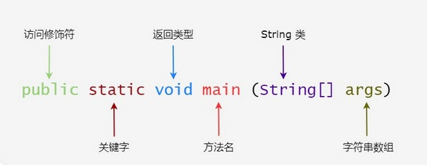
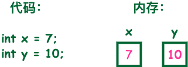
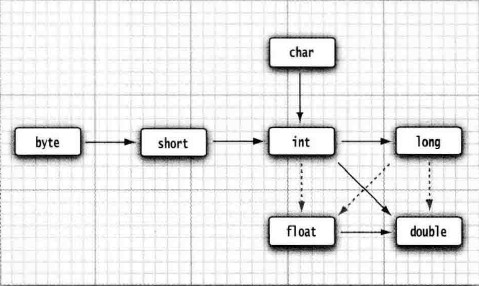
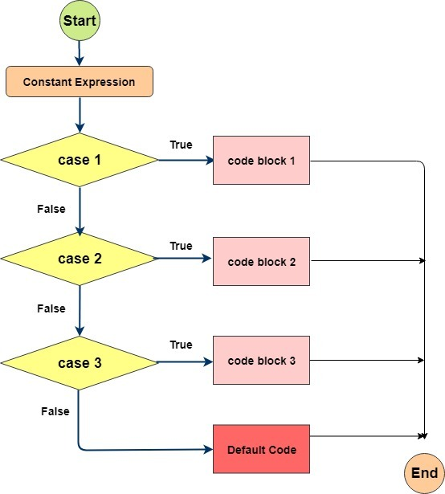

## 1. Java 概述

一个 Java 程序可以认为是一系列对象的集合，而这些对象通过调用彼此的方法来协同工作。一个基础的程序涉及如下的概念：

- **对象**：对象是类的一个实例，有状态和行为。例如，一条狗是一个对象，它的状态有：颜色、名字、品种；行为有：摇尾巴、叫、吃等。
- **类**：类是一个模板，它描述一类对象的行为和状态。
- **方法**：方法就是行为，一个类可以有很多方法。逻辑运算、数据修改以及所有动作都是在方法中完成的。
- **实例变量**：每个对象都有独特的实例变量，对象的状态由这些实例变量的值决定。

### 1.1. Java 程序

```java
public class HelloWorld {
    /* 第一个Java程序
     * 它将输出字符串 Hello World
     */
    public static void main(String[] args) {
        System.out.println("Hello World"); // 输出 Hello World
    }
}
```



> Notes: <font color=red>**main 是特殊的方法名，但不是关键字**</font>

### 1.2. Java 程序基本语法

- 大小写敏感：Java 是大小写敏感的，这就意味着标识符 `Hello` 与 `hello` 是不同的。
- 类名：对于所有的类来说，类名的首字母应该大写。如果类名由若干单词组成，那么每个单词的首字母应该大写，例如 `MyFirstJavaClass`
- 方法名：所有的方法名都应该以小写字母开头。如果方法名含有若干单词，则后面的每个单词首字母大写。
- 源文件名：源文件名必须和类名相同。当保存文件的时候，你应该使用类名作为文件名保存（切记 Java 是大小写敏感的），文件名的后缀为 `.java`。（如果文件名和类名不相同则会导致编译错误）。
- 主方法入口：所有的 Java 程序由 `public static void main(String[] args)` 方法开始执行。

### 1.3. Java 标识符

#### 1.3.1. 概念

Java 程序中所有定义的内容都需要名字。类名、变量名以及方法名都被称为标识符。

#### 1.3.2. 标识符的命名规则

**命名规则（硬性要求）**：

- 所有的标识符只能以字母（A-Z 或者 a-z）、美元符（`$`）、或者下划线（`_`）开始，但不能以数字开头
- 首字符之后可以是字母（A-Z 或者 a-z）、美元符（`$`）、下划线（`_`）或数字的任何字符组合
- 标识符不能是关键字

**命名规范（非硬性要求）**：

- 类名规范：首字符大写，后面每个单词首字母大写（大驼峰式）。
- 变量名规范：首字母小写，后面每个单词首字母大写（小驼峰式）。
- 方法名规范：同变量名。

示例：

```java
// 合法标识符举例
age、$salary、_value、__1_value

// 非法标识符举例
123abc、-salary
```

### 1.4. 代码块 {}

代码块就是用于包裹多行（一行）代码的符号，符号是：`{ }`

```java
{
    N行代码;
}
```

> Tips: 如果代码块 `{}` 内只有一行代码(就是只有一个`;`)，可以省略

### 1.5. Java 源程序与编译型运行区别


## 2. Java 关键字

以下是 Java 关键字汇总表。*其中保留字不能用于常量、变量、和任何标识符的名称*。

> 后续在各个知识点中再详细说明

### 2.1. 访问控制

|    关键字    |   说明   |
| :---------: | -------- |
|  `private`  | 私有的   |
| `protected` | 受保护的 |
|  `public`   | 公共的   |
|  `default`  | 默认     |

### 2.2. 类、方法和变量修饰符

|     关键字      |            说明            |
| :------------: | -------------------------- |
|   `abstract`   | 声明抽象                    |
|    `class`     | 类                         |
|   `extends`    | 扩充，继承                   |
|    `final`     | 最终值，不可改变的            |
|  `implements`  | 实现（接口）                 |
|  `interface`   | 接口                       |
|    `native`    | 本地，原生方法（非 Java 实现） |
|     `new`      | 新，创建                    |
|    `static`    | 静态                       |
|   `strictfp`   | 严格，精准                   |
| `synchronized` | 线程，同步                   |
|  `transient`   | 短暂                       |
|   `volatile`   | 易失                       |

实现一些其他的功能，Java 也提供了许多非访问修饰符。

- `static` 修饰符，用来修饰类方法和类变量。
- `final` 修饰符，用来修饰类、方法和变量，final 修饰的类不能够被继承，修饰的方法不能被继承类重新定义，修饰的变量为常量，是不可修改的。
- `abstract` 修饰符，用来创建抽象类和抽象方法。
- `synchronized` 和 `volatile` 修饰符，主要用于线程的编程。

### 2.3. 程序控制语句

|    关键字     |           说明           |
| :----------: | ----------------------- |
|   `break`    | 跳出循环                 |
|  `continue`  | 继续                     |
|  `default`   | 默认                     |
|     `do`     | 运行                     |
|    `else`    | 否则                     |
|    `for`     | 循环                     |
|     `if`     | 如果                     |
| `instanceof` | 实例                     |
|   `return`   | 返回；终止当前的方法        |
|   `switch`   | 根据值选择执行            |
|    `case`    | 定义一个值以供 switch 选择 |
|   `while`    | 循环                     |

### 2.4. 错误处理

|   关键字   |        说明         |
| :-------: | ------------------ |
| `assert`  | 断言表达式是否为真     |
|  `catch`  | 捕捉异常             |
| `finally` | 有没有异常都执行      |
|  `throw`  | 抛出一个异常对象      |
| `throws`  | 声明一个异常可能被抛出 |
|   `try`   | 捕获异常             |

### 2.5. 包相关

|   关键字   | 说明 |
| :-------: | --- |
| `import`  | 引入 |
| `package` | 包   |

### 2.6. 基本类型

|   关键字   |   说明    |
| :-------: | -------- |
| `boolean` | 布尔型     |
|  `byte`   | 字节型     |
|  `char`   | 字符型     |
| `double`  | 双精度浮点 |
|  `float`  | 单精度浮点 |
|   `int`   | 整型      |
|  `long`   | 长整型     |
|  `short`  | 短整型     |

### 2.7. 变量引用

|  关键字  |   说明    |
| :-----: | -------- |
| `super` | 父类，超类 |
| `this`  | 本类      |
| `void`  | 无返回值   |

### 2.8. 定义数据类型值

|  关键字  | 说明 |
| :-----: | ---- |
| `true`  | 真   |
| `false` | 非   |
| `null`  | 空值 |

### 2.9. 保留关键字

|  关键字  |       说明        |
| :-----: | ---------------- |
| `goto`  | 是关键字，但不能使用 |
| `const` | 是关键字，但不能使用 |

### 2.10. JAVA 转义字符

|   作用   | 转义字符 |  作用  | 转义字符 |
| :-----: | :-----: | :---: | :-----: |
|  退格键  |  `\b`   | Tab键 |  `\t`   |
| 换行符号 |  `\n`   |  进纸  |  `\f`   |
|  回车键  |  `\r`   | 反斜杠 |  `\\`   |
|  单引号  |  `\'`   | 双引号 |  `\"`   |

#### 2.10.1. 换行符

通常换行符 `\n` 可以实现换行，但是 windows 系统自带的记事本打开并没有换行。这是因为 windows 识别的换行符不是 `\n`，而是 `\r\n`。以下各类系统相应的换行符：

- windows: `\r\n`
- linux: `\n`
- mac: `\r`

## 3. Java 基本（内置）数据类型（整理中）

### 3.1. 变量与数据类型

变量就是申请内存来存储值。也就是说，当创建变量的时候，需要在内存中申请空间。

内存管理系统根据变量的类型为变量分配存储空间，分配的空间只能用来储存该类型数据。



因此，通过定义不同类型的变量，可以在内存中储存整数、小数或者字符。Java 的两大数据类型:

- 内置数据类型
- 引用数据类型（对象）

#### 3.1.1. Java 基本数据类型汇总表

| 基本类型 | 大小（字节） |     默认值      |   包装类   |
| ------- | ---------- | -------------- | --------- |
| byte    | 1          | (byte)0        | Byte      |
| short   | 2          | (short)0       | Short     |
| int     | 4          | 0              | Integer   |
| long    | 8          | 0L             | Long      |
| float   | 4          | 0.0f           | Float     |
| double  | 8          | 0.0d           | Double    |
| boolean | -          | false          | Boolean   |
| char    | 2          | `\u0000`(null) | Character |

> Tips: boolean 类型单独使用是 4 个字节，在数组中又是 1 个字节。

#### 3.1.2. 各种数据类型的默认值

- byte, short, int, long 默认值均是 `0`
- boolean 默认值是 `false`
- char 类型的默认值是 `''`
- float、double 类型的默认值是 `0.0`
- 对象类型的默认值是 `null`

### 3.2. char

char 类型是一个单一的 16 位 Unicode 字符。最小值是 `\u0000`（十进制等效值为 0）；最大值是 `\uffff`（即为 65535）。<font color=red>**字符是使用`''`单引号包裹**</font>。

```java
char letter = 'A';
```

**补充说明**：unicode 编码占用两个字节，所以 <font color=red>**char 类型的变量也是占用两个字节**</font>。

#### 3.2.1. char 类型存储中文

char 数据类型可以储存任何字符，unicode 编码字符集中也包含了汉字，因此 char 类型变量可以存储汉字。但如果某个特殊的汉字没有被包含在 unicode 编码字符集中，则不能存储这个特殊汉字。

#### 3.2.2. 番外：字符型常量和字符串常量的区别

- 形式上：字符常量是单引号引起的一个字符；字符串常量是双引号引起的若干个字符
- 含义上：字符常量相当于一个整形值(ASCII值)，可以参加表达式运算；字符串常量代表一个地址值(该字符串在内存中存放位置)
- 占内存大小：字符常量只占一个字节；字符串常量占若干个字节(至少一个字符结束标志)

#### 3.2.3. 字符存储数值

大写字母与小写字母的 ASCII 码相差 32

```java
'A'=65;
'a'=97;
'0'=48;
```

### 3.3. 数值类型之间的转换



上图是数值类型之间的合法转换，其中6个实心箭头表示无信息丢失的转换；3个虚箭头，表示可能有精度损失的转换。

#### 3.3.1. 隐式转换

隐式转换，又称『自动类型转换』，就是使用大范围的数据类型变量来接收小范围的数据类型。

#### 3.3.2. 强制类型转换

强制类型转换，又称『显示转换』，就是将一个大范围的数据类型强制赋值给小类型的数据类型，可能会出现精度的损失。语法格式如下：

```java
类型1 x = xxx;
类型2 y = (类型2) x;
```

> Notes: 如果试图将一个数值从一种类型强制转换为另一种类型，而又超出了目标类型的表示范围，结果就会截断成一个完全不同的值。如：`(byte) 300` 强制类型转换后的实际值为 44。

如果想对浮点数进行舍入运算，为了得到最接近的整数，很多情况下会使用 `Math.round` 静态方法

```java
double x = 9.997;
int y = (int) Math.round(x);
```

扩展的赋值运算符，隐含了强制类型转换。

```java
a += 20;
// 相当于
a = (a的数据类型)(a + 20);
```

为了保留两位小数，利用数据类型强制转换可以实现

```java
d = 11.853333;
d * 100 = 1185.3333;
(int)(d * 100) = 1185;
(int)(d * 100)/100.0 = 11.85;
```

注意：最后一步除以 100 的时候，必须写成 `100.0`，这个才会根据数据隐性转换原理，最后得出来的结果是浮点型。

### 3.4. 类型转换相关问题

#### 3.4.1. char 类型能否转成 int、String、double 类型

char 是 Java 中比较特殊的类型，它的 int 值从 1 开始，一共有 2<sup>16</sup> 个数据。取值范围如下：

```
char < int < long < float < double
```

因此，char 类型可以隐式转成 int、double 类型，但是不能隐式转换成 String；如果 char 类型转成 byte、short 类型的时候，需要强转。

#### 3.4.2. 计算机大小单位转换

byte 字节，bit 是位（二进制的位数）。如：

- 1Mb = 1024kb
- 1 k = 1024 byte
- 1 byte = 8 bit

#### 3.4.3. int 类型转换为 byte 类型的问题

int 类型可以强制转换为 byte 类型，但是 Java 中 int 是 32 位的，而 byte 是 8 位的，所以如果强制转化，int 类型的高 24 位将会被丢弃，因为 byte 类型的范围是从 -128 到 127。

### 3.5. Java 包装类

#### 3.5.1. 概述

一般地，当需要使用数字的时候，通常使用内置数据类型，如：byte、int、long、double 等。所有数值类型的包装类（Integer、Long、Byte、Double、Float、Short）都是抽象类 Number 的子类，其实就是基本类型对应的引用类型(包装类)。


> Tips: 除了 char 与 int 的包装类之外，其他包装类类名称均为基本类型名称的首字母大写

##### 3.5.1.1. 包装类的产生原因

基本类型包装类的产生原因：因为泛型类包括预定义的集合，使用的参数都是对象类型，无法直接使用基本数据类型。在实际开发中，用户输入的内容都是以字符串形式存在，需要参与数学运算时需要将字符串转换成对应的基本数据类型。

##### 3.5.1.2. 基本类型与包装类的区别

基本类型和对应的封装类由于本质的不同。具有一些区别：

1. 基本类型只能按值传递，而封装类按引用传递。
2. 基本类型会在栈中创建，而对于对象类型，对象在堆中创建，对象的引用在栈中创建，基本类型由于在栈中，效率会比较高，但是可能存在内存泄漏的问题。

#### 3.5.2. Integer

> Tips: 以 `Integer` 包装类为例，其他的包装类相关方法与使用基本一致

##### 3.5.2.1. 概述

```java
public final class Integer extends Number implements Comparable<Integer> {
    /**
     * A constant holding the minimum value an {@code int} can
     * have, -2<sup>31</sup>.
     */
     // 静态成员变量，直接用类名调用，返回整形的最小取值数
    @Native public static final int   MIN_VALUE = 0x80000000;

    /**
     * A constant holding the maximum value an {@code int} can
     * have, 2<sup>31</sup>-1.
     */
     // 静态成员变量，直接用类名调用，返回整形的最大取值数
    @Native public static final int   MAX_VALUE = 0x7fffffff;
    // 省略...
}
```

##### 3.5.2.2. 核心方法

```java
public Integer(String s) throws NumberFormatException
```

- 构造一个新分配的 Integer 对象，它表示 String 参数所指示的 int 值。

```java
public Integer(int value)
```

- 构造一个新分配的 Integer 对象，它表示指定的 int 值。

```java
public int intValue()
```

- 将构造方法中指定的数字字符串转换基本数据类型

```java
public static int parseInt(String s) throws NumberFormatException
```

- 将字符串数字转换整数(传入s必须是数字字符串，不能有字母和空格)

```java
public String toString()
```

- 重写 Object 类的方法，将整数转换成字符串

```java
public static String toBinaryString(int i)
```

- 将指定的整数转成二进制字符串

```java
public static String toOctalString(int i)
```

- 将指定的整数转成八进制字符串

```java
public static String toHexString(int i)
```

- 将指定的整数转成十六进制字符串

#### 3.5.3. 自动装箱和自动拆箱

##### 3.5.3.1. 概念

JDK 1.5 之前，如果要生成一个数值为 10 的 `Integer` 对象，需要以下操作：

```java
Integer i = new Integer(10);
```

在 JDK 1.5 后的增加新特性**自动拆装箱**：

- 自动装箱：Java 自动将基本数据类型转换成其对应的包装类的过程就是自动装箱。

```java
Integer i = 10; // 自动装箱，本质是调用 Integer.valueOf(10)
```

- 自动拆箱：Java自动将包装类转换为其对应的基本数据类型的过程就是自动拆箱。

```java
int a = i; // 自动拆箱，本质是调用 a.intValue()
```

自动装拆箱的好处：基本数据类型的变量可以直接和对应的包装类引用变量进行数学运算。

##### 3.5.3.2. 自动装拆箱的情况

当基础类型与它们的包装类有如下几种情况时，编译器会自动帮我们进行装箱或拆箱：

- 赋值操作（装箱或拆箱）
- 进行加减乘除混合运算（拆箱）
- 进行`>`、`<`、`==`比较运算（拆箱）
- 调用`equals`进行比较（装箱）
- `ArrayList`、`HashMap` 等集合类添加基础类型数据时（装箱）

##### 3.5.3.3. 注意事项

1. 自动拆箱和自动装箱是由编译器自动完成，根据语法来决定是否需要装箱和拆箱。
2. 如果整型字面量的值在 -128 到 127 之间，那么自动装箱时不会创建新的 `Integer` 对象，而是直接引用常量池中的 `Integer` 对象，若超过范围才会创建新的对象（*经典面试题*）

```java
Integer a = new Integer(3);
Integer b = 3; // 将3自动装箱成Integer类型
int c = 3;

System.out.println(a == b); // false 两个引用没有引用同一对象
System.out.println(a == c); // true a自动拆箱成int类型再和c比较
System.out.println(b == c); // true

Integer a1 = 128;
Integer b1 = 128;
System.out.println(a1 == b1); // false

Integer a2 = 127;
Integer b2 = 127;
System.out.println(a2 == b2); // true
```

以上示例通过查看 Integer 类的源码可知：

```java
public static Integer valueOf(int i) {
    if (i >= IntegerCache.low && i <= IntegerCache.high)
        return IntegerCache.cache[i + (-IntegerCache.low)];
    return new Integer(i);
}
```

示例中的 a1 因为超过 127，所以会调用 `Integer.valueOf(128)` 进行自动拆箱，而从源码可知，该方法并不是直接进行 `new Integer` 操作，而是用内部类 `IntegerCache` 的 `cache[]` 数组中获取数据（即直接引用常量池中的 `Integer` 对象）

```java
private static class IntegerCache {
    static final int low = -128;
    static final int high;
    static final Integer cache[];

    static {
        // high value may be configured by property
        int h = 127;
        String integerCacheHighPropValue =
            sun.misc.VM.getSavedProperty("java.lang.Integer.IntegerCache.high");
        if (integerCacheHighPropValue != null) {
            try {
                int i = parseInt(integerCacheHighPropValue);
                i = Math.max(i, 127);
                // Maximum array size is Integer.MAX_VALUE
                h = Math.min(i, Integer.MAX_VALUE - (-low) -1);
            } catch( NumberFormatException nfe) {
                // If the property cannot be parsed into an int, ignore it.
            }
        }
        high = h;

        cache = new Integer[(high - low) + 1];
        int j = low;
        for(int k = 0; k < cache.length; k++)
            cache[k] = new Integer(j++);

        // range [-128, 127] must be interned (JLS7 5.1.7)
        assert IntegerCache.high >= 127;
    }

    private IntegerCache() {}
}
```

默认 Integer cache 的下限是 -128，上限默认 127。当赋值 127 给 Integer 时，刚好在这个范围内，所以从 cache 中取对应的 Integer 并返回，所以 a2 和 b2 返回的是同一个对象，所以使用`==`比较是相等的，当赋值 128 给 Integer 时，不在 cache 的范围内，所以会 `new Integer` 创建新的对象并返回，比较的结果必然不相等的。

## 4. 权限修饰符

**权限大小顺序**：`private < 默认 < protected < public`

- public: 任意包下任意类都可以访问；
- protected: 任意包下任意子类都可以访问或同包下的任意类
- 默认(包权限): 同包下的任意类都可以访问
- private: 只能在本类中使用

**修饰符权限列表图**：

|                      | public | protected | 空的（default） | private |
| -------------------- | :----: | :-------: | :------------: | :-----: |
| 同一类中              |   ✔    |     ✔     |       ✔       |    ✔    |
| 同一包中（子类与无关类） |   ✔    |     ✔     |       ✔       |         |
| 不同包的子类           |   ✔    |     ✔     |                |         |
| 不同包中的无关类        |   ✔    |           |                |         |

> 类的成员不写访问修饰时默认为`default`。默认对于同一个包中的其他类相当于公开（`public`），对于不是同一个包中的其他类相当于私有（`private`）。受保护（`protected`）对子类相当于公开，对不是同一包中的没有父子关系的类相当于私有。

**总结：在日常开发过程中，编写的类、方法、成员变量的访问**

- 要想仅能在本类中访问使用 `private` 修饰;
- 要想本包中的类都可以访问不加修饰符即可;
- 要想本类与子类可以访问使用 `protected` 修饰;
- 要想任意包中的任意类都可以访问使用 `public` 修饰;

**注意项总结**：

- 如果类用 `public` 修饰，则类名必须与文件名相同。一个文件中只能有一个 `public` 修饰的类。
- Java 中，外部类的修饰符只能是 `public` 或默认 ，类的成员（包括内部类）的修饰符可以是以上四种。


## 5. Java 运算符

计算机的最基本用途之一就是执行数学运算，作为一门计算机语言，Java 也提供了一套丰富的运算符来操纵变量。运算符主分成以下几类：

- 算术运算符
- 关系运算符
- 位运算符
- 逻辑运算符
- 赋值运算符
- 其他运算符

### 5.1. 算术运算符

算术运算符用在数学表达式中，它们的作用和在数学中的作用一样。下表列出了所有的算术运算符。

> 表格中的实例假设整数变量A的值为10，变量B的值为20：

| 操作符 |             描述              |          例子          |
| :---: | ---------------------------- | --------------------- |
|  `+`  | 加法 - 相加运算符两侧的值        | `A + B` 等于 30        |
|  `-`  | 减法 - 左操作数减去右操作数      | `A – B` 等于 -10       |
|  `*`  | 乘法 - 相乘操作符两侧的值        | `A * B` 等于 200       |
|  `/`  | 除法 - 左操作数除以右操作数      | `B / A` 等于 2         |
|  `%`  | 取余 - 左操作数除以右操作数的余数 | `B%A` 等于 0           |
| `++`  | 自增: 操作数的值增加1           | `B++` 或 `++B` 等于 21 |
| `--`  | 自减: 操作数的值减少1           | `B--` 或 `--B` 等于 19 |

示例：

```java
public class Test {
    public static void main(String args[]) {
        int a = 10;
        int b = 20;
        int c = 25;
        int d = 25;
        System.out.println("a + b = " + (a + b)); // a + b = 30
        System.out.println("a - b = " + (a - b)); // a - b = -10
        System.out.println("a * b = " + (a * b)); // a * b = 200
        System.out.println("b / a = " + (b / a)); // b / a = 2
        System.out.println("b % a = " + (b % a)); // b % a = 0
        System.out.println("c % a = " + (c % a)); // c % a = 5
        System.out.println("a++   = " + (a++)); // a++ = 10
        System.out.println("a--   = " + (a--)); // a-- = 11
        // 观察 d++ 与 ++d 的不同
        System.out.println("d++   = " + (d++)); // d++ = 25
        System.out.println("++d   = " + (++d)); // ++d = 27
    }
} 
```

#### 5.1.1. 自增自减运算符

自增（`++`）自减（`--`）运算符是一种特殊的算术运算符，在算术运算符中需要两个操作数来进行运算，而自增自减运算符是一个操作数。又分以下两种：

- 前缀自增自减法(`++a`,`--a`)：先进行自增或者自减运算，再进行表达式运算。
- 后缀自增自减法(`a++`,`a--`)：先进行表达式运算，再进行自增或者自减运算

```java
public static void main(String args[]) {
    int a = 5; // 定义一个变量；
    int b = 5;
    int x = 2 * ++a;
    int y = 2 * b++;
    System.out.println("自增运算符前缀运算后a=" + a + ",x=" + x); // a=6,x=12
    System.out.println("自增运算符后缀运算后b=" + b + ",y=" + y); // b=6,y=10
}
```

还一种情况 `a += 值`，相当于自增任意值。

#### 5.1.2. 取余运算符

`%` 用于取得余数，左操作数除以右操作数的余数。有以下几个特点：

- 左边如果大于右边，结果是余数。
- 左边如果小于右边，结果是左边。
- 左边如果等于右边，结果是0。
- 正负号跟左边一致。即<font color=red>负数取余也是负数</font>。

### 5.2. 关系运算符

算术运算符用在数学表达式中，它们的作用和在数学中的作用一样。下表列出了所有的算术运算符。

> 表格中的实例假设整数变量A的值为10，变量B的值为20：

| 运算符 |                         描述                          |        例子        |
| :---: | ---------------------------------------------------- | ----------------- |
| `==`  | 检查如果两个操作数的值是否相等，如果相等则条件为真           | `A == B` 为 false |
| `!=`  | 检查如果两个操作数的值是否相等，如果值不相等则条件为真        | `A != B` 为 true  |
|  `>`  | 检查左操作数的值是否大于右操作数的值，如果是那么条件为真      | `A > B` 为 false  |
|  `<`  | 检查左操作数的值是否小于右操作数的值，如果是那么条件为真      | `A < B` 为 true   |
| `>=`  | 检查左操作数的值是否大于或等于右操作数的值，如果是那么条件为真 | `A >= B` 为 false |
| `<=`  | 检查左操作数的值是否小于或等于右操作数的值，如果是那么条件为真 | `A <= B` 为 true  |

示例：

```java
public static void main(String args[]) {
    int a = 10;
    int b = 20;
    System.out.println("a == b = " + (a == b)); // a == b = false
    System.out.println("a != b = " + (a != b)); // a != b = true
    System.out.println("a > b = " + (a > b)); // a > b = false
    System.out.println("a < b = " + (a < b)); // a < b = true
    System.out.println("b >= a = " + (b >= a)); // b >= a = true
    System.out.println("b <= a = " + (b <= a)); // b <= a = false
}
```

### 5.3. 位运算符

Java 定义了位运算符，应用于整数类型(int)，长整型(long)，短整型(short)，字符型(char)，和字节型(byte)等类型。

> 下表列出了位运算符的基本运算，假设整数变量 A 的值为 60 和变量 B 的值为 13：

| 操作符 |                                 描述                                 |              例子              |
| :---: | ------------------------------------------------------------------- | ----------------------------- |
|  `&`  | 如果相对应位都是1，则结果为1，否则为0                                     | `A & B` 得到12，即0000 1100    |
|  `|`  | 如果相对应位都是0，则结果为0，否则为1                                     | `A | B` 得到61，即 0011 1101   |
|  `^`  | 如果相对应位值相同，则结果为0，否则为1                                    | `A ^ B` 得到49，即 0011 0001   |
|  `〜`  | 按位取反运算符翻转操作数的每一位，即0变成1，1变成0                          | `〜A` 得到-61，即1100 0011     |
| `<<`  | 按位左移运算符。左操作数按位左移右操作数指定的位数                          | `A << 2` 得到240，即 1111 0000 |
| `>>`  | 按位右移运算符。左操作数按位右移右操作数指定的位数                          | `A >> 2` 得到15，即 1111       |
| `>>>` | 按位右移补零操作符。左操作数的值按右操作数指定的位数右移，移动得到的空位以零填充 | `A>>>2` 得到15，即0000 1111    |

位运算符作用在所有的位上，并且按位运算。它们的二进制格式表示将如下：

```
A = 0011 1100
B = 0000 1101
-----------------
A & B = 0000 1100
A | B = 0011 1101
A ^ B = 0011 0001
~A = 1100 0011
```

示例

```java
public static void main(String args[]) {
    int a = 60; /* 60 = 0011 1100 */
    int b = 13; /* 13 = 0000 1101 */
    int c = 0;
    c = a & b;       /* 12 = 0000 1100 */
    System.out.println("a & b = " + c); // a & b = 12

    c = a | b;       /* 61 = 0011 1101 */
    System.out.println("a | b = " + c); // a | b = 61

    c = a ^ b;       /* 49 = 0011 0001 */
    System.out.println("a ^ b = " + c); // a ^ b = 49

    c = ~a;          /*-61 = 1100 0011 */
    System.out.println("~a = " + c); // ~a = -61

    c = a << 2;     /* 240 = 1111 0000 */
    System.out.println("a << 2 = " + c); // a << 2 = 240

    c = a >> 2;     /* 15 = 1111 */
    System.out.println("a >> 2  = " + c); // a >> 2  = 15

    c = a >>> 2;     /* 15 = 0000 1111 */
    System.out.println("a >>> 2 = " + c); // a >>> 2 = 15
}
```

### 5.4. 逻辑运算符

下表列出了逻辑运算符的基本运算，假设布尔变量A为真，变量B为假

| 操作符 |                                   描述                                    |        例子         |
| :---: | ------------------------------------------------------------------------- | ------------------- |
| `&&`  | 称为逻辑与运算符。当且仅当两个操作数都为真，条件才为真                             | `A && B` 为 false   |
| `||`  | 称为逻辑或操作符。如果任何两个操作数任何一个为真，条件为真                         | `A || B` 为 true    |
|  `!`  | 称为逻辑非运算符。用来反转操作数的逻辑状态。如果条件为true，则逻辑非运算符将得到false | `!(A && B)` 为 true |

示例：

```java
public static void main(String args[]) {
    boolean a = true;
    boolean b = false;
    System.out.println("a && b = " + (a && b)); // a && b = false
    System.out.println("a || b = " + (a || b)); // a || b = true
    System.out.println("!(a && b) = " + !(a && b)); // !(a && b) = true
}
```

#### 5.4.1. 短路逻辑运算符

当使用与逻辑运算符时，在两个操作数都为 true 时，结果才为 true，但是当得到第一个操作为 false 时，其结果就必定是 false，这时候就不会再判断第二个操作了。

示例

```java
public static void main(String args[]) {
    int a = 5; // 定义一个变量；
    boolean b = (a < 4) && (a++ < 10);
    System.out.println("使用短路逻辑运算符的结果为" + b); // false
    System.out.println("a的结果为" + a); // 5
}
```

> 解析：该程序使用到了短路逻辑运算符(`&&`)，首先判断 `a<4` 的结果为 `false`，则 b 的结果必定是 `false`，所以不再执行第二个操作 `a++ < 10` 的判断，所以 a 的值为 5

#### 5.4.2. 注意问题

在逻辑判断中，`&&` 和 `&` 的结果一样；`||` 和 `|` 的结果一样。两者的区别如下：

- `&&` 如果左边是 false，则右边不执行；而 `&` 无论左边是 true 还是 false，右边都会执行。
- `|` 和 `||` 的区别同理，双或时，左边为真，右边不参与运算。

### 5.5. 赋值运算符

下面是Java语言支持的赋值运算符：

| 操作符 |                        描述                         |                   例子                   |
| :---: | -------------------------------------------------- | --------------------------------------- |
|  `=`  | 简单的赋值运算符，将右操作数的值赋给左侧操作数             | `C = A + B`将把`A + B`得到的值赋给C        |
| `+=`  | 加和赋值操作符，它把左操作数和右操作数相加赋值给左操作数     | `C + = A`等价于`C = C + A`               |
| `-=`  | 减和赋值操作符，它把左操作数和右操作数相减赋值给左操作数     | `C -= A`等价于`C = C - A`                |
| `*=`  | 乘和赋值操作符，它把左操作数和右操作数相乘赋值给左操作数     | `C *= A`等价于`C = C * A`                |
| `/=`  | 除和赋值操作符，它把左操作数和右操作数相除赋值给左操作数     | `C /= A`，C 与 A 同类型时等价于`C = C / A` |
| `%=`  | 取模和赋值操作符，它把左操作数和右操作数取模后赋值给左操作数 | `C %= A`等价于`C = C%A`                  |
| `<<=` | 左移位赋值运算符                                      | `C << = 2`等价于`C = C << 2`             |
| `>>=` | 右移位赋值运算符                                      | `C >> = 2`等价于`C = C >> 2`             |
| `&=`  | 按位与赋值运算符                                      | `C &= 2`等价于`C = C&2`                  |
| `^=`  | 按位异或赋值操作符                                    | `C ^= 2`等价于`C = C ^ 2`                |
| `|=`  | 按位或赋值操作符                                      | `C |= 2`等价于`C = C | 2`                |

示例：

```java
public static void main(String args[]) {
    int a = 10;
    int b = 20;
    int c = 0;
    c = a + b;
    System.out.println("c = a + b, c = " + c); // 30
    c += a;
    System.out.println("c += a, c = " + c); // 40
    c -= a;
    System.out.println("c -= a, c = " + c); // 30
    c *= a;
    System.out.println("c *= a, c = " + c); // 300
    a = 10;
    c = 15;
    c /= a;
    System.out.println("c /= a, c = " + c); // 1
    a = 10;
    c = 15;
    c %= a;
    System.out.println("c %= a , c = " + c); // 5
    c <<= 2;
    System.out.println("c <<= 2, c = " + c); // 20
    c >>= 2;
    System.out.println("c >>= 2, c = " + c); // 5
    c >>= 2;
    System.out.println("c >>= 2, c = " + c); // 1
    c &= a;
    System.out.println("c &= a, c = " + c); // 0
    c ^= a;
    System.out.println("c ^= a, c = " + c); // 10
    c |= a;
    System.out.println("c |= a, c = " + c); // 10
}
```

### 5.6. 条件运算符（三元运算符）

条件运算符也被称为三元运算符。该运算符有3个操作数，并且需要判断布尔表达式的值。该运算符的主要是决定哪个值应该赋值给变量。

```java
variable x = (expression) ? value if true : value if false
```

示例：

```java
public static void main(String args[]) {
    int a, b;
    a = 10;
    // 如果 a 等于 1 成立，则设置 b 为 20，否则为 30
    b = (a == 1) ? 20 : 30;
    System.out.println("Value of b is : " + b);

    // 如果 a 等于 10 成立，则设置 b 为 20，否则为 30
    b = (a == 10) ? 20 : 30;
    System.out.println("Value of b is : " + b);
}
```

#### 5.6.1. 三元表达式的类型转化规则

> 引用阿里巴巴Java开发手册的规则：
>
> 【强制】三目运算符 `condition ? 表达式 1：表达式 2` 中，高度注意表达式 1 和 2 在类型对齐时，可能抛出因自动拆箱导致的 NPE 异常。说明：以下两种场景会触发类型对齐的拆箱操作：
>
> 1. 表达式 1 或 表达式 2 的值只要有一个是原始类型。
> 2. 表达式 1 或 表达式 2 的值的类型不一致，会强制拆箱升级成表示范围更大的那个类型。

由于三元表达式拆包，有可能引发空指针异常，而三元表达式的类型转化规则如下：

- 若两个表达式类型相同，返回值类型为该类型
- 若两个表达式类型不同，但类型不可转换，返回值类型为 Object 类型
- 若两个表达式类型不同，但类型可以转化，先把包装数据类型转化为基本数据类型，然后按照基本数据类型的转换规则（`byte < short(char) < int < long < float < double`）来转化，返回值类型为优先级最高的基本数据类型。

#### 5.6.2. 三元表达式使用建议

1. 如果三元表达式中有包装数据类型的算术计算，尽量避免使用三元表达式，可以考虑利用 if-else 语句代替。
2. 如果在三元表达式中有算术计算，尽量使用基本数据类型，避免包装数据类型的拆装包。

### 5.7. instanceof 运算符

#### 5.7.1. 概述

`instanceof` 运算符（双目运算符）用于操作对象实例，检查该对象是否是一个特定类型（类类型或接口类型）。即判断父类引用指定的到底是哪一个子类类型的对象。语法格式如下：

```java
// 父类引用对象 instanceof 子类类名或接口名;
( Object reference variable ) instanceof  (class/interface type)
```

如果运算符左侧变量所指的对象，是操作符右侧类或接口(class/interface)的一个对象，那么结果为真。示例如下：

```java
String name = "James";
boolean result = name instanceof String; // 由于 name 是 String 类型，所以返回真

// public class Car extends Vehicle
Vehicle a = new Car();
boolean result = a instanceof Car; // true
```

#### 5.7.2. 使用注意事项

`instanceof` 关键字前面的对象和后面的类型必须是子父类关系或类实现接口关系，毫无关系的两个对象不能进行判断。

编译器会检查<u>左侧变量的对象</u>是否能转换成右边的类型，如果不能转换则直接报错；如果不能确定类型，则通过编译，具体看运行时定。

### 5.8. Java 运算符优先级

当多个运算符出现在一个表达式中，就涉及到运算符的优先级别的问题。在一个多运算符的表达式中，运算符优先级不同会导致最后得出的结果差别甚大。

下表中具有最高优先级的运算符在的表的最上面，最低优先级的在表的底部。

|   类别   |                             操作符                              |  关联性  |
| ------- | -------------------------------------------------------------- | ------- |
| 后缀     | `()`、`[]`、`.`(点操作符)                                        | 左到右   |
| 一元     | `expr++`、`expr--`                                             | 从左到右 |
| 一元     | `++expr`、`--expr`、`+`、`-`、`～`、`!`                          | 从右到左 |
| 乘性     | `*`、`/`、`%`                                                  | 左到右   |
| 加性     | `+`、`-`                                                       | 左到右   |
| 移位     | `>>`、`>>>`、`<<`                                              | 左到右   |
| 关系     | `>`、`>=`、`<`、`<=`                                            | 左到右   |
| 相等     | `==`、`!=`                                                     | 左到右   |
| 按位与   | `&`                                                            | 左到右   |
| 按位异或 | `^`                                                            | 左到右   |
| 按位或   | `|`                                                            | 左到右   |
| 逻辑与   | `&&`                                                           | 左到右   |
| 逻辑或   | `||`                                                           | 左到右   |
| 条件     | `? :`                                                          | 从右到左 |
| 赋值     | `=`、`+=`、`-=`、`*=`、`/=`、`%=`、`>>=`、`<<=`、`&=`、`^=`、`|=` | 从右到左 |
| 逗号     | `,`                                                            | 左到右   |

## 6. 流程控制

### 6.1. 控制流程的概念

与任何程序设计语言一样，Java 使用条件语句和循环结构来控制程序流程。

### 6.2. 条件语句

Java 中的条件语句允许程序根据条件的不同执行不同的代码块。一个 if 语句包含一个布尔表达式和一条或多条语句。

#### 6.2.1. if 语句

if 语句的语法如下：

```java
if (布尔表达式) {
   // 如果布尔表达式为true将执行的语句
}
```

#### 6.2.2. if...else 语句

if 语句后面可以跟 else 语句，当 if 语句的布尔表达式值为 false 时，else 语句块会被执行。语法如下：

```java
if (布尔表达式) {
   // 如果布尔表达式的值为true
} else {
   // 如果布尔表达式的值为false
}
```

#### 6.2.3. if...else if...else 语句

if 语句后面可以跟 else if…else 语句，这种语句可以检测到多种可能的情况。使用时需要注意下面几点：

- if 语句至多有 1 个 else 语句，else 语句在所有的 else if 语句之后。
- if 语句可以有若干个 else if 语句，它们必须在 else 语句之前。
- 一旦其中一个 else if 语句检测为 true，其他的 else if 以及 else 语句都将跳过执行。

语法格式如下:

```java
if (布尔表达式 1) {
    // 如果布尔表达式 1的值为true执行代码
} else if (布尔表达式 2) {
    // 如果布尔表达式 2的值为true执行代码
} else if (布尔表达式 3) {
    // 如果布尔表达式 3的值为true执行代码
} else {
    // 如果以上布尔表达式都不为true执行代码
}
```

#### 6.2.4. 嵌套的 if...else 语句

使用嵌套的 if…else 语句是合法的。即可以在另一个 if 或者 else if 语句的代码块内使用 if 或者 else if 语句。语法格式如下：

```java
if (布尔表达式 1) {
   // 如果布尔表达式 1的值为true执行代码
   if (布尔表达式 2) {
      // 如果布尔表达式 2的值为true执行代码
   }
}
```

### 6.3. switch 多重选择语句

#### 6.3.1. 语法格式

switch case 语句判断一个变量与一系列值中某个值是否相等，每个值称为一个分支。语法格式如下：

```java
switch (expression) {
    case value:
        // 语句
        break;
    case value:
        // 语句
        break;
    // ...可以有任意数量的case语句
    default: // 可选
        // 语句
}
```

如果输出语句都一样的话，case 可以合并。如：

```java
switch (expression) {
    case value1:
    case value2:
    case value3:
        // 语句体
        break;
    default: // 可选
        // 语句
}
```

#### 6.3.2. switch case 语句规则说明

- switch 语句中的 expression（表达式）可以是： byte、short、int 或者 char 等基本类型。
    - JDK1.5 以后支持枚举类型
    - JDK1.7 以后支持字符串(String)类型，同时 case 标签必须为字符串常量或字面量
- switch 语句可以拥有多个 case 语句。每个 case 后面跟一个要**比较的值和冒号**。
- case 语句中的值的数据类型必须与变量的数据类型相同，而且只能是常量或者字面常量。
- 当变量的值与 case 语句的值相等时，那么 case 语句之后的语句开始执行，直到 break 语句出现才会跳出 switch 语句。
- 当遇到 break 语句时，switch 语句终止。程序跳转到 switch 语句后面的语句执行。case 语句不必须要包含 break 语句。如果没有 break 语句出现，程序会继续执行下一条 case 语句，直到出现 break 语句。
- switch 语句可以包含一个 default 分支（非必需），该分支一般是 switch 语句的最后一个分支（可以在任何位置，但建议在最后一个）。default 在所有 case 语句的值和变量值都不匹配的时候执行。default 分支不需要 break 语句。

#### 6.3.3. 执行流程

switch case 执行时，一定会先进行匹配，匹配成功返回当前 case 的值，再根据是否有 break，判断是否继续输出，或是跳出判断。



1. 计算出表达式的值
2. 拿计算出来的值和 case 后面的值依次比较，一旦有对应的值，就执行该处的语句，在执行过程中，遇到 break，就结束。
3. 如果所有的 case 都不匹配，就会执行 default 控制的语句，然后结束。

### 6.4. 循环结构

顺序结构的程序语句只能被执行一次。如果想要同样的操作执行多次，则需要使用循环结构。Java 中有三种主要的循环结构：

- while 循环
- do...while 循环
- for 循环

在 Java 5 中引入了一种主要用于数组的增强型 for 循环。

#### 6.4.1. for 循环

for 循环执行的次数是在执行前就确定的。语法格式如下：

```java
for (初始化语句; 判断条件语句; 控制条件语句) {
    循环体语句;
}
```

执行流程：

1. 执行初始化语句，可以声明一种类型，但可初始化一个或多个循环控制变量，也可以是空语句。
2. 执行判断条件语句，看结果是 true 还是 false
    - 如果是 true，就继续执行
    - 如果是 false，就结束循环
3. 执行循环体语句
4. 执行控制条件语句
5. 回到第2步继续

#### 6.4.2. while 循环

语法格式如下：

```java
while (判断条件语句) {
	循环体语句;
}
```

扩展格式：

```java
初始化语句;
while (判断条件语句) {
	循环体语句;
	控制条件语句;
}
```

如果布尔表达式为 true，循环就会一直执行下去。

#### 6.4.3. do...while 循环

do...while 循环和 while 循环相似，但对于 while 语句，如果不满足条件，则不能进入循环。而 do...while 循环即使不满足条件，也至少执行一次。基础语法格式如下：

```java
do {
    循环体语句;
} while (判断条件语句);
```

扩展格式：

```java
初始化语句;
do {
    循环体语句;
    控制条件语句;
} while (判断条件语句);
```

> Notes: 判断条件语句在循环体的后面，所以语句块在检测布尔表达式之前已经执行了。如果判断条件语句的值为 true，则语句块一直执行，直到判断条件语句的值为 false 为止。

执行流程：

1. 执行初始化语句;
2. 执行循环体语句;
3. 执行控制条件语句;
4. 执行判断条件语句，判断是 true 还是 false
    - 如果是 true，回到第2步继续
    - 如果是 false，则结束循环

#### 6.4.4. 三种循环的区别

- do...while 至少执行一次循环体
- for、while 循环先判断条件是否成立，然后决定是否执行循环体

for 和 while 的小区别：

- for 循环的初始化变量，在循环结束后，不可以被访问。而 while 循环的初始化变量，是可以被继续使用的(因为变量是定义在循环体外)。
- 如果初始化变量，后面还要继续访问，就使用 while，否则，推荐使用 for。

> Tips: 循环里的定义的变量，循环一次，重新创建一次。

#### 6.4.5. 增强 for 循环

Java5 引入了一种主要用于数组的增强型 for 循环。语法格式如下:

```java
for (声明语句 : 表达式) {
   // 代码句子
}
```

语法说明：

- 声明语句：声明新的局部变量，该变量的类型必须和数组元素的类型匹配。其作用域限定在循环语句块，其值与此时数组元素的值相等。
- 表达式：表达式是要访问的数组名，或者是返回值为数组的方法。

#### 6.4.6. break 与 continue 关键字

break 主要用在循环语句或者 switch 语句中，用来跳出整个语句块。

```java
int[] numbers = {10, 20, 30, 40, 50};

for (int x : numbers) {
    // x 等于 30 时跳出循环
    if (x == 30) {
        break;
    }
    System.out.print(x);
    System.out.print("\n");
}
```

continue 适用于任何循环控制结构中。作用是让程序立刻跳转到下一次循环的迭代。

- 在 for 循环中，continue 语句使程序立即跳转到更新语句。
- 在 while 或者 do...while 循环中，程序立即跳转到布尔表达式的判断语句。

```java
int[] numbers = {10, 20, 30, 40, 50};

for (int x : numbers) {
    // x 等于 30 时立刻跳转下一次循环，后面的语句不会执行
    if (x == 30) {
        continue;
    }
    System.out.print(x);
    System.out.print("\n");
}
```

#### 6.4.7. 死循环的两种写法

while 循环：

```java
while (true) {
    // 执行内容
}
```

for 循环：

```java
for (; ; ) {
    // 执行内容
}
```

## 7. 数组

### 7.1. 概述

数组对于每一门编程语言来说都是重要的数据结构之一，Java 语言中提供的数组是用来存储固定大小的同类型元素。

#### 7.1.1. 数组声明（定义）语法

声明数组变量的语法，有如下两种方式：

- 方式一(**推荐**)：

```java
数据类型[] 数组变量名;
```

- 方式二：

```java
数据类型 数组变量名[];
```

> Notes: 建议使用 `dataType[] arrayRefVar` 的声明风格声明数组变量。`dataType arrayRefVar[]` 风格是来自 C/C++ 语言，在 Java 中采用是为了让 C/C++ 程序员能够快速理解 Java 语言。

示例：

```java
// 定义了一个int类型的数组，数组名是arr
int[] arr;
double[] myList;
// 定义了一个int类型的变量，变量名是arr数组
int arr[];
double myList[];
```

#### 7.1.2. 数组初始化(创建数组)

数组初始化，就是为数组开辟内存空间，并为数组中的每个元素赋予初始值。Java 语言使用 `new` 关键字来创建数组，有以下两种方式可以实现数组的初始化：

1. 动态初始化：只给数组规定长度，由系统给出初始化值。例如：

```java
int[] arr = new int[3];
```

2. 静态初始化：给数组初始化值，由系统决定长度。例如：

```java
int[] arr = new int[]{1,2,3};
// 简化版
int[] arr = {1,2,3};
```

#### 7.1.3. 数组的分类

数组可以分为：**基本类型的数组**与**对象数组**。

- **基本类型的数组**：存储的元素为基本类型

```java
int[] arr = {1,2,3,4};
```

- **对象数组**：存储的元素为引用类型

```java
// Student 是一个自定义类
Student[] stus = new Student[3];
// Stus 数组中 stus[0],stus[1],stus[2] 的元素数据类型为 Student 的对象，初始化后默认保存是 null
```

### 7.2. 数组的使用

#### 7.2.1. 数组的长度属性

数组提供了一个属性：`length`，用于获取数组中数元素的个数。

```java
int arrLength = 数组变量名.length
```

#### 7.2.2. 数组的索引

数组的元素是通过索引访问的。数组索引从 0 开始，因此索引值范围从 0 到 `数组.length-1`。

```java
int[] arr = {1,2,3};
// 根据索引获取数组第二个元素
int a = arr[1];
```

#### 7.2.3. 循环数组

数组的元素类型和数组的大小都是确定的，所以当处理数组元素时候，通常使用基本循环或者 For-Each 循环。

- 基础 for 循环

```java
double[] myList = {1.9, 2.9, 3.4, 3.5};

// 打印所有数组元素
for (int i = 0; i < myList.length; i++) {
    System.out.println(myList[i] + " ");
}
// 计算所有元素的总和
double total = 0;
for (int i = 0; i < myList.length; i++) {
    total += myList[i];
}
System.out.println("Total is " + total);
// 查找最大元素
double max = myList[0];
for (int i = 1; i < myList.length; i++) {
    if (myList[i] > max) max = myList[i];
}
System.out.println("Max is " + max);
```

- JDK 1.5 引进了一种新的循环类型，被称为 For-Each 循环或者加强型循环，它能在不使用下标的情况下遍历数组。语法格式如下：

```java
for(数据类型 数组中元素变量: 数组变量名) {
    // do something...
}
```

示例

```java
double[] myList = {1.9, 2.9, 3.4, 3.5};
 
// 打印所有数组元素
for (double element: myList) {
    System.out.println(element);
}
```

#### 7.2.4. 数组常见小问题

- ArrayIndexOutOfBoundsException（数组索引越界异常），产生的原因是访问了不存在的索引
- NullPointerException（空指针异常），产生的原因是数组已经不在指向堆内存的数据了，还使用数组变量去访问元素

### 7.3. 二维数组【了解】

二维数组，就是一个特殊的一维数组，该数组的元素是一维数组。

#### 7.3.1. 定义语法

有以下三种声明二维数组的方式：

1. `数据类型[][] 数组名;` (推荐的方式)
2. `数据类型 数组名[][];`
3. `数据类型[] 数组名[];`

#### 7.3.2. 初始化语法

二维数组的初始化语法与普通数组一样，有以下两种方式：

1. 动态初始化

```java
数据类型[][] 数组名 = new 数据类型[m][n];
```

- 参数 `m` 表示的是二维数组中一维数组的个数
- 参数 `n` 表示的是一维数组中的元素个数

2. 静态初始化

```java
数据类型[][] 数组名 = new 数据类型[][]{{元素...},{元素...},{元素...},...};
// 简化格式：
数据类型[][] 数组名 = {{元素...},{元素...},{元素...},...};
```

#### 7.3.3. 数据操作

二维数组名配合索引可以获取到每一个元素（一维数组）。每一个一维数组配合索引名可以获取到数组中的元素。

假如有一个二维数组：arr

- 要从中获取某个元素（一维数组）：`arr[索引]`
- 要从中获取二维数组的元素：`arr[索引][索引]`

## 8. static 关键字

### 8.1. 概述

`static` 是一个修饰符。可以用于修饰内部类、成员变量、成员方法以及代码块。

<font color=red>**`static` 关键字的主要意义是，在于创建独立于具体对象的域变量或者方法。以致于即使没有创建对象，也能使用属性和调用方法！还有一个比较关键的作用就是，用来形成静态代码块以优化程序性能。**</font>

### 8.2. static 修饰变量

有 static 修饰的变量，称为静态变量（类变量）。没有 static 修饰的变量，称为成员变量（实例变量）。

static 关键字用来声明的静态变量是独立于对象的，静态成员变量是属于类，不再属于某个对象，会被该类的所有对象共享。无论一个类实例化多少对象，它的静态变量只有一份拷贝，若有一个对象修改了静态变量的值，其他对象会受影响。

```java
private static 类型 变量名称 = 值;
```

建议使用类名访问(`类名.xxx`)静态属性，不推荐使用对象访问(`对象名.xxx`)。

> Notes: <font color=red>**static 修饰的成员变量，在类的加载过程中，JVM只为静态变量分配一次内存空间。而初始化的顺序是按照定义顺序来进行**</font>

### 8.3. static 修饰方法

使用 static 修饰的方法，称为静态方法（类方法）。没有 static 修饰的方法，称为成员方法（实例对象方法）。

static 关键字声明的静态方法是属于当前类，而不属于某个对象的，静态方法不能被重写。静态方法中不能使用类的非静态变量，也不能使用`this`或者`super`关键字。

```java
public static void foo(参数列表) {
    // ...
}
```

可以通过类名直接调用静态方法（推荐），即 `类名.静态方法`；也可以使用实例调用（不推荐），即 `对象.静态方法`

### 8.4. static 修饰代码块

被 `static` 修饰的代码块称为“静态代码块”，可以定义在类中的任意位置，并且可以定义多个。在类初次被加载的时候，会按照定义的顺序来执行每个 static 代码块，并且只会执行一次。静态代码块的执行优先级高于非静态的代码块。

```java
// 静态代码块
static {
    // ...
}

// 非静态代码块
{
    // ...
}
```

> Tips: 根据静态代码只会在类加载的时候执行一次的特性。因此最常见的应用场景就是，将一些只需要进行一次的初始化操作都放在 static 代码块中进行。

### 8.5. static 修饰类【只能修饰内部类也就是静态内部类】（待整理）

static 修饰类，只能用于修饰内部类也就是静态内部类

### 8.6. 静态导包（待整理）

在 JDK 1.5 之后引入的新特性，`import static` **静态导包**。可以用来指定导入某个类中的静态资源，并且不需要使用类名，可以直接使用类的静态变量与静态方法。比如：

```java
import static java.lang.Math.*;

public class Test{
    public static void main(String[] args){
        // System.out.println(Math.sin(20)); // 传统写法
        System.out.println(sin(20)); // 静态导包后的写法
    }
}
```

### 8.7. 总结

#### 8.7.1. 静态成员变量和成员变量的区别

1. 语法区别
	- 静态成员变量：有 static 修饰的;
	- 成员变量：没有 static 修饰的;
2. 数量区别
	- 静态成员变量：在内存中只存在一份，在类的加载过程中，JVM只为静态变量分配一次内存空间并初始化一次，会受每一个对象的影响
	- 成员变量：每创建一个对象，都会为成员变量分配内存。每一个对象都有一份自己的成员变量。互不干扰的。
3. 生命周期区别
	- 静态成员变量：在类加载的时候完成内存分配并初始化。(类只会加载一次)。跟随类的卸载面销毁。
	- 成员变量：在创建对象的时候完成内存分配和初始化。跟随对象的销毁而销毁。
4. 访问方式区别
	- 静态成员变量：可以通过类名访问(`类.xxx`)，也可以通过对象名访问(不推荐);
	- 成员变量：只能通过对象名访问(`对象名.xxx`);

#### 8.7.2. 静态方法和成员方法的区别

1. 调用方式
    - 静态方法可以通过类名调用(`类.xxx`)，也可以通过对象名调用(不推荐);
    - 成员方法只能通过对象名调用(`对象名.xxx`);
2. 成员的访问限制
    - 静态方法中不能访问非静态成员(成员变量和成员方法)，只能访问带有 `static` 修饰的静态变量
    - 成员方法则无成员的访问限制。如果在本类中，直接通过成员变量名或方法名来使用，在其他类中，需要(`类名.成员变量名`)或(`类.方法名`)才能使用;

#### 8.7.3. static 的注意事项

静态方法中不能使用 `this` 和 `super` 关键字。(因为 `this` 是代表当前对象的引用，如果没有创建对象， `this` 没有任何意义。)

#### 8.7.4. static 使用场景

**静态变量**

- 当某个成员变量在值需要在该类的所有对象共享时就可以将该变量定义为静态成员变量

**静态方法**

- 如果方法中没有使用任何非静态成员，就可以将该方法定义为静态方法;(因为静态方法可以直接用类名调用(`类.xxx)`，比较方便)
- 定义工具类时，如果一个类中的所有方法都是静态方法，则该类可以认为是一个工具类

## 9. final 关键字

### 9.1. final 概述

final 也是一个修饰符。可以修饰变量、方法、类

### 9.2. final 修饰变量

- 修饰基本数据类型的变量：被它修饰的变量其实是一个常量(常量命名是全部字母大写，多个单词用下划线 `_` 分隔)，只能赋值一次，不能再修改。常用格式：

```java
public static final int NUM = 10;
```

- 修饰引用数据类型变量：此时该引用变量就不能再指向其他对象，但可以修改已经指向对象的成员变量的值(只要该成员变量不是使用 final 修饰)。相当于此引用变量的地址值固定，不能改变。

### 9.3. final 修饰方法

使用 `final` 修饰的方法不能被子类重写。其目的有以下两个：

- 第一个原因是把方法锁定，以防任何继承类修改它的含义；
- 第二个原因是效率。在早期的 Java 实现版本中，会将 `final` 方法转为内嵌调用。内联对于提升 Java 运行效率作用重大，能够使性能平均提高 50%。但是如果方法过于庞大，可能看不到内嵌调用带来的任何性能提升（现在的 Java 版本已经不需要使用 final 方法进行这些优化了）。

> Notes: <font color=red>**类中所有的 `private` 方法都隐式地指定为 `final`。**</font>

```java
// 原代码
public static void test(){
    String s1 = "包夹方法a";
    a();
    String s2 = "包夹方法a";
}

public static final void a(){
    System.out.println("我是方法a中的代码");
    System.out.println("我是方法a中的代码");
}

// 经过编译后
public static void test(){
    String s1 = "包夹方法a";
    System.out.println("我是方法a中的代码");
    System.out.println("我是方法a中的代码");
    String s2 = "包夹方法a";
}
```

### 9.4. final 修饰类

- 使用 final 修饰类的目的简单明确：表明该类不能再被其他类继承。
- 被 final 修饰的类中，所有成员方法都会被隐式地指定为 final 方法。(就不存在方法重写的情况，只能创建对象和调用。)

```java
public final class Xxx{
}
```

### 9.5. final 注意事项

当引用变量使用 final 修饰时，表示其指向的地址值不能发生改变，但指向对象的成员变量值可以改变。

### 9.6. 常量治理

虽然推荐在 java 中使用枚举来对数据字典及常量进行控制，但是有些时候，还是使用常量控制更为便捷。比如，对于数据字典，可以使用枚举值来处理；对于一些其他的信息，还是会使用常量保存和使用。

#### 9.6.1. 代码的坏味道

很多程序中的常量类，随着业务与功能的迭代，类中定义的常量越来越多，导致类中行数过多，造成查找内容十分不方便。例如：


```java
public class Constants {
    public static final String REAL_NAME1 = "v1";
    public static final String REAL_NAME2 = "v2";
    public static final String REAL_NAME3 = "v3";
    public static final String REAL_NAME4 = "v4";
    public static final String REAL_NAME5 = "v5";
    public static final String REAL_NAME5 = "v6";
    public static final String REAL_NAME7 = "v7";
    public static final String REAL_NAME8 = "v8";
    public static final String REAL_NAME9 = "v9";
    ......
}
```

一个无穷尽的常量类，设想这个类篇幅巨长，这样的常量管理会带来的问题如下：

1. 不好维护，相关的代码写到一起，此时，常量的篇幅较长导致找不到对应的常量块进行维护；
2. 虽然是在不同的业务场景下，但是有些常量的名称还是有可能重复；
3. 有时为了减少常量的定义，就得共用一些常量，而这样的共用会导致某种业务场景下需要对该常量进行修改，而导致另外一些业务场景下的常量使用产生歧义；

因此常能看到一些常量类的“代码里的坏味道”，假如常量名称如上所示，名称类似的很多；名称不明确的也很多，还没有注释，这样的歧义也是因为代码不好管理造成的。想对这种常量类进行新增或修改内容，是十分困难。

#### 9.6.2. 初级治理 - 使用内部类

使用 java 的内部类进行常量的初步治理，对常量根据不同的业务模块进行管理，代码如下：

```java
/**
 * Created by SZBright on 2017/3/1.
 *
 * @author :
 */
public class Constants {

    public static final class TOKEN_FLAG_ONE {

        public static final String REAL_NAME = "v1";

        public static final String CRET = "v2";

        public static final String GUR = "v5";

    }

}
```

这样的好处是，通过常量的内部类的名称，可以直接获取对应模块的常量的引用信息。使用代码如下：

```java
@Test
public void test(){
	System.out.println(Constants.TOKEN_FLAG_ONE.REAL_NAME);
}
```

#### 9.6.3. 中级治理 - 集中管理

在初级治理中，是无法实现通过 value 来获取到常量 key 。进而出现中级治理，主要是通过 map，每个内部类都会存为 map 中的一个 entry，每个 entry 又都是 map 类型的集合，集合中包含该内部类的所有常量。

代码如下：

```java
public class Constants {
    public static final Map<String, Map<String, String>> keyValueMapCons = new LinkedHashMap<>();

    public static final Map<String, Map<String, String>> valueKeyMapCons = new LinkedHashMap<>();

    /* 初始化所有常量 */
    static {
        try {
            // 获取所有内部类
            for (Class cls : Constants.class.getClasses()) {
                Map<String, String> keyValueMap = new LinkedHashMap<>(); // 存放 key 和 value 的 map
                Map<String, String> valueKeyMap = new LinkedHashMap<>(); // 存放 value 和 key 的 map，每个内部类-获取所有属性（不包括父类的）
                for (Field fd : cls.getDeclaredFields()) {
                    keyValueMap.put(fd.getName(), fd.get(cls).toString()); // 注解对象空，其值为该 field 的值
                    valueKeyMap.put(fd.get(cls).toString(), fd.getName());
                }
                // 以内部类的名称作为 key 保存
                keyValueMapCons.put(cls.getSimpleName(), keyValueMap);
                valueKeyMapCons.put(cls.getSimpleName(), valueKeyMap);
            }
        } catch (Exception e) {
            e.printStackTrace();
        }
    }

    public static final class TOKEN_FLAG_ONE {
        public static final String REAL_NAME = "v1";
        public static final String CRET = "v2";
        public static final String GUR = "v5";
    }
}
```

示例中在 `Constants` 类中维护了两个 Map 常量集合：

- 一个名为 `keyValueMapCons` 的 Map 集合，按照内部类的名称作为 key 存储，其 value 是一个常量 Map 集合，该结构是将常量的名字作为 map 的 key，值作为 map 的 value；
- 一个名为 `valueKeyMapCons` 的 Map 集合，按照内部类的名称作为 key 存储，其 value 是一个常量 Map 集合，该结构是将常量的值作为 map 的 key，常量的名字作为 map 的 key。

这样就可以通过这两个 map 集合，根据不同的的使用需求来获取相应的常量。使用示例代码如下：

```java
@Test
public void test1(){
    System.out.println(Constants.keyValueMapCons.get("TOKEN_FLAG_ONE").get("REAL_NAME")); // v1
    System.out.println(Constants.valueKeyMapCons.get("TOKEN_FLAG_ONE").get("v5")); // GUR
}
```

#### 9.6.4. 中高级治理 - 使用注解

目前实现了通过 key 获取到 value，也可以通过 value 获取到 key 了。但在使用常量时，不光要有常量的定义、常量的值，还应该有对常量的描述，而传统的对于常量的定义，往往只在通过 ide 的文档功能来查看常量的描述。

可以通过注解的方式来实现存储常量描述的功能，例如自定义注解类型如下：

```java
@Retention(RetentionPolicy.RUNTIME)
@Target({ElementType.FIELD, ElementType.TYPE})
public @interface ConstantAnnotation {
    String value(); // 用于记录常量的描述
}
```

通过自定义的注解，将常量的中文描述都记录到注解的 `value` 属性中。

```java
public class Constants {
    private static final String CONSTANT_STRING = "这是一条短信消息";

    public static final class TOKEN_FLAG_ONE {
        @ConstantAnnotation("实名")
        public static final String REAL_NAME = "v1";

        @ConstantAnnotation("证书")
        public static final String CRET = "v2";

        @ConstantAnnotation(CONSTANT_STRING) // 把描述与注解分离
        public static final String GUR = "v5";
    }
}
```

比如，我们希望在某个业务场景下，符合gur常量的业务，发送一条短信消息，而这个消息我们就可以定义在我们的自定义注解中。例如GUR这个常量，我们把它的描述声明成一个常量，这个常量可用来存放对应的短信消息。我们的常量类中如果再有一个通过常量获取到描述的map，这是不是就完美了？

于是，我们有了下面的代码：

```java
public class Constants {

    // 存储常量描述的 Map 集合，根据常量名称来获取常量描述的值
    public static final Map<String, Map<String, String>> keyDescMapCons = new LinkedHashMap<>();

    /* 初始化所有常量 */
    static {
        try {
            // 获取所有内部类
            for (Class cls : Constants.class.getClasses()) {
                Map<String, String> keyDescMap = new LinkedHashMap<>(); // 存放常量 key 和 desc 的 map

                // 每个内部类-获取所有属性（不包括父类的）
                for (Field fd : cls.getDeclaredFields()) {
                    // 每个属性获取指定的 annotation 的注解对象
                    ConstantAnnotation ca = fd.getAnnotation(ConstantAnnotation.class);
                    if (ca != null) {
                        keyDescMap.put(fd.getName(), ca.value()); // 注解对象不空，常量的描述即为注解对象中的值
                    }
                }
                keyDescMapCons.put(cls.getSimpleName(), keyDescMap);

            }
        } catch (Exception e) {
            e.printStackTrace();
        }
    }

    private static final String CONSTANT_STRING = "这是一条短信消息";

    public static final class TOKEN_FLAG_ONE {
        @ConstantAnnotation("实名")
        public static final String REAL_NAME = "v1";

        @ConstantAnnotation("证书")
        public static final String CRET = "v2";

        @ConstantAnnotation(CONSTANT_STRING) // 把描述与注解分离
        public static final String GUR = "v5";
    }
}
```

经过改造后，可以通过 keyDescMap 集合，根据常量的名称获取到该常量对应的描述了。使用示例代码如下：

```java
@Test
public void test1(){
    System.out.println(Constants.keyDescMapCons.get("TOKEN_FLAG_ONE").get("GUR")); // 打印输出“这是一条短消息”
}
```

#### 9.6.5. 综合治理（终极治理）

目前有了常量的治理，有了注解的描述，有时需要通过key获取到value，有时需要通过value获取描述，有时需要通过key获取到描述等等。排列组合共6种形式，以下是综合治理的实现（虽然实际项目中不一定有用得上）。代码如下：

```java
public class Constants {

    public static final Map<String, Map<String, String>> keyValueMapCons = new LinkedHashMap<>();
    public static final Map<String, Map<String, String>> keyDescMapCons = new LinkedHashMap<>();
    public static final Map<String, Map<String, String>> descValueMapCons = new LinkedHashMap<>();
    public static final Map<String, Map<String, String>> descKeyMapCons = new LinkedHashMap<>();
    public static final Map<String, Map<String, String>> valueDescMapCons = new LinkedHashMap<>();
    public static final Map<String, Map<String, String>> valueKeyMapCons = new LinkedHashMap<>();

    /* 初始化所有常量 */
    static {
        try {
            // 获取所有内部类
            for (Class cls : Constants.class.getClasses()) {
                Map<String, String> keyDescMap = new LinkedHashMap<>(); // 存放key和desc的map
                Map<String, String> keyValueMap = new LinkedHashMap<>(); // 存放key和value的map
                Map<String, String> valueKeyMap = new LinkedHashMap<>(); // 存放value和key的map
                Map<String, String> valueDescMap = new LinkedHashMap<>(); // 存放value和desc的map
                Map<String, String> descValueMap = new LinkedHashMap<>(); // 存放desc和value的map
                Map<String, String> descKeyMap = new LinkedHashMap<>(); // 存放desc和key的map
                // 每个内部类-获取所有属性（不包括父类的）
                for (Field fd : cls.getDeclaredFields()) {
                    // 每个属性获取指定的 annotation的 注解对象
                    ConstantAnnotation ca = fd.getAnnotation(ConstantAnnotation.class);
                    keyValueMap.put(fd.getName(), fd.get(cls).toString()); // 获取该 field 的名称
                    valueKeyMap.put(fd.get(cls).toString(), fd.getName());
                    if (ca != null) {
                        keyDescMap.put(fd.getName(), ca.value()); // 注解对象不空，常量的描述即为注解对象中的值
                        valueDescMap.put(fd.get(cls).toString(), ca.value());
                        descValueMap.put(ca.value(), fd.get(cls).toString());
                        descKeyMap.put(ca.value(), fd.getName());
                    }
                }
                keyValueMapCons.put(cls.getSimpleName(), keyValueMap);
                keyDescMapCons.put(cls.getSimpleName(), keyDescMap);
                descValueMapCons.put(cls.getSimpleName(), descValueMap);
                descKeyMapCons.put(cls.getSimpleName(), descKeyMap);
                valueDescMapCons.put(cls.getSimpleName(), valueDescMap);
                valueKeyMapCons.put(cls.getSimpleName(), valueKeyMap);
            }
        } catch (Exception e) {
            e.printStackTrace();
        }
    }

    private static final String CONSTANT_STRING = "这是一条短信消息";

    public static final class TOKEN_FLAG_ONE {
        @ConstantAnnotation("实名")
        public static final String REAL_NAME = "v1";

        @ConstantAnnotation("证书")
        public static final String CRET = "v2";

        @ConstantAnnotation(CONSTANT_STRING) // 把描述与注解分离
        public static final String GUR = "v5";
    }
}
```

以上就是综合治理后的常量类，使用先拿常量的声明，再用对应的map，然后指定内部类名称，根据具体需要获取相应的内容。

> Tips: <font color=red>**枚举治理和常量治理结合使用，可能才是系统开发时的最佳实践**</font>

## 10. 包 package

### 10.1. 包的概述

包就是文件夹。分包管理是组织软件项目结构的基本方式。将同类功能放到一个包中，方便管理。并且日常项目的分工也是以包作为边界。

包在文件系统中是以文件夹的形式存在的。类中定义的包必须与实际class件所在的文件夹情况相统一，即定义包时类在a包下，则生成的.class 文件必须在a文件夹下，否则找不到类。

### 10.2. 包的作用

- 避免类命名冲突。
- 将功能相似或相关的类和接口组织在同一个文件夹，方便类的查找和使用。

### 10.3. 包的定义格式

- 定义格式：`package com.qq.包名1.xxx...;`
- 规范：一般以公司域名倒着写，最后是功能内容的分类。即 `www.qq.com ===> com.qq.login`
- 多级包使用“.”分割，包名全部小写英文字母，一般不用数字。

### 10.4. 包的注意事项

- 定义包的语句必须是类中第一行语句。
- 如果定义多个类，只能有一个是 public 修饰。且文件名一定要与 public 修饰的类名一致。
- 类和所生成的 class 必须在相同的目录结构下。

### 10.5. 导包格式

导包位置：**package 的下面，class 的上面**

```java
import 包名.包名.xxx...类名;
import java.util.*;	// 将指定包下的所有类导入
```

### 10.6. 类的访问方式

**带包类全名访问**：

当在一个类中需要使用两个不同包下同名的类时，只能有一个类被导包，另一个类只能使用类全名方式访问。

**不带包名访问**：

- 被使用的类在java.lang包下。
- 被使用的类和当前类是在同一个包下。
- 使用导包方式访问。

> 跨包导包访问注意事项：如果在一个类中需要使用不同包下相同类名的类，只能有一个被导包，其他只能通过类全名访问。

code demo

```java
package com.moon.packaeg;
import com.moon.statci.Student;

public class Test01 {
    public static void main(String[] args) {
        // 创建Person对象
        // 带包类全名访问:不需要导入
        com.moon.packaeg.Person p = new com.moon.packaeg.Person();

        // 创建学生对象
        Student s = new Student();

        // 在java.lang包下的类：不需要导包
        String str = "nihao";

        com.moon.finla.Student s1 = new com.moon.finla.Student();
        s1.sleep();

        Person p1 = new Person();
    }
}
```

### 10.7. JDK 中常用的包

- java.lang：系统的基础类
- java.io：所有输入输出有关的类，比如文件操作等
- java.nio：为了完善 io 包中的功能，提高 io 包中性能而写的一个新包
- java.net：与网络有关的类
- java.util：系统辅助类，特别是集合类
- java.sql：数据库操作的类

> Tips: java 开头的包是较原始的 JavaAPI，javax 开头的包是扩展的 API

## 11. 可变参数

### 11.1. 可变参数概述

- **JDK1.5的新特性**，方法的参数类型相同，但是个数变化。
- **可变参数可以多个，也可以不传值**。

### 11.2. 可变参数格式

- 使用前提：数据类型明确，参数个数任意。
- 语法定义：`数据类型…` **【注意是3个点(.)】**

```java
修饰符 返回值类型 方法名(数据类型… 变量名) {
}
```

与普通方法相比在参数类型后面添加`…`

### 11.3. 可变参数的本质

可变参数方法本质是数组。所以不可以与数组类型参数重载。

### 11.4. 可变参数注意事项

1. 参数列表中只能有一个可变参数
2. 如果出现不同类型的参数，可变参数必须放在参数列表的最后
