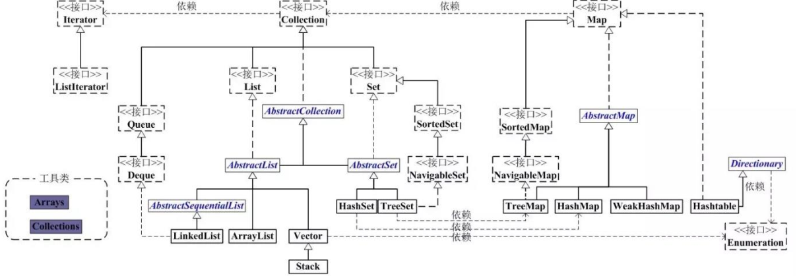
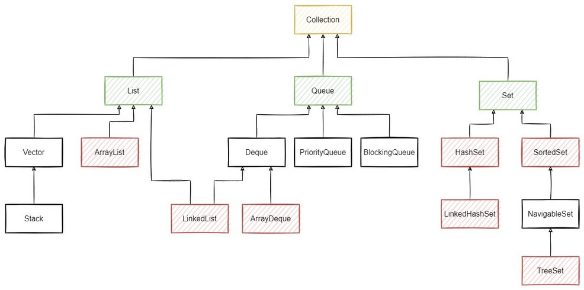
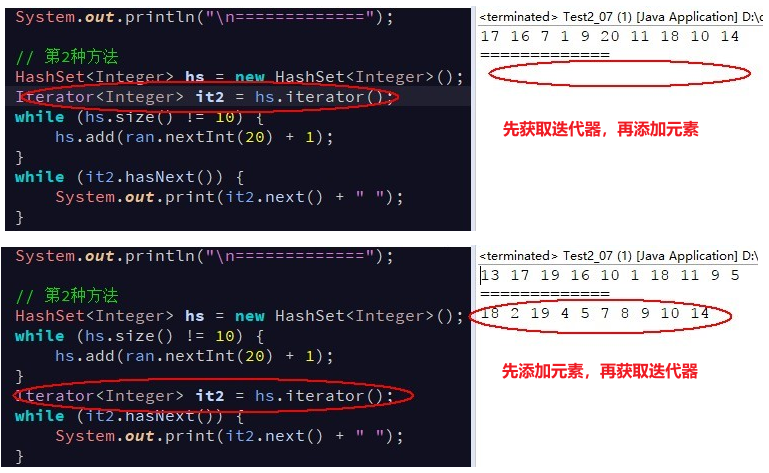
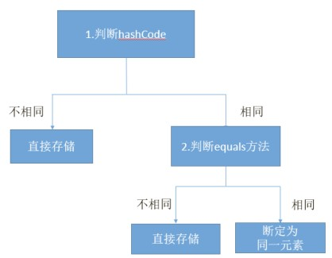
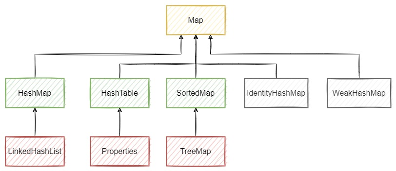
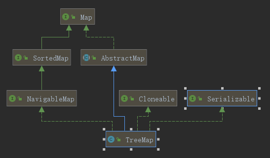
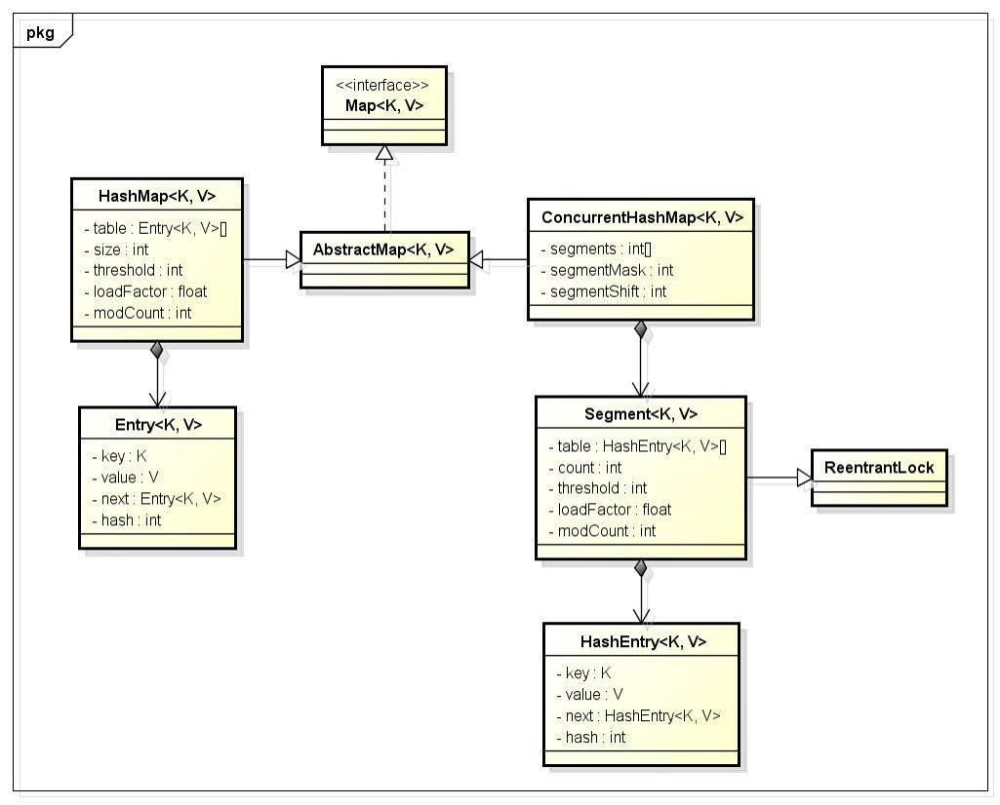
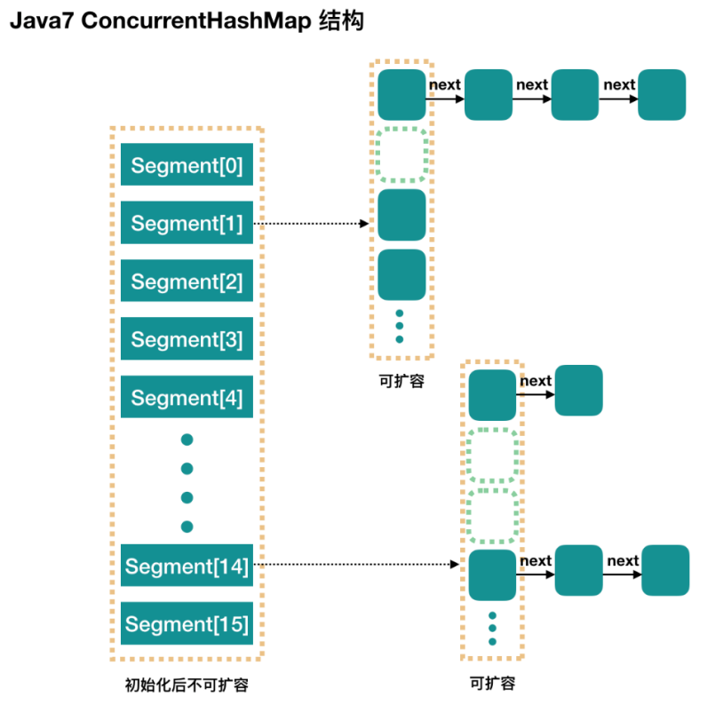

Java 集合框架支持两种不同类型的集合：

- `Collection`（单列集合）
- `Map`（双列集合）



> Notes: 
> 
> - **本笔记所有方法和示例基于 jdk1.8**
> - JDK 提供的线程安全的并发容器，如：`BlockingQueue` 等，详见[《并发编程 - 并发容器》笔记](/并发编程/并发编程-并发容器)

## 1. Collection 接口（单列集合）

### 1.1. 概述

`Collection` 是所有单列集合的父接口（父类），集合的项层的接口。Collection 接口本身是没有索引的，但它的子体系中有支持**重复的，唯一的，有序的，无序的**等不同类型的实现。`Collection` 框架支持以下三种主要类型：

- **`Set`（规则集）**：用于存储一组不重复的元素。
- **`List`（线性表）**：用于存储一个由元素构成的有序集合。
- **`Queue`（队列）**：用于存储先进先出方式处理的对象。

> Tips: 这些集合的通用特性都被定义在 `java.util.Collection` 接口中，相应的集合类型的特性定义以上各自的接口中，并提供了各自不同实现类来实现具体的功能。

### 1.2. Collection 继承体系图

`Collection` 是所有单列集合的直接或间接接口，其指定了所有集合应该具备的基本功能。

- `List` 接口：元素可重复，有序，带索引。
    - ArrayList(重要)：底层是数组结构。ArrayList 的出现替代了 Vector，增删慢，查找快。
    - LinkedList(重要)：底层是链表结构。同时对元素的增删操作效率很高。
- `Set` 接口： 元素不能重复，无序，没有索引。
    - HashSet(重要)：底层是哈希表结构。在不重复的基础上无序。
    - LinkedHashSet：底层是哈希表结构结合链表结构。在不重复的基础上可预测迭代顺序。

**单列集合体系图**



### 1.3. Collection 集合接口的常用方法

```java
Collection<String> c = new ArrayList<>();
```

Collection 是接口，定义了集合相关的方法。**其实 `ArrayList` 等实现类就是实现 `Collection` 的以下的方法**

#### 1.3.1. 添加元素

```java
boolean add(E e);
```

- 添加一个元素

```java
boolean addAll(Collection<? extends E> c);
```

- 按照指定 collection 的迭代器所返回的元素顺序，将该 collection 中的所有元素添加到此列表的尾部。

#### 1.3.2. 删除元素

```java
boolean remove(Object o);
```

- 移除此集合中首次出现的指定元素（如果存在），返回删除是否成功(true/false)。<font color=red>**删除元素是影响本来的集合**</font>。

```java
boolean removeAll(Collection<?> c);
```

- 移除此集合中所有包含在指定的集合中所有元素（如果存在），返回删除是否成功(true/false)

#### 1.3.3. 获取集合信息

```java
int size();
```

- 返回集合中的元素的个数

#### 1.3.4. 清空集合

```java
void clear();
```

- 移除此集合中的所有元素。此调用返回后，集合将为空。

#### 1.3.5. 判断功能

```java
boolean isEmpty();
```

- 判断集合是否为空。如果此列表中没有元素，则返回 true。

```java
boolean contains(Object o);
```

- 判断此集合中是否包含指定的元素，包含则返回 true。

#### 1.3.6. 类型转换功能

```java
Object[] toArray();
```

- 按适当顺序（从第一个到最后一个元素）返回包含此集合中所有元素的数组。

### 1.4. 综合示例

Code Demo:

```java
package day07;

import java.util.ArrayList;
import java.util.Collection;

/*
 * 关卡1训练案例 1
 * 	Collection 基本用法
 */
public class Test1_01 {
	public static void main(String[] args) {
		// 创建Collection对象，因Collection是接口，只能通过子类去创建对象
		Collection<String> c = new ArrayList<String>();
		// 往集合中添加对象元素
		c.add("a");
		c.add("b");
		c.add("c");
		c.add("d");
		c.add("e");
		// 输出集合[a, b, c, d, e]
		System.out.println(c);
		// 删除元素
		c.remove("c");
		// remove不存在的元素，不报错，没有效果
		c.remove("f");
		//输出集合[a, b, d, e]
		System.out.println(c);
		// 获取集合大小：4
		System.out.println("Collection集合的大小是：" + c.size());
		// 清空集合+判断集合是否是空 输出 false
		System.out.println("Collectiong集合是否为空：" + c.isEmpty());
		c.clear();
		//输出true
		System.out.println("Collectiong集合是否为空：" + c.isEmpty());
		// 输出集合内容 []
		System.out.println(c);
	}
}
```

## 2. List 接口

List 接口用来定义有序(存取顺序一致)，有索引，元素可重复的集合

### 2.1. 接口概述

```java
public interface List<E> extends Collection<E>
```

List 是一个元素存取有序、带有索引、并且可以存储重复元素的集合。例如：存元素的顺序是11、22、33。那么集合中，元素的存储就是按照11、22、33的顺序完成的；通过索引就可以精确的操作集合中的元素（与数组的索引是一个道理）

由于 List 集合拥有索引，因此 List 集合迭代方式除了使用迭代器之外，还可以使用索引进行迭代。遍历方法分别是：<font color=red>**普通for，增强for，迭代器**</font>。

### 2.2. List 集合存储数据的结构

List 接口下有很多个集合实现，它们存储元素所采用的结构方式是不同的，这样就导致了这些集合有它们各自的特点，供给开发者在不同的环境下进行使用。接口的常见实现类

- ArrayList
- LinkedList
- Vector

### 2.3. 接口常用的方法

#### 2.3.1. 增加元素

```java
boolean add(E e);
```

- 向集合末尾处，添加指定的元素 

```java
void add(int index, E element);
```

- 向集合指定索引处，添加指定的元素，原有元素依次后移

```java
boolean addAll(int index, Collection<? extends E> c);
```

- 从指定的位置开始，将指定 collection 中的所有元素插入到此列表中。向右移动当前位于该位置的元素（如果有）以及所有后续元素（增加其索引）。新元素将按照指定 collection 的迭代器所返回的元素顺序出现在列表中。

#### 2.3.2. 删除元素

```java
boolean remove(Object e);
```

- 将指定元素对象，从集合中删除，返回值为被删除的元素

```java
boolean remove(int index);
```

- 从集合中删除将指定索引处的元素，并返回被删除的元素。<font color=red>**值得注意的是，若调用方法时传入的参数 index 是 `Integer` 类型的，调用的是 `remove(Object object)` 方法，而不是 `remove(int index)`，所以会出现无法删除指定的索引处的元素的情况，传入的一定要是基本数据类型哦!**</font>

```java
void clear();
```

- 清空集合

#### 2.3.3. 替换元素

```java
E set(int index, E element);
```

- 将指定索引处的元素，替换成指定的元素，返回值为替换前的元素

#### 2.3.4. 获取元素

```java
E get(int index);
```

- 获取指定索引处的元素，并返回该元素。(获取元素是不会改变本来的集合)

```java
int indexOf(Object o);
```

- 返回此集合中首次出现的指定元素的索引；如果此集合不包含元素，则返回 -1。

```java
int lastIndexOf(Object o);
```

- 返回此集合中最后一次出现的指定元素的索引；如果此集合不包含索引，则返回 -1。

### 2.4. ArrayList

#### 2.4.1. 简介

```java
public class ArrayList<E> extends AbstractList<E>
        implements List<E>, RandomAccess, Cloneable, java.io.Serializable
```

<font color=red>**ArrayList 集合底层数据存储的结构是数组结构。数组实现的特点：<u>元素查询快，增删慢，线程不安全（效率高）</u>**</font>。ArrayList 是一个长度可变的高级的数组，可以在集合中存储任意**对象类型**的数据，集合本身也是一个对象。由于日常开发中使用最多的功能为查询数据、遍历数据，所以 ArrayList 是最常用的集合。

> Notes: <font color=red>**集合只能存储对象（引用类型）的数据，不能存在基本数据类型**</font>。

需要注意**线程安全性**：对 ArrayList 的操作一般分为两个步骤，改变位置(size)和操作元素(e)。所以这个过程在多线程的环境下是不能保证具有原子性的，因此 ArrayList 在多线程的环境下是线程不安全的。

> Tips: 开发时随意地使用 ArrayList 完成任何需求，并不严谨，这种用法不提倡。

#### 2.4.2. RandomAccess 接口

Java Collections 框架中提供了一个 `RandomAccess` 接口，用来标记 List 实现是否支持 Random Access。

```java
public interface RandomAccess {
}
```

- 如果一个数据集合实现了该接口，就意味着它支持 Random Access，按位置读取元素的平均时间复杂度为 O(1)，如 `ArrayList`
- 如果没有实现该接口，表示不支持 Random Access，如 `LinkedList`

#### 2.4.3. ArrayList 优缺点

优点：

1. 因为其底层是数组，所以修改和查询效率高。
2. 可自动扩容(1.5倍)。

缺点：

1. 插入和删除效率不高。
2. 线程不安全。

ArrayList 比较适合顺序添加、随机访问的场景。

#### 2.4.4. ArrayList 的特有方法

```java
protected void removeRange(int fromIndex, int toIndex)
```

- 重写 `AbstractList` 抽象父类的方法，移除集合中索引在 `fromIndex`（包括）和 `toIndex`（不包括）之间的所有元素。向左移动所有后续元素（减小其索引）。此调用将列表缩短了 (`toIndex - fromIndex`) 个元素。如果 `toIndex == fromIndex`，则此操作无效。

#### 2.4.5. 集合的遍历示例

ArrayList 集合的遍历最经典是，通过 `size()` 和 `get()` 配合实现的

```java
// 最标准的用法
for (int x = 0; x < array.size(); x++) {
    String s = array.get(x);    // 目的是为了以后能再对集合里的元素进行使用
    System.out.println(s);
}
```

#### 2.4.6. ArrayList 底层原理

##### 2.4.6.1. ArrayList 数组实现的原理

数组实现的特点：查询快，增删慢，线程不安全（效率高）。原因：

- <font color=red>**查询快**</font>：由于数组的索引支持，那么可以通过索引直接计算出元素的地址值，因此就可以直接通过元素的地址值获取到指定的元素
- <font color=red>**增删慢**</font>：由于在添加元素的时候，实际上底层会先创建一个新数组(新数组的长度为原数组的长度+1)，那么在添加新元素的时候，先需要对数组中原有的数据进行拷贝，其次在末尾进行添加新的元素。因此，这样操作的效率的极低的(删除元素刚好和添加的操作相反)

> Tips: 增删慢的情况是基于，数组的原长度不够，并且非在数组尾部插入数据的情况。若数组的长度足够并且在尾部插入新的元素，其他操作的效率甚至比链表更快。

##### 2.4.6.2. ArrayList 的 contains 方法判断元素（自定义类型）是否存在的原理

ArrayList 的 `contains` 方法，会调用方法传入的元素的 equals 方法依次与集合中的旧元素所比较，从而根据返回的布尔值判断是否有重复元素。

当 ArrayList 存放**自定义类型**时，由于自定义类型在未重写 equals 方法前，判断是否重复的依据是比较对象的地址值，所以<font color=red>**如果想根据内容判断是否为重复元素，需要重写元素的 equals 方法**</font>

### 2.5. LinkedList

#### 2.5.1. 概述

<font color=red>**LinkedList 集合底层数据存储的实现是双向链表结构，<u>查询慢，增删快，线程不安全（效率高）</u>**</font>。

> Notes: 数据结构基础之双向链表。双向链表也叫双链表，是链表的一种，它的每个数据结点中都有两个指针，分别指向直接后继和直接前驱。所以，从双向链表中的任意一个结点开始，都可以很方便地访问它的前驱结点和后继结点。

LinkedList 与 ArrayList 不同的是，在对 LinkedList 进行插入和删除操作时，只需在对应的节点上插入或删除元素，并将前后的节点元素的指针指向该节点即可，数据不需要进行复制移动，因此随机插入和删除效率很高。

LinkedList 还提供了在 List 接口中未定义，<font color=red>用于操作链表头部和尾部的元素</font>的方法，因此有时也可以被当作堆栈、队列或双向队列使用。

#### 2.5.2. LinkedList 链表实现的原理

链表结构：查询慢，增删快，线程不安全（效率高）。其原因：

- <font color=red>**查询慢**</font>：由于不能直接找到元素的地址，需要上一个元素推导出下一个元素的地址，因为在进行随机访问时，需要从链表头部一直遍历到要查找的节点为止，这种查询速度较慢。
- <font color=red>**增删快**</font>：在添加的时候，只需要更改元素所记录的地址值即可

链表查询元素是判断索引是否大于集合元素个数的一半来决定从表头还是表尾开始查询。如果大于一半，则从表尾开始查找，否则从表头开始查找。

#### 2.5.3. LinkedList 常用特有方法

```java
void addFirst(E e);
```

- 将指定元素添加到链表头

```java
void addLast(E e);
```

- 将指定元素添加到链表尾

```java
E removeFirst()
```

- 移除并返回此列表的第一个元素。

```java
E removeLast()
```

- 移除并返回此列表的最后一个元素。

```java
E getFirst();
```

- 返回此列表的第一个元素。

```java
E getLast();
```

- 返回此列表的最后一个元素。

### 2.6. Vector（了解）

`Vector` 集合数据存储的结构是数组结构，为 JDK 中最早提供的集合。

```java
public class Vector<E>
    extends AbstractList<E>
    implements List<E>, RandomAccess, Cloneable, java.io.Serializable
```

`Vector` 中提供了一个独特的取出方式，就是枚举 `Enumeration`，它其实就是早期的迭代器。此接口 `Enumeration` 的功能与 `Iterator` 接口的功能是类似的。`Vector` 集合已被 `ArrayList` 替代。枚举 `Enumeration` 已被迭代器 `Iterator` 替代。

`Vector` 最大的特点是线程安全但效率低，因为 Vector 类的所有方法（如 `add`、`set`、`delete` 等）均是 `synchronized` 修饰的同步方法，在多线程访问的情况下，只允许一个线程进行增删改操作。后面已经不再建议使用，而 Arraylist 不是同步的，其效率比较高，在不需要保证线程安全时建议使用 Arraylist。

### 2.7. Stack 栈结构（了解）

#### 2.7.1. 概述

java 提供了一个专门用于栈结构的类：`java.util.Stack`

```java
public class Stack<E> extends Vector<E>
```

Stack 类表示后进先出（LIFO）的对象堆栈。

#### 2.7.2. 常用方法

```java
public E peek();
```

- 查看堆栈顶部的对象，但不从堆栈中移除它。

```java
public E push(E item);
```

- 把项压入堆栈顶部。(压栈)

```java
public E pop();
```

- 移除堆栈顶部的对象，并作为此函数的值返回该对象。(弹栈)

### 2.8. 集合与数组之间的转换

#### 2.8.1. 集合转数组( List 类方法)

集合（如：ArrayList）转数组使用的是，Collection 接口的 `toArray()` 方法，ArrayList 和 LinkedList 都有承继该方法。

**方式一**：

```java
public Object[] toArray()
```

- 将集合内容转成一个对象数组。如果需要下一步操作，需要进行向下转型。按适当顺序（从第一个到最后一个元素）返回包含此列表中所有元素的数组。

```java
ArrayList<String> list = new ArrayList<>();
Object[] arr = list.toArray();
String str = (String) arr[0];
```

**方式二**：

```java
public <T> T[] toArray(T[] a)
```

- 将集合中的元素添加至指定的数组中。按适当顺序（从第一个到最后一个元素）返回包含此列表中所有元素的数组；返回数组的运行时类型是指定数组的运行时类型。
    - 如果传入的数组的长度大于等于集合元素的个数时，则方法内部直接将集合中元素添加到指定的数组中，并返回该数组。
    - 如果传入的数组的长度小于集合元素的个数时，则方法内部会创建一个新的数组，新数组的类型与传入的数组类型一致，新数组的长度等于集合元素的个数，并且将集合中的元素添加到新数组中，返回新的数组。

```java
ArrayList<String> list = new ArrayList<>();
String[] strs = new String[list.size()];
list.toArray(strs);	
```

#### 2.8.2. 数组转集合（使用 Arrays 工具类方法）

```java
public static <T> List<T> asList(T... a);
```

Arrays 工具类的静态方法，将数组的内容添加到一个集合中，并返回集合对象。。方法的形参是可变参数类型，可变参数本质也是数组，传入实际数组，将该数组转成集合返回

> Notes: 通过 `asList` 方法将数组转成集合之后，<font color=red>**获得的集合是固定大小的集合，不支持向集合中添加或删除元素。**</font>，否则会抛出 `UnsupportedOperationException` 异常

可以使用有参数构造方法，将其转成可以增删的新的集合

```java
ArrayList<String> array = Arrays.asList(arr);
ArrayList<String> newArray = new ArrayList<String>(array); // newArray 是可以增删的。
```

#### 2.8.3. 集合与数组的的区别

1. **长度不同**：组的长度是固定的；集合的长度是可变的。
2. **存储元素的数据类型不同**：集合只能存储对象（引用类型）的数据，不能存在基本数据类型；而数组既可以存基本类型的元素，也可以存引用类型的元素。
3. **获取长度的方法不同**：数组是通过 `length` 属性；而集体是通过 `size()` 方法。

### 2.9. List 接口相关实现类总结

#### 2.9.1. ArrayList 和 LinkedList 的区别与选择

**区别**：

- **数据结构实现**：ArrayList 是动态数组的数据结构实现；而 LinkedList 是双向链表的数据结构实现。
- **随机访问效率**：ArrayList 比 LinkedList 在随机访问的时候效率要高，因为 LinkedList 是线性的数据存储方式，所以需要移动指针从前往后依次查找。
- **增加和删除效率**：
    - 在非首尾的增加和删除操作，LinkedList 要比 ArrayList 效率要高，因为 ArrayList 的扩容机制的存在，增删操作时超出存储长度时，需要新建数组，再将原数组中的数据复制到新数组中。要影响数组内的其他数据的下标。
    - 但如果在 ArrayList 指定了合适的初始容量，并且使用尾部插入数据（没有触发数组的扩展）时，会极大提升性能，甚至超过 LinkedList（增删操作还需要创建大量的 node 对象）的效率
- **内存区域与空间占用**：
    - LinkedList 比 ArrayList 更占内存，因为 LinkedList 的节点除了存储数据，还存储了两个引用，一个指向前一个元素，一个指向后一个元素。
    - ArrayList 是连续内存存储；而 LinkedList 分散在内存中，
- **线程安全**：ArrayList 和 LinkedList 都是不同步的，也就是不保证线程安全；
- **迭代器性能**：在迭代操作时，ArrayList 使用普通迭代器或增强 for 循环的性能比 LinkedList 更优。因为 ArrayList 的数据存储在连续的内存中，迭代时可以直接访问内存，而 LinkedList 需要通过遍历链表来访问每个元素。

**类型选择与使用建议**：

- 如果需要大量非首尾增删元素，则建议使用 LinkedList
- 如果只是遍历查询元素，不进行增删操作，则建议使用 ArrayList
- <font color=red>**遍历 LinkedList 必须使用 Iterator 而不使用 for 循环，因为每次 for 循环体内通过 `get(i)` 方法获取指定元素时，需要对整个集合重新进行遍历，性能消耗极大**</font>
- 尽量不要试图使用 `indexOf` 等方法返回元素的索引，并利用其进行遍历。使用 `indexOf` 对集合进行遍历，当结果为空时会遍历整个集合。

#### 2.9.2. ArrayList 和 Vector 的区别

此两个类都实现了 List 接口（List 接口继承了 Collection 接口），它们都是有序集合

- **线程安全**：Vector 使用了 `Synchronized` 来实现线程同步，是线程安全的，而 ArrayList 是非线程安全的。
- **性能**：ArrayList 在性能方面要优于 Vector。
- **扩容**：ArrayList 和 Vector 都会根据实际的需要动态的调整容量，只不过在 Vector 扩容每次会增加 1 倍，而 ArrayList 只会增加 50%。

> Vector 类的所有方法都是同步的。可以由两个线程安全地访问一个 Vector 对象、但是一个线程访问 Vector 的话代码要在同步操作上耗费大量的时间；而 Arraylist 不是同步的，所以在不需要保证线程安全时时建议使用 Arraylist

## 3. Iterator 迭代器

### 3.1. 概念

Collection 集合元素的通用获取方式：在取元素之前先要判断集合中有没有元素，如果有，就把这个元素取出来，继续在判断，如果还有就再取出出来。一直把集合中的所有元素全部取出。这种取出方式专业术语称为**迭代**。JDK 集合中把这种取元素的方式描述在 `Iterator` 接口中。

```java
public interface Iterator<E>
```

Iterator 迭代器，是一个接口，集合迭代(集合遍历)的工具。可以从一个 Collection 中使用迭代器方法来获取迭代器实例。迭代器取代了 Java 集合框架中的 Enumeration，并且迭代器允许调用者在迭代过程中移除元素。

> Tips: 不同的容器完成不同方式的数据存储。不同集合的特点不同，ArrayList 有序且可重复且带索引的集合。但是有的集合不带索引。所以如果使用其他集合，可能无法通过 `get+索引` 的方式获取元素。<font color=red>**所有集合的通用获取元素方法并不是通过索引获取，而是通过迭代器获取。**</font>

**迭代器的好处**：

- 屏蔽了不同类型集合的内部实现，将访问逻辑抽象出来，提供了统一遍历方式。
- 所有的单列集合都可以使用迭代器遍历。
- Iterator 的特点是只能单向遍历，但是更加安全，因为它可以确保，在当前遍历的集合元素被更改的时候，就会抛出 ConcurrentModificationException 异常。

### 3.2. Iterator 常用方法

```java
boolean hasNext()
```

- 用来判断当前指针指向的位置是否有元素可以迭代。如果返回 true，说明可以迭代。

```java
E next()
```

- 用来返回指针指向位置的元素，并把指针向后移动一位。**集合用来持有数据，所有常用集合都具备了可迭代功能 Iterator 方法，该方法用于迭代集合，是最为通用的集合迭代方法。**

> Notes: 如果集合中没有元素可迭代了，仍然调用 `next()` 方法，就会抛出异常（`java.util.NoSuchElementException`）。<font color=red>**真正使指针向后移动的是调用 `next()` 方法**</font>

```java
default void remove() {
    throw new UnsupportedOperationException("remove");
}
```

- 从迭代器指向的 collection 中移除迭代器返回的最后一个元素（可选操作）。

### 3.3. 迭代器的基础使用(重点)

#### 3.3.1. 集合的获取迭代器方法

通过子类调用父类 `Collection` 接口中的 `iterator()` 方法获得迭代器对象。

```java
Iterator<E> iterator();
```

示例：获取某个集合的迭代器实例对象。

```java
ArrayList<String> list = new ArrayList<>();
Iterator<String> it = list.iterator();
```

#### 3.3.2. 集合元素的迭代

```java
Iterator<e> it = list.iterator()
while(it.hasNext()){
    E ele = it.next(); // 返回指针指向位置的元素，并把指针向后移动一位。
	// ...do something
}
```

#### 3.3.3. 使用示例

```java
import java.util.ArrayList;
import java.util.Iterator;

/*
 * 案例：往 ArrayList 添加以下元素"abc1", "abc2", "abc3", "abc4"。使用迭代器获取 ArrayList 集合中的元素
 */
@Test
public void test() {
	// 创建ArrayListc对象,添加元素
	ArrayList<String> array = new ArrayList<String>();
	array.add("abc1");
	array.add("abc2");
	array.add("abc3");
	array.add("abc4");
	System.out.println(array);
	// 使用迭代器获取ArrayList集合元素
	// 调用父类Collection接口中的iterator()方法创建迭代器对象Iterator
	Iterator<String> it = array.iterator();
	// 使用Iterator迭代集合并输出结果
	while (it.hasNext()) {
		System.out.println(it.next());
	}
}
```

### 3.4. 迭代器使用注意事项

#### 3.4.1. 并发修改异常

在使用迭代器遍历集合的过程中调用了集合的 `add`、`clear` 等修改了集合元素的个数时就会出现并发修改异常(`java.util.ConcurrentModificationException`)。在 API 中对此异常的解释如下：

> public class ConcurrentModificationException extends RuntimeException 此异常可能会被抛出的方法，已检测到的对象的并发修改时，这样的修改是不允许的。例如，它通常是不允许一个线程而另一个线程遍历它修改集合。在一般情况下，迭代的结果是不确定的，在这种情况下。一些迭代器实现（包括所有通用收集实现的JRE提供）可以选择如果检测行为抛出该异常。迭代器这样做被称为快速失败迭代器，因为他们不能迅速、干净，而冒着任意的，非在将来一个不确定的时间确定的行为。
>
> 注意，这个例外并不总是表明对象已由一个不同的线程的并发性。如果一个线程问题序列的方法调用，违反合同的对象，对象可能抛出该异常。例如，如果一个线程修改直接收集的则是在一个快速失败迭代器集合的迭代，迭代器将抛出此异常。
> 
> 注意，快速失败行为不能得到保证的话，一般来说，不可能在不同步的并发修改的存在作出难以保证。快速失败的操作把 ConcurrentModificationException 尽最大努力的基础上。因此，要写一个程序，依靠这一例外的正确性错误：concurrentmodificationexception 只能用来检测错误。

解决并发修改异常问题有如下几种方式：

1. 在集合有索引的情况下，使用普通 for 遍历(不使用Iterator迭代)，如：

```java
ArrayList<String> array = new ArrayList<>();
// 集合添加元素...
for (int i = 0; i < array.size(); i++) {
    System.out.println(array.get(i));
}
```

2. 使用 `ListIterator` 迭代器遍历，<font color=red>**添加元素时不要调用集合对象的 `add` 方法，而是调用 `ListIterator` 对象的 `void add(E e)` 方法**</font>

```java
// 使用 ListIterator 解决并发修改问题
ListIterator<Student> listIt = list.listIterator();
while (listIt.hasNext()) {
    // 获得学生对象
    Student stu = listIt.next();
    // 判断是否是rose
    if (stu.getName().equals("rose")) {
        // 添加一个新学生对象
        listIt.add(new Student("老王", 30));
    }
    System.out.println(stu);
}
System.out.println(list);
```

#### 3.4.2. 获取迭代器后遍历前不能对原集合进行结构上修改

如果在创建迭代器后不将创建时的集合输出，如果再增加或者移除元素后，集合的地址值已经改变了，迭代器的指针原来指向的地址应该没有内容，所有没有任何元素可以输出。



#### 3.4.3. 循环时移除集合中的元素正确方式

若需要在循环中移除集合中的元素，不能使用集合中的 `remove` 方法，使用 Iterrator 对象中的 `remove` 方法。

```java
Iterator it=list.iterator();

while(it.hasNext()){
    Object e=it.next();
    if("b".equals(e)){
        it.remove();
    }
}
System.out.println(list);
```

一种最常见的错误代码如下：

```java
for(Integer i : list){
    list.remove(i)
}
```

### 3.5. 增强 for (foreach)

#### 3.5.1. 增强 for 概述

增强 for 循环是 JDK1.5 以后出来的一个高级 for 循环，专门用来遍历数组和集合的。

增强 for 的本质就是迭代器，它的内部原理其实是个 `Iterator` 迭代器，所以在遍历的过程中，不能对集合中的元素进行增删操作。它用于遍历 `Collection` 和数组。通常只进行遍历元素，不要在遍历的过程中对集合元素进行增删操作。

#### 3.5.2. 增强 for 语法格式

```java
for(元素的数据类型 变量名 : Collection 集合名或数组名){
	// do something...
}
```

Code Demo：

```java
@Test
public void test() {
	int[] arr = { 11, 22, 33 };
	// 使用增强for遍历数组
	for (int n : arr) {
		System.out.println(n);
	}
}
```

#### 3.5.3. 注意事项

如果使用增强 for 遍历的是引用数据类型的对象时，在循环体内部通过引用变量修改对象的成员变量值会影响集合或数组中对象的值。

### 3.6. ListIterator

#### 3.6.1. 概述

`ListIterator` 是一个更加强大的 `Iterator` 的子类型，但它只能用于各种 List 类的访问，`Iterator` 只能单向遍历。而 `ListIterator` 可以双向遍历（向前/后遍历），它还可以产生相对于迭代器在列表指向的当前位置的前一个和后一个元素的索引。并且可以使用 `set()` 方法替换它访问过的最后一个元素。

```java
public interface ListIterator<E> extends Iterator<E>
```

可以通过集合对象的 `listIterator()` 方法产生一个指向 List 开始处的 `ListIteraor`

```java
List<String> list = new ArrayList<>();
// ...添加元素
ListIterator<String> it = list.listIterator();
```

还可以通过调用 `ListIterator(n)` 方法创建一个一开始就指向索引列表 n 的元素处的 `ListIterator`

```java
List<String> list = new ArrayList<>();
// ...添加元素
ListIterator<String> it = list.listIterator(list.size()); // 这里指向了 List 的最后一个元素
```

#### 3.6.2. 常用方法

```java
boolean hasNext();
```

- 检查是否有下一个元素

```java
E next();
```

- 返回下一个元素

```java
boolean hasPrevious();
```

- 检查是否有前一个元素

```java
E previous();
```

- 返回前一个元素

```java
int nextIndex();
```

- 返回下一个元素的 Index

```java
int previousIndex();
```

- 返回当前元素的 Index

```java
void remove();
```

- 移除一个当前的元素

```java
void set(E e);
```

- 此方法替换访问过的最后一个元素，注意用 set 设置的是 List 列表的原始值

```java
void add(E e);
```

- 添加一个元素

#### 3.6.3. 使用示例

```java
@Test
public void test1() {
    List<Pet> pets = Pets.arrayList(8);
    ListIterator<Pet> it = pets.listIterator();
    while (it.hasNext()) {
        System.out.print(it.next() + ", " + it.nextIndex() + ", " + it.previousIndex() + "; ");
    }

    // Backwards:
    while (it.hasPrevious()) {
        System.out.print(it.previous().id() + " ");
    }

    System.out.println(pets);
    it = pets.listIterator(3);
    while (it.hasNext()) {
        it.next();
        it.set(Pets.randomPet());
    }
    System.out.println(pets);
}

@Test
public void test2() {
    List<Integer> src = Arrays.asList(1, 2, 3, 4, 5, 6, 7, 8, 9, 10);
    List<Integer> dest = new LinkedList<>(src);
    System.out.println("source: " + src);
    System.out.println("destination: " + dest);
    ListIterator<Integer> fwd = dest.listIterator();
    ListIterator<Integer> rev = dest.listIterator(dest.size()); // 这里将rev指向了List的最后一个元素
    int mid = dest.size() >> 1;
    for (int i = 0; i < mid; i++) {
        Integer tmp = fwd.next();
        fwd.set(rev.previous());
        rev.set(tmp);
    }

    System.out.println("source: " + src);
    System.out.println("destination: " + dest);
}
```

#### 3.6.4. Iterator 和 ListIterator 的区别(面试题)

`ListIterator` 接口继承 `Iterator` 接口，可以说是 `Iterator` 的增强版。该接口添加了一些额外的功能，比如添加一个元素、替换一个元素、获取前面或后面元素的索引位置

- `Iterator` 可以遍历所有类型的集合；而 `ListIterator` 只能遍历 `List` 及其子类。
- `Iterator` 只能单向（向后）遍历；而 `ListIterator` 可以进行双向遍历（向前/后遍历），通过 `previous()` 和 `hasPrevious()` 方法进行逆向的遍历。
- `Iterator` 不能往集合中添加元素；而 `ListIterator` 可以通过 `add()` 方法，可以向 `List` 集合添加对象。
- `Iterator` 无法定位当前的索引位置；而 `ListIterator` 可以通过 `nextIndex()` 和 `previousIndex()` 方法来获取前/后一个元素的索引。
- `Iterator` 仅能遍历，不能修改；而 `ListIterator` 可以通过 `set()` 方法实现对象的修改。

## 4. Set 接口

### 4.1. 概述

Set 是无序(存取顺序不一致)，无索引，元素不可重复的集合

```java
public interface Set<E> extends Collection<E>
```

在 Set 集合中，对象元素的相等性比较是通过元素的 `equals` 与 `hashCode` 方法来判断。本质上是 Java 依据对象的内存地址计算出对象的 `HashCode` 值来判断。因此如果需要自定义比较两个对象是否相等，则必须同时重写对象的 `hashCode` 方法和 `equals` 方法。

### 4.2. Set 接口的实现类

HashSet

1. 没有索引
2. 不能重复
3. 存储没有顺序

LinkedHashSet(继承HashSet)

1. 没有索引
2. 不能重复
3. 存储和取出有顺序

### 4.3. 哈希表(数组和链表的组合体)

#### 4.3.1. 对象的哈希值

对象的哈希值，就是一个十进制整数。通过 `Object` 类的 `hashCode()` 的方法获得。是对象存储到 `HashSet` 的依据。子类可以重写该方法自己计算哈希值。

哈希表底层使用的也是数组机制，数组中也存放对象，而这些对象往数组中存放时的位置比较特殊，当需要把这些对象给数组中存放时，那么会根据这些对象的特有数据结合相应的算法，计算出这个对象在数组中的位置，然后把这个对象存放在数组中。而这样的数组就称为哈希数组，即就是哈希表。

当向哈希表中存放元素时，需要根据元素的特有数据结合相应的算法，这个算法其实就是 `Object` 类中的 `hashCode` 方法。由于任何对象都是 `Object` 类的子类，所以任何对象有拥有这个方法。即就是在给哈希表中存放对象时，会调用对象的 `hashCode` 方法，算出对象在表中的存放位置，这里需要注意，如果两个对象 `hashCode` 方法算出结果一样，这样现象称为哈希冲突，这时会调用对象的 `equals` 方法，比较这两个对象是不是同一个对象，如果 `equals` 方法返回的是 true，那么就不会把第二个对象存放在哈希表中，如果返回的是 false，就会把这个值存放在哈希表中。

<font color=purple>**总结：保证 `HashSet` 集合元素的唯一，其实就是根据对象的 `hashCode` 和 `equals` 方法来决定的。如果往集合中存放自定义的对象，那么保证其唯一则必须重写 `hashCode` 和 `equals` 方法，建立属于当前对象的比较方式。**</font>

#### 4.3.2. Object 的 hashCode 方法

Object 类的 hashCode 方法，返回值是一个十进值整数，默认是对象的内存地址值（十六进制）。默认情况下内存地址不一样 hashCode 就不一样。

String 类重写了 hashCode，只要字符内容相同，等到的哈希值就相同。

自定义的类如果要放到 HashSet 中，也需要重写 hashCode

#### 4.3.3. 哈希表结构的特点

只要看到类名上带有 Hash。说明它底层使用哈希表结构，HashSet 底层使用的是哈希表结构。

#### 4.3.4. 哈希表的存储元素详细过程(HashSet 判断元素唯一的原理)

1. 调用对象的 `hashCode()` 方法，获得要存储元素的哈希值。
2. 将哈希值与表的长度(即数组的长度)进行求余运算得到一个整数值，该值就是新元素要存放的位置(即是索引值)。
    - 如果索引值对应的位置上没有存储任何元素，则直接将元素存储到该位置上。
    - 如果索引值对应的位置上已经存储了元素，则执行第3步。
3. 遍历该位置上的所有旧元素，依次比较每个旧元素的哈希值和新元素的哈希值是否相同。
    - 如果有哈希值相同的旧元素，则执行第4步。
    - 如果没有哈希值相同的旧元素，则执行第5步。
4. 比较新元素和旧元素的地址是否相同
    - 如果地址值相同则用新的元素替换老的元素。停止比较。
    - 如果地址值不同，则新元素调用 equals 方法与旧元素比较内容是否相同。
        - 如果返回true，用新的元素替换老的元素，停止比较。
        - 如果返回false，则回到第3步继续遍历下一个旧元素。
5. 说明没有重复，则将新元素存放到该位置上并让新元素记住之前该位置的元素。



#### 4.3.5. hashCode 注意事项

假设有两个 `Person` 对象p1和p2，如果 `p1.equals(p2)` 为true。则 `p1.hashCode() == p2.hashCode()` 一定是 true 吗？ 答：一定。hashCode的官方协定：

1. 如果根据 `equals(Object)` 方法，两个对象是相等的。那么对这两个对象中的每个对象调用 `hashCode` 方法都必须生成相同的整数结果。
2. 如果根据 `equals(java.lang.Object)` 方法，两个对象不相等，那么对这两个对象中的任一对象上调用 `hashCode` 方法“不”要求一定生成不同的整数结果。但是，程序员应该意识到，为不相等的对象生成不同整数结果可以提高哈希表的性能。

### 4.4. HashSet 集合

#### 4.4.1. 概述

`HashSet` 集合的底层是哈希表结构，基于 `HashTable` 实现：查询快，增删快，线程不安全（效率高）

```java
public class HashSet<E>
    extends AbstractSet<E>
    implements Set<E>, Cloneable, java.io.Serializable
```

**HashSet 特性和基本使用**

- HashSet 是 Set 接口的子类，不包含相同元素，且无序，没有索引
- 底层是哈希表：数组和链表的组合体。底层采用 HashMap 来保存元素，其元素值都存放在 HashMap 的 key 中，而 value 统一为 PRESENT
- 哈希表的特点：查询和增删都比较快。

#### 4.4.2. HashSet 构造方法分析

```java
static final float DEFAULT_LOAD_FACTOR = 0.75f;

public HashMap() {
    this.loadFactor = DEFAULT_LOAD_FACTOR; // all other fields defaulted
}
```

比如：<font color=red>加载因子是0.75</font>，数组的长度为16，其中存入`16 * 0.75 = 12`个元素。如果再存入第十三个(大于12)元素。那么此时会扩充哈希表(再哈希)，底层会开辟一个长度为原长度<font color=red>2倍</font>的数组。把老元素拷贝到新数组中，再把新元素添加数组中。当`存入元素数量 > 哈希表长度 * 加载因子`，就要扩容，因此加载因子决定扩容时机。

#### 4.4.3. HashSet 保存元素的原理

`HashSet` 存放的是散列值，它是按照元素的散列值来存取元素的。`HashSet` 中的 `add` 方法的底层实现是调用 `HashMap` 的 `put` 方法，将元素的散列值（即 HashCode）作为 `HashMap` 的 key。

```java
public class HashSet<E>
    extends AbstractSet<E>
    implements Set<E>, Cloneable, java.io.Serializable
{
    private transient HashMap<E,Object> map;

    // Dummy value to associate with an Object in the backing Map
    private static final Object PRESENT = new Object();
    
    public HashSet() {
        map = new HashMap<>();
    }
    
    public boolean add(E e) {
        // 调用 HashMap 的 put 方法, PRESENT 是一个至始至终都相同的虚值
        return map.put(e, PRESENT)==null;
    }
    // ...
}
```

元素的散列值是通过元素的 `hashCode` 方法计算得到的，HashSet 首先判断两个元素的散列值是否相等，如果散列值相等，则接着通过 `equals` 方法返回的结果（true/false），来判断是否为同一个元素。

#### 4.4.4. HashSet 存储判断元素（自定义类型）重复的原理

##### 4.4.4.1. HashSet 的 add/contains 等方法判断元素是否重复原理

Set 集合不能存放重复元素，其添加方法在添加时会判断是否有重复元素，有重复不添加，没重复则添加。

HashSet 集合由于是无序的，其判断唯一的依据是元素类型的 `hashCode` 与 `equals` 方法的返回结果。规则如下：

1. 先判断新元素与集合内已经有的旧元素的 HashCode 值，如果不同，说明是不同元素，添加到集合
2. 如果 HashCode 值相同，再判断 equals 比较结果。返回 true 则相同元素，不添加；返回 false 则不同元素，添加到集合。

##### 4.4.4.2. 使用 HashSet 存储自定义类型

当使用HashSet存储<font color=red>自定义类型</font>，如果没有重写该类的 hashCode 与 equals 方法，则判断重复时，使用的是地址值，如果想<font color=red>**通过内容比较元素是否相同，需要重写该元素类的 `hashcode` 与 `equals` 方法**</font>

### 4.5. LinkedHashSet 集合

```java
public class LinkedHashSet<E>
    extends HashSet<E>
    implements Set<E>, Cloneable, java.io.Serializable
```

LinkedHashSet 继承自 HashSet，底层也是哈希表，由 LinkedHashMap 来实现存储元素，所有的方法和操作与 HashSet 一致，不包含重复元素，没有索引。唯一不同是可预测迭代顺序的 Set 集合。

LinkedHashSet 的实现上非常简单，只提供了四个构造方法，并通过传递一个标识参数，调用父类的构造器，底层构造一个 LinkedHashMap 来实现，在相关操作其实就是直接调用父类 HashSet 相应的方法。

### 4.6. TreeSet 集合

TreeSet 基于二叉树的原理对新添加的对象按照指定的顺序排序（升序、降序），每添加一个对象都会进行排序，并将对象插入二叉树指定的位置。

Integer 和 String 等基础对象类型可以直接根据 TreeSet 的默认排序进行存储，而对于自定义的数据类型，TreeSet 要求存放的对象必须实现 `Comparable` 接口，并重写该接口提供的  `compareTo()` 比较元素方法，当插入元素时会回调该方法比较元素的大小从而进行排序。若重写该函数，返回 -1（或负整数）则表示升序，即当前对象(this)小于指定对象；返回 1（或正整数）则表示降序，即当前对象(this)大于指定对象

### 4.7. Set 接口相关实现类总结

#### 4.7.1. HashSet、LinkedHashSet 和 TreeSet 的区别

- `HashSet` 是 `Set` 接口的主要实现类，`HashSet` 的底层是 `HashMap`，线程不安全的，可以存储 `null` 值；
- `LinkedHashSet` 是 `HashSet` 的子类，能够按照添加的顺序遍历；
- `TreeSet` 底层使用红黑树，能够按照添加元素的顺序进行遍历，排序的方式可以自定义

## 5. Queue 接口

### 5.1. 概述

java 提供了一个专门用于队列结构的接口：`java.util.Queue`

```java
public interface Queue<E> extends Collection<E> 
```

队列通常（但并非一定）以 FIFO（先进先出）的方式排序各个元素。

### 5.2. 常用方法

```java
boolean offer(E e);
```

- 将指定的元素插入此队列

```java
E poll();
```

- 获取并移除此队列的头，如果此队列为空，则返回 null。

```java
E peek();
```

- 获取但不移除此队列的头；如果此队列为空，则返回 null。

```java
E remove()
```

- 获取并移除此队列的头。此方法与 poll 唯一的不同在于：当队列为空时将抛出一个 `NoSuchElementException` 异常。 

### 5.3. ArrayDeque（了解）

```java
public class ArrayDeque<E> extends AbstractCollection<E>
                           implements Deque<E>, Cloneable, Serializable
```

`ArrayDeque` 实现了双端队列，内部使用循环数组实现，默认大小为16。它的特点是：

1. 在两端添加、删除元素的效率较高
2. 根据元素内容查找和删除的效率比较低。
3. 没有索引位置的概念，不能根据索引位置进行操作。

`ArrayDeque` 和 `LinkedList` 都实现了 `Deque` 接口，如果只需要从两端进行操作，`ArrayDeque` 效率更高一些。如果同时需要根据索引位置进行操作，或者经常需要在中间进行插入和删除（`LinkedList` 有相应的 api，如 `add(int index, E e)`），则应该选 `LinkedList`。

`ArrayDeque` 和 `LinkedList` 都是线程不安全的，可以使用 `Collections` 工具类中 `synchronizedXxx()` 转换成线程同步。

## 6. Map 接口（双列集合）

### 6.1. 概述

只要是 Map 接口的实现类，都属于双列集合。将键映射到值的对象。一个映射不能包含重复的键；每个键最多只能映射到一个值

#### 6.1.1. Map（双列集合）继承体系图



#### 6.1.2. Map 接口的特点(重点)

- 每个元素是由两部分组成，一部分称为键(key)，一部分称为值(Value);
- 键和值称为键值对；
- 键必须唯一，值可以重复。
- Map 集合的数据结构仅仅针对键有效，与值无关。
- 基于键的 HashCode 值唯一标识一条数据，同时基于键的 HashCode 值进行数据的存取。

#### 6.1.3. Map 集合的初始化

```java
public interface Map<K,V>
```

- 泛型`K`：此映射所维护的键的类型(key就是键)
- 泛型`V`：映射值的类型(values就是值)

> Tips: k和v不需要同一种类型，但必须都是引用类型，如int会报错，需要定义为 Integer); Map 集合类似词典索引，通过key可以找到value

创建对象时，要分别制定键的泛型与值的泛型。以初始化一个HashMap对象为例：

```java
HashMap<String, Integer> map = new HashMap<>(); // 最常用此写法
HashMap<String, Integer> map = new HashMap<String, Integer>();
HashMap<String, Integer> map = new HashMap(); // 但这种会报警告
```

#### 6.1.4. Map 接口中的常用方法

```java
public V put(K key, V value);
```

- 如果 map 中不存在该 key，就添加键值对元素，并返回null。相当于新增功能
- 如果 map 中存在该 key，就修改键值对元素，并返回旧的值。相当于修改功能

> Notes: 在此映射中关联指定值与指定键。如果该映射以前包含了一个该键的映射关系，则旧值被替换。即如果 key 之前已经包含一个 value，再调用 `put(k,v)`方法，那么旧的value就被替换成新的value，并返回与 key 关联的旧值；如果 key 没有任何映射关系，则返回 null。（返回 null 还可能表示该映射之前将 null 与 key 关联。）

```java
public V get(Object key);
```

- 根据指定的键获取到相应的值。如果键不存在，则返回 null

```java
public V remove(Object key);
```

- 根据键删除这个元素，键和值都删除。并返回被删的键对应的值。如果键不存在，则没有效果并返回 null

```java
public int size();
```

- 获取键值对的数量(元素的个数)，返回此映射中的键-值映射关系数。(即目前集合中已经存了多少对键值对元素)

```java
public boolean containsKey(Object key)
```

- 如果此映射包含对于指定键的映射关系，则返回 true

```java
public boolean containsValue(Object value)
```

- 如果此映射将一个或多个键映射到指定值，则返回 true

```java
public boolean isEmpty()
```

- 如果Map集合为空，则返回 true

```java
public void clear();
```

- 清空Map集合

```java
public Set<K> keySet()
```

- Map获取所有的键，返回此映射中所包含的键的 Set 视图。

```java
public Collection<V> values();
```

- Map获取所有的值，返回此映射所包含的值的 Collection 视图。

### 6.2. Entry 接口

#### 6.2.1. 概述

```java
public interface Map<K,V> {
    // ...省略
    interface Entry<K,V> {
        ...
    }
}
```

`Entry<K,V>` 是 Map 的内部接口(嵌套接口，看做普通接口)，将一个键和值封装成了 Entry 对象，并存储在 Set 集合中。可以从一个 Entry 对象中获取一个键值对的键与值。

Entry 其中一个实现是 HashMap 的内部类。可以使用 `Map.Entry<K,V>` 来定义变量。通过调用 Map 对象 `entrySet` 方法，返回某个集合所有的键值对对象。

```java
Set<Map.Entry<K,V>> entrySet()
```

使用格式：

```java
Map<String, Object> map = new HashMap<>();
// 此方式导包 import java.util.Map.Entry;
Set<Entry<K,V>> entrySet = map.entrySet();

// 此方式，不需要额外导包
Set<Map.Entry<K,V>> entrySet = map.entrySet();
```

#### 6.2.2. Entry 接口常用方法

```java
k getKey();
```

获得 Entry 类对象的键

```java
V getValue();
```

获得 Entry 类对象的值

### 6.3. 遍历 Map 集合的方式

> Notes: <font color=red>**不能直接使用增强 for 或迭代器遍历，因为 Map 没有继承 `Iterable<E>` 接口。**</font>

#### 6.3.1. 通过 keySet 方法遍历

Map 没有迭代器方法，最常用的遍历方法：先获取所有键的集合，迭代该集合，依次获取每一个键，通过键找值。使用 `keySet()` 方法遍历流程：

1. 使用 `Set<K> keySet()` 方法，获取所有的键的 Set 集合。
2. 使用增强 for 或者迭代器遍历键的 Set 集合。
3. 通过 `V get(Object key)` 方法，获取每个键对应的值。

#### 6.3.2. 通过 entrySet 方法遍历

使用 `entrySet()` 方法获取某个集合所有的键值对对象，再进行遍历：

1. 通过 `entrySet()` 方法，获取所有的键值对对象的 Set 集合
2. 使用增强 for 或者迭代器遍历获取到每一个键值对对象
3. 通过键值对对象的 `getKey()` 拿到键
4. 通过键值对对象的 `getValue()` 拿到值

Code Demo:

```java
import java.util.Collection;
import java.util.HashMap;
import java.util.Map.Entry;
import java.util.Set;

public class EntrySetTest {
	public static void main(String[] args) {
		// 创建HashMap对象
		HashMap<String, String> hm = new HashMap<>();
		hm.put("剑圣主宰", "敌法师");
		hm.put("风暴之灵", "灰烬之灵");
		hm.put("炼金术士", "剧毒术士");
		hm.put("齐天大圣", "矮人火枪手");
		hm.put("斧王", "幽鬼");
		// 输出HashMap集合
		System.out.println(hm);
		System.out.println("==Collection<V> values()，直接获得HashMap集合的值==");

		// 通过Collection<V> values()，直接获得HashMap集合的值
		Collection<String> coll = hm.values();
		for (String s : coll) {
			System.out.println(s);
		}

		System.out.println("=====第1种方法遍历获取HashMap集合的键值对=====");
		// 第1种遍历Map集合值的方法：通过keySet()方法
		Set<String> key = hm.keySet();
		// 输出所有key的Set集合
		System.out.println("HashMap集合的键：" + key);
		// 使用增强for遍历set集合，通过key拿到value值
		for (String s : key) {
			System.out.println(s + "==" + hm.get(s));
		}

		// 第2种遍历Map集合值的方法：通过entrySet()方法
		// 创建Entry类对象的Set集合
		System.out.println("=====第2种方法遍历获取HashMap集合的键值对=====");
		Set<Entry<String, String>> entrySet = hm.entrySet();
		for (Entry<String, String> e : entrySet) {
			System.out.println(e.getKey() + "==" + e.getValue());
		}
	}
}
```

#### 6.3.3. 通过 Values 方法遍历

通过 Map 对象的 `Values()` 方法，获取所有值的 Collection 集合，再使用增加 for 循环遍历。

### 6.4. HashMap

#### 6.4.1. 概述

HashMap：基于哈希表的 Map 接口的实现类

```java
public class HashMap<K,V> extends AbstractMap<K,V> implements Map<K,V>, Cloneable, Serializable
```

HashMap 有如下特点：

 - 键是唯一，基于键的 HashCode 值唯一标识一条数据，同时基于键的 HashCode 值进行数据的存取。
 - <font color=red>**存储和取出无法保证顺序一致**</font>。
 - 非线程安全。同一时间有多个线程同时对 HashMap 进行写操作，将可能导致数据的不一致。*如需要满足线程安全的条件，可使用 `Collections` 的 `synchronizedMap` 方法使 HashMap 具有线程安全的能力，或者使用 `ConcurrentHashMap`*。
 - 允许使用 `null` 的值和 `null` 的键（<font color=purple>**HashMap 最多只允许一条记录的键为 null，允许多条记录的值为 null**</font>）

> Tips: 更多实现原理详见[《Java扩展-JDK集合类源码分析》笔记](/Java/Java扩展-JDK集合类源码分析)

##### 6.4.1.1. 存储结构

HashMap 在 JDK 1.7 以前的数据存储结构是『数组+链表』。

为了减少链表遍历的开销，JDK 1.8 开始对 HashMap 进行了优化，增加了红黑树部分，将数据存储结构修改为『数组+链表+红黑树』。当链表长度大于8（`TREEIFY_THRESHOLD`）时，会把链表转换为红黑树，红黑树节点个数小于6（`UNTREEIFY_THRESHOLD`）时才转化为链表，防止频繁的转化。

HashMap 将链表结构转换为红黑树结构后，提高了查询效率，因此其时间复杂度为 `O(log N)`。

##### 6.4.1.2. 常用参数

- capacity：当前数组的容量，默认为 16，可以扩容，扩容后数组的大小为当前的两倍，因此该值始终为2<sup>n</sup>。
- loadFactor：负载因子，默认为 0.75。
- threshold：扩容的阈值，其值等于 `capacity × loadFactor`。

#### 6.4.2. 扩展内容

##### 6.4.2.1. 一般用什么类型作为 HashMap 的 key

一般用 `Integer`、`String` 这些不可变类当 HashMap 当 key。

因为 String 是不可变的，所以在它创建的时候`hashcode`就被缓存了，不需要重新计算。这就是 HashMap 中的 key 经常使用字符串的原因。获取对象的时候要用到 `equals()` 和 `hashCode()` 方法，而 Integer、String 都已经重写了此两个方法，不需要程序员去重写。

### 6.5. LinkedHashMap

`LinkedHashMap` 继承 `HashMap`，是 `Map` 接口的实现类，并允许使用 null 值和 null 键，<font color=red>**键是唯一，存储和取出有顺序**</font>

LinkedHashMap 是基于哈希表(HashTable)的数据结构，该结构保证 key 唯一；使用链表(Linked)结构保存元素，从而保证元素有序性，怎么存就怎么取。*注：这些约束都是针对键起作用*

> Tips: 其他与 HashMap 的功能与用法一样。

### 6.6. TreeMap

#### 6.6.1. 概述

```java
public class TreeMap<K,V>
    extends AbstractMap<K,V>
    implements NavigableMap<K,V>, Cloneable, java.io.Serializable
```

TreeMap 是基于二叉树数据结构存储数据。从功能上讲，有比 HashMap 更为强大的功能，它实现了 `SortedMap` 接口，即可以对元素进行排序，默认按键值的升序排序，也可以自定义排序比较器。

TreeMap 要求存放的键值对所映射的键对象必须实现 `Comparable` 接口，重写 `compareTo` 方法，从而根据键对元素进行排序。否则会抛出 `java.lang.ClassCastException` 异常。

TreeMap 的性能略微低于 HashMap。如果在开发中需要对元素进行<font color=red>排序</font>，那么使用 HashMap 便无法实现这种功能，使用 TreeMap 的迭代输出将会以元素顺序进行。

#### 6.6.2. 继承结构



#### 6.6.3. 特点

- `TreeMap` 是有序的 key-value 集合，通过红黑树实现。根据键的自然顺序进行排序或根据提供的 `Comparator` 进行排序。
- `TreeMap` 继承了 `AbstractMap`，实现了 `NavigableMap` 接口，支持一系列的导航方法，给定具体搜索目标，可以返回最接近的匹配项。如 `floorEntry()`、`ceilingEntry()` 分别返回小于等于、大于等于给定键关联的 `Map.Entry()` 对象，不存在则返回 null。`lowerKey()`、`floorKey`、`ceilingKey`、`higherKey()` 只返回关联的 key。

#### 6.6.4. 与 LinkedHashMap 的区别

- LinkedHashMap 是基于元素进入集合的顺序或者被访问的先后顺序排序。
- TreeMap 则是基于元素的 key 固有顺序(由 Comparator 或者 Comparable 确定)进行排序。

### 6.7. Hashtable

```java
public class Hashtable<K,V>
    extends Dictionary<K,V>
    implements Map<K,V>, Cloneable, java.io.Serializable
```

`HashTable` 是旧版本的遗留类，很多映射的常用功能都与 `HashMap` 类似，不同的是它继承自 `Dictionary` 类，并且是线程安全的，同一时刻只允许一个线程对 `HashTable` 进行写操作，并发性不如 `ConcurrentHashMap`。

> Tips: `Hashtable` 不建议使用，不需要线程安全的场景可以用 HashMap 替换，需要线程安全的场景可以用 ConcurrentHashMap 替换。

### 6.8. ConcurrentHashMap（网络资料，未整理）

ConcurrentHashMap 底层采用**分段的数组+链表**的方式来实现线程安全。

通过把整个Map分为N个Segment，可以提供相同的线程安全，但是效率提升N倍，默认提升16倍。(读操作不加锁，由于HashEntry的value变量是 volatile的，也能保证读取到最新的值。)

`Hashtable` 的 `synchronized` 是针对整张Hash表的，即每次锁住整张表让线程独占，`ConcurrentHashMap` 允许多个修改操作并发进行，其关键在于使用了锁分离技术。有些方法需要跨段，比如size()和containsValue()，它们可能需要锁定整个表而而不仅仅是某个段，这需要按顺序锁定所有段，操作完毕后，又按顺序释放所有段的锁。

扩容：段内扩容（段内元素超过该段对应Entry数组长度的75%触发扩容，不会对整个Map进行扩容），插入前检测需不需要扩容，有效避免无效扩容



从类图中可以看出来在存储结构中ConcurrentHashMap比HashMap多出了一个类Segment，而Segment是一个可重入锁。

ConcurrentHashMap 是使用了锁分段技术来保证线程安全的。

锁分段技术：首先将数据分成一段一段的存储，然后给每一段数据配一把锁，当一个线程占用锁访问其中一个段数据的时候，其他段的数据也能被其他线程访问。 

ConcurrentHashMap提供了与Hashtable和SynchronizedMap不同的锁机制。Hashtable中采用的锁机制是一次锁住整个hash表，从而在同一时刻只能由一个线程对其进行操作；而ConcurrentHashMap中则是一次锁住一个桶。

ConcurrentHashMap默认将hash表分为16个桶，诸如get、put、remove等常用操作只锁住当前需要用到的桶。这样，原来只能一个线程进入，现在却能同时有16个写线程执行，并发性能的提升是显而易见的。



### 6.9. Map 接口相关实现类总结

#### 6.9.1. Hashtable 和 HashMap 的区别(面试题)

Hashtable 与 HashMap 都是 Map 接口的实现类。

- **是否支持 null 为作为 key**：HashMap 可以接受为 null 的 key 和 value，key 为 null 的键值对放在下标为 0 的头结点的链表中；而 Hashtable 则不能。
- **线程安全**：HashMap 是非线程安全的；HashTable 是线程安全的。Jdk 1.5 提供了 ConcurrentHashMap，它是 HashTable 的替代。
- **执行效率**：Hashtable 很多方法是同步方法，在单线程环境下它效率低，比 HashMap 要低。
- **哈希值**：HashTable 直接使用对象的 hashCode；而 HashMap 重新计算 hash 值。

#### 6.9.2. SynchronizedMap 和 ConcurrentHashMap 有什么区别

`SynchronizedMap` 是 `Collections` 集合工具类的内部类，一次锁住整张表来保证线程安全，所以每次只能有一个线程来访问 map。

JDK1.8 `ConcurrentHashMap` 采用 CAS 和 `synchronized` 来保证并发安全。数据结构采用数组+链表/红黑二叉树。`synchronized` 只锁定当前链表或红黑二叉树的首节点，支持并发访问、修改。另外 `ConcurrentHashMap` 使用了一种不同的迭代方式。当 `iterator` 被创建后集合再发生改变就不再是抛出 `ConcurrentModificationException`，取而代之的是在改变时 new 新的数据从而不影响原有的数据，`iterator` 完成后再将头指针替换为新的数据，这样 `iterator` 线程可以使用原来老的数据，而写线程也可以并发的完成改变。

## 7. Comparator 自定义比较器

### 7.1. Comparator 接口概述

```java
@FunctionalInterface
public interface Comparator<T> {

    int compare(T o1, T o2);
    // ...省略其他的 default 与 static 方法   
}
```

`java.util.Comparator`，是 JDK 提供的比较器接口，强行对某个对象 collection 进行整体排序的比较函数。它是函数式接口，可以使用 lambda 表达式来实现 `compare(T o1, T o2)` 方法。

`int compare(T o1, T o2);` 方法是比较用来排序的两个参数。根据第一个参数小于、等于或大于第二个参数分别返回负整数、零或正整数。返回值代表的含义如下：

- **返回零**：表示两个元素相同
- **返回负数**：左边小于右边
- **返回正数**：左边大于右边

> Notes: <font color=red>**如果用两个不是整数类型的相减做为判断，需要强转。字符串可以用自带的方法 `compareTo` 进行比较**</font>

### 7.2. Collections 工具类的 sort 方法

#### 7.2.1. 简介

`Collections` 工具类中的 `sort` 方法就是使用了 `Comparator` 接口来对集合中的元素进行排序。

```java
public static <T> void sort(List<T> list, Comparator<? super T> c) {
    list.sort(c);
}
```

方法作用：根据指定比较器现实的顺序，对指定列表进行排序。使用此工具类的排序方法，通过自定义比较器接口 `Comparator` 可以对 List 类集合排序，一般通过匿名内部类使用。例如：

```java
List<Student> array = new ArrayList<>();
//...设置集合一些测试数据后
// Comparator接口排序，使用匿名内部类
Collections.sort(array, new Comparator<Student>() {
    // 重写compare方法，可以根据学生类的某个属性去比较
    @Override
    public int compare(Student o1, Student o2) {
        return o1.getScore() - o2.getScore();
    }
});

// Comparator接口排序，使用 lambda 表达式
Collections.sort(array, Comparator.comparingInt(Student::getScore));
```

#### 7.2.2. 基础示例

对基本数据类型的集合进行排序

```java
import java.util.ArrayList;
import java.util.Collections;
import java.util.Comparator;

public class MoonZero {
	public static void main(String[] args) {
		ArrayList<Integer> array = new ArrayList<>();
        Collections.addAll(array, 15, 5, 28, 3, 18, 44, 4, 145, 54, 83, 41, 8, 11, 13);
        System.out.println("排序前：" + array);
        // Comparator接口排序,使用匿名内部类
        Collections.sort(array, new Comparator<Integer>() {
            // 重写 compare 方法
            @Override
            public int compare(Integer o1, Integer o2) {
                return o2 - o1;
            }
        });
        System.out.println("排序后：" + array);
	}
}
```

对象集合进行排序

```java
import java.util.ArrayList;
import java.util.Collections;
import java.util.Comparator;

public class MoonZero {
	public static void main(String[] args) {
		ArrayList<Student> array = new ArrayList<>();
        array.add(new Student("004", "矮人火枪手", 20, 99));
        array.add(new Student("003", "敌法师", 21, 88));
        array.add(new Student("005", "剑圣主宰", 20, 80));
        array.add(new Student("001", "斧王", 22, 70));
        array.add(new Student("002", "幽鬼", 22, 30));
        System.out.println("排序前：" + array);
        // Comparator接口排序,使用匿名内部类
        Collections.sort(array, new Comparator<Student>() {
            // 重写compare方法，可以根据学生类的某个属性去比较
            @Override
            public int compare(Student o1, Student o2) {
                // 按String类型的学号排序 字符串可以用自带的方法compareTo进行比较
                // return o1.getId().compareTo(o2.getId());
                // 按Double类型的成绩排序 因为返回值必须为整数，所以要做一个强转
                return (int) (o1.getScore() - o2.getScore());
            }
        });
        System.out.println("排序后：" + array);
	}
}
```

## 8. 集合相关的工具类API

### 8.1. Collections 工具类

Collection 集合的工具类，提供了大量的方法操作单列集合。里面都是静态方法。直接用`类名.静态方法`使用

**注：Collections是工具类，Collection是接口**

```java
public static <T> boolean addAll(Collection<? super T> c, T... elements)
```

- 将数组中的所有元素添加到指定的集合中。例如：

```java
ArrayList<String> array = new ArrayList<String>();
Collections.addAll(array, "a","b","c","d","e");
```

```java
public static <T> int binarySearch(List<?> list,T key)
```

- 此方法使用二分查找法(折半查找)查找指定元素
- 要求：二分法查询必须要求集合中的元素排好顺序(从小到大排序)
- 在集合List中查找指定的元素key,如果找到返回key在集合中的索引值(位置)
- 如果没找到，则返回= -插入点-1（插入点=-(返回值+1)）

```java
public static void shuffle(List<?> list)
```

- 对集合中的元素进行乱序操作（传入是List，只针对有顺序的集合）。使用默认随机源对指定列表进行置换。所有置换发生的可能性都是大致相等的。

```java
public static <T> void sort(List<T> list)
```

- 对集合元素进行排序，默认是升序排序。
- 有顺序(有序)：第一个元素是多少，第二个元素是多少，第几个元素对应的是第几，顺序不变。
- 排序：不管是第几个放的，只要到集合中(以 Integer 集合为例)，就按照一定的顺序重新排列了。
- 根据元素的自然顺序 对指定列表按升序进行排序。列表中的所有元素都必须实现 Comparable 接口。

```java
public static <T> void sort(List<T> list, Comparator<? super T> c)
```

- 对集合元素进行排序，集合的元素不需要实现 `Comparable` 接口，通过第二个参数 `Comparator` 来定义排序的逻辑。*可以使用 lambda 表达式来定义 `Comparator` 接口实现，更多介绍详细前面章节。*

```java
public static void swap(List<?> list, int i, int j);
```

- 将集合中索引i和索引j位置交换。

```java
public static void reverse(List<?> list)
```

- 反转指定列表中元素的顺序。

#### 8.1.1. 创建不能修改的集合

```java
public static <T> Collection<T> unmodifiableCollection(Collection<? extends T> c)
```

创建一个只读集合，改变该集合的任何操作都会抛出 `java.lang.UnsupportedOperationException` 异常。

示例代码如下：

```java
List<String> list = new ArrayList<>();
list.add("x");
Collection<String> clist = Collections.unmodifiableCollection(list);
clist.add("y"); // 运行时此行报错
System.out.println(list.size());
```

#### 8.1.2. 创建线程安全的 List、Set、Map 集合

```java
public static <T> List<T> synchronizedList(List<T> list)
```

将指定的集合转化成支持的同步（线程安全的）集合。

参数说明：

- `list`：被“包装”在同步列表中的列表。 

示例：

```java
List<String> synchronizedList = Collections.synchronizedList(new ArrayList<>());
synchronizedList.add("aaa");
synchronizedList.add("bbb");

for (int i = 0; i < synchronizedList.size(); i++) {
    System.out.println(synchronizedList.get(i));
}
```

> Notes: `Collections` 工具类提供的以 `synchronized` 为前缀的方法，可以将 Set、Map 集合类包装成线程安全的集合类，具体用法与 `synchronizedList` 一样。如：
>
> - `public static <K,V> Map<K,V> synchronizedMap(Map<K,V> m)`
> - `public static <T> Set<T> synchronizedSet(Set<T> s) `

### 8.2. Arrays 类

Arrays 类是工具类，里面都是静态方法，需要导包。Arrays是用来操作**数组**中的元素。

```java
public static int binarySearch(Object[] a, Object key)
```

- 使用二分搜索法来搜索指定数组，以获得指定对象。**在进行此调用之前，必须根据元素的自然顺序对数组进行升序排序（通过 sort(Object[]) 方法）**。如果没有对数组进行排序，则结果是不确定的。（如果数组包含不可相互比较的元素（例如，字符串和整数），则无法 根据其元素的自然顺序对数组进行排序，因此结果是不确定的。）如果数组包含多个等于指定对象的元素，则无法保证找到的是哪一个。

```java
public static void sort(Object[] a)
```

- 根据元素的自然顺序对指定对象数组按**升序进行排序**。数组中的所有元素都必须实现 Comparable 接口。此外，数组中的所有元素都必须是可相互比较的

```java
public static String toString(xxx[] a)
```

- **返回指定数组内容的字符串表示形式**。字符串表示形式由数组的元素列表组成，括在方括号（"[]"）中。相邻元素用字符 ", "（逗号加空格）分隔。
- 可以直接打印输出返回的遍历数组的字符串。多个重载的方法，其中数组类型包括：boolean[], float[], double[], Object[], byte[], char[], short[], int[], long[];

```java
public static boolean equals(Object[] a, Object[] a2)
```

- 比较两个数组的元素是否完全相同(**元素个数，对应的内容要一致**)
- 如果两个指定的 Objects 数组彼此相等，则返回 true。如果两个数组包含相同数量的元素，并且两个数组中的所有相应元素对都是相等的，则认为这两个数组是相等的。

```java
public static void fill(Object[] a, Object val)
```

- 将数组中所有元素赋值为指定的值val。
- 将指定的 Object 引用分配给指定 Object 数组的每个元素。

### 8.3. Array 类

Array 类是工具类，里面都是静态方法。直接用类名.使用，需要导包

```java
public final class Arrayextends Object;
```
Array 类提供了动态创建和访问 Java 数组的方法。

```java
public static Object get(Object array, int index);
```

- 返回指定数组对象中索引组件的值。如果该值是一个基本类型值，则自动将其包装在一个对象中。
- 方法会throws IllegalArgumentException, ArrayIndexOutOfBoundsException;

```java
public static void set(Object array, int index, Object value);
```

- 将指定数组对象中索引组件的值设置为指定的新值。如果数组的类型为基本组件类型，则新值第一个被自动解包。
- 方法会throws IllegalArgumentException, ArrayIndexOutOfBoundsException;

### 8.4. LinkedList 类(未整理完)

```java
public boolean add(E e)
```

- 将指定元素添加到此列表的结尾

```java
public int size()
```

- 返回此列表的元素数
