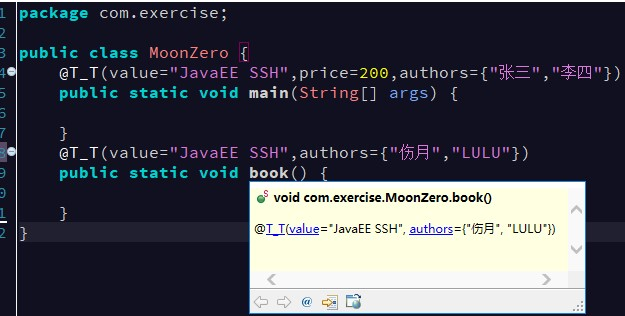

# Java基础 - 注解(Annatation)

## 1. 概述

注解是 JDK1.5 之后的新特性。注解可以标记在类、接口、方法、成员变量，构造方法，局部变量等等元素上。

注解是给编译器或JVM查看的。编译器或JVM可以根据标记执行对应的功能。

Annatation(注解)是一个接口，程序可以通过反射来获取指定程序中元素的 Annotation 对象，然后通过该 Annotation 对象来获取注解中的元数据信息。

## 2. 注解作用

### 2.1. 注解使用例子

- 编译检查，如`@Override`。
- 生成帮忙文档
- **做为框架的配置方案（重点）**
    - XML配置
    - 注解配置

### 2.2. 扩展：框架的两种配置方案优缺点

注：框架 = 代码 + 配置（个性化）。框架（struts2,hibernate,spring)都提供了两种配置方案

- XML 配置：
    - 优点：配置信息和类分离，降低程序的耦合性（扩展性更好）
    - 缺点：每一个类需要对应一个XML文件，如果类很多，而XML文件也会很多。XML 维护成本高（可读性差）
- 注解配置：
    - 优点：将配置信息和类写在一起，可读性高，开发效率相对较高。
    - 缺点：程序耦合性高

## 3. Java常用内置注解的使用
### 3.1. @Override 注解

该注解只能用于修饰方法声明，表示该方法是限定重写父类方法。该注解只能用于方法

### 3.2. @Deprecated 注解

用于表示某个程序中的元素(类，方法等)已经过时。不建议继续使用，还是可以使用。

### 3.3. @SuppressWarnings 注解

`@SuppressWarnings` 注解的作用是抑制编译器警告。常用警告名称：

1. deprecation 忽略过时
2. rawtypes 忽略类型安全
3. unused 忽略不使用
4. unchecked 忽略安全检查
5. null 忽略空指针
6. all 忽略所有编译器警告

**注：如果多个警告就使用`{}`将多个警告包括起来，封装成字符串数组**

## 4. 自定义注解

属性的作用：可以给每个注解加上多个不同的属性，用户使用注解的时候，可以传递参数给属性，让注解的功能更加强大

### 4.1. 自定义注解格式

```java
修饰符 @interface 注解名 {

}
```

### 4.2. 注解的属性
#### 4.2.1. 属性定义格式

- 第1种定义方式：`数据类型 属性名();`
- 第2种定义方式：`数据类型 属性名() default 默认值;`
- **注意事项**：
    - **如果注解有定义了属性，且属性没有默认值，则在使用注解的时候，就需要给属性赋值**
    - **如果属性有默认值，则使用注解的时候，这个属性就可以不赋值。也可以重新赋值，覆盖原有的默认值**

#### 4.2.2. 注解支持的数据类型

- 8种数据类型都支持
- String
- Enum
- Class
- Annotation
- 以及上面类型的数组形式

### 4.3. 特殊属性名 value

- 如果注解中只有一个属性且属性名为 `value` 时，在使用注解时可以直接给出属性值而不需要给属性名。(省略 `value=` 部分)
- 无论这个 value 是单个元素还是数组，都可以省略。
- 如果注解中除了 value 属性还有其他属性，且其他属性中至少有一个属性没有默认值时，则 value 属性名不能省略。

```java
public @interface T_T {
    String value(); // 书名
    double price() default 100; // 价格
    String[] authors(); // 作者
}
```



## 5. 元注解

### 5.1. 元注解概念

Java 默认提供的注解，用于标识在注解上的注解，用来约束注解的功能，称为元注解。Java 所有的内置注解定义都使用了元注解。元注解有以下4种分类：

- `@Target`
- `@Retention`
- `@Inherited`
- `@Documented`

### 5.2. @Target 元注解

- **`@Target` 作用**：标识注解使用范围【*Annotation可被用于 packages、types（类、接口、枚举、Annotation 类型）、类型成员（方法、构造方法、成员变量、枚举值）、方法参数和本地变量（如循环变量、catch 参数）*】，如果不写默认是任何地方都可以使用。元注解可选的值来自于ElemetnType枚举类。(写在自定义注解的类上)
- **格式**：`@Target({TYPE, FIELD, METHOD, PARAMETER, CONSTRUCTOR, LOCAL_VARIABLE})`
- **元注解的默认值**：
    - `ElementType.TYPE`: 用在类和接口上
    - `ElementType.FIELD`：用在成员变量上
    - `ElementType.METHOD`: 用在成员方法上
    - `ElementType.PARAMETER`：用在方法参数（形式参数）上
    - `ElementType.CONSTRUCTOR`：用在构造方法上
    - `ElementType.LOCAL_VARIABLE`：用在局部变量上

### 5.3. @Retention 元注解

**`@Retention` 作用**：用来标识注解的生命周期（有效作用范围），可选取值来自 `RetentionPolicy` 枚举类：

- `RetentionPolicy.SOURCE`：注解只存在于 Java 源代码中，编译生成字节码文件和程序运行时就不存在了。（即源文件保留）
- `RetentionPolicy.CLASS`：注解存在于 Java 源代码、编译以后的字节码文件中，运行的时候内存就不存在，此注解是默认值。（即 class 保留）
- `RetentionPolicy.RUNTIME`：注解存在于 Java 源代码中、编译以后的字节码文件中、运行时的内存中，程序可以通过反射获取该注解。（即运行时保留）

### 5.4. @Inherited 元注解

**`@Inherited` 作用**：表示该注解可以被子类继承。如果一个使用了 `@Inherited` 修饰的 annotation 类型被用于一个 class，则这个 annotation 将被用于该 class 的子类。

### 5.5. @Documented 元注解

**`@Documented` 作用**：表示该注解会出现在帮忙文档（javadoc）中。描述其它类型的 annotation 应该被作为被标注的程序成员的公共 API，因此可以被例如 javadoc 此类的工具文档化。

## 6. 注解的原理

### 6.1. Annotation 接口

所有注解类型的公共接口，所有注解都是 `java.lang.annotation.Annotation` 的子类(类似所有类都 Object 的子类)

### 6.2. AnnotatedElement 接口

该接口中定义了一系列与注解解析相关的方法。**注：当前对象是指方法调用者**

```java
boolean isAnnotationPresent(Class<T> annotationClass)
```

- 判断当前对象是否使用了指定annotationClass的注解。如果使用了，则返回true，否则返回false

```java
T getAnnotation(Class<T> annotationClass)
```

- 根据注解的Class类型获得当前对象上指定的注解对象（注解类的对象)。需要向下转型成注解的类型，然后才能调用注解里的属性。

```java
Annotation[] getAnnotations()
```

- 获得当前对象及其从父类上继承的所有的注解对象数组

```java
Annotation[] getDeclaredAnnotations()
```

- 获得类中所有声明的注解，不包括父类的

### 6.3. 注解原理简述

注解本质是一个继承了 `Annotation` 的特殊接口，其具体实现类是 Java 运行时生成的动态代理类。通过反射获取注解时，返回的是 Java 运行时生成的动态代理对象。通过代理对象调用自定义注解的方法，最终会调用 `AnnotationInvocationHandler` 的 `invoke` 方法。该方法会从 `memberValues` 这个 Map 中索引出对应的值。而 `memberValues` 的来源是 Java 常量池。

## 7. 注解解析

### 7.1. 解析原则

注解作用在哪个成员上，就通过该成员对应的对象获得注解对象。

> 比如，注解作用在成员方法上，则通过成员方法对应的Method对象获得；作用在类上的，则通过Class对象获得

```java
// 得到方法对象
Method method = clazz.getDeclaredMethod("方法名");
// 得到方法上的注解
注解类 xx = (注解类) method.getAnnotation(注解类名.class);
```

### 7.2. 注解解析案例

```java
package level02.test02;

import java.lang.annotation.ElementType;
import java.lang.annotation.Retention;
import java.lang.annotation.RetentionPolicy;
import java.lang.annotation.Target;
import java.lang.reflect.Method;
import java.util.Arrays;

/*
 * 关卡2训练案例2
 * 	定义一个注解：Book
        * 包含属性：String value() 书名
        * 包含属性：double price() 价格，默认值为 100
        * 包含属性：String[] authors()  多位作者
    * 1、定义类在成员方法上使用 Book 注解
    * 2、解析获得该成员方法上使用注解的属性值。
*/
public class Day20Test02_02 {
    @SuppressWarnings({ "unchecked", "rawtypes" })
    public static void main(String[] args) throws Exception {
        // 使用反射获取Method对象
        Class clazz = Class.forName("level02.test02.Day20Test02_02");
        Method m = clazz.getDeclaredMethod("method");
        // 获取到的注解的对象，需要向下转型成注解的类型
        Book book = (Book) m.getAnnotation(Book.class);

        // 获取注解的值
        System.out.println(book.value());
        // 使用包装类的toString方法转到字符串再输出（直接输出也可以）
        System.out.println(Double.toString(book.price()));
        System.out.println(book.price());
        // 使用Arrays工具类的toString方法将数组输出
        System.out.println(Arrays.toString(book.authors()));
    }

    @Book(value = "傻的吗", authors = { "真的傻", "还是真的是傻的" })
    public static void method() {
        System.out.println("试试调用我呀");
    }
}

@Retention(RetentionPolicy.RUNTIME)
@Target(ElementType.METHOD)
@interface Book {
    String value();

    double price() default 100;

    String[] authors();
}
```
