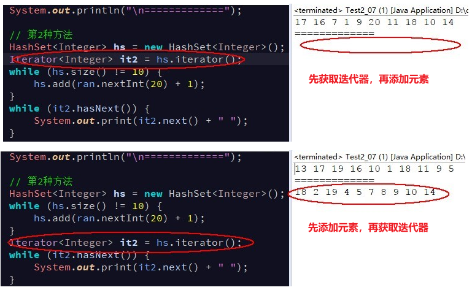
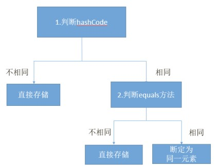
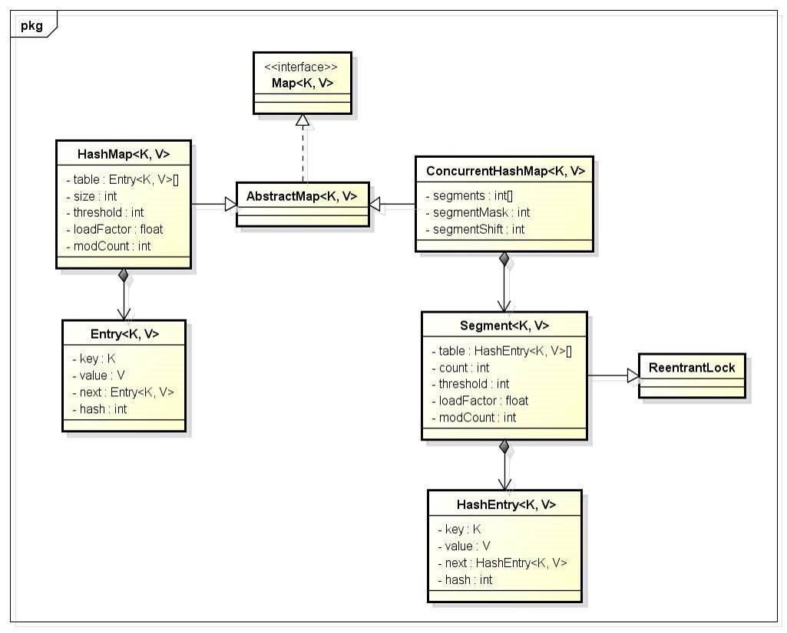

# Java 基础 - 集合

> Notes: **本笔记所有方法和示例基于 jdk1.8**

## 1. 集合

### 1.1. 集合类型

Java 集合框架支持两种不同类型的集合：

- `Collection`（单列集合）
- `Map`（双列集合）

而 `Collection`（单列集合）框架支持以下三种主要类型：

- **`Set`（规则集）**：用于存储一组不重复的元素。
- **`List`（线性表）**：用于存储一个由元素构成的有序集合。
- **`Queue`（队列）**：用于存储先进先出方式处理的对象。

> Tips: 这些集合的通用特性都被定义在 `java.util.Collection` 接口中，相应的集合类型的特性定义以上各自的接口中，并提供了各自不同实现类来实现具体的功能。

### 1.2. 单列集合(Collection)继承体系图

- Collection接口：所有单列集合的直接或间接接口，其指定了所有集合应该具备的基本功能。
    - List接口：元素可重复，有序，带索引。
        - ArrayList(重要)：底层是数组结构。ArrayList 的出现替代了 Vector，增删慢，查找快。
        - LinkedList(重要)：底层是链表结构。同时对元素的增删操作效率很高。
    - Set接口： 元素不能重复，无序，没有索引。
        - HashSet(重要)：底层是哈希表结构。在不重复的基础上无序。
        - LinkedHashSet：底层是哈希表结构结合链表结构。在不重复的基础上可预测迭代顺序。

**单列集合体系图**

> TODO: 待重画继承图


## 2. Collection 接口（单列集合）

### 2.1. Collection 概述

是所有单列集合的父接口（父类）。集合的项层的接口，它的子体系中有重复的，有唯一的，有有序的，有无序的。

Collection 就是没有索引的

### 2.2. Collection 集合接口的常用方法

```java
Collection<String> c = new ArrayList<>();
```

Collection 是接口，定义了集合相关的方法。**其实 `ArrayList` 等实现类就是实现 `Collection` 的以下的方法**

#### 2.2.1. 添加元素

```java
boolean add(E e);
```

- 添加一个元素

```java
boolean addAll(E e);
```

- 添加一个集合元素

#### 2.2.2. 删除元素

```java
boolean remove(Object o);
```

- 删除指定的元素

#### 2.2.3. 获取集合大小

```java
int size();
```

#### 2.2.4. 清空集合

```java
void clear();
```

- 将集合的所有元素清空。

#### 2.2.5. 判断功能

```java
boolean isEmpty();
```

- 判断集合是否为空。

#### 2.2.6. 综合示例

Code Demo:

```java
package day07;

import java.util.ArrayList;
import java.util.Collection;

/*
 * 关卡1训练案例 1
 * 	Collection 基本用法
 */
public class Test1_01 {
	public static void main(String[] args) {
		// 创建Collection对象，因Collection是接口，只能通过子类去创建对象
		Collection<String> c = new ArrayList<String>();
		// 往集合中添加对象元素
		c.add("a");
		c.add("b");
		c.add("c");
		c.add("d");
		c.add("e");
		// 输出集合[a, b, c, d, e]
		System.out.println(c);
		// 删除元素
		c.remove("c");
		// remove不存在的元素，不报错，没有效果
		c.remove("f");
		//输出集合[a, b, d, e]
		System.out.println(c);
		// 获取集合大小：4
		System.out.println("Collection集合的大小是：" + c.size());
		// 清空集合+判断集合是否是空 输出 false
		System.out.println("Collectiong集合是否为空：" + c.isEmpty());
		c.clear();
		//输出true
		System.out.println("Collectiong集合是否为空：" + c.isEmpty());
		// 输出集合内容 []
		System.out.println(c);
	}
}
```

## 3. List 接口

List 接口用来定义有序(存取顺序一致)，有索引，元素可重复的集合

### 3.1. 接口概述

```java
public interface List<E> extends Collection<E>
```

List 是一个元素存取有序、带有索引、并且可以存储重复元素的集合。例如：存元素的顺序是11、22、33。那么集合中，元素的存储就是按照11、22、33的顺序完成的；通过索引就可以精确的操作集合中的元素（与数组的索引是一个道理）

由于 List 集合拥有索引，因此 List 集合迭代方式除了使用迭代器之外，还可以使用索引进行迭代。遍历方法分别是：<font color=red>**普通for，增强for，迭代器**</font>。

#### 3.1.1. List 集合存储数据的结构

List 接口下有很多个集合实现，它们存储元素所采用的结构方式是不同的，这样就导致了这些集合有它们各自的特点，供给开发者在不同的环境下进行使用。

#### 3.1.2. 接口的常见实现类

- ArrayList
- LinkedList
- Vector

### 3.2. 接口常用的方法

#### 3.2.1. 增加元素

```java
boolean add(Object e);
```

- 向集合末尾处，添加指定的元素 

```java
boolean add(int index, Object e);
```

- 向集合指定索引处，添加指定的元素，原有元素依次后移

#### 3.2.2. 删除元素

```java
boolean remove(Object e);
```

- 将指定元素对象，从集合中删除，返回值为被删除的元素

```java
boolean remove(int index);
```

- 将指定索引处的元素，从集合中删除，返回值为被删除的元素

```java
void clear();
```

- 清空集合

#### 3.2.3. 替换元素

```java
E set(int index, E element);
```

将指定索引处的元素，替换成指定的元素，返回值为替换前的元素

#### 3.2.4. 查询元素

```java
E get(int index);
```

获取指定索引处的元素，并返回该元素

### 3.3. ArrayList

#### 3.3.1. 简介

<font color=red>**ArrayList 集合底层数据存储的结构是数组结构。数组实现的特点：<u>元素查询快，增删慢，线程不安全（效率高）</u>**</font>。可以在集合中存储任意类型的数据，由于日常开发中使用最多的功能为查询数据、遍历数据，所以 ArrayList 是最常用的集合。

开发时随意地使用 ArrayList 完成任何需求，并不严谨，这种用法不提倡。

```java
public class ArrayList<E> extends AbstractList<E>
        implements List<E>, RandomAccess, Cloneable, java.io.Serializable
```

**线程安全性**：

对 ArrayList 的操作一般分为两个步骤，改变位置(size)和操作元素(e)。所以这个过程在多线程的环境下是不能保证具有原子性的，因此 ArrayList 在多线程的环境下是线程不安全的。

#### 3.3.2. ArrayList 数组实现的原理

数组实现的特点：查询快，增删慢，线程不安全（效率高）。原因：

- <font color=red>**查询快**</font>：由于数组的索引支持，那么可以通过索引直接计算出元素的地址值，因此就可以直接通过元素的地址值获取到指定的元素
- <font color=red>**增删慢**</font>：由于在添加元素的时候，实际上底层会先创建一个新数组(新数组的长度为原数组的长度+1)，那么在添加新元素的时候，先需要对数组中原有的数据进行拷贝，其次在末尾进行添加新的元素。因此，这样操作的效率的极低的(删除元素刚好和添加的操作相反)

> Tips: 增删慢的情况是基于，数组的原长度不够，并且非在数组尾部插入数据的情况。若数组的长度足够并且在尾部插入新的元素，其他操作的效率甚至比链表更快。

#### 3.3.3. RandomAccess 接口

Java Collections 框架中提供了一个 `RandomAccess` 接口，用来标记 List 实现是否支持 Random Access。

```java
public interface RandomAccess {
}
```

- 如果一个数据集合实现了该接口，就意味着它支持 Random Access，按位置读取元素的平均时间复杂度为 O(1)，如 `ArrayList`
- 如果没有实现该接口，表示不支持 Random Access，如 `LinkedList`

#### 3.3.4. ArrayList 优缺点

优点：

1. 因为其底层是数组，所以修改和查询效率高。
2. 可自动扩容(1.5倍)。

缺点：

1. 插入和删除效率不高。
2. 线程不安全。

ArrayList 比较适合顺序添加、随机访问的场景。

#### 3.3.5. ArrayList 的 contains 方法判断元素（自定义类型）是否存在的原理

ArrayList 的 `contains` 方法，会调用方法传入的元素的 equals 方法依次与集合中的旧元素所比较，从而根据返回的布尔值判断是否有重复元素。

当 ArrayList 存放**自定义类型**时，由于自定义类型在未重写 equals 方法前，判断是否重复的依据是比较对象的地址值，所以<font color=red>**如果想根据内容判断是否为重复元素，需要重写元素的 equals 方法**</font>

### 3.4. LinkedList

#### 3.4.1. 概述

<font color=red>**LinkedList 集合底层数据存储的实现是双向链表结构，<u>查询慢，增删快，线程不安全（效率高）</u>**</font>。

> Notes: 数据结构基础之双向链表
>
> 双向链表也叫双链表，是链表的一种，它的每个数据结点中都有两个指针，分别指向直接后继和直接前驱。所以，从双向链表中的任意一个结点开始，都可以很方便地访问它的前驱结点和后继结点。

LinkedList 与 ArrayList 不同的是，在对 LinkedList 进行插入和删除操作时，只需在对应的节点上插入或删除元素，并将前后的节点元素的指针指向该节点即可，数据不需要进行复制移动，因此随机插入和删除效率很高。

LinkedList 还提供了在 List 接口中未定义，<font color=red>用于操作链表头部和尾部的元素</font>的方法，因此有时也可以被当作堆栈、队列或双向队列使用。

#### 3.4.2. LinkedList 链表实现的原理

链表结构：查询慢，增删快，线程不安全（效率高）。其原因：

- <font color=red>**查询慢**</font>：由于不能直接找到元素的地址，需要上一个元素推导出下一个元素的地址，因为在进行随机访问时，需要从链表头部一直遍历到要查找的节点为止，这种查询速度较慢。
- <font color=red>**增删快**</font>：在添加的时候，只需要更改元素所记录的地址值即可

链表查询元素是判断索引是否大于集合元素个数的一半来决定从表头还是表尾开始查询。如果大于一半，则从表尾开始查找，否则从表头开始查找。

#### 3.4.3. LinkedList 常用特有方法

```java
void addFirst(E e);
```

- 将指定元素添加到链表头

```java
void addLast(E e);
```

- 将指定元素添加到链表尾

```java
E removeFirst()
```

- 移除并返回此列表的第一个元素。

```java
E removeLast()
```

- 移除并返回此列表的最后一个元素。

```java
E getFirst();
```

- 返回此列表的第一个元素。

```java
E getLast();
```

- 返回此列表的最后一个元素。

#### 3.4.4. ArrayList 和 LinkedList 的区别与选择

区别：

- **数据结构实现**：ArrayList 是动态数组的数据结构实现，而 LinkedList 是双向链表的数据结构实现。
- **随机访问效率**：ArrayList 比 LinkedList 在随机访问的时候效率要高，因为 LinkedList 是线性的数据存储方式，所以需要移动指针从前往后依次查找。
- **增加和删除效率**：
    - 在非首尾的增加和删除操作，LinkedList 要比 ArrayList 效率要高，因为 ArrayList 的扩容机制的存在，增删操作时超出存储长度时，需要新建数组，再将原数组中的数据复制到新数组中。要影响数组内的其他数据的下标。
    - 但如果在 ArrayList 指定了合适的初始容量，并且使用尾部插入数据（没有触发数组的扩展）时，会极大提升性能，甚至超过 LinkedList（增删操作还需要创建大量的 node 对象）的效率
- **内存区域与空间占用**：
    - LinkedList 比 ArrayList 更占内存，因为 LinkedList 的节点除了存储数据，还存储了两个引用，一个指向前一个元素，一个指向后一个元素。
    - ArrayList 是连续内存存储；而 LinkedList 分散在内存中，
- **线程安全**：ArrayList 和 LinkedList 都是不同步的，也就是不保证线程安全；

一些类型选择与使用建议：

- 如果需要大量非首尾增删元素，则建议使用 LinkedList
- 如果只是遍历查询元素，不进行增删操作，则建议使用 ArrayList
- <font color=red>**遍历 LinkedList 必须使用 Iterator 而不使用 for 循环，因为每次 for 循环体内通过 `get(i)` 方法获取指定元素时，需要对整个集合重新进行遍历，性能消耗极大**</font>
- 尽量不要试图使用 `indexOf` 等方法返回元素的索引，并利用其进行遍历。使用 `indexOf` 对集合进行遍历，当结果为空时会遍历整个集合。

### 3.5. Vector（了解）

#### 3.5.1. 概述

`Vector` 集合数据存储的结构是数组结构，为 JDK 中最早提供的集合。

```java
public class Vector<E>
    extends AbstractList<E>
    implements List<E>, RandomAccess, Cloneable, java.io.Serializable
```

`Vector` 中提供了一个独特的取出方式，就是枚举 `Enumeration`，它其实就是早期的迭代器。此接口 `Enumeration` 的功能与 `Iterator` 接口的功能是类似的。`Vector` 集合已被 `ArrayList` 替代。枚举 `Enumeration` 已被迭代器 `Iterator` 替代。

`Vector` 最大的特点是线程安全但效率低，因为 Vector 类的所有方法（如 `add`、`set`、`delete` 等）均是 `synchronized` 修饰的同步方法，在多线程访问的情况下，只允许一个线程进行增删改操作。后面已经不再建议使用，而 Arraylist 不是同步的，其效率比较高，在不需要保证线程安全时建议使用 Arraylist。

#### 3.5.2. ArrayList 和 Vector 的区别

此两个类都实现了 List 接口（List 接口继承了 Collection 接口），它们都是有序集合

- **线程安全**：Vector 使用了 `Synchronized` 来实现线程同步，是线程安全的，而 ArrayList 是非线程安全的。
- **性能**：ArrayList 在性能方面要优于 Vector。
- **扩容**：ArrayList 和 Vector 都会根据实际的需要动态的调整容量，只不过在 Vector 扩容每次会增加 1 倍，而 ArrayList 只会增加 50%。

### 3.6. Stack 栈结构（了解）

#### 3.6.1. 概述

java 提供了一个专门用于栈结构的类：`java.util.Stack`

```java
public class Stack<E> extends Vector<E>
```

Stack 类表示后进先出（LIFO）的对象堆栈。

#### 3.6.2. 常用方法

```java
public E peek();
```

- 查看堆栈顶部的对象，但不从堆栈中移除它。

```java
public E push(E item);
```

- 把项压入堆栈顶部。(压栈)

```java
public E pop();
```

- 移除堆栈顶部的对象，并作为此函数的值返回该对象。(弹栈)

### 3.7. 集合与数组之间的转换

#### 3.7.1. 集合转数组( List 类方法)

集合（如：ArrayList）转数组使用的是，Collection 接口的 `toArray()` 方法，ArrayList 和 LinkedList 都有承继该方法。

**方式一**：

```java
public Object[] toArray()
```

- 将集合内容转成一个对象数组。如果需要下一步操作，需要进行向下转型。按适当顺序（从第一个到最后一个元素）返回包含此列表中所有元素的数组。

```java
ArrayList<String> list = new ArrayList<>();
Object[] arr = list.toArray();
String str = (String) arr[0];
```

**方式二**：

```java
public <T> T[] toArray(T[] a)
```

- 将集合中的元素添加至指定的数组中。按适当顺序（从第一个到最后一个元素）返回包含此列表中所有元素的数组；返回数组的运行时类型是指定数组的运行时类型。
    - 如果传入的数组的长度大于等于集合元素的个数时，则方法内部直接将集合中元素添加到指定的数组中，并返回该数组。
    - 如果传入的数组的长度小于集合元素的个数时，则方法内部会创建一个新的数组，新数组的类型与传入的数组类型一致，新数组的长度等于集合元素的个数，并且将集合中的元素添加到新数组中，返回新的数组。

```java
ArrayList<String> list = new ArrayList<>();
String[] strs = new String[list.size()];
list.toArray(strs);	
```

#### 3.7.2. 数组转集合（使用 Arrays 工具类方法）

```java
public static <T> List<T> asList(T... a);
```

Arrays 工具类的静态方法，将数组的内容添加到一个集合中，并返回集合对象。。方法的形参是可变参数类型，可变参数本质也是数组，传入实际数组，将该数组转成集合返回

> Notes: 通过 `asList` 方法将数组转成集合之后，<font color=red>**获得的集合是固定大小的集合，不支持向集合中添加或删除元素。**</font>，否则会抛出 `UnsupportedOperationException` 异常

可以使用有参数构造方法，将其转成可以增删的新的集合

```java
ArrayList<String> array = Arrays.asList(arr);
ArrayList<String> newArray = new ArrayList<String>(array); // newArray 是可以增删的。
```

## 4. Iterator 迭代器

### 4.1. 概念

Iterator 迭代器，是一个接口，集合迭代(集合遍历)的工具。可以从一个 Collection 中使用迭代器方法来获取迭代器实例。迭代器取代了 Java 集合框架中的 Enumeration，并且迭代器允许调用者在迭代过程中移除元素。

```java
public interface Iterator<E>
```

Collection 集合元素的通用获取方式：在取元素之前先要判断集合中有没有元素，如果有，就把这个元素取出来，继续在判断，如果还有就再取出出来。一直把集合中的所有元素全部取出。这种取出方式专业术语称为迭代。集合中把这种取元素的方式描述在 `Iterator` 接口中。

不同的容器完成不同方式的数据存储。不同集合的特点不同，ArrayList 有序且可重复且带索引的集合。但是有的集合不带索引。所以如果使用其他集合，可能无法通过 `get+索引` 的方式获取元素。

> Notes: <font color=red>**所有集合的通用获取元素方法并不是通过索引获取，而是通过迭代器获取。**</font>

**迭代器的好处**：

- 屏蔽了众多集合的内部实现，提供了统一遍历方式。
- 所有的单列集合都可以使用迭代器遍历。
- Iterator 的特点是只能单向遍历，但是更加安全，因为它可以确保，在当前遍历的集合元素被更改的时候，就会抛出 ConcurrentModificationException 异常。

### 4.2. 迭代器 Iterator (接口)常用方法

```java
boolean hasNext()
```

- 用来判断当前指针指向的位置是否有元素可以迭代。如果返回 true，说明可以迭代。

```java
E next()
```

- 用来返回指针指向位置的元素，并把指针向后移动一位。**集合用来持有数据，所有常用集合都具备了可迭代功能 Iterator 方法，该方法用于迭代集合，是最为通用的集合迭代方法。**

> Notes: 如果集合中没有元素可迭代了，仍然调用 `next()` 方法，就会抛出异常（`java.util.NoSuchElementException`）。<font color=red>**真正使指针向后移动的是调用 `next()` 方法**</font>

```java
default void remove() {
    throw new UnsupportedOperationException("remove");
}
```

- 从迭代器指向的 collection 中移除迭代器返回的最后一个元素（可选操作）。

### 4.3. 迭代器的基础使用(重点)

#### 4.3.1. 集合的获取迭代器方法

通过子类调用父类 `Collection` 接口中的 `iterator()` 方法获得迭代器对象。

```java
Iterator<E> iterator();
```

示例：获取某个集合的迭代器实例对象。

```java
ArrayList<String> list = new ArrayList<>();
Iterator<String> it = list.iterator();
```

#### 4.3.2. 集合元素的迭代

```java
Iterator<e> it = list.iterator()
while(it.hasNext()){
    E ele = it.next(); // 返回指针指向位置的元素，并把指针向后移动一位。
	// ...do something
}
```

#### 4.3.3. 使用示例

```java
import java.util.ArrayList;
import java.util.Iterator;

/*
 * 案例：往 ArrayList 添加以下元素"abc1", "abc2", "abc3", "abc4"。使用迭代器获取 ArrayList 集合中的元素
 */
@Test
public void test() {
	// 创建ArrayListc对象,添加元素
	ArrayList<String> array = new ArrayList<String>();
	array.add("abc1");
	array.add("abc2");
	array.add("abc3");
	array.add("abc4");
	System.out.println(array);
	// 使用迭代器获取ArrayList集合元素
	// 调用父类Collection接口中的iterator()方法创建迭代器对象Iterator
	Iterator<String> it = array.iterator();
	// 使用Iterator迭代集合并输出结果
	while (it.hasNext()) {
		System.out.println(it.next());
	}
}
```

### 4.4. 迭代器使用注意事项

#### 4.4.1. 并发修改异常

在使用迭代器遍历集合的过程中调用了集合的 `add`、`clear` 等修改了集合元素的个数时就会出现并发修改异常(`java.util.ConcurrentModificationException`)。在 API 中对此异常的解释如下：

> public class ConcurrentModificationException extends RuntimeException 此异常可能会被抛出的方法，已检测到的对象的并发修改时，这样的修改是不允许的。例如，它通常是不允许一个线程而另一个线程遍历它修改集合。在一般情况下，迭代的结果是不确定的，在这种情况下。一些迭代器实现（包括所有通用收集实现的JRE提供）可以选择如果检测行为抛出该异常。迭代器这样做被称为快速失败迭代器，因为他们不能迅速、干净，而冒着任意的，非在将来一个不确定的时间确定的行为。
>
> 注意，这个例外并不总是表明对象已由一个不同的线程的并发性。如果一个线程问题序列的方法调用，违反合同的对象，对象可能抛出该异常。例如，如果一个线程修改直接收集的则是在一个快速失败迭代器集合的迭代，迭代器将抛出此异常。
> 
> 注意，快速失败行为不能得到保证的话，一般来说，不可能在不同步的并发修改的存在作出难以保证。快速失败的操作把 ConcurrentModificationException 尽最大努力的基础上。因此，要写一个程序，依靠这一例外的正确性错误：concurrentmodificationexception 只能用来检测错误。

解决并发修改异常问题有如下几种方式：

1. 在集合有索引的情况下，使用普通 for 遍历(不使用Iterator迭代)，如：

```java
ArrayList<String> array = new ArrayList<>();
// 集合添加元素...
for (int i = 0; i < array.size(); i++) {
    System.out.println(array.get(i));
}
```

2. 使用 `ListIterator` 迭代器遍历，<font color=red>**添加元素时不要调用集合对象的 `add` 方法，而是调用 `ListIterator` 对象的 `void add(E e)` 方法**</font>

```java
// 使用 ListIterator 解决并发修改问题
ListIterator<Student> listIt = list.listIterator();
while (listIt.hasNext()) {
    // 获得学生对象
    Student stu = listIt.next();
    // 判断是否是rose
    if (stu.getName().equals("rose")) {
        // 添加一个新学生对象
        listIt.add(new Student("老王", 30));
    }
    System.out.println(stu);
}
System.out.println(list);
```

#### 4.4.2. 获取迭代器后遍历前不能对原集合进行结构上修改

如果在创建迭代器后不将创建时的集合输出，如果再增加或者移除元素后，集合的地址值已经改变了，迭代器的指针原来指向的地址应该没有内容，所有没有任何元素可以输出。



#### 4.4.3. 循环时移除集合中的元素正确方式

若需要在循环中移除集合中的元素，不能使用集合中的 `remove` 方法，使用 Iterrator 对象中的 `remove` 方法。

```java
Iterator it=list.iterator();

while(it.hasNext()){
    Object e=it.next();
    if("b".equals(e)){
        it.remove();
    }
}
System.out.println(list);
```

一种最常见的错误代码如下：

```java
for(Integer i : list){
    list.remove(i)
}
```

### 4.5. 增强 for (foreach)

#### 4.5.1. 增强 for 概述

增强 for 循环是 JDK1.5 以后出来的一个高级 for 循环，专门用来遍历数组和集合的。

增强 for 的本质就是迭代器，它的内部原理其实是个 `Iterator` 迭代器，所以在遍历的过程中，不能对集合中的元素进行增删操作。它用于遍历 `Collection` 和数组。通常只进行遍历元素，不要在遍历的过程中对集合元素进行增删操作。

#### 4.5.2. 增强 for 语法格式

```java
for(元素的数据类型 变量名 : Collection 集合名或数组名){
	// do something...
}
```

Code Demo：

```java
@Test
public void test() {
	int[] arr = { 11, 22, 33 };
	// 使用增强for遍历数组
	for (int n : arr) {
		System.out.println(n);
	}
}
```

#### 4.5.3. 注意事项

如果使用增强 for 遍历的是引用数据类型的对象时，在循环体内部通过引用变量修改对象的成员变量值会影响集合或数组中对象的值。

### 4.6. ListIterator

#### 4.6.1. 概述

`ListIterator` 是一个更加强大的 `Iterator` 的子类型，但它只能用于各种 List 类的访问，`Iterator` 只能单向遍历。而 `ListIterator` 可以双向遍历（向前/后遍历），它还可以产生相对于迭代器在列表指向的当前位置的前一个和后一个元素的索引。并且可以使用 `set()` 方法替换它访问过的最后一个元素。

```java
public interface ListIterator<E> extends Iterator<E>
```

可以通过集合对象的 `listIterator()` 方法产生一个指向 List 开始处的 `ListIteraor`

```java
List<String> list = new ArrayList<>();
// ...添加元素
ListIterator<String> it = list.listIterator();
```

还可以通过调用 `ListIterator(n)` 方法创建一个一开始就指向索引列表 n 的元素处的 `ListIterator`

```java
List<String> list = new ArrayList<>();
// ...添加元素
ListIterator<String> it = list.listIterator(list.size()); // 这里指向了 List 的最后一个元素
```

#### 4.6.2. 常用方法

```java
boolean hasNext();
```

- 检查是否有下一个元素

```java
E next();
```

- 返回下一个元素

```java
boolean hasPrevious();
```

- 检查是否有前一个元素

```java
E previous();
```

- 返回前一个元素

```java
int nextIndex();
```

- 返回下一个元素的 Index

```java
int previousIndex();
```

- 返回当前元素的 Index

```java
void remove();
```

- 移除一个当前的元素

```java
void set(E e);
```

- 此方法替换访问过的最后一个元素，注意用 set 设置的是 List 列表的原始值

```java
void add(E e);
```

- 添加一个元素

#### 4.6.3. 使用示例

```java
@Test
public void test1() {
    List<Pet> pets = Pets.arrayList(8);
    ListIterator<Pet> it = pets.listIterator();
    while (it.hasNext()) {
        System.out.print(it.next() + ", " + it.nextIndex() + ", " + it.previousIndex() + "; ");
    }

    // Backwards:
    while (it.hasPrevious()) {
        System.out.print(it.previous().id() + " ");
    }

    System.out.println(pets);
    it = pets.listIterator(3);
    while (it.hasNext()) {
        it.next();
        it.set(Pets.randomPet());
    }
    System.out.println(pets);
}

@Test
public void test2() {
    List<Integer> src = Arrays.asList(1, 2, 3, 4, 5, 6, 7, 8, 9, 10);
    List<Integer> dest = new LinkedList<>(src);
    System.out.println("source: " + src);
    System.out.println("destination: " + dest);
    ListIterator<Integer> fwd = dest.listIterator();
    ListIterator<Integer> rev = dest.listIterator(dest.size()); // 这里将rev指向了List的最后一个元素
    int mid = dest.size() >> 1;
    for (int i = 0; i < mid; i++) {
        Integer tmp = fwd.next();
        fwd.set(rev.previous());
        rev.set(tmp);
    }

    System.out.println("source: " + src);
    System.out.println("destination: " + dest);
}
```

#### 4.6.4. Iterator 和 ListIterator 的区别

- Iterator 可以遍历 Set 和 List 集合，而 ListIterator 只能遍历 List
- Iterator 只能单向遍历，而 ListIterator 可以双向遍历（向前/后遍历）
- ListIterator 实现 Iterator 接口，然后添加了一些额外的功能，比如添加一个元素、替换一个元素、获取前面或后面元素的索引位置

## 5. Set 接口

### 5.1. 概述

Set 是无序(存取顺序不一致)，无索引，元素不可重复的集合

```java
public interface Set<E> extends Collection<E>
```

在 Set 集合中，对象元素的相等性比较是通过元素的 `equals` 与 `hashCode` 方法来判断。对象的相等性在本质上是对象的 `HashCode` 值相同，Java 依据对象的内存地址计算出对象的 `HashCode` 值。因此如果需要自定义比较两个对象是否相等，则必须同时重写对象的 `hashCode` 方法和 `equals` 方法。

### 5.2. Set 接口的实现类

HashSet

1. 没有索引
2. 不能重复
3. 存储没有顺序

LinkedHashSet(继承HashSet)

1. 没有索引
2. 不能重复
3. 存储和取出有顺序

### 5.3. 哈希表(数组和链表的组合体)

#### 5.3.1. 对象的哈希值

对象的哈希值，就是一个十进制整数。通过 `Object` 类的 `hashCode()` 的方法获得。是对象存储到 `HashSet` 的依据。子类可以重写该方法自己计算哈希值。

哈希表底层使用的也是数组机制，数组中也存放对象，而这些对象往数组中存放时的位置比较特殊，当需要把这些对象给数组中存放时，那么会根据这些对象的特有数据结合相应的算法，计算出这个对象在数组中的位置，然后把这个对象存放在数组中。而这样的数组就称为哈希数组，即就是哈希表。

当向哈希表中存放元素时，需要根据元素的特有数据结合相应的算法，这个算法其实就是 `Object` 类中的 `hashCode` 方法。由于任何对象都是 `Object` 类的子类，所以任何对象有拥有这个方法。即就是在给哈希表中存放对象时，会调用对象的 `hashCode` 方法，算出对象在表中的存放位置，这里需要注意，如果两个对象 `hashCode` 方法算出结果一样，这样现象称为哈希冲突，这时会调用对象的 `equals` 方法，比较这两个对象是不是同一个对象，如果 `equals` 方法返回的是 true，那么就不会把第二个对象存放在哈希表中，如果返回的是 false，就会把这个值存放在哈希表中。

<font color=purple>**总结：保证 `HashSet` 集合元素的唯一，其实就是根据对象的 `hashCode` 和 `equals` 方法来决定的。如果往集合中存放自定义的对象，那么保证其唯一则必须重写 `hashCode` 和 `equals` 方法，建立属于当前对象的比较方式。**</font>

#### 5.3.2. Object 的 hashCode 方法

Object 类的 hashCode 方法，返回值是一个十进值整数，默认是对象的内存地址值（十六进制）。默认情况下内存地址不一样 hashCode 就不一样。

String 类重写了 hashCode，只要字符内容相同，等到的哈希值就相同。

自定义的类如果要放到 HashSet 中，也需要重写 hashCode

#### 5.3.3. 哈希表结构的特点

只要看到类名上带有 Hash。说明它底层使用哈希表结构，HashSet 底层使用的是哈希表结构。

#### 5.3.4. 哈希表的存储元素详细过程(HashSet 判断元素唯一的原理)

1. 调用对象的 `hashCode()` 方法，获得要存储元素的哈希值。
2. 将哈希值与表的长度(即数组的长度)进行求余运算得到一个整数值，该值就是新元素要存放的位置(即是索引值)。
    - 如果索引值对应的位置上没有存储任何元素，则直接将元素存储到该位置上。
    - 如果索引值对应的位置上已经存储了元素，则执行第3步。
3. 遍历该位置上的所有旧元素，依次比较每个旧元素的哈希值和新元素的哈希值是否相同。
    - 如果有哈希值相同的旧元素，则执行第4步。
    - 如果没有哈希值相同的旧元素，则执行第5步。
4. 比较新元素和旧元素的地址是否相同
    - 如果地址值相同则用新的元素替换老的元素。停止比较。
    - 如果地址值不同，则新元素调用 equals 方法与旧元素比较内容是否相同。
        - 如果返回true，用新的元素替换老的元素，停止比较。
        - 如果返回false，则回到第3步继续遍历下一个旧元素。
5. 说明没有重复，则将新元素存放到该位置上并让新元素记住之前该位置的元素。



#### 5.3.5. hashCode 注意事项

假设有两个 `Person` 对象p1和p2，如果 `p1.equals(p2)` 为true。则 `p1.hashCode() == p2.hashCode()` 一定是 true 吗？ 答：一定。hashCode的官方协定：

1. 如果根据 `equals(Object)` 方法，两个对象是相等的。那么对这两个对象中的每个对象调用 `hashCode` 方法都必须生成相同的整数结果。
2. 如果根据 `equals(java.lang.Object)` 方法，两个对象不相等，那么对这两个对象中的任一对象上调用 `hashCode` 方法“不”要求一定生成不同的整数结果。但是，程序员应该意识到，为不相等的对象生成不同整数结果可以提高哈希表的性能。

### 5.4. HashSet 集合

#### 5.4.1. 概述

`HashSet` 集合的底层是哈希表结构，基于 `HashTable` 实现：查询快，增删快，线程不安全（效率高）

```java
public class HashSet<E>
    extends AbstractSet<E>
    implements Set<E>, Cloneable, java.io.Serializable
```

**HashSet 特性和基本使用**

- HashSet 是 Set 接口的子类，不包含相同元素，且无序，没有索引
- 底层是哈希表：数组和链表的组合体。底层采用 HashMap 来保存元素，其元素值都存放在 HashMap 的 key 中，而 value 统一为 PRESENT
- 哈希表的特点：查询和增删都比较快。

#### 5.4.2. HashSet 构造方法分析

```java
static final float DEFAULT_LOAD_FACTOR = 0.75f;

public HashMap() {
    this.loadFactor = DEFAULT_LOAD_FACTOR; // all other fields defaulted
}
```

比如：<font color=red>加载因子是0.75</font>，数组的长度为16，其中存入`16 * 0.75 = 12`个元素。如果再存入第十三个(大于12)元素。那么此时会扩充哈希表(再哈希)，底层会开辟一个长度为原长度<font color=red>2倍</font>的数组。把老元素拷贝到新数组中，再把新元素添加数组中。当`存入元素数量 > 哈希表长度 * 加载因子`，就要扩容，因此加载因子决定扩容时机。

#### 5.4.3. HashSet 保存元素的原理

`HashSet` 存放的是散列值，它是按照元素的散列值来存取元素的。`HashSet` 中的 `add` 方法的底层实现是调用 `HashMap` 的 `put` 方法，将元素的散列值（即 HashCode）作为 `HashMap` 的 key。

```java
public class HashSet<E>
    extends AbstractSet<E>
    implements Set<E>, Cloneable, java.io.Serializable
{
    private transient HashMap<E,Object> map;

    // Dummy value to associate with an Object in the backing Map
    private static final Object PRESENT = new Object();
    
    public HashSet() {
        map = new HashMap<>();
    }
    
    public boolean add(E e) {
        // 调用 HashMap 的 put 方法, PRESENT 是一个至始至终都相同的虚值
        return map.put(e, PRESENT)==null;
    }
    // ...
}
```

元素的散列值是通过元素的 `hashCode` 方法计算得到的，HashSet 首先判断两个元素的散列值是否相等，如果散列值相等，则接着通过 `equals` 方法返回的结果（true/false），来判断是否为同一个元素。

#### 5.4.4. HashSet 存储判断元素（自定义类型）重复的原理

##### 5.4.4.1. HashSet 的 add/contains 等方法判断元素是否重复原理

Set 集合不能存放重复元素，其添加方法在添加时会判断是否有重复元素，有重复不添加，没重复则添加。

HashSet 集合由于是无序的，其判断唯一的依据是元素类型的 `hashCode` 与 `equals` 方法的返回结果。规则如下：

1. 先判断新元素与集合内已经有的旧元素的 HashCode 值，如果不同，说明是不同元素，添加到集合
2. 如果 HashCode 值相同，再判断 equals 比较结果。返回 true 则相同元素，不添加；返回 false 则不同元素，添加到集合。

##### 5.4.4.2. 使用 HashSet 存储自定义类型

当使用HashSet存储<font color=red>自定义类型</font>，如果没有重写该类的 hashCode 与 equals 方法，则判断重复时，使用的是地址值，如果想<font color=red>**通过内容比较元素是否相同，需要重写该元素类的 `hashcode` 与 `equals` 方法**</font>

### 5.5. LinkedHashSet 集合

```java
public class LinkedHashSet<E>
    extends HashSet<E>
    implements Set<E>, Cloneable, java.io.Serializable
```

LinkedHashSet 继承自 HashSet，底层也是哈希表，由 LinkedHashMap 来实现存储元素，所有的方法和操作与 HashSet 一致，不包含重复元素，没有索引。唯一不同是可预测迭代顺序的 Set 集合。

### 5.6. TreeSet 集合

TreeSet 基于二叉树的原理对新添加的对象按照指定的顺序排序（升序、降序），每添加一个对象都会进行排序，并将对象插入二叉树指定的位置。

Integer和String等基础对象类型可以直接根据 TreeSet 的默认排序进行存储，而对于自定义的数据类型，TreeSet 要求存放的对象必须实现 `Comparable` 接口，并重写该接口提供的  `compareTo()` 比较元素方法，当插入元素时会回调该方法比较元素的大小从而进行排序。若重写该函数，返回 -1（或负整数）则表示升序，即当前对象(this)小于指定对象；返回 1（或正整数）则表示降序，即当前对象(this)大于指定对象

## 6. Queue 接口

### 6.1. 概述

java 提供了一个专门用于队列结构的接口：`java.util.Queue`

```java
public interface Queue<E> extends Collection<E> 
```

队列通常（但并非一定）以 FIFO（先进先出）的方式排序各个元素。

### 6.2. 常用方法

```java
boolean offer(E e);
```

- 将指定的元素插入此队列

```java
E poll();
```

- 获取并移除此队列的头，如果此队列为空，则返回 null。

```java
E peek();
```

- 获取但不移除此队列的头；如果此队列为空，则返回 null。

```java
E remove()
```

- 获取并移除此队列的头。此方法与 poll 唯一的不同在于：当队列为空时将抛出一个 `NoSuchElementException` 异常。 

### 6.3. BlockingQueue 接口（了解）

`java.util.concurrent.BlockingQueue` 接口继承 `Queue` 接口，也是一个队列。它有如下特点：

- 检索或移除一个元素的时候，它会等待队列变为非空
- 添加一个元素时，它会等待队列中的可用空间

`BlockingQueue` 接口是 Java 集合框架的一部分，主要<font color=red>**用于实现生产者-消费者模式**</font>。使用者不需要担心等待生产者是否有可用的空间，或消费者是否有可用的对象，因为它都在 `BlockingQueue` 的实现类中被处理了。Java 提供了 `BlockingQueue` 的实现有：

- `ArrayBlockingQueue`：一个由数组结构组成的有界阻塞队列。
- `LinkedBlockingQueue`：一个由链表结构组成的有界阻塞队列。
- `PriorityBlockingQueue`：一个支持优先级排序的无界阻塞队列。
- `DelayQueue`：一个使用优先级队列实现的无界阻塞队列。
- `SynchronousQueue`：一个不存储元素的阻塞队列。
- `LinkedTransferQueue`：一个由链表结构组成的无界阻塞队列。
- `LinkedBlockingDeque`：一个由链表结构组成的双向阻塞队列。

#### 6.3.1. ArrayBlockingQueue

`ArrayBlockingQueue` 是基于数组实现的有界阻塞队列。队列按照先进先出原则对元素进行排序，在**默认情况下不保证元素操作的公平性**。

队列操作的公平性指在生产者线程或消费者线程发生阻塞后再次被唤醒时，按照阻塞的先后顺序操作队列，即先阻塞的生产者线程优先向队列中插入元素，先阻塞的消费者线程优先从队列中获取元素。因为保证公平性会降低吞吐量，所以如果要处理的数据没有先后顺序，则对其可以使用非公平处理的方式。

可以通过 `ArrayBlockingQueue` 有参构造方法中的参数来指定是否为公平的阻塞队列

```java
// 大小为1000的公平队列
BlockingQueue<String> fairQueue = new ArrayBlockingQueue<>(1000, true);
// 大小为1000的非公平队列
BlockingQueue<String> unfairQueue = new ArrayBlockingQueue<>(1000, false);
```

#### 6.3.2. LinkedBlockingQueue

`LinkedBlockingQueue` 是基于链表实现的阻塞队列，该队列按照先进先出原则对元素进行排序。`LinkedBlockingQueue` **对生产者端和消费者端分别采用了两个独立的锁来控制数据同步**，可以将队列头部的锁理解为写锁，将队列尾部的锁理解为读锁，因此生产者和消费者可以基于各自独立的锁并行地操作队列中的数据，队列的并发性能较高。

```java
BlockingQueue<String> queue = new LinkedBlockingDeque<>(100);
```

#### 6.3.3. PriorityBlockingQueue

`PriorityBlockingQueue` 是一个支持优先级的无界队列，元素在默认情况下采用自然顺序升序排列。可以自定义实现 `compareTo` 方法来指定元素进行排序规则，或者在初始化 `PriorityBlockingQueue` 时指定构造参数 `Comparator` 来实现对元素的排序。

> Notes: **如果两个元素的优先级相同，则不能保证该元素的存储和访问顺序**。

```java
// 实现 Comparable 接口
public class Data implements Comparable<Data> {
    private int number; // 定义用来排序的字段

    public int getNumber() {
        return number;
    }

    public void setNumber(int number) {
        this.number = number;
    }

    // 自定义排序的规则：使用 number 字段来排序
    @Override
    public int compareTo(Data o) {
        return Integer.compare(this.number, o.getNumber());
    }
}

// 使用示例
@Test
public void tset() {
    // 元素实现 Comparable 接口并重写 compareTo 排序方法
    BlockingQueue<Data> queue = new PriorityBlockingQueue<>(100);
    // 构造函数中的直接使用 Comparator 实现
    BlockingQueue<Data> queue1 = new PriorityBlockingQueue<>(100, Comparator.comparingInt(Data::getNumber));
}
```

#### 6.3.4. DelayQueue

`DelayQueue` 是一个支持延时获取元素的无界阻塞队列，该队列底层使用 `PriorityQueue` 实现 。`DelayQueue` 队列中的元素必须实现 `Delayed` 接口，该接口定义了在创建元素时该元素的延迟时间，在内部通过为每个元素的操作加锁来保障数据的一致性。只有在延迟时间到后才能从队列中提取元素。此类型队列的运用于场景如下：

- **缓存系统的设计**：可以用 `DelayQueue` 保存缓存元素的有效期，使用一个线程循环查询队列，一旦能从队列中获取元素，则表示缓存的有效期到了。
- **定时任务调度**：使用 `DelayQueue` 保存即将执行的任务和执行时间，一旦从队列中获取元素，就表示任务开始执行。Java 中的 `TimerQueue` 就是使用 `DelayQueue` 实现的。

```java
// 定义延迟对象实现 Delayed 接口
public class DelayData implements Delayed {
    private int number; // 定义用来排序的字段

    public int getNumber() {
        return number;
    }

    public void setNumber(int number) {
        this.number = number;
    }

    @Override
    public long getDelay(TimeUnit unit) {
        return 5000L; // 设置队列 5s 延迟获取
    }

    // 自定义排序的规则：使用 number 字段来排序
    @Override
    public int compareTo(Delayed o) {
        DelayData d = (DelayData) o;
        return Integer.compare(this.getNumber(), d.getNumber());
    }
}

// 测试
@Test
public void tset() {
    // 创建延时队列
    DelayQueue<DelayData> queue = new DelayQueue<>();
    // 实时添加数据
    queue.add(new DelayData());
    while (true) {
        try {
            DelayData data = queue.take(); // 延迟 5s 后才能获取数据
        } catch (InterruptedException e) {
            throw new RuntimeException(e);
        }
    }
}
```

#### 6.3.5. SynchronousQueue

`SynchronousQueue` 是一个不存储元素的阻塞队列。队列中的每个 `put` 操作都必须等待一个 `take` 操作完成，否则不能继续添加元素。`SynchronousQueue` 它负责把生产者线程的数据直接传递给消费者线程，非常适用于传递型场景，比如将在一个线程中使用的数据传递给另一个线程使用 。`SynchronousQueue` 的吞吐量高于 `LinkedBlockingQueue` 和 `ArrayBlockingQueue`。具体的使用方法如下：

```java
public static void main(String[] args) {
    SynchronousQueue<Integer> queue = new SynchronousQueue<>();
    // 模拟生产者线程
    new Thread(() -> {
        try {
            for (int i = 0; i < 5; i++) {
                int product = new Random().nextInt(1000);
                queue.put(product); // 生产一个随机数放入队列
                System.out.println("product a data: " + product);
            }
        } catch (InterruptedException e) {
            e.printStackTrace();
        }
    }).start();
    // 模拟消费者线程
    new Thread(() -> {
        while (true) {
            try {
                Integer data = queue.take();
                System.out.println("customer a data: " + data);
            } catch (InterruptedException e) {
                throw new RuntimeException(e);
            }
        }
    }).start();
}
```

#### 6.3.6. LinkedTransferQueue

`LinkedTransferQueue` 是基于链表结构实现的无界阻塞 `TransferQueue` 队列。相对于其他阻塞队列有如下几个特有方法：

```java
void transfer(E e) throws InterruptedException;
```

- 如果当前有消费者正在等待接收元素，该方法就会直接把生产者传入的元素投递给消费者并返回 true；如果没有消费者在等待接收元素，该方法就会将元素存放在队列的尾部（tail）节点，直到该元素被消费后才返回。

```java
boolean tryTransfer(E e);
```

- 此方法首先尝试能否将生产者传入的元素直接传给消费者，如果没有消费者等待接收元素，则返回 false。和 `transfer` 方法的区别是，无论消费者是否接收元素，`tryTransfer` 方法都立即返回，而 `transfer` 方法必须等到元素被消费后才返回。

```java
boolean tryTransfer(E e, long timeout, TimeUnit unit) throws InterruptedException;
```

- 此方法首先尝试把生产者传入的元素直接传给消费者，如果没有消费者，则等待指定的时间，在超时后如果元素还没有被消费，则返回 false，否则返回 true。

#### 6.3.7. LinkedBlockingDeque

`LinkedBlockingDeque` 是基于链表结构实现的双向阻塞队列，可以在队列的两端分别执行插入和移出元素操作。因此在多线程同时操作队列时，可以减少一半的锁资源竞争，提高队列的操作效率。在初始化 `LinkedBlockingDeque` 时，可以设置队列的大小以防止内存溢出，双向阻塞队列也常被用于工作窃取模式。

LinkedBlockingDeque 比其他阻塞队列，多了一些特有方法，如：`addFirst`、`addLast`、`offerFirst`、`offerLast`、`peekFirst`、`peekLast` 等方法。以 `First` 结尾的方法表示在队列头部执行插入（add）、获取（peek）、移除（offer）操作；以 `Last` 结尾的方法表示在队列的尾部执行插入、获取、移除操作。

## 7. Map 接口（双列集合）

### 7.1. 概述

只要是 Map 接口的实现类，都属于双列集合。将键映射到值的对象。一个映射不能包含重复的键；每个键最多只能映射到一个值

#### 7.1.1. Map（双列集合）继承体系图

> TODO: 待重画继承图


#### 7.1.2. Map 接口的特点(重点)

- 每个元素是由两部分组成，一部分称为键(key)，一部分称为值(Value);
- 键和值称为键值对；
- 键必须唯一，值可以重复。
- Map 集合的数据结构仅仅针对键有效，与值无关。
- 基于键的 HashCode 值唯一标识一条数据，同时基于键的 HashCode 值进行数据的存取。

#### 7.1.3. Map 集合的初始化

```java
public interface Map<K,V>
```

- 泛型`K`：此映射所维护的键的类型(key就是键)
- 泛型`V`：映射值的类型(values就是值)

> Tips: k和v不需要同一种类型，但必须都是引用类型，如int会报错，需要定义为 Integer); Map 集合类似词典索引，通过key可以找到value

创建对象时，要分别制定键的泛型与值的泛型。以初始化一个HashMap对象为例：

```java
HashMap<String, Integer> map = new HashMap<>(); // 最常用此写法
HashMap<String, Integer> map = new HashMap<String, Integer>();
HashMap<String, Integer> map = new HashMap(); // 但这种会报警告
```

#### 7.1.4. Map 接口中的常用方法

```java
public V put(K key, V value);
```

- 如果 map 中不存在该 key，就添加键值对元素，并返回null。相当于新增功能
- 如果 map 中存在该 key，就修改键值对元素，并返回旧的值。相当于修改功能

> Notes: 在此映射中关联指定值与指定键。如果该映射以前包含了一个该键的映射关系，则旧值被替换。即如果 key 之前已经包含一个 value，再调用 `put(k,v)`方法，那么旧的value就被替换成新的value，并返回与 key 关联的旧值；如果 key 没有任何映射关系，则返回 null。（返回 null 还可能表示该映射之前将 null 与 key 关联。）

```java
public V get(Object key);
```

- 根据指定的键获取到相应的值。如果键不存在，则返回 null

```java
public V remove(Object key);
```

- 根据键删除这个元素，键和值都删除。并返回被删的键对应的值。如果键不存在，则没有效果并返回 null

```java
public int size();
```

- 获取键值对的数量(元素的个数)，返回此映射中的键-值映射关系数。(即目前集合中已经存了多少对键值对元素)

```java
public boolean containsKey(Object key)
```

- 如果此映射包含对于指定键的映射关系，则返回 true

```java
public boolean containsValue(Object value)
```

- 如果此映射将一个或多个键映射到指定值，则返回 true

```java
public boolean isEmpty()
```

- 如果Map集合为空，则返回 true

```java
public void clear();
```

- 清空Map集合

```java
public Set<K> keySet()
```

- Map获取所有的键，返回此映射中所包含的键的 Set 视图。

```java
public Collection<V> values();
```

- Map获取所有的值，返回此映射所包含的值的 Collection 视图。

### 7.2. Entry 接口

#### 7.2.1. 概述

```java
public interface Map<K,V> {
    // ...省略
    interface Entry<K,V> {
        ...
    }
}
```

`Entry<K,V>` 是 Map 的内部接口(嵌套接口，看做普通接口)，将一个键和值封装成了 Entry 对象，并存储在 Set 集合中。可以从一个 Entry 对象中获取一个键值对的键与值。

Entry 其中一个实现是 HashMap 的内部类。可以使用 `Map.Entry<K,V>` 来定义变量。通过调用 Map 对象 `entrySet` 方法，返回某个集合所有的键值对对象。

```java
Set<Map.Entry<K,V>> entrySet()
```

使用格式：

```java
Map<String, Object> map = new HashMap<>();
// 此方式导包 import java.util.Map.Entry;
Set<Entry<K,V>> entrySet = map.entrySet();

// 此方式，不需要额外导包
Set<Map.Entry<K,V>> entrySet = map.entrySet();
```

#### 7.2.2. Entry 接口常用方法

```java
k getKey();
```

获得 Entry 类对象的键

```java
V getValue();
```

获得 Entry 类对象的值

### 7.3. 遍历 Map 集合的方式

> Notes: <font color=red>**不能直接使用增强 for 或迭代器遍历，因为 Map 没有继承 `Iterable<E>` 接口。**</font>

#### 7.3.1. 通过 keySet 方法遍历

Map 没有迭代器方法，最常用的遍历方法：先获取所有键的集合，迭代该集合，依次获取每一个键，通过键找值。使用 `keySet()` 方法遍历流程：

1. 使用 `Set<K> keySet()` 方法，获取所有的键的 Set 集合。
2. 使用增强 for 或者迭代器遍历键的 Set 集合。
3. 通过 `V get(Object key)` 方法，获取每个键对应的值。

#### 7.3.2. 通过 entrySet 方法遍历

使用 `entrySet()` 方法获取某个集合所有的键值对对象，再进行遍历：

1. 通过 `entrySet()` 方法，获取所有的键值对对象的 Set 集合
2. 使用增强 for 或者迭代器遍历获取到每一个键值对对象
3. 通过键值对对象的 `getKey()` 拿到键
4. 通过键值对对象的 `getValue()` 拿到值

Code Demo:

```java
import java.util.Collection;
import java.util.HashMap;
import java.util.Map.Entry;
import java.util.Set;

public class EntrySetTest {
	public static void main(String[] args) {
		// 创建HashMap对象
		HashMap<String, String> hm = new HashMap<>();
		hm.put("剑圣主宰", "敌法师");
		hm.put("风暴之灵", "灰烬之灵");
		hm.put("炼金术士", "剧毒术士");
		hm.put("齐天大圣", "矮人火枪手");
		hm.put("斧王", "幽鬼");
		// 输出HashMap集合
		System.out.println(hm);
		System.out.println("==Collection<V> values()，直接获得HashMap集合的值==");

		// 通过Collection<V> values()，直接获得HashMap集合的值
		Collection<String> coll = hm.values();
		for (String s : coll) {
			System.out.println(s);
		}

		System.out.println("=====第1种方法遍历获取HashMap集合的键值对=====");
		// 第1种遍历Map集合值的方法：通过keySet()方法
		Set<String> key = hm.keySet();
		// 输出所有key的Set集合
		System.out.println("HashMap集合的键：" + key);
		// 使用增强for遍历set集合，通过key拿到value值
		for (String s : key) {
			System.out.println(s + "==" + hm.get(s));
		}

		// 第2种遍历Map集合值的方法：通过entrySet()方法
		// 创建Entry类对象的Set集合
		System.out.println("=====第2种方法遍历获取HashMap集合的键值对=====");
		Set<Entry<String, String>> entrySet = hm.entrySet();
		for (Entry<String, String> e : entrySet) {
			System.out.println(e.getKey() + "==" + e.getValue());
		}
	}
}
```

#### 7.3.3. 通过 Values 方法遍历

通过 Map 对象的 `Values()` 方法，获取所有值的 Collection 集合，再使用增加 for 循环遍历。

### 7.4. HashMap

#### 7.4.1. 概述

HashMap：基于哈希表的 Map 接口的实现类，并允许使用 **null** 的值和 null 的键（<font color=purple>**HashMap 最多只允许一条记录的键为 null，允许多条记录的值为 null。**</font>），

HashMap 有如下特点

 - 键是唯一，基于键的 HashCode 值唯一标识一条数据，同时基于键的 HashCode 值进行数据的存取。
 - <font color=red>**存储和取出无法保证顺序一致**</font>。
 - 非线程安全。同一时间有多个线程同时对 HashMap 进行写操作，将可能导致数据的不一致。*如需要满足线程安全的条件，可使用 `Collections` 的 `synchronizedMap` 方法使 HashMap 具有线程安全的能力，或者使用 `ConcurrentHashMap`*。

#### 7.4.2. 数据存储实现原理（TODO: 待整理）

> TODO: 待将面试题那边整理的移动到此处

> Notes: HashMap 实现原理在 Java 8 前后有很大区别。


##### 7.4.2.1. Java 8 以后的实现

为了减少链表遍历的开销，Java 8 对 HashMap 进行了优化，将数据结构修改为**数组+链表或红黑树**。在链表中的元素超过 8 个以后，HashMap 会将链表结构转换为红黑树结构以提高查询效率，因此其时间复杂度为 `O(log N)`。

##### 7.4.2.2. 常用参数

- capacity：当前数组的容量，默认为 16，可以扩容，扩容后数组的大小为当前的两倍，因此该值始终为2<sup>n</sup>。
- loadFactor：负载因子，默认为 0.75。
- threshold：扩容的阈值，其值等于 `capacity × loadFactor`。

### 7.5. LinkedHashMap

`LinkedHashMap` 继承 `HashMap`，是 `Map` 接口的实现类，并允许使用 null 值和 null 键，<font color=red>**键是唯一，存储和取出有顺序**</font>

LinkedHashMap 是基于哈希表(HashTable)的数据结构，该结构保证 key 唯一；使用链表(Linked)结构保存元素，从而保证元素有序性，怎么存就怎么取。*注：这些约束都是针对键起作用*

> Tips: 其他与 HashMap 的功能与用法一样。

### 7.6. TreeMap

#### 7.6.1. 概述

TreeMap 是基于二叉树数据结构存储数据。从功能上讲，有比 HashMap 更为强大的功能，它实现了 `SortedMap` 接口，即可以对元素进行排序，默认按键值的升序排序，也可以自定义排序比较器。

TreeMap 要求存放的键值对所映射的键对象必须实现 `Comparable` 接口，重写 `compareTo` 方法，从而根据键对元素进行排序。否则会抛出 `java.lang.ClassCastException` 异常

TreeMap 的性能略微低于 HashMap。如果在开发中需要对元素进行<font color=red>排序</font>，那么使用 HashMap 便无法实现这种功能，使用 TreeMap 的迭代输出将会以元素顺序进行。

#### 7.6.2. 与 LinkedHashMap 的区别

- LinkedHashMap 是基于元素进入集合的顺序或者被访问的先后顺序排序。
- TreeMap 则是基于元素的 key 固有顺序(由 Comparator 或者 Comparable 确定)进行排序。

### 7.7. Hashtable

```java
public class Hashtable<K,V>
    extends Dictionary<K,V>
    implements Map<K,V>, Cloneable, java.io.Serializable
```

`HashTable` 是旧版本的遗留类，很多映射的常用功能都与 `HashMap` 类似，不同的是它继承自 `Dictionary` 类，并且是线程安全的，同一时刻只允许一个线程对 `HashTable` 进行写操作，并发性不如 `ConcurrentHashMap`。

### 7.8. ConcurrentHashMap（网络资料，未整理）

ConcurrentHashMap 底层采用**分段的数组+链表**的方式来实现线程安全。

通过把整个Map分为N个Segment，可以提供相同的线程安全，但是效率提升N倍，默认提升16倍。(读操作不加锁，由于HashEntry的value变量是 volatile的，也能保证读取到最新的值。)

`Hashtable` 的 `synchronized` 是针对整张Hash表的，即每次锁住整张表让线程独占，`ConcurrentHashMap` 允许多个修改操作并发进行，其关键在于使用了锁分离技术。有些方法需要跨段，比如size()和containsValue()，它们可能需要锁定整个表而而不仅仅是某个段，这需要按顺序锁定所有段，操作完毕后，又按顺序释放所有段的锁。

扩容：段内扩容（段内元素超过该段对应Entry数组长度的75%触发扩容，不会对整个Map进行扩容），插入前检测需不需要扩容，有效避免无效扩容



从类图中可以看出来在存储结构中ConcurrentHashMap比HashMap多出了一个类Segment，而Segment是一个可重入锁。

ConcurrentHashMap 是使用了锁分段技术来保证线程安全的。

锁分段技术：首先将数据分成一段一段的存储，然后给每一段数据配一把锁，当一个线程占用锁访问其中一个段数据的时候，其他段的数据也能被其他线程访问。 

ConcurrentHashMap提供了与Hashtable和SynchronizedMap不同的锁机制。Hashtable中采用的锁机制是一次锁住整个hash表，从而在同一时刻只能由一个线程对其进行操作；而ConcurrentHashMap中则是一次锁住一个桶。

ConcurrentHashMap默认将hash表分为16个桶，诸如get、put、remove等常用操作只锁住当前需要用到的桶。这样，原来只能一个线程进入，现在却能同时有16个写线程执行，并发性能的提升是显而易见的。

### 7.9. 常用实现类的区别总结

#### 7.9.1. Hashtable 和 HashMap 的区别(面试题)

Hashtable 与 HashMap 都是 Map 接口的实现类。

- HashMap：可以存入 null，是不同步的，效率高，但线程不安全
- Hashtable：不能存入 null 值，是同步的，效率低，但线程安全

## 8. 集合相关的工具类API

### 8.1. Collections 工具类

Collection 集合的工具类，提供了大量的方法操作单列集合。里面都是静态方法。直接用`类名.静态方法`使用

**注：Collections是工具类，Collection是接口**

```java
public static <T> boolean addAll(Collection<? super T> c, T... elements)
```

- 将数组中的所有元素添加到指定的集合中。例如：

```java
ArrayList<String> array = new ArrayList<String>();
Collections.addAll(array, "a","b","c","d","e");
```

```java
public static <T> int binarySearch(List<?> list,T key)
```

- 此方法使用二分查找法(折半查找)查找指定元素
- 要求：二分法查询必须要求集合中的元素排好顺序(从小到大排序)
- 在集合List中查找指定的元素key,如果找到返回key在集合中的索引值(位置)
- 如果没找到，则返回= -插入点-1（插入点=-(返回值+1)）

```java
public static void shuffle(List<?> list)
```

- 对集合中的元素进行乱序操作（传入是List，只针对有顺序的集合）。使用默认随机源对指定列表进行置换。所有置换发生的可能性都是大致相等的。

```java
public static <T> void sort(List<T> list)
```

- 对集合元素进行排序，默认是升序排序。
- 有顺序(有序)：第一个元素是多少，第二个元素是多少，第几个元素对应的是第几，顺序不变。
- 排序：不管是第几个放的，只要到集合中(以 Integer 集合为例)，就按照一定的顺序重新排列了。
- 根据元素的自然顺序 对指定列表按升序进行排序。列表中的所有元素都必须实现 Comparable 接口。

```java
public static <T> void sort(List<T> list, Comparator<? super T> c)
```

- 对集合元素进行排序，集合的元素不需要实现 `Comparable` 接口，通过第二个参数 `Comparator` 来定义排序的逻辑。*可以使用 lambda 表达式来定义 `Comparator` 接口实现*

```java
public static void swap(List<?> list, int i, int j);
```

- 将集合中索引i和索引j位置交换。

```java
public static void reverse(List<?> list)
```

- 反转指定列表中元素的顺序。

#### 8.1.1. 创建不能修改的集合

```java
public static <T> Collection<T> unmodifiableCollection(Collection<? extends T> c)
```

创建一个只读集合，改变该集合的任何操作都会抛出 `java.lang.UnsupportedOperationException` 异常。

示例代码如下：

```java
List<String> list = new ArrayList<>();
list.add("x");
Collection<String> clist = Collections.unmodifiableCollection(list);
clist.add("y"); // 运行时此行报错
System.out.println(list.size());
```

#### 8.1.2. 创建线程安全的 List、Set、Map 集合

```java
public static <T> List<T> synchronizedList(List<T> list)
```

将指定的集合转化成支持的同步（线程安全的）集合。

参数说明：

- `list`：被“包装”在同步列表中的列表。 

示例：

```java
List<String> synchronizedList = Collections.synchronizedList(new ArrayList<>());
synchronizedList.add("aaa");
synchronizedList.add("bbb");

for (int i = 0; i < synchronizedList.size(); i++) {
    System.out.println(synchronizedList.get(i));
}
```

> Notes: `Collections` 工具类提供的以 `synchronized` 为前缀的方法，可以将 Set、Map 集合类包装成线程安全的集合类，具体用法与 `synchronizedList` 一样。如：
>
> - `public static <K,V> Map<K,V> synchronizedMap(Map<K,V> m)`
> - `public static <T> Set<T> synchronizedSet(Set<T> s) `

### 8.2. Arrays 类

Arrays 类是工具类，里面都是静态方法，需要导包。Arrays是用来操作**数组**中的元素。

```java
public static int binarySearch(Object[] a, Object key)
```

- 使用二分搜索法来搜索指定数组，以获得指定对象。**在进行此调用之前，必须根据元素的自然顺序对数组进行升序排序（通过 sort(Object[]) 方法）**。如果没有对数组进行排序，则结果是不确定的。（如果数组包含不可相互比较的元素（例如，字符串和整数），则无法 根据其元素的自然顺序对数组进行排序，因此结果是不确定的。）如果数组包含多个等于指定对象的元素，则无法保证找到的是哪一个。

```java
public static void sort(Object[] a)
```

- 根据元素的自然顺序对指定对象数组按**升序进行排序**。数组中的所有元素都必须实现 Comparable 接口。此外，数组中的所有元素都必须是可相互比较的

```java
public static String toString(xxx[] a)
```

- **返回指定数组内容的字符串表示形式**。字符串表示形式由数组的元素列表组成，括在方括号（"[]"）中。相邻元素用字符 ", "（逗号加空格）分隔。
- 可以直接打印输出返回的遍历数组的字符串。多个重载的方法，其中数组类型包括：boolean[], float[], double[], Object[], byte[], char[], short[], int[], long[];

```java
public static boolean equals(Object[] a, Object[] a2)
```

- 比较两个数组的元素是否完全相同(**元素个数，对应的内容要一致**)
- 如果两个指定的 Objects 数组彼此相等，则返回 true。如果两个数组包含相同数量的元素，并且两个数组中的所有相应元素对都是相等的，则认为这两个数组是相等的。

```java
public static void fill(Object[] a, Object val)
```

- 将数组中所有元素赋值为指定的值val。
- 将指定的 Object 引用分配给指定 Object 数组的每个元素。

### 8.3. Array 类

Array 类是工具类，里面都是静态方法。直接用类名.使用，需要导包

```java
public final class Arrayextends Object;
```
Array 类提供了动态创建和访问 Java 数组的方法。

```java
public static Object get(Object array, int index);
```

- 返回指定数组对象中索引组件的值。如果该值是一个基本类型值，则自动将其包装在一个对象中。
- 方法会throws IllegalArgumentException, ArrayIndexOutOfBoundsException;

```java
public static void set(Object array, int index, Object value);
```

- 将指定数组对象中索引组件的值设置为指定的新值。如果数组的类型为基本组件类型，则新值第一个被自动解包。
- 方法会throws IllegalArgumentException, ArrayIndexOutOfBoundsException;

### 8.4. LinkedList 类(未整理完)

```java
public boolean add(E e)
```

- 将指定元素添加到此列表的结尾

```java
public int size()
```

- 返回此列表的元素数

# 扩展知识

## 1. ArrayList 源码分析

### 1.1. 属性分析

```java
/**
 * 默认初始化容量
 */
private static final int DEFAULT_CAPACITY = 10;

/**
 * 如果自定义容量为0，则会默认用它来初始化ArrayList。或者用于空数组替换。
 */
private static final Object[] EMPTY_ELEMENTDATA = {};

/**
 * 如果没有自定义容量，则会使用它来初始化ArrayList。或者用于空数组比对。
 */
private static final Object[] DEFAULTCAPACITY_EMPTY_ELEMENTDATA = {};

/**
 * 这就是ArrayList底层用到的数组
 * 非私有，以简化嵌套类访问
 * transient 在已经实现序列化的类中，不允许某变量序列化
 */
transient Object[] elementData;

/**
 * 实际ArrayList集合大小
 */
private int size;

/**
 * 可分配的最大容量
 */
private static final int MAX_ARRAY_SIZE = Integer.MAX_VALUE - 8;
```

#### 1.1.1. 扩展：什么是序列化

序列化是指：将对象转换成以字节序列的形式来表示，以便用于持久化和传输。

实现方法：实现 `Serializable` 接口。

然后用的时候拿出来进行反序列化即可又变成Java对象。

#### 1.1.2. transient 关键字修饰的 elementData 属性解析

```java
/**
 * The array buffer into which the elements of the ArrayList are stored.
 * The capacity of the ArrayList is the length of this array buffer. Any
 * empty ArrayList with elementData == DEFAULTCAPACITY_EMPTY_ELEMENTDATA
 * will be expanded to DEFAULT_CAPACITY when the first element is added.
 */
transient Object[] elementData; // non-private to simplify nested class access
```

> Java中transient关键字的作用，简单地说，就是让某些被修饰的成员属性变量不被序列化。

ArrayList 实现了 `Serializable` 接口，意味着  ArrayList 支持序列化。而使用 `transient` 关键字声明的 `elementData` 属性，则这个变量不会参与序列化操作，即使所在类实现了Serializable接口，反序列化后该变量为空值。

> 那么问题来了：ArrayList 中数组声明：`transient Object[] elementData;`，事实上使用 ArrayList 在网络传输用的很正常，并没有出现空值。

原来是因为 ArrayList 还重写了 `writeObject` 方法实现：

```java
private void writeObject(java.io.ObjectOutputStream s)
    throws java.io.IOException{
    // Write out element count, and any hidden stuff
    int expectedModCount = modCount;
    s.defaultWriteObject();

    // Write out size as capacity for behavioural compatibility with clone()
    s.writeInt(size);

    // Write out all elements in the proper order.
    for (int i=0; i<size; i++) {
        s.writeObject(elementData[i]);
    }

    if (modCount != expectedModCount) {
        throw new ConcurrentModificationException();
    }
}
```

`ArrayList` 在每次序列化时，会调用`writeObject()`方法，首先会调用 `defaultWriteObject()` 方法序列化 ArrayList 中的非 `transient` 元素，如`size`和`element`等写入`ObjectOutputStream`，然后遍历 elementData 属性，只序列化已存入的元素，这样既加快了序列化的速度，又减小了序列化之后的文件大小。反序列化时调用`readObject()`，从`ObjectInputStream`获取`size`和`element`，再恢复到`elementData`。

> 那为什么不直接用elementData来序列化，而采用上诉的方式来实现序列化呢？

原因在于`elementData`是一个缓存数组，它通常会预留一些容量，等容量不足时再扩充容量，那么有些空间可能就没有实际存储元素，采用上诉的方式来实现序列化时，就可以保证只序列化实际存储的那些元素，而不是整个数组，从而**节省空间和时间**。

### 1.2. 构造方法分析

根据initialCapacity 初始化一个空数组，如果值为0，则初始化一个空数组:

```java
/**
 * 根据initialCapacity 初始化一个空数组
 */
public ArrayList(int initialCapacity) {
    if (initialCapacity > 0) {
        this.elementData = new Object[initialCapacity];
    } else if (initialCapacity == 0) {
        this.elementData = EMPTY_ELEMENTDATA;
    } else {
        throw new IllegalArgumentException("Illegal Capacity: " + initialCapacity);
    }
}
```

不带参数初始化，默认容量为10:

```java
/**
 * 不带参数初始化，默认容量为10
 */
public ArrayList() {
    this.elementData = DEFAULTCAPACITY_EMPTY_ELEMENTDATA;
}
```

通过集合做参数的形式初始化：如果集合为空，则初始化为空数组：

```java
/**
 * 通过集合做参数的形式初始化
 */
public ArrayList(Collection<? extends E> c) {
    elementData = c.toArray();
    if ((size = elementData.length) != 0) {
        // c.toArray might (incorrectly) not return Object[] (see 6260652)
        if (elementData.getClass() != Object[].class)
            elementData = Arrays.copyOf(elementData, size, Object[].class);
    } else {
        // replace with empty array.
        this.elementData = EMPTY_ELEMENTDATA;
    }
}
```

### 1.3. 主干方法

#### 1.3.1. trimToSize() 方法

> 用来最小化实例存储，将容器大小调整为当前元素所占用的容量大小。

```java
/**
 * 这个方法用来最小化实例存储。
 */
public void trimToSize() {
    modCount++;
    if (size < elementData.length) {
        elementData = (size == 0)
          ? EMPTY_ELEMENTDATA
          : Arrays.copyOf(elementData, size);
    }
}
```

#### 1.3.2. clone() 方法

> 用来克隆出一个新数组。

```java
public Object clone() {
    try {
        ArrayList<?> v = (ArrayList<?>) super.clone();
        v.elementData = Arrays.copyOf(elementData, size);
        v.modCount = 0;
        return v;
    } catch (CloneNotSupportedException e) {
        // this shouldn't happen, since we are Cloneable
        throw new InternalError(e);
    }
}
```

通过调用`Object`的`clone()`方法来得到一个新的`ArrayList`对象，然后将`elementData`复制给该对象并返回。

#### 1.3.3. add(E e) 方法

> 在数组末尾添加元素

```java
/**
 * 在数组末尾添加元素
 */
public boolean add(E e) {
    ensureCapacityInternal(size + 1);  // Increments modCount!!
    elementData[size++] = e;
    return true;
}
```

看到它首先调用了`ensureCapacityInternal()`方法.注意参数是size+1,这是个面试考点。

```java
private void ensureCapacityInternal(int minCapacity) {
    ensureExplicitCapacity(calculateCapacity(elementData, minCapacity));
}
```

这个方法里又嵌套调用了两个方法:计算容量+确保容量

计算容量：如果elementData是空，则返回默认容量10和size+1的最大值，否则返回size+1

```java
private static int calculateCapacity(Object[] elementData, int minCapacity) {
    if (elementData == DEFAULTCAPACITY_EMPTY_ELEMENTDATA) {
        return Math.max(DEFAULT_CAPACITY, minCapacity);
    }
    return minCapacity;
}
```

计算完容量后，进行确保容量可用：(modCount不用理它，它用来计算修改次数)

如果`size+1 > elementData.length`证明数组已经放满，则增加容量，调用`grow()`。

```java
private void ensureExplicitCapacity(int minCapacity) {
    modCount++;

    // overflow-conscious code
    if (minCapacity - elementData.length > 0)
        grow(minCapacity);
}
```

增加容量：默认1.5倍扩容。

1. 获取当前数组长度=>oldCapacity
2. oldCapacity>>1 表示将oldCapacity右移一位(位运算)，相当于除2。再加上1，相当于新容量扩容1.5倍。
3. 如果`newCapacity&gt;1=1`,`1&lt;2`所以如果不处理该情况，扩容将不能正确完成。
4. 如果新容量比最大值还要大，则将新容量赋值为VM要求最大值。
5. 将elementData拷贝到一个新的容量中。

```java
private void grow(int minCapacity) {
    // overflow-conscious code
    int oldCapacity = elementData.length;
    int newCapacity = oldCapacity + (oldCapacity >> 1);
    if (newCapacity - minCapacity < 0)
        newCapacity = minCapacity;
    if (newCapacity - MAX_ARRAY_SIZE > 0)
        newCapacity = hugeCapacity(minCapacity);
    // minCapacity is usually close to size, so this is a win:
    elementData = Arrays.copyOf(elementData, newCapacity);
}
```

##### 1.3.3.1. size+1的问题

> 好了，那到这里可以说一下为什么要size+1。

size+1代表的含义是：

1. 如果集合添加元素成功后，集合中的实际元素个数。
2. 为了确保扩容不会出现错误。

假如不加一处理，如果默认size是0，则0+0>>1还是0。

如果size是1，则1+1>>1还是1。有人问:不是默认容量大小是10吗?事实上，jdk1.8版本以后，ArrayList的扩容放在add()方法中。之前放在构造方法中。我用的是1.8版本，所以默认`ArrayList arrayList = new ArrayList();`后，size应该是0.所以,size+1对扩容来讲很必要.

```java
public static void main(String[] args) {
    ArrayList arrayList = new ArrayList();
    System.out.println(arrayList.size());
}

输出:0
```

事实上上面的代码是证明不了容量大小的，因为size只会在调用`add()`方法时才会自增。有办法的小伙伴可以在评论区大显神通。

#### 1.3.4. add(int index, E element) 方法

```java
public void add(int index, E element) {
    rangeCheckForAdd(index);

    ensureCapacityInternal(size + 1);  // Increments modCount!!
    System.arraycopy(elementData, index, elementData, index + 1,
                     size - index);
    elementData[index] = element;
    size++;
}
```

`rangeCheckForAdd()` 是越界异常检测方法。`ensureCapacityInternal()`之前有讲，着重说一下`System.arrayCopy`方法：

```java
public static void arraycopy(Object src, int srcPos, Object dest, int destPos, int length)
```

##### 1.3.4.1. 代码解释

- Object src : 原数组
- int srcPos : 从元数据的起始位置开始
- Object dest : 目标数组
- int destPos : 目标数组的开始起始位置
- int length : 要copy的数组的长度

示例：size为6，我们调用`add(2,element)`方法，则会从index=`2+1=3`的位置开始，将数组元素替换为从index起始位置为`index=2`，长度为`6-2=4`的数据。

> 

##### 1.3.4.2. 异常处理

```java
private void rangeCheckForAdd(int index) {
    if (index > size || index < 0)
        throw new IndexOutOfBoundsException(outOfBoundsMsg(index));
}
```

#### 1.3.5. set(int index, E element) 方法

```java
public E set(int index, E element) {
    rangeCheck(index);

    E oldValue = elementData(index);
    elementData[index] = element;
    return oldValue;
}

E elementData(int index) {
    return (E) elementData[index];
}
```

逻辑很简单，覆盖旧值并返回。

#### 1.3.6. indexOf(Object o) 方法

> 根据Object对象获取数组中的索引值。

```java
public int indexOf(Object o) {
    if (o == null) {
        for (int i = 0; i < size; i++)
            if (elementData[i]==null)
                return i;
    } else {
        for (int i = 0; i < size; i++)
            if (o.equals(elementData[i]))
                return i;
    }
    return -1;
}
```

如果o为空，则返回数组中第一个为空的索引；不为空也类似。

注意：通过源码可以看到，该方法是允许传空值进来的。

#### 1.3.7. get(int index) 方法

> 返回指定下标处的元素的值。

```java
public E get(int index) {
    rangeCheck(index);

    return elementData(index);
}
```

`rangeCheck(index)`会检测index值是否合法，如果合法则返回索引对应的值。

#### 1.3.8. remove(int index) 方法

> 删除指定下标的元素。

```java
public E remove(int index) {
    // 检测index是否合法
    rangeCheck(index);
    // 数据结构修改次数
    modCount++;
    E oldValue = elementData(index);

    // 记住这个算法
    int numMoved = size - index - 1;
    if (numMoved > 0)
        System.arraycopy(elementData, index+1, elementData, index,
                         numMoved);
    elementData[--size] = null; // clear to let GC do its work

    return oldValue;
}
```

这里又碰到了`System.arraycopy()`方法，详情请查阅上文。

大概思路：将该元素后面的元素前移，最后一个元素置空。

### 1.4. 集合的快速失败机制 “fail-fast”

“fail-fast”，即快速失败，它是 Java 集合的一种错误检测机制。当多个线程对集合（非 fail-safe 的集合类）进行结构上的改变的操作时，有可能会产生 fail-fast 机制，这个时候就会抛出 ConcurrentModificationException（当方法检测到对象的并发修改，但不允许这种修改时就抛出该异常）。

<font color=red>**同时需要注意的是，即使不是多线程环境，如果单线程违反了规则，同样也有可能会抛出改异常。**</font>

例如：假设存在两个线程（线程1、线程2），线程1通过 Iterator 在遍历集合A中的元素，在某个时候线程2修改了集合A的结构（是结构上面的修改，而不是简单的修改集合元素的内容），那么这个时候程序就会抛出 `ConcurrentModificationException` 异常，从而产生fail-fast机制。

#### 1.4.1. 源码分析

以下参考 `ArrayList` 源码的处理：

```java
public void forEach(Consumer<? super E> action) {
    Objects.requireNonNull(action);
    final int expectedModCount = modCount;
    @SuppressWarnings("unchecked")
    final E[] elementData = (E[]) this.elementData;
    final int size = this.size;
    for (int i=0; modCount == expectedModCount && i < size; i++) {
        action.accept(elementData[i]);
    }
    if (modCount != expectedModCount) {
        throw new ConcurrentModificationException();
    }
}
```

通过源码分析可知异常的原因：迭代器在遍历时直接访问集合中的内容，并且在遍历过程中使用一个 `modCount` 成员变量，它表示该集合实际被修改的次数。集合在被遍历期间如果内容发生变化，就会改变 `modCount` 的值。

`expectedModCount` 是 ArrayList 中的一个内部类 - `Itr` 中的成员变量（`Itr` 是一个 Iterator 的实现，使用 `ArrayList.iterator` 方法可以获取到的迭代器就是 Itr 类的实例。）。`expectedModCount` 表示这个迭代器期望该集合被修改的次数。其值是在 `ArrayList.iterator` 方法被调用的时候初始化的。只有通过迭代器对集合进行操作，该值才会改变。

每当迭代器使用`hashNext()`/`next()` 遍历下一个元素之前，都会检测 `modCount` 变量是否为 `expectedmodCount` 值，是的话就返回遍历；否则抛出异常，终止遍历。

#### 1.4.2. 对集合进行 add/remove 正常操作方式

1. 直接使用普通 for 循环进行操作，因为普通 for 循环并没有用到 Iterator 的遍历，所以压根就没有进行 fail-fast 的检验。但这种方案其实存在一个问题，那就是 remove 操作会改变 List 中元素的下标，可能存在漏删的情况。
2. 直接使用 Iterator 提供的 `remove` 方法进行操作。该方法可以修改到 `expectedModCount` 的值，那么就不会再抛出异常了。

```java
List<String> userNames = new ArrayList<String>() {{
    add("MooN");
    add("Zero");
    add("L");
    add("kirA");
}};

Iterator<String> iterator = userNames.iterator();
while (iterator.hasNext()) {
    if (iterator.next().equals("L")) {
        iterator.remove();
    }
}
```

3. 使用 Java 8 中 Stream 提供的 filter 过滤
4. 使用增强 for 循环，并且非常确定在一个集合中，某个即将删除的元素只包含一个的时候（比如对 `Set` 集合进行操作），只要在删除元素后立刻结束循环体，不再继续进行遍历，也就是说不让代码执行到下一次的 next 方法。

```java
List<String> userNames = new ArrayList<String>() {{
    add("MooN");
    add("Zero");
    add("L");
    add("kirA");
}};

for (String userName : userNames) {
    if (userName.equals("L")) {
        userNames.remove(userName);
        break;
    }
}
```

5. 直接使用 fail-safe 的集合类，例如使用 `CopyOnWriteArrayList`、`ConcurrentLinkedDeque` 等来替换 `ArrayList`。这种集合容器在遍历时不是直接在集合内容上访问的，而是先复制原有集合内容，在拷贝的集合上进行遍历，因此在遍历过程中对原集合所作的修改并不能被迭代器检测到，所以不会触发 `ConcurrentModificationException`。
> Tips: java.util.concurrent 包下的容器都是安全失败，可以在多线程下并发使用，并发修改。
6. 在遍历过程中，所有涉及到改变 `modCount` 值得地方全部加上 `synchronized`

### 1.5. 手写ArrayList(网上资料)

那面试手写ArrayList应该就不是问题了。下面网上资料的手写一个简单阉割版的ArrayList：

```java
public class MyArrayList {

    // 非私有，以简化嵌套类访问
    // transient 在已经实现序列化的类中，不允许某变量序列化
    transient Object[] elementData;

    //默认容量
    private static final int DEFAULT_CAPACITY = 10;

    // 用于空实例的 空数组实例
    private static final Object[] EMPTY_ELEMENTDATA = {};

    private static final Object[] DEFAULTCAPACITY_EMPTY_ELEMENTDATA = {};
    // 实际ArrayList集合大小
    private int size;
    /**
     * 构造方法
     */
    public MyArrayList(int initialCapacity) {
        if (initialCapacity > 0) {
            this.elementData = new Object[initialCapacity];
        } else if (initialCapacity == 0) {
            this.elementData = EMPTY_ELEMENTDATA;
        } else {
            throw new IllegalArgumentException("Illegal Capacity: "+
                    initialCapacity);
        }
    }
    public MyArrayList(){
        this(DEFAULT_CAPACITY);
    }

    public void add(Object o){
        //1. 判断数据容量是否大于 elementData
        ensureExplicitCapacity(size+1);
        //2. 使用下标进行赋值
        elementData[size++] = o;
    }
    private void ensureExplicitCapacity(int minCapacity){
        if (size == elementData.length){
            // 需要扩容,扩容1.5倍(ArrayList默认扩容1.5倍)
            // 注意：如果oldCapacity值为1
            int oldCapacity = elementData.length;
            int newCapacity = oldCapacity + (oldCapacity >> 1);
            // 如果新容量 < 最小容量， 则将最小容量赋值给新容量
            // 如果 oldCapacity=1, 则 minCapacity=1+1=2   newCapacity=1+(1>>1)=1
            if (newCapacity - minCapacity < 0){
                newCapacity = minCapacity;
            }
            // 创建新数组
            Object[] objects = new Object[newCapacity];
            // 将数据复制给新数组
            System.arraycopy(elementData, 0, objects, 0, elementData.length);
            // 修改引用
            elementData = objects;
        }
    }
    public Object get(int index) {
        rangeCheck(index);
        return elementData[index];
    }
    private void rangeCheck(int index) {
        if (index >= size)
            throw new IndexOutOfBoundsException("下标越界");
    }

    /**
     * 通过下标删除
     * @param index
     * @return
     */
    public Object remove(int index) {
        rangeCheck(index);

		// modCount++;
        // 先查出元素
        Object oldValue = elementData[index];
        // 找出置换结束位置
        int numMoved = size - index - 1;
        if (numMoved > 0)
            // 从 index+1 开始 将值覆盖为 index-numMoved 的值
            System.arraycopy(elementData, index+1, elementData, index, numMoved);
        elementData[--size] = null; // clear to let GC do its work

        return oldValue;
    }
    public boolean remove(Object o) {
            for (int index = 0; index < size; index++){
                if (o.equals(elementData[index])) {
                    remove(index);
                    return true;
                }
            }
        return false;
    }
}
```
