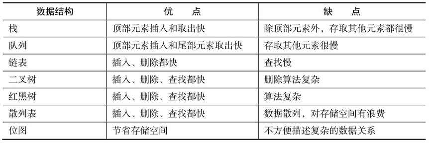
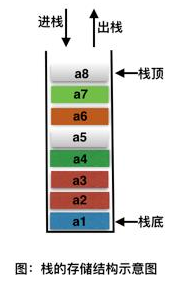
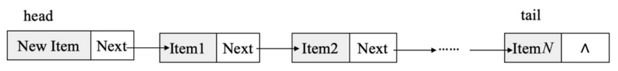
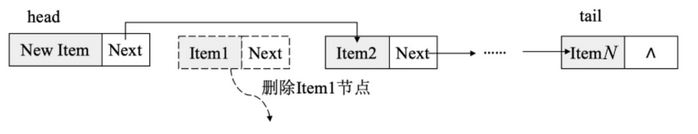
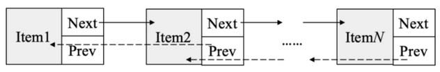
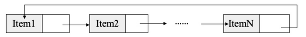
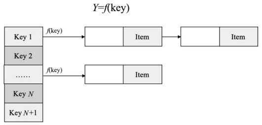
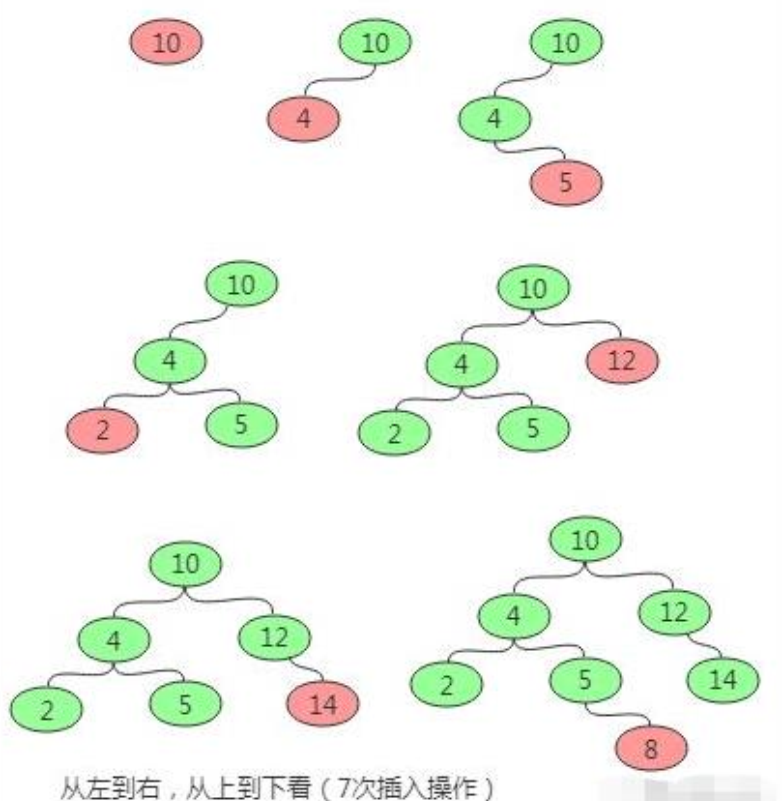

## 1. 数据结构概述

数据结构指数据的存储、组织方式。因此良好的数据结构对于程序的运行至关重要，尤其是在复杂的系统中，设计优秀的数据结构能够提高系统的灵活性和性能。

数据存储的常用结构有：**数组、栈、队列、链表**、二叉树、红黑树、散列表和位图。

## 2. 数组结构

- **查询元素快**：通过索引，可以快速访问指定位置的元素
- **增删元素慢**：
    - 指定索引位置增加元素：需要创建一个新数组，将指定新元素存储在指定索引位置，再把原数组元素根据索引，复制到新数组对应索引的位置。
    - 指定索引位置删除元素：需要创建一个新数组，把原数组元素根据索引，复制到新数组对应索引的位置，原数组中指定索引位置元素不复制到新数组中。

## 3. 堆栈结构（stack）

### 3.1. 概述

栈（Stack）又名堆栈，是允许在同一端进行插入和删除操作的特殊线性表。存储的元素是**先进后出**（即，存进去的元素，要在后它后面的元素依次取出后，才能取出该元素）(First In Last Out/FILO)。

栈的入口、出口的都是栈的顶端位置。允许进行插入和删除操作的一端叫作栈顶（Top）。另一端叫作栈底（Bottom），栈底固定，栈顶浮动。

以下是栈结构一些专用名词：

- **空栈**：栈中的元素个数为零时。
- **进栈（压栈）**：就是存元素。即，把元素存储到栈的顶端位置，栈中已有元素依次向栈底方向移动一个位置。
- **出栈（弹栈、退栈）**：就是取元素。即，把栈的顶端位置元素取出，栈中已有元素依次向栈顶方向移动一个位置。

### 3.2. 栈结构的核心方法

要实现一个栈，需要先实现以下核心方法：

- `push()`：向栈中压入一个数据，先入栈的数据在最下边。
- `pop()`：弹出栈顶数据，即移除栈顶数据。
- `peek()`：返回当前的栈顶数据。

### 3.3. 栈的 Java 实现

> TODO: 待整理

## 4. 队列结构（queue）

### 4.1. 概述

队列，是一种只允许在表的前端进行删除操作且在表的后端进行插入操作的线性表。存储的元素是**先进先出**（即，存进去的元素，要在后它前面的元素依次取出后，才能取出该元素）（First In First Out/FIFO）。

队列结构一些专用名词：

- **队尾**：执行插入操作的一端
- **队头**：执行删除操作的一端
- **空队列**：没有元素的队列
- **入队**：在队列中插入一个队列元素
- **出队**：从队列中删除一个队列元素

队列的入口、出口各占一侧，并且只允许在队头删除，在队尾插入，就可以实现先进先出的效果。

### 4.2. 队列结构的核心方法

要实现一个队列，需要先实现以下核心方法：

- `add()`：向队列的尾部加入一个元素（入队），先入队列的元素在最前边。
- `poll()`：删除队列头部的元素（出队）。
- `peek()`：取出队列头部的元素。

### 4.3. 队列的 Java 实现

> TODO: 待整理

## 5. 链表结构（link）

### 5.1. 概述

链表是由一系列节点，通过地址进行连接而组成的数据结构，节点可以在运行过程中动态生成。

> Notes: 链表中的每一个元素都叫作一个节点

为了表示每个数据元素与其直接后继数据元素之间的逻辑关系，每个节点存储包括两部分内容：

1. 存储元素本身的数据域
2. 存储直接后继数据元素的信息（即直接后继数据元素的存储地址的指针域）

#### 5.1.1. 链表的特点

链表通过一组存储单元存储线性表中的数据元素，这组存储单元可以是连续的，也可以是不连续的。由于节点包含了**元素数据**与**下一个元素的地址**这两部分信息，因此有以下特点：

- **查询元素慢**：想查找某个元素，从链表头或链表尾开始查找，需要通过连接的节点，依次向后一个个遍历查询指定元素。
- **增删元素快**：增删元素不需要移动元素的位置，只需要修改元素记录连接下个元素的地址值即可。

#### 5.1.2. 链表的分类

链表有 3 种不同的类型：单向链表、双向链表及循环链表。

### 5.2. 单向链表

#### 5.2.1. 组成结构

单向链表（又称单链表）是链表的一种，其特点是链表的链接方向是单向的，访问链表时要从头部开始顺序读取。单向链表是链表中结构最简单的。一个单向链表的节点（Node）可分为两部分：

- 第1部分为数据区（data），用于保存节点的数据信息
- 第2部分为指针区，用于存储下一个节点的地址，最后一个节点的指针指向null。

#### 5.2.2. 单向链表的操作

- 查找：单向链表只可向一个方向遍历，一般在查找一个节点时需要从单向链表的第1个节点开始依次访问下一个节点，一直访问到需要的位置。
- 插入：对于单向链表的插入，只需将当前插入的节点设置为头节点，将 Next 指针指向原来的头节点即可。

- 删除：对于单向链表的删除，只需将该节点的上一个节点的 Next 指针指向该节点的下一个节点，然后删除该节点即可。

#### 5.2.3. 单向链表的 Java 实现

> TODO: 待整理

### 5.3. 双向链表

#### 5.3.1. 组成结构

双向链表的每个数据节点中都有 `Prev` 和 `Next` 两个指针，分别指向其上一个节点和下一个节点。因此双向链表中的任意一个节点都很方便访问其前后的节点，出方便从两个方向遍历并处理节点的数据。

#### 5.3.2. 双向链表的 Java 实现

> TODO: 待整理

### 5.4. 循环链表

循环链表的链式存储结构的特点是：链表中最后一个节点的指针域指向头节点，整个链表形成一个环。

循环节点的实现和单向链表十分相似，只是在链表中，尾部元素的 Next 指针不再是 null，而是指向头部节点，其他实现和单向链表相同。

## 6. 散列表（Hash Table）

### 6.1. 概述

散列表（Hash Table，也叫作哈希表）是根据数据的关键码值（Key-Value对）对数据进行存取的数据结构。

散列表通过映射函数把关键码值（key）映射到表中的一个位置来加快查找。这个映射函数叫作散列函数（可用 `h(key)` 表示），存放记录的数组叫作散列表。

散列表算法通过在数据元素的存储位置和它的关键字（可用 key 表示）之间建立一个确定的对应关系，使每个关键字和散列表中唯一的存储位置相对应。在查找时只需根据这个对应关系找到给定关键字在散列表中的位置即可，真正做到一次查找命中。

### 6.2. 散列函数

#### 6.2.1. 散列函数的基本要求

- 散列函数计算得到的散列值必须是大于等于 0 的正整数，因为 hashValue 需要作为数组的下标。
- 如果 `key1 == key2`，那么经过 hash 后得到的哈希值也必相同。即：`hash(key1) == hash(key2)`
- 如果 `key1 != key2`，那么经过 hash 后得到的哈希值大概率不相同。即：`hash(key1) != hash(key2)`

但实际的情况下，一个散列函数（如 MD5，SHA 等哈希算法）几乎是不可能实现对于不同的 key 计算得到的散列值都不同，这就是**散列冲突(或者哈希冲突，哈希碰撞，就是指多个 key 映射到同一个数组下标位置)**

#### 6.2.2. 散列常用的构造函数

常用的构造散列函数有如下几种：

- 直接定址法：取关键字或关键字的某个线性函数值为散列地址，即 `h(key) = key` 或 `h(key)=a×key+b`，其中a和b为常数。
- 平方取值法：取关键字平方后的中间几位为散列地址。
- 折叠法：将关键字分割成位数相同的几部分，然后取这几部分的叠加和作为散列地址。
- 除留余数法：取关键字被某个不大于散列表长度 m 的数 p 除后所得的余数为散列地址，即 `h(key)=key/p`，其中 `p <= m`。
- 随机数法：选择一个随机函数，取关键字的随机函数值作为其散列地址，即 `h(key)=random(key)`。
- 数字分析法。
- Java HashCode 实现：在 Java 中计算 HashCode 的公式为 f(key) = s[0] × 31n-1+s[1] × 31n-2 +...+s[n-1]。具体实现如下：

### 6.3. Hash的应用(待整理)

> TODO: 待整理

## 7. 二叉排序树

### 7.1. 概述

首先如果普通二叉树每个节点满足：左子树所有节点值小于它的根节点值，且右子树所有节点值大于它的根节点值，则这类型的二叉树就是**二叉排序树**。

### 7.2. 插入操作

插入操作首先要从根节点开始往下找到自己要插入的位置（即新节点的父节点）；具体流程是：

1. 新节点与当前节点比较，如果相同则表示已经存在且不能再重复插入；
2. 如果小于当前节点，则到左子树中 寻找，如果左子树为空则当前节点为要找的父节点，新节点插入到当前节点的左子树即可；
3. 如果大于当前节点，则到右子树中寻找，如果右子树为空则当前节点为要找的父节点，新节点插入到当前节点的右子树即可。

### 7.3. 删除操作

删除操作主要分为三种情况， 即要删除的节点无子节点，要删除的节点只有一个子节点，要删除的节点有两个子节点。

1. 对于要删除的节点无子节点可以直接删除，即让其父节点将该子节点置空即可。
2. 对于要删除的节点只有一个子节点，则替换要删除的节点为其子节点。
3. 对于要删除的节点有两个子节点，则首先找该节点的替换节点（即右子树中最小的节点），接着替换要删除的节点为替换节点，然后删除替换节点。

### 7.4. 查询操作

查找操作的主要流程为：先和根节点比较，如果相同就返回， 如果小于根节点则到左子树中归查找，如果大于根节点则到右子树中递归查找。**因此在排序二叉树中可以很容易获取最大（最右最深子节点）和最小（最左最深子节点）值**。

## 8. 前缀树

前缀树(Prefix Trees 或者 Trie)与树结构类似，用于处理字符串相关问题时非常高效。它可以实现快速检索，常用于字典中的单词查询，搜索引擎的自动补全甚至 IP 路由。

下图展示了“top”, “thus”和“their”三个单词在前缀树中如何存储：

## 9. 红黑树（待整理）

> TODO: 待整理

## 10. B TREE（待整理）

> TODO: 待整理

## 11. B+Tree（待整理）

### 11.1. b+tree 和 b tree 的区别

B 树和 B+树是常用的一种平衡搜索树，它们的主要区别在于内部节点和叶子节点的存储方式和指针结构不同，从而导致它们在不同场景下具有不同的性能特点。

- B 树是一种多路平衡查找树，**每个节点可以存储多个 key-value 键值对**，具有较好的磁盘 IO 性能。B 树通常被用于文件系统和数据库系统中，可以高效地支持范围查找和随机访问等操作。
- B+树是在 B 树的基础上进一步优化的一种平衡树，**其内部节点仅存储 key，而真正的 value 均存储在叶子节点中**。这种设计使得 B+树具有更好的磁盘 IO 性能和更高的查询效率，适用于需要频繁范围查询和顺序遍历的场景，例如数据库索引。

总结：B+树与 B 树相比，具有更高的查询效率和更好的空间利用率。因为 B+树只需要访问叶子节点才能查找到 value，而 B 树需要遍历所有节点。此外，B+树的内部节点仅存储 key，可以存储更多的 key，从而提高了空间利用率。

## 12. 位图

位图的原理就是用一个 bit 来标识一个数字是否存在，采用一个 bit 来存储一个数据，所以这样可以大大的节省空间。 bitmap 是很常用的数据结构，比如用于 Bloom Filter 中；用于无重复整数的排序等等。

bitmap 通常基于数组来实现，数组中每个元素可以看成是一系列二进制数，所有元素组成更大的二进制集合。
