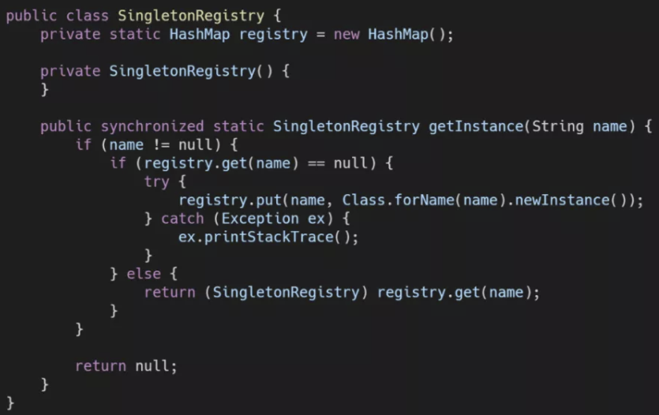
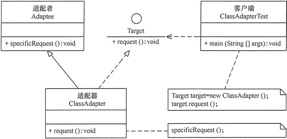
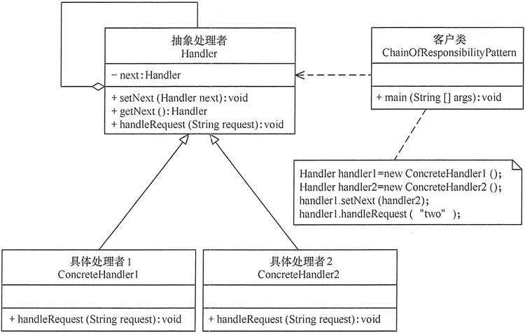

# 设计模式

## 1. 简介

设计模式（Design Pattern），是经过高度抽象化的在编程中可以被反复使用的代码设计经验的总结，是解决特定问题的一系列套路，是一种编程思想。它不是语法规定，而是一套用来提高代码可复用性、可维护性、可读性、稳健性以及安全性的解决方案。

正确使用设计模式能有效提高代码的可读性、可重用性和可靠性，编写符合设计模式规范的代码不但有利于自身系统的稳定、可靠，还有利于外部系统的对接。在使用了良好的设计模式的系统工程中，无论是对满足当前的需求，还是对适应未来的需求，无论是对自身系统间模块的对接，还是对外部系统的对接，都有很大的帮助。

随着软件工程的不断演进，针对不同的需求，新的设计模式不断被提出（比如大数据领域中这些年不断被大家认可的数据分片思想），但设计模式的原则不会变。基于设计模式的原则，可以使用已有的设计模式，也可以根据产品或项目的开发需求在现有的设计模式基础上组合、改造或重新设计自身的设计模式。

## 2. 设计模式的原则

设计模式有 7 个原则：单一职责原则、开闭原则、里氏代换原则、依赖倒转原则、接口隔离原则、合成／聚合复用原则、迪米特法则。具体内容如下：

1. **单一职责原则**，又称单一功能原则，它规定一个类只有一个职责。如果有多个职责（功能）被设计在一个类中，这个类就违反了单一职责原则。
2. **开闭原则**，规定软件中的对象（类、模块、函数等）对扩展开放，对修改封闭，这意味着一个实体允许在不改变其源代码的前提下改变其行为，该特性在产品化的环境下是特别有价值的，在这种环境下，改变惊代码需要经过代码审查、单元测试等过程，以确保产品的使用质量。遵循这个原则的代码在扩展时并不发生改变，因此不需要经历上述过程。
3. **里氏代换原则**，是对开闭原则的补充，规定了在任意父类可以出现的地方，子类都一定可以出现。实现开闭原则的关键就是抽象化，父类与子类的继承关系就是抽象化的具体表现，所以里氏代换原则是对实现抽象化的具体步骤的规范。
4. **依赖倒转原则**，指程序要依赖于抽象（Java 中的抽象类和接口），而不依赖于具体的实现（Java 中的实现类）。简单地说，就是要求对抽象进行编程，不要求对实现进行编程，这就降低了用户与实现模块之间的耦合度。
5. **接口隔离原则**，指通过将不同的功能定义在不同的接口中来实现接口的隔离，这样就避免了其他类在依赖该接口（接口上定义的功能）时依赖其不需要的接口，可减少接口之间依赖的冗余性和复杂性。
6. **合成／聚合复用原则**，指通过在一个新的对象中引人（注入）已有的对象以达到类的功能复用和扩展的目的。它的设计原则是要尽量使用合成或聚合而不要使用继承来扩展类的功能。
7. **迪米特法则**，指一个对象尽可能少地与其他对象发生相互了解或依赖。其核心思想在于降低模块之间的耦合度，提高模块的内聚性。迪米特法则规定每个模块对其他模块都要有尽可能少的了解和依赖，因此很容易使系统模块之间功能独立，这使得各个模块的独立运行变得更简单，同时使得各个模块之间的组合变得更容易。

## 3. 设计模式的分类

设计模式按照其功能和使用场景可以分为三大类：**创建型模式（Creational Pattern）**、**结构型模式（Structural Pattern）**和**行为型模式（Behavioral Pattern）**

- **创建型模式**：提供了多种优雅创建对象的方法
  - [x] 工厂模式（Factory Pattern）
  - [ ] 抽象工厂模式（Abstract Factory Pattern）
  - [x] 单例模式（Singleton Pattern）
  - [ ] 建造者模式（Builder Pattern）
  - [ ] 原型模式（Prototype Pattern）
- **结构型模式**：通过类和接口之间的继承和引用实现创建复杂结构对象的功能
  - [x] 适配器模式（Adapter Pattern ）
  - [ ] 桥接模式（Bridge Pattern）
  - [ ] 过滤器模式（Filter 、Criteria Pattern）
  - [ ] 组合模式（Composite Pattern）
  - [ ] 装饰器模式（Decorator Pattern）
  - [ ] 外观模式（Facade Pattern）
  - [ ] 享元模式（Flyweight Pattern）
  - [ ] 代理模式（Proxy Pattern）
- **行为型模式**：通过类之间不同的通信方式实现不同的行为方式
  - [ ] 责任链模式（Chain of Responsibility Pattern）
  - [ ] 命令模式（Command Pattern）
  - [ ] 解释器模式（Interpreter Pattern）
  - [ ] 迭代器模式（Iterator Pattern）
  - [ ] 中介者模式（Mediator Pattern）
  - [ ] 备忘录模式（Memento Pattern）
  - [ ] 观察者模式（Observer Pattern）
  - [ ] 状态模式（State Pattern）
  - [ ] 策略模式（Strategy Pattern）
  - [x] 模板模式（Template Pattern）
  - [ ] 访问者模式（Visitor Pattern）

# 单例设计模式（Singleten Pattern）

> 框架中会经常出现单例类

## 1. 单例的特点

1. 类在程序的运行过程中只有一个对象(实例)。
2. 私有构造方法，不能让外界创建该类的对象。
3. 类必须提供一个静态公共方法返回该类的对象。

## 2. 单例实现方式（饿汉式）

当类加载时，就立即创建该单例对象。饿汉式是线程安全的。实现步骤如下：

1. 定义一个静态的对象成员变量
2. 要私有构造方法，如果不处理，系统会自动提供一个无参的构造方法。外界就可以直接new对象
3. 定义一个静态的成员方法，用来获取创建好的对象成员，一般命名用 `getInstance()`

```java
/**
 * 单例类，饿汉式：非懒加载。
 * 当类加载时，就立即创建该单例对象。以空间换时间
 */
public class EagerSingleton {

    // 定义一个静态的成员变量，在类加载完成之后都已经完成了初始化赋值的操作。
    private static EagerSingleton instance = new EagerSingleton();

    // 注意：要私有构造方法，如果不处理，系统会自动提供一个无参的构造方法。
    // 保证其他类对象使用时不能直接new一个新的实例
    private EagerSingleton() {
    }

    // 定义一个静态的成员方法，用来获取创建好的成员对象
    public static EagerSingleton getInstance() {
        return instance;
    }
}
```

> 涉及知识点提示：所有的静态成员在类加载完成之后都已经完成了初始化赋值的操作。也就是`EagerSingleton`类的私有构造函数会被调用，实例会被创建。还有就是构造函数要使用`private`修饰，为了防止使用`new`关键字来创建一个新的实例，就会变成“多例”并存的情况。

## 3. 单例实现方式（懒汉式）

### 3.1. 实现前置分析

当外界第一次要使用该类的对象时，如果还没有创建出来，则创建该单例对象。懒汉式是线程不安全的，要处理线程安全问题，实际上创建对象要进过如下几个步骤：

1. 分配内存空间
2. 调用构造器，初始化实例
3. 返回地址给引用

因为创建对象是一个非原子操作，编译器可能会重排序⌈构造函数可能在整个对象初始化完成前执行完毕，即赋值操作（只是在内存中开辟一片存储区域后直接返回内存的引用）在初始化对象前完成⌋。而线程C在线程A赋值完时判断instance就不为null了，此时C拿到的将是一个没有初始化完成的半成品。这样是很危险的。因为极有可能线程C会继续拿着个没有初始化的对象中的数据进行操作，此时容易触发 NPE

另外还由于可见性问题，线程A在自己的工作线程内创建了实例，但此时还未同步到主存中；此时线程C在主存中判断 instance 还是 null，那么线程C又将在自己的工作线程中创建一个实例，这样就创建了多个实例。

### 3.2. 具体实现

综合以上分析后，推荐使用<font color=red>**volatile 双重检查模式**</font>来创建单例对象。从性能上考虑，一般选择同步代码块去处理线程安全问题。具体实现步骤如下：

1. 定义一个静态的对象成员变量
2. 要私有构造方法，如果不处理，系统会自动提供一个无参的构造方法。外界就可以直接 new 对象
3. 定义一个静态的成员方法，用来获取对象成员，一般命名用 `getInstance`
4. 需要考虑线程安全的问题。
5. 第一种是使用同步方法，增加 `synchronized`，在方法内再进行判断对象是否为空，如果为空，就直接创建。
6. 第二种是使用同步代码块，一开始先判断对象是否为空，为了性能的问题，为了后面的线程不再需要加锁；同步对象写，`LazySingleton.class` 保证锁对象被所有对象共享；

完整的示例实现代码如下：

```java
package com.moon.design.singleten;

/**
 * 单例类，懒加载
 * 懒汉式：当外界第一次要使用该类的对象时，如果还没有创建出来，则创建该单例对象。
 */
public class LazySingleton {

    // 定义一个静态的对象成员变量。注意：采用 volatile 关键字修饰也是很有必要
    private static volatile LazySingleton instance;

    // 要私有构造方法，如果不处理，系统会自动提供一个无参的构造方法。
    private LazySingleton() {
    }

    // 定义一个静态的成员方法，用来获取创建好的成员对象(同步代码块)
    public static LazySingleton getInstance1() {
        // 判断如果之前对象不存在就进行创建，再加个判断，为了性能的问题，为了后面的线程不再需要加锁
        if (instance == null) {
            // 为了解决线程安全问题，需要同步代码块，LazySingleton.class保证锁对象被所有对象共享
            // 如果在 instance==null 前已经有多个线程进来，所以同步方法块中的if判断不能省略
            // 在synchronized锁定代码中，需要再次进行是否为null检查。这种方法叫做双重检查锁定（Double-Check Locking）。
            synchronized (LazySingleton.class) {
                if (instance == null) {
                    instance = new LazySingleton();
                }
            }
        }
        return instance;
    }

    // 定义一个静态的成员方法，用来获取创建好的成员对象(同步方法)
    public static synchronized LazySingleton getInstance2() {
        // 判断如果之前对象不存在就进行创建
        if (instance == null) {
            instance = new LazySingleton();
        }
        return instance;
    }
}
```

### 3.3. 小结

虽然懒汉模式在资源利用率上有一定优势，但是懒汉模式在高并发场景，也就是多线程场景下，遇到的问题也比较多。为了防止多个线程同时调用`getInstance`方法，需要在该方法前面增加关键字`synchronized`进行线程访问锁定。但是这样就引出了新的问题，在高并发场景下，每次调用都进行线程访问锁定判断，会对系统性能产生较大的负面影响。

上面示例中，为了解决高并发中的线程安全问题，在`synchronized`锁定代码中，需要再次进行是否为null检查，因为可能在`instance == null`前已经多个线程进来，如果不做判断，当前一个线程创建对象后，其他线程也可以抢到锁再进入创建对象。这种方法叫做双重检查锁定（Double-Check Locking）。另外，静态的对象成员变量 instance 采用 `volatile` 关键字修饰也是很有必要，使用 `volatile` 可以禁止 JVM 的指令重排，并且在第一个获取锁的线程创建实例后，保证其他线程的可见性，从而让程序在多线程环境下正常运行。

## 4. 单例实现方式（静态内部类实现式）

> mybatis框架，在创建`VFS`类单例实例使用了此种方式。具体参考框架的`org.apache.ibatis.io.VFS`类

静态内部类的实例方式，是利用 JVM 加载静态类的特性来实现。JVM 在类初始化阶段（即在Class被加载后，且线程使用之前），会执行类的初始化。在执行类的初始化期间，JVM 会去获取一个锁。这个锁可以同步多个线程对同一个类的初始化。因此**静态内部类实现式是线程安全的**。具体的实现步骤如下：

1. 定义一个静态的内部类
2. 要私有构造方法，如果不处理，系统会自动提供一个无参的构造方法。外界就可以直接 `new` 对象
3. 定义一个静态的成员方法，用来获取对象成员，一般命名用 `getInstance`
4. 在内部类中定义静态的成员变量，类型是外部类类型，初始化时调用外部类的构造函数，创建外部类的实例，是真正的实例变量。
5. 在`getInstance`的静态方法中，返回内部类的静态成员变量（*外部类的实例*）

```java
package com.moon.design.singleten;

/**
 * 单例类实现，静态内部类实现式
 */
public class HolderSingleton {

    private HolderSingleton() {
    }

    /*
     * 当getInstance方法第一次被调用的时候，它第一次读取InstanceHolder.INSTANCE时，会触发InstanceHolder类的初始化。
     * 而InstanceHolder类在装载并被初始化的时候，会初始化它的静态成员变量、静态域，从而创建HolderSingleton的实例。
     * 由于是静态的域，因此只会在虚拟机装载类的时候初始化一次，并由虚拟机来保证它的线程安全性。
     * 这个模式的优势在于，getInstance方法并没有做线程同步控制，并且只是执行一个域的访问，因此延迟初始化并没有增加任何访问成本。
     */
    public static HolderSingleton getInstance() {
        return InstanceHolder.INSTANCE;
    }

    /* 内部类前面加static关键字，表示的是类级内部类，类级内部类只有在使用时才会被加载 */
    private static class InstanceHolder {
        // 静态变量的初始化是由JVM保证线程安全的，在类的加载时就完成了静态变量的赋值
        static final HolderSingleton INSTANCE = new HolderSingleton();
    }
}
```

**小结**：

上述代码中：虽然内部类中的成员变量`INSTANCE`是被`static`修改，但这个是懒加载的，原因是<font color=red>**内部类前面加`static`关键字，表示的是类级内部类，类级内部类只有在使用时才会被加载**</font>。

具体的执行流程是：当`getInstance`方法第一次被调用的时候，它第一次读取`InstanceHolder.INSTANCE`时，会触发`InstanceHolder`类的初始化。而`InstanceHolder`类在装载并被初始化的时候，会初始化它的静态成员变量、静态域，从而创建`HolderSingleton`的实例。由于是静态的域，因此只会在虚拟机装载类的时候初始化一次，并静态变量的初始化是由虚拟机（JVM）来保证它的线程安全性，在内存只会存在一份，<u>*jvm的初始化时是线程互斥的（待日后理解）*</u>。这个模式的优势在于，`getInstance`方法并没有做线程同步控制，并且只是执行一个域的访问，因此延迟初始化并没有增加任何访问成本。

通过对比基于 `volatile` 的双重检查锁定方案和基于类初始化方案的对比，会发现基于类初始化的方案的实现代码更简洁。但是基于 volatile 的双重检查锁定方案有一个额外的优势：**除了可以对静态字段实现延迟加载初始化外，还可以对实例字段实现延迟初始化**。

## 5. 单例实例方式（枚举式）

使用枚举来实现单例模式

```java
public enum EnumSingleton {
    instance;
}
```

首先创建 Enum 时，编译器会自动生成一个继承自`java.lang.Enum`的类，枚举成员声明中被`static`和`final`所修饰，虚拟机会保证这些静态成员在多线程环境中被正确的加锁和同步，所以是线程安全的。编译后生成的类代码如下：

```java
class EnumSingleton extends Enum {
    public static final EnumSingleton instance;
    ....省略
}
```

`Enum`的构造方法本身就是`private`修饰的，所以也防止了使用`new`关键字创建新实例。从Enum类的声明中也可以看出，Enum是提供了序列化的支持的，在某些需要序列化的场景下，提供了非常大的便利。另一个重要功能就是反序列化仍然可以保证对象在虚拟机范围内是单例的。

## 6. 单例实例方式（单例注册表式）

单例注册表来实现单例模式，Spring框架就是最有代表性的使用者。



其实实现原理很容易理解，以一个`HashMap`（Spring 是使用了线程安全的`ConcurrentHashMap`）来存储目前已生成的类的实例，如果可以根据类名找到对象，就返回这个对象，不再创建新对象。如果找不到，就利用反射机制创建一个，并加入到 Map 中。以上只是一个示意代码，作为 Spring 核心理念IoC的重要部分，单例注册表在 Spring 中的源码要复杂的多，也做了很多性能上的优化，具体可以参考 Spring 中`AbstractBeanFactory`类的源码。

## 7. 涉及使用单例类的场景

- 一个类只要一个对象的时候
- 视频播放器，音频播放器
- 数据库的连接
- 设置信息

## 8. 其他小问题

开发中一般使用饿汉式，面试的时候使用懒汉式

# 享元模式（Flyweight Pattern）（!整理中）

## 1. 定义与特点

享元模式（Flyweight Pattern）：主要通过对象的复用来减少对象创建的次数和数量，以减少系统内存的使用和降低系统的负载。享元模式属于<font color=red>**结构型模式**</font>，在系统需要一个对象时，享元模式首先在系统中查找并尝试重用现有的对象，如果未找到匹配的对象，则创建新对象并将其缓存在系统中以便下次使用。

> wikipedia: A flyweight is an object that minimizes memory usage by sharing as much data as possible with other similar objects

享元模式会把其中共同的部分抽象出来，如果有相同的业务请求，则直接返回内存中已有的对象，避免频繁重复创建和销毁大量的对象，造成系统资源的浪费。

## 2. 模式的结构


## 3. 基础实现

> TODO: 待整理！

# 模板方法设计模式（Template Method）

## 1. 定义与特点

模板方法（Template Method）模式的定义：定义一个操作中的算法骨架，而将算法的一些步骤延迟到子类中，使得子类可以不改变该算法结构的情况下重定义该算法的某些特定步骤。它是一种类行为型模式。

模式的主要优点如下：

1. 它封装了不变部分，扩展可变部分。它把认为是不变部分的算法封装到父类中实现，而把可变部分算法由子类继承实现，便于子类继续扩展。
2. 它在父类中提取了公共的部分代码，便于代码复用。
3. 部分方法是由子类实现的，因此子类可以通过扩展方式增加相应的功能，符合开闭原则。

该模式的主要缺点如下：

1. 对每个不同的实现都需要定义一个子类，这会导致类的个数增加，系统更加庞大，设计也更加抽象，间接地增加了系统实现的复杂度。
2. 父类中的抽象方法由子类实现，子类执行的结果会影响父类的结果，这导致一种反向的控制结构，它提高了代码阅读的难度。
3. 由于继承关系自身的缺点，如果父类添加新的抽象方法，则所有子类都要改一遍。

## 2. 模式的结构

模板方法模式，需要抽象类与具体子类之间的协作，利用多态来实现。模板方法模式包含以下主要角色：

### 2.1. 抽象类/抽象模板（Abstract Class）

抽象模板类，负责给出一个算法的轮廓和骨架。它由一个模板方法和若干个基本方法构成。这些方法的定义如下：

- **模板方法**：定义了算法的骨架，按某种顺序调用其包含的基本方法。
- **基本方法**：是整个算法中的一个步骤，包含以下几种类型。
    - **抽象方法**：在抽象类中声明，由具体子类实现。
    - **具体方法**：在抽象类中已经实现，在具体子类中可以继承或重写它。
    - **钩子方法**：在抽象类中已经实现，包括用于判断的逻辑方法和需要子类重写的空方法两种。

### 2.2. 具体子类/具体实现（Concrete Class）

具体实现类，实现抽象类中所定义的抽象方法和钩子方法，它们是一个抽象类中模板方法逻辑的其中一个组成步骤。

### 2.3. 模板方法模式的结构图


## 3. 基础实现

- 定义抽象类，类中定义主要的模板方法与抽象方法

```java
public abstract class AbstractClass {

    // 模板方法。定义了方法逻辑的骨架，按某种顺序调用其包含的基本方法。
    public void TemplateMethod() {
        abstractMethod1(); // 抽象方法
        hookMethod1();
        if (hookMethod2()) { // 抽象类已实现，但子类可以进行修改
            SpecificMethod(); // 具体方法
        }
        abstractMethod2(); // 抽象方法
    }

    // 具体方法
    public void SpecificMethod() {
        System.out.println("抽象类中的具体方法被调用...");
    }

    // 钩子方法1，方法无处理逻辑，由子类来重写
    public void hookMethod1() {
    }

    // 钩子方法2
    public boolean hookMethod2() {
        return true;
    }

    // 抽象方法1，由实现类来处理
    public abstract void abstractMethod1();

    // 抽象方法2，由实现类来处理
    public abstract void abstractMethod2();
}
```

- 创建实现类，

```java
public class ConcreteClass extends AbstractClass {

    @Override
    public void abstractMethod1() {
        System.out.println("抽象方法1的实现被调用...");
    }

    @Override
    public void abstractMethod2() {
        System.out.println("抽象方法2的实现被调用...");
    }

    @Override
    public void hookMethod1() {
        System.out.println("钩子方法1被重写...");
    }

    @Override
    public boolean hookMethod2() {
        // 改变抽象类中原有方法逻辑
        return false;
    }
}
```

- 测试调用模板方法

```java
public class TemplateMethodPattern {

    public static void main(String[] args) {
        AbstractClass tm = new ConcreteClass();
        tm.TemplateMethod();
    }
}
```

输出结果

```
抽象方法1的实现被调用...
钩子方法1被重写...
抽象方法2的实现被调用...
```

# 适配器模式（Adapter Pattern）

## 1. 定义与特点

适配器模式（Adapter）的定义：将一个类的接口转换成另外一个接口，使得原本由于接口不兼容而不能一起工作的那些类能一起工作。<font color=red>**适配器模式分为类结构型模式和对象结构型模式**</font>两种，前者类之间的耦合度比后者高，且要求程序员了解现有组件库中的相关组件的内部结构，所以应用相对较少些。

- 该模式的主要优点如下：
1. 客户端通过适配器可以透明地调用目标接口。
2. 复用了现存的类，程序员不需要修改原有代码而重用现有的适配者类。
3. 将目标类和适配者类解耦，解决了目标类和适配者类接口不一致的问题。
4. 在很多业务场景中符合开闭原则。

- 其缺点是：
1. 适配器编写过程需要结合业务场景全面考虑，可能会增加系统的复杂性。
2. 增加代码阅读难度，降低代码可读性，过多使用适配器会使系统代码变得凌乱。

## 2. 模式结构

类适配器模式可采用多重继承方式实现。Java 不支持多继承，但可以定义一个适配器类来实现当前系统的业务接口，同时又继承现有组件库中已经存在的组件。

对象适配器模式可釆用将现有组件库中已经实现的组件引入适配器类中，该类同时实现当前系统的业务接口。

### 2.1. 主要角色

适配器模式（Adapter）包含以下主要角色

1. 目标（Target）接口：当前系统业务所期待的接口，它可以是抽象类或接口。
2. 适配者（Adaptee）类：它是被访问和适配的现存组件库中的组件接口。
3. 适配器（Adapter）类：它是一个转换器，通过继承或引用适配者的对象，把适配者接口转换成目标接口，让客户端按目标接口的格式访问适配者。

### 2.2. 结构类图

**类适配器模式的结构图**



**对象适配器模式的结构图**


## 3. 基础实现

### 3.1. 准备公共接口与适配器

创建目标接口，最终客户端调用

```java
public interface Target {

    void request();

}
```

创建需要待适配者（类）

```java
public class Adaptee {

    public void specificRequest() {
        System.out.println("适配者中的业务代码被调用！");
    }
}
```

### 3.2. 类适配器模式

创建类适配器。继承适配者（类），并实现目标接口。在目标接口中，调用适配者中相应的逻辑。

```java
public class ClassAdapter extends Adaptee implements Target {

    public void request() {
        // 调用适配者的方法
        super.specificRequest();
    }
}
```

测试程序

```java
public static void main(String[] args) {
    System.out.println("类适配器模式测试：");
    // 创建适配器
    Target target = new ClassAdapter();
    // 调用目标接口方法，实际是调用了被适配类中相应的方法
    target.request();
}
```

测试结果

```
类适配器模式测试：
适配者中的业务代码被调用！
```

### 3.3. 对象适配器模式

创建对象适配器，只需要实现目标接口。在类中定义适配者类型的属性，通过构造函数或者 setter 方法获取到适配者对象，在调用目标接口方法时，通过适配者对象调用相应的方法

```java
public class ObjectAdapter implements Target {

    private final Adaptee adaptee;

    public ObjectAdapter(Adaptee adaptee) {
        this.adaptee = adaptee;
    }

    public void request() {
        // 通过适配者对象调用
        adaptee.specificRequest();
    }
}
```

测试程序

```java
public static void main(String[] args) {
    System.out.println("对象适配器模式测试：");
    Adaptee adaptee = new Adaptee();
    Target target = new ObjectAdapter(adaptee);
    // 调用目标接口方法，实际是调用了被适配者对象的方法
    target.request();
}
```

测试结果

```
对象适配器模式测试：
适配者中的业务代码被调用！
```

# 建造者模式（Builder Pattern）（整理中！）    

## 1. 定义与特点

建造者（Builder）模式的定义：指将一个复杂对象的构造与它的表示分离，使同样的构建过程可以创建不同的表示，这样的设计模式被称为建造者模式。它是将一个复杂的对象分解为多个简单的对象，然后一步一步构建而成。它将变与不变相分离，即产品的组成部分是不变的，但每一部分是可以灵活选择的。

- 该模式的主要优点如下：
1. 封装性好，构建和表示分离。
2. 扩展性好，各个具体的建造者相互独立，有利于系统的解耦。
3. 客户端不必知道产品内部组成的细节，建造者可以对创建过程逐步细化，而不对其它模块产生任何影响，便于控制细节风险。

- 其缺点如下：
1. 产品的组成部分必须相同，这限制了其使用范围。
2. 如果产品的内部变化复杂，如果产品内部发生变化，则建造者也要同步修改，后期维护成本较大。

建造者（Builder）模式和工厂模式的关注点不同：建造者模式注重零部件的组装过程，而工厂方法模式更注重零部件的创建过程，但两者可以结合使用。

## 2. 结构与实现

<font color=red>**建造者（Builder）模式由产品、抽象建造者、具体建造者、指挥者等 4 个要素构成**</font>

# 工厂模式（Factory Pattern）

## 1. 定义

在 Java 中，万物皆对象，这些对象都需要创建，如果创建的时候直接 new 该对象，就会对该对象耦合严重，假如要更换对象，所有 new 对象的地方都需要修改一遍，这显然违背了软件设计的**开闭原则**。如果使用工厂来生产对象，只需要和工厂打交道即可，彻底和对象解耦，如果要更换对象，直接在工厂里更换该对象即可，达到了与对象解耦的目的；所以工厂模式最大的优点就是：**解耦**。

> 开闭原则：**对扩展开放，对修改关闭**。在程序需要进行拓展的时候，不能去修改原有的代码，实现一个热插拔的效果。简言之，是为了使程序的扩展性好，易于维护和升级。

**三种工厂模式**：

- 简单工厂模式
- 工厂方法模式
- 抽象工厂模式

### 1.1. 案例需求概述

需求：设计一个咖啡店点餐系统。设计一个咖啡类（Coffee），并定义其两个子类（美式咖啡【AmericanCoffee】和拿铁咖啡【LatteCoffee】）；再设计一个咖啡店类（CoffeeStore），咖啡店具有点咖啡的功能。

具体类的设计如下：


> 类图的元素说明：
>
> 1. 类图中的符号：
>     - `+`：表示 public 权限方法
>     - `-`：表示 private 权限方法
>     - `#`：表示 protected 权限方法
> 2. 泛化关系(继承)用带空心三角箭头的实线来表示
> 3. 依赖关系使用带箭头的虚线来表示

### 1.2. 无设计模式实现

- 定义接口：

```java
public interface Coffee {
    /**
     * 获取名字
     */
    String getName();

    /**
     * 加牛奶
     */
    void addMilk();

    /**
     * 加糖
     */
    void addSuqar();
}


public class LatteCoffee implements Coffee {
    /**
     * 获取名字
     */
    @Override
    public String getName() {
        return "latteCoffee";
    }

    /**
     * 加牛奶
     */
    @Override
    public void addMilk() {
        System.out.println("LatteCoffee...addMilk...");
    }

    /**
     * 加糖
     */
    @Override
    public void addSuqar() {
        System.out.println("LatteCoffee...addSuqar...");
    }
}
```

- 定义实现类

```java
public class AmericanCoffee implements Coffee {
    /**
     * 获取名字
     */
    @Override
    public String getName() {
        return "americanCoffee";
    }

    /**
     * 加牛奶
     */
    @Override
    public void addMilk() {
        System.out.println("AmericanCoffee...addMilk...");
    }

    /**
     * 加糖
     */
    @Override
    public void addSuqar() {
        System.out.println("AmericanCoffee...addSuqar...");
    }
}
```

- 无使用设计模式实现获取不同实现类

```java
public class CoffeeStore {

    public static void main(String[] args) {
        Coffee coffee = orderCoffee("latte");
        System.out.println(coffee.getName());
    }


    public static Coffee orderCoffee(String type) {
        Coffee coffee = null;
        if ("american".equals(type)) {
            coffee = new AmericanCoffee();
        } else if ("latte".equals(type)) {
            coffee = new LatteCoffee();
        }

        // 对生产的对象做其他处理
        coffee.addMilk();
        coffee.addSuqar();
        return coffee;
    }
}
```

## 2. 简单工厂模式

简单工厂不是一种设计模式，反而比较像是一种编程习惯。

### 2.1. 模式结构

简单工厂包含如下角色：

- 抽象产品：定义了产品的规范，描述了产品的主要特性和功能。
- 具体产品：实现或者继承抽象产品的子类
- 具体工厂：提供了创建产品的方法，调用者通过该方法来获取产品。

### 2.2. 具体实现

使用简单工厂模式对上面案例进行改进，类图如下：


- 创建静态工厂类

```java
public class SimpleCoffeeFactory {

    public static Coffee createCoffee(String type) {
        Coffee coffee = null;
        if ("american".equals(type)) {
            coffee = new AmericanCoffee();
        } else if ("latte".equals(type)) {
            coffee = new LatteCoffee();
        }
        return coffee;
    }
}
```

> Tips: 在开发中，经常会将工厂类中的创建对象的功能定义为静态的，这就是静态工厂模式，它也不属于 23 种设计模式。

- 改进使用简单静态工厂模式

```java
public class CoffeeStore {

    public static void main(String[] args) {
        // 使用简单静态工厂模式
        Coffee coffee1 = simpleOrderCoffee("american");
        System.out.println(coffee1.getName());
    }

    public static Coffee simpleOrderCoffee(String type) {
        // 通过工厂获得对象，不需要知道对象实现的细节
        Coffee coffee = SimpleCoffeeFactory.createCoffee(type);

        if (Objects.nonNull(coffee)) {
            coffee.addMilk();
            coffee.addSuqar();
        }
        return coffee;
    }
}
```

总结：工厂（factory）处理创建对象的细节，一旦有了 SimpleCoffeeFactory，CoffeeStore 类中的 simpleOrderCoffee() 就变成此对象的客户，后期如果需要 Coffee 对象直接从工厂中获取即可。这样也就解除了和 Coffee 实现类的耦合，同时又产生了新的耦合，CoffeeStore 对象和 SimpleCoffeeFactory 工厂对象的耦合，工厂对象和商品对象的耦合。

后期如果再加新品种的咖啡，势必要需求修改 SimpleCoffeeFactory 的代码，违反了开闭原则。工厂类的客户端可能有很多，比如创建美团外卖等，这样只需要修改工厂类的代码，省去其他的修改操作。

### 2.3. 优缺点

- **优点**：封装了创建对象的过程，可以通过参数直接获取对象。把对象的创建和业务逻辑层分开，这样以后就避免了修改客户代码，如果要实现新产品直接修改工厂类，而不需要在原代码中修改，这样就降低了客户代码修改的可能性，更加容易扩展。
- **缺点**：增加新产品时还是需要修改工厂类的代码，违背了“开闭原则”。

## 3. 工厂方法模式

针对上例中的缺点，使用工厂方法模式就可以完美的解决，完全遵循开闭原则。

### 3.1. 概述

工厂方法模式，需要定义一个用于创建对象的接口，让子类决定实例化哪个产品类对象。工厂方法使一个产品类的实例化延迟到其工厂的子类。

### 3.2. 模式结构

工厂方法模式的主要角色：

- 抽象工厂（Abstract Factory）：提供了创建产品的接口，调用者通过它访问具体工厂的工厂方法来创建产品。
- 具体工厂（ConcreteFactory）：主要是实现抽象工厂中的抽象方法，完成具体产品的创建。
- 抽象产品（Product）：定义了产品的规范，描述了产品的主要特性和功能。
- 具体产品（ConcreteProduct）：实现了抽象产品角色所定义的接口，由具体工厂来创建，它同具体工厂之间一一对应。

### 3.3. 具体实现

使用工厂方法模式对上例进行改进，类图如下：


- 抽象工厂

```java
public interface CoffeeFactory {
    /**
     * 创建咖啡
     */
    Coffee createCoffee();
}
```

- 定义具体的工厂实现

```java
public class AmericanCoffeeFactory implements CoffeeFactory {
    /**
     * 创建美式咖啡
     */
    @Override
    public Coffee createCoffee() {
        return new AmericanCoffee();
    }
}

public class LatteCoffeeFactory implements CoffeeFactory {
    /**
     * 创建拿铁咖啡
     */
    @Override
    public Coffee createCoffee() {
        return new LatteCoffee();
    }
}
```

- 改造通过不同的工厂生成相应的对象

```java
public class CoffeeStore {

    public static void main(String[] args) {
        // 使用工厂方法模式
        CoffeeStore coffeeStore = new CoffeeStore(new LatteCoffeeFactory());

        Coffee coffee2 = coffeeStore.methodOrderCoffee();
        System.out.println(coffee2.getName());
    }


    private CoffeeFactory coffeeFactory;

    public CoffeeStore(CoffeeFactory coffeeFactory){
        this.coffeeFactory = coffeeFactory;
    }

    public Coffee methodOrderCoffee() {
        // 可以根据不同的工厂，创建不同的产品
        Coffee coffee = coffeeFactory.createCoffee();

        if (Objects.nonNull(coffee)) {
            coffee.addMilk();
            coffee.addSuqar();
        }
        return coffee;
    }
}
```

总结：从以上编写的代码可以看到，工厂方法模式是简单工厂模式的进一步抽象。由于使用了多态性，要增加产品类时也要相应地增加工厂类，不需要修改工厂类的代码。工厂方法模式保持了简单工厂模式的优点，而且解决了简单工厂模式的缺点。

### 3.4. 优缺点

**优点：**

- 用户只需要知道具体工厂的名称就可得到所要的产品，无须知道产品的具体创建过程；
- 在系统增加新的产品时只需要添加具体产品类和对应的具体工厂类，无须对原工厂进行任何修改，满足开闭原则；

**缺点：**

- 每增加一个产品就要增加一个具体产品类和一个对应的具体工厂类，这增加了系统的复杂度。

# 抽象工厂模式（Abstract Factory Pattern）

这些工厂只生产同种类产品，同种类产品称为同等级产品，也就是说：工厂方法模式只考虑生产同等级的产品，但是在现实生活中许多工厂是综合型的工厂，能生产多等级（种类） 的产品，如电器厂既生产电视机又生产洗衣机或空调，大学既有软件专业又有生物专业等。

抽象工厂模式将考虑多等级产品的生产，将同一个具体工厂所生产的位于不同等级的一组产品称为一个产品族，下图所示

- 产品族：一个品牌下面的所有产品；例如华为下面的电脑、手机称为华为的产品族。
- 产品等级：多个品牌下面的同种产品；例如华为和小米都有手机电脑为一个产品等级。


## 1. 概念

抽象工厂模式是工厂方法模式的升级版本，工厂方法模式只生产一个等级的产品，而抽象工厂模式可生产多个等级的产品。该模式是一种为访问类提供一个创建一组相关或相互依赖对象的接口，且访问类无须指定所要产品的具体类就能得到同族的不同等级的产品的模式结构。

**一个超级工厂创建其他工厂，该超级工厂又称为其他工厂的工厂。**

## 2. 模式结构

抽象工厂模式的主要角色如下：

- 抽象工厂（Abstract Factory）：提供了创建产品的接口，它包含多个创建产品的方法，可以创建多个不同等级的产品。
- 具体工厂（Concrete Factory）：主要是实现抽象工厂中的多个抽象方法，完成具体产品的创建。
- 抽象产品（Product）：定义了产品的规范，描述了产品的主要特性和功能，抽象工厂模式有多个抽象产品。
- 具体产品（ConcreteProduct）：实现了抽象产品角色所定义的接口，由具体工厂来创建，它 同具体工厂之间是多对一的关系。

## 3. 具体实现（暂未整理代码）

现咖啡店业务发生改变，不仅要生产**咖啡**还要生产**甜点**

- 同一个产品等级（产品分类）
    - 咖啡：拿铁咖啡、美式咖啡 
    - 甜点：提拉米苏、抹茶慕斯
- 同一个风味，就是同一个产品族（相当于同一个品牌）
    - 美式风味：美式咖啡、抹茶慕斯
    - 意大利风味：拿铁咖啡、提拉米苏

如果按照工厂方法模式，需要定义提拉米苏类、抹茶慕斯类、提拉米苏工厂、抹茶慕斯工厂、甜点工厂类，很容易发生类爆炸情况。所以这个案例可以使用抽象工厂模式实现。类图如下：


> Tips: 实现关系使用带空心三角箭头的虚线来表示

整体调用思路：


## 4. 优缺点

- **优点**：当一个产品族中的多个对象被设计成一起工作时，它能保证客户端始终只使用同一个产品族中的对象。
- **缺点**：当产品族中需要增加一个新的产品时，所有的工厂类都需要进行修改。

## 5. 使用场景

- 当需要创建的对象是一系列相互关联或相互依赖的产品族时，如电器工厂中的电视机、洗衣机、空调等。
- 系统中有多个产品族，但每次只使用其中的某一族产品。如有人只喜欢穿某一个品牌的衣服和鞋。
- 系统中提供了产品的类库，且所有产品的接口相同，客户端不依赖产品实例的创建细节和内部结构。

如：输入法换皮肤，一整套一起换。生成不同操作系统的程序。

# 策略模式（Strategy Pattern）

## 1. 定义

策略模式定义了一系列算法，并将每个算法封装起来，使它们可以相互替换，且算法的变化不会影响使用算法的客户。策略模式属于对象行为模式，它通过对算法进行封装，把使用算法的责任和算法的实现分割开来，并委派给不同的对象对这些算法进行管理。

## 2. 模式结构

策略模式的主要角色如下：

- 抽象策略类（Strategy）：这是一个抽象角色，通常由一个接口或抽象类实现。此角色给出所有的具体策略类所需的接口。
- 具体策略类（Concrete Strategy）：实现了抽象策略定义的接口，提供具体的算法实现或行为。
- 环境类（Context）：持有一个策略类的引用，最终给客户端调用。

## 3. 基础实现

### 3.1. 需求说明

案例（促销活动）需求：一家百货公司在定年度的促销活动。针对不同的节日（春节、中秋节、圣诞节）推出不同的促销活动，由促销员将促销活动展示给客户。类图如下：


> Tips: 聚合关系可以用带空心菱形的实线来表示

### 3.2. 代码实现

- 定义百货公司所有促销活动的共同接口

```java
public interface Strategy {
    void show();
}
```

- 定义具体策略角色（Concrete Strategy）：每个节日具体的促销活动

```java
public class StrategyA implements Strategy {
    // 为春节准备的促销活动A
    @Override
    public void show() {
        System.out.println("买一送一");
    }
}

public class StrategyB implements Strategy {
    // 为中秋准备的促销活动B
    @Override
    public void show() {
        System.out.println("满200元减50元");
    }
}

public class StrategyC implements Strategy {
    // 为圣诞准备的促销活动C
    @Override
    public void show() {
        System.out.println("满1000元加一元换购任意200元以下商品");
    }
}
```

- 定义环境角色（Context）：用于连接上下文。这里可以理解为销售员，即把促销活动推销给客户。

```java
public class SalesMan {
    // 持有抽象策略角色的引用
    private Strategy strategy;

    public SalesMan(Strategy strategy) {
        this.strategy = strategy;
    }

    // 向客户展示促销活动
    public void salesManShow() {
        strategy.show();
    }

    // 测试
    public static void main(String[] args) {
        SalesMan salesMan = new SalesMan(new StrategyB());
        salesMan.salesManShow();
    }
}
```

## 4. 进阶：工厂方法设计模式+策略模式

### 4.1. 概述

一般网站都会提供有多种方式可以进行登录。如果使用传统方式实现该功能，一般会存在以下问题：

- 业务层代码大量使用到了 if...else，在后期阅读代码的时候会非常不友好，大量使用 if...else 性能也不高
- 如果业务发生变更，比如现在新增了QQ登录方式，这个时候需要修改业务层代码，违反了开闭原则

解决方案：使用**工厂方法设计模式+策略模式**。

一句话总结：**只要代码中有冗长的 if-else 或 switch 分支判断都可以采用策略模式优化**。

### 4.2. 工厂+策略模式实现

#### 4.2.1. 整体思路

不在 service 中写业务分支逻辑，而去调用工厂，然后通过 service 传递不同的参数来获取不同的登录策略（登录方式）。流程图如下：


#### 4.2.2. 具体实现

- 基础请求/响应

```java
// 请求参数：LoginReq
@Data
public class LoginReq {
    private String name;
    private String password;
    private String phone;
    private String validateCode;//手机验证码
    private String wxCode;//用于微信登录
    /**
     * account : 用户名密码登录
     * sms : 手机验证码登录
     * we_chat : 微信登录
     */
    private String type;
}

// 响应参数：LoginResp
@Data
public class LoginResp{  
    private Integer userId;
    private String userName;
    private String roleCode;
    private String token; //jwt令牌
    private boolean success;
}
```

- 抽象策略类：UserGranter

```java
public class UserGranter {
    /**
     * 获取数据
     *
     * @param loginReq 传入的参数
     *                 0:账号密码
     *                 1:短信验证
     *                 2:微信授权
     * @return map值
     */
    LoginResp login(LoginReq loginReq);
}
```

- 提供具体的策略：AccountGranter、SmsGranter、WeChatGranter

```java
@Component
public class AccountGranter implements UserGranter {
    @Override
    public LoginResp login(LoginReq loginReq) {
        System.out.println("策略:登录方式为账号登录");
        // 执行业务操作
        return new LoginResp();
    }
}

@Component
public class SmsGranter implements UserGranter {
    @Override
    public LoginResp login(LoginReq loginReq) {
        System.out.println("策略:登录方式为短信登录");
        // 执行业务操作
        return new LoginResp();
    }
}

@Component
public class WeChatGranter implements UserGranter{
    @Override
    public LoginResp login(LoginReq loginReq)  {
        System.out.println("策略:登录方式为微信登录");
        // 执行业务操作
        return new LoginResp();
    }
}
```

- 在 application.yml 文件中新增自定义配置，不同类型

```yml
login:
  types:
    account: accountGranter
    sms: smsGranter
    we_chat: weChatGranter
```

- 新增读取数据配置类

```java
@Getter
@Setter
@Configuration
@ConfigurationProperties(prefix = "login")
public class LoginTypeConfig {
    private Map<String, String> types;
}
```

- 工厂类 UserLoginFactory，用于操作策略的上下文的环境类，主要初始化时将策略汇总管理，并对外提供获取具体策略的方法。

```java
@Component
public class UserLoginFactory implements ApplicationContextAware {

    private static final Map<String, UserGranter> granterPool = new ConcurrentHashMap<>();

    @Autowired
    private LoginTypeConfig loginTypeConfig;

    /**
     * 从配置文件中读取策略信息存储到map中
     * { account:accountGranter, sms:smsGranter, we_chat:weChatGranter }
     *
     * @param applicationContext
     * @throws BeansException
     */
    @Override
    public void setApplicationContext(ApplicationContext applicationContext) throws BeansException {
        loginTypeConfig.getTypes().forEach((k, v) -> {
            granterPool.put(k, (UserGranter) applicationContext.getBean(v));
        });
    }

    /**
     * 对外提供获取具体策略
     *
     * @param grantType 用户的登录方式，需要跟配置文件中匹配
     * @return 具体策略
     */
    public UserGranter getGranter(String grantType) {
        return granterPool.get(grantType);
    }
}
```

- 编写业务类，通过工厂获取不同的策略

```java
@Service
public class UserService {

    @Autowired
    private UserLoginFactory factory;

    public LoginResp login(LoginReq loginReq) {
        UserGranter granter = factory.getGranter(loginReq.getType());
        if (granter == null) {
            LoginResp loginResp = new LoginResp();
            loginResp.setSuccess(false);
            return loginResp;
        }
        LoginResp resp = granter.login(loginReq);
        resp.setSuccess(true);
        return resp;
    }
}
```

- 登陆控制层

```java
@RestController
@RequestMapping("/api/user")
@Slf4j
public class LoginController {

    @Autowired
    private UserService userService;

    @PostMapping("/login")
    public LoginResp login(@RequestBody LoginReq loginReq) throws InterruptedException {
        if (loginReq.getType().equals("abc")) {
            log.error("没有这种登录方式:{}", loginReq.getType());
        }
        if (loginReq.getType().equals("123")) {
            throw new RuntimeException("错误的登录方式");
        }

        return userService.login(loginReq);
    }
}
```

#### 4.2.3. 测试

使用 postman 请求测试


使用了工厂+策略设计模式之后，业务层的代码不需要使用大量的 if...else，如果后期有新的需求改动，比如加入了QQ登录，只需要添加对应的策略就可以，无需再改动业务层代码。

# 装饰器模式(整理中！)

## 1. 定义与特点

装饰器（Decorator）模式的定义：指在不改变现有对象结构的情况下，动态地给该对象增加一些职责（即增加其额外功能）的模式，它属于对象结构型模式。

装饰器模式的主要优点有：

- 装饰器是继承的有力补充，比继承灵活，在不改变原有对象的情况下，动态的给一个对象扩展功能，即插即用
- 通过使用不用装饰类及这些装饰类的排列组合，可以实现不同效果
- 装饰器模式完全遵守开闭原则

其主要缺点是：装饰器模式会增加许多子类，过度使用会增加程序得复杂性。

# 责任链模式（Chain of Responsibility）

## 1. 定义

责任链（Chain of Responsibility）模式（也叫职责链模式）的定义：为了避免请求发送者与多个请求处理者耦合在一起，于是将所有请求的处理者通过前一对象记住其下一个对象的引用而连成一条链；当有请求发生时，可将请求沿着这条链传递，直到有对象处理它为止。

责任链模式的本质是解耦请求与处理，让请求在处理链中能进行传递与被处理。责任链模式的独到之处是将其节点处理者组合成了链式结构，并允许节点自身决定是否进行请求处理或转发，相当于让请求流动起来。

责任链模式的应用比较常见的是，springmvc 中的拦截器，web 开发中的 filter 过滤器等。

## 2. 优缺点

责任链模式是一种对象行为型模式，其主要优点如下：

1. 降低了对象之间的耦合度。该模式使得一个对象无须知道到底是哪一个对象处理其请求以及链的结构，发送者和接收者也无须拥有对方的明确信息。
2. 增强了系统的可扩展性。可以根据需要增加新的请求处理类，满足开闭原则。
3. 增强了给对象指派职责的灵活性。当工作流程发生变化，可以动态地改变链内的成员或者调动它们的次序，也可动态地新增或者删除责任。
4. 责任链简化了对象之间的连接。每个对象只需保持一个指向其后继者的引用，不需保持其他所有处理者的引用，这避免了使用众多的 if 或者 if···else 语句。
5. 责任分担。每个类只需要处理自己该处理的工作，不该处理的传递给下一个对象完成，明确各类的责任范围，符合类的单一职责原则。

其主要缺点如下：

1. 不能保证每个请求一定被处理。由于一个请求没有明确的接收者，所以不能保证它一定会被处理，该请求可能一直传到链的末端都得不到处理。
2. 对比较长的职责链，请求的处理可能涉及多个处理对象，系统性能将受到一定影响。
3. 职责链建立的合理性要靠客户端来保证，增加了客户端的复杂性，可能会由于职责链的错误设置而导致系统出错，如可能会造成循环调用（死循环）。

## 3. 模式结构

### 3.1. 主要角色

职责链模式主要包含以下角色：

- 抽象处理者（Handler）角色：定义一个处理请求的接口，包含抽象处理方法和一个后继连接。
- 具体处理者（Concrete Handler）角色：实现抽象处理者的处理方法，判断能否处理本次请求，如果可以处理请求则处理，否则将该请求转给它的后继者。
- 客户类（Client）角色：创建处理链，并向链头的具体处理者对象提交请求，它不关心处理细节和请求的传递过程。

### 3.2. 结构图




## 4. 基础实现

抽象处理者角色

```java
public abstract class Handler {

    private Handler next;

    public void setNext(Handler next) {
        this.next = next;
    }

    public Handler getNext() {
        return next;
    }

    // 使用模板模式，定义具体处理请求的流程的方法
    public final void handleRequest(String request) {
        // 调用子类实现的处理流程
        if (!doHandle(request)) {
            if (getNext() != null) {
                getNext().handleRequest(request);
            } else {
                System.out.println("没有人处理该请求！");
            }
        }
    }

    // 定义抽象的模板方法，由每个子类具体实现
    public abstract boolean doHandle(String request);
}
```

创建具体处理者角色x（其他都可以复制里面的代码用于测试）

```java
public class ConcreteHandler1 extends Handler {
    @Override
    public boolean doHandle(String request) {
        System.out.println("流转至 ConcreteHandler1");
        boolean b = request.equals("one");
        if (b) {
            System.out.println("具体处理者1负责处理该请求！");
        }
        return b;
    }
}
```

职责链模式测试

```java
@Test
public void chainOfResponsibilityPatternTest() {
    // 初始化责任链
    Handler handler1 = new ConcreteHandler1();
    Handler handler2 = new ConcreteHandler2();
    Handler handler3 = new ConcreteHandler3();
    handler1.setNext(handler2);
    handler2.setNext(handler3);

    // 调用键进行处理
    handler1.handleRequest("three");
}
```

测试结果：

```
流转至 ConcreteHandler1
流转至 ConcreteHandler2
流转至 ConcreteHandler3
具体处理者3负责处理该请求！
```

## 5. 进阶案例实战

### 5.1. 案例需求分析

案例需求：以创建商品为例，假设商品创建逻辑分为以下三步完成：①创建商品、②校验商品参数、③保存商品。

第②步校验商品又分为多种情况的校验，必填字段校验、规格校验、价格校验、库存校验等等。这些检验逻辑像一个流水线，要想创建出一个商品，必须通过这些校验。

综上分析，可以**使用责任链模式优化**：创建商品的每个校验步骤都可以作为一个单独的处理器，抽离为一个单独的类，便于复用。这些处理器形成一条链式调用，请求在处理器链上传递，如果校验条件不通过，则处理器不再向下传递请求，直接返回错误信息；若所有的处理器都通过检验，则执行保存商品步骤。


### 5.2. 接口设计分析

UML 图：


`AbstractCheckHandler` 为处理器抽象类，负责抽象处理器行为。定义了处理器的抽象方法 `handle()`，其子类需要重写 `handle()` 方法以实现特殊的处理器校验逻辑。其有 3 个子类，分别是：

- `NullValueCheckHandler`：空值校验处理器
- `PriceCheckHandler`：价格校验处理
- `StockCheckHandler`：库存校验处理器

`AbstractCheckHandler` 抽象类其他属性和方法说明：

- `protected ProductCheckHandlerConfig config` 是处理器的动态配置类，使用 `protected` 声明，每个子类处理器都持有该对象。该对象用于声明当前处理器、以及当前处理器的下一个处理器 `nextHandler`，另外也可以配置一些特殊属性，比如说接口降级配置、超时时间配置等。
- `AbstractCheckHandler` 类中的 `nextHandler` 属性是当前处理器持有的下一个处理器的引用，当前处理器执行完毕时，便调用 `nextHandler` 执行下一处理器的 `handle()` 校验方法；
- `protected Result next()` 是抽象类中定义执行下一个处理器的方法，使用 `protected` 声明，每个子类处理器都持有该对象。当子类处理器执行完毕(通过)时，调用父类的方法执行下一个处理器 `nextHandler`。

另外，`HandlerClient` 类是执行处理器链路的客户端，`HandlerClient.executeChain()` 方法负责发起整个链路调用，并接收处理器链路的返回值。

### 5.3. 代码实现

#### 5.3.1. 产品实体类

定义 ProductVO ，保存创建商品的参数对象，包含商品的基础信息。并且其作为责任链模式中多个处理器的入参，多个处理器都以 roductVO 为入参进行特定的逻辑处理。

```java
/**
 * 商品对象
 */
@Data
@Builder
public class ProductVO {
    /** 商品SKU，唯一 */
    private Long skuId;
    /** 商品名称 */
    private String skuName;
    /** 商品图片路径 */
    private String Path;
    /** 价格 */
    private BigDecimal price;
    /** 库存 */
    private Integer stock;
}
```

#### 5.3.2. 抽象类处理器：抽象行为，子类共有属性、方法

创建抽象类处理器 `AbstractCheckHandler`，并使用 `@Component` 注解注册为由 Spring 管理的 Bean 对象，方便使用 Spring 来管理各个处理器实现 Bean。

```java
/**
 * 抽象类处理器
 */
@Component
public abstract class AbstractCheckHandler {
    /**
     * 当前处理器持有下一个处理器的引用
     */
    @Getter
    @Setter
    protected AbstractCheckHandler nextHandler;

    /**
     * 处理器配置
     */
    @Setter
    @Getter
    protected ProductCheckHandlerConfig config;

    /**
     * 处理器执行方法
     * @param param
     * @return
     */
    public abstract Result handle(ProductVO param);

    /**
     * 链路传递
     * @param param
     * @return
     */
    protected Result next(ProductVO param) {
        // 下一个链路没有处理器了，直接返回
        if (Objects.isNull(nextHandler)) {
            return Result.success();
        }

        // 执行下一个处理器
        return nextHandler.handle(param);
    }
}
```

抽象类的属性和方法说明如下：

- `public abstract Result handle(ProductVO param)`：表示抽象的校验方法，每个处理器都应该继承 `AbstractCheckHandler` 抽象类处理器，并重写其 `handle` 方法，各个处理器从而实现特殊的校验逻辑，实际上就是多态的思想。
- `protected ProductCheckHandlerConfig config`：表示每个处理器的动态配置类，可以通过“配置中心”动态修改该配置，实现处理器的“动态编排”和“顺序控制”。配置类中可以配置处理器的名称、下一个处理器、以及处理器是否降级等属性。
- `protected AbstractCheckHandler nextHandler`：表示当前处理器持有下一个处理器的引用，如果当前处理器 `handle()` 校验方法执行完毕，则执行下一个处理器 `nextHandler` 的 `handle()` 校验方法执行校验逻辑。
- `protected Result next(ProductVO param)`：此方法用于处理器链路传递，子类处理器执行完毕后，调用父类的 `next()` 方法执行在 `config` 配置的链路上的下一个处理器，如果所有处理器都执行完毕了，就返回结果了。

创建 ProductCheckHandlerConfig 配置类

```java
/**
 * 处理器配置类
 */
@AllArgsConstructor
@Data
public class ProductCheckHandlerConfig {
    /**
     * 处理器Bean名称
     */
    private String handler;
    /**
     * 下一个处理器
     */
    private ProductCheckHandlerConfig next;
    /**
     * 是否降级
     */
    private Boolean down = Boolean.FALSE;
}
```

#### 5.3.3. 子类处理器：处理特有的校验逻辑

创建3个子类处理器，各个处理器继承 `AbstractCheckHandler` 抽象类处理器，并重写其 `handle()` 处理方法以实现特有的校验逻辑。

- `NullValueCheckHandler`：空值校验处理器。针对性校验创建商品中必填的参数。如果校验未通过，则返回错误码 ErrorCode，责任链在此截断(停止)，创建商品返回被校验住的错误信息。*注意代码中的降级配置！*使用 `@Component` 注册到 Spring 容器

```java
/**
 * 空值校验处理器
 */
@Component
public class NullValueCheckHandler extends AbstractCheckHandler {

	@Override
	public Result handle(ProductVO param) {
		System.out.println("空值校验 Handler 开始...");

		// 降级：如果配置了降级，则跳过此处理器，执行下一个处理器
		if (super.getConfig().getDown()) {
			System.out.println("空值校验 Handler 已降级，跳过空值校验 Handler...");
			return super.next(param);
		}

		// 参数必填校验
		if (Objects.isNull(param)) {
			return Result.failure(ErrorCode.PARAM_NULL_ERROR);
		}
		// SkuId 商品主键参数必填校验
		if (Objects.isNull(param.getSkuId())) {
			return Result.failure(ErrorCode.PARAM_SKU_NULL_ERROR);
		}
		// Price 价格参数必填校验
		if (Objects.isNull(param.getPrice())) {
			return Result.failure(ErrorCode.PARAM_PRICE_NULL_ERROR);
		}
		// Stock 库存参数必填校验
		if (Objects.isNull(param.getStock())) {
			return Result.failure(ErrorCode.PARAM_STOCK_NULL_ERROR);
		}

		System.out.println("空值校验 Handler 通过...");

		// 执行下一个处理器
		return super.next(param);
	}
}
```

> Notes: `super.getConfig().getDown()` 是获取 `AbstractCheckHandler` 处理器对象中保存的配置信息，如果处理器配置了降级，则跳过该处理器，直接调用 `super.next()` 执行下一个处理器逻辑。

- `PriceCheckHandler`：价格校验处理。针对创建商品的价格参数进行校验。这里只是做了简单的判断价格大于0的校验，实际业务中比较复杂，比如“价格门”这些防范措施等。

```java
/**
 * 价格校验处理器
 */
@Component
public class PriceCheckHandler extends AbstractCheckHandler {
	@Override
	public Result handle(ProductVO param) {
		System.out.println("价格校验 Handler 开始...");

		// 非法价格校验
		boolean illegalPrice = param.getPrice().compareTo(BigDecimal.ZERO) <= 0;
		if (illegalPrice) {
			return Result.failure(ErrorCode.PARAM_PRICE_ILLEGAL_ERROR);
		}
		// 其他校验逻辑...

		System.out.println("价格校验 Handler 通过...");

		// 执行下一个处理器
		return super.next(param);
	}
}
```

- `StockCheckHandler`：库存校验处理器。针对创建商品的库存参数进行校验。

```java
@Component
public class StockCheckHandler extends AbstractCheckHandler {
	@Override
	public Result handle(ProductVO param) {
		System.out.println("库存校验 Handler 开始...");

		// 非法库存校验
		boolean illegalStock = param.getStock() < 0;
		if (illegalStock) {
			return Result.failure(ErrorCode.PARAM_STOCK_ILLEGAL_ERROR);
		}
		// 其他校验逻辑..

		System.out.println("库存校验 Handler 通过...");

		// 执行下一个处理器
		return super.next(param);
	}
}
```

#### 5.3.4. 客户端：执行处理器链路

`HandlerClient` 客户端类负责发起整个处理器链路的执行，通过 `executeChain()` 方法。如果处理器链路返回错误信息，即校验未通过，则整个链路截断（停止），返回相应的错误信息。

```java
public class HandlerClient {

	public static Result executeChain(AbstractCheckHandler handler, ProductVO param) {
		//执行处理器
		Result handlerResult = handler.handle(param);
		if (!handlerResult.isSuccess()) {
			System.out.println("HandlerClient 责任链执行失败返回：" + handlerResult.toString());
			return handlerResult;
		}
		return Result.success();
	}
}
```

#### 5.3.5. 责任链模式参数校验 paramCheck 方法步骤说明

创建参数校验 `paramCheck()` 方法使用责任链模式进行参数校验，方法内没有声明具体都有哪些校验，具体有哪些参数校验逻辑是通过多个处理器链传递的。如下：

```java
private Result paramCheck(ProductVO param) {

	// 获取处理器配置：通常配置使用统一配置中心存储，支持动态变更
	ProductCheckHandlerConfig handlerConfig = this.getHandlerConfigFile();

	// 获取处理器
	AbstractCheckHandler handler = this.getHandler(handlerConfig);

	// 通过客户端，执行处理器链路
	Result executeChainResult = HandlerClient.executeChain(handler, param);
	if (!executeChainResult.isSuccess()) {
		System.out.println("创建商品 失败...");
		return executeChainResult;
	}

	// 处理器链路全部成功
	return Result.success();
}
```

##### 5.3.5.1. 步骤1：获取处理器配置

通过 `getHandlerConfigFile()` 方法获取处理器配置类对象，配置类保存了链上各个处理器的上下级节点配置，支持流程编排、动态扩展。通常配置是通过Ducc(京东自研的配置中心)、Nacos(阿里开源的配置中心)等配置中心存储的，支持动态变更、实时生效。

```java
/**
 * 获取处理器配置：通常配置使用统一配置中心存储，支持动态变更
 */
private ProductCheckHandlerConfig getHandlerConfigFile() {
	// 模拟配置中心存储的配置
	String configJson = "{\"handler\":\"nullValueCheckHandler\",\"down\":true,\"next\":{\"handler\":\"priceCheckHandler\",\"next\":{\"handler\":\"stockCheckHandler\",\"next\":null}}}";
	// 转成Config对象
	ProductCheckHandlerConfig handlerConfig = JSON.parseObject(configJson, ProductCheckHandlerConfig.class);
	return handlerConfig;
}
```

> 示例没有使用配置中心存储处理器链路的配置，而是使用 JSON 串的形式去模拟配置。

ConfigJson 存储的处理器链路配置 JSON 串，使用 json.cn 等格式化如下，配置的整个调用链路规则特别清晰


`getHandlerConfigFile()` 获到配置类方法，只是把在配置中心储存的配置规则，转换成配置类 `ProductCheckHandlerConfig` 对象，用于程序处理。结构如下：


> Notes: 此时配置类中存储的仅仅是处理器 Spring Bean 的 name 而已，并非实际处理器对象。

###### 5.3.5.1.1. 步骤2-1：配置检查

首先会进行了配置的一些检查操作。如果配置错误，则获取不到对应的处理器。`handlerMap.get(config.getHandler())` 是从所有处理器映射 Map 中获取到对应的处理器 Spring Bean。

> Tips: `handlerMap` 存储了所有的处理器映射，是通过 Spring 的 `@Resource` 注解注入。注入的规则是：所有继承了 `AbstractCheckHandler` 抽象类（它是 Spring 管理的 Bean）的子类（子类也是 Spring 管理的 Bean）都会注入进来。

注入进来的 handlerMap 中 Key 对应 Bean 的 name，Value 是对应的 Bean 实例，也就是实际的处理器，这里指空值校验处理器、价格校验处理器、库存校验处理器。


###### 5.3.5.1.2. 步骤2-2：保存处理器规则

将配置规则保存到对应的处理器中 `abstractCheckHandler.setConfig(config)`，子类处理器就持有了配置的规则。

###### 5.3.5.1.3. 步骤2-3：递归设置处理器链路

```java
abstractCheckHandler.setNextHandler(this.getHandler(config.getNext()));
```

以上方法是递归设置链路上的处理器，结合 ConfigJson 配置的规则来看：


1. 由上而下，NullValueCheckHandler 空值校验处理器通过 `setNextHandler()` 方法法设置自己持有的下一节点的处理器，也就是价格处理器 PriceCheckHandler。
2. 接着，PriceCheckHandler 价格处理器，同样需要经过步骤2-1配置检查、步骤2-2保存配置规则，并且最重要的是，它也需要设置下一节点的处理器 StockCheckHandler 库存校验处理器。
3. 最后 StockCheckHandler 库存校验处理器也一样，同样需要经过步骤2-1配置检查、步骤2-2保存配置规则。值得注意的是，StockCheckHandler 的 next 规则配置了 null，这表示它下面没有任何处理器要执行了，它就是整个链路上的最后一个处理节点。

通过递归调用 `getHandler()` 获取处理器方法，就将整个处理器链路对象串联起来了。如下：


实际上，`getHandler()` 获取处理器对象的代码就是把在配置中心配置的规则 `ConfigJson`，转换成配置类 `ProductCheckHandlerConfig` 对象，再根据配置类对象，转换成实际的处理器对象，这个处理器对象持有整个链路的调用顺序。

> Tips: 使用递归一定要注意截断递归的条件处理，否则可能造成死循环！

##### 5.3.5.2. 步骤2：根据配置获取处理器

上面步骤1通过 `getHandlerConfigFile()` 方法获取到处理器链路配置规则后，再调用 `getHandler()` 获取处理器。

`getHandler()` 方法参数是如上 `ConfigJson` 配置的规则，即步骤1转换成的 ProductCheckHandlerConfig 对象；根据 ProductCheckHandlerConfig 配置规则转换成处理器链路对象。代码如下：

```java
/**
 * 使用 Spring 注入:所有继承了AbstractCheckHandler抽象类的Spring Bean都会注入进来。Map的Key对应Bean的name,Value是name对应相应的Bean
 */
@Resource
private Map<String, AbstractCheckHandler> handlerMap;

/**
 * 获取处理器
 *
 * @param config
 * @return
 */
private AbstractCheckHandler getHandler(ProductCheckHandlerConfig config) {
	// 配置检查：没有配置处理器链路，则不执行校验逻辑
	if (Objects.isNull(config)) {
		return null;
	}
	// 配置错误
	String handler = config.getHandler();
	if (StringUtils.isBlank(handler)) {
		return null;
	}
	// 配置了不存在的处理器
	AbstractCheckHandler abstractCheckHandler = handlerMap.get(config.getHandler());
	if (Objects.isNull(abstractCheckHandler)) {
		return null;
	}

	// 处理器设置配置 Config
	abstractCheckHandler.setConfig(config);

	// 递归设置链路处理器
	abstractCheckHandler.setNextHandler(this.getHandler(config.getNext()));

	return abstractCheckHandler;
}
```

##### 5.3.5.3. 步骤3：客户端执行调用链路

`getHandler()` 获取完处理器后，整个调用链路的执行顺序也就确定了。最后通过 `HandlerClient` 客户端类的 `executeChain(handler, param)` 方法执行处理器整个调用链路，并接收处理器链路的返回值。

`executeChain()` 通过 `AbstractCheckHandler.handle()` 触发整个链路处理器顺序执行，如果某个处理器校验没有通过 `!handlerResult.isSuccess()`，则返回错误信息；所有处理器都校验通过，则返回正确信息 `Result.success()`。

### 5.4. 测试

最后创建 `createProduct()` 测试用例方法，创建商品方法抽象为2个步骤：①参数校验、②创建商品。参数校验使用责任链模式进行校验，包含：空值校验、价格校验、库存校验等等，只有链上的所有处理器均校验通过，才调用 `saveProduct()` 创建商品方法；否则返回校验错误信息。

在 `createProduct()` 创建商品方法中，通过责任链模式，将校验逻辑进行解耦。`createProduct()` 创建商品方法中不需要关注都要经过哪些校验处理器，以及校验处理器的细节。

```java
@Test
public Result createProduct(ProductVO param) {
	// 参数校验，使用责任链模式
	Result paramCheckResult = this.paramCheck(param);
	if (!paramCheckResult.isSuccess()) {
		return paramCheckResult;
	}

	// 创建商品
	return this.saveProduct(param);
}
```

场景1：创建商品参数中有空值（如下skuId参数为null），链路被空值处理器截断，返回错误信息

```java
ProductVO param = ProductVO.builder()
      .skuId(null).skuName("华为手机").Path("http://...")
      .price(new BigDecimal(1))
      .stock(1)
      .build();
```

测试结果


场景2：创建商品价格参数异常（如下price参数），被价格处理器截断，返回错误信息

```java
ProductVO param = ProductVO.builder()
      .skuId(1L).skuName("华为手机").Path("http://...")
      .price(new BigDecimal(-999))
      .stock(1)
      .build();
```

测试结果


场景 3：创建商品库存参数异常（如下stock参数），被库存处理器截断，返回错误信息。

```java
ProductVO param = ProductVO.builder()
      .skuId(1L).skuName("华为手机").Path("http://...")
      .price(new BigDecimal(1))
      .stock(-999)
      .build();
```

测试结果


场景4：创建商品所有处理器校验通过，保存商品。

```java
ProductVO param = ProductVO.builder()
      .skuId(1L).skuName("华为手机").Path("http://...")
      .price(new BigDecimal(999))
      .stock(1).build();
```

测试结果


# 门面模式（整理中！）

> 在软件开发领域有这样一句话：计算机科学领域的任何问题都可以通过增加一个间接的中间层来解决。而门面模式就是对于这句话的典型实践。

门面模式（Facade Pattern），也称之为外观模式，其核心为：外部与一个子系统的通信必须通过一个统一的外观对象进行，使得子系统更易于使用。

# 其他

## 1. 网络参考资料

- [设计模式内容聚合](https://mp.weixin.qq.com/s?__biz=MzI4Njc5NjM1NQ==&mid=2247487936&idx=2&sn=02c48b88fa45a32e55b99fa0be610a29&chksm=ebd62eecdca1a7faccf9f26d17bd2108e1b8939421640f71f1ebf5f14b621448ac05ad168a00&mpshare=1&scene=1&srcid=#rd)
- ~~[Java设计模式：23种设计模式全面解析（超级详细）](http://c.biancheng.net/design_pattern/)~~，内容被清空了？
- [Java Design Patterns (中文)](https://java-design-patterns.com/zh/)，软件设计模式，编程原则还有代码片段
