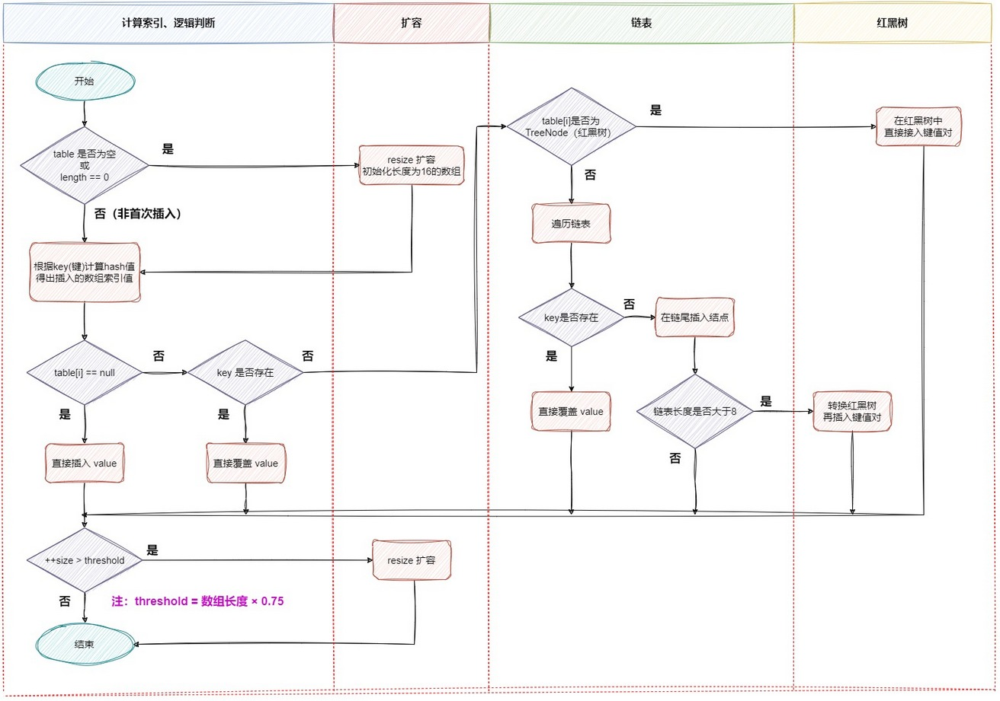
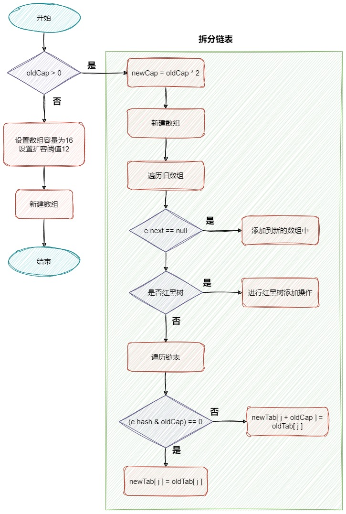
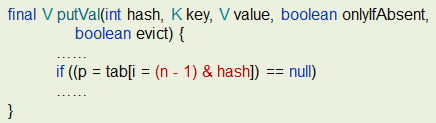
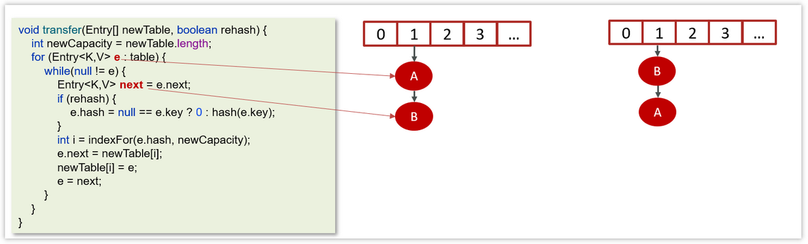
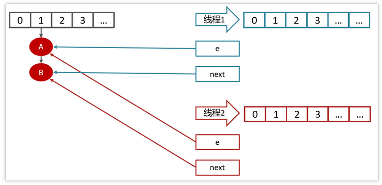
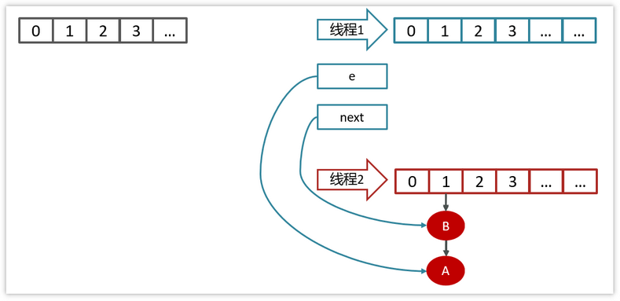
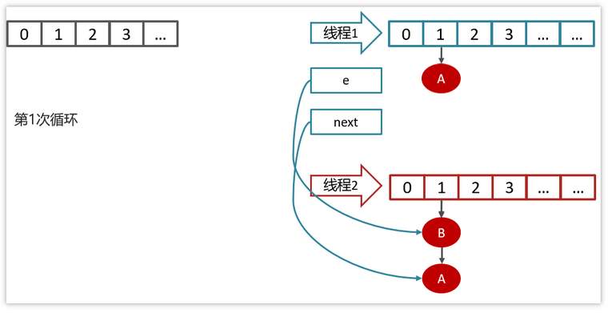
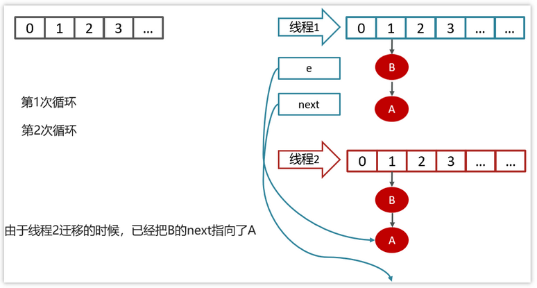
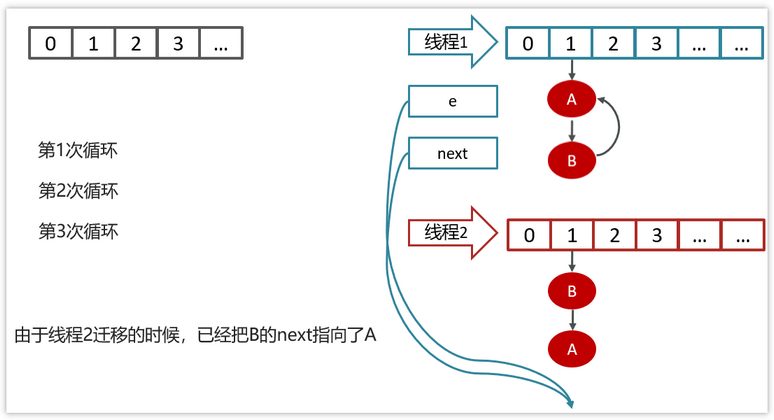

## 1. ArrayList 源码分析

### 1.1. 属性分析

```java
/**
 * 默认初始化容量
 */
private static final int DEFAULT_CAPACITY = 10;

/**
 * 如果自定义容量为0，则会默认用它来初始化ArrayList。或者用于空数组替换。
 */
private static final Object[] EMPTY_ELEMENTDATA = {};

/**
 * 如果没有自定义容量，则会使用它来初始化ArrayList。或者用于空数组比对。
 */
private static final Object[] DEFAULTCAPACITY_EMPTY_ELEMENTDATA = {};

/**
 * 这就是ArrayList底层用到的数组
 * 非私有，以简化嵌套类访问
 * transient 在已经实现序列化的类中，不允许某变量序列化
 */
transient Object[] elementData;

/**
 * 实际ArrayList集合大小
 */
private int size;

/**
 * 可分配的最大容量
 */
private static final int MAX_ARRAY_SIZE = Integer.MAX_VALUE - 8;
```

#### 1.1.1. 扩展：什么是序列化

序列化是指：将对象转换成以字节序列的形式来表示，以便用于持久化和传输。

实现方法：实现 `Serializable` 接口。

然后用的时候拿出来进行反序列化即可又变成Java对象。

#### 1.1.2. transient 关键字修饰的 elementData 属性解析

```java
/**
 * The array buffer into which the elements of the ArrayList are stored.
 * The capacity of the ArrayList is the length of this array buffer. Any
 * empty ArrayList with elementData == DEFAULTCAPACITY_EMPTY_ELEMENTDATA
 * will be expanded to DEFAULT_CAPACITY when the first element is added.
 */
transient Object[] elementData; // non-private to simplify nested class access
```

> Java中transient关键字的作用，简单地说，就是让某些被修饰的成员属性变量不被序列化。

ArrayList 实现了 `Serializable` 接口，意味着  ArrayList 支持序列化。而使用 `transient` 关键字声明的 `elementData` 属性，则这个变量不会参与序列化操作，即使所在类实现了Serializable接口，反序列化后该变量为空值。

> 那么问题来了：ArrayList 中数组声明：`transient Object[] elementData;`，事实上使用 ArrayList 在网络传输用的很正常，并没有出现空值。

原来是因为 ArrayList 还重写了 `writeObject` 方法实现：

```java
private void writeObject(java.io.ObjectOutputStream s)
    throws java.io.IOException{
    // Write out element count, and any hidden stuff
    int expectedModCount = modCount;
    s.defaultWriteObject();

    // Write out size as capacity for behavioural compatibility with clone()
    s.writeInt(size);

    // Write out all elements in the proper order.
    for (int i=0; i<size; i++) {
        s.writeObject(elementData[i]);
    }

    if (modCount != expectedModCount) {
        throw new ConcurrentModificationException();
    }
}
```

`ArrayList` 在每次序列化时，会调用`writeObject()`方法，首先会调用 `defaultWriteObject()` 方法序列化 ArrayList 中的非 `transient` 元素，如`size`和`element`等写入`ObjectOutputStream`，然后遍历 elementData 属性，只序列化已存入的元素，这样既加快了序列化的速度，又减小了序列化之后的文件大小。反序列化时调用`readObject()`，从`ObjectInputStream`获取`size`和`element`，再恢复到`elementData`。

> 那为什么不直接用elementData来序列化，而采用上诉的方式来实现序列化呢？

原因在于`elementData`是一个缓存数组，它通常会预留一些容量，等容量不足时再扩充容量，那么有些空间可能就没有实际存储元素，采用上诉的方式来实现序列化时，就可以保证只序列化实际存储的那些元素，而不是整个数组，从而**节省空间和时间**。

### 1.2. 构造方法分析

根据initialCapacity 初始化一个空数组，如果值为0，则初始化一个空数组:

```java
/**
 * 根据initialCapacity 初始化一个空数组
 */
public ArrayList(int initialCapacity) {
    if (initialCapacity > 0) {
        this.elementData = new Object[initialCapacity];
    } else if (initialCapacity == 0) {
        this.elementData = EMPTY_ELEMENTDATA;
    } else {
        throw new IllegalArgumentException("Illegal Capacity: " + initialCapacity);
    }
}
```

不带参数初始化，默认容量为10:

```java
/**
 * 不带参数初始化，默认容量为10
 */
public ArrayList() {
    this.elementData = DEFAULTCAPACITY_EMPTY_ELEMENTDATA;
}
```

通过集合做参数的形式初始化：如果集合为空，则初始化为空数组：

```java
/**
 * 通过集合做参数的形式初始化
 */
public ArrayList(Collection<? extends E> c) {
    elementData = c.toArray();
    if ((size = elementData.length) != 0) {
        // c.toArray might (incorrectly) not return Object[] (see 6260652)
        if (elementData.getClass() != Object[].class)
            elementData = Arrays.copyOf(elementData, size, Object[].class);
    } else {
        // replace with empty array.
        this.elementData = EMPTY_ELEMENTDATA;
    }
}
```

### 1.3. 主干方法

#### 1.3.1. trimToSize() 方法

> 用来最小化实例存储，将容器大小调整为当前元素所占用的容量大小。

```java
/**
 * 这个方法用来最小化实例存储。
 */
public void trimToSize() {
    modCount++;
    if (size < elementData.length) {
        elementData = (size == 0)
          ? EMPTY_ELEMENTDATA
          : Arrays.copyOf(elementData, size);
    }
}
```

#### 1.3.2. clone() 方法

> 用来克隆出一个新数组。

```java
public Object clone() {
    try {
        ArrayList<?> v = (ArrayList<?>) super.clone();
        v.elementData = Arrays.copyOf(elementData, size);
        v.modCount = 0;
        return v;
    } catch (CloneNotSupportedException e) {
        // this shouldn't happen, since we are Cloneable
        throw new InternalError(e);
    }
}
```

通过调用`Object`的`clone()`方法来得到一个新的`ArrayList`对象，然后将`elementData`复制给该对象并返回。

#### 1.3.3. add(E e) 方法

> 在数组末尾添加元素

```java
/**
 * 在数组末尾添加元素
 */
public boolean add(E e) {
    ensureCapacityInternal(size + 1);  // Increments modCount!!
    elementData[size++] = e;
    return true;
}
```

看到它首先调用了`ensureCapacityInternal()`方法.注意参数是size+1,这是个面试考点。

```java
private void ensureCapacityInternal(int minCapacity) {
    ensureExplicitCapacity(calculateCapacity(elementData, minCapacity));
}
```

这个方法里又嵌套调用了两个方法:计算容量+确保容量

计算容量：如果elementData是空，则返回默认容量10和size+1的最大值，否则返回size+1

```java
private static int calculateCapacity(Object[] elementData, int minCapacity) {
    if (elementData == DEFAULTCAPACITY_EMPTY_ELEMENTDATA) {
        return Math.max(DEFAULT_CAPACITY, minCapacity);
    }
    return minCapacity;
}
```

计算完容量后，进行确保容量可用：(modCount不用理它，它用来计算修改次数)

如果`size+1 > elementData.length`证明数组已经放满，则增加容量，调用`grow()`。

```java
private void ensureExplicitCapacity(int minCapacity) {
    modCount++;

    // overflow-conscious code
    if (minCapacity - elementData.length > 0)
        grow(minCapacity);
}
```

增加容量：默认1.5倍扩容。

1. 获取当前数组长度=>oldCapacity
2. oldCapacity>>1 表示将oldCapacity右移一位(位运算)，相当于除2。再加上1，相当于新容量扩容1.5倍。
3. 如果`newCapacity&gt;1=1`,`1&lt;2`所以如果不处理该情况，扩容将不能正确完成。
4. 如果新容量比最大值还要大，则将新容量赋值为VM要求最大值。
5. 将elementData拷贝到一个新的容量中。

```java
private void grow(int minCapacity) {
    // overflow-conscious code
    int oldCapacity = elementData.length;
    int newCapacity = oldCapacity + (oldCapacity >> 1);
    if (newCapacity - minCapacity < 0)
        newCapacity = minCapacity;
    if (newCapacity - MAX_ARRAY_SIZE > 0)
        newCapacity = hugeCapacity(minCapacity);
    // minCapacity is usually close to size, so this is a win:
    elementData = Arrays.copyOf(elementData, newCapacity);
}
```

##### 1.3.3.1. size+1的问题

> 好了，那到这里可以说一下为什么要size+1。

size+1代表的含义是：

1. 如果集合添加元素成功后，集合中的实际元素个数。
2. 为了确保扩容不会出现错误。

假如不加一处理，如果默认size是0，则0+0>>1还是0。

如果size是1，则1+1>>1还是1。有人问:不是默认容量大小是10吗?事实上，jdk1.8版本以后，ArrayList的扩容放在add()方法中。之前放在构造方法中。我用的是1.8版本，所以默认`ArrayList arrayList = new ArrayList();`后，size应该是0.所以,size+1对扩容来讲很必要.

```java
public static void main(String[] args) {
    ArrayList arrayList = new ArrayList();
    System.out.println(arrayList.size());
}

输出:0
```

事实上上面的代码是证明不了容量大小的，因为size只会在调用`add()`方法时才会自增。有办法的小伙伴可以在评论区大显神通。

#### 1.3.4. add(int index, E element) 方法

```java
public void add(int index, E element) {
    rangeCheckForAdd(index);

    ensureCapacityInternal(size + 1);  // Increments modCount!!
    System.arraycopy(elementData, index, elementData, index + 1,
                     size - index);
    elementData[index] = element;
    size++;
}
```

`rangeCheckForAdd()` 是越界异常检测方法。`ensureCapacityInternal()`之前有讲，着重说一下`System.arrayCopy`方法：

```java
public static void arraycopy(Object src, int srcPos, Object dest, int destPos, int length)
```

##### 1.3.4.1. 代码解释

- Object src : 原数组
- int srcPos : 从元数据的起始位置开始
- Object dest : 目标数组
- int destPos : 目标数组的开始起始位置
- int length : 要copy的数组的长度

示例：size为6，我们调用`add(2,element)`方法，则会从index=`2+1=3`的位置开始，将数组元素替换为从index起始位置为`index=2`，长度为`6-2=4`的数据。

> 

##### 1.3.4.2. 异常处理

```java
private void rangeCheckForAdd(int index) {
    if (index > size || index < 0)
        throw new IndexOutOfBoundsException(outOfBoundsMsg(index));
}
```

#### 1.3.5. set(int index, E element) 方法

```java
public E set(int index, E element) {
    rangeCheck(index);

    E oldValue = elementData(index);
    elementData[index] = element;
    return oldValue;
}

E elementData(int index) {
    return (E) elementData[index];
}
```

逻辑很简单，覆盖旧值并返回。

#### 1.3.6. indexOf(Object o) 方法

> 根据Object对象获取数组中的索引值。

```java
public int indexOf(Object o) {
    if (o == null) {
        for (int i = 0; i < size; i++)
            if (elementData[i]==null)
                return i;
    } else {
        for (int i = 0; i < size; i++)
            if (o.equals(elementData[i]))
                return i;
    }
    return -1;
}
```

如果o为空，则返回数组中第一个为空的索引；不为空也类似。

注意：通过源码可以看到，该方法是允许传空值进来的。

#### 1.3.7. get(int index) 方法

> 返回指定下标处的元素的值。

```java
public E get(int index) {
    rangeCheck(index);

    return elementData(index);
}
```

`rangeCheck(index)`会检测index值是否合法，如果合法则返回索引对应的值。

#### 1.3.8. remove(int index) 方法

> 删除指定下标的元素。

```java
public E remove(int index) {
    // 检测index是否合法
    rangeCheck(index);
    // 数据结构修改次数
    modCount++;
    E oldValue = elementData(index);

    // 记住这个算法
    int numMoved = size - index - 1;
    if (numMoved > 0)
        System.arraycopy(elementData, index+1, elementData, index,
                         numMoved);
    elementData[--size] = null; // clear to let GC do its work

    return oldValue;
}
```

这里又碰到了`System.arraycopy()`方法，详情请查阅上文。

大概思路：将该元素后面的元素前移，最后一个元素置空。

### 1.4. 集合的快速失败机制 “fail-fast”

“fail-fast”，即快速失败，它是 Java 集合进行结构上的改变的操作时的一种错误检测机制。当多个线程对集合（非 fail-safe 的集合类）进行结构上的改变的操作时，有可能会产生 fail-fast 机制，这个时候就会抛出 `ConcurrentModificationException`（当方法检测到对象的并发修改，但不允许这种修改时就抛出该异常）。

<font color=red>**同时需要注意的是，即使不是多线程环境，如果单线程违反了规则，同样也有可能会抛出改异常。**</font>

例如：假设存在两个线程（线程1、线程2），线程1通过 Iterator 在遍历集合A中的元素，在某个时候线程2修改了集合A的结构（是结构上面的修改，而不是简单的修改集合元素的内容），那么这个时候程序就会抛出 `ConcurrentModificationException` 异常，从而触发 fail-fast 机制。

#### 1.4.1. 源码分析

以下参考 `ArrayList` 源码的处理：

```java
public void forEach(Consumer<? super E> action) {
    Objects.requireNonNull(action);
    final int expectedModCount = modCount;
    @SuppressWarnings("unchecked")
    final E[] elementData = (E[]) this.elementData;
    final int size = this.size;
    for (int i=0; modCount == expectedModCount && i < size; i++) {
        action.accept(elementData[i]);
    }
    if (modCount != expectedModCount) {
        throw new ConcurrentModificationException();
    }
}
```

通过源码分析可知异常的原因：迭代器在遍历时直接访问集合中的内容，并且在遍历过程中使用一个 `modCount` 成员变量，它表示该集合实际被修改的次数。集合在被遍历期间如果内容发生变化，就会改变 `modCount` （用于记录集合操作过程的修改次数）的值，增加1。

`expectedModCount` 是 ArrayList 中的一个内部类 - `Itr` 中的成员变量（`Itr` 是一个 Iterator 的实现，使用 `ArrayList.iterator` 方法可以获取到的迭代器就是 Itr 类的实例。）。`expectedModCount` 表示这个迭代器期望该集合被修改的次数。其值是在 `ArrayList.iterator` 方法被调用的时候初始化的。只有通过迭代器对集合进行操作，该值才会改变。

每当迭代器使用`hashNext()`/`next()` 遍历下一个元素之前，都会检测 `modCount` 变量是否为 `expectedmodCount` 值，是的话就返回遍历；否则抛出异常，终止遍历并抛出 `ConcurrentModificationException`。

#### 1.4.2. 对集合进行 add/remove 正常操作方式

1. 直接使用普通 for 循环进行操作，因为普通 for 循环并没有用到 Iterator 的遍历，所以压根就没有进行 fail-fast 的检验。但这种方案其实存在一个问题，那就是 remove 操作会改变 List 中元素的下标，可能存在漏删的情况。
2. 直接使用 Iterator 提供的 `remove` 方法进行操作。该方法可以修改到 `expectedModCount` 的值，那么就不会再抛出异常了。

```java
List<String> userNames = new ArrayList<String>() {{
    add("MooN");
    add("Zero");
    add("L");
    add("kirA");
}};

Iterator<String> iterator = userNames.iterator();
while (iterator.hasNext()) {
    if (iterator.next().equals("L")) {
        iterator.remove();
    }
}
```

3. 使用 Java 8 中 Stream 提供的 filter 过滤
4. 使用增强 for 循环，并且非常确定在一个集合中，某个即将删除的元素只包含一个的时候（比如对 `Set` 集合进行操作），只要在删除元素后立刻结束循环体，不再继续进行遍历，也就是说不让代码执行到下一次的 next 方法。

```java
List<String> userNames = new ArrayList<String>() {{
    add("MooN");
    add("Zero");
    add("L");
    add("kirA");
}};

for (String userName : userNames) {
    if (userName.equals("L")) {
        userNames.remove(userName);
        break;
    }
}
```

5. 不直接使用 fail-safe 的集合类，例如使用 `CopyOnWriteArrayList`、`ConcurrentLinkedDeque` 等来替换 `ArrayList`。这种集合容器在遍历时不是直接在集合内容上访问的，而是先复制原有集合内容，在拷贝的集合上进行遍历操作，操作完成后再把引用移到新的数组。因此在遍历过程中对原集合所作的修改并不能被迭代器检测到，所以不会触发 `ConcurrentModificationException`。
> Tips: java.util.concurrent 包下的容器都是安全失败，可以在多线程下并发使用，并发修改。
6. 在遍历过程中，所有涉及到改变 `modCount` 值得地方全部加上 `synchronized`

### 1.5. 手写ArrayList(网上资料)

那面试手写ArrayList应该就不是问题了。下面网上资料的手写一个简单阉割版的ArrayList：

```java
public class MyArrayList {

    // 非私有，以简化嵌套类访问
    // transient 在已经实现序列化的类中，不允许某变量序列化
    transient Object[] elementData;

    //默认容量
    private static final int DEFAULT_CAPACITY = 10;

    // 用于空实例的 空数组实例
    private static final Object[] EMPTY_ELEMENTDATA = {};

    private static final Object[] DEFAULTCAPACITY_EMPTY_ELEMENTDATA = {};
    // 实际ArrayList集合大小
    private int size;
    /**
     * 构造方法
     */
    public MyArrayList(int initialCapacity) {
        if (initialCapacity > 0) {
            this.elementData = new Object[initialCapacity];
        } else if (initialCapacity == 0) {
            this.elementData = EMPTY_ELEMENTDATA;
        } else {
            throw new IllegalArgumentException("Illegal Capacity: "+
                    initialCapacity);
        }
    }
    public MyArrayList(){
        this(DEFAULT_CAPACITY);
    }

    public void add(Object o){
        //1. 判断数据容量是否大于 elementData
        ensureExplicitCapacity(size+1);
        //2. 使用下标进行赋值
        elementData[size++] = o;
    }
    private void ensureExplicitCapacity(int minCapacity){
        if (size == elementData.length){
            // 需要扩容,扩容1.5倍(ArrayList默认扩容1.5倍)
            // 注意：如果oldCapacity值为1
            int oldCapacity = elementData.length;
            int newCapacity = oldCapacity + (oldCapacity >> 1);
            // 如果新容量 < 最小容量， 则将最小容量赋值给新容量
            // 如果 oldCapacity=1, 则 minCapacity=1+1=2   newCapacity=1+(1>>1)=1
            if (newCapacity - minCapacity < 0){
                newCapacity = minCapacity;
            }
            // 创建新数组
            Object[] objects = new Object[newCapacity];
            // 将数据复制给新数组
            System.arraycopy(elementData, 0, objects, 0, elementData.length);
            // 修改引用
            elementData = objects;
        }
    }
    public Object get(int index) {
        rangeCheck(index);
        return elementData[index];
    }
    private void rangeCheck(int index) {
        if (index >= size)
            throw new IndexOutOfBoundsException("下标越界");
    }

    /**
     * 通过下标删除
     * @param index
     * @return
     */
    public Object remove(int index) {
        rangeCheck(index);

		// modCount++;
        // 先查出元素
        Object oldValue = elementData[index];
        // 找出置换结束位置
        int numMoved = size - index - 1;
        if (numMoved > 0)
            // 从 index+1 开始 将值覆盖为 index-numMoved 的值
            System.arraycopy(elementData, index+1, elementData, index, numMoved);
        elementData[--size] = null; // clear to let GC do its work

        return oldValue;
    }
    public boolean remove(Object o) {
            for (int index = 0; index < size; index++){
                if (o.equals(elementData[index])) {
                    remove(index);
                    return true;
                }
            }
        return false;
    }
}
```

## 2. HashMap 源码分析

### 2.1. HashMap 数据存储实现原理

HashMap 是基于哈希表的 Map 接口的非同步实现。此实现提供所有可选的映射操作，并允许使用 null 值和 null 键。此类不保证映射的顺序，特别是它不保证该顺序恒久不变。

在 Java 编程语言中，保存数据有两种比较简单的数据结构：数组和链表（模拟指针引用）。所有的数据结构都可以用这两个基本结构来构造的，HashMap 也不例外。

- 数组的特点是：寻址容易，插入和删除困难。
- 链表的特点是：寻址困难，但插入和删除容易。

所以将数组和链表结合在一起，发挥两者各自的优势，使用一种叫做**拉链法**的方式可以解决哈希冲突。HashMap 的数据结构实际上是一个“链表散列”的数据结构，即数组和链表的结合体。

#### 2.1.1. Hash 算法实现过程

HashMap 基于 Hash 算法实现的，具体如下：

1. 当往 HashMap 中 put 元素时，利用 key 的 hashCode 重新 hash 计算出当前对象的元素在数组中的下标
2. 存储时，如果出现 hash 值相同的 key，此时有两种情况。
   1. 如果 key 相同，则覆盖原始值。
   2. 如果 key 不同（出现冲突），则将当前的 key-value 放入链表或红黑树中。
3. 获取时，直接找到 hash 值对应的下标，在进一步判断 key 是否相同，从而找到对应值。

理解了以上过程可知 HashMap 是如何解决 hash 冲突的问题，核心就是使用了数组的存储方式，然后将冲突的 key 的对象放入链表中，一旦发现冲突就在链表中做进一步的对比。

> 需要注意 Jdk 1.8 中对 HashMap 的实现做了优化，当链表中的节点数据超过八个之后，该链表会转为红黑树来提高查询效率，从原来的 `O(n)` 到 `O(logn)`

#### 2.1.2. JDK1.7 解决哈希冲突

JDK1.7 采用的是拉链法。拉链法：将链表和数组相结合。也就是说创建一个链表数组，数组中每一格就是一个链表。若遇到哈希冲突，则将冲突的值加到链表中即可。


#### 2.1.3. JDK1.8 解决哈希冲突

相比于之前的版本，jdk1.8 在解决哈希冲突时有了较大的变化，当链表长度大于阈值（默认为 8）并且数组长度达到 64 时，将链表转化为红黑树，以减少搜索时间。


数组+链表。通过计算 key 的 hashCode 的值，再去取模来决定当前 Entry 对象存储的索引位置，如果当前位置为空，则直接存储；如果当时位置已经存在内容，则将给存储的数据加上 next 指针，指向之前存在的数据。
jdk8 主要是对 HashMap 做了红黑树的优化，使树的结构相对平衡，减小链的长度，达到加快查询的速度

#### 2.1.4. JDK1.7 VS JDK1.8

JDK1.8 主要解决或优化了一下问题：

1. resize 扩容优化
2. 引入了红黑树，目的是避免单条链表过长而影响查询效率
3. 解决了多线程死循环问题，但仍是非线程安全的，多线程时可能会造成数据丢失问题。

JDK1.7 VS JDK1.8 具体的区别：

- **存储结构**：JDK1.7 是数组+链表；JDK1.8 是数组+链表+红黑树。
- **初始化方式**：JDK1.7 使用单独函数 `inflateTable()`；JDK1.8 直接集成到了扩容函数 `resize()` 中。
- **hash 值计算方式**：
    - JDK1.7 扰动处理=9 次扰动=4 次位运算+5 次异或运算
    - JDK1.8 扰动处理=2 次扰动=1 次位运算+1 次异或运算
- **存放数据的规则**：
    - JDK1.7 无冲突时，存放数组；冲突时，存放链表。
    - JDK1.8 无冲突时：存放数组；冲突并且`链表长度 < 8`：存放单链表；冲突并且`链表长度 > 8`：树化并存放红黑树。
- **插入数据方式**：JDK1.7 头插法（先将原位置的数据移到后 1 位，再插入数据到该位置）；JDK1.8 尾插法（直接插入到链表尾部/红黑树）。
- **扩容后存储位置的计算方式**：
    - JDK1.7 全部按照原来方法进行计算（即`hashCode ->> 扰动函数 ->> (h&length-1)`）
    - JDK1.8 按照扩容后的规律计算（即`扩容后的位置 = 原位置` 或者 `扩容后的位置= 原位置 + 旧容量`）

#### 2.1.5. 为什么要使用红黑树而不是二叉树

主要是因为红黑树在插入和删除操作时，能够自动平衡树的结构，使得整棵树的高度保持在一个较小的范围内，从而保证查找、插入和删除操作的时间复杂度稳定在 `O(logn)`。而二叉树没有自平衡的特性，如果插入和删除操作不当，可能会导致树的高度过高，使得查找时间复杂度变为 `O(n)`，因此不适合用于高效的 Map 实现。

### 2.2. HashMap 重点属性

```java
public class HashMap<K,V> extends AbstractMap<K,V>
    implements Map<K,V>, Cloneable, Serializable {
    // 默认的初始容量
    static final int DEFAULT_INITIAL_CAPACITY = 1 << 4; // aka 16
    // 默认的加载因子
    static final float DEFAULT_LOAD_FACTOR = 0.75f;
    // 用于存储数据的是内部类 Node 数组
    transient Node<K,V>[] table;

    transient int size;

    // ...省略其他属性

    static class Node<K,V> implements Map.Entry<K,V> {
        final int hash;
        final K key;
        V value;
        Node<K,V> next;

        Node(int hash, K key, V value, Node<K,V> next) {
            this.hash = hash;
            this.key = key;
            this.value = value;
            this.next = next;
        }

        public final K getKey()        { return key; }
        public final V getValue()      { return value; }
        public final String toString() { return key + "=" + value; }

        public final int hashCode() {
            return Objects.hashCode(key) ^ Objects.hashCode(value);
        }

        public final V setValue(V newValue) {
            V oldValue = value;
            value = newValue;
            return oldValue;
        }

        public final boolean equals(Object o) {
            if (o == this)
                return true;
            if (o instanceof Map.Entry) {
                Map.Entry<?,?> e = (Map.Entry<?,?>)o;
                if (Objects.equals(key, e.getKey()) &&
                    Objects.equals(value, e.getValue()))
                    return true;
            }
            return false;
        }
    }
    
    public HashMap() {
        this.loadFactor = DEFAULT_LOAD_FACTOR; // all other fields defaulted
    }

}
```

从以上源码可知，HashMap 是懒惰加载，在创建对象时并没有初始化数组。在无参的构造函数中，设置了默认的加载因子是 0.75。

> Tips: 扩容阈值 = 数组容量 × 加载因子

### 2.3. put 方法设置值的具体流程

当 put 元素的时候，首先计算 key 的 hash 值，这里调用了 hash 方法，hash 方法实际是让`key.hashCode()`与`key.hashCode()>>>16`进行异或操作，高 16bit 补 0，一个数和 0 异或不变，所以 hash 函数大概的作用就是：**高 16bit 不变，低 16bit 和高 16bit 做了一个异或，目的是减少碰撞**。按照函数注释，因为 bucket 数组大小是 2 的幂，计算下标`index = (table.length - 1) & hash`，如果不做 hash 处理，相当于散列生效的只有几个低 bit 位，为了减少散列的碰撞，设计者综合考虑了速度、作用、质量之后，使用高 16bit 和低 16bit 异或来简单处理减少碰撞，而且 JDK8 中用了复杂度 `O(logn)`的树结构来提升碰撞下的性能。

#### 2.3.1. putVal 方法执行流程图

`final V putVal(int hash, K key, V value, boolean onlyIfAbsent, boolean evict)` 流程图：



具体流程：

1. 判断键值对数组 table 是否为空或为 null（没有初始化），否则执行 `resize()` 进行扩容（初始化）过程
2. 根据键值 key 计算 hash 值得到数组索引
3. 判断 `table[i] == null` 成立，则代表索引处有没有存在元素，直接新建节点添加
4. 判断 `table[i] != null` 成立。则代表索引处存在元素，则需要遍历插入。有两种情况，一种是链表形式就直接遍历到尾端插入，一种是红黑树就按照红黑树结构插入
    1. 判断 `table[i]` 的首个元素是否和 key 一样，如果相同直接覆盖 value
    2. 判断 `table[i]` 是否为 treeNode，即 `table[i]` 是否是红黑树，如果是红黑树，则直接在树中插入键值对
    3. 遍历 `table[i]`，链表的尾部插入数据，然后判断链表长度是否大于8。若是，则把链表转换为红黑树，在红黑树中执行插入操作，遍历过程中若发现 key 已经存在直接覆盖 value
5. 插入成功后，判断实际存在的键值对数量 size 是否超多了最大容量 threshold（`数组长度 * 0.75`），如果超过，执行 `resize()` 进行扩容。

#### 2.3.2. putVal 方法源码分析

> 以下为 JDK 1.8 源码

```java
public V put(K key, V value) {
    return putVal(hash(key), key, value, false, true);
}

final V putVal(int hash, K key, V value, boolean onlyIfAbsent,
               boolean evict) {
    Node<K,V>[] tab; Node<K,V> p; int n, i;
    // 判断数组是否未初始化
    if ((tab = table) == null || (n = tab.length) == 0)
        n = (tab = resize()).length; // 如果未初始化，调用 resize 方法 进行初始化
    // 通过 & 运算求出该数据（key）的数组下标并判断该下标位置是否有数据
    if ((p = tab[i = (n - 1) & hash]) == null)
        tab[i] = newNode(hash, key, value, null); // 如果没有，直接将数据放在该下标位置
    else { // 该数组下标有数据的情况
        Node<K,V> e; K k;
        // 判断该位置数据的 key 和新来的数据是否一样
        if (p.hash == hash &&
            ((k = p.key) == key || (key != null && key.equals(k))))
            e = p; // 如果一样，证明为修改操作，该节点的数据赋值给 e，后边会用到
        // 判断是不是红黑树
        else if (p instanceof TreeNode)
            e = ((TreeNode<K,V>)p).putTreeVal(this, tab, hash, key, value); // 如果是红黑树的话，进行红黑树的操作
        else {
            // 遍历链表
            for (int binCount = 0; ; ++binCount) {
                // 判断 next 节点，如果为空的话，证明遍历到链表尾部了
                if ((e = p.next) == null) {
                    // 把新值放入链表尾部
                    p.next = newNode(hash, key, value, null);
                    // 因为新插入了一条数据，所以判断链表长度是不是大于等于8
                    if (binCount >= TREEIFY_THRESHOLD - 1) // -1 for 1st
                        treeifyBin(tab, hash); // 如果是，进行转换红黑树操作
                    break;
                }
                // 判断链表当中有数据相同的值，如果一样，证明为修改操作
                if (e.hash == hash &&
                    ((k = e.key) == key || (key != null && key.equals(k))))
                    break;
                p = e; // 把下一个节点赋值为当前节点
            }
        }
        // 判断 e 是否为空（e 值为修改操作存放原数据的变量）
        if (e != null) { // existing mapping for key
            // 不为空的话证明是修改操作，取出旧值
            V oldValue = e.value;
            // 此分支一定会执行，因为方法调用时传入的 onlyIfAbsent 的参数值是 false
            if (!onlyIfAbsent || oldValue == null)
                e.value = value;  // 将新值赋值当前节点
            afterNodeAccess(e);
            return oldValue; // 返回旧值
        }
    }
    ++modCount; // 计数器，计算当前节点的修改次数
    // 当前数组中的数据数量如果大于扩容阈值
    if (++size > threshold)
        resize(); // 进行扩容操作
    afterNodeInsertion(evict); // 空方法
    return null; // 添加操作时 返回空值
}
```

### 2.4. HashMap 的 resize 扩容机制

当 HashMap 的数组大小达到一定的阈值（默认为 75%），会触发扩容操作。扩容的过程会重新计算每个键值对的哈希值，然后将其存储在新的数组位置上。扩容操作需要耗费一定的时间，因此需要在初始化时预估 HashMap 中键值对的数量，以便尽可能地减少扩容操作的次数。

#### 2.4.1. 扩容流程图



- 在添加元素或初始化的时候需要调用 resize 方法进行扩容，第一次添加数据初始化数组长度为16，以后每次每次扩容都是达到了扩容阈值（`数组长度 * 0.75`）
- 每次扩容的时候，都是扩容之前容量的2倍； 
- 扩容之后，会新创建一个数组，需要把老数组中的数据挪动到新的数组中
  - 没有 hash 冲突的节点，则直接使用 `e.hash & (newCap - 1)` 计算新数组的索引位置
  - 如果是红黑树，走红黑树的添加
  - 如果是链表，则需要遍历链表，可能需要拆分链表，判断 `(e.hash & oldCap)` 是否为0，该元素的位置要么停留在原始位置，要么移动到`原始位置+增加的数组大小`这个位置上

#### 2.4.2. resize 方法源码分析

```java
// 扩容、初始化数组
final Node<K,V>[] resize() {
    Node<K,V>[] oldTab = table;
    int oldCap = (oldTab == null) ? 0 : oldTab.length; // 如果当前数组为 null 的时候，把 oldCap 老数组容量设置为 0
    int oldThr = threshold; // 设置老的扩容阈值
    int newCap, newThr = 0;
    // 判断数组容量是否大于0，大于0说明数组已经初始化
    if (oldCap > 0) {
        // 判断当前数组长度是否大于最大数组长度
        if (oldCap >= MAXIMUM_CAPACITY) {
            threshold = Integer.MAX_VALUE; // 如果是，将扩容阈值直接设置为 int 类型的最大数值并直接返回
            return oldTab;
        }
        // 如果在最大长度范围内，则需要扩容 OldCap << 1 等价于 oldCap * 2
        // 运算过后判断是不是最大值并且 oldCap 需要大于 16
        else if ((newCap = oldCap << 1) < MAXIMUM_CAPACITY &&
                 oldCap >= DEFAULT_INITIAL_CAPACITY)
            newThr = oldThr << 1; // double threshold 等价于 oldThr * 2
    }
    // 如果 oldCap<0，但是已经初始化了，像把元素删除完之后的情况，那么它的临界值肯定还存在，如果是首次初始化，它的临界值则为0
    else if (oldThr > 0) // initial capacity was placed in threshold
        newCap = oldThr;
    // 数组未初始化的情况，将阈值和扩容因子都设置为默认值
    else {               // zero initial threshold signifies using defaults
        newCap = DEFAULT_INITIAL_CAPACITY;
        newThr = (int)(DEFAULT_LOAD_FACTOR * DEFAULT_INITIAL_CAPACITY);
    }
    // 初始化容量小于16的时候，扩容阈值是没有赋值的
    if (newThr == 0) {
        float ft = (float)newCap * loadFactor; // 创建阈值
        // 判断新容量和新阈值是否大于最大容量
        newThr = (newCap < MAXIMUM_CAPACITY && ft < (float)MAXIMUM_CAPACITY ?
                  (int)ft : Integer.MAX_VALUE);
    }
    threshold = newThr; // 计算出来的阈值赋值
    @SuppressWarnings({"rawtypes","unchecked"})
    Node<K,V>[] newTab = (Node<K,V>[])new Node[newCap]; // 根据上边计算得出的容量，创建新的数组
    table = newTab; // 赋值到 table 属性
    // 扩容操作，判断不为空证明不是初始化数组
    if (oldTab != null) {
        // 遍历数组
        for (int j = 0; j < oldCap; ++j) {
            Node<K,V> e;
            // 判断当前下标为j的数组如果不为空的话赋值个e，进行下一步操作
            if ((e = oldTab[j]) != null) {
                oldTab[j] = null; // 将数组位置置空
                // 判断是否有下个节点
                if (e.next == null)
                    newTab[e.hash & (newCap - 1)] = e; // 如果没有，就重新计算在新数组中的下标并放进去
                // 有下个节点的情况，并且判断是否已经树化
                else if (e instanceof TreeNode)
                    ((TreeNode<K,V>)e).split(this, newTab, j, oldCap); // 进行红黑树的操作
                // 有下个节点的情况，并且没有树化（链表形式）
                else { // preserve order
                    // 比如老数组容量是 16，那下标就为 0-15
                    // 扩容操作 * 2，容量就变为 32，下标为 0-31
                    // 低位：0-15，高位1 6-31
                    // 定义了四个变量
                    //        低位头          低位尾
                    Node<K,V> loHead = null, loTail = null;
                    //        高位头		     高位尾
                    Node<K,V> hiHead = null, hiTail = null;
                    Node<K,V> next; // 下个节点
                    // 循环遍历
                    do {
                        next = e.next; // 取出next节点
                        // 通过“与”操作，计算得出结果为0
                        if ((e.hash & oldCap) == 0) {
                            // 如果低位尾为null，证明当前数组位置为空，没有任何数据
                            if (loTail == null)
                                loHead = e; // 将e值放入低位头
                            // 低位尾不为null，证明已经有数据了
                            else
                                loTail.next = e; // 将数据放入next节点
                            loTail = e; // 记录低位尾数据
                        }
                        // 通过“与”操作，计算得出结果不为0
                        else {
                            // 如果高位尾为null，证明当前数组位置为空，没有任何数据
                            if (hiTail == null)
                                hiHead = e; // 将数据放入next节点
                            // 高位尾不为null，证明已经有数据了
                            else
                                hiTail.next = e; // 将数据放入next节点
                            hiTail = e; // 记录高位尾数据
                        }
                    } while ((e = next) != null); // 如果e不为空，证明没有到链表尾部，继续执行循环
                    // 低位尾如果记录的有数据，是链表
                    if (loTail != null) {
                        loTail.next = null; // 将下一个元素置空
                        newTab[j] = loHead; // 将低位头放入新数组的原下标位置
                    }
                    // 高位尾如果记录的有数据，是链表
                    if (hiTail != null) {                
                        hiTail.next = null; // 将下一个元素置空
                        newTab[j + oldCap] = hiHead; // 将高位头放入新数组的(原下标+原数组容量)位置
                    }
                }
            }
        }
    }
    return newTab; // 返回新的数组对象
}
```

#### 2.4.3. 扩展：为何 HashMap 的数组长度一定是2的次幂？

1. **计算索引时效率更高**。如果是 2 的 n 次幂可以使用位与运算代替取模
2. **扩容时重新计算索引效率更高**。`hash & oldCap == 0` 的元素留在原来位置，否则`新位置 = 旧位置 + oldCap`

### 2.5. HashMap 的寻址算法

#### 2.5.1. 计算键的 hash 值的源码分析

在 `HashMap` 类的 `put(K key, V value)` 方法中，会调用 `hash(key)` 方法来计算 key 的 hash 值。

```java
public V put(K key, V value) {
    return putVal(hash(key), key, value, false, true);
}
```

`hash(key)` 方法源码如下：

```java
static final int hash(Object key) {
    int h;
    return (key == null) ? 0 : (h = key.hashCode()) ^ (h >>> 16);
}
```

首先获取 key 的 hashCode 值，然后右移 16 位后，与原来的 hashCode 值进行**异或运算**，称为『扰动算法』。主要作用就是使原来的 hash 值更加均匀，减少 hash 冲突。

有了 hash 值之后，就可以计算当前 key 的在数组中存储的下标。例如在 `putVal` 方法中，通过 `(n-1) & hash` 获取数组中的索引，代替取模，性能更好。<u>值得注意：数组长度必须是 2 的 n 次幂</u>



#### 2.5.2. get 方法源码分析

> 以下为 JDK 1.8 源码

```java
public V get(Object key) {
    Node<K,V> e;
    // hash(key)，获取 key 的 hash 值，调用 getNode 方法获取数据
    return (e = getNode(hash(key), key)) == null ? null : e.value;
}

final Node<K,V> getNode(int hash, Object key) {
    Node<K,V>[] tab; Node<K,V> first, e; int n; K k;
    // 找到 key 对应的桶下标，赋值给 first 节点
    if ((tab = table) != null && (n = tab.length) > 0 &&
        (first = tab[(n - 1) & hash]) != null) {
        // 判断 hash 值和 key 是否相等，如果是，则直接返回，桶中只有一个数据（大部分的情况）
        if (first.hash == hash && // always check first node
            ((k = first.key) == key || (key != null && key.equals(k))))
            return first;
        if ((e = first.next) != null) {
            // 该节点是红黑树，则需要通过红黑树查找数据
            if (first instanceof TreeNode)
                return ((TreeNode<K,V>)first).getTreeNode(hash, key);
            // 链表的情况，则需要遍历链表查找数据
            do {
                if (e.hash == hash &&
                    ((k = e.key) == key || (key != null && key.equals(k))))
                    return e;
            } while ((e = e.next) != null);
        }
    }
    return null;
}
```

### 2.6. JDK 1.7 版本 HashMap 多线程死循环问题

由于 JDK 1.7 的 HashMap 数据结构是：数组+链表。在数组进行扩容的时候，因为链表采用的是<u>**头插法**</u>，在进行数据迁移的过程中，有可能导致死循环。



- 变量 e 指向的是需要迁移的对象
- 变量 next 指向的是下一个需要迁移的对象
- JDK 1.7 中的链表采用的头插法
- 在数据迁移的过程中并没有新的对象产生，只是改变了对象的引用

#### 2.6.1. 产生死循环的过程分析

1. 假设线程1和线程2的变量 e 和 next 都引用了这个两个节点



2. 线程2扩容后，由于头插法，链表顺序颠倒，但是线程1的临时变量 e 和 next 还引用了这两个节点



3. 第1次循环。由于线程2 迁移的时候，已经把 B 的 next 指向了 A



4. 第2次循环



5. 第3次循环



总结：

在 JDK 1.7 的 HashMap 中在数组进行扩容的时候，因为链表采用了**头插法**，在进行数据迁移的过程中，有可能导致死循环。比如，现在有两个线程：

1. 线程1：读取到当前的 HashMap 数据，数据中一个链表，在准备扩容时，线程2介入
2. 线程2：也读取 HashMap，直接进行扩容。因为是头插法，链表的顺序会进行颠倒过来。比如原来的顺序是AB，扩容后的顺序是BA，线程2执行结束。
3. 线程1：继续执行时，会先将 A 移入新的链表，再将 B 插入到链头，由于另外一个线程的原因，B 的 next 指向了 A，所以导致 `B->A->B`，形成死循环的问题。

在 JDK 8 以后，已经将扩容算法做了调整，不再将元素加入链表头，而是采用了保持与扩容前一样的顺序的**尾插法**，避免了 JDK 7 中死循环的问题。

## 3. HashSet 源码分析

```java
public class HashSet<E>
    extends AbstractSet<E>
    implements Set<E>, Cloneable, java.io.Serializable {

    private transient HashMap<E,Object> map; // 基于 HashMap 实现

    // Dummy value to associate with an Object in the backing Map
    private static final Object PRESENT = new Object();
    // ...省略
}
```

HashSet 是基于 HashMap 实现的，HashSet 的值实际是存放于 HashMap 的 key 中，HashMap 的 value 统一存储了一个静态的 Object 对象 `PRESENT`，因此 HashSet 的实现比较简单，相关 HashSet 的操作，基本上都是直接调用底层 HashMap 的相关方法来完成，HashSet 不允许重复的值
