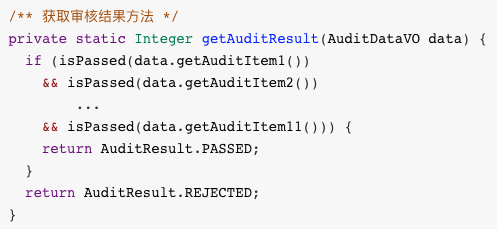
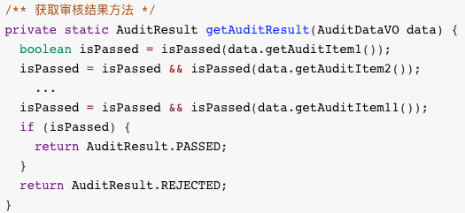
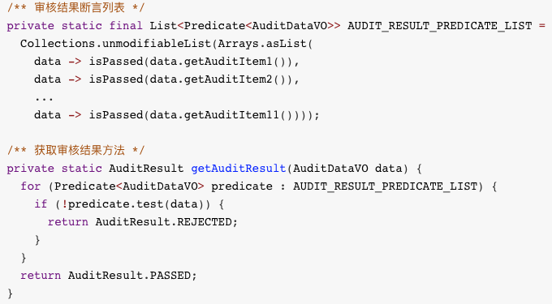
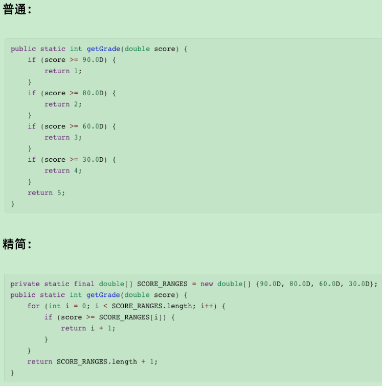
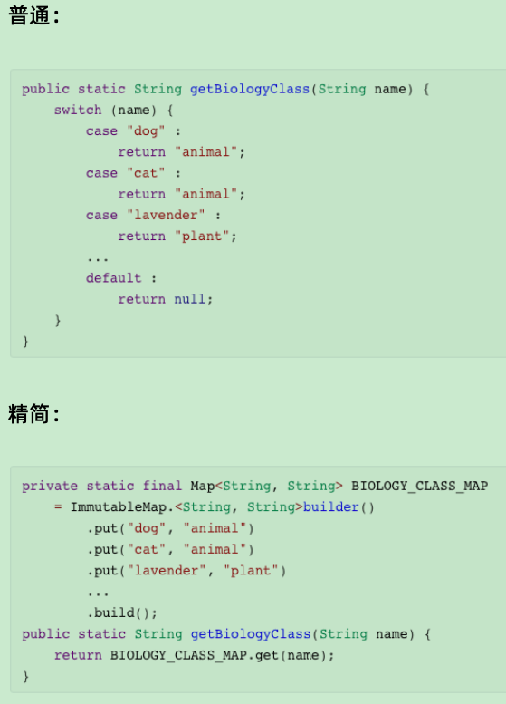
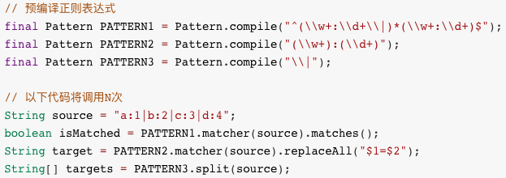
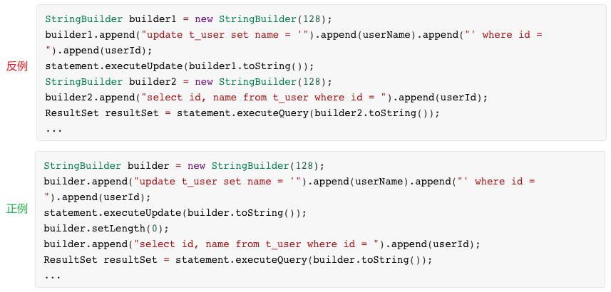

# 代码简洁之道

> 本笔记收集与总结一些 Java 程序编写的最佳实践

## 1. 代码最佳样板

### 1.1. 定义工具类

常见的工具类定义如下：

```java
/** 工具类示例 */
public class CodeSample {
    /** 常量值 */
    public final static int CONST_VALUE = 123;

    /** 静态工具方法 */
    public static int sum(int a, int b) {
        return a + b;
    }
}
```

以上工具类定义存在的问题：

1. **修饰符顺序不规范**。Java 语言规范建议使用“`static final`”，而不是“`final static`”。记住这么一条规则：**静态常量，静态（`static`）在前，常量（`final`）在后**。
2. **工具类可以被继承覆盖**。如果定义一个类继承 `CodeSample`，就可以对其工具类中的常量和方法进行覆盖，导致不能确定是否使用了原工具类中的常量和方法。例如：对于 Apache 提供的工具类，很多程序员都喜欢定义相同名称的工具类，并让这个工具类继承 Apache 的工具类，并在这个类中添加自己的实现方法。不推荐这种做法的，因为使用时不能确定调用的是 Apache 工具类提供的常量和方法，还是被覆盖的常量和方法。最好的办法，就是对工具类添加 final 关键字，让此工具类不能被继承和覆盖。
3. **工具类可以被实例化**。对于工具类来说，没有必要进行实例化。所以建议将构造方法设置为私有，并在方法中抛出 `UnsupportedOperationException`（不支持的操作异常）。

**工具类最佳定义方式**：

```java
public final class CodeSample {
    /** 私有构造方法 */
    public CodeSample() {
        throw new UnsupportedOperationException();
    }

    /** 常量值 */
    public static final int CONST_VALUE = 123;

    /** 静态工具方法 */
    public static int sum(int a, int b) {
        return a + b;
    }
}
```

### 1.2. 定义枚举类

常见的枚举类定义如下：

```java
/** 枚举类示例 */
public enum SampleEnum {
    /** 枚举实例 */
    ONE(1, "one"),
    TWO(2, "two"),
    THREE(3, "three");

    /** 属性 */
    private Integer value;
    private String desc;

    private SampleEnum(Integer value, String desc) {
        this.value = value;
        this.desc = desc;
    }

    /** 获取属性值 */
    public Integer getValue() {
        return value;
    }

    public String getDesc() {
        return desc;
    }
}
```

以上枚举类定义存在的问题：

1. 构造方法的修饰符 `private` 可缺省。
2. 成员变量建议使用基础类型。用包装类型做为枚举的属性本身并没有什么问题。但是，本着能用基础类型就用基础类型的规则，所以建议使用基础类型 int。
3. 成员变量建议使用 `final` 字段。目的是为了避免枚举对外提供了修改成员属性的方法，如果被调用，就会把枚举值修改，导致应用程序出错。因此建议对字段添加 `final` 修饰符，从而避免字段值被恶意篡改。

**枚举类最佳定义方式**：

```java
public enum SampleEnum {
    /** 枚举实例 */
    ONE(1, "one"),
    TWO(2, "two"),
    THREE(3, "three");

    /** 属性 */
    private final int value;
    private final String desc;

    SampleEnum(int value, String desc) {
        this.value = value;
        this.desc = desc;
    }

    /** 获取属性值 */
    public int getValue() {
        return value;
    }

    public String getDesc() {
        return desc;
    }
}
```

### 1.3. 定义集合常量

常见的集合常量定义如下：

```java
public final class CodeSample {
    /** List 常量 */
    public static final List<Integer> CONST_VALUE_LIST = Arrays.asList(1, 2, 3);
    /** Set 常量 */
    public static final Set<Integer> CONST_VALUE_SET = new HashSet<>(Arrays.asList(1, 2, 3));
    /** Map 常量 */
    public static final Map<Integer, String> CONST_VALUE_MAP;

    static {
        CONST_VALUE_MAP = new HashMap<>();
        CONST_VALUE_MAP.put(1, "value1");
        CONST_VALUE_MAP.put(2, "value2");
        CONST_VALUE_MAP.put(3, "value3");
    }
    // ...省略
}
```

以上集合常量定义存在的问题：由于普通的集合对象（如 ArrayList、HashMap、HashSet 等）都是可变集合对象，即便是定义为静态常量，也可以通过操作方法进行修改。所以示例定义的都并不是真正意义上的集合常量。其中，`Arrays.asList` 方法生成的内部 `ArrayList` 不能执行 `add`/`remove`/`clear` 方法，但是可以执行方法，也属于可变集合对象。

**集合常量最佳定义方式**：在 JDK 中，`Collections` 工具类中提供一套方法，用于把可变集合对象变为不可变（不可修改，修改时会抛出 `UnsupportedOperationException` 异常）集合对象。因此可以利用这套方法定义集合静态常量。

```java
public final class CodeSample {
    /** List 常量 */
    public static final List<Integer> CONST_VALUE_LIST = Collections.unmodifiableList(Arrays.asList(1, 2, 3));
    /** Set 常量 */
    public static final Set<Integer> CONST_VALUE_SET = Collections.unmodifiableSet(new HashSet<>(Arrays.asList(1, 2, 3)));
    /** Map 常量 */
    public static final Map<Integer, String> CONST_VALUE_MAP;

    static {
        Map<Integer, String> tempMap = new HashMap<>();
        tempMap.put(1, "value1");
        tempMap.put(2, "value2");
        tempMap.put(3, "value3");
        CONST_VALUE_MAP = Collections.unmodifiableMap(tempMap);
    }
    // ...省略
}
```

### 1.4. 定义数组常量

常见的数组常量定义如下：

```java
public final class CodeSample {
    /** 常量值数组 */
    public static final int[] CONST_VALUE_ARRAY = new int[]{1, 2, 3};
    // ...省略
}
```

以上数组常量定义存在的问题：可以通过下标修改数组值，导致数组常量的值可变。因此并不是真正意义上的数组常量。

**数组常量最佳定义方式**：使用“私有数组常量+公有克隆方法”的解决方案。先定义一个私有数组常量，保证不会被外部类使用；再定义一个获取数组常量方法，并返回一个数组常量的克隆值。

```java
public final class CodeSample {
    /** 常量值数组 */
    private static final int[] CONST_VALUE_ARRAY = new int[]{1, 2, 3};
    /** 定义获取常量值数组的方法 */
    public static int[] getConstValueArray() {
        return CONST_VALUE_ARRAY.clone();
    }
    // ...省略
}
```

> Notes: 由于每次返回的是一个克隆数组，即便修改了克隆数组的常量值，也不会导致原始数组常量值的修改。

### 1.5. 定义多条件表达式

程序开发中，常见多个条件判断处理方式如下：

1. 利用运算符`&&`（或`||`）直接拼接，这种做法会导致条件判断过长，不利于后期维护。



2. 利用运算符`=`和`&&`（或`||`）级联拼接。就把`&&`（或`||`）连接符拆开，利用运算符`=`和`&&`（或`||`）级联进行拼接。这种方式并不能减少方法的圈复杂度。



3. 利用动态无参数 Lambda 表达式列表。即把每个条件表达式作为 `BooleanSupplier` 对象存在列表中，然后依次执行条件表达式得出最后结果。通过 SonarLint 插件扫描，没有提示任何问题。但是，每次都动态添加 Lambda 表达式，就会导致程序效率低下。


4. 利用静态有参数 Lambda 表达式列表。要想固化 Lambda 表达式，就必须动态传入 `AuditDataVO` 对象。这里，采用 `Predicate<AuditDataVO>` 来接收 Lambda 表达式，在 Lambda 表达式中指定 `AuditDataVO` 对象 data。然后在 for 循环中，依次指定 `AuditDataVO` 对象 data，并计算表达式的值。



态有参数 Lambda 表达式列表这种方式的适用条件：

- 适合于`&&`（或`||`）连接大量条件表达式的情况；
- 适合于每个条件表达式都需要传入相同参数的情况，如果每个条件表达式传入参数不同，只能使用动态无参数 Lambda 表达式列表方法；
- 如果需要传入两个参数，可以使用 `BiPredicate` 类型来接收 Lambda 表达式；如果需要传入多个参数，则需要自定义方法接口。

## 2. 代码精简最佳实践

### 2.1. 利用语法精简代码

1. 利用三元表达式来取代一些 if-else 判断。*Tips: 对于包装类型的算术计算，需要注意避免拆包时的空指针问题。*

2. 从 Java 5 起，提供了 for-each 循环来简化了数组和集合的循环遍历。For-each 循环允许无需保持传统 for 循环中的索引就可以遍历数组，或在使用迭代器时无需在 while 循环中调用 `hasNext` 方法和 `next` 方法就可以遍历集合。
3. 所有实现 `Closeable` 接口的“资源”，均可采用 try-with-resource 的方式进行简化资源关闭的处理。
4. 在方法中利用 `return` 关键字，可以提前函数返回，避免定义中间变量、或者做其他无用的逻辑处理。
5. 利用 `static` 关键字，可以把字段变成静态字段，也可以把函数变为静态函数，调用时就无需初始化类对象。
6. Java 8 版本以后，利用 lambda 表达式替代匿名内部类的使用，在简化了代码的同时，更突出了原有匿名内部类中真正有用的那部分代码。
7. Java 8 版本以后，可以利用方法引用（`::`）简化 lambda 表达式，省略变量声明和函数调用。
8. 当程序中大量使用同一静态常量和函数时，可以使用静态导入（import static），简化静态常量和函数的引用。*静态引入容易造成代码阅读困难，所以在实际项目中应该警慎使用。*
9. Java 的异常分为两类：Checked 异常和 Unchecked 异常。Unchecked 异常继承了 `RuntimeException`，特点是代码不需要处理它们也能通过编译，所以它们称作Unchecked 异常。利用 Unchecked 异常，可以避免不必要的 try-catch 和 throws 异常处理。

### 2.2. 利用注解精简代码

1. 利用 Lombok 工具库，简化大量重复的样板代码。
2. 利用 Validation 注解，简化方法参数的校验处理。
3. 使用 Spring 的 `@NonNull` 注解，用于标注参数或返回值非空，适用于项目内部团队协作。只要实现方和调用方遵循规范，可以避免大胆地省略不必要的空值判断。
4. 注解声明精简。
   - 当注解属性值跟默认值一致时，可以删除该属性赋值；
   - 当注解只有 value 属性时，可以去掉 value 进行简写；
   - 当注解属性组合等于另一个特定注解时，直接采用该特定注解。

### 2.3. 利用常用类的 API 精简代码

1. 利用构造方法，可以简化对象的初始化和设置属性操作。对于属性字段较少的类，可以自定义构造方法。*注意：如果属性字段被替换时，存在构造函数初始化赋值问题。*
2. 利用 Set 集合的 `add` 方法的返回值，可以直接判断当时加入的值是否已经存在，从而避免调用 `contains` 方法判断存在。
3. 利用 Map 的 `computeIfAbsent` 方法，可以保证获取到的对象非空，从而避免了不必要的空判断和重新设置值。
4. 利用链式编程，也叫级联式编程，调用对象的函数时返回一个 this 对象指向对象本身，达到链式效果，可以级联调用。链式编程的优点是：编程性强、可读性强、代码简洁。
5. 在 Java 8 版本，引入了一个 `Optional` 类，该类是一个可以为 null 的容器对象。利用此类可以简化判空的操作
6. 利用  Java 8 版本中的流（Stream）简化集合相关的操作，它允许以声明式处理数据集合，可以看成为一个遍历数据集的高级迭代器。流主要有三部分构成：获取一个数据源→数据转换→执行操作获取想要的结果。每次转换原有 Stream 对象不改变，返回一个新的 Stream 对象，这就允许对其操作可以像链条一样排列，形成了一个管道。流（Stream）提供的功能非常有用，主要包括匹配、过滤、汇总、转化、分组、分组汇总等功能。

### 2.4. 利用常用的工具方法精简代码

1. 使用一些工具类库提供的集合工具类来避免空值判断，例如 apache 的 `CollectionUtils.isNotEmpty(Collection<?> coll)` 方法
2. 利用一些工具方法来避免条件判断，例如：`Math.max(double a, double b)` 取代使用 if-else 来获取最大值
3. 使用 Spring 提供的 `Assert` 断言工具类来简化异常判断。*注意：可能有些插件不认同这种判断，导致使用该对象时会有空指针警告。*
4. 把测试用例数据以 JSON 格式存入文件中，通过 JSON 的 `parseObject` 和 `parseArray` 方法解析成对象。虽然执行效率上有所下降，但可以减少大量的赋值语句，从而精简了测试代码。*建议：JSON 文件名最好以被测试的方法命名，如果有多个版本可以用数字后缀表示。*
5. 自行封装一些工具类

### 2.5. 利用数据结构精简代码

1. 对于固定上下限范围的 if-else 语句，可以用数组+循环来简化。



2. 对于映射关系的 if-else 语句，可以用 Map 来简化。此外，此规则同样适用于简化映射关系的 switch 语句。



3. 利用容器类简化。Java 不像 Python 和 Go，方法不支持返回多个对象。如果需要返回多个对象，就必须自定义类，或者利用容器类。常见的容器类有 Apache 的 `Pair` 类和 `Triple` 类，`Pair` 类支持返回 2 个对象，`Triple` 类支持返回 3 个对象。
4. `ThreadLocal` 提供了线程专有对象，可以在整个线程生命周期中随时取用。利用 `ThreadLocal` 保存线程上下文对象，可以避免不必要的参数传递。*注意：`ThreadLocal`有一定的内存泄露的风险，尽量在业务代码结束前调用 `remove` 方法进行数据清除。*

## 3. 代码编写最佳实践

### 3.1. 常量&变量

1. **直接赋值常量值**，只是创建了一个对象引用，而这个对象引用指向常量值。禁止声明新对象

```java
// 反例
Long i = new Long(1L);
// 正例
Long i = 1L;
```

2. **当成员变量值无需改变时，尽量定义为静态常量**。在类的每个对象实例中，每个成员变量都有一份副本，而成员静态常量只有一份实例。
3. **尽量使用基本数据类型，避免自动装箱和拆箱**。JVM 支持基本类型与对应包装类的自动转换，被称为自动装箱和拆箱。装箱和拆箱都是需要 CPU 和内存资源的，所以应尽量避免使用自动装箱和拆箱。
4. **如果变量的初值会被覆盖，就没有必要给变量赋初值**。
5. **尽量使用函数内的基本类型临时变量**。在函数内，基本类型的参数和临时变量都保存在栈（Stack）中，访问速度较快；对象类型的参数和临时变量的引用都保存在栈（Stack）中，内容都保存在堆（Heap）中，访问速度较慢。在类中，任何类型的成员变量都保存在堆（Heap）中，访问速度较慢。
6. 在老版 JDK 中是建议“**尽量不要在循环体外定义变量**”，但是在新版的 JDK 中已经做了优化。通过对编译后的字节码分析，变量定义在循环体外和循环体内没有本质的区别，运行效率基本上是一样的。反而根据“局部变量作用域最小化”原则，变量定义在循环体内更科学更便于维护，避免了延长大对象生命周期导致延缓回收问题。
7. **不可变的静态常量或者成员，尽量使用非线程安全类**。为了提高性能。

### 3.2. 对象&类

1. **禁止使用 JSON 转化对象**。这种对象转化方式，虽然在功能上没有问题，但是在性能上却存在问题。
2. **尽量不使用反射赋值对象**。用反射赋值主要优点是节省了代码量，但缺点就是性能的下降。
3. **采用 Lambda 表达式替换内部匿名类**。实际 Lambda 表达式并非匿名内部类的语法糖。Lambda 表达式在大多数虚拟机中采用 `invokeDynamic` 指令实现，相对于匿名内部类在效率上会更高一些。
4. **尽量避免定义不必要的子类**。多一个类就需要多一份类加载。
5. **尽量指定类的 final 修饰符**。为类指定 `final` 修饰符，可以让该类不可以被继承。如果指定了一个类为 `final`，则该类所有的方法都是 `final` 的，Java 编译器会寻找机会内联所有的 `final` 方法。内联对于提升 Java 运行效率作用重大，能够使性能平均提高 50%。*值得注意：使用 Spring 的 AOP 特性时，需要对 Bean 进行动态代理，如果 Bean 类添加了 `final` 修饰，会导致异常。*

### 3.3. 方法

1. **把跟类成员变量无关的方法声明成静态方法**。静态方法的好处就是不用生成类的实例就可以直接调用。静态方法不再属于某个对象，而是属于它所在的类。只需要通过其类名就可以访问，不需要再消耗资源去反复创建对象。即便在类内部的私有方法，如果没有使用到类成员变量，也应该声明为静态方法。
2. **尽量使用基本数据类型作为方法参数、方法返回值类型，避免不必要的装箱、拆箱和空指针判断**。在 JDK 类库的方法中，很多方法返回值都采用了基本数据类型。比 如 ：`Collection.isEmpty()`和 `Map.size()`
3. **协议方法参数值、返回值非空，避免不必要的空指针判断**。协议编程，可以 `@NonNull` 和 `@Nullable` 标注参数
4. **如果被调用方法已支持判空处理，调用方法无需再进行判空处理**。
5. **尽量避免不必要的函数封装**。因为方法调用会引起入栈和出栈，导致消耗更多的 CPU 和内存。但为了使代码更简洁、更清晰、更易维护，增加一定的方法调用所带来的性能损耗是值得的。
6. **尽量指定方法的 `final` 修饰符**。*注意：所有的 `private` 方法会隐式地被指定 `final` 修饰符，所以无须再为其指定 `final` 修饰符。*
7. **尽量使用方法传递代替值传递**。
8. 可以避免不必要的方法计算。比如 `Optional` 类的 `orElse(T value)` 方法和 `orElseGet(Supplier supplier)` 方法：
   - `orElse(T value)` 方法无论前面 Optional 容器值是 null 还是 nonNull，都会提前执行 `orElse` 里的方法；
   - `orElseGet(Supplier supplier)` 方法并不会，只会在 Optional 容器值为 null 时才调用 `orElseGet` 里的方法。


### 3.4. 表达式

1. **尽量减少方法的重复调用**。例如，使用普通 for 循环集合时，将 `list.size()` 方法提取在变量，避免每次循环时重新调用方法获取集合大小。
2. **尽量避免不必要的方法调用**。
3. **尽量使用移位来代替正整数乘除**。用移位操作可以极大地提高性能。对于乘除 `2^n`（n 为正整数）的正整数计算，可以用移位操作来代替。

```java
// 反例
int num1 = a * 4;
int num2 = a / 4;
// 正例
int num1 = a << 2;
int num2 = a >> 2;
```

4. **提取公共表达式**，只计算一次值，然后重复利用值，避免重复计算。
5. **尽量不在条件表达式中用 `!` 取反**。取反会多一次计算，如果没有必要则优化掉。
6. **对于多常量选择分支，尽量使用 switch 语句而不是 if-else 语句**。if-else 语句，每个 if 条件语句都要加装计算，直到 if 条件语句为 true 为止。switch 语句进行了跳转优化，Java 中采用 tableswitch 或 lookupswitch 指令实现，对于多常量选择分支处理效率更高。**经过试验证明：在每个分支出现概率相同的情况下，低于 5 个分支时 if-else 语句效率更高，高于 5 个分支时 switch 语句效率更高**。

### 3.5. 字符串

1. **尽量不要使用正则表达式匹配**。正则表达式匹配效率较低，尽量使用字符串匹配操作。
2. **尽量使用字符替换字符串**。字符串的长度不确定，而字符的长度固定为 1，查找和匹配的效率自然提高了。
3. **尽量使用 `StringBuilder` 进行字符串拼接**。`String` 是 final 类，内容不可修改，所以每次字符串拼接都会生成一个新对象。`StringBuilder` 在初始化时申请了一块内存，往后的字符串拼接都在这块内存中执行，不会申请新内存和生成新对象。
4. **不要使用`"" +`转化字符串**。此方式使用方便但是效率低，建议使用 `String.valueOf` 方法。
5. **尽量预编译正则表达式**。`Pattern.compile` 方法的性能开销很大。但这个方法隐藏在很多常用的方法里。比如：`String.matches`、`String.replaceAll`、`String.split` 等函数。对于多次调用这些方法，可以考虑预编译正则表达式以提高执行效率，并参考原有实现代码编写优化后的代码。



### 3.6. 数组

1. **不要使用循环拷贝数组，尽量使用 `System.arraycopy` 或 `Arrays.copyOf` 拷贝数组**。
2. **集合转化为类型 `T` 数组时，尽量传入空数组 `T[0]`**。将集合转换为数组有 2 种形式：`toArray(new T[n])` 和 `toArray(new T[0])`。在旧的 Java 版本中，建议使用 `toArray(new T[n])`，因为创建数组时所需的反射调用非常慢。在 OpenJDK6 后，反射调用是内在的，使得性能得以提高，`toArray(new T[0])` 比 `toArray(new T[n])` 效率更高。此外，`toArray(new T[n])` 比 `toArray(new T[0])` 多获取一次列表大小，如果计算列表大小耗时过长，也会导致`toArray(new T[n])`效率降低。
3. **集合转化为 Object 数组时，没有必要使用 `toArray[new Object[0]]`，尽量使用 `toArray()` 方法**。避免了类型的判断，也避免了空数组的申请，所以效率会更高。

### 3.7. 集合

1. **初始化集合时，尽量指定集合大小**。Java 集合初始化时都会指定一个默认大小，当默认大小不再满足数据需求时就会扩容，每次扩容的时间复杂度有可能是 `O(n)`。所以尽量指定预知的集合大小，就能避免或减少集合的扩容次数。
2. **不要使用循环拷贝集合，尽量使用 JDK 提供的方法拷贝集合**。JDK 提供的方法可以一步指定集合的容量，避免多次扩容浪费时间和空间。同时这些方法的底层也是调用 `System.arraycopy` 方法实现，进行数据的批量拷贝效率更高。
3. **尽量使用 `Arrays.asList` 转化数组为列表**。（原因同上）
4. **直接迭代需要使用的集合**。
5. **不要使用 `size` 方法检测空，必须使用 `isEmpty` 方法检测空**。使用 `isEmpty` 方法使得代码更易读，并且可以获得更好的性能。任何 `isEmpty` 方法实现的时间复杂度都是 `O(1)`，但是某些 `size` 方法实现的时间复杂度有可能是 `O(n)`。
6. **非随机访问的 List，尽量使用迭代代替随机访问**。对于列表，可分为随机访问和非随机访问两类，可以用是否实现 `RandomAccess` 接口判断。随机访问列表，直接通过 `get` 方法获取数据不影响效率。而非随机访问列表，通过 `get` 获取数据效率极低。
7. **尽量使用 HashSet 判断值存在**。List 的 `contains` 方法普遍时间复杂度是 `O(n)`，而 HashSet 的时间复杂度为 `O(1)`。如果需要频繁调用 `contains` 方法查找数据，建议先将 List 转换成 HashSet。
8. **避免先判断存在再进行获取**。如果需要先判断存在再进行获取，可以直接获取并判断空，从而避免了二次查找操作。

### 异常

1. **直接捕获对应的异常**，避免用 `instanceof` 判断，效率更高代码更简洁。
2. **尽量避免在循环中捕获异常**。当循环体抛出异常后并且无需循环继续执行时，就没有必要在循环体中捕获异常。因为过多的捕获异常会降低程序执行效率。
3. **禁止使用异常控制业务流程**。相对于条件表达式，异常的处理效率更低。

### 缓冲区

1. **初始化时尽量指定缓冲区大小**，避免多次扩容浪费时间和空间。
2. **尽量重复使用同一缓冲区**。针对缓冲区，Java 虚拟机需要花时间生成对象，还要花时间进行垃圾回收处理。因此尽量重复利用缓冲区。



3. **尽量设计使用同一缓冲区**。去掉每个转化方法中的缓冲区申请，申请一个缓冲区给每个转化方法使用。从时间上来说，节约了大量缓冲区的申请释放时间；从空间上来说，节约了大量缓冲区的临时存储空间
4. **尽量使用缓冲流减少 IO 操作**。使用缓冲流 `BufferedReader`、 `BufferedWriter`、 `BufferedInputStream`、 `BufferedOutputStream` 等，可以大幅减少 IO 次数并提升 IO 速度。可以根据实际情况手动指定缓冲流的大小，把缓冲流的缓冲作用发挥到最大。

### 线程

1. **在单线程中，尽量使用非线程安全类**，避免了不必要的同步开销。
2. **在多线程中，尽量使用线程安全类**，保证线程安全。
3. **尽量减少同步代码块范围**。在一个方法中，可能只有一小部分的逻辑是需要同步控制的，如果同步控制了整个方法会影响执行效率。所以尽量减少同步代码块的范围，只对需要进行同步的代码进行同步。
4. **尽量合并为同一同步代码块**。同步代码块是有性能开销的，如果确定可以合并为同一同步代码块，就应该尽量合并为同一同步代码块。
5. **尽量使用线程池减少线程开销**。多线程中两个必要的开销：线程的创建和上下文切换。采用线程池，可以尽量地避免这些开销。

### 编码规则建议

1. **使用通用工具函数**
2. **拆分超大函数**。主要原因如下：
   - 函数越短小精悍，功能就越单一，往往生命周期较长；
   - 一个函数越长，就越不容易理解和维护，维护人员不敢轻易修改；
   - 在过长函数中，往往含有难以发现的重复代码。
3. **同一函数内的代码处理的内容尽量一致**
4. **多封装公共函数**，减少代码行数，提高代码质量，可读性可维护性更强。
5. **把获取参数值的处理逻辑封装为函数**。把获取参数值从业务函数中独立，使业务逻辑更清晰，也可以在代码中重复使用。
6. **减少函数代码层级（代码的缩进）**。建议函数代码层级在 1-4 之间，过多的缩进会让函数难以阅读。
7. **将复杂条件表达式封装为函数**。
8. **尽量避免不必要的空指针判断**。这些不必要的空指针判断，基本属于永远不执行的 Death 代码，删除有助于代码维护。
9. **内部函数尽量使用基础类型**。避免了隐式封装类型的打包和拆包，也可避免空指针判断。
10. **尽量避免返回的数组、列表、对象为 null**，避免调用函数的空指针判断。
11. **封装函数传入参数为对象**。Java 规范不允许函数参数太多，不便于维护也不便于扩展。
12. **尽量用函数替换匿名内部类的实现**。在匿名内部类（包括 Lambda 表达式）中可以直接访问外部类的成员，包括类的成员变量、函数的内部变量。正因为可以随意访问外部变量，所以会导致代码边界不清晰。首先推荐用 Lambda 表达式简化匿名内部类，其次推荐用函数替换复杂的Lambda 表达式的实现。
13. **提前 return 精简不必要的代码**。
14. **仅在需要时才定义变量**。
