# 排序算法

一些常用的排序算法。

- 基数排序
- 冒泡排序
- 选择排序
- 归并排序
- 堆排序
- 快速排序
- 直接插入排序
- 希尔排序
- 拓扑排序

> *注：以下代码案例，存放在pyg-test工程中sort-test模块中*

---

目录

[TOC]

---

## 1. 基数排序

### 1.1. 要点

基数排序与本系列前面讲解的七种排序方法都不同，它不需要比较关键字的大小。

它是根据关键字中各位的值，通过对排序的N个元素进行若干趟“分配”与“收集”来实现排序的。

不妨通过一个具体的实例来展示一下，基数排序是如何进行的。 设有一个初始序列为: R {50, 123, 543, 187, 49, 30, 0, 2, 11, 100}。

我们知道，任何一个阿拉伯数，它的各个位数上的基数都是以0~9来表示的。所以我们不妨把0~9视为10个桶。

我们先根据序列的个位数的数字来进行分类，将其分到指定的桶中。例如：R[0] = 50，个位数上是0，将这个数存入编号为0的桶中。

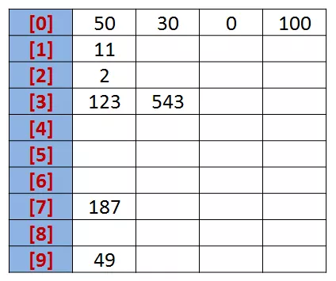

分类后，我们在从各个桶中，将这些数按照从编号0到编号9的顺序依次将所有数取出来。这时，得到的序列就是个位数上呈递增趋势的序列。

按照个位数排序： {50, 30, 0, 100, 11, 2, 123, 543, 187, 49}。接下来，可以对十位数、百位数也按照这种方法进行排序，最后就能得到排序完成的序列。

### 1.2. LSD法实现（完整参考代码）

```java
package com.moon.demo.sort;

/**
 * 基数排序算法
 */
public class RadixSort {
    // 获取x这个数的d位数上的数字
    // 比如获取123的1位数，结果返回3
    public int getDigit(int x, int d) {
        int a[] = {1, 1, 10, 100}; // 本实例中的最大数是百位数，所以只要到100就可以了
        return ((x / a[d]) % 10);
    }

    public void radixSort(int[] list, int begin, int end, int digit) {
        final int radix = 10; // 基数
        int i = 0, j = 0;
        int[] count = new int[radix]; // 存放各个桶的数据统计个数
        int[] bucket = new int[end - begin + 1];
        // 按照从低位到高位的顺序执行排序过程
        for (int d = 1; d <= digit; d++) {
            // 置空各个桶的数据统计
            for (i = 0; i < radix; i++) {
                count[i] = 0;
            }
            // 统计各个桶将要装入的数据个数
            for (i = begin; i <= end; i++) {
                j = getDigit(list[i], d);
                count[j]++;
            }

            // count[i]表示第i个桶的右边界索引
            for (i = 1; i < radix; i++) {
                count[i] = count[i] + count[i - 1];
            }

            // 将数据依次装入桶中
            // 这里要从右向左扫描，保证排序稳定性
            for (i = end; i >= begin; i--) {
                j = getDigit(list[i], d);
                // 求出关键码的第k位的数字， 例如：576的第3位是5
                bucket[count[j] - 1] = list[i];
                // 放入对应的桶中，count[j]-1是第j个桶的右边界索引
                count[j]--; // 对应桶的装入数据索引减一
            }
            // 将已分配好的桶中数据再倒出来，此时已是对应当前位数有序的表
            for (i = begin, j = 0; i <= end; i++, j++) {
                list[i] = bucket[j];
            }
        }
    }

    public int[] sort(int[] list) {
        radixSort(list, 0, list.length - 1, 3);
        return list;
    }

    // 打印完整序列
    public void printAll(int[] list) {
        for (int value : list) {
            System.out.print(value + "\t");
        }
        System.out.println();
    }

    public static void main(String[] args) {
        int[] array = {50, 123, 543, 187, 49, 30, 0, 2, 11, 100};
        RadixSort radix = new RadixSort();
        System.out.print("排序前:\t\t");
        radix.printAll(array);
        radix.sort(array);
        System.out.print("排序后:\t\t");
        radix.printAll(array);
    }
}
```

**运行结果**

> 排序前:     50  123 543 187 49  30  0   2   11  100
> 
> 排序后:     0   2   11  30  49  50  100 123 187 543

### 1.3. 算法分析

**基数排序的性能**


**时间复杂度**

通过上文可知，假设在基数排序中，r为基数，d为位数。则基数排序的时间复杂度为O(d(n+r))。我们可以看出，基数排序的效率和初始序列是否有序没有关联。

**空间复杂度**

在基数排序过程中，对于任何位数上的基数进行“装桶”操作时，都需要n+r个临时空间。

**算法稳定性**

在基数排序过程中，每次都是将当前位数上相同数值的元素统一“装桶”，并不需要交换位置。所以基数排序是稳定的算法。

## 2. 冒泡排序

### 2.1. 冒泡排序介绍

冒泡排序(Bubble Sort)，又被称为气泡排序或泡沫排序。

它是一种较简单的排序算法。它会遍历若干次要排序的数列，每次遍历时，它都会从前往后依次的比较相邻两个数的大小；如果前者比后者大，则交换它们的位置。这样，一次遍历之后，最大的元素就在数列的末尾！ 采用相同的方法再次遍历时，第二大的元素就被排列在最大元素之前。重复此操作，直到整个数列都有序为止！

原理：比较两个相邻的元素，将值大的元素交换至右端

### 2.2. 自己写的冒泡排序demo

```java
import java.util.Arrays;

public class MoonZero {
	public static void main(String[] args) {
		int[] arr = { 6, 3, 8, 9, 2, 7 };
		System.out.println(Arrays.toString(arr));
		// 冒泡排序  升序排列,如果降序就将if的判断改在(arr[j]<arr[j+1])
		for (int i = 0; i < arr.length - 1; i++) {
			for (int j = 0; j + 1 < arr.length - i; j++) {
				if (arr[j] > arr[j + 1]) {
					int temp = arr[j];
					arr[j] = arr[j + 1];
					arr[j + 1] = temp;
				}
			}
		}
		System.out.println(Arrays.toString(arr));
	}
}
```

### 2.3. 冒泡排序图文说明

#### 2.3.1. 冒泡排序实现一

```java
public static void bubbleSort1(int[] a, int n) {
    int i, j;

    for (i = n - 1; i > 0; i--) {
        // 将a[0...i]中最大的数据放在末尾
        for (j = 0; j < i; j++) {

            if (a[j] > a[j + 1]) {
                // 交换a[j]和a[j+1]
                int tmp = a[j];
                a[j] = a[j + 1];
                a[j + 1] = tmp;
            }
        }
    }
}
```

下面以数列{20,40,30,10,60,50}为例，演示它的冒泡排序过程(如下图)。

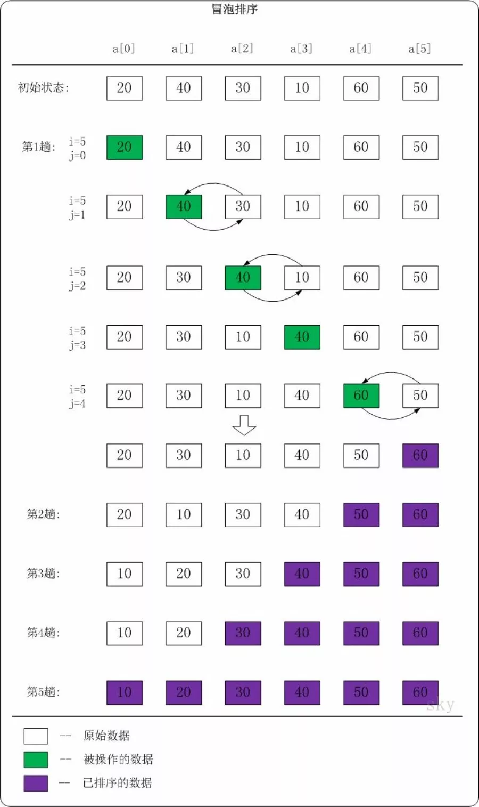

先分析第1趟排序

- 当i=5,j=0时，a[0]<a[1]。此时，不做任何处理！
- 当i=5,j=1时，a[1]>a[2]。此时，交换a[1]和a[2]的值；交换之后，a[1]=30，a[2]=40。
- 当i=5,j=2时，a[2]>a[3]。此时，交换a[2]和a[3]的值；交换之后，a[2]=10，a[3]=40。
- 当i=5,j=3时，a[3]<a[4]。此时，不做任何处理！
- 当i=5,j=4时，a[4]>a[5]。此时，交换a[4]和a[5]的值；交换之后，a[4]=50，a[3]=60。

于是，第1趟排序完之后，数列{20,40,30,10,60,50}变成了{20,30,10,40,50,60}。此时，数列末尾的值最大。

**根据这种方法：**

- 第2趟排序完之后，数列中a[5...6]是有序的。
- 第3趟排序完之后，数列中a[4...6]是有序的。
- 第4趟排序完之后，数列中a[3...6]是有序的。
- 第5趟排序完之后，数列中a[1...6]是有序的。

第5趟排序之后，整个数列也就是有序的了。

#### 2.3.2. 冒泡排序实现二

观察上面冒泡排序的流程图，第3趟排序之后，数据已经是有序的了；第4趟和第5趟并没有进行数据交换。

下面我们对冒泡排序进行优化，使它效率更高一些：添加一个标记，如果一趟遍历中发生了交换，则标记为true，否则为false。如果某一趟没有发生交换，说明排序已经完成！

```java
public static void bubbleSort2(int[] a, int n) {
    int i, j;
    // 标记
    int flag;

    for (i = n - 1; i > 0; i--) {
        // 初始化标记为0
        flag = 0;
        // 将a[0...i]中最大的数据放在末尾
        for (j = 0; j < i; j++) {
            if (a[j] > a[j + 1]) {
                // 交换a[j]和a[j+1]
                int tmp = a[j];
                a[j] = a[j + 1];
                a[j + 1] = tmp;
                // 若发生交换，则设标记为1
                flag = 1;
            }
        }

        if (flag == 0) {
            // 若没发生交换，则说明数列已有序。
            break;
        }
    }
}
```

### 2.4. 冒泡排序的时间复杂度和稳定性

**冒泡排序时间复杂度**

冒泡排序的时间复杂度是O(N2)。

假设被排序的数列中有N个数。遍历一趟的时间复杂度是O(N)，需要遍历多少次呢？N-1次！因此，冒泡排序的时间复杂度是O(N2)。

**冒泡排序稳定性**

冒泡排序是稳定的算法，它满足稳定算法的定义。

算法稳定性 -- 假设在数列中存在a[i]=a[j]，若在排序之前，a[i]在a[j]前面；并且排序之后，a[i]仍然在a[j]前面。则这个排序算法是稳定的！

### 2.5. 冒泡排序实现
#### 2.5.1. 冒泡排序Java实现

```java
package com.moon.demo.sort;

/**
 * 冒泡排序算法
 */
public class BubbleSort {

    /*
     * 冒泡排序
     *
     * 参数说明：
     *     a -- 待排序的数组
     *     n -- 数组的长度
     */
    public static void bubbleSort1(int[] a, int n) {
        int i, j;

        for (i = n - 1; i > 0; i--) {
            // 将a[0...i]中最大的数据放在末尾
            for (j = 0; j < i; j++) {

                if (a[j] > a[j + 1]) {
                    // 交换a[j]和a[j+1]
                    int tmp = a[j];
                    a[j] = a[j + 1];
                    a[j + 1] = tmp;
                }
            }
        }
    }

    /*
     * 冒泡排序(改进版)
     *
     * 参数说明：
     *     a -- 待排序的数组
     *     n -- 数组的长度
     */
    public static void bubbleSort2(int[] a, int n) {
        int i, j;
        // 标记
        int flag;

        for (i = n - 1; i > 0; i--) {
            // 初始化标记为0
            flag = 0;
            // 将a[0...i]中最大的数据放在末尾
            for (j = 0; j < i; j++) {
                if (a[j] > a[j + 1]) {
                    // 交换a[j]和a[j+1]
                    int tmp = a[j];
                    a[j] = a[j + 1];
                    a[j + 1] = tmp;
                    // 若发生交换，则设标记为1
                    flag = 1;
                }
            }

            if (flag == 0) {
                // 若没发生交换，则说明数列已有序。
                break;
            }
        }
    }

    public static void main(String[] args) {
        int i;
        int[] a = {20, 40, 30, 10, 60, 50};

        System.out.printf("before sort:");
        for (i = 0; i < a.length; i++) {
            System.out.printf("%d ", a[i]);
        }
        System.out.printf("\n");

        bubbleSort1(a, a.length);
        //bubbleSort2(a, a.length);

        System.out.printf("after  sort:");
        for (i = 0; i < a.length; i++) {
            System.out.printf("%d ", a[i]);
        }
        System.out.printf("\n");
    }
}
```

#### 2.5.2. 冒泡排序C实现（了解）

```c
/**
* 冒泡排序：C 语言
*/

#include <stdio.h>

// 数组长度
#define LENGTH(array) ( (sizeof(array)) / (sizeof(array[0])) )
// 交互数值
#define swap(a,b)    (a^=b,b^=a,a^=b)

/*
* 冒泡排序
*
* 参数说明：
*     a -- 待排序的数组
*     n -- 数组的长度
*/
void bubble_sort1(int a[], int n)
{
   int i,j;

   for (i=n-1; i>0; i--)
   {
       // 将a[0...i]中最大的数据放在末尾
       for (j=0; j<i; j++)
       {
           if (a[j] > a[j+1])
               swap(a[j], a[j+1]);
       }
   }
}

/*
* 冒泡排序(改进版)
*
* 参数说明：
*     a -- 待排序的数组
*     n -- 数组的长度
*/
void bubble_sort2(int a[], int n)
{
   int i,j;
   int flag;                 // 标记

   for (i=n-1; i>0; i--)
   {
       flag = 0;            // 初始化标记为0

       // 将a[0...i]中最大的数据放在末尾
       for (j=0; j<i; j++)
       {
           if (a[j] > a[j+1])
           {
               swap(a[j], a[j+1]);
               flag = 1;    // 若发生交换，则设标记为1
           }
       }

       if (flag==0)
           break;            // 若没发生交换，则说明数列已有序。
   }
}

void main()
{
   int i;
   int a[] = {20,40,30,10,60,50};
   int ilen = LENGTH(a);

   printf("before sort:");
   for (i=0; i<ilen; i++)
       printf("%d ", a[i]);
   printf("\n");

   bubble_sort1(a, ilen);
   //bubble_sort2(a, ilen);

   printf("after  sort:");
   for (i=0; i<ilen; i++)
       printf("%d ", a[i]);
   printf("\n");
}
```

#### 2.5.3. 冒泡排序C++实现（了解）

```c++
**
* 冒泡排序：C++
*/

#include <iostream>
using namespace std;

/*
* 冒泡排序
*
* 参数说明：
*     a -- 待排序的数组
*     n -- 数组的长度
*/
void bubbleSort1(int* a, int n)
{
   int i,j,tmp;

   for (i=n-1; i>0; i--)
   {
       // 将a[0...i]中最大的数据放在末尾
       for (j=0; j<i; j++)
       {
           if (a[j] > a[j+1])
           {
               // 交换a[j]和a[j+1]
               tmp = a[j];
               a[j] = a[j+1];
               a[j+1] = tmp;
           }
       }
   }
}

/*
* 冒泡排序(改进版)
*
* 参数说明：
*     a -- 待排序的数组
*     n -- 数组的长度
*/
void bubbleSort2(int* a, int n)
{
   int i,j,tmp;
   int flag;                 // 标记

   for (i=n-1; i>0; i--)
   {
       flag = 0;            // 初始化标记为0

       // 将a[0...i]中最大的数据放在末尾
       for (j=0; j<i; j++)
       {
           if (a[j] > a[j+1])
           {
               // 交换a[j]和a[j+1]
               tmp = a[j];
               a[j] = a[j+1];
               a[j+1] = tmp;

               flag = 1;    // 若发生交换，则设标记为1
           }
       }

       if (flag==0)
           break;            // 若没发生交换，则说明数列已有序。
   }
}

int main()
{
   int i;
   int a[] = {20,40,30,10,60,50};
   int ilen = (sizeof(a)) / (sizeof(a[0]));

   cout << "before sort:";
   for (i=0; i<ilen; i++)
       cout << a[i] << " ";
   cout << endl;

   bubbleSort1(a, ilen);
   //bubbleSort2(a, ilen);

   cout << "after  sort:";
   for (i=0; i<ilen; i++)
       cout << a[i] << " ";
   cout << endl;

   return 0;
}
```

上面3种实现的原理和输出结果都是一样的。下面是它们的输出结果：

```shell
before sort:20 40 30 10 60 50
after  sort:10 20 30 40 50 60
```

---

## 3. 选择排序
### 3.1. 选择排序介绍

择排序(Selection sort)是一种简单直观的排序算法。

它的基本思想是：首先在未排序的数列中找到最小(or最大)元素，然后将其存放到数列的起始位置；接着，再从剩余未排序的元素中继续寻找最小(or最大)元素，然后放到已排序序列的末尾。以此类推，直到所有元素均排序完毕。

原理：首先在未排序序列中找到最小（大）元素，存放到排序序列的起始位置，然后，再从剩余未排序元素中继续寻找最小（大）元素，然后放到已排序序列的末尾。以此类推，直到所有元素均排序完毕。

### 3.2. 自己写的选择排序demo

```java
import java.util.Arrays;

public class MoonZero {
	public static void main(String[] args) {
		int[] arr = { 6, 3, 8, 9, 2, 7 };
		System.out.println(Arrays.toString(arr));
		// 选择排序
		for (int i = 0; i < arr.length - 1; i++) {
			for (int j = i+1; j < arr.length; j++) {
				// 选择排序如果判断“>”就是升序，“<”就是降序
				if (arr[i] > arr[j]) {
					int temp = arr[i];
					arr[i] = arr[j];
					arr[j] = temp;
				}
			}
		}
		System.out.println(Arrays.toString(arr));
	}
}
```

### 3.3. 选择排序图文说明

下面以数列{20,40,30,10,60,50}为例，演示它的选择排序过程(如下图)。

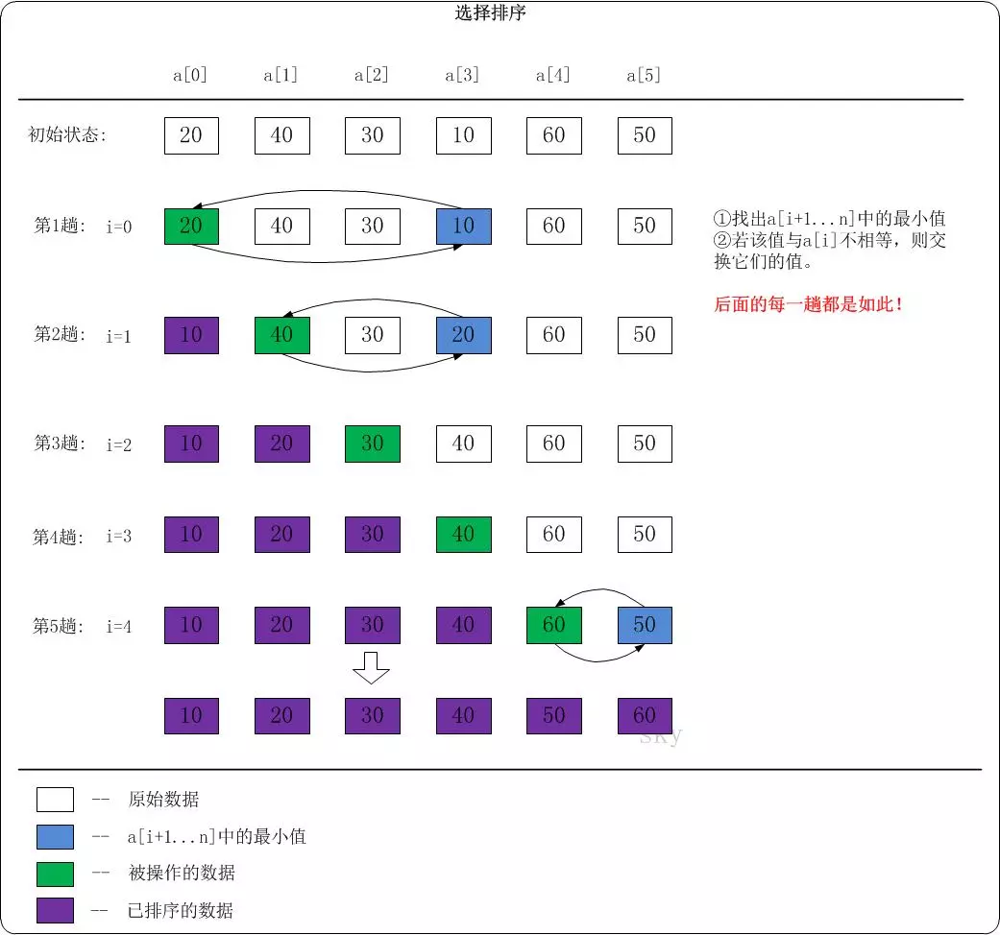

#### 3.3.1. 排序流程

- 第1趟：i=0。找出a[1...5]中的最小值a[3]=10，然后将a[0]和a[3]互换。 数列变化：20,40,30,10,60,50 -- > 10,40,30,20,60,50
- 第2趟：i=1。找出a[2...5]中的最小值a[3]=20，然后将a[1]和a[3]互换。 数列变化：10,40,30,20,60,50 -- > 10,20,30,40,60,50
- 第3趟：i=2。找出a[3...5]中的最小值，由于该最小值大于a[2]，该趟不做任何处理。
- 第4趟：i=3。找出a[4...5]中的最小值，由于该最小值大于a[3]，该趟不做任何处理。
- 第5趟：i=4。交换a[4]和a[5]的数据。 数列变化：10,20,30,40,60,50 -- > 10,20,30,40,50,60

#### 3.3.2. 选择排序的时间复杂度和稳定性

**选择排序时间复杂度**

选择排序的时间复杂度是O(N2)。

假设被排序的数列中有N个数。遍历一趟的时间复杂度是O(N)，需要遍历多少次呢？N-1！因此，选择排序的时间复杂度是O(N2)。

**选择排序稳定性**

选择排序是稳定的算法，它满足稳定算法的定义。

算法稳定性 -- 假设在数列中存在a[i]=a[j]，若在排序之前，a[i]在a[j]前面；并且排序之后，a[i]仍然在a[j]前面。则这个排序算法是稳定的！

### 3.4. 选择排序实现
#### 3.4.1. 选择排序Java实现

```java
package com.moon.demo.sort;

/**
 * 选择排序算法
 */
public class SelectSort {
    /*
     * 选择排序
     *
     * 参数说明：
     *     a -- 待排序的数组
     *     n -- 数组的长度
     */
    public static void selectSort(int[] a, int n) {
        int i;      // 有序区的末尾位置
        int j;      // 无序区的起始位置
        int min;    // 无序区中最小元素位置

        for (i = 0; i < n; i++) {
            min = i;

            // 找出"a[i+1] ... a[n]"之间的最小元素，并赋值给min。
            for (j = i + 1; j < n; j++) {
                if (a[j] < a[min])
                    min = j;
            }

            // 若min!=i，则交换 a[i] 和 a[min]。
            // 交换之后，保证了a[0] ... a[i] 之间的元素是有序的。
            if (min != i) {
                int tmp = a[i];
                a[i] = a[min];
                a[min] = tmp;
            }
        }
    }

    public static void main(String[] args) {
        int i;
        int[] a = {20, 40, 30, 10, 60, 50};

        System.out.printf("before sort:");
        for (i = 0; i < a.length; i++) {
            System.out.printf("%d ", a[i]);
        }
        System.out.printf("\n");

        selectSort(a, a.length);

        System.out.printf("after  sort:");
        for (i = 0; i < a.length; i++) {
            System.out.printf("%d ", a[i]);
        }
        System.out.printf("\n");
    }
}
```

#### 3.4.2. 选择排序C实现（了解）

```c
/**
* 选择排序：C 语言
*/

#include <stdio.h>

// 数组长度
#define LENGTH(array) ( (sizeof(array)) / (sizeof(array[0])) )
#define swap(a,b) (a^=b,b^=a,a^=b)

/*
* 选择排序
*
* 参数说明：
*     a -- 待排序的数组
*     n -- 数组的长度
*/
void select_sort(int a[], int n)
{
   int i;        // 有序区的末尾位置
   int j;        // 无序区的起始位置
   int min;    // 无序区中最小元素位置

   for(i=0; i<n; i++)
   {
       min=i;

       // 找出"a[i+1] ... a[n]"之间的最小元素，并赋值给min。
       for(j=i+1; j<n; j++)
       {
           if(a[j] < a[min])
               min=j;
       }

       // 若min!=i，则交换 a[i] 和 a[min]。
       // 交换之后，保证了a[0] ... a[i] 之间的元素是有序的。
       if(min != i)
           swap(a[i], a[min]);
   }
}

void main()
{
   int i;
   int a[] = {20,40,30,10,60,50};
   int ilen = LENGTH(a);

   printf("before sort:");
   for (i=0; i<ilen; i++)
       printf("%d ", a[i]);
   printf("\n");

   select_sort(a, ilen);

   printf("after  sort:");
   for (i=0; i<ilen; i++)
       printf("%d ", a[i]);
   printf("\n");
}
```

#### 3.4.3. 选择排序C++实现（了解）

```c++
/**
* 选择排序：C++
*/

#include <iostream>
using namespace std;

/*
* 选择排序
*
* 参数说明：
*     a -- 待排序的数组
*     n -- 数组的长度
*/
void selectSort(int* a, int n)
{
   int i;        // 有序区的末尾位置
   int j;        // 无序区的起始位置
   int min;    // 无序区中最小元素位置

   for(i=0; i<n; i++)
   {
       min=i;

       // 找出"a[i+1] ... a[n]"之间的最小元素，并赋值给min。
       for(j=i+1; j<n; j++)
       {
           if(a[j] < a[min])
               min=j;
       }

       // 若min!=i，则交换 a[i] 和 a[min]。
       // 交换之后，保证了a[0] ... a[i] 之间的元素是有序的。
       if(min != i)
       {
           int tmp = a[i];
           a[i] = a[min];
           a[min] = tmp;
       }
   }
}

int main()
{
   int i;
   int a[] = {20,40,30,10,60,50};
   int ilen = (sizeof(a)) / (sizeof(a[0]));

   cout << "before sort:";
   for (i=0; i<ilen; i++)
       cout << a[i] << " ";
   cout << endl;

   selectSort(a, ilen);

   cout << "after  sort:";
   for (i=0; i<ilen; i++)
       cout << a[i] << " ";
   cout << endl;

   return 0;
}
```

上面3种实现的原理和输出结果都是一样的。下面是它们的输出结果：

```console
before sort:20 40 30 10 60 50
after  sort:10 20 30 40 50 60
```

---

## 4. 归并排序

### 4.1. 基本思想

归并排序（MERGE-SORT）是利用归并的思想实现的排序方法，该算法采用经典的分治（divide-and-conquer）策略（分治法将问题分(divide)成一些小的问题然后递归求解，而治(conquer)的阶段则将分的阶段得到的各答案"修补"在一起，即分而治之)。

**分而治之**

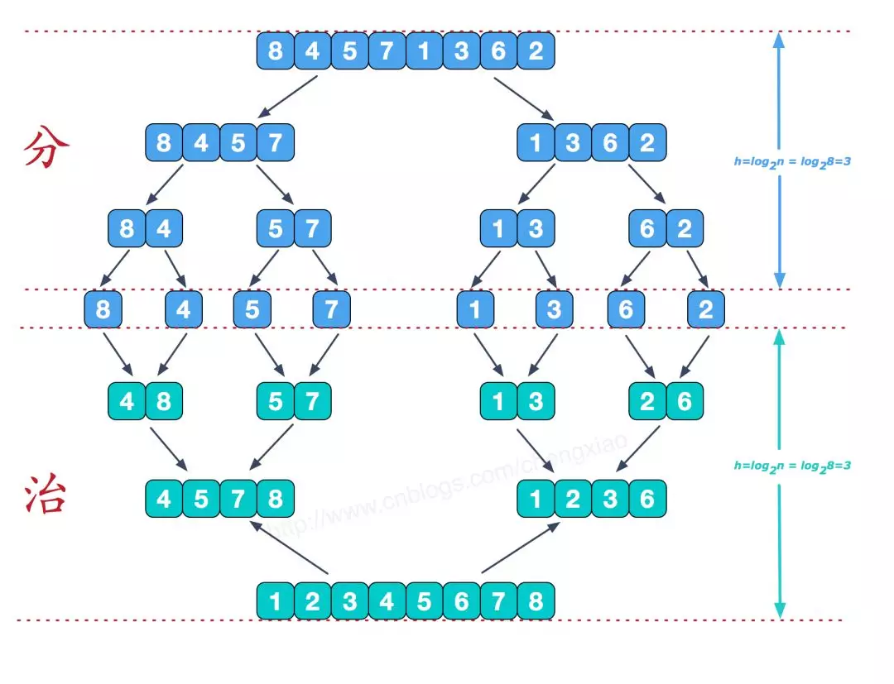

可以看到这种结构很像一棵完全二叉树，本文的归并排序我们采用递归去实现（也可采用迭代的方式去实现）。分阶段可以理解为就是递归拆分子序列的过程，递归深度为log2n。

**合并相邻有序子序列**

再来看看治阶段，我们需要将两个已经有序的子序列合并成一个有序序列，比如上图中的最后一次合并，要将[4,5,7,8]和[1,2,3,6]两个已经有序的子序列，合并为最终序列[1,2,3,4,5,6,7,8]，来看下实现步骤。

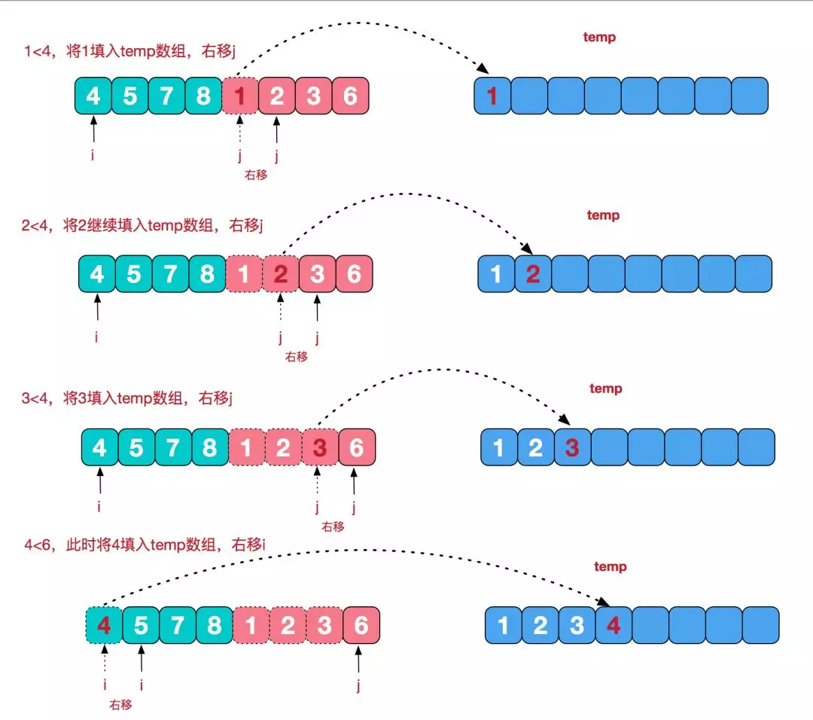

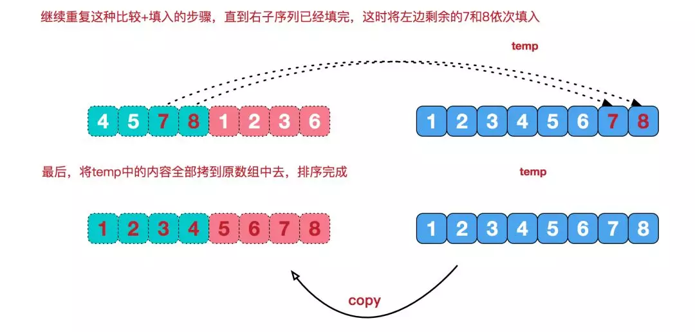

### 4.2. 代码实现

```java
package com.moon.demo.sort;

import java.util.Arrays;

/**
 * 归并排序算法
 */
public class MergeSort {

    public static void main(String[] args) {
        int[] arr = {9, 8, 7, 6, 5, 4, 3, 2, 1};
        sort(arr);
        System.out.println(Arrays.toString(arr));
    }

    public static void sort(int[] arr) {
        int[] temp = new int[arr.length];
        //在排序前，先建好一个长度等于原数组长度的临时数组，
        //避免递归中频繁开辟空间
        sort(arr, 0, arr.length - 1, temp);
    }

    private static void sort(int[] arr, int left, int right, int[] temp) {
        if (left < right) {
            int mid = (left + right) / 2;
            sort(arr, left, mid, temp);
            //左边归并排序，使得左子序列有序
            sort(arr, mid + 1, right, temp);
            //右边归并排序，使得右子序列有序
            merge(arr, left, mid, right, temp);
            //将两个有序子数组合并操作
        }
    }

    private static void merge(int[] arr, int left, int mid, int right, int[] temp) {
        int i = left;       //左序列指针
        int j = mid + 1;    //右序列指针
        int t = 0;          //临时数组指针
        while (i <= mid && j <= right) {
            if (arr[i] <= arr[j]) {
                temp[t++] = arr[i++];
            } else {
                temp[t++] = arr[j++];
            }
        }
        while (i <= mid) {
            //将左边剩余元素填充进temp中
            temp[t++] = arr[i++];
        }
        while (j <= right) {
            //将右序列剩余元素填充进temp中
            temp[t++] = arr[j++];
        }
        t = 0;
        //将temp中的元素全部拷贝到原数组中
        while (left <= right) {
            arr[left++] = temp[t++];
        }
    }
}
```

执行结果：`[1, 2, 3, 4, 5, 6, 7, 8, 9]`

**最后**

归并排序是稳定排序，它也是一种十分高效的排序，能利用完全二叉树特性的排序一般性能都不会太差。java中Arrays.sort()采用了一种名为TimSort的排序算法，就是归并排序的优化版本。从上文的图中可看出，每次合并操作的平均时间复杂度为O(n)，而完全二叉树的深度为|log2n|。总的平均时间复杂度为O(nlogn)。而且，归并排序的最好，最坏，平均时间复杂度均为O(nlogn)。

---

## 5. 堆排序
### 5.1. 堆排序介绍

堆排序是利用堆这种数据结构而设计的一种排序算法，堆排序是一种选择排序，它的最坏，最好，平均时间复杂度均为O(nlogn)，它也是不稳定排序。首先简单了解下堆结构。

**堆**

堆是具有以下性质的完全二叉树：每个结点的值都大于或等于其左右孩子结点的值，称为大顶堆；或者每个结点的值都小于或等于其左右孩子结点的值，称为小顶堆。如下图：

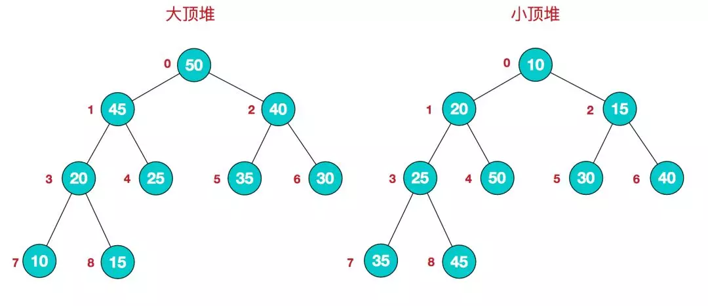

同时，我们对堆中的结点按层进行编号，将这种逻辑结构映射到数组中就是下面这个样子：


该数组从逻辑上讲就是一个堆结构，我们用简单的公式来描述一下堆的定义就是：

> 大顶堆：arr[i] >= arr[2i+1] && arr[i] >= arr[2i+2]  
> 小顶堆：arr[i] <= arr[2i+1] && arr[i] <= arr[2i+2]

### 5.2. 堆排序基本思想及步骤

堆排序的基本思想是：**将待排序序列构造成一个大顶堆，此时，整个序列的最大值就是堆顶的根节点。将其与末尾元素进行交换，此时末尾就为最大值。然后将剩余n-1个元素重新构造成一个堆，这样会得到n个元素的次小值。如此反复执行，便能得到一个有序序列了**

**步骤一**：构造初始堆。将给定无序序列构造成一个大顶堆（一般升序采用大顶堆，降序采用小顶堆)。

1. 假设给定无序序列结构如下

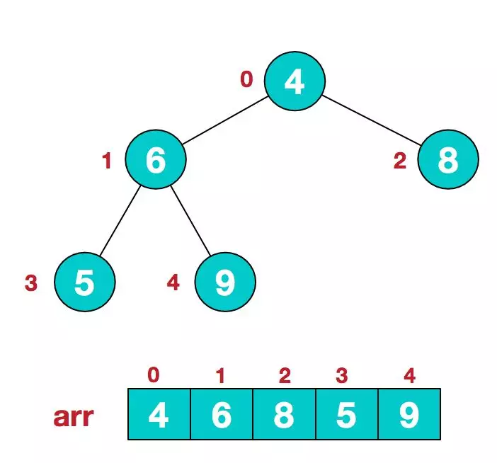

2. 此时我们从最后一个非叶子结点开始（叶结点自然不用调整，第一个非叶子结点 arr.length/2-1=5/2-1=1，也就是下面的6结点），从左至右，从下至上进行调整。


3. 找到第二个非叶节点4，由于[4,9,8]中9元素最大，4和9交换。


这时，交换导致了子根[4,5,6]结构混乱，继续调整，[4,5,6]中6最大，交换4和6。

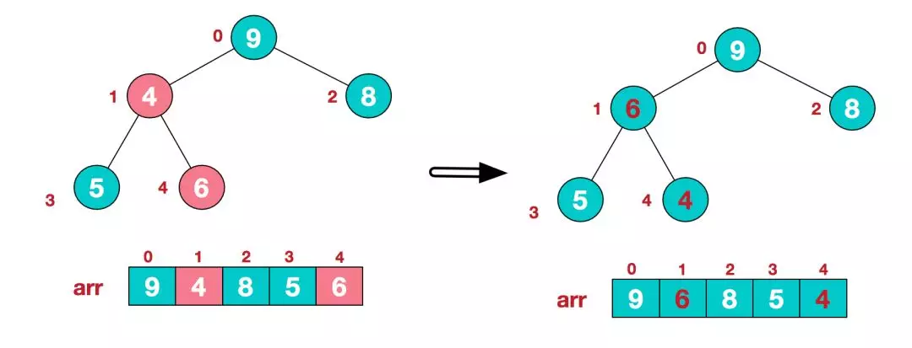

此时，我们就将一个无需序列构造成了一个大顶堆。

**步骤二**：将堆顶元素与末尾元素进行交换，使末尾元素最大。然后继续调整堆，再将堆顶元素与末尾元素交换，得到第二大元素。如此反复进行交换、重建、交换。

a. 将堆顶元素9和末尾元素4进行交换

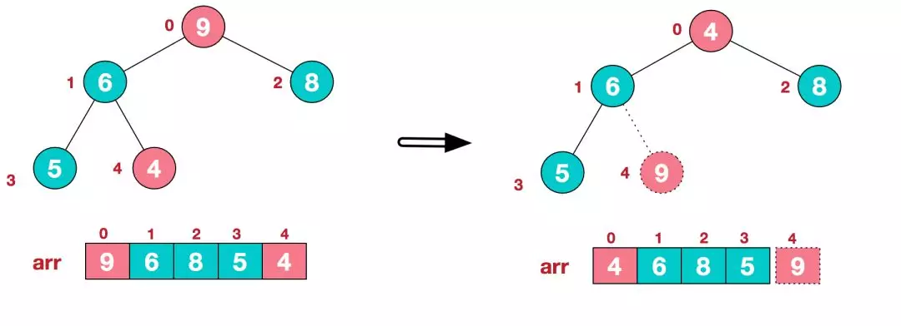

b. 重新调整结构，使其继续满足堆定义

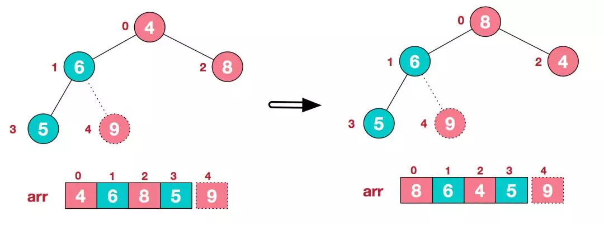

c. 再将堆顶元素8与末尾元素5进行交换，得到第二大元素8

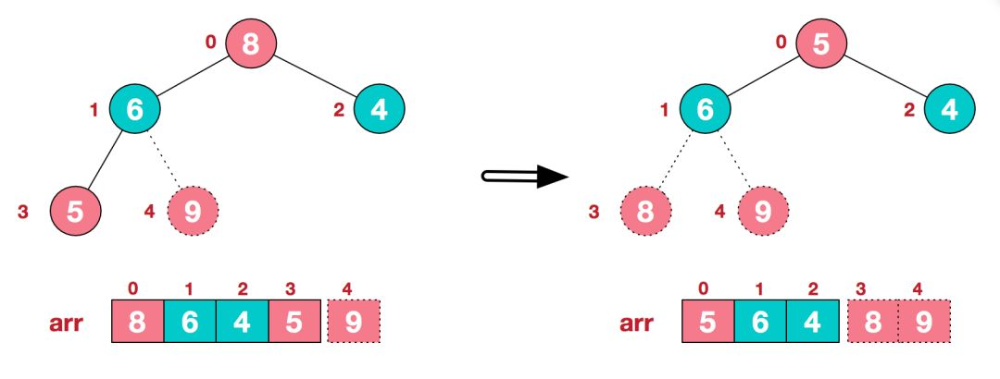

后续过程，继续进行调整，交换，如此反复进行，最终使得整个序列有序

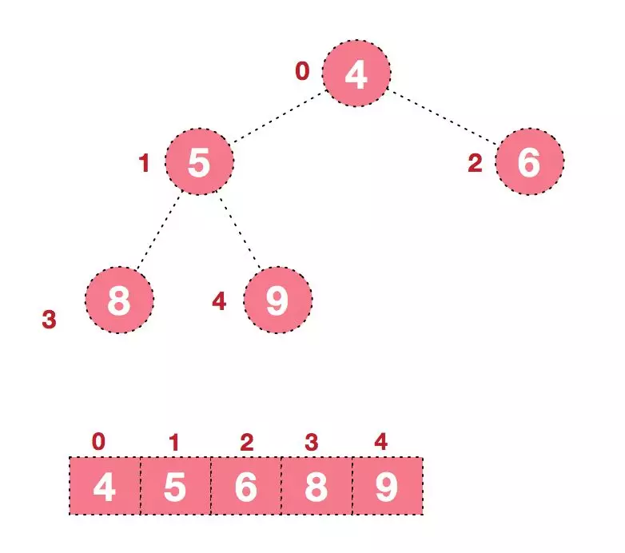

**再简单总结下堆排序的基本思路：**

1. 将无需序列构建成一个堆，根据升序降序需求选择大顶堆或小顶堆;
2. 将堆顶元素与末尾元素交换，将最大元素"沉"到数组末端;
3. 重新调整结构，使其满足堆定义，然后继续交换堆顶元素与当前末尾元素，反复执行调整+交换步骤，直到整个序列有序。

### 5.3. 代码实现

```java
package com.moon.demo.sort;

import java.util.Arrays;

/**
 * 堆排序算法
 */
public class HeapSort {

    public static void main(String[] args) {
        int[] arr = {9, 8, 7, 6, 5, 4, 3, 2, 1};
        sort(arr);
        System.out.println(Arrays.toString(arr));
    }

    public static void sort(int[] arr) {
        // 1.构建大顶堆
        for (int i = arr.length / 2 - 1; i >= 0; i--) {
            // 从第一个非叶子结点从下至上，从右至左调整结构
            adjustHeap(arr, i, arr.length);
        }
        // 2.调整堆结构+交换堆顶元素与末尾元素
        for (int j = arr.length - 1; j > 0; j--) {
            // 将堆顶元素与末尾元素进行交换
            swap(arr, 0, j);
            // 重新对堆进行调整
            adjustHeap(arr, 0, j);
        }

    }

    /**
     * 调整大顶堆（仅是调整过程，建立在大顶堆已构建的基础上）
     *
     * @param arr
     * @param i
     * @param length
     */
    public static void adjustHeap(int[] arr, int i, int length) {
        int temp = arr[i];//先取出当前元素i
        for (int k = i * 2 + 1; k < length; k = k * 2 + 1) {
            // 从i结点的左子结点开始，也就是2i+1处开始
            if (k + 1 < length && arr[k] < arr[k + 1]) {
                // 如果左子结点小于右子结点，k指向右子结点
                k++;
            }
            if (arr[k] > temp) {
                // 如果子节点大于父节点，将子节点值赋给父节点（不用进行交换）
                arr[i] = arr[k];
                i = k;
            } else {
                break;
            }
        }
        // 将temp值放到最终的位置
        arr[i] = temp;
    }

    /**
     * 交换元素
     *
     * @param arr
     * @param a
     * @param b
     */
    public static void swap(int[] arr, int a, int b) {
        int temp = arr[a];
        arr[a] = arr[b];
        arr[b] = temp;
    }
}
```

结果：`[1, 2, 3, 4, 5, 6, 7, 8, 9]`

**最后**

堆排序是一种选择排序，整体主要由构建初始堆+交换堆顶元素和末尾元素并重建堆两部分组成。其中构建初始堆经推导复杂度为O(n)，在交换并重建堆的过程中，需交换n-1次，而重建堆的过程中，根据完全二叉树的性质，[log2(n-1),log2(n-2)...1]逐步递减，近似为nlogn。所以堆排序时间复杂度一般认为就是O(nlogn)级。

---

## 6. 快速排序
### 6.1. 快速排序介绍
#### 6.1.1. 快速排序(Quick Sort)使用分治法策略

**基本思想是：**选择一个基准数，通过一趟排序将要排序的数据分割成独立的两部分；其中一部分的所有数据都比另外一部分的所有数据都要小。然后，再按此方法对这两部分数据分别进行快速排序，整个排序过程可以递归进行，以此达到整个数据变成有序序列。

#### 6.1.2. 快速排序流程

1. 从数列中挑出一个基准值。
2. 将所有比基准值小的摆放在基准前面，所有比基准值大的摆在基准的后面(相同的数可以到任一边)；在这个分区退出之后，该基准就处于数列的中间位置。
3. 递归地把"基准值前面的子数列"和"基准值后面的子数列"进行排序。

#### 6.1.3. 快速排序图文说明

下面以数列a={30,40,60,10,20,50}为例，演示它的快速排序过程(如下图)。

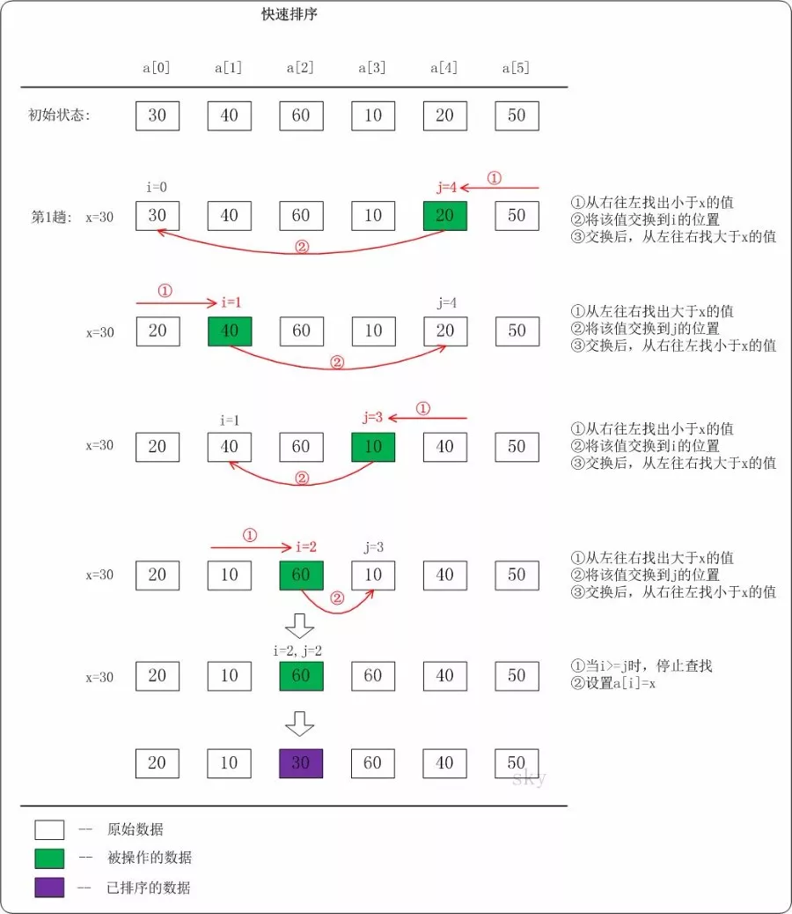

上图只是给出了第1趟快速排序的流程。在第1趟中，设置x=a[i]，即x=30。

1. 从"右 --> 左"查找小于x的数：找到满足条件的数a[j]=20，此时j=4；然后将a[j]赋值a[i]，此时i=0；接着从左往右遍历。
2. 从"左 --> 右"查找大于x的数：找到满足条件的数a[i]=40，此时i=1；然后将a[i]赋值a[j]，此时j=4；接着从右往左遍历。
3. 从"右 --> 左"查找小于x的数：找到满足条件的数a[j]=10，此时j=3；然后将a[j]赋值a[i]，此时i=1；接着从左往右遍历。
4. 从"左 --> 右"查找大于x的数：找到满足条件的数a[i]=60，此时i=2；然后将a[i]赋值a[j]，此时j=3；接着从右往左遍历。
5. 从"右 --> 左"查找小于x的数：没有找到满足条件的数。当i>=j时，停止查找；然后将x赋值给a[i]。此趟遍历结束！

按照同样的方法，对子数列进行递归遍历。最后得到有序数组！

#### 6.1.4. 快速排序的时间复杂度和稳定性

**快速排序稳定性**

快速排序是不稳定的算法，它不满足稳定算法的定义。

算法稳定性 -- 假设在数列中存在a[i]=a[j]，若在排序之前，a[i]在a[j]前面；并且排序之后，a[i]仍然在a[j]前面。则这个排序算法是稳定的！

**快速排序时间复杂度**

快速排序的时间复杂度在最坏情况下是O(N2)，平均的时间复杂度是O(N*lgN)。

这句话很好理解：假设被排序的数列中有N个数。遍历一次的时间复杂度是O(N)，需要遍历多少次呢？至少lg(N+1)次，最多N次。

1. 为什么最少是lg(N+1)次？快速排序是采用的分治法进行遍历的，我们将它看作一棵二叉树，它需要遍历的次数就是二叉树的深度，而根据完全二叉树的定义，它的深度至少是lg(N+1)。因此，快速排序的遍历次数最少是lg(N+1)次。
2. 为什么最多是N次？这个应该非常简单，还是将快速排序看作一棵二叉树，它的深度最大是N。因此，快读排序的遍历次数最多是N次。

### 6.2. 快速排序实现
#### 6.2.1. 快速排序Java实现

```java
package com.moon.demo.sort;

/**
 * 快速排序算法
 */
public class QuickSort {

    /*
     * 快速排序
     *
     * 参数说明：
     *     a -- 待排序的数组
     *     l -- 数组的左边界(例如，从起始位置开始排序，则l=0)
     *     r -- 数组的右边界(例如，排序截至到数组末尾，则r=a.length-1)
     */
    public static void quickSort(int[] a, int l, int r) {

        if (l < r) {
            int i, j, x;

            i = l;
            j = r;
            x = a[i];
            while (i < j) {
                while (i < j && a[j] > x) {
                    // 从右向左找第一个小于x的数
                    j--;
                }
                if (i < j) {
                    a[i++] = a[j];
                }
                while (i < j && a[i] < x) {
                    // 从左向右找第一个大于x的数
                    i++;
                }
                if (i < j) {
                    a[j--] = a[i];
                }
            }
            a[i] = x;
            /* 递归调用 */
            quickSort(a, l, i - 1);
            /* 递归调用 */
            quickSort(a, i + 1, r);
        }
    }

    public static void main(String[] args) {
        int i;
        int a[] = {30, 40, 60, 10, 20, 50};

        System.out.printf("before sort:");
        for (i = 0; i < a.length; i++) {
            System.out.printf("%d ", a[i]);
        }
        System.out.printf("\n");

        quickSort(a, 0, a.length - 1);

        System.out.printf("after  sort:");
        for (i = 0; i < a.length; i++) {
            System.out.printf("%d ", a[i]);
        }
        System.out.printf("\n");
    }
}
```

#### 6.2.2. 快速排序C实现（了解）

```c
/**
* 快速排序：C 语言
*/

#include <stdio.h>

// 数组长度
#define LENGTH(array) ( (sizeof(array)) / (sizeof(array[0])) )

/*
* 快速排序
*
* 参数说明：
*     a -- 待排序的数组
*     l -- 数组的左边界(例如，从起始位置开始排序，则l=0)
*     r -- 数组的右边界(例如，排序截至到数组末尾，则r=a.length-1)
*/
void quick_sort(int a[], int l, int r)
{
   if (l < r)
   {
       int i,j,x;

       i = l;
       j = r;
       x = a[i];
       while (i < j)
       {
           while(i < j && a[j] > x)
               j--; // 从右向左找第一个小于x的数
           if(i < j)
               a[i++] = a[j];
           while(i < j && a[i] < x)
               i++; // 从左向右找第一个大于x的数
           if(i < j)
               a[j--] = a[i];
       }
       a[i] = x;
       quick_sort(a, l, i-1); /* 递归调用 */
       quick_sort(a, i+1, r); /* 递归调用 */
   }
}

void main()
{
   int i;
   int a[] = {30,40,60,10,20,50};
   int ilen = LENGTH(a);

   printf("before sort:");
   for (i=0; i<ilen; i++)
       printf("%d ", a[i]);
   printf("\n");

   quick_sort(a, 0, ilen-1);

   printf("after  sort:");
   for (i=0; i<ilen; i++)
       printf("%d ", a[i]);
   printf("\n");
}
```

#### 6.2.3. 快速排序C++实现（了解）

```c++
/**
* 快速排序：C++
*/

#include <iostream>
using namespace std;

/*
* 快速排序
*
* 参数说明：
*     a -- 待排序的数组
*     l -- 数组的左边界(例如，从起始位置开始排序，则l=0)
*     r -- 数组的右边界(例如，排序截至到数组末尾，则r=a.length-1)
*/
void quickSort(int* a, int l, int r)
{
   if (l < r)
   {
       int i,j,x;

       i = l;
       j = r;
       x = a[i];
       while (i < j)
       {
           while(i < j && a[j] > x)
               j--; // 从右向左找第一个小于x的数
           if(i < j)
               a[i++] = a[j];
           while(i < j && a[i] < x)
               i++; // 从左向右找第一个大于x的数
           if(i < j)
               a[j--] = a[i];
       }
       a[i] = x;
       quickSort(a, l, i-1); /* 递归调用 */
       quickSort(a, i+1, r); /* 递归调用 */
   }
}

int main()
{
   int i;
   int a[] = {30,40,60,10,20,50};
   int ilen = (sizeof(a)) / (sizeof(a[0]));

   cout << "before sort:";
   for (i=0; i<ilen; i++)
       cout << a[i] << " ";
   cout << endl;

   quickSort(a, 0, ilen-1);

   cout << "after  sort:";
   for (i=0; i<ilen; i++)
       cout << a[i] << " ";
   cout << endl;

   return 0;
}
```

上面3种语言的实现原理和输出结果都是一样的。下面是它们的输出结果：

```console
before sort:30 40 60 10 20 50
after  sort:10 20 30 40 50 60
```

---

## 7. 直接插入排序
### 7.1. 直接插入排序介绍

直接插入排序(Straight Insertion Sort)的基本思想是：把n个待排序的元素看成为一个有序表和一个无序表。开始时有序表中只包含1个元素，无序表中包含有n-1个元素，排序过程中每次从无序表中取出第一个元素，将它插入到有序表中的适当位置，使之成为新的有序表，重复n-1次可完成排序过程。

#### 7.1.1. 直接插入排序图文说明

下面选取直接插入排序的一个中间过程对其进行说明。假设{20,30,40,10,60,50}中的前3个数已经排列过，是有序的了；接下来对10进行排列。示意图如下：

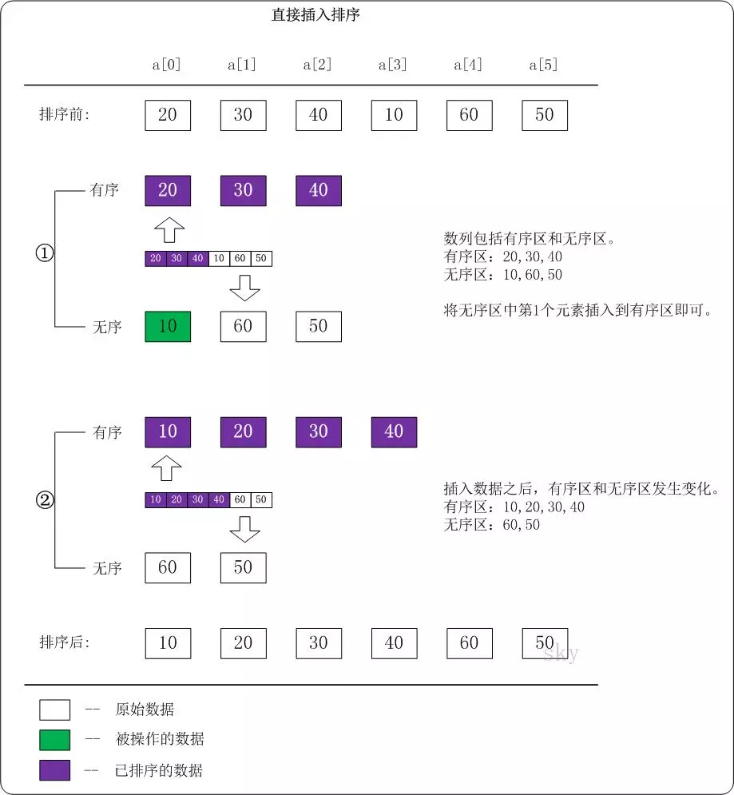

图中将数列分为有序区和无序区。我们需要做的工作只有两个：(1)取出无序区中的第1个数，并找出它在有序区对应的位置。(2)将无序区的数据插入到有序区；若有必要的话，则对有序区中的相关数据进行移位。

#### 7.1.2. 直接插入排序的时间复杂度和稳定性

**直接插入排序时间复杂度**

直接插入排序的时间复杂度是O(N2)。

假设被排序的数列中有N个数。遍历一趟的时间复杂度是O(N)，需要遍历多少次呢？N-1！因此，直接插入排序的时间复杂度是O(N*N)。

**直接插入排序稳定性**

直接插入排序是稳定的算法，它满足稳定算法的定义。

算法稳定性 -- 假设在数列中存在a[i]=a[j]，若在排序之前，a[i]在a[j]前面；并且排序之后，a[i]仍然在a[j]前面。则这个排序算法是稳定的！

### 7.2. 直接插入排序实现
#### 7.2.1. 直接插入排序Java实现

```java
package com.moon.demo.sort;

/**
 * 直接插入排序算法
 */
public class InsertSort {

    /*
     * 直接插入排序
     *
     * 参数说明：
     *     a -- 待排序的数组
     *     n -- 数组的长度
     */
    public static void insertSort(int[] a, int n) {
        int i, j, k;

        for (i = 1; i < n; i++) {

            // 为a[i]在前面的a[0...i-1]有序区间中找一个合适的位置
            for (j = i - 1; j >= 0; j--)
                if (a[j] < a[i])
                    break;

            // 如找到了一个合适的位置
            if (j != i - 1) {
                //将比a[i]大的数据向后移
                int temp = a[i];
                for (k = i - 1; k > j; k--)
                    a[k + 1] = a[k];
                // 将a[i]放到正确位置上
                a[k + 1] = temp;
            }
        }
    }

    public static void main(String[] args) {
        int i;
        int[] a = {20, 40, 30, 10, 60, 50};

        System.out.printf("before sort:");
        for (i = 0; i < a.length; i++) {
            System.out.printf("%d ", a[i]);
        }
        System.out.printf("\n");

        insertSort(a, a.length);

        System.out.printf("after  sort:");
        for (i = 0; i < a.length; i++) {
            System.out.printf("%d ", a[i]);
        }
        System.out.printf("\n");
    }
}
```

#### 7.2.2. 直接插入排序C实现（了解）

```c
/**
* 直接插入排序：C 语言
*/

#include <stdio.h>

// 数组长度
#define LENGTH(array) ( (sizeof(array)) / (sizeof(array[0])) )

/*
* 直接插入排序
*
* 参数说明：
*     a -- 待排序的数组
*     n -- 数组的长度
*/
void insert_sort(int a[], int n)
{
   int i, j, k;

   for (i = 1; i < n; i++)
   {
       //为a[i]在前面的a[0...i-1]有序区间中找一个合适的位置
       for (j = i - 1; j >= 0; j--)
           if (a[j] < a[i])
               break;

       //如找到了一个合适的位置
       if (j != i - 1)
       {
           //将比a[i]大的数据向后移
           int temp = a[i];
           for (k = i - 1; k > j; k--)
               a[k + 1] = a[k];
           //将a[i]放到正确位置上
           a[k + 1] = temp;
       }
   }
}

void main()
{
   int i;
   int a[] = {20,40,30,10,60,50};
   int ilen = LENGTH(a);

   printf("before sort:");
   for (i=0; i<ilen; i++)
       printf("%d ", a[i]);
   printf("\n");

   insert_sort(a, ilen);

   printf("after  sort:");
   for (i=0; i<ilen; i++)
       printf("%d ", a[i]);
   printf("\n");
}
```

#### 7.2.3. 直接插入排序C++实现（了解）

```c++
/**
* 直接插入排序：C++
*/

#include <iostream>
using namespace std;

/*
* 直接插入排序
*
* 参数说明：
*     a -- 待排序的数组
*     n -- 数组的长度
*/
void insertSort(int* a, int n)
{
   int i, j, k;

   for (i = 1; i < n; i++)
   {
       //为a[i]在前面的a[0...i-1]有序区间中找一个合适的位置
       for (j = i - 1; j >= 0; j--)
           if (a[j] < a[i])
               break;

       //如找到了一个合适的位置
       if (j != i - 1)
       {
           //将比a[i]大的数据向后移
           int temp = a[i];
           for (k = i - 1; k > j; k--)
               a[k + 1] = a[k];
           //将a[i]放到正确位置上
           a[k + 1] = temp;
       }
   }
}

int main()
{
   int i;
   int a[] = {20,40,30,10,60,50};
   int ilen = (sizeof(a)) / (sizeof(a[0]));

   cout << "before sort:";
   for (i=0; i<ilen; i++)
       cout << a[i] << " ";
   cout << endl;

   insertSort(a, ilen);

   cout << "after  sort:";
   for (i=0; i<ilen; i++)
       cout << a[i] << " ";
   cout << endl;

   return 0;
}
```

上面3种实现的原理和输出结果都是一样的。下面是它们的输出结果：

```console
before sort:20 40 30 10 60 50
after  sort:10 20 30 40 50 60
```

---

## 8. 希尔排序
### 8.1. 希尔排序介绍

希尔(Shell)排序又称为缩小增量排序，它是一种插入排序。它是直接插入排序算法的一种威力加强版。该方法因DL．Shell于1959年提出而得名

**希尔排序的基本思想**

把记录按步长 gap 分组，对每组记录采用直接插入排序方法进行排序。

随着步长逐渐减小，所分成的组包含的记录越来越多，当步长的值减小到 1 时，整个数据合成为一组，构成一组有序记录，则完成排序。

我们来通过演示图，更深入的理解一下这个过程。

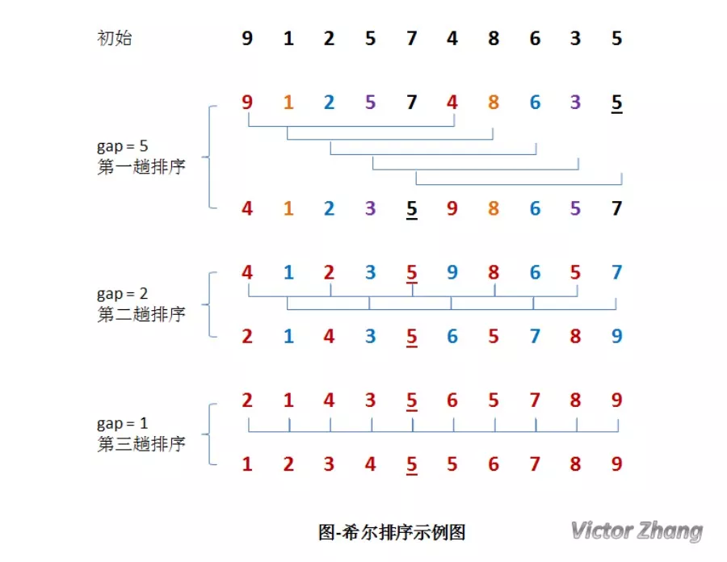

在上面这幅图中：

初始时，有一个大小为 10 的无序序列。

在第一趟排序中，我们不妨设 gap1 = N / 2 = 5，即相隔距离为 5 的元素组成一组，可以分为 5 组。接下来，按照直接插入排序的方法对每个组进行排序。

在第二趟排序中，我们把上次的 gap 缩小一半，即 gap2 = gap1 / 2 = 2 (取整数)。这样每相隔距离为 2 的元素组成一组，可以分为 2 组。按照直接插入排序的方法对每个组进行排序。

在第三趟排序中，再次把 gap 缩小一半，即gap3 = gap2 / 2 = 1。 这样相隔距离为 1 的元素组成一组，即只有一组。按照直接插入排序的方法对每个组进行排序。此时，排序已经结束。

需要注意一下的是，图中有两个相等数值的元素 5 和 5 。我们可以清楚的看到，在排序过程中，两个元素位置交换了。

所以，希尔排序是不稳定的算法。

### 8.2. 算法分析
#### 8.2.1. 希尔排序的算法性能


#### 8.2.2. 时间复杂度

步长的选择是希尔排序的重要部分。只要最终步长为1任何步长序列都可以工作。

算法最开始以一定的步长进行排序。然后会继续以一定步长进行排序，最终算法以步长为1进行排序。当步长为1时，算法变为插入排序，这就保证了数据一定会被排序。

Donald Shell 最初建议步长选择为N/2并且对步长取半直到步长达到1。虽然这样取可以比O(N2)类的算法（插入排序）更好，但这样仍然有减少平均时间和最差时间的余地。

可能希尔排序最重要的地方在于当用较小步长排序后，以前用的较大步长仍然是有序的。比如，如果一个数列以步长5进行了排序然后再以步长3进行排序，那么该数列不仅是以步长3有序，而且是以步长5有序。如果不是这样，那么算法在迭代过程中会打乱以前的顺序，那就

不会以如此短的时间完成排序了。


已知的最好步长序列是由Sedgewick提出的(1, 5, 19, 41, 109,...)，该序列的项来自这两个算式。

这项研究也表明“比较在希尔排序中是最主要的操作，而不是交换。”用这样步长序列的希尔排序比插入排序和堆排序都要快，甚至在小数组中比快速排序还快，但是在涉及大量数据时希尔排序还是比快速排序慢。

#### 8.2.3. 算法稳定性

由上文的希尔排序算法演示图即可知，希尔排序中相等数据可能会交换位置，所以希尔排序是不稳定的算法。

#### 8.2.4. 直接插入排序和希尔排序的比较

- 直接插入排序是稳定的；而希尔排序是不稳定的。
- 直接插入排序更适合于原始记录基本有序的集合。
- 希尔排序的比较次数和移动次数都要比直接插入排序少，当N越大时，效果越明显。
- 在希尔排序中，增量序列gap的取法必须满足：最后一个步长必须是1。
- 直接插入排序也适用于链式存储结构；希尔排序不适用于链式结构。

### 8.3. 代码实现

```java
package com.moon.demo.sort;

/**
 * 希尔排序算法
 */
public class ShellSort {

    public void shellSort(int[] list) {
        int gap = list.length / 2;

        while (1 <= gap) {
            // 把距离为 gap 的元素编为一个组，扫描所有组
            for (int i = gap; i < list.length; i++) {
                int j = 0;
                int temp = list[i];

                // 对距离为 gap 的元素组进行排序
                for (j = i - gap; j >= 0 && temp < list[j]; j = j - gap) {
                    list[j + gap] = list[j];
                }
                list[j + gap] = temp;
            }

            System.out.format("gap = %d:\t", gap);
            printAll(list);
            // 减小增量
            gap = gap / 2;
        }
    }

    // 打印完整序列
    public void printAll(int[] list) {
        for (int value : list) {
            System.out.print(value + "\t");
        }
        System.out.println();
    }

    public static void main(String[] args) {
        int[] array = {9, 1, 2, 5, 7, 4, 8, 6, 3, 5};

        // 调用希尔排序方法
        ShellSort shell = new ShellSort();
        System.out.print("排序前:\t\t");
        shell.printAll(array);
        shell.shellSort(array);
        System.out.print("排序后:\t\t");
        shell.printAll(array);
    }
}
```

运行结果：

```console
排序前:      9    1    2    5    7    4    8    6    3    5
gap = 5:    4    1    2    3    5    9    8    6    5    7
gap = 2:    2    1    4    3    5    6    5    7    8    9
gap = 1:    1    2    3    4    5    5    6    7    8    9
排序后:      1    2    3    4    5    5    6    7    8    9
```

---

## 9. 拓扑排序
### 9.1. 拓扑排序介绍

拓扑排序(Topological Order)是指，将一个有向无环图(Directed Acyclic Graph简称DAG)进行排序进而得到一个有序的线性序列。

这样说，可能理解起来比较抽象。下面通过简单的例子进行说明！

例如，一个项目包括A、B、C、D四个子部分来完成，并且A依赖于B和D，C依赖于D。现在要制定一个计划，写出A、B、C、D的执行顺序。这时，就可以利用到拓扑排序，它就是用来确定事物发生的顺序的。

在拓扑排序中，如果存在一条从顶点A到顶点B的路径，那么在排序结果中B出现在A的后面。

### 9.2. 拓扑排序的算法图解
#### 9.2.1. 拓扑排序算法的基本步骤

1. 构造一个队列Q(queue) 和 拓扑排序的结果队列T(topological)；
2. 把所有没有依赖顶点的节点放入Q；
3. 当Q还有顶点的时候，执行下面步骤：
    1. 从Q中取出一个顶点n(将n从Q中删掉)，并放入T(将n加入到结果集中)；
    2. 对n每一个邻接点m(n是起点，m是终点)；
        1. 去掉边`<n,m>`；
        2. 如果m没有依赖顶点，则把m放入Q；

> 注：顶点A没有依赖顶点，是指不存在以A为终点的边。

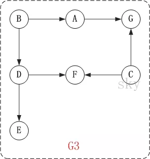

以上图为例，来对拓扑排序进行演示。

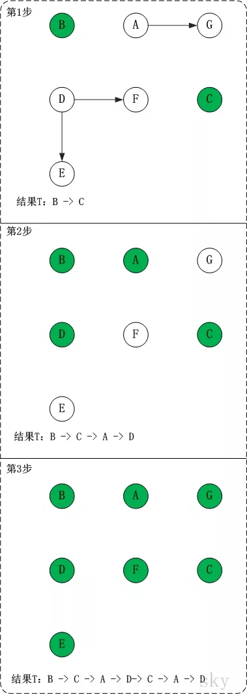

**第1步：将B和C加入到排序结果中。**

顶点B和顶点C都是没有依赖顶点，因此将C和C加入到结果集T中。假设ABCDEFG按顺序存储，因此先访问B，再访问C。访问B之后，去掉边`<B,A>`和`<B,D>`，并将A和D加入到队列Q中。同样的，去掉边`<C,F>`和`<C,G>`，并将F和G加入到Q中。

1. 将B加入到排序结果中，然后去掉边`<B,A>`和`<B,D>`；此时，由于A和D没有依赖顶点，因此并将A和D加入到队列Q中。
2. 将C加入到排序结果中，然后去掉边`<C,F>`和`<C,G>`；此时，由于F有依赖顶点D，G有依赖顶点A，因此不对F和G进行处理。

**第2步：将A,D依次加入到排序结果中。**

第1步访问之后，A,D都是没有依赖顶点的，根据存储顺序，先访问A，然后访问D。访问之后，删除顶点A和顶点D的出边。

**第3步：将E,F,G依次加入到排序结果中。**

因此访问顺序是：`B -> C -> A -> D -> E -> F -> G`

### 9.3. 拓扑排序的代码实现

拓扑排序是对有向无向图的排序。下面以邻接表实现的有向图来对拓扑排序进行说明。

#### 9.3.1. 基本定义

```java
package com.moon.demo.sort;

/**
 * 拓扑排序基本定义邻接表对应的结构体
 */
public class ListDG {
    // 邻接表中表对应的链表的顶点
    private class ENode {
        // 该边所指向的顶点的位置
        int ivex;
        // 指向下一条弧的指针
        ENode nextEdge;
    }

    // 邻接表中表的顶点
    private class VNode {
        // 顶点信息
        char data;
        // 指向第一条依附该顶点的弧
        ENode firstEdge;
    }

    // 顶点集合
    private List<VNode> mVexs;

    ......
}
```

1. ListDG是邻接表对应的结构体。mVexs则是保存顶点信息的一维数组。
2. VNode是邻接表顶点对应的结构体。data是顶点所包含的数据，而firstEdge是该顶点所包含链表的表头指针。
3. ENode是邻接表顶点所包含的链表的节点对应的结构体。ivex是该节点所对应的顶点在vexs中的索引，而nextEdge是指向下一个节点的。

#### 9.3.2. 拓扑排序

```java
package com.moon.demo.sort;

import java.util.LinkedList;
import java.util.List;
import java.util.Queue;

/**
 * 拓扑排序算法
 */
public class ListDG {
    // 邻接表中表对应的链表的顶点
    private class ENode {
        // 该边所指向的顶点的位置
        int ivex;
        // 指向下一条弧的指针
        ENode nextEdge;
    }

    // 邻接表中表的顶点
    private class VNode {
        // 顶点信息
        char data;
        // 指向第一条依附该顶点的弧
        ENode firstEdge;
    }

    // 顶点集合
    private List<VNode> mVexs;

    /*
     * 拓扑排序
     *
     * 返回值：
     *     -1 -- 失败(由于内存不足等原因导致)
     *      0 -- 成功排序，并输入结果
     *      1 -- 失败(该有向图是有环的)
     */
    public int topologicalSort() {
        int index = 0;
        int num = mVexs.size();
        // 入度数组
        int[] ins;
        // 拓扑排序结果数组，记录每个节点的排序后的序号。
        char[] tops;
        // 辅组队列
        Queue<Integer> queue;


        ins = new int[num];
        tops = new char[num];
        queue = new LinkedList<Integer>();

        // 统计每个顶点的入度数
        for (int i = 0; i < num; i++) {
            ENode node = mVexs.get(i).firstEdge;
            while (node != null) {
                ins[node.ivex]++;
                node = node.nextEdge;
            }
        }

        // 将所有入度为0的顶点入队列
        for (int i = 0; i < num; i++) {
            if (ins[i] == 0) {
                // 入队列
                queue.offer(i);
            }
        }


        while (!queue.isEmpty()) {
            // 队列非空
            int j = queue.poll().intValue();
            // 出队列。j是顶点的序号
            tops[index++] = mVexs.get(j).data;
            // 将该顶点添加到tops中，tops是排序结果
            ENode node = mVexs.get(j).firstEdge;
            // 获取以该顶点为起点的出边队列

            // 将与"node"关联的节点的入度减1；
            // 若减1之后，该节点的入度为0；则将该节点添加到队列中。
            while (node != null) {
                // 将节点(序号为node.ivex)的入度减1。
                ins[node.ivex]--;
                // 若节点的入度为0，则将其"入队列"
                if (ins[node.ivex] == 0) {
                    // 入队列
                    queue.offer(node.ivex);
                }
                node = node.nextEdge;
            }
        }

        if (index != num) {
            System.out.printf("Graph has a cycle\n");
            return 1;
        }

        // 打印拓扑排序结果
        System.out.printf("== TopSort: ");
        for (int i = 0; i < num; i++) {
            System.out.printf("%c ", tops[i]);
        }
        System.out.printf("\n");

        return 0;
    }
}
```

说明：

1. queue的作用就是用来存储没有依赖顶点的顶点。它与前面所说的Q相对应。
2. tops的作用就是用来存储排序结果。它与前面所说的T相对应。

---

## 10. 题外拓展：面试时算法题的解答思路

面试中纯粹考算法的问题一般是让很多程序员朋友痛恨的，这里分享下我对于解答算法题的一些思路和技巧。

一般关于算法的文章，都是从经典算法讲起，一种一种算法介绍，见得算法多了，自然就有了感悟，但如此学习花费的时间和精力却是过于巨大，也不适合在博客里面交流。这一篇文，却是专门讲快捷思路的，很多人面对算法题的时候几乎是脑子里一片空白，这一篇文章讲的就是从题目下手，把毫无思路的题目打开一个缺口的几种常见技巧。

### 10.1. （一）由简至繁

事实上，很多问题确实是很难在第一时间内得到正确的思路的，这时候可以尝试一种由简至繁的思路。首先把问题规模缩小到非常容易解答的地步。

**[题目]有足够量的2分、5分、1分硬币，请问凑齐1元钱有多少种方法？**

此题乍看上去，只会觉得完全无法入手，但是按照由简至繁的思路，我们可以先考虑极端简单的情况，假如把问题规模缩小成:有足够量的1分硬币，请问凑齐1分钱有多少种方法？毫无疑问，答案是1。

得到这一答案之后，我们可以略微扩大问题的规模： 有足够量的1分硬币，凑齐2分钱有多少种方法？凑齐n分钱有多少种方法？答案仍然是1

接下来，我们可以从另一个角度来扩大问题，有足够量的1分硬币和2分硬币，凑齐n分钱有多少种方法？这时我们手里已经有了有足够量的1分硬币，凑齐任意多钱都只有1种方法，那么只用1分钱凑齐n-2分钱，有1种方法，只用1分钱凑齐n-4分钱，有1种方法，只用1分钱凑齐n-6分钱，有1种方法......

而凑齐这些n-2、n-4、n-6这些钱数，各自补上2分钱，会产生一种新的凑齐n分钱的方法，这些方法的总数+1，就是用1分硬币和2分硬币，凑齐n分钱的方法数了。

**在面试时，立刻采用这种思路是一种非常有益的尝试，解决小规模问题可以让你更加熟悉问题，并且慢慢发现问题的特性，最重要的是给你的面试官正面的信号——立即动手分析问题比皱眉冥思苦想看起来好得多。**

对于此题而言，我们可以很快发现问题的规模有两个维度：用a1-ak种硬币和凑齐n分钱，所以我们可以记做P(k,n)。当我们发现递归公式 `P(k,n) = P(k-1,n - ak) + P(k-1,n - 2*ak) + P(k-1,n - 3*ak) ... ...` 时，这个问题已经是迎刃而解了

**通常由简至繁的思路，用来解决动态规划问题是非常有效的，当积累了一定量简单问题的解的时候，往往通向更高一层问题的答案已经摆在眼前了。**

### 10.2. （二）一分为二

另一种思路，就是把问题一刀斩下，把问题分为两半，变成两个与原来问题同构的问题，能把问题一分为2，就能再一分为4，就能再一分为8，直到分成我们容易解决的问题。当尝试这种思路时，其实只需要考虑两个问题：1.一分为二以后，问题是否被简化了？ 2.根据一分为二的两个问题的解，能否方便地得出整个问题的解？

**[题目]将一个数组排序。**

这个经典算法肯定所有人都熟悉的不能再熟悉了，不过若是从头开始思考这个问题，倒也不是所有人都能想出几种经典的排序算法之一的，这里仅仅是用来做例子说明一分为二的思路的应用。

最简单的一分为二，就是将数组分成两半，分别排序。对于两个有序数组，我们有办法将它合并成一个有序数组，所以这个一分为二的思路是可行的，同样对于已经分成两半的数组，我们还可以将这个数组分作两半，直到我们分好的数组仅有1个元素，1个元素的数组天然就是有序的。不难看出，按这种思路我们得出的是经典数组排序算法中的“归并排序”。

还有另一种一分为二的思路，考虑到自然将数组分成两半合并起来比较复杂，我们可以考虑将数组按照大于和小于某个元素分成两半，这样只要分别解决就可以直接连接成一个有序数组了，同样这个问题也是能够再次一分为二。按照这个思路，则可以得出经典数组排序算法中的“快速排序”。

### 10.3. （三）化虚为实

这种思路针对的是浮点数有关的特殊问题，因为无论是穷举还是二分，对于浮点数相关的计算问题（尤其是计算几何）都难以启效，所以化虚为实，指的是把有点"虚"的浮点数，用整数来替代。具体做法是，把题目中给出的一些浮点数（不限于浮点数，我们不关心其具体大小的整数也可以）排序，然后用浮点数的序号代替本身来思考问题，等到具体计算时再替换回来。

**[题目]已知n个边水平竖直的矩形（用四元组[x1,y1,x2,y2]表示），求它们的总共覆盖面积。**

因为坐标可能出现浮点数，所以此题看起来十分繁复（可以实践上面由简至繁和一分为二的思路都基本无效），略一思考，矩形的覆盖关系其实只跟矩形坐标的大小有关，所以我们尝试思考将矩形的所有x值排序，然后用序号代替具体竖直，y值亦然，于是我们得到所有矩形其实处于一个2nx2n的区块当中，这样我们用最简单的穷举办法，可以计算出每一个1x1的格子是否被覆盖住了。至此，只要我们计算面积的时候，把格子的真实长宽换算回来，就已经得到题目的答案了。

以上三种思路，是我平时遇到算法问题的快速思考方向，并非万灵药方，若是不能生效，就要静下心来慢慢思考观察了，考虑到面试的时候基本不会遇到高难度算法题，这几种技巧的命中率应该不会太低，共享给大家，希望有所帮助。