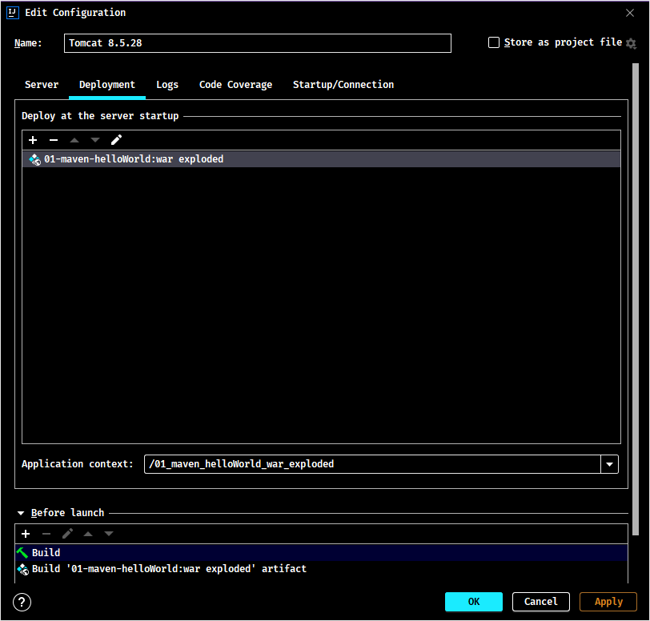

## 1. JavaWeb 项目开发快速入门

### 1.1. 使用 IDEA 开发 JavaEE 项目

1. 在开发环境中准备好 tomcat，在 IDEA 中创建 application serviers，选择本地的 tomcat 目录即可


2. 创建项目（Java Enterprise）：项目命名、项目所在目录、项目的 Java 版本、tomcat 服务器等


3. 选择项目需要的依赖


4. 创建后目录结构


<font color=red>**web.xml 是项目的描述文件，servlet 的配置放在这个文件中**</font>

5. 创建完项目后，可以右键点击项目，选择【Edit Configuration】，修改项目的默认根目录的地址、端口号等




### 1.2. 使用 MyEclipse 开发 JavaEE 项目

#### 1.2.1. Tomcat 配置与启动

在 MyEclipse 中 Tomcat 的配置 【Window】->【Preferences】


在 myeclipse 中启动 Tomcat


#### 1.2.2. 创建 JavaEE 项目

1. 创建项目：项目命名、项目所在目录、项目的JavaSE和JavaEE的版本


2. 选择Java的源代码和字节码的目录


3. 项目的访问地址，网页所在的文件夹。<font color=red>**web.xml 是项目的描述文件，servlet 的配置放在这个文件中**</font>


创建完项目后，可以修改项目的默认根目录的地址，右键项目名，选择【Properties】，搜索 web，修改【Web Context-root】项即可


#### 1.2.3. web 项目结构


- lib：放第三方的 jar 包，如：驱动、DbUtils 等
- classes：字节码文件
- web.xml：当前项目的部署描述文件，servlet 的配置就要放在这个文件中。

#### 1.2.4. 使用 MyEclipse 向导创建 Servlet

 

#### 1.2.5. 开发 Servlet

1. 创建一个类 MyServlet 继承于 `javax.servlet.http.HttpServlet` 类
2. 重写 `doGet()` 方法
3. 在 `doGet` 方法中向浏览器输出一些文字
4. 在 web.xml 中配置 servlet。得到类全名的方法，需要点里面的构造方法，再点【Copy Qualified Name】


配置文件实现流程：

1. 先通过地址来访问(部署后的页面是 `http://localhost:8080/项目名/url名`)
2. 确定 servlet 的名字
3. 通过步骤2的名字对应确认上面的 servlet 的文件
4. 再利用反射实例化该类

#### 1.2.6. 部署项目到 tomcat

点按钮【Deploy MyEclipse J2EE Project to Server】


【Add】-> 选择 【Server:Tomcat 7.x】 


点击 【Finish】，完成部署


部署后 tomcat 的 webapps 目录多了一个项目文件夹，项目文件夹下有个 classes 文件，就是源代码生成的 class 文件


最后使用浏览器访问刚刚部署的项目 `http://localhost:8080/Day35_Tomcat/test`

### 1.3. Web 开发中的路径问题

#### 1.3.1. 相对路径的编写规范

相对路径：以当前的 web 资源为起点的访问地址。

- 当前路径：`./` 或者直接写名称。一般用于 `<a>` 标签的链接，一般都直接写。
- 上一级目录：`../`

```html
<a href="../login.html">登录页面</a>
```

#### 1.3.2. 绝对路径的编写规范

绝对路径：以根目录为起点的访问地址。

- 客户端(浏览器端)绝对路径：`/` 代表的 WebRoot 的上一级，即 webapps 这一级目录下；`/项目名/地址` 例如，`/day36-login/login`。
> 一般应用于 `<form>` 表单中的 `action` 属性访问的 servlet 地址；`<a>` 标签的 `href` 属性访问的 servlet 地址。
- 服务器端绝对路径：`/` 代表的时 WebRoot 这一级目录，因为 login.html 也在 WebRoot 目录下，所以可以理解为与 LoginServlet 在同一个目录下。如：`/login`，不用加项目名字。
> 一般应用于 web.xml 中 servlet 的配置

**绝对路径在浏览器端与服务器端的区别说明**：

- 在<u>浏览器端访问</u>的 `/`，其实是访问 `http://localhost:8080/` 这个目录；表单 `<form action="/login">`，就是访问 `http://localhost:8080/login`。
- 在<u>服务器端访问</u>的 `/`，其实是访问 `http://localhost:8080/web项目/` 这个目录；在 web.xml 配置中 `<url-pattern>/demo1</url-pattern>`，访问的地址是 `http://localhost:8080/web项目/demo1`

> Tips: 
>
> - `/` 访问的这两个目录不是同一个目录，浏览器端的要比服务器端上一级。
> - WebRoot 这个目录只在 myeclipse 的工程目录中才有，只有开发中存在。它部署到服务器上以后就成了 webapps 目录下的一个文件夹，如果工程名叫：`demo`，则会在 tomcat 的 webapps 目录下出现一个 `/demo` 的目录，这个目录就是 WebRoot，所以 WebRoot 在部署以后是不存在的，但其实就是 `/demo` 这个目录。

## 2. JavaWeb 概述

### 2.1. 服务器类型

- tomcat，web服务器，处理http协议
- mysql，数据库服务器，处理sql
- 邮件服务器，有自己处理协议
- FTP文 件服务器

### 2.2. Java Web 的三大组件

在 Java Web（JavaEE）项目开发中，主要包含三大组件：Servlet、Filter（过滤器）和 Listener（监听器）

#### 2.2.1. Servlet

具体接口 `javax.servlet.Servlet`，主要作用是做为控制器来使用，处理请求与响应的。例如：

- 得到用户表单提交的数据 `request.getParameter()`
- 调用业务逻辑 `UserService userService = new UserService()`
- 控制页面的跳转 `request.getRequestDispatcher(“/URL”).forward(request, response)`

#### 2.2.2. Filter（过滤器）

具体接口 `javax.servlet.Filter`，主要用来过滤用户的请求和响应。

#### 2.2.3. Listener（监听器）

JavaEE 的 API 提供了很多以 `Listener` 为后缀的类，例如 `java.servlet.XxxListener`，主要作用是监听 Web 程序在运行过程中的一些事件，并且对事件进行处理。
