## 1. Servlet 概述

`javax.servlet.Servlet` 是一个接口。是运行在 Web 服务器（如：Tomcat）上的 Java 小应用程序，由Tomcat去调用，没有main函数。

每个 Servlet 都要在 web.xml 中进行配置。Servlet 就是一个 Java 类，运行在 Web 容器中，接收并响应用户的请求并且对用户的请求做出响应。通常通过 HTTP 协议实现。

### 1.1. Servlet 的生命周期方法

Servlet 的生命周期包括：加载和实例化、初始化、处理请求以及服务结束。

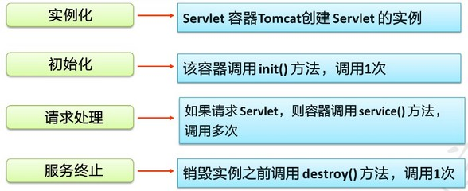

生命周期每个阶段对应的执行的接口方法与次数：

|                          方法                          |                                     作用                                      | 运行次数 |
| ----------------------------------------------------- | ---------------------------------------------------------------------------- | ------- |
| 构造方法(单例模式)                                       | 实例化Servlet的时候调用  用户第一次访问Servlet的时候才会创建单例对象                  | 1次     |
| void init(ServletConfig config)                       | 初始化的方法，Servlet 实例化的时候执行一次，只有用户第一次访问Servlet的时候才会执行      | 1次     |
| void service(ServletRequest req, ServletResponse res) | 用来处理用户每次发送的请求  request请求对象，  response响应对象                      | n次     |
| void destroy()                                        | 在Servlet销毁的时候执行一次  Servlet是常驻内存的，只在服务器关闭的时候执行一次该销毁方法 | 1次     |
| ServletConfig getServletConfig()                      | 返回ServletConfig配置对象                                                      |         |
| String getServletInfo()                               | 返回Servlet中的一些额外信息（几乎不用），如：作者，版本，版权                         |         |

### 1.2. Servlet 的运行过程

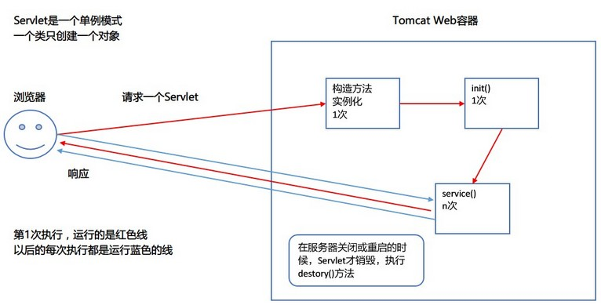

每个 Servlet 在 Web 容器中只有一个对象，一个类只有一个对象，称为**单例模式**

一个 Servlet 类在 tomcat 中只创建一个对象，等到服务器关闭才销毁，平时是常驻内存的。 

`ServletRequest` 和 `ServletResponse` 是两个接口，Servlet 是运行在 Tomcat 中，<font color=red>**在 service 方法中两个 request 和 response 对象，是由 tomcat 创建出来，并且实例化，由 tomcat 调用 service 方法并且把这两个参数传递进来**</font>。

1. 解析web.xml文件，使用dom4j之类工具。
2. 得到类全名，通过反射实例化Servlet
3. 创建request和response对象，调用service()方法，传递2个对象给方法。

### 1.3. Servlet 的实现类

#### 1.3.1. Servlet 接口继承结构

- Servlet接口：定义了所有 Servlet 生命周期的方法
- ServletConfig 接口：定义 Servlet 中的配置对象，读取 Servlet 配置参数

HttpServlet 抽象类实现了 Servlet 接口和 ServletConfig 接口。类继承结构如下：

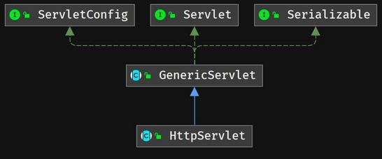

一般情况下，自定义 Servlet 不建议直接实现 Servlet 接口，通常会继承 Servlet 的实现类 HttpServlet。 

#### 1.3.2. GenericServlet 抽象类

```java
public abstract class GenericServlet implements Servlet, ServletConfig, Serializable
```

抽象类，定义了一个通用的，独立于协议的 Servlet，如果要写 HTTP 协议的 Servlet，建议继承于 HttpServlet。该类实现了 Servlet 接口和 ServletConfig 接口。

#### 1.3.3. HttpServlet 抽象类

```java
public abstract class HttpServlet extends GenericServlet
```

抽象类，是 `GenericServlet` 类的子类，自定义 Servlet 一般选择继承于 `HttpServlet`。它的 `service()` 方法根据用户请求的方式，来调用了 `doGet` 或 `doPost` 方法。

一般需要根据业务来建议重写 `doGet` 和 `doPost` 方法，如果没有重写，此 `service()` 方法就会抛出405错误。
	
#### 1.3.4. HttpServlet 的 service 方法

```java
protected void service(HttpServletRequest req, HttpServletResponse resp) throws ServletException, IOException 
```

`HttpServlet` 类的 `service` 方法作用是：根据用户发送请求方式，决定调用哪个方法。开发者只需要重写 `doGet` 或 `doPost` 方法即可。

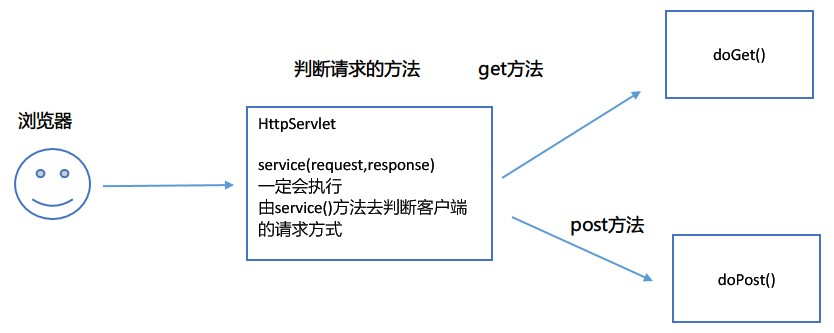

`service()` 方法判断用户提交数据给服务器的方式，如果是 GET 请求，调用 `doGet()`；如果是 POST 请求，调用 `doPost()`，所以 Servlet 现实类需要重写`doGet()`或`doPost()`方法(建议两个都重写)。

service 方法的部分源码分析：

```java
//继承于 GenericServlet
public abstract class HttpServlet extends GenericServlet {
	//定义了一些字符串常量
	private static final String METHOD_GET = "GET";
	private static final String METHOD_POST = "POST";
	//service 方法
	protected void service(HttpServletRequest req, HttpServletResponse resp)
        throws ServletException, IOException {
        // 得到请求的方法：GET 或 POST
        String method = req.getMethod();
        // 如果是 GET 方法
        if (method.equals(METHOD_GET)) {
            // 判断是否使用缓存
            long lastModified = getLastModified(req);
            if (lastModified == -1) {
                // servlet doesn't support if-modified-since, no reason
                // to go through further expensive logic
                // 调用 doGet 方法
                doGet(req, resp);
            } else {
                long ifModifiedSince;
                try {
                    ifModifiedSince = req.getDateHeader(HEADER_IFMODSINCE);
                } catch (IllegalArgumentException iae) {
                    // Invalid date header - proceed as if none was set
                    ifModifiedSince = -1;
                }
                if (ifModifiedSince < (lastModified / 1000 * 1000)) {
                    // If the servlet mod time is later, call doGet()
                    // Round down to the nearest second for a proper compare
                    // A ifModifiedSince of -1 will always be less
                    maybeSetLastModified(resp, lastModified);
                    doGet(req, resp);
                } else {
                    resp.setStatus(HttpServletResponse.SC_NOT_MODIFIED);
                }
            }

        } else if (method.equals(METHOD_HEAD)) {
            long lastModified = getLastModified(req);
            maybeSetLastModified(resp, lastModified);
            doHead(req, resp);

        } else if (method.equals(METHOD_POST)) { // 判断是否是 POST 方法
            doPost(req, resp); // 调用 doPost 方法

        } else if (method.equals(METHOD_PUT)) {
            doPut(req, resp);

        } else if (method.equals(METHOD_DELETE)) {
            doDelete(req, resp);

        } else if (method.equals(METHOD_OPTIONS)) {
            doOptions(req,resp);

        } else if (method.equals(METHOD_TRACE)) {
            doTrace(req,resp);

        } else {
            //
            // Note that this means NO servlet supports whatever
            // method was requested, anywhere on this server.
            //

            String errMsg = lStrings.getString("http.method_not_implemented");
            Object[] errArgs = new Object[1];
            errArgs[0] = method;
            errMsg = MessageFormat.format(errMsg, errArgs);
            // 发送一个错误信息            
            resp.sendError(HttpServletResponse.SC_NOT_IMPLEMENTED, errMsg);
        }
    }
    // ...省略
}
```

> Notes: HttpServletRequest 和 HttpServletResponse 是 ServletRequest 和 ServletResponse 的子接口

### 1.4. Servlet 作用域

#### 1.4.1. 作用域概述

如果要在 Servlet 之间共享数据的话，可以将数据放到作用域中。作用域是服务器的一块内存空间。

作用域结构是一个 Map 结构，存的是键和值，键必须是字符串类型，值可以是 Object 任意类型。

#### 1.4.2. Servlet 三个作用域

Web 服务器一共有三个作用域。其作用范围从小到大：请求域 < 会话域 < 上下文域

- **请求域**作用范围：<font color=red>**只在同一个请求中起作用**</font>，如果请求结束，或换了另一个请求，请求域中的数据将会丢失。

#### 1.4.3. 作用域的创建与销毁

|  作用域  |        接口名         |         创建方式          |       作用范围       |                 生命周期                  |
| ------- | -------------------- | ----------------------- | ------------------- | ---------------------------------------- |
| 上下文域 | `ServletContext`     | `getServletContext();`  | 所有的用户，所有请求中 | 创建：服务器开启，加载项目<br/>销毁：服务器关闭 |
| 会话域   | `HttpSession`        | `request.getSession();` | 一个用户的所有请求中   | 创建：用户第1次请求<br/>销毁：会话过期         |
| 请求域   | `HttpServletRequest` | `request`               | 一个用户的一次请求中   | 创建：请求开始<br/>销毁：请求结束             |

- 作用范围：上下文域 > 会话域 > 请求域
- 使用原则：如果小的域可以使用，尽量使用小的域。

#### 1.4.4. 三种作用域共同的方法

|   功能   |                      方法                       |
| ------- | ---------------------------------------------- |
| 获取数据 | `Object getAttribute(String name)`             |
| 存放数据 | `void setAttribute(String name, Object value)` |
| 删除数据 | `void removeAttribute(String name)`            |

#### 1.4.5. 作用域使用原则

<font color=purple>**尽量使用小的作用域，作用域越小越省资源**</font>。

## 2. Request 请求对象

### 2.1. HttpServletRequest

`HttpServletRequest` 接口，是 `ServletRequest` 接口的子接口，代表一个请求对象，用来封装浏览器所有数据封装成一个请求对象。

```java
public interface HttpServletRequest extends ServletRequest
```

它为 HTTP 的 Servlet 提供了请求的信息，由 Web 容器实现 `HttpServletRequest` 具体的实现类并创建对象，并且做为 `service` 方法(`doGet`，`doPost` 等)的参数传递给 Servlet。

请求行、请求头、请求体，三个部分都封装到了 request 对象中。

### 2.2. HttpServletRequest 接口常用方法

#### 2.2.1. 获取请求行相关的方法

```java
String getMethod();
```

- 得到请求的方法，GET 或 POST

```java
String getRequestURI();
```

- 得到统一资源标识符(请求的URI、短格式的，不能直接访问)

请求行组成示例：

```
GET       /demo/wait.html   HTTP/1.1
请求的方法  请求的URI         协议和版本号
```

> URI: Uniform Resource Identifier

POST 方式请求示例：

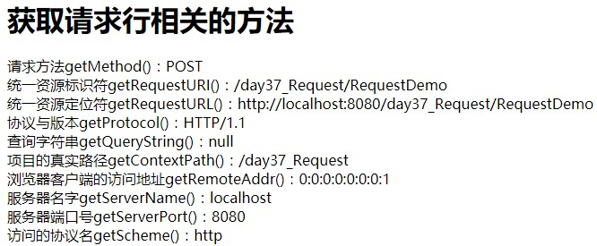

GET 方式请求示例： 

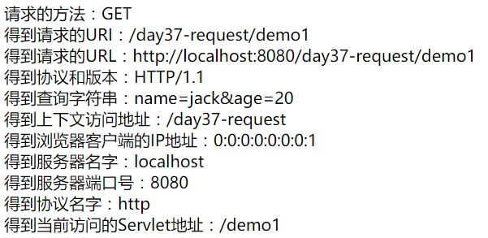

#### 2.2.2. 小结

请求对象的 `getAttribute` 与 `getParameter` 方法的区别？

- `getParameter` 方法是通过容器的实现来取得通过类似 post，get 等方式传入的数据；`getAttribute` 只是仅仅用于请求处理阶段，获取 web 容器内部流转作用域中数据。
- `getAttribute` 是返回对象；`getParameter` 是返回字符串。

## 3. 转发与重定向

### 3.1. 页面跳转的 2 种方式

从一个页面跳转到另一个页面(不同的 Servlet 之间)，跳转有 2 种方式，一种叫**转发**，一种叫**重定向**。

### 3.2. forward（转发）

**转发**是在服务器端内部进行页面的跳转。只能在同一个 Web 应用程序内的资源之间转发请求，是服务器内部的一种操作。原理图如下：

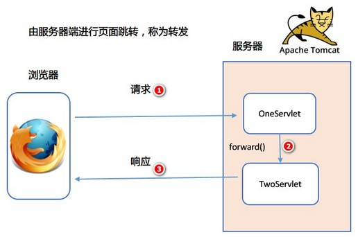

#### 3.2.1. 转发的特点

1. 地址栏：不会发生变化，显示的依然是上一个 Servlet 中地址。 ，内容看到是demo2。因为转发是服务器直接请求访问目标地址的 URL，把那个 URL 的响应内容读取过来，然后将内容再响应发给浏览器。浏览器根本不知道服务器发送的内容从哪里来的，所以浏览器地址栏还是原来的地址。
2. 请求次数：只有1次请求。
3. 根目录：使用的是服务器的根目录，`/`表示WebRoot开发目录。相当于 `http://localhost:8080/项目名/`
4. 请求域：因为是同一次请求，所以请求域中的数据不会丢失。方法把请求带到了第 2 个 Servlet

#### 3.2.2. 转发的方法

1. 得到转发器，参数是要跳转到页面，使用的`/`是服务器端的绝对路径

```java
RequestDispatcher dispatcher = request.getRequestDispatcher("跳转的页面");
```

2. 使用转发器进行跳转，参数分别是：请求对象，响应对象

```java
dispatcher.forward(request, response);
```

也可以合并编写：

```java
request.getRequestDispatcher("跳转的页面").forward(request, response);
```

### 3.3. redirect（重定向）

**重定向**是服务器通知客户端（浏览器），让客户端重新发起请求进行页面的跳转，是 2 次请求。不仅可以重定向到当前应用程序的其他资源，还可以重定向到同一个站点上的其他应用程序中的资源，甚至是使用绝对 UR 重定向到其他站点的资源。

原理图如下：

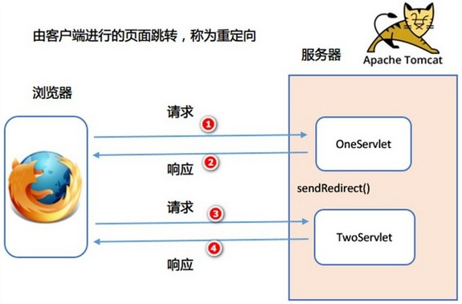

#### 3.3.1. 重定向的特点

1. 地址栏：是发生变化的，显示第2个Servlet(页面)的地址。因为重定向是服务端根据逻辑，例如发送一个状态码，告诉浏览器重新去请求某个地址。所以浏览器地址栏显示的是新的 URL。重定向等于客户端向服务器端发出两次请求，同时也接受两次响应。
2. 请求次数：有2次请求

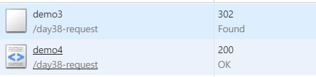

3. 根目录：浏览器端的绝对地址。`/`表示的是：`http://localhost:8080/`；是 WebRoot 的上一级：`/day38-request/demo4`
4. 请求域：因为不是同一次请求，请求域中的数据会丢失

#### 3.3.2. 重写向的方法

```java
response.sendRedirect(request.getContextPath() + "/访问的地址");
```

### 3.4. 重定向和转发的区别

- 根目录
    - 转发：服务器端的根目录。如：`http://localhost:8080/项目名`
    - 重定向：浏览器端的根目录。如：`http://localhost:8080/`
- 地址栏显示
    - 转发不会改变，还是原来的地址。
    - 重定向会改变，显示是新的地址。
- 跳转者
    - 转发是由服务器进行跳转
    - 重定向由浏览器进行跳转
- 请求域
    - 转发页面与转发后的页面，可以共享请求域(request)的数据。
    - 重定向的两页面不能共享请求域(request)的数据，因为不是同一次请求。
- 效率
    - 转发效率高
    - 重定向效率低
- 运用场景
    - 转发一般用于用户登陆的时候，根据角色转发到相应的模块。
    - 重定向一般用于用户注销登陆时返回主页面和跳转到其它的网站等。

> Notes: <font color=red>**无论转发或重定向，后续的代码都会执行，如果不想后续的代码继续运行，需要加上 `return`**</font>。

## 4. 会话

### 4.1. 概述

> API: Provides a way to identify a user across more than one page request or visit to a Web site and to store information about that user.

会话提供了一种途径，用来标识一个用户访问多个页面或访问一个站点，同时保存用户访问的信息。HTTP 协议是一个无状态协议，不会保存用户的信息，所以需要使用会话来保存用户的信息。

### 4.2. 什么是会话

类似于生活中的打电话，会话从电话接通开始，挂断结束，在整个通话的过程中，双方可以不断通话，类似于浏览器不停的请求和响应。整个通话的过程就是一次会话。

BS结构的程序类似于打电话，从浏览器第一次访问服务器开始，就创建了一个会话，整个过程中，浏览器不断地向服务器发送请求，服务器不断向浏览器做出响应，这个过程就称为一个会话。当用户关闭浏览器，会话就结束。

### 4.3. 会话的技术

- Cookie 技术：数据保存在浏览器端(缓存中或文件)
- Session 技术：数据保存在服务器的内存中，在 Java 中定义为 `HttpSession` 接口

### 4.4. 实现集群中的 Session 共享存储

Session 是运行在一台服务器上的，所有的访问都会到达此唯一服务器上时，可以根据客户端传来的 sessionID，来获取相应的 Session；或在对应 Session 不存在的情况下（session 生命周期到了/用户第一次登录），创建一个新的 Session。

但如果在实现集群的环境下，用户的请求会由 Nginx 服务器进行转发（别的方案也是同理）到不同的服务器上，如果用户在服务器A已经登陆并生成 Session，如果下次请求转发到服务器B，由于服务器B没有客户端上送的 sessionId 而重新创建一个新的 Session，并且再将这个新的 sessionID 返回给客户端。这样不仅对用户体验特别差，还会让服务器上的 session 激增，加大服务器的运行压力。

为了解决集群环境下的 seesion 共享问题，有以下的解决方案：

1. 粘性 session：是指 Ngnix 每次都将同一用户的所有请求转发至同一台服务器上，即将用户与服务器绑定。
2. 服务器 session 复制：即每次 session 发生变化时，创建或者修改，就广播给所有集群中的服务器，使所有的服务器上的 session 相同。
3. session 共享：使用 redis， memcached 等技术缓存 session，让所有集群的服务器共离。
4. session 持久化：将 session 存储至数据库中，像操作数据一样才做 session。

## 5. Cookie

### 5.1. 概念

> API：Creates a cookie, a small amount of information sent by a servlet to a Web browser, saved by the browser, and later sent back to the server. A cookie's value can uniquely identify a client
>
> 一个 Cookie 是由 Servlet 发送给浏览器的少量的数据，由浏览器保存，然后再发送回服务器。每个 Cookie 都是唯一的键和值，而且键和值都是字符串类型

Cookie 就是由服务器发给客户端的特殊信息，而这些信息以文本文件的方式存放在客户端，然后客户端每次向服务器发送请求的时候都会带上这些特殊的信息。具体流程如下：

1. 当用户使用浏览器访问一个支持 cookie 的网站的时候，用户会提供包括用户名在内的个人信息并且提交至服务器。
2. 服务器在向客户端回传相应的超文本的同时也会发回这些个人信息，当然这些信息并不是存放在 HTTP 响应体中的，而是存放于 HTTP 响应头。
3. 当客户端浏览器接收到来自服务器的响应之后，浏览器会将这些信息存放在一个统一的位置。
4. 自此，客户端再向服务器发送请求的时候，都会把相应的 cookie 存放在 HTTP 请求头再次发回至服务器。
5. 服务器在接收到来自客户端浏览器的请求之后，就能够通过分析存放于请求头的 cookie 得到客户端特有的信息，从而动态生成与该客户端相对应的内容。

Cookie 的格式：`键=值`，每个 Cookie 就是一个键值对，键和值都是 String 类型。Cookie 是有过期的时间，在有效时间内可以起作用。

不同的浏览器，Cookie 数据互相是不能共享的。保存的方式也不同。如：在 IE 中，Cookie 是以文件的方式保存的。

> Notes: 
>
> - tomcat7 中的 cookie 支持`,`和`_`的符号
> - tomcat8 以上的 cookie 不支持`,`和`_`的符号
> - 网站的登录界面中『请记住我』这样的选项，就是通过 cookie 实现的。

#### 5.1.1. Chrome 查看 Cookie

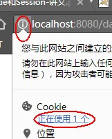 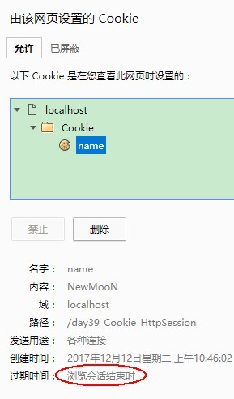

#### 5.1.2. Cookie 技术运行的原理

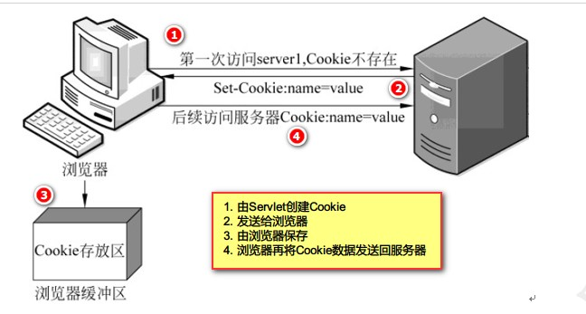

1. 第 1 次浏览器访问服务器时，Cookie 不存在
2. 由服务器的 Servlet 创建 1 个 Cookie，保存少量的数据。并且以响应头的方式：`Set-Cookie` 将 Cookie 的键和值发送给浏览器(`键=值`，键和值都是字符串类型)
3. 浏览器接收到服务器发送的 Cookie 数据，自动将 Cookie(`键=值`)存在浏览器的缓存中。
4. 下次再访问服务器，浏览器将 Cookie 信息以请求头的方式发送给服务器。服务器就可以得到 Cookie 的信息。

#### 5.1.3. Cookie 中使用汉字的情况 

在服务器端先对汉字使用 URL 编码以后写到浏览器，浏览器发送回来的后，再使用 URL 解码。*URL 编码方法参考后面的下载文件案例*

### 5.2. Cookie 操作相关的方法

#### 5.2.1. Cookie 类的方法

Cookie 是被抽象在 Tomcat 中的 `javax.servlet.http.Cookie`。以下为常用的创建与设置 Cookie 的常用方法

```java
public Cookie(String name, String value)
```

- `Cookie` 类的有参构造方法。创建一个 `Cookie` 对象，并指定键和值。<font color=red>**在默认的情况下，是不支持汉字做为键和值**</font>。*注：该类没有无参的构造方法*

```java
public String getName()
```

- 得到 Cookie 的名字

```java
public String getValue()
```

- 得到 Cookie 的值

```java
public void setMaxAge(int expiry)
```

- 设置 Cookie 过期的时间，单位是秒。<font color=red>只要没有过期或者用户主动清理，即使浏览器关闭后，下次还会把数据发送给服务器</font>。有以下几种设置情况：
    - 如果没有设置 Cookie 的过期时间，默认是浏览器关闭以后就过期了。
    - 如果是正数，则指定多少秒后过期。
    - 如果是负数，则相当于没有设置。
    - 如果是0，则表示删除 Cookie。

```java
public void setHttpOnly(boolean httpOnly)
```

- 设置是否支持 `HttpOnly` 属性，避免一定程度的跨站攻击

```java
public void setDomain(String pattern)
```

- 跨域共享 cookie 的方法

```java
public void setPath(String uri)
```

- 设置浏览器向服务器发送 Cookie 的访问（保存）路径，会影响到 Cookie 信息的读取。服务器在读取 Cookie 信息的时候，**访问路径必须是设置的路径或子路径才能读取 Cookie**。*具体的访问规则详见后面章节*。

#### 5.2.2. 写入 Cookie 的方法

Cookies 写入操作是指服务端往客户端（浏览器）响应 Cookie 的内容。操作方法定义在 `javax.servlet.http.HttpServletResponse` 接口中

```java
void addCookie(Cookie cookie);
```

- 将指定的 Cookie 对象的发送给浏览器，并且由浏览器写入缓存

#### 5.2.3. 读取 Cookie 的方法

Cookies 读取操作是指客户端（浏览器）请求服务器时带上的 Cookie 内容。操作方法定义在 `javax.servlet.http.HttpServletRequest` 接口中

```java
Cookie[] getCookies();
```

- 得到从浏览器端发送回来所有的 Cookie 数据，返回一个 Cookie 数组

#### 5.2.4. Cookie 基础操作案例

案例需求：得到用户上次访问的时间

- 定义操作 Cookie 的工具类

```java
package com.moonzero.utils;

import javax.servlet.http.Cookie;
import javax.servlet.http.HttpServletRequest;

/**
 * 操作Cookie的工具类
 */
public class CookieUtils {
	public static String getCookieValue(HttpServletRequest request, String name) {
		// 获取请求域的所有Cookie对象数组
		Cookie[] cookies = request.getCookies();
		// 判断数组是否为空
		if (cookies != null) {
			// 遍历数组，返回一个和name一样的值
			for (Cookie cookie : cookies) {
				if (name.equals(cookie.getName())) {
					return cookie.getValue();
				}
			}
		}
		// 没有找到则返回空
		return null;
	}
}
```

- 具体实现，

```java
package com.moonzero;

import java.io.IOException;
import java.io.PrintWriter;
import java.sql.Timestamp;

import javax.servlet.ServletException;
import javax.servlet.http.Cookie;
import javax.servlet.http.HttpServlet;
import javax.servlet.http.HttpServletRequest;
import javax.servlet.http.HttpServletResponse;

import com.moonzero.utils.CookieUtils;

public class VisitedCookie extends HttpServlet {

	public void doGet(HttpServletRequest request, HttpServletResponse response)
			throws ServletException, IOException {
		// 设置网页内容编码
		response.setContentType("text/html;charset=utf-8");
		// 获取打印输出流对象
		PrintWriter out = response.getWriter();

		// 使用工具类获取叫visited的cookie信息
		String visitedTime = CookieUtils.getCookieValue(request, "vistited"); 
		
		// 得到当前的时间
		String now = new Timestamp(System.currentTimeMillis()).toString();
		
		// 判断获取的cookie是否为空
		if(visitedTime == null){
			out.print("<h1>>欢迎您！您是第 1 次访问，当前时间是：" + now +"</h1>");
		}else{
			// 不是第一次登陆就读取上次信息显示上次访问时间
			out.print("<h1>欢迎再次访问，您上次访问的时间是：" + visitedTime + "</h1>");
			out.print("<h1>本次访问的时间是：" + now + "</h1>");
		}
		
		// 无论是否是再次访问，都将本次的时间写入Cookie中
		Cookie cookie = new Cookie("vistited", now);
		// 设置会话过期时间，设置20秒，用来看效果
		cookie.setMaxAge(20);
		
		// 将Cookie发送到浏览器
		response.addCookie(cookie);
		
		// 关闭输出流对象
		out.close();
	}

	public void doPost(HttpServletRequest request, HttpServletResponse response)
			throws ServletException, IOException {
		doGet(request, response);
	}
}
```

### 5.3. 设置 Cookie 的路径

通过 Cookie 对象的 `setPath(String uri)` 方法可以设置 Cookie 保存的路径。如果不设置，则默认是当前工程的访问地址。

在读取 Cookie 时的访问路径必须是设置的路径或子路径才能成功读取。

#### 5.3.1. 路径的访问规则

如果浏览器端请求的 URL 地址是之前项目或它的子目录，则浏览器会将 Cookie 的信息发送给服务器，即访问 Cookie 所在的路径 path，或它的子目录，都会将 Cookie 从浏览器发送给服务器。

|        设置路径         |            访问地址                        | 是否可以访问 Cookie |
| --------------------- | ---------------------------------------- | ----------------- |
| `setPath("/web/a/b")` | `http://localhost:8080/a/b/oneServlet`   | 可以               |
| `setPath("/web/a/b")` | `http://localhost:8080/a/b/c/oneServlet` | 子目录可以          |
| `setPath("/web/a/b")` | `http://localhost:8080/a/c/oneServlet`   | 不可以             |
| `setPath("/web")`     | `http://localhost:8080/web`              | 可以               |
| `setPath("/")`        | `http://localhost:8080/`                 | 可以               |

### 5.4. 删除 Cookie

如果要删除一个 Cookie，使用该对象的 `setMaxAge(0)`，将过期的时间设置为0 即可。示例如下：

```java
// 1.创建Cookie，名字与相删除的Cookie的名字相同
Cookie c = new Cookie("name", "jack");
// 2.设置过期时间，将时间设置为0，表示删除
c.setMaxAge(0);
// 3. 向浏览器发送
response.addCookie(c);
```

> Tips: *如果设置为负数，相当于没有设置*

## 6. HttpSession

### 6.1. Session 概述

会话是运行在服务端，所有的用户信息数据以键和值(可以是 Object)的方式保存在服务器的内存中。

每个浏览器的用户都会在服务器上有一个会话与其对应。各自会话保存用户自己的数据，不同的用户之间数据不能共享，每个用户的数据只能是自己使用。

#### 6.1.1. 在浏览器中查看会话 ID

JSESSIONID 是指，会话ID

- 查看某个请求的响应头：服务器将会话ID 以 Cookie 的方式发送了给服务器


- 查看某个请求的请求头：再次把会话ID发送给服务器


#### 6.1.2. Session 实现原理分析

简单来说，服务器在响应的时将会话ID 发送给浏览器。浏览器下次访问时，再将会话ID 发送给服务器，服务器通过会话ID 识别不同的会话。具体流程如下：

1. 浏览器首次请求服务器访问 web 站点时，此时没有会话 ID，服务器创建一个会话，分配一个唯一的会话 JSESSIONSID 返回给浏览器，**JSESSIONSID 以 Cookie 的方式发送给浏览器**。
2. 第2次以后，浏览器每次请求时，都会带着这个会话 JSESSIONSIDID 来访问服务器，服务器根据此 JSESSIONSIDID 检索其对应的 Session。
    - 如果成功找到关联的 Session，则说明以前已经为此客户端创建过 Session，可以直接使用该 Session 获取相关信息，以此达到共享数据的目的。
    - 如果匹配不到 Session，则服务器重新为此客户端创建一个新 Session，并且生成一个新的唯一 sessionId 存放到 cookie 中，在本次响应中返回到客户端保存。

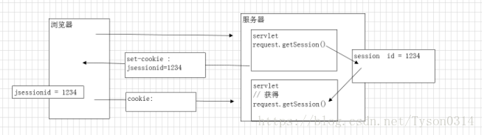

> Notes: 
>
> - 不同浏览器的会话ID 是不同的，不同的会话ID 可以区分不同的用户。
> - Session 不会随着浏览器的关闭而死亡，只是不能再次得到之前的会话ID，服务器上的会话没有过期，直到过期才销毁。<font color=red>**默认服务器的过期时间是30分钟**</font>。

#### 6.1.3. 关闭浏览器后再次访问 Session

如果浏览器关闭，服务器上的会话信息还是存在的，直到会话过期才从服务器上删除用户的信息。但是下一个用户再打开浏览器，在正常情况下是不能得到之前的会话ID，服务器会再创建一个新的会话给这个用户。因为浏览器关闭以后 Cookie 就过期，之前保存的会话ID 会丢失。

如果希望浏览器关闭后再次能访问之前会话中的信息，可以将会话的ID写到 Cookie 中，并且设置过期的时间。

```java
//创建一个Cookie
Cookie jsessionid = new Cookie("JSESSIONID", session.getId());
jsessionid.setMaxAge(60 * 10);
response.addCookie(jsessionid);
```

#### 6.1.4. Session 和 Cookie 的主要区别

- **作用范围不同**：Cookie 保存在客户端；Session 保存在服务器端内存中。
- **值类型不同**：Cookie 键和值都是字符串类型；Session 键是字符串类型，值是Object类型。
- **有效期不同**：Cookie 可设置为长时间保持，比如经常使用的默认登录功能；Session 一般失效时间较短，客户端关闭或者 Session 超时都会失效。
- **隐私策略不同**：Cookie 存储在客户端，容易被窃取；Session 存储在服务端，安全性相对 Cookie 要好一些。
- **存储大小不同**：单个 Cookie 保存的数据不能超过 4K；对于 Session 来说存储没有上限，但出于对服务器的性能考虑，Session 内不要存放过多的数据，并且需要设置 Session 删除机制。

### 6.2. HttpSession 的使用

1. 创建时机：由服务器创建，每个用户<font color=red>**第一次**</font>访问的时候创建一个会话对象。每个用户对应一个会话。
2. 获取 Session 对象，程序可以通过 `javax.servlet.http.HttpServletRequest` 接口的 `getSession()` 方法得到服务器创建好的会话（**本质是获得会话对象**）。

```java
HttpSession getSession(boolean var1);
HttpSession getSession();
```

注意：使用带参数的 `getSession(boolean var1)` 方法获取 session 对象，如果参数设置为 true，则查询容器中没有 session 对象，就会创建一个亲的 session；如果不需要创建，将参数设置为 false

> Tips: 服务器会认为不同的浏览器是不同的用户，会话不会相同。

### 6.3. HttpSession 接口常用 API

```java
String getId();
```

- 得到会话的ID，格式是：32位十六进制数，在服务器上是唯一的，不会重复的。使用不同浏览器访问也被认为不同的会话。

```java
long getCreationTime();
```

- 返回会话创建的时间(刷新不会改变)，从1970-1-1加上long得到的时间

```java
long getLastAccessedTime();
```

- 得到用户会话上次访问的时间

```java
boolean isNew();
```

- 判断当前这个会话是否是新的会话

```java
void invalidate();
```

- 将当前的会话过期

```java
ServletContext getServletContext();
```

- 通过会话也可以得到得到上下文域对象


```java
Object getAttribute(String var1);
```

- 从会话域中取出对象

```java
void setAttribute(String var1, Object var2);
```

- 从会话域中保存对象

```java
void removeAttribute(String var1);
```

- 从会话域中删除对象

### 6.4. 改变会话销毁的时间

#### 6.4.1. 会话销毁的含义

会话销毁，又称为会话过期。其含义是：只要在指定的时间内与服务器有交互，会话过期时间就重新开始计时。有以下情况导致会话的销毁：

1. **浏览器关闭**，服务器上的会话 ID 得不到，相当于密码条丢失，服务器会开启一个新的会话
2. **服务器会话过期**，相当于密码条还在，储物箱没有了，服务器会开启一个新的会话。

#### 6.4.2. 查看默认销毁时间

Session在服务器上默认的销毁时间是 30分钟，可以通过 `javax.servlet.http.HttpSession` 对象的方法查看：

```java
int getMaxInactiveInterval();
```

#### 6.4.3. 方式1：编程式修改销毁时间

调用 `javax.servlet.http.HttpSession` 对象的设置会话过期时间的方法

```java
// 设置会话过期的时间，最大非活动间隔时间，单位是秒
void setMaxInactiveInterval(int var1);
// 得到会话过期的时间，单位是秒
int getMaxInactiveInterval();
```

#### 6.4.4. 方式2：修改 web.xml 配置文件改变会话销毁时间

```xml
<!-- 配置会话的过期时间 -->
<session-config>
	<!-- 单位是分钟 -->
	<session-timeout>5</session-timeout>
</session-config>
```

> Notes: 设置 web.xml 的会话配置，并且在代码中设置会话过期的时间，此时<font color=red>**按照就近原则，以代码为准**</font>。

#### 6.4.5. 方式3：立刻失效

调用 `javax.servlet.http.HttpSession` 接口让会话立即失效的方法：

```java
void invalidate();
```

> Tips: 一般用于退出或注销按钮

### 6.5. 会话的钝化与激活技术（了解）

- 浏览器关闭的时候，服务器端的会话就销毁？错
- 服务器关闭的时候，服务器端的会话就销毁？错

**钝化与激活是会话的特有特性**，上下文域在关闭时就销毁。而会话因为是可以设置其过期时间，所以，只有在会话过期前，重新开启服务器，都可以重新激活会话。

#### 6.5.1. 序列化与反序列化回顾

- 序列化：将一个对象写到文件中
- 反序列化：将文件中的对象读取成一个对象

> 更多序列化与反序列化的内容详见[《Java基础-IO编程》笔记](/Java/Java基础-IO编程)

#### 6.5.2. 会话的钝化

当服务器正常关闭的时候，将会话中的数据以对象的方式写到服务器的硬盘中。如果要让一个对象钝化，这个对象必须要可以序列化，实现 `java.io.Serializable` 接口。

保存的位置是，在 tomcat/work 目录下。如：`\apache-tomcat-7.0.70\work\catalina\localhost\***\SESSIONS.ser`

#### 6.5.3. 会话的激活

当服务器重新开启的时候将服务器硬盘中的对象读取出来，还原成会话。会话还原后就将ser文件删除

### 6.6. 案例：session 完成验证码

#### 6.6.1. 案例需求

用户登录的时候使用验证码进行验证。登录成功后将用户信息保存到会话域中，并且跳转到 WelcomeServlet，然后在 WeclcomeServlet 中读取会话域用户信息，显示欢迎信息。在 WelcomeServlet 上显示退出的链接，点退出，注销会话信息。

#### 6.6.2. LoginServlet 实现步骤

1. 使用昨天的代码实现验证码的绘制
2. 将随机产生的字符串放在会话域中
3. 用户登录的时候提交验证码的字符串
4. 比较表单提交的字符串是否与会话域中的字符串相等，如果相等则验证成功
5. 登录一次以后删除会话域中的验证码字符串，验证码只能使用一次
6. 登录成功以后保存用户的信息到会话域中，并且跳转到 WelcomeServlet

LoginServlet.java，登陆页面代码：

```java
package com.moonzero.servlet;

import java.io.IOException;
import java.io.PrintWriter;

import javax.servlet.ServletException;
import javax.servlet.http.HttpServlet;
import javax.servlet.http.HttpServletRequest;
import javax.servlet.http.HttpServletResponse;
import javax.servlet.http.HttpSession;

import com.moonzero.entity.User;
import com.moonzero.service.UserService;

public class LoginServlet extends HttpServlet {

	// 创建业务逻辑层对象
	UserService us = new UserService();

	public void doGet(HttpServletRequest request, HttpServletResponse response)
			throws ServletException, IOException {
		// 设置网页内容编码
		response.setContentType("text/html;charset=utf-8");
		// 获取打印输出流对象
		PrintWriter out = response.getWriter();

		// 获取用户提交的信息
		String name = request.getParameter("name");
		String password = request.getParameter("password");
		String code = request.getParameter("vcode");

		// 创建会话域对象，从会话域中获取生成的验证码
		HttpSession session = request.getSession();
		String vcode = (String) session.getAttribute("vcode");
		// 获取后马上销毁会话域中的值
		session.removeAttribute("vcode");

		// 进行生成的验证码和用户提交的验证码比较
		if (!code.equalsIgnoreCase(vcode)) {
			out.print("<script>");
			out.print("alert('输入的验证码不正确，请重新输入');");
			out.print("location.href='login.htm';");
			out.print("</script>");
			return;
		}

		// 调用业务逻辑层方法，获取查询数据库返回的用户对象
		User user = us.findUser(name, password);
		// 判断用户对象是否为空
		if (user == null) {
			// 登陆失败
			out.print("<script>");
			out.print("alert('输入的用户名或密码不正确，请重新输入');");
			out.print("location.href='login.htm';");
			out.print("</script>");
			return;
		}

		// 登陆成功，将用户对象放到会话域中
		session.setAttribute("user", user);
		// 重定向到欢迎登陆界面
		response.sendRedirect(request.getContextPath() + "/welcome");

		// 关闭输出流对象
		out.close();
	}

	public void doPost(HttpServletRequest request, HttpServletResponse response)
			throws ServletException, IOException {
		doGet(request, response);
	}
}
```

#### 6.6.3. WelcomeServlet 的实现步骤

1. 从会话域中取出用户信息并且显示
2. 在页面上输出一个注销的连接，点注销跳转到 LogoutServlet

WelcomeServlet.java，登陆成功跳转页面代码：

```java
package com.moonzero.servlet;

import java.io.IOException;
import java.io.PrintWriter;

import javax.servlet.ServletException;
import javax.servlet.http.HttpServlet;
import javax.servlet.http.HttpServletRequest;
import javax.servlet.http.HttpServletResponse;
import javax.servlet.http.HttpSession;

import com.moonzero.entity.User;

public class WelcomeServlet extends HttpServlet {

	public void doGet(HttpServletRequest request, HttpServletResponse response)
			throws ServletException, IOException {
		// 设置网页内容编码
		response.setContentType("text/html;charset=utf-8");
		// 获取打印输出流对象
		PrintWriter out = response.getWriter();
		
		// 获取会话对象
		HttpSession session = request.getSession();
		// 从会话域中取出用户对象
		User user = (User) session.getAttribute("user");
		
		out.print("欢迎您," + user.getName() + "<br/>");
		out.print("<a href='logout'>退出</a>");
		
		// 关闭输出流对象
		out.close();
	}

	public void doPost(HttpServletRequest request, HttpServletResponse response)
			throws ServletException, IOException {
		doGet(request, response);
	}
}
```

#### 6.6.4. LogoutServlet的实现步骤

1. 让会话立刻过期
2. 显示您已经成功退出

LogoutServlet.java，退出页面代码：

```java
package com.moonzero.servlet;

import java.io.IOException;
import java.io.PrintWriter;

import javax.servlet.ServletException;
import javax.servlet.http.HttpServlet;
import javax.servlet.http.HttpServletRequest;
import javax.servlet.http.HttpServletResponse;

public class LogoutServlet extends HttpServlet {

	public void doGet(HttpServletRequest request, HttpServletResponse response)
			throws ServletException, IOException {
		// 设置网页内容编码
		response.setContentType("text/html;charset=utf-8");
		// 获取打印输出流对象
		PrintWriter out = response.getWriter();
		
		// 使用会话立即失效
		request.getSession().invalidate();
		out.print("您已成功退出<br/>");
		out.print("<a href='login.htm'>返回主页</a>");
		
		// 关闭输出流对象
		out.close();
	}

	public void doPost(HttpServletRequest request, HttpServletResponse response)
			throws ServletException, IOException {
		doGet(request, response);
	}
}
```

PicCode.java，生成动态验证码

```java
package com.moonzero.servlet;

import java.awt.Color;
import java.awt.Font;
import java.awt.Graphics;
import java.awt.image.BufferedImage;
import java.io.IOException;
import java.util.ArrayList;
import java.util.Random;

import javax.imageio.ImageIO;
import javax.servlet.ServletException;
import javax.servlet.http.HttpServlet;
import javax.servlet.http.HttpServletRequest;
import javax.servlet.http.HttpServletResponse;

public class PicCode extends HttpServlet {
	// 创建随机对象，用来生成随机字母
	private Random ran = new Random();

	// 1.创建方法：随机得到一种颜色
	public Color getColor() {
		int r = ran.nextInt(256); // 红
		int g = ran.nextInt(256); // 绿
		int b = ran.nextInt(256); // 蓝

		// 使用带RBG三个颜色参数的构造方法
		return new Color(r, g, b);
	}

	public void doGet(HttpServletRequest request, HttpServletResponse response)
			throws ServletException, IOException {
		// 2. 创建缓存图片：指定宽width=90，高height=30
		int width = 90;
		int height = 30;
		BufferedImage image = new BufferedImage(width, height,
				BufferedImage.TYPE_INT_RGB);

		// 3. 获取画笔对象
		Graphics graphics = image.getGraphics();

		// 4. 设置画笔颜色，并且填充矩形区域
		graphics.setColor(Color.WHITE);
		graphics.fillRect(0, 0, width, height);

		// 创建包含0~9、a~z、A~Z的集合
		ArrayList<Character> array = new ArrayList<>();
		// 添加数字到集合
		for (int i = 48; i <= 57; i++) {
			array.add((char) i);
		}
		// 添加a~z到集合
		for (int i = 65; i <= 90; i++) {
			array.add((char) i);
		}
		// 添加A~Z到集合
		for (int i = 97; i <= 122; i++) {
			array.add((char) i);
		}

		// 定义StringBuilder保存字符串
		StringBuilder sb = new StringBuilder();
		// 5. 从字符集体中随机得到4个字符
		for (int i = 0; i < 4; i++) {
			int index = ran.nextInt(array.size());
			char c = array.get(index);
			sb.append(c);
			// 设置颜色
			graphics.setColor(getColor());
			// 6. 设置字体，大小为18，设置字的颜色随机
			graphics.setFont(new Font(Font.DIALOG, Font.BOLD + Font.ITALIC, 18));
			// 7. 将每个字符画到图片，位置：5+(i*20), 20
			graphics.drawString(String.valueOf(c), 5 + (i * 20), 20);
		}
		// 将拼接后的验证码字符串存在会话域中
		request.getSession().setAttribute("vcode", sb.toString());

		// 8. 画干扰线10条线，线的位置是随机的，x范围在width之中，y的范围在height之中
		for (int i = 0; i < 10; i++) {
			int x1 = ran.nextInt(width);
			int y1 = ran.nextInt(height);
			int x2 = ran.nextInt(width);
			int y2 = ran.nextInt(height);

			// 设置一个随机颜色
			graphics.setColor(getColor());
			graphics.drawLine(x1, y1, x2, y2);
		}

		// 将缓存的图片输出到响应输出流中
		ImageIO.write(image, "jpg", response.getOutputStream());
	}

	public void doPost(HttpServletRequest request, HttpServletResponse response)
			throws ServletException, IOException {
		doGet(request, response);
	}
}
```

DAO 和 Util 代码

```java
package com.moonzero.dao;

import java.sql.SQLException;

import org.apache.commons.dbutils.QueryRunner;
import org.apache.commons.dbutils.handlers.BeanHandler;

import com.moonzero.entity.User;
import com.moonzero.utils.C3P0Util;

/**
 * 数据访问层
 */
public class UserDao {
	// 获取查询器对象
	QueryRunner qr = new QueryRunner(C3P0Util.getDataSource());

	// 查询用户的方法
	public User findUser(String name, String password) {
		// 准备查询sql语句
		String sql = "select * from users where name=? and password=?;";

		// 查询并返回一个User对象
		try {
			return qr.query(sql, new BeanHandler<User>(User.class), name, password);
		} catch (SQLException e) {
			e.printStackTrace();
			throw new RuntimeException(e);
		}
	}
}


package com.moonzero.utils;

import java.sql.Connection;
import java.sql.SQLException;

import javax.sql.DataSource;

import com.mchange.v2.c3p0.ComboPooledDataSource;

/**
 * 工具类
 */
public class C3P0Util {
	// 创建连接池对象
	private static DataSource ds = new ComboPooledDataSource();
	
	// 获取线程共享局部对象
	private static ThreadLocal<Connection> local = new ThreadLocal<Connection>();
	
	// 获取连接对象
	public static Connection getConncetion(){
		// 先从线程共享对象中获取
		Connection conn = local.get();
		// 判断是否获取
		try {
			if(conn == null){
				conn = ds.getConnection();
				local.set(conn);
			}
			return conn;
		} catch (SQLException e) {
			e.printStackTrace();
			throw new RuntimeException(e);
		}
	}
	
	// 获取连接池对象方法
	public static DataSource getDataSource(){
		return ds;
	}
}
```

登陆页面部分代码

```html
<form class="form-horizontal" action="login" method="post">
	<div class="form-group">
		<label for="username" class="col-sm-2 control-label">用户名</label>
		<div class="col-sm-6">
			<input type="text" class="form-control" id="username" name="name" placeholder="请输入用户名">
		</div>
	</div>
	<div class="form-group">
		<label for="password" class="col-sm-2 control-label">密码</label>
		<div class="col-sm-6">
			<input type="password" class="form-control" id="password" name="password" placeholder="请输入密码">
		</div>
	</div>
	<div class="form-group">
		<label for="code" class="col-sm-2 control-label">验证码</label>
		<div class="col-sm-3">
			<input type="text" class="form-control" id="code" name="vcode" placeholder="请输入验证码">
		</div>
		<div class="col-sm-3">
			
		</div>
	</div>
	<div class="form-group">
		<div class="col-sm-offset-2 col-sm-10">
			<div class="checkbox">
				<label>
					<input type="checkbox"> 自动登录
				</label>&nbsp;&nbsp;&nbsp;&nbsp;&nbsp;
				<label>
					<input type="checkbox"> 记住用户名
				</label>
			</div>
		</div>
	</div>
	<div class="form-group">
		<div class="col-sm-offset-2 col-sm-10">
			<input type="submit" width="100" value="登录" name="submit" border="0" style="background: url('./img/login.gif') no-repeat scroll 0 0 rgba(0, 0, 0, 0); height:35px;width:100px;color:white;">
		</div>
	</div>
</form>

<script type="text/javascript">function refreshCode() {
	//随机产生一个参数，通过?传递给图片src属性，点击的时候，让浏览器认为地址栏参数发生变化，就会重新访问服务器
	document.getElementById("vcode").src = "vcode?t=" + Math.random();
}</script>
```

## 7. 常见问题

### 7.1. 找不到 HttpServlet 错误

如果看到 JSP 报错：`The superclass "javax.servlet.http.HttpServlet" was not found on the Java Build Path` 可以加入如下依赖解决。

```xml
<dependency>
    <groupId>javax.servlet</groupId>
    <artifactId>servlet-api</artifactId>
    <version>2.5</version>
    <scope>provided</scope>
</dependency>
```

### 7.2. EL 表达式没有提示问题

`${pageContext}` 这个 EL 表达式中通过 pageContext 对象访问 reuqest 属性时本身是应该有提示的，如果没有，则加入以下依赖即可。

```xml
<dependency>
    <groupId>javax.servlet.jsp</groupId>
    <artifactId>jsp-api</artifactId>
    <version>2.1.3-b06</version>
    <scope>provided</scope>
</dependency>
```

同时，针对 index.jsp 文件，修改一下文件头信息为：

```jsp
<%@page language="java" pageEncoding="utf-8" contentType="text/html;UTF-8" %>
```
