## 1. Servlet 概述

`javax.servlet.Servlet` 是一个接口。是运行在 Web 服务器（如：Tomcat）上的 Java 小应用程序，由Tomcat去调用，没有main函数。

每个 Servlet 都要在 web.xml 中进行配置。Servlet 就是一个 Java 类，运行在 Web 容器中，接收并响应用户的请求并且对用户的请求做出响应。通常通过 HTTP 协议实现。

### 1.1. Servlet 的生命周期方法

|                          方法                           |                                     作用                                      | 运行次数 |
| ------------------------------------------------------ | ---------------------------------------------------------------------------- | ------- |
| 构造方法(单例模式)                                        | 实例化Servlet的时候调用  用户第一次访问Servlet的时候才会创建单例对象                  | 1次     |
| void init(ServletConfig config)                        | 初始化的方法，Servlet 实例化的时候执行一次，只有用户第一次访问Servlet的时候才会执行      | 1次     |
| void service(ServletRequest  req, ServletResponse res) | 用来处理用户每次发送的请求  request请求对象，  response响应对象                      | n次     |
| void destroy()                                         | 在Servlet销毁的时候执行一次  Servlet是常驻内存的，只在服务器关闭的时候执行一次该销毁方法 | 1次     |
| ServletConfig getServletConfig()                       | 返回ServletConfig配置对象                                                      |         |
| String getServletInfo()                                | 返回Servlet中的一些额外信息（几乎不用），如：作者，版本，版权                         |         |


### 1.2. Servlet 的运行过程


每个 Servlet 在 Web 容器中只有一个对象，一个类只有一个对象，称为**单例模式**

一个 Servlet 类在 tomcat 中只创建一个对象，等到服务器关闭才销毁，平时是常驻内存的。 

`ServletRequest` 和 `ServletResponse` 是两个接口，Servlet 是运行在 Tomcat 中，<font color=red>**在 service 方法中两个 request 和 response 对象，是由 tomcat 创建出来，并且实例化，由 tomcat 调用 service 方法并且把这两个参数传递进来**</font>。

1. 解析web.xml文件，使用dom4j之类工具。
2. 得到类全名，通过反射实例化Servlet
3. 创建request和response对象，调用service()方法，传递2个对象给方法。

### 1.3. Servlet 的实现类

#### 1.3.1. Servlet 接口继承结构


## 2. JavaWeb 项目开发步骤

### 2.1. 使用 IDEA 开发 JavaEE 项目

1. 在开发环境中准备好 tomcat，在 IDEA 中创建 application serviers，选择本地的 tomcat 目录即可

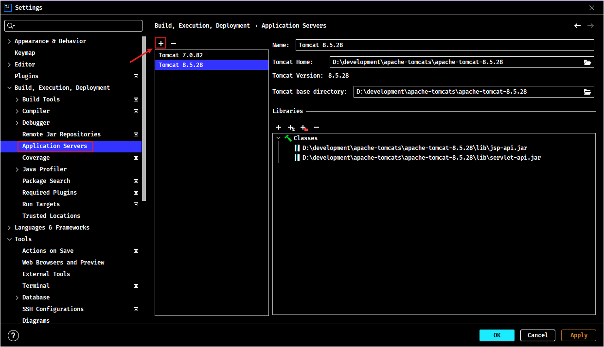

2. 创建项目（Java Enterprise）：项目命名、项目所在目录、项目的 Java 版本、tomcat 服务器等


3. 选择项目需要的依赖


4. 创建后目录结构


<font color=red>**web.xml 是项目的描述文件，servlet 的配置放在这个文件中**</font>

5. 创建完项目后，可以右键点击项目，选择【Edit Configuration】，修改项目的默认根目录的地址、端口号等


### 2.2. 使用 MyEclipse 开发 JavaEE 项目

#### 2.2.1. Tomcat 配置与启动

在 MyEclipse 中 Tomcat 的配置 【Window】->【Preferences】

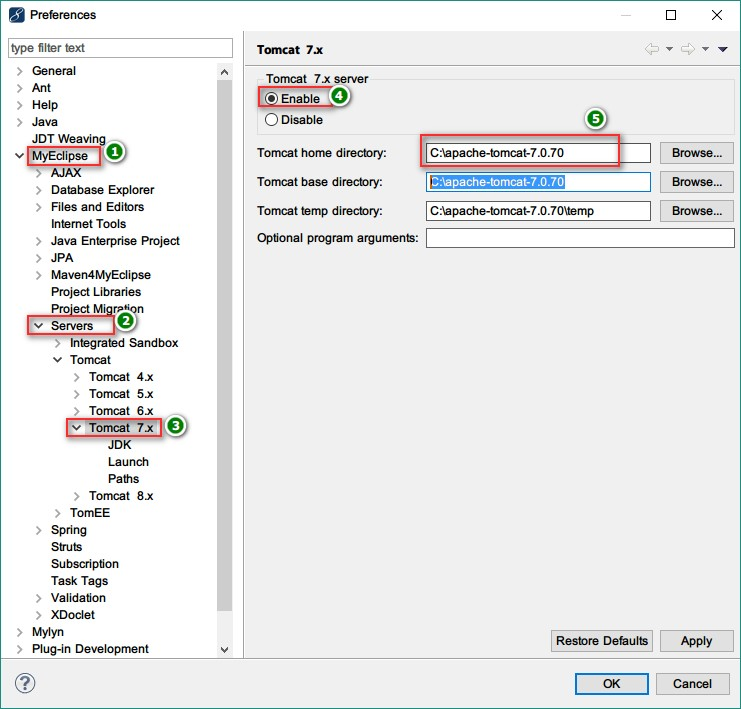

在 myeclipse 中启动 Tomcat

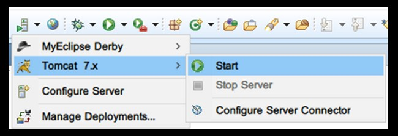

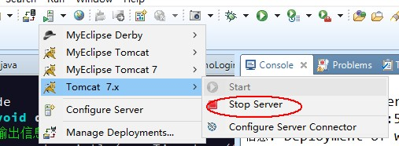

#### 2.2.2. 创建 JavaEE 项目

1. 创建项目：项目命名、项目所在目录、项目的JavaSE和JavaEE的版本

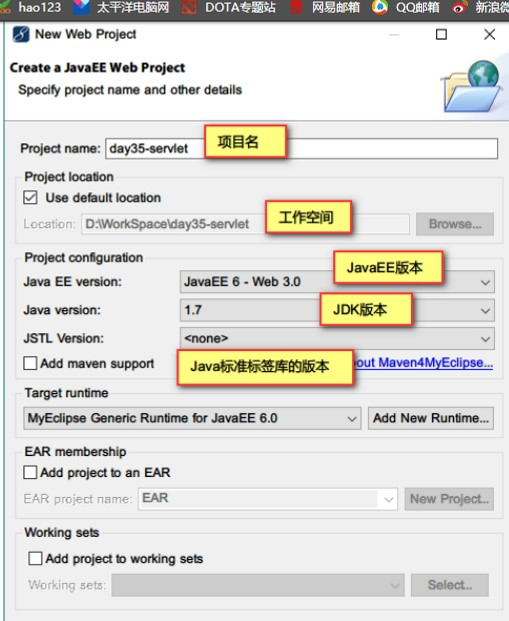

2. 选择Java的源代码和字节码的目录

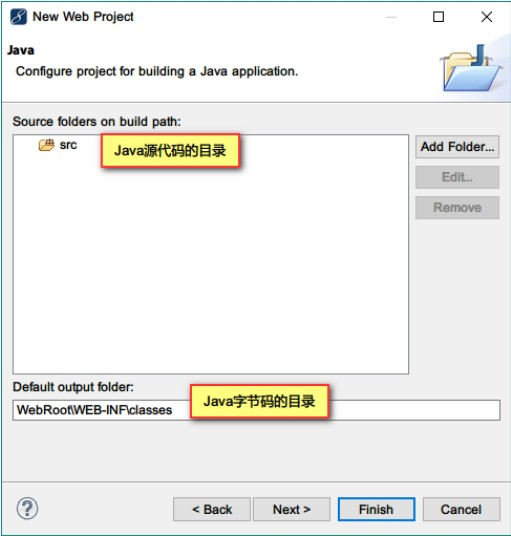

3. 项目的访问地址，网页所在的文件夹。<font color=red>**web.xml 是项目的描述文件，servlet 的配置放在这个文件中**</font>


创建完项目后，可以修改项目的默认根目录的地址，右键项目名，选择【Properties】，搜索 web，修改【Web Context-root】项即可


#### 2.2.3. web 项目结构

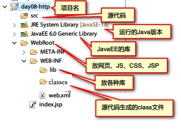

- lib：放第三方的 jar 包，如：驱动、DbUtils 等
- classes：字节码文件
- web.xml：当前项目的部署描述文件，servlet 的配置就要放在这个文件中。

#### 2.2.4. 开发 Servlet

1. 创建一个类 MyServlet 继承于 `javax.servlet.http.HttpServlet` 类
2. 重写 `doGet()` 方法
3. 在 `doGet` 方法中向浏览器输出一些文字
4. 在 web.xml 中配置 servlet。得到类全名的方法，需要点里面的构造方法，再点【Copy Qualified Name】


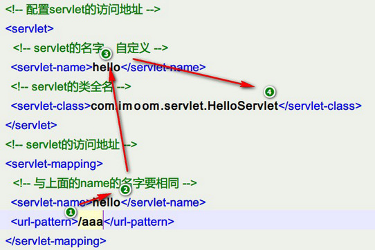

配置文件实现流程：

1. 先通过地址来访问(部署后的页面是 `http://localhost:8080/项目名/url名`)
2. 确定 servlet 的名字
3. 通过步骤2的名字对应确认上面的 servlet 的文件
4. 再利用反射实例化该类

#### 2.2.5. 部署项目到 tomcat

点按钮【Deploy MyEclipse J2EE Project to Server】


【Add】-> 选择 【Server:Tomcat 7.x】 

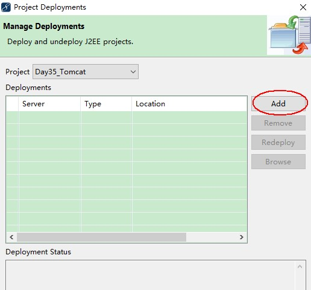

点击 【Finish】，完成部署

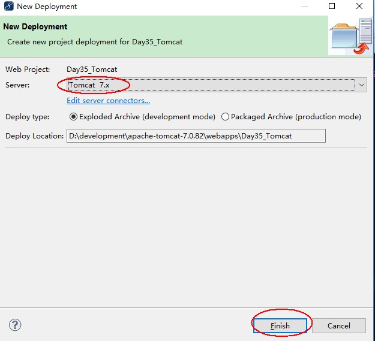

部署后 tomcat 的 webapps 目录多了一个项目文件夹，项目文件夹下有个 classes 文件，就是源代码生成的 class 文件

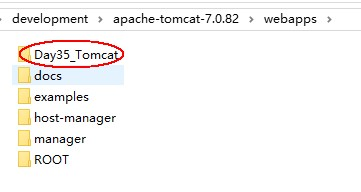

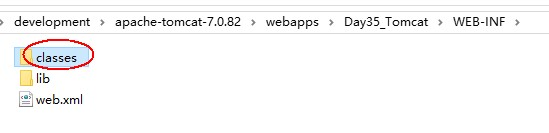

最后使用浏览器访问刚刚部署的项目 `http://localhost:8080/Day35_Tomcat/test`

## 3. Cookie

### 3.1. 会话概述

> API: Provides a way to identify a user across more than one page request or visit to a Web site and to store information about that user.

会话提供了一种途径，用来标识一个用户访问多个页面或访问一个站点，同时保存用户访问的信息。HTTP 协议是一个无状态协议，不会保存用户的信息，所以需要使用会话来保存用户的信息。

#### 3.1.1. 什么是会话

类似于生活中的打电话，会话从电话接通开始，挂断结束，在整个通话的过程中，双方可以不断通话，类似于浏览器不停的请求和响应。整个通话的过程就是一次会话。

BS结构的程序类似于打电话，从浏览器第一次访问服务器开始，就创建了一个会话，整个过程中，浏览器不断地向服务器发送请求，服务器不断向浏览器做出响应，这个过程就称为一个会话。当用户关闭浏览器，会话就结束。

#### 3.1.2. 会话的技术

Cookie技术：数据保存在浏览器端(缓存中或文件)
Session 技术：数据保存在服务器的内存中，在 Java 中定义为 `HttpSession` 接口

## 4. HttpSession

### 4.1. Session 概述

1. 会话是运行在服务端，所有的用户信息数据以键和值(可以是 Object)的方式保存在服务器的内存中
2. 每个浏览器的用户都会在服务器上有一个会话与他对应
3. 各自保存用户自己的数据，不同的用户之间数据不能共享，每个用户的数据只能是自己使用。

#### 4.1.1. 实现机制

响应的时候把会话ID从服务器发送给浏览器。浏览器下次访问的时候，再把会话ID带到服务器，服务器通过会话ID识别不同的会话

#### 4.1.2. Session 和 Cookie 的主要区别

- **作用范围不同**：Cookie 保存在客户端；Session 保存在服务器端内存中。
- **值类型不同**：Cookie 键和值都是字符串类型；Session 键是字符串类型，值是Object类型。
- **有效期不同**：Cookie 可设置为长时间保持，比如经常使用的默认登录功能；Session 一般失效时间较短，客户端关闭或者 Session 超时都会失效。
- **隐私策略不同**：Cookie 存储在客户端，容易被窃取；Session 存储在服务端，安全性相对 Cookie 要好一些。
- **存储大小不同**：单个 Cookie 保存的数据不能超过 4K；对于 Session 来说存储没有上限，但出于对服务器的性能考虑，Session 内不要存放过多的数据，并且需要设置 Session 删除机制。

## 5. 常见问题

### 5.1. 找不到 HttpServlet 错误

如果看到 JSP 报错：`The superclass "javax.servlet.http.HttpServlet" was not found on the Java Build Path` 可以加入如下依赖解决。

```xml
<dependency>
    <groupId>javax.servlet</groupId>
    <artifactId>servlet-api</artifactId>
    <version>2.5</version>
    <scope>provided</scope>
</dependency>
```

### 5.2. EL 表达式没有提示问题

`${pageContext}` 这个 EL 表达式中通过 pageContext 对象访问 reuqest 属性时本身是应该有提示的，如果没有，则加入以下依赖即可。

```xml
<dependency>
    <groupId>javax.servlet.jsp</groupId>
    <artifactId>jsp-api</artifactId>
    <version>2.1.3-b06</version>
    <scope>provided</scope>
</dependency>
```

同时，针对 index.jsp 文件，修改一下文件头信息为：

```jsp
<%@page language="java" pageEncoding="utf-8" contentType="text/html;UTF-8" %>
```
