## 1. 网络概述

<font color=red>**网络三要素：IP地址、端口号、协议**</font>

## 2. HTTP 协议

### 2.1. 概述

HTTP 全称：Hyper Text Transfer Procotol 超文本传输协议。是应用层的协议，基于 TCP/IP 协议。

**HTTP 协议作用**：用于将服务器上的 HTML 传输到浏览器上，由浏览器去执行 HTML。将用户在表单中提交的数据传输给服务器

**HTTP 协议的特点**：

1. HTTP协议的组成。HTTP 请求(request)和 HTTP 响应(response)。请求与响应是成对出现的，有请求才有响应。
2. HTTP 是<u>**无状态协议**</u>。协议本身不记录用户的任何信息，不会保留用户上次访问状态。浏览器每次发送请求给服务器，对于服务器而言是无法确认是否为同一个用户发送的请求，每次均认为是一个新的请求，上一次会话和下一次会话之间没有联系。
> 扩展：FTP 就是一种有状态协议，是会记录用户状态。
3. 传输时间。不记录用户的状态，传输时间比较短，访问效率比较高。
4. HTTP 允许传输任意类型的数据。传输的类型由 `Content-Type` 加以标记。
5. 支持客户端/服务器模式。

> Tips: **HTTP 协议默认端口号是：`80`**。`80` 也是浏览器软件默认使用的端口号。例如：`http://www.moon.com:80` 如果是80端口，则端口号可以省略。而 `8080` 则是 tomcat 的端口号

### 2.2. URL

#### 2.2.1. 什么是 URL

URL，全称 Uniform Resource Locator （统一资源定位符）

URL 作用：就是一个网页的访问地址，可以访问互联网上任何一个资源。

#### 2.2.2. URL 格式与组成

URL 格式：`http://www.moon.com:8080/news/index.jsp?boardid=5&id=24618&page=1`。下表对每个组成部分进行说明

|    组成部分     |                                 功能                                 |
| -------------- | ------------------------------------------------------------------- |
| **http**       | 使用的超文本传输的协议                                                  |
| `www.moon.com` | 服务器域名或 IP 地址                                                   |
| **8080**       | 端口号，默认 HTTP 协议(浏览器)端口号是 80                                |
| **news**       | 虚拟文件夹地址，服务器上的一个项目访问地址                                 |
| **index.jsp**  | 某个项目中的 Web 资源，可以是 HTML、JSP、图片                            |
| `?`            | URL 访问地址与参数之间的分隔符，后面的参数都是键值对的形式存在(如：boardid=5) |
| `&`            | 参数与参数之间分隔符                                                   |

### 2.3. URL 与 URI 的区别

- URI：Uniform Resource Identifer 统一资源标识符
- URI 标识符往往是 URL 的一部分，用于标识一个互联网的唯一资源，并不能直接访问。URL 是可以直接访问的一个地址。

## 3. HTTP 原理与传输流程

### 3.1. 原理

HTTP是一个无状态的协议。无状态是指客户机（Web浏览器）和服务器之间不需要建立持久的连接，这意味着当一个客户端向服务器端发出请求，然后服务器返回响应(response)，连接就被关闭了，在服务器端不保留连接的有关信息。

HTTP 遵循请求(Request)/应答(Response)模型。客户机（浏览器）向服务器发送请求，服务器处理请求并返回适当的应答。所有 HTTP 连接都被构造成一套请求和应答。

### 3.2. 传输流程

HTTP 的传输流程包括地址解析、封装 HTTP 数据包、封装 TCP 包、建立 TCP 连接、客户端发送请求、服务端响应、服务端关闭 TCP 连接，具体流程如下：

1. **地址解析**：通过域名系统 DNS 解析服务器域名从而获得主机的 IP 地址。例如，客户端浏览器请求 `http://localhost.com:8080/index.html`，则从中可分解出协议名、主机名、端口、对象路径等部分：
    - 协议名：http
    - 主机名：localhost.com
    - 端口：8080
    - 对象路径：/index.htm
> Notes: 在这一步，需要域名系统 DNS 解析域名 localhost.com，得主机的 IP 地址。
2. **封装 HTTP 请求数据包**：将上一步中，解析的协议名、主机名、端口、对象路径等并结合本机自己的信息封装成一个 HTTP 请求数据包。
3. **封装成 TCP 包**：将 HTTP 请求数据包进一步封装成 TCP 数据包。
4. **建立 TCP 连接**：基于 TCP 的三次握手机制建立 TCP 连接。
5. **客户机发送请求**：在建立连接后，客户端发送一个请求给服务器。请求方式的格式为：统一资源标识符（URL）、协议版本号，后边是 MIME 信息包括请求修饰符、客户机信息和可内容。
6. **服务器响应**：服务器接到请求后，结合业务逻辑进行数据处理，然后向客户端返回相应的响应信息。在响应信息中包含一个状态行，协议版本号、成功或错误的代码、MIME 信息（包括服务器信息、实体信息和可能的内容）、消息体等内容。
7. **服务器关闭 TCP 连接**：通常情况下，web 服务器在向浏览器发送请求响应数据后，就会关闭 TCP 连接。但如果浏览器或者服务器在消息头中加入了 `Connection：keep-alive`，则 TCP 连接在请求响应数据发送后仍然保持连接状态，在下一次请求中浏览器可以继续使用相同的连接发送请求。采用 keep-alive 方式不但减少了每个请求建立新连接所需的时间，还节约了网络带宽和系统资源。

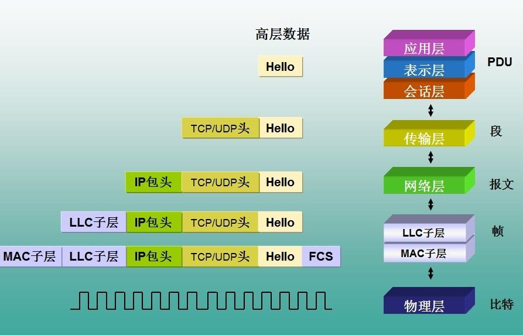

## 4. HTTP 请求

### 4.1. 什么是 HTTP 请求

将浏览器端的数据发送给服务器，称为 HTTP 请求。而把这些数据封装成一个对象，这个对象就是 <font color=red>**request 请求对象**</font>。

### 4.2. 查看 HTTP 请求

如何查看HTTP协议的内容(Chrome 按F12)

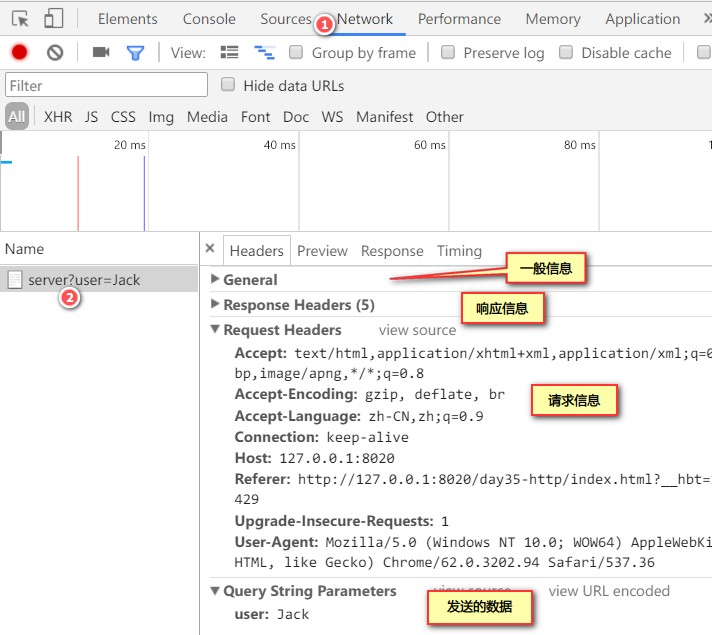

### 4.3. HTTP 请求报文格式

HTTP 请求由以下四个部分组成：

1. 请求行
2. 请求头：由多组键值对组成
3. 空行
4. 请求体：GET 没有请求体，POST 方法数据是以请求体的方式发送给服务器

#### 4.3.1. 浏览器中查看请求信息

##### 4.3.1.1. GET 方法请求

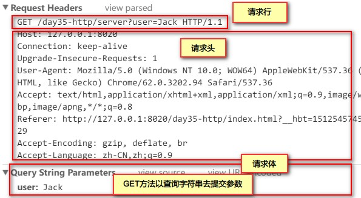

##### 4.3.1.2. POST 方法请求

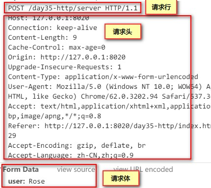

#### 4.3.2. 请求行

**一个完整的请求行包括**：

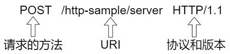

1. 请求的方式。其中 GET 和 POST 是最常见的 HTTP 方式，除此以外还包括 DELETE、HEAD、OPTIONS、PUT、TRACE。
2. 请求的 URI。如上图：`/http-sample/server`
3. 使用的协议和版本。如上图：`HTTP/1.1`
    - 1.0 版：每次浏览器发送请求给服务器获取 1 个 web 资源之后断开
    - 1.1 版：每次浏览器发送请求给服务器获取多个 web 资源之后断开，1.1 的效率更高。

<font color=red>一个网页如果有多个图片，每个图片都会发送一次请求</font>

#### 4.3.3. 请求头

请求头格式为 `属性名:属性值`，服务端会根据请求头来获取客户端的信息

> Tips: 不是每次请求都会出现所有的请求头

常见请求头如下：

- **Referer**：浏览器上一次请求的网页地址，即从哪一个页面跳转过来的
- **If-Modified-Since**：浏览器在本地缓存当前网页的时间，时区差8个小时
- **Cookie**：在浏览器端以<font color=red>**字符串的键值对**</font>，保存服务器发送过来的数据
- **User-Agent**：得到客户端的操作系统信息和浏览器的类型
- **Connection**：当前 TCP 连接的状态，keep-alive 保持连接，close 关闭连接。在 HTTP1.0 中，每次请求结束就关闭连接；在 HTTP1.1 中，请求会保存连接状态。目前广泛使用 HTTP1.1 的版本。
- **Host**：请求的服务器主机名和端口号
- **Content-Length**：客户端请求数据(请求体)的长度，<font color=red>**用于 POST 方法**</font>
- **Content-Type**：请求的内容类型，POST 方法时请求类型。GET 方法没有这个请求头。如果使用 POST 请求将表单的数据以 `键=值` 的方式发送给服务器，则它的值是：

```properties
Content-Type: application/x-www-form-urlencoded
```

- **Accept**：请求中支持的 MIME 类型。MIME 格式：

```
大类型/小类型[;可选参数]
```

如：`text/css`、`text/javascript`、`text/html;charset=utf-9`

MIME(Multipurpose Internet Mail Extensions)多用途互联网邮件扩展类型。是设定某种**扩展名**的文件用一种应用程序来**打开的方式类型**，当该扩展名文件被访问的时候，浏览器会自动使用指定应用程序来打开。多用于指定一些客户端自定义的文件名，以及一些媒体文件打开方式。如：jpg，txt，mp4

- **Accept-Language**：浏览器允许的语言和国家，两个小写字母表示语言，大写的两个字母代表国家。如 zh-CN 表示中文-中国 zh-HK zh-TW, en-US，en-GB
- **Accept-Encoding**：请求的数据支持的压缩类型，如 gzip 等

#### 4.3.4. 请求体

客户端发送给服务器的数据，只有 POST 方法参数通过有请求体发送数据的，GET 方法通过字符串的形式发送，没有请求体。

### 4.4. GET 和 POST 请求的优缺点和误区

#### 4.4.1. get请求与post请求的区别

|                   |                             POST 方式                              |                               GET 方式                                |
| ----------------- | ----------------------------------------------------------------- | -------------------------------------------------------------------- |
| **地址栏**         | 地址是不带参数的，参数是在请求体中发送                                   | 地址栏是带参数，参数通过查询字符串发送数据                                  |
| **传输数据大小**   | 理论上数据发送没有限制，如：用于文件上传                                 | 一般最大1K，不同的浏览器有不同的限制。因为参数都做为url一部分，所以受url长度限制 |
| **安全性**         | 高。不会作为 url 的一部分，不会被缓存、保存在服务器日志、以及浏览器浏览记录中 | 低。请求参数会被完整保留在浏览器历史记录里                                  |
| **缓存**          | 不使用浏览器的缓存，除非手动设置                                        | 会被浏览器主动缓存，如果发现服务器网页没有修改。下次访问就使用缓存              |
| **请求速度**       | 慢                                                                 | 快                                                                    |
| **支持的数据类型** | 支持各种的数据类型                                                   | 只能发送 ASCII 字符                                                    |
| **使用场景**       | 用于修改和写入数据                                                   | 一般用于搜索排序和筛选之类的操作，目的是资源的获取，读取数据                   |
| **数据包个数**     | 产生两个TCP数据包                                                    | 产生一个TCP数据包                                                       |

> Tips: 对于 GET 方式的请求，浏览器会把请求头和请求体一并发送出去；而对于 POST，浏览器先发送请求头，服务器响应 100 continue，浏览器再发送请求体。

#### 4.4.2. 为什么 get 比 post 更快

post 请求的过程：

1. 浏览器请求tcp连接（第一次握手）
2. 服务器答应进行tcp连接（第二次握手）
3. 浏览器确认，并发送post请求头（第三次握手，这个报文比较小，所以http会在此时进行第一次数据发送）
4. 服务器返回100 Continue响应
5. 浏览器发送数据
6. 服务器返回200 OK响应

get 请求的过程：

1. 浏览器请求tcp连接（第一次握手）
2. 服务器答应进行tcp连接（第二次握手）
3. 浏览器确认，并发送get请求头和数据（第三次握手，这个报文比较小，所以http会在此时进行第一次数据发送）
4. 服务器返回200 OK响应

get 请求比 post 请求更快的原因总结：

1. post 请求包含更多的请求头，因为 post 需要在请求的 body 部分包含数据，所以会多了几个数据描述部分的首部字段（如：content-type）
2. 最重要的一条，**post 在真正接收数据之前会先将请求头发送给服务器进行确认，然后才真正发送数据**
3. get 会将返回的数据缓存起来，而 post 不会
> 测试：使用 ajax 采用 get 方式请求静态数据（比如 html 页面，图片）的时候，如果两次传输的数据相同，第二次以后消耗的时间将会在10ms以内（chrome测试），而 post 每次消耗的时间都差不多。经测试，chrome 和 firefox 下如果检测到 get 请求的是静态资源，则会缓存，如果是数据，则不会缓存，但是 IE 什么都会缓存起来，当然，应该没有人用 post 去获取静态数据
4. post 不能进行管道化传输

#### 4.4.3. get 传参最大长度的理解误区

**总结**：

1. http协议并未规定get和post的长度限制
2. get的最大长度限制是因为浏览器和web服务器限制了URL的长度
3. 不同的浏览器和web服务器，限制的最大长度不一样
4. 要支持IE，则最大长度为2083byte，若支持Chrome，则最大长度8182byte

**误解**：

1. 首先即使get有长度限制，也是限制的整个URL的长度，而不仅仅是参数值数据长度，http协议从未规定get/post的请求长度限制是多少
2. 所谓的请求长度限制是由浏览器和web服务器决定和设置的，各种浏览器和web服务器的设定均不一样，这依赖于各个浏览器厂家的规定或者可以根据web服务器的处理能力来设定。IE 和 Safari 浏览器 限制 2k，Opera 限制4k，Firefox 限制 8k（非常老的版本 256byte），如果超出了最大长度，大部分的服务器直接截断，也有一些服务器会报414错误。
3. 各个浏览器和web服务器的最大长度总结

各类浏览器的限制：

- IE：IE浏览器（Microsoft Internet Explorer） 对url长度限制是2083（2K+53），超过这个限制，则自动截断（若是form提交则提交按钮不起作用）。
- firefox：firefox（火狐浏览器）的url长度限制为 65536字符，但实际上有效的URL最大长度不少于100,000个字符。
- chrome：chrome（谷歌）的url长度限制超过8182个字符返回本文开头时列出的错误。
- Safari：Safari的url长度限制至少为 80 000 字符。
- Opera：Opera 浏览器的url长度限制为190 000 字符。Opera9 地址栏中输入190000字符时依然能正常编辑。

服务器的限制：

- Apache：Apache能接受url长度限制为8 192 字符
- IIS：Microsoft Internet Information Server(IIS)能接受url长度限制为16384个字符。这个是可以通过修改的（IIS7）`configuration/system.webServer/security/requestFiltering/requestLimits@maxQueryStringsetting.`

## 5. HTTP 响应

### 5.1. 什么是 HTTP 响应

由服务器将数据返回给浏览器，称为响应。将其封装成一个对象，这个对象就是<font color=red>** response 响应对象**</font>。

### 5.2. 响应信息的组成

- **响应行（状态行）**：一行数据，包括：协议版本，状态码及状态描述。
- **响应头**：由多个键值对组成
- **响应体**：由服务器发送给浏览器的数据

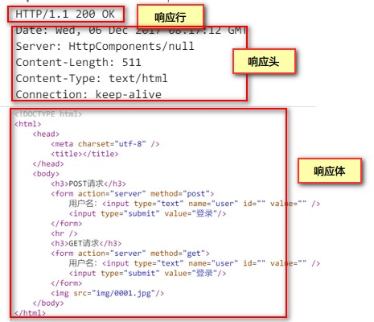

#### 5.2.1. 响应行

```
HTTP/1.1 304 Not Modified
HTTP/1.1 200 OK
```

- 协议和版本：如：HTTP/1.1
- 状态码：如：304/200
- 状态信息：如：Not Modified/OK

#### 5.2.2. 响应头

常用响应头信息说明：

- `Location: http://www.moon.com/index.jsp`：页面在跳转的时候，下一个将要跳转到的页面
- `Server:apache tomcat`：服务器的名字
- `Content-Encoding: gzip`：服务器支持的压缩类型。有些资源如果比较大，先在服务器压缩，再传给浏览器。由浏览器去解压，减少网络带宽的占用。
- `Content-Length: 80`：服务器响应返回的数据长度
- `Content-Language: zh-cn`：服务器内容支持的语言和国家
- `Content-Type: text/html;  charset=utf-8`：内容的类型和字符集(MIME类型) 响应内容的MIME类型`text/html;charset=utf-8`表示服务器响应的内容是文本的HTML类型，字符集是utf-8
- `Last-Modified: Tue, 11 Jul  2000 18:23:51 GMT`：服务器上文件最后修改的时间，相差8个小时
- `Refresh:  1;url=http://www.moon.com`：过1秒(指定时间)以后，跳转到URL指定的另一个页面
- `Content-Disposition:  attachment; filename=abc.zip`：使用附件的方式**下载**一个资源，资源名是filename后面的值，而不是直接在浏览器打开
- `Connection:  close/Keep-Alive`：服务器的连接状态：keep-alive连接或close关闭
- `Date: Tue, 11 Jul 2000  18:23:51 GMT`：服务器响应的时间，差8个小时

#### 5.2.3. 响应体

响应体就是服务器发送给浏览器的数据，如果是网页，就可以看到源代码。如果是图片，则是一些二进制的数据。

### 5.3. HTTP 状态码

当浏览者访问一个网页时，浏览者的浏览器会向网页所在服务器发出请求。当浏览器接收并显示网页前，此网页所在的服务器会返回一个包含 HTTP 状态码的信息头（server header）用以响应浏览器的请求。无论是请求成功还是失败都会有对应的状态码返回，此状态码就是 HTTP 状态码（HTTP Status Code）。它是定位请求错误的主要依据。下面是常见的 HTTP 状态码：

|  状态码  |                                              含义                                               |
| ------- | ---------------------------------------------------------------------------------------------- |
| **200** | 服务器正常响应回来，并且正确返回数据                                                                 |
| **301** | 资源（网页等）被永久转移到其它 URL                                                                  |
| **302** | 服务器让浏览器进行页面的跳转                                                                        |
| **304** | 页面使用的是浏览器缓存，没有从服务器上去下载网页                                                       |
| **404** | 指定页面找不到。请求的 Web 资源不存在，打错地址，大小写敏感。如 `HTTP/1.1 404 Not Found`                 |
| **405** | 重写了 `doPost` 方法，没有写 `doGet` 方法，但是浏览器表单提交使用 get 方法提交，就会出现 405 错误，反之亦然 |
| **500** | 服务器出现异常，一般是Java程序代码问题                                                               |

#### 5.3.1. HTTP 状态码的分类

HTTP 状态码由三个十进制数字组成，第一个十进制数字定义了状态码的类型，后两个数字没有分类的作用。HTTP 状态码共分为 5 种类型：

|  分类  |                   说明                    |
| :---: | ---------------------------------------- |
| `1**` | 信息，服务器收到请求，需要请求者继续执行操作     |
| `2**` | 成功，请求操作被成功接收并处理完毕             |
| `3**` | 重定向，需要进一步的操作以完成请求             |
| `4**` | 客户端错误，请求包含语法错误或服务器无法完成请求 |
| `5**` | 服务器错误，服务器在处理请求的过程中发生了错误   |

#### 5.3.2. HTTP 状态码列表

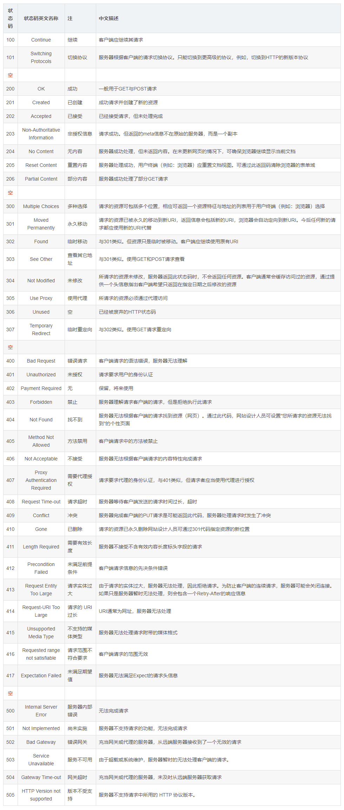

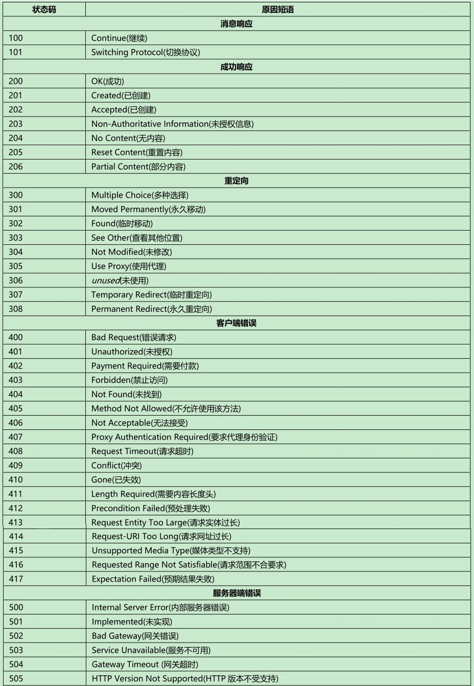

## 6. HTTP 扩展内容

### 6.1. HTTP 长连接和短连接

- HTTP 短连接：浏览器和服务器每进行一次 HTTP 操作，就建立一次连接，任务结束就中断连接。HTTP/1.0 默认使用的是短连接。
- HTTP 长连接：指的是复用 TCP 连接。多个 HTTP 请求可以复用同一个 TCP 连接，这就节省了 TCP 连接建立和断开的消耗。

从 **HTTP/1.1 起，默认使用长连接**。要支持长连接，需要客户端和服务器的 HTTP 首部的 Connection 都要设置为 `keep-alive`。

### 6.2. HTTP1.1 和 HTTP2.0 的区别

HTTP/2.0 相比 HTTP/1.1 支持的特性：

- **新的二进制格式**：HTTP1.1 基于文本格式传输数据；HTTP2.0 采用二进制格式传输数据，解析更高效。
- **多路复用**：在一个连接里，允许同时发送多个请求或响应，并且这些请求或响应能够并行的传输而不被阻塞，避免 HTTP1.1 出现的“队头堵塞”问题。
- **头部压缩**：HTTP1.1 的 header 带有大量信息，而且每次都要重复发送；**HTTP2.0 把 header 从数据中分离，并封装成头帧和数据帧，使用特定算法压缩头帧，有效减少头信息大小。并且 HTTP2.0 在客户端和服务器端记录了之前发送的键值对，对于相同的数据，不会重复发送**。比如请求a发送了所有的头信息字段，请求b则<u>只需要发送差异数据</u>，这样可以减少冗余数据，降低开销。
- **服务端推送**：HTTP2.0 允许服务器向客户端推送资源，无需客户端发送请求到服务器获取。

## 7. HTTPS 协议

### 7.1. 概述

HTTP 被用于在 Web 浏览器和网站服务器之间传递信息，但以明文方式发送内容，不提供任何方式的数据加密，因此存在安全问题。如果攻击者截取了 Web 浏览器和网站服务器之间的传输报文，就可以直接获取到其中的信息，因此 HTTP 不适合传输一些敏感信息，比如身份证号码、密码等。

HTTPS（全称：Hypertext Transfer Protocol over Secure Socket Layer），是以安全为目标的 HTTP 通道，简单讲是加密安全版的 HTTP 协议。它在 HTTP 中加入 SSL 层，SSL 依靠证书来验证服务器的身份，并对浏览器和服务器之间的通信进行数据加密，以保障数据传输的安全性，<font color=red>**其默认端口号是 443**</font>。即 HTTPS 的安全基础是 SSL。

### 7.2. 数字证书

服务端可以向证书颁发机构 CA 申请证书，以避免中间人攻击（防止证书被篡改）。证书包含三部分内容：**证书内容、证书签名算法和签名**。其中『签名』是为了验证身份。

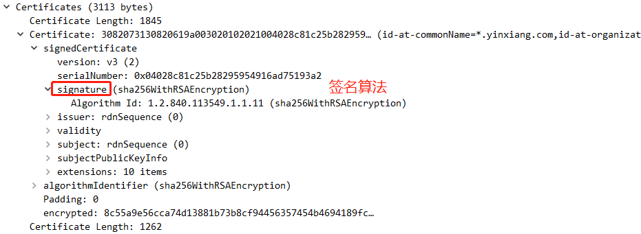

服务端把证书传输给浏览器，浏览器从证书里取公钥。证书可以证明该公钥对应本网站。

#### 7.2.1. 数字签名的制作过程

1. CA 使用证书签名算法对证书内容进行 hash 运算。
2. 对 hash 运算后的值使用 CA 的私钥加密，得到数字签名。

#### 7.2.2. 浏览器验证过程

1. 获取证书，得到证书内容、证书签名算法和数字签名。
2. 用 CA 机构的公钥对数字签名解密（由于是浏览器信任的机构，所以浏览器会保存它的公钥）。
3. 用证书里的签名算法对证书内容进行 hash 运算。
4. 比较解密后的数字签名和对证书内容做 hash 运算后得到的哈希值，相等则表明证书可信。

### 7.3. HTTPS 加密传输流程

HTTPS 加密传输流程图：

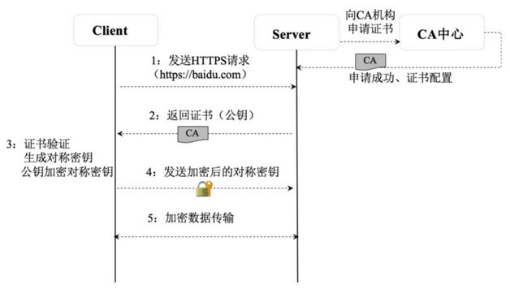

1. **发送 HTTPS 请求**：SSL 客户端通过 TCP 和服务器建立连接之后（443 端口），并且在一般的 tcp 连接协商（三次握手）过程中请求证书，**协商加密算法**。即客户端发出一个消息给服务器，这个消息里面包含了客户端自己要使用的 TLS 版本，支持的加密算法，要访问的域名，给服务端生成的一个随机数（Nonce）等。需要提前告知服务器想要访问的域名，以便服务器发送相应的域名的证书过来。

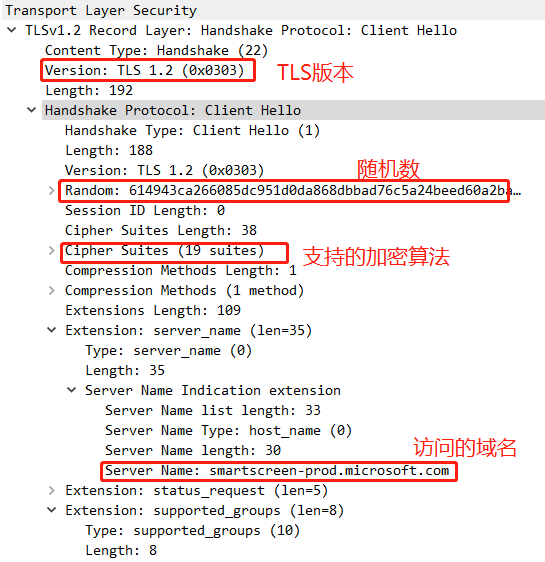

2. **证书返回**：服务器端在收到消息后，SSL 的服务器端会回应客户端一个数据包，这里面确定了本次通信所**选中的加密算法**，然后服务器向客户端返回2个证书。证书里面包含了服务器信息、域名、申请证书的公司，公钥、数据加密算法等；第2个证书是第1个证书的签发机构（CA）的证书。

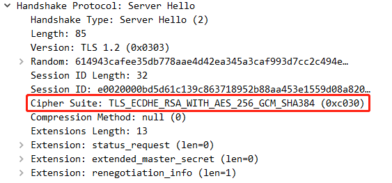 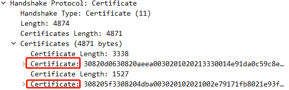

3. **证书验证**：Client 在收到服务器返回的证书后，判断签发该证书的公共签发机构是否正确，并**使用证书的认证机构 CA 公开发布的 RSA 公钥来确认该证书的签名是否有效**，客户端还会确保证书中列出的域名就是它正在连接的域名。如果客户端确认证书有效，则<u>**生成对称密钥，并使用公钥将对称密钥加密**</u>。下图表明证书认证成功。

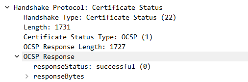 

4. **密钥交换**：客户端将加密后的对称密钥发送给服务器，服务器在接收到对称密钥后使用私钥解密。

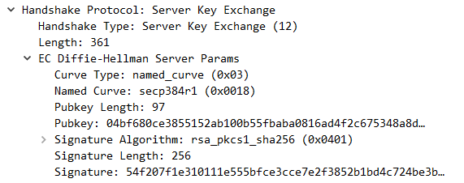 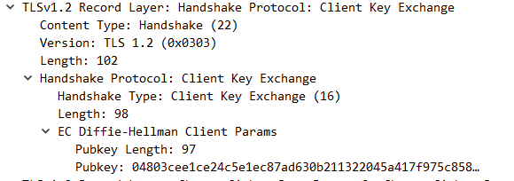

5. **数据加密和传输**：最终客户端和服务器就完成了密钥对的交换，在之后的数据传输过程中，客户端使用使用服务器的公共秘钥进行加密后向服务端发送数据，而服务器使用它的私钥对数据进行解密。客户端和服务端都基于对称加密（加密和解密使用相同密钥的加密算法）对数据加密后在网络上传输，保证了网络数据传输的安全性。

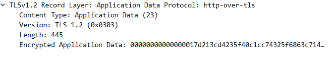

### 7.4. HTTPS 与 HTTP 的区别

1. HTTP 是超文本传输协议，信息是明文传输；HTTPS 则是具有安全性的 SSL 加密传输协议。
2. HTTP 和 HTTPS 用的端口不一样，HTTP 默认端口是 80，HTTPS 默认端口是 443。
3. HTTPS 协议需要到 CA 机构申请证书，一般需要一定的费用。
4. HTTP 运行在 TCP 协议之上；HTTPS 运行在 SSL 协议之上，SSL 运行在 TCP 协议之上。

## 8. DNS 服务器

### 8.1. DNS 概述

DNS 服务器 Domain Name Server 域名解析服务器。

例如：将域名 www.baidu.com 解析成 IP 地址 119.75.216.20

### 8.2. DNS 的解析过程

1. 浏览器搜索自己的 DNS 缓存
2. 若没有，则搜索操作系统中的 DNS 缓存和 hosts 文件
3. 若没有，则操作系统将域名发送至本地域名服务器，本地域名服务器查询自己的 DNS 缓存，查找成功则返回结果，否则依次向<u>**根域名服务器、顶级域名服务器、权限域名服务器**</u>发起查询请求，最终返回 IP 地址给本地域名服务器
4. 本地域名服务器将得到的 IP 地址返回给操作系统，同时操作系统自己也将 IP 地址缓存起来
5. 操作系统将 IP 地址返回给浏览器，同时浏览器自己也将 IP 地址缓存起来
6. 浏览器得到域名对应的 IP 地址

## 9. CDN 的原理

CDN（Content Delivery Network，内容分发网络）指基于部署在各地的机房服务器，通过中心平台的负载均衡、内容分发、调度的能力，使用户就近获取所需内容，降低网络延迟，提升用户访问的响应速度和体验度。

### 9.1. CDN 的关键技术

CDN 的关键技术包括：内容发布、内容路由、内容交换和性能管理。

- **内容发布**：借助建立索引、缓存、流分裂、组播等技术，将内容发布到网络上距离用户最近的中心机房。
- **内容路由**：通过内容路由器中的重定向（DNS）机制，在多个中心机房的服务器上负载均衡用户的请求，使用户从最近的中心机房获取数据。
- **内容交换**：根据内容的可用性、服务器的可用性及用户的背景，在缓存服务器上利用应用层交换、流分裂、重定向等技术，智能地平衡负载流量。
- **性能管理**：通过内部和外部监控系统，获取网络部件的信息，测量内容发布的端到端性能（包丢失、延时、平均带宽、启动时间、帧速率等），保证网络处于最佳运行状态。

### 9.2. CDN 的主要特点

- **本地缓存（Cache）加速**：将用户经常访问的数据（尤其静态数据）缓存在本地，以提升系统的响应速度和稳定性。
- **镜像服务**：消除不同运营商之间的网络差异，实现跨运营商的网络加速，保证不同运营商网络中的用户都能得到良好的网络体验。
- **远程加速**：利用 DNS 负载均衡技术为用户选择服务质量最优的服务器，加快用户远程访问的速度。
- **带宽优化**：自动生成服务器的远程镜像缓存服务器，远程用户在访问时从就近的缓存服务器上读取数据，减少远程访问的带宽，分担网络流量，并降低原站点的 Web 服务器负载等。
- **集群抗攻击**：通过网络安全技术和 CDN 之间的智能冗余机制，可以有效减少网络攻击对网站的影响。

### 9.3. 内容分发系统

将用户请求的数据分发到就近的各个中心机房，以保障为用户提供快速、高效的内容服务。缓存的内容包括静态图片、视频、文本、用户最近访问的 JSON 数据等。缓存的技术包括内存环境、分布式缓存、本地文件缓存等。缓存的策略主要考虑缓存更新、缓存淘汰机制。

### 9.4. 负载均衡系统

负载均衡系统是整个 CDN 系统的核心，负载均衡根据当前网络的流量分布、各中心机房服务器的负载和用户请求的特点将用户的请求负载到不同的中心机房或不同的服务器上，以保障用户内容访问的流畅性。负载均衡系统包括全局负载均衡（ GSLB ）和本地负载均衡（SLB）。

- **全局负载均衡**主要指跨机房的负载均衡，通过 DNS 解析或者应用层重定向技术将用户的请求负载到就近的中心机房上。
- **本地负载均衡**主要指机房内部的负载均衡，一般通过缓存服务器，基于 LVS、Nginx、服务网关等技术实现用户访问的负载。

### 9.5. 管理系统

管理系统分为运营管理和网络管理子系统。网络管理系统主要对整个 CDN 网络资源的运行状态进行实时监控和管理。运营管理指对 CDN 日常运维业务的管理，包括用户管理、资源管理、流量计费和流量限流等。

## 10. 网络相关扩展内容

### 10.1. 浏览器中输入 URL 返回页面过程

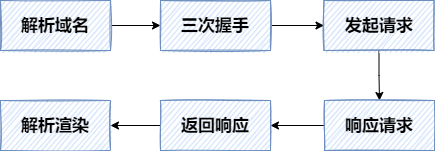

1. **解析域名**，找到主机 IP。
2. 浏览器利用 IP 直接与网站主机通信，**三次握手**，建立 TCP 连接。浏览器会以一个随机端口向服务端的 web 程序 80 端口发起 TCP 的连接。
3. 建立 TCP 连接后，浏览器向主机发起一个 HTTP 请求。
4. **服务器响应请求，返回响应数据**。
5. **浏览器解析响应内容，进行渲染**，呈现给用户。

### 10.2. ARP 协议

ARP 解决了同一个局域网上的主机和路由器 IP 和 MAC 地址的解析。

- 每台主机都会在自己的ARP缓冲区中建立一个ARP列表，以表示IP地址和MAC地址的对应关系。
- 当源主机需要将一个数据包要发送到目的主机时，会首先检查自己 ARP列表中是否存在该 IP地址对应的MAC地址，如果有，就直接将数据包发送到这个MAC地址；如果没有，就向本地网段发起一个ARP请求的广播包，查询此目的主机对应的MAC地址。此ARP请求数据包里包括源主机的IP地址、硬件地址、以及目的主机的IP地址。
- 网络中所有的主机收到这个ARP请求后，会检查数据包中的目的IP是否和自己的IP地址一致。如果不相同就忽略此数据包；如果相同，该主机首先将发送端的MAC地址和IP地址添加到自己的ARP列表中，如果ARP表中已经存在该IP的信息，则将其覆盖，然后给源主机发送一个 ARP响应数据包，告诉对方自己是它需要查找的MAC地址。
- 源主机收到这个ARP响应数据包后，将得到的目的主机的IP地址和MAC地址添加到自己的ARP列表中，并利用此信息开始数据的传输。
- 如果源主机一直没有收到ARP响应数据包，表示ARP查询失败。

### 10.3. CSRF（Cross-site request forgery 跨站请求伪造）

CSRF 跨站请求伪造，这是一种网络攻击手段，迫使最终用户在当前通过身份验证的 Web 应用程序上执行不需要的操作。CSRF 攻击专门针对状态改变请求，而不是数据窃取，因为攻击者无法查看对伪造请求的响应。
