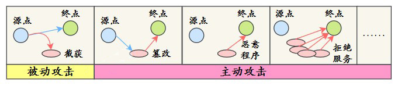
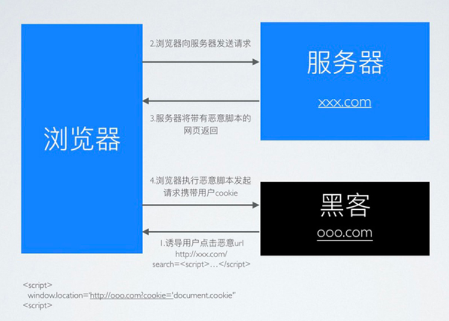
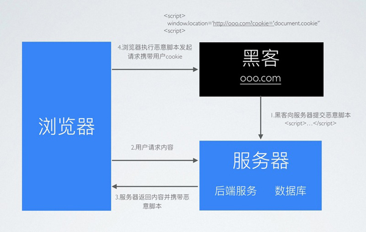
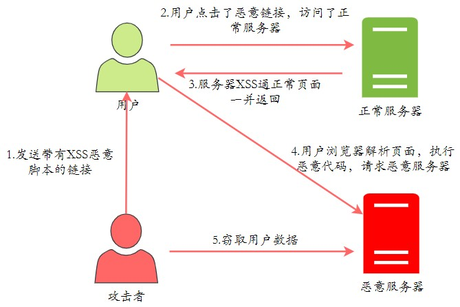
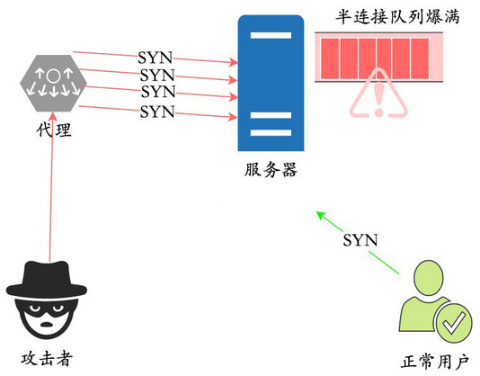
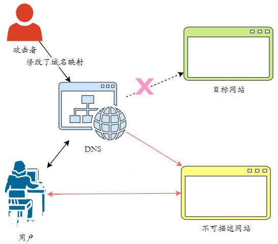
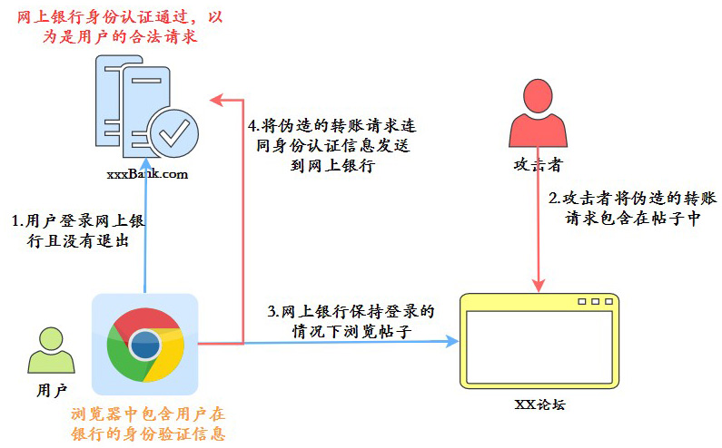

## 1. 网络安全概述

网络安全攻击主要分为两种类型：**被动攻击**和**主动攻击**。

- **被动攻击**：是指攻击者从网络上窃听他人的通信内容，通常把这类攻击称为截获，被动攻击主要有两种形式：消息内容泄露攻击和流量分析攻击。由于攻击者没有修改数据，使得这种攻击很难被检测到。
- **主动攻击**：直接对现有的数据和服务造成影响，常见的主动攻击类型有：
    - **篡改**：攻击者故意篡改网络上送的报文，甚至把完全伪造的报文传送给接收方。
    - **恶意程序**：恶意程序种类繁多，包括计算机病毒、计算机蠕虫、特洛伊木马、后门入侵、流氓软件等等。
    - **拒绝服务 Dos**：攻击者向服务器不停地发送分组，使服务器无法提供正常服务。

## 2. XSS 概述

黑客在浏览器中插入一段恶意 JavaScript 脚本，窃取用户的隐私信息、冒充用户身份进行操作。这就是 XSS 攻击(Cross-Site Scripting，跨站脚本攻击)。

因为浏览器无法区分脚本是被恶意注入的还是正常的内容，它都会执行，况且 HTML 非常灵活，可以在任何时候对它进行修改。

### 2.1. XSS 的类型

- 反射型 XSS (也叫非持久型 XSS)：恶意 JavaScript 脚本属于用户发送给网站请求中的一部分，随后网站又将这部分返回给用户，恶意脚本在页面中被执行。一般发生在前后端一体的应用中，服务端逻辑会改变最终的网页代码。
> Tips: 目前更流行前后端分离的项目，反射型 XSS 无用武之地。
- 基于 DOM 的 XSS：因为网页本身的 JavaScript 也是可以改变 HTML 的，黑客正是利用这一点来实现插入恶意脚本。
- 存储型 XSS (也叫持久型 XSS)：黑客将恶意 JavaScript 脚本长期保存在服务端数据库中，用户一旦访问相关页面数据，恶意脚本就会被执行。常见于搜索、微博、社区贴吧评论等。

### 2.2. 不同类型 XSS 的区别

**反射型**：

**基于DOM型**：

**存储型**：

### 2.3. XSS 攻击示例

XSS 的攻击方式就是想办法让用户的浏览器去执行一些这个网页中原本不存在的前端代码。下面以反射型举例子，流程图如下：

1. 攻击者构造出特殊的 URL，其中包含恶意代码。
2. 用户打开带有恶意代码的 URL 时，访问正常网站服务器。
3. 网站服务端将恶意代码从 URL 中取出，拼接在 HTML 中返回给浏览器。
4. 用户浏览器接收到响应后解析执行，混在其中的恶意代码也被执行，请求恶意服务器，发送用户数据。
5. 攻击者就可以窃取用户的数据，以此冒充用户的行为，调用目标网站接口执行攻击者指定的操作。

### 2.4. 应对 XSS 攻击的解决方案

- 对输入进行过滤，过滤标签等，只允许合法值。
- HTML 转义。
- 对于链接跳转，如`<a href="xxx">` 等，要校验内容，禁止以 script 开头的非法链接。
- 限制输入长度。

## 3. SYN Flood 攻击

### 3.1. 概述

SYN Flood 是一种典型的 DDos 攻击，它在短时间内，<u>**伪造不存在的 IP 地址**</u>，向服务器发送大量 SYN 报文。当服务器回复 SYN+ACK 报文后，不会收到 ACK 回应报文，那么 SYN 队列里的连接旧不会出对队，久而久之就会占满服务端的 SYN 接收队列（半连接队列），使得服务器不能为正常用户服务。

> 『半连接队列』的定义详见[《Java基础-网络编程》笔记](/Java/Java基础-网络编程)

### 3.2. 解决方案

主要的解决方案有 **syn cookie** 和 **SYN Proxy 防火墙**等。

- **syn cookie**：在收到 SYN 包后，服务器根据一定的方法，以数据包的源地址、端口等信息为参数计算出一个 cookie 值作为自己的 SYNACK 包的序列号，回复 SYN+ACK 后，服务器并不立即分配资源进行处理，等收到发送方的 ACK 包后，重新根据数据包的源地址、端口计算该包中的确认序列号是否正确，如果正确则建立连接，否则丢弃该包。
- **SYN Proxy 防火墙**：服务器防火墙会对收到的每一个 SYN 报文进行代理和回应，并保持半连接。等发送方将 ACK 包返回后，再重新构造 SYN 包发到服务器，建立真正的 TCP 连接。

## 4. DNS 劫持

### 4.1. 概述

DNS 劫持即域名劫持，是通过将原域名对应的 IP 地址进行替换，从而使用户访问到错误的网站，或者使用户无法正常访问网站的一种攻击方式。

域名劫持往往只能在特定的网络范围内进行，范围外的 DNS 服务器能够返回正常的 IP 地址。攻击者可以冒充原域名所属机构，通过电子邮件的方式修改组织机构的域名注册信息，或者将域名转让给其它主持，并将新的域名信息保存在所指定的 DNS 服务器中，从而使用户无法对原域名来进行解析以访问目标地址。

### 4.2. DNS 劫持的步骤

1. 获取要劫持的域名信息：攻击者会首先访问域名查询要劫持的站点的域名信息。
2. 控制域名响应的 E-Mail 账号：在获取到域名信息后，攻击者通过暴力破解或者专门的方法破解公司注册域名时使用的 E-mail 账号所对应的密码，更高级的攻击者甚至能够直接对 E-Mail 进行信息窃取。
3. 修改注册信息：当攻击者破解了 E-Mail 后，会利用相关的更改功能修改该域名的注册信息，包括域名拥有者信息，DNS 服务器信息等。
4. 使用 E-Mail 收发确认函：在修改完注册信息后，攻击者 E-Mail 在真正拥有者之前收到修改域名注册信息的相关确认信息，并回复确认修改文件，待网络公司恢复已成功修改信件后，攻击者便成功完成 DNS 劫持。

### 4.3. 应对 DNS 劫持

- 直接通过 IP 地址访问网站，避开 DNS 劫持。
- 由于域名劫持往往只能在特定的网络范围内进行，因此一些高级用户可以通过网络设置让 DNS 指向正常的域名服务器以实现对目标网址的正常访问，例如计算机首选 DNS 服务器的地址固定为 8.8.8.8。

## 5. CSRF（Cross-site request forgery 跨站请求伪造）

### 5.1. CSRF 概述

CSRF 跨站请求伪造（英文全称是 Cross-site request forgery），这是一种网络攻击手段，迫使最终用户在当前通过身份验证的 Web 应用程序上执行非本意的操作。CSRF 攻击专门针对状态改变请求，而不是数据窃取，因为攻击者无法查看对伪造请求的响应。

### 5.2. CSRF 典型例子

1. 用户登陆银行，没有退出，浏览器包含了用户在银行的身份认证信息。
2. 攻击者将伪造的转账请求，包含在在帖子。
3. 用户在银行网站保持登陆的情况下，浏览帖子。
4. 将伪造的转账请求连同身份认证信息，发送到银行网站。
5. 银行网站看到身份认证信息，以为就是 用户的合法操作，最后造成用户资金损失。

### 5.3. 解决方案

- **检查 Referer 字段**：HTTP 头中的 Referer 字段记录了该 HTTP 请求的来源地址。在通常情况下，访问一个安全受限页面的请求来自于同一个网站，而如果黑客要对其实施 CSRF 攻击，一般只能在黑客自己的网站构造请求。因此，可以通过验证 Referer 值来防御 CSRF 攻击。
- **添加校验 token**：以在 HTTP 请求中以参数的形式加入一个随机产生的 token，并在服务器端建立一个拦截器来验证这个 token，如果请求中没有 token 或者 token 内容不正确，则认为可能是 CSRF 攻击而拒绝该请求。
- **敏感操作多重校验**：对一些敏感的操作，除了需要校验用户的认证信息，还可以通过邮箱确认、验证码确认这样的方式多重校验。

## 6. DoS、DDoS、DRDoS 攻击

### 6.1. 概念

- **DOS**: (Denial of Service) 拒绝服务，一切能引起拒绝行为的攻击都被称为 DOS 攻击。最常见的 DoS 攻击就有**计算机网络宽带攻击**、**连通性攻击**。
- **DDoS**: (Distributed Denial of Service)，分布式拒绝服务。是指处于不同位置的多个攻击者同时向一个或几个目标发动攻击，或者一个攻击者控制了位于不同位置的多台机器，并利用这些机器对受害者同时实施攻击。主要形式有流量攻击和资源耗尽攻击，常见的 DDoS 攻击有：**SYN Flood、Ping of Death、ACK Flood、UDP Flood** 等。
- **DRDoS**: (Distributed Reflection Denial of Service)，分布式反射拒绝服务，该方式靠的是发送大量带有被害者 IP 地址的数据包给攻击主机，然后攻击主机对 IP 地址源做出大量回应，从而形成拒绝服务攻击。

### 6.2. 防范 DDoS 的方案

针对 DDoS 中的流量攻击，最直接的方法是增加带宽，理论上只要带宽大于攻击流量就可以了，但是这种方法成本非常高。在有充足带宽的前提下，应该尽量提升路由器、网卡、交换机等硬件设施的配置。

针对资源耗尽攻击，可以升级主机服务器硬件，在网络带宽得到保证的前提下，使得服务器能够有效对抗海量的 SYN 攻击包。也可以安装专业的抗 DDoS 防火墙，从而对抗 SYN Flood 等流量型攻击。瓷碗，负载均衡，CDN 等技术都能有效对抗 DDos 攻击。
