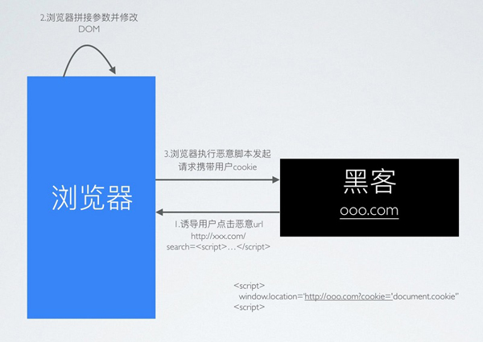

## 1. 网络安全概述

网络安全攻击主要分为两种类型：**被动攻击**和**主动攻击**。

- **被动攻击**：是指攻击者从网络上窃听他人的通信内容，通常把这类攻击称为截获，被动攻击主要有两种形式：消息内容泄露攻击和流量分析攻击。由于攻击者没有修改数据，使得这种攻击很难被检测到。
- **主动攻击**：直接对现有的数据和服务造成影响，常见的主动攻击类型有：
    - **篡改**：攻击者故意篡改网络上送的报文，甚至把完全伪造的报文传送给接收方。
    - **恶意程序**：恶意程序种类繁多，包括计算机病毒、计算机蠕虫、特洛伊木马、后门入侵、流氓软件等等。
    - **拒绝服务 Dos**：攻击者向服务器不停地发送分组，使服务器无法提供正常服务。

## 2. XSS 概述

黑客在浏览器中插入一段恶意 JavaScript 脚本，窃取用户的隐私信息、冒充用户身份进行操作。这就是 XSS 攻击(Cross-Site Scripting，跨站脚本攻击)。

因为浏览器无法区分脚本是被恶意注入的还是正常的内容，它都会执行，况且 HTML 非常灵活，可以在任何时候对它进行修改。

### 2.1. XSS 的类型

- 反射型 XSS (也叫非持久型 XSS)：恶意 JavaScript 脚本属于用户发送给网站请求中的一部分，随后网站又将这部分返回给用户，恶意脚本在页面中被执行。一般发生在前后端一体的应用中，服务端逻辑会改变最终的网页代码。
> Tips: 目前更流行前后端分离的项目，反射型 XSS 无用武之地。
- 基于 DOM 的 XSS：因为网页本身的 JavaScript 也是可以改变 HTML 的，黑客正是利用这一点来实现插入恶意脚本。
- 存储型 XSS (也叫持久型 XSS)：黑客将恶意 JavaScript 脚本长期保存在服务端数据库中，用户一旦访问相关页面数据，恶意脚本就会被执行。常见于搜索、微博、社区贴吧评论等。

### 2.2. 不同类型 XSS 的区别

**反射型**：

**基于DOM型**：

**存储型**：

