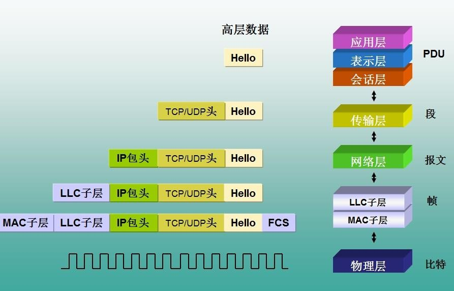
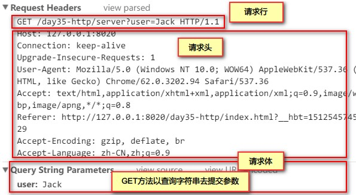
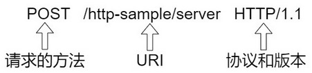

# HTTP 协议

<font color=red>**网络三要素：IP地址、端口号、协议**</font>

## 1. 概述

- HTTP 全称：Hyper Text Transfer Procotol 超文本传输协议
- HTML 全称：Hyper Text Markup Language 超文本标记语言

HTTP 就是用来传输 HTML 的。用来规定浏览器与服务器之间网页数据传输的格式。

应用层的协议，基于 TCP/IP 协议。

### 1.1. HTTP 协议

#### 1.1.1. HTTP 协议作用

用于将服务器上的 HTML 传输到浏览器上，由浏览器去执行 HTML。将用户在表单中提交的数据传输给服务器

#### 1.1.2. HTTP 协议的特点

1.HTTP协议的组成

HTTP 请求(request)和 HTTP 响应(response)。请求与响应是成对出现的，有请求才有响应。

2. 无状态协议

HTTP 协议本身不记录用户的任何信息，不会保留用户上次访问状态。浏览器每次发送请求给服务器，对于服务器来说并不知道是否是同一个用户发送过来。FTP 就是一种有状态协议，是会记录用户状态。

3. 传输时间

不记录用户的状态，传输时间比较短，访问效率比较高。

#### 1.1.3. HTTP 协议默认端口号

- HTTP 协议默认端口号是：`80`
- HTTPS 协议，是加密的 HTTP 协议，端口号：`443`

例如：`http://www.moon.com:80` 如果是80端口，则端口号可以省略。

> `80` 默认是浏览器软件默认使用的端口号；`8080` 是 tomcat 的端口号

### 1.2. URL

#### 1.2.1. 什么是URL

URL，全称 Uniform Resource Locator （统一资源定位符）

URL 作用：就是一个网页的访问地址，可以访问互联网上任何一个资源。

#### 1.2.2. URL 格式与组成

URL 格式：`http://www.moon.com:8080/news/index.jsp?boardid=5&id=24618&page=1`。下表对每个组成部分进行说明

|     组成部分     |                                功能                                |
| -------------- | ----------------------------------------------------------------- |
| **http**       | 使用的超文本传输的协议                                                |
| `www.moon.com` | 服务器域名或 IP 地址                                                 |
| **8080**       | 端口号，默认 HTTP 协议(浏览器)端口号是 80                               |
| **news**       | 虚拟文件夹地址，服务器上的一个项目访问地址                                |
| **index.jsp**  | 某个项目中的 Web 资源，可以是 HTML、JSP、图片                           |
| `?`            | URL 访问地址与参数之间的分隔符，后面的参数都是键值对的形式存在(如：boardid=5) |
| `&`            | 参数与参数之间分隔符                                                  |

### 1.3. URL与URI的区别

- URI：Uniform Resource Identifer 统一资源标识符
- URI 标识符往往是 URL 的一部分，用于标识一个互联网的唯一资源，并不能直接访问。URL 是可以直接访问的一个地址。

### 1.4. DNS服务器的作用

DNS 服务器 Domain Name Server 域名解析服务器

用于将域名，如：www.baidu.com 解析成 IP 地址 119.75.216.20

## 2. HTTPS 协议

HTTPS（全称：Hypertext Transfer Protocol over Secure Socket Layer），是以安全为目标的 HTTP 通道，简单讲是 HTTP 的安全版。即 HTTP 下加入 SSL 层，HTTPS 的安全基础是 SSL。<font color=red>**其所用的端口号是 443**</font>。过程大致如下：

### 2.1. 建立连接获取证书

SSL 客户端通过 TCP 和服务器建立连接之后（443 端口），并且在一般的 tcp 连接协商（握手）过程中请求证书。即客户端发出一个消息给服务器，这个消息里面包含了自己可实现的算法列表和其它一些需要的消息，SSL 的服务器端会回应一个数据包，这里面确定了这次通信所需要的算法，然后服务器向客户端返回证书。（证书里面包含了服务器信息：域名。申请证书的公司，公共秘钥）。

### 2.2. 证书验证

Client 在收到服务器返回的证书后，判断签发这个证书的公共签发机构，并使用这个机构的公共秘钥确认签名是否有效，客户端还会确保证书中列出的域名就是它正在连接的域名。

### 2.3. 数据加密和传输

如果确认证书有效，那么生成对称秘钥并使用服务器的公共秘钥进行加密。然后发送给服务器，服务器使用它的私钥对它进行解密，这样两台计算机可以开始进行对称加密进行通信。


## 3. HTTP 原理与传输流程

### 3.1. 原理

HTTP是一个无状态的协议。无状态是指客户机（Web浏览器）和服务器之间不需要建立持久的连接，这意味着当一个客户端向服务器端发出请求，然后服务器返回响应(response)，连接就被关闭了，在服务器端不保留连接的有关信息。HTTP 遵循请求(Request)/应答(Response)模型。客户机（浏览器）向服务器发送请求，服务器处理请求并返回适当的应答。所有 HTTP 连接都被构造成一套请求和应答。

### 3.2. 传输流程

1. 地址解析

如用客户端浏览器请求这个页面：http://localhost.com:8080/index.html 从中分解出协议名、主机名、端口、对象路径等部分，对于我们的这个地址，解析得到的结果如下：

- 协议名：http
- 主机名：localhost.com
- 端口：8080
- 对象路径：/index.htm
	
在这一步，需要域名系统 DNS 解析域名 localhost.com，得主机的 IP 地址。

2. 封装 HTTP 请求数据包

把以上部分结合本机自己的信息，封装成一个 HTTP 请求数据包

3. 封装成 TCP 包并建立连接

封装成 TCP 包，建立 TCP 连接（TCP 的三次握手）

4. 客户机发送请求命

建立连接后，客户机发送一个请求给服务器，请求方式的格式为：统一资源标识符（URL）、协议版本号，后边是 MIME 信息包括请求修饰符、客户机信息和可内容。

5. 服务器响应

服务器接到请求后，给予相应的响应信息，其格式为一个状态行，包括信息的协议版本号、一个成功或错误的代码，后边是 MIME 信息包括服务器信息、实体信息和可能的内容。

6. 服务器关闭 TCP 连接

一般情况下，一旦 Web 服务器向浏览器发送了请求数据，它就要关闭 TCP 连接，然后如果浏览器或者服务器在其头信息加入了这行代码 Connection:keep-alive，TCP 连接在发送后将仍然保持打开状态，于是，浏览器可以继续通过相同的连接发送请求。保持连接节省了为每个请求建立新连接所需的时间，还节约了网络带宽。



## 4. HTTP 请求（重点）

### 4.1. 什么是 HTTP 请求

将浏览器端的数据发送给服务器，称为 HTTP 请求。而把这些数据封装成一个对象，这个对象就是 <font color=red>**request 请求对象**</font>。

### 4.2. 查看 HTTP 请求

如何查看HTTP协议的内容(Chrome 按F12)


### 4.3. HTTP 请求的组成

1. 请求行
2. 请求头：由多组键值对组成
3. 请求体：GET 没有请求体，POST 方法数据是以请求体的方式发送给服务器

#### 4.3.1. 浏览器中查看请求信息

##### 4.3.1.1. GET 方法请求



##### 4.3.1.2. POST 方法请求


#### 4.3.2. 请求行

**一个完整的请求行包括**：



1. 请求的方式(GET或POST)【POST】
2. 请求的URI【/http-sample/server】
3. 使用的协议和版本【HTTP/1.1】
    - 1.0版：每次浏览器发送请求给服务器获取 1 个 web 资源之后断开
    - 1.1版：每次浏览器发送请求给服务器获取多个 web 资源之后断开，1.1 的效率更高。

<font color=red>一个网页如果有多个图片，每个图片都会发送一次请求</font>

#### 4.3.3. 请求头

> 不是每次请求都会出现所有的请求头

常见请求头如下：

- **Referer**

浏览器上一次请求的网页地址，即从哪一个页面跳转过来的

- **If-Modified-Since**

浏览器在本地缓存当前网页的时间，时区差8个小时

- **Cookie**

在浏览器端以<font color=red>**字符串的键值对**</font>，保存服务器发送过来的数据

- **User-Agent**

得到客户端的操作系统信息和浏览器的类型

- **Connection**

当前 TCP 连接的状态，keep-alive 保持连接，close 关闭连接

在 HTTP1.0 中，每次请求结束就关闭连接；在 HTTP1.1 中，请求会保存连接状态。目前广泛使用 HTTP1.1 的版本

- **Host**

请求的服务器主机名和端口号

- **Content-Length**

客户端请求数据(请求体)的长度，<font color=red>**用于 POST 方法**</font>

- **Content-Type**

请求的内容类型，POST 方法时请求类型。GET 方法没有这个请求头。如果使用 POST 方法，则它的值是：

```
Content-Type: application/x-www-form-urlencoded
```

表单的数据以 `键=值` 的方式发送给服务器

- **Accept**

请求中支持的 MIME 类型。MIME 格式：

```
大类型/小类型[;可选参数]
```

如：`text/css`、`text/javascript`、`text/html;charset=utf-9`

MIME(Multipurpose Internet Mail Extensions)多用途互联网邮件扩展类型。是设定某种**扩展名**的文件用一种应用程序来**打开的方式类型**，当该扩展名文件被访问的时候，浏览器会自动使用指定应用程序来打开。多用于指定一些客户端自定义的文件名，以及一些媒体文件打开方式。如：jpg，txt，mp4

- **Accept-Language**

浏览器允许的语言和国家，两个小写字母表示语言，大写的两个字母代表国家。如 zh-CN 表示中文-中国 zh-HK zh-TW, en-US，en-GB

- **Accept-Encoding**

请求的数据支持的压缩类型，如 gzip 等

#### 4.3.4. 请求体

客户端发送给服务器的数据，只有 POST 方法参数通过有请求体发送数据的，GET 方法通过字符串的形式发送，没有请求体。

### 4.4. GET 和 POST 请求的优缺点和误区

#### 4.4.1. get请求与post请求的区别

|            |             POST 方式             |                       GET 方式                       |
| ---------- | -------------------------------- | ---------------------------------------------------- |
| **地址栏** | 地址是不带参数的，参数是在请求体中发送   | 地址栏是带参数，参数通过查询字符串发送数据                   |
| **大小**   | 理论上数据发送没有限制，如：用于文件上传 | 一般最大1K，不同的浏览器有不同的限制                       |
| **安全性** | 高                                | 低                                                   |
| **缓存**   | 不使用浏览器的缓存                   | 使用浏览器的缓存，如果发现服务器网页没有修改。下次访问就使用缓存 |

1. post 更安全（不会作为 url 的一部分，不会被缓存、保存在服务器日志、以及浏览器浏览记录中）
2. post 发送的数据更大（get 有 url 长度限制）
3. post 能发送更多的数据类型（get 只能发送 ASCII 字符）
4. post 比 get 慢
5. post 用于修改和写入数据，get 一般用于搜索排序和筛选之类的操作（淘宝，支付宝的搜索查询都是 get 提交），目的是资源的获取，读取数据

#### 4.4.2. 为什么 get 比 post 更快

1. post 请求包含更多的请求头，因为 post 需要在请求的 body 部分包含数据，所以会多了几个数据描述部分的首部字段（如：content-type）
2. 最重要的一条，**post 在真正接收数据之前会先将请求头发送给服务器进行确认，然后才真正发送数据**

- post 请求的过程：
    1. 浏览器请求tcp连接（第一次握手）
    2. 服务器答应进行tcp连接（第二次握手）
    3. 浏览器确认，并发送post请求头（第三次握手，这个报文比较小，所以http会在此时进行第一次数据发送）
    4. 服务器返回100 Continue响应
    5. 浏览器发送数据
    6. 服务器返回200 OK响应
- get 请求的过程：
    1. 浏览器请求tcp连接（第一次握手）
    2. 服务器答应进行tcp连接（第二次握手）
    3. 浏览器确认，并发送get请求头和数据（第三次握手，这个报文比较小，所以http会在此时进行第一次数据发送）
    4. 服务器返回200 OK响应

3. get 会将返回的数据缓存起来，而 post 不会
    - 测试：使用 ajax 采用 get 方式请求静态数据（比如 html 页面，图片）的时候，如果两次传输的数据相同，第二次以后消耗的时间将会在10ms以内（chrome测试），而 post 每次消耗的时间都差不多。经测试，chrome 和 firefox 下如果检测到 get 请求的是静态资源，则会缓存，如果是数据，则不会缓存，但是 IE 什么都会缓存起来，当然，应该没有人用 post 去获取静态数据
4. post 不能进行管道化传输

#### 4.4.3. get 传参最大长度的理解误区

**总结**：

1. http协议并未规定get和post的长度限制
2. get的最大长度限制是因为浏览器和web服务器限制了URL的长度
3. 不同的浏览器和web服务器，限制的最大长度不一样
4. 要支持IE，则最大长度为2083byte，若支持Chrome，则最大长度8182byte

**误解**：

1. 首先即使get有长度限制，也是限制的整个URL的长度，而不仅仅是参数值数据长度，http协议从未规定get/post的请求长度限制是多少
2. 所谓的请求长度限制是由浏览器和web服务器决定和设置的，各种浏览器和web服务器的设定均不一样，这依赖于各个浏览器厂家的规定或者可以根据web服务器的处理能力来设定。IE 和 Safari 浏览器 限制 2k，Opera 限制4k，Firefox 限制 8k（非常老的版本 256byte），如果超出了最大长度，大部分的服务器直接截断，也有一些服务器会报414错误。
3. 各个浏览器和web服务器的最大长度总结

- 浏览器
    - IE：IE浏览器（Microsoft Internet Explorer） 对url长度限制是2083（2K+53），超过这个限制，则自动截断（若是form提交则提交按钮不起作用）。
    - firefox：firefox（火狐浏览器）的url长度限制为 65536字符，但实际上有效的URL最大长度不少于100,000个字符。
    - chrome：chrome（谷歌）的url长度限制超过8182个字符返回本文开头时列出的错误。
    - Safari：Safari的url长度限制至少为 80 000 字符。
    - Opera：Opera 浏览器的url长度限制为190 000 字符。Opera9 地址栏中输入190000字符时依然能正常编辑。
- 服务器
    - Apache：Apache能接受url长度限制为8 192 字符
    - IIS：Microsoft Internet Information Server(IIS)能接受url长度限制为16384个字符。这个是可以通过修改的（IIS7）`configuration/system.webServer/security/requestFiltering/requestLimits@maxQueryStringsetting.`

## 5. HTTP 响应（重点）

### 5.1. 什么是 HTTP 响应

由服务器将数据返回给浏览器，称为响应。将其封装成一个对象，这个对象就是<font color=red>** response 响应对象**</font>。

### 5.2. 响应信息的组成

- **响应行**：一行数据
- **响应头**：由多个键值对组成
- **响应体**：由服务器发送给浏览器的数据


#### 5.2.1. 响应行

```
HTTP/1.1 304 Not Modified
HTTP/1.1 200 OK
```

- 协议和版本：如：HTTP/1.1
- 状态码：如：304/200
- 状态信息：如：Not Modified/OK

#### 5.2.2. 响应头

|                        响应头信息                         |                                                     说明                                                      |
| ------------------------------------------------------- | ------------------------------------------------------------------------------------------------------------ |
| `Location: http://www.newboy.com/index.jsp`             | 页面在跳转的时候，下一个将要跳转到的页面                                                                             |
| `Server:apache tomcat`                                  | 服务器的名字                                                                                                   |
| `Content-Encoding: gzip`                                | 服务器支持的压缩类型。有些资源如果比较大，先在服务器压缩，再传给浏览器。由浏览器去解压，减少网络带宽的占用。                      |
| `Content-Length: 80`                                    | 服务器响应返回的数据长度                                                                                          |
| `Content-Language: zh-cn`                               | 服务器内容支持的语言和国家                                                                                        |
| `Content-Type: text/html;  charset=utf-8`               | 内容的类型和字符集(MIME类型) 响应内容的MIME类型`text/html;charset=utf-8`表示服务器响应的内容是文本的HTML类型，字符集是utf-8 |
| `Last-Modified: Tue, 11 Jul  2000 18:23:51 GMT`         | 服务器上文件最后修改的时间，相差8个小时                                                                             |
| `Refresh:  1;url=http://www.newboy.com`                 | 过1秒(指定时间)以后，跳转到URL指定的另一个页面                                                                       |
| `Content-Disposition:  attachment; filename=newboy.zip` | 使用附件的方式**下载**一个资源，资源名是filename后面的值，而不是直接在浏览器打开                                          |
| `Connection:  close/Keep-Alive`                         | 服务器的连接状态：keep-alive连接或close关闭                                                                       |
| `Date: Tue, 11 Jul 2000  18:23:51 GMT`                  | 服务器响应的时间，差8个小时                                                                                       |

#### 5.2.3. 响应体

响应体就是服务器发送给浏览器的数据，如果是网页，就可以看到源代码。如果是图片，则是一些二进制的数据。

### 5.3. HTTP 状态码表

#### 5.3.1. HTTP 状态码

当浏览者访问一个网页时，浏览者的浏览器会向网页所在服务器发出请求。当浏览器接收并显示网页前，此网页所在的服务器会返回一个包含HTTP状态码的信息头（server header）用以响应浏览器的请求。

HTTP 状态码的英文为 HTTP Status Code。下面是常见的 HTTP 状态码：

|  状态码   |                                             含义                                              |
| ------- | -------------------------------------------------------------------------------------------- |
| **200** | 服务器正常响应回来，并且正确返回数据                                                                |
| **301** | 资源（网页等）被永久转移到其它 URL                                                                 |
| **302** | 服务器让浏览器进行页面的跳转                                                                      |
| **304** | 页面使用的是浏览器缓存，没有从服务器上去下载网页                                                      |
| **404** | 指定页面找不到。请求的 Web 资源不存在，打错地址，大小写敏感。如 `HTTP/1.1 404 Not Found`                |
| **405** | 重写了 `doPost` 方法，没有写 `doGet` 方法，但是浏览器表单提交使用 get 方法提交，就会出现 405 错误，反之亦然 |
| **500** | 服务器出现异常，一般是Java程序代码问题                                                              |

#### 5.3.2. HTTP 状态码的分类

HTTP 状态码由三个十进制数字组成，第一个十进制数字定义了状态码的类型，后两个数字没有分类的作用。HTTP 状态码共分为 5 种类型：

| 分类  |                   详解                    |
| :---: | ----------------------------------------- |
| `1**` | 信息，服务器收到请求，需要请求者继续执行操作   |
| `2**` | 成功，操作被成功接收并处理                   |
| `3**` | 重定向，需要进一步的操作以完成请求            |
| `4**` | 客户端错误，请求包含语法错误或无法完成请求     |
| `5**` | 服务器错误，服务器在处理请求的过程中发生了错误 |

#### 5.3.3. HTTP状态码列表


