# Web 服务器

## 1. 软件架构

### 1.1. 客户端服务器模式（CS: Client/Server）

CS的特点：

- 客户端安装必须安装软件
- 如果服务器端升级，所有的客户端都必须升级
- 程序员<font color=red>**主要是开发客户端**</font>。如：QQ

CS 的优点：

- 用户体验比较好，界面比较美观。
- 安全控制比较好，本地安全性相对高一些。
- 服务器负荷比较低，本地会处理一些计算功能。

CS 的缺点：

- 占用硬盘空间，软件安装要空间。
- 维护麻烦，如果服务器升级，所有的客户端都要升级
- 安装一些软件依赖其它的环境

### 1.2. 浏览器/服务器模式（BS：Browser/Server）

BS的特点

- 客户端不需要安装，只要有浏览器就可以了，浏览器一般系统都有。
- 如果服务器升级，客户端不用升级，直接可以使用
- 程序员开发<font color=red>**主要是针对服务器端**</font>

BS的优点：

- 维护升级比较方便，无缝升级，服务器升级就可以了。客户端几乎不需要升级
- 客户端无需安装，有浏览器就可以了。

BS的缺点：

- 表示层效果美观没有CS效果漂亮
- 浏览器端的安全控制比较低，要加强安全的话再使用其它工具，银行使用U盾。
- 服务器负载比较重，所有的计算都在服务器端。

### 1.3. 静态网站与动态网站

<font color=red>**程序是否在服务器端运行，是静态网站与动态网站重要标志**</font>

#### 1.3.1. 概述

- **静态网站**：<font color=red>运行于客户端的网页属于静态网页</font>，例如html页、Flash、JavaScript、VBScript等等，只要不是主动去修改，则网页是永远不变的。
- **动态网站**：<font color=red>在服务器端运行的程序属于动态网页</font>，它们会随不同客户、不同时间，返回不同的网页，例如PHP、JSP、ASP.net等。

#### 1.3.2. 两者的区别

- 后缀名

静态网站 HTML 或 HTM，动态网站：jsp、php、asp

- 交互行为

看看浏览器与服务器是否有交互，**程序是否在服务器端运行，是重要标志**。

#### 1.3.3. 静态网站的特点

静态网页是相对于动态网页而言，是指没有后台数据库、不含程序、不可交互的网页。你编的是什么它显示的就是什么、不会有任何改变。

#### 1.3.4. 动态网站的特点

1. 动态网页以数据库技术为基础，可以大大减少降低网站维护的工作量；
2. 采用动态网页技术的网站可以实现更多的功能，如用户注册、用户登录、在线调查、用户管理、订单管理等等；
3. 动态网页实际上并不是独立存在于服务器上的网页文件，只有当用户请求时服务器才返回一个完整的网页，在浏览器端看到的其实是动态程序运行的结果

## 2. Web服务器（重点）

### 2.1. 服务器概述

#### 2.1.1. 什么是服务器

- 硬件：就是一台性能强大的电脑，只是硬盘配置很高。内存大，CPU 数量多。硬盘多，网卡多。
- 软件：安装了不同服务器软件，它就是不同的类型服务器。如：Web 服务器，就是安装了 Web 容器 Tomcat

#### 2.1.2. 服务器分类

- 数据库服务器：MySQL 和 Oracle
- Web服务器，安装 Web 软件，如：Tomcat
- 邮件服务器：收邮件和发送邮件

Web 容器就是指 Web 服务器，容器中存放的就是 Java 代码。后期所有的 Java 代码都是运行在 Tomcat 中。

一个 Java Web 服务器是需要实现部分或全部的 JavaEE 规范。

### 2.2. JavaEE规范

在 Java 中所有的服务器要实现一组 Oracle 公司规定的接口，这些接口称为 JavaEE 规范。不同厂商的 JavaWeb 服务器都实现了这些接口。在 JavaEE 中一共有13种规范。

常见的 JavaEE 规范有：JDBC、XML、JSP、Servlet、EJB 等。

### 2.3. Web服务器概述

<font color=red>**使用 Java 程序编写的 Web 容器**</font>，运行在服务器端，它可以调用 Java 程序 Servlet，对用户的请求做出处理，并且返回响应给浏览器。将服务器的资源发送给浏览器。

Web 服务器：由 Java 语言编写。就是实现了JavaEE 规范的 Java 程序。可以调用放在自己容器内部的 Java 程序，如：Servlet。

### 2.4. 常见的Web服务器

- Weblogic：大型服务器
- WebSphere：大型服务器
- GlassFish：小型服务器
- <font color=red>**Tomcat**</font>：免费的 Web 服务器，属于小型，该服务器支持全部 JSP 以及 Servlet 规范。在小型的应用系统或者有特殊需要的系统中使用

## 3. Tomcat

### 3.1. 概述

Tomcat 是 Apache 软件基金会（Apache Software Foundation）的 Jakarta 项目中的一个核心项目，由 Apache、Sun 和其他一些公司及个人共同开发而成。由于有了 Sun 的参与和支持，最新的 Servlet 和 JSP 规范总是能在 Tomcat 中得到体现，因为 Tomcat 技术先进、性能稳定，而且免费，因而深受 Java 爱好者的喜爱并得到了部分软件开发商的认可，成为目前比较流行的 Web 应用服务器。

> 官网：https://tomcat.apache.org/

#### 3.1.1. Tomcat 的版本

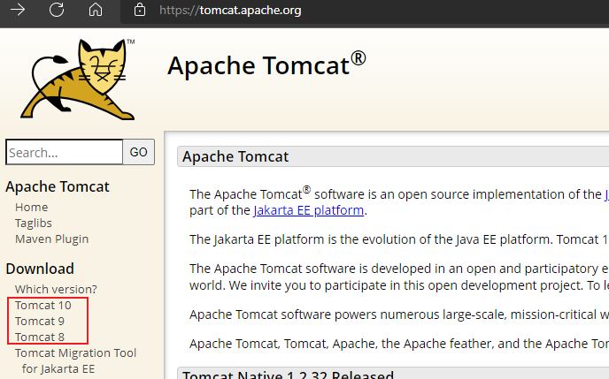

Apache Tomcat Versions 一览表（2022.03.26 更新）

| Servlet Spec | JSP Spec | EL Spec | WebSocket Spec | Authentication (JASPIC) Spec | Apache Tomcat Version | Latest Released Version |         Supported Java Versions         |
| ------------ | -------- | ------- | -------------- | ---------------------------- | --------------------- | ----------------------- | --------------------------------------- |
| 6.0          | 3.1      | 5.0     | 2.1            | 3.0                          | 10.1.x                | 10.1.0-M12 (alpha)      | 11 and later                            |
| 5.0          | 3.0      | 4.0     | 2.0            | 2.0                          | 10.0.x                | 10.0.18                 | 8 and later                             |
| 4.0          | 2.3      | 3.0     | 1.1            | 1.1                          | 9.0.x                 | 9.0.60                  | 8 and later                             |
| 3.1          | 2.3      | 3.0     | 1.1            | 1.1                          | 8.5.x                 | 8.5.77                  | 7 and later                             |
| 3.1          | 2.3      | 3.0     | 1.1            | N/A                          | 8.0.x (superseded)    | 8.0.53 (superseded)     | 7 and later                             |
| 3.0          | 2.2      | 2.2     | 1.1            | N/A                          | 7.0.x (archived)      | 7.0.109 (archived)      | 6 and later (7 and later for WebSocket) |
| 2.5          | 2.1      | 2.1     | N/A            | N/A                          | 6.0.x (archived)      | 6.0.53 (archived)       | 5 and later                             |
| 2.4          | 2.0      | N/A     | N/A            | N/A                          | 5.5.x (archived)      | 5.5.36 (archived)       | 1.4 and later                           |
| 2.3          | 1.2      | N/A     | N/A            | N/A                          | 4.1.x (archived)      | 4.1.40 (archived)       | 1.3 and later                           |
| 2.2          | 1.1      | N/A     | N/A            | N/A                          | 3.3.x (archived)      | 3.3.2 (archived)        | 1.1 and later                           |

> Notes: 企业用的比较广泛的是 7.0 和 8.0 版本，tomcat 6以下版本不建议使用。

#### 3.1.2. 安装包的类别

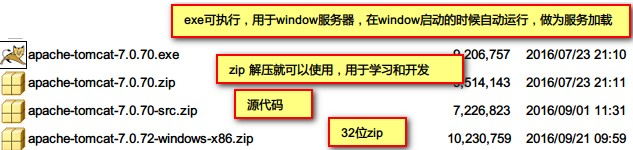

使用 zip 版本，直接解压到任意的文件夹便可使用。

- 安装版：需要安装，一般不考虑使用。
- 解压版：直接解压缩使用，较为常用的版本。

### 3.2. Tomcat 目录结构

解压 tomcat zip 到非中文无空格目录中，该目录下包含了 Tomcat 的 bin、conf 目录等，称之为<font color=red>**Tomcat 的安装目录或根目录**</font>。

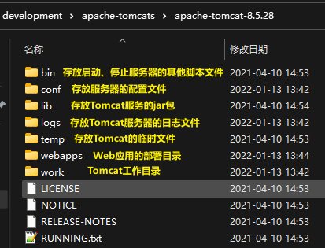

|    目录名     |                                                                                              作用                                                                                              |
| :---------: | --------------------------------------------------------------------------------------------------------------------------------------------------------------------------------------------- |
|   **bin**   | tomcat的可执行的程序，bat批处理文件，启动或关闭tomcat                                                                                                                                                 |
|  **conf**   | tomcat服务器的配置文件夹，常用的配置文件都在这里，如：<br/>web.xml：Web服务器的部署描述文件<br/>server.xml：服务器启动读取配置的文件，如果文件有错误，tomcat启动会失败<br/>tomcat-users.xml：用于配置tomcat管理员的配置文件 |
|   **lib**   | tomcat启动的时候必须的jar库，第三方支持库也可以放在这里                                                                                                                                                |
|  **logs**   | 日志记录，服务器启动和关闭或运行过程中记录的信息，扩展名.log，文本文件                                                                                                                                     |
|  **temp**   | 用于存放服务器运行过程中的临时文件，垃圾文件                                                                                                                                                           |
| **webapps** | 开发的Java项目发布文件夹，所有的项目都要复制到这个目录下，才可以给客户端浏览器使用。如：<br/>文件：/webapps/hello/1.html  访问：`http://localhost:8080/hello/1.html`                                             |
|  **work**   | tomcat 的工作目录，存放 jsp 生成的 servlet 代码地方                                                                                                                                                 |

- bin：该目录下存放的是二进制可执行文件，如果是安装版，那么这个目录下会有两个exe文件：tomcat6.exe、tomcat6w.exe，前者是在控制台下启动Tomcat，后者是弹出GUI窗口启动Tomcat；如果是解压版，那么会有startup.bat和shutdown.bat文件，startup.bat用来启动Tomcat，但需要先配置JAVA_HOME环境变量才能启动，shutdawn.bat用来停止Tomcat。
- conf：这是一个非常非常重要的目录，这个目录下有四个最为重要的文件：
    - server.xml：配置整个服务器信息。例如修改端口号。默认HTTP请求的端口号是：8080
    - tomcat-users.xml：存储tomcat用户的文件，这里保存的是tomcat的用户名及密码，以及用户的角色信息。可以按着该文件中的注释信息添加tomcat用户，然后就可以在Tomcat主页中进入Tomcat Manager页面了；
    - web.xml：部署描述符文件，这个文件中注册了很多MIME类型，即文档类型。这些MIME类型是客户端与服务器之间说明文档类型的，如用户请求一个html网页，那么服务器还会告诉客户端浏览器响应的文档是text/html类型的，这就是一个MIME类型。客户端浏览器通过这个MIME类型就知道如何处理它了。当然是在浏览器中显示这个html文件了。但如果服务器响应的是一个exe文件，那么浏览器就不可能显示它，而是应该弹出下载窗口才对。MIME就是用来说明文档的内容是什么类型的！
    - context.xml：对所有应用的统一配置，通常我们不会去配置它。
- lib：Tomcat的类库，里面是一大堆jar文件。如果需要添加Tomcat依赖的jar文件，可以把它放到这个目录中，当然也可以把应用依赖的jar文件放到这个目录中，这个目录中的jar所有项目都可以共享之，但这样你的应用放到其他Tomcat下时就不能再共享这个目录下的jar包了，所以建议只把Tomcat需要的jar包放到这个目录下；
- logs：这个目录中都是日志文件，记录了Tomcat启动和关闭的信息，如果启动Tomcat时有错误，那么异常也会记录在日志文件中。
- temp：存放Tomcat的临时文件，这个目录下的东西可以在停止Tomcat后删除！
- webapps：存放web项目的目录，其中每个文件夹都是一个项目；如果这个目录下已经存在了目录，那么都是tomcat自带的项目。其中ROOT是一个特殊的项目，在地址栏中访问：http://127.0.0.1:8080，没有给出项目目录时，对应的就是ROOT项目。http://localhost:8080/examples，进入示例项目。其中examples就是项目名，即文件夹的名字。
- work：运行时生成的文件，最终运行的文件都在这里。通过webapps中的项目生成的！可以把这个目录下的内容删除，再次运行时会生再次生成work目录。当客户端用户访问一个JSP文件时，Tomcat会通过JSP生成Java文件，然后再编译Java文件生成class文件，生成的java和class文件都会存放到这个目录下。
- LICENSE：许可证。
- NOTICE：说明文件。

webapps 目录下原有文件

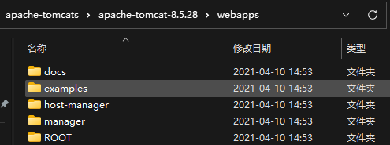

### 3.3. 启动与关闭 - 命令行方式

#### 3.3.1. 启动

1. 解压 zip 文件到目录，*目录名称最好是没有空格与中文*
2. 在 window 的添加环境变量，即可以直接运行 tomcat\bin 目录下的可执行文件

```
# 新增的环境变量
CATALINA_HOME = %tomcat安装目录%

# 指定运行路径
Path = %CATALINA_HOME%\bin 
```

3. 使用 cmd 命令行，运行 `startup.bat`。*注：前提是配置了tomcat的环境变量，否则需要 `全路径名称\tomcat\bin\startup.bat`*；或者运行 `catalina run` 命令

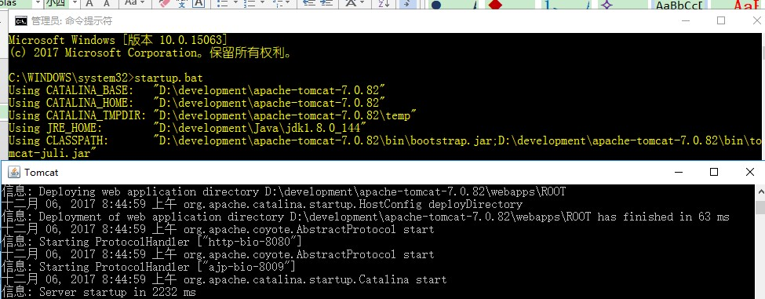

4. 启动成功，访问默认地址 `http://localhost:8080`，打开欢迎界面

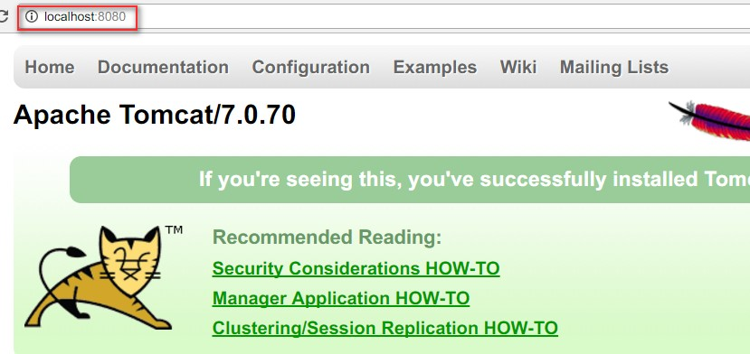

#### 3.3.2. 关闭

启动 cmd 命令行，输入以下命令

```bash
# 配置了环境变量
shutdown.bat

# 直接进入目录路径进行关闭
全路径名称\tomcat\bin\shutdown.bat
```

#### 3.3.3. Tomcat 启动失败的常见情况

##### 3.3.3.1. 未设置 JAVA_HOME 环境变量

启动时窗口一闪而过或者提示以下出错信息

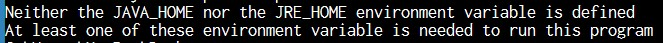

在使用 startup.bat 启动时会调用 catalina.bat，而 catalina.bat 又调用 setclasspath.bat，setclasspath.bat 批处理命令脚本中使用 JAVA_HOME 环境变量，tomcat 服务器软件需要使用 java 环境，所以必须在启动 Tomcat 之前把 JAVA_HOME 配置正确。

解决办法：安装好 JDK，至少要配置 `JAVA_HOME` 或 `JRE_HOME` 这两环境变量中的一个

##### 3.3.3.2. 端口被占用

如果占用了 8080 端口，再启动 Tomcat，启动会失败。出错信息不仅在屏幕上显示，同时也会记录到日志文件中。

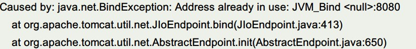

解决方法一：把占用端口的程序退出，不再占用 8080 端口。*使用软件 cports.exe 可以查看目前电脑端口的使用状态*

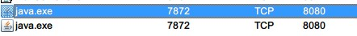

解决方法二：找到根目录 conf\server.xml 文件，在第一个`<Connector>` 标签中修改 tomcat 的端口号，并且重新启动web容器

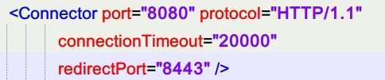

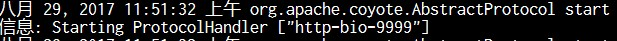


### 3.4. Tomcat 项目的发布方式

#### 3.4.1. 方式一(最常用)

直接将网页复制（或新建）到【webapps\工程名】目录下

- 服务器地址：`c:\apache-tomcat-7.0.70\webapps\javaee\a.html`
- 浏览器上URL：`http://localhost:8080/javaee/a.html`

#### 3.4.2. 方式二

将网页复制到 ROOT 文件夹。

- 将项目复制到 ROOT 下
- 修改 WEB-INF/web.xml

此时 tomcat 欢迎页面，即：http://localhost:8080，其实就是 ROOT\index.jsp
