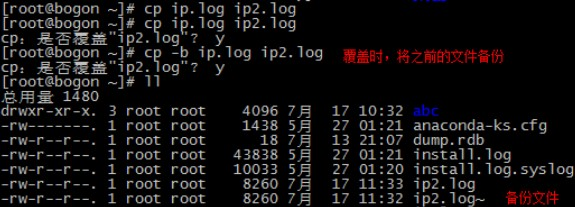

## 1. Linux 命令

### 1.1. 命令格式

Linux 命令的格式是：

```bash
command -options arguments

# 中文翻译
命令名称 [命令参数] [命令对象]
```

命令解析：

- 命令对象（arguments）：一般是指要处理的文件、目录、用户等资源
- 命令参数可以用长格式（完整的选项名称），也可以用短格式（单个字母的缩写），两者分别用 `--` 与 `-` 作为前缀

> Notes: <font color=red>**命令名称、命令参数、命令对象之间使用空格键分隔。**</font>

### 1.2. 命令分类

linux 系统的命令可以分为**内部命令**和**外部命令**

- **内部命令**：属于 Shell 解析器的一部分 （系统启动直接加载到内存的）。如：`cd`、`pwd`、`help`
- **外部命令**：独立于 Shell 解析器之外的文件程序（独立的可执行文件）。如：`ls`、`mkdir`、`cp`

查看帮助文档：

- **内部命令**：`help + 命令`（如：`help cd`）
- **外部命令**：`man + 命令`（如：`man ls`）

> <font color=violet>**开发中，如果需要查看命令参数，先使用 `man`，如果没有结果，再使用 `help`**</font>

## 2. 线上查询及帮助命令(2个)

| 命令  |                    功能说明                     |
| :--: | ---------------------------------------------- |
| man  | 查看命令帮助，命令的词典，更复杂的还有info，但不常用。 |
| help | 查看Linux内置命令的帮助，比如cd命令。               |

## 3. 文件和目录操作命令(18个)

|   命令    |                           功能说明                           |
| :------: | ---------------------------------------------------------- |
|    ls    | 全拼list，功能是列出目录的内容及其内容属性信息。                   |
|    cd    | 全拼change directory，功能是从当前工作目录切换到指定的工作目录。   |
|    cp    | 全拼copy，其功能为复制文件或目录。                              |
|   find   | 查找的意思，用于查找目录及目录下的文件。                          |
|  mkdir   | 全拼make directories，其功能是创建目录。                       |
|    mv    | 全拼move，其功能是移动或重命名文件。                             |
|   pwd    | 全拼print working directory，其功能是显示当前工作目录的绝对路径。 |
|  rename  | 用于重命名文件。                                              |
|    rm    | 全拼remove，其功能是删除一个或多个文件或目录。                    |
|  rmdir   | 全拼remove empty directories，功能是删除空目录。               |
|  touch   | 创建新的空文件，改变已有文件的时间戳属性。                        |
|   tree   | 功能是以树形结构显示目录下的内容。                               |
| basename | 显示文件名或目录名。                                           |
| dirname  | 显示文件或目录路径。                                           |
|  chattr  | 改变文件的扩展属性。                                           |
|  lsattr  | 查看文件扩展属性。                                            |
|   file   | 显示文件的类型。                                              |
|  md5sum  | 计算和校验文件的MD5值。                                        |

### 3.1. ls - 查看文件信息

`ls` 命令是Linux下最常用的指令之一，`ls` 命令为英文单词 list 的缩写。`ls` 的功能是列出指定目录下的内容及其相关属性信息。

#### 3.1.1. 语法格式与参数

语法格式：

```bash
ls [选项] [文件]
```

常用参数：

|       参数       |                                     作用                                      |
| :-------------: | ---------------------------------------------------------------------------- |
| `-a` 或 `--all` | 显示所有文件及目录 (包括以`.`开头的隐藏文件、特殊目录、`.` (当前目录) 及 `..` (父目录)) |
|      `-l`       | 使用长格式列出文件及目录信息。此命令非常常用，提供简化版命令 `ll`                      |
|      `-r`       | 将文件以相反次序显示(默认依英文字母次序)                                            |
|      `-t`       | 根据文件和目录最后的修改时间排序                                                   |
|      `-A`       | 同`-a`参数，但不列出 `.`(当前目录) 及 `..` (父目录)                                |
|      `-S`       | 根据文件大小排序                                                                |
|      `-R`       | 递归列出所有子目录                                                              |
|    `--help`     | 在线帮助                                                                       |

#### 3.1.2. 示例

- 使用列表的形式，显示指定目录下的内容

```bash
ll /home/
```

- 列出当前目录中所有文件(包括隐藏文件)：

```bash
ls -a
```

- 列出当前工作目录下所有名称是 “s” 开头的文件 :

```bash
ls -ltr s*
```

- 列出当前工作目录下所有文件及目录并以文件的大小进行排序

```bash
ls -AS
```

### 3.2. cd – 切换目录

`cd` 命令是 change directory 中单词的首字母缩写，其功能是从当前目录切换到指定目录。其中目录的路径可分为绝对路径和相对路径。若目录名称省略，则切换至使用者的用户目录(也就是刚登录时所在的目录)。

其中，“`~`”表示用户目录，“`.`”则是表示目前所在的目录，“`..`”则表示当前目录位置的上一级目录。

#### 3.2.1. 语法格式与参数

语法格式：

```bash
cd [参数] [目录名]
```

常用参数：

| 参数  |                            作用                            |
| :--: | --------------------------------------------------------- |
| `-P` | 如果切换的目标目录是一个符号链接，则直接切换到符号链接指向的目标目录 |
| `-L` | 如果切换的目标目录是一个符号链接，则直接切换到符号链接名所在的目录   |
| `--` | 仅使用`-`选项时，当前目录将被切换到环境变量`OLDPWD`对应值的目录    |
| `~`  | 切换至当前用户目录                                           |
| `..` | 切换至当前目录位置的上一级目录                                 |
| `/`  | 切换至根目录                                                |
| `-`  | 切换至上一次访问的目录                                        |
|      | 切换至缺省当前用户目录                                        |

#### 3.2.2. 示例

- 将当前工作目录切换到 dir 目录，并使用 `pwd` 命令查看当前目录

```bash
[root@moon ~]# cd dir
[root@moon dir]# pwd
/root/dir
```

- 使用 `cd ~` 和 `cd ..` 命令进行目录的切换操作，并使用 `pwd` 命令查看当前目录

> 注意：使用 `cd ~` 命令可以直接切换到当前用户目录，而 `cd .. ` 是切换到上一级目录。

```bash
[root@moon dir]# pwd
/root/dir
[root@moon dir]# cd ~
[root@moon ~]# pwd
/root

[root@moon dir]# pwd
/root/dir
[root@moon dir]# cd ..
[root@moon dir]# pwd
/root
```

- 使用 `cd ../..` 命令返回上两级目录

```bash
[root@moon dir_2]# pwd
/root/dir/dir_1/dir_2
[root@moon dir_2]# cd ../..
[root@moon dir]# pwd
/root/dir
```

- 使用 `cd` 命令返回当前用户目录。`cd --` 命令返回上一次所在目录

```bash
[root@moon dir_2]# pwd
/root/dir/dir_1/dir_2
[root@moon dir_2]# cd
[root@moon ~]# pwd
/root
[root@moon ~]# cd -
/root/dir/dir_1/dir_2
[root@moon dir_2]# pwd
/root/dir/dir_1/dir_2
```

### 3.3. cp – 复制文件或目录

`cp` 命令可以将多个文件复制到一个具体的文件名或一个已经存在的目录下，也可以同时复制多个文件到一个指定的目录中。

> 注：
> 
> - 在 linux 系统中，`/` 代表根目录，`./` 代表当前目录
> - 如果目标文件是原来已经存在的文件，则会覆盖原来文件

#### 3.3.1. 语法格式与参数

语法格式：

```bash
cp [参数] [源文件或目录] [目标文件或目录]
```

常用参数：

|         参数          |                                      作用                                      |
| :------------------: | ----------------------------------------------------------------------------- |
|         `-f`         | 若目标文件已存在，则会直接覆盖原文件                                                |
|         `-i`         | 若目标文件已存在，则会询问是否覆盖                                                  |
|         `-p`         | 保留源文件或目录的所有属性                                                        |
| `-r`或 `--recursive` | 递归复制文件和目录,将指定目录下的文件与子目录一并处理。                                |
|         `-d`         | 当复制符号连接时，把目标文件或目录也建立为符号连接，并指向与源文件或目录连接的原始文件或目录 |
|         `-l`         | 对源文件建立硬连接，而非复制文件                                                   |
|         `-s`         | 对源文件建立符号连接，而非复制文件                                                  |
|         `-b`         | 覆盖已存在的文件目标前将目标文件备份                                                |
|         `-v`         | 详细显示 `cp` 命令执行的操作过程                                                  |
|         `-a`         | 等价于“`-dpr`”选项                                                              |

#### 3.3.2. 示例

- 无法复制目录，复制目录必须使用 `-r` 参数 

```shell
# 无法复制
cp ./abc ./xxx
# 复制目录
cp -r ./abc ./xxx
```

- 将文件test1改名为test2

```bash
cp -f test1 test2
```

- 复制多个文件

```bash
cp -r file1 file2 file3 dir
```

- 交互式地将目录 /usr/moon 中的所有 `.c` 文件复制到目录 dir 中

```bash
cp -r /usr/moon/*.c dir
```

- 覆盖前提示



### 3.4. mkdir – 创建目录

`mkdir` 命令是 make directoriy 缩写，功能用于创建目录。

默认状态下，如果要创建的目录已经存在，则提示已存在，而不会继续创建目录。 所以在创建目录时，应保证新建的目录与它所在目录下的文件没有重名。 mkdir命令还可以同时创建多个目录

#### 3.4.1. 语法格式与参数

语法格式：

```bash
mkdir [参数] [目录]
```

常用参数：

| 参数  |                        作用                        |
| :--: | ------------------------------------------------- |
| `-p` | 递归创建多级目录，父目录不存在情况下先生成父目录(parents) |
| `-m` | 建立目录的同时设置目录的权限                           |
| `-z` | 设置安全上下文                                       |
| `-v` | 显示目录的创建过程中的详细信息                         |

#### 3.4.2. 示例

- 先创建目录/abc，再创建目录/abc/123

```bash
mkdir –pv ./abc/123
```

- 同时创建子目录dir1，dir2，dir3

```bash
mkdir dir1 dir2 dir3
```

- 在目录 /usr/moon 下建立子目录dir，并且设置文件属主有读、写和执行权限，其他人无权访问

```bash
mkdir -m 700 /usr/moon/dir
```

### 3.5. mv – 移动或改名文件

`mv` 命令是“move”单词的缩写，其功能是移动或更名现有的文件或目录。

这需要特别留意 `mv` 与 `cp` 的区别：`mv` 命令是文件的移动，文件名称发生改变，但个数并未增加。而 `cp` 命令是对文件进行复制操作，文件个数是有增加的。

#### 3.5.1. 语法格式与参数

语法格式：

```bash
mv [参数] [源文件或目录][目标文件或目录]
```

常用参数：

|        参数        |                                    作用                                    |
| :---------------: | ------------------------------------------------------------------------- |
|       `-i`        | 若存在同名文件，则向用户询问是否覆盖                                          |
| `-f` 或 `--force` | 若目标文件或目录与现有的文件或目录重复，则直接覆盖现有的文件或目录，不进行任何提示 |
|       `-b`        | 当文件存在时，覆盖前为其创建一个备份                                          |
|       `-u`        | 当源文件比目标文件新，或者目标文件不存在时，才执行移动此操作                     |

#### 3.5.2. 示例

- 移动一个空目录或一个文件

```bash
mv ./abc/123/ ./xxx/111
```

- 将文件file_1重命名为file_2

```bash
mv file_1 file_2
```

- 将文件 file 移动到目录 dir 中

```bash
mv file /dir
```

- 将目录 dir1 移动目录 dir2 中（前提是目录 dir2 已存在，若不存在则改名)：

```bash
mv /dir1 /dir2
```

- 将目录 dir1 下的文件移动到当前目录下

```bash
mv /dir1/* .
```

### 3.6. pwd – 显示当前路径

`pwd` 命令是“print working directory”中每个单词的首字母缩写，其功能是打印工作目录，即显示当前工作目录的绝对路径。

> 在实际工作中，经常会在不同目录之间进行切换，为了防止“迷路”，可以使用 `pwd` 命令快速查看当前所在的目录路径。

#### 3.6.1. 语法格式与参数

语法格式：

```bash
pwd [参数]
```

常用参数：

| 参数  |     作用     |
| :--: | ----------- |
| `-L` | 显示逻辑路径 |

#### 3.6.2. 示例

- 查看当前工作目录路径

```bash
[root@moon ~]# pwd
/home/moon
```

### 3.7. rm – 移除文件或目录

`rm` 命令的功能为删除一个目录中的一个或多个文件或目录，它也可以将某个目录及其下的所有文件及子目录均删除。对于链接文件，只是删除了链接，原有文件均保持不变。

> 特别注意：`rm` 是一个危险的命令，使用的时候要特别当心，尤其对于新手，否则整个系统就会毁在这个命令（比如在 `/`（根目录）下执行 `rm * -rf`）。所以，在执行 `rm` 之前最好先确认一下在哪个目录，到底要删除什么东西，操作时保持高度清醒的头脑。

#### 3.7.1. 语法格式与参数

语法格式：

```bash
rm [参数] [文件/目录]
```

常用参数：

|             参数              |                      作用                      |
| :---------------------------: | --------------------------------------------- |
|       `-f` 或 `--force`       | 强制删除文件或目录，忽略不存在的文件，不会出现警告信息 |
|             `-i`              | 删除前会询问用户是否操作                          |
| `-r` 或 `-R` 或 `--recursive` | 递归删除，将指定目录下的所有文件及子目录一并处理      |
|             `-v`              | 显示指令的详细执行过程                            |

#### 3.7.2. 示例

- 删除前逐一询问确认是否删除

```bash
rm -i test.txt.bz2 
```

- 强制直接删除，不会有任何提示

```bash
rm -f test.txt.bz2  
```

- 递归删除目录及目录下所有文件，如没有 `-r` 参数，则会提示无法删除目录

```bash
rm -rf /data/log
```

- 删除当前目录下所有文件（慎用！！！）

```bash
rm -rf *
```

- 清空系统中所有的文件（谨慎!!!!!!!）

```bash
rm -rf /*
```

### 3.8. find – 查找和搜索文件

`find` 命令可以根据给定的路径和表达式查找的文件或目录。`find` 参数选项很多，并且支持正则，功能强大。和管道 "`|`" 结合使用可以实现复杂的功能。

find 如不加任何参数，表示查找当前路径下的所有文件和目录，如果服务器负载比较高尽量不要在高峰期使用find命令，find命令模糊搜索还是比较消耗系统资源的。

#### 3.8.1. 语法格式与参数

语法格式：

```bash
find [参数] [路径] [查找和搜索范围]
```

常用参数：

|   参数    |                 作用                 |
| :------: | ----------------------------------- |
| `-name`  | 指定字符串名称作为寻找文件或目录的范本样式 |
| `-size`  | 按大小查找                            |
| `-user`  | 按属性查找                            |
| `-type`  | 按类型查找                            |
| `-iname` | 忽略大小写                            |

#### 3.8.2. 示例

- 这个命令可用来查找系统是否安装了指定的软件包，更重要的是也可以查找自己对软件包名称记忆不是很清晰的软件包。而且想是这是所有 linux 和 unix 都支持的。find 的查找范围很广，功能强大，再搭配用正则表达，效果很好，不过建议尽量缩小搜索范围，减少系统压力，毕竟，当系统文件多了，搜索耗费时间和资源的。

```bash
find /root/ -name 'test*'
```

- 使用 `-name` 参数查看 `/etc` 目录下面所有的 `.conf` 结尾的配置文件：

```bash
[root@moon ~]# find /etc -name "*.conf
```

- 使用 `-size` 参数查看 `/etc` 目录下面大于 1M 的文件：

```bash
[root@moon ~]# find /etc -size +1M
```

- 查找当前用户主目录下的所有文件：

```bash
[root@moon ~]# find $HOME -print
```

- 列出当前目录及子目录下所有文件和文件夹：

```bash
[root@moon ~]# find .
```

- 在 `/home` 目录下查找以 `.txt` 结尾的文件名：

```bash
[root@moon ~]# find /home -name "*.txt"
```

- 在 `/var/log` 目录下忽略大小写查找以 `.log` 结尾的文件名：

```bash
[root@moon ~]# find /var/log -iname "*.log"
```

- 搜索超过七天内被访问过的所有文件：

```bash
[root@moon ~]# find . -type f -atime +7
```

- 搜索访问时间超过10分钟的所有文件：

```bash
[root@moon ~]# find . -type f -amin +10
```

- 找出 `/home` 下不是以 `.txt` 结尾的文件：

```bash
[root@moon ~]# find /home ! -name "*.txt"
```

- 多种查询示例

```shell
# 在当前目录下查找，查找深度为一，查找以.jpg结尾文件，并将其转化
find . -maxdepth 1 -name *.jpg -print -exec convert 
# 搜索以 '.rpm' 结尾的文件并定义其权限
find / -name *.rpm -exec chmod 755 '{}' \;
# 从 '/' 开始进入根文件系统搜索文件和目录
find / -name file1
# 罗列一个系统中所有使用了SUID控制的文件
find / -perm -u+s
# 搜索属于用户 'user1' 的文件和目录
find / -user user1
# 搜索以 '.rpm' 结尾的文件，忽略光驱、捷盘等可移动设备
find / -xdev -name \*.rpm
# 从一个目录查找并复制所有以 '.txt' 结尾的文件到另一个目录
find /home/user1 -name '*.txt' | xargs cp -av --target-directory=/home/backup/ --parents
# 在目录 '/ home/user1' 中搜索带有'.bin' 结尾的文件
find /home/user1 -name \*.bin
# 搜索在过去100天内未被使用过的执行文件
find /usr/bin -type f -atime +100
# 搜索在10天内被创建或者修改过的文件
find /usr/bin -type f -mtime -10
# 查找所有以 '.log' 结尾的文件并做成一个bzip包
find /var/log -name '*.log' | tar cv --files-from=- | bzip2 > log.tar.bz2
```

### 3.9. rz – 上传文件

`rz` 命令是 Linux 提供的上传的命令，基于 XMODEM/YMODEM/ZMODEM 协议。在 SecureCRT 下就会弹出文件选择框让用户选择需要上传的文件了，而且可以选择多个

#### 3.9.1. 语法格式与参数

语法格式：

```bash
rz [参数]
```

常用参数：

| 参数  |                                                     作用                                                      |
| :--: | ------------------------------------------------------------------------------------------------------------ |
| `-B` | 使用`rz`上传时，文件是先写入缓冲区，然后再写入硬盘的。`-B`后面跟着的数字就是修改这个缓冲区大小的，单位是Bytes。如：`rz -B 10` |
| `-D` | 把所上传的数据导向/dev/null，这是用于测试的                                                                        |
| `-e` | 转化所有的控制字符                                                                                              |
| `-E` | 上传之前重命名已经存在的文件，防止覆盖                                                                              |

#### 3.9.2. 示例

- 传普通文件，如已存在则追加

```bash
rz -+
```

- 实现覆盖上传

```bash
rz -y
```

- 保护模式，不覆盖同名文件

```bash
rz -p
```

## 4. 查看文件及内容处理命令（21个）

|    命令     |                               功能说明                                |
| :--------: | -------------------------------------------------------------------- |
|    cat     | 全拼concatenate，功能是用于连接多个文件并且打印到屏幕输出或重定向到指定文件中。 |
|    tac     | tac是cat的反向拼写，因此命令的功能为反向显示文件内容。                       |
|    more    | 分页显示文件内容。                                                      |
|    less    | 分页显示文件内容，more命令的相反用法。                                     |
|    head    | 显示文件内容的头部。                                                    |
|    tail    | 显示文件内容的尾部。                                                    |
|    cut     | 将文件的每一行按指定分隔符分割并输出。                                     |
|   split    | 分割文件为不同的小片段。                                                 |
|   paste    | 按行合并文件内容。                                                      |
|    sort    | 对文件的文本内容排序。                                                   |
|    uniq    | 去除重复行。oldboy                                                     |
|     wc     | 统计文件的行数、单词数或字节数。                                          |
|   iconv    | 转换文件的编码格式。                                                    |
|  dos2unix  | 将DOS格式文件转换成UNIX格式。                                            |
|    diff    | 全拼difference，比较文件的差异，常用于文本文件。                           |
|  vimdiff   | 命令行可视化文件比较工具，常用于文本文件。                                  |
|    rev     | 反向输出文件内容。                                                      |
| grep/egrep | 过滤字符串。                                                           |
|    join    | 按两个文件的相同字段合并。                                               |
|     tr     | 替换或删除字符。                                                        |
|   vi/vim   | 命令行文本编辑器。                                                      |

### 4.1. cat – 显示文件内容

Linux 系统中有很多个用于查看文件内容的命令，每个命令又都有自己的特点，`cat` 命令就是用于查看内容较少的纯文本文件

注意：当文件内容较大时，文本内容会在屏幕上快速闪动（滚屏），用户往往看不清所显示的具体内容。因此对于较长文件内容可以按 Ctrl+S 键，停止滚屏；以及 Ctrl+Q 键可以恢复滚屏；而按 Ctrl+C（中断）键则可以终止该命令的执行。但一般查看大文件都是使用 `more` 命令！

#### 4.1.1. 语法格式与参数

语法格式：

```bash
cat [参数] [文件]
```

常用参数：

|     参数     |                   作用                   |
| :---------: | ---------------------------------------- |
|    `-n`     | 显示行数（空行也编号）                      |
|    `-s`     | 显示行数（多个空行算一个编号）               |
|    `-b`     | 显示行数（空行不编号）                      |
|    `-E`     | 每行结束处显示 `$` 符号                     |
|    `-T`     | 将 TAB 字符显示为 `^|` 符号                |
|    `-v`     | 使用 `^` 和 `M-` 引用，除了 LFD 和 TAB 之外 |
|    `-e`     | 等价于 `-vE` 组合                         |
|    `-t`     | 等价于 `-vT` 组合                         |
|    `-A`     | 等价于 `-vET` 组合                        |
|  `--help`   | 显示帮助信息                               |
| `--version` | 显示版本信息                               |

#### 4.1.2. 示例

- 查看文件的内容

```bash
cat filename.txt
```

- 查看文件的内容，并显示行数编号

```bash
cat -n filename.txt
```

- 查看文件的内容，并添加行数编号后输出到另外一个文件中

```bash
cat -n file.log > file_new.log
```

- 清空文件的内容

```bash
cat /dev/null > /root/filename.txt
```

- Linux查看当前操作系统版本信息

```bash
cat /proc/version
```

### 4.2. more – 显示文本文件内容

`more` 命令用于将内容较长的文本文件内容（不能在一屏显示完）进行分页分屏显示，并且支持在显示时定位关键字，还支持直接跳转行等功能。

> 对于内容较少的文本文件内容则推荐使用 `cat` 命令查看。

#### 4.2.1. 语法格式与参数

语法格式：

```bash
more [参数] [文件]
```

常用参数：

|     参数     |                                     作用                                      |
| :---------: | ---------------------------------------------------------------------------- |
|   `-num`    | 指定每屏显示的行数                                                              |
|    `-l`     | `more` 在通常情况下把 `^L` 当作特殊字符, 遇到这个字符就会暂停，`-l`选项可以阻止这种特性 |
|    `-f`     | 计算实际的行数，而非自动换行的行数                                                 |
|    `-p`     | 先清除屏幕再显示文本文件的剩余内容                                                 |
|    `-c`     | 与`-p`相似，不滚屏，先显示内容再清除旧内容                                         |
|    `-s`     | 多个空行压缩成一行显示                                                           |
|    `-u`     | 禁止下划线                                                                     |
| `+/pattern` | 在每个文档显示前搜寻该字(pattern)，然后从该字串之后开始显示                          |
|   `+num`    | 从第 num 行开始显示                                                            |

#### 4.2.2. 常用操作命令

- Space 键、Ctrl+F：显示文本的下一屏内容，向下滚动一屏。
- Enter 键：向下 n 行，需要定义，默认为 1 行
- 斜线符 `\`：接着输入一个模式，可以在文本中寻找下一个相匹配的模式
- H 键：显示帮助屏
- B 键、Ctrl+B：显示上一屏内容，返回上一屏
- Q 键：退出 `more` 命令
- `=`： 输出当前的行号
- `:f`：输出文件名和当前的行号
- `V`：调用 vi 编辑器
- `!`：调用 Shell，并执行命令

#### 4.2.3. 示例

- 显示文件file的内容，显示之前先清屏，附已显示的百分比：

```bash
more -dc file 
```

- 显示文件 file 的内容，每 10 行显示一次，而且在显示之前先清屏：

```bash
more -c -10 file 
```

- 显示文件 file 的内容，每 5 行显示一次，而且在显示之后再清屏：

```bash
more -p -5 file 
```

- 逐页显示 file 文档内容，如有连续两行以上空白行则以一行空白行显示 ：

```bash
more -s file 
```

- 从第 20 行开始显示 file 之文档内容 ：

```bash
more +20 file 
```

### 4.3. less – 分页显示工具

`less` 命令用于显示文件浏览文字档案的内容，分页显示文件内容时，操作更详细。PageUp 键向上翻页，PageDown 键向下翻页，按 Q 键退出 less 程序。

less 的作用与 more 十分相似，不同点为 less 命令允许用户向前或向后浏览文件，而 more 命令只能向前浏览。

#### 4.3.1. 语法格式与参数

语法格式：

```bash
less [参数] [文件]
```

常用参数：

| 参数  |                     作用                     |
| :--: | -------------------------------------------- |
| `-b` | 置缓冲区的大小                                 |
| `-e` | 当文件显示结束后，自动离开                       |
| `-f` | 强迫打开特殊文件，例如外围设备代号、目录和二进制文件 |
| `-g` | 只标志最后搜索的关键词                          |
| `-i` | 忽略搜索时的大小写                              |
| `-m` | 显示类似`more`命令的百分比                      |
| `-N` | 显示每行的行号                                 |
| `-o` | 将`less`输出的内容在指定文件中保存起来            |
| `-Q` | 不使用警告音                                   |
| `-s` | 显示连续空行为一行                              |
| `-S` | 在单行显示较长的内容，而不换行显示                |
| `-X` | 将TAB字符显示为指定个数的空格字符                 |

#### 4.3.2. 常用操作命令

- b键/page up：向后翻一页
- 空格键/page down：向前滚动一页
- y键/方向键向上：向后滚动一行
- 回车键/方向键向下：向前滚动一行
- d：向前翻半页
- u：后退滚动半页
- h：显示帮助界面
- Q：退出 less 命令
- `/字符串`：向下搜索
- `?字符串`：向上搜索
- v：进入 vim 编辑器
- 左右方向键：相当于水平滚动条

#### 4.3.3. 示例

- 查看文件

```bash
less test.java
```

- `ps` 查看进程信息并通过 `less` 分页显示：

```bash
ps -ef | less 
```

- 查看命令历史使用记录并通过 `less` 分页显示

```bash
[root@moon ~]# history | less 
22  scp -r tomcat6.0.32 root@192.168.120.203:/opt/soft 23  cd .. 
24  scp -r web root@192.168.120.203:/opt/ 
25  cd soft  
……省略……
```

- 浏览多个文件

```bash
less log2018.log log2019.log 
```

- 当正在浏览一个文件时，也可以使用 `:e` 命令 打开另一个文件：

```bash
[root@moon ~]# less file1
:e file2  
```

### 4.4. tail – 查看文件尾部内容

`tail` 用于显示文件尾部的内容，默认在屏幕上显示指定文件的末尾10行。如果给定的文件不止一个，则在显示的每个文件前面加一个文件名标题。如果没有指定文件或者文件名为“`-`”，则读取标准输入，作为输入信息进行处理。常用查看日志文件。

#### 4.4.1. 语法格式与参数

语法格式：

```bash
tail [参数] [文件]
```

常用参数：

|            参数            |                                                     作用                                                     |
| :-----------------------: | ----------------------------------------------------------------------------------------------------------- |
| `-n<行数>` 或 `--line=<N>` | 输出文件的尾部N（N位数字）行内容                                                                                 |
|           `-f`            | 循环读取                                                                                                     |
|           `-v`            | 显示详细的处理信息                                                                                             |
|           `-q`            | 不显示处理信息                                                                                                |
|         `-c<数目>`         | 显示的字节数                                                                                                  |
|            `&`            | 表示后台运行，否则占用终端                                                                                      |
|         `--retry`         | 在 `tail` 命令启动时，文件不可访问或者文件稍后变得不可访问，都始终尝试打开文件。使用此选项时需要与选项 `--follow=name` 连用 |
|      `--pid=<进程号>`      | 与 `-f` 选项连用，当指定的进程号的进程终止后，自动退出 `tail` 命令                                                   |
|           `-F`            | 与选项`-follow=name`和`--retry`连用时功能相同                                                                   |

> Tips: 按 ctrl + c 退出

#### 4.4.2. 示例

- 输出 ping 日志

```bash
ping 127.0.0.1 > ip.log &
tail -f ip.log
```

- 显示文件 file 的最后 10 行

```bash
tail file
```

- 显示文件 file 的内容，从第 20 行至文件末尾

```bash
tail +20 file
```

- 显示文件 file 的最后 10 个字符

```bash
tail -c 10 file
```

- 一直变化的文件总是显示后 10 行

```bash
tail -f 10 file
```

- 配合 `grep` 搜索使用

```bash
tail -fn 1000 test.log | grep '关键字'
```

### 4.5. grep – 强大的文本搜索工具

`grep` 是“global search regular expression and print out the line”的简称，作用是全面搜索正则表达式，用于过滤/搜索的特定字符，并将其打印出来。这个命令可以结合正则表达式使用。

`grep` 命令的选项用于对搜索过程的补充，而其命令的模式十分灵活，可以是变量、字符串、正则表达式。

> 需要注意的是：一当模式中包含了空格，必须使用双引号将其引起来。

linux 系统支持三种形式的 `grep` 命令：

- `grep`，标准，模仿的代表。
- `egrep`，扩展了 `grep` 命令，和 `grep -E` 等价，支持基本和扩展的正则表达式。
- `fgrep`，是快速版的 `grep` 命令，和 `grep -F` 等价，不支持正则表达式，按照字符串表面意思进行匹配。

#### 4.5.1. 语法格式与参数

语法格式：

```bash
grep [参数] [过滤条件] [文件]
```

结合其他命令使用

```bash
其他命令 | grep [参数] [过滤条件]
```

常用参数：

|           参数           |                          作用                           |
| :---------------------: | ------------------------------------------------------ |
| `-i` 或 `--ignore-case` | 搜索时，忽略字符大小写                                    |
|          `-c`           | 只输出匹配行的数量                                       |
|          `-l`           | 只列出符合匹配的文件名，不列出具体的匹配行                  |
|          `-n`           | 列出所有的匹配行，显示行号                                |
|          `-h`           | 查询多文件时不显示文件名                                  |
|          `-s`           | 不显示不存在、没有匹配文本的错误信息                       |
|          `-v`           | 显示不包含匹配文本的所有行                                |
|          `-W`           | 匹配整词                                                |
|          `-x`           | 匹配整行                                                |
|          `-r`           | 递归搜索                                                |
|          `-q`           | 禁止输出任何结果，已退出状态表示搜索是否成功                |
|          `-b`           | 打印匹配行距文件头部的偏移量，以字节为单位                  |
|          `-o`           | 与`-b`结合使用，打印匹配的词据文件头部的偏移量，以字节为单位 |

#### 4.5.2. 示例

- 查询已安装的程序

```bash
rpm -qa | grep 参数
```

- 支持多文件查询并支持使用通配符，查询 `/etc/hosts` 中

```bash
[root@moon ~]# grep zwx file_* /etc/hosts
file_1:zwx
file_1:zwx
file_1:zwxddkjflkdjfdlkfjlsdkj
file_2:zwx
file_4:dkfjlzwxejfkje
file_4:zwx djfkdjf
file_4:zwxedkfgj
```

- 输出匹配字符串行的数量

```bash
[root@moon ~]$ grep -c zwx file_*
 file_1:2
 file_2:1
 file_3:0
```

- 列出所有的匹配行，并显示行号

```bash
[root@moon ~]# grep -n zwx file_*
 file_1:1:zwx
 file_1:4:zwx
 file_1:10:zwxddkjflkdjfdlkfjlsdkj
 file_2:2:zwx
 file_4:3:dkfjlzwxejfkje
 file_4:4:zwx djfkdjf
 file_4:5:zwxedkfgj
```

- 显示不包含模式的所有行

```bash
[root@moon ~]# grep -vc zwx file_*
 file_1:7                                
 file_2:4
 file_3:5
 file_4:2
```

- 不再显示文件名

```bash
[root@moon ~]# grep -h zwx file_*
 zwx
 zwx
 zwxddkjflkdjfdlkfjlsdkj
 zwx
 dkfjlzwxejfkje
 zwx djfkdjf
 zwxedkfgj
```

- 只列出符合匹配的文件名，不列出具体匹配的行

```bash
[root@moon ~]# grep -l zwx file_*
 file_1
 file_2
 file_4
```

- 不显示不存在或无匹配的文本信息

```bash
[root@moon ~]# grep  -s zwx file1 file_1
 file_1:zwx       
 file_1:zwx
 file_1:zwxddkjflkdjfdlkfjlsdkj

[root@moon ~]# grep zwx file1 file_1
 grep: file1: No such file or directory  
 file_1:zwx
 file_1:zwx
 file_1:zwxddkjflkdjfdlkfjlsdkj
```

- 递归搜索，不仅搜索当前目录，还搜索子目录

```bash
[root@moon ~]# grep -r zwx file_2 *
 file_2:zwx
 anaconda-ks.cfg:user --name=zwx --gecos="zwx"
 file_1:zwx
 file_1:zwx
 file_1:zwxddkjflkdjfdlkfjlsdkj
 file_2:zwx
 file_4:dkfjlzwxejfkje
 file_4:zwx djfkdjf
 file_4:zwxedkfgj
 initial-setup-ks.cfg:user --name=zwx --gecos="zwx"
```

- 匹配整词，以字面意思去解释他，相当于精确匹配

```bash
[root@moon ~]# grep zw* file_1
 zwx                       
 zwx
 zdkfjeld
 zw
 ze
 zwxddkjflkdjfdlkfjlsdkj

[root@moon ~]# grep -w zw* file_1
 zw   
```

- 匹配整行，文件中的整行与模式匹配时，才打印出来

```bash
[root@moon ~]# grep -x zwx file_*
 file_1:zwx
 file_1:zwx
 file_2:zwx
```

- 不输出任何结果，已退出状态表示结果

```bash
[root@moon ~]# grep -q zwx file_1
[root@moon ~]# echo $?
 0               
[root@moon ~]# grep -q zwx file_5
[root@moon ~]# echo $?
 1               
[root@moon ~]# grep -q zwx file5
 grep: file5: No such file or directory
[root@moon ~]# echo $?
 2      
```

- 查找一个文件中的空行和非空行

```bash
[root@moon ~]# grep -c ^$ file_1
 4
[root@moon ~]# grep -c ^[^$] file_1
 15
```

- 匹配任意或重复字符用“`.`”或“`*`”符号来实现

```bash
[root@moon ~]# grep ^z.x file_1
 zwx
 zwx
 zwxddkjflkdjfdlkfjlsdkj

[root@moon ~]# grep ^z* file_6
 zwx
 dfkjd
                      
 zzdfjkd
 zz dfdww
 haha
```

## 5. 文件压缩及解压缩命令（4个）

|  命令  |     功能说明     |
| :---: | --------------- |
|  tar  | 打包压缩。oldboy |
| unzip | 解压文件。       |
| gzip  | gzip压缩工具。   |
|  zip  | 压缩工具。       |

### 5.1. tar – 打包和备份的归档工具

`tar` 命令可以为linux的文件和目录创建档案。利用tar，可以为某一特定文件创建档案（备份文件），也可以在档案中改变文件，或者向档案中加入新的文件。

tar 最初被用来在磁带上创建档案，现在，用户可以在任何设备上创建档案。利用tar命令，可以把一大堆的文件和目录全部打包成一个文件，这对于备份文件或将几个文件组合成为一个文件以便于网络传输是非常有用的。

#### 5.1.1. 语法格式与参数

语法格式：

```bash
tar [参数] [文件或目录]
```

常用参数：

|           参数           |                                        作用                                        |
| :---------------------: | --------------------------------------------------------------------------------- |
|          `-A`           | 新增文件到以存在的备份文件                                                             |
|          `-B`           | 设置区块大小                                                                        |
|          `-c`           | 建立新的备份文件,（create）--压缩                                                     |
|       `-C <目录>`        | 切换工作目录，先进入指定目录再执行压缩/解压缩操作，可用于仅压缩特定目录里的内容或解压缩到特定目录 |
|          `-d`           | 记录文件的差别                                                                       |
|          `-x`           | 从归档文件中提取文件,（extract）--解压                                                 |
|          `-t`           | 列出备份文件的内容                                                                   |
|          `-z`           | 通过gzip指令压缩/解压缩文件，文件名最好为`*.tar.gz`                                     |
|          `-Z`           | 通过compress指令处理备份文件                                                          |
|      `-f<备份文件>`      | 指定备份文件                                                                        |
|          `-v`           | 显示指令执行过程（verbose）                                                           |
|          `-r`           | 添加文件到已经压缩的文件                                                              |
|          `-u`           | 添加改变了和现有的文件到已经存在的压缩文件                                               |
|          `-j`           | 通过bzip2指令压缩/解压缩文件，文件名最好为`*.tar.bz2`                                   |
|          `-v`           | 显示操作过程                                                                        |
|          `-l`           | 文件系统边界设置                                                                     |
|          `-k`           | 保留原有文件不覆盖                                                                   |
|          `-m`           | 保留文件不被覆盖                                                                     |
|          `-w`           | 确认压缩文件的正确性                                                                  |
|          `-p`           | 保留原来的文件权限与属性                                                              |
|          `-P`           | 使用文件名的绝对路径，不移除文件名称前的`/`号                                            |
|     `-N <日期格式>`      | 只将较指定日期更新的文件保存到备份文件里                                                 |
| `-- -exclude=<范本样式>` | 排除符合范本样式的文件                                                                |
|   `-- -remove-files`    | 归档/压缩之后删除源文件                                                               |

> - 常用解压参数组合：`zxvf`
> - 常用压缩参数组合：`zcvf`

#### 5.1.2. 示例

- 将所有 .jpg 的文件打成一个名为 all.tar 的包：

```bash
tar -cf all.tar *.jpg
```

- 打包文件之后删除源文件：

```bash
tar -cvf moon.tar moon --remove-files
```

- 打包文件以后，以 gzip 压缩：

```bash
tar -zcvf log.tar.gz moon.log
tar -zcvf file_test.tar ./file_test/
```

- 没有指定解压路径，默认解压在当前路径下

```bash
tar -zxvf ./file_test.tar
```

- 指定解压后路径，C要大写

```bash
tar -zxvf ./file_test.tar –C 解压路径	
```

## 6. 信息显示命令（11个）

|   命令    |           功能说明           |
| :------: | --------------------------- |
|  uname   | 显示操作系统相关信息的命令。     |
| hostname | 显示或者设置当前系统的主机名。   |
|  dmesg   | 显示开机信息，用于诊断系统故障。 |
|  uptime  | 显示系统运行时间及负载。        |
|   stat   | 显示文件或文件系统的状态。      |
|    du    | 计算磁盘空间使用情况。          |
|    df    | 报告文件系统磁盘空间的使用情况。 |
|   top    | 实时显示系统资源使用情况。      |
|   free   | 查看系统内存。                |
|   date   | 显示与设置系统时间。           |
|   cal    | 查看日历等时间信息。           |

### 6.1. uname – 显示系统信息

`uname` 命令的英文全称即“Unix name”。用于显示系统相关信息，比如主机名、内核版本号、硬件架构等。

如果未指定任何选项，其效果相当于执行  `uname -s` 命令，即显示系统内核的名字。

#### 6.1.1. 语法格式与参数

语法格式：

```bash
uname [参数]
```

常用参数：

| 参数  |        作用        |
| :--: | ----------------- |
| `-a` | 显示系统所有相关信息 |
| `-m` | 显示计算机硬件架构   |
| `-n` | 显示主机名称        |
| `-r` | 显示内核发行版本号   |
| `-s` | 显示内核名称        |
| `-v` | 显示内核版本        |
| `-p` | 显示主机处理器类型   |
| `-o` | 显示操作系统名称     |
| `-i` | 显示硬件平台        |

#### 6.1.2. 示例

- 显示系统主机名、内核版本号、CPU类型等信息。

```bash
[root@moon ~]# uname -a
Linux moon 3.10.0-123.el7.x86_64 #1 SMP Mon May 5 11:16:57 EDT 2014 x86_64 x86_64 x86_64 GNU/Linux
```

> 注：输出的结果中，如果有 x86_64 就是64位的，没有就是32位的。

- 仅显示系统主机名

```bash
[root@moon ~]# uname -n
moon
```

- 显示当前系统的内核版本 

```bash
[root@moon ~]# uname -r
3.10.0-123.el7.x86_64
```

- 显示当前系统的硬件架构

```bash
[root@moon ~]# uname -i
x86_64
```

## 7. 搜索文件命令（4个）

|   命令   |                              功能说明                              |
| :-----: | ---------------------------------------------------------------- |
|  which  | 查找二进制命令，按环境变量PATH路径查找。                               |
|  find   | 从磁盘遍历查找文件或目录。                                            |
| whereis | 查找二进制命令，按环境变量PATH路径查找。                               |
| locate  | 从数据库 (/var/lib/mlocate/mlocate.db) 查找命令，使用updatedb更新库。 |

## 8. 用户管理命令（10个）

|   命令    |                          功能说明                           |
| :------: | ---------------------------------------------------------- |
| useradd  | 添加用户。                                                   |
| usermod  | 修改系统已经存在的用户属性。                                    |
| userdel  | 删除用户。                                                   |
| groupadd | 添加用户组。                                                 |
|  passwd  | 修改用户密码。                                               |
|  chage   | 修改用户密码有效期限。                                         |
|    id    | 查看用户的uid,gid及归属的用户组。                              |
|    su    | 切换用户身份。                                               |
|  visudo  | 编辑/etc/sudoers文件的专属命令。                              |
|   sudo   | 以另外一个用户身份（默认root用户）执行事先在sudoers文件允许的命令。 |

## 9. 基础网络操作命令（11个）

|   命令    |                功能说明                 |
| :------: | -------------------------------------- |
|  telnet  | 使用TELNET协议远程登录。                  |
|   ssh    | 使用SSH加密协议远程登录。                  |
|   scp    | 全拼secure copy，用于不同主机之间复制文件。 |
|   wget   | 命令行下载文件。                          |
|   ping   | 测试主机之间网络的连通性。                 |
|  route   | 显示和设置linux系统的路由表。              |
| ifconfig | 查看、配置、启用或禁用网络接口的命令。       |
|   ifup   | 启动网卡。                               |
|  ifdown  | 关闭网卡。                               |
| netstat  | 查看网络状态。                           |
|    ss    | 查看网络状态。                           |

### 9.1. netstat – 显示网络状态

`netstat` 命令用于显示各种网络相关信息，如网络连接，路由表，接口状态 (Interface Statistics)，masquerade 连接，多播成员 (Multicast Memberships) 等等。

#### 9.1.1. 语法格式与参数

语法格式：

```bash
netstat [参数]
```

常用参数：

| 参数  |                 作用                  |
| :--: | ------------------------------------- |
| `-a` | 显示所有连线中的Socket                 |
| `-p` | 显示正在使用Socket的程序识别码和程序名称 |
| `-u` | 显示UDP传输协议的连线状况               |
| `-i` | 显示UDP传输协议的连线状况               |
| `-n` | 显示UDP传输协议的连线状况               |

#### 9.1.2. 示例

- 查看当前所有已经使用的端口情况

```bash
netstat -nultp
```

- 查看 82 端口的使用情况

```bash
netstat -anp | grep 82
```

> 此处注意，图中显示的 LISTENING 并不表示端口被占用，不要和 LISTEN 混淆，查看具体端口时候，必须要看到tcp，端口号，LISTEN 那一行，才表示端口被占用了。

### 9.2. ifconfig – 显示或设置网络设备

`ifconfig` 命令的英文全称是“network interfaces configuring”，即用于配置和显示 Linux 内核中网络接口的网络参数。用 `ifconfig` 命令配置的网卡信息，在网卡重启后机器重启后，配置就不存在。要想将上述的配置信息永远的存的电脑里，那就要修改网卡的配置文件了。

#### 9.2.1. 语法格式与参数

语法格式：

```bash
ifconfig [参数]
```

常用参数：

|    参数     |          作用           |
| :---------: | ---------------------- |
| `add<地址>` | 设置网络设备IPv6的IP地址 |
| `del<地址>` | 删除网络设备IPv6的IP地址 |
|   `down`    | 关闭指定的网络设备       |
|    `up`     | 启动指定的网络设备       |
|  `IP地址`   | 指定网络设备的IP地址     |

#### 9.2.2. 示例

- 显示网络设备信息

```bash
[root@moon ~]# ifconfig
eth0   Link encap:Ethernet HWaddr 00:50:56:0A:0B:0C       
       inet addr:192.168.0.3 Bcast:192.168.0.255 Mask:255.255.255.0
       inet6 addr: fe80::250:56ff:fe0a:b0c/64 Scope:Link     
       UP BROADCAST RUNNING MULTICAST MTU:1500 Metric:1      
       RX packets:172220 errors:0 dropped:0 overruns:0 frame:0      
       TX packets:132379 errors:0 dropped:0 overruns:0 carrier:0 
       collisions:0 txqueuelen:1000       
       RX bytes:87101880 (83.0 MiB) TX bytes:41576123 (39.6 MiB) 
       Interrupt:185 Base address:0x2024  
lo    Link encap:Local Loopback       
      inet addr:127.0.0.1 Mask:255.0.0.0      
      inet6 addr: ::1/128 Scope:Host      
      UP LOOPBACK RUNNING MTU:16436 Metric:1      
      RX packets:2022 errors:0 dropped:0 overruns:0 frame:0      
      TX packets:2022 errors:0 dropped:0 overruns:0 carrier:0   
      collisions:0 txqueuelen:0       
      RX bytes:2459063 (2.3 MiB) 
      TX bytes:2459063 (2.3 MiB)
```

- 启动关闭指定网卡

```bash
[root@moon ~]# ifconfig eth0 down
[root@moon ~]# ifconfig eth0 up 
```

- 为网卡配置和删除 IPv6 地址

```bash
[root@moon ~]# ifconfig eth0 add 33ffe:3240:800:1005::2/64
[root@moon ~]# ifconfig eth0 del 33ffe:3240:800:1005::2/64
```

- 用 ifconfig 修改 MAC 地址

```bash
[root@moon ~]# ifconfig eth0 down
[root@moon ~]# ifconfig eth0 hw ether 00:AA:BB:CC:DD:EE
[root@moon ~]# ifconfig eth0 up
[root@moon ~]# ifconfig eth1 hw ether 00:1D:1C:1D:1E 
[root@moon ~]# ifconfig eth1 up

```
- 配置 IP 地址：

```bash
[root@moon ~]# ifconfig eth0 192.168.1.56 
[root@moon ~]# ifconfig eth0 192.168.1.56 netmask 255.255.255.0
[root@moon ~]# ifconfig eth0 192.168.1.56 netmask 255.255.255.0 broadcast 192.168.1.255
```

### 9.3. ping – 测试主机间网络连通性

`ping` 命令主要用来测试主机之间网络的连通性。执行 `ping` 指令会使用 ICMP 传输协议，发出要求回应的信息，若远端主机的网络功能没有问题，就会回应该信息，因而得知该主机运作正常。

> 值得注意的是：Linux 系统下的 `ping` 命令与 Windows 系统下的 `ping` 命令稍有不同。Windows 下运行 `ping` 命令一般会发出 4 个请求就结束运行该命令；而 Linux 下不会自动终止，此时需要我们按 CTR+C 终止或者使用 `-c` 参数为 `ping` 命令指定发送的请求数目。

#### 9.3.1. 语法格式与参数

语法格式：

```bash
ping [参数] [目标主机]
```

常用参数：

| 参数  |                 作用                 |
| :--: | ------------------------------------ |
| `-d` | 使用Socket的SO_DEBUG功能              |
| `-c` | 指定发送报文的次数                     |
| `-i` | 指定收发信息的间隔时间                 |
| `-I` | 使用指定的网络接口送出数据包            |
| `-l` | 设置在送出要求信息之前，先行发出的数据包 |
| `-n` | 只输出数值                            |
| `-p` | 设置填满数据包的范本样式                |
| `-q` | 不显示指令执行过程                     |
| `-R` | 记录路由过程                          |
| `-s` | 设置数据包的大小                       |
| `-t` | 设置存活数值TTL的大小                  |
| `-v` | 详细显示指令的执行过程                 |

#### 9.3.2. 示例

- 检测与网站的连通性：

```bash
ping www.moon.com
```

- 连续 ping 4 次：

```bash
ping -c 4 www.moon.com 
```

- 设置次数为4，时间间隔为3秒：

```bash
ping -c 4 -i 3 www.moon.com
```

- 利用 ping 命令获取指定网站的 IP 地址：

```bash
[root@moon ~]# ping -c 1 moon.com | grep from | cut -d " " -f 4
220.181.123.123
```

## 10. 深入网络操作命令（9个）

|    命令     |                      功能说明                      |
| :--------: | ------------------------------------------------- |
|    nmap    | 网络扫描命令。                                      |
|    lsof    | 全名list open files，也就是列举系统中已经被打开的文件。 |
|    mail    | 发送和接收邮件。                                    |
|    mutt    | 邮件管理命令。                                      |
|  nslookup  | 交互式查询互联网DNS服务器的命令。                      |
|    dig     | 查找DNS解析过程。                                   |
|    host    | 查询DNS的命令。                                     |
| traceroute | 追踪数据传输路由状况。                               |
|  tcpdump   | 命令行的抓包工具。                                   |

## 11. 有关磁盘与文件系统的命令（16个）

|    命令    |                     功能说明                     |
| :-------: | ----------------------------------------------- |
|   mount   | 挂载文件系统。                                    |
|  umount   | 卸载文件系统。                                    |
|   fsck    | 检查并修复Linux文件系统。                          |
|    dd     | 转换或复制文件。                                  |
| dumpe2fs  | 导出ext2/ext3/ext4文件系统信息。                   |
|   dump    | ext2/3/4文件系统备份工具。                         |
|   fdisk   | 磁盘分区命令，适用于2TB以下磁盘分区。                |
|  parted   | 磁盘分区命令，没有磁盘大小限制，常用于2TB以下磁盘分区。 |
|   mkfs    | 格式化创建Linux文件系统。                          |
| partprobe | 更新内核的硬盘分区表信息。                          |
|  e2fsck   | 检查ext2/ext3/ext4类型文件系统。                   |
|  mkswap   | 创建Linux交换分区。                               |
|  swapon   | 启用交换分区。                                    |
|  swapoff  | 关闭交换分区。                                    |
|   sync    | 将内存缓冲区内的数据写入磁盘。                       |
| resize2fs | 调整ext2/ext3/ext4文件系统大小。                   |

## 12. 系统权限及用户授权相关命令（4个）

|  命令  |         功能说明          |
| :---: | ------------------------ |
| chmod | 改变文件或目录权限。        |
| chown | 改变文件或目录的属主和属组。 |
| chgrp | 更改文件用户组。           |
| umask | 显示或设置权限掩码。        |

### 12.1. chmod - 文件权限

`chmod`(change mode) 功能：变更文件或目录的权限。

#### 12.1.1. linux 权限格式

linux 权限格式：`<类型><用户><组><其他用户>`


- 第 1 位：文件类型。`d` 目录 ，`-` 普通文件，`|` 链接文件
- 第 2-4 位：所属用户权限，用 `u` (user) 表示
- 第 5-7 位：所属组权限，用 `g` (group) 表示
- 第 8-10 位：其他用户权限，用 `o` (other) 表示
- 第 2-10 位：表示所有的权限，用 `a` (all) 表示

#### 12.1.2. 语法格式与参数

语法格式：

```bash
chmod [参数] [<权限范围><符号><权限代号>]
```

常用参数：

|          参数          |                   作用                    |
| :-------------------: | ---------------------------------------- |
| `-R` 或 `--recursive` | 递归处理，将指定目录下的所有文件及子目录一并处理 |

权限范围：

| 参数 |                          作用                           |
| :--: | ------------------------------------------------------ |
| `u`  | User 即文件或目录的拥有者                                  |
| `g`  | Group 即文件或目录的所属群组                               |
| `o`  | Other 除了文件或目录拥有者或所属群组之外，其他用户皆属于这个范围 |
| `a`  | All 即全部的用户，包含拥有者，所属群组以及其他用户             |

符号参数：

| 参数 |   作用   |
| :--: | ------- |
| `+`  | 添加权限 |
| `-`  | 取消权限 |

权限代号：

| 参数 |            作用            |
| :--: | ------------------------- |
| `r`  | 读取权限，数字代号为"4"      |
| `w`  | 写入权限，数字代号为"2"      |
| `x`  | 执行或切换权限，数字代号为"1" |
| `-`  | 不具任何权限，数字代号为"0"   |

> 使用数字表示权限时，每组权限分别对应数字之和：
>
> - rw=4+2=6
> - rwx=4+2+1=7
> - r-x=4+1=5

#### 12.1.3. 示例

```shell
# 取消 MooN 目录，用户“读写执行”权限
chmod u-rwx MooN 
# 取消 MooN 目录，组“读写执行”权限
chmod g-rwx MooN 
# 给 MooN 目录添加所有权限
chmod 777 MooN 
```

## 13. 查看系统用户登陆信息的命令（7个）

|   命令   |                    功能说明                     |
| :-----: | --------------------------------------------- |
| whoami  | 显示当前有效的用户名称，相当于执行id -un命令。       |
|   who   | 显示目前登录系统的用户信息。                       |
|    w    | 显示已经登陆系统的用户列表，并显示用户正在执行的指令。 |
|  last   | 显示登入系统的用户。                              |
| lastlog | 显示系统中所有用户最近一次登录信息。                |
|  users  | 显示当前登录系统的所有用户的用户列表。               |
| finger  | 查找并显示用户信息。                              |

## 14. 内置命令及其它（19个）

|   命令   |                    功能说明                     |
| :-----: | --------------------------------------------- |
|  echo   | 打印变量，或直接输出指定的字符串                    |
| printf  | 将结果格式化输出到标准输出。                       |
|   rpm   | 管理rpm包的命令。                                |
|   yum   | 自动化简单化地管理rpm包的命令。                    |
|  watch  | 周期性的执行给定的命令，并将命令的输出以全屏方式显示。 |
|  alias  | 设置系统别名。                                   |
| unalias | 取消系统别名。                                   |
|  date   | 查看或设置系统时间。                              |
|  clear  | 清除屏幕，简称清屏。                              |
| history | 查看命令执行的历史纪录。                          |
|  eject  | 弹出光驱。                                      |
|  time   | 计算命令执行时间。                               |
|   nc    | 功能强大的网络工具。                              |
|  xargs  | 将标准输入转换成命令行参数。                       |
|  exec   | 调用并执行指令的命令。                            |
| export  | 设置或者显示环境变量。                            |
|  unset  | 删除变量或函数。                                 |
|  type   | 用于判断另外一个命令是否是内置命令。                |
|   bc    | 命令行科学计算器                                 |

### 14.1. echo – 输出字符串或提取Shell变量的值

`echo` 命令用于在终端设备上输出字符串或变量提取后的值

一般使用在变量前加上 `$` 符号的方式提取出变量的值，例如：`$PATH`，然后再用 `echo` 命令予以输出。或者直接使用 `echo` 命令输出一段字符串到屏幕上，起到给用户提示的作用。

#### 14.1.1. 语法格式与参数

语法格式：

```bash
echo [参数] [字符串]
```

常用参数：

|     参数     |               作用               |
| :---------: | ------------------------------- |
|    `-n`     | 不输出结尾的换行符                 |
|  `-e "\a"`  | 发出警告音                        |
|  `-e "\b"`  | 删除前面的一个字符                 |
|  `-e "\c"`  | 结尾不加换行符                     |
|  `-e "\f"`  | 换行，光标扔停留在原来的坐标位置      |
|  `-e "\n"`  | 换行，光标移至行首                 |
|  `-e "\r"`  | 光标移至行首，但不换行              |
|    `-E`     | 禁止反斜杠转移，与 `-e` 参数功能相反 |
|  `--help`   | 查看帮助信息                      |
| `--version` | 查看版本信息                      |

#### 14.1.2. 示例

- 输出一段字符串

```bash
echo "moon" 
```

- 输出变量提取后的值，输出结果是：`/usr/local/sbin:/usr/local/bin:/usr/sbin:/usr/bin:/root/bin`

```bash
echo $PATH
```

- 对内容进行转义，不让 `$` 符号的提取变量值功能生效。输出结果是：`$PATH`

```bash
echo \$PATH
```

- 结合输出重定向符，将字符串信息导入文件中

```bash
echo "It is a test" > test_file
```

- 使用反引号符执行命令，并输出其结果到终端

```bash
echo `date`
```

- 输出带有换行符的内容，输出结果是abc各换一行

```bash
echo -e "a\nb\nc"
```

- 输出信息中删除某个字符，输出结果是：12456（*注意数字3消失了*）

```bash
echo -e "123\b456"
```

### 14.2. rpm – RPM 软件包管理器

`rpm` 命令是 Red-Hat Package Manager（RPM软件包管理器）的缩写， 该命令用于管理 Linux 下软件包的软件，相当于软件助手。在 Linux 操作系统下，几乎所有的软件均可以通过 RPM 进行安装、卸载及查询管理等操作。

`rpm` 命令包含了五种基本功能：安装、卸载、升级、查询和验证。

#### 14.2.1. 语法格式与参数

语法格式：

```bash
rpm [参数] [软件包]
```

常用参数：

|         参数         |                  作用                   |
| :-----------------: | --------------------------------------- |
|        `-a`         | 查询所有的软件包                          |
|    `-b` 或 `-t`     | 设置包装套件的完成阶段，并指定套件档的文件名称 |
|        `-c`         | 只列出组态配置文件，本参数需配合`-l`参数使用  |
|        `-d`         | 只列出文本文件，本参数需配合`-l`参数使用      |
|  `-e` 或 `--erase`  | 卸载软件包，删除指定的套件                  |
|        `-f`         | 查询文件或命令属于哪个软件包                |
|  `-h` 或 `--hash`   | 安装软件包时列出标记                       |
|        `-i`         | 显示软件包的相关信息                       |
|     `--install`     | 安装软件包                               |
|        `-l`         | 显示软件包的文件列表                       |
|        `-p`         | 查询指定的rpm软件包                       |
|        `-q`         | 查询软件包                               |
|        `-R`         | 显示软件包的依赖关系                       |
|        `-s`         | 显示文件状态，本参数需配合`-l`参数使用       |
| `-U` 或 `--upgrade` | 更新升级软件包                            |
|        `-v`         | 显示命令执行过程                          |
|        `-vv`        | 详细显示指令执行过程                       |
|     `--nodeps`      | 不验证软件的相互关联性                     |

#### 14.2.2. 示例

- 直接安装软件包

```bash
rpm -ivh packge.rpm（安装包文件）
```

- 忽略报错，强制安装

```bash
rpm --force -ivh package.rpm
```

- 查看所有安装的软件

```bash
rpm -qa
```

- 查询 rpm 包中的文件安装的位置

```bash
rpm -ql ls
```

- 升级软件包

```bash
rpm -Uvh rpm文件
```

- 删除或卸载

```bash
rpm -e 软件名
# 不验证，直接删除卸载
rpm -e --nodeps 软件名
```

### 14.3. yum – 基于 RPM 的软件包管理器

`yum` 命令是在 Fedora 和 RedHat 以及 SUSE 中基于 rpm 的软件包管理器，它可以使系统管理人员交互和自动化地更新与管理 RPM 软件包，能够从指定的服务器自动下载 RPM 包并且安装，可以自动处理依赖性关系，并且一次安装所有依赖的软体包，无须繁琐地一次次下载、安装。

`yum` 提供了查找、安装、删除某一个、一组甚至全部软件包的命令，而且命令简洁而又好记。

#### 14.3.1. 语法格式与参数

语法格式：

```bash
yum [参数] [软件包]
```

常用参数：

|      参数       |                  作用                   |
| :------------: | --------------------------------------- |
|      `-h`      | 显示帮助信息                              |
|      `-y`      | 对所有的提问都回答“yes”                    |
|      `-c`      | 指定配置文件                              |
|      `-q`      | 安静模式                                 |
|      `-v`      | 详细模式                                 |
|      `-t`      | 检查外部错误                              |
|      `-d`      | 设置调试等级（0-10）                      |
|      `-e`      | 设置错误等级（0-10）                      |
|      `-R`      | 设置yum处理一个命令的最大等待时间            |
|      `-C`      | 完全从缓存中运行，而不去下载或者更新任何头文件 |
|   `install`    | 安装rpm软件包                            |
|    `update`    | 更新rpm软件包                            |
| `check-update` | 检查是否有可用的更新rpm软件包               |
|    `remove`    | 删除指定的rpm软件包                       |
|     `list`     | 显示软件包的信息                          |
|    `search`    | 检查软件包的信息                          |
|     `info`     | 显示指定的rpm软件包的描述信息和概要信息       |
|    `clean`     | 清理yum过期的缓存                         |
|    `shell`     | 进入yum的shell提示符                      |
|  `resolvedep`  | 显示rpm软件包的依赖关系                    |
| `localinstall` | 安装本地的rpm软件包                       |
| `localupdate`  | 显示本地rpm软件包进行更新                  |
|   `deplist`    | 显示rpm软件包的所有依赖关系                 |

#### 14.3.2. 示例

- 自动搜索最快镜像插件

```bash
yum install yum-fastestmirror
```

- 安装yum图形窗口插件

```bash
yum install yumex
```

- 清除缓存目录下的软件包

```bash
yum clean packages
```

- 卸载/删除 vim-common

```bash
yum remove vim-common.x86_64
```

- 列出匹配到“`foo*`”的可用的数据包

```bash
yum list available 'foo*'
```

- 安装 yum 图形窗口插件

```bash
yum install yumex
```

- 查看可能批量安装的列表

```bash
yum grouplist
```

- 显示 httpd 安装包信息

```bash
yum info httpd.x86_64
```


### 14.4. history – 显示与操纵历史命令

`history` 命令用于显示用户以前执行过的历史命令，并且能对历史命令进行追加和删除等操作。

#### 14.4.1. 语法格式与参数

语法格式：

```bash
history [参数] [目录]
```

常用参数：

| 参数  |                                          作用                                          |
| :--: | ------------------------------------------------------------------------------------- |
| `-a` | 将当前shell会话的历史命令追加到命令历史文件中，命令历史文件是保存历史命令的配置文件                |
| `-c` | 清空当前历史命令列表                                                                      |
| `-d` | 删除历史命令列表中指定序号的命令                                                            |
| `-n` | 从命令历史文件中读取本次Shell会话开始时没有读取的历史命令                                      |
| `-r` | 读取命令历史文件到当前的Shell历史命令内存缓冲区                                              |
| `-s` | 将指定的命令作为单独的条目加入命令历史内存缓冲区。在执行添加之前先删除命令历史内存缓冲区中最后一条命令 |
| `-w` | 把当前的shell历史命令内存缓冲区的内容写入命令历史文件                                         |

#### 14.4.2. 示例

- 显示最近的10条命令

```bash
history 10
```

- 将本次登录的命令写入历史文件中

```bash
history -w
```

- 将命令历史文件中的内容读入到目前shell的history记忆中 

```bash
history -r  
```

- 将当前Shell会话的历史命令追加到命令历史文件中

```bash
history -a  

```
- 清空当前历史命令列表

```bash
history -c 
```

## 15. 系统管理与性能监视命令(9个)

|    命令    |                                              功能说明                                              |
| :-------: | ------------------------------------------------------------------------------------------------- |
| chkconfig | 管理Linux系统开机启动项。                                                                            |
|  vmstat   | 虚拟内存统计。                                                                                      |
|  mpstat   | 显示各个可用CPU的状态统计。                                                                           |
|  iostat   | 统计系统IO。                                                                                        |
|    sar    | 全面地获取系统的CPU、运行队列、磁盘 I/O、分页（交换区）、内存、 CPU中断和网络等性能数据。                      |
|   ipcs    | 用于报告Linux中进程间通信设施的状态，显示的信息包括消息列表、共享内存和信号量的信息。                          |
|   ipcrm   | 用来删除一个或更多的消息队列、信号量集或者共享内存标识。                                                   |
|  strace   | 用于诊断、调试Linux用户空间跟踪器。我们用它来监控用户空间进程和内核的交互，比如系统调用、信号传递、进程状态变更等。 |
|  ltrace   | 命令会跟踪进程的库函数调用,它会显现出哪个库函数被调用。                                                    |

## 16. 关机/重启/注销和查看系统信息的命令（6个）

|   命令    |         功能说明          |
| :------: | ------------------------ |
| shutdown | 关机                     |
|   halt   | 关机                     |
| poweroff | 关闭电源                  |
|  logout  | 退出当前登录的Shell        |
|   exit   | 退出当前登录的Shell        |
|  Ctrl+d  | 退出当前登录的Shell的快捷键 |
|  reboot  | Linux centos 重启命令     |

## 17. 进程管理相关命令（15个）

|     命令     |                          功能说明                          |
| :---------: | --------------------------------------------------------- |
|     bg      | 将一个在后台暂停的命令，变成继续执行 （在后台执行）。              |
|     fg      | 将后台中的命令调至前台继续运行。                               |
|    jobs     | 查看当前有多少在后台运行的命令。                               |
|    kill     | 终止进程。                                                  |
|   killall   | 通过进程名终止进程。                                         |
|    pkill    | 通过进程名终止进程。                                         |
|   crontab   | 定时任务命令。                                              |
|     ps      | 显示进程的快照。                                             |
|   pstree    | 树形显示进程。                                              |
| nice/renice | 调整程序运行的优先级。                                        |
|    nohup    | 忽略挂起信号运行指定的命令。                                   |
|    pgrep    | 查找匹配条件的进程。                                         |
|  runlevel   | 查看系统当前运行级别。                                        |
|    init     | 切换运行级别。                                              |
|   service   | 启动、停止、重新启动和关闭系统服务，还可以显示所有系统服务的当前状态 |

### 17.1. kill – 杀死进程

linux 系统中 `kill` 命令用来删除执行中的程序或工作。`kill` 命令可将指定的信号发送给相应的进程或工作。`kill` 命令默认使用信号为 15，用于结束进程或工作。如果进程或工作忽略此信号，则可以使用信号 9，强制杀死进程或作业。

#### 17.1.1. 语法格式与参数

语法格式：

```bash
kill [参数] [进程号]
```

常用参数：

| 参数  |                               作用                               |
| :--: | --------------------------------------------------------------- |
| `-l` | 列出系统支持的信号。若不加`<信息编号>`选项，则`-l`参数会列出全部的信息名称 |
| `-s` | 指定向进程发送的信号                                                |
| `-a` | 处理当前进程时不限制命令名和进程号的对应关系                            |
| `-p` | 指定`kill`命令只打印相关进程的进程号，而不发送任何信号                  |

#### 17.1.2. 示例

- 列出系统支持的信号列表

```bash
[root@moon ~]# kill -l
```

- 查找进程，并用 kill 杀掉 

```bash
[root@moon ~]# ps
PID TTY          TIME CMD
1951 pts/0    00:00:00 bash
2446 pts/0    00:00:00 ps

# 查看bash的进程ID为1951，然后输入：
[root@moon ~]# kill -9 1951
```

### 17.2. killall – 使用进程名称来杀死一组进程

`killall` 命令使用进程的名称来杀死进程，使用此指令可以杀死一组同名进程。也可以使用 `kill` 命令杀死指定进程 PID 的进程，如果要找到需要杀死的进程，还需要在之前使用 `ps` 等命令再配合 `grep` 来查找进程，而 `killall` 把这两个过程合二为一

#### 17.2.1. 语法格式与参数

语法格式：

```bash
killall [参数]
```

常用参数：

| 参数  |               作用                |
| :--: | -------------------------------- |
| `-e` | 对长名称进行精确匹配                |
| `-l` | 打印所有已知信号列表                |
| `-p` | 杀死进程所属的进程组                |
| `-i` | 交互式杀死进程，杀死进程前需要进行确认 |
| `-r` | 使用正规表达式匹配要杀死的进程名称     |
| `-s` | 用指定的进程号代替默认信号“SIGTERM”  |
| `-u` | 杀死指定用户的进程                  |

#### 17.2.2. 示例

- 杀死 httpd 所有进程：

```bash
killall -9 httpd
```

- 使用 `-l` 参数打印所有已知信号列表:

```bash
killall -l
```

### 17.3. ps – 显示进程状态

`ps` 命令是“process status”的缩写，用于显示当前系统的进程状态。可以搭配 `kill` 指令随时中断、删除不必要的程序。使用该命令可以确定有哪些进程正在运行和运行的状态、进程是否结束、进程有没有僵死、哪些进程占用了过多的资源等等，总之大部分信息都是可以通过执行该命令得到的。

注：执行 `ps` 命令只会显示那个时刻进程信息。

#### 17.3.1. 语法格式与参数

语法格式：

```bash
ps [参数]
```

常用参数：（不全，使用时再补充）

| 参数  |                    作用                     |
| :--: | ------------------------------------------ |
| `-a` | 显示所有终端机下执行的程序，除了阶段作业领导者之外 |
| `-e` | 此参数的效果和指定`-a`参数相同，显示所有程序      |
| `-f` | 显示 UID,PPIP,C 与 STIME 栏位                |
| `-u` | 用户以及其他详细信息                          |
| `-x` | 显示没有控制终端的进程                         |

#### 17.3.2. 示例

- 把所有进程显示出来

```bash
ps -aux
ps -A    
```

- 把所有进程显示出来，并输出到 ps.txt 文件

```bash
ps -aux > ps.txt
```

- 查找特定进程信息

```bash
[root@moon ~]# ps -ef | grep ssh
 root       1303      1  0 Apr17 ?        00:00:00 /usr/sbin/sshd
 root       3260   3087  0 Apr17 ?        00:00:00 /usr/bin/ssh-agent /bin/sh -c exec -l /bin/bash -c "env GNOME_SHELL_SESSION_MODE=classic gnome-session --session gnome-classic"
 root      24174  19508  0 11:39 pts/0    00:00:00 grep --color=auto ssh
 [root@moon ~]# ps -aux | grep ssh
 root       1303  0.0  0.0  82468  1204 ?        Ss   Apr17   0:00 /usr/sbin/sshd
 root       3260  0.0  0.0  52864   572 ?        Ss   Apr17   0:00 /usr/bin/ssh-agent /bin/sh -c exec -l /bin/bash -c "env GNOME_SHELL_SESSION_MODE=classic gnome-session --session gnome-classic"
 root      24188  0.0  0.0 112652   956 pts/0    S+   11:39   0:00 grep --color=auto ssh
```

- 显示指定用户信息

```bash
ps -u root
```

- 按 CPU 资源的使用量对进程进行排序

```bash
ps aux | sort -nk 3
```

- 按内存资源的使用量对进程进行排序

```bash
ps aux | sort -rnk 4 
```

### 17.4. service – 控制系统服务

`service` 命令是 Redhat Linux 兼容的发行版中用来控制系统服务的实用工具，它以启动、停止、重新启动和关闭系统服务，还可以显示所有系统服务的当前状态。

#### 17.4.1. 语法格式与参数

语法格式：

```bash
service [参数]
```

常用参数：

|      参数       |      作用      |
| :------------: | -------------- |
| `--status-all` | 显示所服务的状态 |
|      `-h`      | 显示帮助信息     |

#### 17.4.2. 示例

- 显示所有服务的状态

```bash
service --status-all
```

## 18. 其他

### 18.1. 管道 |

linux 提供管道符号`|`，作用是『命令1』的输出内容，将作为『命令2』的输入内容。<font color=red>**管道的核心就是两个命令中传递数据**</font>。

管道 `|` 一般与 `grep` 命令一起配合使用。语法格式如下：

```shell
命令 1 | 命令 2
```

### 18.2. firewall-cmd – 防火墙管理器

`firewall-cmd` 提供了一个动态管理的防火墙，支持网络/防火墙区域来定义网络连接或接口的信任级别。它支持 IPv4、IPv6 防火墙设置和以太网网桥，并将运行时和永久配置选项分开。它还支持服务或应用程序直接添加防火墙规则的接口。

使用 firewalld 的好处可以在运行时环境中立即进行更改，不需要重新启动服务或守护程序；使用 firewalld D-Bus 接口，服务，应用程序和用户都可以轻松调整防火墙设置。界面完整，用于防火墙配置工具 firewall-cmd，firewall-config 和 firewall-applet。

#### 18.2.1. 语法格式与参数

语法格式：

```bash
firewall-cmd [参数]
```

常用参数：

|             参数              |        作用         |
| :--------------------------: | ------------------- |
|          `--state`           | 显示当前服务运行状态   |
| `--zone=public --list-ports` | 查看所有打开运行的端口 |
|          `--reload`          | 不重启立即加载        |
|      `--list-all-zones`      | 查看区域信息情况      |
|         `--panic-on`         | 拒绝所有包           |
|        `--panic-off`         | 取消拒绝状态          |
|       `--query-panic`        | 查看是否拒绝          |

#### 18.2.2. 示例

- 查看当前 firewalld 服务运行状态

```bash
[root@moon ~]# firewall-cmd --state
running
```

- 查看所有放行的端口

```bash
[root@moon ~]# firewall-cmd --zone=public --list-ports
```

- 重新加载修改的配置，不重启服务

```bash
[root@moon ~]# firewall-cmd --reload
success
```

- 查看所有规则区域配置信息

```bash
[root@moon ~]# firewall-cmd --list-all-zones
```
