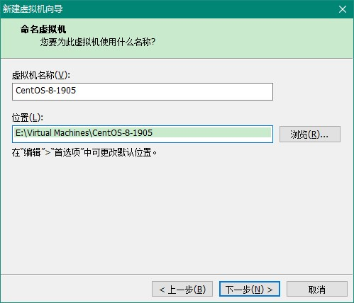
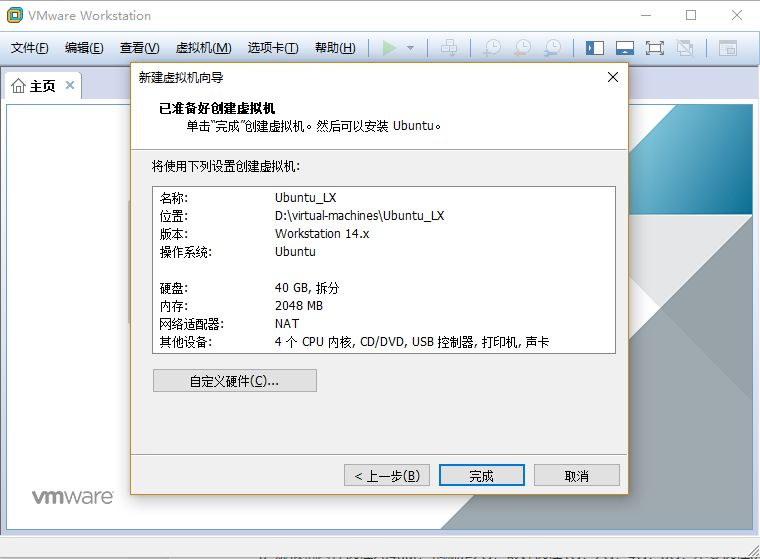
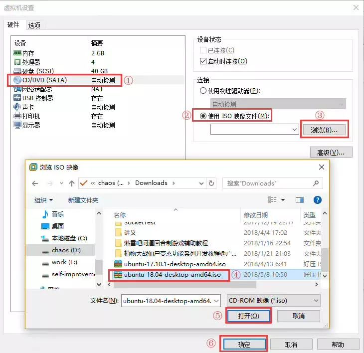

## 1. CentOS-7-x86_64-DVD-1804 版本的安装

### 1.1. 安装相关设置


虚拟机系统内存的可用量设置为2GB，最低不应低于1GB。根据真机的性能设置CPU处理器的数量以及每个处理器的核心数量，并开启虚拟化功能


选择安装源：


软件选择：


安装位置：


网络连接：


设置完成后，点击开始安装


安装的过程点击设置root的密码，也可以点击创建用户（可以暂时不用，后面通过root用户再进行创建）

### 1.2. 网络连接设置

#### 1.2.1. 仅主机模式

1. 为虚拟机添加虚拟网卡


2. 开启修改权限，点击下图的“更改设置”


3. 点击添加网络


4. 添加后会自动分配子网IP，不用修改。点击应用、确定


5. 添加完成后本机的网络上会多出一个对应的网络适配器（本例：VMnet 2），根据虚拟机中的子网IP设置此IP地址


6. 自定义虚拟机的网络适配器，自定义为刚才手动添加的那个网络适配器


#### 1.2.2. NAT 模式

需要将当前虚拟网络设置为【NAT模式】，注意，但只能设置一个网络为NAT模拟，所有如果有几个虚拟机linux系统，都选择那个NAT模式的虚拟网络即可，到时设置不同的IP


### 1.3. 网络配置（旧版本）

#### 1.3.1. VIM 命令配置网络

查看网卡配置：

```bash
cat /etc/sysconfig/network-scripts/ifcfg-eth0
```

概要信息如下：

```properties
DEVICE=eth0 #网卡名称
TYPE=Ethernet #网卡类型
ONBOOT=yes #是否开机启动网卡
BOOTPROTO=static #静态获取 IP，其他取值：dhcp （如果设置 dhcp 下面配置不需要）
IPADDR=192.168.44.100 #ip 地址
GATEWAY=192.168.44.2 #网关
NETMASK=255.255.255.0 #子网掩码
```

#### 1.3.2. setup 设置

`setup`，进行图形化工具修改网卡。具体步骤如下：

1. 选择“网络配置”


2. 选择“设备配置”


3. 选择“第一块网卡”


4. 设置IP地址等详细信息


### 1.4. 网络配置（新版本）参考示例

说明：CentOS 7.0默认安装好之后是没有自动开启网络连接的！

```bash
cd /etc/sysconfig/network-scripts # 进入网络配置文件目录
vi ifcfg-ens33 # 编辑配置文件，添加修改以下内容(注意，ens33是当前linux系统的网卡名称)
```

参考一：（参考设置，具体需要根据文件的内容进行设置，如果是本例centOS7，只关注以下标识修改部分）

```shell
DEVICE=eth0

# 主要修改的部分
BOOTPRPTP=static    # 启用静态IP地址
IPADDR=192.168.12.131
NETMASK=255.255.255.0
# 主要修改的部分

HWADDR=00:50:56:32:4B:4C
IPV6INIT=yes
IPV6_AUTOCONF=yes

# 主要修改的部分
ONBOOT=yes    # 开启自动启用网络连接
# 主要修改的部分
```

参考二：（网上参考）

```shell
HWADDR=00:0C:29:8D:24:73
TYPE=Ethernet
BOOTPROTO=static  #启用静态IP地址
DEFROUTE=yes
PEERDNS=yes
PEERROUTES=yes
IPV4_FAILURE_FATAL=no
IPV6INIT=yes
IPV6_AUTOCONF=yes
IPV6_DEFROUTE=yes
IPV6_PEERDNS=yes
IPV6_PEERROUTES=yes
IPV6_FAILURE_FATAL=no
NAME=eno16777736
UUID=ae0965e7-22b9-45aa-8ec9-3f0a20a85d11
ONBOOT=yes  #开启自动启用网络连接
IPADDR0=192.168.21.128  #设置IP地址
PREFIXO0=24  #设置子网掩码
GATEWAY0=192.168.21.2  #设置网关
DNS1=8.8.8.8  #设置主DNS
DNS2=8.8.4.4  #设置备DNS
```

修改后操作

```bash
:wq!  # 保存退出
service network restart   # 重启网络
ping www.baidu.com  # 测试网络是否正常
ip addr  # 查看IP地址
```

### 1.5. 设置主机名为 www

```shell
hostname  www  # 设置主机名为 www
vi /etc/hostname # 编辑配置文件
www   # 修改 localhost.localdomain 为 www
:wq!  # 保存退出

vi /etc/hosts # 编辑配置文件
127.0.0.1   localhost  www   # 修改localhost.localdomain为www
:wq!  # 保存退出
shutdown -r now  # 重启系统
```

### 1.6. Linux 的静态 ip 地址设置

运行命令

```bash
cd /etc/sysconfig/network-scripts
vi ifcfg-eth0
```

添加或修改如下内容：

```properties
DEVICE=eth0
BOOTPRPTP=static
IPADDR=192.168.12.131
NETMASK=255.255.255.0
HWADDR=00:50:56:32:4B:4C
IPV6INIT=yes
IPV6_AUTOCONF=yes
ONBOOT=yes
```

## 2. CentOS-8-x86_64-1905-dvd1 的安装

### 2.1. 安装相关前虚拟机设置





建议将虚拟机系统内存的可用量设置为 2GB，最低不应低于 1GB


光驱设备此时应在“使用 ISO 镜像文件”中选中了下载好的 CentOS8 系统镜像文件


VM 虚拟机软件为用户提供了 3 种可选的网络模式，分别为桥接模式、NAT 模式与仅主机模式。**下图配置时错误了，是选择『自定义NAT模式』，并选择之前手动创建的网络配置**


其他设置把 USB 控制器、声卡、打印机设备等不需要的设备统统移除掉。移掉声卡后可以避免在输入错误后发出提示声音，确保自己在今后实验中思绪不被打扰。然后单击“关闭”按钮


### 2.2. 安装linux


选择安装源：


软件选择：此次选择带GUI的服务（Server with GUI）

> 注：如果默认Minimal Install 单选按钮安装 RHEL 7 系统，最终导致很多命令不能执行，服务搭建不成功


或者选择服务器，无图形化界面


选择【网络和主机名】，设置Hostname


> 注：上面可以选择开启【以太网(ens33)】，里面可以设置相关ip配置，这样就不需要在安装后再去修改<font color=red>**ifcfg-ens33**</font>，文件也会比不开启时多出标识了主要修改部分的设置

```bash
TYPE="Ethernet"
PROXY_METHOD="none"
BROWSER_ONLY="no"
BOOTPROTO="none"
DEFROUTE="yes"
IPV4_FAILURE_FATAL="no"
IPV6INIT="yes"
IPV6_AUTOCONF="yes"
IPV6_DEFROUTE="yes"
IPV6_FAILURE_FATAL="no"
IPV6_ADDR_GEN_MODE="stable-privacy"
NAME="ens33"
UUID="cb2962ae-ac9d-45ad-ab82-a37912e4f3e3"
DEVICE="ens33"

# 主要修改的部分
ONBOOT="yes"
IPADDR="192.168.137.128"
PREFIX="24"
GATEWAY="192.168.137.1"
DNS1="192.168.137.1"
# 主要修改的部分

IPV6_PRIVACY="no"
```

选择【安装目的地（INSTALLATION DESTINATION）】，选择安装媒介并设置分区。此时不需要进行任何修改，单击左上角的 Done 按钮即可


设置完成后，点击开始安装。然后设置 root 管理员的密码。若坚持用弱口令的密码则需要单击 2 次左上角的 Done 按钮才可以确认


安装完成后单击 重启（Reboot） 按钮

重启系统后将看到系统的初始化界面，单击 `LICENSE INFORMATION` 选项，选中 `I accept the license agreement` 复选框。返回初始化界面，点击【结束配置（FINISH CONFIGURATION）】


设置一些信息，设置密码（123456）


### 2.3. 网络连接设置

#### 2.3.1. 仅主机模式

1. 为虚拟机添加虚拟网卡


2. 选择VMnet1，开启修改权限，点击下图的“更改设置”，以前需要自己添加新的网络，现在直接使用已经创建的虚拟网卡即可


3. 直接使用原来的VMnet1虚拟网卡


4. 自定义虚拟机的网络适配器，自定义为刚才手动添加的那个网络适配器


如果需要虚拟机连接外网，打开控制面板网络设置，配置主机网络共享，让虚拟机可以连接网络，点击属性，共享，然后选择vmnet1，确认，当出现192.168.137.0继续确认


> 注：此时需要将虚拟机的虚拟网卡改成137的网段


#### 2.3.2. NAT模式

扩展：需要将当前虚拟网络设置为【NAT模式】，注意，但只能设置一个网络为NAT模拟，所有如果有几个虚拟机linux系统，都选择那个NAT模式的虚拟网络即可，到时设置不同的IP


### 2.4. 设置IP地址、网关DNS

说明：CentOS 8.0默认安装好之后是没有自动开启网络连接的！

使用root用户进入系统后，使用以下命令

```bash
cd /etc/sysconfig/network-scripts # 进入网络配置文件目录
vi ifcfg-ens33 # 编辑配置文件，添加修改以下内容(注意，ens33是当前linux系统的网卡名称)
```

参考一：（参考设置，具体需要根据文件的内容进行设置，如果是本例centOS 8，只调了以下标识的部分）

```shell
TYPE=Ethernet
PROXY_METHOD=none
BROWSER_ONLY=no

# 主要修改部分
BOOTPROTO=static # 启用静态IP地址
# 主要修改部分

DEFROUTE=yes
IPV4_FAILURE_FATAL=no
IPV6INIT=yes
IPV6_AUTOCONF=yes
IPV6_DEFROUTE=yes
IPV6_FAILURE_FATAL=no
IPV6_ADDR_GEN_MODE=stable-privacy
NAME=ens33
UUID=2957c546-3d5e-4dcf-87ed-23f58a0314f1
DEVICE=ens33

# 主要修改部分
ONBOOT=yes # 开启自动启用网络连接
IPADDR0=192.168.137.128 # 设置IP地址
PERFIXO0=24 # 设置子网掩码
GATEWAY0=192.168.137.1 # 设置网关
NETMASKE0=255.255.255.0 # 设置子网掩码
DNS1=192.168.137.1 # 设置主DNS
```

参考二：（网上参考）

```shell
HWADDR=00:0C:29:8D:24:73
TYPE=Ethernet
BOOTPROTO=static  #启用静态IP地址
DEFROUTE=yes
PEERDNS=yes
PEERROUTES=yes
IPV4_FAILURE_FATAL=no
IPV6INIT=yes
IPV6_AUTOCONF=yes
IPV6_DEFROUTE=yes
IPV6_PEERDNS=yes
IPV6_PEERROUTES=yes
IPV6_FAILURE_FATAL=no
NAME=eno16777736
UUID=ae0965e7-22b9-45aa-8ec9-3f0a20a85d11
ONBOOT=yes  #开启自动启用网络连接
IPADDR0=192.168.21.128  #设置IP地址
PREFIXO0=24  #设置子网掩码
GATEWAY0=192.168.21.2  #设置网关
DNS1=8.8.8.8  #设置主DNS
DNS2=8.8.4.4  #设置备DNS
```

使用`:wq!`命令保存退出，重启系统去查看ip


### 2.5. 其他问题

如果出现主机可以ping通虚拟机，而虚拟机无法ping通主机的情况，一般是主机防火墙的设置问题，通过设置防火墙的高级设置即可，见下图？

### 2.6. 配置静态 IP 地址

1. 查看配置文件

```bash
cat /etc/network/interfaces
```


此种方法是动态获取 ip 地址，但是如果没有 DNS 服务器，就无法获取到 ip 地址了

2. 编辑配置文件`/etc/network/interfaces`

```bash
vi /etc/network/interfaces
```

增加以下内容

```shell
auto ens33
iface ens33 inet static
address 192.168.12.134
netmask 255.255.255.0
gateway 192.168.12.2
dns-nameserver 119.29.29.29
# 或者dns-nameserver 114.114.114.114
```


这句一定需要有，`dns-nameserver 119.29.29.29`。因为以前是 DHCP 解析，所以会自动分配 DNS 服务器地址。而一旦设置为静态 IP 后就没有自动获取到 DNS 服务器了，需要自己设置一个。

设置完重启电脑后，`/etc/resolv.conf` 文件中会自动添加 `nameserver 119.29.29.29`(或者`nameserver 8.8.8.8`)可以根据访问速度，选择合适的公共 DNS。


3. 输入`reboot`命令，重启操作系统，验证ip地址是否永久性


4. ping域名进行测试是否可以联网，使用以下命令重启网卡

```bash
/etc/init.d/networking restart
```

5. 重启系统或者网络后还是无法联网，编辑`/etc/resolvconf/resolv.conf.d/base`文件，增加nameserver部分

```bash
vim /etc/resolvconf/resolv.conf.d/base

# 增加以下内容
nameserver 119.29.29.29
```

## 3. Ubuntu 系统安装

> 以下安装示例使用 VMware 14.1.1 版本

### 3.1. Ubuntu 镜像的下载

获取 Ubuntu18.04 64 位操作系统的镜像方法：

1. Ubuntu官网
2. 其他软件中心

### 3.2. 虚拟机硬件配置

在正式安装虚拟机之前，要先配置一下电脑，比如给它分配多大内存，CPU几核的，网络类型等等

1. 虚拟机安装完毕之后，界面如下图所示，点击图中红圈图标，开始创建一个新的虚拟机。


2. 在弹出的对话框中选择自定义，然后点击下一步：


3. 在「虚拟机硬件兼容性」里选择默认的即可，直接下一步：


4. 在「安装客户机操作系统」里选择「稍后安装操作系统」，然后点击下一步：


5. 依然选择默认的，直接下一步：


6. 在这一步「命名虚拟机」里，给自己的虚拟机命个名称，比如 `Ubuntu_LX`，再选择要安装的位置。虚拟机所产生的文件比较大，所以选择位置所在的磁盘最好剩余空间大一些。


7. 虚拟机处理器数量及内核都选择2，对于开发来说够用了。即使不够用的话，这个参数也是可以修改的。


8. 虚拟机内存选择2048M，也就是2G，最好选择1G，2G，4G，8G，不要选择3G这样的。这个参数后期也可以修改。


9. 后面这几步都可以直接「下一步即可」，设置网络连接，选择 NAT 模式


10. I/O 控制器，选择推荐的即可


11. 磁盘类型，选择推荐


12. 磁盘设置


13. 设置磁盘大小，点选『将虚拟磁盘拆分成多个文件』选项。这里的磁盘空间20G不够的话可以选择40G，这个是动态的，也就是不是一下子就占用了磁盘40G，而是用多少占多少。


14. 磁盘文件保存的名称


15. 确认完成创建



16. 经过以上几步完成之后，虚拟机创建成功：


### 3.3. Ubuntu 镜像安装

虚拟机硬件配置好之后，接下来正式安装Ubuntu操作系统。

1. 点击「编辑虚拟机设置」
2. 在弹出的菜单里，从左边选择 「CD/DVD(SATA)」 ，然后在右边选择「使用ISO镜像文件」，再点击浏览，找到Ubuntu镜像。



3. 之后点击确定，再点击「开启虚拟机」 。
4. 虚拟机开启之后，选择「Install Ubuntu」。左边的语言选择，是指系统语言。做开发的，建议语言什么的都选择英语。


5. 接下来这步选择的是键盘布局。这边所使用的布局是美国标准的，所以都选择English(US)。


6. 接下来这一步直接默认：


7. 在「Installation Type」里也是默认即可，直接点击「Install Now」，之后的弹出窗口里点击「continue」：


8. 在「Where Are You?」地图里点击一下大中国，然后点击「continue」：


9. 在「Who Are You?」填入个人基本信息，然后点击「continue」，接下来就进入了下载安装的过程，整个过程大概需要20分钟。


10. 安装完毕之后选择 「restart now」，重启虚拟机。至此，虚拟机及Linux系统均已经安装完成。


