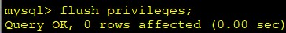
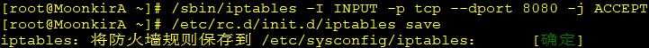

## 1. Linux 软件安装前置工作

### 1.1. 上传软件安装包

如果通过安装包方式安装所需的软件，则要通过 SSH 远程连接工具，上传安装包文件到 Linux 系统。


### 1.2. rz / sz 命令

rz、sz 命令用于上传、下载数据。但此两个命令非系统自带，需要安装 lrzsz。可以通过 yum 工具在线安装

```bash
yum -y install lrzsz 
```

> ~~使用 `rz` 命令上传的默认放到根目录（`/`）下（如果使用其他用户上传的话，再验证是默认存放到哪个的目录中？？？）~~

## 2. JDK 的安装

### 2.1. 解压版 JDK

- 步骤1：查看当前 Linux 系统是否已经安装 java

```bash
rpm -qa | grep java
```


> Notes: rpm 与软件相关命令，相当于 window 下的软件助手，用来管理软件

- 步骤2：卸载两个 openJDK

```bash
rpm -e --nodeps 要卸载的软件
```


- 步骤3：上传 jdk 到 linux 系统。通过 rz 命令或者其他 ftp 工具
- 步骤4：解压 jdk 到 `/usr/local` 下

```bash
tar –zxvf jdk-7u71-linux-i586.tar.gz –C /usr/local
```


- 步骤5：配置 jdk 环境变量，打开 `/etc/profile` 配置文件

```bash
cd etc/
vim profile
# 或者
vim /etc/profile
```

将下面配置拷贝进去

```properties
#set java environment
JAVA_HOME=/usr/local/jdk1.7.0_71
CLASSPATH=.:$JAVA_HOME/lib.tools.jar
PATH=$JAVA_HOME/bin:$PATH
export JAVA_HOME CLASSPATH PATH
```


- 步骤6：重新加载 `/etc/profile` 配置文件，并测试

```bash
source /etc/profile
java -version
```


### 2.2. 安装版 JDK

使用 rz 命令上传 JDK 安装包后，到安装包所在目录，执行以下命令进行安装。

```bash
rpm -ivh jdk-8u162-linux-x64.rpm
```

JDK 默认安装在 `/usr/java` 目录。执行 `java -version` 命令查看信息是否正常，验证安装是否成功。

### 2.3. 配置 JDK 环境变量（安装版与解压版一致）

安装完 jdk-xxxx-linux-x64.rpm 后不用配置环境变量也可以正常执行 `javac`、`java–version` 等操作，则可不进行 JDK 环境变量的配置。如有需要则可如下配置：

- 修改系统环境变量文件

```
vi /etc/profile
```

- 向文件里面追加以下内容（根据显示安装的位置与版本修改）

```properties
JAVA_HOME=/usr/java/jdk1.8.0_181-amd64
JRE_HOME=/usr/java/jdk1.8.0_181-amd64/jre
PATH=$PATH:$JAVA_HOME/bin:$JRE_HOME/bin
CLASSPATH=:$JAVA_HOME/lib/dt.jar:$JAVA_HOME/lib/tools.jar:$JRE_HOME/lib
export JAVA_HOME JRE_HOME PATH CLASSPATH
```

- 使修改内容立即生效

```bash
source /etc/profile
```

- 查看系统环境状态（PATH 值）

```bash
echo $PATH
```

## 3. MySQL 的安装

### 3.1. 安装前置检查

- 查看 CentOS 自带的 MySql 与 mariadb 安装情况。

```bash
rpm -qa | grep -i mysql
rpm -qa | grep mariadb
```


> Tips: `grep -i` 是不分大小写字符查询，只要含有 mysql 就显示

- 卸载自带的 mysql 与 mariadb（如有）

```bash
rpm -e --nodeps mysql-libs-5.1.71.1.e16.i686
rpm -e --nodeps mariadb-libs-5.5.56-2.el7.x86_64
```

> Notes: 通常要卸载 mariadb，因为会与 MySQL 冲突

### 3.2. 安装服务器与客户端

- 上传 MySQL 压缩包到 linux
- 解压 MySQL 到 `/usr/local/` 下的 mysql 目录（mysql目录需要手动创建）内

```bash
cd /usr/local
mkdir mysql
tar -xvf MySQL-5.6.22-1.el6.i686.rpm-bundle.tar -C /usr/local/mysql
```


- 在 `/usr/local/mysql` 目录下安装 MySQL

```shell
# 先安装服务器端
rpm -ivh MySQL-server-5.6.22-1.el6.i686.rpm
# 后安装客户端
rpm -ivh MySQL-client-5.6.22-1.el6.i686.rpm
```


- 安装完成后，查看 mysql 进程

```bash
ps –ef | grep mysql
```


### 3.3. 启动 MySQL

```bash
service mysql start
```


### 3.4. 配置系统服务与开机自动启动

将 MySQL 加到系统服务中并设置开机启动

```shell
# 加入到系统服务
chkconfig --add mysql
# 设置自动启动
chkconfig mysql on
```


### 3.5. 登录 MySQL

MySQL 安装好后会生成一个临时随机密码，存储位置在 `/root/.mysql_secret`。可以使用软件查看密码后，


使用文本打开可以查看

```
# The random password set for the root user at Thu Dec 28 12:07:32 2017 (local time): bOoVxlBLrrjIsqIt
```

登陆 MySQL 后再修改密码即可。

```bash
mysql –u root –p
```

### 3.6. 修改 MySQL 登陆密码

登陆 MySQL 后，执行以下命令修改密码

```sql
set password = password('密码'); 
```


> Notes: password 函数的参数是密码

### 3.7. 开启 MySQL 的远程登录权限

默认情况下 MySQL 为安全起见，不支持远程登录 MySQL，所以需要设置开启远程登录 MySQL 的权限。登录 MySQL 后输入如下命令：

```bash
grant all privileges on *.* to 'root' @'%' identified by '123456';
flush privileges;
```




> Notes: 前面已经将 root 账号的密码修改 123456

### 3.8. 开放 Linux 的对外访问的端口 3306

```shell
/sbin/iptables -I INPUT -p tcp --dport 3306 -j ACCEPT
# 将修改永久保存到防火墙中
/etc/rc.d/init.d/iptables save
```


## 4. CentOS 7.4 安装与配置 MySQL 5.7.21

### 4.1. 环境

- 系统环境：centos-7.4 64位
- 安装方式：rpm 安装
- 软件：mysql-5.7.21-1.el7.x86_64.rpm-bundle.tar
- 描述：上述的 tar 包中已经包含需要安装的 rpm，所以只需要将其放置到系统中使用 tar 命令解包即可。 
- Mysql 的下载地址：http://dev.mysql.com/downloads/mysql/


### 4.2. 查询系统原 mariadb 版本

查看 MySql 与 mariadb 安装情况。`grep -i` 命令不分大小写字符查询，只要含有 mysql 就显示

```bash
rpm -qa | grep -i mysql 
rpm -qa | grep mariadb
```


卸载 mariadb 否则会与 mysql 冲突

```bash
rpm -e --nodeps mariadb-libs-5.5.56-2.el7.x86_64
```

### 4.3. 安装

使用 winSCP 等其他远程软件将下载的 mysql-5.7.21-1.el7.x86_64.rpm-bundle.tar 传到虚拟机系统的 /root 目录下：


在终端上进入 /root 目录，对 mysql-5.7.21-1.el7.x86_64.rpm-bundle.tar 解包，若不是压缩文件不需要解压缩。

```bash
tar -xvf mysql-5.7.21-1.el7.x86_64.rpm-bundle.tar
```


解压后，执行如下安装命令：

```shell
# 1、安装 mysql-community-common
rpm -ivh mysql-community-common-5.7.21-1.el7.x86_64.rpm

# 2、安装 mysql-community-libs
rpm -ivh mysql-community-libs-5.7.21-1.el7.x86_64.rpm

# 3、安装 mysql-community-client 
rpm -ivh mysql-community-client-5.7.21-1.el7.x86_64.rpm

# 4、安装 mysql-community-server
yum -y install perl
rpm -ivh mysql-community-server-5.7.21-1.el7.x86_64.rpm

# 5、安装 mysql-community-devel
rpm -ivh mysql-community-devel-5.7.21-1.el7.x86_64.rpm
```

安装完成。MySql 默认安装文件位置：

```shell
/var/lib/mysql/    # 数据库目录
/usr/share/mysql   # 配置文件目录
/usr/bin           # 相关命令目录
/etc/my.cnf        # 核心配置文件
```

### 4.4. 配置

#### 4.4.1. MySQL 相关命令

MySQL 启动/重启/停止/查看状态等相关命令

```shell
# 启动 MySQL
service mysqld start
# 重启 MySQL
service mysqld restart
# 停止 MySQL
service mysqld stop
# 查看 MySQL 状态
service mysqld status
```

#### 4.4.2. 设置自启动

```shell
# 设置开机启动Mysql
systemctl enable mysqld

# 设置开机不启动Mysql
systemctl disable mysqld

# 查看mysql进程
ps –ef | grep -i mysqld
```

#### 4.4.3. 修改 root 密码

MySQL 安装成功后，会生成一个临时密码，首次登录需要输入此密码，所以需要查看该临时密码，登陆后再修改密码。临时密码的位置是 `/var/log/mysqld.log`

```bash
grep password /var/log/mysqld.log
```


使用 root 用户登录

```shell
输入 /var/log/mysqld.log 文件中的临时密码
mysql –uroot –p
```

登录后修改密码

```sql
set password = password('密码');
```

> Notes: 密码必须包含大小写字母、数字、特殊符号

#### 4.4.4. 设置允许远程访问

设置远程访问，使用修改后的密码登陆 MySQL。（假设是密码是 Root_123）

```bash
mysql -uroot –p

mysql> grant all privileges on  *.*  to  'root' @'%'  identified by 'Root_123';
mysql> flush privileges;
```

#### 4.4.5. 设置 3306 端口开放访问

退出 MySQL 后，设置防火墙中打开 3306 端口

```bash
firewall-cmd --zone=public --add-port=3306/tcp --permanent
```

参数解析：

- `-–zone`：作用域
- `-–add-port`：添加端口，格式为：`端口/通讯协议`
- `-–permanent`：永久生效，没有此参数重启后失效

防火墙相关操作命令：

```shell
# 重启防火墙
firewall-cmd --reload
# 查看已经开放的端口
firewall-cmd --list-ports

# 停止防火墙
systemctl stop firewalld.service
# 启动防火墙
systemctl start firewalld.service
# 禁止防火墙开机启动
systemctl disable firewalld.service
```

## 5. tomcat 的安装

1. 上传 Tomcat 压缩包到 linux 上
2. 解压 Tomcat 到 `/usr/local` 下

```bash
tar –xvf apache-tomcat-7.0.57.tar.gz –C /usr/local
```


### 5.1. 开放 Linux 的对外访问的端口 8080

如启动 tomcat 后需要外部访问该服务器，应该要开放 tomcat 的默认对外访问端口 8080。

- 开放8080端口（方式一）：

```bash
/sbin/iptables -I INPUT -p tcp --dport 8080 -j ACCEPT
/etc/rc.d/init.d/iptables save
```



window 系统下，可以使用 telnet 命令查看 linux 系统是否开放 8080 端口


开放8080端口（方式二）：

```shell
firewall-cmd --zone=public --add-port=8080/tcp --permanent
```

参数说明：

- `-–zone`：作用域
- `-–add-port`：添加端口，格式为：`端口/通讯协议`
- `--permanent`：永久生效，没有此参数重启后失效

防火墙其他操作：

```shell
# 重启防火墙
firewall-cmd --reload
# 查看已经开放的端口
firewall-cmd --list-ports

# 停止防火墙
systemctl stop firewalld.service
# 启动防火墙
systemctl start firewalld.service
# 禁止防火墙开机启动
systemctl disable firewalld.service
```

### 5.2. 启动与关闭 Tomcat

- 进入 tomcat 的 bin 目录下启动：`./startup.sh`
- 进入 tomcat 的 bin 目录下关闭：`./shutdown.sh`

### 5.3. 将 web 应用程序部署到 tomcat 的步骤

1. 打开 myeclipse/idea，将开发完成的 web 应用程序导出 war 文件
2. 选择项目，鼠标右键点击“export” -> 搜索 “war” -> “选择要导出的位置”


3. 生成文件：xxx.war
4. 将 war 文件上传到 linux 的 tomcat/webapps 里面
5. 上传后刷新项目就生成了，再使用 linux 的 IP 地址加项目名访问即可


