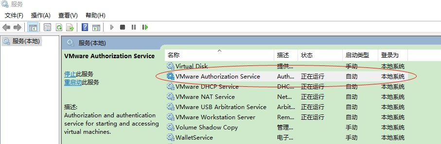

# Linux安装

## 1. 虚拟机

虚拟机：指通过软件模拟的具有完整硬件系统功能的、运行在一个完全隔离环境中的完整计算机系统。

### 1.1. 虚拟机软件

- VMware Workstation（中文名“威睿工作站”）是一款功能强大的桌面虚拟计算机软件，收费（VMware-workstation-full-12.0.0-2985596.exe），需要使用VMware.Workstation.v12.0.0.Keymaker.rar破解
- VirtualBox 是一款开源虚拟机软件

### 1.2. 虚拟机其他问题

如果运行提示没有开启虚拟服务，运行系统的【服务】，将`VMware Authorization Service`启动即可



## 2. CentOS-7-x86_64-DVD-1804 版本的安装

### 2.1. 安装相关设置


虚拟机系统内存的可用量设置为2GB，最低不应低于1GB。根据真机的性能设置CPU处理器的数量以及每个处理器的核心数量，并开启虚拟化功能


选择安装源：


软件选择：


安装位置：


网络连接：


设置完成后，点击开始安装


安装的过程点击设置root的密码，也可以点击创建用户（可以暂时不用，后面通过root用户再进行创建）

### 2.2. 设置IP地址、网关DNS

（1）为虚拟机添加虚拟网卡


（2）开启修改权限，点击下图的“更改设置”


（3）点击添加网络


（4）添加后会自动分配子网IP，不用修改。点击应用、确定


（5）添加完成后本机的网络上会多出一个对应的网络适配器（本例：VMnet 2），根据虚拟机中的子网IP设置此IP地址


（6）自定义虚拟机的网络适配器，自定义为刚才手动添加的那个网络适配器


需要将当前虚拟网络设置为【NAT模式】，注意，但只能设置一个网络为NAT模拟，所有如果有几个虚拟机linux系统，都选择那个NAT模式的虚拟网络即可，到时设置不同的IP


### 2.3. 网络配置参考示例

说明：CentOS 7.0默认安装好之后是没有自动开启网络连接的！

```bash
cd /etc/sysconfig/network-scripts # 进入网络配置文件目录
vi ifcfg-ens33 # 编辑配置文件，添加修改以下内容(注意，ens33是当前linux系统的网卡名称)
```

参考一：（参考设置，具体需要根据文件的内容进行设置，如果是本例centOS7，只关注以下标识修改部分）

```shell
DEVICE=eth0

# 主要修改的部分
BOOTPRPTP=static    # 启用静态IP地址
IPADDR=192.168.12.131
NETMASK=255.255.255.0
# 主要修改的部分

HWADDR=00:50:56:32:4B:4C
IPV6INIT=yes
IPV6_AUTOCONF=yes

# 主要修改的部分
ONBOOT=yes    # 开启自动启用网络连接
# 主要修改的部分
```

参考二：（网上参考）

```shell
HWADDR=00:0C:29:8D:24:73
TYPE=Ethernet
BOOTPROTO=static  #启用静态IP地址
DEFROUTE=yes
PEERDNS=yes
PEERROUTES=yes
IPV4_FAILURE_FATAL=no
IPV6INIT=yes
IPV6_AUTOCONF=yes
IPV6_DEFROUTE=yes
IPV6_PEERDNS=yes
IPV6_PEERROUTES=yes
IPV6_FAILURE_FATAL=no
NAME=eno16777736
UUID=ae0965e7-22b9-45aa-8ec9-3f0a20a85d11
ONBOOT=yes  #开启自动启用网络连接
IPADDR0=192.168.21.128  #设置IP地址
PREFIXO0=24  #设置子网掩码
GATEWAY0=192.168.21.2  #设置网关
DNS1=8.8.8.8  #设置主DNS
DNS2=8.8.4.4  #设置备DNS
```

修改后操作

```bash
:wq!  # 保存退出
service network restart   # 重启网络
ping www.baidu.com  # 测试网络是否正常
ip addr  # 查看IP地址
```

### 2.4. 设置主机名为www

```bash
hostname  www  # 设置主机名为www
vi /etc/hostname # 编辑配置文件
www   # 修改localhost.localdomain为www
:wq!  # 保存退出
vi /etc/hosts # 编辑配置文件
127.0.0.1   localhost  www   # 修改localhost.localdomain为www
:wq!  # 保存退出
shutdown -r now  # 重启系统
```

## 3. CentOS-8-x86_64-1905-dvd1 的安装

### 3.1. 安装相关前虚拟机设置


建议将虚拟机系统内存的可用量设置为 2GB，最低不应低于 1GB


光驱设备此时应在“使用 ISO 镜像文件”中选中了下载好的 CentOS8 系统镜像文件


VM 虚拟机软件为用户提供了 3 种可选的网络模式，分别为桥接模式、NAT 模式与仅主机模式。这里选择“仅主机模式”


- **桥接模式**：相当于在物理主机与虚拟机网卡之间架设了一座桥梁，从而可以通过物理主机的网卡访问外网。
- **NAT 模式**：让 VM 虚拟机的网络服务发挥路由器的作用，使得通过虚拟机软件模拟的主机可以通过物理主机访问外网，在真机中 NAT 虚拟机网卡对应的物理网卡是 VMnet8。
- **仅主机模式**：仅让虚拟机内的主机与物理主机通信，不能访问外网，在真机中仅主机模式模拟网卡对应的物理网卡是 VMnet1

其他设置把 USB 控制器、声卡、打印机设备等不需要的设备统统移除掉。移掉声卡后可以避免在输入错误后发出提示声音，确保自己在今后实验中思绪不被打扰。然后单击“关闭”按钮


### 3.2. 安装linux


选择安装源：


软件选择：此次选择带GUI的服务（Server with GUI）

> 注：如果默认Minimal Install 单选按钮安装 RHEL 7 系统，最终导致很多命令不能执行，服务搭建不成功


或者选择服务器，无图形化界面


选择【网络和主机名】，设置Hostname


> 注：上面可以选择开启【以太网(ens33)】，里面可以设置相关ip配置，这样就不需要在安装后再去修改<font color=red>**ifcfg-ens33**</font>，文件也会比不开启时多出标识了主要修改部分的设置

```bash
TYPE="Ethernet"
PROXY_METHOD="none"
BROWSER_ONLY="no"
BOOTPROTO="none"
DEFROUTE="yes"
IPV4_FAILURE_FATAL="no"
IPV6INIT="yes"
IPV6_AUTOCONF="yes"
IPV6_DEFROUTE="yes"
IPV6_FAILURE_FATAL="no"
IPV6_ADDR_GEN_MODE="stable-privacy"
NAME="ens33"
UUID="cb2962ae-ac9d-45ad-ab82-a37912e4f3e3"
DEVICE="ens33"

# 主要修改的部分
ONBOOT="yes"
IPADDR="192.168.137.128"
PREFIX="24"
GATEWAY="192.168.137.1"
DNS1="192.168.137.1"
# 主要修改的部分

IPV6_PRIVACY="no"
```

选择【安装目的地（INSTALLATION DESTINATION）】，选择安装媒介并设置分区。此时不需要进行任何修改，单击左上角的 Done 按钮即可


设置完成后，点击开始安装。然后设置 root 管理员的密码。若坚持用弱口令的密码则需要单击 2 次左上角的 Done 按钮才可以确认


安装完成后单击 重启（Reboot） 按钮

重启系统后将看到系统的初始化界面，单击 `LICENSE INFORMATION` 选项，选中 `I accept the license agreement` 复选框。返回初始化界面，点击【结束配置（FINISH CONFIGURATION）】


设置一些信息，设置密码（123456）


### 3.3. 设置IP地址、网关DNS

（1）为虚拟机添加虚拟网卡


（2）选择VMnet1，开启修改权限，点击下图的“更改设置”，以前需要自己添加新的网络，现在直接使用已经创建的虚拟网卡即可


（3）直接使用原来的VMnet1虚拟网卡


（4）自定义虚拟机的网络适配器，自定义为刚才手动添加的那个网络适配器


如果需要虚拟机连接外网，打开控制面板网络设置，配置主机网络共享，让虚拟机可以连接网络，点击属性，共享，然后选择vmnet1，确认，当出现192.168.137.0继续确认


> 注：此时需要将虚拟机的虚拟网卡改成137的网段


扩展：需要将当前虚拟网络设置为【NAT模式】，注意，但只能设置一个网络为NAT模拟，所有如果有几个虚拟机linux系统，都选择那个NAT模式的虚拟网络即可，到时设置不同的IP


说明：CentOS 8.0默认安装好之后是没有自动开启网络连接的！

使用root用户进入系统后，使用以下命令

```bash
cd /etc/sysconfig/network-scripts # 进入网络配置文件目录
vi ifcfg-ens33 # 编辑配置文件，添加修改以下内容(注意，ens33是当前linux系统的网卡名称)
```

参考一：（参考设置，具体需要根据文件的内容进行设置，如果是本例centOS 8，只调了以下标识的部分）

```shell
TYPE=Ethernet
PROXY_METHOD=none
BROWSER_ONLY=no

# 主要修改部分
BOOTPROTO=static # 启用静态IP地址
# 主要修改部分

DEFROUTE=yes
IPV4_FAILURE_FATAL=no
IPV6INIT=yes
IPV6_AUTOCONF=yes
IPV6_DEFROUTE=yes
IPV6_FAILURE_FATAL=no
IPV6_ADDR_GEN_MODE=stable-privacy
NAME=ens33
UUID=2957c546-3d5e-4dcf-87ed-23f58a0314f1
DEVICE=ens33

# 主要修改部分
ONBOOT=yes # 开启自动启用网络连接
IPADDR0=192.168.137.128 # 设置IP地址
PERFIXO0=24 # 设置子网掩码
GATEWAY0=192.168.137.1 # 设置网关
NETMASKE0=255.255.255.0 # 设置子网掩码
DNS1=192.168.137.1 # 设置主DNS
```

参考二：（网上参考）

```shell
HWADDR=00:0C:29:8D:24:73
TYPE=Ethernet
BOOTPROTO=static  #启用静态IP地址
DEFROUTE=yes
PEERDNS=yes
PEERROUTES=yes
IPV4_FAILURE_FATAL=no
IPV6INIT=yes
IPV6_AUTOCONF=yes
IPV6_DEFROUTE=yes
IPV6_PEERDNS=yes
IPV6_PEERROUTES=yes
IPV6_FAILURE_FATAL=no
NAME=eno16777736
UUID=ae0965e7-22b9-45aa-8ec9-3f0a20a85d11
ONBOOT=yes  #开启自动启用网络连接
IPADDR0=192.168.21.128  #设置IP地址
PREFIXO0=24  #设置子网掩码
GATEWAY0=192.168.21.2  #设置网关
DNS1=8.8.8.8  #设置主DNS
DNS2=8.8.4.4  #设置备DNS
```

使用`:wq!`命令保存退出，重启系统去查看ip


### 3.4. 其他问题

如果出现主机可以ping通虚拟机，而虚拟机无法ping通主机的情况，一般是主机防火墙的设置问题，通过设置防火墙的高级设置即可，见下图？

## 4. ubuntu-16.04.3-server-amd64 的安装

### 4.1. 配置静态IP地址

1. 查看配置文件

```bash
cat /etc/network/interfaces
```


此种方法是动态获取ip地址，但是如果没有DNS服务器，就无法获取到ip地址了

2. 编辑配置文件`/etc/network/interfaces`

```bash
vi /etc/network/interfaces
```

增加以下内容

```shell
auto ens33
iface ens33 inet static
address 192.168.12.134
netmask 255.255.255.0
gateway 192.168.12.2
dns-nameserver 119.29.29.29
# 或者dns-nameserver 114.114.114.114
```


这句一定需要有，`dns-nameserver 119.29.29.29`。因为以前是DHCP解析，所以会自动分配DNS 服务器地址。而一旦设置为静态IP后就没有自动获取到DNS服务器了，需要自己设置一个

设置完重启电脑后，`/etc/resolv.conf` 文件中会自动添加 `nameserver 119.29.29.29`(或者nameserver 8.8.8.8)可以根据访问速度，选择合适的公共DNS


3. 输入`reboot`命令，重启操作系统，验证ip地址是否永久性


4. ping域名进行测试是否可以联网，使用以下命令重启网卡

```bash
/etc/init.d/networking restart
```

5. 重启系统或者网络后还是无法联网，编辑`/etc/resolvconf/resolv.conf.d/base`文件，增加nameserver部分

```bash
vim /etc/resolvconf/resolv.conf.d/base

# 增加以下内容
nameserver 119.29.29.29
```


