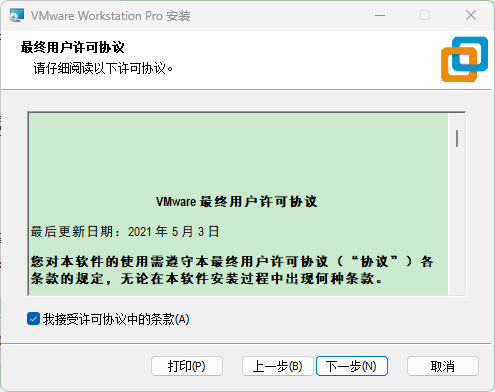
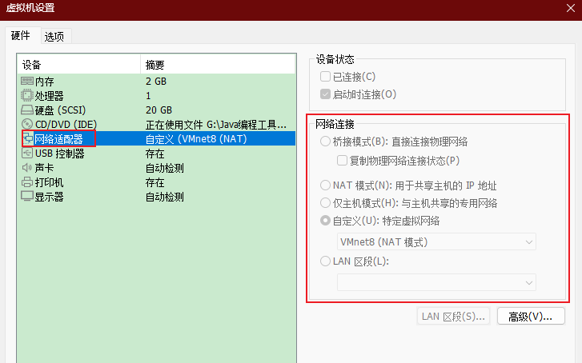
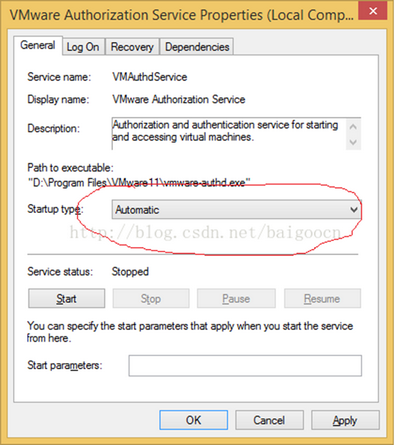
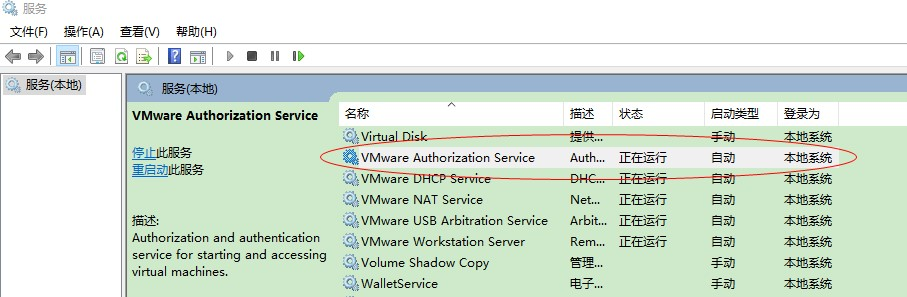

## 1. 虚拟机

虚拟机：指通过软件模拟的具有完整硬件系统功能的、运行在一个完全隔离环境中的完整计算机系统。它模拟标准 PC 环境，和真实的计算机一样，都有芯片组、CPU、内存、显卡、声卡、网卡、软驱、硬盘、光驱、串口、并口、USB控制器等。

常用的虚拟机软件：

- VMware Workstation（中文名“威睿工作站”）是一款功能强大、<u>收费</u>的桌面虚拟计算机软件，需要使用破解或者网上搜索“永久许可证激活秘钥”
- VirtualBox 是一款开源虚拟机软件

## 2. VMware workstation

VMware Workstation Pro（曾用名 VMware Workstation）是 VMware 公司推出的一款桌面虚拟计算软件，具有 Windows、Linux 版本。此软件可以提供虚拟机功能，使计算机可以同时运行多个不同操作系统。2015年，VMware Workstation 发表12版，VMware Player 转型为 VMware Workstation 的免费版并改名为 VMware Workstation Player，VMware Workstation 的付费版定名为 VMware Workstation Pro。

> 官网：https://www.vmware.com/cn.html

### 2.1. VMware 安装

> 此安装过程是 win 11 环境下进行，安装版本是 VMware-workstation-full-17.0.2-21581411

1. 开始安装

 

2. 选择安装位置，下面选项根据需要勾选


3. 此处两个选项都不选也不会影响虚拟机的使用，按需勾选。


4. 创建快捷方式


5. 开始安装

 

6. 输入注册密钥或者直接完成


### 2.2. VMware 虚拟机设置说明

#### 2.2.1. 网络适配器的网络连接选项说明



- **桥接模式**：相当于在物理主机与虚拟机网卡之间架设了一座桥梁，从而可以通过物理主机的网卡访问外网。
- **NAT 模式**：让 VM 虚拟机的网络服务发挥路由器的作用，使得通过虚拟机软件模拟的主机可以通过物理主机访问外网，在真机中 NAT 虚拟机网卡对应的物理网卡是 VMnet8。
- **仅主机模式**：仅让虚拟机内的主机与物理主机通信，不能访问外网，在真机中仅主机模式模拟网卡对应的物理网卡是 VMnet1

### 2.3. VMware 相关问题

#### 2.3.1. 解决提示 VMware Workstation cannot connect to the virtual machine 的问题

如果打开 VMware Workstation 虚拟机时，弹出对话框提示下述问题：

```
VMware Workstation cannot connect to the virtual machine. 
Make sure you have rights to run the program, access all directories the program uses, and access all directories for temporary files.
The VMware Authorization Service is not running。
```


从提示消息可以看到，问题在于 VMware 授权服务没有开启，具体处理方法如下：

依次打开 "This PC（我的电脑）" -> 右键"manage（管理）" -> "Service and Applications（服务和应用）" -> "Service（服务）" -> 在右栏找到 `Vmware Authorization Service`，点击右键属性


将 Startup Type（启动类型）改为 Automatic（自动），点击“OK”即可



在 `Vmware Authorization Service` 上，点击右键 start（开始），即可看到已经在 Running（运行）.



## 3. Multipass 简介

> - 官网：https://multipass.run/
> - 文档：https://multipass.run/docs/

一款虚拟机工具：Multipass，非常轻量级的虚拟机命令管理工具。运行环境支持 Linux、Windows 和 macOS。

### 3.1. 相关链接

- [别用 VMware 了，这款虚拟机简单、轻量、好用还免费...](https://mp.weixin.qq.com/s/Q-iVWgBQ59cyru8TfH4BNg)
