## 1. Python

### 1.1. 概述

Python 是一个高层次的结合了解释性、编译性、互动性和面向对象的脚本语言。Python 的设计具有很强的可读性，相比其他语言经常使用英文关键字，其他语言的一些标点符号，它具有比其他语言更有特色语法结构。

- **平台语言**：可以运行在不同的操作系统上。
- **Python 是一种解释型语言**：这意味着开发过程中没有了编译这个环节，类似于 PHP 和 Perl 语言。
- **Python 是交互式语言**：这意味着，可以在一个 Python 提示符 `>>>` 后直接执行代码。
- **Python 是面向对象语言**：这意味着 Python 支持面向对象的风格或代码封装在对象的编程技术。
    - 函数、模块、数字、字符串都是对象，在 Python 中一切皆对象。
    - 完全支持继承、重载、多重继承。
    - 支持重载运算符，也支持泛型设计
- **Python 是初学者的语言**：Python 对初级程序员而言，是一种伟大的语言，它支持广泛的应用程序开发，从简单的文字处理到 WWW 浏览器再到游戏。

### 1.2. 官方资源

- 官网：https://www.python.org/
- Python 官方文档：https://docs.python.org/zh-cn/3/

### 1.3. 语言的区别

#### 1.3.1. 解释型语言

解释型语言是在运行的时候将程序翻译成机器语言，所以运行速度相对于编译型语言要慢。比如 PHP、Python

- 优点：可移植性较好，只要有解释环境，可在不同的操作系统上运行
- 缺点：运行需要解释环境，运行起来比编译的要慢，占用资源也要多一些，代码效率低，代码修改后就可运行，不需要编译过程

#### 1.3.2. 编译型语言

编译型语言在程序执行之前，有一个单独的编译过程，将程序翻译成机器语言，以后执行这个程序的时候，就不用再进行翻译了。比如 C、C++、Java

- 优点：运行速度快，代码效率高，编译后的程序不可修改，保密性较好
- 缺点：代码需要经过编译方可运行，可移植性差，只能在兼容的操作系统上运行

### 1.4. Python 应用

- **Web后端开发**：Python 在构建网站后端服务中发挥着重要作用。
- **网络爬虫**：Python 被广泛用于编写网络爬虫，进行数据抓取和处理。
- **人工智能**：Python 是人工智能领域的主要编程语言之一，用于机器学习和深度学习。
- **自动化运维**：Python 在自动化运维中用于编写脚本，提高运维效率。
- **网络编程**：Python 支持网络编程，用于开发网络应用和工具。
- **国内应用情况**：国内许多知名公司，如豆瓣、百度、阿里巴巴、新浪等，都在其技术栈中使用 Python。
- **国外应用情况**：国际上，Google、Facebook、Twitter 等大型科技公司也广泛使用 Python。
- **就业优势**：即使不是程序员，Python 在日常工作中的应用也越来越广泛。掌握 Python 技能的求职者在投简历时可能会被优先考虑。
- **教育支持**：
    - 大学生和在校的学生可以参加与 Python 相关的考试和课程。
    - 国务院印发了《新一代人工智能发展规划》。
    - 教育部出台了《高等学校人工智能创新行动计划》，这些政策都表明了 Python 在教育领域的重视和推广。

### 1.5. Python 的版本

#### 1.5.1. 概述

Python 有两个主要版本：**Python 2** 和 **Python 3**。

- **Python 2.x**：是过去的版本（**官方已经停止维护**）。
  - 解释器名称是 `python`。
- **Python 3.x**：现在是主流版本，并且是未来发展的方向。
  - 解释器名称是 `python3`。
  - 相对于 Python 的早期版本，Python 3.x 是一个较大的升级。
  - 在设计时没有考虑向下兼容，以避免带入过多累赘。许多基于早期 Python 版本设计的程序无法在 Python 3.0 上正常执行。

> 新的 Python 程序建议使用 Python 3.x 版本的语法

#### 1.5.2. Python 的 3.x 版本

Python 的 3.0 版本，常被称为 Python 3000，或简称 Py3k。相对于 Python 的早期版本，这是一个较大的升级。为了不带入过多的累赘，Python 3.0 在设计的时候没有考虑向下兼容。

> 以下笔记主要针对 Python 3.x 版本的学习。*官方宣布，2020 年 1 月 1 日， 停止 Python 2 的更新。Python 2.7 被确定为最后一个 Python 2.x 版本。*

#### 1.5.3. Python 3.x 发展历史

- Python 3.0 发布于 2008 年。
- Python 3.3 发布于 2012 年。
- Python 3.4 发布于 2014 年。
- Python 3.5 发布于 2015 年。
- Python 3.6 发布于 2016 年。

#### 1.5.4. Python 3.x 特点

1. Python 3.x 的使用越来越广泛，大部分新项目开始使用 Python 3。
2. 大部分第三方库已经支持 Python 3.x。
3. Python 3.x 起初比 Python 2.x 效率低，但有极大的优化空间，效率正在不断提升。
4. 使用 Python 3，开发者可以完全理解并维护使用 Python 2.x 开发的项目。
5. Python 3.x 已经成为编程语言发展的趋势。

### 1.6. Python 解释器

- cpython 官方默认的解释器，使用最广泛
- jypython 运行于 java 平台上的解释器
- ironpython 运行于 .net 平台上的解释器
- Pypy 使用 Python 编写的解释器，支持 JIT 技术(即时编译）

### 1.7. 优缺点

**优点**：

- 易于学习：python 有相对较少的关键字，结构简单，和一个明确定义的语法，学习起来更加简单
- 易于阅读：python 代码定义的更清晰
- 易于维护：python的成功在于它的源代码是相当容易维护的
- Python 拥有一个强大的标准库：python 的最大的优势之一是丰富的库，跨平台的，在 UNIX，Windows 和 Macintosh 兼容很好。Python 语言的核心只包含**数字、字符串、列表、字典、文件**等常见类型和函数，而由 Python 标准库提供了**系统管理、网络通信、文本处理、数据库接口、图形系统、XML 处理**等额外的功能
- Python 社区提供了大量的第三方模块，使用方式与标准库类似。它们的功能覆盖**科学计算、人工智能、机器学习、Web开发、数据库接口、图形系统**多个领域。
- 互动模式：互动模式的支持，可以从终端输入执行代码并获得结果的语言，互动的测试和调试代码片断
- 可移植：基于其开放源代码的特性，Python已经被移植（也就是使其工作）到许多平台
- 可扩展：如果需要一段运行很快的关键代码，或者是想要编写一些不愿开放的算法，可以使用 C 或 C++ 完成那部分程序，然后从 Python 程序中调用
- 数据库：python 提供所有主要的商业数据库的接口
- GUI 编程：python支持 GUI 可以创建和移植到许多系统调用。
- 可嵌入：可以将 python 嵌入到 C/C++ 程序，让程序的用户获得"脚本化"的能力
- 免费、开源
- 面向对象

**缺点**：

- 运行速度慢：和 C 程序相比非常慢，因为 Python 是解释型语言，代码在执行时会一行一行地翻译成 CPU 能理解的机器码，这个翻译过程非常耗时，所以很慢。而 C 程序是运行前直接编译成 CPU 能执行的机器码，所以非常快。
- 代码不能加密：如果要发布 Python 程序，实际上就是发布源代码，这一点跟 C 语言不同，C 语言不用发布源代码，只需要把编译后的机器码（也就是在 Windows 上常见的 exe 文件）发布出去。要从机器码反推出 C 代码是不可能的，所以，凡是编译型的语言，都没有这个问题，而解释型的语言，则必须把源码发布出去。

## 2. Python 环境搭建

想要使用 Python 语言编写程序，必须下载 Python 安装包并配置Python环境。最新安装包[下载地址](https://www.python.org/downloads/)。*Python 目前最新版本是：3.12.4（发布于2024年6月6日）*

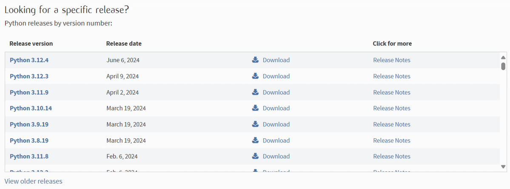

### 2.1. 安装步骤（Windows）

1. 双击打开下载的安装包。勾选相关选项，并选择自定义安装

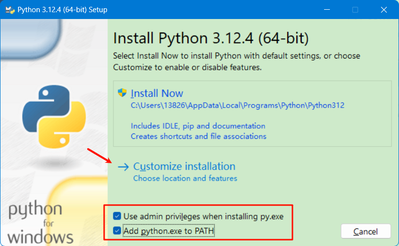

2. 选择安装位置，其他默认即可

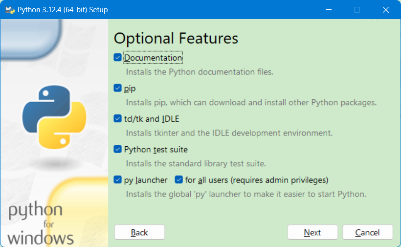 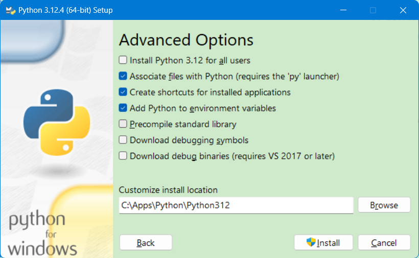

3. 安装完成

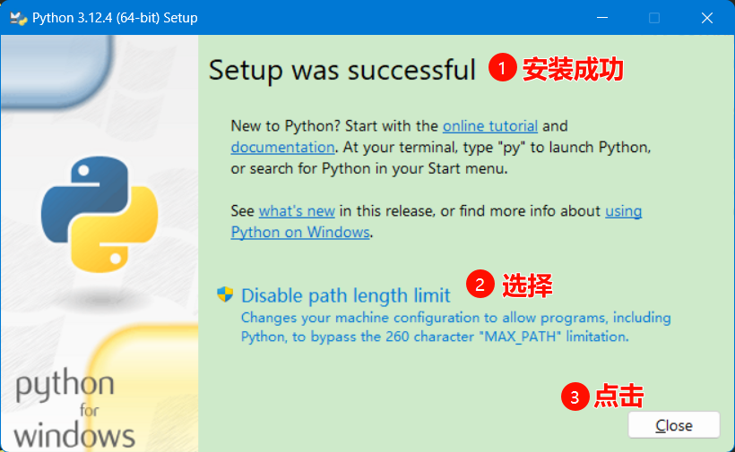

4. 运行 cmd 打开“命令提示符”程序，输入 `python` 并回车

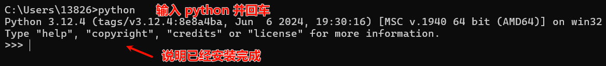

### 2.2. 安装步骤（MacOS）

> 基于 MacOS 12.4。下载地址：https://www.python.org/downloads/macos/

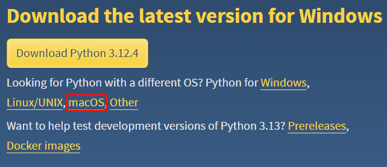

1. 双击打开下载好的 python-3.10.4-macos11.pkg 文件，开始安装。

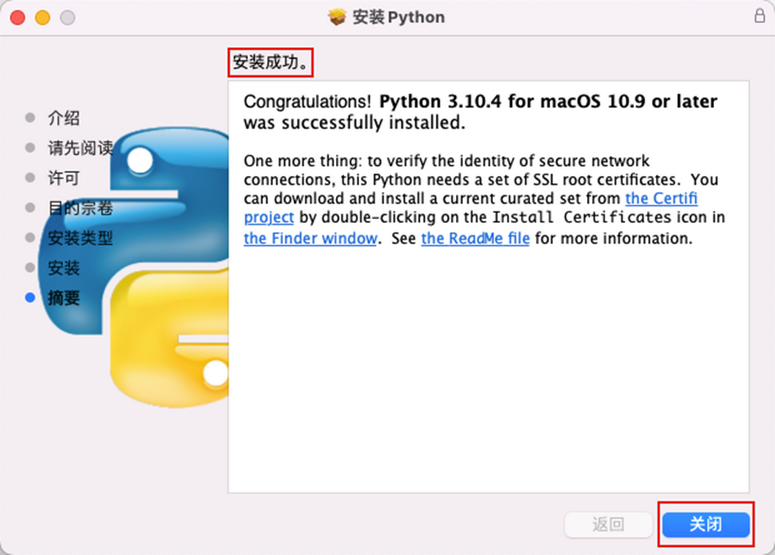

2. 找到 mac 中的“终端”程序并打开：

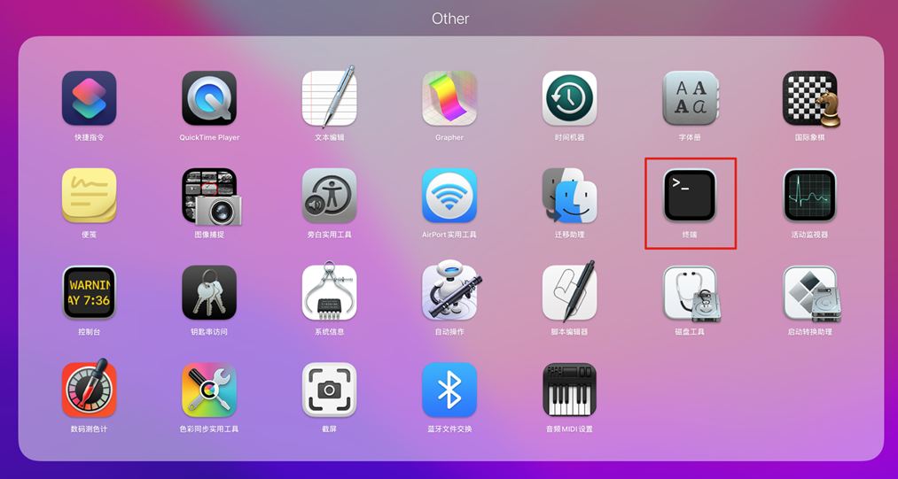

3. 直接在终端中输入命令：`python3`

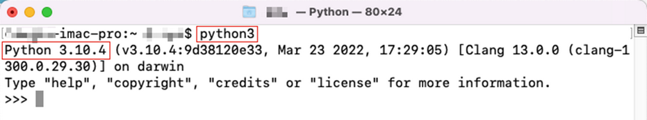

> 如上图，最新版 3.10.4 已经安装成功。

4. 如果想要使用 python 命令，而非 python3 命令执行 python。那么可以设置环境变量来解决，在终端中执行如下代码：

```python
echo 'alias python=python3' >> .bash_profile
```

退出且重新打开终端，然后执行：

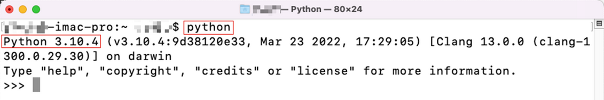

### 2.3. 安装步骤（Linux）

> Tips: 在 Linux 上安装 Python 需要相关前置技能。有过 Linux 系统的使用经验，熟悉 Linux 操作系统的常见命令，如：yum、cd、wget、vi 编辑器、软链接等。

1. 在 Linux 上安装 Python 需要先安装前置依赖程序。登陆到 Linux 中，使用 yum 程序进行依赖程序安装，执行如下命令：

```shell
yum install wget zlib-devel bzip2-devel openssl-devel ncurses-devel sqlite-devel readline-devel tk-devel gcc make zlib zlib-devel libffi-devel -y
```

2. Linux 版本下载地址 https://www.python.org/downloads/source/

拖动网页到最下方，如下图

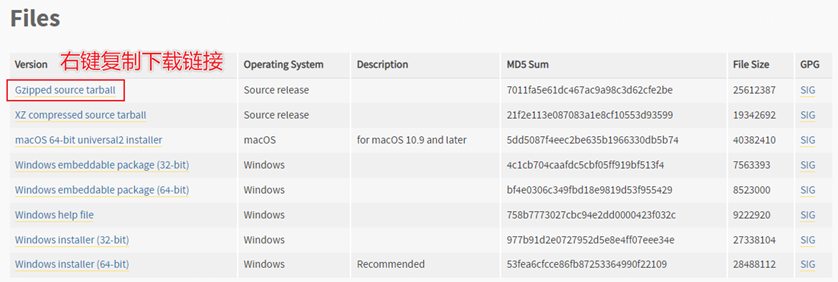

找到 Gzipped source tarball 按钮，点击右键，选择复制链接

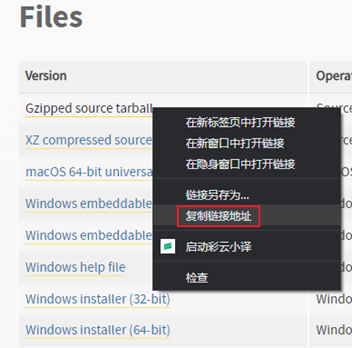

3. 进入到 Linux 系统内，使用 `wget` 命令，粘贴复制的下载链接，执行下载：

```shell
cd ~
wget https://www.python.org/ftp/python/3.10.4/Python-3.10.4.tgz
```

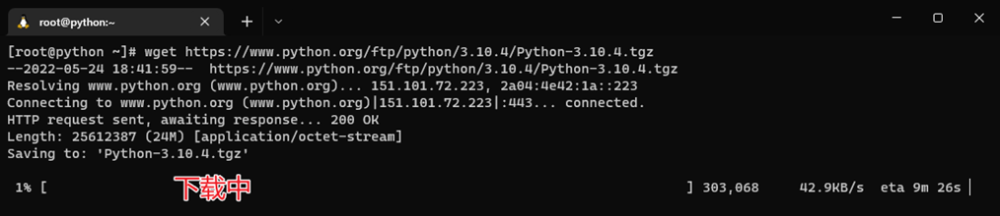

4. 下载完成后，即可看到已下载好的安装包文件：

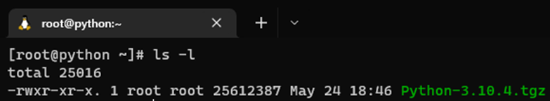

5. 解压安装包，执行：

```shell
tar -xvf Python-3.10.4.tgz
```

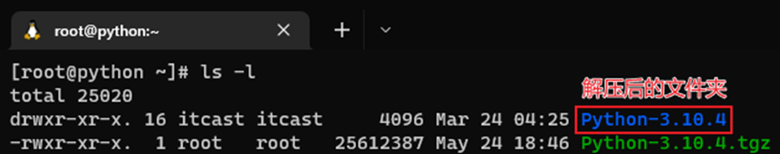

6. 切换目录到解压后的 Python 安装文件夹：

```shell
# 切换目录
cd Python-3.10.4
```

- 配置

```shell
./configure --prefix=/usr/local/python3.10.4
```

- 编译

```shell
make && make install
```

- 编译完成后，可以配置软链接，方便快速使用 python：

```shell
# 删除系统自带的老版本(python2)的软链接
rm -f /usr/bin/python

# 创建软链接
ln -s /usr/local/python3.10.4/bin/python3.10 /usr/bin/python
```

7. 创建软链接后，会破坏 yum 程序的正常使用（只能使用系统自带的 python2）。修改如下2个文件：

```shell
/usr/bin/yum
/usr/libexec/urlgrabber-ext-down
```

使用 vi 编辑器，将这 2 个文件的第一行，从

```shell
#!/usr/bin/python
```

修改为：

```shell
#!/usr/bin/python2
```

8. 在 Linux 系统命令行窗口内，直接执行 `python` 并回车：

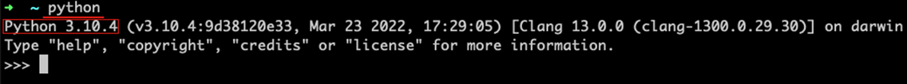

如图，看到 Python 3.10.4 字样，即表明安装成功。

### 2.4. 环境变量配置

程序和可执行文件可以在许多目录，而这些路径很可能不在操作系统提供可执行文件的搜索路径中。

path(路径)存储在环境变量中，这是由操作系统维护的一个命名的字符串。这些变量包含可用的命令行解释器和其他程序的信息。

- Unix 或 Windows 中路径变量为 `PATH`（UNIX区分大小写，Windows不区分大小写）。
- 在 Mac OS 中，安装程序过程中改变了 python 的安装路径。如果你需要在其他目录引用 Python，你必须在 path 中添加 Python 目录。

#### 2.4.1. 在 Unix/Linux 设置环境变量

- 在 csh shell: 输入以下命令后回车

```shell
setenv PATH "$PATH:/usr/local/bin/python"
```

- 在 bash shell (Linux): 输入以下命令后回车

```shell
export PATH="$PATH:/usr/local/bin/python"
```

- 在 sh 或者 ksh shell: 输入以下命令后回车

```shell
PATH="$PATH:/usr/local/bin/python" 
```

> Notes: `/usr/local/bin/python` 是 Python 的安装目录。

#### 2.4.2. 在 Windows 设置环境变量

可以在命令提示框中(cmd)，环境变量中添加 Python 目录：

```shell
path=%path%;C:\Python 
```

> Notes: C:\Python 是 Python 的安装目录。

也可以通过控制面板来设置。

1. 右键点击"计算机"，然后点击"属性"
2. 然后点击"高级系统设置"
3. 选择"系统变量"窗口下面的"Path",双击即可！
4. 然后在"Path"行，添加 python 安装路径即可。**ps：记住，路径直接用分号`;`隔开！**
5. 最后设置成功以后，在 cmd 命令行，输入命令 `python`，就可以有相关显示。

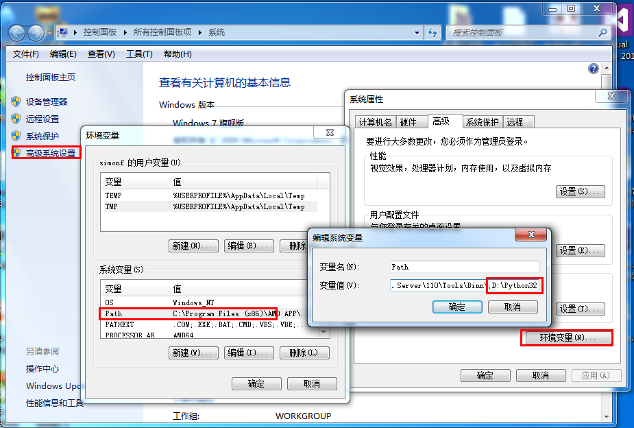

#### 2.4.3. Python 重要的环境变量

- `PYTHONPATH`：是 Python 搜索路径，默认 import 的模块都会从此路径中寻找。
- `PYTHONSTARTUP`：Python 启动后，先寻找此环境变量，然后执行此变量指定的文件中的代码。
- `PYTHONCASEOK`：加入此环境变量，就会使 Python 导入模块的时候不区分大小写.
- `PYTHONHOME`：另一种模块搜索路径。它通常内嵌于的 `PYTHONSTARTUP` 或 `PYTHONPATH` 目录中，使得两个模块库更容易切换。

### 2.5. 运行 Python

有三种方式可以运行 Python。

#### 2.5.1. 交互式解释器

可以通过命令行窗口进入 Python，并在交互式解释器中开始编写 Python 代码。即在 Unix、DOS 或任何其他提供了命令行或者 shell 的系统进行 Python 编码工作。

```shell
$ python # Unix/Linux
# 或者
C:>python # Windows/DOS
```

Python 命令行参数：

- `-d`：在解析时显示调试信息
- `-O`：生成优化代码（`.pyo` 文件）
- `-S`：启动时不引入查找 Python 路径的位置
- `-V`：输出 Python 版本号
- `-X`：从 1.6 版本之后基于内建的异常（仅仅用于字符串）已过时。
- `-c cmd`：执行 Python 脚本，并将运行结果作为 cmd 字符串
- `file`：在给定的 python 文件执行 python 脚本。

输入 `exit()` 可以退出解释器

```python
>>> exit()
```

或者在 python 解释器中，按热键 `ctrl + d` 也可以退出解释器。

#### 2.5.2. 命令行脚本

在应用程序中通过引入解释器可以在命令行中执行 Python 脚本，如下所示：

```shell
$ python script.py # Unix/Linux
# 或者
C:>python script.py # Windows/DOS
```

> Notes: 在执行脚本时，请检查脚本是否有可执行权限。

#### 2.5.3. 集成开发环境（IDE：Integrated Development Environment）

Python 最常见的开发环境是 PyCharm。此集成开发工具（IDE），是当下全球 Python 开发者，使用最频繁的工具软件

#### 2.5.4. Python AI 编程助手

AI 是一个可靠的编程助手，可以提供实时的建议和解决方案，无论是快速修复错误、提升代码质量，或者查找关键文档和资源，AI 作为编程助手都能让事半功倍。

推荐一款适配了 Viusal Studio，VS Code(本文使用)，JetBrains 系列(本文使用)以及Vim等多种编译器环境的插件 Fitten Code，Fitten Code 是由非十大模型驱动的 AI 编程助手，它可以自动生成代码，提升开发效率，帮助调试 Bug，另外还可以对话聊天，解决编程的问题。Fitten Code 免费且支持 80 多种语言：Python、C++、Javascript、Typescript、Java等。

### 2.6. 查看 Python 版本

可以在命令窗口(Windows 使用 win+R 调出 cmd 运行框)使用以下命令查看当前使用的 Python 版本：

```python
python -V
# 或
python --version
```

> Tips: 注意 `-V` 参数是大写字母

## 3. Python 基础语法

### 3.1. 标识符

标示符就是在程序中定义的**变量名**、**函数名**。在 Python 里，所有标识符可以包括英文字母、数字以及下划线(`_`)，但不能以数字开头，不能使用保留字符（关键字）。值得注意的是：Python 中的标识符是<font color=red>**区分大小写**</font>的。

以下划线开头的标识符是有特殊意义的。

- **以单下划线开头（如 `_foo`）**：代表不能直接访问的类属性，需通过类提供的接口进行访问，不能用 `from xxx import *` 而导入。
- **以双下划线开头（如 `__foo`）**：代表类的私有成员。
- **以双下划线开头和结尾（如 `__foo__`）**：代表 Python 里特殊方法专用的标识，如 `__init__()` 代表类的构造函数。

### 3.2. 保留字符（关键字）

保留字符（关键字）是在 Python 内部已经使用的标识符，具有特殊的功能和含义。

开发者不允许使用（定义）保留字作为常量或变量，或任何其他标识符名称。所有 Python 的关键字只包含小写字母。下表是 Python 中的保留字：

|    -     |    -    |   -    |
| -------- | ------- | ------ |
| and      | exec    | not    |
| assert   | finally | or     |
| break    | for     | pass   |
| class    | from    | print  |
| continue | global  | raise  |
| def      | if      | return |
| del      | import  | try    |
| elif     | in      | while  |
| else     | is      | with   |
| except   | lambda  | yield  |

Python 的标准库提供了一个 keyword 模块，可以输出当前版本的所有关键字：

```python
>>> import keyword
>>> keyword.kwlist
['False', 'None', 'True', 'and', 'as', 'assert', 'async', 'await', 'break', 'class', 'continue', 'def', 'del', 'elif', 'else', 'except', 'finally', 'for', 'from', 'global', 'if', 'import', 'in', 'is', 'lambda', 'nonlocal', 'not', 'or', 'pass', 'raise', 'return', 'try', 'while', 'with', 'yield']
```

### 3.3. 行和缩进

Python 与其他语言最大的区别就是，**Python 的代码块不使用大括号 `{}` 来控制类，函数以及其他逻辑判断**。python 最具特色的就是<font color=red>**用缩进来写模块**</font>。

<font color=red>**缩进的空白数量是可变的，但是所有代码块语句必须包含相同的缩进空白数量，这个必须严格执行**</font>。以下实例缩进为四个空格:

```python
if True:
    print ("True")
else:
    print ("False")
```

以下代码将会执行错误：

```python
#!/usr/bin/python
# -*- coding: UTF-8 -*-
# 文件名：test.py

if True:
    print ("Answer")
    print ("True")
else:
    print ("Answer")
    # 没有严格缩进，在执行时会报错
  print ("False")
```

执行以上代码，会出现如下错误提醒：

```
  File "test.py", line 11
    print ("False")
                  ^
IndentationError: unindent does not match any outer indentation level
```

- `IndentationError: unindent does not match any outer indentation level` 错误表明，使用的缩进方式不一致，有的是 tab 键缩进，有的是空格缩进，改为一致即可。
- `IndentationError: unexpected indent` 错误，则 python 编译器提示可能是 tab 和空格没对齐的问题，所以 python 对格式要求非常严格。

Python 的代码块中必须使用相同数目的行首缩进空格数，建议在每个缩进层次使用**单个制表符**或**两个空格**或**四个空格**，切记不能混用

### 3.4. 多行语句

Python 语句中<font color=red>**一般以新行作为语句的结束符**</font>。但是也可以使用斜杠（`\`）将一行的语句分为多行显示，如下所示：

```python
total = item_one + \
        item_two + \
        item_three
```

语句中包含 `[]`, `{}` 或 `()` 括号就不需要使用多行连接符。如下实例：

```python
days = ['Monday', 'Tuesday', 'Wednesday',
        'Thursday', 'Friday']
```

#### 3.4.1. 同一行显示多条语句

Python 可以同一行显示多条语句，语句之间是用分号 `;` 分割，如：

```python
>>> print ('hello');print ('runoob');
hello
runoob

>>> import sys; x = 'runoob'; sys.stdout.write(x + '\n')
runoob
```

#### 3.4.2. 多个语句构成代码块

缩进相同的一组语句构成一个代码块。

像 if、while、def 和 class 这样的复合语句，首行以关键字开始，以冒号(`:`)结束，该行之后的一行或多行代码构成代码块。这种首行及后面的代码块称为一个子句(clause)。

```python
if expression :
   suite
elif expression :
   suite
else :
   suite
```

### 3.5. 引号

Python 可以使用引号( `'` )、双引号( `"` )、三引号( `'''` 或 `"""` ) 来表示字符串，引号的开始与结束必须是相同类型的。

其中三引号可以由多行组成，编写多行文本的快捷语法，常用于文档字符串，在文件的特定地点，被当做注释。

```python
word = 'word'
sentence = "这是一个句子。"
paragraph = """这是一个段落。
包含了多个语句"""
```

### 3.6. 注释

**注释**：是指在程序代码中对程序代码进行解释说明的文字。

注释不是程序，<font color=red>**不能被执行**</font>，其作用只是对程序代码进行解释说明，让别人可以看懂程序代码的作用，能够大大增强程序的可读性。

#### 3.6.1. 单行注释

单行注释：以 `#` 开头，`#`右边的所有文字都属于注释的内容，此部分内容不是真正要执行的程序，只是起辅助说明作用。**注释可以在语句或表达式行末**。

```python
# 第一个单行注释
print ("Hello, Python!")  # 第二个单行注释
```

> Tips: 为了保证代码的可读性，建议 `#` 后面先添加一个空格，然后再编写相应的说明文字

#### 3.6.2. 多行注释

python 中多行注释使用一对三个单引号 `'''` 或三个双引号 `"""` 包裹起来，用来解释说明一段代码的作用使用方法。

```python
'''
这是多行注释，使用单引号。
这是多行注释，使用单引号。
这是多行注释，使用单引号。
'''
print ("This is a multi-line comment, using single quotes.")
"""
这是多行注释，使用双引号。
这是多行注释，使用双引号。
这是多行注释，使用双引号。
"""
print ("This is a multi-line comment, using double quotes.")
```

#### 3.6.3. DocStrings(文档字符串)：多行注释的使用

DocStrings (文档字符串)，是一个重要工具，用于解释文档程序，帮助程序文档更加简单易懂。

在函数体的第一行使用一对三个单引号 `'''` 或者一对三个双引号号 `"""` 来定义文档字符串。首行简述函数功能，第二行空行，第三行为函数的具体描述。可以使用 `doc`（<font color=red>**注意双下划线**</font>）调用函数中的文档字符串属性。

```python
def add(num1, num2):
    """ 完成传入的两个数之和
    :paramnuml: 加数1
    :paramnum2: 加数2
    :return: 和
    """
    return num1 + num2

print(add.__doc__)
```

#### 3.6.4. Python 中文编码声明注释（了解）

语法中的编码，指的是编写程序所用的字符编码类型，比如 UTF-8、GBK 编码等。而 **Python 2.x 版本中会出现中文编码问题**。例如在 Python 2.0+ 的情况，使用 Python 输出 "Hello, World!"，英文没有问题，但是如果你输出中文字符 "你好，世界"，而 Python 文件中未指定编码，在执行过程会出现报错：

```python
#!/usr/bin/python
print ("你好，世界")
```

以上程序执行输出结果为：

```
File "test.py", line 2
SyntaxError: Non-ASCII character '\xe4' in file test.py on line 2, but no encoding declared; see http://www.python.org/peps/pep-0263.html for details
```

这是因为 Python 中默认的编码格式是 ASCII 格式，在没修改编码格式时无法正确打印汉字，所以在读取中文时会报错。

为此 Python 提供了一种**特殊的中文编码声明注释**，其主要用来解决 Python2.x 中不支持直接写中文的问题。虽然此问题在 Python3.x 中已经不存在啦，但为了规范编码，增强代码的可执行性，方便其他程序员及时了解程序所用的编码，建议初学者在程序开头处加上中文编码声明注释。

中文编码声明注释的语法有如下2种：在文件开头加入 `# -*- coding:编码 -*-` 或者 `# coding=编码` 即可。

```python
#!/usr/bin/python
# -*- coding: UTF-8 -*-
# coding:utf-8
# coding=utf-8
print( "你好，世界" )
```

> Notes: <font color=red>**`# coding=utf-8` 的 `=` 号两边不要空格**</font>。另外，在第一种语法中，`-*-` 并没有实际意义，只是为了美观才加上去了，因此，第一种语法格式中也可以直接将前后的 `-*-` 去掉（即示例中第三种写法）。

<font color=red>**注意：Python3.X 源码文件默认使用 utf-8 编码，所以可以正常解析中文，无需指定 UTF-8 编码**</font>。但如果使用编辑器(IDE)，同时需要设置 py 文件存储的格式为 UTF-8，否则会出现类似以下错误信息：

```
SyntaxError: (unicode error) ‘utf-8’ codec can’t decode byte 0xc4 in position 0:
invalid continuation byte
```

#### 3.6.5. 使用注释的场景

- 注释不是越多越好，对于一目了然的代码，不需要添加注释。
- 对于复杂的操作，应该在操作开始前写上若干行注释。
- 对于不是一目了然的代码，应在其行尾添加注释。
- 绝不要描述代码，假设阅读代码的人比你更懂 Python，他只是不知道你的代码要做什么。

> 在一些正规的开发团队，通常会有代码审核的惯例，就是一个团队中彼此阅读对方的代码。

### 3.7. 空行

函数之间或类的方法之间用空行分隔，表示一段新的代码的开始。类和函数入口之间也用一行空行分隔，以突出函数入口的开始。

> Notes: <font color=red>**空行与代码缩进不同，空行并不是 Python 语法的一部分，却是程序代码的一部分。书写时不插入空行，Python 解释器运行也不会出错。但是空行的作用在于分隔两段不同功能或含义的代码，便于日后代码的维护或重构。**</font>

### 3.8. import 与 from...import

在 python 用 `import` 或者 `from...import` 来导入相应的模块。

- 将整个模块(somemodule)导入，格式为：`import somemodule`
- 从某个模块中导入某个函数，格式为：`from somemodule import somefunction`
- 从某个模块中导入多个函数，格式为：`from somemodule import firstfunc, secondfunc, thirdfunc`
- 将某个模块中的全部函数导入，格式为：`from somemodule import *`

导入 sys 模块：

```python
import sys
print('================Python import mode==========================')
print ('命令行参数为:')
for i in sys.argv:
    print (i)
print ('\n python 路径为',sys.path)
```

导入 sys 模块的 argv,path 成员：

```python
from sys import argv,path  #  导入特定的成员
 
print('================python from import===================================')
print('path:',path) # 因为已经导入path成员，所以此处引用时不需要加sys.path
```

## 4. Python 基本数据类型

### 4.1. 字面量

在代码中，被写下来的的固定的值，称之为字面量

### 4.2. 变量

#### 4.2.1. 概念

变量是用于存储数据。Python 中的变量不需要声明。每个变量在使用前都必须赋值，变量赋值以后该变量才会被创建。变量必须先定义后使用，变量定义之后，后续就可以直接使用。

在 Python 中，变量就是变量，它没有类型，所谓的"类型"是变量所指的内存中对象的类型。

#### 4.2.2. 语法格式

```python
变量名 = 变量值
```

等号（`=`）用来给变量赋值。等号（`=`）运算符左边是一个变量名，等号（`=`）运算符右边是存储在变量中的值。<font color=red>**`=` 两边要留一个空格**</font>。

#### 4.2.3. 多个变量赋值

Python 允许同时为多个变量赋值。具体语法如下：

```python
变量1 = 变量2 = 变量3 = ... = 变量值
```

以上实例，创建多个变量，从后向前赋值，每个变量被赋予相同的数值。

也为多个变量指定多个不同的值。语法如下：

```python
变量1, 变量2, 变量3, ... = 变量值1, 变量值2, 变量值3, ...
```

以上实例，创建多个变量，每个变量赋予相应位置上的数值。

#### 4.2.4. 变量的修改

创建变量后，可以在代码中重新赋值。

```python
year = 2023
print(year)
year = 2024
print(year)
```

<font color=red>**不同类型的变量也可以进行修改、重新赋值，与类型无关**</font>。

```python
money = 10
money = '10元'
print(money)
```

#### 4.2.5. 常量

程序在运行的过程中，值永远不会发生改变的变量称之为**常量**。

Python 没有专门的常量类型，一般约定<font color=red>**使用大写表示常量**</font>。

## 5. 输入与输出

### 5.1. print 输出

Python 两种输出值的方式：表达式语句和 `print()` 函数。（还有一种方式是使用文件对象的 `write()` 方法，标准输出文件可以用 `sys.stdout` 引用。）

#### 5.1.1. 语法格式

官方文档定义：

```python
print(*objects, sep=' ', end='\n', file=None, flush=False)
```

将 `objects` 打印输出至 file 指定的文本流，以 sep 分隔并在末尾加上 end。sep、end、file 和 flush 必须以关键字参数的形式给出。

所有非关键字参数都会被转换为字符串，就像是执行了 `str()` 一样，并会被写入到流，以 sep 分隔并在末尾加上 end。 sep 和 end 都必须为字符串；它们也可以为 `None`，这意味着使用默认值。如果没有给出 `objects`，则 `print()` 将只写入 end。

file 参数必须是一个具有 `write(string)` 方法的对象；如果参数不存在或为 `None`，则将使用 `sys.stdout`。 由于要打印的参数会被转换为文本字符串，因此 `print()` 不能用于二进制模式的文件对象。 对于这些对象，应改用 `file.write(...)`。

输出缓冲通常由 file 确定。 但是，如果 flush 为真值，流将被强制刷新。

#### 5.1.2. 字符串和数值类型直接输出

```python
>>> print(1)  
1  
>>> print("Hello World")  
Hello World
```

#### 5.1.3. 变量输出

无论什么类型，数值，布尔，列表，字典等，均可直接输出：

```python
>>> x = 12  
>>> print(x)  
12  
>>> s = 'Hello'  
>>> print(s)  
Hello  
>>> L = [1,2,'a']  
>>> print(L)  
[1, 2, 'a']  
>>> t = (1,2,'a')  
>>> print(t)  
(1, 2, 'a')  
>>> d = {'a':1, 'b':2}  
>>> print(d)  
{'a': 1, 'b': 2}
```

#### 5.1.4. 设置分隔符

`sep` 参数，用于设置多个内容之间的分隔符。默认情况下，每个`,`逗号的内容之间都会增加空格进行分隔。

```python
# sep：设置多个内容之间的分隔符，默认是空格
year = 2024
print(year, '年，我要成功')
print(year, '年，我要减肥', sep="")
print(year, '年，我要读100本书', sep="-")
print(year, '年，我要去10个城市旅游', sep="*")
```

输出结果：

```
2024 年，我要成功
2024年，我要减肥
2024-年，我要读100本书
2024*年，我要去10个城市旅游
```

#### 5.1.5. 设置结束符

`end` 参数，用于设置结束符，默认结束符 `\n`。

```python
year = 2024
print(year, '年，我要减肥', end="\n\n")
print(year, '年，我要读100本书', end="\t")
print(year, '年，我要去10个城市旅游', end=" ")
print("前面的内容不换行了！")
```

输出结果：

```
2024 年，我要减肥

2024 年，我要读100本书	2024 年，我要去10个城市旅游 前面的内容不换行了！
```

##### 5.1.5.1. 不换行输出

print 默认输出是换行的，如果要实现不换行，只需要在变量末尾加上逗号，增加参数 `end=""`，替换了默认结束符 `\n`。

```python
x = "a"
y = "b"
# 换行输出
print(x)
print(y)

print('---------')
# 不换行输出
print(x, end=" ")
print(y, end=" ")
print(1)
```

以上实例执行结果为：

```
a
b
---------
a b 1
```

#### 5.1.6. 格式化输出

##### 5.1.6.1. 语法格式

如果希望输出文字信息的同时，一起输出数据，就需要使用到格式化操作符。类似于 C 中的 `printf`，可以格式化输出的内容。

```python
print("格式化字符串" % 变量1)
print("格式化字符串" % (变量1, 变量2, ...))
```称为格式化操作符，专门用于处理字符串中的格式

示例：

```python
>>> s = 'Hello'  
>>> x = len(s)  
>>> print("The length of %s is %d" % (s, x))
The length of Hello is 5
```

**格式化输出参数说明**：

1. `%`字符：称为格式化操作符，专门用于处理字符串中的格式。
    - 标记转换说明符的开始。
    - 包含`%`的字符串，被称为格式化字符串。
    - `%`和不同的字符连用，不同类型的数据需要使用不同的格式化字符。
2. 转换标志：`-`表示左对齐；`+`表示在转换值之前要加上正负号；`""（空白字符）`表示正数之前保留空格；`0`表示转换值若位数不够则用 0 填充。示例：

```python
# 指定占位符宽度（左对齐）
>>> print("Name:%-10s Age:%-8d Height:%-8.2f" % ("Aviad", 25, 1.83))
Name:Aviad      Age:25       Height:1.83
# 指定占位符（若位数不够则用0填充）
>>> print("Name:%-10s Age:%08d Height:%08.2f" % ("Aviad", 25, 1.83))
Name:Aviad      Age:00000025 Height:00001.83
```

3. 最小字段宽度：转换后的字符串至少应该具有该值指定的宽度。如果是`*`，则宽度会从值元组中读出。

```python
# 指定占位符宽度
>>> print("Name:%10s Age:%8d Height:%8.2f" % ("Aviad", 25, 1.83))
Name:     Aviad Age:      25 Height:    1.83
```

4. 点(`.`)后跟精度值：如果转换的是实数，精度值就表示出现在小数点后的位数。如果转换的是字符串，那么该数字就表示最大字段宽度。如果是`*`，则从后面的元组中读取字段宽度或精度。

```python
>>> print("His height is %f m" % (1.83))
His height is 1.830000 m
>>> print("His height is %.2f m" % (1.83))
His height is 1.83 m
>>> print("The String is %.2s" % ("abcd"))
The String is ab
# 用*从后面的元组中读取字段宽度或精度，第1个参数是精度
>>> print("His height is %.*f m" % (2, 1.83))
His height is 1.83 m
```

##### 5.1.6.2. 字符串格式化转换类型

|  转换类型   |                             含义                             |
| :-------: | ----------------------------------------------------------- |
| `%d`,`%i` | 带符号的十进制整数，`%06d`表示输出的整数显示位数，不足的地方使用0补全 |
|   `%o`    | 不带符号的八进制                                               |
|   `%u`    | 不带符号的十进制                                               |
|   `%x`    | 不带符号的十六进制（小写）                                      |
|   `%X`    | 不带符号的十六进制（大写）                                      |
|   `%e`    | 科学计数法表示的浮点数（小写）                                   |
|   `%E`    | 科学计数法表示的浮点数（大写）                                   |
| `%f`,`%F` | 十进制浮点数，`%.2f`表示小数点后只显示两位                        |
|   `%g`    | 如果指数大于 -4 或者小于精度值则和 e 相同，其他情况和 f 相同        |
|   `%G`    | 如果指数大于 -4 或者小于精度值则和 E 相同，其他情况和 F 相同        |
|   `%C`    | 单字符（接受整数或者单字符字符串）                                |
|   `%r`    | 字符串（使用 repr 转换任意 python 对象)                         |
|   `%s`    | 字符串（使用 str 转换任意 python 对象）                         |
|   `%%`    | 输出`%`                                                      |

### 5.2. 数据输入

在 Python 中，`print` 语句（函数），可以完成将内容（字面量、变量等）输出到屏幕上。与之对应的还有一个 `input` 语句，用来获取键盘输入。

#### 5.2.1. 语法格式

```python
字符串变量 = input("提示信息：")
```

示例：

```python
name = input("请输入你的名字：")
print(name)

age = input("请输入你的年龄：")
# 类型转换
age = int(age)
# print(type(age))
year = 2024
# print(type(year))
birth = year - age
print("你的出生年份是", birth)
```
