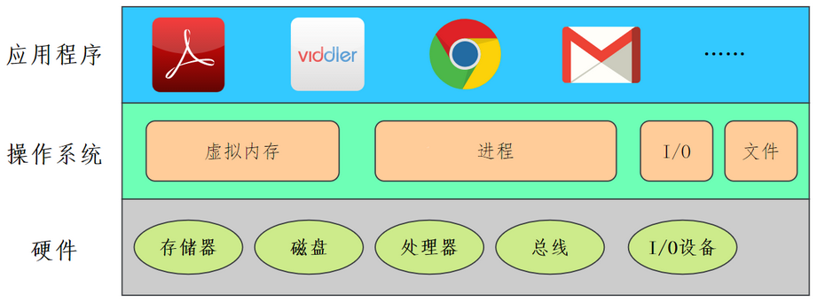
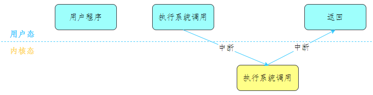
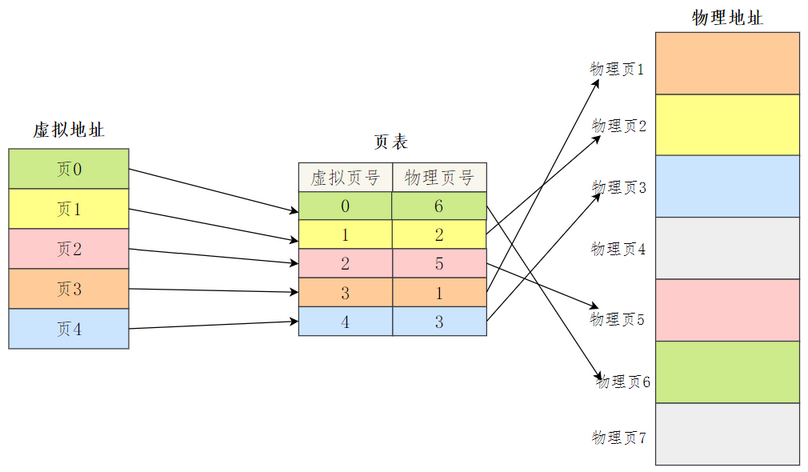
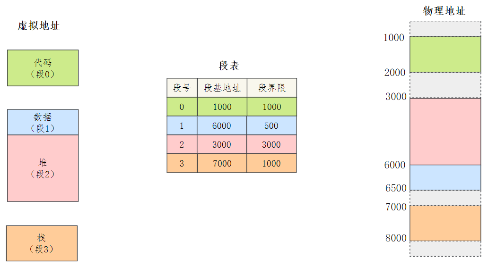
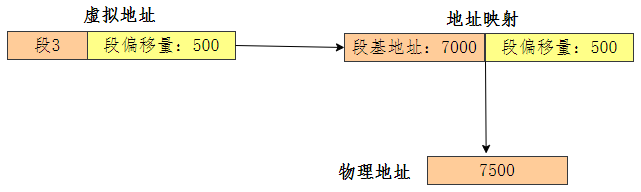
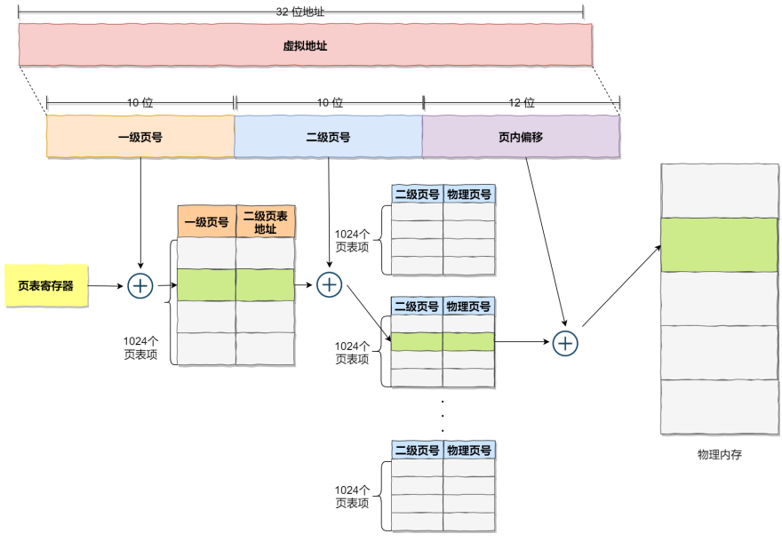
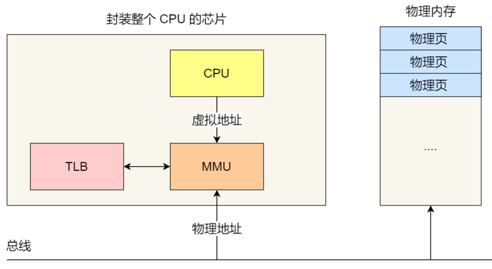
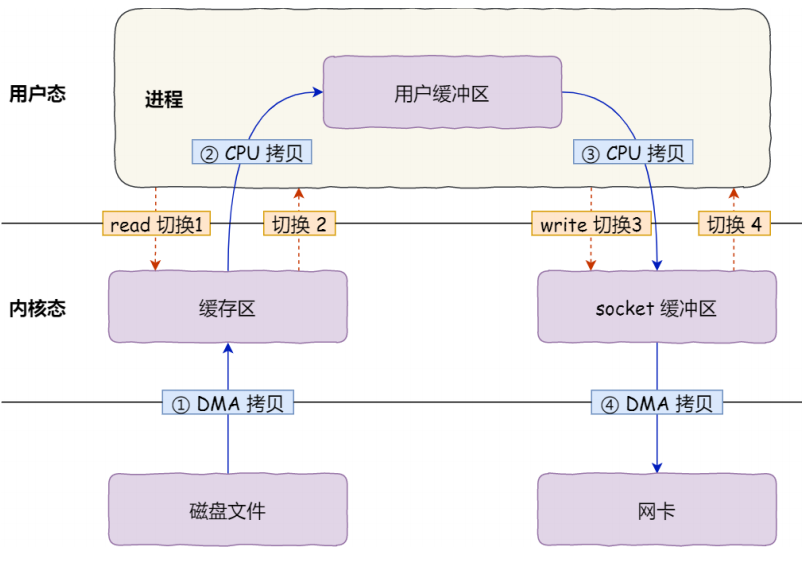
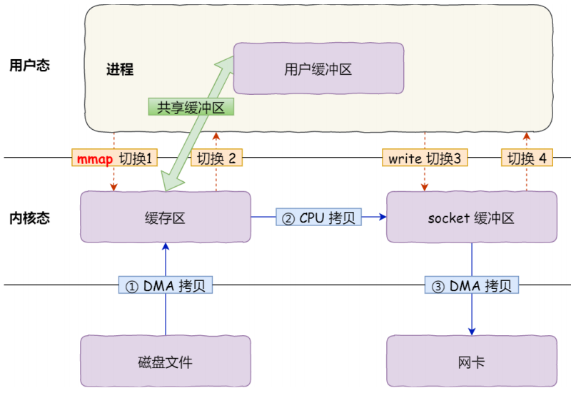
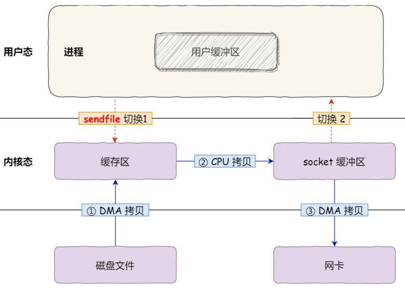

## 1. 操作系统

### 1.1. 概述

操作系统是一种运行在内核态的软件。它是应用程序和硬件之间的媒介，向应用程序提供硬件的抽象，以及管理硬件资源。

### 1.2. 操作系统最主要的功能

- 处理器（CPU）管理：CPU 的管理和分配，主要指的是进程管理。
- 内存管理：内存的分配和管理，主要利用了虚拟内存的方式。
- 外存管理：外存（磁盘等）的分配和管理，将外存以文件的形式提供出去。
- I/O管理：对输入/输出设备的统一管理。

除此之外，还有保证自身正常运行的健壮性管理，防止非法操作和入侵的安全性管理。

### 1.3. 操作系统的四个特性

- 并发：同一段时间内多个程序执行（与并行区分，并行指的是同一时刻有多个事件，多处理器系统可以使程序并行执行）
- 共享：系统中的资源可以被内存中多个并发执行的进线程共同使用
- 虚拟：通过分时复用（如分时系统）以及空分复用（如虚拟内存）技术把一个物理实体虚拟为多个
- 异步：系统进程用一种走走停停的方式执行，（并不是一下子走完），进程什么时候以怎样的速度向前推进是不可预知的

## 2. 操作系统结构

### 2.1. 内核

内核是一个计算机程序，它是操作系统的核心，提供了操作系统最核心的能力，可以控制操作系统中所有的内容。

### 2.2. 用户态和内核态

#### 2.2.1. 概述

内核具有很高的权限，可以控制 cpu、内存、硬盘等硬件，出于权限控制的考虑，因此大多数操作系统，把内存分成了两个区域：

- 内核态：CPU 可以访问内存的所有数据，包括外围设备（如：硬盘、网卡），CPU 也可以将自己从一个程序切换到另一个程序。
- 用户态：只能受限专门的应用程序访问的内存空间，且不允许访问外围设备，占用 CPU 的能力被剥夺，CPU 资源可以被其他程序获取。权限比较小。

> Notes: 用户空间的代码只能访问一个局部的内存空间，而内核空间的代码可以访问所有内存空间。因此，当程序使用用户空间时，常说该程序在**用户态**执行，而当程序使内核空间时，程序则在**内核态**执行。两者最大的区别就是**权限不同**，在运行在用户态下的程序不能直接访问操作系统内核数据结构和程序。

#### 2.2.2. 为什么要有这两种状态

内核速度快但是资源有限，能控制的进程数不多，所以需要速度慢一些的用户态协助，但是为了避免用户态被恶意利用，所以限制了用户态程序的权限。

需要限制不同的程序之间的访问能力，防止它们获取别的程序的内存数据，或者获取外围设备的数据，并发送到网络，因此 CPU 划分出**两个权限等级 -- 用户态和内核态**。

### 2.3. 用户态和内核态如何进行切换

应用程序如果需要进入内核空间，就需要通过系统调用，来进入内核态：

内核程序执行在内核态，用户程序执行在用户态。当应用程序使用系统调用时，会产生一个中断。发生中断后，CPU 会中断当前在执行的用户程序，转而跳转到中断处理程序，也就是开始执行内核程序。内核处理完后，主动触发中断，把 CPU 执行权限交回给用户程序，回到用户态继续工作。

还有以下情况会进行切换：

1. **系统调用**：用户进程主动发起的。用户态进程通过系统调用申请使用操作系统提供的服务程序完成工作，比如 `fork()` 就是执行一个创建新进程的系统调用。用户程序使用系统调用，系统调用会转换为内核态并调用操作系统
2. **发生异常**：会从当前运行进程切换到处理次此异常的内核相关程序中。
3. **外围设备的中断**：所有程序都运行在用户态，但在从硬盘读取数据、或从键盘输入时，这些事情只有操作系统能做，程序需要向操作系统请求以程序的名义来执行这些操作。这个时候用户态程序切换到内核态。

### 2.4. IO 多路复用

IO 多路复用是指内核一旦发现进程指定的一个或者多个 IO 条件准备读取，它就通知该进程。IO 多路复用适用如下场合：

- 当客户处理多个描述字时（一般是交互式输入和网络套接口），必须使用I/O复用。
- 当一个客户同时处理多个套接口时，而这种情况是可能的，但很少出现。
- 如果一个 TCP 服务器既要处理监听套接口，又要处理已连接套接口，一般也要用到I/O复用。
- 如果一个服务器即要处理 TCP，又要处理 UDP，一般要使用I/O复用。
- 如果一个服务器要处理多个服务或多个协议，一般要使用I/O复用。
- 与多进程和多线程技术相比，I/O多路复用技术的最大优势是系统开销小，系统不必创建进程/线程，也不必维护这些进程/线程，从而大大减小了系统的开销。

## 3. 进程调度策略

- **先来先服务**：非抢占式的调度算法，按照请求的顺序进行调度。有利于长作业，但不利于短作业，因为短作业必须一直等待前面的长作业执行完毕才能执行，而长作业又需要执行很长时间，造成了短作业等待时间过长。另外，对 I/O 密集型进程也不利，因为这种进程每次进行 I/O 操作之后又得重新排队。
- **短作业优先**：非抢占式的调度算法，按估计运行时间最短的顺序进行调度。长作业有可能会饿死，处于一直等待短作业执行完毕的状态。因为如果一直有短作业到来，那么长作业永远得不到调度。
- **最短剩余时间优先**：最短作业优先的抢占式版本，按剩余运行时间的顺序进行调度。 当一个新的作业到达时，其整个运行时间与当前进程的剩余时间作比较。如果新的进程需要的时间更少，则挂起当前进程，运行新的进程。否则新的进程等待。
- **时间片轮转**：将所有就绪进程按 FCFS 的原则排成一个队列，每次调度时，把 CPU 时间分配给队首进程，该进程可以执行一个时间片。当时间片用完时，由计时器发出时钟中断，调度程序便停止该进程的执行，并将它送往就绪队列的末尾，同时继续把 CPU 时间分配给队首的进程。
    - 时间片轮转算法的效率和时间片的大小有很大关系：因为进程切换都要保存进程的信息并且载入新进程的信息，如果时间片太小，会导致进程切换得太频繁，在进程切换上就会花过多时间。 而如果时间片过长，那么实时性就不能得到保证。
- 优先级调度：为每个进程分配一个优先级，按优先级进行调度。为了防止低优先级的进程永远等不到调度，可以随着时间的推移增加等待进程的优先级。

## 4. 操作系统的内存

### 4.1. 内存碎片

内存碎片通常分为**内部碎片**和**外部碎片**：

- **内部碎片**是由于采用固定大小的内存分区，当一个进程不能完全使用分给它的固定内存区域时就会产生内部碎片。通常内部碎片难以完全避免。
- **外部碎片**是由于某些未分配的连续内存区域太小，以至于不能满足任意进程的内存分配请求，从而不能被进程利用的内存区域。

**避免产生内存碎片的方法**：现在普遍采取的内存分配方式是段页式内存分配。将内存分为不同的段，再将每一段分成固定大小的页。通过页表机制，使段内的页可以不必连续处于同一内存区域。

### 4.2. 虚拟内存

虚拟存储器就是具有请求调入功能，能从逻辑上对内存容量加以扩充的一种存储器系统，虚拟内存有**多次性，对换性和虚拟性**三个特征，它可以将程序分多次调入内存，使得在较小的用户空间可以执行较大的用户程序，所以同时容纳更多的进程并发执行，从而提高系统的吞吐量。发生缺页时可以调入一个段也可以调入一个页，取决于内存的存储管理方式。虚拟性表示虚拟内存和物理内存的映射。

简单总结：**虚拟内存是操作系统提供的⼀种机制，将不同进程的虚拟地址和不同内存的物理地址映射起来**。每个进程都有自己独立的地址空间，再由操作系统映射到到实际的物理内存。这里引出了两种地址的概念：

- 程序所使用的内存地址叫做**虚拟内存地址**（Virtual Memory Address）
- 实际存在硬件里面的空间地址叫**物理内存地址**（Physical Memory Address）。

Linux 下，进程不能直接读写内存物理地址，只能访问『虚拟内存地址』。操作系统会把虚拟内存地址映射到物理地址。

虚拟内存解决有限的内存空间加载较大应用程序的问题，根据需要在内存和磁盘之间来回传送数据。通过段页表的形式，虚拟内存中取一段连续的内存空间映射到主内存中，主内存空间的程序段可以不连续。

### 4.3. 内存的分页与分段

#### 4.3.1. 内存分页

**分页是把整个虚拟和物理内存空间切成一段段固定尺寸的大小**。这样一个连续并且尺寸固定的内存空间，叫页（Page）。在 Linux 下，每一页的大小为 4KB。

**把内存空间划分为大小相等且固定的块，作为主存的基本单位**。因为程序数据存储在不同的页面中，而页面又离散的分布在内存中，因此**需要一个页表来记录映射关系，以实现从页号到物理块号的映射**。

访问分页系统中内存数据**需要两次的内存访问**：第一次是从内存中访问页表，从中找到指定的物理页号，加上页内偏移得到实际物理地址，第二次就是根据第一次得到的物理地址访问内存取出数据。

#### 4.3.2. 内存分段

程序是由若干个逻辑分段组成的，如可由代码分段、数据分段、栈段、堆段组成。不同的段是有不同的属性的，所以就用分段（Segmentation）的形式把这些段分离出来。分页是为了提高内存利用率，而分段是为了满足程序员在编写代码时的一些逻辑需求。比如数据共享，数据保护，动态链接等。

分段机制下的虚拟地址由两部分组成：**段号**和**段内偏移量**。即**分段内存管理当中，地址是二维的，一维是段号，二维是段内地址；其中每个段的长度是不一样的，而且每个段内部都是从0开始编址的**。由于分段管理中，每个段内部是连续内存分配，但是段和段之间是离散分配的，因此也存在一个逻辑地址到物理地址的映射关系，相应的就是<u>**段表机制**</u>。

虚拟地址和物理地址通过段表映射，段表主要包括**段号**、**段的界限**。

例如一个映射，虚拟地址：段3、段偏移量500 -> 段基地址7000+段偏移量500 -> 物理地址：8700+。

#### 4.3.3. 分页与分段的区别

- 段是信息的逻辑单位，它是根据用户的需要显式划分的，因此段对用户是可见的；页是信息的物理单位，是为了管理主存的方便而划分的，对用户是透明的。
- 段的大小可以动态改变，由它所完成的功能决定；页的大小不可变，由系统决定。
- 段向用户提供二维地址空间；页向用户提供的是一维地址空间。
- 段主要是为了使程序和数据可以被划分为逻辑上独立的地址空间并且有助于信息的共享和存储保护；页主要用于实现虚拟内存，从而获得更大的地址空间，页的保护和共享受到限制。

#### 4.3.4. 多级页表

操作系统可能会有非常多进程，如果只是使用简单分页，可能导致的后果就是页表变得非常庞大。所以引入了多级页表的解决方案。

所谓的多级页表，就是把原来的单级页表再次分页，这里利用了局部性原理，除了顶级页表，其它级别的页表一来可以在需要的时候才被创建，二来内存紧张的时候还可以被置换到磁盘中。

#### 4.3.5. 块表

同样利用了**局部性原理**，即在一段时间内，整个程序的执行仅限于程序中的某一部分。相应地，执行所访问的存储空间也局限于某个内存区域。

利⽤这一特性，把最常访问的几个页表项存储到访问速度更快的硬件，于是就在 CPU 芯片中，加入了一个专门存放程序最常访问的页表项的 Cache，这个 Cache 就是 TLB（Translation Lookaside Buffer），通常称为页表缓存、转址旁路缓存、快表等。

### 4.4. 页面置换算法

因为应用程序是分多次装入内存的，所以运行到一定的时间，一定会发生缺页。地址映射的过程中，如果页面中发现要访问的页面不在内存中，会产生缺页中断。此时操作系统必须在内存里选择一个页面将它移出内存，为即将调入的页面让出空间。

**选择淘汰哪一页的规则就是页面置换算法**。通常有以下几种算法：

- **最佳置换算法（理想）**：将当前页面中在未来最长时间内不会被访问的页置换出去先进先出：淘汰最早调入的页面
- **最近最久未使用 LRU**：每个页面有一个t值来记录上次页面被访问直到现在，每次置换时置换t值最大的页面（用寄存器或栈实现）
- **时钟算法 clock（也被称为最近未使用算法 NRU）**：页面设置访问为，将页面链接为一个环形列表，每个页有一个访问位0/1, 1表示又一次获救的机会，下次循环指针指向它时可以免除此次置换，但是会把访问位置为0，代表他下次如果碰到循环指针就该被置换了。页面被访问的时候访问位设为1。页面置换的时候，如果当前指针的访问位为0，置换，否则将这个值置为0，循环直到遇到访问位为0的页面。
- **改进型 Clock 算法**：在clock算法的基础上添加一个修改位，优先替换访问位和修改位都是0的页面，其次替换访问位为0修改位为1的页面。
- **最少使用算法 LFU**：设置寄存器记录页面被访问次数，每次置换当前访问次数最少的。

## 5. 缓冲区的溢出

缓冲区溢出是指当计算机向缓冲区填充数据时超出了缓冲区本身的容量，溢出的数据覆盖在合法数据上。主要以下两点危害：

- 程序崩溃，导致拒绝额服务
- 跳转并且执行一段恶意代码

造成缓冲区溢出的主要原因是程序中没有仔细检查用户输入。

## 6. 零拷贝

假如需要文件传输，使用传统I/O，数据读取和写入是用户空间到内核空间来回赋值，而内核空间的数据是通过操作系统的I/O接口从磁盘读取或者写入，这期间发生了多次用户态和内核态的上下文切换，以及多次数据拷贝。

为了提升I/O性能，就需要**减少用户态与内核态的上下文切换和内存拷贝的次数**。这就用到了『零拷贝』的技术，零拷贝技术实现主要有两种：mmap + write

系统调用 `mmap()` 函数会直接把内核缓冲区里的数据「**映射**」到用户空间，这样，操作系统内核与用户空间就不需要再进行任何的数据拷贝操作。

在 Linux 内核版本 2.1 中，提供了一个专门发送文件的系统调用函数 `sendfile()`。

- 首先，它可以替代前面的 read() 和 write() 这两个系统调用，这样就可以减少一次系统调用，也就减少了 2 次上下文切换的开销。
- 其次，该系统调用，可以直接把内核缓冲区里的数据拷贝到 socket 缓冲区里，不再拷贝到用户态，这样就只有 2 次上下文切换，和 3 次数据拷贝。

很多开源项目如Kafka、RocketMQ都采用了零拷贝技术来提升IO效率。
