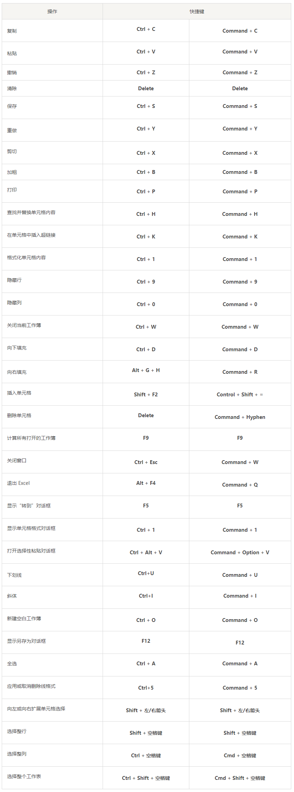
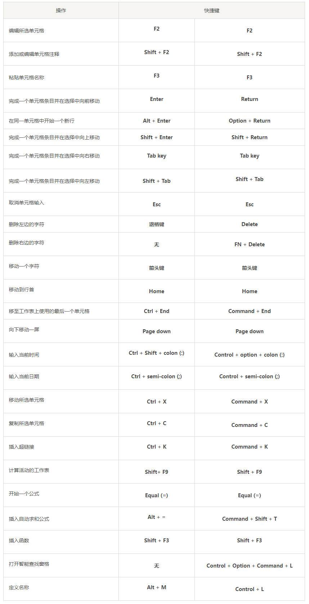
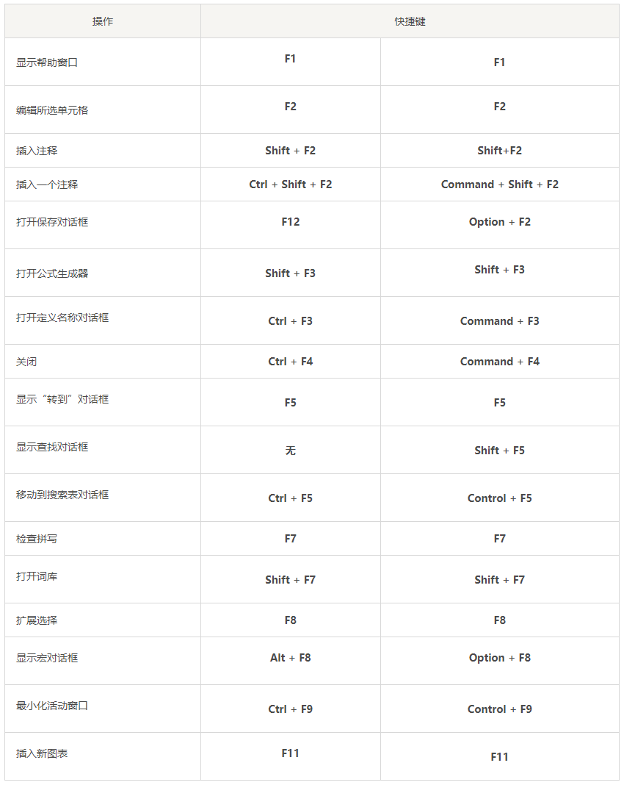
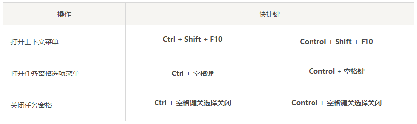

# Microsoft Office 系列教程

## 1. Microsoft Excel

### 1.1. 常用公式

1. Excel表公式换行
    - 例：`d1=A1&CHAR(10)&A2&CHAR(10)&A3`单元格对齐要设置为“自动换行”
2. Excel表身份证号区分男女
    - MOD函数（MOD函数是取余数的函数）取第17位数字除以2的余数，如果余数是0，则第17位是偶数，也就是该身份证是女性；反之，如果余数是1则说明身份证是男性。我们嵌套IF函数如下：
    - `=IF(MOD(MID(A2,17,1),2),"男","女")`
3. 身份证号中提取出生年月日
    - `=MID(B4,7,4)&"年"&MID(B4,11,2)&"月"&MID(B4,13,2)&"日"`
    - `=TEXT(MID(B4,7,8),"0年00月00日")`
4. 身份证号计算年龄
    - `=DATEDIF(TEXT(MID(B4,7,8),"0000-00-00"),TODAY(),"y")`
5. 合并单元格内容的函数是CONCATENATE (text1,text2,...)，如合并一列则是：PHONETIC(C1:C26)
6. 绝对值=ABS(B1-A1)
7. excel输入√符号
    - 按住Alt键不放，再输入小数字键盘上的数字41420，松开Alt键就\
    - 输入×号的话就是按小键盘上的41409。
8. 数字按长度补0，并转换为文本，单纯的改为数字（单元格格式，自定义，示例8个0），只是显示8位，实际导入数据库的时候还是实际的位数
    - 公式：`=REPT(补位内容,总位数-LEN(A2))&A2`
    - REPT函数第一个参数是补位的内容
    - REPT函数第二个参数是需要补充的位数，即等于总位数-选择的单元格长度

### 1.2. 快捷键大全

> 参考：http://www.dayanzai.me/microsoft-excel-shortcuts.html

#### 1.2.1. 常用的 Excel 快捷键

#### 1.2.2. 将数据输入到表格中的 Microsoft Excel 快捷方式

#### 1.2.3. 功能键 Excel 快捷键

#### 1.2.4. Office 加载项任务窗格 Excel 快捷方式

## 2. Microsoft Word

### 2.1. 快捷键大全

> 快捷键参考：http://www.dayanzai.me/word-shortcuts.html

1. 取消超链接快捷键：Ctrl+Shift+F9
2. 取消代码模式 Alt+F9

#### 2.1.1. 常用的 Microsoft Word 快捷键

|          操作          |   windows 快捷键    |        Mac 快捷键         |
| :--------------------: | :----------------: | :----------------------: |
|     打开 Word 文档      |    **Ctrl + O**    |     **Command + O**      |
|     创建一个新文档      |    **Ctrl + N**    |     **Command + N**      |
|        保存文档         |    **Ctrl + S**    |     **Command + S**      |
|        关闭文档         |    **Ctrl + W**    |     **Command + F4**     |
|   所选内容剪切到剪贴板   |    **Ctrl + X**    |     **Command + X**      |
|   所选内容复制到剪贴板   |    **Ctrl + C**    |     **Command + C**      |
|     粘贴剪贴板的内容     |    **Ctrl + V**    |     **Command + V**      |
|     选择所有文档内容     |    **Ctrl + A**    |     **Command + A**      |
|    对文本应用粗体格式    |    **Ctrl + B**    |     **Command + B**      |
|    对文本应用斜体格式    |    **Ctrl + I**    |     **Command + I**      |
|   对文本应用下划线格式   |    **Ctrl + U**    |     **Command + U**      |
|   将字体大小减小 1 磅    |     `Ctrl + [`     |      `Command + [`       |
|   将字体大小增加 1 磅    |     `Ctrl + ]`     |      `Command + ]`       |
|        居中文本         |    **Ctrl + E**    |     **Command + E**      |
|     将文本向左对齐      |    **Ctrl + L**    |     **Command + L**      |
|     将文本向右对齐      |    **Ctrl + R**    |     **Command + R**      |
|        取消命令         |      **Esc**       |         **Esc**          |
|     撤消之前的操作      |    **Ctrl + Z**    |     **Command + Z**      |
| 如果可能，重做之前的操作 |    **Ctrl + Y**    |     **Command + Y**      |
|      调整缩放倍率       |    **Alt + W**     |      **Option + W**      |
|      拆分文档窗口       | **Ctrl + Alt + S** | **Command + Option + S** |

#### 2.1.2. 功能区面板快捷键

|        操作         | windows 快捷键 |    Mac 快捷键    |
| :----------------: | :------------: | :-------------: |
| 移到告诉我或搜索字段 |  **Alt + Q**   | **Command + c** |
|    打开文件选项卡    |  **Alt + F**   | **Option + F**  |
|    打开主页选项卡    |  **Alt + H**   | **Command + v** |
|    打开插入选项卡    |  **Alt + N**   | **Option + N**  |
|    打开设计选项卡    |  **Alt + G**   | **Option + G**  |
|    打开布局选项卡    |  **Alt + P**   | **Option + P**  |
|    打开引用选项卡    |  **Alt + S**   | **Option + S**  |
|    打开邮件选项卡    |  **Alt + M**   | **Option + M**  |
|    打开审核选项卡    |  **Alt + R**   | **Option + R**  |
|    打开视图选项卡    |  **Alt + W**   | **Option + W**  |

#### 2.1.3. 导航文档的快捷键

|                      操作                       |       windows 快捷键        |            Mac 快捷键             |
| :---------------------------------------------: | :------------------------: | :------------------------------: |
|               将光标向左移动一个字                |    **Ctrl + 左箭头键**     |      **Command + 左箭头键**      |
|               将光标向右移动一个字                |    **Ctrl + 右箭头键**     |      **Command + 右箭头键**      |
|                将光标向上移动一段                 |    **Ctrl + 上箭头键**     |      **Command + 上箭头键**      |
|                将光标向下移动一段                 |    **Ctrl + 下箭头键**     |      **Command + 下箭头键**      |
|             将光标移动到当前行的末尾              |          **End**           |             **End**              |
|             将光标移动到当前行的开头              |          **Home**          |             **Home**             |
|               将光标移动到屏幕顶部                |  **Ctrl + Alt + Page up**  |  **Command + Option + Page up**  |
|               将光标移动到屏幕底部                | **Ctrl + Alt + Page down** | **Command + Option + Page down** |
|        通过将文档视图向上滚动一屏来移动光标         |        **Page up**         |           **Page up**            |
|        通过将文档视图向下滚动一屏来移动光标         |       **Page down**        |          **Page down**           |
|             将光标移动到下一页的顶部              |    **Ctrl + Page down**    |     **Command + Page down**      |
|             将光标移动到上一页的顶部              |     **Ctrl + Page up**     |      **Command + Page up**       |
|               将光标移动到文档末尾                |       **Ctrl + End**       |        **Command + End**         |
|              将光标移动到文档的开头               |      **Ctrl + Home**       |        **Command + Home**        |
|             将光标移动到上一版本的位置             |       **Shift + F5**       |          **Shift + F5**          |
| 将光标移动到上次关闭文档之前所做的最后一次修订的位置 |       **Shift + F5**       |          **Shift + F5**          |
|         循环浏览浮动形状，例如文本框或图像         |     **Ctrl + Alt + 5**     |     **Command + Option + 5**     |
|           退出浮动形状导航，返回正常导航           |          **Esc**           |             **Esc**              |
|                 显示导航任务窗格                 |        **Ctrl + F**        |         **Command + F**          |
|                 显示“转到”对话框                 |        **Ctrl + G**        |     **Command + Option + G**     |
|       循环浏览先前对文档所做的四个更改的位置        |     **Ctrl + Alt + Z**     |     **Command + Option + Z**     |

#### 2.1.4. 选择文字和图形的快捷键

|        操作         |       windows 快捷键       |         Mac 快捷键          |
| :----------------: | :-----------------------: | :------------------------: |
|   一次选择一个字符   |    **Shift + 箭头键**     |     **Shift + 箭头键**     |
|    一次选择一个词    | **Ctrl + Shift + 箭头键** |  **Cmd + Shift + 箭头键**  |
| 选择从插入点回到行首 |     **Shift + Home**      | **Cmd + Shift + 右箭头键** |
|  选择从插入点到行尾  |      **Shift + End**      | **Cmd + Shift + 左箭头键** |
|     进入选择模式     |          **F8**           |           **F8**           |
|  剪切文本到 Spike   |       **Ctrl + F3**       |      **Command + F3**      |
|  粘贴文本到 Spike   |   **Ctrl + Shift + F3**   |   **Command + Shift +**    |

#### 2.1.5. 对齐和格式化段落的快捷方式

|         操作          |      windows 快捷键       |           Mac 快捷键           |
| :------------------: | :----------------------: | :---------------------------: |
|       居中段落        |       **Ctrl + E**       |        **Command + E**        |
|       对齐段落        |       **Ctrl + J**       |        **Command + J**        |
|      段落左对齐       |       **Ctrl + L**       |        **Command + L**        |
|      段落右对齐       |       **Ctrl + R**       |        **Command + R**        |
|       缩进段落        |       **Ctrl + M**       |    **Command + Shift + M**    |
|      删除段落缩进      |   **Ctrl + Shift + M**   |    **Command + Shift + M**    |
|      创建悬挂缩进      |       **Ctrl + T**       |        **Command + T**        |
|      删除悬挂缩进      |   **Ctrl + Shift + T**   |    **Command + Shift + T**    |
|      删除段落格式      |       **Ctrl + Q**       |        **Command + Q**        |
|   对段落应用单个间距   |       **Ctrl + 1**       |        **Command + 1**        |
|   对段落应用双倍行距   |       **Ctrl + 2**       |        **Command + 2**        |
| 对段落应用 1.5 行间距  |       **Ctrl + 5**       |        **Command + 5**        |
| 在段落前添加或删除空格 |       **Ctrl + 0**       |        **Command + 0**        |
|    启用自动套用格式    |    **Ctrl + Alt + K**    |   **Command + Option + K**    |
|      应用正常样式      |   **Ctrl + Shift + N**   |    **Command + Shift + N**    |
|    应用标题 1 样式     |    **Ctrl + Alt + 1**    |   **Command + Option + 1**    |
|    应用标题 2 样式     |    **Ctrl + Alt + 2**    |   **Command + Option + 2**    |
|    应用标题 3 样式     |    **Ctrl + Alt + 3**    |   **Command + Option + 3**    |
| 显示“应用样式”任务窗格 |   **Ctrl + Shift + S**   |    **Command + Shift+ S**     |
|    显示样式任务窗格    | **Ctrl + Alt +Shift +S** | **Command + Alt + Shift + S** |

#### 2.1.6. 文本格式快捷键

|               操作                |     windows 快捷键      |         Mac 快捷键         |
| :------------------------------: | :--------------------: | :-----------------------: |
|           显示字体对话框           |      **Ctrl + D**      |      **Command + D**      |
|            增加字体大小            | **Ctrl + Shift + (>)** | **Command + Shift + (>)** |
|            减小字体大小            | **Ctrl + Shift + (<)** | **Command + Shift + (<)** |
|        将字体大小增加 1 磅         |     **Ctrl + (])**     |     **Command + (])**     |
|        将字体大小减小 1 磅         |     **Ctrl + ([)**     |     **Command + ([)**     |
| 在大写、小写和标题大小写之间切换文本 |     **Shift + F3**     |      **Shift + F3**       |
|        将文本更改为全部大写         |  **Ctrl + Shift + A**  |  **Command + Shift + A**  |
|            隐藏所选文本            |  **Ctrl + Shift + H**  |  **Command + Shift + H**  |
|            应用粗体格式            |      **Ctrl + B**      |      **Command + B**      |
|           应用下划线格式           |      **Ctrl + U**      |      **Command + U**      |
|  将下划线格式应用于单词，而不是空格  |  **Ctrl + Shift + W**  |  **Command + Shift + W**  |
|          应用双下划线格式          |  **Ctrl + Shift + D**  |  **Command + Shift + D**  |
|            应用斜体格式            |      **Ctrl + I**      |      **Command + I**      |
|        应用小型大写字母格式         |  **Ctrl + Shift + K**  |  **Command + Shift + K**  |
|            应用下标格式            |     **Ctrl + (=)**     |     **Command + (=)**     |
|            应用上标格式            | **Ctrl + Shift + (+)** | **Command + Shift + (+)** |
|          删除手动字符格式          |  **Ctrl + Spacebar**   |  **Command + Spacebar**   |
|    将所选文本更改为 Symbol 字体     |  **Ctrl + Shift + Q**  |  **Command + Shift + Q**  |

#### 2.1.7. 表格格式化快捷键

|              操作               |         windows 快捷键         |            Mac 快捷键            |
| :-----------------------------: | :---------------------------: | :-----------------------------: |
|     选择下一个单元格中的内容      |          **Tab 键**           |           **Tab 键**            |
|      选择上一个单元格的内容       |        **Shift + Tab**        |         **Shift + Tab**         |
|      将选区扩展到相邻单元格       |       **Shift + 箭头键**       |       **Shift + 箭头键**        |
|             选择一列             |  **Shift + 向上或向下箭头键**  |   **Shift + 向上或向下箭头键**   |
|             选择一行             | **Shift + Alt + End 或 Home** |  **Shift + Alt + End 或 Home**  |
|           选择整个表格           |          **Alt + 5**          |         **Option + 5**          |
|     在单元格中插入一个新段落      |           **Enter**           |            **Enter**            |
|       在单元格中插入制表符        |        **Ctrl + Tab**         |        **Command + Tab**        |
|     移动到行中的第一个单元格      |        **Alt + Home**         |        **Option + Home**        |
|     移至行中的最后一个单元格      |         **Alt + End**         |        **Option + End**         |
|      移至列中的第一个单元格       |       **Alt + Page up**       |      **Option + Page up**       |
|     移至列中的最后一个单元格      |      **Alt + Page down**      |     **Option + Page down**      |
|           移动到上一行           |         **向上箭头键**         |         **向上箭头键**          |
|           移动到下一行           |         **向下箭头键**         |         **向下箭头键**          |
|           向上移动一行           |  **Alt + Shift + 向上箭头键**  | **Option + Shift + 向上箭头键** |
|           向下移动一行           |  **Alt + Shift + 向下箭头键**  | **Option + Shift + 向下箭头键** |
| 移至行中的下一个单元格并选择其内容 |          **Tab 键**           |           **Tab 键**            |
| 移至行中的上一个单元格并选择其内容 |        **Shift + Tab**        |         **Shift + Tab**         |

## 3. Microsoft PowerPoint

### 3.1. 快捷键大全

> 参考：http://www.dayanzai.me/powerpoint-shortcut-keys.html

#### 3.1.1. 常用的 PowerPoint 键盘快捷键

|              操作               |        快捷键        |                         |
| :-----------------------------: | :-----------------: | :---------------------: |
|       创建一个新的演示文稿        |    **Ctrl + N**     | **Command + Shift + P** |
|         添加一个新幻灯片         |    **Ctrl + M**     | **Command + Shift + N** |
|        将所选文本设为粗体         |    **Ctrl + B**     |     **Command + B**     |
|      更改所选文本的字体大小       | **Alt + H + F + S** | **Option + H + F + S**  |
|     剪切所选文本、对象或幻灯片     |    **Ctrl + X**     |     **Command + X**     |
|     复制所选文本、对象或幻灯片     |    **Ctrl + C**     |     **Command + C**     |
| 粘贴剪切或复制的文本、对象或幻灯片 |    **Ctrl + V**     |     **Command + V**     |
|           撤消上次操作           |    **Ctrl + Z**     |     **Command + B**     |
|           保存演示文稿           |    **Ctrl + S**     |     **Command + S**     |
|           插入一个形状           | **Alt + N + S + H** |  **Option + N + S +H**  |
|           选择一个主题           |   **Alt + G + H**   |   **Option + G + H**    |
|          选择幻灯片版式          |   **Alt + G + H**   |   **Option + G + H**    |
|         转到下一张幻灯片         |    **Page down**    |      **Page down**      |
|         转到上一张幻灯片         |     **Page up**     |       **Page up**       |
|          转到主页选项卡          |     **Alt + H**     |     **Option + H**      |
|          转到插入选项卡          |     **Alt + N**     |     **Option + N**      |
|          开始幻灯片放映          |       **F5**        |  **Command + return**   |
|          结束幻灯片放映          |       **Esc**       |         **Esc**         |
|         关闭 PowerPoint         |    **Ctrl + Q**     |     **Command + Q**     |

#### 3.1.2. 功能区 PowerPoint 快捷方式

|           操作           |      快捷键      |                    |
| :----------------------: | :-------------: | :----------------: |
|       打开文件菜单        |   **Alt + F**   |   **Option + F**   |
|      打开主页选项卡       |   **Alt + H**   |   **Option + H**   |
|      打开插入选项卡       |   **Alt + N**   |   **Option + N**   |
|      打开绘图选项卡       | **Alt + J + I** | **Option + J + I** |
|      打开设计选项卡       |   **Alt + G**   |   **Option + G**   |
|      打开转场选项卡       |   **Alt + K**   |   **Option + K**   |
|      打开动画选项卡       |   **Alt + A**   |   **Option + A**   |
|    打开幻灯片放映选项卡    |   **Alt + S**   |   **Option + S**   |
|     打开“审核”选项卡      |   **Alt + R**   |   **Option + R**   |
|      打开视图选项卡       |   **Alt + W**   |   **Option + W**   |
|      打开录制选项卡       |   **Alt + C**   |   **Option + C**   |
|      打开帮助选项卡       | **Alt + Y + 2** | **Option + Y + 2** |
|       打开文件菜单        |   **Alt + F**   |   **Option + F**   |
|      打开主页选项卡       |   **Alt + H**   |   **Option + H**   |
|      选择活动选项卡       |   **Alt + N**   |   **Option + N**   |
|  移动焦点到功能区上的命令  | **Alt + J + I** | **Option + J, I**  |
|       激活所选按钮        |   **Alt + G**   |   **Option + G**   |
|     打开所选命令的列表     |   **Alt + K**   |   **Option + K**   |
|     移动到下一个命令      |   **Alt + A**   |   **Option + A**   |
|     展开或折叠功能区      |   **Alt + S**   |   **Option + S**   |
|      打开上下文菜单       |   **Alt + R**   |   **Option + R**   |
|       移动到子菜单        |   **Alt + W**   |   **Option + W**   |
| 获取有关当前所选命令的帮助 |   **Alt + C**   |   **Option + C**   |

#### 3.1.3. PowerPoint 文本块快捷键

|           操作           |        快捷键         |                         |
| :----------------------: | :------------------: | :---------------------: |
|     删除左边一个字符      |    **Backspace**     |      **Backspace**      |
|      删除左边一个词       | **Ctrl + Backspace** | **Command + Backspace** |
|     删除右边一个字符      |      **Delete**      |       **Delete**        |
|      删除右边一个词       |  **Ctrl + Delete**   |  **Command + Delete**   |
|     剪切所选对象或文本     |     **Ctrl + X**     |     **Command + X**     |
|     复制所选对象或文本     |     **Ctrl + C**     |     **Command + C**     |
| 粘贴剪切或复制的对象或文本 |     **Ctrl + V**     |     **Command + V**     |
|       复制一个对象        |     **Ctrl + D**     |     **Command + D**     |
|       撤消上次操作        |     **Ctrl + Z**     |     **Command + Z**     |
|     重做最后一个操作      |     **Ctrl + Y**     |     **Command + Y**     |
|        仅复制格式         | **Ctrl + Shift + C** | **Command + Shift + C** |
|        仅粘贴格式         | **Ctrl + Shift + V** | **Command + Shift + V** |
|       复制动画画家        | **Alt + Shift + C**  | **Option + Shift + C**  |
|       粘贴动画画家        | **Alt + Shift + V**  | **Command + Shift + V** |
|    打开选择性粘贴对话框    |  **Ctrl + Alt + V**  |  **Command + Alt + V**  |

#### 3.1.4. 用于处理表格的 PowerPoint 快捷键

|       操作        |      快捷键      |                   |
| :--------------: | :-------------: | :---------------: |
| 移动到下一个单元格 |   **Tab 键**    |     **Tab 键**     |
| 移动到上一个单元格 | **Shift + Tab** |  **Shift + Tab**  |
|    移动到下一行    |  **下箭头键**   |   **下箭头键**    |
|    移动到上一行    |  **上箭头键**   |   **是箭头键**    |
| 在单元格中插入标签 | **Ctrl + Tab**  | **Command + Tab** |
|   开始一个新段落   |    **Enter**    |    **Return**     |

#### 3.1.5. 段落对齐键盘快捷键

|     操作     |    快捷键     |                 |
| :---------: | :----------: | :-------------: |
| 居中一个段落 | **Ctrl + E** | **Command + E** |
| 对齐一个段落 | **Ctrl + J** | **Command + J** |
|  左对齐段落  | **Ctrl + L** | **Command + L** |
|  右对齐段落  | **Ctrl + R** | **Command + T** |

#### 3.1.6. 幻灯片的 PowerPoint 快捷键

|              操作               |        快捷键        |                                       |
| :-----------------------------: | :------------------: | :-----------------------------------: |
|       从头开始播放演示文稿        |        **F5**        |     **Command + Shift + Return**      |
|     从当前幻灯片播放演示文稿      |    **Shift + F5**    |         **Command + Return**          |
| 在播放幻灯片时使用钢笔工具进行批注 |     **Ctrl + P**     |            **Command + P**            |
|    播放幻灯片时移至下一张幻灯片    |  **N 或 Page Down**  | **N 或 Page Down 或 右箭头 或 下箭头** |
|    播放幻灯片时返回上一张幻灯片    |   **P 或 Page Up**   |  **P 或 Page Up 或 左箭头 或 上箭头**  |
|       暂停幻灯片并显示黑屏        |        **B**         |                 **B**                 |
|       暂停幻灯片并显示白屏        |        **W**         |                 **W**                 |
|            停止幻灯片            | **S (再按一次继续)** |          **S (再按一次继续)**          |
|            结束幻灯片            |       **Esc**        |         **Esc 或 Command + .**         |
