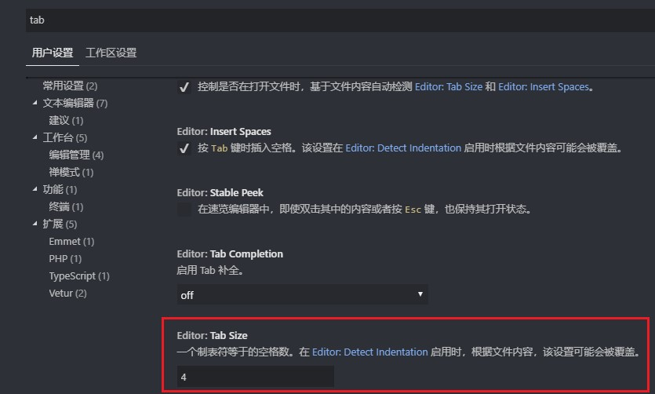
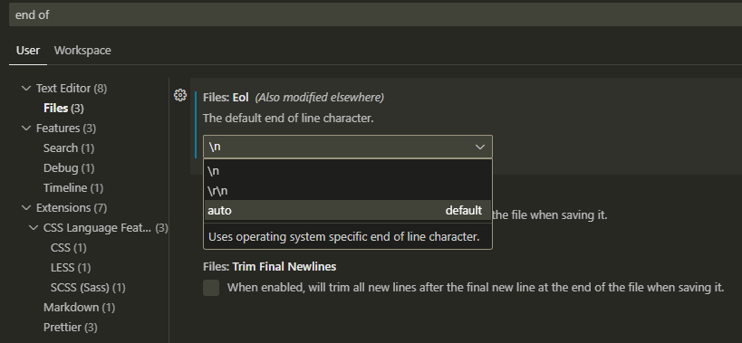
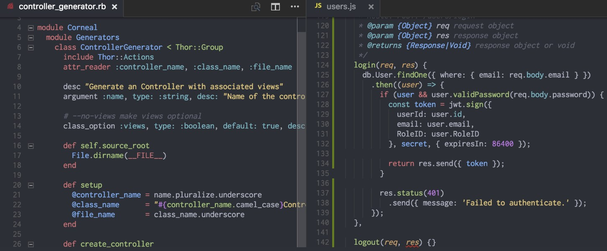
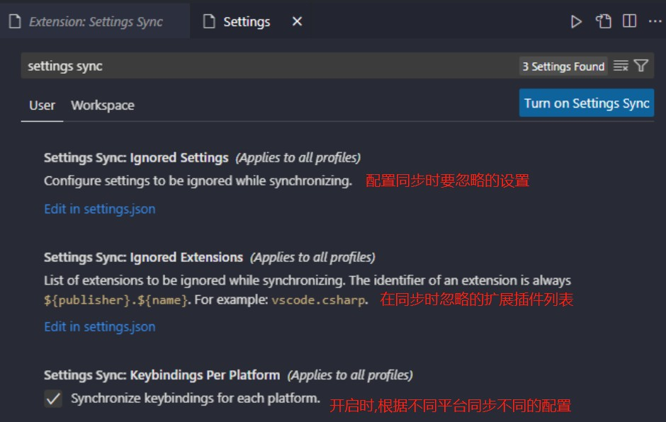
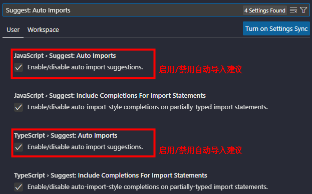
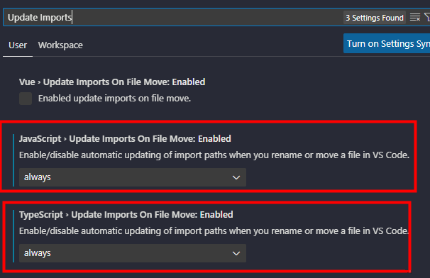

## 1. 安装与下载

官方网站：https://code.visualstudio.com/

由于官网是国外的服务器，所以下载非常慢，可以使用国内镜像加快下载速度。具体步骤如下：

1. 首先在官网找到需要下载的文件，点击下载。
2. 在浏览器或者下载软件中复制其下载地址，如：

```
https://az764295.vo.msecnd.net/stable/64bbfbf67ada9953918d72e1df2f4d8e537d340e/VSCode-win32-x64-1.72.0.zip
```

3. 然后将域名更换为国内镜像域名（`vscode.cdn.azure.cn`）即可。更新国内镜像域名后的地址为：

```
https://vscode.cdn.azure.cn/stable/64bbfbf67ada9953918d72e1df2f4d8e537d340e/VSCode-win32-x64-1.72.0.zip
```

## 2. 常用配置

### 2.1. 用户设置和工作区设置的区别

> “用户设置”会应用于用户打开的所有工程；“工作区设置”仅适用于当前目录的 VSCode 的设置。<font color=red>**注：“工作区设置”会覆盖“用户设置”。**</font>

- 用户设置：这种方式进行的设置，会应用于该用户打开的所有工程；
- 工作空间设置：工作空间是指使用 VSCode 打开的某个文件夹，在该文件夹下会创建一个名为 .vscode 的隐藏文件夹，里面包含着仅适用于当前目录的 VSCode 的设置，工作空间的设置会覆盖用户的设置。

#### 2.1.1. 用户设置与工作空间设置保存目录

VSCode 的设置文件为 setting.json。用户设置的文件保存在如下目录：

- Windows `%APPDATA%\Code\User\settings.json`
- Linux `$HOME/.config/Code/User/settings.json`

工作空间设置的文件保存在当前目录的 .vscode 文件夹下。

#### 2.1.2. 修改默认设置的两种方式

- 使用编辑器直接打开 setting.json 文件进行设置；
- 点击 VSCode 的【文件】->【首选项】->【设置】，可以打开设置面板进行设置；

### 2.2. 出现CPU 100% 优化的设置

有时，vscode会出现CPU利用率100%的情况，两个rg.exe占用了全部的CPU。

解决办法：文件>首选项>设置, 搜索设置 `"search.followSymlinks" ：false;`


### 2.3. 如何配置VSCODE打开文件总是在一个新的标签

经常搞混单击和双击的区别？这里在左侧资源管理器这边 如果单击文件是打开文件的预览模式，文件所在的标签上显示的文件名是 斜体状态，表明是在 预览模式，会被新打开的文件替换。所以如果是要打开文件进行编辑需要双击文件进行打开

如果要修改这个配置，可以找到以下配置字段进行调整：

如果要一起禁用预览模式，可以通过在设置文件中将“`workbench.editor.enablePreview`”属性设置为`false`来实现。还要注意“`workbench.editor.enablePreviewFromQuickOpen`”选项，以防您只想从快速打开菜单禁用此选项。

在您可以禁用预览模式之前，您需要打开您的Settings File。

专业提示：您可以使用Command Palette打开您的设置文件，只需输入“首选项：打开用户设置”！

打开设置文件(您的设置文件应位于右侧)后，添加“`workbench.editor.enablePreview`”属性，并将其值设置为`false`。


### 2.4. 设置tab为4个空格与格式化时缩进4个空格

tab的宽度设置



格式化缩进


### 2.5. 设置默认换行符

在 Settings 中，【Text Editor】->【Files: EOl】，选择需要的换行符



## 3. 常用插件

### 3.1. 通用类

#### 3.1.1. Chinese (Simplified) Language Pack for VS Code

中文汉化包

#### 3.1.2. eslint 插件


ESLint 插件，高亮提示安装并配置完成 ESLint 后，继续回到 VSCode 进行扩展设置，依次点击 文件 > 首选项 > 设置 打开 VSCode 配置文件，添加如下配置

```json
"files.autoSave":"off",
"eslint.validate": [
   "javascript",
   "javascriptreact",
   "html",
   { "language": "vue", "autoFix": true }
 ],
 "eslint.options": {
    "plugins": ["html"]
 }
]
```

这样每次保存的时候就可以根据根目录下.eslintrc.js配置的eslint规则来检查和做一些简单的fix。以下github上的开源后台项目vue-element-admin的作者常用的eslint配置（参考）

```json
module.exports = {
  root: true,
  parserOptions: {
    parser: 'babel-eslint',
    sourceType: 'module'
  },
  env: {
    browser: true,
    node: true,
    es6: true,
  },
  extends: ['plugin:vue/recommended', 'eslint:recommended'],

  // add your custom rules here
  //it is base on https://github.com/vuejs/eslint-config-vue
  rules: {
    "vue/max-attributes-per-line": [2, {
      "singleline": 10,
      "multiline": {
        "max": 1,
        "allowFirstLine": false
      }
    }],
    "vue/name-property-casing": ["error", "PascalCase"],
    'accessor-pairs': 2,
    'arrow-spacing': [2, {
      'before': true,
      'after': true
    }],
    'block-spacing': [2, 'always'],
    'brace-style': [2, '1tbs', {
      'allowSingleLine': true
    }],
    'camelcase': [0, {
      'properties': 'always'
    }],
    'comma-dangle': [2, 'never'],
    'comma-spacing': [2, {
      'before': false,
      'after': true
    }],
    'comma-style': [2, 'last'],
    'constructor-super': 2,
    'curly': [2, 'multi-line'],
    'dot-location': [2, 'property'],
    'eol-last': 2,
    'eqeqeq': [2, 'allow-null'],
    'generator-star-spacing': [2, {
      'before': true,
      'after': true
    }],
    'handle-callback-err': [2, '^(err|error)$'],
    'indent': [2, 2, {
      'SwitchCase': 1
    }],
    'jsx-quotes': [2, 'prefer-single'],
    'key-spacing': [2, {
      'beforeColon': false,
      'afterColon': true
    }],
    'keyword-spacing': [2, {
      'before': true,
      'after': true
    }],
    'new-cap': [2, {
      'newIsCap': true,
      'capIsNew': false
    }],
    'new-parens': 2,
    'no-array-constructor': 2,
    'no-caller': 2,
    'no-console': 'off',
    'no-class-assign': 2,
    'no-cond-assign': 2,
    'no-const-assign': 2,
    'no-control-regex': 0,
    'no-delete-var': 2,
    'no-dupe-args': 2,
    'no-dupe-class-members': 2,
    'no-dupe-keys': 2,
    'no-duplicate-case': 2,
    'no-empty-character-class': 2,
    'no-empty-pattern': 2,
    'no-eval': 2,
    'no-ex-assign': 2,
    'no-extend-native': 2,
    'no-extra-bind': 2,
    'no-extra-boolean-cast': 2,
    'no-extra-parens': [2, 'functions'],
    'no-fallthrough': 2,
    'no-floating-decimal': 2,
    'no-func-assign': 2,
    'no-implied-eval': 2,
    'no-inner-declarations': [2, 'functions'],
    'no-invalid-regexp': 2,
    'no-irregular-whitespace': 2,
    'no-iterator': 2,
    'no-label-var': 2,
    'no-labels': [2, {
      'allowLoop': false,
      'allowSwitch': false
    }],
    'no-lone-blocks': 2,
    'no-mixed-spaces-and-tabs': 2,
    'no-multi-spaces': 2,
    'no-multi-str': 2,
    'no-multiple-empty-lines': [2, {
      'max': 1
    }],
    'no-native-reassign': 2,
    'no-negated-in-lhs': 2,
    'no-new-object': 2,
    'no-new-require': 2,
    'no-new-symbol': 2,
    'no-new-wrappers': 2,
    'no-obj-calls': 2,
    'no-octal': 2,
    'no-octal-escape': 2,
    'no-path-concat': 2,
    'no-proto': 2,
    'no-redeclare': 2,
    'no-regex-spaces': 2,
    'no-return-assign': [2, 'except-parens'],
    'no-self-assign': 2,
    'no-self-compare': 2,
    'no-sequences': 2,
    'no-shadow-restricted-names': 2,
    'no-spaced-func': 2,
    'no-sparse-arrays': 2,
    'no-this-before-super': 2,
    'no-throw-literal': 2,
    'no-trailing-spaces': 2,
    'no-undef': 2,
    'no-undef-init': 2,
    'no-unexpected-multiline': 2,
    'no-unmodified-loop-condition': 2,
    'no-unneeded-ternary': [2, {
      'defaultAssignment': false
    }],
    'no-unreachable': 2,
    'no-unsafe-finally': 2,
    'no-unused-vars': [2, {
      'vars': 'all',
      'args': 'none'
    }],
    'no-useless-call': 2,
    'no-useless-computed-key': 2,
    'no-useless-constructor': 2,
    'no-useless-escape': 0,
    'no-whitespace-before-property': 2,
    'no-with': 2,
    'one-var': [2, {
      'initialized': 'never'
    }],
    'operator-linebreak': [2, 'after', {
      'overrides': {
        '?': 'before',
        ':': 'before'
      }
    }],
    'padded-blocks': [2, 'never'],
    'quotes': [2, 'single', {
      'avoidEscape': true,
      'allowTemplateLiterals': true
    }],
    'semi': [2, 'never'],
    'semi-spacing': [2, {
      'before': false,
      'after': true
    }],
    'space-before-blocks': [2, 'always'],
    'space-before-function-paren': [2, 'never'],
    'space-in-parens': [2, 'never'],
    'space-infix-ops': 2,
    'space-unary-ops': [2, {
      'words': true,
      'nonwords': false
    }],
    'spaced-comment': [2, 'always', {
      'markers': ['global', 'globals', 'eslint', 'eslint-disable', '*package', '!', ',']
    }],
    'template-curly-spacing': [2, 'never'],
    'use-isnan': 2,
    'valid-typeof': 2,
    'wrap-iife': [2, 'any'],
    'yield-star-spacing': [2, 'both'],
    'yoda': [2, 'never'],
    'prefer-const': 2,
    'no-debugger': process.env.NODE_ENV === 'production' ? 2 : 0,
    'object-curly-spacing': [2, 'always', {
      objectsInObjects: false
    }],
    'array-bracket-spacing': [2, 'never']
  }
}
```

### 3.2. HTML 类

#### 3.2.1. Highlight Matching Tag

高亮显示选中匹配标签

### 3.3. Vue 相关插件

|              名称              |                              说明                               |
| ----------------------------- | -------------------------------------------------------------- |
| Vetur                         | 配置vue文件语法高亮、智能感知、Emmet等                              |
| VueHelper                     | Vue2代码段（包括Vue2 api、vue-router2、vuex2）                    |
| Vue Language Features (Volar) | Vue官方插件，支持Vue3                                             |
| Vscode-element-helper         | 使用element-ui库的可以安装这个插件，编写标签时自动提示element标签名称。 |

#### 3.3.1. Vetur 插件配置

<font color=red>**注意：VSCode中使用vetur插件格式化vue文件时，js代码会被添加上分号且单引号会转变为双引号。**</font>设置vscode配置文件

```json
"vetur.format.defaultFormatter.js": "vscode-typescript"
```

### 3.4. 推荐主题

|           名称            |                   说明                   |
| ------------------------ | --------------------------------------- |
| One Monokai Theme        |  |
| One Dark Pro             |  |
| Atom One Dark Theme      |  |
| Eva Theme                |  |
| Material Palenight Theme |   |
| Material Icon Theme      | vscode资源目录加上图标（必备）              |
| vscode-icon              | vscode资源目录加上图标（必备）              |

### 3.5. beautify（不再维护）

beautify：格式化代码的工具，可以格式化 JSON|JS|HTML|CSS|SCSS。比内置格式化好用；但是 react 工程的 jsx 文件用 beautify 插件格式化会乱掉，建议不要用。

目前 VSCode 内置的格式化器就是使用 js-beautify，但是前端当前最流行的格式化工具是 prettier，建议安装 prettier，然后设置 VSCode 使用 prettier 作为格式化器。

### 3.6. Prettier - Code formatter

格式化代码的工具，可以支持 react

### 3.7. IntelliSense for CSS class names in HTML 或 HTML CSS Support

**IntelliSense for CSS class names in HTML**

在 HTML 中调用定义好的样式名时，有时需要经常在 HTML 与 CSS 文件之间切换，来回地查看已定义好的 CSS 类名。而 IntelliSense for CSS class names in HTML 插件，可以在 HTML 中需要调用 CSS 类名的地方，此插件会智能地给出已定义 CSS 类名的提示

**HTML CSS Support**

让 html 标签上写class 智能提示当前项目所支持的样式。新版已经支持scss文件检索

### 3.8. cssrem

此插件的功能是实现 px 转换 rem

1. 安装插件
2. 打开【设置】（快捷键是 `ctrl + 逗号`）
3. 设置html字体大小基准值，默认是16px
4. 使用时只需要将光标停留在一些px单位的值上，再按`Alt+z`，就可以换算成 rem 单位的值

### 3.9. Markdown 插件

#### 3.9.1. Markdown All in One

集成了撰写 Markdown 时所需要的大部分功能

#### 3.9.2. markdownlint

> 参考：https://github.com/DavidAnson/markdownlint/tree/main/doc

markdownlint是vscode上一款非常好用的 Markdown 格式检查扩展工具，它规定了许多规则并实时对文档进行检查，防止一些语法错误，同时维持文档风格的统一，使用此工具有助于形成一个良好的写作习惯和规范。

打开全局配置项 setting.json，直接配置

```json
"markdownlint.config": {
    "MD001": false,
    "MD013": false,
    "MD025": false
},
```

如果想在另一个地方全局配置，则在所想要的路径创建 `markdownlint.json`文件。如D:\development\VSCode\config\markdownlint.json。则修改 setting.json

```json
//setting.json
"markdownlint.config": {
    "extends": "D:/development/VSCode/config/markdownlint.json"
}
```

在 Prettier 中使用 markdownlint。在大多数情况下，它与 markdownlint 的工作是无缝连接的。markdownlint和Prettier的默认设置是兼容的。如在使用Prettier时，`--tab-width`设置为4，可以使用以下markdownlint配置。

```json
{
  "MD007": {
    "indent": 4
  },
  "MD030": {
    "ul_single": 3,
    "ul_multi": 3
  }
}
```

**Markdownlint 规范参数表**

| 代码	 |                              描述	                              |                                                                解释                                                                 |
| :----: | -------------------------------------------------------------- | ---------------------------------------------------------------------------------------------------------------------------------- |
| MD001  | 	Heading levels should only increment by one level at a time   | 标题级数只能每次扩大一个，也就是说不能隔级创建标题，必须 h1-h2-h3…这样                                                                       |
| MD002  | 	First heading should be a top level heading                   | 文档的第一个标题必须是最高级的标题                                                                                                       |
| MD003  | 	Heading style                                                 | 整篇文档的标题格式要统一                                                                                                               |
| MD004  | 	Unordered list style                                          | 整篇文档的无序列表的格式要一致                                                                                                          |
| MD005  | 	Inconsistent indentation for list items at the same level     | 同一个等级的列表的缩进要一致                                                                                                            |
| MD006  | 	Consider starting bulleted lists at the beginning of the line | 一级标题不能够缩进                                                                                                                    |
| MD007  | 	Unordered list indentation                                    | 无序列表嵌套的时候默认采取两个空格的缩进方式                                                                                               |
| MD009  | 	Trailing spaces                                               | 行尾最多可以添加两个空格，超出之后会有警告，最好每次都是两个空格因为两个空格刚好可以用来换行                                                       |
| MD010  | 	Hard tabs                                                     | 不能使用 tab 来进行缩进，要使用空格                                                                                                     |
| MD011  | 	Reversed link syntax                                          | 内联形式的链接和创建方式是否错误，中括号和圆括号是否使用正确                                                                                 |
| MD012  | 	Multiple consecutive blank lines                              | 文档中不能有连续的空行（文档末可以有一个空行），在代码块中这个规则不会生效                                                                      |
| MD013  | 	Line length                                                   | 默认行的最大长度是 80，对表格代码块标题都起效果                                                                                            |
| MD014  | 	Dollar signs used before commands without showing output      | 在代码块中，终端命令前面不需要有美元符号，如果如果代码块中既有终端命令，也有命令的输出，则终端命令前可以有美元符号($)                                 |
| MD018  | 	No space after hash on atx style heading                      | 标题格式如果是"atx"的话，#号和文字之间需要一个空格隔开                                                                                     |
| MD019  | 	Multiple spaces after hash on atx style heading               | 标题格式如果是"atx"的话，#号和文字之间只需要一个空格隔开，不需要多个                                                                          |
| MD020  | 	No space inside hashes on closed atx style heading            | 在 closed_atx 格式的标题中，文字和前后的#号之间都需要一个空格隔开                                                                           |
| MD021  | 	Multiple spaces inside hashes on closed atx style heading     | 在 closed_atx 格式的标题中，文字和前后的#号之间只需要一个空格隔开，不能有多余的                                                               |
| MD022  | 	Headings should be surrounded by blank lines                  | 标题的上下行必须都是空格                                                                                                               |
| MD023  | 	Headings must start at the beginning of the line              | 标题行不能缩进                                                                                                                        |
| MD024  | 	Multiple headings with the same content                       | 在文档中不能有重复性的标题                                                                                                              |
| MD025  | 	Multiple top level headings in the same document              | 同一个文档中，只能有一个最高级的标题，默认也只能有一个一级标题                                                                                |
| MD026  | 	Trailing punctuation in heading                               | 标题的末尾不能有". , ; : ! ? "这些符号                                                                                                 |
| MD027  | 	Multiple spaces after blockquote symbol                       | 在创建引用块的时候，右尖号与文字之间必须有且只有一个空格                                                                                     |
| MD028  | 	Blank line inside blockquote                                  | 两个引用区块间不能仅用一个空行隔开或者同一引用区块中不能有空行，如果一行中没有内容，则这一行要用>开头                                               |
| MD029  | 	Ordered list item prefix                                      | 有序列表的前缀序号格式必须只用 1 或者从 1 开始的加 1 递增数字                                                                               |
| MD030  | 	Spaces after list markers                                     | 列表（有序、无序）的前缀符号和文字之间用 1 个空格隔开，在列表嵌套或者同一列表项中有多个段落时，无序列表缩进两个空格，有序列表缩进 3 个空格               |
| MD031  | 	Fenced code blocks should be surrounded by blank lines        | 单独的代码块前后需要用空行隔开（除非是在文档开头或末尾），否则有些解释器不会解释为代码块                                                          |
| MD032  | 	Lists should be surrounded by blank lines                     | 列表（有序、无序）前后需要用空行隔开，否则有些解释器不会解释为列表，列表的缩进必须一致，否则会警告                                                  |
| MD033  | 	Inline HTML                                                   | 文档中不允许使用 html 语句                                                                                                             |
| MD034  | 	Bare URL used                                                 | 单纯的链接地址需要用尖括号 (`<>`) 包裹，否则有些解释器不会解释为链接                                                                         |
| MD035  | 	Horizontal rule style                                         | 创建水平线时整篇文档要统一，要和文档中第一次创建水平线使用的符号一致                                                                           |
| MD036  | 	Emphasis used instead of a heading                            | 不能用强调来代替标题 `****`                                                                                                            |
| MD037  | 	Spaces inside emphasis markers                                | 强调的符号和文字之间不能有空格                                                                                                          |
| MD038  | 	Spaces inside code span elements                              | 当用单反引号创建代码段的时候，单反引号和它们之间的代码不能有空格，如果要把单反引号嵌入到代码段的首尾，创建代码段的单反引号和嵌入的单反引号间要有一个空格隔开 |
| MD039  | 	Spaces inside link text                                       | 链接名和包围它的中括号之间不能有空格，但链接名中间可以有空格                                                                                 |
| MD040  | 	Fenced code blocks should have a language specified           | 单独的代码块（此处是指上下用三个反引号包围的代码块）应该指定代码块的编程语言，这一点有助于解释器对代码进行代码高亮                                    |
| MD041  | 	First line in file should be a top level heading              | 文档的第一个非空行应该是文档最高级的标题，默认是 1 级标题                                                                                   |
| MD042  | 	No empty links                                                | 链接的地址不能为空                                                                                                                    |
| MD043  | 	Required heading structure                                    | 要求标题遵循一定的结构，默认是没有规定的结构                                                                                               |
| MD044  | 	Proper names should have the correct capitalization           | 指定一些名称，会检查它是否有正确的大写                                                                                                    |
| MD045  | 	Images should have alternate text (alt text)                  | 图片链接必须包含描述文本                                                                                                               |
| MD046  | 	Code block style                                              | 整篇文档采用一致的代码格式                                                                                                              |
| MD047  | 	Files should end with a single newline character              | 文档末尾需要一个空行结尾                                                                                                               |

#### 3.9.3. Pangu-Markdown

插件就是专门用来给中英混排添加空格的。

#### 3.9.4. Past Image

插件可以把粘贴的图片按照指定的命名规则放到指定的路径去，而且这个路径可以是相对路径。

#### 3.9.5. Markdown Preview Mermaid Support

Markdown Preview Mermaid Support 支持 mermaid 预览，如流程图、甘特图等

#### 3.9.6. MdTableEditor 

操作表格的插件，提升表格编辑效率

#### 3.9.7. Auto Markdown TOC By AX1

实现章节自动编号，及生成目录

#### 3.9.8. Draw.io Integration

Draw.io 的内嵌扩展，绘图神器

### 3.10. 待整理

- Debugger for Chrome
    - 让 vscode 映射 chrome 的 debug功能，静态页面都可以用 vscode 来打断点调试，真666~。配置稍微复杂一些
- jQuery Code Snippets
    - jquery 重度患者必须品
- Npm Intellisense
    - require 时的包提示（最新版的vscode已经集成此功能）
- Project Manager
    - 在多个项目之前快速切换的工具

### 3.11. VSCode 1.81.1 版本后已内置的功能(插件)

#### 3.11.1. Auto Close Tag

**Auto Close Tag**：自动添加 HTML / XML关闭标签。目前测试在 html js, jsx, tsx 都可实现自动添加相应的闭合标签。默认是开启的，不需要额外配置。

> Notes：VSCode 不支持在 `.vue` 文件中原生的自动闭合标签功能。可以通过安装 Vue Languages Features (Volar) 来启用此功能。

#### 3.11.2. Auto Rename Tag

修改 html 标签，自动完成尾部闭合标签的同步修改。现在 vscode 也内置了，而且在新版本中 jsx、tsx 中也已经支持 html 标签重命名。在 settings.json 文件中增加配置：

```json
"editor.linkedEditing": true
```

#### 3.11.3. Trailing Spaces

此扩展的功能是：自动删除末尾的空白字符，确保一致的格式。

VSCode 现在将该功能内置，可以在文件中自动删除末尾的空白字符。不需要命令或突出显示，它会在保存文件时自动修剪文件，使其成为一个后台操作，无需再费心考虑末尾的空白字符问题。在 settings.json 文件配置启用自动修剪：

```json
{  
    "files.trimTrailingWhitespace": true
}
```

有些情况下可能希望关闭这个设置，例如使用 vscode 写 markdown 文档时，因为根据 CommonMark 规范，必须在行的末尾放置两个或更多空格才能在输出中创建硬行换行。因此可以在 settings.json 文件中配置关闭：

```json
{  
    "[markdown]": {  
        "files.trimTrailingWhitespace": false
    }  
}
```

#### 3.11.4. 路径自动补全(Path IntelliSense / Path Autocomplete)

VSCode 已经具备原生的路径自动补全功能。当准备输入要导入的文件名（通常在输入`""`），会列出一个项目中的文件列表，从中选择一个将自动插入文件名。

##### 3.11.4.1. Path Intellisense 配置 @ 路径提示（原插件配置）

自动路径补全。路径提示配置的前提是，在 webpack.config.js 文件中配置 `@` 符号指定的目录位置

```js
module.exports ={
  resolve: {
    alias: {
      // 告诉 webpack，程序员写的代码中，@ 符号表示 src 这一层目录
      '@': path.join(__dirname, './src/')
    }
  }
}
```

在项目根目录中新建 jsconfig.json，添加如下配置：

```json
{
  "compilerOptions": {
    "baseUrl": "./",
    "paths": {
      "@/*": ["src/*"]
    }
  },
  "exclude": ["node_modules", "dist"]
}
```

> <font color=red>**注意：需要使用vscode打开项目根目录（即 package.json 所在的目录），否则 `@` 路径提示将失效**</font>

##### 3.11.4.2. Path Autocomplete 配置 @ 路径提示（原插件配置）

> 地址补全插件。路径提示配置的前提同上

打开 settings.json 配置文件，添加如下配置：

```json
// 导入文件时是否携带文件的扩展名
"path-autocomplete.extensionOnlmport": true,
// 配置@的路径提示
"path-autocomplete.pathMappings": {
    "@": "${folder}/src"
}
```

重启 vscode，`@`路径提示就配置好了

#### 3.11.5. Settings Sync

Settings Sync 用于同步当前的 VSCode 配置环境。具体配置如下：



官方操作文档中 Settings Sync 具体操作方法参考： https://code.visualstudio.com/docs/editor/settings-sync

> Tips: 大致原理是，使用 GitHub Gist 来同步多台计算机上的设置，代码段，主题，文件图标，启动，键绑定，工作区和扩展。

#### 3.11.6. HTML Snippets

超级实用且初级的 H5 代码片段以及提示

目前 VSCode 已内置 Emmet 功能，提供了像这些扩展一样的 HTML 和 CSS 片段。官方文档 VSCode Emmet 指南中写了，在默认情况下，在 html、haml、pug、slim、jsx、xml、xsl、css、scss、sass、less 和 stylus 文件中都启用了 Emmet。在开始输入一个 Emmet 缩写时，就会弹出一个建议，带有自动完成选项。例如：

```
ul>li.slide*3>p.item$
```

生成

```html
<ul>
    <li class="slide">
        <p class="item1"></p>
    </li>
    <li class="slide">
        <p class="item2"></p>
    </li>
    <li class="slide">
        <p class="item3"></p>
    </li>
</ul>
```

#### 3.11.7. Bracket pair colorization

目前 vscode 也内置了，默认是开启的。如果没有开启，点击设置，搜索 Bracket Pair，并勾选上以下设置：


#### 3.11.8. Rainbow Brackets

此扩展允许使用颜色标识匹配的括号。

此扩展已经成为VSCode的一个本地功能(可以不安装)。直接修改 settings.json 文件开启即可

```json
{
    "editor.bracketPairColorization.enabled": true,
    "editor.guides.bracketPairs":"active"
}
```

#### 3.11.9. Auto Import

自动导入功能：当文件中引用了模块的函数、变量或其他成员时，该模块会自动导入到文件中。如果模块文件被移动，这个扩展将帮助自动更新它们。现这些功能也被 VsCode 内置了。

VsCode 内置功能，设置自动导入：

- JavaScript -> Suggest: Auto Imports: "启用/禁用自动导入建议"。默认情况下为 true。
- TypeScript -> Suggest: Auto Imports: "启用/禁用自动导入建议"。默认情况下为 true。



文件移动时更新设置：

- JavaScript -> Update Imports on File Move: "启用/禁用在重命名或移动文件时自动更新导入路径的功能"。默认值为 `prompt`，表示会显示一个对话框，询问是否要更新移动文件的导入。将其设置为 `always` 将跳过对话框，而设置为 `never` 将完全关闭此功能。
- TypeScript -> Update Imports on File Move: "启用/禁用在重命名或移动文件时自动更新导入路径的功能"。与前一个设置类似，它有可能的值是 `prompt`、`always` 和 `never`，默认值是 `prompt`。



也可以直接在 setting.json 文件中设置这些属性来控制：

```json
{
    "javascript.suggest.autoImports": true,  
    "typescript.suggest.autoImports": true,  
    "javascript.updateImportsOnFileMove.enabled": "prompt",  
    "typescript.updateImportsOnFileMove.enabled": "prompt"  
}
```

#### 3.11.10. TypeScript Hero

TypeScript 相关的扩展的功能基本上全部已经被 VSCode 内置

## 4. 快捷键

### 4.1. 官方快捷键列表

- 官网地址：https://code.visualstudio.com/shortcuts/keyboard-shortcuts-windows.pdf
- windows 快捷键


### 4.2. 常用快捷键

- `ctrl+shift+L` 批量修改变量名称

### 4.3. 多行编辑操作

VScode对多行编辑有两种模式。

#### 4.3.1. 第一种模式

竖列选择：长按`Alt+Shift`，按左键拖动鼠标选择多行。这种模式下只可以选择竖列，不可以随意插入光标。所以只限制于同一列且不间隔的情况下

#### 4.3.2. 第二种模式

- 竖列选择：`Shift+Ctrl`
- 选择多个编辑位点：`Ctrl+光标点击`

这种模式下不仅可以选择竖列，同时还可以在多个地方插入光标

#### 4.3.3. 两种模式的切换

使用`Ctrl+Shift+p`快捷键调用查询输入栏，输入“cursor”，列表中会出现“切换多行修改键”这个选项。选择这个选项就可以在两种模式下切换

## 5. VSCode拓展推荐（前端开发）【网络资源】

https://github.com/varHarrie/varharrie.github.io/issues/10

> 最后更新于：2021-05-31

## 6. 个人首选项配置（网络资源，仅供参考）

```json
{
  "breadcrumbs.enabled": true,
  "editor.tabSize": 2,
  "editor.renderWhitespace": "boundary",
  "editor.cursorBlinking": "smooth",
  "editor.minimap.renderCharacters": false,
  "editor.fontFamily": "'Fira Code', 'Droid Sans Mono', 'Courier New', monospace, 'Droid Sans Fallback'",
  "editor.fontLigatures": true,
  "explorer.confirmDragAndDrop": false,
  "extensions.autoUpdate": false,
  "files.insertFinalNewline": true,
  "git.autofetch": true,
  "git.path": "F:\\Program Files\\Git\\cmd\\git.exe",
  "search.exclude": {
    "**/node_modules": true,
    "**/dist": true
  },
  "typescript.locale": "en",
  "window.titleBarStyle": "custom",
  "window.title": "${dirty}${activeEditorMedium}${separator}${rootName}",
  "window.zoomLevel": 1,
  "workbench.activityBar.visible": true,
  "workbench.colorTheme": "Plastic - deprioritised punctuation",
  "workbench.iconTheme": "vscode-great-icons",
  "workbench.startupEditor": "newUntitledFile",
  "eslint.autoFixOnSave": true,
  "eslint.validate": ["javascript", "javascriptreact", "vue"],
  "vsicons.projectDetection.autoReload": true,
  "vsicons.dontShowNewVersionMessage": true,
  "tslint.autoFixOnSave": true,
  "debugwrapper.wrappers": {
    "default": "console.log('$eSEL', $SEL)"
  },
  "prettier.tslintIntegration": true,
  "cSpell.userWords": [
    "Unmount"
  ],
  "jest.autoEnable": false,
}
```


