# Mermaid 基于 Javascript 的绘图语法

Mermaid 是一种基于 Javascript 的绘图工具，使用类似于 Markdown 的语法，使用户可以方便快捷地通过代码创建图表。

## 1. Mermaid 概述

### 1.1. Mermaid 绘制的图列表

- 饼状图：使用 `pie` 关键字
- 流程图：使用 `graph` 关键字
- 序列图：使用 `sequenceDiagram` 关键字
- 甘特图：使用 `gantt` 关键字
- 类图：使用 `classDiagram` 关键字
- 状态图：使用 `stateDiagram` 关键字
- 用户旅程图：使用 `journey` 关键字

### 1.2. 语法文档

- Mermaid 文档: https://mermaid-js.github.io/mermaid/#/

## 2. 语法示例

### 2.1. 基础序列图

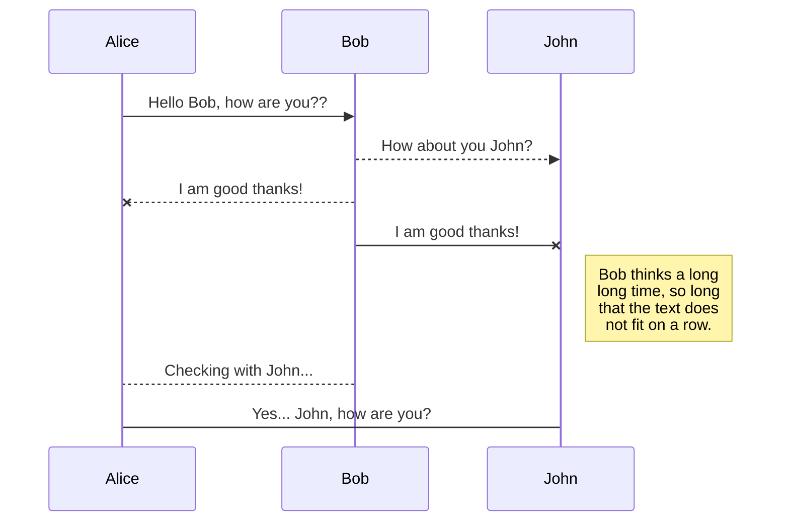

```
sequenceDiagram
    Alice ->> Bob: Hello Bob, how are you??
    Bob-->>John: How about you John?
    Bob--x Alice: I am good thanks!
    Bob-x John: I am good thanks!
    Note right of John: Bob thinks a long<br/>long time, so long<br/>that the text does<br/>not fit on a row.

    Bob-->Alice: Checking with John...
    Alice->John: Yes... John, how are you?
```

### 2.2. 自动编号 autonumber

带上 `autonumber` 关键词，则会自动编号。

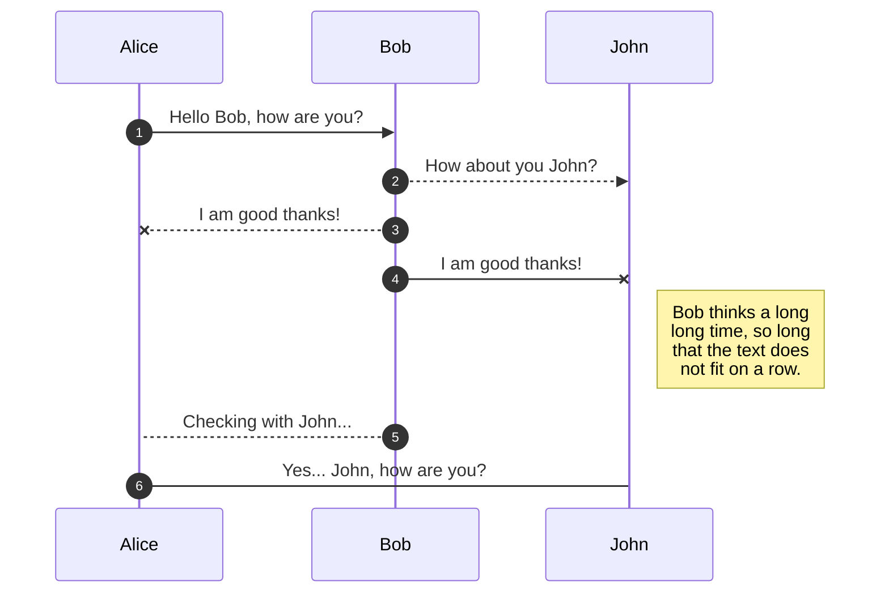

```
sequenceDiagram
    autonumber
    Alice ->> Bob: Hello Bob, how are you?
    Bob-->>John: How about you John?
    Bob--x Alice: I am good thanks!
    Bob-x John: I am good thanks!
    Note right of John: Bob thinks a long<br/>long time, so long<br/>that the text does<br/>not fit on a row.

    Bob-->Alice: Checking with John...
    Alice->John: Yes... John, how are you?
```

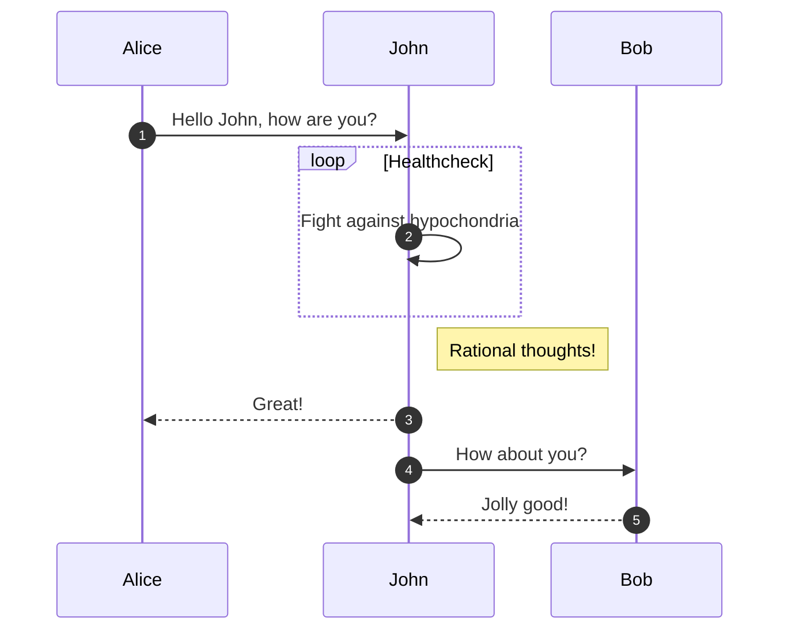

```
sequenceDiagram
    autonumber
    Alice->>John: Hello John, how are you?
    loop Healthcheck
        John->>John: Fight against hypochondria
    end
    Note right of John: Rational thoughts!
    John-->>Alice: Great!
    John->>Bob: How about you?
    Bob-->>John: Jolly good!
```

### 2.3. 基础流程图

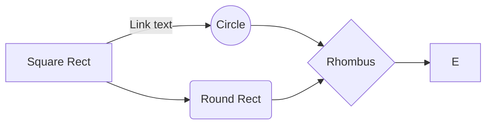

```
graph LR
    A[Square Rect] -- Link text --> B((Circle))
    A --> C(Round Rect)
    B --> D{Rhombus}
    C --> D
    D --> E
```

### 2.4. 带图形样式的复杂流程图

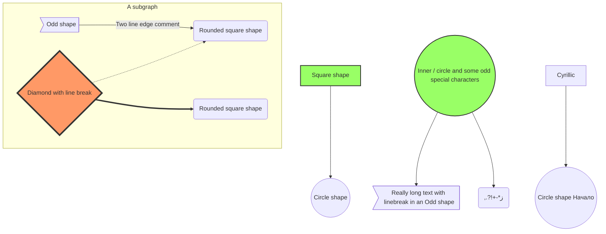

```
graph TB
    sq[Square shape] --> ci((Circle shape))

    subgraph A subgraph
        od>Odd shape]-- Two line edge comment --> ro
        di{Diamond with line break} -.-> ro(Rounded square shape)
        di==>ro2(Rounded square shape)
    end

    %% Notice that no text in shape are added here instead that is appended further down
    e --> od3>Really long text with linebreak in an Odd shape]

    %% Comments after double percent signs
    e((Inner / circle and some odd special characters)) --> f(,.?!+-*ز)

    cyr[Cyrillic]-->cyr2((Circle shape Начало));

     classDef green fill:#9f6,stroke:#333,stroke-width:2px;
     classDef orange fill:#f96,stroke:#333,stroke-width:4px;
     class sq,e green
     class di orange
```

### 2.5. 循环条件时序图

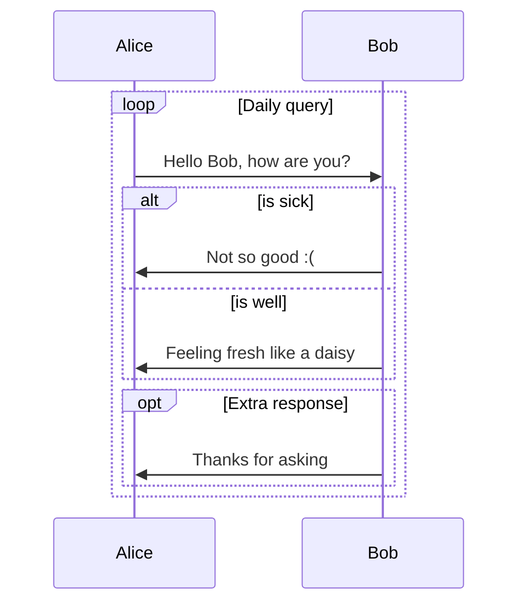

```
sequenceDiagram
    loop Daily query
        Alice->>Bob: Hello Bob, how are you?
        alt is sick
            Bob->>Alice: Not so good :(
        else is well
            Bob->>Alice: Feeling fresh like a daisy
        end

        opt Extra response
            Bob->>Alice: Thanks for asking
        end
    end
```

### 2.6. 循环条件带自调用步骤时序图

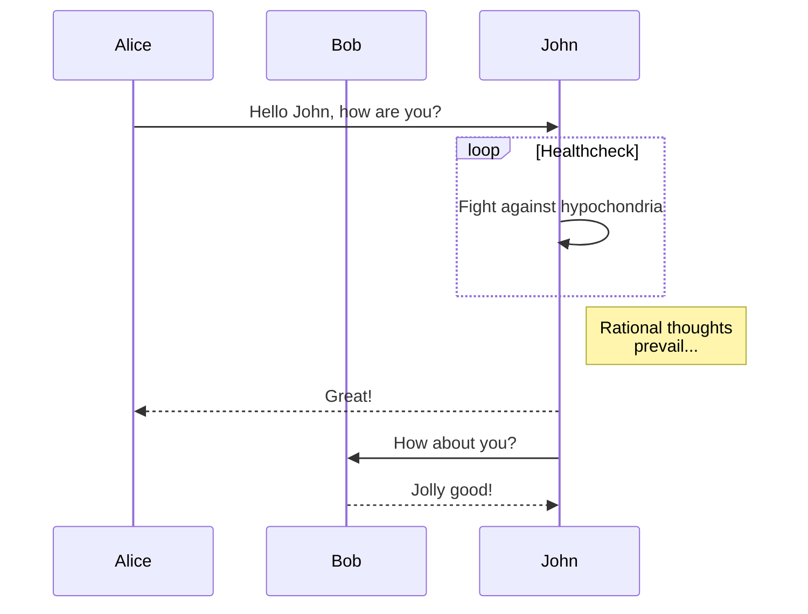

```
sequenceDiagram
    participant Alice
    participant Bob
    Alice->>John: Hello John, how are you?
    loop Healthcheck
        John->>John: Fight against hypochondria
    end
    Note right of John: Rational thoughts<br/>prevail...
    John-->>Alice: Great!
    John->>Bob: How about you?
    Bob-->>John: Jolly good!
```

### 2.7. 甘特图

#### 2.7.1. 基础

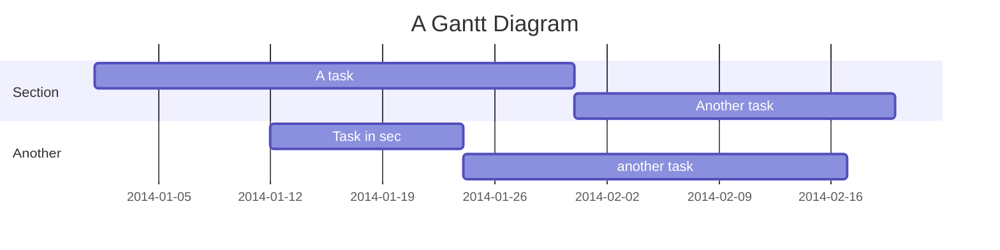

```
gantt
    title A Gantt Diagram
    dateFormat  YYYY-MM-DD
    section Section
    A task           :a1, 2014-01-01, 30d
    Another task     :after a1  , 20d
    section Another
    Task in sec      :2014-01-12  , 12d
    another task      : 24d
```

#### 2.7.2. 带颜色的甘特图

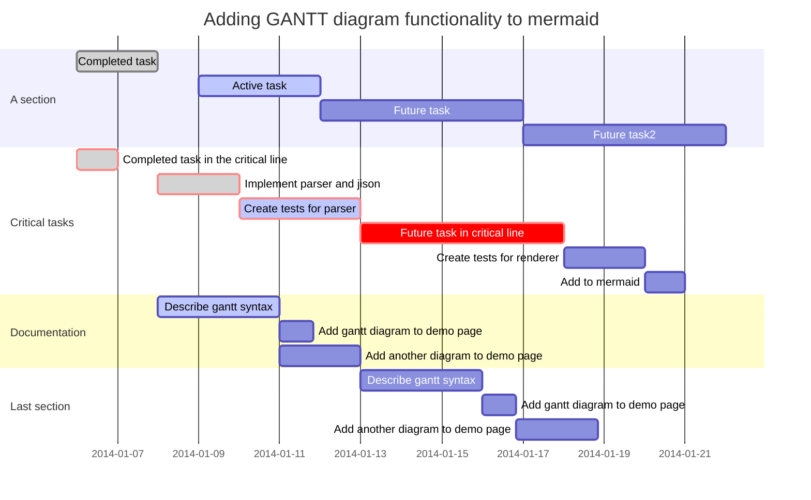

```
gantt
       dateFormat  YYYY-MM-DD
       title Adding GANTT diagram functionality to mermaid

       section A section
       Completed task            :done,    des1, 2014-01-06,2014-01-08
       Active task               :active,  des2, 2014-01-09, 3d
       Future task               :         des3, after des2, 5d
       Future task2              :         des4, after des3, 5d

       section Critical tasks
       Completed task in the critical line :crit, done, 2014-01-06,24h
       Implement parser and jison          :crit, done, after des1, 2d
       Create tests for parser             :crit, active, 3d
       Future task in critical line        :crit, 5d
       Create tests for renderer           :2d
       Add to mermaid                      :1d

       section Documentation
       Describe gantt syntax               :active, a1, after des1, 3d
       Add gantt diagram to demo page      :after a1  , 20h
       Add another diagram to demo page    :doc1, after a1  , 48h

       section Last section
       Describe gantt syntax               :after doc1, 3d
       Add gantt diagram to demo page      :20h
       Add another diagram to demo page    :48h
```

#### 2.7.3. 示例一

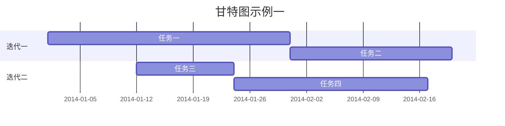

```
gantt
title 甘特图示例一

section 迭代一
任务一           :a1, 2014-01-01, 30d
任务二     :after a1  ,  20d

section 迭代二
任务三      :2014-01-12  , 12d
任务四      : 24d
```

#### 2.7.4. 示例二

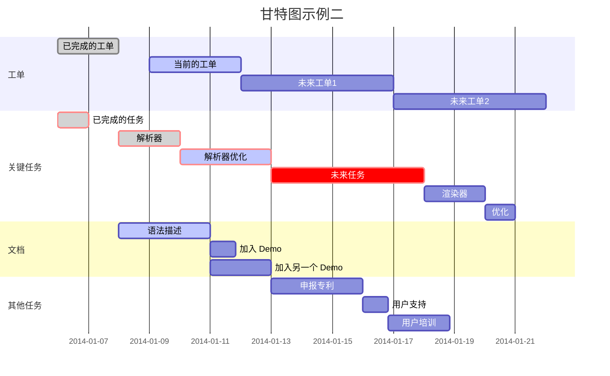

```
gantt
dateFormat  YYYY-MM-DD
title 甘特图示例二

section 工单
已完成的工单         :done,    des1, 2014-01-06,2014-01-08
当前的工单           :active,  des2, 2014-01-09, 3d
未来工单1            :         des3, after des2, 5d
未来工单2            :         des4, after des3, 5d

section 关键任务
已完成的任务 :crit, done, 2014-01-06,24h
解析器      :crit, done, after des1, 2d
解析器优化   :crit, active, 3d
未来任务    :crit, 5d
渲染器      :2d
优化       :1d

section 文档
语法描述     :active, a1, after des1, 3d
加入 Demo   :after a1  , 20h
加入另一个 Demo :doc1, after a1  , 48h

section 其他任务
申报专利    :after doc1, 3d
用户支持    :20h
用户培训    :48h
```

#### 2.7.5. 示例三

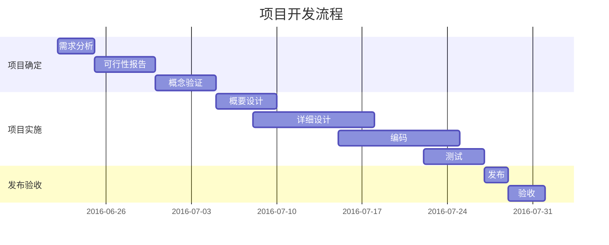

```
gantt
    title 项目开发流程
    section 项目确定
        需求分析       :a1, 2016-06-22, 3d
        可行性报告     :after a1, 5d
        概念验证       : 5d
    section 项目实施
        概要设计      :2016-07-05, 5d
        详细设计      :2016-07-08, 10d
        编码          :2016-07-15, 10d
        测试          :2016-07-22, 5d
    section 发布验收
        发布: 2d
        验收: 3d
```

#### 2.7.6. 示例四：时间轴重合问题说明

`axisFormat %m-%d` 自定义轴坐标语法。例如只显示月日的日期格式。

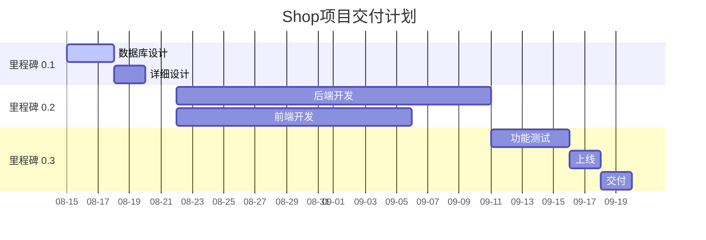

```
gantt
dateFormat  YYYY-MM-DD
axisFormat %m-%d
title Shop项目交付计划

section 里程碑 0.1 
数据库设计          :active,    p1, 2016-08-15, 3d
详细设计            :           p2, after p1, 2d

section 里程碑 0.2
后端开发            :           p3, 2016-08-22, 20d
前端开发            :           p4, 2016-08-22, 15d

section 里程碑 0.3
功能测试            :       p6, after p3, 5d
上线               :       p7, after p6, 2d
交付               :       p8, after p7, 2d
```

#### 2.7.7. 示例五：排除项

通过 `excludes` 可以将周六日在工时中去掉，甚至还能去掉指定日期，如国庆假期等等。

后端开发，排除从9月30日开始，排除周末和国庆7天假期，7个工作日，那么时间线会到10月16日截止。

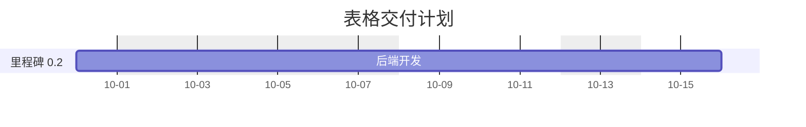

```
gantt
dateFormat  YYYY-MM-DD
axisFormat %m-%d
excludes weekends,2019-10-01,2019-10-02,2019-10-03,2019-10-04,2019-10-05,2019-10-06,2019-10-07

title 表格交付计划

section 里程碑 0.2
后端开发            :           p3, 2019-09-30, 7d
```

### 2.8. 饼图

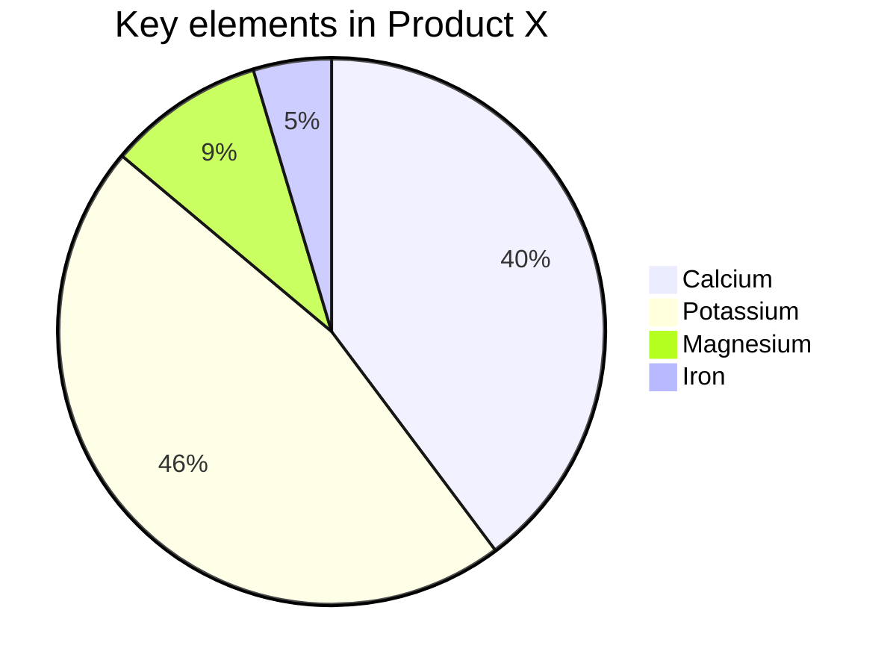

```
pie
    title Key elements in Product X
    "Calcium" : 42.96
    "Potassium" : 50.05
    "Magnesium" : 10.01
    "Iron" :  5
```

### 2.9. 实体关系图

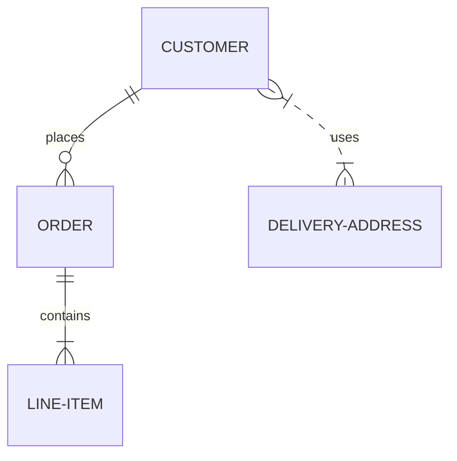

```
erDiagram
    CUSTOMER ||--o{ ORDER : places
    ORDER ||--|{ LINE-ITEM : contains
    CUSTOMER }|..|{ DELIVERY-ADDRESS : uses 
```

### 2.10. 类图

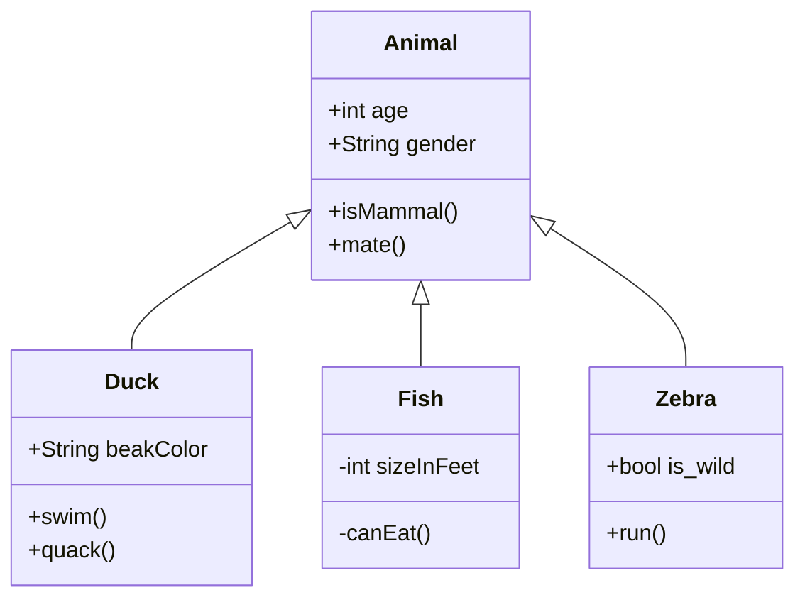

```
classDiagram
      Animal <|-- Duck
      Animal <|-- Fish
      Animal <|-- Zebra
      Animal : +int age
      Animal : +String gender
      Animal: +isMammal()
      Animal: +mate()
      class Duck{
          +String beakColor
          +swim()
          +quack()
      }
      class Fish{
          -int sizeInFeet
          -canEat()
      }
      class Zebra{
          +bool is_wild
          +run()
      }
```

### 2.11. 用户旅程图

Tasks syntax is `Task name: <score>: <comma separated list of actors>`

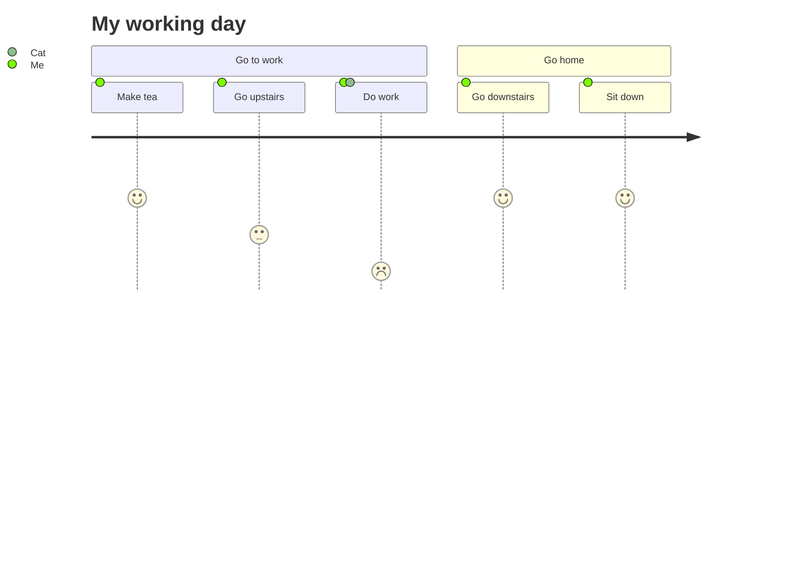

```
journey
    title My working day
    section Go to work
      Make tea: 5: Me
      Go upstairs: 3: Me
      Do work: 1: Me, Cat
    section Go home
      Go downstairs: 5: Me
      Sit down: 5: Me
```