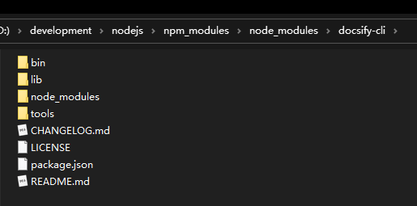
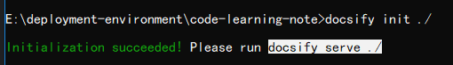
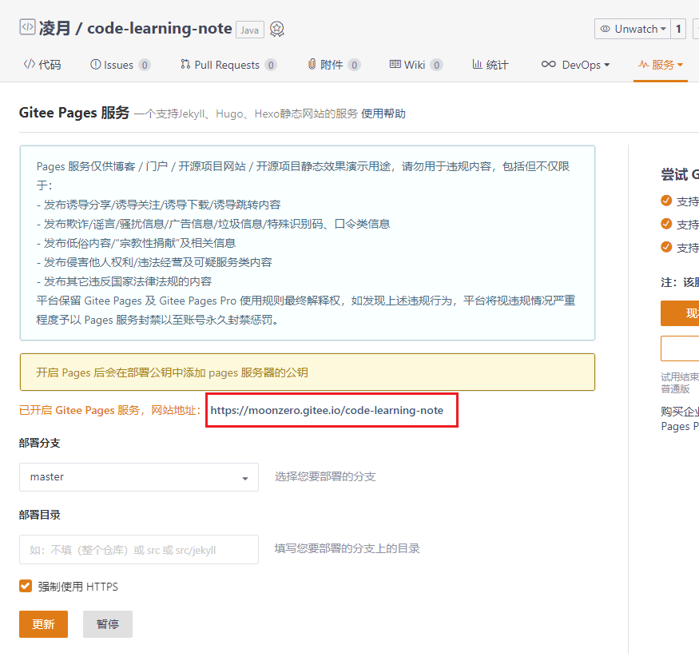

# docsify-文档类型网站搭建工具

## 1. 简介

- docsify可以即时生成您的文档网站。与GitBook不同，它不会生成静态html文件。相反，它可以智能地加载和解析您的Markdown文件并将其显示为网站。
- 官方教程：https://docsify.js.org/#/zh-cn/quickstart
- 其他教程：https://mp.weixin.qq.com/s?__biz=Mzg2OTA0Njk0OA==&mid=2247486555&idx=2&sn=8486026ee9f9ba645ff0363df6036184&chksm=cea24390f9d5ca86ff4177c0aca5e719de17dc89e918212513ee661dd56f17ca8269f4a6e303&scene=0&xtrack=1#rd

## 2. 使用说明

### 2.1. 使用前准备

1. 下载安装 NPM 并且使用这个命令：`npm i docsify-cli -g` 安装了 docsify-cli 这个工具。下载成功后在npm所配置的文件目录



2. 确保有一个 Github 账号（码云账号为非必选项，有的话更好）

### 2.2. 初始化项目并预览

创建一个文件夹，进入文件夹并运行 docsify 初始化命令

```bash
docsify init ./
```



当前文件目录生成三个文件

```
.nojekyll  ---> 用于阻止github pages 会忽略掉下划线开头的文件
index.html ---> 入口文件，也可以称为配置文件，相关配置都在此文件
README.md  ---> 会做为主页内容渲染
```

本地预览网站输入命令：`docsify serve ./` 然后访问：http://localhost:3000/

## 3. 相关配置
### 3.1. 修改配置文件 index.html

主要配置了文档网站的名字以及开启了一些配置选项

```html
```

### 3.2. 添加侧边栏文件

在 index.html 文件中设置开启

```js
window.$docsify = {
  ...
  loadSidebar: true, // 添加侧边栏文件
}
```

还需要定义一个名为 `_sidebar.md` 的文件，此文件的内容就是侧边栏的内容

> PS. 一般建议将文档放进 docs 文件下面

## 4. 上传到github或者gitee

需要开启动github page或者gitee pages服务



