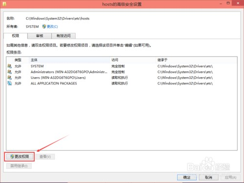
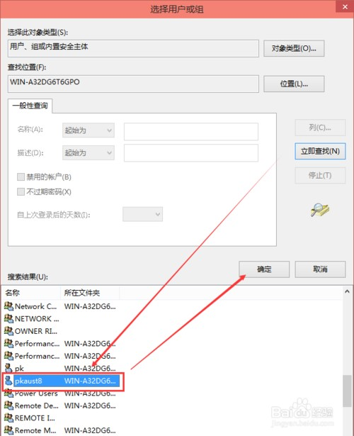
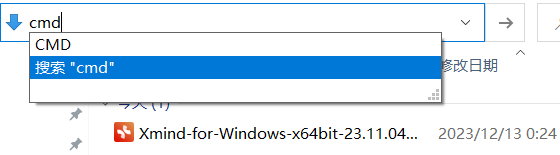

> 个人常用的软件工具汇总推荐与教程

## 1. 优质精选的最佳应用程序及工具列表

- [Awesome-Windows GitHub](https://github.com/Awesome-Windows/Awesome/blob/master/README-cn.md)
- [Awesome-Linux-Software GitHub](https://github.com/luong-komorebi/Awesome-Linux-Software/blob/master/README_zh-CN.md)
- [Awesome-MacOS GitHub](https://github.com/jaywcjlove/awesome-mac/blob/master/README-zh.md)

## 2. 软件开发类

### 2.1. Google 搜索引擎使用技巧

> Tips: 其他搜索引擎的使用方式也差不多

#### 2.1.1. 匹配多个关键字

如果搜索的内容包含多个关键词，中间可以用「空格」来分隔。当然也可以使用 「and」，效果差不多

#### 2.1.2. 匹配一个关键字

如果搜索的多个关键词只需包含其中一个即可，可以使用「竖线」，例如：“微服务 | RabbitMQ”。此方式搜索的结果比较多，很多都是无关的。这种模式适合一些资料比较少的场景，广撒网找灵感。


#### 2.1.3. 精确搜索

搜索引擎之索引能从海量的资料中快速查找到需要的信息，是因为采用了倒排索引。将一篇文章提前做了分词，然后对每个词语做反向关联文档。

查找时，关键词也会先分词，用多个词语并行去查询，再将返回结果去重合并、评分，按分数的高低排序后返回结果。有时<u>关闭分词</u>更有利于快速检索结果。可以采用**「双引号」**将关键词包裹起来，这样搜索出来的就是包含完整这段话的页面。  


#### 2.1.4. 模糊搜索

如果搜索时，忘了单词怎么写了，可以后面加「`*`」，比如：`git comi*`


#### 2.1.5. 排除干扰

搜索结果有很多内容是明确不需要的，可以对查询结果再做一层过滤。采用**「减号」**后面跟关键词。


特别注意：**减号前面有空格，后面没有空格，直接拼接搜索词**。这种方式可以进一步精简搜索结果，避开很多干扰信息。


#### 2.1.6. 限标题搜

一般搜索时，只要文章中有这个关键词都能被搜出来，不管是标题还是正文。如果只想搜索标题含有这个关键词，可以在搜索词前面加个指令，比如 `intitle:关键词`


#### 2.1.7. 限某网站搜

很多垂直网站也都配置了站内搜索，提高用户体验。但是有些网站没有搜索功能怎么办？

可以通过关键词 `site:网站域名`。比如：`高并发 site:csdn.net`，那等同在 CSDN 这个站点内搜索**「高并发」**关键词


#### 2.1.8. 搜索 pdf 文件

如果想定向搜索某一类型的文件，可以在搜索词后面拼接 `filetype:文件后缀名`，比如：`“微博” "高并发" filetype:pdf`。其他类型文件也是一样，比如：

```
filetype:ppt
filetype:doc
```


#### 2.1.9. 搜索图书

如果想搜索的内容指向性很强，例如是搜索一本图书，可以使用**「《》」**，比如：搜索 《如何成为学习高手》


#### 2.1.10. 限定时间范围

- 如果想在指定时间之后，可以在搜索词后面拼接「`after:2021`」
- 如果想在指定时间之前，后面拼接「`before:2021`」
- 如果想在一段时间区间内，后面拼接「`in 2020….2021`」


#### 2.1.11. 寻找替代网站

想要知道与某个网站相关的网站还有哪些，可以使用「`related:网站`」，比如 `related:github.com` 搜索引擎会列出许多相似的网站


### 2.2. AIXcoder 智能编程助手（未使用）

> 官网：https://www.aixcoder.com/#/

aiXcoder 极速本地版，智能编程助手。功能包括：代码智能补全、支持主流IDE、支持多编程语言、本地深度学习模型。支持多种主流IDE，包含 IntelliJ IDEA，Eclipse，PyCharm，Android Studio，PhpStorm，WebStorm、Clion，Visual Studio Code

### 2.3. SwitchHosts

- 官网：https://github.com/oldj/SwitchHosts

#### 2.3.1. SwitchHosts 简介

SwitchHosts! 是一款可以方便管理和一键切换多个 hosts 方案的免费开源工具，跨平台支持 Windows、macOS 和 Linux 系统。除了可以帮助你快速切换不同的 hosts 设置、编辑 hosts 文件外，它还有着一些很不错的特性，比如:

- 免费、开源、支持三大操作系统
- 系统托盘快速「一键切换」不同的 hosts 方案
- 支持 hosts 文件语法高亮，可以方便用户更直观地阅读和修改 Hosts 内容;
- 编辑 hosts 时，可以点击行号可以对行进行快速注释或取消注释
- 支持远程 hosts，直接从指定网址读取 hosts 内容，方便多台机器同步 hosts 设置，这是一个很赞的特性！
- 支持 hosts 配置的导入、导出备份
- macOS 系统下可以支持 Alfred workflow 快速切换

#### 2.3.2. 解决 host 文件无法修改的问题

1.	首先进入 Win 系统的 hosts 文件所在位置，我们直接输入`C:\Windows\System32\Drivers\etc`后回车就可以打开了，右键 hosts 文件，选择属性，如下图所示。


2. 点击 hosts 属性对话框里的“高级”，如下图所示。


3. 在 hosts 的高级安全设置界面点击更改权限，如下图所示。



4. 在新弹出的对话框里点击添加按钮，如下图所示。


5. 点击hosts的权限项目窗口下面的主体的“选择主体”，如下图所示。


6. 点击进入选择用户或组界面，点击高级，如下图所示。


7. 点击高级后，我们接着在点击理解查找，然后在查找结果里找到当前用户的账号，选中后点击确定，如下图所示。



8. 在选择用户或组界面里点击确定，如下图所示。


9. 将 hosts 的权限项目界面下的基本权限的所以项目都勾选上，然后点击确定，如下图所示。


10. 权限添加成功后，直接点击确定，如下图所示。


11. 点击后，系统提示你将要更改系统文件夹的权限设置，这样会降低计算机的安全性，并导致用户访问文件时出现问题。要继续吗？我们点击是。如下图所示。


#### 2.3.3. 修改 hosts 后不生效怎么解决？

无论是手工修改 hosts 还是使用软件来修改，很多人都会遇到修改 hosts 后不生效的情况。其实，这一般是由于 DNS 缓存的原因导致的。因为系统为了加快用户打开网站的速度，在首次访问网站成功之后，会把 DNS 解析的结果暂时性地保存在本地缓存 (称为 DNS 缓存) 里一小段时间，如果浏览器在“这段时间里”再次打开同一个网址，则会自动从 DNS 缓存里取出结果，而不会请求远程的 DNS 服务器，也不会查询 hosts 文件，从而节省时间提高打开速度。因此用户会遇到有时修改了 hosts 文件但并不生效的情况，一般这时候我们想办法清空 (刷新) 一下系统的 DNS 缓存即可。

怎样清空 DNS 缓存？

- Windows 系统，在命令行执行：`ipconfig /flushdns`
- macOS 系统，执行命令：`sudo killall -HUP mDNSResponder`
- 如果使用 Chrome 浏览器，那么可以访问：`chrome://net-internals/#dns`，然后点击『Clear host cache』按钮来清空浏览器里的 DNS 缓存。

> 如果这样还不生效，那么只能再试试重启电脑了，一般都OK了。要这样还是不行，可能就是的 hosts 写错了。

## 3. 系统管理类

### 3.1. Total Commander

Total Commander，简称 TC，原名 Windows Commander，是一款功能非常强大的全能文件管理器。Total Commander 是共享软件，官网下载版本为一个月试用版。支持随意自定义的菜单、工具栏、快捷键，给您最大的自由，打造个性 TC。一般的文件操作，如搜索、复制、移动、改名、删除等功能应有尽有。

- 官网 https://www.ghisler.com/index.htm
- Total Commander 飞扬时空版下载
   - [蓝奏云](https://www.lanzoui.com/b405514/)
   - [百度网盘](https://yun.baidu.com/s/1cp9zuY#list/path=%2F)

### 3.2. TrafficMonitor

TrafficMonitor 下载（Gitee）：https://gitee.com/zhongyang219/TrafficMonitor/releases

### 3.3. 软件卸载

#### 3.3.1. Geek Uninstall

Geek Uninstall 是一款高效快速，小巧便携，完全免费的程序卸载神器。不仅可以清理掉一些顽固软件(如一些流氓软件)，同时还可以最大限度清理电脑垃圾缓存。

> 官网：https://geekuninstaller.com

#### 3.3.2. Hibit Uninstaller

系统自带的软件卸载工具，会留下注册表的垃圾。而 HiBit Uninstaller 能够运行高级扫描，绝大部分的软件信息都能够被识别并清理。

> 官网：https://www.hibitsoft.ir/Uninstaller.html

### 3.4. Everything

> 详见[《Everything - 本地高效搜索神器》](/其他/software/everything)

## 4. 文字编辑器

### 4.1. VNote

VNote 是一个受 Vim 启发的开源笔记记录实用程序，还具有 Markdown 编辑功能。当然，您可以像具有便笺管理功能的可高度配置的 Markdown 编辑器一样轻松地查看它，它不会让人失望。

- VNote 官网： https://app.vnote.fun/zh_cn/
- VNote Github 仓库： https://github.com/vnotex/vnote
- VNote 下载 
   - [百度网盘](https://pan.baidu.com/share/init?surl=Fou1flmBsQUQ8Qs9V_M6Aw#list/path=%2F)  提取码：note
   - [天翼云盘](https://cloud.189.cn/web/share?code=Av67NvmEJVBv)
- [VNote’s Documentation](https://vnote.readthedocs.io/zh-cn/latest/) - 用于参考软件相关配置，如主题、片段等。

### 4.2. Typora

Typora 是一款 Markdown 文档编写工具，整个软件的界面感非常简洁，可以边写边预览实时编排效果，同时支持自定义主题。

> - Typora 官网（国内无法访问）： https://typora.io/
> - Typora 中文主页（非官方）： https://typoraio.cn/

### 4.3. Notepad++

Notepad++ 是一款完全免费的源代码编辑器，支持多种编程开发语言。Notepad++ 底层是用纯 C++ 编写的，同时结合纯 Win32 API 和 STL，保证了更高的执行速度和更小的程序内存。通过在不损失用户友好性的情况下尽可能多地优化程序运行效率。**但因软件作者个人原因，不推荐使用！**

> - 官网： https://notepad-plus-plus.org
> - Github 仓库： https://github.com/notepad-plus-plus/notepad-plus-plus

#### 4.3.1. 常用操作

在使用 notepad++ 工具的时候，很多情况下会遇到批量替换空行的操作，操作方法是使用快捷键 `Crtl+h` 调出窗口选择替换栏，在查找目标栏中输入 `\r\n\r\n`，替换栏中输入 `\r\n` 并选择全部替换，从而实现批量删除空行的操作。

### 4.4. Rime 输入法设置

特殊字符输入

- `zzbd`：中文对符号，如：“”、《》、『』
- `zzde`：А、
- `zzdl`：Ⅰ、Ⅳ
- `zzds`：⒈、⒉
- `zzdw`：单位符号
- `zzdx`：ΔΞΠ5. - `zzfs`：⑸⒀
- `zzhb`：货币
- `zzjp` & `zzpj`：日文
- `zzpp`：中文部首
- `zzpy`：中文拼音
- `zzsx`：数学符号
- `zzts`：特殊符号
- `zzxe`：
- `zzxl`：
- `zzxx`；
- `zzys`
- `zzzs`
- `zzzy`：台湾注音

### 4.5. 常用字体

#### 4.5.1. Cascadia Code

> 下载地址：https://github.com/microsoft/cascadia-code

微软开源了一套新的字体 Cascadia Code。


Cascadia Code 是微软在 5 月份的 Build 大会上宣布推出的等宽字体，微软介绍它是与新的终端 Windows Terminal 一起开发的，官方建议将其与终端应用和 VS、VS Code 等文本编辑器一起使用。Cascadia Code 为命令行和代码编辑器提供了全新的体验，并且它还支持编程连字（Programming Ligatures），就是在编写代码的时候，可以组合字符创建新的字形，这对于代码的可读性和呈现后的用户友好度都是一种很好的机制，同时这也增强了 Windows Terminal 的现代外观。需要注意的是，如果使用的是 VS Code，则必须在设置中启用连字功能才能生效。


字体预览


#### 4.5.2. Fira Code

> 下载地址：https://github.com/tonsky/FiraCode

由 Mozilla (FireFox 的东家) 推出的「Fira Code」就是一款编程连字字体，同样也是一款非常值得推荐使用的优秀代码等宽字体~！！！


#### 4.5.3. Monaco

Mac 的默认字体，好像也只有Mac上有。小字号的时候表现不错，而且再大些也不寒碜。


#### 4.5.4. Source Code Pro

Source Code Pro 是由大名鼎鼎的 Adobe 公司发布的一款开源且完全免费的等宽编程字体，它非常适合用于阅读代码，支持 Linux、Mac OS X 和 Windows 等操作系统，而且无论商业或个人都可以免费使用，相当厚道。这款字体和微软的 Consolas 一样均定位于“编程字体”

- 查看网址：https://adobe-fonts.github.io/source-code-pro/
- 下载地址：https://github.com/adobe-fonts/source-code-pro/


#### 4.5.5. JetBrains Mono

> 官网：https://www.jetbrains.com/lp/mono/

JetBrains 推出了一款名为 "Mono" 的字体。在设计 Mono 字体之初，团队充分考虑了长时间查阅代码可能导致的眼睛疲劳问题，以及受影响的因素，比如字母的大小和形状、空间量、自然等宽平衡、不必要的细节、连字、以及难以区分的符号或字母（l 和 I）和连字等。Mono 字体有许多优点，但它支持的 143 门语言中没有中文，因此**对于中文的显示支持可能不会太好**、Mono 字体还是一款开源且免费的字体，使用者可免费用作任何商业或非商业用途。


它和 Consolas 字体的区别


#### 4.5.6. Input Mono

> 官网：https://input.djr.com/

Input 可以高度可定制，它有 4 种宽度版本，名称无后缀的最宽，Narrow、Condensed、Compressed 则依次变窄（个人最喜欢 Narrow），还可以通过 OpenType 特性调整风格。


Input 不是一个字体，而是一个家族；除了等宽版本，还有两种比例字体：无衬线体 Input Sans 和衬线体 Input Serif。它们和 Input Mono 有类似的骨架，但因为不同的宽度和笔画特征另有一番风格。

#### 4.5.7. 其他字体

##### 4.5.7.1. 齐伋字体

> 官网：https://github.com/LingDong-/qiji-font

齐伋体 (QIJI Font) 是提取自明代木版印刷书籍（凌闵刻本）的字体，亦称作「令东齐伋体」。齐伋体笔画风格书法特征浓郁，比常规的明朝体更具韵律感，富有人文气息，非常适宜用于需要展现人文感、手作感、古拙感的场景。这款字体基于思源宋体改造而来，对中文汉字支持极佳。齐伋体展示效果：


##### 4.5.7.2. 霞鹜文楷 (LXGW WenKai)

> 官网：https://github.com/lxgw/LxgwWenKai

霞鹜文楷是一款开源中文字体，名字取自于王勃的《滕王阁序》——“落霞与孤鹜齐飞，秋水共长天一色”。霞鹜文楷衍生自开源字体 Klee One，后者是一款日文的教科书字体，由日本著名字体厂商 FONTWORKS 打造，兼有仿宋和楷体的特点。霞鹜文楷基于 Klee One 补全了简繁常用字。


##### 4.5.7.3. 思源黑体

> 官网：https://github.com/adobe-fonts/source-han-sans

开发商：Google & Adobe。思源黑体（也称作 Source Han Sans 或 Noto Sans CJK）是 Google 和 Adobe 合作打造的开源字体，采用了开源字体许可证 SIL Open Font License，免费且可商用。“思源” 二字取自于成语 “饮水思源”。

思源黑体支持简体中文、繁体中文、日文、韩文以及英文；提供了 ExtraLight、Light、Normal、Regular、Medium、Bold 和 Heavy 共 7 种字体粗细，可以满足不同场景下的文字显示需求。适合设计师、开发者，以及普通用户使用。思源黑体展示效果：


##### 4.5.7.4. 思源宋体

> 官网：https://source.typekit.com/source-han-serif/cn/

开发商：Google & Adobe。继 “思源黑体” 后，Adobe 和 Google 再度联手创造了 “思源宋体”（称作 Source Han Serif 或 Noto Serif CJK）。思源宋体也采用了开源字体许可证 SIL Open Font License，免费且可商用。

思源宋体同样包含简繁中文以及日韩四种汉字写法和 ExtraLight、Light、Regular，Medium、SemiBold、Bold 和 Black 七种粗细字重，每种粗细字重分别收录了 65535 个字形，七种字重共收录高达 458745 个字形，可以满足不同的设计需求。思源宋体展示效果：


## 5. 音乐播放器

### 5.1. foobar2000

> 详见[《foobar2000 - 本地顶级音乐播放器》](/其他/software/foobar2000)

### 5.2. Winamp

Winamp 是一款经典的 MP3 软件，从免费到收费，再过渡到免费软件，直到现在整合的版本 5，Winamp 无愧于 Windows 系统下播放器的头把交椅，最新版本修正了旧版中的 Bug，并增加了一些新功能，如果不喜欢现在的 Winamp 过于臃肿，建议定制安装，或选择 Lite 版本。

> 官网：https://player.winamp.com/trending

### 5.3. AIMP

AIMP(Artem Izmaylov Media Player)是一款来自俄罗斯的免费专业级音频播放器，除了播放器基本的音频播放之外，还提供了音频转换、标签编辑、录制广播等功能。播放器界面相当友好易用，占用系统资源较少且安装包也不是很大。

> 官网：https://www.aimp.ru/

### 5.4. MusicBee

终极音乐管理器和播放器。MusicBee 可让您轻松管理、查找和播放电脑中的音乐文件。MusicBee 还支持播客、网络电台和 SoundCloud 集成。

> 官网：https://www.getmusicbee.com/

### 5.5. MusicPlayer2

MusicPlayer2 是一个开源的纯粹音乐播放器，功能强大，界面极简干净，后台占有资源极少！

> 官网：https://github.com/zhongyang219/MusicPlayer2

下载地址：

- [MusicPlayer2 最新版本下载](https://github.com/zhongyang219/MusicPlayer2/releases)
- 国内备用下载链接：[百度网盘下载](https://pan.baidu.com/s/1i5QNwFF)

### 5.6. 洛雪音乐助手桌面版

洛雪音乐桌面版

- Github 仓库： https://github.com/lyswhut/lx-music-desktop/releases
- [蓝奏云](https://www.lanzoui.com/b0bf2cfa/) 密码：glqw

### 5.7. Listen 1

Listen 1 音乐播放器主页： https://listen1.github.io/listen1/

windows 桌面版缓存目录：`%APPDATA%\listen1\Cache`

### 5.8. 音频标签软件

- [MP3TAG](https://www.mp3tag.de/en/index.html) - MP3 文件 ID3-Tag 信息修改器。所谓 ID3-Tag  信息，就是在 MP3 文件中加入曲名，演唱者，专辑，年月，流派，注释等信息，便于您收集歌曲。其实 Winamp 中带有编辑器，只是把它做的方便一点。可以以文件名批量添加媒体元信息，根据媒体元信息批量重命名文件，执行批量文字替换、导入导出文件信息、创建播放列表等任务。MP3tag 便携版软件运行批量修改，免去了大家一个一个修改的麻烦，也解决了播放 MP3 出现乱码。
- [音乐标签](https://www.cnblogs.com/vinlxc/p/11347744.html) - 是一款可以编辑歌曲的标题，专辑，艺术家等信息的应用程序，支持 FLAC, APE, WAV, AIFF, WV, TTA, MP3, MP4, M4A, OGG, MPC, OPUS, WMA, DSF, DFF 等音频格式，绿色无广告，无任何功能限制。

### 5.9. 音乐下载

- ~~下歌吧音乐下载平台（*抱歉！该站点已经被管理员停止运行，请联系管理员了解详情！）* https://music.y444.cn/#/ ~~
- MyFreeMP3(离线版)： https://tools.liumingye.cn/music/?page=searchPage#
- MyFreeMP3： https://www.myfreemp3.com.cn/
- MusicENC： https://www.musicenc.com/
- Musicbed： https://www.musicbed.com/
- [好歌多](https://www.haogeduo.com/)
- [无损生活](https://flac.life/)

## 6. 图像处理

### 6.1. FastStone 系列软件

FastStone 系列软件是个人免费、商业收费，一共有4款软件。

- FastStone Image Viewer 这个是 FastStone 的主要软件，功能强大。
- FastStone Capture 截图软件，个人认为最大的优点是可以截滚屏的图。
- FastStone MaxView 纯粹的看图软件，速度奇快无比。
- FastStone Photo Resizer 图片文件的转换/处理软件。

FastStone 官方网站： http://www.faststone.org/

> Tips: 以下所有系列的下载链接中，如果输入的压缩包版本号大于当前可用的版本，会出现目前可用的文件选择的界面

#### 6.1.1. 全系列破解器（更新于2023.05.04）

解压 Keygen.7z 选择相应的 FastStone 的产品，随便输入一个用户名，然后生成相应的注册码即可。

#### 6.1.2. FastStone Image Viewer（目前更新至7.9版本）

官方网站（无法打开）： https://www.faststone.org/FSViewerDetail.htm

官方简体中文版下载地址：（官网无法打开，但下载地址可以下载）

- 安装版 :
    - https://www.faststonesoft.net/DN/FSViewerSetup79.zip
    - https://www.faststonesoft.net/DN/FSViewerSetup79.exe
- 便携版 : https://www.faststonesoft.net/DN/FSViewer79.zip

> 建议使用迅雷或IDM下载

家庭用户可免费使用，商业使用须注册。注册及设置方法：如果您使用的旧版如 7.7 版已授权注册为商业版，可以将旧版如 7.7 商业版注册文件及设置文件 `FSSettings.db`，复制到 7.8 版 FSViewer 目录中就能注册 7.8 版并保持旧版如 7.7 版的设置，不必重新注册和设置。

#### 6.1.3. FastStone Capture（目前更新至11.0版）

官网便捷版下载地址（好像暂无安装版）：

- https://www.faststonesoft.net/DN/FSCapture11.zip

> 最新版激活注册码 (更新于2023-09-10)
>
> - 注册名：bluman
> - serial/序列号/注册码：VPISCJULXUFGDDXYAUYF
> - 注册名：microsoft
> - serial/序列号/注册码：WYZQU-RCMZR-KETRH-PKZGN

#### 6.1.4. FastStone MaxView（目前更新至3.4版）

官网安装版下载地址:

- https://www.faststonesoft.net/DN/FSMaxViewSetup34.exe

#### 6.1.5. FastStone Photo Resizer（目前更新至4.4版）

官网便捷版下载地址（好像暂无安装版）:

- https://www.faststonesoft.net/DN/FSResizer44.zip

### 6.2. 截图工具

#### 6.2.1. Snipaste

> 官网：https://www.snipaste.com/

#### 6.2.2. Pixpin

> 官网：https://pixpinapp.com/

PixPin 是目前市面上功能最全面的截图工具之一了！包括**截图、贴图、标注、编辑、文字识别、滚屏长截图、动图 GIF 录屏**等等，都是办公编辑时中非常需要用到的功能。PixPin 把它们全都集成在一起，变成一个非常高效实用的生产力利器！目前完全免费。

> 异次元简介：https://www.iplaysoft.com/pixpin.html

### 6.3. 其他图像软件

- [Honeyview · 蜂蜜浏览器](https://www.bandisoft.com/honeyview/) - 是一款快速的图片查看器，非常快速的漫画阅览器，同时也是一款非常不错的图像浏览器。
- [IrfanView](https://www.irfanview.com/) - 堪与 ACDSee 媲美，支持的图像、音频、视频格式众多，并可幻灯显示、批量转换格式、批量重命名、JPG 无损旋转，支持拖放操作；亦具有调整图像大小、调整颜色深度、添加覆盖文字、特效（内置）处理等图像编辑功能，自3.85 版已能支持使用 Adobe Photoshop 的滤镜（8BF 格式）；还可以制作 HTML 格式的缩略图目录、创建自播放幻灯显示（EXE 或 SCR），是图像爱好者必备的袖珍精品。
- [XnView](https://www.xnview.com/en/) - 经典免费实用看图浏览/管理/转换工具 XnView 是一个图像浏览器和多媒体播放器。它能够支持大约400种文件格式（比如说 png、jpeg、targa、tiff、gif、bmp等）。同时还支持动画 gif、多页面 tiff、多图像图标以及 mpeg、avi、wav、aiff 和 Quicktime 格式的文件。此外，XnView还具有浏览器、幻灯片、屏幕捕捉、缩略图制作、批处理转换、十六进制浏览、拖放、通讯录、扫描输入等功能。该软件支持43种语言，并能够在 Linux/FreeBSD/Irix/Solaris/HP-UX/AIX 等操作系统中使用。除了一般的查看、浏览、幻灯显示等功能外，还自带多种滤镜，方便编辑修改；可以批量转换文件格式，创建缩略图并生成网页，还可自己制作 GIF，小巧实用。 选择安装“资源管理器右键菜单扩展插件”，可在资源管理器右键菜单中增加图片预览功能！
- [ImageGlass](https://github.com/d2phap/ImageGlass/releases)
- [ACDSee](https://www.acdsee.cn/)
- [JPEGView](https://github.com/sylikc/jpegview) - 是 JPEG，BMP，WEBP，PNG，TGA，RAW，GIF 和 TIFF 图像的查看器/编辑器。它旨在以全屏方式和最高质量查看数码相机中的图像。提供了基本的图像编辑功能-可以在查看图像期间非常快速地交互式地纠正色偏，高/低对比度以及曝光不足或过度曝光等典型问题。JPEGView 便携版不会取代功能强大的图像编辑器-这样的编辑器将不再需要。
- [FocusOn Image Viewer](https://www.pintosoft.com/en/foni) - 适用于 Windows 的轻巧快速的免费图像查看器，快速查看和编辑照片，所有人免费-个人和商业用途，按日期自动整理照片，保持照片编辑而不会损坏原始照片，在博客，Twitter，Facebook 上共享照片，支持超过 100 种图像格式。
- [PicView](https://picview.org/) - Free and customizable image viewer。据说 MAC 系统最好的看图软件？！
- [Imagine](https://www.nyam.pe.kr/dev/imagine/) - Freeware Image & Animation Viewer for Windows
- [ScreenToGif](https://www.screentogif.com/) - 屏幕、摄像头和画板录像，并有内置编辑器

### 6.4. Adobe Photoshop Lightroom Classic

Lightroom Classic 作为一个直观的解决方案，可提供在处理大部分数码摄影任务时所需的全部工具。它是日常整理和优化图像的首选应用程序。无论是对于一副图像、一组图像，亦或是一个大型图库，Lightroom 都可以协助摄影师更快、更高效地进行处理。Photoshop 是数码图像编辑的行业标准，提供的多种先进工具可供摄影师、图形设计师及其他图形处理专业人士在执行精细的像素级编辑以及多图层文件处理时进行必要的全面控制。将 Lightroom Classic 和 Photoshop 作为 Creative Cloud 摄影计划的组成部分。

#### 6.4.1. 参考资源

- [官方教程和社区资源](https://helpx.adobe.com/cn/support/lightroom-classic-china.html)
- [全20集【Adobe Lightroom Classic从思路到后期调色】各功能详解视频教程目录](https://www.bilibili.com/read/cv13519248/)

## 7. 思维导图

### 7.1. Xmind

#### 7.1.1. 安装在指定位置（不修改注册表）

新版 Xmind 会默认安装在c盘，之前的版本可以通过修改注册表来实现安装到指定的位置，但事后需要再把注册表调整回来，比较麻烦。有以下方法，可以不需要修改注册表即可实现安装到指定位置。

1. 进入 Xmind 安装包的下载位置。
2. 在安装包所在位置的地址栏中输入 cmd 命令并回车



3. （以安装在D盘为例，提前在D盘创建以 Xmind 命名的文件夹）纯英文输入"安装包名称" /D="D:\Xmind"并回车。*tips：安装包名记得要包含.exe*


4. 安装完成


#### 7.1.2. XMind 解决默认安装在C盘的方法 - 已过时

1. win+r 输入regedit打开注册表编辑器
2. 找到 计算机\HKEY_LOCAL_MACHINE\SOFTWARE\Microsoft\Windows\CurrentVersion，右键点击名称为ProgramFilesDir的文件、修改(一定要记住原来的路径以便结束之后改回去）—— 将路径改为想要安装的文件路径
3. 安装 xmind
4. 最后，一定要将修改的注册表路径改回去，否则程序调用注册表时会发生错误

注意：不同的软件可能调用注册表不止这一个，比如安装 office2016 时，注册表调用了三个，分别修改了 ProgramFileDir, ProgramFileDir(x86) 和 ProgramW6432Dir，具体调用注册表情况具体分析。

```
# 原配置备份
ProgramFilesDir  --- C:\Program Files
ProgramFilesDir (x86)  --- C:\Program Files (x86)
ProgramW6432Dir  --- C:\Program Files
CommonFilesDir --- C:\Program Files\Common Files
CommonFilesDir (x86)  ---  C:\Program Files (x86)\Common Files
CommonW6432Dir  --- C:\Program Files\Common Files
```

## 8. 画图工具

### 8.1. draw.io

- Draw.io 在线官网：https://app.diagrams.net/

draw.io 是用来画各种类型的图，包括 UML、流程图、甘特图、线框图、类图、结构图、泳道图等等。

### 8.2. Excalidraw

Excalidraw 是一款在线白板画图工具

- [官网](https://plus.excalidraw.com/)
- 在线版：https://excalidraw.com/

## 9. 网络资源

### 9.1. 电子书

#### 9.1.1. ZLibary - 最大的电子书下载

- 官方网站： https://singlelogin.re/
- 官方桌面版下载： https://zh.go-to-zlibrary.se/#desktop_app_tab
- zlibrary 最新网址(2024年3月25日)：https://zh.zlibrary-sg.se/

> 注：若链接失效，可以箱给官方邮箱 `blackbox@zlib.se` 发送一条任何内容的邮件，就可以在3到5分钟内自动生成的回信中访问Z-Library。

**以下是一些国内镜像**：

- ZLibary 网站镜像唯一入口： https://www.zhelper.net/

> 注：地址经常换，镜像站/公用账号每日更新。本网页本身不具备任何搜索或者下载功能，需要搭配合适的查询接口（API）进行使用 直接访问将显示**无可用API**。

- [zhelper Search Page 搜索界面 🔍](https://search.zhelper.net/?%5B%7B%22name%22:%22Ylibrary%22,%22url%22:%22https://api.ylibrary.org%22,%22type%22:%22full%22,%22sensitive%22:false,%22detail%22:true%7D%5D) - Ylibrary 离线书库
- [Zlibrary 最新地址/入口](https://5w.fit/zkmgc) - 5w Short Links（短链接生成器）

> 如果网址失效，可以通过导航网站重新获取。 https://zlib.shop/

#### 9.1.2. 国内篇

- ~~[yibook](https://nav.yibook.org/) - 电子书搜索网站导航~~
- [SoBooks](https://sobooks.net/) 图书下载网站是本人最喜欢的一个，它不仅书的种类齐全，而且质量也是相当的高，长期这里获取资源让我受益匪浅。每本书都可以获取百度网盘、微盘等下载站链接，直接下载或者保存网盘即可。
- [鸠摩搜索](https://www.jiumodiary.com/) - 书籍类的搜索引擎，搜索到书籍后会有下载链接，直接网盘保存即可。
- [超星读书](http://book.chaoxing.com)，专业知识电子书
- [图灵社区](https://www.ituring.com.cn)，专为码农提供的电子书下载网站，有些是需要付费的，有些是免费的
- [莫若书单](https://www.mrsd.top/) - epub电子书、kindle电子书资源下载
- [书籍知识库](https://www.zhishikoo.com/) - 优质mobi,azw3,TXT,PDF,epub格式电子书分享站
- [跪读网](https://orzbooks.com/) - 跪读电子书 | 每天都分享优质电子书免费下载
- [Freembook](https://freembook.com) - 一个快捷的电子书搜索引擎，提供了百度网盘秒传和直接转传的方式。
- [无名图书(book123)](https://www.book123.info/) - 提供免费电子书下载的网站，界面非常简洁，广告也少，下载非常方便。缺点是格式单一，一本书只提供一个格式。
- [Lore Free](https://ebook2.lorefree.com) - Lore Free 致力于让每个人都能自由地获取到知识，是一个基于区块链的电子书下载站，未登录状态下，每天有 3 个下载额度（包括电子书和论文）登陆较复杂默认的额度足以满足日常需求。
- [libgen](https://libgen.gs/index.php) - libgen 与 Lore Free 类似同样是使用 IPFS 区块链来进行图书存储。
- [thefuture 书籍搜索](https://bks.thefuture.top) - thefuture 是一个电子书搜索引擎，提供了蓝奏网盘等资源的索引。
- [知搜](https://zhiso.top) - 知搜是一个电子书搜索引擎，雅书是一个下载站，两者的资源均通过城通网盘分享。
- [雅书](https://yabook.org)
- [书格](https://new.shuge.org/) - 书格是一个免费的古籍下载站，由于资源都是些人文古籍类，所以资源非常小众，网站不错可当备用。
- [找书网_图书信息搜索平台！](https://findbooks.eu.org/) - 找书网的资源相对较全，缺点是只能使用秒传下载，不会使用秒传或者没有百度网盘的不推荐这个网站。
- [熊猫搜书](https://xmsoushu.com/#/) - 熊猫搜书聚合了鸠摩搜书、Z-library等多个搜书网站的资源。缺点是下载程序比较繁琐，需要多次跳转页面。
- [奇妙搜索](https://www.magicalsearch.top/main) - 奇妙搜索主要是搜网盘上面的电子书，不止是电子书，其他资源也可以轻松获取。
- [书伴](https://bookfere.com/) - 书伴又称Kindle人社区，以前图书资源很多，后期整顿以后少了很多，下载的图书格式也大多是awz3，只能适配Kindle等电子阅读器，需要转换一下才能在电脑或者其他电子设备上阅读。
- [中国哲学书籍电子化计划](https://ctext.org/zh) - 很小众的细分电子书领域。
- ~~[ePUBee 电子书库](http://cn.epubee.com/books/)，电子书的类型非常的全面，而且技术类电子书质量比较高，流行的畅销书都可以在这下载到。~~
- ~~[epubw](https://epubw.com)，每日都会有电子书更新，通过网盘下载~~

#### 9.1.3. 国外篇

- [安娜的档案](https://zh.annas-archive.gs/) | [台湾区镜像](https://tw.annas-archive.se/) - 🔍影子图书馆搜索引擎：书籍、论文、漫画、杂志。 ⭐️ Z-Library、Library Genesis、Sci-Hub。 ⚙️ 通过开源代码和数据完全容灾。网站需要代理才能登陆，国内受限。
- [B-OK](https://b-ok.cc) 号称世界最大的电子图书馆，喜欢看英文原版的推荐使用，全英文网站，查找当然也需要英文。
- [Library Genesis](http://gen.lib.rus.ec)，是俄罗斯人做的超强英文电子书库。收录各大下载网站，书籍、期刊、文献储存量惊人。和B-OK.xyz不同在于支持更多电子书格式，但会有付费资源。
- [Libgen Online Library](https://libgen.pw)，电子书版本多，下载方便，格式也比较全。
- [PDFDrive](https://www.pdfdrive.com)，英文原版书
- [BookSC](https://booksc.org)，是 Z-Library 项目的一部分。世界上最大的电子书图书馆。还支持指定书中全文搜索
- [Manybooks](https://manybooks.net)，免费提供数字格式的图书馆

#### 9.1.4. Github 仓库分享

- [编程电子书分享(github)](https://github.com/hello-go-maker/cs-books) - 分享一些从网上整理的计算机类的电子书籍，包括Java电子书籍（Java基础，Java多线程，spring、springboot、springcloud，分布式，微服务等）、Python，Linux，Go，C，C++，数据结构与算法，人工智能，计算机基础，面试，设计模式，数据库，前端等书籍

### 9.2. 资源搜索下载

- [盘他一下](https://panother.com/) - 一个支持百度网盘和阿里云的在线网盘资源搜索引擎，找到搜索的内容后，需要微信扫码登录小程序，网盘虽然是完全免费的，但是搜索获取资源，会有积分限制
- [学搜搜(酷搜kolsou)](https://www.zhaokeya.com/) - 考研、考级、考证、IT教程等学习资料搜索引擎，网站资源主要来自百度网盘
- 综合网盘搜索神器。网站收录了数十款百度网盘搜索引擎、百度云网盘搜索工具、百度云网盘解析工具，简单好用。提供影视、书籍、软件等资源推荐以及整合信息。
    - [超能搜 - 百度网盘搜索神器](https://www.chaonengsou.com/)
    - [万网搜 - 资源搜索聚合神器](https://www.wanwangsou.com/)
    - [猫狸盘搜 - 阿里云盘搜索神器](https://alipansou.com/)

### 9.3. 在线视频网站

- **旋风视频 **官方网址： https://miao101.com/
- **茶杯狐 **官方网址： https://www.dajin1.com/
- **电影推荐-MVCAT **官方网址：https://www.mvcat.com/
- **影猫的仓库 **官方网址：https://search.ymck.me/
