## 1. IntelliJ IDEA 简介

IDEA，全称 IntelliJ IDEA ，是 Java 语言的集成开发环境，目前已经（基本）代替了 Eclipse 的使用。IDEA 在业界被公认为是最好的 Java 开发工具（之一），因其功能强悍、设置人性化，而深受Java、大数据、移动端程序员的喜爱。尤其在智能代码助手、代码自动提示、重构、J2EE 支持、Ant、JUnit、CVS 整合、代码审查、创新的 GUI 设计等方面的功能可以说是超常的。

> - 官网：https://www.jetbrains.com/idea/
> - 官网提供的详细使用文档：https://www.jetbrains.com/help/idea/meet-intellij-idea.html

> IntelliJ IDEA 在 2015 年的官网上介绍：
>
> Excel at enterprise, mobile and web development with Java, Scala and Groovy,with all the latest modern technologies and frameworks available out of thebox.

IDEA 分为两个版本：旗舰版(Ultimate) 和社区版(Community)。两个不同版本的详细对比，可以参照官网：https://www.jetbrains.com/idea/features/editions_comparison_matrix.html

## 2. 安装与卸载

### 2.1. 安装

1. 下载安装包后双击进行安装


2. 如果电脑上有低版本的 IDEA，会提示是否删除电脑上低版本的（如果有，也可以选择忽略）；如需卸载，建议勾选下面的保留旧的设置和配置。


3. 选择安装目录，目录不要有中文和空格。


4. 提示创建桌面快捷图标、是否与.java、.groovy、.kt 格式文件进行关联（建议不关联）等设置。


5. 一直下一步直到安装完成

### 2.2. 注册激活

如安装的旗舰版，则需要注(po)册(jie)才能使用，否则只能试用30天

#### 2.2.1. 使用激活码（已过时）

1. 安装下载软件，安装完成后，注意先不运行软件，所以不要勾选【Run Intelli IDEA】
2. 接下来对软件进行注册破解，首先以记事本的方式打开hosts文件（文件默认目录【C:\Windows\System32\drivers\etc】），将代码添加至hosts文件屏蔽网络联网；

```
0.0.0.0 account.jetbrains.com
0.0.0.0 www.jetbrains.com
```


3. 再运行桌面上生成的idea ultimate 2019.1软件图标，选择【do not import settings】点击ok，然后勾选【I confirm that...】点击continue进入进入如下界面，点击红色框内的选择

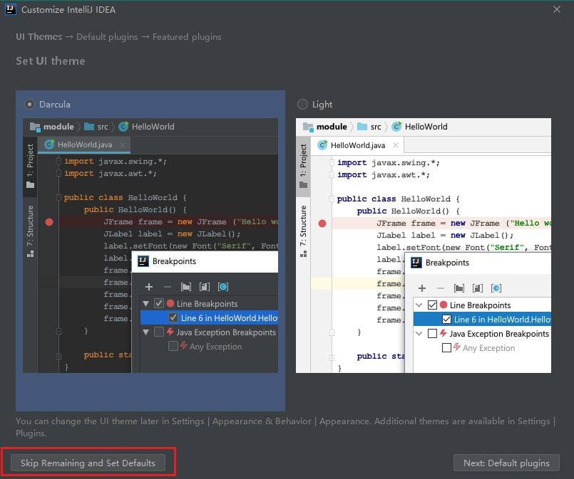

4. 弹出注册界面，选择"activation code"输入注册码即可激活


5. 至此，idea ultimate 2019.1破解版成功激活

#### 2.2.2. 其他方式

利用搜索引擎解决问题 ^_^

### 2.3. 卸载

可以通过控制面板或者 Geek Uninstaller 等软件卸载工具来卸载 IDEA。


卸载的过程中会提示是否保留IDEA之前使用的缓存、历史记录、配置、插件等。如需保留则不要打✓；如想彻底删除所有数据，则打上✓。


程序卸载完成后，还需要移除以下位置的残留文件：

- `%APPDATA%` 或 `C:\Users\<username>\AppData\Roaming`
- `%LOCALAPPDATA%` 或 `C:\Users\<username>\AppData\Local`

在以上的目录中查看是否有名为 `JetBrains` 的目录，有则直接删除即可


## 3. 建议初次启动 IDEA 前的配置

### 3.1. 设置 idea 配置保存位置

第一次进入Intellij IDEA之前，先修改一下缓存的保存位置

1. 修改 idea 安装目录下的 bin 文件中的 idea.properties 文件（`%IDEA_HOME%/bin/idea.properties`）


2. 修改 idea 的配置 config 文件夹与系统 system 文件。*注：插件与日志的文件夹可以不需要设置，因为这两个文件夹是默认在 config 与 system 目录下，但如果打开 idea 提示*


```
idea.config.path=D:/development/JetBrains/.IntelliJIdea/config
idea.system.path=D:/development/JetBrains/.IntelliJIdea/system
```

3. 修改后，将idea的配置缓存文件不需要保存在c盘的用户目录下，保存在指定的目录下

> 配置目录说明：
>
> - **config**：在初始化安装 IntelliJ IDEA 时会询问是否导入以存在的配置信息，这个 config 就是你的配置信息，方便更换电脑和换系统的时候重新安装，前提是要保存好此文件夹。
> - **system**：此文件夹是 IntelliJ IDEA 发生什么不可预知性的错误时，比如蓝屏突然断电导致项目不能启动，可以尝试删除此文件，让系统重新生成一个 system 的文件。

### 3.2. 当前项目配置 VS 默认配置

**为什么有了当前项目配置，还需要默认配置呢？**

因为IDEA没有工作空间的概念，所以每个新项目（Project）都需要设置自己的JDK和MAVEN等相关配置，这样虽然提高了灵活性，但是却要为每个新项目都要重新配置，这显然不符合我们的预期。在这个背景下，默认配置给予当前项目配置提供了Default选项，问题自然就迎刃而解了。

最新补充：IDEA为了明确这个新项目配置的概念，在 2018.2 之后的正式版本已正式将“Default Settings”名字修改“Default Settings /Project Structure”，即“默认配置”就是指“新项目配置”。

**初始化步骤**

- 打开默认配置：顶部导航栏 -> File -> Other Settings -> Default Settings /ProjectStructs
- 打开当前配置：顶部导航栏 -> File -> Settings / ProjectStructs

示例图如下：

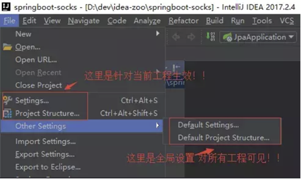

后面最新版本又调整为：

- 打开默认配置：顶部导航栏 -> File -> Other Settings -> Default Settings /ProjectStructs
- 打开当前配置：顶部导航栏 -> File -> Settings / ProjectStructs


### 3.3. JDK 配置

#### 3.3.1. 当前项目配置

创建项目后，点击【File】->【Project Structure...】->【Platform Settings】->【SDKs】


> Tips: 
>
> - SDKs 全称是 Software Development Kit，配置时一定是选择 JDK 的安装根目录，而不是 JRE 的目录
> - 点击“+”按钮，可以从本地添加多个 JDK
> - 当前项目的 Project Structure 可为工程和各模块设置喜欢的JDK版本

#### 3.3.2. 全局（默认）配置

具体步骤如下：

- 旧版本：点击File -> Other Settins -> Default Project Structure -> SDKs -> JDK
- 新版本：【File】->【New Projects setup】->【Structure...】->【Platform Settings】->【SDKs】


根据下图步骤设置 JDK 目录，最后点击 OK 保存。


### 3.4. 项目配置

#### 3.4.1. 当前项目配置

创建项目后，选择【File】->【Project Structure...】->【Project Settings】->【Prject】


> Tips: 这种配置只针对当前项目

#### 3.4.2. 新创建项目默认配置

也可以针对每次新创建项目默认配置，选择【File】->【New Projects setup】->【Structure...】->【Project Settings】->【Prject】。跟针对项目配置一样即可


### 3.5. 设置默认编码

#### 3.5.1. 设置项目文件默认编码（必须修改）

1. 打开【Settings】->【Editor】->【File Encodings】，把 encoding 相关的选项都选择 UTF-8


> Notes: Transparent native-to-ascii conversion 是用于自动转换 ASCII 编码，显式原生内容。工作原理是：在文件中输入文字时他会自动的转换为 Unicode 编码，然后在 idea 中发开文件时他会自动转回文字来显示。这样做是为了防止文件乱码。像 properties 这类文件，一般都不会出现中文乱码！<font color=red>**一般建议都要勾选。**</font>

2. 打开 IDEA 安装路径，找到如下的安装目录。根据所安装的版本修改相应的配置文件（idea64.exe.vmoptions）


2021.2 版本

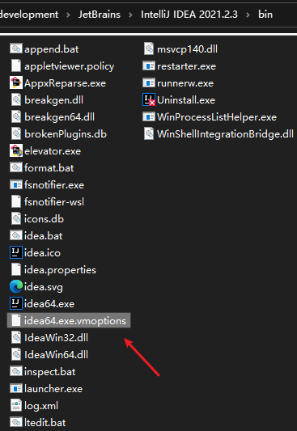

在文件的最后一行追加以下一项配置，然后重启 IDEA

```properties
-Dfile.encoding=UTF-8
```

> notes: 最新版本的idea只有64位的配置文件。<font color=red>**特别注意，不能有空格，否则重启后无法打开 IDEA**</font>

3. 如前面的方法均已配置，还有乱码问题，则需要修改idea数据缓存目录中的 idea64.exe.vmoptions，同样在文件的末尾添加：`-Dfile.encoding=UTF-8`，然后重启idea，如图：

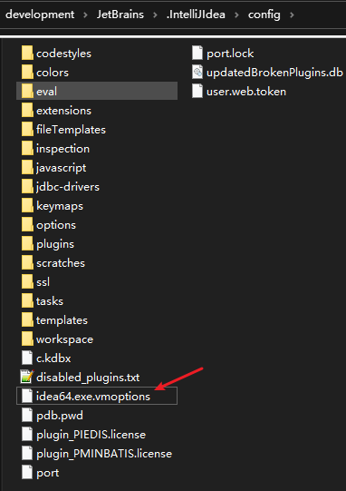

> 注：默认的idea数据缓存目录在c盘，也可以修改配置来指定缓存目录的位置

#### 3.5.2. 设置控制台的字符编码

设置位置：Editor -> General -> Console -> Default Encoding


#### 3.5.3. 单独设置个别文件编码

有时打开其他来源的个别源文件，会发现有乱码。比如：


出现这种问题的原因是：当前项目设置的是 UTF-8，而此`.java`文件是使用 GBK 的编码。又比如某些项目中可能存在有些文件是 GBK，有些是 UTF-8，这就比较麻烦了。遇到这种情况，**可以单独给这些文件或者某个模块单独设置编码**。

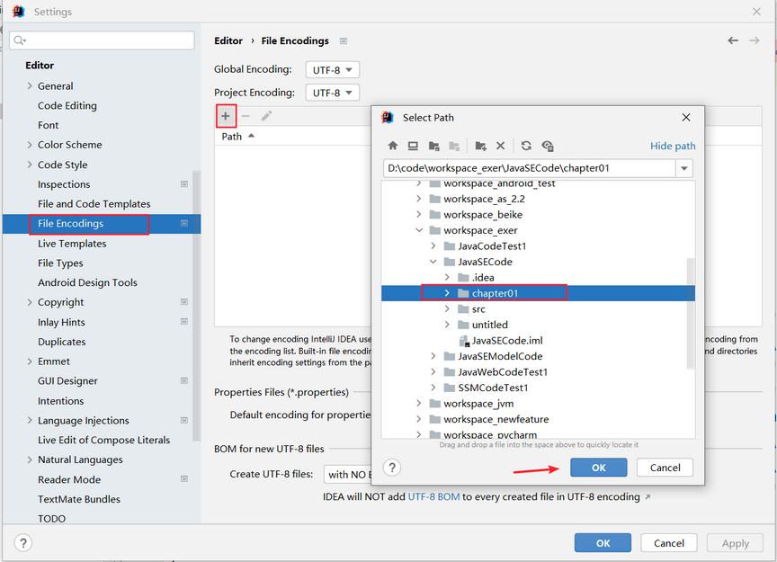

改为 GBK，确认即可。如图：


## 4. 常用配置

选择【File】->【Settings...】打开配置窗口，主要分以下配置模块：


### 4.1. Appearance & Behavior（外观与行为）

#### 4.1.1. UI Options(界面设置)

设置位置：Appearance & Behavior -> Appearance -> UI Options


- Show tree indent guides（显示树状缩进级别垂直线），开启效果如下：

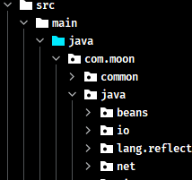

- Smooth scrolling（平滑移动），开启后用鼠标中键上下滑动更流畅
- Smooth scrolling（树状菜单更小的缩进），开启效果如下：


- Drag-n-Drop with Alt pressed only（按 Alt 进行拖动），启用后，按住该 Alt 键才可移动内容。避免意外移动文件，编辑器选项卡，工具窗口按钮和其他UI组件。
- Merge main menu with window title（合并 IDEA 主菜单到 window 标题），将 IDEA 主菜单合并到 window 栏
- Always show full path in window header（始终在窗口标题中显示完整路径），始终在窗口标题中显示完整路径
- Display icons in menu items（在菜单项中显示图标），在主菜单和上下文菜单中，在项目左侧显示图标。

#### 4.1.2. Antialiasing (抗锯齿设置)

设置位置：Appearance & Behavior -> Appearance -> Antialiasing

IDE: 选择要应用于IDE的哪种抗锯齿模式（包括菜单，工具窗口等）

- Subpixel(子像素): 用于LCD显示器，并利用彩色LCD上的每个像素都由红色，绿色和蓝色子像素组成
- Greyscale(灰度): 建议此选项用于非LCD显示器或垂直放置的显示器。它在像素级别处理文本。
- No antialiasing(无抗锯齿): 此选项可用于高分辨率的显示，其中非抗锯齿的字体渲染速度更快，并且外观可能更好。

Editor: 选择要应用于编辑器的抗锯齿模式：

- Subpixel(子像素): 用于LCD显示器，并利用彩色LCD上的每个像素都由红色，绿色和蓝色子像素组成
- Greyscale(灰度): 建议此选项用于非LCD显示器或垂直放置的显示器。它在像素级别处理文本。
- No antialiasing(无抗锯齿): 此选项可用于高分辨率的显示，其中非抗锯齿的字体渲染速度更快，并且外观可能更好。

#### 4.1.3. Tool Windows(工具栏设置)

设置位置：Appearance & Behavior -> Appearance -> Tool Windows


- 【Show tool window bars】，在主窗口的边缘周围显示工具窗口栏
- 【Show tool window numbers】，工具栏显示数字，并且可以按 Alt 键加数字键快捷打开菜单

也可以菜单栏的 View -> Appearance 中配置


#### 4.1.4. System Settings(系统设置)

##### 4.1.4.1. 启动项目配置

设置位置：Appearance & Behavior -> System Settings -> Project -> Reopen project on startup


勾选【Reopen last project on startup】时，启动 IDEA 时，默认自动打开上次开发的项目；若不勾选，则每次启动 IDEA 就会出现项目选择界面：


##### 4.1.4.2. 取消自动更新

设置位置：Appearance & Behavior -> System Settings -> Updates


建议不勾选检查 IDEA 更新，勾选检查插件更新。

#### 4.1.5. 关闭自动保存

设置位置：Appearance & Behavior -> System Settings -> Autosave。取消勾选相关选项即可去掉默认保存


### 4.2. Keymap（快捷键配置）

> 官方快捷键文档 https://resources.jetbrains.com/storage/products/intellij-idea/docs/IntelliJIDEA_ReferenceCard.pdf

#### 4.2.1. 快捷键汇总（Windows 系统）

##### 4.2.1.1. 通用【General】


##### 4.2.1.2. 编辑【Editing】


##### 4.2.1.3. 查看使用情况【Usage Search】


##### 4.2.1.4. 导航【Navigation】


##### 4.2.1.5. 查找或替换【Search/Replace】


##### 4.2.1.6. 代码模板【Live Templates】


##### 4.2.1.7. 重构【Refactoring】


##### 4.2.1.8. 调试【Debugging】


##### 4.2.1.9. 编译与运行【Compile and Run】


##### 4.2.1.10. 版本管理与本地历史记录【VCS/Local History】


#### 4.2.2. 查看快捷键

1. 已知快捷键操作名，未知快捷键


2. 已知快捷键，不知道对应的操作名


#### 4.2.3. 自定义快捷键


**示例：修改智能提示快捷键**

- File -> Settings -> Keymap -> Main menu -> Code -> Completion -> Basic，修改提示快捷键（如：Ctrl+Alt+Enter）
- File -> Settings -> Keymap -> Editor Actions -> Complete Current Statement，修改（如：Ctrl+）

#### 4.2.4. 使用其它平台快捷键

苹果电脑或者是习惯 Eclipse 快捷键，可以选择其他快捷键插件。


### 4.3. Editor（编辑器）

#### 4.3.1. 编辑器主题、字体与颜色配置


##### 4.3.1.1. IDEA 2019 中文字体渲染有粗有细异常解决方法


解决方法：Editor -> Font -> Fallback font（备用字体），选择一种支持中文的字体，如：SimHei 字体


新版：


##### 4.3.1.2. 注释的字体颜色

设置位置：Editor -> Color Scheme -> Language Defaults


- Block comment：修改多行注释的字体颜色
- Doc Comment -> Text：修改文档注释的字体颜色
- Line comment：修改单行注释的字体颜色

#### 4.3.2. 取消编辑器右侧竖线

idea 的代码编辑器右侧会有一条提示代码长度的竖线，是用于如果代码超过竖线的位置，建议代码换行。设置关闭的位置在：

【Editor】->【Appearance】，取消勾选【Show hard wrap and visual guides(configured in Code Style options)】项


#### 4.3.3. 使用鼠标滚轮调整字体大小

设置“Ctrl+滚轴”修改编辑器字体大小，如果需要此功能，勾选下图选项即可。设置位置：Editor -> General -> Mouse Control


#### 4.3.4. 设置类和方法注释模板

> TODO: 待整理方法注释模板设置参考 https://blog.csdn.net/xiaoliulang0324/article/details/79030752

首先来设置IDEA中类的模板：（IDEA中在创建类时会自动给添加注释）

设置位置：Editor -> File and Code Templates -> Files，选择Class文件（当然要设置接口的还也可以选择Interface文件）

1. `${NAME}`：设置类名，与下面的`${NAME}`一样才能获取到创建的类名
2. `TODO`：代办事项的标记，一般生成类或方法都需要添加描述
3. `${USER}`、`${DATE}`、`${TIME}`：设置创建类的用户、创建的日期和时间，这些事IDEA内置的方法，还有一些其他的方法在绿色框标注的位置，比如你想添加项目名则可以使用`${PROJECT_NAME}`
4. `1.0`：设置版本号，一般新创建的类都是1.0版本，这里写死就可以了


官网提供的常用预设的变量

```
${PACKAGE_NAME} - the name of the target package where the new class or interface will be created.
${PROJECT_NAME} - the name of the current project.
${FILE_NAME} - the name of the PHP file that will be created.
${NAME} - the name of the new file which you specify in the New File dialog box during the file creation.
${USER} - the login name of the current user.
${DATE} - the current system date.
${TIME} - the current system time.
${YEAR} - the current year.
${MONTH} - the current month.
${DAY} - the current day of the month.
${HOUR} - the current hour.
${MINUTE} - the current minute.
${PRODUCT_NAME} - the name of the IDE in which the file will be created.
${MONTH_NAME_SHORT} - the first 3 letters of the month name. Example: Jan, Feb, etc.
${MONTH_NAME_FULL} - full name of a month. Example: January, February, etc.
```

#### 4.3.5. 设置显示代码区的行号、方法分隔线、空格

设置位置：Editor -> General -> Appearance

- Show line numbers 显示行数的，勾选上显示行数
- Show method separators 显示方法线的，这种线有助于区分开方法，建议勾选上的
- Show whitespaces 显示空格


#### 4.3.6. 代码智能提示忽略区分大小写

IDEA 代码提示默认是匹配大小写，此开关如果未关。输入字符一定要符合大小写。比如输入`string`是不会出现代码提示或智能补充。但是，如果开了这个开关，无论输入`String`或者`string`都会出现代码提示或者智能补充！

旧版idea：选择【File】->【Settings】->【Editor】->【General】->【Code Completion】，选择【Case sensitive completion】为 None


2018.3 版本后已经变成设置“Match case”选项，取消勾选即可忽略大小写匹配


#### 4.3.7. 设置自动导包

默认需要手动导包（Alt+Enter 快捷键）


如下图标注所示，默认 IntelliJ IDEA 是没有开启自动 import 包的功能。


- 勾选【Add unambiguous imports on the fly】选项：动态导入明确的包，IDEA 会在编写代码的时候自动导入需要用到的包。但是对于那些同名的包，还是需要手动 Alt + Enter 进行导入的，IDEA 目前还无法智能做判断。*该设置具有全局性*
- 勾选【Optimize imports on the fly】选项：优化动态导入的包，IDEA 将自动优化代码导入的包，比如自动去掉一些没有用到的包。*该设置只对当前项目有效*

**如果设置智能自动导包**。将【自动导入不明确的结构】和【智能优化包】这两个选项勾上。在代码中，只要敲 list，就会出现提示，自动导入`java.util.List`这个类。而这个特性，在 eclipse 中，是无法做到的。

此外，还可以设置 Java 类中导入的某个包下类超过指定个数，就会换成用 `*` 号来代替。设置位置：Editor -> Code Style -> Java -> Imports


#### 4.3.8. 设置 tab 为 4 个空格

设置位置：Editor -> Code Style -> Java -> Tabs and Indents。取消勾选 Use tab character

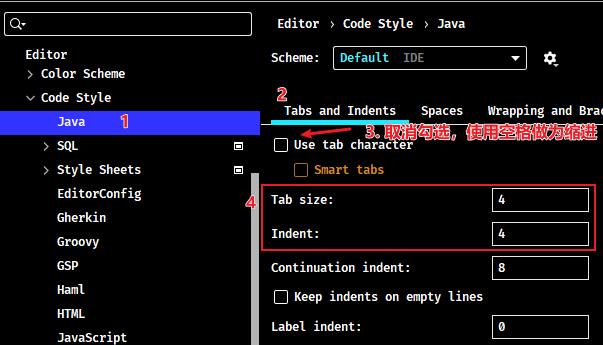

#### 4.3.9. 设置忽略显示，隐藏文件或者文件夹（类似eclipse的filter功能）

设置位置：Editor -> File Types -> Ignore files and folders 设置内容：

```
*.hprof;*.pyc;*.pyo;*.rbc;*.yarb;*~;.DS_Store;.git;.hg;.svn;CVS;__pycache__;_svn;vssver.scc;vssver2.scc;.idea;*.iml;
```


新版


#### 4.3.10. 设置取消显示形参名提示


旧版的取消方法：editor -- General -> appearance，取消勾选 Show parameter name hints，保存退出。


新版的位置：Editor -> Inlay Hints -> Java -> Parameter hints，取消勾选 Show parameter hints for 可以取消所有，也可以单独设置一些情形显示或者取消。


#### 4.3.11. 设置为单行注释的两个斜杠跟随在代码的头部


#### 4.3.12. 设置鼠标悬浮时显示代码的文档信息

选择【Editor】->【Code Editing】，勾选`Show quick documentation on mouse move`。可以设置弹出提示响应时间，默认500 ms


> 注：旧版本idea是在【General】选项下

#### 4.3.13. 设置编辑器 tab 标签多行显示

设置位置：Editor -> General -> Editor Tabs -> 不勾选 Show tabs in one row 选项即可


效果：


#### 4.3.14. 设置代码行宽度

输入的代码超出宽度界线时，自动将代码换行。

- 方式1：点击【Editor】->【Code Style】->【General】选项卡，在“Hard wrap at”输入框中指定换行的数字量。当代码宽度超过该设置值时，IDEA 会自动将代码换行。


- 方式2：点击【Editor】->【Code Style】->【Java】->【Wrapping and Braces】选项卡，在“Keep when reformatting”中有一个“Ensure rigth margin is not exceeded”，选中它，在格式化 Java 代码时，确保代码没有超过宽度界线。即输入的代码超出界线后格式化换行


#### 4.3.15. 设置默认展开与折叠代码

设置位置：Editor -> General -> Code Folding


如上图标注红圈所示，可以对指定代码类型进行默认折叠或是展开的设置，勾选上的表示该类型的代码在文件被打开的时候默认是被折叠的，去掉勾选则默认展开。

#### 4.3.16. 关闭注释 doc 默认的 Rendered View 模式

在 idea 2020 版本以后，增加了 Rendered View 模式，用于提升注释文档的阅读体验，默认是开启。如需关闭，按如下步骤操作：

设置位置：Editor -> General -> Appearance -> 取消勾选 【Render documentation comments】。


Editor -> Reader Mode -> 取消勾选 【Enable Reader mode】


#### 4.3.17. 标志修改文件带星号（*）

标志修改文件为星号 Editor -> General -> Editor tabs -> 勾选 mark modified files as asterisk 选项


新版


#### 4.3.18. 设置默认换行符

点击【New Projects Setup】->【Settings for New Projects】，选择【Editor】->【Code Style】->【General】选项卡，其中 Line separator 有四个选项 `System-Dependent/LF/CR/CRLF`，默认是 `System-Dependent`，也就是根据你是什么系统选择什么类型，如果想要自定义的话可以在这里设置，以后创建的新代码也默认用设置的方式


### 4.4. Inspections（安全检查配置）

安全检查的相关配置位置：Editor -> Inspections

#### 4.4.1. 点击右下角取消文件检查

IntelliJ IDEA 对于编辑大文件并没有太大优势，很卡，原因就是它有各种检查，这样是非常耗内存和 CPU 的，所以为了能加快大文件的读写，一般会暂时性设置为 None。

- Inspections 为最高等级检查，可以检查单词拼写，语法错误，变量使用，方法之间调用等。
- Syntax 可以检查单词拼写，简单语法错误。
- None 不设置检查。


#### 4.4.2. 取消单词拼写检查


如上图箭头所示，IntelliJ IDEA 默认是开启单词拼写检查的，有些人可能有强迫症不喜欢看到单词下面有波浪线，就可以去掉该勾选。

但是建议这个还是不要关闭，因为拼写检查是一个很好的功能，当大家的命名都是标准话的时候，这可以方便找到代码因为拼写错误引起的 Bug。

#### 4.4.3. 代码中大量的波浪线

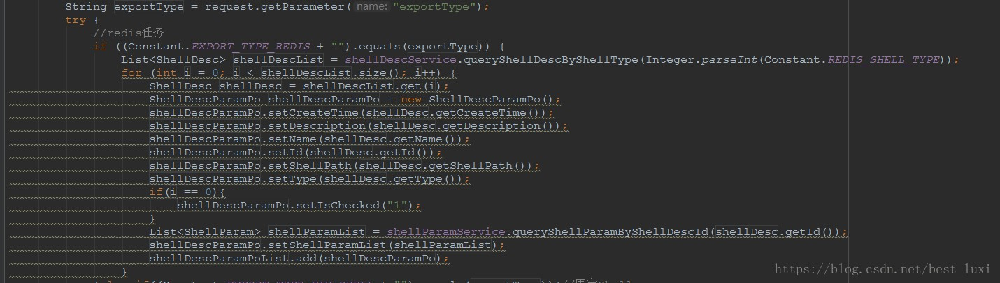

解决方法是File -- Setting -- Editor -- Inspections，右侧搜索General，取消√，保存退出


#### 4.4.4. 参数和变量有下划线，实线


解决方法，Filt -- Setting -- Editor -- Color Scheme -- Java ，点击下方需要修改代码，看到最右侧有显示效果Effects ，如下图。这里可以看到，参数的显示效果是绿色下划线underscored，（同样的点击下面代码中变量名，可以看到他的显示效果，也可以按照这个方法取消一些提示显示的效果）。可以把underscored换成blod underscored，或者直接取消Effects前的√，Apply，退出。

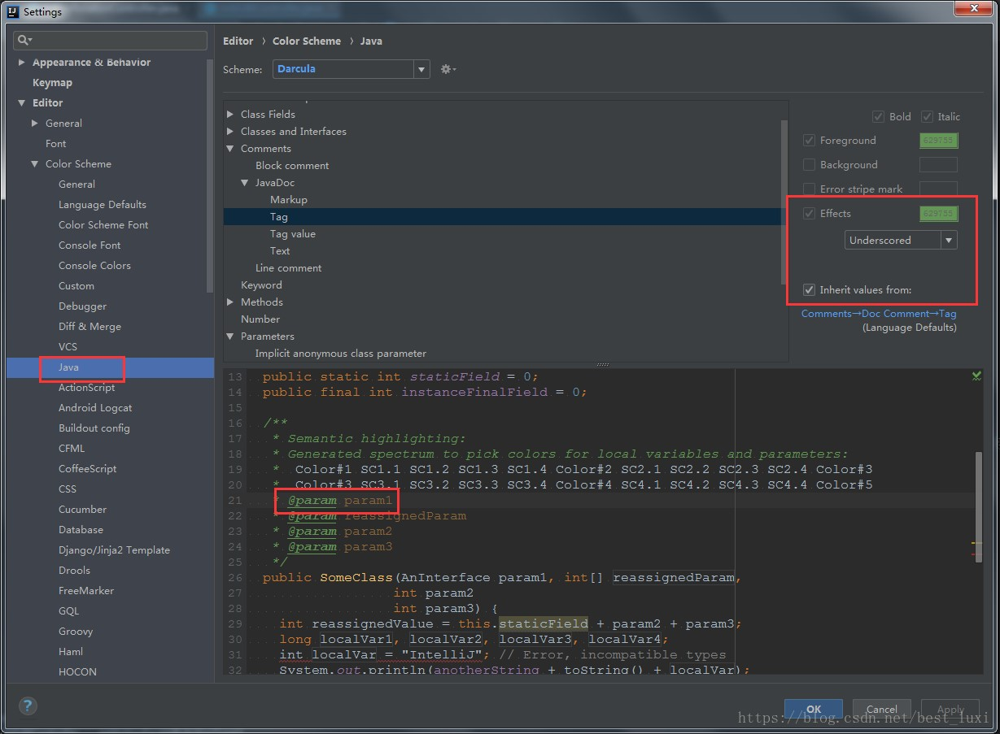

#### 4.4.5. Typo 提示


这种提示也是比较常见的，直接File -- Setting，搜索Typo，可以看到下面有各种情况下的提示效果包括Typo（绿色波浪线），Typo上面还有Error错误时红线波浪线，Warning警告时灰色波浪线和无法识别时加红等。根据自己的情况调整。这里把Typo和警告Warning，Weak warning时的提示效果都取消掉。取消方法还是取消掉右侧的Effects的“√”。保存退出。


#### 4.4.6. never used 提示


为了代码更加规范，少些无效的代码，IDEA会对于方法中未使用到的一些变量做出提示never used，但是对于刚创建的变量，方法都还没有写完，他就开始提示该变量没有用到就有点过分了，甚是让人反感。

解决方法，File -- Setting -- Editor -- Inspections，右侧搜索“unused”，找到Java一栏，取消没未用到时的提醒说明。保存退出。


有时候会出现assigned的提示，解决方法和上面的一样。搜索“assigned”，找到java一栏，取消下面的勾选项。


#### 4.4.7. 参数不匹配时 symbol 错误提示

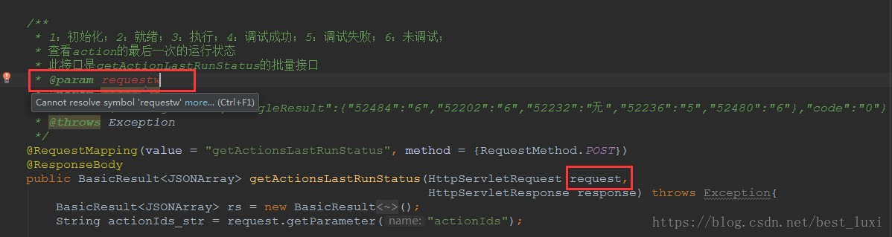

这个个人感觉还是有必要保留的，但是对于或者用习惯eclipse的，可能一开始提示这样的错误，很诧异，注释中参数名和方法中不匹配竟然直接error提示。当然关闭提示的办法肯定是有的。

如图，直接File -- setting，搜索“javadoc”，取消选项。保存退出。


#### 4.4.8. 变量初始化多余时的提示：Variable "xxxx" initializer 'xxx' is redundant


idea对代码进行了审查，在开发的时候也会经常对变量在未使用之前做初始化操作，不分配内存地址，但是不明白为什么，idea竟然会提示“变量初始化多余”。有点不解，难道是对jvm的内存使用理解有问题。

取消提示的方法，选择提示的变量，快捷键“Alt” + “Enter”，取消审查。


#### 4.4.9. 去除 mapper.xml 文件的提示和背景色

1. 点击 File -> Settings -> Editor -> Inspections，找到图中所示的SQL，去掉下面的No data sources configured和SQL dialect detection的勾选


2. 点击 Editor -> Colors Scheme -> General ，打开Code，选择Injected language fragment，去掉Background的勾选


#### 4.4.10. 设置自动生成serialVersionUID

新建一个测试的实体类，实现`java.io.Serializable`接口，选择类名，按`Alt+Enter`键，出现的提示框中没有生成 serialVersionUID 的提示，这个需要设置之后才会有自动生成的提示信息

点击选择【Editor】->【Inspections】。在右边的搜索框中输入 `serialVersionUID` 关键字，出现以下选项，勾选 `Serializable class without serialVersionUID`

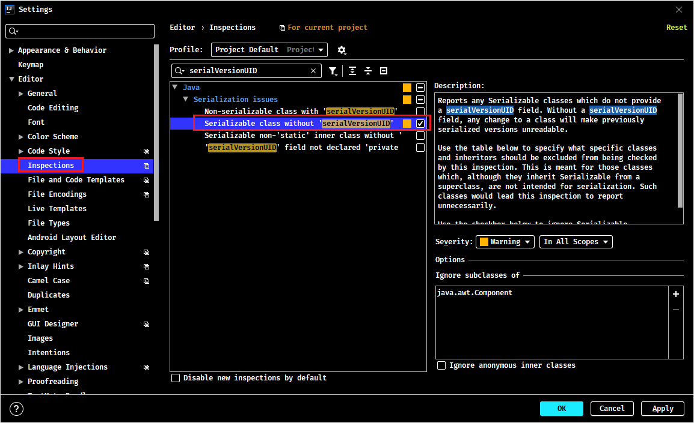

设置完后，光标放在类名上，再次按`Alt+Enter`键，这个时候可以看到`Add serialVersionUID field`提示信息


#### 4.4.11. 总结

简单的统一关闭提示的方法，其实上面也有说明这个方法，当遇到提示的时候，我们可以先选择代码，然后快捷键“Alt”+“Enter”，选择remove xxxx，可以选择删除你的多余代码，也可以选择取消idea的提示。

### 4.5. Build, Execution, Deployment（构建，执行，部署）

#### 4.5.1. 配置自动编译（非常重要！！）

设置位置：Build,Execution,Deployment -> Compiler -> Build project automatically


> Notes: 开启自动编译之后，结合 `Ctrl+Shift+F9` 会有热更新效果。

具体步骤： 敲击 `Ctrl+Shift+Alt+/` 然后双击Shift搜索进入Registry，找到`compiler.automake.allow.when.app.running`，然后勾选上。

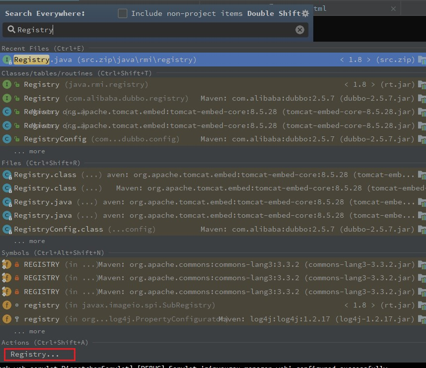


### 4.6. 其他设置

#### 4.6.1. 设置为省电模式 (一般不会设置)


IntelliJ IDEA 有一种叫做“省电模式”的状态，开启这种模式之后 IDEA 会**关掉代码检查**和**代码提示**等功能。所以一般也可认为这是一种**阅读模式**，如果在开发过程中遇到突然代码文件不能进行检查和提示，可以来看看这里是否有开启该功能。

#### 4.6.2. 取消双击 shift 搜索

因为平时按 shift 切换中英文输入，经常弹出搜索框，嫌麻烦的话可以取消它。

方式1：适用于 2022.1.2 版本。采用如下方式消双击 shift 出现搜索框：搜索double即可，勾选 Disable double modifier key shortcuts，禁用这个选项。


方式2：适用于 2022.1.2 之前版本。双击 shift 或 ctrl + shift + a，打开如下搜索窗口：


选择【registry...】，找到"ide.suppress.double.click.handler"，把复选框打上勾就可以取消双击 shift 出现搜索框了。


#### 4.6.3. 设置项目结构树状显示或折叠空包

树状显示效果：


折叠空包显示效果：


#### 4.6.4. IDEA 启用/禁用 Run Dashboard

##### 4.6.4.1. 启用 Run Dashboard

**方式一**：创建/打开一个SpringBoot项目【或者点击Run -> Edit Configurations 添加 Spring Boot 类型的项目配置；或者如图在红框处添加配置】，会弹出一个 Run Dashboard 信息框，点击第一个蓝色连接(Show run configurations in Run Dashboard) 即可。


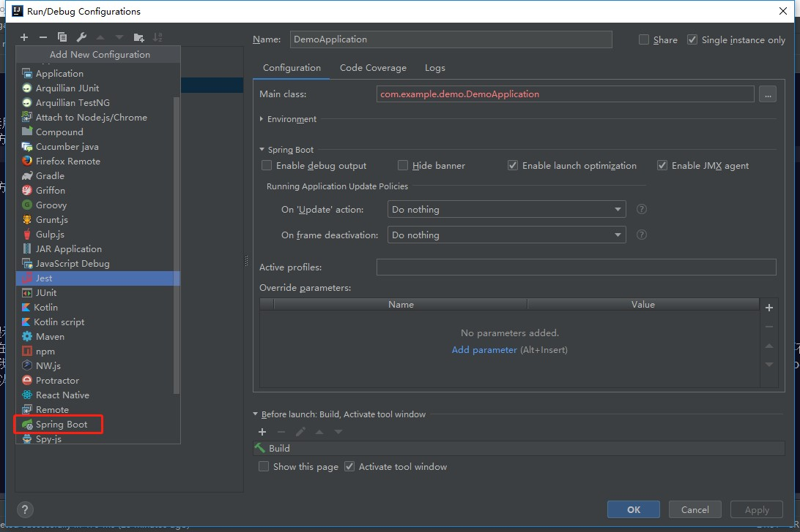


方式二：点击 View -> Tool Windows -> Run Dashboard（此方式是 Run Dashboard 已经打开后，只是隐藏了才能使用此方式）


方式三：在项目`.idea`目录中的`workspace.xml`中找到 RunDashboard 的 component 节点内增加以下代码

```xml
<component name="RunDashboard">
    <option name="configurationTypes">
      <set>
        <option value="SpringBootApplicationConfigurationType" />
      </set>
    </option>
</component>
```

##### 4.6.4.2. 禁用 Run Dashboard

方式一：在弹出的 Run Dashboard 信息框，点击第二个蓝色连接(Do not show again for this peoject) 即可


方式二：在项目`.idea`目录中的`workspace.xml`中找到 RunDashboard 的 component 接点内删除以下代码

```xml
<option name="configurationTypes">
	<set>
		<option value="SpringBootApplicationConfigurationType" />
	</set>
</option>
```

##### 4.6.4.3. 其他操作

在弹出的 Run Dashboard 信息框，点击第二个蓝色连接(Do not show again for this peoject)后，会发现Run Dashboard 信息框不再有了，可以通过快捷键`Ctrl+Alt+S`打开 Settings 窗口【或点击File -> Settings】，在搜索框输入`Notifications`，然后修改右侧 Run Dashboard 栏信息即可。以下是 Popup (弹出窗口)的设置说明：

- `Balloon`：弹出窗在屏幕上显示一小段时间，然后自动消失。通知也会显示在状态栏中，并添加到通知列表中。
- `Sticky balloon`：若不手动关闭，弹出窗会在屏幕上一直显示
- `No popup`：不显示该弹出窗


### 4.7. 导出和导入设置

导出：点击【File】->【Export Settings】-> 选择需要导出的【Settings】的选项 -> 选择导出的位置，点击【OK】导出


导入：点击【File】 -> 【Import Settings】 -> 找到【Settings】的位置，点击【OK】导入

## 5. 代码模板的使用与设置

### 5.1. 常用代码模板

#### 5.1.1. 非空判断

- `变量.null`：`if(变量 == null)`
- `变量.nn`：`if(变量 != null)`
- `变量.notnull`：`if(变量 != null)`
- `ifn`：`if(xx == null)`
- `inn`：`if(xx != null)`

#### 5.1.2. 遍历数组和集合

- 数组或集合变量.fori：for循环
- 数组或集合变量.for：增强for循环
- 数组或集合变量.forr：反向for循环
- 数组或集合变量.iter：增强for循环遍历数组或集合

#### 5.1.3. 输出语句

- `sout`：相当于 System.out.println
- `soutm`：打印当前方法的名称
- `soutp`：打印当前方法的形参及形参对应的实参值
- `soutv`：打印方法中声明的最近的变量的值
- `变量.sout`：打印当前变量值
- `变量.soutv`：打印当前变量名及变量值

#### 5.1.4. 对象操作

创建对象

- `Xxx.new.var`：创建Xxx类的对象，并赋给相应的变量
- `Xxx.new.field`：会将方法内刚创建的Xxx对象抽取为一个属性

强转

- `对象.cast`：将对象进行强转
- `对象.castvar`：将对象强转后，并赋给一个变量

静态常量声明

- `psf`：public static final
- `psfi`：public static final int
- `psfs`：public static final String
- `prsf`：private static final

### 5.2. 自定义代码模板（Live Templates）

Live Templates 其实就是输入代码片段，快速生成代码模板。在【Settings】->【Editor】->【Live Templates】中看到 idea 默认的一些模板


#### 5.2.1. 示例 - 修改 main 方法与输出打印快捷键


#### 5.2.2. 示例 - 配置日志 LOGGER 模板


创建分组，可以区分与IDEA原生的模版


选择分组，创建模版。一些输入元素的介绍如下：

1. Abbreviation：模板的缩略名称
2. Description：模板的描述
3. Template text：模板的代码片段


设置需要的变量值


Define：设置模版作用的范围。比如点击选择，应用在java代码中。


保存后即可以使用


### 5.3. 自定义代码后缀补全模板（Postfix Completion）

Postfix Completion 其实就是关于代码补全的一些模板。在【Settings】->【Editor】->【General】->【Postfix Completion】中看到idea默认的一些模板


#### 5.3.1. 示例 - 快速生成集合定义

点击“+”号，创建 Java 的模板


- Key：输入代码后缀的内容
- Minimum language Level：支持最低的 JDK 版本
- 最后输入代码补全生成的模板，可以使用`$expr$`表达式来动态指定生成的内容


### 5.4. 自定义文件模版（File and Code Templates）

文件模版就是在创建文件时，会自动生成预设好的内容。设置位置：【Settings】->【Editor】->【File and Code Templates】


#### 5.4.1. 示例 - 定义Mybatis的mapper.xml文件


创建文件时，多出自定义文件模版


效果如下


## 6. 工程与模块管理

### 6.1. IDEA 项目结构

层级关系：project(工程) - module(模块) - package(包) - class(类)。具体关系如下：

- 一个 project 中可以创建多个 module
- 一个 module 中可以创建多个 package
- 一个 package 中可以创建多个 class

> Tips: 这些结构的划分，是为了方便管理功能代码

### 6.2. Project 和 Module 的概念

在 IntelliJ IDEA 中，提出了 Project 和 Module 这两个概念。在 IntelliJ IDEA 中 Project 是<font color=red>**最顶级的结构单元**</font>，然后就是 Module。目前，主流的大型项目结构基本都是多 Module 的结构，这类项目一般是**按功能划分**的，比如：user-core-module、user-facade-module和user-hessian-module等等，模块之间彼此可以**相互依赖**，有着不可分割的业务关系。因此，对于一个 Project 来说：

- 单 Module 项目的时候，这个单独的 Module 实际上当作是一个 Project。
- 多 Module 项目的时候，多个模块处于同一个 Project 之中，此时彼此之间具有<font color=red>**互相依赖**</font>的关系。
- 若多个 Module（模块）没有建立依赖关系的话，则每个 Module（模块）也可以作为单独一个“小项目”运行。

### 6.3. 创建 Module

建议创建“Empty空工程”，然后创建多模块，每一个模块可以独立运行，相当于一个小项目。尤其是创建 JavaSE 工程，不涉及到模块之间的依赖。具体操作步骤如下：

1. 选择创建模块。可以选择菜单栏的【File】，也可以在已有模块上右键点击后选择【New】

 

2. 选择模块类型：这里选择创建 Java 模块，给模块命名，确定存放位置


3. 创建成功后，在原来的工程中可以看到刚新建的模块。


### 6.4. 删除模块

#### 6.4.1. 移除模块

注意：这种操作只是将模块从“逻辑”上移除，并**没有真正删除模块**


#### 6.4.2. 彻底删除模块

在移除模块后，再次右键可以选择删除模块。**值得注意：这种删除方式是彻底的删除，不会放到系统的回收站**


### 6.5. 导入模块

1. 将某个模块文件夹复制到 IDEA 项目的路径下


接着打开 IDEA 的项目，会在项目目录下看到拷贝过来的 module，但只会以模块的方式呈现。


2. 点击打开【File】->【Project Structure】，选择【import module】


3. 选择要导入的 module


4. 选择【Create module from existing sources】，接着一直点击 Next 直到到 Finish 即可


成功导入后效果：


### 6.6. 开启/关闭项目中的某些模块

在项目根目录上右键，选择【Load/Unload Modules...】


选择相应需要加载的/不加载的模块


## 7. 配置 Maven

1. 在File -> settings -> Build, Execution, Deployment -> Build Tools -> Maven
2. Mavan home directory --设置maven安装包的bin文件夹所在的位置
3. User settings file --设置setting文件所在的位置
4. Local repository --设置本地仓库

### 7.1. 全局 Maven（默认配置）

具体步骤：顶部工具栏 File -> Other Settings -> Default Settings -> Build & Tools -> Maven

示例：理论上只要配置了Maven主目录即可，实际开发推荐采用User Settins file


### 7.2. 各项目（Project）设置各自的 Maven 等相关配置


### 7.3. 勾选自动导入依赖、下载源码与文档说明


### 7.4. 更新本地仓库和远程仓库

在pom.xml文件中添加依赖jar包的坐标时就可以很好的提示出来


### 7.5. 解决 idea 创建 maven 项目速度慢问题的三种方法

idea 创建 maven 项目时，速度很慢，主要原因是创建 maven 项目时默认是下载求网络上的一个文件 archetype-catalog.xml，该文件的大小有 5-6M，下载的速度很慢，导致创建过程也变得很慢。

解决办法有三种，并且都需要对 maven 的 VM Options 参数做配置。

#### 7.5.1. 方式一

在 maven 的 VM Options 加上 `-DarchetypeCatalog=internal` 或者 `-DarchetypeCatalog=local` 参数，步骤如下：

1. 打开 idea 的启动界面，进入全局设置


搜索 maven，点击 Runner 一栏，在 VM Options 输入框里写上 `-DarchetypeCatalog=local`


确定后，再新建 maven 项目，就能发现项目很快就创建完成。

#### 7.5.2. 方式二

下载 archetype-catalog.xml 文件，在 maven 的 VM Options 加上`-DarchetypeCatalog=local`。默认情况下，创建 maven 项目是从网络下载 catalog 文件，因此可以将 catalog 文件下到本地，然后通过设置 archetype 的使用方式为 `local`，这样就不用每次都从网络上下载了。

1. 下载 archetype-catalog.xml 文件到本地，文件的位置如下：
> 官方：http://repo1.maven.org/maven2/archetype-catalog.xml
> 其他：https://github.com/Taoxj/sc_properties
2. 下载后放到本地仓库中对应的位置。maven 本地仓库的位置与 settting.xml 中的配置有关，例如 setting.xml 配置仓库的位置是：D:\apache-maven-3.6.0\repository

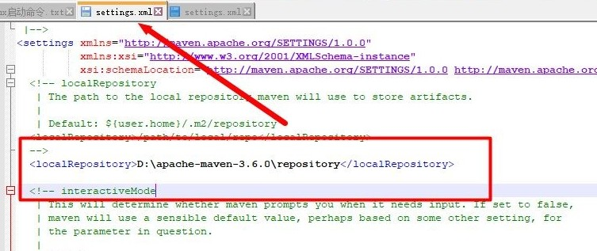

那么 catalog 文件就可以放在 D:\apache-maven-3.6.0\repository\org\apache\maven\archetype-catalog\3.0.1\

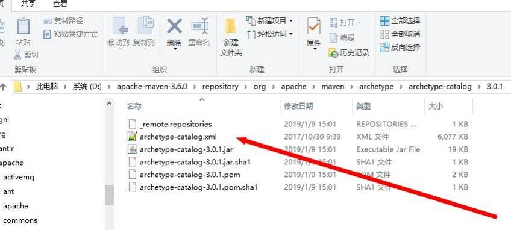

如果 setting.xml 没有配置仓库位置，那么就放到默认本地仓库下面对应的位置即可。本地仓库的默认位置是：`Default: ${user.home}/.m2/repository`，例如计算机用户名是 Administrator，仓库位置就是 C:Users\Administrator\.m2\repository

3. 修改 maven 的 VM Options 参数。跟之前方法的步骤一样，打开全局设置中的 maven 设置栏，然后在 VM Options 输入框中填入`-DarchetypeCatalog=local`。这样 maven 每次就会从本地获取 catalog 文件，创建项目时就不用等那么久了。

#### 7.5.3. 方式三

在 maven 的 VM Options 加上`-Dmaven.multiModuleProjectDictory=$MAVEN_HOME`参数，`MAVEN_HOME` 是环境变量中配置 maven 环境的名称


设置好参数后，新建 maven 项目的时候添加上参数 archetypeCatalog，值为 local，或者是如果本地仓库里有了 catalog 文件，参数值也可以为 local

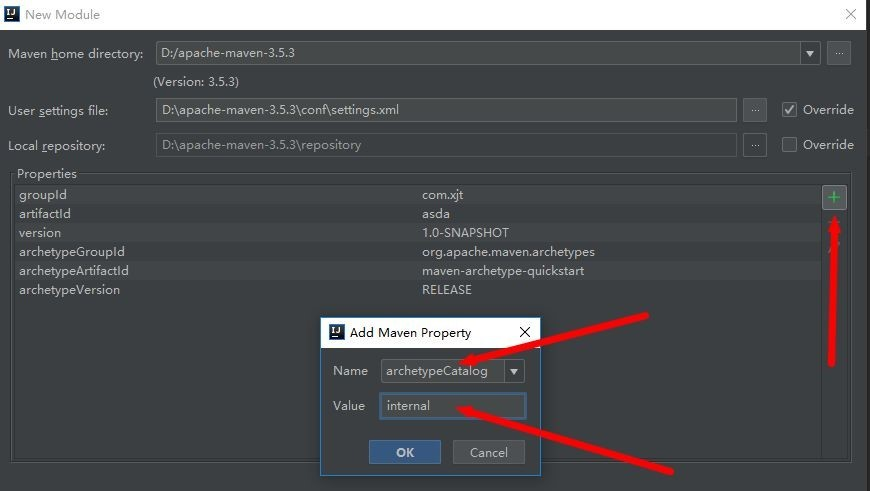

确定之后，maven 项目就能很快的建成了。

#### 7.5.4. 方式四

修改下载下来的 maven 目录下面 conf/settings.xml 文件，修改镜像源使用国内阿里巴巴的镜像源

```xml
<mirror>
    <id>alimaven</id>
    <name>aliyun maven</name>
    <url>http://maven.aliyun.com/nexus/content/groups/public/</url>
    <mirrorOf>central</mirrorOf>
</mirror>
```

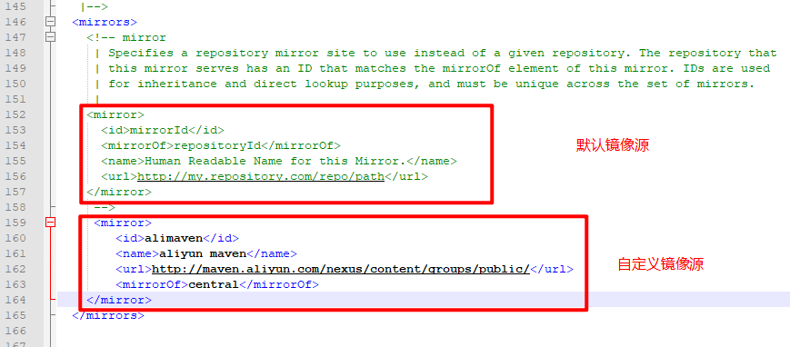

### 7.6. 生成 Maven 依赖关系图

Maven 提供了 `mvn dependency:tree` 插件来查看依赖关系，IDEA 有更加便利的方式来查看依赖关系

点击 Maven Project 视图，如果此视图没有打开，请使用 View 菜单将其打开。


选中相应的项目，在右键菜单中选择【Show Dependencies...】显示依赖图


即可看到整体的依赖关系图。如果显示太小，可点击【1:1】的按钮，按 100% 正常查看


使用快捷键 Ctrl + F 可以输入相关的包名，然后就可以查看其详细信息了。比如以下示例查看 spring-boot-configuration 的使用关联情况，点击相关的线会高亮显示，但有的时候还是比较难看清了。


还可根据需要对冲突的依赖进行排除操作（一般红色实线表示冲突，红色虚线表示多处引用）等，值得注意的是，**此操作会真正修改 pom.xml 文件，修改前注意备份**。


右键选择【Export to Image file】菜单项，可以将依赖关系保存至本地查看

## 8. 不同类型工程的创建

### 8.1. 创建Java工程

在工程上，右键选择 New -> Module，如


指明 Java 工程的名称及使用的 JDK 版本：


### 8.2. 创建 Java Web 工程

> Notes: 在 IDEA 中配置 Tomcat 之前，需要保证已经安装并配置了 Tomcat 的环境变量

#### 8.2.1. Tomcat Server（当前项目配置）

Tomcat 或者 Jetty 这些都是部署的容器，自然会联想到 Deployment ，打开部署配置，可以看到应用服务器的配置。

打开 Settings 面板，配置 Tomcat Server 的位置： File -> Settings -> Build, Execution, Deployment -> Application Servers -> Tomcat Server


配置 Tomcat 的名称以及配置应用服务器的位置。（根据自己 Tomcat 的安装位置决定）


配置好后，如下图所示：


#### 8.2.2. 创建 Web 工程

选择 New Module，


定义当前工程的名称：


选中当前创建的工程，添加框架支持：


选择：Web Application，选择 Create web.xml，如下：


#### 8.2.3. 配置 web 工程并运行

修改 web 配置

  

部署当前的 web 项目：


选择第 2 项：


可以修改 Application context，如下：


配置当前 web 工程的详细信息，如下：


配置好后，可以直接运行：


### 8.3. 创建 Maven Java 工程

右键创建新的模块


指明当前 maven 工程的名称、模板等信息。<font color=red>**值得注意的是，一个项目组的jdk版本必须一致。**</font>


新创建的 maven 的 java 工程缺少相应的 resources 文件目录，需要创建如下：

  

指定 main 下 resources 的文件目录类型。类似的操作 test 目录下，提供 resources 即可。


### 8.4. 创建 Maven Web 工程

创建新的模块，指宝 Maven 的 web 工程的名称和模板。如下：

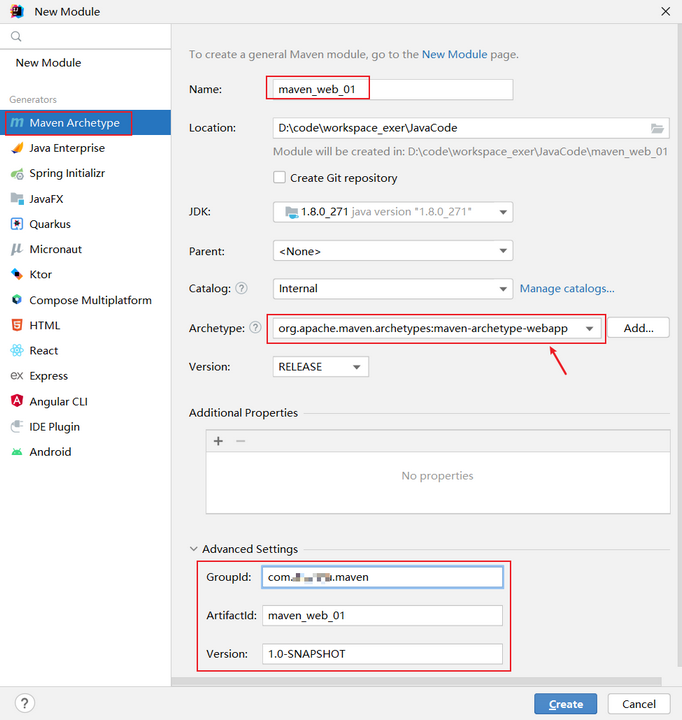

在 Tomcat 上进行部署：


配置部署的详细信息：


## 9. 断点调试(Debug)

### 9.1. Debug 概述

编好的程序在执行过程中如果出现错误，可以借助程序调试（Debug）来查找错误，比如以下几种情况：

- 情况1：运行以后，出现了错误或异常信息。但是通过日志文件或控制台，显示了异常信息的位置。
- 情况2：运行以后，得到了结果，但是结果不是预期的。
- 情况3：运行以后，得到了结果，结果大概率是预期的。但是多次运行的话，可能会出现不是预期的情况。比如：多线程情况下，处理线程安全问题。

### 9.2. Debug 的步骤

Debug(调试)程序步骤如下：

1. 添加断点
2. 启动调试
3. 单步执行
4. 观察变量和执行流程，找到并解决问题

#### 9.2.1. 添加断点

在源代码文件中，在想要设置断点的代码行的前面的标记行处，单击鼠标左键就可以设置断点，在相同位置再次单击即可取消断点。


#### 9.2.2. 启动调试

IDEA 提供多种方式来启动程序(Launch)的调试，分别是通过菜单(Run –> Debug)、图标(“绿色臭虫” )等等


### 9.3. 调试工具介绍

可以通过菜单【Run】来操作


或者通过 Debug 面板来操作


按键作用说明：

-  Step Over（F8）：进入下一步，如果当前行断点是调用一个方法，则不进入当前方法体内
-  Step Into（F7）：进入下一步，如果当前行断点是调用一个自定义方法，则进入该方法体内
-  Force Step Into（Alt +Shift + F7）：进入下一步，如果当前行断点是调用一个核心类库方法，则进入该方法体内
-  Step Out（Shift + F8）：跳出当前方法体
-  Run to Cursor（Alt + F9）：直接跳到光标处继续调试
-  Resume Program（F9）：恢复程序运行，但如果该断点下面代码还有断点则停在下一个断点上
-  Stop（Ctrl + F2）：结束调试
-  View Breakpoints（Ctrl + Shift + F8）：查看所有断点
-  Mute Breakpoints：使得当前代码后面所有的断点失效，一下执行到底

> Tips: 在 Debug 过程中，可以动态的下断点。

### 9.4. 各种 Debug 用法

#### 9.4.1. 行断点

断点打在代码所在的行上。执行到此行时，会停下来。

#### 9.4.2. 方法断点

断点设置在方法的签名上，默认当进入时，断点可以被唤醒；也可以设置在方法退出时，断点也被唤醒。在多态的场景下，在父类或接口的方法上打断点，会自动调入到子类或实现类的方法


#### 9.4.3. 字段（属性）断点

在类的属性声明上打断点，默认对属性的修改操作进行监控


#### 9.4.4. 条件断点

```java
public class DebugTest {
    public static void main(String[] args) {
        int[] arr = new int[]{1, 2, 3, 4, 5, 6, 7, 8, 9, 10, 11, 12};
        for (int i = 0; i < arr.length; i++) {
            int target = arr[i];
            System.out.println(target);
        }
    }
}
```

针对上述代码，在测试在满足 `arr[i] % 3 == 0` 的条件下，执行断点。


#### 9.4.5. 异常断点

对异常进行跟踪。如果程序出现指定异常，程序就会执行断点，自动停住。

```java
public class DebugTest {
    public static void main(String[] args) {
        int m = 10;
        int n = 0;
        int result = m / n;
        System.out.println(result);
        
        // Person p1 = new Person(1001);
        // System.out.println(p1.getName().toUpperCase());
    }
}
```

通过下图的方式，对指定的异常进行监控：


#### 9.4.6. 线程调试

右键断点标识，选择“Thread”模式


#### 9.4.7. 强制结束

debug 调试一个方法时，不需要再往下执行直接结束，右键选择“Force Return”


#### 9.4.8. 自定义调试数据视图


### 9.5. Debug 常见问题

问题：使用 Step Into 时，会出现无法进入源码的情况。如何解决？

- 方案1：使用 force step into 即可
- 方案2：点击 Setting -> Build,Execution,Deployment -> Debugger -> Stepping。把【Do not step into the classess】中的`java.*`、`javax.*`取消勾选即可。


> Tips: 初学者对于在哪里加断点，缺乏经验，这也是调试程序最麻烦的地方，需要一定的经验。简单来说，在可能发生错误的代码的前面加断点。如果不会判断，就在程序执行的起点处加断点。

### 9.6. 远程 Debug 调试（待测试）

远程调试其实的用处也不是那么大，不能作为长期使用的调试工具。只能作为临时调试的手段。主要难点有几个：

- 难保证本地代码和远程一致，而且也很难判断是否一致。
- 通过远程调试发现了 bug，但是又不能立即修复后继续调试，只能修复后部署后继续远程调试。

> 以 SpringBoot 微服务为例，远程 debug 的服务。以下截图，高低版本的 IDEA 的设置可能界面有点不一样。

#### 9.6.1. IDEA 设置

打开远程启动的 SpringBoot 应用程序所对应的配置面板，启动加上特定的参数。

- 选择【Edit Configurations...】


- 点击加号，选择【Remote】


- 按下图填写相关的配置项


> 注意端口别被占用。后续这个端口是用来跟远程的 java 进程通信的

切换不同的 JDK 版本，【Command line arguments for remote JVM】的脚本不一样

选择 jdk1.4 的脚本

```bash
-Xdebug -Xrunjdwp:transport=dt_socket,server=y,suspend=n,address=50055
```

选择 jdk 5-8 的脚本

```bash
-agentlib:jdwp=transport=dt_socket,server=y,suspend=n,address=50055
```

选择 jdk9 以上的脚本。据说因为 jdk9 变得安全了，远程调试只允许本地。如果要远程，则需要在端口前配置`*`

```bash
-agentlib:jdwp=transport=dt_socket,server=y,suspend=n,address=*:50055
```

#### 9.6.2. 启动脚本改造

此处使用前面 idea 配置的【Command line arguments for remote JVM】参数即可。改造后的启动脚本(Linux)如下：

```shell
nohup java \
-agentlib:jdwp=transport=dt_socket,server=y,suspend=n,address=50055 \
-jar remote-debug-0.0.1-SNAPSHOT.jar &
```

注意在 windows 中，脚本是用 `^` 来进行换行，例如

```shell
java ^
-agentlib:jdwp=transport=dt_socket,server=y,suspend=n,address=50055 ^
-jar remote-debug-0.0.1-SNAPSHOT.jar
```

说明：

1. 端口可随意自己定，未被占用的都可以。但是要和 IDEA 里的 remote 中设置的端口一致！其他参数照抄。
2. `remote-debug-0.0.1-SNAPSHOT.jar` 改成远程服务的 jar 包名字
3. 以前脚本是后台运行的，如不需要后台运行，自行去掉 `nohup` 和 `&`
4. 启动配置好的 SpringBoot


#### 9.6.3. 细节问题

##### 9.6.3.1. 细节1：停在本地断点，关闭程序后会否继续执行

如果远程调试在自己本地的断点处停下来了，此时关闭 IDEA 中的项目停止运行，则还会继续运行执行完剩下的逻辑。

以下面的代码为例，在第一行停住了。然后IDEA中停掉，发现停掉之后控制台还是打印了剩下的日志。


##### 9.6.3.2. 细节2：jar 包代码和本地不一致

要保证和远程启动 jar 包的代码一致。否则 debug 的时候的行数会对不上，但不会报错抛异常。

例如：调试 test1 方法，test2 方法在 test1 下面，在 test2 里加代码，这样并不影响 test1 中的行号，这种是可以在调试的时候准确反应行号的。

##### 9.6.3.3. 细节3：日志打印的位置

日志不会打印在 IDEA 的控制台上。即 `System.out` 以及 `log.info` 还是打印在远程的。

##### 9.6.3.4. 细节4：断点调试时其他人会卡住

远程调试的时候，打了断点，停住后会导致页面的请求卡住。

##### 9.6.3.5. 细节5：本地代码修复 bug 不会影响远程调用

如果在远程调试过程自己发现了 bug，本地改好后重新启动 IDEA 里的项目，是不会生效。因为运行的还是远程部署的jar中的代码。

##### 9.6.3.6. 细节6：如果 drop frame 重新进行调试，会不会插入2条记录？

Drop Frame 操作相当于回退上一步操作。


如图 `userMapper.insert(eo)`，本方法没有使用 `@Transactional` 修饰，mapper 方法执行过后事务会被立即提交，则库表里多了一行记录，如果 drop frame 后，再次进行调试，再次执行这代码，于是又插入了一条记录。


如果加上 `@Transational` 就不会有两条记录了，drop frame 的时候事务没被提交，再次执行该插入代码也不会插入2条。

如果把上述插入数据库的逻辑，换成调用远程的接口，在 drop frame 后，再次执行相同的代码，依然会导致远程接口被执行了2次。

## 10. Project Structre（项目结构配置）

IDEA 中最重要的各种设置项，就是这个 `Project Structre` 了，关乎项目的运行


### 10.1. Project选项卡


- `Project name`：定义项目的名称；
- `Project SDK`：设置该项目使用的JDK，也可以在此处新添加其他版本的JDK；
- `Project language level`：这个和JDK的类似，区别在于，假如你设置了JDK1.8，却只用到1.6的特性，那么这里可以设置语言等级为1.6，这个是限定项目编译检查时最低要求的JDK特性；
- `Project compiler output`：项目中的默认编译输出总目录，如图黄色部分，实际上每个模块可以自己设置特殊的输出目录（Modules - (project) - Paths - Use module compile output path），所以这个设置有点鸡肋。

### 10.2. Modules选项卡

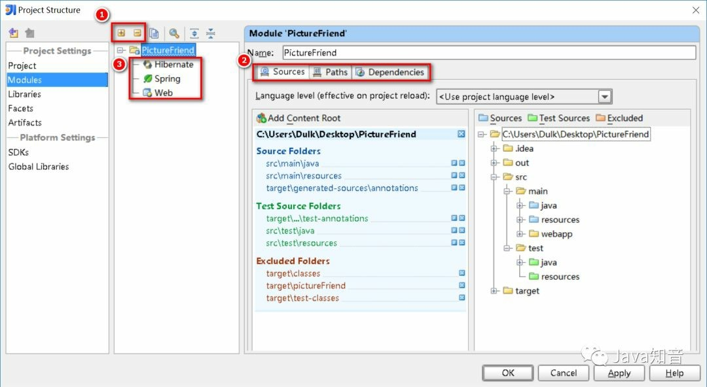

#### 10.2.1. 增删子项目


一个项目中可以有多个子项目，每个子项目相当于一个模块。一般我们项目只是单独的一个，IntelliJ IDEA 默认也是单子项目的形式，所以只需要配置一个模块

#### 10.2.2. 子项目配置

每个子项目都对应了Sources、Paths、Dependencies 三大配置选项

- `Sources`：显示项目的目录资源，那些是项目部署的时候需要的目录，不同颜色代表不同的类型；
- `Paths`：可以指定项目的编译输出目录，即项目类和测试类的编译输出地址（替换掉了Project的默认输出地址）
- `Dependencies`：项目的依赖


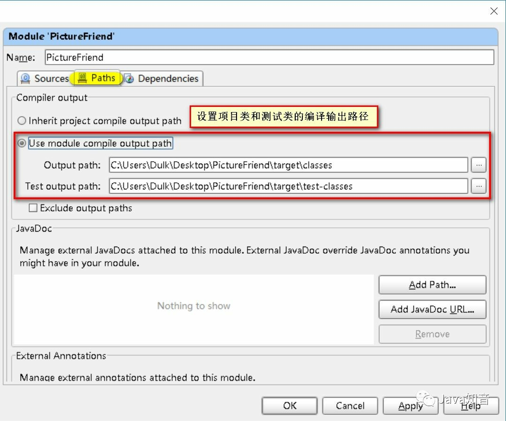


#### 10.2.3. 增删框架（Web部署-1）

每个子项目之下都可以定义它所使用的框架，这里重点说明一下Web部分的设置


### 10.3. Libraries选项卡

这里可以显示所添加的jar包，同时也可以添加jar包，并且可以把多个jar放在一个组里面，类似于jar包整理。

这里默认将每个jar包做为了一个单独的组（未测试，待定）。


### 10.4. Facets选项卡

官方的解释是：When you select a framework (a facet) in the element selector pane, the settings for the framework are shown in the right-hand part of the dialog.（当你在左边选择面板点击某个技术框架，右边将会显示这个框架的一些设置）

说实话，并没有感觉到有什么作用。


### 10.5. Artifacts（Web部署-2）

项目的打包部署设置，这个是项目配置里面比较关键的地方。先理解下它的含义，来看看官方定义的artifacts：

即编译后的Java类，Web资源等的整合，用以测试、部署等工作。再白话一点，就是说某个module要如何打包，例如war exploded、war、jar、ear等等这种打包形式。某个module有了 Artifacts 就可以部署到应用服务器中了。

- jar：Java ARchive，通常用于聚合大量的Java类文件、相关的元数据和资源（文本、图片等）文件到一个文件，以便分发Java平台应用软件或库；
- war：Web application ARchive，一种JAR文件，其中包含用来分发的JSP、Java Servlet、Java类、XML文件、标签库、静态网页（HTML和相关文件），以及构成Web应用程序的其他资源；
- exploded：在这里你可以理解为展开，不压缩的意思。也就是war、jar等产出物没压缩前的目录结构。建议在开发的时候使用这种模式，便于修改了文件的效果立刻显现出来。

默认情况下，IDEA的 Modules 和 Artifacts 的 output目录已经设置好了，不需要更改，打成war包的时候会自动在 WEB-INF目录下生成classes，然后把编译后的文件放进去。


其实，实际上，当点击运行tomcat时，默认就开始做以下事情：

- 编译，IDEA在保存/自动保存后不会做编译，不像Eclipse的保存即编译，因此在运行server前会做一次编译。编译后class文件存放在指定的项目编译输出目录下（见1.2.2）；
- 根据artifact中的设定对目录结构进行创建；
- 拷贝web资源的根目录下的所有文件到artifact的目录下（见1.2.3）；
- 拷贝编译输出目录下的classes目录到artifact下的WEB-INF下（见1.2.2）；
- 拷贝lib目录下所需的jar包到artifact下的WEB_INF下；
- 运行server，运行成功后，如有需要，会自动打开浏览器访问指定url。

在这里还要注意的是，配置完成的artifact，需要在tomcat中进行添加：


## 11. IDEA 内置工具使用与配置

IDEA 内置很实用工具，如 Terminal（终端）、web 浏览器、SSH 终端、数据库连接工具等等。其各种工具的配置位置集中在：【Settings】->【Tools】

### 11.1. 数据库操作工具

数据库的 GUI 工具有很多，IntelliJ IDEA 的 Database 也没有太明显的优势。IntelliJ IDEA 的 Database 最大特性就是对于 Java Web 项目来讲，常使用的 ORM 框架，如 Hibernate、Mybatis 有很好的支持，比如配置好了 Database 之后，IntelliJ IDEA 会自动识别 domain 对象与数据表的关系，也可以通过 Database 的数据表直接生成 domain 对象等。

#### 11.1.1. 关联方式

在菜单栏中找到数据库选项：【View】->【Tool Windows】->【Database】

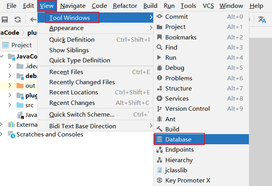

添加指定数据库：


配置 MySQL 数据库的详细信息（作为示例）：


> Tips: 如果提示没有相应数据库的驱动，可以点击下载即可

#### 11.1.2. 常用操作


- 图标1：同步当前的数据库连接。这个是最重要的操作。配置好连接以后或通过其他工具操作数据库以后，需要及时同步
- 图标2：配置当前的连接
- 图标3：断开当前的连接
- 图标4：显示相应数据库对象的数据
- 图标5：编辑修改当前数据库对象

展示 ER 图：


### 11.2. 设置 idea 连接 linux 系统

根据 linux 系统的编码设置 Default encoding


点击Configura Servers，点击【+】，填写连接名称


选择【Type】：SFTP，填写连接url、用户名、密码


点击Tools --> Start SSH session


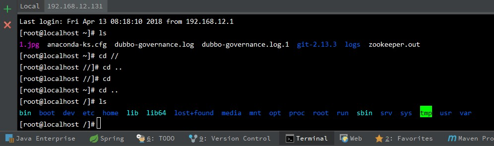

### 11.3. Http Client（待整理）

#### 11.3.1. Http Client 无法请求本地接口


原因是 IDEA 的代理出了问题，准确说是 IDEA 的代理没有忽略本地地址，导致 IDEA 访问不到本地。修改 IDEA 代理或者直接关闭代理


## 12. Intellij IDEA 四种配置热部署的方法

热部署可以使的修改代码后，无须重启服务器，就可以加载更改的代码。

### 12.1. 方式1：修改服务器配置，使得 IDEA 窗口失去焦点时，更新类和资源

菜单Run -> EditConfiguration , 然后配置指定服务器下，右侧server标签下on frame deactivation = Update classes and resource。

- 优点：简单
- 缺点：基于JVM提供的热加载仅支持方法块内代码修改，只有debug模式下，并且是在idea失去焦点时才会出发热加载，相对加载速度缓慢

### 12.2. 方式2：使用 springloaded jar 包

下载jar包，github：https://github.com/spring-projects/spring-loaded

启动应用时添加VM启动参数：`-javaagent:/home/lkqm/.m2/repository/org/springframework/springloaded/1.2.7.RELEASE/springloaded-1.2.7.RELEASE.jar -noverify`

- 优点：对Spring系列框架支持好（不含Spring boot）, 支持 成员级别的修改（增删改方法、字段、注解），支持对枚举值集。
- 缺点：与优点相对

### 12.3. 方式3：使用 spring-boot-devtools 提供的开发者工具

spring-boot项目中引入如下依赖

```xml
<dependency>
	<groupId>org.springframework.boot</groupId>
	<artifactId>spring-boot-devtools</artifactId>
</dependency>
```

- 优点：简单，支持 Spring-boot 项目，支持成员级别的修改热部署。
- 缺点：只支持 spring-boot 项目。

### 12.4. 方式4：使用 Jrebel 插件实现热部署(该插件14天免费试用)

在线安装：菜单File -> Setting -> Plugin, 点击右侧底部 Browse repositories, 弹出框顶部输入:JReble for Intellij， 选中安装即可

- 优点：强大，对各类框架支持，并且提供IDE插件的方式

### 12.5. 注意事项

最后 3 种方法是基于类加载机制来实现热加载的，因此你修改完成代码后必须重新编译当前代码，才能触发热部署，Eclipse 默认就支持了自动编译，而在 Intellij IDEA 中默认是关闭了自动编译的，可以按照如下 2 步设置开启：

1. IDEA 开启项目自动编译，进入设置，Build,Execut, Deployment -> Compiler 勾选中左侧的 `Build Project automatically`
2. IDEA 开启项目运行时自动 make, ctrl + shift + a 搜索命令：registry -> 勾选 `compiler.automake.allow.when.app.running`

## 13. 常用操作

### 13.1. 查看图形形式的继承链

在想查看的类的标签页内，点击右键，选择 Diagrams，其中有 show 和 show ... Popup，只是前者新建在标签页内，后者以浮窗的形式展示：


- 标签页内打开：Ctrl+Alt+Shift+U
- 浮窗打开：Ctrl+Alt+U


- <font color=blue>**蓝色**</font>实线箭头是指继承关系
- <font color=green>**绿色**</font>虚线箭头是指接口实现关系

### 13.2. 同时编辑多行

按着 ALT 键，用鼠标左键拖动需要编辑的行内容

### 13.3. inject language 快速构建一些语法 - 快速定义JSON

1. 定义一个json字符串则需要手动的去用`\`将`"`转义。使用inject language则可以省去这个步骤。
2. 定义一个json的字符串，将光标放在`""`中间，然后按Alt+Enter，出来如下提示后，选择Inject language or reference。


然后点击Enter进入后，选择或搜索JSON后回车。然后继续按Alt+Enter，出来如下提示后，选择Edit JSON Fragment。


回车后，会弹出一个输入框。在输入框中写JSON后会自动帮转义成字符串。

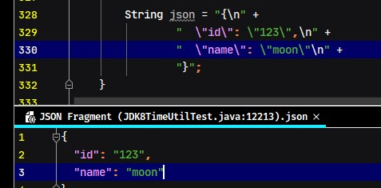

### 13.4. 使用 idae 创建的 Spring Boot 项目，运行两个一样的启动类


### 13.5. 查看微服务关系图表(2021.2+版本)

IDEA 2021.2 现在可以展示微服务的图表，在这上面可以看到微信服务交互关系。可以点击 Endpoints 工具窗口中的相应图标进行构建生成。


### 13.6. 自动清理缓存和日志(2021.2+版本)

IDEA 2021.2 增加一个自动清理的缓存以及日志的的功能，目前将会自动清理更新已超过 180 天的所有缓存和日志目录。这个清理不会影响系统设置和插件目录。

另外也可以 Help | Delete Leftover IDE Directories 手动打开这个清理功能。


## 14. 常见问题的解决方法

### 14.1. 闪退问题

- 问题描述1：双击桌面图标启动不了，没有响应。
- 问题描述2：进入到安装位置下的 `\bin` 目录，打开 CMD。输入idea，发现报错。

原因：之前使用过其他版本（如 2021.2.2 版本）的补(po)丁(jie)了。安装新版 IEDA 会以前的启运参数也都复制过来。而最新的 IDEA 不兼容之前版本中某些配置，如：

```
-javaagent:D:\develop_tools\IDEA\IntelliJ IDEA2021.2.2\bin\jetbrains-agent.jar
```

会报错从而导致 JVM 结束运行，因此无法启动

解决办法：打开 idea 配置保存目录中的 `idea64.exe.vmoptions` 文件，如：


删除以下内容后，再次打开即可正常进入。


### 14.2. 解决 idea 卡顿问题

在各种优化配置都没明显改善，最后想出了一招禁用和卸载一些平时用不到的插件。效果显著，直接起飞。

> Tips: 在升级 2021 以上版本后卡顿问题，感觉主要可能是 Code With Me 和 Space 引起的，在之前没有这此插件的时候也没这么明显的卡顿感

> TODO: 待整理可移除的插件列表

### 14.3. 无法使用已安装的字体

给电脑安装了 Monaco.ttf 字体后在其他软件都能正常使用，结果在IDEA字体设置中找不到该字体。电脑环境：Windows10 x64、IntelliJ IDEA 2018.3.5 x64


解决办法：找到IDEA安装目录，把字体文件复制到IDEA-jre-lib-fonts目录下，重启IDEA就能看到该字体了


### 14.4. 解决 IDEA 复制项目导致 sources root 复用了另一个项目

比如现在新建一个项目，而对原来的 uis-gateway 复制粘贴，然后改项目名就成了 uis-application 了。这时会发现如下图所示，sources root 依然是 uis-gateway：

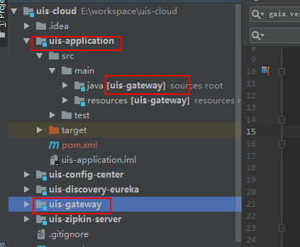

解决方法：快捷键`Ctrl+Alt+Shift+S`打开 Project Structure -> 在 Modules 中点下原始项目 uis-gateway，可以看到这时它的 Sources、Test、Resources 都是新项目 uis-application 的：


点上图右边框框里的叉叉删掉：


此时恢复原状：

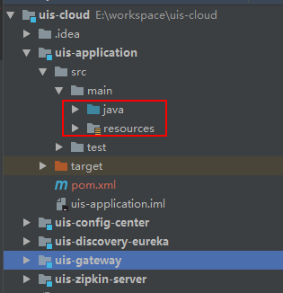

### 14.5. Tomcat 日志乱码问题的解决

如果 Tomcat 日志出现乱码，需要配置：


解决方案：

1. 点击 Help -> Edit custom VM Options，在最后面添加以下内容：

```properties
-Dfile.encoding=UTF-8
```

2. 打开 Run/Debug Configurations 面板，选择 Tomcat Server 实例，在 Server 标签页配置 VM option，添加以下内容：

```properties
-Dfile.encoding=UTF-8
```


3. Startup/Connection 页签的 Run 和 Debug 添加一个 key 为`JAVA_TOOL_OPTIONS`，value 为`-Dfile.encoding=UTF-8`的环境变量


保存后重启IDEA，可以发现控制台中文乱码显示正常了。

### 14.6. 解决 IDEA 2020 版 Maven 依赖成功导入但任然报错找不到包的问题

有时 pom.xml 中的依赖正确，点击运行按钮，报错找不到包。但ctrl+鼠标左键却能定位到jar包（说明jar成功导入）

- 原因：IDEA 启动程序按钮和 maven 的 build 使用的 jar 包环境不一样
- 解决方案：设置 idea 构建/运行操作委托给 maven 就行了。
- 具体设置：Settings 搜索 `Runner`，勾选 delegate ide build/run actions to maven
- 存在问题：如果勾选之后，在本项目中一些依赖模块（如：项目的公共依赖模块），需要安装到本地仓库，不然会提示说无法找到相应的依赖。


### 14.7. 导入 maven 项目时无法识别

导入项目父级目录不是 Maven Parent 目录而是普通的文件夹，里面的子 maven 项目无法识别（子module变灰）。

#### 14.7.1. 方式1

1. 右键父项目 -> 选择【open Module Settings】 -> 选择【modules】 -> 点击【+】号 -> 选择【Import Module】


2. 选择变灰项目的【pom.xml】文件
3. 点击【ok】 -> 【next】 -> 一直选择到结束即可

#### 14.7.2. 方式2

选择无法识别的 pom.xml 文件，右键选择【+ Add as Maven Project】


### 14.8. 强制更新 Maven Dependencies

自动载入 Mave 依赖的功能很好用，但有时候会碰到问题，导致 pom 文件修改却没有触发自动重新载入的动作，此时需要手动强制更新依赖

1. 手动删除 Project Settings 里面的 Libraries 内容；
2. 在 Maven Project 的试图里 clean 一下，删除之前编译过的文件；
3. 项目右键 -> Maven -> Reimport

## 15. 单元测试

### 15.1. 使用示例准备

创建一个待测试的类，其中还包含着错误。

```java
public class Calculator {

    public int result = 0;

    public int add(int operand1, int operand2) {
        result = operand1 + operand2;
        return result;
    }

    public int subtract(int operand1, int operand2) {
        result = operand1 - operand2;
        return result;
    }

    public int multiple(int operand1, int operand2) {
        result = operand1 * operand2;
        for (; ; ) {                    // 死循环
        }
    }

    public int divide(int operand1, int operand2) {
        result = operand1 / 0;
        return result;
    }

    public int getResult() {
        return this.result;
    }
}
```

### 15.2. 自动生成单元测试插件 JUnit 5 Mockito Code Generator

> 待使用时再截图补充


### 15.3. 并行测试 JUnit4 Paralle lRunner

在大量的单元测试时，可以通过并行来提升测试的效率。推荐插件：JUnit4 Parallel Runner


相关测试触发按钮和输出：


### 15.4. 测试用例的代码覆盖率

选择相应的测试用例


添加 【Specify alternative coverage runner】 选项


选择 Choose coverage runner: JaCoCo


执行后显示结果：


### 15.5. Profile

选择相关的测试用例，使用 Profile 来运行


#### 15.5.1. CPU Profile - Flame Graph


#### 15.5.2. CPU Profile - Call Tree


#### 15.5.3. CPU Profile - Method List


#### 15.5.4. Allocation Profile


## 16. 推荐插件

### 16.1. 热替换利器：JRebel

一款热部署插件，帮助开发者在项目处于运行状态下任意修改 Java 文件并动态反馈到运行的项目中。地址：https://plugins.jetbrains.com/plugin/4441-jrebel-for-intellij

### 16.2. 开发测试必备部署神器：Cloud Toolkit

帮助开发者更高效地开发、测试、诊断并部署应用，利用此插件，能够方便地将本地应用一键部署到任意机器（了解更多：[体验链接](https://mp.weixin.qq.com/s?__biz=MzU4NzU0MDIzOQ==&mid=2247485392&idx=3&sn=113a67be48740443b9a29d172da48b12&chksm=fdeb35b0ca9cbca6f48b61c8c333683b6acbaac4f1e8101ff54546d9256347bff629e0e513c5&scene=21#wechat_redirect)）

### 16.3. Lombok 插件

> Notes: 2020 以上版本已经内置此插件

Lombok 是一个实用的java工具，使用它可以消除java代码的臃肿，Lombok提供一系列的注解，使用这些注解可以不用定义getter/setter、equals、构造方法等，它会在编译时在字节码文件自动生成这些通用的方法，简化开发人员的工作。该插件使用IDEA开发时根据Lombok注解生成通用方法并提示，不报错

项目官方地址：https://www.projectlombok.org/


### 16.4. Rainbow Brackets

彩虹颜色的括号，分清括号个数与层级，防止括号错乱。插件提供地址：https://plugins.jetbrains.com/plugin/10080-rainbow-brackets

### 16.5. Free Mybatis plugin

可以在 mapper 接口中和 mapper 的 xml 文件中来回跳转，就想接口跳到实现类那样简单。

> 目前安装的版本是：Free Mybatis plugin，还一个插件叫 Mybatis plugin 

### 16.6. Key promoter X（快捷键提示）

Key Promoter X 是一个提示插件。在 IDEA 里使用鼠标操作时，会有这个操作的快捷键在界面的右下角进行告知。有个小缺点是有些没有快捷键的操作，会直接把操作的名字提示出来，实际上那样的提示是没有作用的，可以点击Don't show again来忽略。


### 16.7. RestfulToolkit

搜索URL，准确的说是搜索SpringMVC项目里，Controller层的`@RequestMapping`里的URL，通过URL匹配到相应的Controller层方法。使用快捷键：`Ctrl + \` 或 `Ctrl + Alt + N`

### 16.8. CamelCase

在几种字符串格式之间来回切换。有一下几种格式：

- 驼峰，第一个单词首字母小写，其他单词首字母大写；
- 所有字母小写，单词间下划线分隔
- 所有字母小写，单词间空格分隔
- 所有字母小写，单词间短横线分隔
- 每个单词首字母全部大写
- 所有字母大写，单词间下划线分隔

使用：按住Shift + Alt再不停的按U，会把选中内容的单词的下划线转驼峰转大写等，不停的转换。~~感觉String Manipulation功能比它强大~~

### 16.9. String Manipulation

功能：变量名使用驼峰形式、常量需要全部大写等等，编码解码等等。总的来说就是对字符串的处理。

选中需要处理的内容后，按快捷键Alt + M，即可弹出工具功能列表。后面的具体功能也可以使用相应的数字或字母，而不需要鼠标点击。

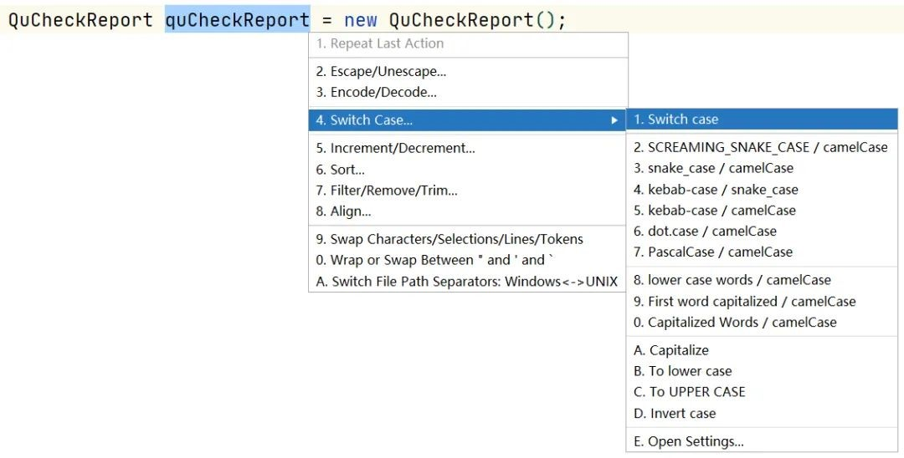

### 16.10. SequenceDiagram

时序图生成工具。需要梳理业务逻辑或者阅读源码。需要了解整个调用链路，反向生成 UML 的时序图是强需求。其中，SequenceDiagram 插件是一个非常棒的插件。详细使用参考：https://plugins.jetbrains.com/plugin/8286-sequencediagram

### 16.11. Maven Helper

Maven辅助工具。如果 Maven 引入的 jar 包有冲突，可以使用 Maven Helper 插件来帮助分析。详细使用参考：https://plugins.jetbrains.com/plugin/7179-maven-helper

### 16.12. GsonFormat/GsonFormatPlus

在对接接口的时候接受对方返回的 JSON 对象，而想要用一个对象去接收时，可以用此插件进行转换。可以根据 json 字符串生成对应的实体类

使用：使用alt + s 或 alt + insert调取。


### 16.13. GenerateAllSetter

此插件用于快速生成对象的所有 Setter 函数（可填充默认值），然后再跟进实际需求设置属性值。


### 16.14. Grep Console

Idea的控制台console输出日志时，往往是一大堆信息一起出现，想要快速找到自己想要的日志类型，使用这个插件便可以快速定位到自己关注的日志类型，还可以配置自己喜欢的颜色。

使用方式：点击菜单栏的File之后点击下拉表中的Settings，进入Other Settings中后点击Grep Console设置


### 16.15. Tabnine AI Code Completion — 代码智能提示

> 官网：https://www.tabnine.com/code

Tabnine AI Code Completion(原名称：Codota) 这个插件用于智能代码补全，它基于数百万Java程序，能够根据程序上下文提示补全代码。相比于IDEA自带的智能提示来说，Codota 的提示更加全面一些

Codota 还有一个在线网站，在这个网站上可以根据代码关键字搜索相关代码示例。作用如下：

1. 智能自动补全。Codota 可以快速的完成智能补全以及高频用法提示
2. 快速查询相关使用案例，同时可以通过添加关键字进行过滤，查找到更加精确的代码样例。快捷键：ctrl + shift + o
3. 当不知道某个类如何使用时，可以直接使用快捷键：ctrl + shift + y，然后输入关键字，会查询到很多【开源框架】中使用该类的经典案例。

> 注：同时支持Eclipse

### 16.16. jclasslib bytecode viewer（可视化字节码查看器）

jclasslib bytecode viewer 是一个可视化的字节码查看器的插件。使用步骤如下：

1. 在 IDEA 打开想研究的类。
2. 编译该类或者直接编译整个项目（如果想研究的类在 jar 包中，此步可略过）。
3. 打开 “view” 菜单，选择 “Show Bytecode With jclasslib” 选项。
4. 选择上述菜单项后 IDEA 中会弹出 jclasslib 工具窗口。


英文设置：在【Help】->【Edit Custom VM Options…】，加上以下配置

```properties
-Duser.language=en
```

### 16.17. JavaDoc

按 `alt+insert`，执行操作生成多个注释文档：


### 16.18. Translation

注册翻译服务（有道智云、百度翻译开放平台、阿里云机器翻译）帐号，开通翻译服务并获取其应用ID和密钥。绑定应用ID和密钥：偏好设置（设置）-> 工具 -> 翻译 -> 常规 -> 翻译引擎 -> 配置…

使用方法：鼠标选中文本，点击右键即可自动翻译成多国语言。

> Tips: 注意保管好应用密钥，防止其泄露。

### 16.19. CodeGlance Pro

在编辑器右侧生成代码小地图，可以拖拽小地图光标快速定位代码，阅读行数很多的代码文件时非常实用。


### 16.20. Statistic

代码统计工具。


### 16.21. Leetcode Editor

LeetCode插件，可以在IDEA中在线刷题。

### 16.22. Alibaba Java Coding Guidelines（代码规范）

阿里巴巴代码规范检测。不符合代码规范的地方会有波浪线，鼠标移上去就会有相应的提示，有些问题甚至可以快速修复。

使用方法：在类中，右键，选择编码规约扫描，在下方显示扫描规约和提示。根据提示规范代码，提高代码质量。

### 16.23. 主题类插件

#### 16.23.1. 主题下载地址

- Material Theme UI
- Xcode-Dark Theme 下载地址：https://plugins.jetbrains.com/plugin/13106-xcode-dark-theme/versions
- Vuesion Theme 下载地址：https://plugins.jetbrains.com/plugin/13106-xcode-dark-theme/versions
- One Dark theme 下载地址：https://plugins.jetbrains.com/plugin/11938-one-dark-theme
- Dark Purple Theme 下载地址：https://plugins.jetbrains.com/plugin/12100-dark-purple-theme

#### 16.23.2. 怎么安装下载的主题

1. 从主菜单打开你的编辑器选择 File -> Import Setting。选择下载的jar文件;
2. 等待重启之后进行配置：打开File -> Settings -> Editor -> Colors and fonts 然后选择要安装的主题即可完成

#### 16.23.3. 一些主题网址

- http://www.themesmap.com/
- http://www.riaway.com/
- http://www.easycolor.cc/intelliJidea/list.html
- http://color-themes.com/?view=index

## 17. idea64.exe.vmoptions 配置文件详解

> 更多配置详解参考：https://www.zender.top/post/idea_jvm.html

idea2020.1.2 的配置 idea64.exe.vmoptions 文件示例内容

```
-server
-Xms512m
-Xmx1024m
-Xmn393m
-Xverify:none
-ea
-XX:+AlwaysPreTouch
-XX:MaxGCPauseMillis=100
-XX:+UseConcMarkSweepGC
-XX:ParallelGCThreads=4
-XX:+CMSParallelRemarkEnabled
-XX:ConcGCThreads=4
-XX:CICompilerCount=4
-XX:ReservedCodeCacheSize=240m
-XX:+TieredCompilation
-XX:+UseCompressedOops
-XX:SoftRefLRUPolicyMSPerMB=50
-XX:MaxTenuringThreshold=10
-XX:-OmitStackTraceInFastThrow
-Dsun.io.useCanonCaches=false
-Dsun.io.useCanonPrefixCache=false
# 设置禁用 IPv6
-Djava.net.preferIPv4Stack=true
-Djdk.http.auth.tunneling.disabledSchemes=""
-Djdk.attach.allowAttachSelf
-Dkotlinx.coroutines.debug=on
-Djdk.module.illegalAccess.silent=true
```

### 17.1. -server

JVM 的参数配置分别是**服务器模式(-server)**和**客户端模式(client)**

比如垃圾回收机制，客户端模式下，要求的是用户体验流程，无明显滞留感（就是没有卡的现象）。而服务端，要求的是吞吐量，就是单位时间内执行的代码要求越多越好。

### 17.2. JVM 配置

- `-Xmx1024m`：设置 JVM 最大可用内存为 1024m。
- `-Xms512m`：设置 JVM 初始内存为 512m(启动时占用内存大小)。此值可以设置与`-Xmx`相同，以避免每次垃圾回收完成后 JVM 重新分配内存。
- `-Xmn393m`：设置 JVM 年轻代(Young Generation)大小为393m。<font color=red>**整个堆大小 = 年轻代大小 + 年老代大小 + 持久代大小**</font>。持久代一般固定大小为 64m，所以增大年轻代后，将会减小年老代大小。此值对系统性能影响较大，Sun 官方推荐配置为整个堆的3/8。
- `-Xss128k`：设置每个线程的堆栈大小为 128k。JDK5.0 以后每个线程堆栈大小为 1M，以前每个线程堆栈大小为 256K。更具应用的线程所需内存大小进行调整。在相同物理内存下，减小这个值能生成更多的线程。但是操作系统对一个进程内的线程数还是有限制的，不能无限生成，经验值在 3000~5000 左右。
- `-Xverify:none`：关闭 Java 字节码验证，从而加快了类装入的速度，并使得在仅为验证目的而启动的过程中无需装入类，缩短了启动时间。 
- `-ea`：启动断言检查机制。

### 17.3. -XX:+AlwaysPreTouch

参数作用：服务启动的时候分配真实的物理内存给 JVM。

JAVA 进程启动的时候，虽然可以为 JVM 指定合适的内存大小，但是这些内存操作系统并没有真正的分配给 JVM，而是等 JVM 访问这些内存的时候，才真正分配。这样会造成以下问题：

1. 第 1 次YGC(年轻带GC)之前 Eden 区分配对象的速度较慢;
2. YGC(年轻带GC)的时候，Young 区的对象要晋升到 Old 区的时候，这个时候需要操作系统真正分配内存，这样就会加大YGC(年轻带GC)的停顿时间。

配置 `-XX:+AlwaysPreTouch` 参数可以优化这个问题，不过这个参数也有副作用，它会影响启动时间。

配置这个参数后这么耗时其中一个原因是，这个特性在 JDK8 版本以前都不是并行处理的，到了 JDK9 才是并行。在没有配置 `-XX:+AlwaysPreTouch` 参数即默认情况下，JVM 参数 `-Xms` 申明的堆只是在虚拟内存中分配，而不是在物理内存中分配：它被以一种内部数据结构的形式记录，从而避免被其他进程使用这些内存。这些内存页直到被访问时，才会在物理内存中分配。当 JVM 需要内存的时候，操作系统将根据需要分配内存页。

配置 `-XX:+AlwaysPreTouch` 参数后，JVM 将 `-Xms` 指定的堆内存中每个字节都写入"0"，这样的话，除了在虚拟内存中以内部数据结构保留之外，还会在物理内存中分配内存。并且由于touch(分配物理内存)这个行为是单线程的，因此它将会让 JVM 进程启动变慢。所以，要么选择减少接下来对每个缓存页的第一次访问时间，要么选择减少 JVM 进程启动时间，这是一种权衡。

### 17.4. -XX:MaxGCPauseMillis

设置每次年轻代垃圾回收的最长时间(毫秒单位)，如果无法满足此时间，JVM 会自动调整年轻代大小，以满足此值。

## 18. 其他参考资料

- [IDEA 高效使用指南](https://idea.javaguide.cn/)：使用指南 | 必备插件推荐 | 插件开发入门 | 重构小技巧 | 源码阅读技巧
- [单元测试 - IDEA下单元测试详解](https://www.pdai.tech/md/develop/ut/dev-ut-x-junit-idea.html)
