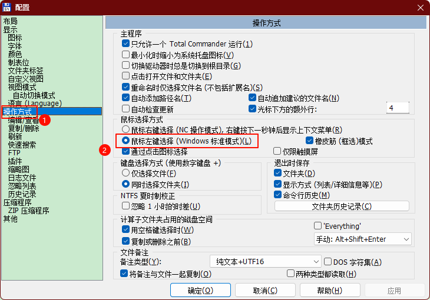
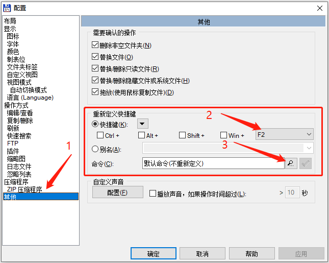
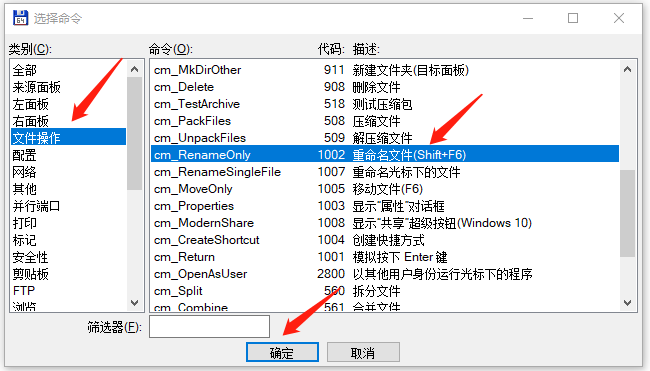
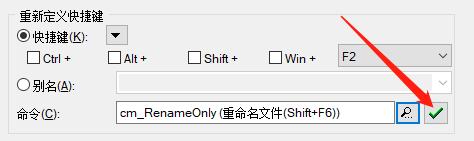
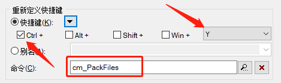
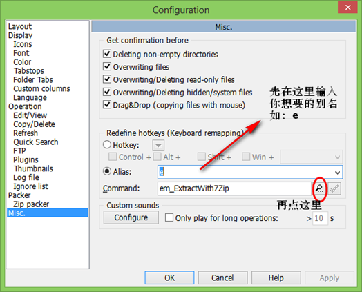
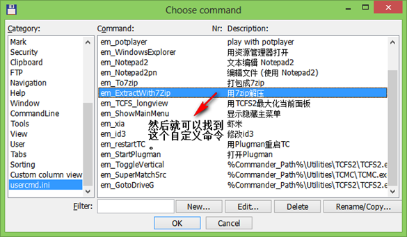
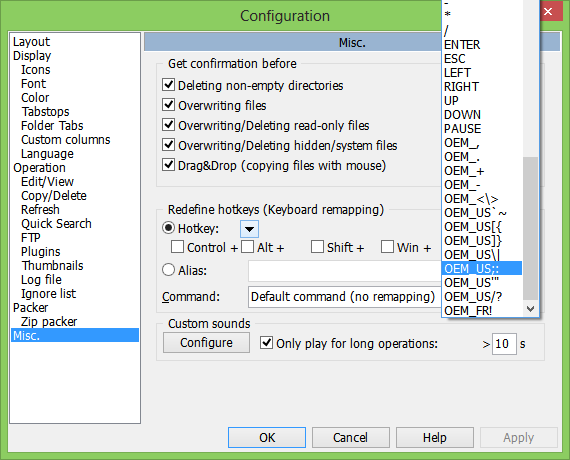

## 1. Total Commander 是什么？

Total Commander（早期名为 Wincmd）是一个用于 Windows (TM) 的文件管理器，功能类似于 Windows 资源管理器。但 Total Commander 使用不同的方式：它具有两个并排的固定面板，类似于以前 DOS 下的一款著名的文件管理器。

以下是 Total Commander 的一些主要功能：
 
- 键盘快捷键功能 类似于 DOS 下的原版软件。
- 支持鼠标 拖放 ，包括拖放到打印机管理器。
- 增强的 复制、 移动及重命名 和 删除 功能，可删除整个文件夹树（允许「完全」删除文件夹内容）。
- 压缩文件 按照文件夹进行处理。您可以轻松地从压缩文件中向外复制文件或将文件复制到压缩文件中。处理过程中会自动调用适当的压缩程序。 pkzip、arj、lha、rar、uc2 及 ace 格式的压缩文件都支持。
- 开始菜单 （用户自定义命令）允许您把经常使用的 DOS 或 Windows 应用程序放入到下拉式菜单中。调用时光标处的实际文件夹和（或）文件名将被传递给本应用程序。
- 命令行 通过简单地输入程序文件名 或者 按下 CTRL+ENTER 或 CTRL+SHIFT+ENTER 快捷键，可以方便地启动带参数的程序。
- 增强的  搜索功能 可以跨驱动器在任意文件中进行全文搜索。
- 内置的文件查看器 (F3) 可以查看任意大小的十六进制、二进制或文本格式文件，不管它们是采用 ASCII (DOS) 还是 ANSI (Windows) 字符集。行宽及字体大小也可以调整。
- 采用 Info-Zip  内部解压缩 ZIP 文件，可无需调用外部程序！此部分 Turbo-Pascal 源代码是**免费**的 ，可向作者直接索取。
- 可配置的工具栏，用于启动外部程序或内部命令。
- 可配置的主菜单。
- 内置 ZIP、ARJ、LZH、GZ、TAR、RAR、ACE 及 7Z 格式的解压缩程序。
- 内置 ZIP 压缩程序，基于 Jean-loup Gailly 的 ZLib。

## 2. 配置

### 2.1. 设置鼠标右键操作

默认的情况下，想要<u>弹出右键菜单需要按住右键一定时间</u>，修改方式：按快捷键【F12】(或者点击【配置】->【选项】)->【操作方式】->【鼠标选择方式】，修改【通过右键选择】为【通过左键选择】：



## 3. 操作

### 3.1. 常用快捷键

> TODO: 待补充

### 3.2. 自定义快捷键

常用的快捷键有时会和平时使用的快捷键冲突，可以对它们进行重新定义。

#### 3.2.1. 自定义“文件重命名”快捷键

默认的重命名快捷键为 `shift + F6`，可能有点不习惯，所以可把它修改成常使用的 `F2` 快捷键：

选择【配置】->【选项】，然后在配置面板中切换到【其他】，在【重新定义快捷键】下的【快捷键】选择中不勾选任何修饰键，直接点击最右边的按键选项找到 `F2`，然后在【命令】选项中点击【搜索】图标：



然后在选择命令面板中找到重命名命令，然后点击确定即可：



回到快捷键面板的时候就会看到命令选项中显示了快捷键命令，最后点击右边的钩即可修改完成。



#### 3.2.2. 自定义“文件压缩”快捷键

默认的压缩快捷键无法实现原地压缩，想要实现原地压缩有如下两种方法：

1. 选择文件后按住 ctrl 键，再点击工具栏上的压缩按钮；
2. 重新定义压缩快捷键。

这里对重新定义压缩快捷键，比如 `ctrl + y`，方法和前面一致，设置如下图：



## 4. 扩展配置

### 4.1. Totalcmd 配合 7-Zip 进行压缩、解压缩（待测试）

1. 到 7-Zip 官网下载安装版文件，再解压，只提取其中的 7z.dll 文件和 7zG.exe 文件，再将其放在自定义目录(如：`totalcmd\Utilities\7-Zip`)下。

> Tips: Utilities 是自定义创建的文件夹，用来存放一些可直接调用的小工具。虽说 7-Zip 有个叫 7za.exe 的命令行工具，但显示效果不佳，而且也不能显示剩余时间，所以还是用窗口工具好。

2. 修改 `totalcmd\user.ini` 文件，加入如下的代码：

```shell
[em_To7zip]
;button=%COMMANDER_PATH%\FileXP.ICL,23
cmd=%COMMANDER_PATH%\utilities\7-Zip\7zG.exe
param=a -mx=6 "%O".7z %P%S
menu=打包成7zip

[em_ExtractWith7Zip]
;button=%COMMANDER_PATH%\FileXP.ICL,25
cmd=%COMMANDER_PATH%\utilities\7-Zip\7zG.exe
menu=用7zip解压
param=x %P%N -o"%P%O\"
```

3. 为上述命令设了两别名，在 totalcmd\wincmd.ini 的 alias 栏下加入下列代码：

```shell
e=em_ExtractWith7Zip
c=em_To7zip
```

另一种通过图形化配置方法：

 

4. 直接在 totalcmd\wincmd.ini 的 shortcuts 栏加入：

```shell
OEM_US;:=cm_focuscmdline
```

就能按下分号键启动命令行，然后输入 `e` 或 `c`、enter 对选中文件进行解压缩和压缩。也可以通过图形化配置加入快捷键：



#### 4.1.1. 关键配置说明

```shell
param=a -mx=6 "%O".7z %P%S
param=x %P%N -o"%P%O\"
```

totalcmd 自带内部命令参数，如 `%P` 表示当前目录路径，`%N` 表示光标所在文件名，详情请 F1 帮助，在“Operation -> Menus -> Menu start -> change menu start”栏下（很诡异的位置，当初找了好久），一定要分清什么时候带引号，什么时候不带，如`"%O"`带引号，`%P%S` 又不能带了，这里要参照文档看清楚，还可以建一个批处理查看它的信息。批处理很简单就两行：

```shell
echo %1 %2 %3 
::之所以选三个变量是因为 %P%S 表示所有选中文件 
pause
```

将这个批处理拖到图标栏中然后右键改变它的参数值为上述如：`%P`, `%P%S`, 都试一试，还要在文件夹名和文件名中有意加个空格试一试，然后才能真正清楚。

最后具体针对上例说一下：`%P%N` 和 `%P%S` 没加引号是因为若路径中只要出现空格，则 totalcmd 会自动为它加上引号给其它程序引用，若路径中未出现空格 totalcmd 则不给它加上引号；`%P%O` 和 `%O` 都加上了引号，是因为它所代表的字符串中即使有空格 totalcmd 也不会给它们加引号，所以要手动添加。
