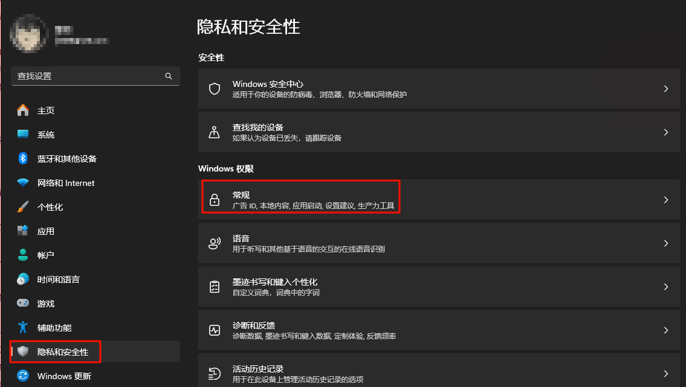
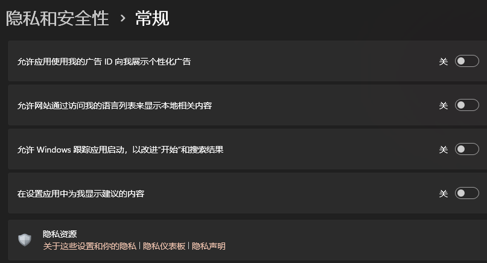
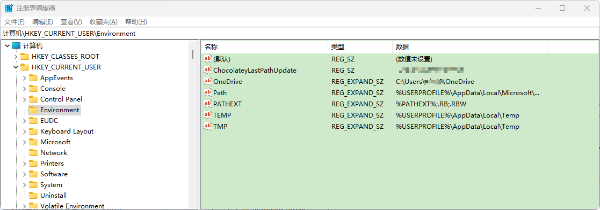
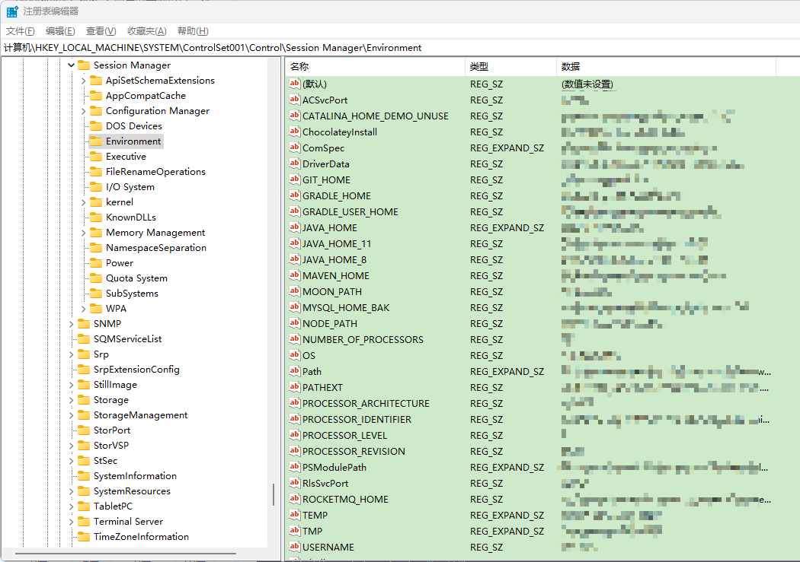
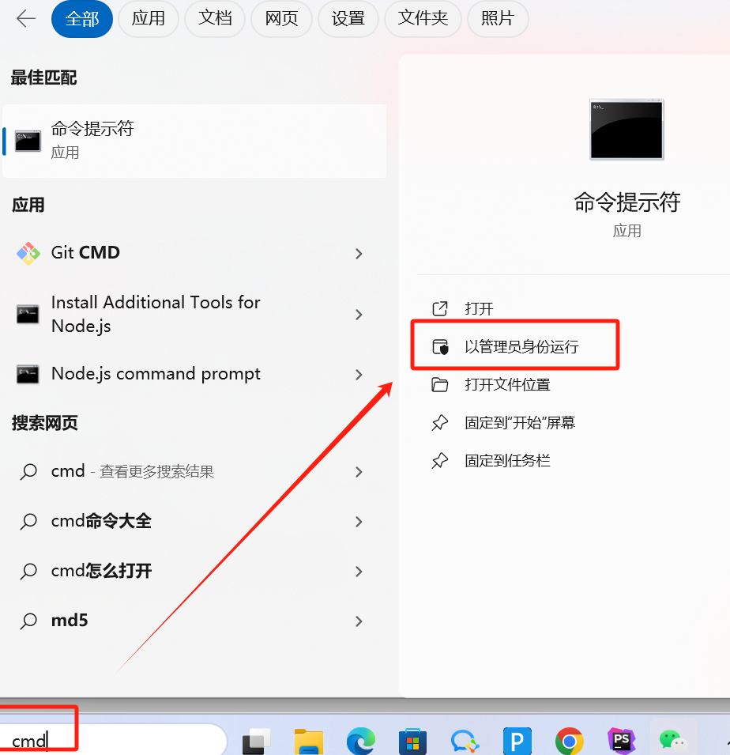
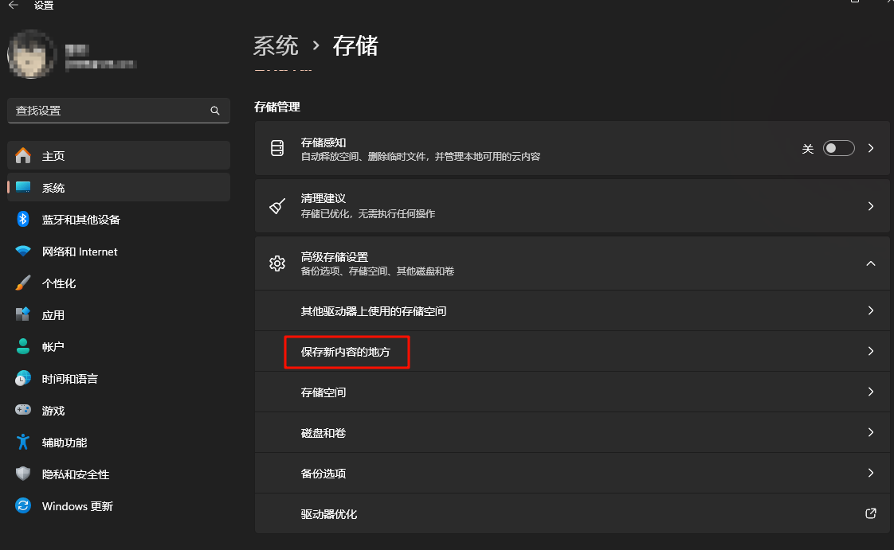
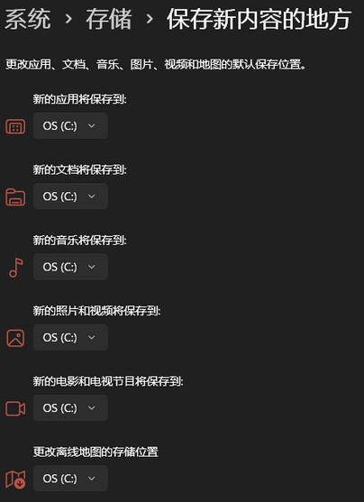
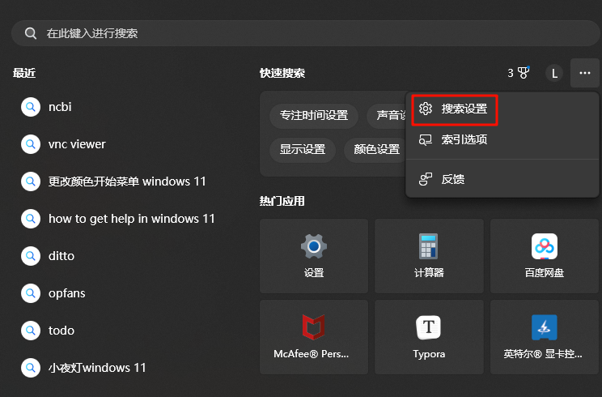
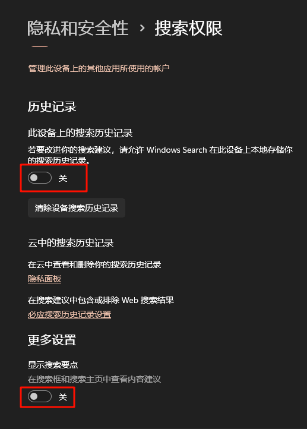

## 1. 常用DOS命令

- d: 回车	盘符切换
- dir(directory):列出当前目录下的文件以及文件夹
- cd (change directory)改变指定目录(进入指定目录)
    - 进入	cd 目录；cd 多级目录\\多级目录2
    - ​	回退	cd.. ；cd\
- `cls` : (clear screen)清屏
- `exit` : 退出dos命令行
- `ipconfig` ：查询IP的命令
    - `ipconfig /release` ：释放本机现有IP
    - `ipconfig /renew` ：向DHCP服务器（可以简单理解成你家的路由器）重新申领一个IP
    - `ipconfig /all` ：显示完整版IP信息
- `telnet` ：测试映射端口或远程访问主机
    - `telnet towel.blinkenlights.nl`：播放ASCII版《星球大战》
    - > *注：这项功能需要telnet支持，telnet不是Windows的默认内置组件，因此当你看到错误提示时，需要首先进入“设置” --> “应用” --> “程序和功能” --> “启用或关闭Windows功能”手工安装它（Telnet Client）*
- `msg` ：向对方电脑发送一条文本提示
    - `msg /server:对方电脑IP * 对方电脑屏幕要弹出的文本`
- `net user` ：查看本机账户情况
    - 衍生的命令后缀，比方说“`net user xxx 123456 /add`”，输入后就会在系统中创建一个名为“xxx”的新用户，而新用户密码则是“123456”。类似的还有“`net user xxx /del`”（删除xxx用户）、“`net user xxx /active:no`”（禁用xxx用户）、“`net user xxx`”（查看xxx用户的详细情况）等
- `net share` ：查看共享资源
    - `net share 要共享的文件夹` ：指定共享文件
    - `net share 要删除的共享文件夹 /delete` ：删除共享文件
- `nslookupn` ：检查网站IP地址 
    - `nslookup 对方网站域名`
- `netsh wlan show` ：探秘Wi-Fi配置文件
    - `netsh wlan show profile SSID key=clear`，输入完成后Windows会自动返回当前已连接WIFI的详细信息，包括SSID和连接密码。当前这里有一个前提，那就是你现在已经成功连接了。
- `color` ：更改CMD文字颜色
- `|` ：将命令结果输出到剪贴板
    - 具体命令是，在需要导出结果的命令后方添加“`|`”，再加入导出位置就可以了。比方说“`| clip`”是导出到剪贴板，“`| xxx.txt`”是导出到xxx.txt。
- `&&` ：将多个命令“连接”起来，一步运行多组命令

### 1.1. windows 常用命令

```bash
# 查询端口
netstat -ano
# 查询指定端口
netstat -ano |findstr "端口号"
# 根据进程PID查询进程名称
tasklist |findstr "进程PID号"
# 根据PID杀死任务
taskkill /F /PID "进程PID号"
# 根据进程名称杀死任务
taskkill -f -t -im "进程名称"
```

### 1.2. 自用的系统脚本

#### 1.2.1. 内外网IP切换（适用win10系统）.20171122

```bash
@echo off
rem //设置变量 
set NAME="以太网"
rem //以下属性值可以根据需要更改
set ADDR=192.168.14.73
set MASK=255.255.254.0
set GATEWAY=192.168.14.1
set DNS1=10.17.65.13
set DNS2=10.202.253.28
rem //以上属性依次为IP地址、子网掩码、网关、首选DNS、备用DNS


echo 当前可用操作有：
echo 1 设置为静态IP
echo 2 设置为动态IP
echo 3 退出
echo 请选择后回车：
set /p operate=
if %operate%==1 goto 1
if %operate%==2 goto 2
if %operate%==3 goto 3


:1
echo 正在设置静态IP，请稍等...
rem //可以根据你的需要更改 
echo IP地址 = %ADDR%
echo 掩码 = %MASK%
echo 网关 = %GATEWAY%
netsh interface ipv4 set address %NAME% static %ADDR% %MASK% %GATEWAY% 
echo 首选DNS = %DNS1% 
netsh interface ipv4 set dns %NAME% static %DNS1%
echo 备用DNS = %DNS2% 
if "%DNS2%"=="" (echo DNS2为空) else (netsh interface ipv4 add dns %NAME% %DNS2%) 
echo 静态IP已设置！
pause
goto 3


:2
echo 正在设置动态IP，请稍等...
echo 正在从DHCP自动获取IP地址...
netsh interface ip set address %NAME% dhcp
echo 正在从DHCP自动获取DNS地址...
netsh interface ip set dns %NAME% dhcp 
echo 动态IP已设置！
pause
goto 3


:3
exit
```

#### 1.2.2. 内外网IP切换（适用win7系统）

```bash
@echo off

rem //设置变量
set NAME="本地连接"

rem //以下属性值可以根据需要更改
set ADDR=192.168.14.73
set MASK=255.255.254.0
set GATEWAY=192.168.14.1
set DNS1=10.17.65.13
set DNS2=10.202.253.28

rem //以上属性依次为IP地址、子网掩码、网关、首选DNS、备用DNS
echo 当前可用操作有：
echo 1 设置为静态IP
echo 2 设置为动态IP
echo 3 退出
echo 请选择后回车：

set /p operate=
if %operate%==1 goto 1
if %operate%==2 goto 2
if %operate%==3 goto 3

:1
echo 正在设置静态IP,请稍等…
rem //可以根据你的需要更改
echo IP地址 = %ADDR%
echo 掩码 = %MASK%
echo 网关 = %GATEWAY%
netsh interface ipv4 set address name=%NAME% source=static addr=%ADDR% mask=%MASK% gateway=%GATEWAY% gwmetric=0 >nul
echo 首选DNS = %DNS1%
netsh interface ipv4 set dns name=%NAME% source=static addr=%DNS1% register=PRIMARY >nul
echo 备用DNS = %DNS2%
netsh interface ipv4 add dns name=%NAME% addr=%DNS2% index=2 >nul
echo 静态IP已设置!
pause
goto 3

:2
echo 正在设置动态IP,请稍等…
echo 正在从DHCP自动获取IP地址…
netsh interface ip set address "本地连接" dhcp
echo 正在从DHCP自动获取DNS地址…
netsh interface ip set dns "本地连接" dhcp
echo 动态IP已设置!
pause
goto 3

:3
exit
```

#### 1.2.3. 一键删除电脑中的空文件夹脚本（未测试！！）

在任意目录中创建“xxx.bat”的批处理文件，复制以下脚本代码再双击运行即可。

- 批量（循环）删除指定目录下所有空文件夹代码，例如删除F:\盘下的所有空文件夹：

```bash
@echo off

for /f "delims=" %%a in ('dir /ad /b /s F:\^|sort /r') do (
rd "%%a">nul 2>nul &&echo 空目录"%%a"成功删除！
)

pause
```

- 批量删除多个磁盘的空文件夹，例如删除c、d、e、f区中所有的空文件夹：

```bash
@echo off

for %%i in (c d e f) do (
if exist %%i:\ (
for /f "delims=" %%a in ('dir /ad /b /s "%%i:\"^|sort /r') do (
rd "%%a"
)
)
)

pause
```

#### 1.2.4. 启用/禁用网络本地连接

启用/禁用网络连接脚本，**注意：需要使用管理员身份运行脚本**。

```shell
@echo off 
 
:: BatchGotAdmin 
:------------------------------------- 
REM --> Check for permissions 
>nul 2>&1 "%SYSTEMROOT%\system32\cacls.exe" "%SYSTEMROOT%\system32\config\system" 
 
REM --> If error flag set, we do not have admin. 
if '%errorlevel%' NEQ '0' ( 
 echo Requesting administrative privileges... 
 goto UACPrompt 
) else ( goto gotAdmin ) 
 
:UACPrompt 
 echo Set UAC = CreateObject^("Shell.Application"^) > "%temp%\getadmin.vbs" 
 echo UAC.ShellExecute "%~s0", "", "", "runas", 1 >> "%temp%\getadmin.vbs" 
 
 "%temp%\getadmin.vbs" 
 exit /B 
 
:gotAdmin 
 if exist "%temp%\getadmin.vbs" ( del "%temp%\getadmin.vbs" ) 
 pushd "%CD%" 
 CD /D "%~dp0" 
:-------------------------------------- 
 
cls
@ECHO OFF
title 启用或禁用本地连接
CLS
color 0a
GOTO MENU
:MENU
ECHO.
ECHO. ==============启用禁用本地连接==============
ECHO.
ECHO. 1 启用本地连接
ECHO. 2 禁用本地连接
ECHO. 3 退 出
ECHO. ==========================================
ECHO.
ECHO.
echo. 请输入选择项目的序号：
set /p ID=
if "%id%"=="1" goto open
if "%id%"=="2" goto close
if "%id%"=="3" exit
PAUSE
:open
echo 启用本地连接
netsh interface set interface name="以太网" admin=ENABLED
GOTO MENU
:close
echo 禁用本地连接
netsh interface set interface name="以太网" admin=DISABLED
goto MENU
```

### 1.3. 批处理(bat)脚本命令汇总（待整理）

> 参考：[详细的批处理文件bat脚本命令](https://blog.csdn.net/ankang654321/article/details/103644637)

## 2. 系统运行命令

> 以下均为运行面板(Win+R)中输入的命令

### 2.1. 如何使用 WIN+R 运行自定义命令启动程序

首先在任意盘符下建立一个文件夹，比如在D盘建立名字为shortcut的文件夹

设置环境变量：选择计算机->右键选择属性->选择系统高级设置->选择“环境变量->双击path->添加刚刚建立的文件夹D:\shortcut(如果有多个则在每个文件夹路径后面加英文状态下的分号`;`)

将桌面上所有的快捷方式都剪切到shortcut文件夹即可，以后有快捷方式也直接扔进去

> 注意事项: 如果想更加简单的使用 Win+R 打开程序，可以将shortcut下的文件名称更改为自己熟悉的(支持中文哦)

### 2.2. window 系统常用原生命令

|                 快捷键                 |                  程序                   |
| ------------------------------------- | --------------------------------------- |
| cmd                                   | 命令行                                   |
| regedit                               | 注册表                                   |
| services.msc                          | 系统服务                                 |
| control                               | 所有控制面版项                            |
| calc                                  | 启动计算器                               |
| mspaint                               | 画图                                    |
| notepad                               | 打开记事本                               |
| ncpa.cpl                              | 打开网络连接                              |
| `Shutdown -s -t 600`                  | 表示600秒后自动关机                       |
| `Shutdown -a`                         | 可取消定时关机                            |
| `Shutdown -r -t 600`                  | 表示600秒后自动重启                       |
| `rundll32 user32.dll,LockWorkStation` | 表示锁定计算机                            |
| wt                                    | Microsoft.WindowsTerminal（需要手动安装） |

## 3. windows 系统相关设置

### 3.1. 查询电脑配置

使用 Win + R 打开运行，执行 `dxdiag` 命令，查询电脑配置

### 3.2. 关闭隐私

打开设置，【隐私和安全性】->【常规】



关闭以下四项，可以一键阻拦电脑的自带广告。



### 3.3. 环境变量 (用户变量与系统变量)

> 参考资源：http://www.dayanzai.me/environment-variables.html

- 环境变量 (environment variables) 是在操作系统中用来指定操作系统运行环境的一些参数。环境变量是在操作系统中一个具有特定名字的对象，它包含了一个或者多个应用程序所将使用到的信息。Windows 和 DOS 操作系统中的 `path` 环境变量，当要求系统运行一个程序而没有告诉它程序所在的完整路径时，系统除了在当前目录下面寻找此程序外，还应到 `path` 中指定的路径去找。用户通过设置环境变量，来更好的运行进程。

环境变量可分为**用户变量**与**系统变量**两类，在注册表中都有对应的项。

> Notes: 
>
> - <font color=purple>**环境变量不区分大小写**</font>
> - 系统变量针对所有用户起作用，为了安全一般配置用户环境变量。
> - 用户变量只对当前用户起作用，不建议为了省事而配置系统环境变量。
> - 用户环境变量优先级高于系统环境变量。对于环境变量，系统会先检查用户变量，之后再检查系统变量。

#### 3.3.1. 用户变量

注册表中用户变量所在位置：`HKEY_CURRENT_USER\Environment`



#### 3.3.2. 系统变量

注册表中系统变量所在位置：`HKEY_LOCAL_MACHINE\SYSTEM\ControlSet001\Control\Session Manager\Environment`



在原有变量 `Path` 的基础上添加英文状态下的分号，然后添加路径名。*不要删除原先的系统变量，只要用分号隔开，然后添加路径名，最后也要加上分号。*

#### 3.3.3. 常用变量清单

|               变量名称                |                                值                                |
| :----------------------------------: | ---------------------------------------------------------------- |
|         `%ALLUSERSPROFILE%`          | C:\ProgramData                                                   |
|             `%APPDATA%`              | 列出应用程序数据的默认存放位置。C:\Users\{username}\AppData\Roaming |
|           `%LOCALAPPDATA%`           | C:\Users\{username}\AppData\Local                                |
|          `%TEMP%`或`%TMP%`           | C:\Users\{username}\AppData\Local\Temp                           |
|        `%COMMONPROGRAMFILES%`        | C:\Program Files\Common Files                                    |
|     `%COMMONPROGRAMFILES(x86)%`      | C:\Program Files (x86)\Common Files                              |
|        `%CommonProgramW6432%`        | C:\Program Files\Common Files                                    |
|             `%COMSPEC%`              | C:\Windows\System32\cmd.exe                                      |
|            `%HOMEDRIVE%`             | C:\                                                              |
|   `%HOMEPATH%` 或 `%USERPROFILE%`    | 用户主目录的完整路径（当前用户的配置文件的位置）。C:\Users\{username} |
|     `%WINDIR%` 或 `%SYSTEMROOT%`     | 操作系统根目录。C:\Windows                                         |
|           `%LOGONSERVER%`            | \\{domain_logon_server}                                          |
|               `%PATH%`               | C:\Windows\system32;C:\Windows;C:\Windows\System32\Wbem          |
|             `%PATHEXT%`              | .com;.exe;.bat;.cmd;.vbs;.vbe;.js;.jse;.wsf;.wsh;.msc            |
|           `%PROGRAMDATA%`            | C:\ProgramData                                                   |
| `%PROGRAMFILES%` 或 `%ProgramW6432%` | C:\Program Files                                                 |
|        `%PROGRAMFILES(X86)%`         | C:\Program Files (x86)                                           |
|              `%PROMPT%`              | `$P$G`                                                           |
|           `%SYSTEMDRIVE%`            | C:                                                               |
|            `%SystemRoot%`            | C:\Windows                                                       |
|            `%USERDOMAIN%`            | 与当前用户相关的用户域。                                            |
|    `%USERDOMAIN_ROAMINGPROFILE%`     | 与漫游配置文件相关的用户域。                                        |
|             `%USERNAME%`             | 当前系统用户名称。{username}                                       |
|              `%PUBLIC%`              | C:\Users\Public                                                  |
|           `%PSMODULEPATH%`           | %SystemRoot%\system32\WindowsPowerShell\v1.0\Modules\            |
|            ` %ONEDRIVE%`             | C:\Users\{username}\OneDrive                                     |
|            `%DriverData%`            | C:\Windows\System32\Drivers\DriverData                           |
|                `%CD%`                | 输出当前目录路径。(命令提示符)                                      |
|            `%CMDCMDLINE%`            | 输出用于启动当前命令提示符会话的命令行。(命令提示符)                  |
|          `%CMDEXTVERSION%`           | 输出当前命令处理器扩展的数量。(命令提示符)                           |
|           `%COMPUTERNAME%`           | 输出系统名称。                                                    |
|               `%DATE%`               | 输出当前日期。(命令提示符)                                          |
|               `%TIME%`               | 输出时间。(命令提示符)                                             |
|            `%ERRORLEVEL%`            | 输出上一条命令的定义退出状态的数字。(命令提示符)                      |
|       `%PROCESSOR_IDENTIFIER%`       | 输出处理器标识符。                                                 |
|         `%PROCESSOR_LEVEL%`          | 输出处理器电平。                                                   |
|        `%PROCESSOR_REVISION%`        | 输出处理器版本。                                                   |
|       `%NUMBER_OF_PROCESSORS%`       | 输出物理和虚拟内核的数量。                                          |
|              `%RANDOM%`              | 输出从 0 到 32767 的随机数。                                       |
|                `%OS%`                | Windows_NT                                                       |

### 3.4. hosts 文件

window 系统的 hosts 文件位置：`%windir%\System32\drivers\etc`

#### 3.4.1. win10 和 win11 使用管理员身份打开 hosts 文件

1. 在右下角输入框输入`cmd`，选择 "命令提示符（以管理员身份运行）"



2. 在命令行窗口中输入 `cd c:/Windows/System32/drivers/etc`


3. 输入 `notepad hosts` 命令，便可以打开 hosts 文件并对其进行修改和保存


### 3.5. win10 锁屏壁纸位置

路径：`%HOMEPATH%\AppData\Local\Packages\Microsoft.Windows.ContentDeliveryManager_cw5n1h2txyewy\LocalState\Assets`

### 3.6. C 盘可清理内容

1. **PerfLogs**文件夹，系统的信息日志，文件夹可删。
2. **Windows**文件夹
    - `C:\Windows\WinSxS`，装载了电脑从新装到现在的所有补丁文件，不能删除。但里面有一个“backup”备份文件夹，是可删的。
    - `C:\Windows\Help`，帮忙文件，可删
3. **用户**文件夹：`C:\Users\用户名称\AppData\Local\Temp`。这个是Windows存留安装软件时解压的源文件，方便下次安装直接调取使用，节省解压时间，可删除。

### 3.7. win7 系统的 Temporary Internet Files 清空问题

1. `cmd.exe`
2. `cd AppData\Local\Microsoft\Windows\Temporary Internet Files`（或者如果有Content.IE5目录的话，cd Content.IE5）
3. `del /s/q/f *.*`

### 3.8. 备份开始菜单

1. 按下Win+R打开运行窗口，输入命令powershell，然后点击确定按钮
2. 这时就会打开Windows Powershell窗口，在这里输入命令`Export-startlayout –path E:\start.xml`，可以根据自己实际情况来设置相应的路径
3. 按下回车键后，就会备份好开始菜单的布局文件
4. 如果需要恢复开始菜单布局的话，只需要再次打开Windows Powershell命令行窗口，然后输入命令`import-startlayout -layoutpath E:\start.xml -mountpath c:`，按下回车键后，就会马上把其还原回来了

### 3.9. 电脑护眼颜色设置

win7系统：

1. 桌面->右键->属性->外观->高级->项目选择（窗口）
2. 颜色1（L）选择（其它）将色调改为：85。饱和度：123。亮度：205->添加到自定义颜色->在自定义颜色选定点确定->确定
3. 另一种相近的颜色设置：`R:204 G:232 B:207`

win10系统：

1. windows+R键调出运行窗口（或者鼠标右击开始键，选择运行），在运行窗口中输入`regedit`调出注册表编辑器
2. 按照如下顺序找到windows：[HKEY_CURRENT_USER\Control Panel\Colors] windows。双击windows 进入编辑状态 将原本数值删除并输入：`202 234 206`。点击确定退出注册表。
3. 按照如下顺序找到 window：[HKEY_LOCAL_MACHINE\SOFTWARE\Microsoft\Windows\CurrentVersion\Themes\DefaultColors\Standard]。双击 window 打开编辑窗口，默认是勾选十六进制（若不是请勾选十六进制），将原始数据改为：`caeace`。点击确定退出注册表。

### 3.10. AHCI 开启方法 

先去修改到 compatible（兼容模式）进入系统

1. 依次展开：“开始” -> “运行”（或使用Win+R) -> 键入“regedit” -> “确定”后 -> 启动注册表编辑器 -> 展开到`[HKEY_LOCAL_MACHINE\SYSTEM\CurrentControlSet\services\msahci]`分支。
2. 在右侧双击“Start” -> “编辑DWORD值” -> 将“数值数据”的键值由“3”改为“0” -> 单击“确定”。
3. 关闭“注册表编辑器”窗口，并重新启动电脑。
4. 然后出来看看BIOS里面的硬盘模式，修改为ACHI后（如果没有就算了）
5. 然后在把SATA Operation Mode改为 enhanced（增强模式）

### 3.11. NSIS：使用 netsh advfirewall 屏蔽某程序访问网络

- 关闭防火墙

```bash
nsExec::Exec 'cmd /c netsh advfirewall set allprofiles state off'
```

- 开启防火墙

```bash
nsExec::Exec 'cmd /c netsh advfirewall set allprofiles state on'
```

- 删除屏蔽

```bash
nsExec::Exec 'cmd /c netsh advfirewall firewall Delete rule name="TIM"'
```

- 添加屏蔽

```bash
nsExec::Exec 'cmd /c netsh advfirewall firewall add rule name="TIM" dir=out action=block program="C:\Program Files\TIM Lite\Bin\TIM.exe"'
```

### 3.12. 删掉 WIN10 回收站右键菜单的固定到＂开始＂屏幕！

- 删除：打开注册表，定位到 `HKEY_LOCAL_MACHINE\SOFTWARE\Classes\Folder\shellex\ContextMenuHandlers`，删除其子键 `PintoStartScreen`
- 恢复：在 `HKEY_LOCAL_MACHINE\SOFTWARE\Classes\Folder\shellex\ContextMenuHandlers` 上单击右键，新建项 `PintoStartScreen`，修改其默认值为 `{470C0EBD-5D73-4d58-9CED-E91E22E23282}`

### 3.13. 限制保留宽带设置

1. 按“WIN+R”，打开【运行】对话框；
2. 输入“regedit”，回车，打开注册表编辑器；
3. 依次展开“HKEY_CURRENT_USER\Software\Microsoft\Windows\CurrentVersion\Explorer\RunMRU”
4. 按“WIN+R”，打开【运行】对话框，输入gpedit.msc
5. 计算机配置－管理模板－网络－qos数据包计划程序－限制保留宽带
6. 选择已启用。一般默认是20，直接把它改成0。

### 3.14. win10 系统任务栏设置时间显示秒

1. 按“WIN+R”，打开【运行】对话框；
2. 输入“regedit”，回车，打开注册表编辑器；
3. 在注册表中定位到以下子健：`HKEY_CURRENT_USER\SOFTWARE\Microsoft\Windows\CurrentVersion\Explorer\Advanced`
4. 后在Advanced上鼠标右键点击呼出菜单，选择 -> 新建（N） -> DWORD(32位)值。也可以左键点击Advanced，在右边区域点击空白处点击鼠标右键呼出菜单选择 -> 新建（N） -> DWORD(32位)值。
5. 将新建 DWORD(32位)值，命名为 `ShowSecondsInSystemClock`，双击打开将数值数据改为1，并点击确定，关闭注册表。

*如果想恢复不显示秒，则将创建的`ShowSecondsInSystemClock`删除即可*

> Notes: 微软承认 win 11 系统中，删除了注册表值“`ShowSecondsInSystemClock`”，该值允许任务栏时钟以秒为单位显示时间。如果时间需要显示秒，需要安装第三方软件

### 3.15. Win10 系统删除无用的服务

1. 运行 -> `regedit`，打开注册表编辑器
2. 定位到【计算机\HKEY_LOCAL_MACHINE\SYSTEM\CurrentControlSet\Services】，选择服务名称，右键删除即可

### 3.16. 修改 window 默认系统安装目录

#### 3.16.1. 通过注册表修改安装目录

Windows10 系统更改软件程序默认安装目录的方法

1. 运行 -> regedit，打开注册表编辑器
2. 进入注册表`HKEY_LOCAL_MACHINE\SOFTWARE\Microsoft\Windows\CurrentVersion`目录下，并左键单击：CurrentVersion；
3. 在CurrentVersion对应的右侧窗口，找到ProgramFilesDir，并左键双击ProgramFilesDir打开编辑字符串对话框，把Program Files的数值数据从C:\Program Files更改为D:\Program Files，再点击：确定；
4. 如果安装的是Windows10的64位系统，在CurrentVersion对应的右侧窗口，找到ProgramFilesDir（x86），并左键双击ProgramFilesDir（x86）打开编辑字符串对话框，把Program Files（x86）的数值数据从C:\Program Files（x86）更改为D:\Program Files（x86），再点击：确定；

修改系统存储的保存位置

1. 左键点击系统桌面左下角的“开始”，在开始菜单中点击：设置
2. 在打开的设置窗口，点击：系统 --> 窗口左侧的“存储”
3. 在存储对应的右侧窗口，用鼠标左键按住右侧的滑块向下拖动，找到：保存位置，在保存位置下，点击：新的应用将保存到此电脑（C:）后面的小勾
4. 修改成D盘。之后打开磁盘(D:\)，可以看到磁盘(D:\)中新增了三个文件夹：MoonZero（用户文件：文档、音乐、图片和视频）、Program Files（程序文件）和Windows Apps（窗口应用程序）；

#### 3.16.2. Win 11 设置

在设置中，【系统】->【存储】->【保存新内容的地方】



将默认盘全部改为D盘，避免C盘的标红状态。



### 3.17. win10 一般禁用的服务

1. 运行输入【services.msc】打开服务面板，禁用以下服务
    1. Connected User Experiences and Telemetry
    2. Diagnostic Execution Service
    3. Diagnostic Policy Service
    4. Diagnostic Service Host
    5. Diagnostic System Host
    6. SysMain（以前的 Windows Superfetch 感觉 SSD 上效果不大，不想禁用的可以改为“手动启动”）
    7. Windows Search （关联了 Win10 里的很多新功能，而且对于 SSD 影响也不大，可以不禁用）
2. 右击“此电脑” -> “属性” -> “高级系统设置” -> “高级” -> “性能”
3. 点击“设置” -> “更新与安全” -> “Windows预览体验计划”，退出 Windows Insider 计划。
4. 右击任务栏空白处选择“任务管理器”，切换到“启动”标签，将没必要的自启动程序全部禁用。

### 3.18. 修复 win10 右键无新建 txt 文本文件

```bat
Windows Registry Editor Version 5.00
[HKEY_CLASSES_ROOT\.txt]
@="txtfile"
"Content Type"="text/plain"
[HKEY_CLASSES_ROOT\.txt\ShellNew]
"NullFile"="" [HKEY_CLASSES_ROOT\txtfile]
@="文本文档"
[HKEY_CLASSES_ROOT\txtfile\shell]
[HKEY_CLASSES_ROOT\txtfile\shell\open]
[HKEY_CLASSES_ROOT\txtfile\shell\open\command]
@="NOTEPAD.EXE %1"
```

打开记事本，复制以上内容，另存为`xxx.reg`。点击文件，确认操作后，重启电脑生效

### 3.19. 关闭 cmd 命令行窗口的中文输入法

运行`regedit`命令，打开注册表窗口，修改注册表：`HKEY_CURRENT_USER\Console\LoadConIme` 的键值由`1`改为`0`

### 3.20. 修改 cmd / powershell 命令行窗口默认编码

**临时修改**

- 使用`chcp`命令可以输出当前编码的数值，如：`GBK`是936，`UTF-8`是65001

**修改注册表**

- **修改powershell默认编码**：运行`regedit`命令打开注册表，展开注册表`计算机\HKEY_CURRENT_USER\Console`项。选择powershell，点击修改右边窗口中`CodePage`项，选择十进制，修改值为`65001`。修改后就每次启动都默认改成UTF-8的编码
- **修改cmd编码**：运行`regedit`命令打开注册表，展开注册表`计算机\HKEY_LOCAL_MACHINE\SOFTWARE\Microsoft\Command Processor`项。如果右边窗口没有`autorun`字符串值，则右键新建字符串值，数值名称：`autorun`，数值数据：`chcp 65001`。修改后就每次启动都默认改成UTF-8的编码

### 3.21. 彻底关闭 Cortana 小娜

- **关闭 Cortana 小娜的权限**

Win10的设置菜单 -> "应用" -> 在应用列表中搜索找到Cortana -> 高级选项 -> 可以将Cortana小娜的麦克风、后台以及开机启动的权限全部关闭

- **彻底关闭Cortana小娜**

运行`regedit`进入注册表 -> `计算机\HKEY_LOCAL_MACHINE\SOFTWARE\Policies\Microsoft\Windows` -> 用右键点击“Windows”目录，选择“新建”，新建一个“项”。将这个项命名为“Windows Search” -> 右键点击“Windows Search”，新建一个“DWORD(32位)值” -> 将这个值命名为“AllowCortana”，然后双击这个值，确认它的数值为“0”，然后按下确定保存 -> 之后，Cortana就会被禁用了。这时候再打开Cortana，就会看到禁用的提示

- **完全删除Cortana小娜**

以管理员模式运行Powershell -> 运行以下代码删除

```bash
Get-AppxPackage -allusers Microsoft.549981C3F5F10 | Remove-AppxPackage
```

### 3.22. 关闭 Win11 / Win 10 内存压缩

Win11默认开启了内存压缩功能。可以压缩内存中的数据，让内存占用更少，同时减少Swap频次，带来更高的I/O效率。但CPU性能较弱的设备，例如轻薄本，开启内存压缩可能会造成卡顿缓慢。同时，内存压缩需要消耗额外的CPU资源，带来更多耗电发热，这对注重续航的设备来说也是不合适的。

- **通过任务管理器查看内存压缩的开启状态**。如果开启了内存压缩，那么在任务管理器中，就会显示压缩内存的数据
- **通过命令行查看内存压缩的开启状态**。使用系统管理员权限，打开PowerShell，然后输入命令 `Get-MMAgent` 后。如果看到“MemoryCompression”这一项是“Ture”，那么说明内存压缩已经开启。
- **关闭内存压缩**。使用系统管理员权限，打开PowerShell，然后输入命令 `Disable-MMAgent -mc` 后，重启系统，内存压缩就关闭了。
- **重新打开内存压缩**。使用系统管理员权限，打开PowerShell，然后输入命令 `Enable-MMAgent -mc` 后，重启系统，内存压缩就重新开启。

### 3.23. 清除电脑的运行记录

1. win+R 打开运行窗口，输入 `regedit` 打开注册表编辑器
2. 展开 `HKEY_CURRENT_USER\Software\Microsoft\Windows\CurrentVersion\Explorer\RunMRU`在右侧除了默认
3. 将其他选项都删除掉

### 3.24. 删除资源管理器中“此电脑”下面多余的图标

1. WIN+R 打开运行窗口，输入 `regedit` 打开注册表编辑器
2. 在注册表中定位到：`HKEY_CURRENT_USER\SOFTWARE\Microsoft\Windows\CurrentVersion\Explorer\MyComputer\NameSpace` 项
3. 选中“NameSpace”后，在右键窗口中删除相应的键值
4. 退出注册表后，此电脑中多余图标消失

也可以保存以下语句为`*.reg`文件，运行即可移除。

```reg
Windows Registry Editor Version 5.00

;如需还原去除上语句前减号即可

;取消我的电脑"视频"文件夹
[-HKEY_LOCAL_MACHINE\SOFTWARE\Microsoft\Windows\CurrentVersion\Explorer\MyComputer\NameSpace\{f86fa3ab-70d2-4fc7-9c99-fcbf05467f3a}]
;取消我的电脑"文档"文件夹
[-HKEY_LOCAL_MACHINE\SOFTWARE\Microsoft\Windows\CurrentVersion\Explorer\MyComputer\NameSpace\{d3162b92-9365-467a-956b-92703aca08af}]
;取消我的电脑"桌面"文件夹
[-HKEY_LOCAL_MACHINE\SOFTWARE\Microsoft\Windows\CurrentVersion\Explorer\MyComputer\NameSpace\{B4BFCC3A-DB2C-424C-B029-7FE99A87C641}]
;取消我的电脑"音乐"文件夹
[-HKEY_LOCAL_MACHINE\SOFTWARE\Microsoft\Windows\CurrentVersion\Explorer\MyComputer\NameSpace\{3dfdf296-dbec-4fb4-81d1-6a3438bcf4de}]
;取消我的电脑"下载"文件夹
[-HKEY_LOCAL_MACHINE\SOFTWARE\Microsoft\Windows\CurrentVersion\Explorer\MyComputer\NameSpace\{088e3905-0323-4b02-9826-5d99428e115f}]
;取消我的电脑"图片"文件夹
[-HKEY_LOCAL_MACHINE\SOFTWARE\Microsoft\Windows\CurrentVersion\Explorer\MyComputer\NameSpace\{24ad3ad4-a569-4530-98e1-ab02f9417aa8}]
;取消我的电脑"3D对象"文件夹
[-HKEY_LOCAL_MACHINE\SOFTWARE\Microsoft\Windows\CurrentVersion\Explorer\MyComputer\NameSpace\{0DB7E03F-FC29-4DC6-9020-FF41B59E513A}]
```

## 4. Windows 11 系统配置

### 4.1. 取消显示快速访问中“文档、视频...”等图标

使用快捷键 win+R 打开运行命令窗口，输入`regedit`命令打开注册表。在地址栏定位到以下地址：

```
计算机\HKEY_LOCAL_MACHINE\SOFTWARE\Microsoft\Windows\CurrentVersion\Explorer\FolderDescriptions
```

找到文件相应的代码字符串，展开并选择【PropertyBag】，选择右侧窗口中的【ThisPCPolicy】鼠标右键点击修改，将值修改为`Hide`。<font color=red>**注意：首字母`H`必须大写**</font>

- 图片：`{0ddd015d-b06c-45d5-8c4c-f59713854639}`
- 视频：`{35286a68-3c57-41a1-bbb1-0eae73d76c95}`
- 下载：`{7d83ee9b-2244-4e70-b1f5-5393042af1e4}`
- 音乐：`{a0c69a99-21c8-4671-8703-7934162fcf1d}`
- 文档：`{f42ee2d3-909f-4907-8871-4c22fc0bf756}`

### 4.2. 设置任务栏小图标

1. 使用快捷键 win+R 打开运行命令窗口，输入`regedit`命令打开注册表。在地址栏定位到以下地址：

```
计算机\HKEY_CURRENT_USER\Software\Microsoft\Windows\CurrentVersion\Explorer\Advanced
```

2. 右键新建【DWORD (32位)值】，命名为 `TaskbarSi`
3. 修改`TaskbarSi`数值数据，`0`表示强制使用小图标；`1`表示使用中等图标；`2`表示使用大图标

> <font color=purple>**但目前 win 11 不支持修改小图标的任务栏，修改后时间日期会出现下沉超出屏幕的问题。**</font>

### 4.3. 开启 Windows 11 隐藏的教育主题

教育主题适用于 Windows 11 家庭版、专业版和企业版。若要使 Windows 11 教育版主题可用，用户需要执行以下操作：

1. 按键盘上的 Win+R 打开运行窗口
2. 输入 `regedit` 按回车打开注册表编辑器
3. 导航到注册表中的相应路径：

```
HKEY_LOCAL_MACHINE\SOFTWARE\Microsoft\PolicyManager\current\device\
```

4. 右键单击 device 文件夹，然后选择新建 -> 项，命名为：`Education`
5. 再选择 `Education` 右键新建 DWORD 值（32 位），命名为：`EnableEduThemes`
6. 双击 → 将值设置为 1
7. 重新启动计算机。

或者，可以选择创建包含以下内容的文本文件，然后将其重命名为 `.reg` 后缀文件，并双击导入注册表。

```
Windows Registry Editor Version 5.00
[HKEY_LOCAL_MACHINE\SOFTWARE\Microsoft\PolicyManager\current\device\Education]
"EnableEduThemes"=dword:00000001
```

完成上述步骤后，计算机应该在重启后在后台自动下载其他主题。您可能需要等待一段时间，直到此过程完成。安装后，可以通过转到“设置”应用并选择“个性化” -> “主题”来应用新主题。

### 4.4. 搜索面板优化

按【Win + S】打开搜索面板，点击右上角的【...】选择【搜索设置】



取消【历史记录】与【搜索要点】两个选项，减少搜索面板的无用信息



## 5. Windows 11 键盘快捷键终极列表

> 参考：http://www.dayanzai.me/windows-11-keyboard-shortcuts.html

### 5.1. Windows 11 新增快捷键

Microsoft 在 Windows 11 中添加了一些新功能。例如，Snap Layouts。如果将鼠标悬停在最大化按钮（每个窗口右上角关闭十字符号旁边的方块）上，将看到多个网格。可以使用这些网格以想要的方式排列窗口。还有一个访问 Snap Layouts 的键盘快捷键。

|         操作          |  快捷键  |
| :------------------: | :-----: |
|      打开操作中心      | Win + A |
| 打开通知面板（通知中心） | Win + N |
|     打开小部件面板      | Win + W |
|   快速访问 Snap 布局   | Win + Z |
| 打开 Microsoft Teams  | Win + C |

### 5.2. 文本编辑键盘快捷键

|        操作         |  快捷键   |
| :-----------------: | :------: |
|     剪切所选项目      | Ctrl + X |
|     复制所选项目      | Ctrl + C |
|     粘贴所选项目      | Ctrl + V |
|     加粗所选文本      | Ctrl + B |
|     斜体所选文本      | Ctrl + I |
|   为所选文本加下划线   | Ctrl + U |
| 移动光标到当前行的开头 |   Home   |
| 移动光标到当前行的结束 |   End    |

### 5.3. 通用 Windows 键盘快捷键

|                             操作                             |          快捷键          |
| :---------------------------------------------------------: | :---------------------: |
|                    在打开的应用程序之间切换                     |        Alt + Tab        |
|                  关闭活动项，或退出活动应用程序                  |        Alt + F4         |
|                         锁定你的电脑                          |         Win + L         |
|                        显示和隐藏桌面                         |         Win + D         |
|                        打开资源管理器                         |         Win + E         |
|                             搜索                             |         Win + S         |
|                          多重剪贴板                           |         Win + V         |
|                           切“桌面”                           |    Win + Ctrl + →/←     |
|                             截图                             |     Win + Shift + S     |
|                    白板（需要下载白板应用）                     |         Win + W         |
|                           显示日历                           |      Win + Alt + D      |
|                             投影                             |         Win + P         |
|                          连智能电视                           |         Win + K         |
|                        执行该字母的命令                        |   Alt + 带下划线的字母    |
|                       显示所选项目的属性                       |       Alt + Enter       |
|                     打开活动窗口的快捷菜单                      |     Alt + Spacebar      |
|                           转到退回                           |       Alt + 左箭头       |
|                           转到向前                           |       Alt + 右箭头       |
|                         向上移动一屏                          |      Alt + Page Up      |
|                         向下移动一屏                          |     Alt + Page Down     |
|                         关闭活动文档                          |        Ctrl + F4        |
|                   选择文档或窗口中的所有项目                    |        Ctrl + A         |
|                   删除所选项目并将其移至回收站                   |        Ctrl + D         |
|                         刷新活动窗口                          |        Ctrl + R         |
|                           重做操作                           |        Ctrl + Y         |
|                   将光标移动到下一个单词的开头                   |      Ctrl + 右箭头       |
|                   将光标移动到上一个单词的开头                   |      Ctrl + 左箭头       |
|                    将光标移动到下一段的开头                     |      Ctrl + 下箭头       |
|                    将光标移动到上一段的开头                     |      Ctrl + 上箭头       |
|              使用箭头键在所有打开的应用程序之间切换               |    Ctrl + Alt + Tab     |
|        当组或磁贴在“开始”菜单上处于焦点时，将其向指定方向移动        |   Alt + Shift + 箭头键   |
| 当一个磁贴在“开始”菜单上处于焦点时，将其移动到另一个磁贴中以创建文件夹 |  Ctrl + Shift + 箭头键   |
|                     开始菜单打开时调整大小                      |      Ctrl + 箭头键       |
|                 在窗口或桌面上选择多个单独的项目                 | Ctrl + 箭头键 + spacebar |
|                        选择一个文本块                         |   Ctrl + Shift 和箭头键   |
|                           打开启动                           |       Ctrl + Esc        |
|                        打开任务管理器                         |   Ctrl + Shift + Esc    |
|                 当多个键盘布局可用时切换键盘布局                 |      Ctrl + Shift       |
|                打开或关闭中文输入法编辑器 (IME)                 |     Ctrl + Spacebar     |
|                     显示所选项目的快捷菜单                      |       Shift + F10       |
|                删除所选项目而不先将其移动到回收站                 |     Shift + Delete      |
|              打开右侧的下一个菜单，或打开一个子菜单               |          右箭头          |
|                打开左侧的下一个菜单，或关闭子菜单                 |          左箭头          |
|                       停止或离开当前任务                       |           Esc           |
|              截取整个屏幕的屏幕截图并将其复制到剪贴板              |         PrtScn          |

### 5.4. 功能键键盘快捷键

|             操作              | 快捷键 |
| :---------------------------: | :---: |
|         重命名所选项目          |  F2   |
| 在文件资源管理器中搜索文件或文件夹 |  F3   |
|  在文件资源管理器中显示地址栏列表  |  F4   |
|          刷新活动窗口           |  F5   |
|   在窗口或桌面上循环浏览屏幕元素   |  F6   |
|    激活活动应用程序中的菜单栏     |  F10  |
|      最大化或最小化活动窗口      |  F11  |

### 5.5. 文件资源管理器键盘快捷键

|             操作             |          快捷键           |
| :-------------------------: | :----------------------: |
|          选择地址栏           |         Alt + D          |
|          选择搜索框           |         Ctrl + E         |
|        打开一个新窗口         |         Ctrl + N         |
|         关闭活动窗口          |         Ctrl + W         |
| 更改文件和文件夹图标的大小和外观 |      Ctrl + 鼠标滚轮      |
|  显示所选文件夹上方的所有文件夹  |     Ctrl + Shift + E     |
|        创建一个新文件夹        |     Ctrl + Shift + N     |
|  显示所选文件夹下的所有子文件夹  | Num Lock + asterisk (\*) |
|      显示所选文件夹的内容      |   Num Lock + plus (+)    |
|        折叠所选文件夹         |   Num Lock + minus (-)   |
|         显示预览面板          |         Alt + P          |
|   打开所选项目的“属性”对话框    |       Alt + Enter        |
|        查看下一个文件夹        |       Alt + 右箭头        |
|     查看文件夹所在的文件夹      |       Alt + 上箭头        |
|        查看上一个文件夹        | Alt + 左箭头 或 Backspace |
|         显示当前选择          |          右箭头           |
|         折叠当前选择          |          左箭头           |
|       显示活动窗口的底部       |           End            |
|       显示活动窗口的顶部       |           Home           |

### 5.6. 任务栏键盘快捷键

|                  操作                  |              快捷键               |
| :-----------------------------------: | :------------------------------: |
| 打开一个应用程序或快速打开另一个应用程序实例 |    Shift + 左键单击应用程序图标     |
|           以管理员身份打开应用           | Ctrl + Shift + 左键单击应用程序图标 |
|          显示应用程序的窗口菜单           |    Shift + 右键单击应用程序图标     |
|        在任务栏中循环浏览应用程序         |             Win + T              |
|       根据固定编号在任务栏中打开应用       |         Win + Number 键          |
|             循环通过组的窗口             |     Ctrl + 单击分组的任务栏按钮     |

### 5.7. 设置键盘快捷键

|    操作     |          快捷键           |
| :--------: | :----------------------: |
|   打开设置   |         Win + I          |
| 返回设置主页 |        Backspace         |
|   搜索设置   | 在带有搜索框的任何页面上键入 |

### 5.8. 虚拟桌面键盘快捷键

|           操作           |       快捷键        |
| :----------------------: | :----------------: |
|        打开任务视图        |     Win + Tab      |
|        添加虚拟桌面        |   Win + Ctrl + D   |
| 在右侧创建的虚拟桌面之间切换 | Win + Ctrl + 右箭头 |
| 在左侧创建的虚拟桌面之间切换 | Win + Ctrl + 左箭头 |
|   关闭您正在使用的虚拟桌面   |  Win + Ctrl + F4   |

### 5.9. 对话框快捷键

|                         操作                          |         快捷键         |
| :---------------------------------------------------: | :-------------------: |
|                   显示活动列表中的项目                   |          F4           |
|                    通过选项卡向后移动                    |  Ctrl + Shift + Tab   |
|                    移至第 n 个选项卡                    | Ctrl + 编号（编号 1–9） |
|                      通过选项前进                       |          Tab          |
|          执行与该字母一起使用的命令（或选择选项）           |  Alt + 带下划线的字母   |
|          如果活动选项是复选框，则选中或清除复选框           |       Spacebar        |
| 如果在“另存为”或“打开”对话框中选择了文件夹，则打开上一级文件夹 |       Backspace       |
|          如果活动选项是一组选项按钮，则选择一个按钮          |         箭头键         |

### 5.10. 命令提示符键盘快捷键

|         操作          |    快捷键     |
| :------------------: | :----------: |
|      复制所选文本      |   Ctrl + C   |
|      粘贴所选文本      |   Ctrl + V   |
|      进入标记模式      |   Ctrl + M   |
|   在块模式下开始选择    | Alt + 选择键  |
|   在指定的方向移动光标   |    箭头键     |
|   将光标向上移动一页    |   Page up    |
|   将光标向下移动一页    |  Page down   |
| 将光标移动到缓冲区的开头 | Ctrl + Home  |
| 将光标移动到缓冲区的末尾 |  Ctrl + End  |
| 在输出历史中向上移动一行 | Ctrl + 上箭头 |
| 在输出历史记录中下移一行 | Ctrl + 下箭头 |

### 5.11. 游戏栏键盘快捷键

|           操作            |       快捷键       |
| :-----------------------: | :---------------: |
|         打开游戏栏         |      Win + G      |
|      截取当前游戏的截图      | Win + Alt + PrtSc |
|   记录活动游戏的最后 30 秒   |   Win + Alt + G   |
|    开始或停止记录活动游戏    |   Win + Alt + R   |
| 显示/隐藏当前游戏的录制计时器 |   Win + Alt + T   |

### 5.12. 辅助功能键盘快捷键

|                  操作                  |               快捷键               |
| :-----------------------------------: | :-------------------------------: |
|             打开放大镜和缩放             |          Win + plus (+)           |
|              使用放大镜缩小              |          Win + minus (-)          |
|    在 Windows 设置中打开“轻松访问”中心    |              Win + U              |
|               退出放大镜                |             Win + Esc             |
|         在放大镜中切换到停靠模式          |          Alt + Ctrl + D           |
|         在放大镜中切换到全屏模式          |          Alt + Ctrl + F           |
|             打开或关闭粘滞键             |           按 Shift 五次            |
|         在放大镜中切换到镜头模式          |          Alt + Ctrl + L           |
|            在放大镜中反转颜色            |          Alt + Ctrl + I           |
|          在放大镜中循环浏览视图           |          Alt + Ctrl + M           |
|       在放大镜中使用鼠标调整镜头大小       |          Alt + Ctrl + R           |
|              在放大镜中平移              |        Alt + Ctrl + 箭头键         |
|               放大或缩小                |       Ctrl + Alt + 鼠标滚动        |
|                打开旁白                 |            Win + Enter            |
|             打开或关闭切换键             |        按住 Num Lock 五秒钟         |
| 在 Windows 11 中使用此快捷方式打开屏幕键盘 |          Win + Ctrl + O           |
|             打开和关闭筛选键             |         按住右 Shift 八秒钟         |
|            打开或关闭高对比度            |  左 Alt 键 + 左 Shift 键 + PrtSc   |
|             打开或关闭鼠标键             | 左 Alt 键 + 左 Shift 键 + Num Lock |

### 5.13. 浏览器快捷方式

|               操作               |  快捷键   |
| :-----------------------------: | :------: |
|           在页面上查找            | Ctrl + F |
|     在地址栏中选择 URL 进行编辑     | Alt + D  |
| 在 Windows 设置中打开“轻松访问”中心 | Win + U  |
|             打开历史              | Ctrl + H |
|        在新选项卡中打开下载         | Ctrl + J |
|           打开一个新窗口           | Ctrl + N |
|           打印当前页面            | Ctrl + P |
|          重新加载当前页面          | Ctrl + R |
|     打开一个新选项卡并切换到它      | Ctrl + T |
