## 1. Eclipse 概述

Eclipse 是一个开放源代码的、基于 Java 的可扩展开发平台。它是 Java 的集成开发环境（IDE），也可以作为其他开发语言的集成开发环境，如 C，C++，PHP，和 Ruby 等。

Eclipse 附带了一个标准的插件集，包括 Java 开发工具（Java Development Kit，JDK）。

> Eclipse 官网：https://www.eclipse.org/

### 1.1. Eclipse 各版本号

|        名称        | 版本号 |        名称        | 版本号 |        名称        | 版本号 |        名称        | 版本号 |
| :---------------: | :---: | :---------------: | :---: | :---------------: | :---: | :---------------: | :---: |
|  Eclipse Indigo   |  3.7  |   Eclipse Juno    |  4.2  |  Eclipse Kepler   |  4.3  |   Eclipse Luna    |  4.4  |
|   Eclipse Mars    |  4.5  |   Eclipse Neon    |  4.6  |  Eclipse Oxygen   |  4.7  |  Eclipse Photon   |  4.8  |
|  Eclipse 2018-09  |  4.9  |  Eclipse 2018-12  | 4.10  | Eclipse 2019-03-R | 4.11  | Eclipse 2019-06-R | 4.12  |
| Eclipse 2019-09-R | 4.13  | Eclipse 2019-12-R | 4.14  | Eclipse 2020-03-R | 4.15  | Eclipse 2020-06-R | 4.16  |
|  Eclipse 2020-09  | 4.17  |  Eclipse 2020-12  | 4.18  |  Eclipse 2021-03  | 4.19  |  Eclipse 2021-06  | 4.20  |
|  Eclipse 2021-09  | 4.21  |  Eclipse 2021-12  | 4.22  |  Eclipse 2022-03  | 4.23  |  Eclipse 2022-06  | 4.24  |
|  Eclipse 2022-09  | 4.25  |  Eclipse 2022-12  | 4.26  |  Eclipse 2023‑03  | 4.27  |  Eclipse 2023‑06  | 4.28  |
|  Eclipse 2023‑09  | 4.29  |  Eclipse 2023-12  | 4.30  |  Eclipse 2024-03  | 4.31  |                   |       |

> Notes: Eclipse Mars(4.5) 后版本必须要 JDK 1.7 以上

### 1.2. 参考资料

- [Eclipse 菜鸟教程](https://www.runoob.com/eclipse/eclipse-tutorial.html)

## 2. Eclipse的主题颜色

主题网站：http://www.eclipsecolorthemes.org/

下载EPF文件，打开Eclipse，选择File --> Import，选择EPF文件。

> PS，更多针对单个颜色的修改，可以在Window --> Preference中修改

- Java代码区域的字体大小和颜色：window -- Preferences -- General -- Appearance -- Colors And Fonts -- Java -- Java Edit Text Font
- 控制台：window -- Preferences -- General -- Appearance -- Colors And Fonts -- Debug -- Console font
- 其他文件：window -- Preferences -- General -- Appearance -- Colors And Fonts -- Basic -- Text Font

### 2.1. eclipse 恢复默认的主题

找到eclipse的工作空间目录，也就是workspace，找到这个目录下“`.metadata\.plugins\org.eclipse.core.runtime`”。这里也有`.setting`文件夹，把里面文件全部删除。【建议在改变主题之前，将此文件备份一份】

### 2.2. eclipse 黑色主题包

一款与idea很接近的黑色主题。点选【Help】 --> 【Eclipse Marketplace】 --> 搜索Dark Theme，进行安装即可


### 2.3. 修改eclipse背景


### 2.4. 黑色主题下有高亮底色无查看内容的问题

不勾选图中的高亮选项即可


## 3. Eclipse 快捷键

### 3.1. 查看快捷键

Eclipse 的很多操作都提供了快捷键功能，可以通过键盘就能很好的控制 Eclipse 各个功能：

- 使用快捷键关联菜单或菜单项
- 使用快捷键关联对话窗口或视图或编辑器
- 使用快捷键关联工具条上的功能按钮


Eclipse 快捷键列表可通过快捷键 `Ctrl + Shift + L` 打开。


### 3.2. 设置快捷键

Eclipse 系统提供的快捷键有的不好用，甚至有些根本没有提供快捷键，此时就需要手动设置快捷键。通过点击【window】->【preferences】->【general】->【keys】（或直接搜索 `keys`），进入快捷键管理界面：


在这里可以查找所有功能的快捷键，需要修改或新增时，点击需要修改或新增的命令，在【binding】里设置快捷键:


设置完快捷键后，还需要设置在什么时候可以使用该快捷键，eclipse 提供各种场景供选择，一般选择 In Windows(即在eclipse窗口激活状态)即可。


完成以上操作，点击 OK 按钮即完成设置。

### 3.3. 常用快捷键(待整理)

> 待整理《eclipse-快捷键.doc》

**编辑**

|      快捷键       |                                     描述                                      |
| ---------------- | ---------------------------------------------------------------------------- |
| Ctrl+1           | 快速修复（最经典的快捷键,就不用多说了，可以解决很多问题，比如import类、try catch包围等） |
| Ctrl+Shift+F     | 格式化当前代码                                                                  |
| Ctrl+Shift+M     | 添加类的import导入                                                             |
| Ctrl+Shift+O     | 组织类的import导入（既有Ctrl+Shift+M的作用，又可以帮你去除没用的导入，很有用）         |
| Ctrl+Y           | 重做（与撤销Ctrl+Z相反）                                                        |
| Alt+/            | 内容辅助（帮你省了多少次键盘敲打，太常用了）                                         |
| Ctrl+D           | 删除当前行或者多行                                                              |
| Alt+↓            | 当前行和下面一行交互位置（特别实用,可以省去先剪切,再粘贴了）                           |
| Alt+↑            | 当前行和上面一行交互位置（同上）                                                   |
| Ctrl+Alt+↓       | 复制当前行到下一行（复制增加）                                                    |
| Ctrl+Alt+↑       | 复制当前行到上一行（复制增加）                                                    |
| Shift+Enter      | 在当前行的下一行插入空行（这时鼠标可以在当前行的任一位置,不一定是最后）                  |
| Shift+Ctrl+Enter | 在当前行插入空行(原理同上条)                                                      |
| Ctrl+/           | 注释当前行,再按则取消注释                                                        |
| Ctrl+Q           | 定位到最后编辑的地方                                                             |

**选择**

|    快捷键     |         描述          |
| ------------ | -------------------- |
| Alt+Shift+↑  | 选择封装元素           |
| Alt+Shift+←  | 选择上一个元素          |
| Alt+Shift+→  | 选择下一个元素          |
| Shift+←      | 从光标处开始往左选择字符 |
| Shift+→      | 从光标处开始往右选择字符 |
| Ctrl+Shift+← | 选中光标左边的单词      |
| Ctrl+Shift+→ | 选中光标右边的单词      |

**移动**

| 快捷键  |               描述               |
| ------ | ------------------------------- |
| Ctrl+← | 光标移到左边单词的开头，相当于vim的b |
| Ctrl+→ | 光标移到右边单词的末尾，相当于vim的e |

**搜索**

|    快捷键     |                                                                      描述                                                                      |
| ------------ | ---------------------------------------------------------------------------------------------------------------------------------------------- |
| Ctrl+K       | 参照选中的Word快速定位到下一个（如果没有选中word，则搜索上一次使用搜索的word）                                                                            |
| Ctrl+Shift+K | 参照选中的Word快速定位到上一个                                                                                                                     |
| Ctrl+J       | 正向增量查找（按下Ctrl+J后,你所输入的每个字母编辑器都提供快速匹配定位到某个单词,如果没有,则在状态栏中显示没有找到了,查一个单词时,特别实用,要退出这个模式，按escape建） |
| Ctrl+Shift+J | 反向增量查找（和上条相同,只不过是从后往前查）                                                                                                         |
| Ctrl+Shift+U | 列出所有包含字符串的行                                                                                                                            |
| Ctrl+H       | 打开搜索对话框                                                                                                                                   |
| Ctrl+G       | 工作区中的声明                                                                                                                                   |
| Ctrl+Shift+G | 工作区中的引用                                                                                                                                   |

**导航**

|        快捷键         |                          描述                           |
| -------------------- | ------------------------------------------------------- |
| Ctrl+Shift+T         | 搜索类（包括工程和关联的第三jar包）                          |
| Ctrl+Shift+R         | 搜索工程中的文件                                          |
| Ctrl+E               | 快速显示当前Editer的下拉列表（如果当前页面没有显示的用黑体表示） |
| F4                   | 打开类型层次结构                                          |
| F3                   | 跳转到声明处                                              |
| Alt+←                | 前一个编辑的页面                                          |
| Alt+→                | 下一个编辑的页面（当然是针对上面那条来说了）                   |
| Ctrl+PageUp/PageDown | 在编辑器中，切换已经打开的文件                               |

**调试**

|    快捷键     |              描述               |
| ------------ | ------------------------------- |
| F5           | 单步跳入                         |
| Ctrl+F5      | 单步跳入选择                      |
| F6           | 单步跳过                         |
| F7           | 单步返回                         |
| F8           | 继续                            |
| F11          | 调试上次启动                      |
| Ctrl+Shift+D | 显示变量的值                      |
| Ctrl+Shift+B | 在当前行设置或者去掉断点            |
| Ctrl+R       | 运行至行(超好用，可以节省好多的断点) |

**重构（一般重构的快捷键都是Alt+Shift开头的了）**

|    快捷键    |                                            描述                                            |
| ----------- | ----------------------------------------------------------------------------------------- |
| Alt+Shift+R | 重命名方法名、属性或者变量名 （是我自己最爱用的一个了,尤其是变量和类的Rename,比手工方法能节省很多劳动力） |
| Alt+Shift+M | 把一段函数内的代码抽取成方法 （这是重构里面最常用的方法之一了,尤其是对一大堆泥团代码有用）               |
| Alt+Shift+C | 修改函数结构（比较实用,有N个函数调用了这个方法,修改一次搞定）                                       |
| Alt+Shift+L | 抽取本地变量（ 可以直接把一些魔法数字和字符串抽取成一个变量,尤其是多处调用的时候）                      |
| Alt+Shift+F | 把Class中的local变量变为field变量 （比较实用的功能）                                            |
| Alt+Shift+I | 合并变量（可能这样说有点不妥Inline）                                                           |
| Alt+Shift+V | 移动函数和变量（不怎么常用）                                                                   |
| Alt+Shift+Z | 重构的后悔药（Undo）                                                                         |
| Alt+Shift+Y | 重做                                                                                       |

**其他**

|   快捷键   |                                                描述                                                 |
| --------- | --------------------------------------------------------------------------------------------------- |
| Alt+Enter | 显示当前选择资源（工程/文件）的属性，windows下的查看文件的属性就是这个快捷键，通常用来查看文件在windows中的实际路径 |
| Ctrl+↑    | 文本编辑器 上滚行                                                                                     |
| Ctrl+↓    | 文本编辑器 下滚行                                                                                     |
| Ctrl+M    | 最大化当前的Edit或View （再按则反之）                                                                   |
| Ctrl+O    | 快速显示 OutLine（查看当前类的方法，若不开Outline窗口的，此快捷键则必不可少）                                 |
| Ctrl+O+O  | 查看当前类及所有父类的方法                                                                              |
| Ctrl+T    | 快速显示当前类的继承结构                                                                                |
| Ctrl+W    | 关闭当前Editer（windows下关闭打开的对话框也是这个，还有qq、旺旺、浏览器等都是）                               |
| Ctrl+L    | 文本编辑器 转至行                                                                                     |
| F2        | 显示工具提示描述                                                                                      |

## 4. 常用设置（包含MyEclipse设置，与Eclipse设置基本通用）

### 4.1. 解决 eclipse 卡顿问题相关配置

1. **去掉自动构建项目，改为手动**。在 eclipse 的菜单栏，选择 Project，看到下方的 Build Automatically，默认是勾选的，取消勾选就行。然后每次启动项目时，可以先 clean 所选项目，然后点击右键 Build Project，这样不仅可以缓解卡顿，也可以解决某些地方修改了代码后没生效的情况。
2. **修改 eclipse.ini 文件的两个配置参数：Xms 和 Xmx**。
    - Xms 是指 jvm 初始分配的堆内存，默认是物理内存的 1/64，可以根据项目的实际大小来修改参数值。
    - Xmx 是指 jvm 最大分配的堆内存，默认是物理内存的 1/4，可以根据项目的实际大小来修改参数值。
    > eclipse 在初始化堆内存时，大概在 260M 左右，所以有 eclipse.ini 文件中，Xms 的参数给值 512m，Xmx 的参数给值 1024m（仅供参考），建议根据实际项目大小和电脑本身物理内存大小来确定两个参数的配值。初始内存占用大于 60% 后，jvm 会将堆内存增大到 Xmx 的设置值。初始内存占用小于 30% 时，JVM 会将堆内存减少到 Xms 的设置值。所以在开发过程中，通常会将 Xms 和 Xmx 两个参数的配置相同的值，其目的是为了能够在 java 垃圾回收机制清理完堆区后不需要重新分隔计算堆区的大小而浪费资源。另外，如果 Xmx 不指定或者指定偏小，应用可能会导致 java.lang.OutOfMemory 错误，此错误来自 jvm，不是 Throwable 的，无法用 try…catch 捕捉。
    
3. **手动释放内存**。在 eclipse 菜单栏，选择【Window】->【Preferences】，点击后在弹出的选项框中，右边显示有三个勾选框，勾选第三个【Show heap status】，点击右下的Apply，点击确认后，在 eclipse 的右下方会出现 eclipse 堆内存使用情况的数据，也可以看到前面提到的 Xms 和 Xmx 参数值，并且旁边有个垃圾桶的图标，如果 eclipse 卡到想哭，可以手动点击那个垃圾桶图标释放内存。
4. **关闭启动时不需要用到的插件**。在 eclipse 菜单栏，选择【Window】->【Preferences】，点击后在弹出的选项框中，找到【General】->【Startup and Shutdown】，在右边的详细信息中，去掉上面【Refresh workspace on startup【和【Confirm exit when closing last window】勾选，在下面的【Plug-ins activated on startup】中，没什么用处的可以都去掉勾选，点击右下的 Apply，点击确认。
5. **关闭自动更新和安装**。在 eclipse 菜单栏，选择【Window】->【Preferences】，点击后在弹出的选项框中，找到【Install/Update】，在右边的详细信息中，勾选【Show only the latest versions of available software】和【Ask me what to do when it happens】，点击右下的 Apply，点击确认。在【Install/Update】菜单下还有两个子菜单，【Automatic Updates】和【Available Software Sites】，根据实际情况来勾选或设置，完成后点击 Apply 确认按钮。
6. **关闭保存后续动作**。在 eclipse 菜单栏，选择【Window】->【Preferences】，点击后在弹出的选项框中，找到【Java】->【Editor】】->【Save Actions】，在右边的详细信息中，去掉【perform the selected actions on save】选项的勾选，然后点击 Apply 确认按钮。

### 4.2. Eclipse 统一默认编码

- 修改新建项目默认编码：Window -> Preferences -> General -> Workspace，修改 Text file encoding 将其修改为 UTF-8
- ~~根据文件修改默认编码：windows -> preferences -> myeclipse -> file and editors下所有选项中的encoding 修改为 IS010646/Unicode(UTF-8) 即统一编码为UTF-8~~

### 4.3. 设置 XML 代码编辑状态，需要设置默认打开方式为 XML Editor。

1. Window -> Preferences -> General -> Editors -> File Associations，选择File types: `*.xml`，修改Associated editors: `XML Editor***` -> Default
2. 在 Associated editors 选择框里点击“`XML Editor***`”，点击“Default”按钮。
3. 将看到“`XML Editor***`”排在最上面，其变为“`XML Editor(Default)***`”。

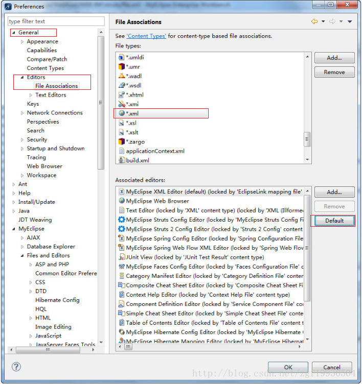

### 4.4. 关闭 updating indexes

Window -> Preferences -> Maven -> 禁用【Download repository index updates on startup】

### 4.5. 关闭自动 validation

validation有一堆，什么xml、jsp、jsf、js等等，没有必要全部都去自动校验一下，只是需要的时候才会手工校验一下，速度立马提升好几个档次

windows -> perferences -> validation，将 Build 下全部勾取消

如果需要验证某个文件的时候，可以单独去验证它。方法是：在需要验证的文件上点击右键 -> MyEclipse -> Run Validation

### 4.6. 去掉拼写检查（如果觉的有用可以不去）

拼写检查会给带来不少的麻烦，方法命名都会是单词的缩写，也会提示有错，所以最好去掉，没有多大的用处

在 eclipse 菜单栏，选择【Window】->【Preferences】，点击后在弹出的选项框中，找到【General】->【Editors】->【Text Editors】->【Spelling】，在右边的详细信息中，去掉【Enable spell checking】勾选框，然后点击 Apply 确认按钮。

### 4.7. 设置使用浏览器配置


### 4.8. 部分代码显示其他底色

当你的myeclipse调了背景色后，发现js部分的代码依然是白色的背景，看起来十分不方便，下面就叫你怎么单独更改js代码部分的背景色

依次点击Window --> Preferences --> Myeclipse --> Files and Editors --> javascript --> Editor --> Syntax Coloring。在上面框中选择 Background --> Script region background，然后点击旁边的color就可以修改页面javascript中的背景颜色了

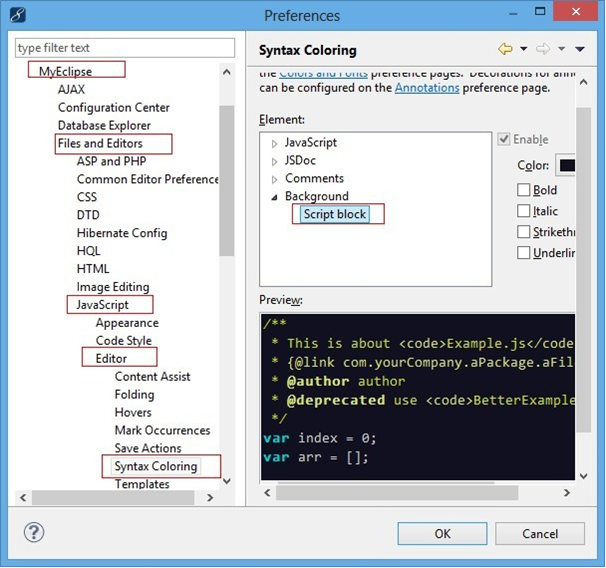

### 4.9. 定制工具栏

Window --> Customize Perspective


### 4.10. 设置不格式化注释

注释中写点带格式的文字，format后全乱了，解决办法如下：

Windows -> Preferces -> java -> Code Style -> Formatter -> Edit -> Comments

取消勾选 “Enable Javadoc comment formatting”、“Enable block comment formatting”、“Enable line comment formatting”

### 4.11. 配置 Eclipse 中的编译和运行环境

Eclipse 的运行版本要大于等于编译版本号：会出现bad version number版本问题

- 高版本的运行环境可以运行低版本编译的java文件
- 低版本的运行环境不能运行低版本编译的java文件

- 编译环境的配置：project右键 -> Properties -> Java Complier
- 运行环境的配置：project右键 -> Properties -> Java Build Path

## 5. 加快代码提示与取消空格上屏（重点）

### 5.1. 加快代码提示，根据需要可以修改CSS、HTML、JavaScript、XML

windows --> preferences --> 搜索“content assist”


在【Auto activation triggers for Java】输入框内是“.”，这就是为什么使用MyEclipse只有输入“点”的时候才有代码提示。

所以这里把“`.qwertyuiopasdfghjklzxcvbnm,:QWERTYUIOPASDFGHJKLZXCVBNM`”以及其他可以用到的字符都输入进去，这样当输入任何一个字母时，都会有代码提示了。

在【Auto activation delay(ms)】输入框内，`200`是代码提示的延迟毫秒数，改为“`0`”，即输入代码时，立刻获得代码提示

如果按上面设置，还没有提示，将Advanced里的该勾选的斗勾选


<font color=red>**总结：首先第一步中的作用是指当输入一个字母的时候eclipse就会马上联想相关的单词并显示出来，并且那些联想的单词总是跟着，如果觉得比较烦的话，就改为默认的点号。第二步中才是重点，作用是就是当用`alt+/`快捷键的时候会联想出来的。**</font>

### 5.2. 取消空格上屏

使用 Eclipse 与 MyEclipse 的代码提示功能时，按下空格键后 Eclipse 会自动将代码提示中的第一项上屏。这一点有时会变得相当讨厌，因为很多时候只是单纯的想要输入一个空格而已。然而这一特性是无法通过配置改变的。好在 Eclipse 是开源的，仍然可以通过修改相应的源代码来改变这一点。

下面先以 Eclipse 为例说明。首先，如果下载的 Eclipse 是 SDK 版本的，那么可以直接越过下面的一段。

如果没有 src 这个文件夹，说明使用的版本中没有带源代码，下面正好也是这种情况。源代码可以去这个地址下载（找了好久好久）

http://archive.eclipse.org/eclipse/downloads/


在页面上选择 Eclipse 版本的连接（例如使用的是4.4.2），然后在新页面中下载`eclipse-SDK-(*************).zip`，根据自己的需要选择合适的版本下载，大概200M左右。下载完成以后解压缩，在`.\eclipse\plugins\`文件夹下找到`org.eclipse.jface.text.source_3.9.2.v20141003-1326.jar`（这是对应使用的 Eclipse 版本的文件，实际请根据自己的版本进行选择），将这个文件复制到 Eclipse 安装目录下的.`\eclipse\plugins\`文件夹下，然后重新启动 Eclipse。重复上面的操作导入

---

如果 Eclipse 不是 SDK 版本的，强烈建议改为使用 SDK 版本的 Eclipse，因为 SDK 版的 Eclipse 附带了所有源码。如果不愿意使用 SDK 版，那么也可以从 http://www.eclipse.org/projects/listofprojects.php 获得下文所需的源代码，以本文为例，点击 Platform Text，会跳转到 project 页面，再点击 Clone on GitHub，即可下载到相应的源代码。

依次点击 `Window –> Show View –> Other…`，在弹出的对话框中再选择`Plug-in Development –> Plug-ins`：


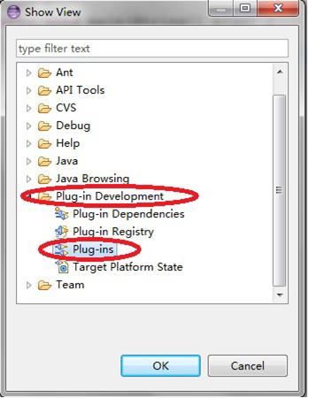

在 Plug-ins 中找到`org.eclipse.jface.text`，点击右键，选择 Import As –> Source Project


这时 eclipse 就会把该项目导入到workspace工作空间中了。展开该项目，在 src 目录中选择`org.eclipse.jface.text.contentassist.CompletionProposalPopup.java`文件：

在该文件中找到如下的代码(一般在1300-1350行之间)：

```java
case '\t':
  e.doit= false;
  fProposalShell.setFocus();
  return false;
```

将其改为：

```java
case '\t':
  e.doit= false;
  insertSelectedProposalWithMask(e.stateMask);
  break;
```

然后，在这段代码的下方，找到如下代码：

```java
if (contains(triggers, key)) {
    e.doit= false;
    hide();
    insertProposal(p, key, e.stateMask, fContentAssistSubjectControlAdapter.getSelectedRange().x);
}
```

将其第一行改为：

```java
if (key != 0x20 && key != '=' && key != ';' && contains(triggers, key)) {
    ....
}
```

经过以上修改，去掉了按下空格上屏和`=`上屏`,`上屏的功能，并将其改为按下 Tab 键上屏，相信这是符合多数人的习惯的，保存修改。

接下来要做的就是使用修改过的代码生成插件，并替换掉 Eclipse 本来的插件。在该工程上单击右键，选择`Export…`：


在弹出的对话框中选择 Plug-in Development –> Deployable plug-ins and fragments，点击 Next：

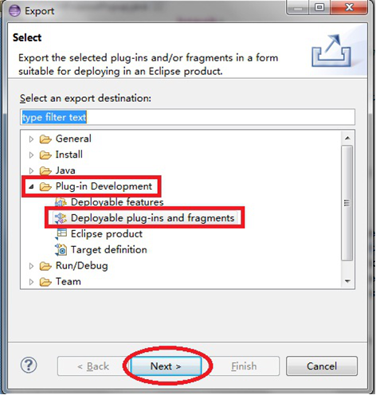

指定一个保存即将导出的 jar 包的位置，点击 Finish。


这时，在刚才指定的路径下会生成一个 plugins 文件夹，里面就是导出的 jar 包：


最后一步，定位到 Eclipse 安装目录下的 plugins 文件夹，使用这个刚生成的 jar 包替换掉原本的`org.eclipse.jface.text`包即，大功告成！现在，使用代码提示时按下空格键已经不会自动上屏了，而是使用 Tab 键来上屏。

对于 MyEclipse:

MyEclipse 的修改方法与 Eclipse 完全一样，用修改好的 jar 包替换掉 MyEclipse 自带的 jar 包即可，MyEclipse 中该 jar 包的位置是：其安装目录\Common\plugins。

需要额外注意的是 MyEclipse 中使用的 org.eclipse.jface.text 包的版本。如笔者使用的 MyEclipse 10.6 的 jface.text 的版本是 3.7.2，而 Eclipse Juno 使用的 jface.text 版本为 3.8.1。笔者试图用修改过的 3.8.1 版本的 jar 包替换掉 MyEclipse 自带的 3.7.2 的 jar 包，发现替换后的 MyEclipse 无法启动。无奈只能从网上重新下载了 3.7.2 版本的 Eclipse SDK，将里面的 jface.text 修改好之后替换道 MyEclipse 中，最终解决了问题

在 myeclipse 的安装目录中搜索 readme_eclipse.html 文件，它在 readme 文件夹下面双击打开，版本号就显示了 myeclipse 中的 eclipse 版本号：如果安装目录是D:/MyEclipse ，那么进入到这个目录，按 ctrl + F 快捷键 ，输入名字：readme_eclipse.html ，按 enter 进行搜索，双击搜索到的文件就能显示 eclipse 版本号了。如下图：


### 5.3. eclipse SDK 版本

上面的SDK不是用来使用，只是为了拿到里面的源代码。只为了获得`org.eclipse.jface.text`的源代码去修改取消空格上屏而已。例如：

- eclipse-SDK-4.3.1-win32-x86_64 对应 MyEclipse2014
- eclipse-SDK-4.7.3-win32-x86_64 对应 eclipse-jee-oxygen-3-win32-x86_64
- eclipse-SDK-4.8-win32-x86_64 对应 eclipse-jee-photon-R-win32-x86_64

> 更新版本详见前面章节《Eclipse 各版本号》

## 6. eclipse 工作空间配置导出

### 6.1. 方法一：使用 eclipse 的导出功能

工作目录中右键选择Export -> General -> Preference，这样可以导出epf文件，新的工作空间中可以用Import导入该配置文件，这个方法的确可以导入绝大多数的配置，但是并不全，导入后会丢失很多配置


### 6.2. 方法二：在切换工作空间的时候选择 other -> copy setting


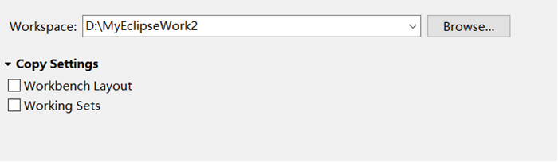

### 6.3. 方法三：推荐使用这种方法，导入的最全

将`workspace/.metadata/.plugins/org.eclipse.core.runtime`中的`.settings`文件夹拷贝出来，里面就是所有的配置文件，新建工作空间的时候将该`.settings`文件夹替换掉新工作空间中的`.settings`文件夹即可。另外导出界面上的工具栏对话框布局等：`.metadata.plugins\org.eclipse.e4.workbench.swt`将该文件夹保存起来即可


## 7. Eclipse 导出 API 帮助⽂档

eclipse 使用时，可以配合文档注释，导出对类的说明文档，从而供其他人阅读学习与使用。通过使用文档注释，将类或者方法进行注释用`@`简单标注基本信息。如`@author`作者、`@version`代码版本、`@param`方法参数、`@return`方法返回值等。

## 8. eclipse Jar 包操作

### 8.1. 导出 Jar 包步骤

工程右键 -> Export -> Java -> Jar file -> Next -> 选择要导出的类 -> 选择导出的路径 -> Finish


### 8.2. 导入 Jar 包步骤

1. 在项目中新建一个文件夹：lib（类库）
2. 将要使用的第三方jar拷贝到lib目录下
3. 选中jar包，右键 Build path --> Add to Build path


### 8.3. 导入第三方源码


如果源代码是以文件夹形式存在，则选择导入Folder


### 8.4. eclipse 自定义 library jar 包步骤

右键点击项目 --> Build Path --> Add Libraries --> User Libraries


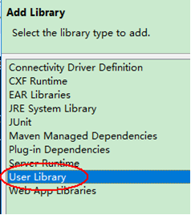

如果想新建新的Libraries，则点击`User Libraries…`。如果之前已经新建好了，直接勾选需要的后，点击Finish加载进项目即可。

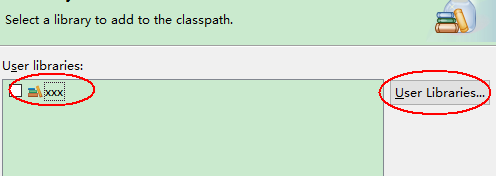

新建Library --> Add External JARs --> 选需要的jar包


使用：新建项目后，根据需要选择自定义Library。右键项目 --> Build Path --> Add Libraries --> User Libraries --> 勾选需要的Library --> Finish

删除Library：选中要删除Lib包 --> Build Path --> Remove from Build Path


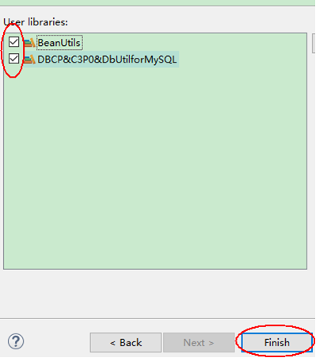

## 9. Tomcat 与 Eclipse 连接

打开Eclipse --> 点击Eclipse菜单栏【Window】-->【Preferences】，之后出现【Preferences】对话框面板，在对话框面板左边栏目里找到【Sever】选项点击下出现子选项【Audio】、【Launching】、【Overlays】、【Profiles】和【Runtime Environment】，这是选择点击【Runtime Environment】项，然后在原来打开的【Preferences】面板
右面看到【Sever Runtime Environment】，选择【Add】之后显示以下界面：


在当前界面的面板【Apache】下面选择你对应安装的Apache Tomcat版本，点击【`Next>`】，然后出现对话框：

然后在【Tomcat installation directory】下面的空白文本框里面输入你对应安装的tomcat目录或者点击右边的【`Browse...`】来选择tomcat安装目录，例如：【D:\xampp\tomcat】，继续点击【Finish】就OK了。

## 10. 创建代码模版

点击Eclipse菜单栏【Window】-->【Preferences】 --> 搜索关键字“Templates”

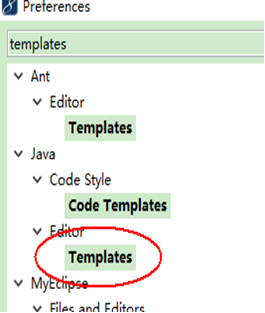


## 11. 设置 JSP 页面的编码

Eclipse 的首选项 --> 搜索 jsp，找到 JSP Files 选择指定的编码，如UTF-8，点击 Apply 后再点击 OK 保存配置。可以分别设置页面编码、页面内容编码


## 12. eclipse 中批量修改 Java 类文件中引入的 package 包路径

- 方法一：Ctrl+h --> file serach --> 输入原包名(类型为`*.java`) --> Replace --> 找到后输入要替换的包名 然后自己选择是全部替换还是部分替换。通过该方法也可以批量修改配置文件。
- 方法二(推荐)：直接修改出错的类所在的包的名称再改回来，这样就可以统一修改所有出错的类的package包名称

## 13. 出现 "Repository registry initialization" 问题的解决办法

在更换了 eclipse 版本后，选择之前的工作空间时，可能会出现 An internal error occurred during: "Repository registry initialization". 的问题时，删除`.metadata/.plugins/org.eclipse.m2e.core/nexus/` 的目录，然后再重启 Eclipse，重新编译一下 maven 项目

## 14. eclipse 关于 Spring 相关配置

### 14.1. Spring 配置文件中提示配置信息

> 本小节是针对旧版本 eclipse 对于 spring xml 配置文件无提示的问题。配置跟 hibernate 和 struts2 创建 xml 约束一样的操作

打开【Preferences】 -> 【XML Catalog】 -> 【Add...】


- Location：选择【spring-beans-4.2.xsd】文件所在路径
- Key type：选择Schema location
- Key：填写【http://www.springframework.org/schema/beans/spring-beans.xsd】


> <font color=red>**注：约束文件的路径在【\spring-framework-4.2.4.RELEASE\schema\beans】，如果使用其他类型，就根据类型选择不同的文件夹**</font>

### 14.2. 向 xml 文件中增加约束

1. 切换到Design视图，右键点击 Beans 标签 【Edit Namespaces】

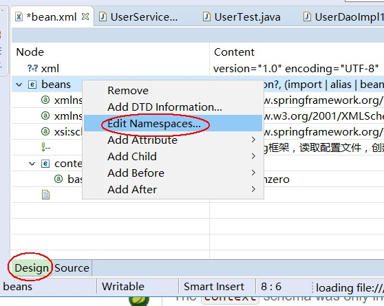

2. 点击 add 新增约束


3. 选择 XML catalog，选自己创建的 xsd 模版
    - Prefix: 填写命名空间
    - Namespacee Name: 将后面文件名字删除


### 14.3. 创建 xml 文件时引入多个约束

1. 先选择导入一个基础的约束
2. 再点击 add 新增一个约束（之后操作与生成文件增加约束操作一样，命名也一致）


## 15. 常用插件安装与插件卸载

### 15.1. Spring Tool Suite 4 / 3.9.8

Spring Tool Suite(STS) 是一个基于 Eclipse 针对 Spring 应用量身定制的开发环境。提供了开发 Spring 应用必须的编码、调试、运行和部署功能。STS 在最新的 Eclipse 发布版本基础上集成了 Pivotal tc 服务器、Pivotal Cloud Foundry、Git、Maven、AspectJ 等必要的工具。<font color=red>**两个版本都安装**</font>


安装：Help->Eclicpse Marketplace，搜索 spring-tool-suite，点击install

查看是否安装成功：Window --> Preferences 之后出现Spring选项说明已经安装成功。


一、配置`*.xml`默认打开方式

打开Eclipse-->偏好设置，如下图：

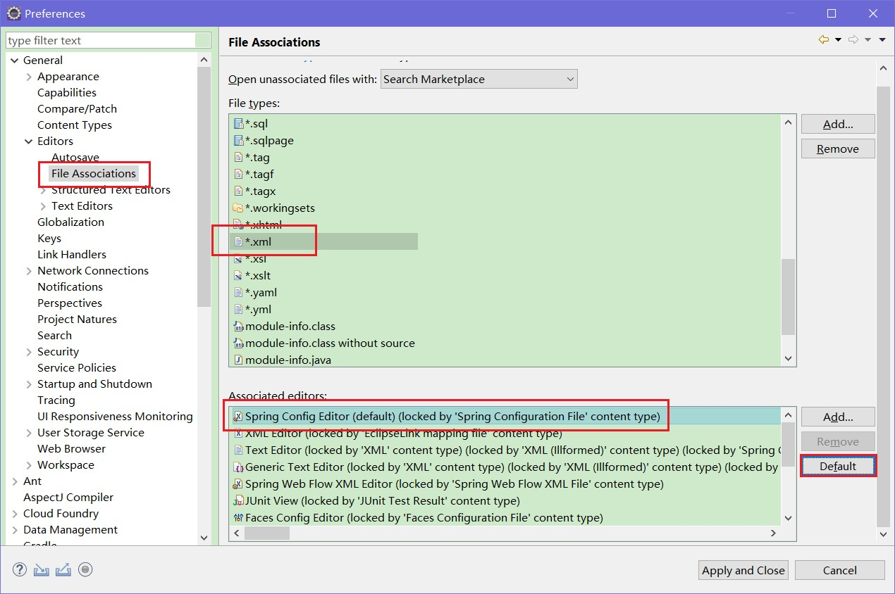

找到File Associations，在File types中找到`*.xml`项，如果没有就点击Add来添加，选中`*.xml`然后在Associated editors中选中Spring Config Editor点击右边的Default就可以了

二、新建spring的xml配置文件

File --> new --> other,然后输入spring，选中spring Bean Configuration File


选中spring约束类型，然后finish即可完成，spring配置文件。


### 15.2. Lombok插件

Lombok 是一种Java实用工具，可以帮助开发人员消除Java的冗长，具体看 lombok 的官网：http://projectlombok.org/

安装步骤：

1. 下载 lombok.jar 包，双击安装，选择 eclipse 的目录


2. 检查 eclipse.ini 所在文件目录下是否有lombok.jar包
3. 打开 eclipse.ini，是否有以下代码并保存：


4. 重启 eclipse
5. 右键点击 project --> clean 清理项目

### 15.3. 卸载插件

在菜单栏中点击【help】-【Eclipse MarketPlace】。点击Installed标签页，选择需要卸载的插件


确认可以卸载


### 15.4. 查看eclipse安装的插件

用于查看安装的那些插件与卸载安装


