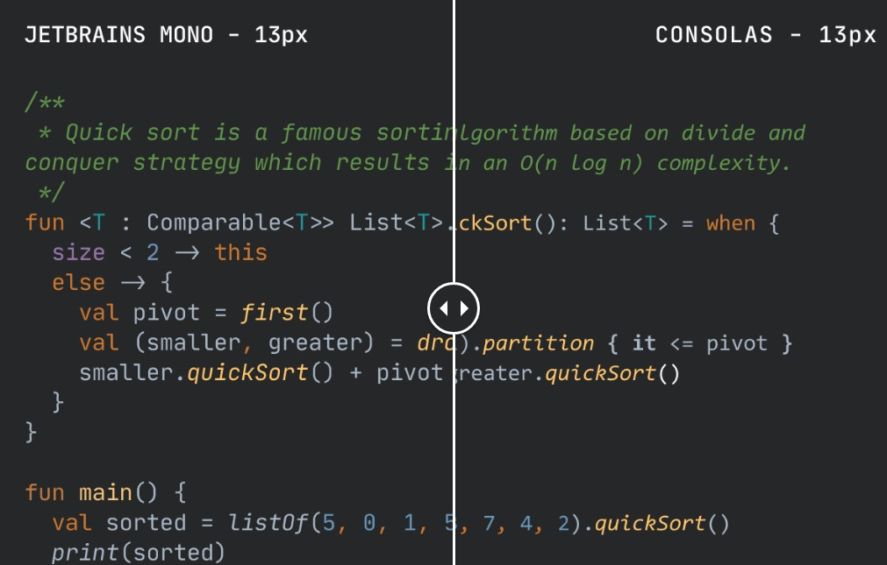

> 个人常用的软件工具汇总推荐与教程

## 1. 优质精选的最佳应用程序及工具列表

- [Awesome-Windows GitHub](https://github.com/Awesome-Windows/Awesome/blob/master/README-cn.md)
- [Awesome-Linux-Software GitHub](https://github.com/luong-komorebi/Awesome-Linux-Software/blob/master/README_zh-CN.md)
- [Awesome-MacOS GitHub](https://github.com/jaywcjlove/awesome-mac/blob/master/README-zh.md)

## 2. 开发软件

### 2.1. IDE

- [IntelliJ IDEA](https://www.jetbrains.com/idea/) - the Leading Java and Kotlin IDE. The IDE that makes development a more productive and enjoyable experience
- [Visual Studio Code](https://code.visualstudio.com/) - Code editing. Redefined. Free. Built on open source. Runs everywhere.
- [eclipse](https://www.eclipse.org/) - 经典 Java 开发工具

## 3. 系统管理类

### 3.1. Total Commander

- Total Commander 官网 https://www.ghisler.com/index.htm
- Total Commander 飞扬时空版下载
   - [蓝奏云](https://www.lanzoui.com/b405514/)
   - [百度网盘](https://yun.baidu.com/s/1cp9zuY#list/path=%2F)

### 3.2. TrafficMonitor

TrafficMonitor 下载（Gitee）：https://gitee.com/zhongyang219/TrafficMonitor/releases

### 3.3. Geek Uninstall

> Geek Uninstall 是一款高效快速，小巧便携，完全免费的程序卸载神器。不仅可以清理掉一些顽固软件(如一些流氓软件)，同时还可以最大限度清理电脑垃圾缓存。

官网：https://geekuninstaller.com

### 3.4. Everything

> 使用教程：
>
> - 官方帮助(中文)：[Searching - voidtools](https://www.voidtools.com/zh-cn/support/everything/searching/)
> - [《高效搜索神器Everything最全使用技巧(一篇看全)及详细功能帮助教程》](https://zhuanlan.zhihu.com/p/409783518)

#### 3.4.1. 定义热键

打开工具菜单，点击选项 -> 点击快捷键页面 -> 选择热键方式 -> 按下新的热键组合 -> 点击确定

> Tips: Everything 必须后台运行时热键才能工作。无法覆盖已存在热键。

禁用 Windows 默认热键，例如 Win + F：

- 打开运行面板输入 `regedit`，打开注册表编辑器

```
HKEY_CURRENT_USER\Software\Microsoft\Windows\CurrentVersion\Explorer\Advanced
```

- 创建新字符串值 `DisabledHotkeys`
- 设置 `DisabledHotkeys` 数据为想要释放的字母，例如：F
- 重启计算机后，在 Everything 中应用释放的热键 Win + F

#### 3.4.2. 基础搜索

要将结果限制为某个驱动器，只需搜索该驱动器，例如，要查找`D:`驱动器上的文件和文件夹，请搜索：

```
d:
```

包含路径限制结果到一个文件夹，例如在文件夹 D:\Downloads 中查找文件和文件夹，搜索：

```
d:\downloads\
```

##### 3.4.2.1. 示例

- 查找空文件夹：`empty:`
- 查找重复文件：`dupe:`
- 使用正则语法搜索：通过“搜索”菜单选择“使用正则表达式”或直接按下 Ctrl+R 组合键均可启用此功能。

```
a|b a或b
gr(a|e)y 匹配 gray 或 grey
. 任一字符
[abc] 任一字符：a或b或c
[^abc] 任一字符，但不包括a、b、c
[a-z] 从a到z之间的任一字符
[a-zA-Z]从a到z，及从A到Z之间的任一字符
^ 文件名开始
$ 文件名结束
* 前一项内容重复0或多次
? 前一项内容重复0或1次
+ 前一项内容重复1或多次
{x} 前一项内容重复x次
{x,} 前一项内容重复x或更多次
{x,y} 前一项内容重复次数介于x和y之间
```

## 4. 文字编辑器

### 4.1. VNote

- VNote 官网： https://app.vnote.fun/zh_cn/
- VNote Github 仓库： https://github.com/vnotex/vnote
- VNote 下载 
   - [百度网盘](https://pan.baidu.com/share/init?surl=Fou1flmBsQUQ8Qs9V_M6Aw#list/path=%2F)  提取码：note
   - [天翼云盘](https://cloud.189.cn/web/share?code=Av67NvmEJVBv)

### 4.2. Typora

> Typora 是一款 Markdown 文档编写工具，整个软件的界面感非常简洁，可以边写边预览实时编排效果，同时支持自定义主题。

- Typora 官网（国内无法访问）： https://typora.io/
- Typora 中文主页（非官方）： https://typoraio.cn/

### 4.3. Notepad++

> Notepad++ 是一款完全免费的源代码编辑器，支持多种编程开发语言。Notepad++ 底层是用纯 C++ 编写的，同时结合纯 Win32 API 和 STL，保证了更高的执行速度和更小的程序内存。通过在不损失用户友好性的情况下尽可能多地优化程序运行效率。**但因软件作者个人原因，不推荐使用！**

- 官网： https://notepad-plus-plus.org
- Github 仓库： https://github.com/notepad-plus-plus/notepad-plus-plus

### 4.4. Rime 输入法设置

特殊字符输入

- `zzbd`：中文对符号，如：“”、《》、『』
- `zzde`：А、
- `zzdl`：Ⅰ、Ⅳ
- `zzds`：⒈、⒉
- `zzdw`：单位符号
- `zzdx`：ΔΞΠ5. - `zzfs`：⑸⒀
- `zzhb`：货币
- `zzjp` & `zzpj`：日文
- `zzpp`：中文部首
- `zzpy`：中文拼音
- `zzsx`：数学符号
- `zzts`：特殊符号
- `zzxe`：
- `zzxl`：
- `zzxx`；
- `zzys`
- `zzzs`
- `zzzy`：台湾注音

### 4.5. 常用字体

#### 4.5.1. Cascadia Code

> 下载地址：https://github.com/microsoft/cascadia-code

微软开源了一套新的字体 Cascadia Code。


Cascadia Code 是微软在 5 月份的 Build 大会上宣布推出的等宽字体，微软介绍它是与新的终端 Windows Terminal 一起开发的，官方建议将其与终端应用和 VS、VS Code 等文本编辑器一起使用。Cascadia Code 为命令行和代码编辑器提供了全新的体验，并且它还支持编程连字（Programming Ligatures），就是在编写代码的时候，可以组合字符创建新的字形，这对于代码的可读性和呈现后的用户友好度都是一种很好的机制，同时这也增强了 Windows Terminal 的现代外观。需要注意的是，如果使用的是 VS Code，则必须在设置中启用连字功能才能生效。


字体预览


#### 4.5.2. Fira Code

> 下载地址：https://github.com/tonsky/FiraCode

由 Mozilla (FireFox 的东家) 推出的「Fira Code」就是一款编程连字字体，同样也是一款非常值得推荐使用的优秀代码等宽字体~！！！


#### 4.5.3. Monaco

Mac 的默认字体，好像也只有Mac上有。小字号的时候表现不错，而且再大些也不寒碜。


#### 4.5.4. Source Code Pro

Source Code Pro 是由大名鼎鼎的 Adobe 公司发布的一款开源且完全免费的等宽编程字体，它非常适合用于阅读代码，支持 Linux、Mac OS X 和 Windows 等操作系统，而且无论商业或个人都可以免费使用，相当厚道。这款字体和微软的 Consolas 一样均定位于“编程字体”

- 查看网址：https://adobe-fonts.github.io/source-code-pro/
- 下载地址：https://github.com/adobe-fonts/source-code-pro/


#### 4.5.5. JetBrains Mono

> 官网：https://www.jetbrains.com/lp/mono/

JetBrains 推出了一款名为 "Mono" 的字体。在设计 Mono 字体之初，团队充分考虑了长时间查阅代码可能导致的眼睛疲劳问题，以及受影响的因素，比如字母的大小和形状、空间量、自然等宽平衡、不必要的细节、连字、以及难以区分的符号或字母（l 和 I）和连字等。Mono 字体有许多优点，但它支持的 143 门语言中没有中文，因此**对于中文的显示支持可能不会太好**、Mono 字体还是一款开源且免费的字体，使用者可免费用作任何商业或非商业用途。


它和 Consolas 字体的区别



#### 4.5.6. Input Mono

> 官网：https://input.djr.com/

Input 可以高度可定制，它有 4 种宽度版本，名称无后缀的最宽，Narrow、Condensed、Compressed 则依次变窄（个人最喜欢 Narrow），还可以通过 OpenType 特性调整风格。


Input 不是一个字体，而是一个家族；除了等宽版本，还有两种比例字体：无衬线体 Input Sans 和衬线体 Input Serif。它们和 Input Mono 有类似的骨架，但因为不同的宽度和笔画特征另有一番风格。

#### 4.5.7. 其他字体

##### 4.5.7.1. 齐伋字体

> 官网：https://github.com/LingDong-/qiji-font

齐伋体 (QIJI Font) 是提取自明代木版印刷书籍（凌闵刻本）的字体，亦称作「令东齐伋体」。齐伋体笔画风格书法特征浓郁，比常规的明朝体更具韵律感，富有人文气息，非常适宜用于需要展现人文感、手作感、古拙感的场景。这款字体基于思源宋体改造而来，对中文汉字支持极佳。齐伋体展示效果：


##### 4.5.7.2. 霞鹜文楷 (LXGW WenKai)

> 官网：https://github.com/lxgw/LxgwWenKai

霞鹜文楷是一款开源中文字体，名字取自于王勃的《滕王阁序》——“落霞与孤鹜齐飞，秋水共长天一色”。霞鹜文楷衍生自开源字体 Klee One，后者是一款日文的教科书字体，由日本著名字体厂商 FONTWORKS 打造，兼有仿宋和楷体的特点。霞鹜文楷基于 Klee One 补全了简繁常用字。


##### 4.5.7.3. 思源黑体

> 官网：https://github.com/adobe-fonts/source-han-sans

开发商：Google & Adobe。思源黑体（也称作 Source Han Sans 或 Noto Sans CJK）是 Google 和 Adobe 合作打造的开源字体，采用了开源字体许可证 SIL Open Font License，免费且可商用。“思源” 二字取自于成语 “饮水思源”。

思源黑体支持简体中文、繁体中文、日文、韩文以及英文；提供了 ExtraLight、Light、Normal、Regular、Medium、Bold 和 Heavy 共 7 种字体粗细，可以满足不同场景下的文字显示需求。适合设计师、开发者，以及普通用户使用。思源黑体展示效果：


##### 4.5.7.4. 思源宋体

> 官网：https://source.typekit.com/source-han-serif/cn/

开发商：Google & Adobe。继 “思源黑体” 后，Adobe 和 Google 再度联手创造了 “思源宋体”（称作 Source Han Serif 或 Noto Serif CJK）。思源宋体也采用了开源字体许可证 SIL Open Font License，免费且可商用。

思源宋体同样包含简繁中文以及日韩四种汉字写法和 ExtraLight、Light、Regular，Medium、SemiBold、Bold 和 Black 七种粗细字重，每种粗细字重分别收录了 65535 个字形，七种字重共收录高达 458745 个字形，可以满足不同的设计需求。思源宋体展示效果：


## 5. 音乐软件

### 5.1. foobar2000

- foobar 2000 官网 | https://www.foobar2000.org/
- foobar 2000 asion 汉化版 
   - asion's blog | https://www.cnblogs.com/asionwu
   - [百度网盘](https://pan.baidu.com/s/1wVbB24nSlwiHJWzJOagF9g?pwd=fb2k) 提取码：fb2k
   - [蓝奏云](https://wwi.lanzoup.com/b0jitwwf) 密码：fb2k
- foobar 2000 智享阁（YeYo）版本
   - 网页： https://www.esnpc.com/foobar2000-20-simplified-chinese-version/
   - 文件名 FB_2.0_x86 开头的是32位，FB_2.0_x64 的是64位，自行选择下载
   - [百度网盘](https://pan.baidu.com/s/1iOPyEPf_pcZDbl3AbWSEYQ) 提取码: 6rgv
   - [阿里云盘](https://www.aliyundrive.com/s/6Ly1isy9bwD) 提取码: 4p6o
   - [天翼云盘](https://cloud.189.cn/web/share?code=mYvAnivuIbIv) 访问码：4owd

#### 5.1.1. 不支持 APE 文件格式的解决方法

这是因为缺少相应的播放插件，需要安装一个插件--monkey's audio(ape)才可以播放。foobar从某个版本起，把原来默认内置的一些插件去掉了，原因不明，可能是为了控制安装包的体积。

插件下载地址：http://www.foobar2000.org/components/view/foo_input_monkey

点击这个页面的 Download，下载后解开压缩包得到 foo_input_monkey.dll 文件。把这个文件放到foobar安装目录里的 compontents 文件夹里。重新打开foobar后就可以播放APE文件了。	

### 5.2. 洛雪音乐助手桌面版

洛雪音乐桌面版

- Github 仓库： https://github.com/lyswhut/lx-music-desktop/releases
- [蓝奏云](https://www.lanzoui.com/b0bf2cfa/) 密码：glqw

### 5.3. Listen 1

Listen 1 音乐播放器主页： https://listen1.github.io/listen1/

windows 桌面版缓存目录：`%APPDATA%\listen1\Cache`

### 5.4. 音乐下载

- 下歌吧音乐下载平台 https://music.y444.cn/#/
- MyFreeMP3： https://tools.liumingye.cn/music/?page=searchPage#
- MusicENC： https://www.musicenc.com/
- Musicbed： https://www.musicbed.com/
- [好歌多](https://www.haogeduo.com/)

## 6. 看图软件

### 6.1. FastStone 系列软件

FastStone 系列软件是个人免费、商业收费，一共有4款软件。

- FastStone Image Viewer 这个是 FastStone 的主要软件，功能强大。
- FastStone Capture 截图软件，个人认为最大的优点是可以截滚屏的图。
- FastStone MaxView 纯粹的看图软件，速度奇快无比。
- FastStone Photo Resizer 图片文件的转换/处理软件。

FastStone 官方网站： http://www.faststone.org/

#### 6.1.1. 全系列破解器（更新于2023.05.04）

解压 Keygen.7z 选择相应的 FastStone 的产品，随便输入一个用户名，然后生成相应的注册码即可。

#### 6.1.2. FastStone Image Viewer（目前更新至7.8版本）

官方网站（无法打开）： https://www.faststone.org/FSViewerDetail.htm

官方简体中文版下载地址：（官网无法打开，但下载地址可以下载）

- 安装版 :
    - https://www.faststonesoft.net/DN/FSViewerSetup78.zip
    - https://www.faststonesoft.net/DN/FSViewerSetup78.exe
    - https://www.faststone.org/DN/FSViewerSetup78.exe
- 便携版 : https://www.faststonesoft.net/DN/FSViewer78.zip

> 建议使用迅雷或IDM下载

家庭用户可免费使用，商业使用须注册。注册及设置方法：如果您使用的旧版如 7.7 版已授权注册为商业版，可以将旧版如 7.7 商业版注册文件及设置文件 `FSSettings.db`，复制到 7.8 版 FSViewer 目录中就能注册 7.8 版并保持旧版如 7.7 版的设置，不必重新注册和设置。

#### 6.1.3. FastStone Capture（目前更新至10.2版）

官网便捷版下载地址（好像暂无安装版）:

- https://www.faststonesoft.net/DN/FSCapture102.zip

> 最新版激活注册码 (更新于2023-09-10)
>
> - 注册名：bluman
> - serial/序列号/注册码：VPISCJULXUFGDDXYAUYF
> - 注册名：microsoft
> - serial/序列号/注册码：WYZQU-RCMZR-KETRH-PKZGN

#### 6.1.4. FastStone MaxView（目前更新至3.4版）

官网安装版下载地址:

- https://www.faststonesoft.net/DN/FSMaxViewSetup34.exe

#### 6.1.5. FastStone Photo Resizer（目前更新至4.4版）

官网便捷版下载地址（好像暂无安装版）:

- https://www.faststonesoft.net/DN/FSResizer44.zip

## 7. 网络资源

### 7.1. 电子书

#### 7.1.1. ZLibary - 最大的电子书下载

- 官方网站： https://singlelogin.re/
- 官方桌面版下载： https://zh.go-to-zlibrary.se/#desktop_app_tab

> 以下是国内镜像

ZLibary 网站镜像唯一入口： https://www.zhelper.net/

> 注：地址经常换，镜像站/公用账号每日更新。本网页本身不具备任何搜索或者下载功能，需要搭配合适的查询接口（API）进行使用 直接访问将显示**无可用API**。

- [zhelper Search Page 搜索界面 🔍](https://search.zhelper.net/?%5B%7B%22name%22:%22Ylibrary%22,%22url%22:%22https://api.ylibrary.org%22,%22type%22:%22full%22,%22sensitive%22:false,%22detail%22:true%7D%5D) - Ylibrary 离线书库
- [Zlibrary 最新地址/入口](https://5w.fit/zkmgc) - 5w Short Links（短链接生成器）
- [zBook](https://zbook.eu.org/)
- https://zlibrary-global.se
- Z-Library https://zlibrary-east.se
> 如果网址失效，可以通过导航网站重新获取。 https://zlib.shop/


#### 7.1.2. 国内篇

- [yibook](https://nav.yibook.org/) - 电子书搜索网站导航
- [SoBooks](https://sobooks.net/) 图书下载网站是本人最喜欢的一个，它不仅书的种类齐全，而且质量也是相当的高，长期这里获取资源让我受益匪浅。每本书都可以获取百度网盘、微盘等下载站链接，直接下载或者保存网盘即可。
- [鸠摩搜索](https://www.jiumodiary.com/) - 书籍类的搜索引擎，搜索到书籍后会有下载链接，直接网盘保存即可。
- [超星读书](http://book.chaoxing.com)，专业知识电子书
- [图灵社区](https://www.ituring.com.cn)，专为码农提供的电子书下载网站，有些是需要付费的，有些是免费的
- [莫若书单](https://www.mrsd.top/) - epub电子书、kindle电子书资源下载
- [书籍知识库](https://www.zhishikoo.com/) - 优质mobi,azw3,TXT,PDF,epub格式电子书分享站
- [跪读网](https://orzbooks.com/) - 跪读电子书 | 每天都分享优质电子书免费下载
- [Freembook](https://freembook.com) - 一个快捷的电子书搜索引擎，提供了百度网盘秒传和直接转传的方式。
- [无名图书(book123)](https://www.book123.info/) - 提供免费电子书下载的网站，界面非常简洁，广告也少，下载非常方便。缺点是格式单一，一本书只提供一个格式。
- [Lore Free](https://ebook2.lorefree.com) - Lore Free 致力于让每个人都能自由地获取到知识，是一个基于区块链的电子书下载站，未登录状态下，每天有 3 个下载额度（包括电子书和论文）登陆较复杂默认的额度足以满足日常需求。
- [libgen](https://libgen.gs/index.php) - libgen 与 Lore Free 类似同样是使用 IPFS 区块链来进行图书存储。
- [thefuture 书籍搜索](https://bks.thefuture.top) - thefuture 是一个电子书搜索引擎，提供了蓝奏网盘等资源的索引。
- [知搜](https://zhiso.top) - 知搜是一个电子书搜索引擎，雅书是一个下载站，两者的资源均通过城通网盘分享。
- [雅书](https://yabook.org)
- [书格](https://new.shuge.org/) - 书格是一个免费的古籍下载站，由于资源都是些人文古籍类，所以资源非常小众，网站不错可当备用。
- [找书网_图书信息搜索平台！](https://findbooks.eu.org/) - 找书网的资源相对较全，缺点是只能使用秒传下载，不会使用秒传或者没有百度网盘的不推荐这个网站。
- [熊猫搜书](https://xmsoushu.com/#/) - 熊猫搜书聚合了鸠摩搜书、Z-library等多个搜书网站的资源。缺点是下载程序比较繁琐，需要多次跳转页面。
- [奇妙搜索](https://www.magicalsearch.top/main) - 奇妙搜索主要是搜网盘上面的电子书，不止是电子书，其他资源也可以轻松获取。
- [书伴](https://bookfere.com/) - 书伴又称Kindle人社区，以前图书资源很多，后期整顿以后少了很多，下载的图书格式也大多是awz3，只能适配Kindle等电子阅读器，需要转换一下才能在电脑或者其他电子设备上阅读。
- [中国哲学书籍电子化计划](https://ctext.org/zh) - 很小众的细分电子书领域。
- ~~[ePUBee 电子书库](http://cn.epubee.com/books/)，电子书的类型非常的全面，而且技术类电子书质量比较高，流行的畅销书都可以在这下载到。~~
- ~~[epubw](https://epubw.com)，每日都会有电子书更新，通过网盘下载~~

#### 7.1.3. 国外篇

- [安娜的档案](https://zh.annas-archive.gs/) - 🔍影子图书馆搜索引擎：书籍、论文、漫画、杂志。 ⭐️ Z-Library、Library Genesis、Sci-Hub。 ⚙️ 通过开源代码和数据完全容灾。网站需要代理才能登陆，国内受限。
- [B-OK](https://b-ok.cc) 号称世界最大的电子图书馆，喜欢看英文原版的推荐使用，全英文网站，查找当然也需要英文。
- [Library Genesis](http://gen.lib.rus.ec)，是俄罗斯人做的超强英文电子书库。收录各大下载网站，书籍、期刊、文献储存量惊人。和B-OK.xyz不同在于支持更多电子书格式，但会有付费资源。
- [Libgen Online Library](https://libgen.pw)，电子书版本多，下载方便，格式也比较全。
- [PDFDrive](https://www.pdfdrive.com)，英文原版书
- [BookSC](https://booksc.org)，是 Z-Library 项目的一部分。世界上最大的电子书图书馆。还支持指定书中全文搜索
- [Manybooks](https://manybooks.net)，免费提供数字格式的图书馆

#### 7.1.4. Github 仓库分享

- [编程电子书分享(github)](https://github.com/hello-go-maker/cs-books) - 分享一些从网上整理的计算机类的电子书籍，包括Java电子书籍（Java基础，Java多线程，spring、springboot、springcloud，分布式，微服务等）、Python，Linux，Go，C，C++，数据结构与算法，人工智能，计算机基础，面试，设计模式，数据库，前端等书籍

### 7.2. 资源搜索下载

- [盘他一下](https://panother.com/) - 一个支持百度网盘和阿里云的在线网盘资源搜索引擎，找到搜索的内容后，需要微信扫码登录小程序，网盘虽然是完全免费的，但是搜索获取资源，会有积分限制
- [学搜搜(酷搜kolsou)](https://www.zhaokeya.com/) - 考研、考级、考证、IT教程等学习资料搜索引擎，网站资源主要来自百度网盘
- 综合网盘搜索神器。网站收录了数十款百度网盘搜索引擎、百度云网盘搜索工具、百度云网盘解析工具，简单好用。提供影视、书籍、软件等资源推荐以及整合信息。
    - [超能搜 - 百度网盘搜索神器](https://www.chaonengsou.com/)
    - [万网搜 - 资源搜索聚合神器](https://www.wanwangsou.com/)
    - [猫狸盘搜 - 阿里云盘搜索神器](https://alipansou.com/)

### 7.3. 在线视频网站

- **旋风视频 **官方网址： https://miao101.com/
- **茶杯狐 **官方网址： https://www.dajin1.com/
- **电影推荐-MVCAT **官方网址：https://www.mvcat.com/
- **影猫的仓库 **官方网址：https://search.ymck.me/
