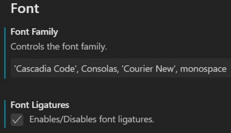
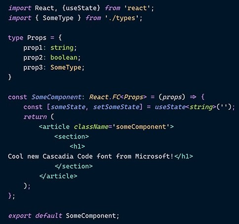
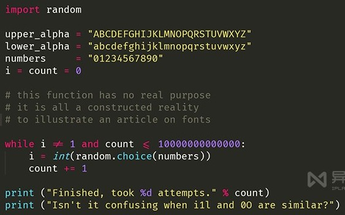
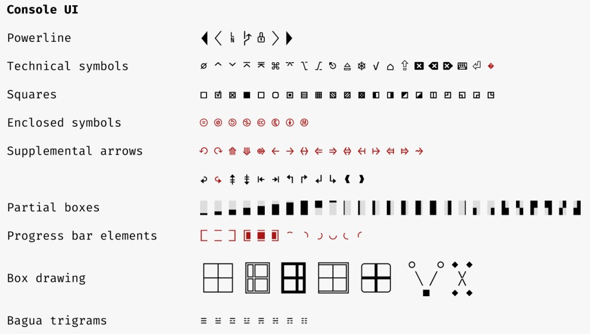
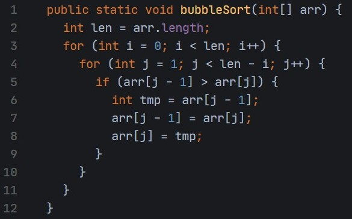
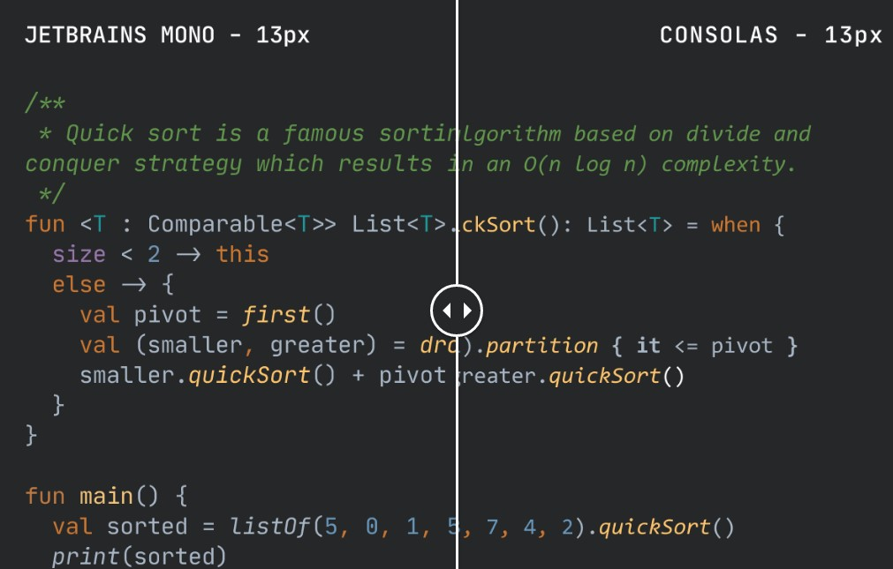
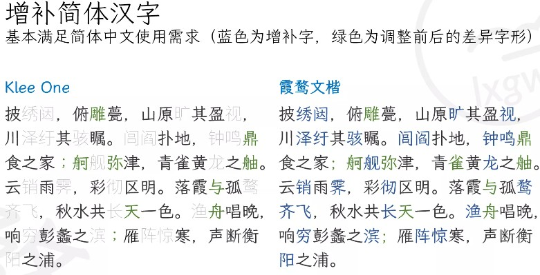
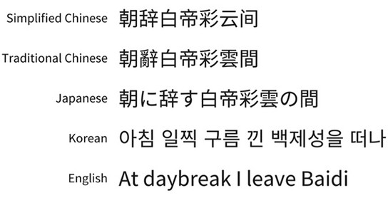
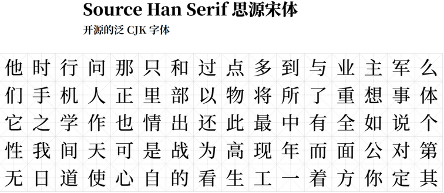

# 优质精选的最佳应用程序及工具列表

- windows GitHub 网址：https://github.com/Awesome-Windows/Awesome/blob/master/README-cn.md
- Linux GitHub 网址：https://github.com/luong-komorebi/Awesome-Linux-Software/blob/master/README_zh-CN.md
- MacOS GitHub 网址：https://github.com/jaywcjlove/awesome-mac/blob/master/README-zh.md

# 开发软件汇总

## 1. IDE

- [IntelliJ IDEA](https://www.jetbrains.com/idea/) - the Leading Java and Kotlin IDE. The IDE that makes development a more productive and enjoyable experience
- [Visual Studio Code](https://code.visualstudio.com/) - Code editing. Redefined. Free. Built on open source. Runs everywhere.
- [eclipse](https://www.eclipse.org/) - 经典 Java 开发工具

# 常用软件汇总

> 个人常用的软件工具汇总

## 1. Windows 系统管理软件

### 1.1. Total Commander

- Total Commander 官网 https://www.ghisler.com/index.htm
- Total Commander 飞扬时空版
    - [蓝奏云](https://www.lanzoui.com/b405514/)
    - [百度网盘](https://yun.baidu.com/s/1cp9zuY#list/path=%2F)

### 1.2. TrafficMonitor

TrafficMonitor Gitee：https://gitee.com/zhongyang219/TrafficMonitor/releases

### 1.3. Geek Uninstall

> Geek Uninstall 是一款高效快速，小巧便携，完全免费的程序卸载神器。不仅可以清理掉一些顽固软件(如一些流氓软件)，同时还可以最大限度清理电脑垃圾缓存。

官网：https://geekuninstaller.com

## 2. 文字编辑器

### 2.1. VNote

- VNote 官网 | https://app.vnote.fun/zh_cn/
- VNote Github | https://github.com/vnotex/vnote
- VNote 下载
    - [百度网盘](https://pan.baidu.com/share/init?surl=Fou1flmBsQUQ8Qs9V_M6Aw#list/path=%2F)  提取码：note 
    - [天翼云盘](https://cloud.189.cn/web/share?code=Av67NvmEJVBv)

### 2.2. Typora

> Typora 是一款 Markdown 文档编写工具，整个软件的界面感非常简洁，可以边写边预览实时编排效果，同时支持自定义主题。

- Typora 官网（国内无法访问）：https://typora.io/
- Typora 中文主页 https://typoraio.cn/

### 2.3. Notepad++

> Notepad++ 是一款完全免费的源代码编辑器，支持多种编程开发语言。Notepad++ 底层是用纯 C++ 编写的，同时结合纯 Win32 API 和 STL，保证了更高的执行速度和更小的程序内存。通过在不损失用户友好性的情况下尽可能多地优化程序运行效率。**但因软件作者个人原因，不推荐使用！**

- 官网：https://notepad-plus-plus.org
- Github：https://github.com/notepad-plus-plus/notepad-plus-plus

## 3. 音乐软件

### 3.1. foobar 2000

- foobar 2000 官网 | https://www.foobar2000.org/
- foobar 2000 asion 汉化版
    - asion's blog | https://www.cnblogs.com/asionwu
    - [百度网盘](https://pan.baidu.com/s/1wVbB24nSlwiHJWzJOagF9g?pwd=fb2k) 提取码：fb2k
    - [蓝奏云](https://wwi.lanzoup.com/b0jitwwf) 密码：fb2k

### 3.2. 洛雪音乐助手桌面版

- 洛雪音乐 下载
    - [Github](https://github.com/lyswhut/lx-music-desktop/releases)
    - [蓝奏云](https://www.lanzoui.com/b0bf2cfa/) 密码：glqw

### 3.3. Listen 1

- Listen 1 音乐播放器主页 https://listen1.github.io/listen1/

windows 桌面版缓存目录：`%APPDATA%\listen1\Cache`

## 4. 电子书下载

### 4.1. ZLibary - 最大的电子书下载

网站的地址经常换，镜像站/公用账号每日更新，本网站为唯一入口：https://www.zhelper.net/

其他网址如下：

- https://a2000.zhelper.net/
- https://v4.zhelper.net/
- https://zhelper.tk/
- https://zhelper.ml/
- https://zhelper.ga/

### 4.2. 国内篇

- [SoBooks](https://sobooks.cc) 图书下载网站是本人最喜欢的一个，它不仅书的种类齐全，而且质量也是相当的高，长期这里获取资源让我受益匪浅。每本书都可以获取百度网盘、微盘等下载站链接，直接下载或者保存网盘即可。不过电子书格式为.azw3，需要手动转换成PDF格式。推荐个好用的在线转换PDF工具： 
   - [https://cloudconvert.com](https://cloudconvert.com)
   - [https://convertio.co/zh/](https://convertio.co/zh/)
- [ePUBee 电子书库](http://cn.epubee.com/books/)，电子书的类型非常的全面，而且技术类电子书质量比较高，流行的畅销书都可以在这下载到。
- [鸠摩搜索](https://www.jiumodiary.com)，书籍类的搜索引擎，搜索到书籍后会有下载链接，直接网盘保存即可
- [超星读书](http://book.chaoxing.com)，专业知识电子书
- [epubw](https://epubw.com)，每日都会有电子书更新，通过网盘下载
- [图灵社区](https://www.ituring.com.cn)，专为码农提供的电子书下载网站，有些是需要付费的，有些是免费的

### 4.3. 国外篇

- [B-OK](https://b-ok.cc) 号称世界最大的电子图书馆，喜欢看英文原版的推荐使用，全英文网站，查找当然也需要英文。
- [Library Genesis](http://gen.lib.rus.ec)，是俄罗斯人做的超强英文电子书库。收录各大下载网站，书籍、期刊、文献储存量惊人。和B-OK.xyz不同在于支持更多电子书格式，但会有付费资源。
- [Libgen Online Library](https://libgen.pw)，电子书版本多，下载方便，格式也比较全。
- [PDFDrive](https://www.pdfdrive.com)，英文原版书
- [BookSC](https://booksc.org)，是Z-Library  项目的一部分。世界上最大的电子书图书馆。还支持指定书中全文搜索
- [Manybooks](https://manybooks.net)，免费提供数字格式的图书馆

### 4.4. Github 仓库分享

- [编程电子书分享(github)](https://github.com/hello-go-maker/cs-books) - 分享一些从网上整理的计算机类的电子书籍，包括Java电子书籍（Java基础，Java多线程，spring、springboot、springcloud，分布式，微服务等）、Python，Linux，Go，C，C++，数据结构与算法，人工智能，计算机基础，面试，设计模式，数据库，前端等书籍

## 5. 编程字体

### 5.1. Cascadia Code

> 下载地址：https://github.com/microsoft/cascadia-code

微软开源了一套新的字体 Cascadia Code。

Cascadia Code 是微软在 5 月份的 Build 大会上宣布推出的等宽字体，微软介绍它是与新的终端 Windows Terminal 一起开发的，官方建议将其与终端应用和 VS、VS Code 等文本编辑器一起使用。Cascadia Code 为命令行和代码编辑器提供了全新的体验，并且它还支持编程连字（Programming Ligatures），就是在编写代码的时候，可以组合字符创建新的字形，这对于代码的可读性和呈现后的用户友好度都是一种很好的机制，同时这也增强了 Windows Terminal 的现代外观。需要注意的是，如果使用的是 VS Code，则必须在设置中启用连字功能才能生效。

字体预览

### 5.2. Fira Code

> 下载地址：https://github.com/tonsky/FiraCode

由 Mozilla (FireFox 的东家) 推出的「Fira Code」就是一款编程连字字体，同样也是一款非常值得推荐使用的优秀代码等宽字体~！！！

### 5.3. Monaco

Mac 的默认字体，好像也只有Mac上有。小字号的时候表现不错，而且再大些也不寒碜。

### 5.4. Source Code Pro

Source Code Pro 是由大名鼎鼎的 Adobe 公司发布的一款开源且完全免费的等宽编程字体，它非常适合用于阅读代码，支持 Linux、Mac OS X 和 Windows 等操作系统，而且无论商业或个人都可以免费使用，相当厚道。这款字体和微软的 Consolas 一样均定位于“编程字体”

- 查看网址：https://adobe-fonts.github.io/source-code-pro/
- 下载地址：https://github.com/adobe-fonts/source-code-pro/

### 5.5. JetBrains Mono

> 官网：https://www.jetbrains.com/lp/mono/

JetBrains 推出了一款名为 "Mono" 的字体。在设计 Mono 字体之初，团队充分考虑了长时间查阅代码可能导致的眼睛疲劳问题，以及受影响的因素，比如字母的大小和形状、空间量、自然等宽平衡、不必要的细节、连字、以及难以区分的符号或字母（l 和 I）和连字等。Mono 字体有许多优点，但它支持的 143 门语言中没有中文，因此**对于中文的显示支持可能不会太好**、Mono 字体还是一款开源且免费的字体，使用者可免费用作任何商业或非商业用途。

它和 Consolas 字体的区别

### 5.6. 其他字体

#### 5.6.1. 齐伋字体

> 官网：https://github.com/LingDong-/qiji-font

齐伋体 (QIJI Font) 是提取自明代木版印刷书籍（凌闵刻本）的字体，亦称作「令东齐伋体」。齐伋体笔画风格书法特征浓郁，比常规的明朝体更具韵律感，富有人文气息，非常适宜用于需要展现人文感、手作感、古拙感的场景。这款字体基于思源宋体改造而来，对中文汉字支持极佳。齐伋体展示效果：

#### 5.6.2. 霞鹜文楷 (LXGW WenKai)

> 官网：https://github.com/lxgw/LxgwWenKai

霞鹜文楷是一款开源中文字体，名字取自于王勃的《滕王阁序》——“落霞与孤鹜齐飞，秋水共长天一色”。霞鹜文楷衍生自开源字体 Klee One，后者是一款日文的教科书字体，由日本著名字体厂商 FONTWORKS 打造，兼有仿宋和楷体的特点。霞鹜文楷基于 Klee One 补全了简繁常用字。

#### 5.6.3. 思源黑体

> 官网：https://github.com/adobe-fonts/source-han-sans

开发商：Google & Adobe。思源黑体（也称作 Source Han Sans 或 Noto Sans CJK）是 Google 和 Adobe 合作打造的开源字体，采用了开源字体许可证 SIL Open Font License，免费且可商用。“思源” 二字取自于成语 “饮水思源”。

思源黑体支持简体中文、繁体中文、日文、韩文以及英文；提供了 ExtraLight、Light、Normal、Regular、Medium、Bold 和 Heavy 共 7 种字体粗细，可以满足不同场景下的文字显示需求。适合设计师、开发者，以及普通用户使用。思源黑体展示效果：

#### 5.6.4. 思源宋体

> 官网：https://source.typekit.com/source-han-serif/cn/

开发商：Google & Adobe。继 “思源黑体” 后，Adobe 和 Google 再度联手创造了 “思源宋体”（称作 Source Han Serif 或 Noto Serif CJK）。思源宋体也采用了开源字体许可证 SIL Open Font License，免费且可商用。

思源宋体同样包含简繁中文以及日韩四种汉字写法和 ExtraLight、Light、Regular，Medium、SemiBold、Bold 和 Black 七种粗细字重，每种粗细字重分别收录了 65535 个字形，七种字重共收录高达 458745 个字形，可以满足不同的设计需求。思源宋体展示效果：

