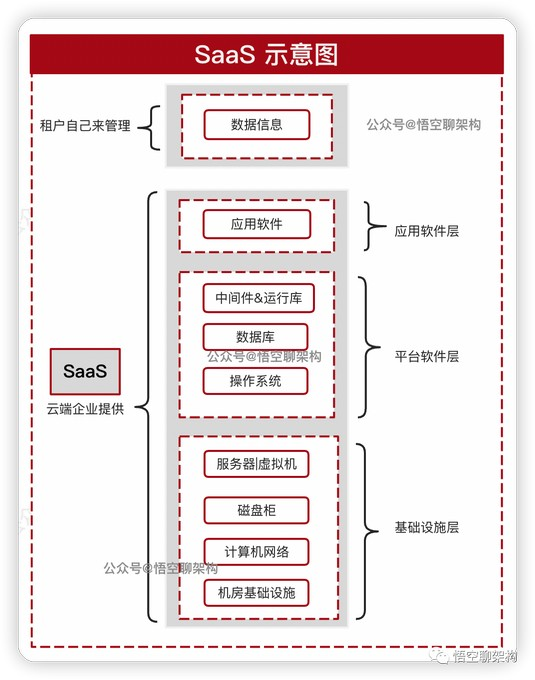
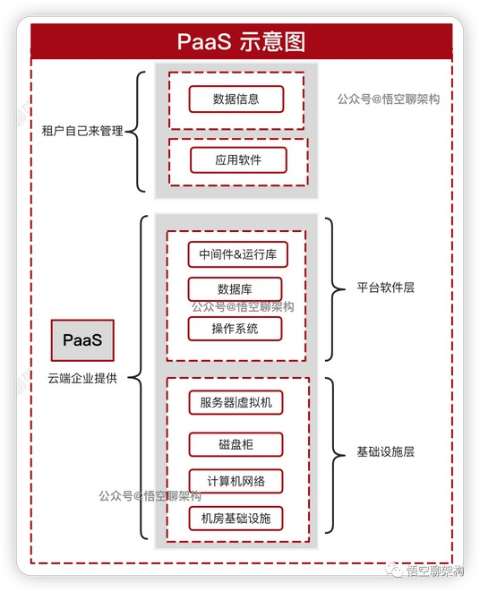
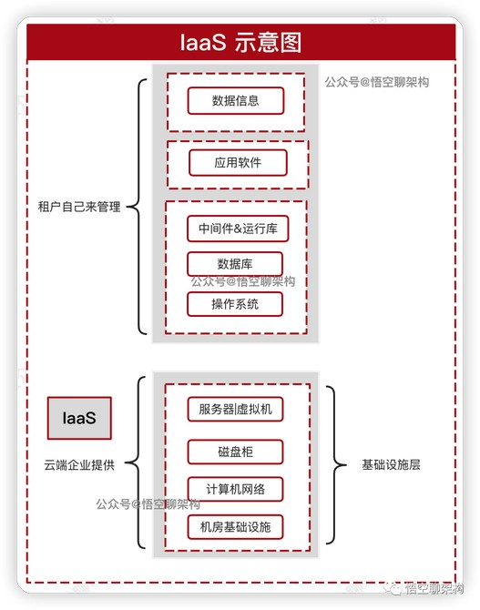
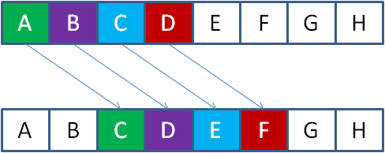
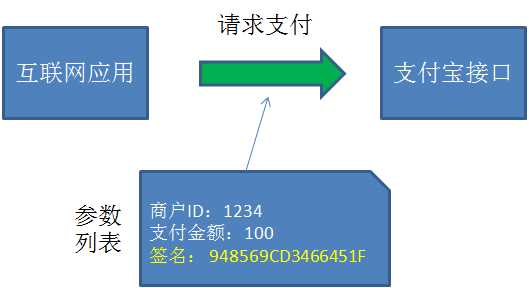
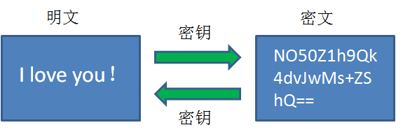
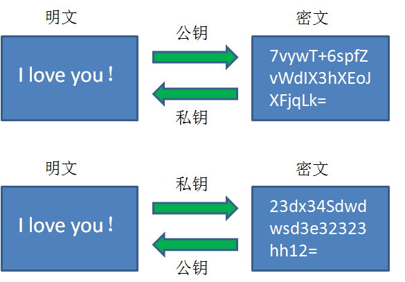
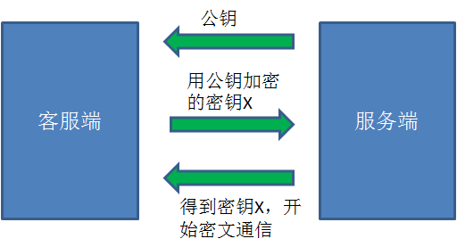

## 1. 分层开发思想

### 1.1. 三层开发结构

什么是分层：开发中，常使用分层思想。不同的层解决不同的问题，层与层之间组成严密的封闭系统，<font color=red>不同层级结构彼此平等。不能出现跨层访问</font>。

- 表示层(View)：直接跟用户打交道，展示数据给用户查看或收集用户输入的信息。
- 业务逻辑层(service)：对数据进行处理，比如筛选数据、判断数据准确性...
- 数据访问层(dao)：直接对数据库进行增删改查操作。

### 1.2. 分层的好处

- 提高代码的复用性：不同层之间进行功能调用时，相同的功能可以重复使用。
- 提高代码的维护性：提高软件的可维护性，对现有的功能进行修改和更新时不会影响原有的功能。
- 提高代码的扩展性：提升软件的可扩展性，添加新的功能的时候不会影响到现有的功能。
- 降低代码的耦合性：降低层与层之间的耦合性。

### 1.3. 如何分层

**不同的层使用不同的包**，例如：

- 表现层：`com.xxx.view`
- 业务逻辑层：`com.xxx.service`
- 数据访问层：`com.xxx.dao`
- 工具包：`com.xxx.utils`。一般用来存放工具类，不属于任何一层，可以被所有层调用
- 测试包：`com.xxx.test`
- 实体包：`com.xxx.entity`、`com.xxx.domain`等。用于存放一些自定义的JavaBean类

### 1.4. 访问顺序

用户 -> 表现层 -> 业务层 -> 数据访问层 -> 数据库

### 1.5. 开发流程

一般从下向上开发：dao 数据访问层 -> service 业务逻辑层 -> view 表示层

### 1.6. 层污染

#### 1.6.1. 什么是层污染

某一层中使用到了本不应该出现在该层的代码，则称为层污染。如：`Connection` 对象，应该出现在 DAO 层，而不应该出现在业务层。所以想办法把 `Connection` 对象从业务层中移出。

如果调用工具类的方法，不存在层污染，因为工具类属于每个层可以使用的。

#### 1.6.2. 如何解决层污染的问题

以事务处理为例：

1. 数据库工具类添加开启事务，提交事务，回滚事务的方法
2. 提交事务或回滚事务以后，关闭连接，并且从当前线程中删除 `Connection` 对象。
3. 业务层调用工具类中的方法操作事务，如果没有异常则提交事务，出现异常则事务回滚。并且抛出运行时异常给表示层。

## 2. APP、软件版本号的命名规范与原则

为了在软件产品生命周期中更好的沟通和标记，我们应该对APP、软件的版本号命名的规范和原则有一定的了解。

### 2.1. APP、软件的版本阶段

- **Alpha版**：也叫α版，此版本主要是以实现软件功能为主，通常只在软件开发者内部交流，一般而言，该版本软件的Bug较多，需要继续修改。
- **Beta版**：此版本相对于α版已经有了很大的改进，消除了严重的错误，但还是存在着一些缺陷，需要经过多次测试来进一步消除，此版本主要的修改对像是软件的UI。
- **RC版**：此版本已经相当成熟了，基本上不存在导致错误的BUG，与即将发行的正式版相差无几，测试人员基本通过的版本。
- **Release版**：此版本意味着“最终版本”、“上线版本”，，在前面版本的一系列测试版之后，终归会有一个正式版本，是最终交付用户使用的一个版本。该版本有时也称为标准版。一般情况下，Release不会以单词形式出现在软件封面上，取而代之的是符号(R)。

### 2.2. 版本号的命名规范与原则

软件版本号有四部分组成：*`<主版本号.><子版本号>.<阶段版本号>.<日期版本号加希腊字母版本号>`*。希腊字母版本号共有5种：base、alpha、beta、RC、Release。 例如：`1.1.1.161109_beta`

通常，完全的版本号定义，分三项：`<主版本号.><子版本号>.<阶段版本号>`。例如：`1.1.0`

### 2.3. 版本号修改规则

- **主版本号(1)**：当功能模块有较大的变动，比如增加多个模块或者整体架构发生变化。此版本号由项目决定是否修改。
- **子版本号(1)**：当功能有一定的增加或变化，比如增加了对权限控制、增加自定义视图等功能。此版本号由项目决定是否修改。
- **阶段版本号(1)**：一般是 Bug 修复或是一些小的变动，要经常发布修订版，时间间隔不限，修复一个严重的bug即可发布一个修订版。此版本号由项目经理决定是否修改。
- **日期版本号(161109)**：用于记录修改项目的当前日期，每天对项目的修改都需要更改日期版本号。此版本号由开发人员决定是否修改。
- **希腊字母版本号(beta)**：此版本号用于标注当前版本的软件处于哪个开发阶段，当软件进入到另一个阶段时需要修改此版本号。此版本号由项目决定是否修改。

### 2.4. 版本号的阶段标识

|   阶段名称   | 阶段标识 |
| ---------- | :-----: |
| 需求控制     |    a    |
| 设计阶段     |    b    |
| 编码阶段     |    c    |
| 单元测试     |    d    |
| 单元测试修改 |    e    |
| 集成测试     |    f    |
| 集成测试修改 |    g    |
| 系统测试     |    h    |
| 系统测试修改 |    i    |
| 验收测试     |    j    |
| 验收测试修改 |    k    |

## 3. SaaS、PaaS、IaaS 区别

### 3.1. 定义

一般而言，企业有三种云计算服务模式可以选择.

- **基础设施即服务（IaaS）**：提供机器、存储和网络资源，开发人员可以通过安装自己的操作系统、应用程序和支持资源来管理
- **平台即服务（PaaS）**：开发人员可以在其中部署自己的应用程序的平台
- **软件即服务（SaaS）**：这是一个完整的软件应用程序，具有用户界面

#### 3.1.1. IaaS

英文全称 Infrastructure-as-a-Service（基础设施即服务）。IaaS 提供给消费者的服务是对所有<font color=red>**计算基础设施**</font>的利用，包括处理 CPU、内存、存储、网络和其它基本的计算资源，用户能够部署和运行任意软件，包括操作系统和应用程序。

消费者不管理或控制任何云计算基础设施，但能控制操作系统的选择、存储空间、部署的应用，也有可能获得有限制的网络组件（例如路由器、防火墙、负载均衡器等）的控制。

#### 3.1.2. PaaS

英文全称 Platform-as-a-Service（平台即服务）。PaaS 某些时候也叫做中间件。就是把客户采用提供的开发语言和工具（例如Java，python, .Net等）开发的或收购的应用程序部署到供应商的云计算基础设施上去。

客户不需要管理或控制底层的云基础设施，包括网络、服务器、操作系统、存储等，<font color=red>**但客户能控制部署的应用程序，也可能控制运行应用程序的托管环境配置**</font>。

#### 3.1.3. SaaS

英文全称 Software-as-a-Service（软件即服务）。SaaS 提供给客户的服务是运行在云计算基础设施上的应用程序，用户可以在各种设备上通过客户端界面访问，如浏览器。

<font color=red>**消费者不需要管理或控制任何云计算基础设施**</font>，包括网络、服务器、操作系统、存储等等。

### 3.2. 应用场景

- IaaS 会提供场外服务器，存储和网络硬件，用户可以租用。节省了维护成本和办公场地，公司可以在任何时候利用这些硬件来运行其应用。最常见的 IaaS 服务是服务器托管业务，多数的 IDC 都提供这样的服务，用户自己不想要再采购价格昂贵的服务器和磁盘阵列了，所有的硬件都由 IaaS 提供，还能获得品质更高的网络资源。
- PaaS 在网上提供各种开发和分发应用的解决方案，比如虚拟服务器和特定的操作系统。底层的平台铺建好了，用户只需要开发自己的上层应用。节省了在硬件上的费用，也让各类应用的开发更加便捷，不同的工作互相打通也变得容易，因为在同一平台上遵循的是同样的编程语言、协议和底层代码。很多网页应用，应用虚拟主机，存储，安全以及应用开发协作工具等。最常见的 PaaS 平台就有百度 BAE、新浪 SAE、阿里 Ali、腾讯云等等。很多电商平台、视频网站等都可以通过 PaaS 实现快速部署。
- SaaS 是普通使用者最常见，简单地说任何一个远程服务器上的应用都可以通过网络来运行，就是 SaaS 了。最常接触到的是挂在网页或微信上的各类小程序，比如H5的应用如火如荼，这些应用给了IT的门外汉实现自己愿望的机会。国内的互联网巨头竭力推荐的 SaaS 应用比如阿里的钉钉，腾讯的企业微信，这些软件里面应用平台上的可供使用的各类 SaaS 小软件数不胜数，从 OA，到 ERP 到 CRM 等等，涵盖了企业运行所需的几乎所用应用。

### 3.3. 原理

#### 3.3.1. 软件即服务（SaaS）

软件即服务（也称为云应用程序服务）代表了云市场中企业最常用的选项。SaaS 利用互联网向其用户提供应用程序，这些应用程序由第三方供应商管理。大多数 SaaS 应用程序直接通过 Web 浏览器运行，不需要在客户端进行任何下载或安装。

如下图所示，数据信息由租户自己管理，提供 SaaS 服务的企业会将应用软件、平台软件、基础设施都集成好，不需要租户关心底层这些架构。



#### 3.3.2. 平台即服务（PaaS）

PaaS 的交付模式类似于 SaaS，除了通过互联网提供软件，PaaS 提供了一个软件创建平台。该平台通过 Web 提供，使开发人员可以自由地专注于创建软件，同时不必担心操作系统、软件更新，存储或基础架构。PaaS 允许企业使用特殊的软件组件设计和创建内置于 PaaS 中的应用程序。由于具有某些云特性，这些应用程序或中间件具有可扩展性和高可用性。



#### 3.3.3. 基础设施即服务（IaaS）

IaaS 通过虚拟化技术为组织提供云计算基础架构，包括服务器、网络，操作系统和存储等。这些云服务器通常通过仪表盘或API提供给客户端，IaaS 客户端可以完全控制整个基础架构。IaaS 提供与传统数据中心相同的技术和功能，而无需对其进行物理上的维护或管理。IaaS 客户端仍然可以直接访问其服务器和存储，但它们都通过云中的“虚拟数据中心”。

与 SaaS 或 PaaS 相反，IaaS 客户端负责管理应用程序、运行时、操作系统，中间件和数据等方面。但是，IaaS 的提供商管理服务器、硬盘驱动器、网络，虚拟化和存储。一些提供商甚至在虚拟化层之外提供更多服务，例如数据库或消息队列。



## 4. 加密算法

### 4.1. 古代加密历史

古人想出了一种非常朴素的加密方法，被称为**凯撒密码**。加密的原理就像下图这样：



如图所示，图中第一行的字母代表信息的“明文”，第二行字母代表信息的密文。这个加密算法十分简单，就是选择一个偏移量（这里的偏移量是2），把明文当中的所有字母按照字母表的顺序向后偏移两位，从而生成密文。比如：

- 原文的字母A，对应的密文是字母C。
- 原文的字母D，对应的密文是字母F。
- 原文的单词Java，对应的密文是Lcxc。

相应的，按事先约定好了密文的偏移量，把密文的所有字母向前偏移两位，就还原成了明文，这个过程叫做**解密**。

在英语的26个字母中，出现频率最高的字母是e。如果截获了密文，发现这段看不懂的密文当中出现频率最高的字母是g，由于e和g相差两个字母，就可以猜测出密文通信很可能选择2作为偏移量。这样一来，密码就被破解了。最不济，可以把每一种偏移量都尝试一遍（26个字母，最多25种偏移），终究可以试出符合正常语法的偏移量。这种方式被称为**暴力破解**。

### 4.2. 加密算法的种类

在如今的信息安全领域，有各种各样的加密算法凝聚了计算机科学家门的智慧。从宏观上来看，算法整体上可以分为**不可逆加密**和**可逆加密**，可逆加密又可以分为**对称加密**和**非对称加密**。

### 4.3. 不可逆算法

#### 4.3.1. 哈希算法

不可逆加密的算法的加密是不可逆的，密文无法被还原成原文。其中**散列算法**，就是一种不可逆算法。

散列算法中，明文通过散列算法生成散列值，散列值是长度固定的数据，和明文长度无关。


从严格意义上来说，哈希算法并不属于加密算法，但它在信息安全领域起到了很重要的作用。散列算法常用于数字签名、消息认证、密码存储等场景。其中一个重要的作用就是生成信息摘要，用以验证原信息的完整性和来源的可靠性。



支付宝怎么知道这个请求是真的来自该应用，并且没有被篡改呢？例如，请求的发送方把所有参数，外加双方约定的Key（例子中Key=abc）拼接起来，并利用哈希算法生成了一段信息摘要：

```java
Hash(1234_100_abc) = 948569CD3466451F
```

而请求的接收方在接到参数和摘要之后，按照同样的规则，也把参数和Key拼接起来并生成摘要：

```java
Hash(1234_100_abc) = 948569CD3466451F
```

如果最终发现两端信息摘要一致，证明信息没有被篡改，并且来源确实是该互联网应用。只要参数修改了一点点，或者Key不一样，那么生成的信息摘要就会完全不同。生成信息摘要的过程叫做**签名**，验证信息摘要的过程叫做**验签**。

散列算法包含哪些具体的算法呢？其中最著名的当属**MD5算法**。后来，人们觉得MD5算法生成的信息摘要太短（128位），不够安全，于是又有了**SHA系列算法**，包括 SHA1、SHA-224、SHA-256 等等。

> Tips: 散列算法是不需要密钥的，当然也有一些不可逆算法，需要密钥，例如 HMAC 算法。

#### 4.3.2. MD5

MD5，全称为『Message-Digest Algorithm 5』，翻译过来叫『信息摘要算法』。它可以将任意长度的数据通过散列算法，生成一个固定长度的散列值。MD5 算法的输出长度为 128 位，通常用 32 个 16 进制数表示。MD5 算法的 Java 代码实现示例如下：

```java
public class MD5 {
    private static final String MD5_ALGORITHM = "MD5";
    public static String encrypt(String data) throws Exception {
        // 获取MD5算法实例
        MessageDigest messageDigest = MessageDigest.getInstance(MD5_ALGORITHM);
        // 计算散列值
        byte[] digest = messageDigest.digest(data.getBytes());
        Formatter formatter = new Formatter();
        // 补齐前导0，并格式化
        for (byte b : digest) {
            formatter.format("%02x", b);
        }
        return formatter.toString();
    }

    public static void main(String[] args) throws Exception {
        String data = "Hello World";
        String encryptedData = encrypt(data);
        System.out.println("加密后的数据：" + encryptedData);
    }
}
```

MD5 的优点是，计算速度快、输出长度固定、应用广泛等等。但是作为一个加密算法，它最大的缺点就是**不安全**。

MD5 算法已经被攻破，而且 MD5 算法的输出长度有限，攻击者可以通过暴力破解或彩虹表攻击等方式，找到与原始数据相同的散列值，从而破解数据。虽然可以通过加盐，也就是对在原文里再加上一些不固定的字符串来缓解，但是完全可以用更安全的 SHA 系列算法替代。

#### 4.3.3. SHA-256

SHA（Secure Hash Algorithm）系列算法是一组密码散列函数，用于将任意长度的数据映射为固定长度的散列值。SHA 系列算法由美国国家安全局（NSA）于1993年设计，目前共有 SHA-1、SHA-2、SHA-3 三种版本。

其中 SHA-1 系列存在缺陷，已经不再被推荐使用。SHA-2 算法包括 SHA-224、SHA-256、SHA-384 和 SHA-512 四种散列函数，分别将任意长度的数据映射为224位、256位、384位和512位的散列值。最常用的 SHA-256 的 Java 代码实现示例如下：

```java
public class SHA256 {
    private static final String SHA_256_ALGORITHM = "SHA-256";
    public static String encrypt(String data) throws Exception {
        // 获取SHA-256算法实例
        MessageDigest messageDigest = MessageDigest.getInstance(SHA_256_ALGORITHM);
        // 计算散列值
        byte[] digest = messageDigest.digest(data.getBytes());
        StringBuilder stringBuilder = new StringBuilder();
        // 将byte数组转换为15进制字符串
        for (byte b : digest) {
            stringBuilder.append(Integer.toHexString((b & 0xFF) | 0x100), 1, 3);
        }
        return stringBuilder.toString();
    }

    public static void main(String[] args) throws Exception {
        String data = "Hello World";
        String encryptedData = encrypt(data);
        System.out.println("加密后的数据：" + encryptedData);
    }
}
```

SHA-2 算法比 MD5 强，主要有两个原因：

- 散列值长度更长：例如 SHA-256 算法的散列值长度为 256 位，而 MD5 算法的散列值长度为 128 位，这就提高了攻击者暴力破解或者彩虹表攻击的难度。
- 更强的碰撞抗性：SHA 算法采用了更复杂的运算过程和更多的轮次，使得攻击者更难以通过预计算或巧合找到碰撞。

当然，SHA-2 也不是绝对安全的，散列算法都有被暴力破解或者彩虹表攻击的风险，所以在实际的应用中，加盐还是必不可少的。

### 4.4. 对称加密算法

#### 4.4.1. 对称加密算法概念



**对称加密**，是指通信双方使用**相同的密钥**进行加密和解密。如图所示，一段明文通过密钥进行加密，可以生成一段密文；这段密文通过同样的密钥进行解密，可以还原成明文。这样一来，只要双方事先约定好了密钥，就可以使用密文进行往来通信。数据泄露到了外界，泄露出去的也都是密文。

此种加密方式，密钥的安全性至关重要。如果密钥泄露，攻击者可以轻易地破解加密数据。

**对称加密常用算法**：

- **DES算法**，后来人们觉得 DES 不够安全，又发明了**3DES算法**
- **AES算法**，是如今最为流行的对称加密算法，具有比较高的安全性和加密效率。

**对称加密算法的优缺点**：

- 优点：加密解密的**效率比较高**。
- 缺点：**不够安全**。因为通信双方约定的密钥是相同的，只要密钥本身被任何一方泄露出去，通信的密文就会被破解；此外，在双方建立通信之初，服务端把密钥告诉给客户端的时候，也有被拦截到的危险。

#### 4.4.2. DES

DES（Data Encryption Standard）算法是一种对称加密算法，由IBM公司于1975年研发，是最早的一种广泛应用的对称加密算法之一。

DES 算法使用 56 位密钥对数据进行加密，加密过程中使用了置换、替换、异或等运算，具有较高的安全性。DES 算法的 Java 代码实现示例：

```java
public class DES {
    private static final String DES_ALGORITHM = "DES";

    /**
     * DES加密
     *
     * @param data 待加密的数据
     * @param key  密钥，长度必须为8位
     * @return 加密后的数据，使用Base64编码
     */
    public static String encrypt(String data, String key) throws Exception {
        // 根据密钥生成密钥规范
        KeySpec keySpec = new DESKeySpec(key.getBytes());
        // 根据密钥规范生成密钥工厂
        SecretKeyFactory secretKeyFactory = SecretKeyFactory.getInstance(DES_ALGORITHM);
        // 根据密钥工厂和密钥规范生成密钥
        SecretKey secretKey = secretKeyFactory.generateSecret(keySpec);

        // 根据加密算法获取加密器
        Cipher cipher = Cipher.getInstance(DES_ALGORITHM);
        // 初始化加密器，设置加密模式和密钥
        cipher.init(Cipher.ENCRYPT_MODE, secretKey);
        // 加密数据
        byte[] encryptedData = cipher.doFinal(data.getBytes());
        // 对加密后的数据进行Base64编码
        return Base64.getEncoder().encodeToString(encryptedData);
    }

    /**
     * DES解密
     *
     * @param encryptedData 加密后的数据，使用Base64编码
     * @param key           密钥，长度必须为8位
     * @return 解密后的数据
     */
    public static String decrypt(String encryptedData, String key) throws Exception {
        // 根据密钥生成密钥规范
        KeySpec keySpec = new DESKeySpec(key.getBytes());
        // 根据密钥规范生成密钥工厂
        SecretKeyFactory secretKeyFactory = SecretKeyFactory.getInstance(DES_ALGORITHM);
        // 根据密钥工厂和密钥规范生成密钥
        SecretKey secretKey = secretKeyFactory.generateSecret(keySpec);

        // 对加密后的数据进行Base64解码
        byte[] decodedData = Base64.getDecoder().decode(encryptedData);
        // 根据加密算法获取解密器
        Cipher cipher = Cipher.getInstance(DES_ALGORITHM);
        // 初始化解密器，设置解密模式和密钥
        cipher.init(Cipher.DECRYPT_MODE, secretKey);
        // 解密数据
        byte[] decryptedData = cipher.doFinal(decodedData);
        // 将解密后的数据转换为字符串
        return new String(decryptedData);
    }

    public static void main(String[] args) throws Exception {
        String data = "Hello World";
        String key = "12345678"; 

        String encryptedData = encrypt(data, key);
        System.out.println("加密后的数据：" + encryptedData);

        String decryptedData = decrypt(encryptedData, key);
        System.out.println("解密后的数据：" + decryptedData);
    }
}
```

DES的算法速度较快，但是在安全性上面并不是最优选择，因为DES算法的密钥长度比较短，被暴力破解和差分攻击的风险比较高，一般推荐用一些更安全的对称加密算法，比如3DES、AES。

#### 4.4.3. AES

AES（Advanced Encryption Standard）即高级加密标准，是一种对称加密算法，被广泛应用于数据加密和保护领域。AES 算法使用的密钥长度为128位、192位或256位，比 DES 算法的密钥长度更长，安全性更高。AES 算法的 Java 代码实现示例如下：

```java
public class AES {
    private static final String AES_ALGORITHM = "AES";
    // AES加密模式为CBC，填充方式为PKCS5Padding
    private static final String AES_TRANSFORMATION = "AES/CBC/PKCS5Padding";
    // AES密钥为16位
    private static final String AES_KEY = "1234567890123456";
    // AES初始化向量为16位
    private static final String AES_IV = "abcdefghijklmnop";

    /**
     * AES加密
     *
     * @param data 待加密的数据
     * @return 加密后的数据，使用Base64编码
     */
    public static String encrypt(String data) throws Exception {
        // 将AES密钥转换为SecretKeySpec对象
        SecretKeySpec secretKeySpec = new SecretKeySpec(AES_KEY.getBytes(), AES_ALGORITHM);
        // 将AES初始化向量转换为IvParameterSpec对象
        IvParameterSpec ivParameterSpec = new IvParameterSpec(AES_IV.getBytes());
        // 根据加密算法获取加密器
        Cipher cipher = Cipher.getInstance(AES_TRANSFORMATION);
        // 初始化加密器，设置加密模式、密钥和初始化向量
        cipher.init(Cipher.ENCRYPT_MODE, secretKeySpec, ivParameterSpec);
        // 加密数据
        byte[] encryptedData = cipher.doFinal(data.getBytes(StandardCharsets.UTF_8));
        // 对加密后的数据使用Base64编码
        return Base64.getEncoder().encodeToString(encryptedData);
    }

    /**
     * AES解密
     *
     * @param encryptedData 加密后的数据，使用Base64编码
     * @return 解密后的数据
     */
    public static String decrypt(String encryptedData) throws Exception {
        // 将AES密钥转换为SecretKeySpec对象
        SecretKeySpec secretKeySpec = new SecretKeySpec(AES_KEY.getBytes(), AES_ALGORITHM);
        // 将AES初始化向量转换为IvParameterSpec对象
        IvParameterSpec ivParameterSpec = new IvParameterSpec(AES_IV.getBytes());
        // 根据加密算法获取解密器
        Cipher cipher = Cipher.getInstance(AES_TRANSFORMATION);
        // 初始化解密器，设置解密模式、密钥和初始化向量
        cipher.init(Cipher.DECRYPT_MODE, secretKeySpec, ivParameterSpec);
        // 对加密后的数据使用Base64解码
        byte[] decodedData = Base64.getDecoder().decode(encryptedData);
        // 解密数据
        byte[] decryptedData = cipher.doFinal(decodedData);
        // 返回解密后的数据
        return new String(decryptedData, StandardCharsets.UTF_8);
    }

    public static void main(String[] args) throws Exception {
        String data = "Hello World";

        String encryptedData = encrypt(data);
        System.out.println("加密后的数据：" + encryptedData);

        String decryptedData = decrypt(encryptedData);
        System.out.println("解密后的数据：" + decryptedData);
    }
}
```

AES 算法采用的密钥长度更长，密钥空间更大，安全性更高，能够有效地抵抗暴力破解攻击。但因为密钥长度较长，需要的存储也更多。对于对称加密算法而言，最大的痛点就在于密钥管理困难，相比而言，非对称加密就没有这个担忧。

### 4.5. 非对称加密算法

#### 4.5.1. 非对称加密算法概述



如图所示，在非对称加密中存在一对密钥，这两个密钥互不相同，但是相互匹配，其中一个叫做**公钥**，另一个叫做**私钥**。在加密解密的过程中，既可以使用公钥加密明文，使用私钥解密密文；也可以使用私钥加密明文，使用公钥解密密文。非对称加密算法的优缺点如下：

- 优点：安全性高，公钥可以公开，私钥必须保密，保证了数据的安全性；可用于数字签名、密钥协商等多种应用场景。
- 缺点：计算量相比对称加密大很多，加密、解密速度较慢。密钥长度越长，加密、解密时间越长；密钥长度过短容易被暴力破解，密钥长度过长则会增加计算量和存储空间的开销。整体**性能较差**，无法应用于长期的通信。

下面以通信的过程进行非对称加密说明：



1. 在双方建立通信的时候，服务端只要把公钥告诉给客户端，自己保留私钥。
2. 客户端利用获得的公钥。加密另外一个密钥X（可以是对称加密的密钥），发送给服务端。
3. 服务端获得消息后，用自己的私钥解密，得到里面隐含的密钥X。
4. 从此以后，双方可以利用密钥X进行对称加密的通信了。

在这个过程中，即使公钥被第三方截获，甚至后续的所有通信都被截获，第三方也无法进行破解。因为第二步利用公钥加密的消息，只有私钥才能解开，所以第三方永远无法知道密钥X是什么。

常用的非对称加密算法的有如：**RSA算法**、**DSA算法**。

#### 4.5.2. RSA

RSA 算法是是目前应用最广泛的非对称加密算法。RSA 算法的 Java 实现示例：

```java
public class RSA {
    private static final String RSA_ALGORITHM = "RSA";

    /**
     * 生成RSA密钥对
     *
     * @return RSA密钥对
     */
    public static KeyPair generateKeyPair() throws NoSuchAlgorithmException {
        KeyPairGenerator keyPairGenerator = KeyPairGenerator.getInstance(RSA_ALGORITHM);
        keyPairGenerator.initialize(2048); // 密钥大小为2048位
        return keyPairGenerator.generateKeyPair();
    }

    /**
     * 使用公钥加密数据
     *
     * @param data      待加密的数据
     * @param publicKey 公钥
     * @return 加密后的数据
     */
    public static String encrypt(String data, PublicKey publicKey) throws Exception {
        Cipher cipher = Cipher.getInstance(RSA_ALGORITHM);
        cipher.init(Cipher.ENCRYPT_MODE, publicKey);
        byte[] encryptedData = cipher.doFinal(data.getBytes(StandardCharsets.UTF_8));
        return Base64.getEncoder().encodeToString(encryptedData);
    }

    /**
     * 使用私钥解密数据
     *
     * @param encryptedData 加密后的数据
     * @param privateKey    私钥
     * @return 解密后的数据
     */
    public static String decrypt(String encryptedData, PrivateKey privateKey) throws Exception {
        byte[] decodedData = Base64.getDecoder().decode(encryptedData);
        Cipher cipher = Cipher.getInstance(RSA_ALGORITHM);
        cipher.init(Cipher.DECRYPT_MODE, privateKey);
        byte[] decryptedData = cipher.doFinal(decodedData);
        return new String(decryptedData, StandardCharsets.UTF_8);
    }

    public static void main(String[] args) throws Exception {
        KeyPair keyPair = generateKeyPair();
        PublicKey publicKey = keyPair.getPublic();
        PrivateKey privateKey = keyPair.getPrivate();

        String data = "Hello World";

        String encryptedData = encrypt(data, publicKey);
        System.out.println("加密后的数据：" + encryptedData);

        String decryptedData = decrypt(encryptedData, privateKey);
        System.out.println("解密后的数据：" + decryptedData);
    }
}
```


## 5. 八大生产故障排查思路（通用版）

> 引用网络，原文出处：https://mp.weixin.qq.com/s/WtchexOsbPMbuN25XQtB-A

### 5.1. 常见的生产故障有哪些？

在生产环境中，常见的故障类型包括但不限于以下几种：

1. 网络故障：网络故障可能包括网络连接中断、网络延迟过高、路由错误等。这可能导致系统无法正常访问外部资源，或导致应用程序无法与其他系统进行通信。
2. 服务器故障：服务器故障可能包括硬件故障、操作系统崩溃、服务崩溃等。这可能导致系统无法提供服务，导致应用程序不可用或性能下降。
3. 数据库故障：数据库故障可能包括数据库服务器崩溃、数据库连接错误、数据损坏等。这可能导致应用程序无法读取或写入数据，导致功能异常或数据不一致。
4. 软件错误：软件错误可能包括应用程序 bug、配置错误、依赖项问题等。这可能导致应用程序崩溃、功能异常或性能下降。
5. 安全漏洞或攻击：安全漏洞或攻击可能导致系统遭受恶意行为，如未经授权访问、数据泄露、拒绝服务攻击等。这可能导致系统不稳定、数据损失或服务不可用。
6. 存储故障：存储故障可能包括磁盘故障、存储设备故障、数据丢失等。这可能导致数据不可用、文件损坏或无法恢复。
7. 配置错误：配置错误可能导致系统以错误的方式运行，例如错误的端口设置、错误的权限设置、错误的网络配置等。这可能导致应用程序无法正常工作或不可访问。
8. 第三方服务故障：如果应用程序依赖于第三方服务（如支付网关、短信网关等），当这些服务出现故障时，可能会导致应用程序无法正常工作或功能受限。

### 5.2. 网络故障如何处理

#### 5.2.1. 如何发现网络故障

1. 连接状态：观察服务器或网络设备的连接状态指示灯，确保网络设备和服务器的物理连接正常。如果连接状态指示灯不亮或闪烁异常，可能表示存在物理连接问题。
2. Ping 测试：使用 ping 命令向其他设备发送网络数据包，检查是否能够与目标设备进行正常的网络通信。如果 ping 命令超时或返回错误，可能表示存在网络连接问题。
3. 流量监控：使用网络流量监控工具，如 Wireshark、ntop 等，观察网络流量的情况。可以检查是否有异常的数据包、数据包丢失、流量拥塞等现象。
4. 网络延迟测试：使用网络延迟测试工具，如 ping、traceroute、MTR 等，检查网络延迟情况。延迟过高可能表示网络连接存在问题。
5. 日志分析：检查服务器和网络设备的日志文件，查找任何与网络连接相关的错误或异常记录。日志文件可以提供有关网络故障的有用信息。

#### 5.2.2. 如何排查网络故障

1. 检查物理连接：确保所有网络设备和服务器的物理连接正确插入，并且连接线缆没有损坏或松动。
2. 重启网络设备：尝试重新启动路由器、交换机、调制解调器等网络设备，以解决可能的临时问题。
3. 检查网络配置：检查网络设备和服务器的网络配置，包括 IP 地址、子网掩码、网关等，确保它们正确配置。
4. 验证 DNS 设置：确认 DNS 设置正确，可以通过 ping 域名或直接访问 IP 地址来验证 DNS 解析是否正常。
5. 检查防火墙设置：检查防火墙规则和配置，确保没有阻止正常的网络通信。
6. 测试其他设备：通过尝试连接其他设备或访问其他网站，确定是整个网络还是特定设备之间存在问题。

#### 5.2.3. 如何解决网络故障

1. 修复物理连接问题：重新插拔连接线缆，更换损坏的连接线缆，确保物理连接正常。
2. 重启网络设备：尝试重新启动路由器、交换机等网络设备，以解决可能的临时问题。
3. 检查网络配置：检查网络设备和服务器的网络配置，确保其与网络要求和拓扑相匹配。
4. 联系网络服务提供商：如果问题超出您的控制范围，可能需要联系网络服务提供商。

### 5.3. 服务器故障如何处理？

#### 5.3.1. 如何发现服务器故障

1. 无响应：如果服务器无法响应网络请求，无法访问或无法连接，可能表示存在服务器故障。尝试访问服务器上的服务或网站，观察是否能够正常访问。
2. 错误日志：检查服务器上的错误日志文件，如系统日志、应用程序日志等，查找任何与服务器故障相关的错误记录。这些日志可能包含有用的信息，可以帮助确定故障原因。
3. 监控工具：使用服务器监控工具来监视服务器的性能指标，如CPU利用率、内存使用率、磁盘空间等。异常的指标可能指示服务器故障。

#### 5.3.2. 如何排查服务器故障

1. 检查服务器状态：检查服务器的电源指示灯、风扇声音、硬盘活动指示灯等物理指示，确保服务器正常供电并工作。
2. 远程连接：尝试通过远程连接工具（如SSH）连接到服务器，检查是否能够建立连接。如果连接失败，可能是服务器软件或网络配置的问题。
3. 重启服务器：尝试重新启动服务器，这可以帮助解决可能的临时问题。确保在执行重启操作之前，已备份重要数据并通知相关人员。
4. 检查硬件：检查服务器硬件部件是否正常工作。这包括检查硬盘状态、内存模块、网卡、电源供应等。
5. 检查服务和进程：检查服务器上运行的服务和进程是否正常。确认关键服务是否已启动，并检查是否存在异常的进程或僵尸进程。
6. 检查日志：仔细查看服务器上的日志文件，如系统日志、应用程序日志等，查找与故障相关的任何错误或异常记录。
7. 联系供应商或技术支持：如果自己无法解决服务器故障，可以联系服务器供应商或技术支持团队，寻求专业的帮助和建议。

#### 5.3.3. 如何解决服务器故障

1. 重启服务器：重启服务器是解决许多临时问题的简单方法。通过重新启动服务器，可以清除临时内存和进程状态，可能恢复正常运行。
2. 检查物理连接：检查服务器的物理连接，包括电源、网络连接和数据线缆。确保它们牢固连接且没有松动或损坏。
3. 检查硬件状态：检查服务器的硬件部件，如硬盘、内存、CPU、电源等。确保它们正常工作且没有故障。
4. 分析日志：仔细分析服务器日志，包括操作系统日志、应用程序日志和其他相关日志。这可以提供有关故障的详细信息，帮助定位问题。
5. 检查网络配置：确保服务器的网络配置正确，包括IP地址、子网掩码、网关和DNS设置。如果网络配置错误，可能导致连接问题或无法访问外部资源。
6. 恢复备份数据：如果服务器上的数据受损或丢失，可以从备份中恢复数据。确保定期进行数据备份，并测试备份的可恢复性。
7. 更新和修复软件：确保服务器上的操作系统、驱动程序和软件都是最新版本，并应用任何可用的补丁或更新。这有助于修复已知的软件漏洞和错误。
8. 故障排除工具和诊断：使用故障排除工具和诊断工具来检测和修复故障。例如，硬件诊断工具、网络分析工具和性能监控工具可以帮助定位和解决问题。
9. 寻求专业支持：如果无法解决服务器故障，或者需要更高级的技术支持，可以联系服务器供应商或专业的技术支持团队。他们可以提供专业的建议和帮助。

### 5.4. 数据库故障如何处理

#### 5.4.1. 如何发现数据库故障

1. 连接问题：如果应用程序无法连接到数据库，或者连接被拒绝，可能表示存在数据库故障。观察应用程序的错误日志或错误信息，检查是否存在与数据库连接相关的错误。
2. 数据库错误日志：检查数据库的错误日志，如 MySQL 的错误日志、Oracle 的跟踪文件等，查找任何与数据库故障相关的错误记录。这些日志可能包含有用的信息，可以帮助确定故障原因。
3. 监控工具：使用数据库监控工具来监视数据库的性能指标，如 CPU 利用率、内存使用率、磁盘 I/O 等。异常的指标可能指示数据库故障。

#### 5.4.2. 如何排查数据库故障

1. 检查数据库服务状态：检查数据库服务是否正在运行。确保数据库服务器已启动，并且相关的进程正在运行。
2. 远程连接测试：尝试从应用程序服务器或其他客户端机器远程连接到数据库，检查是否能够建立连接。如果连接失败，可能是网络或数据库配置的问题。
3. 检查数据库配置：检查数据库的配置文件或管理工具中的配置参数，确保它们与实际要求和最佳实践相匹配。检查数据库的端口、监听器和网络设置。
4. 检查数据库空间：检查数据库的磁盘空间使用情况，包括数据文件、日志文件等。确保磁盘空间充足，避免空间不足导致数据库故障。
5. 日志分析：仔细分析数据库的日志文件，如事务日志、错误日志等，查找任何与故障相关的异常记录。这可能包括数据库错误、死锁、日志损坏等。
6. 数据库健康检查：运行数据库的健康检查工具，如 Oracle 的 DBVERIFY、MySQL 的 CHECK TABLE 等。这些工具可以帮助检测和修复数据库中的物理损坏或一致性问题。
7. 数据库重启：如果可能，尝试重新启动数据库服务。在执行重启之前，确保已经备份重要的数据库文件，并通知相关人员。

#### 5.4.3. 如何解决数据库故障

1. 数据库修复和恢复：如果数据库文件损坏或存在数据一致性问题，可能需要运行数据库修复工具或恢复操作。这可能包括修复损坏的数据文件、恢复备份数据或应用数据库事务日志。
2. 数据库参数调整：根据故障的性质和具体的数据库进行参数调整。
3. 数据库性能调优：如果数据库故障是由于性能问题导致的，可以考虑进行数据库性能调优。这可能包括优化查询语句、调整索引、增加硬件资源、调整数据库参数等，以提高数据库的响应性能和吞吐量。
4. 数据库版本升级或修补：如果数据库故障是由于已知的软件漏洞或错误引起的，可以考虑升级到较新的数据库版本或应用相关的修补程序。这可以修复已知问题，并提供更稳定和可靠的数据库环境。
5. 数据库备份和恢复：如果数据库无法修复，或者数据丢失严重，可能需要从备份中恢复数据。确保定期进行数据库备份，并测试备份的可恢复性，以便在需要时能够快速恢复数据。
6. 专业数据库支持：如果您无法解决数据库故障，或者需要更高级的技术支持，建议联系数据库供应商或专业的数据库支持团队。他们可以提供专业的建议和帮助，帮助您解决复杂的数据库故障。

### 5.5. 软件错误如何处理

#### 5.5.1. 如何发现软件错误

1. 应用程序错误信息：观察应用程序界面或日志文件中是否有任何错误消息或异常信息。这些错误信息可能指示软件错误的发生。
2. 不正常的应用程序行为：注意应用程序的异常行为，如崩溃、卡顿、无响应等。这些问题可能是由于软件错误引起的。
3. 用户反馈：倾听用户的反馈和报告。如果用户报告了异常行为、错误消息或其他问题，这可能是软件错误的指示。

#### 5.5.2. 如何排查软件错误

1. 重现问题：尝试重现软件错误，以了解何时和如何触发它。确定问题发生的特定步骤或条件，这有助于更好地理解和定位问题。
2. 日志分析：仔细分析应用程序的日志文件，查找任何与错误相关的异常记录。这可能包括堆栈跟踪、错误码或其他详细信息，帮助确定软件错误的根本原因。
3. 调试工具：使用调试工具来跟踪和分析应用程序的执行过程。调试器可以帮助您检查变量的值、执行流程和函数调用，以帮助定位和修复软件错误。
4. 代码审查：检查软件的源代码，查找潜在的错误或不正确的逻辑。注意常见的编程错误，如空指针引用、内存泄漏、逻辑错误等。
5. 环境和配置：确保软件运行所需的环境和配置正确设置。检查软件所依赖的库、版本、文件权限等，以确保其正常运行。
6. 更新和修复：查看是否有可用的软件更新、补丁或修复程序。厂商经常发布针对已知问题的修复程序，确保将软件更新到最新版本。

#### 5.5.3. 如何解决软件错误

1. 修复代码：根据排查结果，修改软件代码以解决错误。这可能包括修复逻辑错误、处理异常情况、优化性能或修复安全漏洞等。
2. 应用程序配置调整：检查应用程序的配置文件或设置，确保其与所需的环境和功能相匹配。调整配置参数可以解决一些错误和不一致性问题。
3. 软件更新和升级：安装可用的软件更新或升级到新版本，以修复已知的软件错误和漏洞。保持软件最新状态有助于提高稳定性和安全性。

### 5.6. 安全漏洞如何处理

#### 5.6.1. 如何发现安全漏洞

1. 安全审计和扫描：进行定期的安全审计和扫描，使用专业的安全工具来检测系统和应用程序中的潜在漏洞。这些工具可以帮助发现已知的安全漏洞，并提供修复建议。
2. 安全日志分析：仔细分析安全日志，包括操作系统日志、网络设备日志和应用程序日志。寻找任何异常活动、登录尝试、拒绝服务攻击或其他可疑行为的迹象。
3. 弱点利用检测：使用入侵检测系统（IDS）或入侵防御系统（IPS）等工具，监视网络流量和系统活动，检测可能的攻击行为和弱点利用尝试。
4. 漏洞披露和安全公告：定期关注软件和系统供应商的安全公告和漏洞披露信息。这些信息通常会提供已知的安全漏洞和攻击方式，帮助您识别并修补潜在的问题。

#### 5.6.2. 如何排查安全漏洞

1. 审查系统和应用程序配置：检查系统和应用程序的配置文件和设置，确保其符合安全最佳实践。查找可能的错误配置、弱密码、未授权访问等问题。
2. 审查访问控制和权限：仔细审查用户和权限管理机制，确保只有授权用户能够访问和执行必要的操作。验证是否存在过度的权限或未经授权的访问。
3. 网络流量监控和分析：使用网络监控工具来捕获和分析网络流量。识别异常的网络连接、数据包传输、端口扫描等活动，以发现潜在的攻击。
4. 恶意代码扫描：运行恶意代码扫描工具，检查系统和应用程序中是否存在已知的恶意代码或病毒。确保使用最新的病毒定义文件来识别最新的恶意软件。

#### 5.6.3. 如何解决安全漏洞问题

1. 及时应用安全补丁和更新：软件供应商通常会发布安全补丁和更新来修复已知的漏洞。确保及时应用这些补丁和更新，以修复系统或应用程序中的安全漏洞。
2. 强化访问控制和身份验证：加强访问控制机制，确保只有授权用户能够访问敏感数据和系统功能。使用强密码策略，并考虑多因素身份验证，如使用令牌或生物识别。
3. 数据加密：对敏感数据进行加密，包括数据在传输过程中和存储中的加密。使用强加密算法和协议，确保数据在被攻击或泄露时仍然保持机密性。
4. 强化网络安全防御措施：配置和管理防火墙、入侵检测系统（IDS）、入侵防御系统（IPS）和安全网关等设备，以阻止未经授权的访问和恶意流量。
5. 安全审计和监控：建立实时的安全监控系统，监控系统活动和网络流量，以便及早检测和应对安全事件。定期进行安全审计，发现潜在的安全问题并进行修复。
6. 加强员工安全意识培训：教育和培训员工识别常见的安全威胁和攻击，加强他们对安全最佳实践的认识。提醒员工遵守安全策略和规定，并鼓励报告可疑活动或安全事件。
7. 定期漏洞评估和渗透测试：进行定期的漏洞评估和渗透测试，发现系统和应用程序中的潜在弱点和漏洞。这有助于及早发现并修复安全问题。
8. 加强安全合规性：确保系统和应用程序符合相关的安全标准和法规要求。定期进行合规性评估，发现并纠正安全合规性方面的不符合之处。
9. 建立灾备和恢复计划：制定灾难恢复计划和业务连续性计划，以应对安全事件和攻击带来的影响。备份重要数据，并测试恢复过程的有效性。
10. 寻求专业安全支持：如果您无法解决安全问题，或者需要更高级的技术支持，建议寻求专业的安全团队或咨询机构的帮助。他们可以提供专业的安全评估、漏洞修复和安全咨询服务。
11. 实施网络隔离和安全分段：将网络划分为不同的安全区域，并实施网络隔离策略，限制不同区域之间的访问。这有助于减少攻击者在系统中扩散和移动的能力。
12. 加强日志管理和分析：配置系统和应用程序以生成详细的日志记录，并建立日志管理和分析机制。对日志进行实时监控和分析，以便发现异常活动和潜在的安全威胁。
13. 加强物理安全措施：保护服务器和网络设备的物理安全，确保只有授权人员能够物理访问这些设备。这包括控制机房访问、使用视频监控和安全锁等措施。
14. 加强供应链安全：审查和评估供应商和第三方合作伙伴的安全措施，确保其符合安全标准和要求。监控供应链中的安全漏洞，并与供应商建立合作，共同提高整个供应链的安全性。
15. 及时响应和处置：建立响应和处置计划，以应对发生安全事件或攻击时的紧急情况。在事件发生时，迅速采取行动，隔离受影响的系统、收集证据并修复漏洞。

### 5.7. 存储故障如何处理

#### 5.7.1. 如何发现存储故障

1. 监控存储设备：使用存储设备提供的监控工具或第三方监控解决方案，实时监视存储设备的健康状态、性能指标和警报信息。这些指标可能包括磁盘使用率、I/O 延迟、传输速率等。
2. 检查存储设备指示灯：在存储设备上，通常会有指示灯指示设备的状态。如果某个磁盘出现故障，相应的指示灯可能会闪烁或变红。
3. 观察系统错误日志：检查服务器或存储设备的错误日志，寻找与存储有关的错误消息或警报。这些日志通常记录了存储设备的故障、磁盘错误、传输错误等信息。
4. 监控应用程序错误：如果应用程序在访问存储时遇到错误或异常，这可能是存储故障的迹象。观察应用程序的日志和错误报告，查找与存储相关的错误消息。

#### 5.7.2. 如何排查存储故障

1. 验证存储连接：确保存储设备与服务器之间的连接正常。检查存储设备的电源、数据线、光纤或网络连接是否稳定和正确连接。
2. 检查磁盘状态：查看存储设备中的磁盘状态，确认是否有磁盘故障或损坏。一些存储设备提供了管理界面或命令行工具，可以查看磁盘的健康状态和 SMART（Self-Monitoring, Analysis, and Reporting Technology）信息。
3. 运行存储诊断工具：一些存储设备提供了诊断工具，可以检查设备的状态、性能和故障。运行存储设备的诊断工具，以获得更详细的故障诊断信息。
4. 重启存储设备和服务器：尝试重新启动存储设备和相关的服务器，有时可以解决临时的存储问题。确保按照设备厂商的指导进行重启操作。
5. 数据恢复和备份：如果存储设备中的数据受到影响或无法访问，考虑进行数据恢复操作。此外，及时备份数据可以帮助降低数据丢失的风险。

#### 5.7.3. 如何解决存储故障

1. 替换故障磁盘：如果存储设备中的磁盘故障，您可以将故障磁盘替换为新的磁盘。确保按照设备厂商的指导进行磁盘替换操作，并进行相应的重新配置和数据恢复。
2. 修复文件系统错误：如果存储设备中的文件系统出现错误，可以尝试修复文件系统。这可以通过运行适当的文件系统修复工具或操作系统提供的磁盘检查和修复命令来完成。
3. 扩展存储容量：如果存储设备容量不足，可以考虑扩展存储容量。这可以通过添加更多的磁盘或扩展存储设备的容量来实现。确保遵循设备厂商的扩展指南和最佳实践。
4. 数据迁移和重建：在某些情况下，您可能需要将存储设备上的数据迁移到其他设备或重新构建数据。这可以通过备份和恢复、数据复制或其他数据迁移工具来完成。确保在执行数据迁移操作时采取适当的措施来保证数据的完整性和一致性。
5. 寻求厂商支持：如果您无法解决存储故障或需要更高级的技术支持，建议与存储设备的厂商联系，并寻求他们的支持和建议。他们可以提供更具体的故障排除步骤、修复方法和技术指导。

### 5.8. 配置错误如何处理

#### 5.8.1. 如何发现配置错误

- 监控系统日志和错误报告：定期检查应用程序的日志和错误报告，查找与配置相关的错误消息或异常。
- 用户反馈和报告：关注用户的反馈和报告，特别是与特定功能或配置有关的问题。
- 测试和验证：进行全面的功能测试和验证，以确保所有配置都按预期工作。

#### 5.8.2. 如何排查配置错误

- 仔细审查配置文件：检查应用程序和系统的配置文件，确认所有设置和参数的正确性。
- 检查环境变量和命令行参数：确认应用程序使用的环境变量和命令行参数是否正确设置。
- 比对文档和最佳实践：参考应用程序和服务的官方文档、指南和最佳实践，确保配置符合推荐设置。

#### 5.8.3. 如何解决配置错误

- 修正配置文件：根据排查结果，修改配置文件中的错误设置，并确保配置与所需的应用程序行为一致。
- 更新环境变量和命令行参数：更新环境变量和命令行参数，以纠正配置错误。
- 重新启动应用程序或服务：在修改配置后，重新启动应用程序或服务，使更改生效。
- 进行功能和性能测试：进行全面的功能和性能测试，以确保配置错误已经解决，并且应用程序按预期工作。

如果遇到复杂的配置错误或无法解决的问题，以下是一些建议：

- 查找社区支持：在开发者社区、技术论坛或 Q&A 网站上寻找相关的问题和解答。其他开发者可能已经遇到过类似的配置错误，并提供了解决方案。
- 咨询供应商或厂商支持：如果您使用的是特定供应商的产品或服务，可以联系他们的技术支持团队，寻求专业的帮助和建议。
- 寻找专业咨询：如果配置错误对业务产生重大影响，可以考虑聘请专业的咨询公司或技术顾问，提供有针对性的支持和解决方案。

在解决配置错误时，确保在修改配置之前进行备份，并谨慎测试和验证更改，以避免引入新的问题或不可预见的后果。

### 5.9. 第三方服务故障如何处理

#### 5.9.1. 如何发现第三方服务故障

1. 监控服务状态：使用第三方服务提供商提供的监控工具或服务状态页面，实时监视服务的可用性和性能。订阅服务提供商的警报通知，以便在服务出现故障时及时获得通知。
2. 用户反馈和报告：如果用户在使用您的应用程序或网站时遇到问题，可能是由于第三方服务故障引起的。监控用户反馈和报告，尤其是针对与第三方服务相关的功能或集成。
3. 监控日志和错误报告：观察应用程序的日志和错误报告，查找与第三方服务相关的错误消息或异常。这些日志和报告可能会提供有关服务故障的线索。

#### 5.9.2. 如何排查第三方故障

1. 确认问题的范围：确定故障是否限于您的应用程序或是广泛影响其他用户。如果其他用户也报告了类似的问题，很可能是第三方服务的整体故障。
2. 检查网络连接和集成配置：确认您的应用程序与第三方服务之间的网络连接是否正常。检查集成配置，确保正确设置和配置与第三方服务的通信。
3. 查看第三方服务提供商的状态页面：访问第三方服务提供商的状态页面，了解是否存在计划维护、已知故障或服务中断的通知。这可以帮助您确定是否是由于服务提供商的问题引起的故障。
4. 联系第三方服务提供商的支持：如果您无法解决故障或需要更高级的技术支持，建议与第三方服务提供商的支持团队联系。提供详细的故障描述和相关日志，以便他们能够帮助您进行故障排查和解决。

#### 5.9.3. 如何解决第三方故障

1. 检查集成配置：确保您的应用程序与第三方服务之间的集成配置正确并完整。检查 API 密钥、认证凭据、URL地址等设置，确保与第三方服务的通信参数正确。
2. 重新启动服务：尝试重新启动应用程序或服务，并检查是否解决了问题。有时候，故障可能是由于临时的连接问题或服务状态不稳定导致的，重新启动可以修复这些问题。
3. 检查网络连接：确保您的网络连接正常，并且没有防火墙、代理或其他网络设备阻止与第三方服务的通信。检查网络配置，确保能够与服务提供商的服务器建立正常的连接。
4. 查看服务提供商的状态页面：访问第三方服务提供商的状态页面，了解是否存在计划维护、已知故障或服务中断的通知。这可以帮助您确定是否是由于服务提供商的问题引起的故障。
5. 联系服务提供商的支持：如果您无法解决故障或需要更高级的技术支持，建议与第三方服务提供商的支持团队联系。提供详细的故障描述和相关日志，以便他们能够帮助您进行故障排查和解决。
6. 寻找替代解决方案：如果第三方服务无法快速恢复或问题无法解决，您可以考虑寻找替代的服务或解决方案。评估其他供应商的服务，确保满足您的需求，并进行必要的集成和配置更改。
7. 实施备份计划：对于关键的第三方服务，建议制定备份计划。这包括备份数据、配置和相关设置，以便在服务故障时可以快速切换到备份方案。

## 6. 研发需求（IR/SR/AR）(待整理)

> 参考资料：
>
> - [研发需求（IR/SR/AR）](https://support.huaweicloud.com/usermanual-projectman/codeartsreq_01_8034.html)

## 7. Scrum项目(待整理)

> 参考资料：
>
> - [Scrum项目](https://support.huaweicloud.com/usermanual-projectman/projetcman_01_0001.html)
> - [Scrum项目实践概述](https://support.huaweicloud.com/bestpractice-projectman/codeartsreq_practice_1000.html)
