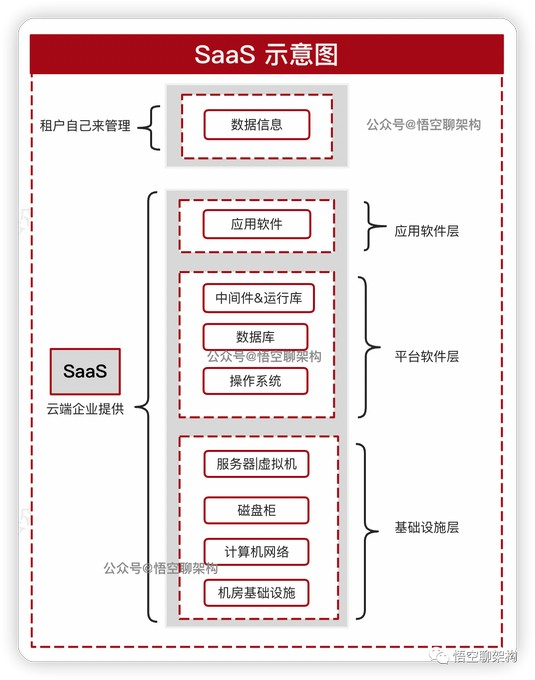
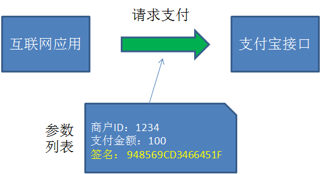
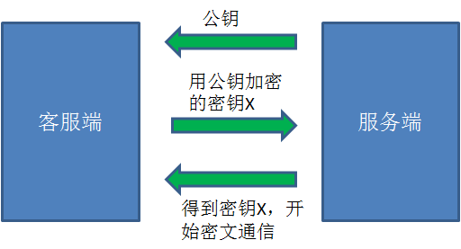
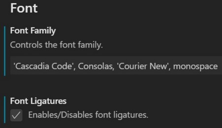
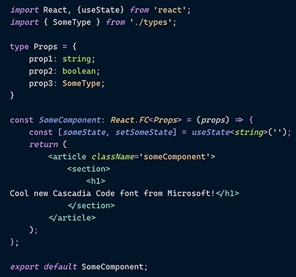
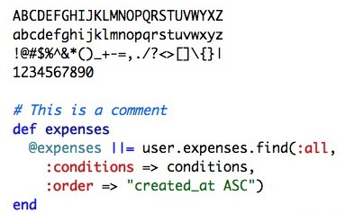

# 其它资料

## 1. APP、软件版本号的命名规范与原则

为了在软件产品生命周期中更好的沟通和标记，我们应该对APP、软件的版本号命名的规范和原则有一定的了解。

### 1.1. APP、软件的版本阶段

- **Alpha版**：也叫α版，此版本主要是以实现软件功能为主，通常只在软件开发者内部交流，一般而言，该版本软件的Bug较多，需要继续修改。
- **Beta版**：此版本相对于α版已经有了很大的改进，消除了严重的错误，但还是存在着一些缺陷，需要经过多次测试来进一步消除，此版本主要的修改对像是软件的UI。
- **RC版**：此版本已经相当成熟了，基本上不存在导致错误的BUG，与即将发行的正式版相差无几，测试人员基本通过的版本。
- **Release版**：此版本意味着“最终版本”、“上线版本”，，在前面版本的一系列测试版之后，终归会有一个正式版本，是最终交付用户使用的一个版本。该版本有时也称为标准版。一般情况下，Release不会以单词形式出现在软件封面上，取而代之的是符号(R)。

### 1.2. 版本号的命名规范与原则

软件版本号有四部分组成：*`<主版本号.><子版本号>.<阶段版本号>.<日期版本号加希腊字母版本号>`*。希腊字母版本号共有5种：base、alpha、beta、RC、Release。 例如：1.1.1.161109_beta

通常，完全的版本号定义，分三项：`<主版本号.><子版本号>.<阶段版本号>`, 1.1.0

### 1.3. 版本号修改规则

- **主版本号(1)**：当功能模块有较大的变动，比如增加多个模块或者整体架构发生变化。此版本号由项目决定是否修改。
- **子版本号(1)**：当功能有一定的增加或变化，比如增加了对权限控制、增加自定义视图等功能。此版本号由项目决定是否修改。
- **阶段版本号(1)**：一般是 Bug 修复或是一些小的变动，要经常发布修订版，时间间隔不限，修复一个严重的bug即可发布一个修订版。此版本号由项目经理决定是否修改。
- **日期版本号(161109)**：用于记录修改项目的当前日期，每天对项目的修改都需要更改日期版本号。此版本号由开发人员决定是否修改。
- **希腊字母版本号(beta)**：此版本号用于标注当前版本的软件处于哪个开发阶段，当软件进入到另一个阶段时需要修改此版本号。此版本号由项目决定是否修改。

### 1.4. 版本号的阶段标识

| **阶段名称** | **阶段标识** |
| ------------ | ------------ |
| 需求控制     | a            |
| 设计阶段     | b            |
| 编码阶段     | c            |
| 单元测试     | d            |
| 单元测试修改  | e            |
| 集成测试     | f            |
| 集成测试修改  | g            |
| 系统测试     | h            |
| 系统测试修改  | i            |
| 验收测试     | j            |
| 验收测试修改  | k            |

## 2. SaaS、PaaS、IaaS 区别

### 2.1. 定义

一般而言，企业有三种云计算服务模式可以选择.

- **软件即服务（SaaS）**：这是一个完整的软件应用程序，具有用户界面
- **平台即服务（PaaS）**：开发人员可以在其中部署自己的应用程序的平台
- **基础设施即服务（IaaS）**：提供机器、存储和网络资源，开发人员可以通过安装自己的操作系统、应用程序和支持资源来管理

#### 2.1.1. IaaS

英文全称 Infrastructure-as-a-Service（基础设施即服务）。IaaS 提供给消费者的服务是对所有<font color=red>**计算基础设施**</font>的利用，包括处理 CPU、内存、存储、网络和其它基本的计算资源，用户能够部署和运行任意软件，包括操作系统和应用程序。

消费者不管理或控制任何云计算基础设施，但能控制操作系统的选择、存储空间、部署的应用，也有可能获得有限制的网络组件（例如路由器、防火墙、负载均衡器等）的控制。

#### 2.1.2. PaaS

英文全称 Platform-as-a-Service（平台即服务）。PaaS 某些时候也叫做中间件。就是把客户采用提供的开发语言和工具（例如Java，python, .Net等）开发的或收购的应用程序部署到供应商的云计算基础设施上去。

客户不需要管理或控制底层的云基础设施，包括网络、服务器、操作系统、存储等，<font color=red>**但客户能控制部署的应用程序，也可能控制运行应用程序的托管环境配置**</font>。

#### 2.1.3. SaaS

英文全称 Software-as-a-Service（软件即服务）。SaaS 提供给客户的服务是运行在云计算基础设施上的应用程序，用户可以在各种设备上通过客户端界面访问，如浏览器。

<font color=red>**消费者不需要管理或控制任何云计算基础设施**</font>，包括网络、服务器、操作系统、存储等等。

### 2.2. 应用场景

- IaaS 会提供场外服务器，存储和网络硬件，用户可以租用。节省了维护成本和办公场地，公司可以在任何时候利用这些硬件来运行其应用。最常见的 IaaS 服务是服务器托管业务，多数的 IDC 都提供这样的服务，用户自己不想要再采购价格昂贵的服务器和磁盘阵列了，所有的硬件都由 IaaS 提供，还能获得品质更高的网络资源。
- PaaS 在网上提供各种开发和分发应用的解决方案，比如虚拟服务器和特定的操作系统。底层的平台铺建好了，用户只需要开发自己的上层应用。节省了在硬件上的费用，也让各类应用的开发更加便捷，不同的工作互相打通也变得容易，因为在同一平台上遵循的是同样的编程语言、协议和底层代码。很多网页应用，应用虚拟主机，存储，安全以及应用开发协作工具等。最常见的 PaaS 平台就有百度 BAE、新浪 SAE、阿里 Ali、腾讯云等等。很多电商平台、视频网站等都可以通过 PaaS 实现快速部署。
- SaaS 是普通使用者最常见，简单地说任何一个远程服务器上的应用都可以通过网络来运行，就是 SaaS 了。最常接触到的是挂在网页或微信上的各类小程序，比如H5的应用如火如荼，这些应用给了IT的门外汉实现自己愿望的机会。国内的互联网巨头竭力推荐的 SaaS 应用比如阿里的钉钉，腾讯的企业微信，这些软件里面应用平台上的可供使用的各类 SaaS 小软件数不胜数，从 OA，到 ERP 到 CRM 等等，涵盖了企业运行所需的几乎所用应用。

### 2.3. 原理

#### 2.3.1. 软件即服务（SaaS）

软件即服务（也称为云应用程序服务）代表了云市场中企业最常用的选项。SaaS 利用互联网向其用户提供应用程序，这些应用程序由第三方供应商管理。大多数 SaaS 应用程序直接通过 Web 浏览器运行，不需要在客户端进行任何下载或安装。

如下图所示，数据信息由租户自己管理，提供 SaaS 服务的企业会将应用软件、平台软件、基础设施都集成好，不需要租户关心底层这些架构。



#### 2.3.2. 平台即服务（PaaS）

PaaS 的交付模式类似于 SaaS，除了通过互联网提供软件，PaaS 提供了一个软件创建平台。该平台通过 Web 提供，使开发人员可以自由地专注于创建软件，同时不必担心操作系统、软件更新，存储或基础架构。PaaS 允许企业使用特殊的软件组件设计和创建内置于 PaaS 中的应用程序。由于具有某些云特性，这些应用程序或中间件具有可扩展性和高可用性。


#### 2.3.3. 基础设施即服务（IaaS）

IaaS 通过虚拟化技术为组织提供云计算基础架构，包括服务器、网络，操作系统和存储等。这些云服务器通常通过仪表盘或API提供给客户端，IaaS 客户端可以完全控制整个基础架构。IaaS 提供与传统数据中心相同的技术和功能，而无需对其进行物理上的维护或管理。IaaS 客户端仍然可以直接访问其服务器和存储，但它们都通过云中的“虚拟数据中心”。

与 SaaS 或 PaaS 相反，IaaS 客户端负责管理应用程序、运行时、操作系统，中间件和数据等方面。但是，IaaS 的提供商管理服务器、硬盘驱动器、网络，虚拟化和存储。一些提供商甚至在虚拟化层之外提供更多服务，例如数据库或消息队列。


## 3. 加密算法

### 3.1. 古代加密历史

古人想出了一种非常朴素的加密方法，被称为**凯撒密码**。加密的原理就像下图这样：


如图所示，图中第一行的字母代表信息的“明文”，第二行字母代表信息的密文。这个加密算法十分简单，就是选择一个偏移量（这里的偏移量是2），把明文当中的所有字母按照字母表的顺序向后偏移两位，从而生成密文。比如：

- 原文的字母A，对应的密文是字母C。
- 原文的字母D，对应的密文是字母F。
- 原文的单词Java，对应的密文是Lcxc。

相应的，按事先约定好了密文的偏移量，把密文的所有字母向前偏移两位，就还原成了明文，这个过程叫做**解密**。

在英语的26个字母中，出现频率最高的字母是e。如果截获了密文，发现这段看不懂的密文当中出现频率最高的字母是g，由于e和g相差两个字母，就可以猜测出密文通信很可能选择2作为偏移量。这样一来，密码就被破解了。最不济，可以把每一种偏移量都尝试一遍（26个字母，最多25种偏移），终究可以试出符合正常语法的偏移量。这种方式被称为**暴力破解**。

### 3.2. 加密算法的种类

在如今的信息安全领域，有各种各样的加密算法凝聚了计算机科学家门的智慧。从宏观上来看，这些加密算法可以归结为三大类：**哈希算法、对称加密算法、非对称加密算法**。

#### 3.2.1. 哈希算法

从严格意义上来说，哈希算法并不属于加密算法，但它在信息安全领域起到了很重要的作用。其中一个重要的作用就是生成信息摘要，用以验证原信息的完整性和来源的可靠性。



支付宝怎么知道这个请求是真的来自该应用，并且没有被篡改呢？

请求的发送方把所有参数，外加双方约定的Key（例子中Key=abc）拼接起来，并利用哈希算法生成了一段信息摘要：

```java
Hash(1234_100_abc) = 948569CD3466451F
```

而请求的接收方在接到参数和摘要之后，按照同样的规则，也把参数和Key拼接起来并生成摘要：

```java
Hash(1234_100_abc) = 948569CD3466451F
```

如果最终发现两端信息摘要一致，证明信息没有被篡改，并且来源确实是该互联网应用。（只要参数修改了一点点，或者Key不一样，那么生成的信息摘要就会完全不同）

生成信息摘要的过程叫做**签名**，验证信息摘要的过程叫做**验签**。

哈希算法包含哪些具体的算法呢？其中最著名的当属**MD5算法**。后来，人们觉得MD5算法生成的信息摘要太短（128位），不够安全，于是又有了**SHA系列算法**。

#### 3.2.2. 对称加密算法


如图所示，一段明文通过密钥进行加密，可以生成一段密文；这段密文通过同样的密钥进行解密，可以还原成明文。这样一来，只要双方事先约定好了密钥，就可以使用密文进行往来通信。数据泄露到了外界，泄露出去的也都是密文。

对称加密包含哪些具体的算法呢？在早期，人们使用**DES算法**进行加密解密；后来，人们觉得DES不够安全，发明了**3DES算法**；而如今，最为流行的对称加密算法是**AES算法**。

总而言之，对称算法的好处是加密解密的效率比较高。相应的，对称算法的缺点是不够安全。因为通信双方约定的密钥是相同的，只要密钥本身被任何一方泄露出去，通信的密文就会被破解；此外，在双方建立通信之初，服务端把密钥告诉给客户端的时候，也有被拦截到的危险。

#### 3.2.3. 非对称加密算法


如图所示，在非对称加密中存在一对密钥，其中一个叫做**公钥**，另一个叫做**私钥**。在加密解密的过程中，我们既可以使用公钥加密明文，使用私钥解密密文；也可以使用私钥加密明文，使用公钥解密密文。

这样设计有什么好处呢？看看通信的过程就知道了：

1. 在双方建立通信的时候，服务端只要把公钥告诉给客户端，自己保留私钥。
2. 客户端利用获得的公钥。加密另外一个密钥X（可以是对称加密的密钥），发送给服务端。
3. 服务端获得消息后，用自己的私钥解密，得到里面隐含的密钥X。
4. 从此以后，双方可以利用密钥X进行对称加密的通信了。



在这个过程中，即使公钥被第三方截获，甚至后续的所有通信都被截获，第三方也无法进行破解。因为第二步利用公钥加密的消息，只有私钥才能解开，所以第三方永远无法知道密钥X是什么。

非对称加密算法的代表如，**RSA算法**。非对称加密就大的缺点就是性能较差，无法应用于长期的通信。

## 4. 编程字体

### 4.1. Cascadia Code

> 下载地址：https://github.com/microsoft/cascadia-code

微软开源了一套新的字体 Cascadia Code。


Cascadia Code 是微软在 5 月份的 Build 大会上宣布推出的等宽字体，微软介绍它是与新的终端 Windows Terminal 一起开发的，官方建议将其与终端应用和 VS、VS Code 等文本编辑器一起使用。Cascadia Code 为命令行和代码编辑器提供了全新的体验，并且它还支持编程连字（Programming Ligatures），就是在编写代码的时候，可以组合字符创建新的字形，这对于代码的可读性和呈现后的用户友好度都是一种很好的机制，同时这也增强了 Windows Terminal 的现代外观。需要注意的是，如果使用的是 VS Code，则必须在设置中启用连字功能才能生效。



字体预览



### 4.2. Fira Code

> 下载地址：https://github.com/tonsky/FiraCode

由 Mozilla (FireFox 的东家) 推出的「Fira Code」就是一款编程连字字体，同样也是一款非常值得推荐使用的优秀代码等宽字体~！！！


### 4.3. Monaco

Mac 的默认字体，好像也只有Mac上有。小字号的时候表现不错，而且再大些也不寒碜。



### 4.4. Source Code Pro

Source Code Pro 是由大名鼎鼎的 Adobe 公司发布的一款开源且完全免费的等宽编程字体，它非常适合用于阅读代码，支持 Linux、Mac OS X 和 Windows 等操作系统，而且无论商业或个人都可以免费使用，相当厚道。这款字体和微软的 Consolas 一样均定位于“编程字体”

- 查看网址：https://adobe-fonts.github.io/source-code-pro/
- 下载地址：https://github.com/adobe-fonts/source-code-pro/


### 4.5. JetBrains Mono

> 官网：https://www.jetbrains.com/lp/mono/

JetBrains 推出了一款名为 "Mono" 的字体。在设计 Mono 字体之初，团队充分考虑了长时间查阅代码可能导致的眼睛疲劳问题，以及受影响的因素，比如字母的大小和形状、空间量、自然等宽平衡、不必要的细节、连字、以及难以区分的符号或字母（l 和 I）和连字等。Mono 字体有许多优点，但它支持的 143 门语言中没有中文，因此**对于中文的显示支持可能不会太好**、Mono 字体还是一款开源且免费的字体，使用者可免费用作任何商业或非商业用途。


它和 Consolas 字体的区别


### 4.6. 其他字体

#### 4.6.1. 齐伋字体

> 官网：https://github.com/LingDong-/qiji-font

齐伋体 (QIJI Font) 是提取自明代木版印刷书籍（凌闵刻本）的字体，亦称作「令东齐伋体」。齐伋体笔画风格书法特征浓郁，比常规的明朝体更具韵律感，富有人文气息，非常适宜用于需要展现人文感、手作感、古拙感的场景。这款字体基于思源宋体改造而来，对中文汉字支持极佳。齐伋体展示效果：


#### 4.6.2. 霞鹜文楷 (LXGW WenKai)

> 官网：https://github.com/lxgw/LxgwWenKai

霞鹜文楷是一款开源中文字体，名字取自于王勃的《滕王阁序》——“落霞与孤鹜齐飞，秋水共长天一色”。霞鹜文楷衍生自开源字体 Klee One，后者是一款日文的教科书字体，由日本著名字体厂商 FONTWORKS 打造，兼有仿宋和楷体的特点。霞鹜文楷基于 Klee One 补全了简繁常用字。


#### 4.6.3. 思源黑体

> 官网：https://github.com/adobe-fonts/source-han-sans

开发商：Google & Adobe。思源黑体（也称作 Source Han Sans 或 Noto Sans CJK）是 Google 和 Adobe 合作打造的开源字体，采用了开源字体许可证 SIL Open Font License，免费且可商用。“思源” 二字取自于成语 “饮水思源”。

思源黑体支持简体中文、繁体中文、日文、韩文以及英文；提供了 ExtraLight、Light、Normal、Regular、Medium、Bold 和 Heavy 共 7 种字体粗细，可以满足不同场景下的文字显示需求。适合设计师、开发者，以及普通用户使用。思源黑体展示效果：


#### 4.6.4. 思源宋体

> 官网：https://source.typekit.com/source-han-serif/cn/

开发商：Google & Adobe。继 “思源黑体” 后，Adobe 和 Google 再度联手创造了 “思源宋体”（称作 Source Han Serif 或 Noto Serif CJK）。思源宋体也采用了开源字体许可证 SIL Open Font License，免费且可商用。

思源宋体同样包含简繁中文以及日韩四种汉字写法和 ExtraLight、Light、Regular，Medium、SemiBold、Bold 和 Black 七种粗细字重，每种粗细字重分别收录了 65535 个字形，七种字重共收录高达 458745 个字形，可以满足不同的设计需求。思源宋体展示效果：


