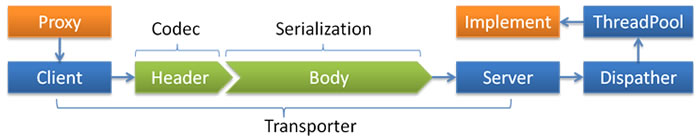
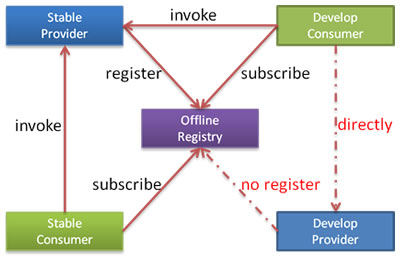
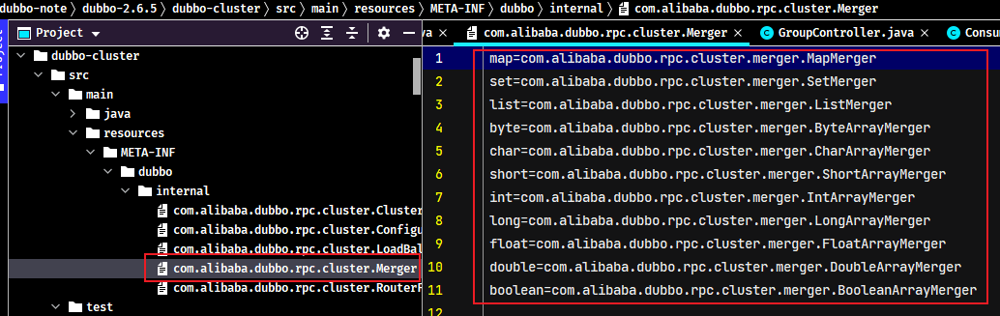
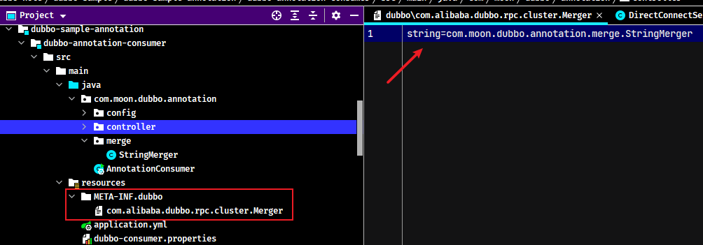
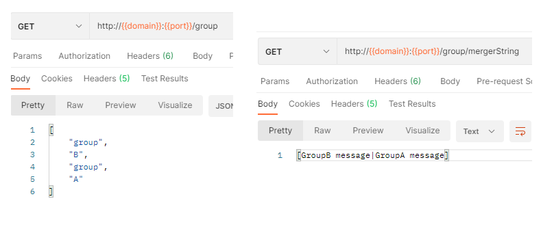
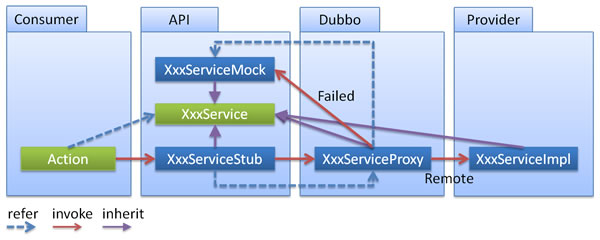
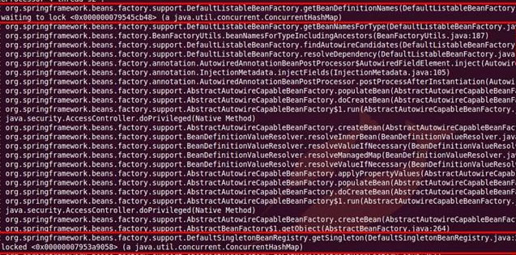
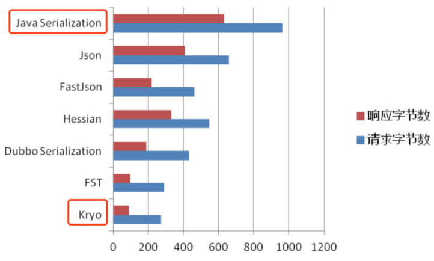

## 1. 启动时检查

Dubbo缺省会在启动时检查依赖的服务是否可用，不可用时会抛出异常，阻止Spring初始化完成，以便上线时，能及早发现问题，默认`check="true"`

可以通过`check="false"`关闭检查，比如，测试时，有些服务不关心，或者出现了循环依赖，必须有一方先启动

另外，如果Spring容器是懒加载的，或者通过API编程延迟引用服务，也需要关闭`check`属性，否则服务临时不可用时，会抛出异常，拿到null引用，如果`check="false"`，总是会返回引用，当服务恢复时，能自动连上

### 1.1. 通过 spring 配置文件

- 关闭某个服务的启动时检查 (没有提供者时报错)：

```xml
<dubbo:reference interface="com.foo.BarService" check="false" />
```

- 关闭所有服务的启动时检查 (没有提供者时报错)：

```xml
<dubbo:consumer check="false" />
```

- 关闭注册中心启动时检查 (注册订阅失败时报错)：

```xml
<dubbo:registry check="false" />
```

### 1.2. 通过 dubbo.properties

```properties
dubbo.reference.com.foo.BarService.check=false
dubbo.reference.check=false # 强制改变所有 reference 的 check 值，就算配置中有声明，也会被覆盖
dubbo.consumer.check=false # 是设置 check 的缺省值，如果配置中有显式的声明，如：<dubbo:reference check="true"/>，不会受影响
dubbo.registry.check=false # 前面两个都是指订阅成功，但提供者列表是否为空是否报错，如果注册订阅失败时，也允许启动，需使用此选项，将在后台定时重试
```

### 1.3. 通过 -D 参数

```bash
java -Ddubbo.reference.com.foo.BarService.check=false
java -Ddubbo.reference.check=false
java -Ddubbo.consumer.check=false
java -Ddubbo.registry.check=false
```

### 1.4. 配置的含义

- `dubbo.reference.check=false`，强制改变所有 reference 的 check 值，就算配置中有声明，也会被覆盖。
- `dubbo.consumer.check=false`，是设置 check 的缺省值，如果配置中有显式的声明，如：`<dubbo:reference check="true"/>`，不会受影响。
- `dubbo.registry.check=false`，前面两个都是指订阅成功，但提供者列表是否为空是否报错，如果注册订阅失败时，也允许启动，需使用此选项，将在后台定时重试。

## 2. Dubbo超时重连

Dubbo 服务在尝试调用一次之后，如出现非业务异常(服务突然不可用、超时等)，Dubbo 默认会进行额外的最多2次重试。重试次数支持两种自定义配置：

1. 通过注解或者xml配置进行固定配置
2. 通过上下文进行运行时动态配置

### 2.1. 重试次数配置

Dubbo消费端在发出请求后，需要有一个临界时间界限来判断服务端是否正常。这样消费端达到超时时间，那么Dubbo会进行重试机制，不合理的重试在一些特殊的业务场景下可能会引发很多问题，需要合理设置接口超时时间。Dubbo超时和重试配置示例如下：

- xml配置

```xml
<!-- 服务调用超时设置为5秒，超时不重试 -->
<dubbo:reference id="xxxService" interface="com.xxx.XxxService" retries="0" timeout="5000"/>
```

- 注解配置

```java
@Reference(retries = 3)
private XxxService xxxService;
```

- 通过RpcContext进行运行时动态配置，优先级高于注解或者xml进行的固定配置(两者都配置的情况下，以RpcContext配置为准)

```java
// dubbo服务调用前，通过RpcContext动态设置本次调用的重试次数
RpcContext rpcContext = RpcContext.getContext();
rpcContext.setAttachment("retries", 5);
```

### 2.2. 重试机制注意点

- Dubbo在调用服务不成功时，*默认会重试2次，即`retries="2"`*。通过设置`<dubbo:reference>`标签中`retries="0"`属性控制重试次数
- Dubbo的路由机制，会把超时的请求路由到其他机器上，而不是本机尝试，所以Dubbo的重试机制也能一定程度的保证服务的质量

## 3. 集群容错

当消费端某次调用失败是一些环境偶然因素造成的（如网络抖动），dubbo还给予了容错补救机会。在集群调用失败时，Dubbo 提供了多种容错方案，缺省为 `failover` 重试。容错方案关系图如下：


各节点关系：

- 这里的 `Invoker` 是 `Provider` 的一个可调用 `Service` 的抽象，`Invoker` 封装了 `Provider` 地址及 `Service` 接口信息
- `Directory` 代表多个` Invoker`，可以把它看成 `List<Invoker>` ，但与 `List` 不同的是，它的值可能是动态变化的，比如注册中心推送变更
- `Cluster` 将 `Directory` 中的多个 `Invoker` 伪装成一个 `Invoker`，对上层透明，伪装过程包含了容错逻辑，调用失败后，重试另一个
- `Router` 负责从多个 `Invoker` 中按路由规则选出子集，比如读写分离，应用隔离等
- `LoadBalance` 负责从多个 `Invoker` 中选出具体的一个用于本次调用，选的过程包含了负载均衡算法，调用失败后，需要重选

### 3.1. 集群容错模式

#### 3.1.1. Failover Cluster

失败自动切换，当出现失败，重试其它服务器。通常用于读操作，但重试会带来更长延迟。可通过 `retries="2"` 来设置重试次数(不含第一次)。

```xml
<!--
    方式1: 重试次数配置
    cluster="failover"属性可以不指定，是默认配置
-->
<dubbo:service retries="2" />
<!-- 方式2 -->
<dubbo:reference retries="2" />
<!-- 方式3 -->
<dubbo:reference>
    <dubbo:method name="findFoo" retries="2" />
</dubbo:reference>
```

> <font color=red>**注：如果服务提供方与消费方都设置了重试次数，最终与消费方的重试次数为准**</font>

#### 3.1.2. Failfast Cluster

快速失败，只发起一次调用，失败立即报错。通常用于非幂等性的写操作，比如新增记录

#### 3.1.3. Failsafe Cluster

失败安全，出现异常时，直接忽略。通常用于写入审计日志等操作。

#### 3.1.4. Failback Cluster

失败自动恢复，后台记录失败请求，定时重发。通常用于消息通知操作。

#### 3.1.5. Forking Cluster

并行调用多个服务器，只要一个成功即返回。通常用于实时性要求较高的读操作，但需要浪费更多服务资源。可通过 `forks="2"` 来设置最大并行数。

#### 3.1.6. Broadcast Cluster

广播调用所有提供者，逐个调用，任意一台报错则报错。通常用于通知所有提供者更新缓存或日志等本地资源信息

### 3.2. 集群模式配置

按照以下示例在服务提供方和消费方配置集群模式

```xml
<dubbo:service cluster="failsafe" />
<dubbo:reference cluster="failsafe" />
```

## 4. 负载均衡

在集群负载均衡时，Dubbo 提供了多种均衡策略，缺省为 `weighted random` 基于权重的随机负载均衡策略。

具体实现上，Dubbo 提供的是客户端负载均衡，即由 Consumer 通过负载均衡算法得出需要将请求提交到哪个 Provider 实例。

### 4.1. 负载均衡策略

目前 Dubbo 内置了如下负载均衡算法，用户可直接配置使用：

|              算法              |         特性          |                     备注                      |      配置值       |
| ----------------------------- | -------------------- | -------------------------------------------- | ---------------- |
| Weighted Random LoadBalance   | 加权随机              | 默认算法，默认权重相同                           | random (默认)     |
| RoundRobin LoadBalance        | 加权轮询              | 借鉴于 Nginx 的平滑加权轮询算法，默认权重相同，     | roundrobin       |
| LeastActive LoadBalance       | 最少活跃优先 + 加权随机 | 背后是能者多劳的思想                            | leastactive      |
| Shortest-Response LoadBalance | 最短响应优先 + 加权随机 | 更加关注响应速度                                | shortestresponse |
| ConsistentHash LoadBalance    | 一致性哈希             | 确定的入参，确定的提供者，适用于有状态请求          | consistenthash   |
| P2C LoadBalance               | Power of Two Choice  | 随机选择两个节点后，继续选择“连接数”较小的那个节点。 | p2c              |
| Adaptive LoadBalance          | 自适应负载均衡         | 在 P2C 算法基础上，选择二者中 load 最小的那个节点  | adaptive         |

> 注意：配置时负载均衡策略的单词都是**全小写**，如果出现大写会报错

- Weighted Random LoadBalance：加权随机，按权重设置随机概率。在一个截面上碰撞的概率高，但调用量越大分布越均匀，而且按概率使用权重后也比较均匀，有利于动态调整提供者权重。
- RoundRobin LoadBalance：轮询，按公约后的权重设置轮询比率。存在慢的提供者累积请求的问题，比如：第二台机器很慢，但没挂，当请求调到第二台时就卡在那，久而久之，所有请求都卡在调到第二台上。
- LeastActive LoadBalance：最少活跃调用数，相同活跃数的随机，活跃数指调用前后计数差。使慢的提供者收到更少请求，因为越慢的提供者的调用前后计数差会越大。
- ConsistentHash LoadBalance：一致性 Hash，相同参数的请求总是发到同一提供者。当某一台提供者挂时，原本发往该提供者的请求，基于虚拟节点，平摊到其它提供者，不会引起剧烈变动。
    - 缺省只对第一个参数 Hash，如果要修改，请配置 `<dubbo:parameter key="hash.arguments" value="0,1" />`
    - 缺省用 160 份虚拟节点，如果要修改，请配置 `<dubbo:parameter key="hash.nodes" value="320" />`

### 4.2. 配置示例

Dubbo 支持在服务提供者一侧配置默认的负载均衡策略，这样所有的消费者都将默认使用提供者指定的负载均衡策略。消费者可以自己配置要使用的负载均衡策略，如果都没有任何配置，则默认使用<u>随机负载均衡策略</u>。

同一个应用内支持配置不同的服务使用不同的负载均衡策略，支持为同一服务的不同方法配置不同的负载均衡策略。

- 服务端服务级别

```xml
<dubbo:service interface="..." loadbalance="roundrobin" />
```

- 客户端服务级别

```xml
<dubbo:reference interface="..." loadbalance="roundrobin" />
```

- 服务端方法级别

```xml
<dubbo:service interface="...">
    <dubbo:method name="..." loadbalance="roundrobin"/>
</dubbo:service>
```

- 客户端方法级别

```xml
<dubbo:reference interface="...">
    <dubbo:method name="..." loadbalance="roundrobin"/>
</dubbo:reference>
```

## 5. 线程模型

### 5.1. 配置 Dubbo 中的线程模型

如果事件处理的逻辑能迅速完成，并且不会发起新的 IO 请求，比如只是在内存中记个标识，则直接在 IO 线程上处理更快，因为减少了线程池调度。

但如果事件处理逻辑较慢，或者需要发起新的 IO 请求，比如需要查询数据库，则必须派发到线程池，否则 IO 线程阻塞，将导致不能接收其它请求。

如果用 IO 线程处理事件，又在事件处理过程中发起新的 IO 请求，比如在连接事件中发起登录请求，会报“可能引发死锁”异常，但不会真死锁。



需要通过不同的派发策略和不同的线程池配置的组合来应对不同的场景：

```xml
<dubbo:protocol name="dubbo" dispatcher="all" threadpool="fixed" threads="100" />
```

### 5.2. Dispatcher 属性

- `all` 所有消息都派发到线程池，包括请求，响应，连接事件，断开事件，心跳等。
- `direct` 所有消息都不派发到线程池，全部在 IO 线程上直接执行。
- `message` 只有请求响应消息派发到线程池，其它连接断开事件，心跳等消息，直接在 IO 线程上执行。
- `execution` 只有请求消息派发到线程池，不含响应，响应和其它连接断开事件，心跳等消息，直接在 IO 线程上执行。
- `connection` 在 IO 线程上，将连接断开事件放入队列，有序逐个执行，其它消息派发到线程池。

### 5.3. ThreadPool 属性

- `fixed` 固定大小线程池，启动时建立线程，不关闭，一直持有。(缺省)
- `cached` 缓存线程池，空闲一分钟自动删除，需要时重建。
- `limited` 可伸缩线程池，但池中的线程数只会增长不会收缩。只增长不收缩的目的是为了避免收缩时突然来了大流量引起的性能问题。
- `eager` 优先创建Worker线程池。在任务数量大于`corePoolSize`但是小于`maximumPoolSize`时，优先创建Worker来处理任务。当任务数量大于`maximumPoolSize`时，将任务放入阻塞队列中。阻塞队列充满时抛出`RejectedExecutionException`。(相比于`cached`:`cached`在任务数量超过`maximumPoolSize`时直接抛出异常而不是将任务放入阻塞队列)

## 6. 直连提供者

在开发及测试环境下，经常需要绕过注册中心，只测试指定服务提供者，这时候可能需要点对点直连，点对点直连方式，将以服务接口为单位，忽略注册中心的提供者列表，A 接口配置点对点，不影响 B 接口从注册中心获取列表。

> <font color=red>**为了避免复杂化线上环境，不要在线上使用这个功能，只应在测试阶段使用。**</font>

### 6.1. 通过 XML 配置

如果是线上需求需要点对点，可在 `<dubbo:reference>` 中配置 url 指向提供者，将绕过注册中心，多个地址用分号隔开，配置如下：

```xml
<dubbo:reference id="xxxService" interface="com.alibaba.xxx.XxxService" url="dubbo://localhost:20890" />
```

### 6.2. 通过 -D 参数指定

在JVM启动参数中加入`-D`参数映射服务地址，如：

```bash
java -Dcom.alibaba.xxx.XxxService=dubbo://localhost:20890
```

> key 为服务名，value 为服务提供者 url，此配置优先级最高

### 6.3. 通过文件映射

如果服务比较多，也可以用文件映射，用 `-Ddubbo.resolve.file` 指定映射文件路径，此配置优先级高于 `<dubbo:reference>` 中的配置，如：

```bash
java -Ddubbo.resolve.file=xxx.properties
```

然后在映射文件 xxx.properties 中加入配置，其中 key 为服务名，value 为服务提供者 URL：

```bash
com.alibaba.xxx.XxxService=dubbo://localhost:20890
```

> 1.0.15 及以上版本支持，2.0 以上版本自动加载`${user.home}/dubbo-resolve.properties`文件，不需要配置

## 7. 只订阅

### 7.1. 只订阅不注册

场景：在本地开发的时候，不能把自己机器的未开发好的服务注册到开发环境，但是又需要使用注册中心的其他服务。服务提供者配置禁止注册`register="false"`

为方便开发测试，经常会在线下共用一个所有服务可用的注册中心，这时，如果一个正在开发中的服务提供者注册，可能会影响消费者不能正常运行。可以让服务提供者开发方，只订阅服务(开发的服务可能依赖其它服务)，而不注册正在开发的服务，通过直连测试正在开发的服务。



禁用注册配置如下：

```xml
<dubbo:registry address="10.20.153.10:9090" register="false" />
<!-- 或者 -->
<dubbo:registry address="10.20.153.10:9090?register=false" />
```

### 7.2. 只注册(已废弃？)

如果有两个镜像环境，两个注册中心，有一个服务只在其中一个注册中心有部署，另一个注册中心还没来得及部署，而两个注册中心的其它应用都需要依赖此服务。这个时候，可以让服务提供者方只注册服务到另一注册中心，而不从另一注册中心订阅服务

比如开发环境为了省机器，没有部署某个服务，如短信/邮件功能。但整个系统又必须要调用它。此时可以借用一下测试环境的此服务（不能影响测试环境原本的服务闭环）。将测试环境的短信/邮件服务也向开发环境注册一份，只注册（其依赖的服务必须还是测试环境的）。服务提供者配置禁止订阅`subscribe="false"`

```xml
<!-- 禁用订阅配置 -->
<dubbo:registry id="hzRegistry" address="10.20.153.10:9090" />
<dubbo:registry id="qdRegistry" address="10.20.141.150:9090" subscribe="false" />
<!-- 或者 -->
<dubbo:registry id="hzRegistry" address="10.20.153.10:9090" />
<dubbo:registry id="qdRegistry" address="10.20.141.150:9090?subscribe=false" />
```

## 8. 多协议

Dubbo 允许配置多协议，在不同服务上支持不同协议或者同一服务上同时支持多种协议。

### 8.1. 不同服务不同协议

不同服务在性能上适用不同协议进行传输，比如大数据用短连接协议，小数据大并发用长连接协议

```xml
<dubbo:application name="world"  />
<dubbo:registry id="registry" address="10.20.141.150:9090" username="admin" password="hello1234" />
<!-- 多协议配置 -->
<dubbo:protocol name="dubbo" port="20880" />
<dubbo:protocol name="rmi" port="1099" />
<!-- 使用dubbo协议暴露服务 -->
<dubbo:service interface="com.alibaba.hello.api.HelloService" version="1.0.0" ref="helloService" protocol="dubbo" />
<!-- 使用rmi协议暴露服务 -->
<dubbo:service interface="com.alibaba.hello.api.DemoService" version="1.0.0" ref="demoService" protocol="rmi" />
```

### 8.2. 多协议暴露服务

同一个服务，使用多个协议暴露

```xml
<!-- 多协议配置 -->
<dubbo:protocol name="dubbo" port="20880" />
<dubbo:protocol name="hessian" port="8080" />
<!-- 使用多个协议暴露服务 -->
<dubbo:service id="helloService" interface="com.alibaba.hello.api.HelloService" version="1.0.0" protocol="dubbo,hessian" />
```

## 9. 多注册中心

Dubbo 支持同一服务向多注册中心同时注册，或者不同服务分别注册到不同的注册中心上去，甚至可以同时引用注册在不同注册中心上的同名服务。另外，注册中心是支持自定义扩展的。

### 9.1. 多注册中心注册

比如：中文站有些服务来不及在青岛部署，只在杭州部署，而青岛的其它应用需要引用此服务，就可以将服务同时注册到两个注册中心。

```xml
dubbo:application name="world" />
<!-- 多注册中心配置 -->
<dubbo:registry id="hangzhouRegistry" address="10.20.141.150:9090" />
<dubbo:registry id="qingdaoRegistry" address="10.20.141.151:9010" default="false" />
<!-- 向多个注册中心注册 -->
<dubbo:service interface="com.alibaba.hello.api.HelloService" version="1.0.0" ref="helloService" registry="hangzhouRegistry,qingdaoRegistry" />
```

### 9.2. 不同服务使用不同注册中心

比如：CRM 有些服务是专门为国际站设计的，有些服务是专门为中文站设计的。

```xml
<dubbo:application name="world"  />
<!-- 多注册中心配置 -->
<dubbo:registry id="chinaRegistry" address="10.20.141.150:9090" />
<dubbo:registry id="intlRegistry" address="10.20.154.177:9010" default="false" />
<!-- 向中文站注册中心注册 -->
<dubbo:service interface="com.alibaba.hello.api.HelloService" version="1.0.0" ref="helloService" registry="chinaRegistry" />
<!-- 向国际站注册中心注册 -->
<dubbo:service interface="com.alibaba.hello.api.DemoService" version="1.0.0" ref="demoService" registry="intlRegistry" />
```

### 9.3. 多注册中心引用

比如：CRM 需同时调用中文站和国际站的 PC2 服务，PC2 在中文站和国际站均有部署，接口及版本号都一样，但连的数据库不一样。

```xml
<dubbo:application name="world"  />
<!-- 多注册中心配置 -->
<dubbo:registry id="chinaRegistry" address="10.20.141.150:9090" />
<dubbo:registry id="intlRegistry" address="10.20.154.177:9010" default="false" />
<!-- 引用中文站服务 -->
<dubbo:reference id="chinaHelloService" interface="com.alibaba.hello.api.HelloService" version="1.0.0" registry="chinaRegistry" />
<!-- 引用国际站站服务 -->
<dubbo:reference id="intlHelloService" interface="com.alibaba.hello.api.HelloService" version="1.0.0" registry="intlRegistry" />
```

如果只是测试环境临时需要连接两个不同注册中心，使用竖号分隔多个不同注册中心地址：

```xml
<dubbo:application name="world" />
<!-- 多注册中心配置，竖号分隔表示同时连接多个不同注册中心，同一注册中心的多个集群地址用逗号分隔 -->
<dubbo:registry address="10.20.141.150:9090|10.20.154.177:9010" />
<!-- 引用服务 -->
<dubbo:reference id="helloService" interface="com.alibaba.hello.api.HelloService" version="1.0.0" />
```

## 10. 服务分组

**使用服务分组区分服务接口的不同实现**

如果想在测试、开发环境等多套环境中共用同一个注册中心。或者当一个接口有多种实现时，可以用 group 区分

- 服务提供方

```xml
<dubbo:service group="feedback" interface="com.xxx.IndexService" />
<dubbo:service group="member" interface="com.xxx.IndexService" />
```

- 引用消费方

```xml
<dubbo:reference id="feedbackIndexService" group="feedback" interface="com.xxx.IndexService" />
<dubbo:reference id="memberIndexService" group="member" interface="com.xxx.IndexService" />
```

- 任意组：2.2.0 以上版本支持，总是只调一个可用组的实现

```xml
<dubbo:reference id="barService" interface="com.foo.BarService" group="*" />
```

## 11. 分组聚合

dubbo提供了通过分组对结果进行聚合并返回聚合后的结果的功能。用`group`区分同一接口的多种实现，现在消费方需从每种`group`中调用一次并返回结果，对结果进行合并之后返回

dubbo提供了以下类型的合并的实现，是根据服务接口的返回值的类型去找相应的实现

> <font color=red>**值得注意：这个服务返回值合并只是一次PRC调用，如果其中某个服务执行失败，则调用结果失败。**</font>



### 11.1. 配置示例

- 搜索所有分组

```xml
<dubbo:reference interface="com.xxx.MenuService" group="*" merger="true" />
```

- 合并指定分组

```xml
<dubbo:reference interface="com.xxx.MenuService" group="aaa,bbb" merger="true" />
```

- 指定方法合并结果，其它未指定的方法，将只调用一个 Group

```xml
<dubbo:reference interface="com.xxx.MenuService" group="*">
    <dubbo:method name="getMenuItems" merger="true" />
</dubbo:reference>
```

- 某个方法不合并结果，其它都合并结果

```xml
<dubbo:reference interface="com.xxx.MenuService" group="*" merger="true">
    <dubbo:method name="getMenuItems" merger="false" />
</dubbo:reference>
```

- 指定合并策略，缺省根据返回值类型自动匹配，如果同一类型有两个合并器时，需指定合并器的名称

```xml
<dubbo:reference interface="com.xxx.MenuService" group="*">
    <dubbo:method name="getMenuItems" merger="mymerge" />
</dubbo:reference>
```

- 指定合并方法，将调用返回结果的指定方法进行合并，合并方法的参数类型必须是返回结果类型本身

```xml
<dubbo:reference interface="com.xxx.MenuService" group="*">
    <dubbo:method name="getMenuItems" merger=".addAll" />
</dubbo:reference>
```

### 11.2. 聚合实现示例

官方没有提供`String`类型的实现，如合并字符串类型，需要自己实现。具体的实现步骤如下：

- 根据dubbo的SPI机制（参考`com.alibaba.dubbo.rpc.cluster.Merger`文件），在创建与官方一样的文件`com.alibaba.dubbo.rpc.cluster.Merger`，定义字符串合并与实现类的映射



- 编写合并逻辑的实现类，需要实现dubbo的`Merger<T>`接口。

```java
public class StringMerger implements Merger<String> {

    /**
     * 定义了所有group实现类返回值的合并规则。
     * 注：此示例简单实现
     *
     * @param items
     * @return
     */
    @Override
    public String merge(String... items) {
        if (items.length == 0) {
            return null;
        }
        StringJoiner joiner = new StringJoiner("|", "[", "]");
        for (String s : items) {
            joiner.add(s);
        }
        return joiner.toString();
    }
}
```

- 服务引用配置`group`属性，通过 parameters 属性修改为 `{"merger", "true"}`，开启返回结果合并

```java
@RestController
@RequestMapping("group")
public class GroupController {

    /*
     * group属性：指定相应的服务接口的实现
     *          如果取值为"*"，则代表任意组，是随机调用不同的实现
     * 如果需要将服务分组的返回结果进行合并，只需修改 parameters 属性，{"merger", "true"}
     */
    // @Reference(group = "groupB")
    @Reference(group = "*", parameters = {"merger", "true"})
    private GroupService groupService;

    @GetMapping
    public List<String> testGroup() {
        return groupService.queryGroupData();
    }

    @GetMapping("mergerString")
    public String testMergerString() {
        return groupService.getGroupMessage();
    }

}
```

测试结果



## 12. 静态服务

**将 Dubbo 服务标识为非动态管理模式**。如希望人工管理服务提供者的上线和下线，此时需将注册中心标识为非动态管理模式。

```xml
<dubbo:registry address="10.20.141.150:9090" dynamic="false" />
<!-- 或者 -->
<dubbo:registry address="10.20.141.150:9090?dynamic=false" />
```

服务提供者初次注册时为禁用状态，需人工启用。断线时，将不会被自动删除，需人工禁用。（*通过代码调用接口的方式去操作`Registry`注册服务*）

如果是一个第三方服务提供者，比如 memcached，可以直接向注册中心写入提供者地址信息，消费者正常使用：

```java
RegistryFactory registryFactory = ExtensionLoader.getExtensionLoader(RegistryFactory.class).getAdaptiveExtension();
Registry registry = registryFactory.getRegistry(URL.valueOf("zookeeper://10.20.153.10:2181"));
registry.register(URL.valueOf("memcached://10.20.153.11/com.foo.BarService?category=providers&dynamic=false&application=foo"));
```

## 13. 多版本

- 当一个接口实现，出现不兼容升级时，可以用版本号过渡，版本号不同的服务相互间不引用
- 服务端提供接口的实现升级时，可由dubbo的版本号操作进行过渡。如果上线上测试新版本接口有缺陷，为了不影响业务，要迅速切回原版本接口，最大程度减少损失。

版本迁移步骤：

1. 在低压力时间段，先升级一半提供者为新版本
2. 再将所有消费者升级为新版本
3. 然后将剩下的一半提供者升级为新版本

- 提供者配置

```xml
<!-- 版本1接口 -->
<dubbo:service interface="com.xxx.XxxServices" ref="xxxService" version="1.0.0"/>
<!-- 版本2接口 -->
<dubbo:service interface="com.xxx.XxxServices" ref="xxxService2" version="2.0.0"/>
```

- 服务消费者配置

```xml
<!-- 指定版本 -->
<dubbo:reference id="xxxService1.0" interface="com.xxx.XxxServices" version="2.0.0"/>
<!-- 不区分版本 -->
<dubbo:reference id="xxxService" interface="com.xxx.XxxServices" version="*"/>
```

## 14. 参数校验

dubbo的参数验证功能是基于 JSR303 实现的，用户只需标识 JSR303 标准的验证 annotation，并通过声明 filter 来实现验证。

### 14.1. Maven 依赖

```xml
<dependency>
    <groupId>javax.validation</groupId>
    <artifactId>validation-api</artifactId>
    <version>2.0.1.Final</version>
</dependency>
<dependency>
    <groupId>org.hibernate</groupId>
    <artifactId>hibernate-validator</artifactId>
    <version>7.0.0.Final</version>
</dependency>
```

### 14.2. 参数校验示例


## 15. 结果缓存

结果缓存（*2.1.0 以上版本支持*），用于加速热门数据的访问速度，Dubbo 提供声明式缓存，以减少用户加缓存的工作量

### 15.1. 缓存类型

- `lru`：基于最近最少使用原则删除多余缓存，保持最热的数据被缓存。
- `threadlocal`：当前线程缓存，比如一个页面渲染，用到很多 portal，每个 portal 都要去查用户信息，通过线程缓存，可以减少这种多余访问。
- `jcache`：与 JSR107 集成，可以桥接各种缓存实现

### 15.2. 配置示例

```xml
<!-- 以消费方为例，可以配置全局缓存策略，这样所有服务引用都启动缓存 -->
<dubbo:consumer cache="lru"/>

<!-- 仅对某个服务引用配置缓存策略 -->
<dubbo:reference interface="com.foo.BarService" cache="lru" />

<!-- 还支持对单个方法启用缓存策略 -->
<dubbo:reference interface="com.foo.BarService">
    <dubbo:method name="findBar" cache="lru" />
</dubbo:reference>
```

> **服务方配置方法与消费端完全一样**

## 16. 泛化调用

### 16.1. 使用泛化调用

实现一个通用的服务测试框架，可通过 `GenericService` 调用所有服务实现。

泛化接口调用方式主要用于客户端没有 API 接口及模型类元的情况，参数及返回值中的所有 POJO 均用 `Map` 表示，通常用于框架集成，比如：实现一个通用的服务测试框架，可通过 `GenericService` 调用所有服务实现。

> 注：此功能一般只是用于开发/测试阶段。

#### 16.1.1. 通过 Spring 使用泛化调用

在 Spring 配置申明 `generic="true"`：

```xml
<dubbo:reference id="barService" interface="com.foo.BarService" generic="true" />
```

在 Java 代码获取 barService 并开始泛化调用：

```java
GenericService barService = (GenericService) applicationContext.getBean("barService");
Object result = barService.$invoke("sayHello", new String[] { "java.lang.String" }, new Object[] { "World" });
```

#### 16.1.2. 通过 API 方式使用泛化调用

```java
import org.apache.dubbo.rpc.service.GenericService;
...

// 引用远程服务
// 该实例很重量，里面封装了所有与注册中心及服务提供方连接，请缓存
ReferenceConfig<GenericService> reference = new ReferenceConfig<GenericService>();
// 弱类型接口名
reference.setInterface("com.xxx.XxxService");
reference.setVersion("1.0.0");
// 声明为泛化接口
reference.setGeneric(true);

// 用org.apache.dubbo.rpc.service.GenericService可以替代所有接口引用
GenericService genericService = reference.get();

// 基本类型以及Date,List,Map等不需要转换，直接调用
Object result = genericService.$invoke("sayHello", new String[] {"java.lang.String"}, new Object[] {"world"});

// 用Map表示POJO参数，如果返回值为POJO也将自动转成Map
Map<String, Object> person = new HashMap<String, Object>();
person.put("name", "xxx");
person.put("password", "yyy");
// 如果返回POJO将自动转成Map
Object result = genericService.$invoke("findPerson", new String[]{"com.xxx.Person"}, new Object[]{person});
...
```

POJO

```java
@Data
public class PersonImpl implements Person {
    private String name;
    private String password;
}
```

则 POJO 请求数据：

```java
Person person = new PersonImpl();
person.setName("xxx");
person.setPassword("yyy");
```

请求时可用下面 Map 表示：

```java
Map<String, Object> map = new HashMap<String, Object>();
// 注意：如果参数类型是接口，或者List等丢失泛型，可通过class属性指定类型。
map.put("class", "com.xxx.PersonImpl");
map.put("name", "xxx");
map.put("password", "yyy");
```

### 16.2. 实现泛化调用示例

通过实现 `GenericService` 接口处理所有服务请求

泛接口实现方式主要用于服务器端没有 API 接口及模型类元的情况，参数及返回值中的所有 POJO 均用 Map 表示，通常用于框架集成，比如：实现一个通用的远程服务 Mock 框架，可通过实现 `GenericService` 接口处理所有服务请求。

以下是一个实现调用其他业务层方法的简单思路。

```java
@Service
public class MyGenericService implements GenericService, ApplicationContextAware {

    private ApplicationContext context;

    /**
     * Generic invocation
     *
     * @param method         Method name, e.g. findPerson. If there are overridden methods, parameter info is
     *                       required, e.g. findPerson(java.lang.String)
     * @param parameterTypes Parameter types
     * @param args           Arguments
     * @return invocation return value
     * @throws Throwable potential exception thrown from the invocation
     */
    @Override
    public Object $invoke(String method, String[] parameterTypes, Object[] args) throws GenericException {
        StringJoiner joiner = new StringJoiner("; ", "[ ", " ]");
        joiner.add("method name is " + method);
        if (parameterTypes.length > 0) {
            for (int i = 0; i < parameterTypes.length; i++) {
                joiner.add("parameterType[" + i + "] is " + parameterTypes[i]);
            }
        }
        if (args.length > 0) {
            for (int i = 0; i < args.length; i++) {
                joiner.add("args[" + i + "] is " + args[i]);
            }
        }
        String result = joiner.toString();
        System.out.println("泛化调用 MyGenericService 实现==> " + result);

        /*
         * 这里做简单的判断，直接调用spring容器中的实例方法。
         * 注：这是写死的调用，实际项目中的应用是通过反射或者从spring容器去调用相应的方法
         */
        if ("getResult".equals(method)) {
            GenericCallService genericCallService = context.getBean(GenericCallService.class);
            result = genericCallService.getResult((String) args[0]);
        }

        return result;
    }

    @Override
    public void setApplicationContext(ApplicationContext applicationContext) throws BeansException {
        this.context = applicationContext;
    }

}
```

#### 16.2.1. 通过 Spring 暴露泛化实现

在 Spring 配置申明服务的实现：

```xml
<bean id="genericService" class="com.foo.MyGenericService" />
<dubbo:service interface="com.foo.BarService" ref="genericService" />
```

#### 16.2.2. 通过 API 方式暴露泛化实现

```java
...
// 用org.apache.dubbo.rpc.service.GenericService可以替代所有接口实现
GenericService xxxService = new XxxGenericService();

// 该实例很重量，里面封装了所有与注册中心及服务提供方连接，请缓存
ServiceConfig<GenericService> service = new ServiceConfig<GenericService>();
// 弱类型接口名
service.setInterface("com.xxx.XxxService");
service.setVersion("1.0.0");
// 指向一个通用服务实现
service.setRef(xxxService);

// 暴露及注册服务
service.export();
```

## 17. 回声测试

回声测试用于检测服务是否可用，回声测试按照正常请求流程执行，能够测试整个调用是否通畅，可用于监控。

所有服务自动实现 `EchoService` 接口，只需将任意服务引用强制转型为 `EchoService`，即可使用。

Spring 配置：

```xml
<dubbo:reference id="memberService" interface="com.xxx.MemberService" />
```

代码：

```java
// 远程服务引用
MemberService memberService = ctx.getBean("memberService");
EchoService echoService = (EchoService) memberService; // 强制转型为EchoService
// 回声测试可用性
String status = echoService.$echo("OK");
assert(status.equals("OK"));
```

## 18. 上下文信息

上下文中存放的是当前调用过程中所需的环境信息。所有配置信息都将转换为 URL 的参数。

`RpcContext` 是一个 `ThreadLocal` 的临时状态记录器，当接收到 RPC 请求，或发起 RPC 请求时，`RpcContext` 的状态都会变化。比如：A 调 B，B 再调 C，则 B 机器上，在 B 调 C 之前，`RpcContext` 记录的是 A 调 B 的信息，在 B 调 C 之后，`RpcContext` 记录的是 B 调 C 的信息。

> <font color=red>**注：每一次RPC调用的上下文信息对象都不一样。**</font>

### 18.1. 服务消费方

```java
// 远程调用
xxxService.xxx();
// 本端是否为消费端，这里会返回true
boolean isConsumerSide = RpcContext.getContext().isConsumerSide();
// 获取最后一次调用的提供方IP地址
String serverIP = RpcContext.getContext().getRemoteHost();
// 获取当前服务配置信息，所有配置信息都将转换为URL的参数
String application = RpcContext.getContext().getUrl().getParameter("application");
// 注意：每发起RPC调用，上下文状态会变化
yyyService.yyy();
```

### 18.2. 服务提供方

```java
public class XxxServiceImpl implements XxxService {
    public void xxx() {
        // 本端是否为提供端，这里会返回true
        boolean isProviderSide = RpcContext.getContext().isProviderSide();
        // 获取调用方IP地址
        String clientIP = RpcContext.getContext().getRemoteHost();
        // 获取当前服务配置信息，所有配置信息都将转换为URL的参数
        String application = RpcContext.getContext().getUrl().getParameter("application");
        // 注意：每发起RPC调用，上下文状态会变化
        yyyService.yyy();
        // 此时本端变成消费端，这里会返回false
        boolean isProviderSide = RpcContext.getContext().isProviderSide();
    }
}
```

## 19. 上下文信息 - 隐式参数

在 Dubbo 中，可以通过 `RpcContext` 上的 `setAttachment` 和 `getAttachment` 来设置在服务消费方和提供方之间隐式传递参数。

> 注意：path, group, version, dubbo, token, timeout 几个 key 是保留字段，请使用其它值。


### 19.1. 在服务消费方端设置隐式参数

`setAttachment` 设置的 KV 对，在完成下面一次远程调用会被清空，即多次远程调用要多次设置。

```java
RpcContext.getContext().setAttachment("index", "1"); // 隐式传参，后面的远程调用都会隐式将这些参数发送到服务器端，类似cookie，用于框架集成，不建议常规业务使用
xxxService.xxx(); // 远程调用
// ...
```

### 19.2. 在服务提供方端获取隐式参数

```java
public class XxxServiceImpl implements XxxService {
    public void xxx() {
        // 获取客户端隐式传入的参数，用于框架集成，不建议常规业务使用
        String index = RpcContext.getContext().getAttachment("index");
    }
}
```

## 20. 异步

> 注意：
>
> Provider 端异步执行和 Consumer 端异步调用是相互独立的，你可以任意正交组合两端配置
>
> - Consumer同步 - Provider同步
> - Consumer异步 - Provider同步
> - Consumer同步 - Provider异步
> - Consumer异步 - Provider异步

### 20.1. 异步执行

Dubbo 服务提供方的异步执行。Provider端异步执行将阻塞的业务从Dubbo内部线程池切换到业务自定义线程，避免Dubbo线程池的过度占用，有助于避免不同服务间的互相影响。<font color=red>**异步执行无益于节省资源或提升RPC响应性能（只是提高了应用的吞量）**</font>，因为如果业务执行需要阻塞，则始终还是要有线程来负责执行。

#### 20.1.1. 定义 CompletableFuture 签名的接口

服务接口定义

```java
public interface AsyncService {
    CompletableFuture<String> doAsync(String name);
}
```

服务实现

```java
@Service
public class AsyncServiceImpl implements AsyncService {
    /**
     * 定义 CompletableFuture 签名的接口.
     * 通过 return CompletableFuture.supplyAsync() ，
     * 业务执行已从 Dubbo 线程切换到业务线程，避免了对 Dubbo 线程池的阻塞。
     *
     * @param name
     * @return
     */
    @Override
    public CompletableFuture<String> doAsync(String name) {
        System.out.println("[annotation provider] AsyncService 接口实现 doAsync 方法执行...");
        RpcContext savedContext = RpcContext.getContext();
        // 建议为supplyAsync提供自定义线程池，避免使用JDK公用线程池。
        // 业务执行已从 Dubbo 线程切换到业务线程，避免了对 Dubbo 线程池的阻塞。
        return CompletableFuture.supplyAsync(() -> {
            System.out.println("receive form consumer: " + savedContext.getAttachment("consumer-key"));
            try {
                Thread.sleep(30000); // 休眠，模拟处理复杂业务
            } catch (InterruptedException e) {
                e.printStackTrace();
            }
            return "async response from annotation provider doAsync: " + name;
        });
    }
}
```

注：通过 `return CompletableFuture.supplyAsync()`，业务执行已从 Dubbo 线程切换到业务线程，避免了对 Dubbo 线程池的阻塞。

#### 20.1.2. 使用AsyncContext（2.7.0版本后）

Dubbo 在2.7.0版本后提供了一个类似 Serverlet 3.0 的异步接口`AsyncContext`，在没有 `CompletableFuture` 签名接口的情况下，也可以实现 Provider 端的异步执行。

服务接口定义：

```java
public interface AsyncService {
    String doAsyncOther(String name);
}
```

服务暴露，和普通服务完全一致：

```java
<bean id="asyncService" class="org.apache.dubbo.samples.governance.impl.AsyncServiceImpl"/>
<dubbo:service interface="org.apache.dubbo.samples.governance.api.AsyncService" ref="asyncService"/>
```

服务实现：

```java
@Service
public class AsyncServiceImpl implements AsyncService {
    /**
     * 2.7.0版本 使用AsyncContext
     * Dubbo 提供了一个类似 Serverlet 3.0 的异步接口AsyncContext，
     * 在没有 CompletableFuture 签名接口的情况下，也可以实现 Provider 端的异步执行。
     *
     * @param name
     * @return
     */
    @Override
    public String doAsyncOther(String name) {
        System.out.println("[annotation provider] AsyncService 接口实现 doAsyncOther 方法执行...");
        // 以下方式是 dubbo 2.7.0 版本后的全异步编程
        final AsyncContext asyncContext = RpcContext.startAsync();
        new Thread(() -> {
            // 如果要使用上下文，则必须要放在第一句执行
            asyncContext.signalContextSwitch();
            try {
                Thread.sleep(15000); // 休眠，模拟处理复杂业务
            } catch (InterruptedException e) {
                e.printStackTrace();
            }
            // 写回响应
            asyncContext.write("Hello " + name + ", async response from annotation provider.");
        }).start();
        return "async response from annotation provider doAsyncOther: " + name;
    }
}
```

### 20.2. 异步调用(Consumer端调用)

> 从v2.7.0开始，Dubbo的所有异步编程接口开始以CompletableFuture为基础

Dubbo的异步调用是非阻塞的NIO调用，一个线程可同时并发调用多个远程服务，每个服务的调用都是非阻塞的，线程立即返回。就是对java中Futrue模式的扩展支持。异步调用流程图如下：


如上图，userThread发出调用后，IOThread会立即返回，并在RPC上下文RpcContext中设置Future。userThread后续可以从RpcContext中取得此Future，然后wait这个Future其它的事情都由IOThread完成

总之，userThread发出调用后IOThread会立刻返回，而不是等调用在服务端执行完代码、返回结果后返回。用户返回后可以去做点其它事情，比如调用另外一个服务，然后回头等待前一个调用完成。从上图可以看出，异步调用完全是Consumer端的行为

> 详细案例参考busi-mall工程中的dubbo.xml与IndexController

#### 20.2.1. 在消费端配置

```xml
<dubbo:reference id="asyncService" interface="org.apache.dubbo.samples.governance.api.AsyncService">
      <dubbo:method name="sayHello" async="true" />
</dubbo:reference>
```

- 也可以设置是否等待消息发出，即是否等待IOThread发送完Request后再返回
    - `sent="true"` 等待消息发出去再返回，如果消息发送失败将抛出异常。
    - `sent="false"` 不等待消息发出，将消息放入 IO 队列，即刻返回。

```xml
<dubbo:method name="findFoo" async="true" sent="true" />
```

- 如果你只是想异步，完全忽略返回值，可以配置 `return="false"`，以减少 Future 对象的创建和管理成本：

```xml
<dubbo:method name="findFoo" async="true" return="false" />
```

#### 20.2.2. 调用代码

```java
// 此调用会立即返回null
asyncService.sayHello("world");
// 拿到调用的Future引用，当结果返回后，会被通知和设置到此Future
CompletableFuture<String> helloFuture = RpcContext.getContext().getCompletableFuture();
// 为Future添加回调
helloFuture.whenComplete((retValue, exception) -> {
    if (exception == null) {
        System.out.println(retValue);
    } else {
        exception.printStackTrace();
    }
});
```

或者

```java
CompletableFuture<String> future = RpcContext.getContext().asyncCall(
    () -> {
        asyncService.sayHello("oneway call request1");
    }
);

future.get();
```

> 注意：如果xml配置文件中没有对消费标签配置`async="true"`属性，则以上示例代码不生效，还是同步调用。获取到的Future对象为null

## 21. 本地调用

在 Dubbo 中进行本地调用。本地调用使用了 injvm 协议，是一个伪协议，它不开启端口，不发起远程调用，只在 JVM 内直接关联，但执行 Dubbo 的 Filter 链。

### 21.1. 配置

定义 injvm 协议

```xml
<dubbo:protocol name="injvm" />
```

设置默认协议

```xml
<dubbo:provider protocol="injvm" />
```

设置服务协议

```xml
<dubbo:service protocol="injvm" />
```

优先使用 injvm

```xml
<dubbo:consumer injvm="true" .../>
<dubbo:provider injvm="true" .../>
```

或

```xml
<dubbo:reference injvm="true" .../>
<dubbo:service injvm="true" .../>
```

> 注：Dubbo 从 2.2.0 每个服务默认都会在本地暴露，无需进行任何配置即可进行本地引用，如果不希望服务进行远程暴露，只需要在 provider 将 protocol 设置成 injvm 即可

### 21.2. 自动暴露、引用本地服务

从 2.2.0 开始，每个服务默认都会在本地暴露。在引用服务的时候，默认优先引用本地服务。如果希望引用远程服务可以使用一下配置强制引用远程服务。

```xml
<dubbo:reference ... scope="remote" />
```

## 22. 参数回调

通过参数回调从服务器端调用客户端逻辑。参数回调方式与调用本地 `callback` 或 `listener` 相同，只需要在 Spring 的配置文件中声明哪个参数是 `callback` 类型即可。Dubbo 将基于长连接生成反向代理，这样就可以从服务器端调用客户端逻辑。

### 22.1. 服务接口示例

- 定义回调的接口

```java
public interface CallbackParameterService {
    void addListener(String key, CallbackListener listener);
    String doSomething(String param);
}
```

```java
public interface CallbackListener {
    void changed(String msg);
}
```

- 服务提供示例

```java
/*
 * @Method 指定方法的名称
 * @Argument 指定回调参数的信息。
 *      index属性：设置回调的参数位置
 *      callback属性：是否为回调的方法，设置true则定义回调方法
 */
@Service(methods = {@Method(name = "addListener", arguments = {@Argument(index = 1, callback = true)})})
public class CallbackParameterServiceImpl implements CallbackParameterService {
    @Override
    public void addListener(String key, CallbackListener listener) {
        // CallbackListener 是消费端去实现的回调方法
        listener.changed(doSomething(key));
    }

    /* 与回调无关的其他方法 */
    @Override
    public String doSomething(String param) {
        return param + new SimpleDateFormat("yyyy-MM-dd HH:mm:ss").format(new Date());
    }
}
```

### 22.2. 服务消费者

- 配置示例

```xml
<dubbo:reference id="callbackService" interface="com.moon.dubbo.service.callback.CallbackParameterService" />
```

- 调用示例

```java
@Reference(check = false)
private CallbackParameterService callbackParameterService;

@GetMapping
public String testCallbackParameter() {
    callbackParameterService.addListener("MooN", new CallbackListener() {
        // 此方法会在服务端回调
        @Override
        public void changed(String msg) {
            System.out.println("consumer callbackParameter: " + msg);
        }
    });
    return "success!";
}
```

## 23. 事件通知(未整理)

在调用之前、调用之后、出现异常时，会触发 `oninvoke`、`onreturn`、`onthrow` 三个事件，可以配置当事件发生时，通知哪个类的哪个方法。在Consumer端，可以为三个事件指定事件处理方法

### 23.1. 服务消费者 Callback 接口

```java
interface Notify {
    public void onreturn(Person msg, Integer id);
    public void onthrow(Throwable ex, Integer id);
}
```

### 23.2. 服务消费者 Callback 实现

```java
class NotifyImpl implements Notify {
    public Map<Integer, Person>    ret    = new HashMap<Integer, Person>();
    public Map<Integer, Throwable> errors = new HashMap<Integer, Throwable>();

    /**
     * 成功调用后回调方法
     *
     * @param msg    返回结果值
     * @param ig     原方法调用的入参
     */
    public void onreturn(Person msg, Integer id) {
        System.out.println("onreturn:" + msg);
        ret.put(id, msg);
    }

    /**
     * 调用失败后回调方法
     *
     * @param ex  出现异常返回结果值
     * @param id  原方法调用的入参
     */
    public void onthrow(Throwable ex, Integer id) {
        errors.put(id, ex);
    }
}
```

### 23.3. 服务消费者 Callback 配置

```xml
<bean id ="demoCallback" class = "org.apache.dubbo.callback.implicit.NofifyImpl" />
<dubbo:reference id="demoService" interface="org.apache.dubbo.callback.implicit.IDemoService" version="1.0.0" group="cn" >
      <dubbo:method name="get" async="true" onreturn="demoCallback.onreturn" onthrow="demoCallback.onthrow" />
</dubbo:reference>
```

### 23.4. 配置几种组合情况

- callback 与 async 功能正交分解，async=true 表示结果是否马上返回，onreturn 表示是否需要回调。两者叠加存在以下几种组合情况
    - 异步回调模式：`async=true onreturn="xxx"`
    - 同步回调模式：`async=false onreturn="xxx"`
    - 异步无回调：`async=true`
    - 同步无回调：`async=false`

## 24. 本地存根

在 Dubbo 中利用本地存根在客户端执行部分逻辑

远程服务后，客户端通常只剩下接口，而实现全在服务器端，但提供方有些时候想在客户端也执行部分逻辑，比如：做 ThreadLocal 缓存，提前验证参数，调用失败后伪造容错数据等等，此时就需要在 API 中带上 Stub，客户端生成 Proxy 实例，会把 Proxy 通过构造函数传给 Stub，然后把 Stub 暴露给用户，Stub 可以决定要不要去调 Proxy。



### 24.1. 服务端示例

在 spring 配置文件中按以下方式配置：

```xml
<dubbo:service interface="com.foo.BarService" stub="true" />
```

或

```xml
<dubbo:service interface="com.foo.BarService" stub="com.foo.BarServiceStub" />
```

使用注解方式的示例，使用`@Service`注解暴露服务

```java
// Stub接口
public interface LocalStubService {
    String execute(String params);
}

// 服务端Stub接口实现
@Service
public class LocalStubServiceImpl implements LocalStubService {
    @Override
    public String execute(String params) {
        System.out.println("[annotation provider] LocalStubService 接口实现 execute 方法执行...");
        return "Annotation provider LocalStubServiceImpl execute: " + params;
    }
}
```

### 24.2. 客户端示例

在客户端创建与服务提供者同一个接口的实现类，此类会接管服务提供者的接口调用。通过此代理可以实现要不要远程调用服务提供方

```java
public class LocalStubProxy implements LocalStubService {

    private final LocalStubService localStubService;

    // 注意，此构造函数必须定义，用于传入真正的远程代理对象
    public LocalStubProxy(LocalStubService localStubService) {
        this.localStubService = localStubService;
    }

    @Override
    public String execute(String params) {
        System.out.println("[annotation consumer] LocalStubService 接口实现 execute 方法执行...");

        // 此代码在客户端执行, 你可以在客户端做ThreadLocal本地缓存，或预先验证参数是否合法，等等
        try {
            if ("local".equalsIgnoreCase(params)) {
                // 模拟业务，不调用远程接口
                return "Annotation consumer LocalStubProxy execute: " + params;
            } else if ("remote".equalsIgnoreCase(params)) {
                // 模拟业务，调用远程服务
                return localStubService.execute(params);
            }
        } catch (Exception e) {
            // 可以容错，可以做任何AOP拦截事项
            e.printStackTrace();
            return "服务器出错了";
        }
        return null;
    }
}
```

> 注：
>
> 1. Stub （即上示例`LocalStubProxy`类）必须有可传入 Proxy 的构造函数。
> 2. 在 interface 本地 Stub 实现，它与服务端实现同一个接口，并有一个传入远程接口实现实例的构造函数
> 3. 如果引入服务接口时配置属性`stub = "true"`，则需要本地的实现类与接口在同一个包路径下，并且类名必须是`接口名+Stub`结尾，如`LocalStubServiceStub`

使用`@Reference`注解方式引入测试接口，其中`stub`属性用于指定测试接口的本地实现类。

```java
@Reference(check = false, stub = "com.moon.dubbo.annotation.stub.LocalStubProxy")
private LocalStubService localStubService;

@GetMapping
public String testLocalStub(@RequestParam("params") String params) {
    return localStubService.execute(params);
}
```

## 25. 本地伪装

本地伪装通常用于服务降级，比如某验权服务，当服务提供方全部挂掉后，客户端不抛出异常，而是通过 Mock 数据返回授权失败。

### 25.1. 配置

在 spring 配置文件中按以下方式配置：

```xml
<dubbo:reference interface="com.foo.BarService" mock="true" />
```

或

```xml
<dubbo:reference interface="com.foo.BarService" mock="com.foo.BarServiceMock" />
```

> 注：
>
> 1. `Mock` 是 `Stub` 的一个子集，便于服务提供方在客户端执行容错逻辑，因经常需要在出现 `RpcException` (比如网络失败，超时等)时进行容错，而在出现业务异常(比如登录用户名密码错误)时不需要容错，如果用 `Stub`，可能就需要捕获并依赖 `RpcException` 类，而用 `Mock` 就可以不依赖 `RpcException`，因为它的约定就是只有出现 `RpcException` 时才执行。
> 2. 在 interface 本地 Mock 实现，它与服务端实现同一个接口，并提供一个无参构造函数
> 3. 如果引入服务接口时配置属性`mock = "true"`，则需要本地的实现类与接口在同一个包路径下，并且类名必须是`接口名+Mock`，如`LocalMockServiceMock`

### 25.2. 基础示例

- 编写一个测试接口
- 在服务提供者工程中，编写一个测试接口的实现，并在相应的方法中模拟出现异常（如通过`Thread.sleep`模拟超时）
- 在服务消费者工程中，提供 Mock 实现

```java
/**
 * 消费者，本地伪装降级类。
 * <p>
 * 这个是配置 mock="true"时默认加载的降级类，其名称必须是 “接口名 + Mock”。
 * 这个类中方法调用的前提是出现了远程调用异常（RpcException），此时才会调用此类其中的方法
 */
public class LocalMockServiceMock implements LocalMockService {
    @Override
    public String mock(String params) {
        System.out.println("[annotation consumer] LocalMockService 接口实现 mock 方法执行...");
        // 返回伪造容错数据，此方法只在远程调用出现 RpcException 时被执行
        return "[annotation consumer] LocalMockServiceMock: " + params;
    }
}
```

- 在消费者工程

```java
/*
 * mock属性：用于配置本地伪装
 *  mock = "true"，默认加载的降级类，其名称必须是 “接口名 + Mock”，并且与接口在同一个包下
 *  mock = "类全限定名"，指定降级类，此类可以在任意包下，名称也没有固定限制
 */
// @Reference(check = false, mock = "true")
@Reference(check = false, mock = "com.moon.dubbo.service.LocalMockServiceMock")
private LocalMockService localMockService;

@GetMapping
public String testLocalMock(@RequestParam("params") String params) {
    return localMockService.mock(params);
}
```

### 25.3. 进阶用法

#### 25.3.1. return

使用 `return` 来返回一个字符串表示的对象，作为 Mock 的返回值。合法的字符串可以是：

- empty: 代表空，基本类型的默认值，或者集合类的空值
- null: `null`
- true: `true`
- false: `false`
- JSON 格式: 反序列化 JSON 所得到的对象

```java
@Reference(check = false, mock = "return null")
@Reference(check = false, mock = "return true")
@Reference(check = false, mock = "return MooN")
```

#### 25.3.2. throw

使用 `throw` 来返回一个 `Exception` 对象，作为 Mock 的返回值。当调用出错时，抛出一个默认的 `RPCException`:

```xml
<dubbo:reference interface="com.foo.BarService" mock="throw" />
```

当调用出错时，抛出指定的 `Exception`：

```xml
<dubbo:reference interface="com.foo.BarService" mock="throw com.foo.MockException" />
```

#### 25.3.3. force 和 fail

在 2.6.6 以上的版本，可以开始在 Spring XML 配置文件中使用 `fail:` 和 `force:`。

- `force:` 代表强制使用 Mock 行为，在这种情况下不会走远程调用。
- `fail:` 与默认行为一致，只有当远程调用发生错误时才使用 Mock 行为。

注：`force:` 和 `fail:` 都支持与 `throw` 或者 `return` 组合使用。

强制返回指定值：

```xml
<dubbo:reference interface="com.foo.BarService" mock="force:return fake" />
```

强制抛出指定异常：

```xml
<dubbo:reference interface="com.foo.BarService" mock="force:throw com.foo.MockException" />
```

#### 25.3.4. 在方法级别配置 Mock

Mock 可以在方法级别上指定，假定 `com.foo.BarService` 上有好几个方法，可以单独为 `sayHello()` 方法指定 Mock 行为。具体配置如下所示，在本例中，只要 `sayHello()` 被调用到时，强制返回 “fake”:


```xml
<dubbo:reference id="demoService" check="false" interface="com.foo.BarService">
    <dubbo:parameter key="sayHello.mock" value="force:return fake"/>
</dubbo:reference>
```

## 26. 延迟暴露

如果服务需要预热时间，比如初始化缓存，等待相关资源就位等，可以使用 `delay` 进行延迟暴露。在 Dubbo 2.6.5 版本中对服务延迟暴露逻辑进行了细微的调整，将需要延迟暴露（`delay > 0`）服务的倒计时动作推迟到了 Spring 初始化完成后进行。在使用 Dubbo 的过程中，并不会感知到此变化。

### 26.1. Dubbo 2.6.5 之前版本

延迟到 Spring 初始化完成后，再暴露服务（基于 Spring 的 `ContextRefreshedEvent` 事件触发暴露 ）

```xml
<dubbo:service delay="-1" />
```

延迟 5 秒暴露服务

```xml
<dubbo:service delay="5000" />
```

### 26.2. Dubbo 2.6.5 及以后版本

所有服务都将在 Spring 初始化完成后进行暴露，如果不需要延迟暴露服务，无需配置 `delay`。如：延迟 5 秒暴露服务

```xml
<dubbo:service delay="5000" />
```

### 26.3. Spring 2.x 初始化死锁问题

**触发条件**：在 Spring 解析到 `<dubbo:service />` 时，就已经向外暴露了服务，而 Spring 还在接着初始化其它 Bean。如果这时有请求进来，并且服务的实现类里有调用 `applicationContext.getBean()` 的用法。

1. 请求线程的 `applicationContext.getBean()` 调用，先同步 `singletonObjects` 判断 Bean 是否存在，不存在就同步 `beanDefinitionMap` 进行初始化，并再次同步 `singletonObjects` 写入 Bean 实例缓存。



2. 而 Spring 初始化线程，因不需要判断 Bean 的存在，直接同步 `beanDefinitionMap` 进行初始化，并同步 `singletonObjects` 写入 Bean 实例缓存。


这样就导致 `getBean` 线程，先锁 `singletonObjects`，再锁 `beanDefinitionMap`，再次锁 `singletonObjects`。而 Spring 初始化线程，先锁 `beanDefinitionMap`，再锁 `singletonObjects`。反向锁导致线程死锁，不能提供服务，启动不了。

**规避办法**：

1. 强烈建议不要在服务的实现类中有 `applicationContext.getBean()` 的调用，全部采用 IoC 注入的方式使用 Spring的Bean。
2. 如果实在要调 `getBean()`，可以将 Dubbo 的配置放在 Spring 的最后加载。
3. 如果不想依赖配置顺序，可以使用 `<dubbo:provider delay=”-1” />`，使 Dubbo 在 Spring 容器初始化完后，再暴露服务。
4. 如果大量使用 `getBean()`，相当于已经把 Spring 退化为工厂模式在用，可以将 Dubbo 的服务隔离单独的 Spring 容器。

## 27. 并发控制

### 27.1. 配置示例

- 限制 `com.foo.BarService` 的每个方法，服务器端并发执行（或占用线程池线程数）不能超过 10 个：

```xml
<dubbo:service interface="com.foo.BarService" executes="10" />
```

- 限制 `com.foo.BarService` 的 `sayHello` 方法，服务器端并发执行（或占用线程池线程数）不能超过 10 个：

```xml
<dubbo:service interface="com.foo.BarService">
    <dubbo:method name="sayHello" executes="10" />
</dubbo:service>
```

- 限制 `com.foo.BarService` 的每个方法，每客户端并发执行（或占用连接的请求数）不能超过 10 个：

```xml
<dubbo:service interface="com.foo.BarService" actives="10" />
<!-- 或者 -->
<dubbo:reference interface="com.foo.BarService" actives="10" />
```

- 限制 `com.foo.BarService` 的 `sayHello` 方法，每客户端并发执行（或占用连接的请求数）不能超过 10 个：

```xml
<dubbo:service interface="com.foo.BarService">
    <dubbo:method name="sayHello" actives="10" />
</dubbo:service>
<!-- 或者 -->
<dubbo:reference interface="com.foo.BarService">
    <dubbo:method name="sayHello" actives="10" />
</dubbo:service>
```

> 注：如果 `<dubbo:service>` 和 `<dubbo:reference>` 都配置`actives`属性，则以`<dubbo:reference>` 优先。详见：


### 27.2. Load Balance 均衡

配置服务的客户端的 `loadbalance` 属性为 `leastactive`，此 `Loadbalance` 会调用并发数最小的 Provider（Consumer端并发数）。

```xml
<dubbo:reference interface="com.foo.BarService" loadbalance="leastactive" />
<!-- 或者 -->
<dubbo:service interface="com.foo.BarService" loadbalance="leastactive" />
```

## 28. 连接控制（未整理示例代码）

### 28.1. 服务端连接控制

限制服务器端接受的连接不能超过指定的数量

```xml
<dubbo:provider protocol="dubbo" accepts="10" />
<!-- 或者 -->
<dubbo:protocol name="dubbo" accepts="10" />
```

### 28.2. 客户端连接控制

限制客户端服务使用连接不能超过指定的数量

```xml
<dubbo:reference interface="com.foo.BarService" connections="10" />
<!-- 或者 -->
<dubbo:service interface="com.foo.BarService" connections="10" />
```

> 注：
>
> 1. 如果 `<dubbo:service>` 和 `<dubbo:reference>` 都配置了`connections`属性，则以`<dubbo:reference>`优先
> 2. 因为连接是在服务提供者Server上，所以配置在 Provider 上
> 3. 如果是长连接，比如 Dubbo 协议，connections 表示该服务对每个提供者建立的长连接数

## 29. 延迟连接（未整理示例代码）

在 Dubbo 中配置延迟连接用于减少长连接数。当有调用发起时，再创建长连接。

```xml
用于减少长连接数。当有调用发起时，再创建长连接。
```

> **提示**：该配置只对使用长连接的 dubbo 协议生效。

## 30. 粘滞连接（未整理示例代码）

粘滞连接用于有状态服务，尽可能让客户端总是向同一提供者发起调用，除非该提供者挂了，再连另一台。粘滞连接将自动开启**延迟连接**，以减少长连接数。

```xml
<dubbo:reference id="xxxService" interface="com.xxx.XxxService" sticky="true" />
```

Dubbo 支持方法级别的粘滞连接，如果想进行更细粒度的控制，还可以这样配置。

```xml
<dubbo:reference id="xxxService" interface="com.xxx.XxxService">
    <dubbo:mothod name="sayHello" sticky="true" />
</dubbo:reference>
```

## 31. 令牌验证（未整理示例代码）

通过令牌验证在注册中心控制权限，以决定要不要下发令牌给消费者，可以防止消费者绕过注册中心访问提供者，另外通过注册中心可灵活改变授权方式，而不需修改或升级提供者


全局设置开启令牌验证：

```xml
<!--随机token令牌，使用UUID生成-->
<dubbo:provider interface="com.foo.BarService" token="true" />
<!-- 或者 -->
<!--固定token令牌，相当于密码-->
<dubbo:provider interface="com.foo.BarService" token="123456" />
```

服务级别设置开启令牌验证：

```xml
<!--随机token令牌，使用UUID生成-->
<dubbo:service interface="com.foo.BarService" token="true" />
<!-- 或者 -->
<!--固定token令牌，相当于密码-->
<dubbo:service interface="com.foo.BarService" token="123456" />
```

## 32. 配置规则

在 Dubbo 中配置应用级治理规则和服务级治理规则

### 32.1. 旧版本的规则配置方式

2.2.0 以上版本支持，向注册中心写入动态配置覆盖规则。该功能通常由监控中心或治理中心的页面完成。

```java
RegistryFactory registryFactory = ExtensionLoader.getExtensionLoader(RegistryFactory.class).getAdaptiveExtension();
Registry registry = registryFactory.getRegistry(URL.valueOf("zookeeper://10.20.153.10:2181"));
registry.register(URL.valueOf("override://0.0.0.0/com.foo.BarService?category=configurators&dynamic=false&application=foo&timeout=1000"));
```

URL分解说明

- `override://` 表示数据采用覆盖方式，支持 `override` 和 `absent`，可扩展，**必填**。
- `0.0.0.0` 表示对所有 IP 地址生效，如果只想覆盖某个 IP 的数据，请填入具体 IP，**必填**。
- `com.foo.BarService` 表示只对指定服务生效，**必填**。
- `category=configurators` 表示该数据为动态配置类型，**必填**。
- `dynamic=false` 表示该数据为持久数据，当注册方退出时，数据依然保存在注册中心，**必填**。
- `enabled=true` 覆盖规则是否生效，可不填，缺省生效。
- `application=foo` 表示只对指定应用生效，可不填，表示对所有应用生效。
- `timeout=1000` 表示将满足以上条件的 `timeout` 参数的值覆盖为 `1000`。如果想覆盖其它参数，直接加在 `override` 的 URL 参数上。

其他示例：

- 禁用提供者：(通常用于临时踢除某台提供者机器，相似的，禁止消费者访问请使用路由规则)

```
override://10.20.153.10/com.foo.BarService?category=configurators&dynamic=false&disbaled=true
```

- 调整权重：(通常用于容量评估，缺省权重为 100)

```
override://10.20.153.10/com.foo.BarService?category=configurators&dynamic=false&weight=200
```

- 调整负载均衡策略：(缺省负载均衡策略为 random)

```
override://10.20.153.10/com.foo.BarService?category=configurators&dynamic=false&loadbalance=leastactive
```

- 服务降级：(通常用于临时屏蔽某个出错的非关键服务)

```
override://0.0.0.0/com.foo.BarService?category=configurators&dynamic=false&application=foo&mock=force:return+null
```

### 32.2. 新版本规则配置

覆盖规则是 Dubbo 设计的在无需重启应用的情况下，动态调整 RPC 调用行为的一种能力。2.7.0 版本开始，支持从服务和应用两个粒度来调整动态配置。

#### 32.2.1. 概览

一般在**服务治理控制台**查看或修改覆盖规则。

应用粒度

```yml
# 将应用demo（key:demo）在20880端口上提供（side:provider）的所有服务（scope:application）的权重修改为1000（weight:1000）。
---
configVersion: v2.7
scope: application
key: demo
enabled: true
configs:
- addresses: ["0.0.0.0:20880"]
  side: provider
  parameters:
  weight: 1000
  ...
```

服务粒度

```yml
# 所有消费（side:consumer）DemoService服务（key:org.apache.dubbo.samples.governance.api.DemoService）的应用实例（addresses:[0.0.0.0]），超时时间修改为6000ms
---
configVersion: v2.7
scope: service
key: org.apache.dubbo.samples.governance.api.DemoService
enabled: true
configs:
- addresses: [0.0.0.0]
  side: consumer
  parameters:
  timeout: 6000
  ...
```

#### 32.2.2. 规则配置模板详解

```yml
---
configVersion: v2.7
scope: application/service
key: app-name/group+service+version
enabled: true
configs:
- addresses: ["0.0.0.0"]
  providerAddresses: ["1.1.1.1:20880", "2.2.2.2:20881"]
  side: consumer
  applications/services: []
  parameters:
    timeout: 1000
    cluster: failfase
    loadbalance: random
- addresses: ["0.0.0.0:20880"]
  side: provider
  applications/services: []
  parameters:
    threadpool: fixed
    threads: 200
    iothreads: 4
    dispatcher: all
    weight: 200
...
```

- `configVersion` 表示 dubbo 的版本
- `scope` 表示配置作用范围，分别是应用（application）或服务（service）粒度。**必填**。
- `key` 指定规则体作用在哪个服务或应用。**必填**。
- `scope=service`时，key取值为`[{group}:]{service}[:{version}]`的组合
- `scope=application`时，key取值为application名称
- `enabled=true` 覆盖规则是否生效，可不填，缺省生效。
- `configs` 定义具体的覆盖规则内容，可以指定`n（n>=1）`个规则体。**必填**。
    - side
    - applications
    - services
    - parameters
    - addresses
    - providerAddresses

#### 32.2.3. 规则配置示例

- 禁用提供者：(通常用于临时踢除某台提供者机器，相似的，禁止消费者访问请使用路由规则)

```yml
---
configVersion: v2.7
scope: application
key: demo-provider
enabled: true
configs:
- addresses: ["10.20.153.10:20880"]
  side: provider
  parameters:
    disabled: true
...
```

- 调整权重：(通常用于容量评估，缺省权重为 200)

```yml
---
configVersion: v2.7
scope: application
key: demo-provider
enabled: true
configs:
- addresses: ["10.20.153.10:20880"]
  side: provider
  parameters:
    weight: 200
...
```

- 调整负载均衡策略：(缺省负载均衡策略为 random)

```yml
---
configVersion: v2.7
scope: application
key: demo-consumer
enabled: true
configs:
- side: consumer
  parameters:
    loadbalance: random
...
```

- 服务降级：(通常用于临时屏蔽某个出错的非关键服务)

```yml
---
configVersion: v2.7
scope: service
key: org.apache.dubbo.samples.governance.api.DemoService
enabled: true
configs:
- side: consumer
 parameters:
   force: return null
...
```

## 33. Kryo 和 FST 序列化

> 参考官网：https://cn.dubbo.apache.org/zh-cn/overview/mannual/java-sdk/advanced-features-and-usage/performance/serialization/

### 33.1. 高性能序列化概述

序列化 (Serialization) 是将对象状态信息转换为可传输形式的过程。其中 Dubbo RPC 的通信方式在以下几点优于 HTTP 通信方式：

1. 通信协议层次优化，传输层比应用层更高效
2. 二进制数据比文本数据体积更小，传输更快
3. TCP/IP 的长连接比 HTTP 的短连接更高效

<font color=red>**优化性能的关注点不能只聚焦在“传输”这个过程，而“序列化/反序列化”是每次『传输』前、后的操作其性能至关重要**</font>。

### 33.2. Kyro 简介

Kyro 相对 Java 原生的序列化技术的优点是：

1. 性能极佳
2. 成熟，Hive、Storm 等知名开源项目在用
3. 专门针对 Java 优化



### 33.3. Dubbo 使用 Kyro 序列化步骤

1. 使用 Kryo 非常简单，在 Provider、Consumer 中添加对应的依赖

```xml
<dependency>
	<groupId>org.apache.dubbo</groupId>
	<artifactId>dubbo-serialization-kryo</artifactId>
	<version>2.7.5</version>
</dependency>
```

2. 配置文件中指定使用 Kyro 序列化方式，具体配置项：`dubbo.protocol.serialization`，设置为相应的类型。

```yml
dubbo:
  registry:
    address: spring-cloud://localhost
  protocol:
    name: dubbo
    port: -1
    serialization: kryo
```
