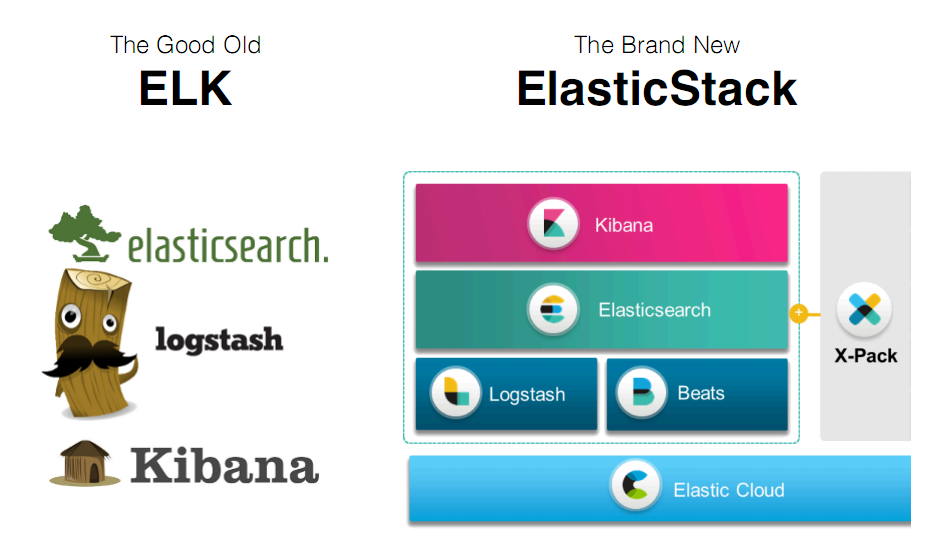
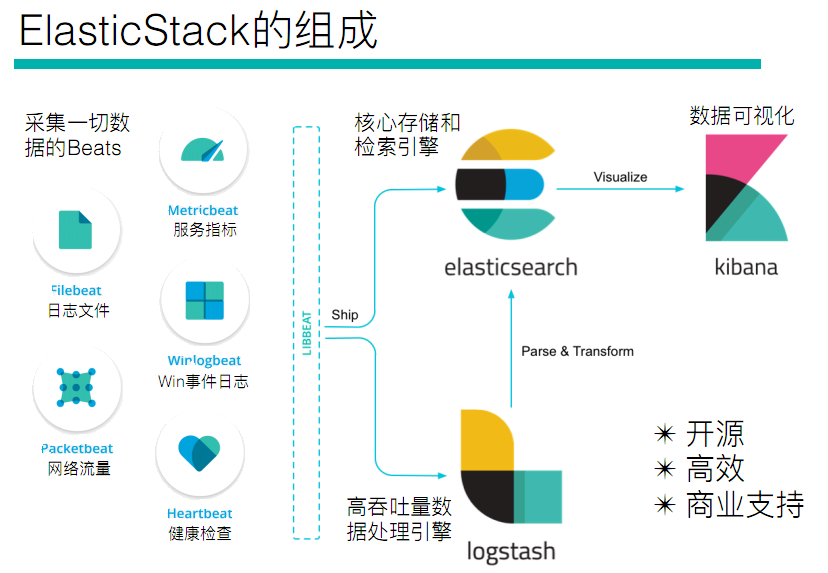

# Elastic Stack

## 1. Elastic Stack简介

- ELK是三款软件的简称，分别是Elasticsearch、Logstash、Kibana组成
- 在发展的过程中，又有新成员Beats的加入，所以就形成了Elastic Stack
- ELK是旧的称呼，Elastic Stack是新的名字

## 2. Elastic Stack 组成

全系的 Elastic Stack 技术栈包括

- **ElasticSearch**

Elasticsearch 基于java，是个开源分布式搜索引擎，它的特点有：分布式，零配置，自动发现，索引自动分片，索引副本机制，restful 风格接口，多数据源，自动搜索负载等

- **Logstash**

Logstash 基于java，是一个开源的用于收集，分析和存储日志的工具

- **Kibana**

Kibana 基于 nodejs，也是一个开源和免费的工具，Kibana可以为 Logstash 和 ElasticSearch 提供的日志分析友好的 Web 界面，可以汇总、分析和搜索重要数据日志

- **Beats**

Beats 是 elastic 公司开源的一款采集系统监控数据的代理agent，是在被监控服务器上以客户端形式运行的数据收集器的统称，可以直接把数据发送给ElasticSearch 或者通过Logstash发送给ElasticSearch，然后进行后续的数据分析活动。Beats 由如下组成：

- Packetbeat：是一个网络数据包分析器，用于监控、收集网络流量信息，Packetbeat嗅探服务器之间的流量，解析应用层协议，并关联到消息的处理，其支 持ICMP (v4 and v6)、DNS、HTTP、Mysql、PostgreSQL、Redis、MongoDB、Memcache等协议；
- Filebeat：用于监控、收集服务器日志文件，其已取代 logstash forwarder；
- Metricbeat：可定期获取外部系统的监控指标信息，其可以监控、收集 Apache、HAProxy、MongoDB、MySQL、Nginx、PostgreSQL、Redis、System、Zookeeper等服务；
- Winlogbeat：用于监控、收集Windows系统的日志信息

