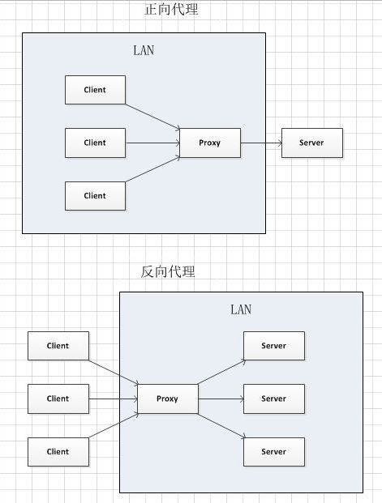
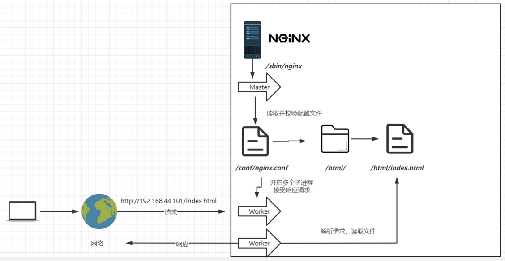
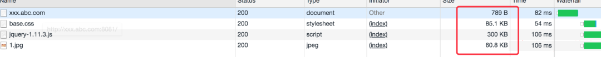
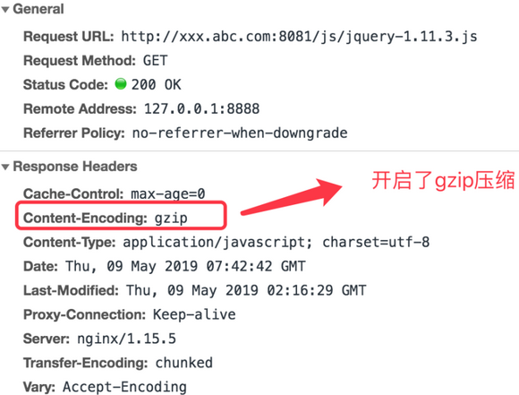
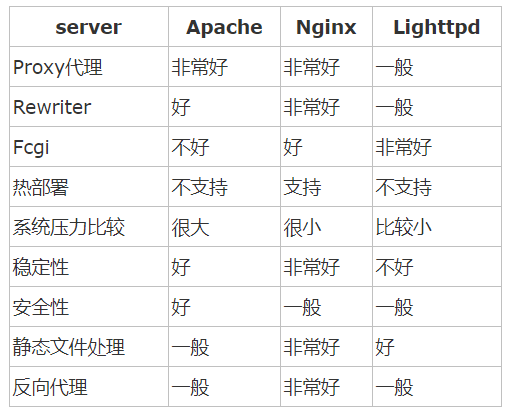

## 1. Nginx 简介

### 1.1. 什么是 Ngnix

> Nginx 官网：https://nginx.org/

**Nginx 是一款自由的、开源的、高性能的 HTTP 服务器和反向代理服务器；同时也是一个 IMAP、POP3、SMTP 代理服务器。**

- Nginx 可以作为一个 HTTP 服务器进行网站的发布处理
- Nginx 可以作为反向代理进行负载均衡的实现。

Nginx 同 Apache 一样都是一种 WEB 服务器。基于 REST 架构风格，以统一资源描述符 (Uniform Resources Identifier) URI 或者统一资源定位符 (Uniform Resources Locator) URL 作为沟通依据，通过 HTTP 协议提供各种网络服务。

**在 Apache 上运行数以万计的并发访问，会导致服务器消耗大量内存。操作系统对其进行进程或线程间的切换也消耗了大量的 CPU 资源，导致 HTTP 请求的平均响应速度降低**。这些都决定了 Apache 不可能成为高性能 WEB 服务器

### 1.2. 代理

所谓代理就是一个代表、一个渠道；此时就设计到两个角色，一个是被代理角色，一个是目标角色，被代理角色通过这个代理访问目标角色完成一些任务的过程称为代理操作过程；

#### 1.2.1. 正向代理

将请求发送给代理服务器，代理服务器去其他的服务器（网站），然后将访问到的数据传递给用户，这样的代理模式称为正向代理。**正向代理最大的特点是客户端非常明确要访问的服务器地址；**服务器只清楚请求来自哪个代理服务器，而不清楚来自哪个具体的客户端；**正向代理模式屏蔽或者隐藏了真实客户端信息。**


客户端必须设置正向代理服务器，当然前提是要知道正向代理服务器的IP地址，还有代理程序的端口。如图：


总结来说：正向代理，"它代理的是客户端"，是一个位于客户端和原始服务器(origin server)之间的服务器，为了从原始服务器取得内容，客户端向代理发送一个请求并指定目标(原始服务器)，然后代理向原始服务器转交请求并将获得的内容返回给客户端。客户端必须要进行一些特别的设置才能使用正向代理。

**正向代理的用途：**

- 访问原来无法访问的资源，如Google
- 可以做缓存，加速访问资源
- 对客户端访问授权，上网进行认证
- 代理可以记录用户访问记录（上网行为管理），对外隐藏用户信息

#### 1.2.2. 反向代理


多个客户端给服务器发送的请求，Nginx服务器接收到之后，按照一定的规则分发给了后端的业务处理服务器进行处理了。此时请求的来源也就是客户端是明确的，但是请求具体由哪台服务器处理的并不明确了，Nginx扮演的就是一个反向代理角色。

客户端是无感知代理的存在的，**反向代理对外都是透明的，访问者并不知道自己访问的是一个代理**。因为客户端不需要任何配置就可以访问。**反向代理，"它代理的是服务端"，主要用于服务器集群分布式部署的情况下，反向代理隐藏了服务器的信息**。

**反向代理的作用：**

- 保证内网的安全，通常将反向代理作为公网访问地址，Web服务器是内网
- 负载均衡，通过反向代理服务器来优化网站的负载

#### 1.2.3. 正向/反向代理项目场景

通常情况下，在实际项目操作时，正向代理和反向代理很有可能会存在在一个应用场景中，正向代理代理客户端的请求去访问目标服务器，目标服务器是一个反向单利服务器，反向代理了多台真实的业务处理服务器。


#### 1.2.4. 正向/反向代理二者区别



- **图解：**
    - 在正向代理中，Proxy和Client同属于一个LAN（图中方框内），隐藏了客户端信息；
    - 在反向代理中，Proxy和Server同属于一个LAN（图中方框内），隐藏了服务端信息；
- 实际上，**Proxy在两种代理中做的事情都是替服务器代为收发请求和响应，不过从结构上看正好左右互换了一下，所以把后出现的那种代理方式称为反向代理了**。

### 1.3. Nginx 基本运行原理



## 2. Nginx 配置与应用场景 

### 2.1. Nginx 目录结构介绍

以 linux 系统为例，进入 Nginx 的主目录可以看到以下这些文件夹。

```bash
tree /usr/local/nginx

/usr/local/nginx
├── client_body_temp
├── conf                             # Nginx 所有配置文件的目录
│   ├── fastcgi.conf                 # fastcgi 相关参数的配置文件
│   ├── fastcgi.conf.default         # fastcgi.conf 的原始备份文件
│   ├── fastcgi_params               # fastcgi 的参数文件
│   ├── fastcgi_params.default       
│   ├── koi-utf
│   ├── koi-win
│   ├── mime.types                   # 媒体类型
│   ├── mime.types.default
│   ├── nginx.conf                   # Nginx 主配置文件
│   ├── nginx.conf.default
│   ├── scgi_params                  # scgi 相关参数文件
│   ├── scgi_params.default  
│   ├── uwsgi_params                 # uwsgi 相关参数文件
│   ├── uwsgi_params.default
│   └── win-utf
├── fastcgi_temp                     # fastcgi 临时数据目录
├── html                             # Nginx 默认站点目录
│   ├── 50x.html                     # 错误页面优雅替代显示文件，例如当出现 502 错误时会调用此页面
│   └── index.html                   # 默认的首页文件
├── logs                             # Nginx 日志目录
│   ├── access.log                   # 访问日志文件
│   ├── error.log                    # 错误日志文件
│   └── nginx.pid                    # pid 文件，Nginx 进程启动后，会把所有进程的 ID 号写到此文件
├── proxy_temp                       # 临时目录
├── sbin                             # Nginx 命令目录
│   └── nginx                        # Nginx 的启动命令
├── scgi_temp                        # 临时目录
└── uwsgi_temp                       # 临时目录
```

其中重点关注的目录有：

- `conf`：用来存放配置文件相关
- `html`：用来存放静态文件的默认目录 html、css 等
- `sbin`：nginx 的主程序

> Tips: 其中以 `_temp` 结尾的几个文件夹在刚安装后是没有的，主要用来存放运行过程中的临时文件。

### 2.2. 配置文件 nginx.conf 属性模块

以下是 nginx.conf 配置文件中常用的属性

```json
worker_processes  1；                                    # worker进程的数量
events {                                                  # 事件区块开始
    worker_connections  1024；                            # 每个worker进程支持的最大连接数
}                                                        # 事件区块结束
http {                                                   # HTTP区块开始
    include       mime.types；                            # Nginx支持的媒体类型库文件
    default_type  application/octet-stream；             # 默认的媒体类型
    sendfile        on；                                   # 开启高效传输模式
    keepalive_timeout  65；                               # 连接超时
    server {                                            # 第一个Server区块开始，表示一个独立的虚拟主机站点
        listen       80；                                  # 提供服务的端口，默认80
        server_name  localhost；                           # 提供服务的域名主机名
        location / {                                    # 第一个location区块开始
            root   html；                               # 站点的根目录，相当于Nginx的安装目录
            index  index.html index.htm；                  # 默认的首页文件，多个用空格分开
        }                                                  # 第一个location区块结果
        error_page   500502503504  /50x.html；             # 出现对应的http状态码时，使用50x.html回应客户
        location = /50x.html {                          # location区块开始，访问50x.html
            root   html；                                  # 指定对应的站点目录为html
        }
    }  
    ......
```

### 2.3. Rewrite 全局变量

```shell
$remote_addr        //获取客户端ip
$binary_remote_addr //客户端ip（二进制)
$remote_port        //客户端port，如：50472
$remote_user        //已经经过Auth Basic Module验证的用户名
$host           //请求主机头字段，否则为服务器名称，如:blog.sakmon.com
$request        //用户请求信息，如：GET ?a=1&b=2 HTTP/1.1
$request_filename   //当前请求的文件的路径名，由root或alias和URI request组合而成，如：/2013/81.html
$status         //请求的响应状态码,如:200
$body_bytes_sent        // 响应时送出的body字节数数量。即使连接中断，这个数据也是精确的,如：40
$content_length        // 等于请求行的“Content_Length”的值
$content_type          // 等于请求行的“Content_Type”的值
$http_referer          // 引用地址
$http_user_agent      // 客户端agent信息,如：Mozilla/5.0 (Windows NT 5.1) AppleWebKit/537.36 (KHTML, like Gecko) Chrome/29.0.1547.76 Safari/537.36
$args            //与$query_string相同 等于当中URL的参数(GET)，如a=1&b=2
$document_uri        //与$uri相同  这个变量指当前的请求URI，不包括任何参数(见$args) 如:/2013/81.html
$document_root       //针对当前请求的根路径设置值
$hostname        //如：centos53.localdomain
$http_cookie        //客户端cookie信息
$cookie_COOKIE      //cookie COOKIE变量的值
$is_args    //如果有$args参数，这个变量等于”?”，否则等于”"，空值，如?
$limit_rate //这个变量可以限制连接速率，0表示不限速
$query_string       // 与$args相同 等于当中URL的参数(GET)，如a=1&b=2
$request_body      // 记录POST过来的数据信息
$request_body_file  //客户端请求主体信息的临时文件名
$request_method       //客户端请求的动作，通常为GET或POST,如：GET
$request_uri          //包含请求参数的原始URI，不包含主机名，如：/2013/81.html?a=1&b=2
$scheme            //HTTP方法（如http，https）,如：http
$uri            //这个变量指当前的请求URI，不包括任何参数(见$args) 如:/2013/81.html
$request_completion //如果请求结束，设置为OK. 当请求未结束或如果该请求不是请求链串的最后一个时，为空(Empty)，如：OK
$server_protocol    //请求使用的协议，通常是HTTP/1.0或HTTP/1.1，如：HTTP/1.1
$server_addr        //服务器IP地址，在完成一次系统调用后可以确定这个值
$server_name        //服务器名称，如：blog.sakmon.com
$server_port        //请求到达服务器的端口号,如：80
```

### 2.4. 配置高可用性

当上游服务器(真实访问服务器)，一旦出现故障或者是没有及时相应的话，应该直接轮询到下一台服务器，保证服务器的高可用。配置代码：

```json
server {
    listen       80;
    server_name  www.moon.com;
    location / {
        ### 指定上游服务器负载均衡服务器
        proxy_pass http://backServer;
        ### nginx与上游服务器(真实访问的服务器)超时时间 后端服务器连接的超时时间_发起握手等候响应超时时间
        proxy_connect_timeout 1s;
        ### nginx发送给上游服务器(真实访问的服务器)超时时间
        proxy_send_timeout 1s;
        ### nginx接受上游服务器(真实访问的服务器)超时时间
        proxy_read_timeout 1s;
        index  index.html index.htm;
    }
}
```

### 2.5. 开启压缩

开启 nginx gzip 压缩后，html、css、js 等静态资源的大小会大大的减少，从而可以节约大量的带宽，提高传输效率，但会消耗 CPU 资源。

在 nginx.conf 文件的 `http{ … }` 节点中配置开启：

```json
http {
    # 开启gzip
    gzip on;

    # 启用gzip压缩的最小文件；小于设置值的文件将不会被压缩
    gzip_min_length 1k;

    # gzip 压缩级别 1-10 
    gzip_comp_level 2;

    # 进行压缩的文件类型。
    gzip_types text/plain application/javascript application/x-javascript text/css application/xml text/javascript application/x-httpd-php image/jpeg image/gif image/png;

    # 是否在http header中添加Vary: Accept-Encoding，建议开启
    gzip_vary on;
}
```

保存并重启 nginx，刷新页面（为了避免缓存，请强制刷新）就能看到效果了。以谷歌浏览器为例，通过 F12 看请求的响应头部。

- 没有开启 zip 压缩之前对应的文件大小，如下所示：



- 开启了 gzip 进行压缩后的文件的大小，如下所示：


- 查看响应头会看到 gzip 这样的压缩，如下所示



gzip 压缩前后效果对比：jquery 原大小 90kb，压缩后只有 30kb。gzip 虽然好用，但是以下类型的资源不建议启用。

1. **图片类型**：如 jpg、png 本身就会有压缩，所以就算开启 gzip 后，压缩前和压缩后大小没有多大区别，所以开启了反而会白白的浪费资源。Tips：可以试试将一张 jpg 图片压缩为 zip，观察大小并没有多大的变化。虽然 zip 和 gzip 算法不一样，但是可以看出压缩图片的价值并不大。
2. **大文件**：会消耗大量的 cpu 资源，且不一定有明显的效果。

## 3. 负载均衡

### 3.1. 概念

客户端发送的、Nginx反向代理服务器接收到的请求数量，就是我们说的负载量。请求数量按照一定的规则进行分发到不同的服务器处理的规则，就是一种均衡规则。将服务器接收到的请求按照规则分发的过程，称为**负载均衡**。

负载均衡在实际项目操作过程中，有硬件负载均衡和软件负载均衡两种，硬件负载均衡也称为硬负载，如F5负载均衡，相对造价昂贵成本较高，但是数据的稳定性安全性等等有非常好的保障，如中国移动中国联通这样的公司才会选择硬负载进行操作；更多的公司考虑到成本原因，会选择使用软件负载均衡，软件负载均衡是利用现有的技术结合主机硬件实现的一种消息队列分发机制。

### 3.2. Nginx 负载均衡实现策略

Nginx 负载均衡实现的策略有以下几种：

#### 3.2.1. 轮询（默认值）

**轮询（默认）**：接收到的请求按照顺序逐一分配到不同的后端服务器，即使在使用过程中，某一台后端服务器宕机，Nginx 会自动将该服务器剔除出队列，请求受理情况不会受到任何影响。示例：

```json
upstream backserver { 
    server 192.168.0.12; 
    server 192.168.0.13; 
} 
```

#### 3.2.2. weight（权重）

**权重 weight**：这种方式下，可以给不同的后端服务器设置一个权重值(weight)，用于调整不同的服务器上请求的分配率；权重（weight 的值）数据越大，被分配到请求的概率越高。

该权重值，主要是针对实际生产环境中不同的后端服务器硬件性能不均衡的情况下，对资源进行调整配置的；其次是为在主从的情况下设置不同的权值，达到合理有效的地利用主机资源。

示例：

```json
# 权重越高，在被访问的概率越大，如例，分别是20%，80%。
upstream backserver { 
    server 192.168.0.12 weight=2; 
    server 192.168.0.13 weight=8; 
} 

# 权重配置还可以设置其他参数
upstream backserver2 { 
    server 127.0.0.1:8050    weight=10 down; 
    server 127.0.0.1:8060    weight=1; 
    server 127.0.0.1:8060    weight=1 backup; 
}
```

配置参数解析：

- `weight`：默认为1，weight 值越大，负载的权重就越大。
- `down`：表示当前的 server 暂时不参与负载
- `backup`：其它所有的非 backup 机器 down 或者忙的时候，请求 backup 机器。

#### 3.2.3. ip_hash（IP 绑定）

**ip_hash(IP绑定)**：每个请求按照发起客户端的 IP 的哈希结果进行分配，使来自同一个 IP 的客户端固定访问同一台后端服务器，并且可以一定程度上解决集群部署环境下 session 共享的问题。示例：

```json
upstream backserver { 
    ip_hash; 
    server 192.168.0.12:88; 
    server 192.168.0.13:80; 
}
```

#### 3.2.4. fair

**fair(第三方插件)**：结合 weight、ip_hash 的优点的一种调度算法，可以智能调整的负载均衡算法。动态根据页面大小和后端服务器的请求处理到响应的时间长短，智能地进行负载均衡分配，响应时间短的优先分配。响应时间短处理效率高的服务器分配到请求的概率高，响应时间长处理效率低的服务器分配到的请求少。示例：

```json
# 哪个服务器的响应速度快，就将请求分配到那个服务器上。
upstream backserver { 
    server server1; 
    server server2; 
    fair; 
}
```

> 需要注意的是，Nginx 默认不支持 fair 算法，如果要使用这种调度算法，必须安装 upstream_fair 模块。

#### 3.2.5. url_hash

**url_hash(第三方插件)**：按访问 url 的 hash 结果来分配请求，使每个请求的 url 定向到同一个后端服务器，可以在 Nginx 作为静态服务器的情况下提高缓存效率。示例：

```json
upstream backserver { 
    server squid1:3128; 
    server squid2:3128; 
    hash $request_uri; 
    hash_method crc32; 
}
```

> 需要注意的是，Nginx 默认不支持这种调度算法，使用时需要安装 Nginx 的 hash 软件包。

## 4. 其他

### 4.1. 几种常用web服务器对比



## 5. 参考资料

- [nginx 配置在线格式化](http://www.html580.com/tool/nginx/index.php)
