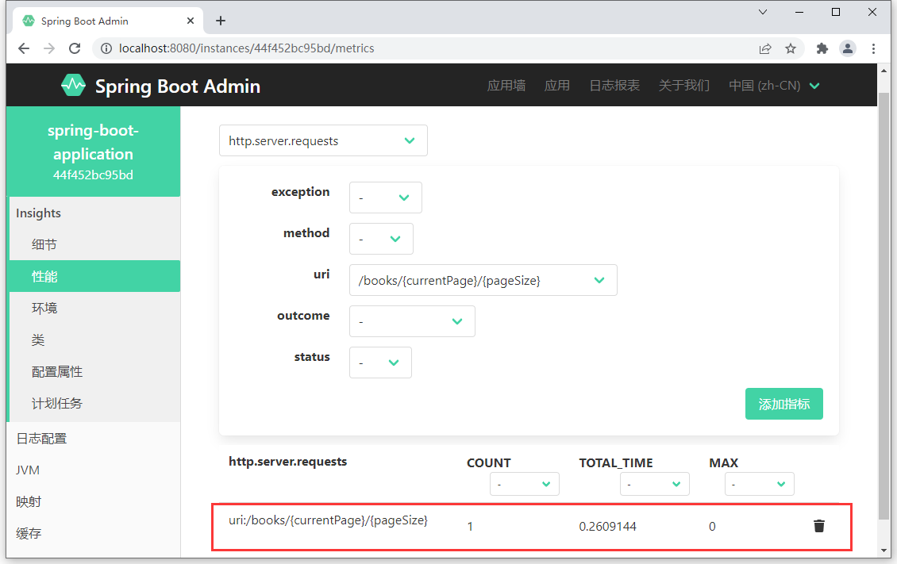

## 1. Spring Boot Actuator 应用运行状态监控

### 1.1. 监控的概念

最早的软件完成一些非常简单的功能，代码不多，错误也少。随着软件功能的逐步完善，软件的功能变得越来越复杂，功能不能得到有效的保障，这个阶段出现了针对软件功能的检测，也就是软件测试。

伴随着计算机操作系统的逐步升级，软件的运行状态也变得开始让人捉摸不透，出现了不稳定的状况。伴随着计算机网络的发展，程序也从单机状态切换成基于计算机网络的程序，应用于网络的程序开始出现，由于网络的不稳定性，程序的运行状态让使用者更加堪忧。互联网的出现彻底打破了软件的思维模式，随之而来的互联网软件就更加凸显出应对各种各样复杂的网络情况之下的弱小。计算机软件的运行状况已经成为了软件运行的一个大话题，针对软件的运行状况就出现了全新的思维，建立起了初代的软件运行状态监控。

**监控**就是通过软件的方式展示另一个软件的运行情况，运行的情况则通过各种各样的指标数据反馈给监控人员。例如网络是否顺畅、服务器是否在运行、程序的功能是否能够整百分百运行成功，内存是否够用等等。

### 1.2. 监控的意义

对于现代的互联网程序来说，规模越来越大，功能越来越复杂，还要追求更好的客户体验，因此要监控的信息量也就比较大了。

- 由于现在的互联网程序大部分都是基于微服务的程序，一个程序的运行需要若干个服务来保障，因此第一个要监控的指标就是服务是否正常运行，也就是**监控服务状态是否处理宕机状态**。一旦发现某个服务宕机了，必须马上给出对应的解决方案，避免整体应用功能受影响。
- 其次，由于互联网程序服务的客户量是巨大的，当客户的请求在短时间内集中达到服务器后，就会出现各种程序运行指标的波动。比如内存占用严重，请求无法及时响应处理等，这就是第二个要监控的重要指标，**监控服务运行指标**。
- 虽然软件是对外提供用户的访问需求，完成对应功能的，但是后台的运行是否平稳，是否出现了不影响客户使用的功能隐患，这些也是要密切监控的，此时就需要在不停机的情况下，监控系统运行情况，日志是一个不错的手段。如果在众多日志中找到开发者或运维人员所关注的日志信息，简单快速有效的过滤出要看的日志也是监控系统需要考虑的问题，这就是第三个要监控的指标，**监控程序运行日志**。
- 虽然期望程序一直平稳运行，但是由于突发情况的出现，例如服务器被攻击、服务器内存溢出等情况造成了服务器宕机，此时当前服务不能满足使用需要，就要将其重启甚至关闭，如果快速控制服务器的启停也是程序运行过程中不可回避的问题，这就是第四个监控项，**管理服务状态**。

以上这些仅仅是从大的方面来思考监控这个问题，还有很多的细节点，例如上线了一个新功能，定时提醒用户续费，这种功能不是上线后马上就运行的，但是当前功能是否真的启动，如果快速的查询到这个功能已经开启，这也是监控中要解决的问题等等。

### 1.3. 监控系统的基本流程

比如现在有3个服务支撑着一个程序的运行，每个服务都有自己的运行状态。


此时被监控的信息就要在三个不同的程序中去查询并展示，但是三个服务是服务于一个程序的运行的，如果不能合并到一个平台上展示，监控工作量巨大，而且信息对称性差，要不停的在三个监控端查看数据。尤其是当业务放大成百上千后，此时就必须有一个单独的平台，将多个被监控的服务对应的监控指标信息汇总在一起，这样更利于监控工作的开展。


新的程序专门用来监控，新的问题就出现了，是被监控程序主动上报信息还是监控程序主动获取信息？如果监控程序不能主动获取信息，这就意味着监控程序有可能看到的是很久之前被监控程序上报的信息，万一被监控程序宕机了，监控程序就无法区分究竟是被监控的程序是没有上报新的信息，还是程序已经下线了。所以监控程序必须具有主动发起请求获取被监控服务信息的能力。


如果监控程序要监控服务时，主动获取对方的信息。此时监控程序需要知道哪些程序被监控。合理的做法是在被监控程序启动时上报监控程序，告诉监控程序可以监控自己。因此需要在被监控程序端做主动上报的操作，这就要求被监控程序中配置对应的监控程序信息


被监控程序可以提供各种各样的指标数据给监控程序看，但是每一个指标都代表着公司的机密信息，并不是所有的指标都可以给任何人看的，乃至运维人员，所以对被监控指标的是否开放出来给监控系统看，也需要做详细的设定。

## 2. Spring Boot Actuator 快速入门

### 2.1. 简述

Spring Boot 的 Actuator 提供了多个内置端点，通过访问端点就可以获取对应的运行状态监控信息，可以实现对程序内部运行情况监控，比如监控状况、Bean 加载情况、配置属性、日志信息等。Actuator 的监控数据可以通过 Rest、运程 shell 和 JMX 方式获得。也可以根据需要自定义端点信息。

### 2.2. 引入 actuator 依赖

```xml
<dependency>
    <groupId>org.springframework.boot</groupId>
    <artifactId>spring-boot-starter-actuator</artifactId>
</dependency>
```

### 2.3. 远程请求获取监控数据

访问 `http://项目应用的地址:端口号/actuator`，可以查看 JSON 格式的监控数据

```json
{
    "_links": {
        "self": {
            "href": "http://localhost:9100/actuator",
            "templated": false
        },
        "beans": {
            "href": "http://localhost:9100/actuator/beans",
            "templated": false
        },
        "caches": {
            "href": "http://localhost:9100/actuator/caches",
            "templated": false
        },
        "caches-cache": {
            "href": "http://localhost:9100/actuator/caches/{cache}",
            "templated": true
        },
        "health": {
            "href": "http://localhost:9100/actuator/health",
            "templated": false
        },
        "health-path": {
            "href": "http://localhost:9100/actuator/health/{*path}",
            "templated": true
        },
        "info": {
            "href": "http://localhost:9100/actuator/info",
            "templated": false
        },
        "conditions": {
            "href": "http://localhost:9100/actuator/conditions",
            "templated": false
        },
        "configprops": {
            "href": "http://localhost:9100/actuator/configprops",
            "templated": false
        },
        "configprops-prefix": {
            "href": "http://localhost:9100/actuator/configprops/{prefix}",
            "templated": true
        },
        "env-toMatch": {
            "href": "http://localhost:9100/actuator/env/{toMatch}",
            "templated": true
        },
        "env": {
            "href": "http://localhost:9100/actuator/env",
            "templated": false
        },
        "loggers-name": {
            "href": "http://localhost:9100/actuator/loggers/{name}",
            "templated": true
        },
        "loggers": {
            "href": "http://localhost:9100/actuator/loggers",
            "templated": false
        },
        "heapdump": {
            "href": "http://localhost:9100/actuator/heapdump",
            "templated": false
        },
        "threaddump": {
            "href": "http://localhost:9100/actuator/threaddump",
            "templated": false
        },
        "metrics-requiredMetricName": {
            "href": "http://localhost:9100/actuator/metrics/{requiredMetricName}",
            "templated": true
        },
        "metrics": {
            "href": "http://localhost:9100/actuator/metrics",
            "templated": false
        },
        "scheduledtasks": {
            "href": "http://localhost:9100/actuator/scheduledtasks",
            "templated": false
        },
        "mappings": {
            "href": "http://localhost:9100/actuator/mappings",
            "templated": false
        }
    }
}
```

其中每一组数据都有一个请求路径，访问该路径，会返回该组的相关信息。比如请求 health 信息

```java
GET http://localhost:9100/actuator/health

{
    "status": "UP",
    "components": {
        "diskSpace": {
            "status": "UP",
            "details": {
                "total": 361348722688,
                "free": 259137028096,
                "threshold": 10485760,
                "exists": true
            }
        },
        "ping": {
            "status": "UP"
        }
    }
}
```

## 3. Actuator 端点信息汇总说明

通过发送请求路径 `/actuator` 可以访问应用所有端点信息，如果端点中还有明细信息可以发送请求 `/actuator/端点名称` 来获取详细信息。以下列出了所有端点信息说明：

|     端点名称      |                                                   描述                                                   | 默认启用 |
| ---------------- | -------------------------------------------------------------------------------------------------------- | :-----: |
| auditevents      | 暴露当前应用程序的审计事件信息。                                                                              |   是    |
| beans            | 显示应用程序中所有 Spring bean 的完整列表，以及它们的关系                                                       |   是    |
| caches           | 暴露可用的缓存。                                                                                           |   是    |
| conditions       | 显示在配置和自动配置类上评估的条件以及它们匹配或不匹配的原因。                                                     |   是    |
| configprops      | 显示所有 `@ConfigurationProperties` 的校对清单。                                                            |   是    |
| env              | 暴露 Spring ConfigurableEnvironment 中的依赖全部环境属性。`/env/{name}`：根据名称获取特定的环境属性值             |   是    |
| flyway           | 显示已应用的 Flyway 数据库迁移。                                                                             |   是    |
| health           | 显示应用程序健康信息，这些值由 HealthIndicator 的实现类提供                                                     |   是    |
| httptrace        | 显示 HTTP 追踪信息（默认情况下，最后 100 个 HTTP 请求/响应交换）。                                               |   是    |
| info             | 显示应用程序定制信息。这些信息由 info 前缀的配置属性提供                                                         |   是    |
| integrationgraph | 显示 Spring Integration 图。                                                                              |   是    |
| loggers          | 显示和修改应用程序中日志记录器的配置。                                                                         |   是    |
| liquibase        | 显示已应用的 Liquibase 数据库迁移。                                                                          |   是    |
| metrics          | 显示当前应用程序的指标度量信息，比如内存用量和HTTP请求计数。`/metrics/{name}`：报告指定名称的应用程序度量值            |   是    |
| mappings         | 显示所有 `@RequestMapping` 路径的整理清单，以及它们和控制器(包含 Actuator 端点)的映射关系                         |   是    |
| scheduledtasks   | 显示应用程序中的调度任务。                                                                                   |   是    |
| sessions         | 允许从 Spring Session 支持的会话存储中检索和删除用户会话。当使用 Spring Session 的响应式 Web 应用程序支持时不可用。   |   是    |
| shutdown         | 正常关闭应用程序。                                                                                          |   否    |
| threaddump       | 执行线程 dump。                                                                                           |   是    |
| heapdump         | 返回一个 hprof 堆 dump 文件。                                                                              |   是    |
| jolokia          | 通过 HTTP 暴露 JMX bean（当  Jolokia 在 classpath 上时，不适用于 WebFlux）。                                  |   是    |
| logfile          | 返回日志文件的内容（如果已设置 logging.file 或 logging.path 属性）。支持使用 HTTP Range 头来检索部分日志文件的内容。 |   是    |
| prometheus       | 以可以由 Prometheus 服务器抓取的格式暴露指标。                                                                |   是    |

状态监控的数据都是以 json 格式返回，分析数据不太方便，*推荐使用基于 Actuator 开发的 Spring Boot Admin 状态监控开源项目*

## 4. Spring Boot Admin 可视化监控平台

- 官网：https://github.com/codecentric/spring-boot-admin
- 官方文档：https://codecentric.github.io/spring-boot-admin/

### 4.1. 为什么要使用 Spring Boot Admin

Spring Boot Actuator 提供了对单个 Spring Boot 应用的监控，信息包含应用状态、内存、线程、堆栈等，比较全面的监控了 Spring Boot 应用的整个生命周期，可以有效的帮我解决众多服务的健康检查、指标监控问题、配置管理、日志聚合问题、异常排查问题等等。

### 4.2. Spring Boot Admin 来源背景

codecentric 的 Spring Boot Admin 是一个社区项目，用于管理和监视 Spring Boot® 应用程序。这些应用程序在 Spring Boot Admin Client 中注册（通过HTTP），或者是通过Spring Cloud®（例如Eureka，Consul）发现的。UI 只是 Spring Boot Actuator 端点之上的 Vue.js 应用程序。

### 4.3. Spring Boot Admin 功能介绍

Spring Boot Admin 提供了很多服务治理方面的功能，利用它能节省很多在治理服务方面的时间和精力 Spring Boot Admin 提供了如下功能（包括但不限于）：

- 显示健康状态及详细信息，如 JVM 和内存指标、数据源指标、缓存指标
- 跟踪并下载日志文件
- 查看 JVM 系统-和环境属性
- 查看 Spring 启动配置属性方便 loglevel 管理
- 查看线程转储视图 http-traces
- 查看 http 端点查看计划任务
- 查看和删除活动会话(使用 spring-session)
- 状态更改通知(通过电子邮件、Slack、Hipchat…)
- 状态变化的事件日志(非持久性)
- 下载 heapdump
- 查看 Spring Boot 配置属性
- 支持 Spring Cloud 的环境端点和刷新端点
- 支持 K8s
- 易用的日志级别管理
- 与 JMX-beans 交互
- 查看线程转储
- 查看 http 跟踪
- 查看 auditevents
- 查看 http-endpoints
- 查看计划任务
- 查看和删除活动会话（使用 Spring Session ）
- 查看 Flyway/Liquibase 数据库迁移
- 状态变更通知（通过电子邮件，Slack，Hipchat 等，支持钉钉）
- 状态更改的事件日志（非持久化）

## 5. Spring Boot Admin 基础使用

Spring Boot Admin 有两个角色，客户端(Client)和服务端(Server)。

- 应用程序作为 Spring Boot Admin Client 向为 Spring Boot Admin Server 注册
- Spring Boot Admin Server 的 UI 界面将 Spring Boot Admin Client 的 Actuator Endpoint 上的一些监控信息。

### 5.1. 服务端开发

#### 5.1.1. 引入依赖

创建 maven 工程，在 pom.xml 文件中导入 Spring Boot Admin 服务端对应的 starter，版本与当前使用的 Spring Boot 主版本保持一致即可（如：2.5.x），并将工程其配置成 web 工程

```xml
<!-- Spring Boot Admin 服务端依赖 -->
<dependency>
    <groupId>de.codecentric</groupId>
    <artifactId>spring-boot-admin-starter-server</artifactId>
    <version>2.5.5</version>
</dependency>

<dependency>
    <groupId>org.springframework.boot</groupId>
    <artifactId>spring-boot-starter-web</artifactId>
</dependency>
```

也可以通过 Spring Initializr 创建，选择 Ops/Codecentric's Spring Boot Admin (Server)


#### 5.1.2. 开启监控服务端功能

在引导类上添加 `@EnableAdminServer` 注解，声明当前应用启动后作为 Spring Boot Admin 的服务器使用

```java
@SpringBootApplication
@EnableAdminServer // 标识当前应用作为 Spring Boot Admin 的服务端
public class AdminServerApplication {
    public static void main(String[] args) {
        SpringApplication.run(AdminServerApplication.class, args);
    }
}
```

#### 5.1.3. 登陆服务端管理界面

启动应用服务后，使用浏览器访问 http://127.0.0.1:8080/


看到如上界面，说明 Spring Boot Admin 服务端已经启用成功。

> 注：因为示例没有使用 application.yml 配置文件指定应用的端口，所以默认是8080，可按需修改，由于目前没有启动任何被监控的程序，所以里面暂无任何信息

### 5.2. 客户端开发

#### 5.2.1. 引入依赖

创建 maven 工程，在 pom.xml 文件中导入 Spring Boot Admin 客户端对应的 starter，版本与当前使用的 Spring Boot 主版本保持一致即可（如：2.5.x），并将工程其配置成 web 工程

```xml
<!-- Spring Boot Admin 客户端依赖 -->
<dependency>
    <groupId>de.codecentric</groupId>
    <artifactId>spring-boot-admin-starter-client</artifactId>
    <version>2.5.5</version>
</dependency>

<dependency>
    <groupId>org.springframework.boot</groupId>
    <artifactId>spring-boot-starter-web</artifactId>
</dependency>
```

也可以通过 Spring Initializr 创建，选择 Ops/Codecentric's Spring Boot Admin (Client)


#### 5.2.2. 配置客户端开放的信息

创建 application.yml 文件，配置客户端应用的信息发送给哪个 ip 地址的监控服务

```yml
server:
  port: 9100

spring:
  boot:
    admin:
      client:
        url: http://localhost:8080 # 指定当前客户端将监控信息上传到哪个服务器上
```

### 5.3. 监控管理后台

#### 5.3.1. 界面信息简介

客户端配置 `spring.boot.admin.client.url` 后，监控后台可以看到当前监控了1个程序


点击进去查看详细信息。注意：因为目前没有配置开发哪些信息，而 Spring Boot Admin 的客户端默认开放了 13 组信息给服务器，但是这些信息除了一个健康信息之外，其他的信息都不让通过 HTTP 请求查看。


如果需要查看全部健康明细，则通过在 application.yml 文件增加配置项 `management.endpoint.health.show-details` 来开放所有的健康信息明细。

```yml
management:
  endpoint:
    health:
      show-details: always # 开放所有的健康信息明细，默认值是 never，不开放
```

健康明细信息如下：


但目前除了健康信息，其他信息都查阅不了。原因在于其他12种信息是默认不提供给服务器通过 HTTP 请求查阅的，所以需要开启查阅的内容项 `management.endpoints.web.exposure.include`，其中配置值为 `"*"`，则表示查阅全部（<font color=red>**注意：记得带引号**</font>）

```yml
management:
  endpoints:
    web:
      exposure:
        # 设置通过HTTP请求可查阅的信息，默认值只有 health(健康信息)，
        # 如果配置 "*" 则可查询全部，包含了13组信息，有性能指标监控，加载的bean列表，加载的系统属性，日志的显示控制等等
        include: "*"
```

配置后再刷新服务器页面，就可以看到所有的信息了。界面中展示的信息量就非常大了，包含了13组信息，有性能指标监控，加载的bean列表，加载的系统属性，日志的显示控制等等。


#### 5.3.2. 监控原理

其实监控中显示的信息实际上是通过发送请求到 `/actuator` 开头的链接地址，得到响应的 JSON 数据后，然后通过 UI 界面展示出来。Spring Boot Admin 就是将这些数据汇总到一起组成了监控平台显示的所有数据。

监控平台中显示的信息实际上是通过对被监控的应用发送请求得到的，由此可知， Spring Boot Admin Client 被监控的应用之所以可以对外提供上述请求路径，肯定上引入 spring-boot-starter-actuator 的依赖。


### 5.4. 配置多个客户端

与配置配置单个客户端的方式一样，在其他的 Spring Boot 程序中添加客户端坐标与配置开放那些监控信息，这样当前服务器就可以监控多个客户端程序了。每个客户端展示不同的监控信息。


进入监控面板，如果加载的应用具有功能，在监控面板中可以看到3组信息展示的与之前加载的空工程不一样。

- 类加载面板中可以查阅到开发者自定义的类，如下图


- 映射中可以查阅到当前应用配置的所有请求


- 性能指标中可以查阅当前应用独有的请求路径统计数据




### 5.5. 使用步骤总结

admin-server 服务

1. 创建 admin-server 模块
2. 导入依赖坐标 spring-boot-admin-starter-server
3. 在引导类上添加 `@EnableAdminServer` 注解，启用监控功能

admin-client 服务

1. 创建 admin-client 模块
2. 导入依赖坐标 spring-boot-admin-starter-client
3. 配置相关信息：server 地址、开放了被监控的指标等

启动 server 和 client 服务，访问 server 项目地址

> <font color=violet>**注：server 与 client 工程必须均为 web 应用**</font>

## 6. Spring Boot Admin 进阶使用

### 6.1. 端点配置

上述端点每一项代表被监控的指标，如果对外开放则监控平台可以查询到对应的端点信息，如果未开放则无法查询对应的端点信息。通过配置 `management.endpoint.端点名称.enabled` 属性来控制端点是否对外开放功能。<font color=red>**值得注意的是，其中 `health` 端点为默认端点，不能关闭。**</font>

```yml
management:
  endpoint:
    health:
      show-details: always # 开放所有的健康信息明细，默认值是 never，不开放
      enabled: true # 默认端点，不能关闭
    info:
      enabled: true # 是否开启 info 端点。（其他端点以同样的方式设置是否开启）
```

为了方便快速配置端点，Spring Boot Admin 设置了 13 个较为常用的端点作为默认开放的端点，如果需要控制默认开放的端点的开放状态，可以通过 `management.endpoints.enabled-by-default` 配置项设置，如下：

```yml
management:
  endpoints:
    enabled-by-default: true # 是否开启默认开放的端点
```

上述端点开启后，就可以通过端点对应的路径查看对应的信息了。但是此时还不能通过 HTTP 请求查询此信息，还需要开启通过 HTTP 请求查询的端点名称，使用 `management.endpoints.web.exposure.include="*"` 可以简化配置成开放所有端点的 WEB 端 HTTP 请求权限，然后如果不想放开某些端点，通过 `endpoint` 设置具体端点的配置来控制即可

```yml
management:
  endpoints: # 全部端点的配置
    web:
      exposure:
        # 设置通过HTTP请求可查阅的信息，默认值只有 health(健康信息)，
        # 如果配置 "*" 则可查询全部，包含了13组信息，有性能指标监控，加载的bean列表，加载的系统属性，日志的显示控制等等
        include: "*"
```

总结：对于端点的配置有两组信息，一组是 `endpoints` 开头的，对所有端点进行配置，一组是 `endpoint` 开头的，对具体端点进行配置。

```yml
management:
  endpoint: # 具体端点的配置
    health:
      show-details: always # 开放所有的健康信息明细，默认值是 never，不开放
      enabled: true # 默认端点，不能关闭
    info:
      enabled: true # 是否开启 info 端点。（其他端点以同样的方式设置是否开启）
  endpoints: # 全部端点的配置
    web:
      exposure:
        # 设置通过HTTP请求可查阅的信息，默认值只有 health(健康信息)，
        # 如果配置 "*" 则可查询全部，包含了13组信息，有性能指标监控，加载的bean列表，加载的系统属性，日志的显示控制等等
        include: "*"
    enabled-by-default: true # 是否开启默认开放的端点
```

> 端点描述了被监控的信息，除了系统默认的指标，还可以自行添加显示的指标

### 6.2. 自定义 INFO 端点

info 端点描述了当前应用的基本信息，可以通过以下两种形式快速配置 info 端点的信息

#### 6.2.1. 配置式

在项目的 application.yml 文件中，通过设置 `info` 节点的信息取可快速配置端点信息

```yml
info:
  appName: @project.artifactId@
  version: @project.version@
  company: GK
  author: MooNKirA
```

配置完毕后，对应信息显示在监控平台上


也可以通过请求端点信息路径 `/actuator/info` 获取对应 JSON 信息


#### 6.2.2. 编程式

通过配置的形式只能添加固定的数据，如果需要展示动态数据，则通过配置类的方式为 info 端点添加信息。此配置类需要 `org.springframework.boot.actuate.info.InfoContributor` 接口，在 `contribute` 方法中，通过 `Info.Builder` 对象设置 info 的信息

```java
@Configuration
public class InfoConfig implements InfoContributor {
    /**
     * 设置 info 端点信息
     */
    @Override
    public void contribute(Info.Builder builder) {
        // 配置单个信息
        builder.withDetail("runTime", System.currentTimeMillis());
        // 使用 Map 配置多个信息
        Map<String, Object> infoMap = new HashMap<>();
        infoMap.put("description", "我是这个应用的一段描述");
        infoMap.put("how to use", "使用说明！");
        builder.withDetails(infoMap);
    }
}
```


> 此编程式的信息与配置式共存

### 6.3. 自定义 Health 端点

health 端点描述当前应用的运行健康指标，即应用的运行是否成功。通过编程形式可以扩展健康指标信息。该配置类需要继承 `org.springframework.boot.actuate.health.AbstractHealthIndicator` 抽象类或者实现 `org.springframework.boot.actuate.health.HealthIndicator` 接口，在 `doHealthCheck` 方法中，进行一些逻辑处理，再通过来 `Health.Builder` 对象来设置应用的健康信息

```java
@Configuration
public class HealthConfig extends AbstractHealthIndicator {

    /**
     * 设置 Health 端点信息
     */
    @Override
    protected void doHealthCheck(Health.Builder builder) throws Exception {
        // 模拟一些业务或者故障判断
        boolean condition = System.currentTimeMillis() % 2 == 0;
        if (condition) {
            builder.status(Status.UP);// 设置运行状态为启动状态
            // 配置单个信息
            builder.withDetail("runTime", System.currentTimeMillis());
            // 使用 Map 配置多个信息
            Map<String, Object> infoMap = new HashMap<>();
            infoMap.put("description", "我是健康的一段描述");
            infoMap.put("why error", "如果当前系统时间是奇数，则服务正常");
            builder.withDetails(infoMap);
        } else {
            builder.status(Status.OUT_OF_SERVICE); // 设置运行状态为不在服务状态
            builder.withDetail("why error", "如果当前系统时间是偶数，则不在服务服务状态");
        }
    }

}
```


> <font color=red>**注意：当任意一个组件状态不为 UP 时，整体应用对外服务状态为非 UP 状态，包含引入的第三方组件，比如 redis、RocketMQ 等等**</font>

### 6.4. 自定义 Metrics 端点

metrics 端点描述了性能指标，除了系统自带的监控性能指标，还可以自定义性能指标。在需要被监控或者业务需要的类中，增加有参构造方法，其方法形参是 `MeterRegistry` 类型，此对象实例会进行自动注入，到业务方法操作此对象即可更新 Metrics 端点的数据

```java
@Service
public class DemoServiceImpl implements DemoService {

    private final Counter counter;

    /* 定义有参构造，方法形参是 MeterRegistry 类型，此对象实例会进行自动注入 */
    public DemoServiceImpl(MeterRegistry meterRegistry) {
        counter = meterRegistry.counter("接口被查询的次数：");
    }

    @Override
    public String query() {
        // 方法每次被执行，都进行自增记录
        counter.increment();
        return String.valueOf(new Random().nextInt());
    }
}
```

管理界面效果如下：


### 6.5. 自定义端点

可以根据业务需要自定义端点，方便业务监控。自定义端点配置类，标识 `@Endpoint` 当前类为自定义端点，`@ReadOperation` 注解标识方法用于定义端点返回信息

```java
@Configuration
/*
 * @Endpoint 注解用于标识自定义端点
 *  id 属性：设置端点在配置中的名称
 *  enableByDefault 属性：设置是否默认开放此端点，默认值是 true-默认开放
 */
@Endpoint(id = "custom-endpoint", enableByDefault = false)
public class CustomEndpoint {

    // @ReadOperation 注解标识方法，定义请求该端点时返回的信息
    @ReadOperation
    public Object getResult() {
        Map<String, Object> resultMap = new HashMap<>();
        resultMap.put("level 1", "300");
        resultMap.put("level 2", "291");
        resultMap.put("level 3", "666");
        return resultMap;
    }
}
```

由于 Spring Boot Admin 无法预知自定义端点数据如何展示，所以通过界面无法看到此数据，只能通过 HTTP 请求路径可以获取到当前端点的信息，但是需要先开启当前端点对外功能，或者设置当前端点为默认开发的端点。

```yml
management:
  endpoint:
    custom-endpoint:
      enabled: true
```


> Notes: <font color=red>**本人在测试时，无论 `enabled` 是否设置为 true，均可以请求成功**</font>
