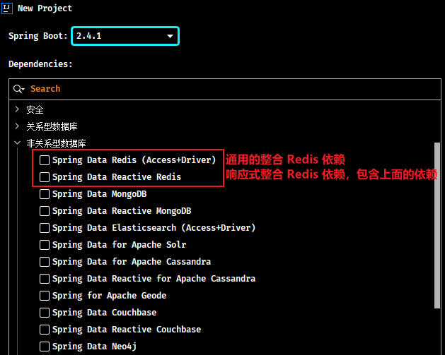
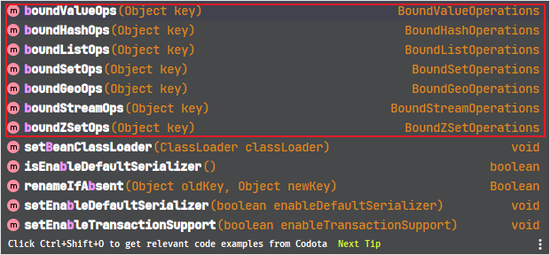
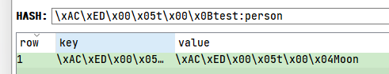

## 1. Spring Boot 整合 Redis 概述

> Redis 更多详细内容详见[《Redis 基础笔记》](/Database/Redis/Redis-基础)

### 1.1. 简介

Redis是一款采用 key-value 数据存储格式（也就是键值对的存储形式）的内存级 NoSQL 数据库。与 MySQL 数据库不同，MySQL 数据库有表、有字段、有记录，而 Redis 主要以一个键对应一个值的方式，并且数据以存储在内存中使用为主。Redis 支持多种数据存储格式，如：字符串，map 集合，list 集合等等。

Redis 有它的数据持久化方案，分别是 RDB 和 AOF，但是 Redis 自身并不是为了数据持久化，主要是在内存中保存数据，加速数据访问的，所以说是一款内存级数据库。

### 1.2. 安装

> 为了测试方便，使用了 window 版 Redis。windows 版安装包下载地址：https://github.com/tporadowski/redis/releases

下载的安装包有两种形式，一种是一键安装的 msi 文件，还有一种是解压缩即可使用的 zip 文件。个人使用的是免安装版本 Redis-x64-3.2.100，压缩后目录如下：


### 1.3. 启动服务

进入 redis 根目录下，使用以下命令启动服务与客户端

- 启动服务器，端口号默认 6379

```bash
redis-server.exe redis.windows.conf
```

- 启动客户端

```bash
redis-cli.exe
```

> 注意：window 安装版可能会出现一个小问题。如果启动 redis 服务器失败，可以先启动客户端，然后执行 `shutdown` 命令操作后退出，此时再重新启动 redis 服务器即可正常执行了。

### 1.4. 基本操作

此部分内容详见[《Redis 笔记》](/Database/Redis/Redis-基础)

## 2. 整合 Redis 示例

在进行整合之前先梳理一下整合的思想，Spring Boot 整合任何技术的本质是在 Spring Boot 中使用对应技术的 API。如果两个技术没有交集，就不存在整合的概念了。Spring Boot 整合所有技术是一种通用思想与套路，主要思考的问题如下：

- 第一，需要先导入对应技术的坐标，而整合之后，这些坐标都有了一些变化
- 第二，任何技术通常都会有一些相关的配置信息，整合之后，这些信息如何写，写在哪是一个问题
- 第三，没有整合之前操作如果是模式A的话，整合之后如果没有给开发者带来一些便捷操作，那整合将毫无意义，所以整合后操作肯定要简化一些，那对应的操作方式自然也有所不同

### 2.1. 引入依赖

导入 Spring Boot 整合 redis 的坐标 spring-boot-starter-data-redis

```xml
<dependency>
    <groupId>org.springframework.boot</groupId>
    <artifactId>spring-boot-starter-data-redis</artifactId>
</dependency>
```

也可以直接使用 idea 的 Spring Initializr 创建 Spring Boot 项目，在创建模块的时候勾选相应的依赖，归属 NoSQL 分类中



### 2.2. 基础配置连接 Redis

在 Spring Boot 项目配置文件 application.yml 中，设置 Redis 相关配置

- 配置 Redis 单机版

```yml
spring:
  redis:
    host: localhost # redis 服务地址，默认是 localhost
    port: 6379 # redis 服务端口，默认是 6379
```

- 配置 Redis 集群版

```yml
spring:
  redis:
    cluster:
      nodes: 192.168.12.128:7001,192.168.12.128:7002,192.168.12.128:7003,192.168.12.128:7004,192.168.12.128:7005,192.168.12.128:7006
```

**说明：切换到集群版，注释掉单机版配置信息即可。**

### 2.3. 基础使用示例

Spring Boot 提供了 redis 的专用客户端接口 RedisTemplate，是基于 Jedis 对 Redis 数据库的操作进行了二次封装，执行相应的操作更加方便。通过以下方法操作 redis 的五种不同的数据类型



#### 2.3.1. RedisTemplate

```java
@SpringBootTest
public class RedisTemplateTest {
    /*
     * 注入 Redis 模版操作对象 RedisTemplate<K, V>
     *  如果不指定 k 值，则默认是对象类型的key
     */
    @Autowired
    private RedisTemplate redisTemplate;

    @Test
    public void testSet() {
        ValueOperations ops = redisTemplate.opsForValue();
        ops.set("test:age", 41);
    }

    @Test
    public void testGet() {
        ValueOperations ops = redisTemplate.opsForValue();
        Object age = ops.get("test:age");
        System.out.println(age);
    }

    @Test
    public void testHset() {
        HashOperations ops = redisTemplate.opsForHash();
        ops.put("test:person", "name", "Moon");
    }

    @Test
    public void testHget() {
        HashOperations ops = redisTemplate.opsForHash();
        Object val = ops.get("test:person", "name");
        System.out.println(val);
    }
}
```

值得注意的是：`RedisTemplate` 不指定泛型时，默认的存储的键是对象类型，会进行转码。因此使用图形化界面客户端查看时效果如下图：



#### 2.3.2. StringRedisTemplate

由于 redis 内部不提供 java 对象的存储格式，因此当操作的数据以对象的形式存在时，会进行转码，转换成字符串格式后进行操作。为了方便开发者使用基于字符串为数据的操作，Spring Boot 整合 redis 时提供了专用的 API 接口 `StringRedisTemplate`，可以理解为这是 `RedisTemplate` 的一种指定数据泛型的操作 API，相当于 `RedisTemplate<String, String>`

```java
@SpringBootTest
public class StringRedisTemplateTest {

    /* StringRedisTemplate 模版操作对象，相当于 RedisTemplate<String, String> */
    @Autowired
    private StringRedisTemplate redisTemplate;

    @Test
    public void testSet() {
        ValueOperations<String, String> ops = redisTemplate.opsForValue();
        ops.set("test:name", "MooN");
    }

    @Test
    public void testGet() {
        ValueOperations<String, String> ops = redisTemplate.opsForValue();
        String age = ops.get("test:name");
        System.out.println(age);
    }
}
```

## 3. redis 客户端选择

Spring Boot 整合 redis 技术提供了多种客户端兼容模式，默认提供的是 lettucs 客户端，也可以根据需要切换成指定客户端技术，例如 jedis 客户端。切换成 jedis 客户端操作步骤如下：

### 3.1. 切换客户端步骤

#### 3.1.1. 引入依赖

切换到 jedis 客户端，需要在项目的 pom.xml 文件中导入 jedis 坐标。注：jedis 坐标已在 Spring Boot 父项目中进行了版本管理，无需提供版本号

```xml
<dependency>
    <groupId>redis.clients</groupId>
    <artifactId>jedis</artifactId>
</dependency>
```

#### 3.1.2. 基础配置

修改 application.yml 项目配置文件，通过 `spring.redis.client-type` 属性指定使用的客户端类型。并且根据对应的客户端面设置相关的配置

```yml
spring:
  redis:
    host: localhost # redis 服务地址，默认是 localhost
    port: 6379 # redis 服务端口，默认是 6379
    # Spring Boot 默认的客户端是 lettuce，使用 client-type 属性来指定客户端的类型
    client-type: jedis
    jedis: # 根据客户端的类型，设置对应的配置。示例使用 jedis 客户端
      pool:
        max-active: 16
#    lettuce: # 根据客户端的类型，设置对应的配置。默认是 lettuce 客户端
#      pool:
#        max-active: 16
```

配置完成后，按原来的使用方式即可，Spring Boot 底层已经切换成指定的客户端类型

### 3.2. lettcus 客户端与 jedis 客户端区别

- jedis 连接 Redis 服务器是直连模式，当多线程模式下使用 jedis 会存在线程安全问题，解决方案可以通过配置连接池使每个连接专用，这样整体性能就大受影响
- lettcus 基于 Netty 框架进行与 Redis 服务器连接，底层设计中采用 StatefulRedisConnection。 StatefulRedisConnection 自身是线程安全的，可以保障并发访问安全问题，所以一个连接可以被多线程复用。当然 lettcus 也支持多连接实例一起工作

### 3.3. 注入 RedisTemplate 测试操作 redis

```java
@RunWith(SpringRunner.class)
@SpringBootTest(classes = Application.class)
public class RedisTest {
    @Autowired
    private UserRepository userRepository;
    @Autowired
    private RedisTemplate<String, String> redisTemplate;

    @Test
    public void test() throws JsonProcessingException {
        // 从redis缓存中获得指定的数据
        String userListData = redisTemplate.boundValueOps("user.findAll").get();
        // 如果redis中没有数据的话
        if (null == userListData) {
            //查询数据库获得数据
            List<User> all = userRepository.findAll();
            // 转换成json格式字符串
            ObjectMapper om = new ObjectMapper();
            userListData = om.writeValueAsString(all);
            // 将数据存储到redis中，下次在查询直接从redis中获得数据，不用在查询数据库
            redisTemplate.boundValueOps("user.findAll").set(userListData);
            System.out.println("===============从数据库获得数据===============");
        } else {
            System.out.println("===============从redis缓存中获得数据===============");
        }
        System.out.println(userListData);
    }
}
```

## 4. Spring Boot 整合 redis 进阶

### 4.1. 常用配置项

以下是 Spring Boot 整合 Redis 中常用的配置项示例：

```yml
spring:
  redis:
    host: localhost # redis 服务地址，默认是 localhost
    port: 6379 # redis 服务端口，默认是 6379
    database: 0 # redis 数据库的索引，默认是 0
    password: # Redis 的服务器连接密码（默认为空）
    client-type: jedis # Spring Boot 默认的客户端是 lettuce，使用 client-type 属性来指定客户端的类型
    jedis: # 根据客户端的类型，设置对应的配置。示例使用 jedis 客户端
      pool:
        max-active: 2000 # 连接池的最大连接数（使用负值表示没有限制）
        max-wait: -1 # 连接池的最大阻塞等待时间（使用负值表示没有限制）
        max-idle: 100 # 连接池的最大空闲连接
        min-idle: 50 # 连接池的最小空闲连接
    timeout: 1000 # 连接超时时间（毫秒）
    # 哨兵模式配置
    sentinel:
      master: mymaster
      nodes: 127.0.0.1:9000
    # 集群模式配置
    cluster:
      nodes: 127.0.0.1:7000,127.0.0.1:7001,127.0.0.1:7002,127.0.0.1:7003,127.0.0.1:7004,127.0.0.1:7005
```

配置说明：

- spring.redis.cluster.nodes 为 Redis 集群节点的服务地址，在多个服务地址之间使用逗号隔开
- spring.redis.password 为 Redis 服务密码，如果没有密码，则将其设置为空即可
- 如果 Redis 是主从模式，则将 spring.redis.cluster.nodes 地址修改为主从节点的服务地址即可
- 如果是哨兵模式，则不需要 spring.redis.cluster.nodes 配置，在 spring.redis.sentinel.master 和 spring.redis.sentinel.nodes 中分别配置哨兵的名称和哨兵的节点即可
- 如果是单机模式，则不需要 sentinel 与 cluster 相关配置项，通过 spring.redis.host 配置 Redis 服务的地址；spring.redis.port 配置 Redis 服务的端口

### 4.2. RedisTemplate 配置类

创建 Redis 配置类，用于配置 `RedisTemplate`。 Spring Boot 默认配置了 RedisTemplate，在应用时注入使用即可，也可以创建自定义的 RedisTemplate。

```java
@EnableCaching
@Configuration // TODO: 或者使用 @AutoConfiguration 后面再研究一下两者的区别
@AutoConfigureBefore(RedisAutoConfiguration.class) // TODO: 后面再研究与 @AutoConfigureAfter 使用时的区别
public class RedisTemplateConfiguration {

	@Bean
	public RedisTemplate<String, Object> redisTemplate(RedisConnectionFactory factory) {
		RedisTemplate<String, Object> redisTemplate = new RedisTemplate<>();
		redisTemplate.setKeySerializer(RedisSerializer.string());
		redisTemplate.setHashKeySerializer(RedisSerializer.string());
		redisTemplate.setValueSerializer(RedisSerializer.java());
		redisTemplate.setHashValueSerializer(RedisSerializer.java());
		redisTemplate.setConnectionFactory(factory);
		return redisTemplate;
	}

	@Bean
	public HashOperations<String, String, Object> hashOperations(RedisTemplate<String, Object> redisTemplate) {
		return redisTemplate.opsForHash();
	}

	@Bean
	public ValueOperations<String, String> valueOperations(RedisTemplate<String, String> redisTemplate) {
		return redisTemplate.opsForValue();
	}

	@Bean
	public ListOperations<String, Object> listOperations(RedisTemplate<String, Object> redisTemplate) {
		return redisTemplate.opsForList();
	}

	@Bean
	public SetOperations<String, Object> setOperations(RedisTemplate<String, Object> redisTemplate) {
		return redisTemplate.opsForSet();
	}

	@Bean
	public ZSetOperations<String, Object> zSetOperations(RedisTemplate<String, Object> redisTemplate) {
		return redisTemplate.opsForZSet();
	}
}
```

以上示例配置类中，通过` @Configuration` 开启配置文件注解，通过 `@AutoConfigureBefore` 配置自动注解类，自定义 `RedisTemplate` 实例时设置不同类型的键值的序列化方式。
