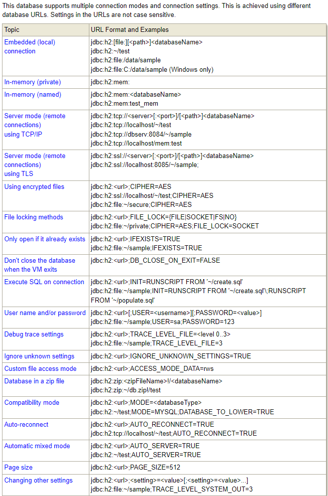
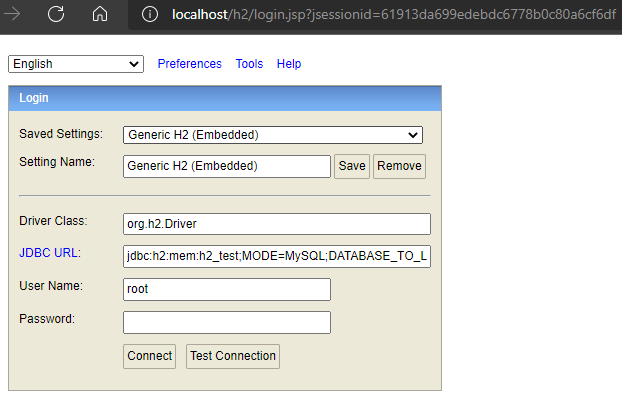
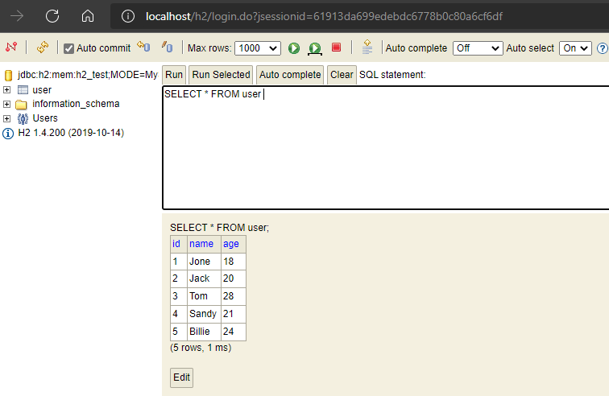

## 1. Spring Boot 对关系型数据库、数据源、持久化等支持

Spring Boot 对 SQL 关系型数据库提供了技术支持。主要包含三个层面：**数据源技术**、**持久化技术**和**数据库技术**。

## 2. 数据源技术

Spring Boot 程序，如果不使用第三方数据源技术，运行程序可以在日志中找到如下初始化信息：

```bash
INFO 31820 --- [           main] com.zaxxer.hikari.HikariDataSource       : HikariPool-1 - Starting...
INFO 31820 --- [           main] com.zaxxer.hikari.HikariDataSource       : HikariPool-1 - Start completed.
```

从以上日志可以看出，Spring Boot 提供了内置的数据源 HikariDataSource

### 2.1. Spring Boot 内嵌数据源

数据层技术是每一个企业级应用程序都会用到的，而其中必定会进行数据库连接的管理。Spring Boot 提供了 3 款内嵌数据源技术，分别如下：

- **HikariCP**：官方推荐的数据源技术，作为默认内置数据源使用。如不配置第三方数据源，则默认使用此数据源
- **Tomcat 提供 DataSource**：如不使用 HikariCP，并且使用 tomcat 作为 web 服务器开发时，则可以使用到此数据源。
    - 在引入 spring-boot-starter-web 依赖后，默认使用内嵌 tomcat，如果此时将 HikartCP 技术的坐标排除掉，则会使用到 tomcat 提供的 DataSource
- **Commons DBCP**：此数据源使用的条件比较苛刻了，当既不使用 HikartCP 也不使用 tomcat 的 DataSource 时，默认才使用此数据源

### 2.2. HikariCP 数据源配置

使用默认的数据源 HikariCP，直接在 application.yml 文件配置数据库相关信息即可：

```yml
spring:
  datasource:
    url: jdbc:mysql://localhost:3306/tempdb?serverTimezone=UTC&useSSL=false&useUnicode=true
    driver-class-name: com.mysql.cj.jdbc.Driver
    username: root
    password: 123456
```

可以对 HikariCP 配置其独立的属性，<font color=red>**但需要注意：`url` 地址需要单独配置，如果配置到 `hikari` 子属性中，程序启动会报错**</font>

```yml
spring:
  datasource:
    url: jdbc:mysql://localhost:3306/tempdb?serverTimezone=UTC&useSSL=false&useUnicode=true
    hikari:
      driver-class-name: com.mysql.cj.jdbc.Driver
      username: root
      password: root
      maximum-pool-size: 50
```

### 2.3. 测试

> 参考 mybatis 或者 mybatis-plus 与 Spring Boot 整合的示例，搭建一个最简单的工程用于测试

执行测试用例，观察控制台输出的日志

```bash
 _ _   |_  _ _|_. ___ _ |    _ 
| | |\/|_)(_| | |_\  |_)||_|_\ 
     /               |         
                        3.4.3 
INFO 10344 --- [           main] c.m.s.hikaricp.test.HikariCPTest         : Started HikariCPTest in 1.984 seconds (JVM running for 3.075)
INFO 10344 --- [           main] com.zaxxer.hikari.HikariDataSource       : HikariPool-1 - Starting...
INFO 10344 --- [           main] com.zaxxer.hikari.HikariDataSource       : HikariPool-1 - Start completed.
```

## 3. 内置数据库技术

Spring Boot 给开发者提供了内置的数据源解决方案和持久化解决方案，还提供了内置的数据库解决方案

### 3.1. Spring Boot 内置数据库

Spring Boot 提供了3款内置的数据库：

- H2
- HSQL
- Derby

以上三款数据库底层都是使用 java 语言开发的。除了可以独立安装之外，还可以像是 tomcat 服务器一样，采用内嵌的形式运行在 spirng boot 容器中。在应用程序运行后，如果进行测试工作，此时测试的数据无需存储在磁盘上，直接运行在内存中，运行或者测试完成后，服务器一旦关闭，所有数据都清除，不用手动去清理因测试留下的历史数据。这也是内嵌数据库的最大优点，方便进行功能测试。

### 3.2. H2 数据库简介

官方网址：http://www.h2database.com/html/main.html

连接方式相关（Database URL Overview），以嵌入式(本地)连接方式连接 H2 数据库。这种连接方式默认情况下只允许有一个客户端连接到H2数据库，有客户端连接到H2数据库之后，此时数据库文件就会被锁定，那么其他客户端就无法再连接了。

连接语法：`jdbc:h2:[file:][<path>]<databaseName>`

[官方连接url示例](http://www.h2database.com/html/features.html#database_url) 如下：



如以下 url 字符串为例：

```
jdbc:h2:mem:h2_test;MODE=MySQL;DATABASE_TO_LOWER=TRUE
```

- `mem`：以内存模式启动数据库
- `h2_test`：数据库名称
- `MODE=MySQL`：配置兼容MySQL
- `DATABASE_TO_LOWER=TRUE`：设置数据库字符全为小写

### 3.3. Spring Boot 内嵌 H2 数据库快速入门

以 H2 数据库为例，介绍使用这些内嵌数据库的方法

#### 3.3.1. 引入依赖

- h2 数据库的依赖

```xml
<dependency>
    <groupId>com.h2database</groupId>
    <artifactId>h2</artifactId>
</dependency>
```

- 引入数据库持久化框架，如 mybatis、mybatis-plus、spring-data-jpa 等。（*示例使用 mybatis-plus*）

```xml
<dependency>
    <groupId>com.baomidou</groupId>
    <artifactId>mybatis-plus-boot-starter</artifactId>
    <version>3.4.3</version>
</dependency>
```

- 引入 spring-boot-starter 或者 spring-boot-starter-web 依赖。

```xml
<dependency>
    <groupId>org.springframework.boot</groupId>
    <artifactId>spring-boot-starter-web</artifactId>
</dependency>
```

> 注：因为 H2 数据库自带一个控制台访问程序，需要使用web访问，如果不需要使用其控制台或者只做测试，则选择 spring-boot-starter 依赖即可

#### 3.3.2. 项目配置

修改 application.yml 配置文件，增加以下配置

```yml
server:
  port: 80
spring:
  h2:
    console:
      # 置开启 H2 数据库控制台访问程序，也可以使用其他的数据库连接软件操作
      enabled: true
      path: /h2
  # H2 数据库控制台通过 web 端访问路径 /h2，访问密码 123456，如果访问失败，先配置下列数据源，启动程序运行后再次访问/h2路径就可以正常访问了
  datasource:
    url: jdbc:h2:mem:h2_test;MODE=MySQL;DATABASE_TO_LOWER=TRUE
    # driver-class-name: org.h2.Driver # 可省略，Spring boot 会根据数据库的类型去选择相应的数据库连接驱动
    username: root
    password: 123456
    # 可以为 H2 配置两个sql文件用于程序启动时的数据表的创建与初始化；
    schema: classpath:db/schema-h2.sql # 创建表结构
    data: classpath:db/data-h2.sql # 初始化数据
```

**部分配置项解析**：

- `spring.h2.console`：用于开启 H2 数据库控制台访问程序。<font color=red>**值得注意的是：H2 数据库线上运行时请务必关闭**</font>
- `spring.datasource.hikari.driver-class-name` 的配置可能省略，因为 spring boot 会根据数据库的类型去选择相应的驱动类，如指定了则使用指定的驱动类。
- `spring.datasource.schema`：配置数据库初始化相关表结构
- `spring.datasource.data`：配置数据库初始化数据

初始化表结构脚本：

```sql
DROP TABLE IF EXISTS `user`;
CREATE TABLE `user`(
  `id`      BIGINT (20),
  `name`    VARCHAR(30),
  `age`     INT (11),
  PRIMARY KEY (`id`)
);
```

初始化数据脚本：

```sql
DELETE FROM `user`;
INSERT INTO `user`(`id`, `name`, `age`) VALUES (1, 'Jone', 18),(2, 'Jack', 20),(3, 'Tom', 28),(4, 'Sandy', 21),(5, 'Billie', 24);
```

> 值得注意的是：此处做示例时有一个小坑，就是 H2 数据库初始化表结构的sql语句，在定义字段时，不能使用 `NULL` 与 `NOT NULL` 等关键字
>
> 参考 [stackoverflow 的一个答复](https://stackoverflow.com/questions/38649370/how-to-make-mysql-database-schema-to-be-compatible-with-h2-database)

#### 3.3.3. 使用测试

创建一个简单的 mybatis-plus 工程用来测试


浏览器访问 `http://localhost/h2`，即可访问 H2 自带的连接控制台（*前提是配置开启*）



使用配置中的密码登陆，可以看到配置中初始化的数据库表与相应的数据



当程序运行起来后，就可以正常对数据库进行 CRUD 操作，而当程序停止运行后，所有数据都从内存中移除。

## 4. Spring Boot 整合 C3P0 数据源

### 4.1. 创建数据源实例

创建自定义配置类 `DataSourceConfiguration`，在类使用 `@Bean` 注解创建 `DataSource` 数据源实例

```java
@Configuration // 定义配置信息类
public class DataSourceConfiguration {
    /** 定义创建数据源方法 */
    @Bean(name="dataSource") // 定义Bean
    @Primary // 主要的候选者
    @ConfigurationProperties(prefix="spring.datasource.c3p0") // 配置属性
    public DataSource getDataSource(){
        return DataSourceBuilder.create() // 创建数据源构建对象
               .type(ComboPooledDataSource.class) // 设置数据源类型
               .build(); // 构建数据源对象
    }
}
```

### 4.2. c3p0 配置

在项目的 application.properties 文件中，配置 c3p0 相关属性

```properties
# 配置c3p0
spring.datasource.c3p0.driverClass=com.mysql.jdbc.Driver
spring.datasource.c3p0.jdbcUrl=jdbc:mysql://localhost:3306/springboot_db
spring.datasource.c3p0.user=root
spring.datasource.c3p0.password=123456
spring.datasource.c3p0.maxPoolSize=30
spring.datasource.c3p0.minPoolSize=10
spring.datasource.c3p0.initialPoolSize=10
```

## 5. Spring Boot 整合 Druid 数据源（待整理）

### 5.1. Druid 简介

Druid 是一个非常优秀的连接池，非常好的管理了数据库连接，可以实时监控数据库连接对象和应用程序的数据库操作记录

[Druid常见问题](https://github.com/alibaba/druid/wiki/%E5%B8%B8%E8%A7%81%E9%97%AE%E9%A2%98)

### 5.2. 项目准备

#### 5.2.1. 项目依赖

修改pom.xml文件，引入相关依赖

```xml

```

## 6. Spring Boot 整合 Jdbc

Spring Boot 除可以整合行业内常用的关系型数据库持久化技术框架之外，还内置了一套现成的数据层技术，此技术是是由 Spring 提供的 `JdbcTemplate`，此技术其实就是回归到 jdbc 最原始的编程形式来进行数据层的开发

### 6.1. 环境准备

> 为了方便测试，直接使用 Spring Boot 内嵌 H2 数据库内存模式

#### 6.1.1. 引入依赖

Spring Boot 整合 Jdbc 引入的核心依赖是 spring-boot-starter-jdbc

```xml
<dependencies>
    <dependency>
        <groupId>org.springframework.boot</groupId>
        <artifactId>spring-boot-starter</artifactId>
    </dependency>

    <dependency>
        <groupId>org.springframework.boot</groupId>
        <artifactId>spring-boot-starter-test</artifactId>
        <scope>test</scope>
    </dependency>

    <dependency>
        <groupId>com.h2database</groupId>
        <artifactId>h2</artifactId>
    </dependency>

    <!-- JDBC 依赖 -->
    <dependency>
        <groupId>org.springframework.boot</groupId>
        <artifactId>spring-boot-starter-jdbc</artifactId>
    </dependency>

    <dependency>
        <groupId>org.projectlombok</groupId>
        <artifactId>lombok</artifactId>
    </dependency>
</dependencies>
```

#### 6.1.2. 项目配置

- 创建 spring boot 项目配置文件 application.yml

```yml
spring:
  datasource:
    url: jdbc:h2:mem:h2_test;MODE=MySQL;DATABASE_TO_LOWER=TRUE
    # driver-class-name: org.h2.Driver # 可省略，Spring boot 会根据数据库的类型去选择相应的数据库连接驱动
    username: root
    password: 123456
    schema: classpath:db/schema-h2.sql # H2 初始化表结构
    data: classpath:db/data-h2.sql # H2 初始化数据
  jdbc: # JdbcTemplate 相关配置
    template:
      query-timeout: -1 # 查询超时时间
      max-rows: 500 # 最大行数
      fetch-size: -1 # 缓存行数
```

- 数据库表结构初始化脚本 schema-h2.sql

```sql
DROP TABLE IF EXISTS `tb_book`;
CREATE TABLE `tb_book`(
    `id`          BIGINT (20),
    `name`        VARCHAR(30),
    `type`        VARCHAR(10),
    `description` VARCHAR(200),
    PRIMARY KEY (`id`)
);
```

#### 6.1.3. 工程基础代码

- 创建数据库表相应的实体类

```java
@Data
public class Book {
    private int id;
    private String name;
    private String type;
    private String description;
}
```

- 项目启动类

```java
@SpringBootApplication
public class JdbcApplication {
    public static void main(String[] args) {
        SpringApplication.run(JdbcApplication.class, args);
    }
}
```

### 6.2. 整合功能测试

编写测试用例，分别测试使用 JdbcTepmlate 进行增删改查。_这里只作最基础的使用示例，更详细用法详见其他笔记_

```java
@SpringBootTest
public class JdbcTemplateTest {

    @Autowired
    private JdbcTemplate jdbcTemplate;

    // 测试保存数据
    @Test
    public void testJdbcTemplateSave() {
        String sql = "insert into tb_book values(4,'springboot','IT','这是一本好书')";
        jdbcTemplate.update(sql);
    }

    // 测试更新数据
    @Test
    public void testJdbcTemplateUpdate() {
        String sql = "update tb_book set name = ? where id = ?";
        Object[] args = {"修改后的书名", 2};
        int[] argTypes = {Types.VARCHAR, Types.INTEGER};
        jdbcTemplate.update(sql, args, argTypes);
    }

    // 测试删除数据
    @Test
    public void testJdbcTemplateDelete() {
        String sql = "delete from tb_book where id = ?";
        Object[] args = {3};
        int[] argTypes = {Types.INTEGER};
        jdbcTemplate.update(sql, args, argTypes);
    }

    // 测试查询数据
    @Test
    void testJdbcTemplateQuery() {
        String sql = "select * from tb_book";
        RowMapper<Book> rm = new RowMapper<Book>() {
            @Override
            public Book mapRow(ResultSet rs, int rowNum) throws SQLException {
                Book temp = new Book();
                temp.setId(rs.getInt("id"));
                temp.setName(rs.getString("name"));
                temp.setType(rs.getString("type"));
                temp.setDescription(rs.getString("description"));
                return temp;
            }
        };
        List<Book> list = jdbcTemplate.query(sql, rm);
        System.out.println(list);
    }

}
```

## 7. Spring Boot 整合 MyBatis（待整理更新）

### 7.1. 环境准备

- **第一步：导入数据库表**
- **第二步：加入 MyBatis 的启动器依赖**

```xml
<!-- 配置MyBatis启动器 -->
<dependency>
    <groupId>org.mybatis.spring.boot</groupId>
    <artifactId>mybatis-spring-boot-starter</artifactId>
    <version>1.3.0</version>
</dependency>
<!-- 配置mysql驱动 -->
<dependency>
    <groupId>mysql</groupId>
    <artifactId>mysql-connector-java</artifactId>
</dependency>
<!-- 配置c3p0连接池 -->
<dependency>
    <groupId>com.mchange</groupId>
    <artifactId>c3p0</artifactId>
    <version>0.9.5.2</version>
</dependency>
```

- **第三步：加入配置文件**：参考 spring-boot-autoconfigure-1.5.6.RELEASE.jar 中 jdbc 包中属性文件类 **DataSourceProperties**

```java
@ConfigurationProperties(prefix = "spring.datasource")
public class DataSourceProperties implements BeanClassLoaderAware, InitializingBean {

    private ClassLoader classLoader;

    /**
    	* Name of the datasource. Default to "testdb" when using an embedded database.
    	*/
    private String name;

    /**
    	* Whether to generate a random datasource name.
    	*/
    private boolean generateUniqueName;

    /**
    	* Fully qualified name of the connection pool implementation to use. By default, it
    	* is auto-detected from the classpath.
    	*/
    private Class<? extends DataSource> type;

    /**
    	* Fully qualified name of the JDBC driver. Auto-detected based on the URL by default.
    	*/
    private String driverClassName;

    /**
    	* JDBC URL of the database.
    	*/
    private String url;

    /**
    	* Login username of the database.
    	*/
    private String username;

    /**
    	* Login password of the database.
    	*/
    private String password;
    ......
}
```

参考 mybatis-spring-boot-autoconfigure-1.3.0.jar 中属性文件类**MybatisProperties**

```java
@ConfigurationProperties(prefix = MybatisProperties.MYBATIS_PREFIX)
public class MybatisProperties {

    public static final String MYBATIS_PREFIX = "mybatis";

    /**
    * Location of MyBatis xml config file.
    */
    private String configLocation;

    /**
    * Locations of MyBatis mapper files.
    */
    private String[] mapperLocations;

    /**
    * Packages to search type aliases. (Package delimiters are ",; \t\n")
    */
    private String typeAliasesPackage;

    /**
    * Packages to search for type handlers. (Package delimiters are ",; \t\n")
    */
    private String typeHandlersPackage;

    /**
    * Indicates whether perform presence check of the MyBatis xml config file.
    */
    private boolean checkConfigLocation = false;

    /**
    * Execution mode for {@link org.mybatis.spring.SqlSessionTemplate}.
    */
    private ExecutorType executorType;

    /**
    * Externalized properties for MyBatis configuration.
    */
    private Properties configurationProperties;

    /**
    * A Configuration object for customize default settings. If {@link #configLocation}
    * is specified, this property is not used.
    */
    @NestedConfigurationProperty
    private Configuration configuration;
    ......
}
```

在 src/main/resources 下添加 application.properties（或 application.yml）配置文件，内容如下：

```properties
# 配置数据源
spring.datasource.driverClassName=com.mysql.jdbc.Driver
spring.datasource.url=jdbc:mysql://localhost:3306/springboot_db
spring.datasource.username=root
spring.datasource.password=123456
spring.datasource.type=com.mchange.v2.c3p0.ComboPooledDataSource

# 配置MyBatis3
# 配置类型别名扫描基础包
mybatis.typeAliasesPackage=com.moon.springboot.domain
# 配置SQL语句映射文件
mybatis.mapperLocations=classpath:mappers/**/*Mapper.xml
# 配置核心配置文件
mybatis.configLocation=classpath:mybatis-config.xml
```

使用 yml 配置文件

```yml
mybatis:
  mapper-locations: classpath:mappers/**/*.xml
  type-aliases-package: com.moon.demo.pojo
  # 开启驼峰映射
  configuration:
    map-underscore-to-camel-case: true
```

**注：传统的 ssm 框架中，mybatis 的总配置文件是 mybatis-config.xml，但 spring boot 推荐少用配置文件，所以，可以将 mybatis-config.xml 的相关配置写在 application.properties(或 application.yml)中**

### 7.2. application 文件相关配置

- 任何其他 Spring Boot 应用程序一样，MyBatis-Spring-Boot-Application 配置参数存储在 application.properties（或 application.yml）中。
- MyBatis 使用前缀 mybatis 作为其属性

#### 7.2.1. 可用的属性

|           属性            |                                                              描述                                                              |
| :----------------------: | ------------------------------------------------------------------------------------------------------------------------------ |
|     config-location      | MyBatis xml 配置文件的位置                                                                                                       |
|  check-config-location   | 指示是否执行 MyBatis xml 配置文件的状态检查                                                                                         |
|     mapper-locations     | Mapper xml 映射文件的位置                                                                                                        |
|   type-aliases-package   | 用于搜索类型别名的包。 （包分隔符是 `,`、`;`、`\t`、`\n`）                                                                            |
|  type-handlers-package   | 用于搜索类型处理程序的包。 （包分隔符是 `,`、`;`、`\t`、`\n`）                                                                        |
|      executor-type       | 执行者类型：SIMPLE，REUSE，BATCH。                                                                                                |
| configuration-properties | MyBatis 配置的外部化属性。指定的属性可以用作 MyBatis 配置文件和 Mapper 文件的占位符                                                     |
|      configuration       | MyBatis 相关配置 bean。关于可用属性，与 mybatis-config.xml 配置文件的 settings 配置属性一致。**注意此属性不能 config-location 同时使用** |

#### 7.2.2. 配置案例

```properties
# application.properties
mybatis.type-aliases-package=com.example.domain.model
mybatis.type-handlers-package=com.example.typehandler
mybatis.configuration.map-underscore-to-camel-case=true
mybatis.configuration.default-fetch-size=100
mybatis.configuration.default-statement-timeout=30
...
```

```yml
# application.yml
mybatis:
  type-aliases-package: com.example.domain.model
  type-handlers-package: com.example.typehandler
  configuration:
    map-underscore-to-camel-case: true
    default-fetch-size: 100
    default-statement-timeout: 30
```

### 7.3. 整合开发 Demo

- 使用 Spring Boot + Spring MVC + MyBatis 实现查询所有公告
- 使用 Spring Boot + Spring MVC + MyBatis + EasyUI 实现公告分页查询

- **第一步：创建 domain**

```java
public class Notice implements Serializable {
    private static final long serialVersionUID = 5679176319867604937L;
    private Long id;
    private String title;
    private String content;
    /** setter and getter method */
    public Long getId() {
    	return id;
    }
    public void setId(Long id) {
    	this.id = id;
    }
    public String getTitle() {
    	return title;
    }
    public void setTitle(String title) {
    	this.title = title;
    }
    public String getContent() {
    	return content;
    }
    public void setContent(String content) {
    	this.content = content;
    }
}
```

- **第二步：编写 NoticeMapper 接口**。和之前的方式一样，只是多了@Mapper 个注解。@Mapper：声明 Mapper 接口
  - 注意：`@Mapper`标记该类是一个 mybatis 的 mapper 接口，可以被 spring boot 自动扫描到 spring 上下文中

```java
@Mapper
public interface NoticeMapper {
    /** 查询所有公告 */
    @Select("select * from notice")
    public List<Notice> findAll();

    /** 统计查询 */
    public Long count();
    /** 分页查询公告 */
    public List<Notice> findByPage(@Param("page")Integer page, @Param("rows")Integer rows);
}
```

- **第三步：编写 src/main/resources/mappers/NoticeMapper.xml 文件**

```xml
<?xml version="1.0" encoding="UTF-8" ?>
<!DOCTYPE mapper
        PUBLIC "-//mybatis.org//DTD Mapper 3.0//EN"
        "http://mybatis.org/dtd/mybatis-3-mapper.dtd">
<mapper namespace="com.moon.springboot.mapper.NoticeMapper">

    <!-- 统计查询 -->
    <select id="count" resultType="long">
		select count(*) from notice
	</select>

    <!-- 分页查询公告 -->
    <select id="findByPage" resultType="notice">
		select * from notice limit #{page},#{rows}
	</select>
</mapper>
```

- **第四步：编写 Service 与实现类**

```java
public interface NoticeService {
    /** 查询所有的公告 */
    public List<Notice> findAll();
    /** 分页查询公告 */
    public Map<String,Object> findByPage(Integer page, Integer rows);
}

@Service
@Transactional
public class NoticeServiceImpl implements NoticeService {
    @Autowired
    private NoticeMapper noticeMapper;
    /** 查询所有的公告 */
    public List<Notice> findAll(){
        return noticeMapper.findAll();
    }
    /** 分页查询公告 */
    public Map<String,Object> findByPage(Integer page, Integer rows){
        /** 创建Map集合封装响应数据 */
        Map<String,Object> data = new HashMap<>();
        /** 统计查询 */
        long count = noticeMapper.count();
        data.put("total", count);
        /** 分页查询 */
        List<Notice> notices = noticeMapper.findByPage(page, rows);
        data.put("rows", notices);
        return data;
    }
}
```

- **第五步：编写 Controller**

```java
@Controller
public class NoticeController {
    @Autowired
    private NoticeService noticeService;
    /** 查询全部公告 */
    @GetMapping("/findAll")
    @ResponseBody
    public List<Notice> findAll(){
        return noticeService.findAll();
    }
    /** 跳转分页查询公告页面 */
    @GetMapping("/show")
    public String show(){
        return "/html/notice.html";
    }
    /** 分页查询公告 */
    @PostMapping("/findByPage")
    @ResponseBody
    public Map<String,Object> findByPage(@RequestParam(value="page", defaultValue="1", required=false)Integer page,
                                         @RequestParam(value="rows", defaultValue="15", required=false)Integer rows){
        return noticeService.findByPage((page - 1) * rows, rows);
    }
}
```

- **第六步：加入静态资源**

src/main/resources/public/html/notice.html
src/main/resources/static/js
src/main/resources/static/css
src/main/resources/static/images

- **第七步：编写启动类**
- **第八步：测试**
    - 浏览器地址栏输入：http://localhost:8080/findAll
    - 浏览器地址栏输入：http://localhost:8080/show

## 8. Spring Boot 整合 JPA（待整理更新）

### 8.1. 环境准备

- **第一步：导入数据库表**：运行 SpringBoot\准备资料\springboot.sql 文件创建数据库表及表中数据
- **第二步：加入 Spring-Data-JPA 的启动器**

```xml
<!-- 配置web启动器(spring mvc) -->
<dependency>
    <groupId>org.springframework.boot</groupId>
    <artifactId>spring-boot-starter-web</artifactId>
</dependency>
<!-- 配置devtools实现热部署 -->
<dependency>
    <groupId>org.springframework.boot</groupId>
    <artifactId>spring-boot-devtools</artifactId>
</dependency>

<!-- 配置Spring-Data-JPA启动器 -->
<dependency>
    <groupId>org.springframework.boot</groupId>
    <artifactId>spring-boot-starter-data-jpa</artifactId>
</dependency>
<!-- 配置mysql驱动 -->
<dependency>
    <groupId>mysql</groupId>
    <artifactId>mysql-connector-java</artifactId>
</dependency>
<!-- 配置c3p0连接池 -->
<dependency>
    <groupId>com.mchange</groupId>
    <artifactId>c3p0</artifactId>
    <version>0.9.5.2</version>
</dependency>
```

- **第三步：application.properties 配置文件**。参考 spring-boot-autoconfigure-1.5.6.RELEASE.jar 中 orm.jpa 包中属性文件类 `JpaProperties` 或者官方文档

```properties
# 配置自定义的c3p0数据源
spring.datasource.c3p0.driverClass=com.mysql.jdbc.Driver
spring.datasource.c3p0.jdbcUrl=jdbc:mysql://localhost:3306/springboot_db
spring.datasource.c3p0.user=root
spring.datasource.c3p0.password=123456
spring.datasource.c3p0.maxPoolSize=20
spring.datasource.c3p0.minPoolSize=10
spring.datasource.c3p0.initialPoolSize=10

# JPA
spring.jpa.showSql=true
spring.jpa.properties.hibernate.format_sql=true
```

注：

- 其中，数据源（原生的 datasource 也可以，将 c3p0 去掉即可）配置包括 driverClass(驱动类)、url(数据库地址)、user\password (用户名与密码)、其它数据源的相关参数(如：maxPoolSize 等等)
- JPA 的配置包括：如 showSql(是否显示 sql 语句)、format_sql(是否格式式 sql)、hibernate.ddl-auto(配置为 create 时，程序启动时会在 MySQ 数据库中建表；配置为 update 时，在程序启动时不会在 MySQL 数据库中建表)等等

application.yml 方式配置：

```yml
spring:
  datasource:
    c3p0:
      driverClass: com.mysql.jdbc.Driver
      jdbcUrl: jdbc:mysql://localhost:3306/springboot_db
      user: root
      password: 123456
      maxPoolSize: 20
      minPoolSize: 10
      initialPoolSize: 10
  jpa:
    showSql: false
    properties:
      hibernate:
        format_sql: true
```

### 8.2. 整合开发

案例：使用 Spring Boot + Spring MVC + Spring Data JPA 查询所有公告

- **第一步：创建 entity**

```java
@Entity
@Table(name="notice")
public class Notice implements Serializable {
    private static final long serialVersionUID = 5679176319867604937L;
    @Id @GeneratedValue(strategy=GenerationType.IDENTITY)
    @Column(name="id")
    private Long id;
    @Column(name="title")
    private String title;
    @Column(name="content")
    private String content;
    /** setter and getter method */
    public Long getId() {
        return id;
    }
    public void setId(Long id) {
        this.id = id;
    }
    public String getTitle() {
        return title;
    }
    public void setTitle(String title) {
        this.title = title;
    }
    public String getContent() {
        return content;
    }
    public void setContent(String content) {
        this.content = content;
    }
}
```

- **第二步：创建数据访问 Dao**

```java
@Repository
public interface NoticeDao extends JpaRepository<Notice, Long>{
}
```

- **第三步：创建业务处理**

```java
public interface NoticeService {
    /** 查询所有的公告 */
    public List<Notice> findAll();
}

@Service
@Transactional
public class NoticeServiceImpl implements NoticeService {
    @Autowired
    private NoticeDao noticeDao;
    /** 查询所有的公告 */
    public List<Notice> findAll(){
        return noticeDao.findAll();
    }
}
```

- **第四步：创建处理器**

```java
@RestController
public class NoticeController {
    @Autowired
    private NoticeService noticeService;
    /** 查询全部公告 */
    @GetMapping("/findAll")
    public List<Notice> findAll(Model model){
        return noticeService.findAll();
    }
}
```

- **第五步：编写启动类**
- **第六步：测试**。浏览器地址栏输入：http://localhost:8080/findAll

