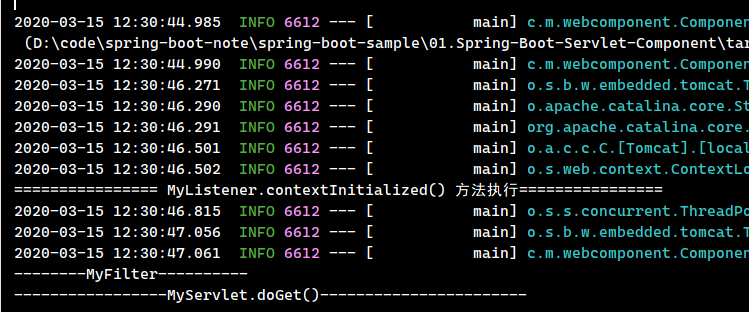

## 1. Spring Boot 整合 Servlet、Filter、Listener 概述

有的时候需要在 springboot 工程里面加入 Servlet、Filter 和 Listener 等

## 2. 环境准备 - 项目依赖

修改pom.xml文件，配置项目相关依赖

```xml
<dependencies>
    <!-- 引入web项目启动器 -->
    <dependency>
        <groupId>org.springframework.boot</groupId>
        <artifactId>spring-boot-starter-web</artifactId>
    </dependency>

    <!-- 引入spring boot的测试类 -->
    <dependency>
        <groupId>org.springframework.boot</groupId>
        <artifactId>spring-boot-starter-test</artifactId>
        <scope>test</scope>
    </dependency>
</dependencies>
```

## 3. 整合步骤

1. 在项目的启动类上增加注解`@ServletComponentScan(basePackages = {"xxx.xxx.xxx"})`

```java
package com.moon.webcomponent;

import org.springframework.boot.SpringApplication;
import org.springframework.boot.autoconfigure.SpringBootApplication;
import org.springframework.boot.web.servlet.ServletComponentScan;

/**
 * Spring Boot 整合 Servlet、Filter、Listener 启动类
 */
@SpringBootApplication
// @ServletComponentScan 注解作用是到扫描指定包中有@WebServlet、@WebFilter、@WebListener等注解的类
@ServletComponentScan(basePackages = {"com.moon.webcomponent"})
public class ComponentApplication {
    public static void main(String[] args) {
        SpringApplication.run(ComponentApplication.class, args);
    }
}

```

2. 该注解会扫描指定包(basePackages)下面的注解
    - `@WebServlet`
    - `@WebFilter`
    - `@WebListener`

创建自定义servlet

```java
package com.moon.webcomponent.servlet;

import javax.servlet.ServletException;
import javax.servlet.annotation.WebServlet;
import javax.servlet.http.HttpServlet;
import javax.servlet.http.HttpServletRequest;
import javax.servlet.http.HttpServletResponse;
import java.io.IOException;

/**
 * 自定义servlet
 */
@WebServlet(urlPatterns = "/myservlet/*")
public class MyServlet extends HttpServlet {
    @Override
    protected void doGet(HttpServletRequest req, HttpServletResponse resp)
            throws ServletException, IOException {
        System.out.println("-----------------MyServlet.doGet()-----------------------");
    }

    @Override
    protected void doPost(HttpServletRequest req, HttpServletResponse resp)
            throws ServletException, IOException {
        System.out.println("-----------------MyServlet.doPost()-----------------------");
    }
}
```

创建自定义filter

```java
package com.moon.webcomponent.filter;

import javax.servlet.Filter;
import javax.servlet.FilterChain;
import javax.servlet.ServletException;
import javax.servlet.ServletRequest;
import javax.servlet.ServletResponse;
import javax.servlet.annotation.WebFilter;
import java.io.IOException;

/**
 * 自定义 Filter
 */
@WebFilter(urlPatterns = "/*", filterName = "myFilter")
public class MyFilter implements Filter {
    @Override
    public void doFilter(ServletRequest request, ServletResponse response, FilterChain chain)
            throws IOException, ServletException {
        System.out.println("--------MyFilter----------");
        chain.doFilter(request, response);
    }
}
```

创建自定义listener

```java
package com.moon.webcomponent.listener;

import javax.servlet.ServletContextEvent;
import javax.servlet.ServletContextListener;
import javax.servlet.annotation.WebListener;

/**
 * 自定义 Listenr
 *
 * @author MoonZero
 * @version 1.0
 * @date 2020-3-15 12:11
 * @description
 */
@WebListener
public class MyListener implements ServletContextListener {
    @Override
    public void contextInitialized(ServletContextEvent sce) {
        System.out.println("================ MyListener.contextInitialized() 方法执行================");
    }
    @Override
    public void contextDestroyed(ServletContextEvent sce) {
        System.out.println("================ MyListener.contextDestroyed() 方法执行================");
    }
}
```

## 4. 运行测试

- 在浏览器输入url：`http://localhost:8080/myservlet/1`
- 运行结果


