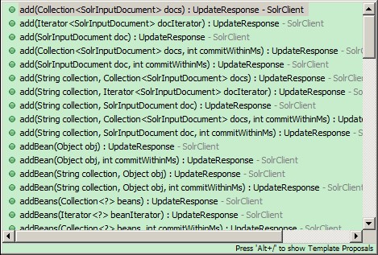

# Spring Boot 整合 Solr

## 1. 整合示例

### 1.1. 加入依赖

在pom.xml中加入依赖：

```xml
<!-- 配置solr启动器 -->
<dependency>
    <groupId>org.springframework.boot</groupId>
    <artifactId>spring-boot-starter-data-solr</artifactId>
</dependency>
```

**注意：solr-solrj的版本必须为5.0以上才可以用。**

### 1.2. 配置连接 Solr

在application.properties中配置

```properties
# 配置Solr单机版
#spring.data.solr.host=http://192.168.12.128:8080/solr

# 配置Solr集群版
spring.data.solr.zkHost=192.168.12.128:3181,192.168.12.128:3182,192.168.12.128:3183
```

**说明：切换到单机版，注释掉集群版配置信息即可。**

### 1.3. SolrClient 操作 Solr

只需要直接注入SolrClient即可使用以下方法操Solr



