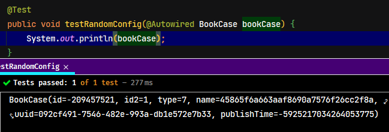

## 1. Spring Boot 应用测试概述

Spring Boot 提供了一些实用程序和注解来帮助测试应用程序。测试支持由两个模块提供：

- Spring-boot-test 包含核心项目
- Spring-boot-test-autoconfigure 支持测试的自动配置

## 2. 关于 Spring Boot 中 Junit 的概述

Spring Boot 2.2.x 往后版本开始引入 JUnit 5 作为单元测试默认库，在 Spring Boot 2.2.x 版本之前，`spring-boot-starter-test` 包含了 JUnit 4 的依赖，Spring Boot 2.2.x 版本之后替换成了 Junit Jupiter。

## 3. spring-boot-starter-test 依赖

在 Spring Boot 工程，直接添加 `spring-boot-starter-test` 依赖即可使用 Junit

```xml
<!-- 配置测试启动器 -->
<dependency>
    <groupId>org.springframework.boot</groupId>
    <artifactId>spring-boot-starter-test</artifactId>
    <scope>test</strcope>
</dependency>
```

> 注意：Spring Boot 2.2.x 以前版本默认的测试库是 Junit4，在 2.2.x 其更高版本中，默认的测试库是 Junit5。如果工程是非 web 工程，则至少需要引入 `spring-boot-starter` 的依赖。

### 3.1. 排除 junit 4

> 引用官方文档：
>
> The starter also brings the vintage engine so that you can run both JUnit 4 and JUnit 5 tests. If you have migrated your tests to JUnit 5, you should exclude JUnit 4 support
> 
> 翻译：启动器默认自带复古的引擎，这样你就可以同时运行 JUnit 4和JUnit 5 测试。如果你已经将你的测试迁移到 JUnit 5，你应该排除 JUnit 4 的支持

如果只使用 junit 5 并且不需要 junit 4，可以按以下方式进行排除其依赖：

```xml
<dependency>
    <groupId>org.springframework.boot</groupId>
    <artifactId>spring-boot-starter-test</artifactId>
    <scope>test</scope>
    <!-- 排除 junit 4 -->
    <exclusions>
        <exclusion>
            <groupId>org.junit.vintage</groupId>
            <artifactId>junit-vintage-engine</artifactId>
        </exclusion>
    </exclusions>
</dependency>
```

## 4. 基础使用步骤

### 4.1. Spring Boot 2.2.x-

在 Spring Boot 2.2.x 版本之前，只是 junit 4

> 引用官方文档：
>
> If you are using JUnit 4, don’t forget to also add @RunWith(SpringRunner.class) to your test, otherwise the annotations will be ignored. If you are using JUnit 5, there’s no need to add the equivalent @ExtendWith(SpringExtension.class) as @SpringBootTest and the other @…Test annotations are already annotated with it.
>
> 翻译：如果你使用JUnit 4，别忘了在你的测试中也添加 `@RunWith(SpringRunner.class)`，否则注释会被忽略。如果你使用的是 JUnit 5，就不需要添加等效的 `@ExtendWith(SpringExtension.class)`，因为 `@SpringBootTest` 和其他的 `@...Test` 注解已经有了它的注解。

1. 开启 Spring Boot 测试，在测试类加 `@RunWith(SpringRunner.class)`。`@RunWith` 是注解运行的主类
2. 测试类上添加`@SpringBootTest`注解，`classes` 属性要指定启动类的 class

```java
@RunWith(SpringRunner.class)
@SpringBootTest(classes = {引导类.class})
public class XxxxTest {
    // 注入需要的 spring 容器的对象
    @Autowired
    private Environment environment;

    @Test
    public void testXxxx() {
        // 相关的测试代码...
    }
}
```

> Tips: 使用 JUnit 4 时，必须使用 `@RunWith(SpringRunner.class)` 修改测试类。

### 4.2. Spring Boot 2.2.x+

从 2.2.x 版本开始，Spring Boot 使用 Junit 5 做为单元测试默认库（*与 Jnuit4 有一点不同*）。如果是使用 Junit 5，开启 Spring Boot 的测试时只需要在测试类上加上 `@SpringBootTest` 注解即可。

```java
@SpringBootTest(classes = {引导类.class})
public class XxxxTest {
    // 注入需要的 spring 容器的对象
    @Autowired
    private Environment environment;

    @Test
    public void testXxxx() {
        // 相关的测试代码...
    }
}
```

> Tips: 在 Spring Boot 2.2.x+ 版本中，还是一样可以使用 junit 4。<font color=red>**在使用 Junit 5 已无需 `@RunWith` 注解，但需要注意导包时别导错 junit 4 的包，也可以直接将 junit 4 的依赖排除来防止错导包**</font>。

### 4.3. Spring Boot 测试注意问题

如果当前测试类所在包不在工程引导类所在包或其子包时，就会报错找到配置的错误：`java.lang.IllegalStateException: Unable to find a @SpringBootConfiguration, you need to use @ContextConfiguration or @SpringBootTest(classes=...) with your test`，有两种解决方法如下：

1. 在 `@SpringBootTest` 注解中，通过 `classes` 属性指定启动类

```java
@SpringBootTest(classes = {JunitApplication.class})
public class JunitTest2 {

    @Test
    public void testBasic() {
        System.out.println("spring boot 整合 junit，测试类不在启动类所在的包及其子包下....");
    }

}
```

2. 添加 `@ContextConfiguration` 注解，通过 `classes` 属性指定启动类

```java
@SpringBootTest
@ContextConfiguration(classes = {JunitApplication.class})
public class JunitTest2 {
    @Test
    public void testBasic() {
        System.out.println("spring boot 整合 junit，测试类不在启动类所在的包及其子包下....");
    }
}
```

## 5. 进阶使用示例

> Tips: 以下示例，在 Spring Boot 2.2.x 以前版本使用 Junit4，需要添加`@RunWith(SpringRunner.class)`注解，若使用 2.2.x 后更高版本并且使用Junit5，则不需要。

### 5.1. 指定启动类

`@SpringBootTest` 注解的 `classes` 属性，用于指定的是引导类的字节码对象，如：`@SpringBootTest(classes = Application.class)`。*其中 `Application.java` 是Spring boot的引导类*。如果未设置 `classes` 属性，Spring Boot 将从包含测试的包开始，直到找到使用 `@SpringBootApplication` 或 `@SpringBootConfiguration` 注释的主配置类，找不到则报错。

```java
@RunWith(SpringRunner.class) // JUnit 4 才需要使用此注解
// 方式2：设置classes属性，指定SpringBoot启动类
@SpringBootTest(classes = Application.class)
public class MapperTest {
    @Autowired
    private UserMapper userMapper;
    @Test
    public void test() {
        List<User> users = userMapper.queryUserList();
        System.out.println(users);
    }
}
```

注：`SpringRunner` 继承自 `SpringJUnit4ClassRunner`，使用哪一个 Spring 提供的测试测试引擎都可以

```java
public final class SpringRunner extends SpringJUnit4ClassRunner
```

### 5.2. 加载测试专用属性

很多情况下测试时需要模拟一些线上情况，或者模拟一些特殊情况。此时可以每次测试的时候都去修改源码 application.yml 中的配置进行测试。但每次测试前进行修改，测试后又需要改回去，这种做法太麻烦了。于是 Spring Boot 提供了在测试环境中创建一组临时属性，去覆盖源码中设定的属性，这样测试用例就相当于是一个独立的环境，能够独立测试，

#### 5.2.1. 测试准备

创建项目 application.yml 配置文件，设置 `test.message` 属性值

```yml
test:
  message: testValueInApplicationYml
```

#### 5.2.2. 临时属性

使用注解 `@SpringBootTest` 的 `properties` 属性，可以为当前测试用例添加临时的属性，覆盖源码配置文件中对应的属性值进行测试。具体使用示例如下：

```java
/*
 * properties 属性可以为当前测试用例添加临时的属性配置
 *  与 value 属性一样的作用，如果没有其他属性，则可以省略不写 "value="
 */
// @SpringBootTest("test.prop=testValue1")
// 或者
@SpringBootTest(properties = "test.message=testValueInProperties")
public class PropertiesAndArgsTest {

    @Value("${test.message}")
    private String message;

    @Test
    public void testProperties() {
        System.out.println(message); // 输出：testValueInProperties
    }
}
```

#### 5.2.3. 临时参数

使用命令行启动 springboot 程序时，通过命令行参数也可以设置属性值。线上启动程序时，通常都会添加一些专用的配置信息。使用注解 `@SpringBootTest` 的 `args` 属性可以为当前测试用例模拟命令行参数并进行测试。

```java
/* args属性可以为当前测试用例添加临时的命令行参数 */
// @SpringBootTest(args={"--test.message=testValueInArgs"})
/*
 * 如果同时设置 properties 与 args 属性，则由 spring boot 规定的属性加载优先级来决定
 *  所以最终会加载 args 属性的设置
 */
@SpringBootTest(properties = {"test.message=testValueInProperties"}, args = {"--test.message=testValueInArgs"})
public class PropertiesAndArgsTest {

    @Value("${test.message}")
    private String message;

    @Test
    public void testProperties() {
        System.out.println(message); // 输出：testValueInArgs
    }
}
```

如果同时设置了 `properties` 与 `args` 属性，在 Spring Boot 属性加载的优先级设定中，明确规定了命令行参数的优先级排序是11，而配置属性的优先级是3，所以 `args` 属性配置优先于 `properties` 属性配置加载

### 5.3. 加载测试专用配置

在项目测试过程中，有时会需要临时配置一些专用于测试环境的 bean 对象。一个 Spring 环境中可以设置若干个配置文件或配置类，这些配置信息可以同时生效。在测试环境中增加一个测试专用的配置类，其实现方式与平常 Spring 环境中加载多个配置信息的方式完全一样。具体操作步骤如下：

- 在测试 test 包中创建专用的测试环境配置类

```java
@Configuration
public class MockConfig {
    // 此处为了不引入其他第三方 jar 包，直接创建一个 String 对象用来测试
    @Bean
    public String mock(){
        return "mock bean";
    }
}
```

> 上述配置仅用于演示当前实验效果，实际开发是不能这么注入 `String` 类型的数据

- 在启动测试环境时，使用 `@Import` 注解导入测试环境专用的配置类即可

```java
@SpringBootTest
@Import({MockConfig.class})
public class ImportConfigTest {

    @Autowired
    private String msg;

    @Test
    void testConfiguration(){
        System.out.println(msg); // 输出：mock bean
    }
}
```

通过 `@Import` 注解实现了基于开发环境的配置基础上，对配置进行测试环境的追加操作。这样就可以实现每个不同的测试用例加载不同的 bean 的效果，同时不影响原开发环境的配置。

### 5.4. web 环境测试

在测试中对表现层功能进行测试，运行测试程序时，必须启动 web 环境，还需要在测试程序中具备发送 web 请求的能力，否则无法实现 web 功能的测试。

#### 5.4.1. 测试前准备工作

- 测试工程引入 web 依赖

```xml
<dependency>
    <groupId>org.springframework.boot</groupId>
    <artifactId>spring-boot-starter-web</artifactId>
</dependency>
```

- 创建实体类与控制层

```java
public class Book {
    private int id;
    private String name;
    private String type;
    private String description;
    // ...省略 setter/getter
}
```

```java
@RestController
@RequestMapping("/books")
public class MockController {

    @GetMapping("msg")
    public String getMsg() {
        System.out.println("getMsg is running .....");
        return "book msg";
    }

    @GetMapping("info")
    public Book getBookInfo() {
        System.out.println("getBookInfo is running .....");

        Book book = new Book();
        book.setId(1);
        book.setName("Spring Boot 快速入门");
        book.setType("计算机");
        book.setDescription("这是一本好书");

        return book;
    }
}
```

#### 5.4.2. 指定 web 测试环境的端口

`@SpringBootTest `注解的 `webEnvironment` 属性，用于在测试用例中设置启动 web 测试环境，spring boot 提供了4种的枚举：

- `SpringBootTest.WebEnvironment.MOCK`：根据当前设置确认是否启动 web 环境，例如使用了 Servlet 的 API 就启动 web 环境，属于适配性的配置
- `SpringBootTest.WebEnvironment.DEFINED_PORT`：使用自定义的端口作为 web 服务器端口
- `SpringBootTest.WebEnvironment.RANDOM_PORT`：使用随机端口作为 web 服务器端口
- `SpringBootTest.WebEnvironment.NONE`：不启动 web 环境（默认值）

建议测试时使用 `RANDOM_PORT` 模式，避免代码中因为写死端口引发线上功能打包测试时，由于端口冲突导致意外现象的出现。即程序中使用 8080 端口，结果线上环境 8080 端口被占用了，使用随机端口就可以测试出来有没有这种问题的隐患。

示例1

```java
@SpringBootTest(webEnvironment = SpringBootTest.WebEnvironment.RANDOM_PORT)
public class WebEnvironmentTest {
    // 测试 web 启动
    @Test
    public void testWebStart() {
    }
}
```

示例2

```java
@RunWith(SpringRunner.class)
// 方式1：webEnvironment设置web测试环境的端口，SpringBootTest.WebEnvironment.RANDOM_PORT 为随机端口
@SpringBootTest(webEnvironment = SpringBootTest.WebEnvironment.RANDOM_PORT)
public class SpringbootdemoApplicationTests {
   @LocalServerPort
   private int port;
   private URL base;

   // TestRestTemplate是RestTemplate的测试类
   @Autowired
   private TestRestTemplate template;

   @Before
   public void setUp() throws Exception {
      this.base = new URL("http://localhost" + port + "/");
   }

   @Test
   public void getHello() {
      System.out.println(base.toString());
      System.out.println("1111");
   }
}
```

#### 5.4.3. 测试类中发送请求

Java 提供了 API 用于测试类中发送请求，spring boot 对其又进行了包装，简化了开发步骤，具体操作如下：

1. 在测试类中，标识 `@AutoConfigureMockMvc` 注解，开启 web 虚拟调用功能
2. 定义发起虚拟调用的 `MockMVC` 对象 ，通过自动装配的形式初始化对象。通过类属性或测试方法形参的两种方式注入均可
3. 创建一个虚拟请求对象，封装请求的路径，并使用 `MockMVC` 对象发送对应请求

```java
@SpringBootTest(webEnvironment = SpringBootTest.WebEnvironment.RANDOM_PORT)
@AutoConfigureMockMvc // 开启虚拟MVC调用
public class WebEnvironmentTest {

    // 测试发起请求
    @Test
    void testWeb(@Autowired MockMvc mockMvc) throws Exception {
        // 创建虚拟请求，设置当前访问地址 /books，注意访问路径不要写成 http://localhost:8080/books
        // 因为前面的服务器IP地址和端口使用的是当前虚拟的web环境，无需指定，仅指定请求的具体路径即可。
        MockHttpServletRequestBuilder builder = MockMvcRequestBuilders.get("/books");
        // 执行对应的请求
        mockMvc.perform(builder);
    }
}
```

#### 5.4.4. web 环境请求结果比对

> 注意：Spring Boot 在结果比对中，如果成功的话，控制台不会有任何提示输出，只有比对失败时，就会出现所有请求相关的内容，测试时可以通过制造比对失败来观察相关日志

- 响应状态匹配

```java
@Test
public void testStatus(@Autowired MockMvc mvc) throws Exception {
    MockHttpServletRequestBuilder builder = MockMvcRequestBuilders.get("/books/msg");
    ResultActions action = mvc.perform(builder);

    // 设定预期值 与真实值进行比较，成功测试通过，失败测试失败
    // 定义本次调用的预期值
    StatusResultMatchers status = MockMvcResultMatchers.status();
    // 预计本次调用时成功的：状态200
    ResultMatcher ok = status.isOk();
    // 添加预计值到本次调用过程中进行匹配
    action.andExpect(ok);
}
```

- 响应体匹配（非json数据格式）

```java
@Test
public void testBody(@Autowired MockMvc mvc) throws Exception {
    MockHttpServletRequestBuilder builder = MockMvcRequestBuilders.get("/books/msg");
    ResultActions action = mvc.perform(builder);

    // 定义本次调用的预期值
    ContentResultMatchers content = MockMvcResultMatchers.content();
    ResultMatcher result = content.string("book msg");
    // 添加预计值到本次调用过程中进行匹配
    action.andExpect(result);
}
```

- 响应体匹配（json数据格式，开发中的主流使用方式）

```java
@Test
public void testJson(@Autowired MockMvc mvc) throws Exception {
    MockHttpServletRequestBuilder builder = MockMvcRequestBuilders.get("/books/info");
    ResultActions action = mvc.perform(builder);

    // 定义本次调用的预期值
    ContentResultMatchers content = MockMvcResultMatchers.content();
    ResultMatcher result = content.json("{\"id\":1,\"name\":\"Spring Boot 快速入门\",\"type\":\"计算机\",\"description\":\"这是一本好书\"}");
    // 添加预计值到本次调用过程中进行匹配
    action.andExpect(result);
}
```

- 响应头信息匹配

```java
@Test
public void testHeaderContentType(@Autowired MockMvc mvc) throws Exception {
    MockHttpServletRequestBuilder builder = MockMvcRequestBuilders.get("/books/info");
    ResultActions action = mvc.perform(builder);

    // 定义本次调用的预期值
    HeaderResultMatchers header = MockMvcResultMatchers.header();
    ResultMatcher contentType = header.string("Content-Type", "application/json");
    // 添加预计值到本次调用过程中进行匹配
    action.andExpect(contentType);
}
```

一般正常的 web 调用测试，是组合以上几种的比对，分别对头信息，正文信息，状态信息等三种信息同时进行匹配校验，也是一个完整的信息匹配过程。

### 5.5. 数据层测试回滚

测试用例开发完成后，在打包的阶段由于 test 生命周期属于必须被运行的生命周期，如果跳过会给系统带来极高的安全隐患，所以测试用例必须执行。测试用例如果测试时产生了事务提交就会在测试过程中对数据库数据产生影响，进而产生垃圾数据。

对于上述问题，Spring Boot 提供解决方案，在原始测试用例中添加注解 `@Transactional` 即可实现当前测试用例的事务不提交。当测试程序运行时，只要 标识 `@SpringBootTest` 注解的类上出现 `@Transactional` 注解，Spring Boot 就会认为这是一个测试程序，无需提交事务，从而就可以避免事务的提交。

如果开发者想当前测试用例提交事务，则在测试类上再添加一个 `@RollBack` 注解，设置回滚状态为 `false` 即可正常提交事务。（默认是`@RollBack(true)`）<font color=red>**注意：需要配合注解 `@Transactional` 使用**</font>

```java
@SpringBootTest
@Transactional // 标识测试程序不需要提交事务
@Rollback(true) // 设置回滚状态（默认值为 true，不提交事务）
public class TransactionalRollbackTest {

    @Autowired
    private AccountService accountService;

    @Test
    public void testRollback() {
        Account account = new Account();
        account.setName("MooNkira");
        account.setMoney(new BigDecimal("1098.82"));

        System.out.println(accountService.save(account));
    }
}
```

> 自行准备最简单的 mybatis 环境测试即可

### 5.6. 测试用例数据设定

Spring Boot 提供了在配置中使用随机值的机制，确保每次运行程序加载的数据都是随机的，提高测试用例中的测试数据有效性。对于随机值的产生，还有一些小的限定规则，比如给数值类型的数据设置范围等。具体示例如下：

```yml
# 测试随机值的机制
testcase:
  book:
    id: ${random.int}             # 设置随机整数
    id2: ${random.int(10)}        # 设置生成随机数的范围。10以内的随机整数
    type: ${random.int!5,10!}     # 使用任意字符串做为分割符均可。5到10之间的随机整数
    name: ${random.value}         # 随机字符串，MD5字符串，32位
    uuid: ${random.uuid}          # 随机uuid
    publishTime: ${random.long}   # 随机整数（Long 范围）
```

配置解析：

- `${random.int}`表示随机整数
- `${random.int(10)}`表示10以内的随机数
- `${random.int(10,20)}`表示10到20的随机数
    - 其中`()`可以是任意字符，例如`[]`，`!!`均可

以上配置实现了每次运行程序时，都会创建一组随机数据，有助于测试功能的进行。数据的加载按照之前加载数据的形式，下面是使用 `@ConfigurationProperties` 注解注入值

```java
@Component
@Data
@ConfigurationProperties(prefix = "testcase.book")
public class BookCase {
    private int id;
    private int id2;
    private int type;
    private String name;
    private String uuid;
    private long publishTime;
}
```

测试结果：


