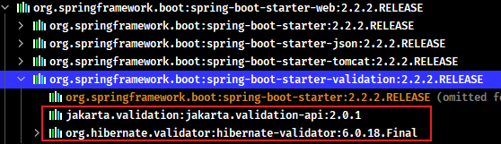
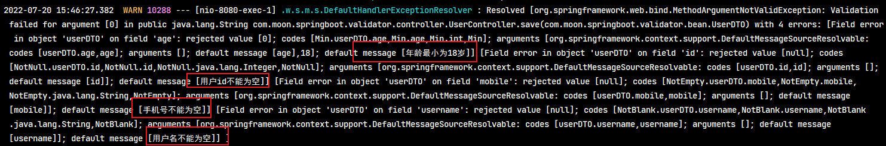
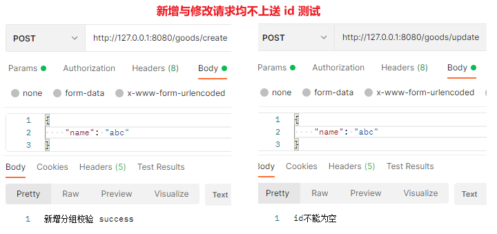
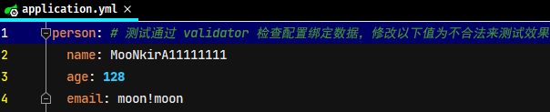
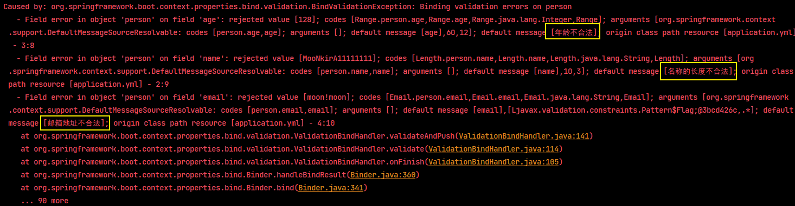
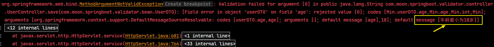

## 1. javax.validation 校验框架简介

JSR303 是一套 JavaBean 参数校验的标准，它定义了很多常用的校验注解，可以直接将这些注解加在 JavaBean 的属性上面(面向注解编程的时代)，就可以在需要校验的时候进行校验了。但是这只是一个接口，没有具体实现。

### 1.1. hibernate-validator 概述

早期的网站，用户输入一个邮箱地址，需要将邮箱地址发送到服务端，服务端进行校验，校验成功后，给前端一个响应。有了 JavaScript 后，校验工作可以放在前端去执行。但服务端仍需要进行数据校验，因为前端传来的数据不可信。前端很容易获取到后端的接口，如果有人直接调用接口，就可能会出现非法数据，所以服务端也要数据校验。总的来说：

- 前端校验：主要是提高用户体验
- 后端校验：主要是保证数据安全可靠

校验参数基本上是重复工作，冗余代码繁多，也影响代码的可读性。Hibernate Validator 框架实现以优雅的方式实现参数的校验，让业务代码和校验逻辑分开，不再编写重复的校验逻辑。Hibernate Validator 是一个 hibernate 独立的包，可以直接引用，它实现了 validation bean 同时有做了扩展，比较强大。在 Spring Boot 中已经包含在其依赖管理中，在其他项目中可以引用依赖不需要指定版本号，但也可以自行调整版本

hibernate-validator 优势：

- 验证逻辑与业务逻辑之间进行了分离，降低了程序耦合度
- 统一且规范的验证方式，无需重复编写的验证代码

### 1.2. maven 依赖坐标

```xml
<!-- 导入JSR303规范（可选） -->
<dependency>
    <groupId>javax.validation</groupId>
    <artifactId>validation-api</artifactId>
    <version>xx.xx.xx</version>
</dependency>
<!-- hibernate validator -->
<dependency>
    <groupId>org.hibernate.validator</groupId>
    <artifactId>hibernate-validator</artifactId>
    <version>6.2.0.Final</version>
</dependency>
```

> 注：以上两个依赖已经包含在 Spring Boot 的进行了依赖管理

<font color=violet>**扩展小细节：在 Spring Boot 2.2.x 版本以前，spring-boot-starter-web 依赖已经包含了 hibernate-validator，可以无需再次导入。但 2.3.x 版本后，已经将 hibernate-validator 从 spring-boot-starter-web 的依赖中移除**</font>

```xml
<parent>
    <groupId>org.springframework.boot</groupId>
    <artifactId>spring-boot-starter-parent</artifactId>
    <version>2.2.2.RELEASE</version>
    <relativePath/>
</parent>

<dependencies>
    <!-- spring-boot-starter-web中已经依赖了hibernate-validator -->
    <dependency>
        <groupId>org.springframework.boot</groupId>
        <artifactId>spring-boot-starter-web</artifactId>
    </dependency> 
	<!-- <dependency>
        <groupId>org.hibernate</groupId>
        <artifactId>hibernate-validator</artifactId>
        <version>6.0.18.Final</version>
    </dependency> -->
</dependencies>
```



## 2. javax.validation 常用注解

hibernate-validator 提供的校验方式为在类的属性上加入相应的注解来达到校验的目的。hibernate-validator 常用的校验注解如下：

### 2.1. 空检查

- `@Null`：验证对象是否为 null
- `@NotNull`：验证对象是否不为 null，但可以为 empty，即无法查检长度为 0 的字符串（如：`""`,`" "`,`" "`）
- `@NotBlank`：检查约束字符串是不是 Null，并且调用 `trim()` 方法后的长度是否大于 0，且会去掉前后空格，即必须有实际字符（*只能作用在 String 上*）
- `@NotEmpty`：检查约束元素是否为 NULL 或者是 EMPTY 长度必须大于 0 (如：`" "`)

### 2.2. Booelan检查

- `@AssertTrue`：验证 Boolean 对象是否为 true
- `@AssertFalse`：验证 Boolean 对象是否为 false

### 2.3. 长度检查

- `@Size(min=, max=)`：验证对象（Array, Collection, Map, String）长度是否在给定的范围之内
- `@Length(min=, max=)`：验证字符串的长度是否在给定的范围之内，包含两端（*Hibernate validator扩展注解*）

### 2.4. 日期检查

- `@Past`：验证 Date 和 Calendar 对象是否在当前时间之前
- `@Future`：验证 Date 和 Calendar 对象是否在当前时间之后

### 2.5. 数值检查

- `@Min`：验证 `Number` 和 `String` 对象是否大等于指定的值
- `@Max`：验证 `Number` 和 `String` 对象是否小等于指定的值
- `@DecimalMax`：被标注的值必须不大于约束中指定的最大值。这个约束的参数是一个通过 `BigDecimal` 定义的最大值的字符串表示，小数存在精度
- `@DecimalMin`：被标注的值必须不小于约束中指定的最小值。这个约束的参数是一个通过 `BigDecimal` 定义的最小值的字符串表示，小数存在精度
- `@Digits`：验证 `Number` 和 `String` 的构成是否合法
- `@Digits(integer=,fraction=)`：验证字符串是否是符合指定格式的数字，interger 指定整数精度，fraction 指定小数精度
- `@Range(min=, max=)`：检查注释值是否位于（含）指定的最小值和最大值之间（Hibernate validator 扩展注解）

> Notes: <font color=red>**建议使用在 Stirng, Integer 类型，不建议使用在 int 类型上，因为表单值为`""`时无法转换为 int，但可以转换为 Stirng 为`""`，Integer 为 null**</font>

```java
@Range(min=10000, max=50000, message="range.bean.wage")
private BigDecimal wage;
```

### 2.6. 其他类型检查

- `@Valid`：是 Bean Validation 所定义，可以添加在普通方法、构造方法、方法参数、方法返回、成员变量上，递归的对关联对象进行校验，如果关联对象是个集合或者数组，那么对其中的元素进行递归校验；如果是一个 map，则对其中的值部分进行校验。(是否进行递归验证)
- `@Validated`：是 Spring Validation 所定义，可以添加在类、方法参数、普通方法上，表示它们需要进行约束校验。

> Notes: `@Valid` 和 `@Validated` 两者的区别在于，`@Validated` 有 `value` 属性，支持分组校验，即根据不同的分组采用不同的校验机制；`@Valid` 可以添加在成员变量上，支持嵌套校验。所以建议的使用方式是：启动校验（即 Controller 层）时使用 `@Validated` 注解，嵌套校验时使用 `@Valid` 注解，这样就能同时使用分组校验和嵌套校验功能。

- `@CreditCardNumber`：信用卡验证
- `@Email`：验证是否是邮件地址，如果为 null，不进行验证，算通过验证。（Hibernate validator 扩展注解）
- `@ScriptAssert(lang=, script=, alias=)` 
- `@URL(protocol=, host=, port=, regexp=, flags=)`：检查是否是一个有效的 URL，如果提供了 protocol，host 等，则该 URL 还需满足提供的条件
- `@Pattern(regex=)`：验证 String 对象是否符合正则表达式的规则

## 3. 普通参数校验

> 以下示例使用 Spring Boot 2.5.x 的快速框架实现，选用了 hibernate-validator 为 javax.validation 具体实现

创建 maven 工程，修改项目 pom.xml 配置文件引入 hibernate-validator 的依赖

```xml
<parent>
    <groupId>org.springframework.boot</groupId>
    <artifactId>spring-boot-starter-parent</artifactId>
    <version>2.5.8</version>
    <relativePath/> <!-- lookup parent from repository -->
</parent>

<dependencies>
    <dependency>
        <groupId>org.springframework.boot</groupId>
        <artifactId>spring-boot-starter-web</artifactId>
    </dependency>

    <dependency>
        <groupId>org.springframework.boot</groupId>
        <artifactId>spring-boot-starter-test</artifactId>
        <scope>test</scope>
    </dependency>

    <dependency>
        <groupId>org.springframework.boot</groupId>
        <artifactId>spring-boot-configuration-processor</artifactId>
    </dependency>

    <!--
        注：在 Spring Boot 2.3.x 版本后，
        hibernate-validator 已经从 spring-boot-starter-web 的依赖中移除，
        所有需要手动添加其依赖
    -->
    <!-- 导入JSR303规范(可选) -->
    <!--<dependency>
        <groupId>javax.validation</groupId>
        <artifactId>validation-api</artifactId>
    </dependency>-->
    <!-- 使用hibernate框架提供的校验器做实现类 -->
    <dependency>
        <groupId>org.hibernate.validator</groupId>
        <artifactId>hibernate-validator</artifactId>
    </dependency>

    <dependency>
        <groupId>org.projectlombok</groupId>
        <artifactId>lombok</artifactId>
    </dependency>
</dependencies>
```

创建请求控制器，普通参数校验只需要在校验的方法形参前，标识相应的校验注解即可，并且在类上标识 `@Validated` 注解来开启 hibernate-validator 校验

```java
@RestController
@RequestMapping("/user")
@Validated  // 在当前类中开启 hibernate-validator 校验，类中所有标识了校验注解方法都都会进行校验
public class UserController {
    /**
     * 简单类型的校验
     */
    @RequestMapping("/delete")
    public String delete(@NotNull(message = "用户id不能为空") Integer id) {
        System.out.println("delete...");
        return "delete success";
    }
}
```

## 4. @Validated 校验对象类型参数

1. 创建请求接收实体类，在需要校验的属性上标识相应的校验注解

```java
package com.moon.springboot.validator.bean;

import lombok.Data;
import org.hibernate.validator.constraints.Length;

import javax.validation.constraints.Email;
import javax.validation.constraints.Future;
import javax.validation.constraints.Max;
import javax.validation.constraints.Min;
import javax.validation.constraints.NotBlank;
import javax.validation.constraints.NotEmpty;
import javax.validation.constraints.NotNull;
import javax.validation.constraints.Pattern;
import java.io.Serializable;
import java.util.Date;

/**
 * 用户传输实体
 */
@Data
public class UserDTO implements Serializable {

    private static final long serialVersionUID = -3440487180915805408L;

    /**
     * 用户ID
     */
    @NotNull(message = "用户id不能为空")
    private Integer id;

    /**
     * 用户名
     */
    @NotBlank(message = "用户名不能为空")
    @Length(message = "用户名不能超过20个字符", max = 20)
    @Pattern(regexp = "^[\\u4E00-\\u9FA5A-Za-z0-9\\*]*$", message = "用户昵称限制：最多20字符，包含文字、字母和数字")
    private String username;

    /**
     * 年龄
     */
    @Min(message = "年龄最小为18岁", value = 18)
    @Max(message = "年龄最大为80岁", value = 80)
    private int age;

    /**
     * 邮箱
     */
    @Email(message = "请输入正确的邮箱")
    // 或者使用正则表达式的方式校验
    // @Pattern(regexp = "[a-zA-Z0-9_-]+@[a-zA-Z0-9_-]+(\\.[a-zA-Z0-9_-]+)+$",
    //         message = "邮箱格式不正确")
    private String email;

    /**
     * 手机号
     */
    @NotEmpty(message = "手机号不能为空")
    @Pattern(regexp = "^[1][3,4,5,6,7,8,9][0-9]{9}$", message = "手机号格式有误")
    private String mobile;

    /**
     * 性别（无校验）
     */
    private String sex;

    /**
     * 创建时间
     */
    @Future(message = "时间必须是将来时间")
    private Date createTime;
}
```

2. 在控制层类相关的方法中，`@Validated` 注解声明要检查的方法入参（参数为自定义VO，DTO类），可以不用在类上标识 `@Validated` 注解来开启 hibernate-validator 校验，代表当前类中只有形参标识 `@Validated` 注解的方法进行校验

```java
@RestController
@RequestMapping("/user")
public class UserController {
    /**
     * 对象属性校验
     */
    @PostMapping("/save")
    public String save(@RequestBody @Validated UserDTO user) {
        System.out.println("save...");
        return "save success";
    }
}
```

3. 测试



## 5. 全局处理校验异常

当校验校验出现异常时，浏览器页面直接报错，对于用户而言十分不友好。因此可以创建全局异常处理类，来统一处理 hibernate-validator 的校验异常。以下是简单的实现：

```java
package com.moon.springboot.validator.handler;

import org.springframework.stereotype.Controller;
import org.springframework.validation.BindException;
import org.springframework.web.bind.annotation.ExceptionHandler;
import org.springframework.web.bind.annotation.RestController;
import org.springframework.web.bind.annotation.RestControllerAdvice;

import javax.servlet.http.HttpServletRequest;
import javax.validation.ConstraintViolation;
import javax.validation.ConstraintViolationException;
import java.util.Set;

// 此示例只处理 @RestController 与 @Controller 注解标识的控制类
@RestControllerAdvice(annotations = {RestController.class, Controller.class})
public class GlobalExceptionHandler {

    @ExceptionHandler({ConstraintViolationException.class, BindException.class})
    public String validateException(Exception ex, HttpServletRequest request) {
        ex.printStackTrace(); // 简单输出异常信息
        String msg = null;
        if (ex instanceof ConstraintViolationException) {
            ConstraintViolationException constraintViolationException = (ConstraintViolationException) ex;
            Set<ConstraintViolation<?>> violations = constraintViolationException.getConstraintViolations();
            ConstraintViolation<?> next = violations.iterator().next();
            msg = next.getMessage();
        } else if (ex instanceof BindException) {
            BindException bindException = (BindException) ex;
            msg = bindException.getBindingResult().getFieldError().getDefaultMessage();
        }
        return msg;
    }
}
```

个人项目的全局异常处理类示例：

```java
package com.moon.system.common.core.exception;

import com.moon.system.common.core.model.response.CommonCode;
import com.moon.system.common.core.model.response.R;
import com.moon.system.common.core.model.response.ResultCode;
import com.moon.system.common.core.model.response.ResultResponse;
import org.slf4j.Logger;
import org.slf4j.LoggerFactory;
import org.springframework.web.bind.MethodArgumentNotValidException;
import org.springframework.web.bind.annotation.ExceptionHandler;
import org.springframework.web.bind.annotation.RestControllerAdvice;

import javax.validation.ValidationException;

/**
 * 统一异常处理捕获类
 */
// @ControllerAdvice // 控制器增强，在spring 3.2中新增的注解
// 如果类中所有方法都返回json格式。可以使用@RestControllerAdvice注解，是@ControllerAdvice与@ResponseBody的组合体
@RestControllerAdvice
public class GlobalExceptionHandler {

    /* 日志对象 */
    private static final Logger LOGGER = LoggerFactory.getLogger(GlobalExceptionHandler.class);

    /**
     * 捕获 ServiceException 此类异常，进行统一处理
     *
     * @param businessException 自定义 businessException 异常对象
     * @return ResultResponse
     */
    @ExceptionHandler(BusinessException.class)
    public R handleCustomException(BusinessException businessException) {
        // 记录错误日志
        LOGGER.error("catch BusinessException:[{}]", businessException.getMessage());

        // 获取捕获的自定义异常信息，创建返回对象
        ResultCode resultCode = businessException.getResultCode();
        return R.fail(resultCode);
    }

    /**
     * 方法参数校验
     *
     * @param e MethodArgumentNotValidException对象
     * @return ResultResponse
     */
    @ExceptionHandler(MethodArgumentNotValidException.class)
    public R handleMethodArgumentNotValidException(MethodArgumentNotValidException e) {
        // 记录错误日志
        LOGGER.error("catch MethodArgumentNotValidException:[{}]", e.getMessage());

        return R.fail(e.getBindingResult().getFieldError().getDefaultMessage());
    }

    /**
     * Validation校验
     *
     * @param e ValidationException对象
     * @return ResultResponse
     */
    @ExceptionHandler(ValidationException.class)
    public R handleValidationException(ValidationException e) {
        // 记录错误日志
        LOGGER.error("catch ValidationException:[{}]", e.getMessage());

        return R.fail(e.getCause().getMessage());
    }

    /**
     * 捕获系统异常（未知异常），进行统一处理
     *
     * @param exception Exception对象
     * @return ResultResponse
     */
    @ExceptionHandler(Exception.class)
    public R handleException(Exception exception) {
        // 记录错误日志
        LOGGER.error("catch exception:[{}]", exception.getMessage());

        // 暂时统一处理返回“系统繁忙”的错误信息
        return R.fail(CommonCode.SERVER_ERROR);
    }
}
```

## 6. 自定义参数校验注解

1. 示例：自定义身份证校验注解。这个注解是作用在 Field 字段上，运行时生效，触发的是 `IdentityCardNumber` 这个验证类。
    - message 定制化的提示信息，主要是从ValidationMessages.properties里提取，也可以依据实际情况进行定制
    - groups 这里主要进行将validator进行分类，不同的类group中会执行不同的validator操作
    - payload 主要是针对bean的，使用不多

> 注：在 ValidationMessages.properties 就是校验的 message，有着已经写好的默认的 message，且是支持 i18n 的，以阅读源码分析

```java
package com.moon.springboot.validator.annotation;

import com.moon.springboot.validator.handler.IdentityCardNumberValidator;

import javax.validation.Constraint;
import javax.validation.Payload;
import java.lang.annotation.Documented;
import java.lang.annotation.ElementType;
import java.lang.annotation.Retention;
import java.lang.annotation.RetentionPolicy;
import java.lang.annotation.Target;

/**
 * 自定义参数校验注解 - 自定义身份证校验
 */
@Documented
@Target({ElementType.PARAMETER, ElementType.FIELD})
@Retention(RetentionPolicy.RUNTIME)
@Constraint(validatedBy = IdentityCardNumberValidator.class)
public @interface IdCard {

    String message() default "身份证号码不合法";

    Class<?>[] groups() default {};

    Class<? extends Payload>[] payload() default {};
}
```

2. 自定义 `Validator` 类，实现 `javax.validation.ConstraintValidator` 接口，在 `isValid` 方法中编写校验处理逻辑

```java
package com.moon.springboot.validator.handler;

import com.moon.springboot.validator.annotation.IdCard;

import javax.validation.ConstraintValidator;
import javax.validation.ConstraintValidatorContext;

/**
 * 自定义 Validator 类，此类是对自定义校验注解进行验证的逻辑代码
 */
public class IdentityCardNumberValidator implements ConstraintValidator<IdCard, Object> {

    @Override
    public void initialize(IdCard constraintAnnotation) {
        ConstraintValidator.super.initialize(constraintAnnotation);
    }

    /**
     * 校验的核心逻辑
     *
     * @param value
     * @param context
     * @return
     */
    @Override
    public boolean isValid(Object value, ConstraintValidatorContext context) {
        // 示例做简单实现，只能是6个0
        return "000000".equals(value);
    }
}
```

3. 在请求方法使用自定义的校验注解，或者在对象类型字段上使用。

```java
@RestController
@RequestMapping("/user")
@Validated  // 在当前类中开启 hibernate-validator 校验，类中所有标识了校验注解方法都都会进行校验
public class UserController {
    /**
     * 自定义注解校验
     */
    @RequestMapping("/check")
    public String check(@IdCard(message = "身份证信息有误,请核对后提交") String id) {
        System.out.println("自定义注解校验...");
        return "自定义注解校验 success";
    }
}
```

> Notes: <font color=red>**如果直接在普通类型的方法形参上使用，需要在当前控制类上标识 `@Validated` 注解**</font>

## 7. groups 分组校验

VO（DTO）同一个对象一般都会复用，比如 `GoodsDTO` 在更新时候要校验 id 字段，在保存的时候不需要校验 id 字段，在两种情况下都要校验 name 字段，可以使用 `groups` 属性进行分组校验

1. 先定义 groups 的分组接口 `Create` 和 `Update`（接口名称自定），需要继承 `javax.validation.groups.Default` 接口

```java
import javax.validation.groups.Default;

public interface Create extends Default {
}
```

```java
import javax.validation.groups.Default;

public interface Update extends Default {
}
```

2. 在 DTO 中的字段上定义好 `groups = {}` 的分组类型

```java
@Data
public class GoodsDTO implements Serializable {
    private static final long serialVersionUID = -7820546042872815419L;

    @NotNull(message = "id不能为空", groups = Update.class)
    private Integer id;

    @NotBlank(message = "名称不能为空")
    @Length(message = "名称不能超过20个字符", max = 20, groups = {Create.class, Update.class})
    private String name;
}
```

3. 在需要校验的方法 `@Validated` 声明校验组

```java
@RestController
@RequestMapping("/goods")
public class GoodsController {

    /**
     * 新增分组校验
     */
    @PostMapping("/create")
    public String create(@RequestBody @Validated(Create.class) GoodsDTO goodsDTO) {
        System.out.println("新增分组校验...");
        return "新增分组校验 success";
    }

    /**
     * 更新分组校验
     */
    @PostMapping("/update")
    public String update(@RequestBody @Validated(Update.class) GoodsDTO goodsDTO) {
        System.out.println("更新分组校验...");
        return "更新分组校验 success";
    }
}
```

> Notes: 在创建分组接口时尽量继承 `javax.validation.groups.Default` 接口。否则，在声明 `@Validated(Update.class)` 的时候，就会出现在默认没添加`groups = {}`的校验组，有些标识了校验注解而不会去校验，这是因为默认的校验组是 `groups = {Default.class}`

4. 分别请求新增和修改接口，观察是否根据分组进行校验



## 8. 校验配置文件中设置项

在 Spring Boot 中进行属性绑定时可以通过松散绑定规则，书写一些配置项名称不统一与不规范。由于无法感知模型类中的数据类型，就会出现类型不匹配的问题，比如代码中需要 `int` 类型，配置中给了非法的数值，例如写一个"a"，这种数据肯定无法有效的绑定，还会引发错误。

SpringBoot 给出了强大的数据校验功能，可以有效的避免此类问题的发生。在 JAVAEE 的 JSR303 规范中给出了具体的数据校验标准，开发者可以根据自己的需要选择对应的校验框架，此处使用 Hibernate 提供的校验框架来作为实现进行数据校验

1. 开启校验框架(*参考前面章节，引入相关依赖*)
2. 编写 application.yml，添加测试使用的配置项，以下配置均为合法，测试时将值相应修改为不合法即可

```yml
person: # 测试通过 validator 检查配置绑定数据，修改以下值为不合法来测试效果
  name: MooNkirA
  age: 128
  email: moon@moon.com
```

3. 在需要开启校验功能的类上使用注解 `@Validated`，开启校验功能。并在具体的字段属性上设置校验规则（相关注解）

```java
@Data
@Configuration
@ConfigurationProperties("person")
@Validated // 开启对当前 bean的 属性注入校验
public class Person {

    // 设置具体的检验规则
    @NotBlank(message = "名称不能为空")
    @Length(min = 3, max = 10, message = "名称的长度不合法")
    private String name;
    @Range(min = 12, max = 60, message = "年龄不合法")
    private Integer age;
    @Email(message = "邮箱地址不合法")
    private String email;
}
```

4. 启动项目，进行测试。





## 9. 快速失败返回模式


通过控制台的输出日志可以看到，校验框架将多个标识了注解的属性都进行了数据校验（默认行为），但通常需要实现只要有一个属性校验失败就直接返回提示信息，后面的属性不再进行校验。具体实现如下：

1. 创建配置类 `ValidatorConfiguration`，指定校验时使用快速失败返回模式

```java
package com.moon.springboot.validator.config;

import org.hibernate.validator.HibernateValidator;
import org.springframework.context.annotation.Bean;
import org.springframework.validation.beanvalidation.MethodValidationPostProcessor;

import javax.validation.Validation;
import javax.validation.Validator;
import javax.validation.ValidatorFactory;

/**
 * 指定 hibernate-validator 校验时使用快速失败返回模式配置
 */
public class ValidatorConfiguration {

    @Bean
    public Validator validator() {
        ValidatorFactory validatorFactory = Validation.byProvider(HibernateValidator.class)
                .configure()
                // 快速失败返回模式。hibernate.validator.fail_fast 是固定写法
                .addProperty("hibernate.validator.fail_fast", "true")
                .buildValidatorFactory();
        return validatorFactory.getValidator();
    }

    /**
     * 开启快速返回。如果参数校验有异常，直接抛异常，不会进入到 controller，使用全局异常拦截进行拦截
     */
    @Bean
    public MethodValidationPostProcessor methodValidationPostProcessor() {
        MethodValidationPostProcessor postProcessor = new MethodValidationPostProcessor();
        /* 设置validator模式为快速失败返回 */
        postProcessor.setValidator(validator());
        return postProcessor;
    }
}
```

> Tips: 上面创建的类并不是配置类，快速失败返回模式并不会生效，为了以后灵活控制其功能是否开启，可以通过创建一个注解用于控制此是否加载此配置类，从而控制是否开启该模式

2. 创建 `@EnableFormValidator` 注解，用于设置是否快速失败返回模式

```java
@Target(ElementType.TYPE)
@Retention(RetentionPolicy.RUNTIME)
// 在启动类或者配置上标识此注解，就会导入快速失败返回模式的配置类 ValidatorConfiguration
// 从而实现自定是否需要开启此功能
@Import(ValidatorConfiguration.class)
public @interface EnableFormValidator {
}
```

3. 在启动类或者配置类上标识 `@EnableFormValidator` 注解，启动工程测试校验失败时是否快速返回结果

```java
@SpringBootApplication
@EnableFormValidator // 自定义是否快速返回校验结果开关
public class ValidatorApplication {
    public static void main(String[] args) {
        SpringApplication.run(ValidatorApplication.class, args);
    }
}
```

测试结果，只要校验一个参数失败就直接返回异常信息


