## 1. Spring Boot 源码构建

> 源码分析的笔记基于 spring-boot-2.2.2.RELEASE 版本
>
> 源码下载地址：https://github.com/spring-projects/spring-boot/releases

### 1.1. 方式1：maven 命令编译项目

1. 进入到下载的源码目录执行如下命令：

```bush
mvn -Dmaven.test.skip=true clean install
```

> `-Dmaven.test.skip=true` 在打包过程中会忽略testcase，不然编译过程漫长，而且可能会发生一些异常，初次编译的目的削减掉这一步，如果正常编译通过，后面可以对那测试案例做测试。

2. 如果出现报错找不到spring-javaformat插件 执行`mvn spring-javaformat:apply`命令即可。
3. 如果再出现错误，执行`mvn -Dmaven.test.failure.ignore=true -Dmaven.test.skip=true clean install`

### 1.2. 使用 mvnwrapper 编译项目

1. 进入到下载的源码目录执行命令：`mvnw clean install -DskipTests -Pfast`

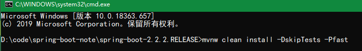

2. 如果出现报错找不到 spring-javaformat 插件 执行 `mvn spring-javaformat:apply` 命令即可。命令执行成功后，再次执行指令：`mvnw clean install -DskipTests -Pfast`

## 2. Spring Boot 自动配置原理分析

Spring Boot 框架是一个将整合框架的整合代码都写好了的框架。所以要知道它的工作原理才能够找到各种整合框架可以配置的属性，以及属性对应的属性名。

### 2.1. 准备阶段

Spring Boot 是一个可快速整合各种技术的框架，Spring Boot 会大量收录行业内相关技术的技术相关配置、技术初始化等信息，将其收集整理成一个依赖、配置、技术初始化的技术列表集合

### 2.2. spring-boot-dependencies 父工程依赖管理原理

创建 Spring Boot 项目，继承了 Spring Boot 的父工程 spring-boot-starter-parent 后，查看工程的依赖关系，父工程又依赖了 spring-boot-dependencies 模块，而此 spring-boot-denpendencies 模块中的 pom 文件，管理所有公共 Starter 与相关技术的依赖，并且通过 `<dependencyManagement>` 标签实现 jar 版本管理

因为继承父工程 spring-boot-starter-parent 后，可以根据需要，直接引用相应的 starter 即可，不需要配置版本号

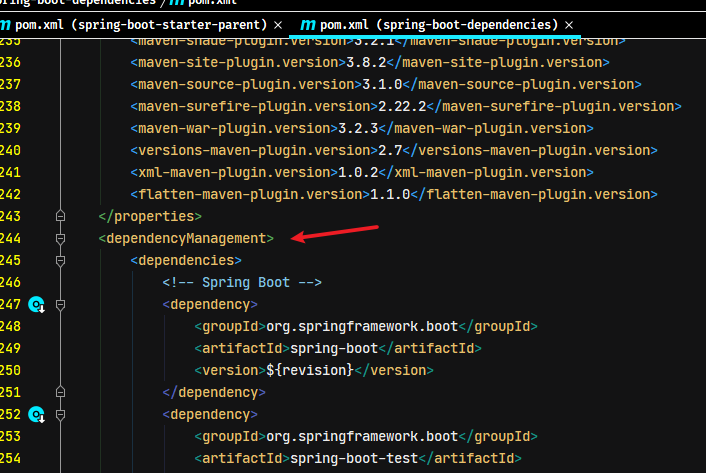

### 2.3. spring-boot-starters 工程

#### 2.3.1. starters 的原理

starters 是依赖关系的整理和封装，是一套依赖坐标的整合。只要导入相关的 starter 即可该功能及其相关必需的依赖

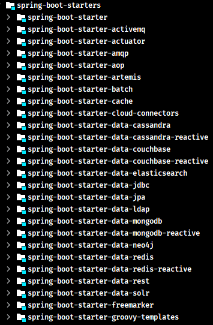

> 举例：进行 JPA or Web 开发，只需要导入 spring-boot-starter-data-jpa 或 spring-boot-starter-web 即可

每个 starter 包含了当前功能下的许多必备依赖坐标，这些依赖坐标是项目开发，上线和运行必须的。同时这些依赖也支持依赖传递。例如：spring-boot-starter-web 包含了所有 web 开发必须的依赖坐标

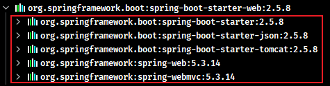

#### 2.3.2. 自定义 starter 的命名规范

- 官方的 starter 命名：`spring-boot-starter-*`
- 非官方的 starter 命名：`thirdpartyproject-spring-boot-starter`

官方提供的 starter 详见官方文档：https://docs.spring.io/spring-boot/docs/2.3.3.RELEASE/reference/html/using-spring-boot.html#using-boot-starter

### 2.4. 自动配置信息位置说明

每个 starter 都有相应自动配置处理在 spring-boot-autoconfigure 模块中，在此模块的 `src/main/resources/META-INF` 中定义了所有内置支持的技术框架及其相关的约定的默认配置：

- `additional-spring-configuration-metadata.json`：默认配置，Spring Boot 采用约定大于配置设计思想。
- `spring.factories`：定义了自动配置相关的处理类的映射关系。在项目启动的时候会将相关映射的处理类加载到 Spring 容器中


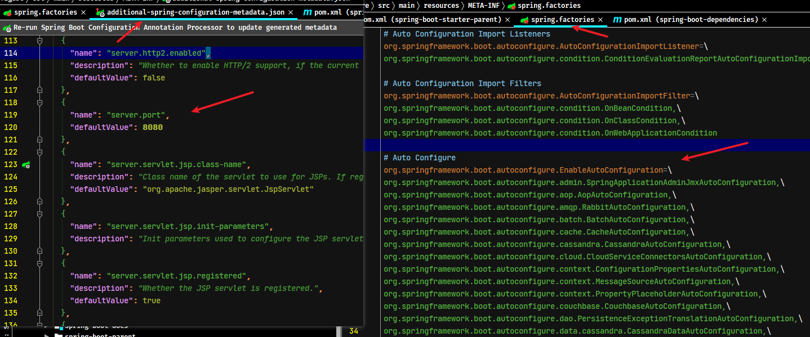

- 在 spring-boot-autoconfigure 模块中，所有支持的框架根据功能类型来划分包，每个包都有一个 `XxxAutoConfiguration` 配置类，都是一个基于纯注解的配置类，是各种框架整合的代码。如图所示：

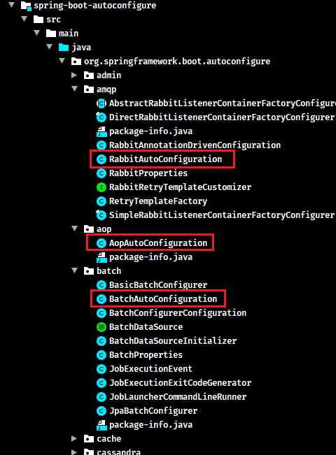

- 如果配置的框架有默认的配置参数，都放在一个命名为`XxxProperties`的属性类，通过 `@ConfigurationProperties` 注解将配置文件的属性值绑定到对应的 bean 上。如图所示：

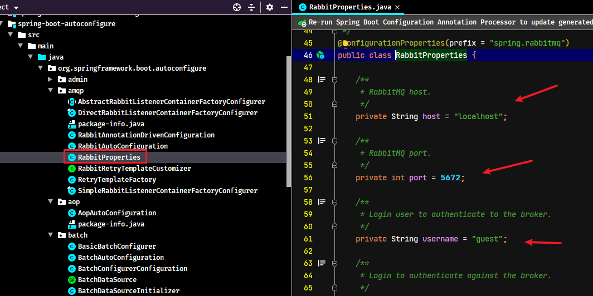

- 通过项目的 resources 下的 `application.properties` 或 `application.yml` 文件可以修改每个整合框架的默认属性，从而实现了快速整合的目的。

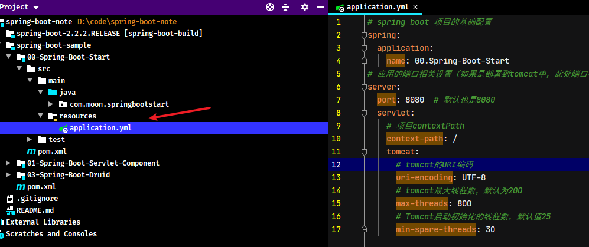

### 2.5. 自动配置流程分析

查看启动类注解 `@SpringBootApplication`，可以跟踪自动配置加载的实现步骤

#### 2.5.1. 自定义配置的注解

Spring Boot 启动注解 `@SpringBootApplication` 包含若干个注解，其中 `@SpringBootConfiguration` 与 `@ComponentScan` 均为 Spring 基础的注解，而实现自动配置的关键是 `@EnableAutoConfiguration` 注解

```java
@Target(ElementType.TYPE)
@Retention(RetentionPolicy.RUNTIME)
@Documented
@Inherited
@SpringBootConfiguration
@EnableAutoConfiguration
@ComponentScan(excludeFilters = { @Filter(type = FilterType.CUSTOM, classes = TypeExcludeFilter.class),
		@Filter(type = FilterType.CUSTOM, classes = AutoConfigurationExcludeFilter.class) })
public @interface SpringBootApplication {
    // ...
}
```

查看 `@EnableAutoConfiguration` 注解源码，分别包含了 `@AutoConfigurationPackage` 与 `@Import(AutoConfigurationImportSelector.class)`

```java
@Target(ElementType.TYPE)
@Retention(RetentionPolicy.RUNTIME)
@Documented
@Inherited
@AutoConfigurationPackage
@Import(AutoConfigurationImportSelector.class)
public @interface EnableAutoConfiguration {
    // ...
}
```

#### 2.5.2. @AutoConfigurationPackage 注解

在 `@AutoConfigurationPackage` 注解中，通过 `@Import` 注解导入 `AutoConfigurationPackages.Registrar` 的内部类

```java
@Target(ElementType.TYPE)
@Retention(RetentionPolicy.RUNTIME)
@Documented
@Inherited
@Import(AutoConfigurationPackages.Registrar.class)
public @interface AutoConfigurationPackage {
    // ...
}
```

`AutoConfigurationPackages.Registrar` 内部类，实现了 `ImportBeanDefinitionRegistrar` 接口，Spring 容器启动时会调用 `registerBeanDefinitions` 方法

```java
@Override
public void registerBeanDefinitions(AnnotationMetadata metadata, BeanDefinitionRegistry registry) {
	register(registry, new PackageImports(metadata).getPackageNames().toArray(new String[0]));
}
```

该方法会分别将当前 `@AutoConfigurationPackages` 所有位置的包及其子包、与其 `basePackages`、`basePackageClasses` 属性配置的都包路径，都注册到 Spring 的 `BeanDefinitionRegistry` 中进行包扫描

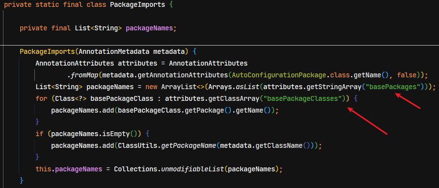

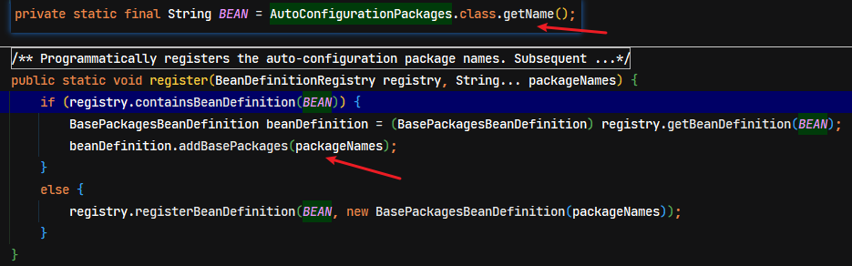

#### 2.5.3. AutoConfigurationImportSelector 类

在 `@EnableAutoConfiguration` 注解中，通过 `@Import` 注解引入自动配置处理类 `AutoConfigurationImportSelector`，该类实现了 `DeferredImportSelector` 接口，而 `DeferredImportSelector` 接口又继承了 `ImportSelector` 接口。Spring 容器初始化时会调用 `selectImports` 方法

```java
@Override
public String[] selectImports(AnnotationMetadata annotationMetadata) {
	if (!isEnabled(annotationMetadata)) {
		return NO_IMPORTS;
	}
	AutoConfigurationMetadata autoConfigurationMetadata = AutoConfigurationMetadataLoader
			.loadMetadata(this.beanClassLoader);
	// 此方法是主要处理逻辑，获取需要加载的bean全限定名集合
	AutoConfigurationEntry autoConfigurationEntry = getAutoConfigurationEntry(autoConfigurationMetadata,
			annotationMetadata);
	return StringUtils.toStringArray(autoConfigurationEntry.getConfigurations());
}
```

在 `getAutoConfigurationEntry` 方法中通过 `getCandidateConfigurations` 方法获取所有需要加载的 bean 全限定名集合

```java
protected AutoConfigurationEntry getAutoConfigurationEntry(AutoConfigurationMetadata autoConfigurationMetadata,
		AnnotationMetadata annotationMetadata) {
	if (!isEnabled(annotationMetadata)) {
		return EMPTY_ENTRY;
	}
	AnnotationAttributes attributes = getAttributes(annotationMetadata);
	// 通过 getCandidateConfigurations 方法获取所有需要加载的 bean 全限定名集合
	List<String> configurations = getCandidateConfigurations(annotationMetadata, attributes);
	// 去重处理
	configurations = removeDuplicates(configurations);
	// 获取不需要加载的 bean,这里我们可以通过 spring.autoconfigure.exclude 人为配置
	Set<String> exclusions = getExclusions(annotationMetadata, attributes);
	checkExcludedClasses(configurations, exclusions);
	configurations.removeAll(exclusions);
	configurations = filter(configurations, autoConfigurationMetadata);
	// 发送事件，通知所有的 AutoConfigurationImportListener 进行监听
	fireAutoConfigurationImportEvents(configurations, exclusions);
	return new AutoConfigurationEntry(configurations, exclusions);
}
```

跟踪源码可知，最终会读取资源目录中的 `META-INF/spring.factories` 文件，即前面所说的定义了自动配置相关的处理类的映射关系

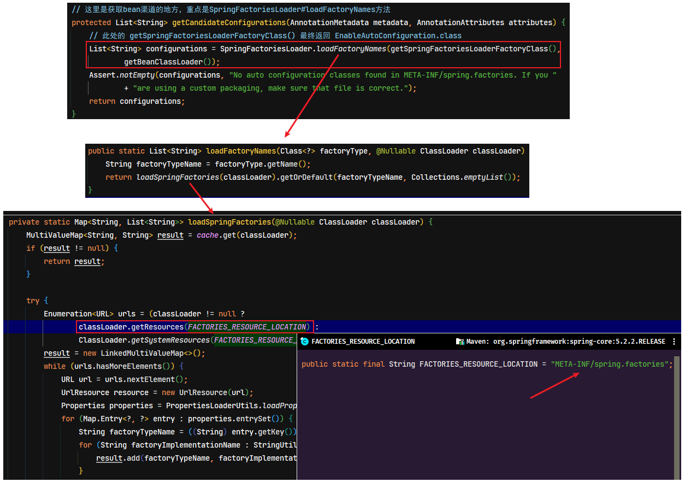

读取 `spring.factories` 文件，获取所有自动处理类全限定名，然而 Spring Boot 不会将所有处理类都实例化，每个配置类上都会有 `@ConditionalOn*` 的条件注解来控制 bean 的加载，下面以 `RedisAutoConfiguration` 为例：

```java
@Configuration(proxyBeanMethods = false)
@ConditionalOnClass(RedisOperations.class)
@EnableConfigurationProperties(RedisProperties.class)
@Import({ LettuceConnectionConfiguration.class, JedisConnectionConfiguration.class })
public class RedisAutoConfiguration {
    ...
}
```

当导入了 spring-boot-starter-data-redis 的依赖后，项目存在 `RedisOperations` 字节码文件后，此时才会实例化 `RedisAutoConfiguration` 类

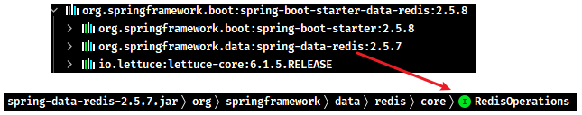

又比如内置 web 容器的处理类 `EmbeddedWebServerFactoryCustomizerAutoConfiguration`，类上引入 `@EnableConfigurationProperties({ServerProperties.class})` 注解，用于加载默认配置类的参数。然后内部类中通过 `@ConditionalOnClass` 注解来控制加载哪种类型的 web 容器；又比如 mybatis-spring-boot-starter，则会自动配置 SqlSessionFactory、SqlSessionTemplate、DataSource等 MyBatis 所需的组件

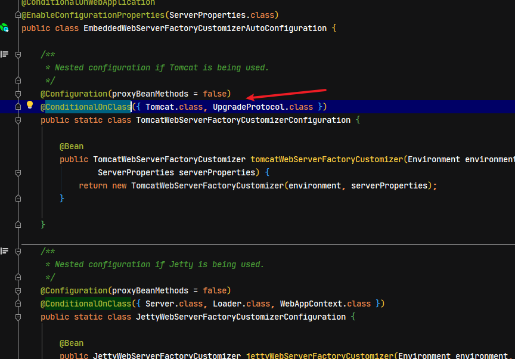

#### 2.5.4. 小结

自动配置类本质上就是一个配置类而已，只是用 META-INF/spring.factories 管理，与应用配置类解耦。Spring Boot 启动时先加载 spring.factories 文件中的 `org.springframework.boot.autoconfigure.EnableAutoConfiguration` 配置项，循环配置中每个自动配置类，然后根据定义在类上的 `@ConditionalOn*` 条件注解来决定哪些 bean 需要加载。

以 `@Enable**` 开头的注解本质是利用了 `@Import` 配合 `DeferredImportSelector` 实现导入，在 `selectImports` 方法的返回值即为要导入的配置类名。值得注意的是，`DeferredImportSelector` 接口的导入会在最后执行，其目的是为了让其它配置优先解析

对于正常加载成 bean 的类，通常会通过 `@EnableConfigurationProperties` 注解初始化对应的配置属性类并加载对应的配置。而配置属性类上通常会通过 `@ConfigurationProperties` 加载指定前缀的配置，并且这些配置通常都有默认值。

#### 2.5.5. Spring Boot 实现自动配置原理图解（网络资源）

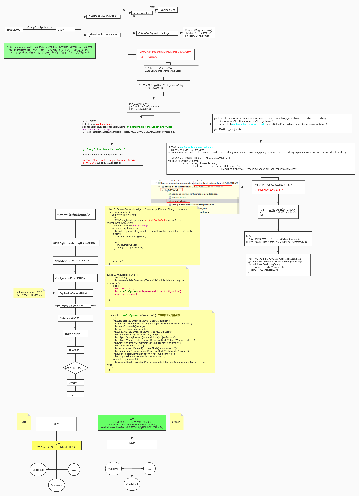

### 2.6. Spring Boot 常见的自动配置实现

> 以下常见的自动配置类选自 spring-boot-autoconfigure-x.x.x.jar!\META-INF\spring.factories 文件中

#### 2.6.1. AopAutoConfiguration

Spring Boot 是利用了自动配置类来简化了 aop 相关配置。AOP 自动配置类为 `org.springframework.boot.autoconfigure.aop.AopAutoConfiguration`。但可以通过 `spring.aop.auto=false` 配置，禁用 aop 自动配置

```java
@Configuration(proxyBeanMethods = false)
@ConditionalOnProperty(prefix = "spring.aop", name = "auto", havingValue = "true", matchIfMissing = true)
public class AopAutoConfiguration {

	@Configuration(proxyBeanMethods = false)
	@ConditionalOnClass(Advice.class)
	static class AspectJAutoProxyingConfiguration {

		@Configuration(proxyBeanMethods = false)
		@EnableAspectJAutoProxy(proxyTargetClass = false)
		@ConditionalOnProperty(prefix = "spring.aop", name = "proxy-target-class", havingValue = "false")
		static class JdkDynamicAutoProxyConfiguration {
		}

		@Configuration(proxyBeanMethods = false)
		@EnableAspectJAutoProxy(proxyTargetClass = true)
		@ConditionalOnProperty(prefix = "spring.aop", name = "proxy-target-class", havingValue = "true",
				matchIfMissing = true)
		static class CglibAutoProxyConfiguration {
		}
	}

	@Configuration(proxyBeanMethods = false)
	@ConditionalOnMissingClass("org.aspectj.weaver.Advice")
	@ConditionalOnProperty(prefix = "spring.aop", name = "proxy-target-class", havingValue = "true",
			matchIfMissing = true)
	static class ClassProxyingConfiguration {

		@Bean
		static BeanFactoryPostProcessor forceAutoProxyCreatorToUseClassProxying() {
			return (beanFactory) -> {
				if (beanFactory instanceof BeanDefinitionRegistry) {
					BeanDefinitionRegistry registry = (BeanDefinitionRegistry) beanFactory;
					AopConfigUtils.registerAutoProxyCreatorIfNecessary(registry);
					AopConfigUtils.forceAutoProxyCreatorToUseClassProxying(registry);
				}
			};
		}
	}
}
```

AOP 自动配置的本质是通过 `@EnableAspectJAutoProxy` 来开启了自动代理，如果在引导类上添加了 `@EnableAspectJAutoProxy` 注解，则使用者添加的为准。

```java
@Target(ElementType.TYPE)
@Retention(RetentionPolicy.RUNTIME)
@Documented
@Import(AspectJAutoProxyRegistrar.class)
public @interface EnableAspectJAutoProxy {
    // ...
}
```

该注解的本质是向容器中添加了 `AnnotationAwareAspectJAutoProxyCreator` 这个 bean 后置处理器，它能够找到容器中所有切面，并为匹配切点的目标类创建代理，创建代理的工作一般是在 bean 的初始化阶段完成的

```java
class AspectJAutoProxyRegistrar implements ImportBeanDefinitionRegistrar {

	/**
	 * Register, escalate, and configure the AspectJ auto proxy creator based on the value
	 * of the @{@link EnableAspectJAutoProxy#proxyTargetClass()} attribute on the importing
	 * {@code @Configuration} class.
	 */
	@Override
	public void registerBeanDefinitions(
			AnnotationMetadata importingClassMetadata, BeanDefinitionRegistry registry) {

		AopConfigUtils.registerAspectJAnnotationAutoProxyCreatorIfNecessary(registry);

		AnnotationAttributes enableAspectJAutoProxy =
				AnnotationConfigUtils.attributesFor(importingClassMetadata, EnableAspectJAutoProxy.class);
		if (enableAspectJAutoProxy != null) {
			if (enableAspectJAutoProxy.getBoolean("proxyTargetClass")) {
				AopConfigUtils.forceAutoProxyCreatorToUseClassProxying(registry);
			}
			if (enableAspectJAutoProxy.getBoolean("exposeProxy")) {
				AopConfigUtils.forceAutoProxyCreatorToExposeProxy(registry);
			}
		}
	}
}
```

```java
public abstract class AopConfigUtils {  
    // ...
    @Nullable
    public static BeanDefinition registerAspectJAnnotationAutoProxyCreatorIfNecessary(BeanDefinitionRegistry registry) {
	    return registerAspectJAnnotationAutoProxyCreatorIfNecessary(registry, null);
    }

    @Nullable
    public static BeanDefinition registerAspectJAnnotationAutoProxyCreatorIfNecessary(
		    BeanDefinitionRegistry registry, @Nullable Object source) {

	    return registerOrEscalateApcAsRequired(AnnotationAwareAspectJAutoProxyCreator.class, registry, source);
    }
    // ...
}
```

#### 2.6.2. DataSourceAutoConfiguration

对应的自动配置类为：`org.springframework.boot.autoconfigure.jdbc.DataSourceAutoConfiguration`。它内部采用了条件装配，通过检查容器的 bean，以及类路径下的 class，来决定该 `@Bean` 是否生效。简单说明一下，Spring Boot 支持两大类数据源：

- `EmbeddedDatabase`：内嵌数据库连接池
- `PooledDataSource`：非内嵌数据库连接池

而 `PooledDataSource` 又支持如下数据源

- hikari 提供的 `HikariDataSource`
- tomcat-jdbc 提供的 `DataSource`
- dbcp2 提供的 `BasicDataSource`
- oracle 提供的 `PoolDataSourceImpl`

如果知道数据源的实现类类型，即指定了 `spring.datasource.type`，理论上可以支持所有数据源，但这样做的一个最大问题是无法订制每种数据源的详细配置（如最大、最小连接数等）

```java
@Configuration(proxyBeanMethods = false)
@ConditionalOnClass({ DataSource.class, EmbeddedDatabaseType.class })
@ConditionalOnMissingBean(type = "io.r2dbc.spi.ConnectionFactory")
@EnableConfigurationProperties(DataSourceProperties.class)
@Import({ DataSourcePoolMetadataProvidersConfiguration.class,
		DataSourceInitializationConfiguration.InitializationSpecificCredentialsDataSourceInitializationConfiguration.class,
		DataSourceInitializationConfiguration.SharedCredentialsDataSourceInitializationConfiguration.class })
public class DataSourceAutoConfiguration {

	@Configuration(proxyBeanMethods = false)
	@Conditional(EmbeddedDatabaseCondition.class)
	@ConditionalOnMissingBean({ DataSource.class, XADataSource.class })
	@Import(EmbeddedDataSourceConfiguration.class)
	protected static class EmbeddedDatabaseConfiguration {
	}

	@Configuration(proxyBeanMethods = false)
	@Conditional(PooledDataSourceCondition.class)
	@ConditionalOnMissingBean({ DataSource.class, XADataSource.class })
	@Import({ DataSourceConfiguration.Hikari.class, DataSourceConfiguration.Tomcat.class,
			DataSourceConfiguration.Dbcp2.class, DataSourceConfiguration.OracleUcp.class,
			DataSourceConfiguration.Generic.class, DataSourceJmxConfiguration.class })
	protected static class PooledDataSourceConfiguration {
	}
	// ...
}
```

其中 `@EnableConfigurationProperties(DataSourceProperties.class)` 用于封装 `spring.datasource` 数据源相关的配置

#### 2.6.3. MybatisAutoConfiguration

MyBatis 自动配置类为 `org.mybatis.spring.boot.autoconfigure.MybatisAutoConfiguration`

```java
@Configuration
@ConditionalOnClass({ SqlSessionFactory.class, SqlSessionFactoryBean.class }) // 项目中存在此类文件才加载
@ConditionalOnSingleCandidate(DataSource.class) // 当项目只存在一个 DataSource 实例时加载
@EnableConfigurationProperties(MybatisProperties.class) // 封装 mybatis 前缀的配置
@AutoConfigureAfter({ DataSourceAutoConfiguration.class, MybatisLanguageDriverAutoConfiguration.class }) // 在
public class MybatisAutoConfiguration implements InitializingBean {
    // ...
}
```

它主要配置了两个 bean

- SqlSessionFactory：MyBatis 核心对象，用来创建 SqlSession
- SqlSessionTemplate：SqlSession 的实现，此实现会与当前线程绑定

- 用 `ImportBeanDefinitionRegistrar` 的方式扫描所有标注了 `@Mapper` 注解的接口
- 用 `AutoConfigurationPackages` 来确定扫描的包
- `MybatisProperties`，它会读取配置文件中带 `mybatis.` 前缀的配置项进行定制配置

`@MapperScan` 注解的作用与 `MybatisAutoConfiguration` 类似，会注册 `MapperScannerConfigurer` 有如下区别

- `@MapperScan` 扫描具体包（当然也可以配置关注哪个注解）
- `@MapperScan` 如果不指定扫描具体包，则会把引导类范围内，所有接口当做 Mapper 接口
- `MybatisAutoConfiguration` 关注的是所有标注 `@Mapper` 注解的接口，会忽略掉非 `@Mapper` 标注的接口

MyBatis 其实并非将接口交给 Spring 管理，而是每个接口会对应一个 `MapperFactoryBean`，是后者被 Spring 所管理，接口只是作为 `MapperFactoryBean` 的一个属性来配置

#### 2.6.4. TransactionAutoConfiguration

事务自动配置类有两个：

- `org.springframework.boot.autoconfigure.jdbc.DataSourceTransactionManagerAutoConfiguration`
- `org.springframework.boot.autoconfigure.transaction.TransactionAutoConfiguration`

`DataSourceTransactionManagerAutoConfiguration` 配置了 `DataSourceTransactionManager`，用来执行事务的提交、回滚操作

`TransactionAutoConfiguration` 功能上对标 `@EnableTransactionManagement`，包含以下三个 bean

- `BeanFactoryTransactionAttributeSourceAdvisor` 事务切面类，包含通知和切点
- `TransactionInterceptor` 事务通知类，由它在目标方法调用前后加入事务操作
- `AnnotationTransactionAttributeSource` 会解析 `@Transactional` 及事务属性，也包含了切点功能

> 注：如果使用者配置了 `DataSourceTransactionManager` 或是在引导类加了 `@EnableTransactionManagement`，则以自定义的配置为准

#### 2.6.5. ServletWebServerFactoryAutoConfiguration

用于提供 `ServletWebServerFactory`

#### 2.6.6. DispatcherServletAutoConfiguration

用于提供 `DispatcherServlet`、`DispatcherServletRegistrationBean`

#### 2.6.7. WebMvcAutoConfiguration

用于配置 `DispatcherServlet` 的各项组件，如：多项 `HandlerMapping`、多项 `HandlerAdapter`、`HandlerExceptionResolver`

#### 2.6.8. ErrorMvcAutoConfiguration

用于提供 `BasicErrorController`

#### 2.6.9. MultipartAutoConfiguration

提供了 `org.springframework.web.multipart.support.StandardServletMultipartResolver`，用来解析 `multipart/form-data` 格式的数据

#### 2.6.10. HttpEncodingAutoConfiguration

Spring Boot 已经提供了 `org.springframework.boot.web.servlet.filter.OrderedCharacterEncodingFilter`，对应配置项为 `server.servlet.encoding.charset=UTF-8`，默认就是 UTF-8，只影响非 json 格式的数据。当 POST 请求参数如果有中文，无需特殊设置

## 3. 条件装配实现原理

<font color=red>**条件装配的底层是本质上是 `@Conditional` 注解与 `Condition` 接口配合应用**</font>。

以下是实现原理的小示例，如果项目中引入 druid 依赖则加载指定的 bean，否则不加载。

- 编写条件判断类，实现 `Condition` 接口，在 `matches` 方法中指定条件判断逻辑

```java
public class MyCondition implements Condition { 
    // 如果存在 Druid 依赖，条件成立
    public boolean matches(ConditionContext context, AnnotatedTypeMetadata metadata) {
        return ClassUtils.isPresent("com.alibaba.druid.pool.DruidDataSource", null);
    }
}
```

- 在要导入的自动配置类上添加 `@Conditional(MyCondition.class)`，将来此类被导入时就会做条件检查

```java
@Configuration // 第三方的配置类
@Conditional(MyCondition.class) // 加入条件
static class AutoConfiguration {
    @Bean
    public Bean1 bean1() {
        return new Bean1();
    }
}
```

- 测试，项目加入 druid 依赖后，bean1 存在于容器；移除依赖后，bean2 不存在。

```xml
<dependency>
    <groupId>com.alibaba</groupId>
    <artifactId>druid</artifactId>
    <version>x.x.x</version>
</dependency>
```

## 4. SpringBoot 项目启动流程

### 4.1. SpringBoot 应用启动流程图


Spring Boot 的启动流程，本质就是运行一个 Spring 容器的环境。总体来说，就是先做容器的初始化，并将对应的 bean 实例初始化后放入容器。Spring Boot 初始化的参数根据参数的提供方，划分成如下3个大类，每个大类的参数又被封装了各种各样的对象，具体如下：

- 环境属性（Environment）
- 系统配置（spring.factories）
- 参数（Arguments、application.properties）

#### 4.1.1. 阶段一：SpringApplication 构造

SpringApplication 构造方法中会完成以下的操作：

1. 记录 `BeanDefinition` 源
2. 推断应用类型
3. 记录 `ApplicationContext` 初始化器
4. 记录监听器
5. 推断主启动类

#### 4.1.2. 阶段二：执行 run 方法

1. 得到 `SpringApplicationRunListeners` 事件发布器，发布 application starting 事件
2. 封装启动 args 参数
3. 准备 `Environment` 添加命令行参数，通过 `PropertySource<T>` 抽象类的实现 `SimpleCommandLinePropertySource` 进行解析
4. `ConfigurationPropertySources` 处理，发布 application environment 已准备事件
5. 通过 `EnvironmentPostProcessorApplicationListener` 进行 env 后处理，如读取 application.properties（由 `StandardConfigDataLocationResolver` 解析），spring.application.json 等文件
    - `ConfigurationPropertySources.attach(Environment environment)` 方法用于规范统一解析各种环境键名称格式
    - `EnvironmentPostProcessor` 后处理增强
    - 绑定 spring.main 文件前缀的 key-value 至 `SpringApplication` 对象
6. 打印 banner，由 `SpringApplicationBannerPrinter` 实现
7. 创建容器
8. 准备容器，发布 application context 已初始化事件
9. 加载 bean 定义，发布 application prepared 事件
10. refresh 容器，发布 application started 事件
11. 执行 runner，发布 application ready 事件，若发生异常，则发布 application failed 事件

### 4.2. ConfigurableApplicationContext 

添加 Spring Boot 最基础的依赖与编写最基础的入口，启动后用于源码的断点跟踪。

```xml
<parent>
	<groupId>org.springframework.boot</groupId>
	<artifactId>spring-boot-parent</artifactId>
	<version>2.2.2.RELEASE</version>
	<relativePath>../spring-boot-project/spring-boot-parent</relativePath>
</parent>

<dependencies>
	<dependency>
		<groupId>org.springframework.boot</groupId>
		<artifactId>spring-boot-starter</artifactId>
	</dependency>
</dependencies>
```

```java
@SpringBootApplication
public class TestApplication {
	public static void main(String[] args) {
		SpringApplication.run(TestApplication.class, args);
	}
}
```

启动 Spring Boot 项目，实现是执行 `SpringApplication.run` 的静态方法并返回 `ConfigurableApplicationContext` 实例

```java
public static ConfigurableApplicationContext run(Class<?>[] primarySources, String[] args) {
	return new SpringApplication(primarySources).run(args);
}
```

`ConfigurableApplicationContext` 接口类关系图

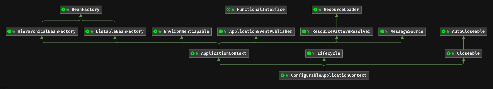

### 4.3. SpringApplication

Spring Boot 启动流程的首先是通过 `SpringApplication` 类的构造函数，创建其对象，并加载各种配置信息，初始化各种配置对象；

```java
public SpringApplication(Class<?>... primarySources) {
	this(null, primarySources);
}

@SuppressWarnings({ "unchecked", "rawtypes" })
public SpringApplication(ResourceLoader resourceLoader, Class<?>... primarySources) {
	// 初始化资源加载器
	this.resourceLoader = resourceLoader;
	// 断言主类不为空
	Assert.notNull(primarySources, "PrimarySources must not be null");
	// 初始化配置类的类名信息（由原来数组转换成 Set 集合）
	this.primarySources = new LinkedHashSet<>(Arrays.asList(primarySources));
	// 确认当前容器加载的类型
	this.webApplicationType = WebApplicationType.deduceFromClasspath();
	// getSpringFactoriesInstances 方法，用于读取资源目录 META-INF/spring.factories 文件
	// 获取 ApplicationContextInitializer 类型的实例
	setInitializers((Collection) getSpringFactoriesInstances(ApplicationContextInitializer.class));
	// 初始化监听器，对初始化过程及运行过程进行干预
	setListeners((Collection) getSpringFactoriesInstances(ApplicationListener.class));
	// 初始化了引导类类名信息，备用
	this.mainApplicationClass = deduceMainApplicationClass();
}
```

#### 4.3.1. WebApplicationType 加载容器的类型

`WebApplicationType` 枚举类，定义 Spring Boot 容器的类型

```java
public enum WebApplicationType {

	/**
	 * The application should not run as a web application and should not start an
	 * embedded web server.
	 */
	NONE,

	/**
	 * The application should run as a servlet-based web application and should start an
	 * embedded servlet web server.
	 */
	SERVLET,

	/**
	 * The application should run as a reactive web application and should start an
	 * embedded reactive web server.
	 */
	REACTIVE;
	...
}
```

其中 `WebApplicationType.deduceFromClasspath()` 静态方法用于判断当前容器加载的类型

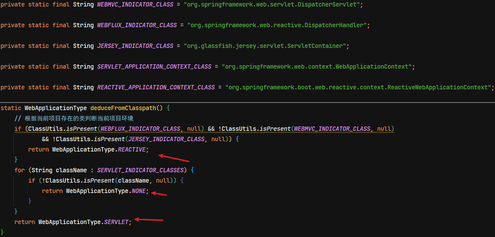

导入不同的 starter，判断不同的类型


#### 4.3.2. getSpringFactoriesInstances 方法

`getSpringFactoriesInstances` 是 `SpringApplication` 类的方法，在加载配置的过程中多次被调用

```java
private <T> Collection<T> getSpringFactoriesInstances(Class<T> type) {
	return getSpringFactoriesInstances(type, new Class<?>[] {});
}

private <T> Collection<T> getSpringFactoriesInstances(Class<T> type, Class<?>[] parameterTypes, Object... args) {
	// 获取类加载器
	ClassLoader classLoader = getClassLoader();
	// Use names and ensure unique to protect against duplicates
	// 根据类型，获取 spring.factories 文件中配置的相关实现类全限定名称集合
	Set<String> names = new LinkedHashSet<>(SpringFactoriesLoader.loadFactoryNames(type, classLoader));
	// 根据全限定名，实例化
	List<T> instances = createSpringFactoriesInstances(type, parameterTypes, classLoader, args, names);
	// 将实例化的对象排序
	AnnotationAwareOrderComparator.sort(instances);
	return instances;
}
```

`SpringFactoriesLoader.loadFactoryNames(type, classLoader)` 方法，读取资源目录中的 META-INF/spring.factories 文件。（前面自动配置原理分析章节中已经看过）

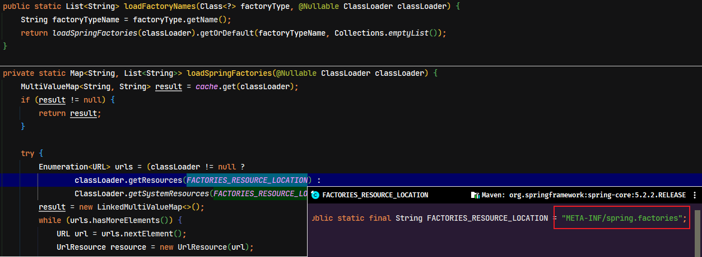

以传入的类型为 key，获取配置中相应的 value，即该类型的所有实现类全限定名称。

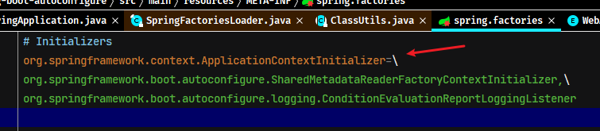

#### 4.3.3. 自定义监听器

从上面的源码可以看到，在创建 `SpringApplication` 对象中的 `setListeners((Collection) getSpringFactoriesInstances(ApplicationListener.class));` 这里会进行初始化监听器，同样是读取 spring.factories 文件中配置的实现，因此使用者可以自定义监听器的实现，并将监听器类全限名称配置到 spring.factories 文件中即可

- 创建自定义监听器，需要实现 `org.springframework.context.ApplicationListener` 接口

```java
public class CustomListener implements ApplicationListener<ApplicationStartingEvent> {
	/**
	 * Handle an application event.
	 *
	 * @param event the event to respond to
	 */
	@Override
	public void onApplicationEvent(ApplicationStartingEvent event) {
		System.out.println("自定义事件处理逻辑, source: " + event.getSource());
	}
}
```

- spring.factories 文件中配置监听器映射

```properties
org.springframework.context.ApplicationListener=com.moon.springboot.listener.CustomListener
```

加载到容器中

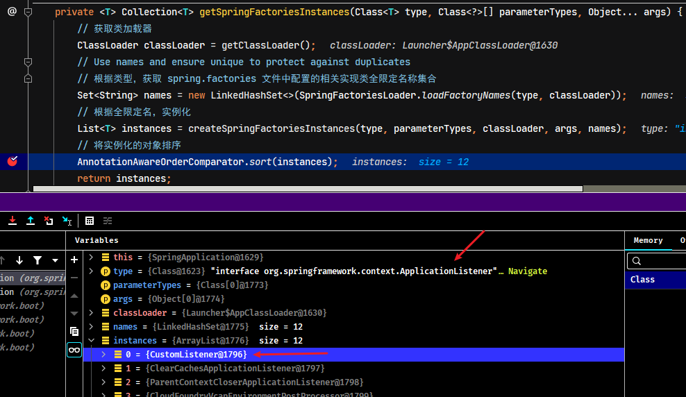

### 4.4. 打印 banner

Spring Boot 在控制台输出 banner 具体由 `SpringApplicationBannerPrinter` 实现

#### 4.4.1. 模拟实现示例

banner 的数据是从环境对象中读取，然后 `SpringApplicationBannerPrinter` 的 `print` 方法进行输出打印

```java
@Test
public void test() {
    ApplicationEnvironment env = new ApplicationEnvironment();
    SpringApplicationBannerPrinter printer = new SpringApplicationBannerPrinter(
            new DefaultResourceLoader(),
            new SpringBootBanner()
    );
    // 测试文字 banner
    // env.getPropertySources().addLast(new MapPropertySource("custom", Map.of("spring.banner.location","banner1.txt")));
    // 测试图片 banner
    env.getPropertySources().addLast(new MapPropertySource("custom", Map.of("spring.banner.image.location","banner2.png")));
    // 版本号的获取
    System.out.println(SpringBootVersion.getVersion());
    printer.print(env, Step7.class, System.out);
}
```

### 4.5. 初始化 Spring 容器

在 `SpringApplication` 对象创建并加载配置信息、初始化各种配置对象后，然后调用对象的 `run(String... args)` 方法，用于初始化容器，并得到 `ConfigurableApplicationContext` 对象，这也是核心部分

```java
public ConfigurableApplicationContext run(String... args) {
	// 设置计时器
	StopWatch stopWatch = new StopWatch();
	// 开始计时
	stopWatch.start();
	ConfigurableApplicationContext context = null;
	Collection<SpringBootExceptionReporter> exceptionReporters = new ArrayList<>();
	// 模拟输入输出信号，避免出现因缺少外设导致的信号传输失败，进而引发错误（模拟显示器，键盘，鼠标...）
	// 设置 java.awt.headless=true
	configureHeadlessProperty();
	// 获取当前注册的所有监听器
	SpringApplicationRunListeners listeners = getRunListeners(args);
	// 执行容器启动中事件的监听器，即调用 ApplicationListener 接口的 onApplicationEvent 方法
	listeners.starting();
	try {
		// 获取启动应用的参数
		ApplicationArguments applicationArguments = new DefaultApplicationArguments(args);
		// 将前期读取的数据加载成了一个环境对象 ConfigurableEnvironment，用来描述信息
		ConfigurableEnvironment environment = prepareEnvironment(listeners, applicationArguments);
		// 配置忽略的信息，暂不知道什么作用
		configureIgnoreBeanInfo(environment);
		// 初始化项目启动时的 logo
		Banner printedBanner = printBanner(environment);
		// 创建容器对象，根据前期配置的容器类型进行判定并创建
		context = createApplicationContext();
		// 读取 spring.factories 文件，获取 SpringBootExceptionReporter 类型的实例
		exceptionReporters = getSpringFactoriesInstances(SpringBootExceptionReporter.class,
				new Class[] { ConfigurableApplicationContext.class }, context);
		// 对容器进行设置，参数来源于前期的设定
		prepareContext(context, environment, listeners, applicationArguments, printedBanner);
		// 刷新容器环境
		refreshContext(context);
		// 刷新完毕后做后置处理
		afterRefresh(context, applicationArguments);
		// 计时结束
		stopWatch.stop();
		// 判定是否记录启动时间的日志
		if (this.logStartupInfo) {
			// 创建日志对应的对象，输出日志信息，包含启动时间
			new StartupInfoLogger(this.mainApplicationClass).logStarted(getApplicationLog(), stopWatch);
		}
		// 监听器执行了对应的操作步骤
		listeners.started(context);
		// 调用运行器
		callRunners(context, applicationArguments);
	}
	catch (Throwable ex) {
		handleRunFailure(context, ex, exceptionReporters, listeners);
		throw new IllegalStateException(ex);
	}

	try {
		// 执行容器运行中事件的监听器
		listeners.running(context);
	}
	catch (Throwable ex) {
		handleRunFailure(context, ex, exceptionReporters, null);
		throw new IllegalStateException(ex);
	}
	return context;
}
```

### 4.6. Spring Boot 监听机制

Spring Boot 启动过程由于存在着不同的处理过程阶段，如果设计接口就要设计十余个标准接口，这样对开发者不友好，同时整体过程管理分散，十余个过程在不同地方调用，管理难度大，过程过于松散。然后 Spring Boot 采用了监听器设计模式来解决此问题

#### 4.6.1. 内置监听器

Spring Boot 将自身的启动过程当成一个大的事件，该事件是由若干个小的事件组成的。例如：

- `org.springframework.boot.context.event.ApplicationStartingEvent`
  - 应用启动事件，在应用运行但未进行任何处理时，将发送 ApplicationStartingEvent
- `org.springframework.boot.context.event.ApplicationEnvironmentPreparedEvent`
  - 环境准备事件，当 Environment 被使用，且上下文创建之前，将发送 ApplicationEnvironmentPreparedEvent
- `org.springframework.boot.context.event.ApplicationContextInitializedEvent`
  - 上下文初始化事件
- `org.springframework.boot.context.event.ApplicationPreparedEvent`
  - 应用准备事件，在开始刷新之前，bean 定义被加载之后发送 ApplicationPreparedEvent
- `org.springframework.context.event.ContextRefreshedEvent`
  - 上下文刷新事件
- `org.springframework.boot.context.event.ApplicationStartedEvent`
  - 应用启动完成事件，在上下文刷新之后且所有的应用和命令行运行器被调用之前发送 ApplicationStartedEvent
- `org.springframework.boot.context.event.ApplicationReadyEvent`
  - 应用准备就绪事件，在应用程序和命令行运行器被调用之后，将发出 ApplicationReadyEvent，用于通知应用已经准备处理请求
- `org.springframework.context.event.ContextClosedEvent`
    - 上下文关闭事件，对应容器关闭

上述列出的仅仅是部分事件，当应用启动后走到某一个过程点时，监听器监听到某个事件触发，就会执行对应的事件。除了系统内置的事件处理，用户还可以根据需要自定义开发当前事件触发时要做的其他动作。

## 5. Spring Boot 内嵌 Tomcat 容器

### 5.1. Tomcat 基本结构

```
Server
└───Service
    ├───Connector (协议，端口)
    └───Engine
        └───Host(虚拟主机 localhost)
            ├───Context1 (应用1，可以设置虚拟路径，“/” 即 url 起始路径；项目磁盘路径，即 docBase )
            │   │   index.html
            │   └───WEB-INF
            │       │   web.xml (servlet, filter, listener) 3.0
            │       ├───classes (servlet, controller, service ...)
            │       ├───jsp
            │       └───lib (第三方 jar 包)
            └───Context2 (应用2)
                │   index.html
                └───WEB-INF
                        web.xml
```

### 5.2. 模拟内嵌 Tomcat 容器实现示例

#### 5.2.1. 创建基础 tomcat

- 引入相关依赖

```xml
<!-- tomcat 依赖 -->
<dependency>
    <groupId>org.springframework.boot</groupId>
    <artifactId>spring-boot-starter-tomcat</artifactId>
</dependency>
<!-- servlet 支持 (在 spring boot 中依赖管理) -->
<dependency>
    <groupId>javax.servlet</groupId>
    <artifactId>javax.servlet-api</artifactId>
</dependency>
```

- 创建测试使用的 Servlet

```java
public class HelloServlet extends HttpServlet {
    @Override
    protected void doGet(HttpServletRequest req, HttpServletResponse resp) throws ServletException, IOException {
        resp.setContentType("text/html;charset=utf-8");
        resp.getWriter().print("<h3>hello, servlet</h3>");
    }
}
```

- 创建内嵌 tomcat 核心代码

```java
public static void main(String[] args) throws LifecycleException, IOException {
    // 1.创建 Tomcat 对象
    Tomcat tomcat = new Tomcat();
    // 设置 tomcat 基础目录，用于保存一些必须的配置与临时文件
    tomcat.setBaseDir("tomcat");

    // 2.创建项目文件夹, 即 docBase 文件夹
    File docBase = Files.createTempDirectory("boot.").toFile();
    docBase.deleteOnExit(); // 在容器关闭时，删除文件夹

    /*
     * 3.创建 Tomcat 项目, 在 Tomcat 中称为 Context。
     *  public Context addContext(String contextPath, String docBase)
     *      contextPath 参数：上下文映射路径，空字符串（""）代表根上下文
     *      docBase 参数：上下文的基础目录，用于静态文件
     */
    Context context = tomcat.addContext("", docBase.getAbsolutePath());

    // 4.编程式添加 Servlet
    context.addServletContainerInitializer(new ServletContainerInitializer() {
        @Override
        public void onStartup(Set<Class<?>> c, ServletContext ctx) throws ServletException {
            ctx.addServlet("helloServlet", new HelloServlet()).addMapping("/hello");
        }
    }, Collections.emptySet());

    // 5.启动 Tomcat
    tomcat.start();

    // 6.创建连接器，使用 ProtocolHandler 的实现类 Http11Nio2Protocol
    Connector connector = new Connector(new Http11Nio2Protocol());
    // 设置监听端口
    connector.setPort(8080);
    tomcat.setConnector(connector);
}
```

#### 5.2.2. 集成 Spring 容器

- 添加 Spring MVC 相关依赖

```xml
<!-- Spring MVC 核心依赖 -->
<dependency>
    <groupId>org.springframework</groupId>
    <artifactId>spring-webmvc</artifactId>
</dependency>
<!-- spring boot 自动配置依赖，示例用于引入 DispatcherServletRegistrationBean 来注册 DispatcherServlet -->
<dependency>
    <groupId>org.springframework.boot</groupId>
    <artifactId>spring-boot-autoconfigure</artifactId>
</dependency>
<!-- json 对象转换需要的 jackson 的依赖（参考 spring-boot-starter-web 的依赖）-->
<dependency>
    <groupId>com.fasterxml.jackson.core</groupId>
    <artifactId>jackson-databind</artifactId>
</dependency>
```

- 创建测试的控制器

```java
@RestController
public class DemoController {
    @GetMapping("hello2")
    public Map<String, Object> hello() {
        Map<String, Object> map = new HashMap<>();
        map.put("hello2", "hello, spring!");
        return map;
    }
}
```

- 创建配置类

```java
@Configuration
@ComponentScan("com.moon.springboot.tomcat")
public class SpringConfig {

    @Bean
    public DispatcherServletRegistrationBean registrationBean(DispatcherServlet dispatcherServlet) {
        return new DispatcherServletRegistrationBean(dispatcherServlet, "/");
    }

    // 此例子中必须为 DispatcherServlet 提供 AnnotationConfigWebApplicationContext, 否则会选择 XmlWebApplicationContext 实现
    @Bean
    public DispatcherServlet dispatcherServlet(WebApplicationContext applicationContext) {
        return new DispatcherServlet(applicationContext);
    }

    @Bean
    public RequestMappingHandlerAdapter requestMappingHandlerAdapter() {
        RequestMappingHandlerAdapter handlerAdapter = new RequestMappingHandlerAdapter();
        handlerAdapter.setMessageConverters(Arrays.asList(new MappingJackson2HttpMessageConverter()));
        return handlerAdapter;
    }
}
```

- 创建 tomcat 关键代码改造

```java
public static void main(String[] args) throws LifecycleException, IOException {
    // ...

    // 创建基于注解的 Spring 容器 AnnotationConfigWebApplicationContext
    // 弃用 AnnotationConfigServletWebServerApplicationContext 是因为此容器自带内嵌的 web 容器
    AnnotationConfigWebApplicationContext springContext = new AnnotationConfigWebApplicationContext();
    springContext.register(SpringConfig.class);
    springContext.refresh(); // 手动刷新容器

    // 4.编程式添加 Servlet
    context.addServletContainerInitializer(new ServletContainerInitializer() {
        @Override
        public void onStartup(Set<Class<?>> c, ServletContext ctx) throws ServletException {
            ctx.addServlet("helloServlet", new HelloServlet()).addMapping("/hello");
            // 可以从 Spring 容器中获取到被管理的 DispatcherServlet，并注册
            // DispatcherServlet dispatcherServlet = springContext.getBean(DispatcherServlet.class);
            // ctx.addServlet("dispatcherServlet", dispatcherServlet).addMapping("/");

            // 上面是手动注册一个 DispatcherServlet，为了日后的方便扩展，可以从 Spring 容器中获取所有 ServletRegistrationBean 类型的实例
            // 调用其对象的 onStartup 方法，完成所有 DispatcherServlet 的注册
            for (ServletRegistrationBean registrationBean : springContext.getBeansOfType(ServletRegistrationBean.class).values()) {
                registrationBean.onStartup(ctx);
            }
        }
    }, Collections.emptySet());
    // ...
}
```
